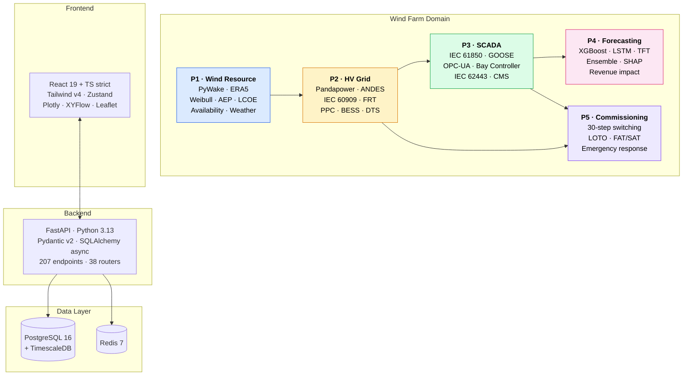

<div align="center">

```
       ·  .     ⌢⌢⌢⌢        .  ·    ⌢⌢⌢⌢⌢     ·         ⌢⌢⌢⌢     ·  ·
     ·       ⌢⌢⌢⌢⌢⌢⌢            ⌢⌢⌢⌢⌢⌢         ·      ⌢⌢⌢⌢⌢⌢⌢        ·
                                                                           ☼

                  │                        │                        │
                  │                        │                        │
                  │                        │                        │
                  ◉                        ◉                        ◉
                 ╱│╲                      ╱│╲                      ╱│╲
                ╱ │ ╲                    ╱ │ ╲                    ╱ │ ╲
               ╱  │  ╲                  ╱  │  ╲                  ╱  │  ╲
                  │                        │                        │
                  │                        │                        │
                  │                        │                        │
                  │                        │                        │
       ≈≈≈≈≈≈≈≈≈≈≈╨≈≈≈≈≈≈≈≈≈≈≈≈≈≈≈≈≈≈≈≈≈≈≈≈╨≈≈≈≈≈≈≈≈≈≈≈≈≈≈≈≈≈≈≈≈≈≈≈≈╨≈≈≈≈≈≈≈≈≈
          ~  ~  ~  ~   B A L T I C    S E A   ~  ~  ~  ~
```

# Baltic Wind HV Control Platform

### A flight simulator for offshore wind HV control engineers

**510 MW · 34 × Vestas V236-15.0 MW · 66 kV array · 220 kV export · PSE 400 kV grid**

[](https://github.com/polat-mustafa/baltic-wind-control-system/actions/workflows/ci.yml)
[](https://polat-mustafa.github.io/baltic-wind-control-system/)
[](LICENSE)
[]()
[]()
[]()
[]()

<br />


<br />

**[Live Docs](https://polat-mustafa.github.io/baltic-wind-control-system/)** · **[API Reference](#-api-overview)** · **[Architecture](#-architecture)** · **[Quick Start](#-quick-start)** · **[Roadmap](docs/Project_Roadmap.md)**

</div>

---

## Why this project exists

> Just as pilots train on simulators before climbing into a cockpit, this platform lets you practice every stage of an offshore wind farm — from wake physics to grid commissioning — in a safe, instrumented environment where mistakes are learning opportunities.

Poland's Baltic Sea is entering a generational construction wave: **Baltic Power (1.2 GW)**, **Bałtyk 2 & 3 (1.4 GW)**, and dozens more in the pipeline. These projects need engineers who understand both the **electrical systems** and the **software that operates them**. This platform builds exactly that skillset — production-grade, physics-grounded, and traceable to IEC, IEEE, and ENTSO-E standards on every line.

<table>
<tr>
<td valign="top" width="50%">

### Energy engineering you'll learn
- Wake physics, Weibull distributions, AEP cascades
- Power flow, short-circuit analysis, FRT
- IEC 61850 GOOSE, OPC-UA, bay controllers
- BESS, STATCOM, cable thermal rating
- IEC 62443 cybersecurity zones & conduits
- Switching programmes, LOTO, FAT/SAT
- Day-ahead market bidding & imbalance settlement

</td>
<td valign="top" width="50%">

### Software engineering you'll build
- Async FastAPI services, Pydantic v2 contracts
- React 19 + TypeScript strict, Tailwind v4
- Time-series at scale (TimescaleDB) + Redis
- ML pipelines: XGBoost, LSTM, TFT, SHAP
- Real-time visualisation: Plotly, XYFlow, Leaflet
- Docker Compose, GitHub Actions, MkDocs
- 140 tests across pytest + Vitest + Playwright

</td>
</tr>
</table>

---

## By the numbers

<div align="center">

| Capacity | Turbines | Voltage Levels | Export Distance |
|:-:|:-:|:-:|:-:|
| **510 MW** | **34 × V236-15.0** | **66 / 220 / 400 kV** | **45 km subsea** |

| API Endpoints | Router Modules | Test Files | IEC Standards | Roadmap |
|:-:|:-:|:-:|:-:|:-:|
| **207** | **38** | **140** | **15+** | **1,655 lines** |

</div>

---

## Table of Contents

<details>
<summary><b>Click to expand navigation</b></summary>

- [Project Showcase](#-project-showcase)
- [Architecture](#-architecture)
- [Tech Stack](#-tech-stack)
- [Quick Start](#-quick-start)
- [Development Setup](#-development-setup)
- [API Overview](#-api-overview)
- [Testing](#-testing)
- [Project Structure](#-project-structure)
- [Standards & Compliance](#-standards--compliance)
- [Improvement Modules (M01–M15)](#-improvement-modules-m01m15)
- [Industry Context](#-industry-context)
- [Documentation](#-documentation)
- [Contributing](#-contributing)
- [License](#-license)

</details>

---

## Project showcase

The platform is split into **five sequential projects (P1 → P5)** plus **fifteen improvement modules (M01 → M15)** that bolt onto the core. Each project ships its own dashboard, tests, and API surface.

<details open>
<summary><b>P1 — Wind Resource & AEP Assessment</b></summary>

- Wake modeling with **PyWake** (Jensen, Bastankhah-Gaussian, TurbOPark)
- ERA5 reanalysis ingestion and **Weibull** distribution fitting
- Farm layout comparison and optimisation
- **P50 / P75 / P90** confidence levels with Monte Carlo uncertainty
- AEP cascade: gross → net energy yield → **LCOE**
- **IEC 61400-26** availability tracking (TBA, EBA, PBA)
- Weather windows for CTV / SOV / jack-up vessel access

</details>

<details>
<summary><b>P2 — HV Grid Integration & Power Analysis</b></summary>

- AC power flow with **Pandapower** across 66 kV / 220 kV / 400 kV
- Short-circuit analysis per **IEC 60909**
- Fault Ride-Through per **ENTSO-E NC RfG Type D**
- **Power Plant Controller** (PPC) — active & reactive dispatch with PSE IRiESP ramp limits
- **STATCOM ±120 MVAR** + 50 MVAR shunt reactor coordination
- **50 MW / 200 MWh BESS** — FCR, FFR, ramp smoothing
- Cable **DTS thermal monitoring** with IEC 60287 dynamic rating
- Protection relay coordination with time-current curves
- Power quality: harmonics (**IEC 61000**), flicker, resonance
- Energy market: TGE day-ahead bidding, imbalance settlement, CfD

</details>

<details>
<summary><b>P3 — SCADA & Substation Automation</b></summary>

- **IEC 61850** data modeling with GOOSE messaging simulation
- Bay controller with 7-rule interlock engine
- **Sequence of Events** recorder (1 ms resolution, TimescaleDB)
- **OPC-UA** server simulation with 185-node namespace
- Condition monitoring (vibration, temperature, oil)
- **IEC 62443** cybersecurity zones, conduits, attack simulation
- Alarm rationalisation and management
- Permit-to-Work state machine with **RBAC** (5 levels)
- Communication network architecture (IEC 61850 performance classes)

</details>

<details>
<summary><b>P4 — AI Power Forecasting</b></summary>

- **XGBoost**, **LSTM**, and **Temporal Fusion Transformer** models
- Ensemble methods with automated model comparison
- **SHAP** explainability for every prediction
- SCADA-to-forecast data pipeline
- Revenue impact analysis (EUR per 1% MAPE improvement)

</details>

<details>
<summary><b>P5 — Commissioning Simulation</b></summary>

- 30-step switching programme with interlock validation
- **Lock-Out / Tag-Out (LOTO)** procedures
- Factory and Site Acceptance Testing (**FAT / SAT**) tracking
- Emergency response simulation with anomaly injection
- Equipment state machine management
- Grid code compliance verification

</details>

<details>
<summary><b>Cross-cutting capabilities</b></summary>

- **Digital Twin** dashboard with real-time turbine state visualisation
- **Turbine Physics** explorer — Cp-TSR surfaces, pitch control, V236 power curves
- **Interactive Landing Map** — Leaflet with wake cones, cable routes, drill-down navigation
- **3D Nacelle Interior** — V236 9 m × 8 m × 20 m bedplate, 3-stage gearbox, PMSG, 12 subsystem components
- **Engineering Library** — `/library` route with cross-linked design rationale (Why V236? Why STATCOM? Why 66 kV?)

</details>

---

## Architecture



> **Data flow upstream → downstream.** P1's AEP scenarios drive P2's power flow studies. P2's grid topology defines P3's SCADA data model. P3's telemetry feeds P4's forecasting models. P2's protection settings appear in P5's switching programmes. This mirrors how a real wind farm operates as one interconnected system.

---

## Tech Stack

<table>
<tr>
<td valign="top" width="33%">

#### Backend


</td>
<td valign="top" width="33%">

#### Frontend


</td>
<td valign="top" width="33%">

#### Infrastructure


</td>
</tr>
<tr>
<td valign="top">

#### Simulation


</td>
<td valign="top">

#### Visualisation


</td>
<td valign="top">

#### ML & Quality


</td>
</tr>
</table>

---

## Quick Start

### Prerequisites

- [Docker](https://www.docker.com/) and Docker Compose
- *(Optional, for local dev)* Python 3.13+ and Node.js 22+

### One-command launch

```bash
git clone https://github.com/polat-mustafa/baltic-wind-control-system.git
cd baltic-wind-control-system
docker compose up -d --build
```

Once containers report healthy you'll have:

| Service | URL | Purpose |
|---|---|---|
| Frontend | http://localhost:3000 | Interactive dashboards & landing map |
| Backend API | http://localhost:8000 | 207 REST endpoints |
| Swagger | http://localhost:8000/docs | Interactive API explorer |
| ReDoc | http://localhost:8000/redoc | API reference, printable |
| PostgreSQL | `localhost:5432` | Domain models + time-series |
| Redis | `localhost:6379` | Caching, task queues |

---

## Development Setup

<details>
<summary><b>Backend (FastAPI + Python 3.13)</b></summary>

```bash
cd backend
python -m venv .venv
source .venv/bin/activate         # Windows: .venv\Scripts\activate
pip install -e ".[dev]"
uvicorn app.main:app --reload
```

</details>

<details>
<summary><b>Frontend (React 19 + Vite)</b></summary>

```bash
cd frontend
npm ci
npm run dev
```

</details>

<details>
<summary><b>Universal Makefile targets</b></summary>

```bash
make install          # Install all deps (backend + frontend)
make install-hooks    # Pre-commit hooks (ruff, mypy, eslint)
make lint             # All linters (ruff + mypy + tsc + eslint)
make format           # Auto-format all code
make test             # All tests (pytest + vitest)
make docker-up        # Start full stack
make docker-down      # Stop all services
make docs-serve       # MkDocs live preview at :8080
```

</details>

---

## API Overview

**207 REST endpoints across 38 router modules**, organised by project domain. Every endpoint is typed end-to-end via Pydantic v2 contracts mirrored on the frontend with TypeScript types generated from OpenAPI.

| Prefix | Project | Coverage |
|---|---|---|
| `/api/v1/wind/*` | **P1 — Wind Resource** | Wake models, AEP, Weibull, layout, availability, weather |
| `/api/v1/grid/*` | **P2 — HV Grid** | Power flow, IEC 60909, FRT, PPC, BESS, DTS, protection, market |
| `/api/v1/scada/*` | **P3 — SCADA** | IEC 61850, GOOSE, bays, alarms, permits, SOE, OPC-UA, IEC 62443, CMS |
| `/api/v1/forecast/*` | **P4 — Forecasting** | XGBoost, LSTM, TFT, ensemble, SHAP, SCADA pipeline |
| `/api/v1/commissioning/*` | **P5 — Commissioning** | Switching, LOTO, FAT/SAT, emergency, grid-code tests |
| `/api/v1/physics/*` | **Cross-cutting** | Turbine physics, digital twin, V236 spec |
| `/api/v1/info/*` | **Reference** | Sensor register (387 instrument tags), engineering library |

<details>
<summary><b>Try it live (curl examples)</b></summary>

```bash
# Run an AC power flow across the 66 / 220 / 400 kV system
curl http://localhost:8000/api/v1/grid/load-flow

# Get wind farm AEP summary
curl http://localhost:8000/api/v1/wind/aep

# Query Power Plant Controller status
curl http://localhost:8000/api/v1/grid/ppc/status

# List all 387 instrument tags
curl http://localhost:8000/api/v1/info/sensors

# Run a SHAP explainer on the latest forecast
curl http://localhost:8000/api/v1/forecast/shap?run_id=latest
```

Full interactive documentation: **http://localhost:8000/docs** (Swagger) or **http://localhost:8000/redoc**.

</details>

---

## Testing

**140 test files** — 62 backend (pytest) + 78 frontend (Vitest), with Playwright for E2E browser flows.

```bash
make test                 # Run everything
make test-backend         # pytest, with coverage report
make test-frontend        # vitest, with coverage report
```

> **Physics-based assertions throughout.** Backend tests assert that power output stays in `[0, P_rated]`, that impedances match IEC reference values within tolerance, and that interlock logic obeys real switchgear rules. Frontend tests cover component rendering, Zustand store behaviour, API service mocking, and end-to-end UAT flows.

---

## Project Structure

<details>
<summary><b>Click to expand</b></summary>

```
baltic-wind-control-system/
├── backend/
│   ├── app/
│   │   ├── core/               # Middleware, caching, exceptions, RBAC
│   │   ├── models/             # SQLAlchemy ORM (12 domain models)
│   │   ├── routers/            # 38 router files, 207 endpoints
│   │   │   ├── p1_*.py         # Wind resource
│   │   │   ├── p2_*.py         # Grid integration
│   │   │   ├── p3/             # SCADA (sub-package)
│   │   │   ├── p4/             # Forecasting (sub-package)
│   │   │   └── p5/             # Commissioning (sub-package)
│   │   ├── schemas/            # Pydantic request/response models
│   │   └── services/           # Business logic by project (p1/–p5/)
│   ├── tests/                  # 62 pytest files
│   ├── alembic/                # DB migrations
│   ├── pyproject.toml
│   └── Dockerfile
├── frontend/
│   ├── src/
│   │   ├── components/
│   │   │   ├── landing/        # Wind farm map + 3D turbine
│   │   │   ├── p1/ – p5/       # Per-project dashboards
│   │   │   ├── digital-twin/
│   │   │   ├── turbine-physics/
│   │   │   └── sld/            # Single-line diagram primitives
│   │   ├── pages/              # Route page components
│   │   ├── services/           # API client layer
│   │   ├── store/              # Zustand state
│   │   └── types/              # OpenAPI-derived types
│   ├── tests/                  # 78 Vitest files
│   ├── package.json
│   ├── vite.config.ts
│   └── Dockerfile
├── docs/                       # MkDocs source, lessons, roadmaps
│   ├── Project_Roadmap.md      # 1,655-line consolidated spec
│   ├── Learning_Roadmap.md     # 32-week curriculum
│   ├── SKILL.md                # Engineering standards
│   └── lessons/                # Per-module deep-dives
├── docker-compose.yml          # Full stack: PG + Redis + API + UI
├── Makefile                    # Universal task runner
├── mkdocs.yml                  # Documentation site config
├── .github/workflows/          # CI (lint + test) + Docs (Pages)
└── .pre-commit-config.yaml     # Git hooks (ruff, mypy, eslint)
```

</details>

---

## Standards & Compliance

This platform is built against the **same standards used on Baltic Power, Bałtyk 2 & 3**, and similar offshore projects.

| Standard | Domain | Where it lives in the code |
|---|---|---|
| **IEC 61400-1 / -3 / -26** | Wind turbine + offshore + availability | P1 power performance, weather windows; V236 8-state machine |
| **IEC 60909** | Short-circuit calculation | P2 fault current, protection coordination |
| **IEC 60287** | Cable thermal rating | P2 cable DTS, dynamic ampacity |
| **IEC 61000** | Power quality | P2 harmonics, flicker, resonance |
| **IEC 61850** | Substation automation | P3 GOOSE, SCL data models, bay controller |
| **IEC 62443** | Industrial cybersecurity | P3 Purdue Model zones, conduits, attack simulation |
| **IEC 62271** | HV switchgear | P5 switching programmes, interlocks |
| **IEC 61131-3** | Programmable controllers | M01 Bay Controller logic |
| **IEEE C37.118 / 1815** | PMU / DNP3 | P3 SCADA telemetry layer |
| **IEC 60870-5-104** | Telecontrol | P3 substation comms |
| **ENTSO-E NC RfG (Type D)** | Grid connection | P2 FRT profiles, reactive power, frequency response |
| **PSE IRiESP** | Polish transmission rules | P2 ramp limits (10% Pn/min up, 20% Pn/min down) |
| **IEA Wind Task 36** | Forecasting practice | P4 evaluation metrics |
| **ISO 10816-21** | Vibration severity | Nacelle CMS thresholds |
| **IEC 62040-1** | UPS | Nacelle backup-power subsystem |

---

## Improvement Modules (M01–M15)

Fifteen production-grade modules that bolt onto the core P1–P5 platform. **All complete** (Phase A through Phase F, finished 2026-03-31).

<table>
<tr>
<td valign="top" width="33%">

**Substation & Protection**
- M01 — Bay Controller (IEC 61131-3)
- M02 — SOE Recorder (1 ms)
- M03 — OPC-UA Server (185 nodes)
- M05 — Protection Relays
- M09 — Alarm Rationalisation

</td>
<td valign="top" width="33%">

**Power Systems**
- M06 — Power Quality (IEC 61000)
- M08 — BESS (50 MW / 200 MWh LFP)
- M10 — Cable DTS (IEC 60287)
- M15 — Comms Network

</td>
<td valign="top" width="33%">

**Operations & Markets**
- M04 — Multi-Farm Comparison
- M07 — Cybersecurity (IEC 62443)
- M11 — Market Integration (TGE)
- M12 — Condition Monitoring
- M13 — Availability (IEC 61400-26)
- M14 — Weather Windows

</td>
</tr>
</table>

---

## Industry Context

This platform models a wind farm sized between real Polish Baltic Sea projects:

- **Baltic Power** — 1.2 GW · Orsted + PGE · operational 2026
- **Bałtyk 2 & 3** — 1.4 GW · Equinor + Polenergia
- **This simulation** — 510 MW (34 × 15 MW), educational scaling at realistic project size

Every parameter is real or traceable: 66 kV XLPE array cables, 220 kV HVAC export (45 km subsea + 5 km onshore), ±120 MVAR STATCOM with 50 MVAR shunt reactor, 50 MW / 200 MWh BESS, PSE grid connection at 400 kV.

---

## Documentation

| Resource | What's inside |
|---|---|
| [Project Roadmap](docs/Project_Roadmap.md) | 1,655-line consolidated technical specification — the design basis |
| [Learning Roadmap](docs/Learning_Roadmap.md) | 32-week self-study curriculum (DTU, MIT OCW, IEEE sources) |
| [Engineering Standards](docs/SKILL.md) | Coding conventions, 10 non-negotiable domain rules, API patterns |
| [Improvement Project Spec](docs/improvement_project.md) | Full M01–M15 specification |
| [Live MkDocs Site](https://polat-mustafa.github.io/baltic-wind-control-system/) | Auto-deployed via GitHub Pages |
| [Multilingual lessons](docs/) | EN · PL · TR module deep-dives |

---

## Contributing

Contributions follow the platform's engineering standards:

- **Coding conventions** — see [SKILL.md](docs/SKILL.md) for Python / TypeScript rules, API patterns, and the 10 non-negotiable domain rules
- **Commit format** — scoped, imperative: `[SCOPE] Short description` (e.g., `[P2] Add BESS frequency response endpoint`)
- **Testing** — all domain code requires unit tests with **physics-based assertions** (e.g., power output within `[0, P_rated]`, currents below `I_n × overload_factor`)
- **Type safety** — strict mypy for Python, strict TypeScript with no `any`
- **Pre-commit hooks** — ruff + mypy + eslint run automatically on every commit

---

## License

[**MIT**](LICENSE) — built as an educational platform to demonstrate the full scope of competence expected from HV Control Engineers in the offshore wind industry.

<div align="center">

---

### 34 turbines. 510 MW. One platform to learn it all.

*Made with wind, code, and a lot of IEC standards.*

<sub>Polish Baltic Sea · ENTSO-E NC RfG Type D · PSE IRiESP · MIT License</sub>

</div>
