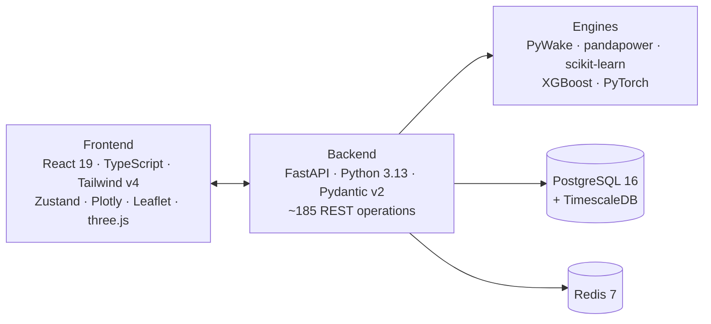

# OffshoreForge

**Learn offshore wind engineering by running a wind farm — from wind resource to grid connection, SCADA and condition monitoring.**

[](https://github.com/polat-mustafa/baltic-wind-control-system/actions/workflows/ci.yml)
[](https://polat-mustafa.github.io/baltic-wind-control-system/)
[](LICENSE)

OffshoreForge is an open training platform for offshore wind engineers. Every screen is a working
engineering model, not a mock-up: wake losses come from PyWake, short-circuit currents from
pandapower (IEC 60909), and the digital twin detects and diagnoses faults injected with known ground truth.
Each method is traced to its standard or primary source in [docs/references.md](docs/references.md).

## Case study: Southern Baltic (SB-510)

The platform ships with one reference project, modelled on the current Polish Baltic build-out.

| | |
|---|---|
| Site | Polish EEZ, Southern Baltic (≈ 54.5° N, 16.0° E) |
| Turbines | 34 × Vestas V236-15.0 MW = **510 MW** |
| Array | 66 kV XLPE strings |
| Export | 2 × 220 kV HVAC, 45 km subsea + 5 km onshore |
| Reactive power | ±120 Mvar STATCOM, 3 × 80 Mvar shunt reactors (N+1) |
| Storage | 50 MW / 200 MWh BESS |
| Grid | PSE 400 kV, ENTSO-E NC RfG Type D |

The physics and the engineering are real; the farm itself is fictional.

## The lifecycle

The modules follow a wind farm through its life.

| Stage | Module | What you work with |
|---|---|---|
| **Develop** | Site & Permits | Open marine data (EMODnet, EEA Natura 2000, Marine Regions), suitability screening, candidate-site report, survey and EIA stages, generic EU permit procedure |
| | Layout | Drag-and-drop turbines in the site, live wake loss, Esau–Williams array cables, PyWake AEP for the exact positions, CAPEX and LCOE |
| | Wind Resource | Weibull fits, wake models (PyWake), AEP and loss chain, availability (IEC 61400-26), weather windows |
| **Design** | Grid Integration | Load flow, IEC 60909 short circuit, fault ride-through, STATCOM sizing, power quality, cable thermal rating (IEC 60287) |
| | Turbine Physics | Cp(λ, β) surface, pitch and torque control, yaw |
| **Build & Commission** | Construction | Installation campaign in Baltic weather windows (DNV-ST-N001 α factor): vessels, P10/P50/P90 timeline, waiting on weather, vessel cost |
| | Commissioning | Circuit 1 energisation (60 steps, topology interlocks, load-flow-verified readings), isolation locks, FAT/SAT, EON → ION → FON |
| | Hand-over | As-built register of your farm, energisation order per feeder bay, your layout on the control-room map |
| **Operate** | Control Room | Farm map, live KPIs, 3D turbine with drawing sheets |
| | SCADA | IEC 61850 data model and GOOSE, bay control, alarms, permit-to-work, OPC UA, IEC 62443 zones |
| | Forecasting | XGBoost, LSTM and TFT models, ensembles, SHAP, with an interactive ML academy |
| | Digital Twin | Physics-based condition monitoring (ISO 13374): detection, model-based diagnosis, RUL prognosis |
| **Decommission** | Decommissioning | Removal options, removal campaign, material and recycling, end-of-life cost, seabed restoration (UNCLOS Art. 60, IMO A.672(16)) |
| **Learn** | Academy | Courses along the lifecycle and scored missions (site, layout, energisation, FRT, twin diagnosis, control-room drills) |

New here? On first launch the app offers a **guided tour**: spotlights and arrows walk you through
the control room, some steps ask you to try things yourself, and every module has its own short
tour in the header's **Tour** menu.

## Quick start

You need Docker with Compose. For development without Docker: Python 3.13 with
[uv](https://docs.astral.sh/uv/), and Node.js 22.

```bash
git clone https://github.com/polat-mustafa/baltic-wind-control-system.git
cd baltic-wind-control-system
docker compose up -d --build
```

| Service | URL |
|---|---|
| App | http://localhost:3000 |
| API | http://localhost:8000 (Swagger at `/docs`, ReDoc at `/redoc`) |

Run without Docker:

```bash
# Backend
cd backend
uv sync --extra dev
uv run uvicorn app.main:app --reload

# Frontend (second terminal)
cd frontend
npm ci
npm run dev
```

## Architecture


```mermaid
graph LR
    UI["Frontend<br/>React 19 · TypeScript · Tailwind v4<br/>Zustand · Plotly · Leaflet · three.js"]
    API["Backend<br/>FastAPI · Python 3.13 · Pydantic v2<br/>~185 REST operations"]
    ENG["Engines<br/>PyWake · pandapower · scikit-learn<br/>XGBoost · PyTorch"]
    DB[("PostgreSQL 16<br/>+ TimescaleDB")]
    RD[("Redis 7")]
    UI <--> API
    API --> ENG
    API --> DB
    API --> RD
```

| Path | Contents |
|---|---|
| `backend/app/routers/` | REST endpoints, one module per area |
| `backend/app/services/` | Computation engines and business logic |
| `backend/app/{models,schemas,core}/` | ORM models, Pydantic schemas, middleware, cache, RBAC |
| `frontend/src/pages/` | One page per module |
| `frontend/src/{components,store,services}/` | UI, Zustand stores, typed API clients |
| `docs/` | MkDocs site, user guides, methods and references |

API prefixes: `/api/v1/wind`, `/grid`, `/scada`, `/forecast`, `/commissioning`, `/digital-twin`,
`/turbine-physics`, `/turbine-sim`, `/info`.

## Testing

```bash
make test        # backend (pytest) + frontend (Vitest)
make lint        # ruff + mypy + tsc + eslint
```

Backend tests assert physics rather than snapshots, for example:
- power stays in [0, P_rated] and is zero outside cut-in and cut-out;
- fault currents follow IEC 60909 with c_max = 1.10;
- interlocks obey switchgear rules.

Frontend end-to-end checks use Playwright (`cd frontend && npm run e2e`).

## Standards

| Standard | Used for |
|---|---|
| IEC 61400-1, -12-1, -25, -26 | Turbine design classes, power curves, monitoring data model, availability |
| IEC 60909 · IEC 60287 · IEC 61000 | Short circuit, cable rating, power quality |
| IEC 61850 · IEC 60870-5-104 · IEC 62443 | Substation automation, telecontrol, OT security |
| IEC 62271 | HV switchgear switching and interlocks |
| ENTSO-E NC RfG · PSE IRiESP | Grid connection requirements |
| ISO 13374 · ISO 13379-1 · ISO 13381-1 | Condition monitoring, diagnostics, prognostics |
| IEA Wind Task 36 | Forecast evaluation |

The full method-to-source map is in [docs/references.md](docs/references.md).

## Documentation

- [Documentation site](https://polat-mustafa.github.io/baltic-wind-control-system/)
- User guide: [EN](docs/en/user-guide.md) · [TR](docs/KULLANICI_KILAVUZU.md) · [PL](docs/pl/przewodnik-uzytkownika.md)
- [Engineering rules and code style](docs/SKILL.md)
- [Technical design basis](docs/Project_Roadmap.md)

## Contributing

- Follow the domain rules and code style in [docs/SKILL.md](docs/SKILL.md).
- New behaviour needs tests, with physics assertions where relevant.
- Run `make lint` and `make test` before opening a pull request.
- Commit messages use conventional-commit style, e.g. `feat(grid): add BESS frequency response`.

## License

[MIT](LICENSE). OffshoreForge is an educational project. It is not certified engineering
software and must not be used for real design or operational decisions.
