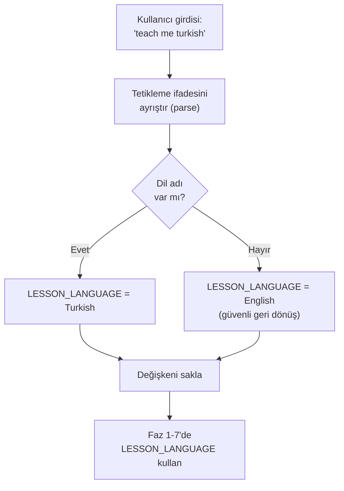
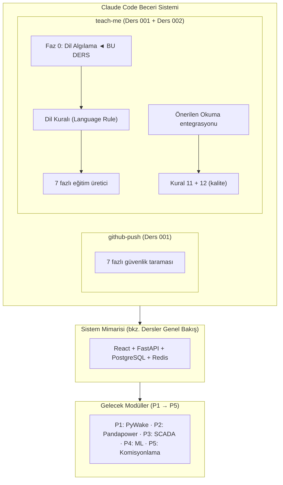

# Lesson 002 — Adding Multilingual Support to Education Skills: Internationalization Infrastructure

!!! abstract "Course Navigation"
:material-arrow-left: **Previous:** [Lesson 001 — DevOps Foundation](lesson-001.md) | **Next:** [Lesson 003 — Preliminary Design Decisions](lesson-003.md) :material-arrow-right:

**Phase:** P0 | **Language:** English | **Progress:** 3 of 19 | [All Lessons](index.md) | [Learning Roadmap](../../Learning_Roadmap.md)

> **Date:** 2026-02-20
> **Commits:** 2 commits (`eba32fd` → `fa528fb`)
> **Commit range:** `eba32fd7ab6a979f409d0f2632dedfa35c79f93c..fa528fb95bd6778ea54f50be71ddc6e0475d2818`
> **Phase:** P0 (DevOps Foundation)
> **Roadmap sections:** [Phase 0 — Section 0.3 Web Development Foundations]
> **Language:** English
> **Previous lesson:** Lesson 001
> **last_commit_hash:** fa528fb95bd6778ea54f50be71ddc6e0475d2818

---

## What You Will Learn

- Architectural principles of adding multilingual support (internationalization) to a software skill
- How to define the translation boundary between technical terms and everyday language — what should be translated and what should remain in English
- The importance of structured phase design in prompt engineering
- How quality rules maintain software consistency
- How git branch strategy and pull request workflow works in professional teams

---

## Part 1: Language Detection Mechanism — Understanding User Intent

### Real World Problem

Imagine in the control room of a wind farm: operators may come from different nationalities — Polish, German, Danish engineers looking at the same SCADA screen. Alarm messages are in English, but the operator's analysis report must be in his own language. The system must detect what language the operator wishes to communicate in and respond accordingly. The same principle applies in our software: when the user says "teach me turkish", the system should automatically detect the language preference.

### What the Standards Say

**ISO 639-1 (Language codes)** and **IETF BCP 47 (Language tags)** standards define internationally accepted codes for language identification in software systems. In industrial automation systems, even **IEC 61131-3** recommends that HMI (Human-Machine Interface) texts be localizable. Our approach is inspired by these standards: instead of a fixed list of languages, we use dynamic detection.

### What We Built

**Changed files:**
- `.claude/skills/teach-me/SKILL.md` — Added multilingual support to training course creator skill (52 lines added, 1 line changed)

A new **PHASE 0: DETECT LANGUAGE** section has been added to the skill file. This phase determines in which language the lesson will be produced by parsing the user's trigger statement. An important design decision was made: no fixed language list (whitelist) is used. Instead, any language in which Claude can write fluently is accepted.

### Why is it important?

> **Why** did we choose open-ended language detection rather than a fixed list of languages?
> Because the fixed list brings maintenance burden and prevents unpredictable usage scenarios. When a Japanese engineer says "teach me japanese", the system should recognize it — it shouldn't require manual addition to the list. The wind energy sector is a global industry: DTU in Denmark, Fraunhofer in Germany, NEDO in Japan — engineers from any country can use this system.
>
> **Why** was language detection designed as a separate phase (Phase 0)?
> Because the principle of separation of concerns requires this. Language detection must occur BEFORE creating course content — just like you measure the voltage level at a substation and then switch. The ordering is critical: if the wrong language is detected, the entire lesson will be produced in the wrong language.

### Language Detection Stream



### Code Review

Language detection logic is designed in an open and extensible structure. The following section of SKILL.md defines the detection rules:

```markdown
## PHASE 0: DETECT LANGUAGE

1. **Parse the user's trigger phrase** for a language name:
  - `"teach me turkish"` → `LESSON_LANGUAGE = Turkish`
  - `"teach me polish"` → `LESSON_LANGUAGE = Polish`
  - `"teach me german"` → `LESSON_LANGUAGE = German`
  - `"teach me"` (no language) → `LESSON_LANGUAGE = English`
  - Any other trigger phrase without a language → `LESSON_LANGUAGE = English`

2. **No hardcoded whitelist** — accept any language Claude can write fluently

3. **Store `LESSON_LANGUAGE`** — use it in all subsequent phases
```

There are three design principles to consider here. First, the **default value** is always English — providing a safe fallback in case of ambiguity. Second, the examples are concrete and clear — the developer doesn't have to guess. Third, the variable `LESSON_LANGUAGE` is stored and used in all subsequent phases—a simple but effective application of the state management principle.

This structure is similar to a protection relay configuration: once set, it remains valid throughout the entire operation.

!!! tip "Basic Concept: Safe Fallback with Defaults"
**Simply put:** Instead of crashing when a system receives unexpected input, it should fall back on a predetermined safe behavior. Just like an elevator goes to the nearest floor and opens its doors when the power goes out.

**Analogy:** Consider a navigation application. The app doesn't crash when the GPS signal goes out — it shows your last known location and says "searching for signal." Our language perception system works the same way: when an unrecognized language expression comes in, it switches to English.

**In this project:** If the user types "teach me" (without specifying the language), the system produces English. Even if he writes "teach me klingon", the system does not collapse — how successful Claude will be in that language is another question, but the system remains stable. This principle is the same as how SCADA alarms return to the default priority level in P3.

---

## Part 2: Language Limit Rule — What to Translate and What Not to Translate

### Real World Problem

You work in a non-English speaking country (e.g. Poland) on an offshore wind farm. Your daily reports may be in Polish, but the labels on technical drawings are international standard: "66 kV", "XCSR-1" (circuit breaker identifier) ​​and "IEC 61850" are written the same in every language. If someone translates "IEC 61850" as "MEK 61850", an engineer from another country cannot find it on Google. It is imperative for global communication that technical terms remain language-independent.

### What the Standards Say

**IEEE 82 (Electrical terms and definitions)** and **IEC 60050 (International Electrotechnical Vocabulary)** standards exist to ensure international consistency of electrotechnical terms. These standards recommend that technical terms be used in their original English form when localized. In the software world, **GNU gettext** and **Unicode CLDR** follow the same principle: UI texts are translated, variable names and API endpoints are not.

### What We Built

**Changed files:**
- `.claude/skills/teach-me/SKILL.md` — Language Rule section added

A new "Language Rule" block has been added to the course template. This block clearly defines what will be translated and what will remain in English:

### Why is it important?

> **Why** do we never translate code blocks and file paths?
> Because code is a universal language. If a Python function is `calculate_wake_deficit()`, translating it to `rüzgar_gölgesi_açığını_hesapla()` makes it impossible for the code to run. Blocks of code should be copied verbatim — the reader should be able to paste them into the terminal and run them. This is similar to the Logical Node nomenclature in IEC 61850: `MMXU` (Measurement) is `MMXU` in each country, never localized.
>
> **Why** do we give technical terms in English + local translation at first use?
> Because this "dual coding" technique both teaches the new concept and enables the reader to search in international literature. If a Turkish engineer does not know the term "wake deficit", he cannot understand an English presentation at a conference. But if he only encounters the English term, he cannot intuitively grasp what the concept means. Combining the two — the “wake deficit” — solves both problems.

### Code Review

The Language Rule block strictly defines translation boundaries. The following structure lists the rules that must be followed in each lesson production:

```markdown
### Language Rule

If `LESSON_LANGUAGE` is not English:
- Write ALL prose content in the target language
- Keep these elements in English ALWAYS:
 - Code blocks and inline code
 - File paths and directory names
 - Git commit hashes and commit messages
 - Standard references (e.g., "IEC 61850", "ENTSO-E NC RfG Type D")
 - Technical terms on first use: English term + native translation in parentheses
- Section headings: translate them
- Quiz questions and answers: fully in target language
- Interview Corner: both sections in target language
```

The beauty of this rule is that it eliminates ambiguity. The boundary between "prose content" and "code/paths/hashes" is clear and enforceable. A developer might read this rule and wonder "should I translate this line?" can always find a definitive answer to the question.

Additionally, new metadata fields have been added to the template header:

```markdown
> **Roadmap sections:** [Phase X — Section X.Y Title, Section X.Z Title]
> **Language:** [LESSON_LANGUAGE]
```

These fields record which roadmap section each lesson corresponds to and what language it was written in—much like a SCADA record tags each event with a timestamp and source information.

!!! tip "Basic Concept: Internationalization and Localization (Internationalization — i18n & Localization — l10n)"
**Simply put:** Internationalization is making an app adaptable to different languages ​​— it's like making your home's electrical outlets compatible with plugs from different countries. Localization, on the other hand, is plugging in a specific country. First you set up the infrastructure, then you adapt it to a specific language.

**Analogy:** Think of an IKEA furniture assembly manual. The drawings are the same in each country (like code blocks), but the warning texts and safety instructions are written in the language of each country. The picture of the Allen key is not turned, but the text "Tighten this screw" is. Our language rule applies the same principle.

**In this project:** Our 510 MW wind farm simulation is an international training platform. A Polish PSE engineer might produce a lesson in Polish, a Turk might produce a Turkish lesson for a power engineer — but both would spell `pandapower.runpp()` the same way and reference IEC 60909 with the same number.

---

## Part 3: Recommended Reading and Learning Roadmap Integration

### Real World Problem

A wind energy engineer must constantly learn — new standards are published, new turbine models come out, grid codes are updated. But it's easy to get lost in the ocean of information. A good education system is the answer to the question "what should I study now?" It provides a personalized answer to your question — it recommends resources directly related to the topic you're currently learning, not the entire library.

### What the Standards Say

**Bloom's Taxonomy** is the basic framework of educational sciences: remembering → understanding → application → analysis → evaluation → creation. Each lesson should enable the student to move up the taxonomy. The “Recommended Reading” section selects resources that will help the student move from their current level to the next level. This is in line with Vygotsky's concept of the Zone of Proximal Development: not too easy, not too difficult — just what is achievable right now.

### What We Built

**Changed files:**
- `.claude/skills/teach-me/SKILL.md` — Added "Suggested Reading" section and Learning Roadmap integration

A new rule has been added to Phase 4: reading the `docs/Learning_Roadmap.md` file with each lesson production and determining which roadmap phase/section the lesson corresponds to. Next, a new "Suggested Reading" table was added to the lesson template.

### Why is it important?

> **Why** do we take recommended readings from the Learning Roadmap and not randomly?
> Because Learning Roadmap is a curated list of reliable and verified resources. Random book recommendations can be misleading — if a misprint, retracted article, or poor quality source is recommended, the student's confidence will be shaken. In real engineering education, references should be traceable, just as the calculation methods used in IEC 61400-1 are referenced.
>
> **Why** do we limit ourselves to 3-5 sources and not provide the entire list?
> Information overload is one of the biggest enemies of learning. If a student sees a list of 30 sources, they won't read any of them. But if we say "these are the three most important sources for this course", he will actually read it. This is the same principle in SCADA alarm management (ISA-18.2): if you show the operator hundreds of alarms he will ignore them all, if you show the 3-5 most critical alarms he will take action.

### Code Review

The new rule added in Phase 4 expands the information gathering phase of the course production process:

```markdown
5. **Read `docs/Learning_Roadmap.md`** to identify which roadmap phase/section
  the lesson maps to, and extract relevant trusted sources (textbooks, papers,
  courses) for the "Suggested Reading" block.
```

This rule ensures that each lesson answers the question not just "what did we do" but also "what should I read to learn more?" The corresponding section in the lesson template looks like this:

```markdown
## Suggested Reading

*From the [Learning Roadmap](../../Learning_Roadmap.md) — Phase X: [Phase Title]*

| Resource | Type | Why Read It |
|----------|------|-------------|
| [Source from Learning Roadmap] | [Type] | [1-sentence reason tied to this lesson's content] |
```

Each resource has a “Why Read It” column next to it — this helps the student understand why we chose the resource. Without motivation, a reference list is just a bibliography; It is a learning road map with motivation.

Additionally, a new rule has been added to the quality rules:

```markdown
11. **Suggested Reading must reference actual Learning Roadmap sources**
  — never fabricate book titles or paper references
```

This rule aims to prevent hallucinations. AI models can sometimes make up books or articles that don't exist. This quality rule ensures that every recommended resource actually exists in the Learning Roadmap — just like every reference in an engineering report must be verifiable.

!!! tip "Basic Concept: Curated Learning"
**Simply explained:** There are thousands of resources on the internet on every subject. Curated learning is when an expert picks the 3-5 best resources for you and says “read these first.” It's like instead of seeing all the paintings in a museum, the guide says "these five paintings are a must see."

**Analogy:** A doctor doesn't say "you have digestive problems" and refer you to WebMD — he gives concrete instructions like "take this medication twice a day, follow this diet." Curated learning is the same: “you want to learn wake modeling — read Bastankhah & Porté-Agel (2014) first, then review the PyWake documentation.”

**In this project:** Our Learning Roadmap includes 15 academic articles, dozens of textbooks, and dozens of online resources. But we only recommend 3-5 at the end of each lesson — the ones that are directly related to the topic of that lesson. When you take the wake modeling course in P1, you will see the Bastankhah article, and when you take the protection course in P2, you will see the Jankovic article.

---

## Part 4: Quality Rules and Pull Request Workflow

### Real World Problem

An offshore wind farm has a "no operation without documentation" rule. The circuit breaker cannot be closed without writing a switching program. The equipment is not put into operation until a test report is approved. The same discipline is required in software development: a feature is not merged into the main branch without review and testing.

### What the Standards Say

**ISO 9001 (Quality management systems)** and **IEC 61400-22 (Wind turbine certification)** quality management standards require that every change be traceable and reviewable. Git's branch and pull request mechanism is the natural equivalent of this requirement in the software world. Each PR is a “change request” and is reviewed before being merged — just like a Management of Change (MOC) process.

### What We Built

The changes we review in this tutorial were developed in branch `feature/teach-me-multilang` and merged into the master branch with PR #14:

```
eba32fd [INFRA] Add multi-language support to teach-me skill
fa528fb Merge pull request #14 from polat-mustafa/feature/teach-me-multilang
```

The first commit (`eba32fd`) contains the actual code change — 52 line additions and 1 line change. The second commit (`fa528fb`) represents the merge operation on GitHub. This two-step process — first develop in the feature branch, then merge with PR — is the standard workflow of professional software teams.

### Why is it important?

> **Why** are we using a feature branch instead of committing directly to the `main` branch?
> Because the `main` branch must always be running — this is equivalent to the "production line is always running" principle. When a feature is left unfinished, if the broken code is in `main`, it affects the entire team. The feature branch isolates the experimental work. The wind farm analogy: when you maintain a turbine, you isolate that turbine from the grid — you don't shut down the entire farm.
>
> **Why** do we use the `[INFRA]` scope tag in the commit message?
> Traceability. When you look at the Git log, the `[INFRA]` tag immediately makes it obvious that this change is infrastructure related — not domain logic (business logic) or bug fixing. This is similar to the categories in the SCADA event log: “ALARM”, “TRIP”, “MAINTENANCE” — each event type is marked with a different label.

### Code Review

Commit `eba32fd` updates the skill description line and adds multilingual trigger statements:

```markdown
description: "Generate a comprehensive teaching lesson from recent git history.
Trigger this skill when the user says: 'teach me', 'teach me english',
'teach me turkish', 'teach me polish', 'explain what we did', 'lesson',
'what did we build', 'what changed', 'review our work', 'generate lesson',
'study session', 'learning recap', or any variation involving reviewing,
explaining, or generating a lesson from recent work. Supports multi-language
output — the user can append any language name to specify the lesson language."
```

This line of description plays two critical roles. The first is a pattern matching rule that determines when Claude Code triggers the skill. The second is a document for developers — it explains what the skill does and how it is triggered.

Finally, language consistency is guaranteed by adding quality rule 12:

```markdown
12. **Language consistency** — if a non-English language is specified,
  ALL prose must be in that language; mixing languages mid-sentence
  is forbidden (except for technical terms on first use)
```

This rule avoids the "code-switching" problem. Switching to English mid-sentence in a Turkish lesson distracts the reader and leaves an unprofessional impression. The only exception is the initial use of technical terms—such as "wake deficit".

!!! tip "Basic Concept: Git Branching Strategy"
**Simply explained:** Think of it like the branches of a tree. The main body (`main`) is always intact. When you want to add a new feature, you create a branch. You work on the branch — without damaging the main trunk. When you're done, you join the branch back to the main trunk. If the branch grows bad, you cut off the branch — the main trunk is unaffected.

**Similarity:** Think of a recipe. Changing the main recipe directly is risky — maybe the new ingredient will turn out poorly. Instead, you copy the recipe (branch), experiment on the copy, and if you like it, update the original recipe (merge). If you don't like it, you throw away the copy.

**In this project:** The `feature/teach-me-multilang` branch was created for the multilingual support feature. All changes were made in this branch, tested, and merged into `main` with PR #14. This workflow will be repeated for each new feature from P1 to P5.

---

## Links to Previous Lessons

In Lesson 001, we established the DevOps foundation of the project: CI/CD pipeline, Docker Compose orchestration, security scanning capability, and automatic dependency management with Dependabot. We now build on this foundation:

- **In Lesson 001** we created the github-push skill — an automatic push workflow that performs security scanning. We are now extending the **teach-me skill** using the same skill architecture. Both skills follow the same SKILL.md structure: metadata header, allowed tools, phased workflow.

- **In Lesson 001** we learned the principle of "defense in depth" with pre-commit hooks and CI pipeline. In this course, we apply the same principle to the quality rules: Rule 11 (ban on fake sources) and Rule 12 (linguistic consistency) serve as "quality gates" in course production.

- The commit message rules (`[SCOPE]` tags) that we learned in **Lesson 001** are also used here: `[INFRA] Add multi-language support to teach-me skill` — scope tag, descriptive message, imperative mood.

- The feature branch + PR workflow we introduced in **Lesson 001** (`feature/teach-me-skill` → PR #13) is repeated here: `feature/teach-me-multilang` → PR #14. Repeated patterns are strong learning signals.

---

## The Big Picture

*The focus of this lesson: the **i18n layer** added to the teach-me skill.*



For the full system architecture, see [Courses Overview](index.md#system-architecture).

---

## Key Takeaways

1. **Default values ​​provide safe fallback** — if language is not specified, English is generated, just like a protection relay trips to the safe side (trip) in case of uncertainty.
2. **Translation boundaries must be clear** — code, file paths, commit hashes, and standards references are never translated; Only the prose content (prose) is written in the target language.
3. **Technical terms are bilingual at first use** — “wake deficit” format ensures both local understanding and international searchability.
4. **Quality rules prevent hallucinations** — Rule 11 requires that every recommended resource be verifiable in the Learning Roadmap.
5. **Curated reading lists prevent information overload** — 3-5 sources are more effective than 30 sources, just like prioritizing the most critical alarms in SCADA.
6. **Feature branches preserve main code** — Experimentation is done on branch `feature/teach-me-multilang`, `main` always remains stable.
7. **Separation of concerns improves architectural quality** — language detection in a separate phase (Phase 0), content generation in separate phases; Each part can be tested and maintained independently.

---

## Recommended Reading

*[Learning Roadmap](../../Learning_Roadmap.md) — From Phase 0: Engineering Fundamentals*

| Source | Type | Why Should You Read |
| -------- | ----- | --------------- |
| FastAPI Official Tutorial | Documentation (free) | Although our skills file is not an API, the structured phase design shares the same principle as FastAPI's middleware chaining logic |
| React Official Tutorial (react.dev/learn) | Documentation (free) | SCADA HMI in P3 will be multilingual — basic React knowledge required to understand React's i18n ecosystem |
| *Designing Data-Intensive Applications* — Martin Kleppmann | Book | Internationalization is a data structuring problem — Kleppmann's chapters on encoding and schema evolution are directly related |

---

## Quiz — Test Your Understanding

### Recall Questions

**Q1:** What exactly does the Phase 0 added to the Teach-me skill do and what is the default language?

<details>
<summary>Reply</summary>

Phase 0: DETECT LANGUAGE determines in which language the lesson will be produced by parsing the user's trigger statement. For example, it extracts `LESSON_LANGUAGE = Turkish` from the expression "teach me turkish". If the user does not specify a language (just says "teach me") or uses an unrecognized expression, the default language is English. This default is designed with the principle of safe fallback.

</details>

**Q2:** According to the Language Rule, which elements should remain in English in a Turkish lesson?

<details>
<summary>Reply</summary>

Five categories must remain in English: (1) code blocks and inline code, (2) file paths and directory names, (3) git commit hashes and commit messages, (4) standards references (e.g. "IEC 61850", "ENTSO-E NC RfG Type D"), and (5) technical terms are given in English at first use + local translation in parentheses. Chapter titles, exam questions, Interview Corner and all prose content are written in the target language.

</details>

**Q3:** What are the two new quality rules (Rule 11 and Rule 12) added in this lesson?

<details>
<summary>Reply</summary>

Rule 11: “Suggested Reading must reference actual Learning Roadmap sources — never fabricate book titles or paper references” — mandates that suggested readings must be taken from actual sources in the Learning Roadmap, never fabricate book or article references. Rule 12: "Language consistency — if a non-English language is specified, ALL prose must be in that language; mixing languages ​​mid-sentence is forbidden (except for technical terms on first use)" — ensures language consistency and prohibits code-switching mid-sentence.

</details>

### Comprehension Questions

**Q4:** Why was open-ended language detection preferred over a fixed language list (whitelist)? What are the advantages and disadvantages of this decision?

<details>
<summary>Reply</summary>

Open-ended sensing was chosen because wind energy is a global industry and engineers from any country can use this platform. A fixed list requires manual updates for each new language and prevents unpredictable usage scenarios. Advantage: unlimited language support with zero maintenance costs. Disadvantage: Claude runs the risk of producing poor quality output in some languages ​​(e.g. rare languages). However, the risk is that the system will produce poor quality output rather than crashing — which is a safe fallback mode (graceful degradation).

</details>

**Q5:** Why is it important that technical terms are given in the "English + local translation" format when first used? Wouldn't just English or just the local language be enough?

<details>
<summary>Reply</summary>

Using only English terms reduces the reader's chance of intuitively understanding the concept — the phrase "wake deficit" is meaningless to an engineer who doesn't speak English. Using only local translation limits the reader's ability to search international literature, understand presentations at English-language conferences, and communicate in multinational teams. Putting the two together — “wake deficit” — provides both local understanding and teaches international terminology. This is the "dual coding" technique in educational sciences: presenting the same concept in two different formats increases memory retention.

</details>

**Q6:** Why is the pull request (PR) workflow safer than committing directly to the `main` branch? Explain this question with a wind farm analogy.

<details>
<summary>Reply</summary>

The PR workflow isolates changes and provides the opportunity for review — just as a turbine to be maintained on a wind farm is first isolated from the grid. When servicing Turbine 17's generator, you disconnect it from the 66 kV array — so even if something goes wrong during maintenance, the other 33 turbines are not affected. Committing directly to `main` is like doing maintenance while connected to the mains — one error affects the entire system. In the PR workflow, the feature branch is an isolated environment, CI tests perform automatic validation, and merge is done only after all checks have passed.

</details>

### Challenge Question

**Q7:** There are currently two skills (github-push and teach-me) in this project. Both are defined by SKILL.md files in the `.claude/skills/` directory. If the number of skills increases to 10 or 20, what architectural problems arise and how do you solve them? Think in terms of skill discovery, conflict resolution and performance.

<details>
<summary>Reply</summary>

**Skill discovery:** At 20 skills, Claude Code must compare each user message against a list of 20 different trigger phrases. This is the linear search complexity (O(n)). Solution: divide the skills into categories (e.g. "git", "education", "analysis") and do category matching first — just like when coordinating a protection relay, first identify the zone and then do detailed analysis.

**Conflict management:** Multiple skills can respond to the same trigger phrase. For example, "review our work" can be mapped by both teach-me and a future "code-review" skill. Solution: (1) priority ordering, (2) more specific matches take priority, or (3) asking the user in case of uncertainty. This is the same as the "grading" principle in protection relay coordination: if multiple relays detect the same fault, the closest relay opens first.

**Performance:** Reading each skill file in each message creates delay. Solution: (1) skill manifest file (collecting all trigger statements in a single index file), (2) lazy loading (skill is fully loaded only when a match is made), (3) caching. This is the poll vs. poll of SCADA systems. It is similar to the event-driven architecture: instead of constantly polling each sensor, it is more efficient to only receive notifications when there are changes (event-driven).

</details>

---

## Interview Corner

### Explain Simply
*"How would you explain adding multilingual support to a software tool to a non-engineer?"*

Let's say you are a teacher and you write your lecture notes only in English. But there are Turkish, Polish and German students in your class. They all understand English, but they learn much faster and more deeply if they read in their own language. Now you are setting up a system: when the student says "tell me in Turkish", your lecture notes are translated into Turkish.

But you don't translate everything! Mathematical formulas are the same in every language — "2 + 2 = 4" is the same in Turkish. Similarly, you don't translate computer code because the computer doesn't understand Turkish. You also don't dial their standard numbers because the same number is used worldwide. You just translate the explanations, examples, and questions — the parts people read.

That's exactly what we did in this project. We had a tool that produced training lessons. We added the rules of "understand what language to write in" and "know what to translate and what not to translate." Now a Turkish energy engineer can learn our wind farm simulation in Turkish — but the codes and standard references remain in international format.

### Explain Technically
*"How do you explain adding internationalization support to a hiring panel, an AI skills system?"*

We designed an internationalization (i18n) layer for Claude Code's skill system. Our basic architectural decision differs from the traditional i18n approach (gettext, ICU message format, translation files) because we are working in an LLM-based system. Instead of key-value translation files, we define translation boundaries through natural language instructions (prompt engineering).

The architecture of the system is a phased pipeline. Phase 0 (DETECT LANGUAGE) extracts the language preference from user input and stores it as a state variable `LESSON_LANGUAGE`. This variable is used in all subsequent phases (Phases 1-7). Instead of using a fixed language list (whitelist), we opted for open-ended detection — this provides unlimited language extensibility with zero maintenance cost, but accepts the risk of graceful degradation: output quality may suffer in rare languages.

The translation limit rule (Language Rule) is the most critical design decision of the i18n. We defined five categories as "invariant": code blocks, file paths, git metadata, standards references, and technical terms (dual-format at first use). This limit follows the same principle as the Logical Node naming convention in IEC 61850: `MMXU` is `MMXU` in each country, it is not localized. The risk of hallucinations and the code-switching problem have been structurally avoided by adding two new quality rules (11: Learning Roadmap source verification, 12: language consistency). All changes were merged into the feature branch + PR workflow (PR #14) and passed through the CI pipeline.
