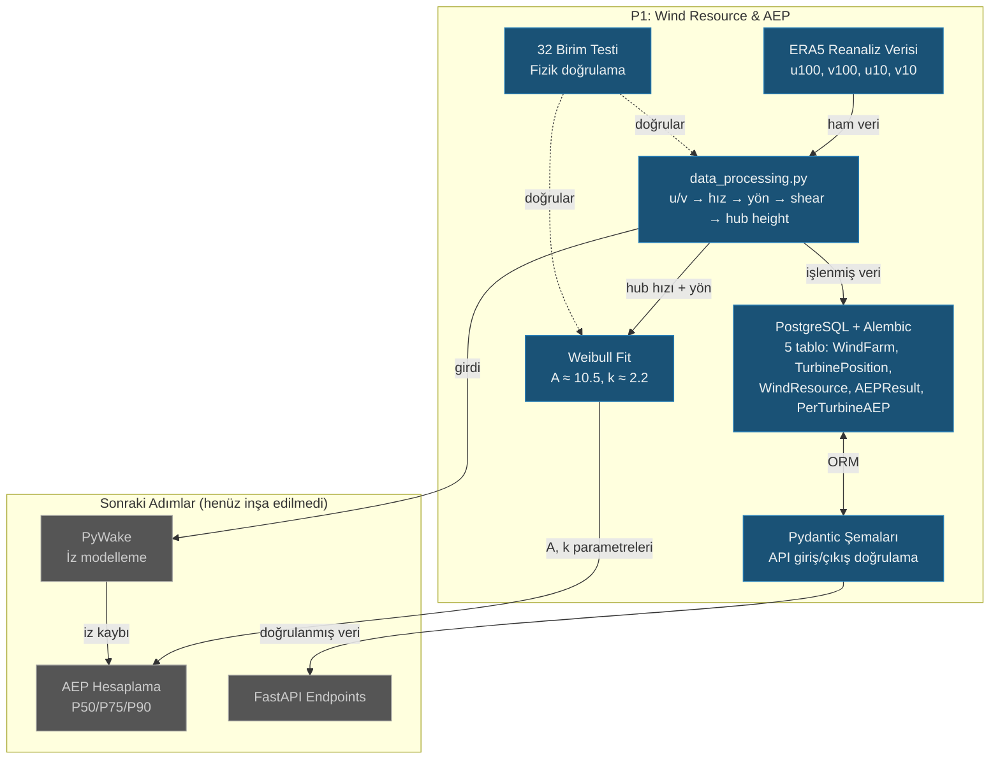

# Lesson 004 — P1 Starter: Database Models, ERA5 Wind Data Processing and Weibull Analysis

!!! abstract "Course Navigation"
:material-arrow-left: **Previous:** [Lesson 003 — Preliminary Design Decisions](lesson-003.md) | **Next:** [Lesson 005 — Wind Vane & Trail Model](lesson-005.md) :material-arrow-right:

**Phase:** P1 | **Language:** English | **Progress:** 5 of 19 | [All Lessons](index.md) | [Learning Roadmap](../../Learning_Roadmap.md)

> **Date:** 2026-02-23
> **Commits:** 15 commits (`d6e30ee` → `bb84814`), 3 dahil / 12 atlandı
> **Commit range:** `d6e30ee52c7a389c8232f546dc3e6ae2952e79f7..bb84814a0a0bf528dd78c95d42e6341e50b89bb5`
> **Phase:** P1 (Wind Resource & AEP)
> **Roadmap sections:** [Phase 1 — Section 1.1 Wind Resource Assessment, Section 1.2 Wake Modelling & Layout Optimization]
> **Language:** English
> **Previous lesson:** Lesson 002
> **last_commit_hash:** bb84814a0a0bf528dd78c95d42e6341e50b89bb5

---

## What You Will Learn

- How ERA5 reanalysis data is converted from u/v components to wind speed and direction (vector decomposition physics)
- Wind speed extrapolation from 100 m to 150 m hub height with power law profile
- The critical role of the Weibull distribution in wind energy engineering and how it is fitted with scipy
- Establish production-quality database architecture with Async SQLAlchemy + Alembic migrations
- The importance of verifying the laws of physics with unit tests in engineering practice.

---

## Part 1: Engineering Review — Correctness Checking and Dependency Fixing

### A Real Life Problem

Let's say you are building a bridge. In the project drawings, the steel strength is written as 500 MPa, but in reality the material is 450 MPa. This 10% difference could result in the collapse of the bridge. There is no such thing as a “small numerical error” in engineering — every value must be verified.

This is exactly what happened in our project: The cut-out speed of the V236-15.0 MW turbine was written as **34 m/s** in our documentation, but the correct value is **31 m/s**. A difference of 3 m/s would cause serious deviation in AEP (Annual Energy Production) calculations.

### What the Standards Say

**IEC 61400-1 (Wind energy generation systems — Design requirements)** defines turbine classification. The V236-15.0 MW is an IEC Class I-B turbine — this means a cut-out speed of 31 m/s. Additionally, **IEC 61400-12-1 (Power performance testing)** requires that all power curve parameters be obtained from verified sources.

On the dependency management side, we limited the `mkdocs-material` package to `<10.0.0`. From where? There was a risk of incompatibility with MkDocs 2.0 — on production systems dependencies need to be managed at **fixed intervals** rather than "latest version".

### What We Built

**Changed files:**

- `docs/Project_Roadmap.md` — Cut-out speed 34 → 31 m/s correction, D3.js → XYFlow replacement
- `docs/SKILL.md` — D3.js → XYFlow update in architecture overview
- `requirements-docs.txt` — `mkdocs-material>=9.5.0,<10.0.0` upper limit fix
- `.claude/skills/github-push/SKILL.md` — Added auto branch strategy and auto-merge phase

Cut-out speed correction updated consistently across all documents. Additionally, **Phase 6.1 (branch strategy)** and **Phase 8 (auto-merge)** were added to the `github-push` skill: now a feature branch is automatically created while in the `main` branch, and squash merge is performed after CI is passed with the "push and merge" command.

### Why is it important?

> **Why** is cut-out speed so critical?
> Cut-out speed is the wind speed at which the turbine stops for safety reasons. In AEP calculations, all hours above this value are counted as zero production. Using 31 m/s instead of 34 means dozens more hours of “zero production” per year — which directly impacts the annual revenue forecast.

> **Why** was XYFlow preferred over D3.js?
> D3.js is a very low-level library — you have to draw each SVG element by hand. XYFlow (`@xyflow/react`) is a node-based UI library that works as a React component. It is a natural choice for single-line diagrams in P2, SCADA topology in P3, and switching programs in P5.

### Code Review

Let's look at the effect of cut-out speed correction in `Project_Roadmap.md`. This value was occurring at four different points in the project, and they all had to be updated consistently:

```python
# docs/Project_Roadmap.md — fizik kısıtlama fonksiyonu
def enforce_physical_constraints(prediction, wind_speed):
  """
  1. Power ≥ 0 (negatif üretim olmaz)
  2. Power ≤ 15.0 MW per turbine (nominal sınır)
  3. Power = 0 if wind_speed < 3.0 m/s (cut-in altında)
  4. Power = 0 if wind_speed > 31.0 m/s (cut-out üstünde) # 34 → 31 düzeltildi
  5. Power monotonically increases (cut-in → rated arası)
  """
```

This fix was made not in one file but in five different files. The principle of "single source of truth" in engineering makes this mandatory.

!!! tip "Basic Concept: Engineering Review"
**Simply put:** Before you turn in an exam paper, you recheck all your answers. That's what engineering review is all about — systematically checking the accuracy of all numerical values, references, and assumptions after writing the code.

**Similarity:** Pilot checklist. A pilot follows the same checklist before every flight — “engine OK, fuel adequate, landing gear extended.” The engineer checks that "cut-out is correct, standard reference is correct, dependency version is fixed".

**In this project:** We corrected the V236-15.0 MW cut-out speed to 34 → 31 m/s. This single correction ensured that our AEP calculation was realistic.

---

## Part 2: Asynchronous Database Engine — SQLAlchemy and Alembic

### A Real Life Problem

Consider a hospital information system. Hundreds of doctors are querying patient records at the same time. If the system says "wait, it's not your turn" during every interrogation, patients are put in danger. **Asynchronous database access** eliminates this waiting time — one query waits for a response while others continue to run.

### What the Standards Say

An IEC standard does not directly cover database design, but **IEC 61850-7-1 (Communication networks and systems for power utility automation — Basic communication structure)** defines data modeling principles: each data point must have a unique identifier, timestamp and quality label. Our ORM models implement this principle at the software layer.

For Alembic migrations, the industry standard is the **database-as-code** approach: schema changes must be version-controlled, repeatable and reversible.

### What We Built

**Changed files:**

- `backend/app/db.py` — Async SQLAlchemy engine, session factory, declarative base
- `backend/alembic/env.py` — Alembic environment with Async PostgreSQL support
- `backend/alembic/versions/..._p1_initial_schema_...py` — First migration (5 tables)

The following code forms the center of all database access. It allows FastAPI to create a new database session for each API request and automatically close it when the request is finished:

```python
# backend/app/db.py
from sqlalchemy.ext.asyncio import AsyncSession, async_sessionmaker, create_async_engine
from sqlalchemy.orm import DeclarativeBase

engine = create_async_engine(
  settings.database_url,
  echo=settings.debug,   # SQL sorgularını logla (debug modunda)
  pool_size=10,       # Havuzda 10 bağlantı tut (aynı anda 10 sorgu)
  max_overflow=20,      # Yoğun anlarda 20 ek bağlantıya izin ver
)

async_session_factory = async_sessionmaker(
  engine,
  class_=AsyncSession,
  expire_on_commit=False,  # Commit sonrası nesneleri yeniden yükleme
)

class Base(DeclarativeBase):
  """Tüm ORM modellerinin ana sınıfı."""

async def get_session() -> AsyncGenerator[AsyncSession]:
  """FastAPI dependency — her istek için async veritabanı oturumu sağlar."""
  async with async_session_factory() as session:
    yield session
```

This module also includes connection pool management with `pool_size=10` and `max_overflow=20`. This sink structure is critical for parallel processing of SCADA data from 34 turbines.

On the Alembic side, the `env.py` file is configured to use an asynchronous motor:

```python
# backend/alembic/env.py (özet)
async def run_async_migrations() -> None:
  """Asenkron motorla migrasyon çalıştır."""
  connectable = async_engine_from_config(
    config.get_section(config.config_ini_section, {}),
    prefix="sqlalchemy.",
    poolclass=pool.NullPool, # Migrasyon için havuz gereksiz
  )
  async with connectable.connect() as connection:
    await connection.run_sync(do_run_migrations)
  await connectable.dispose()
```

Note the use of `NullPool`: migrations are one-time operations, no need for connection pooling. This is a deliberate contrast to the `pool_size=10` in the production engine.

### Why is it important?

> **Why** do we use asynchronous database access?
> There are 34 turbines in our wind farm, and each sends SCADA data once a second. In synchronous access, each query waits for the previous one to finish — 34 × 1 second = 34 seconds delay. In asynchronous access, they all work in parallel.

> **Why** are Alembic migrations necessary?
> "Delete database, create from scratch" only works in the development environment. You cannot delete the table when there are 175,200 rows of ERA5 data in production. Alembic applies schema changes without losing data.

!!! tip "Basic Concept: Connection Pool"
**To put it simply:** There are 10 waiters in a restaurant. Instead of hiring a new waiter every time a customer arrives, existing waiters rotate between tables. This is also how connection pooling manages database connections — it reuses existing connections rather than opening a new connection for each query.

**Similarity:** Airport security checkpoint. When checkpoint 10 is open, passengers pass in parallel (`pool_size=10`). 20 additional points are unlocked during the holiday rush (`max_overflow=20`). If capacity is exceeded, passengers will queue.

**In this project:** `pool_size=10` is sufficient for normal load, `max_overflow=20` is activated when all turbines send data at the same time. A total of 30 concurrent database connections are sufficient for our farm of 34 turbines.

---

## Part 3: ORM Models and Pydantic Schemas — Designing Data Structures

### A Real Life Problem

You are designing a library system. The "Book" table contains the author name, publication year, and ISBN number. But there may be more than one copy of a book, each copy sitting on a different shelf, some on loan. If you don't model these relationships correctly, you'll end up wondering "which copy is on the shelf?" You cannot answer the question.

Our wind farm has a similar structure: a **farm** (WindFarm) contains multiple **turbine positions** (TurbinePosition), each farm has **wind resource data** (WindResource) and **AEP results** (AEPResult), each AEP result has **AEP per turbine** (PerTurbineAEP) details.

### What the Standards Say

**IEC 61400-25-2 (Communications for monitoring and control — Information models)** defines the wind turbine information model. Each turbine must have a unique identifier (such as `WTG_01`), spatial data and operational parameters. Our `TurbinePosition` model reflects this structure.

**IEC 61400-12-1 (Power performance testing)** requires that wind measurements be recorded with time-stamped, calibration altitude information — this is the reason for the `hub_height_m` and `time` fields in our `WindResource` model.

### What We Built

**Changed files:**

- `backend/app/models/wind_farm.py` — WindFarm, TurbinePosition, AEPResult, PerTurbineAEP ORM modelleri
- `backend/app/models/wind_resource.py` — WindResource time series model
- `backend/app/schemas/wind_farm.py` — Pydantic v2 request/response schemas
- `backend/app/schemas/wind_resource.py` — Wind source and AEP diagrams

Let's examine the relationship structure between the five tables. Three main branches emerge from the central table `WindFarm`:

```python
# backend/app/models/wind_farm.py — İlişki yapısı
class WindFarm(Base):
  """Rüzgar çiftliği spesifikasyonu — çiftlik başına bir satır."""
  __tablename__ = "wind_farm"

  id: Mapped[uuid.UUID] = mapped_column(primary_key=True, default=uuid.uuid4)
  name: Mapped[str] = mapped_column(String(100))
  latitude: Mapped[float] = mapped_column(Float, comment="Farm centre latitude [deg]")
  longitude: Mapped[float] = mapped_column(Float, comment="Farm centre longitude [deg]")
  capacity_mw: Mapped[float] = mapped_column(Float, comment="Total installed capacity [MW]")
  num_turbines: Mapped[int] = mapped_column(Integer)

  # Üç ana ilişki — cascade="all, delete-orphan" ile
  turbine_positions: Mapped[list[TurbinePosition]] = relationship(
    back_populates="wind_farm",
    cascade="all, delete-orphan", # Çiftlik silinince türbinler de silinir
  )
  wind_resources: Mapped[list[WindResource]] = relationship(
    back_populates="wind_farm",
    cascade="all, delete-orphan",
  )
  aep_results: Mapped[list[AEPResult]] = relationship(
    back_populates="wind_farm",
    cascade="all, delete-orphan",
  )
```

`cascade="all, delete-orphan"` is a critical design decision: when a wind farm record is deleted, all turbine positions, wind data and AEP results linked to it are automatically deleted as well. This avoids the "orphan record" problem.

The `AEPResult` model enforces P50/P75/P90 uncertainty bands — this is a direct application of Engineering Rule 10 (“uncertainty is mandatory in every AEP output”):

```python
class AEPResult(Base):
  """AEP hesaplama sonucu — P50/P75/P90 belirsizlik bantlarıyla.

  Mühendislik Kuralı 10: belirsizlik tüm AEP çıktılarında zorunludur.
  """
  __tablename__ = "aep_result"

  aep_p50_gwh: Mapped[float] = mapped_column(Float, comment="P50 (median) AEP [GWh]")
  aep_p75_gwh: Mapped[float] = mapped_column(Float, comment="P75 exceedance AEP [GWh]")
  aep_p90_gwh: Mapped[float] = mapped_column(Float, comment="P90 exceedance AEP [GWh]")
  uncertainty_percent: Mapped[float] = mapped_column(Float, comment="Combined RSS uncertainty [%]")
  wake_loss_percent: Mapped[float] = mapped_column(Float, comment="Wake-induced energy loss [%]")
```

Pydantic schemas, on the other hand, perform data validation at the API boundary. While the ORM model represents the database, the Pydantic schema validates the data coming from the API client:

```python
# backend/app/schemas/wind_farm.py — Giriş doğrulama
class WindFarmCreate(BaseModel):
  """Rüzgar çiftliği oluşturma isteği şeması."""
  name: str = Field(max_length=100, examples=["Baltic Wind Alpha"])
  latitude: float = Field(ge=-90, le=90, description="Farm centre latitude [deg]")
  longitude: float = Field(ge=-180, le=180, description="Farm centre longitude [deg]")
  capacity_mw: float = Field(ge=0, le=2000, description="Total installed capacity [MW]")
  num_turbines: int = Field(ge=1, le=200)
```

Limits such as `ge=-90, le=90` prevent physically impossible values ​​from entering the system. The latitude must be between -90 and 90 — the API layer controls this, not the database.

### Why is it important?

> **Why** ORM model and Pydantic schema separate?
> Single Responsibility Principle: The ORM model talks to the database, the Pydantic schema talks to the API client. The API schema does not need to change when the database schema changes — and vice versa.

> **Why** are we using UUID and not auto-incremental ID?
> In distributed systems, UUID generates ID without conflict. Even if two different servers create records at the same time, the IDs will not conflict. Wind farm data can come from multiple sources (ERA5, SCADA, manual measurement).

!!! tip "Basic Concept: cascade='all, delete-orphan'"
**To put it simply:** When a house is demolished, the furniture inside is gone too. `delete-orphan` automatically purges records that remain "homeless" in the database.

**Analogy:** When a classroom is closed in a school, all attendance records, grade books and exam results for that class are archived or deleted. There should be no "unclaimed" records.

**In this project:** When `WindFarm` is deleted, the 34 `TurbinePosition`, 175,200 `WindResource` records and all `AEPResult` records linked to it are automatically deleted. There will be no inconsistent data left in the database.

---

## Part 4: ERA5 Wind Data — From u/v Components to Hub Height

### A Real Life Problem

A weather station tells you "wind from the northeast, 30 mph." But raw satellite data doesn't come that way — the wind is recorded as two separate components, east-west (u) and north-south (v). You must calculate both speed and direction from these two numbers. Moreover, the measurement was made at an altitude of 100 m, but your turbine is at 150 m — you also need to calculate how the wind changes with altitude.

### What the Standards Say

**IEC 61400-12-1 (Wind turbines — Power performance measurements)** requires wind speed measurements to be made at hub height or converted to hub height by a valid extrapolation method. Wind shear assessment is defined in Annex G.

**ECMWF ERA5** reanalysis data provides u/v components at 10 m and 100 m altitude. From the difference between these two heights, the shear exponent (α) is calculated and extrapolated to 150 m.

### What We Built

**Changed files:**

- `backend/app/services/p1/data_processing.py` — Full ERA5 processing pipeline (369 lines)

The physics pipeline consists of five steps. The first step is to calculate the wind speed from the u and v components:

```python
# Adım 1: Rüzgar hızı = vektör büyüklüğü
def compute_wind_speed_ms(
  u_component_ms: NDArray[np.floating], # Doğu-batı bileşeni [m/s]
  v_component_ms: NDArray[np.floating], # Kuzey-güney bileşeni [m/s]
) -> NDArray[np.floating]:
  """ws = √(u² + v²) — Pisagor teoremi, iki boyutlu vektör büyüklüğü."""
  result: NDArray[np.floating] = np.hypot(u_component_ms, v_component_ms)
  return result
```

`np.hypot` gives the same result as `np.sqrt(u**2 + v**2)`, but is numerically more stable — it does not introduce overflow errors at numbers that are too large or too small.

The second step is to calculate the meteorological wind direction. This step requires careful conversion because meteorological convention measures "wind direction":

```python
# Adım 2: Meteorolojik yön (rüzgarın GELDİĞİ yön)
def compute_wind_direction_deg(
  u_component_ms: NDArray[np.floating],
  v_component_ms: NDArray[np.floating],
) -> NDArray[np.floating]:
  """
  Kuzeyden saat yönünde derece cinsinden.
  - Kuzey rüzgarı (kuzeyden esen): 0° / 360°
  - Doğu rüzgarı (doğudan esen): 90°
  - Güney rüzgarı (güneyden esen): 180°
  - Batı rüzgarı (batıdan esen): 270°
  """
  direction_deg: NDArray[np.floating] = (
    np.degrees(np.arctan2(-u_component_ms, -v_component_ms)) % 360.0
  )
  return direction_deg
```

We use `-u` and `-v` here because the u/v in ERA5 indicates the direction the wind is **going**, but meteorological convention calls for the direction the wind is **coming** from. The minus sign does this 180° rotation. `% 360.0` guarantees that the result is always within the range 0–360.

The third step is to calculate the shear exponent — α. This is the key parameter of the power law profile, which describes how wind speed varies with height:

```python
# Adım 3: Kayma üssü — iki yükseklik arasındaki hız farkından
def calculate_shear_exponent(
  wind_speed_upper_ms: float,  # 100 m'deki hız
  wind_speed_lower_ms: float,  # 10 m'deki hız
  height_upper_m: float = 100.0,
  height_lower_m: float = 10.0,
) -> float:
  """
  α = ln(v_upper / v_lower) / ln(h_upper / h_lower)

  Denizüstü (offshore) tipik değerler: 0.06–0.12
  Karaüstü (onshore) tipik değerler: 0.14–0.25
  """
  alpha = np.log(wind_speed_upper_ms / wind_speed_lower_ms) / np.log(
    height_upper_m / height_lower_m
  )
  return float(alpha)
```

Why the α value over sea is lower than on land is related to surface roughness: the sea surface is flat, so the wind varies less with height. The function also performs negative and zero speed control — rejecting physically impossible inputs.

The fourth step is extrapolation to the hub height by power law:

```python
# Adım 4: Hub yüksekliğine ekstrapolasyon — güç yasası
def extrapolate_wind_speed_ms(
  wind_speed_ref_ms: NDArray[np.floating], # 100 m'deki hızlar
  shear_exponent: float,           # α ≈ 0.10
  target_height_m: float = 150.0,      # Hub yüksekliği
  reference_height_m: float = 100.0,     # ERA5 referans
) -> NDArray[np.floating]:
  """
  v(h_target) = v(h_ref) × (h_target / h_ref)^α

  100 m → 150 m, α = 0.10 ile: (150/100)^0.10 ≈ 1.041 → %4.1 artış
  """
  height_ratio = target_height_m / reference_height_m
  result: NDArray[np.floating] = wind_speed_ref_ms * np.power(height_ratio, shear_exponent)
  return result
```

Extrapolation from 100 m to 150 m with α = 0.10 gives an increase in wind speed of approximately 4%. While this may seem small, since wind energy is proportional to the cube of the speed (v³), a 4% speed increase means approximately a **12% energy increase**.

### Why is it important?

> **Why** don't we use 100m data directly, why do we extrapolate to 150m?
> The IEC 61400-12-1 standard requires power performance calculations to be made with wind speed at hub height. The hub height of the V236-15.0 MW turbine is 150 m. Using 100 m data systematically underestimates energy production.

> **Why** don't we take the shift exponent as a constant value?
> The shear exponent depends on the conditions at the site (surface roughness, atmospheric stability, season). Calculating ERA5 from 10 m and 100 m data allows us to obtain a site-specific value.

!!! tip "Basic Concept: Power Law Wind Profile"
**Simply put:** As the wind goes up, it gets faster because obstacles on the ground (buildings, trees, waves) slow down the wind. The higher you go, the less effective these obstacles become.

**Similarity:** You are swimming in a river. Water flows slowly near the river (shore friction), and accelerates towards the middle. The wind profile is like that — the land is like the “shore,” the elevation is like the “middle of the river.”

**In this project:** ERA5 provides wind speed at 100 m. We extrapolate to a hub height of 150 m using α = ~0.10. With the formula v(150) = v(100) × (150/100)^0.10, 4% higher speed means 12% more energy.

---

## Chapter 5: Weibull Distribution — The Statistical Fingerprint of the Wind

### A Real Life Problem

Imagine you are a supermarket manager. You recorded how many customers came every hour for a year. You want to summarize this data in a single graph: “usually 50 customers arrive per hour, sometimes up to 100, rarely more than 200.” That's exactly what the Weibull distribution does for wind speed — it summarizes 8760 hours of data from a year with just two parameters (A and k).

### What the Standards Say

**IEC 61400-12-1, Annex E** defines modeling of the wind speed frequency distribution with the Weibull function. Energy production calculations are made by multiplying this distribution by the turbine's power curve. Weibull parameters are a basic input data for energy banks and investors.

Mathematically, the Weibull probability density function (PDF):

$$f(v) = \frac{k}{A} \left(\frac{v}{A}\right)^{k-1} \exp\left[-\left(\frac{v}{A}\right)^k\right]$$

Here:

- **A** (scale parameter): Related to the average wind speed [m/s]. A ≈ 10.5 m/s is expected in the Baltic Sea.
- **k** (shape parameter): Width of the distribution [-]. k = 2.0 is equivalent to the Rayleigh distribution. In the Baltic, k ≈ 2.2 is expected.

### What We Built

**Changed files:**

- `backend/app/services/p1/data_processing.py` — `fit_weibull()`, `compute_weibull_pdf()`, `WeibullParameters` dataclass

Weibull parameters are represented by an immutable dataclass:

```python
@dataclass(frozen=True)
class WeibullParameters:
  """Weibull dağılım fit sonucu."""
  scale_a_ms: float  # Ölçek parametresi A [m/s]
  shape_k: float   # Şekil parametresi k [-]

  @property
  def mean_wind_speed_ms(self) -> float:
    """Ortalama rüzgar hızı: E[v] = A × Γ(1 + 1/k)"""
    return float(self.scale_a_ms * gamma(1.0 + 1.0 / self.shape_k))
```

The statement `frozen=True` makes this object immutable after it is created. From where? The physical parameters are fixed — accidentally changing a field's Weibull k value in the code will invalidate all AEP calculations.

The `mean_wind_speed_ms` specification uses the Gamma function: E[v] = A × Γ(1 + 1/k). For A = 10.5, k = 2.2: E[v] ≈ 10.5 × Γ(1.4545) ≈ 9.3 m/s. This is consistent with the expected average wind speed in the Baltic Sea.

The Weibull fit process uses Scipy's maximum likelihood estimation (MLE):

```python
def fit_weibull(
  wind_speed_ms: NDArray[np.floating],
  min_speed_ms: float = 0.5,
) -> WeibullParameters:
  """Weibull dağılımını rüzgar hızı verisine fit et."""
  # Durgun periyotları filtrele (sıfıra yakın hızlar fit'i bozar)
  valid_speeds = wind_speed_ms[wind_speed_ms >= min_speed_ms]

  if len(valid_speeds) < 100:
    msg = f"Weibull fit için yetersiz veri: {len(valid_speeds)} nokta (≥ 100 gerekli)"
    raise ValueError(msg)

  # scipy parametrizasyonu: c = shape (k), scale = scale (A), loc = location (0'da sabitle)
  shape_k, _loc, scale_a = weibull_min.fit(valid_speeds, floc=0)

  return WeibullParameters(scale_a_ms=float(scale_a), shape_k=float(shape_k))
```

The parameter `floc=0` is critical: it fixes the location parameter of the Weibull distribution at zero. Wind speed starts from zero — negative wind speed is physically impossible. Without `floc=0`, scipy can produce a fit that allows negative wind speeds.

The `min_speed_ms=0.5` filter removes periods of "calm". Velocities very close to zero distort the tail of the Weibull distribution and make the A/k parameters unrealistic.

### Why is it important?

> **Why** are we compressing 8760 hours of data into two parameters?
> Investors and banks want statistical summaries, not individual hourly summaries. When you say a = 10.5 m/s and k = 2.2, any engineer can immediately understand the energy potential of this field. Additionally, thousands of synthetic years can be generated from these parameters in Monte Carlo simulations.

> **Why** `frozen=True` and why `floc=0`?
> `frozen=True`: physical parameters should not change after calculation — this is a security mechanism. `floc=0`: negative wind speed is physically impossible, and fixing the starting point of Weibull at zero improves the fit quality.

!!! tip "Basic Concept: Weibull Distribution"
**To put it simply:** Imagine measuring the wind speed every hour for a year. Most of the time it blows at medium speed (8-12 m/s), sometimes it blows very hard (20+ m/s), sometimes it blows almost not at all. The Weibull distribution describes this "mostly moderate, sometimes extreme" pattern with two numbers.

**Analogy:** Think of it like a class grade distribution. Parameter a is the class average (70 or 85?), parameter k is how dispersed the grades are (is everyone close to 70, or are they distributed between 30 and 100?). High k = everyone near the average, low k = wide spread.

**In this project:** A ≈ 10.5 m/s (good wind field), k ≈ 2.2 (medium width dispersion) in the Baltic Sea. These values ​​correspond to an energy production potential of approximately 2000 GWh per year.

---

## Chapter 6: Physics Verification — Engineering Assurance with Unit Tests

### A Real Life Problem

Think of a pharmaceutical factory. You have to check that the dosage of each drug produced is correct — one faulty batch can cost lives. In software, unit tests play the same role: systematically verifying that each function produces correct output for known inputs.

But testing in wind engineering is different from ordinary software testing: here the "right answer" is physics itself. The direction of the north wind should be 0° — this is a law of nature, not a rule of business.

### What the Standards Say

**IEC 61400-12-1, Annex D** defines wind data quality control procedures: range check, consistency check and trend test. Our tests are the software equivalent of these checks.

**IEEE 730 (Software Quality Assurance)** defines test coverage, traceability and regression testing requirements.

### What We Built

**Changed files:**

- `backend/tests/test_data_processing.py` — 32 unit tests, 7 test classes

Testing strategy relies on knowledge of physics — each test asks "is this result physically meaningful?" asks the question:

```python
class TestComputeWindDirection:
  """Meteorolojik yön dönüşümü testleri."""

  def test_north_wind(self):
    """Kuzey rüzgarı: u=0, v=-1 → 0° (veya 360°)."""
    u = np.array([0.0])
    v = np.array([-1.0])
    wd = compute_wind_direction_deg(u, v)
    assert wd[0] == pytest.approx(0.0, abs=0.1) or wd[0] == pytest.approx(360.0, abs=0.1)

  def test_east_wind(self):
    """Doğu rüzgarı: u=-1, v=0 → 90°."""
    u = np.array([-1.0])
    v = np.array([0.0])
    wd = compute_wind_direction_deg(u, v)
    assert wd[0] == pytest.approx(90.0, abs=0.1)
```

Four cardinal directions testing ensures the accuracy of u/v → degree conversion. The expression `pytest.approx(0.0, abs=0.1)` tolerates small errors in floating point arithmetic.

Shift exponent tests verify that the result is within the physically valid range:

```python
class TestShearExponent:
  def test_typical_offshore(self):
    """Denizüstü kayma üssü 0.06–0.12 arasında olmalı."""
    alpha = calculate_shear_exponent(
      wind_speed_upper_ms=9.5, # 100 m
      wind_speed_lower_ms=7.8, # 10 m
    )
    assert 0.06 < alpha < 0.12, f"Offshore alpha={alpha:.4f} beklenen aralık dışında"

  def test_negative_speed_raises(self):
    """Negatif rüzgar hızı ValueError üretmeli."""
    with pytest.raises(ValueError, match="positive"):
      calculate_shear_exponent(wind_speed_upper_ms=-5.0, wind_speed_lower_ms=7.0)
```

`test_typical_offshore` is notable: we are testing a **range**, not a specific number. This is because the exact value of the slip exponent depends on the conditions — but physically below 0.06 and above 0.12 is not expected offshore.

Weibull fit tests generate synthetic data from known parameters and check whether the fit can recover these parameters:

```python
class TestWeibullFit:
  def test_baltic_sea_parameters(self):
    """Fit, Baltık Denizi parametrelerini yakalamalı (A≈10.5, k≈2.2)."""
    samples = self._generate_weibull_samples(scale_a=10.5, shape_k=2.2)
    params = fit_weibull(samples)
    assert params.scale_a_ms == pytest.approx(10.5, abs=0.3)
    assert params.shape_k == pytest.approx(2.2, abs=0.15)
```

This is the “round-trip” testing approach: known parameters → synthetic data → fit → parameters recovered? Tolerances (abs=0.3 and abs=0.15) reflect statistical sampling error.

### Why is it important?

> **Why** are physics range tests more valuable than exact value tests?
> There is often no "exactly correct answer" in physical systems. Does it matter whether the offshore shear exponent is 0.0847 or 0.0853? No. But it **must** be within the range 0.06–0.12 — any value outside this range indicates either measurement error or code error.

> **Why** are 32 tests so critical?
> Each test is the guardian of a law of physics in software. When someone changes the `compute_wind_direction_deg` function in the future, 32 tests will automatically verify that the direction of the north wind is still 0°. This is called "regression testing" and is the industry standard.

!!! tip "Basic Concept: Physics-Based Testing"
**Simply put:** You use the laws of nature to check whether your code is working "correctly". Gravity is 9.81 m/s² — if your code calculates 15 m/s², the code is wrong, not the physics.

**Analogy:** Like an accountant's "double entry" system. Each transaction is recorded on both the debit and credit sides, and the totals must be equal. In physics tests, conservation laws such as "input energy = output energy + loss" are checked.

**In this project:** The PDF of the Weibull distribution should be 1.0 when integrated from 0 to infinity (total probability = 100%). This is confirmed by `np.trapezoid` in the `test_pdf_integrates_to_one` test — if the integral is not 1.0, the Weibull implementation is incorrect.

---

## Links

**Where these concepts will be used in future lessons:**

- **ERA5 processing pipeline (Part 4)** → Will provide raw input for PyWake integration in the next step of P1. Gross AEP will be calculated by multiplying Weibull parameters with the turbine power curve.
- **ORM models (Part 3)** → Table `AEPResult` will be used to record P50/P75/P90 calculations. `PerTurbineAEP` will store wake effect analysis results.
- **Asynchronous database (Part 2)** → It will be expanded to store Pandapower load flow results in P2 and SCADA data in P3. The `pool_size` setting will be critical in a 1 Hz SCADA simulation.
- **Physics-based tests (Part 6)** → Short circuit calculations in P2, AI prediction verification in P4 will follow the same testing philosophy.
- **Engineering review (Part 1)** → The accuracy of the parameters will be systematically checked at each phase transition.

Backlink: The Docker and CI/CD infrastructure in Lesson 001 ensures that the 32 tests written in this lesson run automatically on every push.

---

## The Big Picture

*Focus of this lesson: **P1 data layer — database models and ERA5 physics pipeline.**.*



*For full system architecture, see [Lessons Overview](index.md#system-architecture).*

---

## Key Takeaways

1. **Engineering review required** — The cut-out speed of the V236-15.0 MW is 31 m/s, not 34. Small numerical errors have big financial consequences.
2. **Wind speed from ERA5 u/v components** is calculated by the vector magnitude formula ws = √(u² + v²); The meteorological direction is found with arctan2(-u, -v).
3. **Power law wind profile** v(h) = v_ref × (h/h_ref)^α, in the range of α = 0.06–0.12 offshore, giving a ~4% speed increase at 100 m → 150 m extrapolation.
4. **Weibull distribution** compresses a year's wind data into two parameters (A, k) — the basis of banking, AEP calculation and Monte Carlo simulations.
5. **Parameter `floc=0`** is mandatory in the Weibull fit because negative wind speed is physically impossible.
6. **Async SQLAlchemy + Alembic** provides production-quality database architecture — `pool_size=10`, `cascade="all, delete-orphan"` and versioned migrations.
7. **Physics-based tests** test physical ranges rather than exact values ​​— offshore shear exponent 0.06–0.12, Weibull PDF integral ≈ 1.0.

---

## Recommended Resources

*From [Learning Roadmap](../../Learning_Roadmap.md) — Phase 1: Wind Energy Fundamentals*

| Source | Type | Why Read |
| -------- | ----- | ---------------- |
| DTU Wind Energy — *Introduction to Wind Energy* (Coursera) | MOOC (free audit) | Fundamentals of wind resource evaluation and Weibull distribution — theoretical background of the physics line learned in this course |
| Manwell, McGowan, Rogers — *Wind Energy Explained* (3rd Ed.) | Textbook | Part 2-3: Detailed description of wind characteristics, power law profile and shear exponent |
| ECMWF ERA5 Documentation | Technical document (free) | ERA5 data structure, u/v components and download API — the source of the raw data we cover in this lesson |
| Burton et al. — *Wind Energy Handbook* (3rd Ed., 2021) | reference book | Part 1-4: Weibull statistics and energy yield calculation methods |
| SciPy Lecture Notes | Online course (free) | NumPy array operations and scipy.stats — core libraries of our code implementation |

---

## Quiz — Test Your Understanding

### Recall Questions

**Q1:** In what format does ERA5 reanalysis data provide wind speed and how is it converted to speed at hub height?

<details>
<summary>Reply</summary>

ERA5 provides wind as east-west (u) and north-south (v) components at 10 m and 100 m altitude. First, the wind speed is calculated with ws = √(u² + v²). Then, the shear exponent α = ln(v₁/v₂) / ln(h₁/h₂) is found from the velocities at two heights. Finally, the power law is extrapolated to the hub height by v(hub) = v(100m) × (150/100)^α.

</details>

**Q2:** What do the two parameters (A and k) of the Weibull distribution mean and what are their expected values ​​for the Baltic Sea?

<details>
<summary>Reply</summary>

A (scale parameter) is related to the average wind speed — higher A means windier site. k (shape parameter) controls the width of the distribution—higher k means narrower (coherent) wind. In the Baltic Sea, A ≈ 10.5 m/s and k ≈ 2.2 are expected at a hub height of 150 m. k = 2.0 is a special case and is equivalent to the Rayleigh distribution.

</details>

**Q3:** What does the `cascade="all, delete-orphan"` statement do in the ORM model?

<details>
<summary>Reply</summary>

This statement ensures that when the parent record is deleted, all child records connected to it are automatically deleted. For example, when a `WindFarm` record is deleted, all its `TurbinePosition`, `WindResource`, and `AEPResult` records are also removed from the database. This avoids the "orphan record" problem and ensures data consistency.

</details>

### Comprehension Questions

**Q4:** Why are `-u` and `-v` used in meteorological wind direction calculations? What would happen if there were no minus signs?

<details>
<summary>Reply</summary>

The u and v components in ERA5 represent the direction the wind is **going** (positive u = blowing from west to east). However, meteorological convention calls for the direction the wind **is coming from** (north wind = blowing from the north). Minus signs correct this 180° difference. Without the minus signs, the north wind would be displayed as 180° (south) — making wind roses, turbine yaw calculations, and wake modeling results completely inaccurate.

</details>

**Q5:** Why is the offshore wind shear exponent (α ≈ 0.06–0.12) lower than the onshore values ​​(α ≈ 0.14–0.25)? What is the impact of this on the AEP account?

<details>
<summary>Reply</summary>

The slip exponent depends on the surface roughness. Because the sea surface is flat, friction is low, so the wind varies less with height (low α). On land, buildings, trees and hills create friction, and the wind slows down more at low altitudes (high α). AEP effect: lower α means smaller speed increase at 100 m → 150 m extrapolation (~4% oversea vs. ~8% overland). This difference directly affects the total energy production estimate—increasing hub height on land yields more gains.

</details>

**Q6:** What problems does removing the `floc=0` parameter in the `fit_weibull` function cause?

<details>
<summary>Reply</summary>

Without `floc=0` scipy also tries to optimize the location parameter and may find a negative value (e.g. loc = -0.5). This assigns nonzero probability for negative wind speeds, which is physically impossible. As a result, the A and k parameters become unrealistic, the Weibull PDF does not normalize correctly (integral ≠ 1.0), and the AEP calculations contain systematic error. Additionally, since the `compute_weibull_pdf` function assumes `loc=0`, there is an inconsistency between fit and PDF.

</details>

### Challenge Question

**S7:** ERA5 data provides u/v components at 100 m and 10 m altitudes. Our current implementation calculates a single slip exponent from average velocities. What are the limitations of this approach and how can it be improved? (Think of the concepts of atmospheric stability, seasonal variation, and directional drift.)

<details>
<summary>Reply</summary>

The current approach has three main limitations:

**1. Atmospheric stability:** The power law works best in neutral atmospheric conditions. In a stable atmosphere (night, cold weather) the slip exponent increases (α > 0.15), in an unstable atmosphere (daytime, convective) it decreases (α < 0.05). A single mean α hides the difference between day and night. Improvement: Classifying stability with Obukhov length or Richardson number and calculating α separately for each class.

**2. Seasonal variation:** In the Baltic Sea, stronger and more consistent wind is expected in winter and more variable wind in summer. The annual mean α hides the difference in slippage, which is low in winter and high in summer. Improvement: Monthly or seasonal α calculation and calculation of energy yield with seasonal Weibull parameters.

**3. Direction-dependent shear:** The shear exponent varies with wind direction—onshore winds show higher α, offshore winds show lower α. Improvement: Decomposing the wind rose into sectors (12 × 30°) and calculating separate α and Weibull parameters for each sector. This forms the basis of the sectoral AEP calculation (the method recommended by IEC 61400-12-1).

The logarithmic profile v(h) = (u*/κ) × ln(h/z₀) can be used alternatively — this directly models the surface roughness z₀ and makes more physical sense. However, estimating z₀ from ERA5 introduces additional uncertainty.

</details>

---

## Interview Corner

### Explain Simply
*"How would you explain ERA5 wind data processing and Weibull analysis to a non-engineer?"*

Let's say a weather satellite records every hour how fast and in which direction the wind is blowing at every point in the world. But these records don't quite fit our needs — the satellite measures at an altitude of 100 meters, whereas our wind turbine is at 150 meters. Additionally, the satellite records the wind in two separate numbers, such as "5 km/h to the east, 8 km/h to the north" — we want the information "from where, how fast".

That's why we do a three-step transformation. In the first step, we convert the two numbers into a single speed and direction value (just like calculating total distance from north and east distance on a map). In the second step, we change the speed from 100 meters to 150 meters — the wind gets faster as we go up because there are fewer obstacles on the ground. In the third step, we compress all of a year's measurements into just two numbers: one for "how fast it usually blows" (parameter A), the other for "how variable it is" (parameter k). These two numbers are enough to decide whether a bank will give a loan to a wind farm.

### Explain Technically
*"How would you explain ERA5 wind data processing and Weibull analysis to an interview panel?"*

ERA5 reanalysis data provides u and v wind components at 10 m and 100 m reference altitudes. Our processing line consists of four stages. First, vector decomposition calculates wind speed ws = √(u² + v²) and wd = arctan2(-u, -v) mod 360° meteorological direction — the minus signs provide the conversion from ERA5's "wind direction" convention to the meteorological "direction" convention.

In the second stage, the power law slip exponent α = ln(v₁₀₀/v₁₀) / ln(100/10) is calculated from the 10 m and 100 m average speeds, in accordance with IEC 61400-12-1 Annex G. A range of α = 0.06–0.12 is expected due to the low surface roughness offshore. In the third stage, extrapolation is made to the hub height with v(150) = v(100) × (150/100)^α — with α = 0.10 this gives a speed increase of about 4.1% and corresponds to a ~12% energy increase since the energy E ∝ v³.

In the last stage, a two-parameter Weibull distribution is fitted to the velocity series at the hub height using Scipy's maximum likelihood estimation method: f(v) = (k/A)(v/A)^(k-1)exp(-(v/A)^k). With `floc=0` the location parameter is fixed at zero — the physical impossibility of negative wind speed necessitates this. The entire pipeline is validated by 32 unit tests: cardinal direction accuracy, offshore drift range, Weibull parameter recovery (A ≈ 10.5 ± 0.3, k ≈ 2.2 ± 0.15) and PDF normalization (integral ≈ 1.0). The database layer uses pool_size=10 connection pools and Alembic versioned migrations with async SQLAlchemy 2.0. Five tables are designed in a relational structure, and data consistency is guaranteed with cascade delete.
