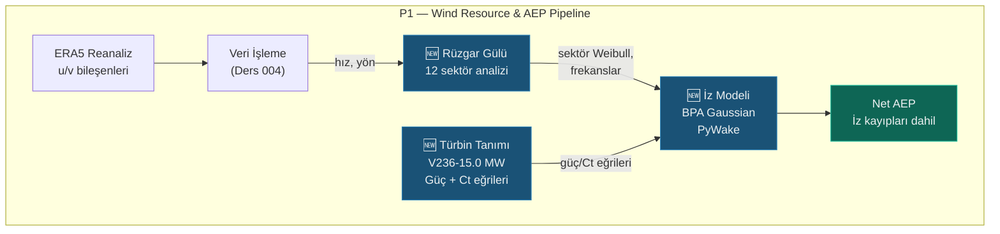

# Lesson 005 — Wind Vane Analysis and PyWake Wake Modeling

!!! abstract "Course Navigation"
:material-arrow-left: **Previous:** [Lesson 004 — P1: Database, ERA5 & Weibull](lesson-004.md) | **Next:** [Lesson 006 — Layout Optimization, Blocking & AEP Cascade](lesson-006.md) :material-arrow-right:

**Phase:** P1 | **Language:** English | **Progress:** 6 of 19 | [All Lessons](index.md) | [Learning Roadmap](../../Learning_Roadmap.md)

> **Date:** 2026-02-24
> **Commits:** 1 commit (`c7ab018`)
> **Commit range:** `bb84814a0a0bf528dd78c95d42e6341e50b89bb5..c7ab0188b07035ec2875942e5667d67c7cadba67`
> **Phase:** P1 (Wind Resource & AEP)
> **Roadmap sections:** [Phase 1 — Section 1.1 Wind Resource Assessment, Section 1.2 Wake Modelling & Layout Optimization]
> **Language:** English
> **Previous lesson:** Lesson 004
> **last_commit_hash:** c7ab0188b07035ec2875942e5667d67c7cadba67

---

## What You Will Learn

- Basic physics of wind rose analysis: direction classification, sector frequencies and energy rose (cubic law)
- Why circular statistics are different from the traditional average — Mardia formula
- The physics behind the Bastankhah-Porté-Agel (BPA) Gaussian wake model
- How Vestas V236-15.0 MW power and thrust coefficient (Ct) curves are defined and their physical limitations
- Calculate gross/net AEP, wake loss and capacity factor by running trace analysis with PyWake library.

---

## Part 1: Wind Rose — Direction Classification and Sector Frequencies

### Real Life Problem

Think of a lighthouse keeper. He notes in his diary which direction the wind blows every night. Looking at these notes at the end of the year, he draws a conclusion such as "the wind blows mostly from the west, but it is much harder when it blows from the southeast." That's exactly what wind rose analysis does — but mathematically, with thousands of measurements.

Just "average wind speed" is not enough to determine where to place turbines on a wind farm. You need to know **from which direction, how often, and at what speed** the wind blows. Without this information, you'll misplace the turbines — and they'll cut off each other's wind.

### What the Standards Say

**IEC 61400-12-1** (wind turbine power performance measurement) recommends that wind rose analysis use at least 12 sectors (30° each). As an industry standard, 12 sectors are common; In some detailed studies, 16 sectors (22.5°) are used. Sector boundaries are determined by offset from the sector center by half a sector width — so that North (0°) remains exactly at the center of sector 0.

### What We Built

**Changed files:**

- `backend/app/services/p1/wind_analysis.py` — Wind rose analysis module: sector classification, frequency, average speed, sector Weibull, energy rose, circular standard deviation
- `backend/tests/test_wind_analysis.py` — 24 unit tests: boundary conditions and physics verification for each function

The module implements the following pipeline:

1. **Direction classification** — Assign each measurement to one of 12 sectors
2. **Frequency calculation** — Ratio of each sector over total time
3. **Sector average speed** — Separate average for each direction
4. **Sector Weibull fit** — Separate Weibull distribution for each direction (reuses function `fit_weibull` from Lesson 004)
5. **Energy rose** — Energy contribution of each sector with the cubic law
6. **Circular standard deviation** — A measure of directional variability

### Why is it important?

> **Why** do we divide wind direction into sectors?
> Because working with a continuous angle distribution is computationally costly and unnecessary. In the IEC 61400-12-1 standard, 30° sectors provide sufficient resolution. Thinner sectors (22.5°) reduce statistical reliability — the number of data points per sector may be insufficient.

> **Why** is sector 0 aligned exactly in the middle of north?
> Navigation and meteorological tradition: 0° = North. If half sector width offset is not applied, winds between 359° and 1° will fall on different sectors — this is physically meaningless.

### Code Review

The sector sorting function solves the 0°/360° boundary problem with a half sector shift:

```python
def classify_direction_sector(
  directions_deg: NDArray[np.floating],
  num_sectors: int = 12,
) -> NDArray[np.intp]:
  sector_width_deg = 360.0 / num_sectors    # 12 sektör → 30° genişlik
  # Yarım sektör kaydırması: 0° kuzey, sektör 0'ın merkezinde kalır
  shifted = (directions_deg + sector_width_deg / 2.0) % 360.0
  indices = (shifted / sector_width_deg).astype(np.intp)
  # Kayan nokta kenar durumu: 360° tam sınırda kalırsa clamp
  indices = np.clip(indices, 0, num_sectors - 1)
  return indices
```

Without shifting, sector 0 covers 0°–30° — so a 355° north wind falls into sector 11 (330°–360°) and a 5° north wind falls into sector 0. With the shift, sector 0 covers 345°–15° and the “north wind” is collected in a single sector.

Sector frequencies are calculated very efficiently with `np.bincount` — the number of measurements in each sector is divided by the total number of measurements:

```python
def compute_sector_frequencies(
  sector_indices: NDArray[np.intp],
  num_sectors: int,
) -> NDArray[np.floating]:
  counts = np.bincount(sector_indices, minlength=num_sectors).astype(np.float64)
  total = counts.sum()
  if total == 0:
    return np.zeros(num_sectors, dtype=np.float64)
  return counts / total # Toplamı 1.0'a normalize et
```

It is a physical necessity that the sum of the frequencies be 1.0 — the wind must blow from one direction. In the test suite, this constraint is verified with `pytest.approx(1.0, abs=1e-10)`.

### Basic Concept

!!! tip "Basic Concept: Wind Rose"
**Simple explanation:** Think of a compass. You draw bars around it — the length of each bar represents how often the wind blows from that direction. Long stick = frequent wind. This drawing is a weather vane.

**Similarity:** Think of it like traffic flow in a city. Some roads (directions) are busier, some are empty. The traffic engineer makes wide intersections on busy roads — and the wind engineer aligns turbines with the dominant wind direction.

**In this project:** The dominant wind direction in the Polish Baltic Sea is around WSW (~240°). We should minimize wake losses by placing our 34 turbines perpendicular to this direction.

---

## Chapter 2: The Energy Rose — The Cubic Law and the True Power of the Wind

### Real Life Problem

Consider two towns: in one the wind blows gently every day (5 m/s), in the other there is a storm one day a week (20 m/s), the remaining days are calm. Which one would you build a wind farm in? Even if the average speed is similar, the wind in the stormy town carries **8 times** more energy — because wind energy is proportional to the **cube** of the speed.

### What the Standards Say

The cubic equation of wind energy comes from basic aerodynamic physics. Wind power equation: P = ½ρAv³ (where ρ is the air density, A is the swept area, v is the wind speed). This relation is used as the basis for the energy rose calculation in the **European Wind Atlas** (Risø, 1989) methodology.

### What We Built

The energy rose function calculates each sector's **contribution to total energy**:

```python
def compute_energy_rose(
  frequencies: NDArray[np.floating],
  mean_speeds_ms: NDArray[np.floating],
) -> NDArray[np.floating]:
  # NaN hızları sıfıra çevir (boş sektörler)
  speeds_clean = np.where(np.isnan(mean_speeds_ms), 0.0, mean_speeds_ms)
  # Kübik yasa: E_i ∝ f_i × v̄_i³
  energy_raw = frequencies * speeds_clean**3
  total_energy = energy_raw.sum()
  if total_energy == 0:
    return np.zeros_like(frequencies)
  return energy_raw / total_energy # Toplam = 1.0
```

The mathematics of the formula are simple but the results are striking. We verify this cubic effect in the test code:

```python
def test_high_speed_sector_dominates(self):
  """Yüksek hızlı sektör enerjiyi domine etmeli (kübik yasa)."""
  freqs = np.array([0.5, 0.5])    # Eşit frekans
  speeds = np.array([5.0, 10.0])   # 10 m/s → 5 m/s'nin 8 katı enerji
  energy = compute_energy_rose(freqs, speeds)
  # Enerji oranı: 10³/5³ = 8, sektör 1 → 8/(1+8) ≈ 0.889
  assert energy[1] == pytest.approx(8.0 / 9.0, abs=0.001)
```

The two sectors receive wind with equal frequency, but the speeds are 5 and 10 m/s. The energy distribution is not 50/50 — **11/89**. The 10 m/s sector carries 89% of the total energy. This shows that “speed” is as critical as “frequency” in turbine placement.

### Why is it important?

> **Why** frequency rose is not enough, energy rose is needed?
> Because the turbine produces income, it does not produce frequency. A sector may have wind 40% of the time, but at low speed. Another sector gets wind 10% of the time, but at high speed — and produces much more energy because of the cubic law. Optimizing turbines for energy efficiency maximizes annual energy production (AEP).

> **Why** did we substitute NaN velocities for zero?
> Empty sectors (non-data directions) mean that they physically "do not produce energy". Multiplying by NaN gives NaN and distorts the sum. Turning it to zero correctly resets the energy contribution of these sectors.

### Basic Concept

!!! tip "Basic Concept: Cubic Law"
**Simple explanation:** If the wind speed doubles, the energy it carries increases 8 times (2³ = 8). So going from a gentle breeze to a storm is a huge leap in energy.

**Similarity:** Think of a water tap. If you run the water twice as fast, you increase the pressure 8 times — you can feel it when you put your hand under the faucet. Wind works the same way.

**In this project:** The average Weibull A parameter of 10.5 m/s in the Baltic Sea means high energy potential due to the cubic law. The fact that V236-15.0 MW reaches nominal power at 12.5 m/s shows how compatible the wind regime in this region is with the turbine.

---

## Chapter 3: Circular Statistics — 0°/360° Boundary Problem

### Real Life Problem

Think about it for a hour. There are only 20 minutes between 23:50 and 00:10. But if you look "numerically", the difference between 23:50 and 0:10 appears 23 hours and 40 minutes. The same problem exists with wind directions: Is the difference between 355° and 5° 10° or 350°?

The traditional arithmetic mean collapses in this case. The average of 355° and 5° gives (355+5)/2 = 180° — dead south! However, the correct answer should be 0° (north). Circular statistics solves this problem.

### What the Standards Say

**Mardia, K.V. (1972)** — The book *Statistics of Directional Data* is the basic reference for circular statistics. Mardia's circular standard deviation formula is used to measure directional variability in wind engineering. This formula is defined in terms of the average result vector length (R̄).

### What We Built

```python
def compute_circular_std_deg(
  directions_deg: NDArray[np.floating],
) -> float:
  if len(directions_deg) == 0:
    return 0.0

  # Açıları birim çembere yansıt
  theta_rad = np.deg2rad(directions_deg)
  mean_cos = float(np.mean(np.cos(theta_rad)))
  mean_sin = float(np.mean(np.sin(theta_rad)))

  # Ortalama sonuç vektörü uzunluğu
  r_bar = np.sqrt(mean_cos**2 + mean_sin**2)

  # R̄ = 0 → tam düzgün dağılım, log(0) hatası → clamp
  r_bar = max(r_bar, 1e-10)

  # Mardia formülü: σ_c = √(-2 × ln(R̄))
  circular_std_rad = np.sqrt(-2.0 * np.log(r_bar))
  return float(np.degrees(circular_std_rad))
```

The mathematics of the formula is based on the unit circle. Each angle (θ) is represented as a point on the circle: (cos θ, sin θ). If all points are averaged, the resulting **length of the resulting vector** (R̄) shows how “collected” the directions are:

- **R̄ ≈ 1** → All directions the same → σ_c ≈ 0° (very low dispersion)
- **R̄ ≈ 0** → Directions are completely uniformly distributed → σ_c is large (~81°)

This value is verified in the test suite: constant direction → σ_c ≈ 0°, uniform distribution → σ_c > 70°.

### Why is it important?

> **Why** do we use circular statistics instead of arithmetic mean?
> Angles are subject to mod 360 arithmetic. The correct distance between 355° and 5° is 10°, but the arithmetic difference gives 350°. The `np.cos` and `np.sin` transformations eliminate this wrap-around problem by projecting the angles into Euclidean space.

> **Why** do we limit R̄ to 1e-10 (clamping)?
> In a perfectly uniform distribution, R̄ = 0 and `log(0)` is undefined (−∞). In numerical calculation this produces `NaN` or `inf`. The 1e-10 clamp gives a physically meaningful upper bound (≈ 86°) and prevents the program from crashing.

### Basic Concept

!!! tip "Basic Concept: Circular Statistics"
**Simple explanation:** Averaging with normal numbers works on a line. But compass directions are on a circle — after 360°, you come back to 0°. Circular statistics uses special mathematics for these "numbers on a circle".

**Similarity:** Think of a Ferris wheel. When calculating the distance between cabin "number 3" and "number 11", you can go through cabin number 12 and take a shortcut. Circular statistics finds this "shortcut" automatically.

**In this project:** We expect circular standard deviation ~60-80° in the Polish Baltic (moderate directional spread). This value determines whether the turbines will be optimized for a single direction (low σ_c) or for multiple directions (high σ_c).

---

## Part 4: V236-15.0 MW Power and Thrust Coefficient Curves

### Real Life Problem

Think of the engine map (torque map) of a car. The harder you press the gas pedal, the engine produces power within a certain rev range. But there is a lower limit (below idle the engine stops) and an upper limit (in the red zone the security system intervenes). The wind turbine is the same: it produces electricity within a certain speed range, and this speed-power relationship is defined by the **power curve**.

### What the Standards Say

**IEC 61400-12-1:2017** defines the power curve measurement methodology. Each turbine manufacturer provides its certified power curve according to this standard. There are three critical speeds in the power curve:

- **Cut-in:** 3 m/s — below which the turbine does not rotate
- **Rated (nominal):** 12.5 m/s — rated power (15 MW) is reached
- **Cut-out (disabled):** 31 m/s — turbine stops for safety reasons

### What We Built

**Changed files:**

- `backend/app/services/p1/wake_model.py` — V236-15.0 MW power/Ct curves + PyWake integration

The power curve is calculated from the table by linear interpolation and physical constraints apply:

```python
def get_v236_power_curve_kw(
  wind_speeds_ms: NDArray[np.floating],
) -> NDArray[np.floating]:
  # Tablo verilerinden doğrusal interpolasyon
  power_kw = np.interp(wind_speeds_ms, _POWER_CURVE_SPEEDS_MS, _POWER_CURVE_KW)

  # Fizik kırpma (Rule 1: fiziksel kısıtlamalar tartışılmaz)
  power_kw = np.clip(power_kw, 0.0, RATED_POWER_KW)     # 0 ≤ P ≤ 15,000 kW
  power_kw = np.where(wind_speeds_ms < CUT_IN_SPEED_MS, 0.0, power_kw)  # < 3 m/s → 0
  power_kw = np.where(wind_speeds_ms > CUT_OUT_SPEED_MS, 0.0, power_kw) # > 31 m/s → 0

  return power_kw.astype(np.float64)
```

A three-layer security scheme is implemented: first, with `np.clip`, the power can never go below 0 or above 15,000 kW. Then the speeds below the cut-in are reset. Finally, the speeds above the cut-out are reset. This “belt-and-suspenders” approach follows **Rule 1** — physical restraints are non-negotiable.

The thrust coefficient (Ct) curve has a similar structure but has a different physical meaning:

```python
def get_v236_ct_curve(
  wind_speeds_ms: NDArray[np.floating],
) -> NDArray[np.floating]:
  ct = np.interp(wind_speeds_ms, _CT_CURVE_SPEEDS_MS, _CT_CURVE_VALUES)
  ct = np.clip(ct, 0.0, 1.0)      # 0 ≤ Ct ≤ 1 (fiziksel sınır)
  ct = np.where(wind_speeds_ms < CUT_IN_SPEED_MS, 0.0, ct)
  ct = np.where(wind_speeds_ms > CUT_OUT_SPEED_MS, 0.0, ct)
  return ct.astype(np.float64)
```

An important feature of the Ct curve: near the cut-in Ct is very high (~0.90), while at rated speed it is low (~0.28). This indicates that at low speeds the turbine draws too much momentum from the wind, while at higher speeds it becomes more "transparent".

### Why is it important?

> **Why** do we define the power curve as a table + interpolation and not as an analytic function?
> Real turbine power curves cannot be expressed by a smooth analytical function due to complex aerodynamic effects. Manufacturer data comes in tabular format. Linear interpolation with `np.interp` is the industry standard approach and avoids derived errors.

> **Why** is the Ct curve critical for wake modelling?
> Trace models use the Ct value to calculate the downstream velocity deficit. In the BPA formula: ΔU/U₀ ∝ √(Ct). Wrong Ct curve → wrong track width → wrong AEP calculation → wrong investment decision.

### Basic Concept

!!! tip "Basic Concept: Thrust Coefficient (Ct)"
**Simple explanation:** Ct is a number that indicates how well the turbine "resists" the wind. If Ct = 1, the turbine would stop the wind completely (physically impossible). If Ct = 0, the turbine is not visible — the wind does not slow down at all.

**Similarity:** Reach out your hand out the car window. When you turn your palm into the wind (high Ct) you feel a lot of resistance. When you turn your hand to the side (low Ct) the resistance decreases.

**In this project:** Ct value of V236-15.0 MW is ~0.90 at cut-in, ~0.28 at rated. This means that at low speeds, serious wake occurs behind the turbine, and at high speeds, the wake effect decreases. This speed dependence is critical when calculating trace losses.

---

## Part 5: BPA Gaussian Trace Model with PyWake

### Real Life Problem

Consider the trail water behind a cruise ship. After the ship passes, a long turbulence wake remains on the water surface. This mark shakes the boat behind and makes it difficult to move forward. Wind turbines create the same effect: as they extract energy from the wind, they leave behind a zone of slower, more turbulent wind. This wake effect causes downstream turbines to produce less energy.

### What the Standards Say

**Bastankhah & Porté-Agel (2014)** — The article *Journal of Fluid Mechanics*, 781, 706-730 is the reference work of the Gaussian wake model. The model is based on three basic equations:

1. **İz açıgı (wake deficit):** ΔU/U₀ = (1 - √(1 - Ct/(8(σ/D)²)))
2. **Wake expansion:** σ(x) = k*x + D/√8, where k* = 0.3837·TI + 0.003678
3. **Linear superposition:** Total deficit = Σ individual deficits

This approach is implemented as `BastankhahGaussianDeficit` in the **PyWake** library developed by DTU Wind Energy.

### What We Built

PyWake integration uses a three-layer architecture: **Site** (wind source) → **Turbine** (machine definition) → **Wake Model** (wake simulation).

```python
def configure_wake_model(site: Any, turbine: Any) -> Any:
  from py_wake.deficit_models.gaussian import BastankhahGaussianDeficit
  from py_wake.superposition_models import LinearSum
  from py_wake.turbulence_models import STF2017TurbulenceModel
  from py_wake.wind_farm_models import All2AllIterative

  return All2AllIterative(
    site=site,
    windTurbines=turbine,
    wake_deficitModel=BastankhahGaussianDeficit(), # BPA Gaussian deficit
    superpositionModel=LinearSum(),         # Doğrusal toplam
    turbulenceModel=STF2017TurbulenceModel(),    # Frandsen türbülans
  )
```

Each component of the model has a physical rationale:

- **All2AllIterative** — Calculates the wake effect between each pair of turbines (iteratively until convergence)
- **BastankhahGaussianDeficit** — Deficit model that models the trace profile as a Gaussian (bell curve)
- **LinearSum** — Calculates the total effect of multiple traces when they overlap
- **STF2017TurbulenceModel** — Frandsen-based turbulence model; Calculates increased turbulence in tracks

Simulation results are collected in a structured data class:

```python
def run_wake_analysis(x_positions_m, y_positions_m, site, turbine=None):
  # ... simülasyonu çalıştır ...

  # Kapasite faktörü: CF = net_AEP / (P_rated × 8760h × n_turbines)
  n_turbines = len(x_positions_m)
  theoretical_gwh = RATED_POWER_KW * 1e-6 * 8760.0 * n_turbines # GWh
  capacity_factor = total_net_gwh / theoretical_gwh

  return WakeAnalysisResult(
    gross_aep_gwh=total_gross_gwh,   # İzsiz brüt enerji
    net_aep_gwh=total_net_gwh,     # İz kayıpları sonrası net enerji
    wake_loss_percent=wake_loss_pct,   # İz kaybı yüzdesi
    per_turbine_aep_gwh=...,      # Türbin başına net AEP
    per_turbine_wake_loss_percent=..., # Türbin başına iz kaybı
    capacity_factor=capacity_factor,   # Net kapasite faktörü
  )
```

Capacity factor formula: CF = AEP_net / (P_rated × 8760 × n). This shows how efficiently the turbines are operating compared to theoretical full capacity. We expect CF ≈ 0.45–0.50 for a single turbine in Baltic conditions (Weibull A=10.5, k=2.2).

### Why is it important?

> **Why** did we choose the BPA Gaussian model instead of the Jensen/Park model?
> The Jensen model (1983) assumes the scar profile to be “top line”—full open inside the track, zero outside. In reality, the trace profile is Gaussian (dense in the center, decreasing towards the edges). The BPA model has been validated by wind tunnel experiments and is more accurate, especially for large modern turbines.

> **Why** do we use `All2AllIterative`?
> Because turbines affect each other's wakes (secondary wake effects). Single-pass (non-iterative) models cannot capture this interaction. The iterative approach converges to a physically consistent equilibrium state by updating the trace fields.

### Basic Concept

!!! tip "Basic Concept: Wake Loss"
**Simple explanation:** The rear turbine uses the "residual wind" of the front turbine. Because this residual wind is slower, the trailing turbine produces less electricity. This difference is "trace loss".

**Analogy:** A cyclist who is "drafting" (slipstreaming) in a bicycle race feels less wind resistance — but in this case, it's a good thing. In turbines, it's the opposite: the rear turbine receives LESS energy because the front turbine has absorbed the energy of the wind.

**In this project:** Typical wake loss is expected to be in the range of 5-10% in our 34 turbine farm. 510 MW × 8760 hours × CF 0.45 ≈ 2,009 GWh gross. 8% trace loss → ~161 GWh loss → approximately €12M revenue loss per year (at €75/MWh). That's why turbine layout optimization is critical.

---

## Chapter 6: From Wind Vane to Trace Analysis — Pipeline Integration

### Real Life Problem

Think of a restaurant kitchen. There is a chain of ingredient supplier (ERA5 data) → chef (data processing) → recipe (physics models) → plate presentation (result). Each ring depends on the previous one. The connection between wind rose analysis and wake modeling works in the same way: wind rose results are converted into a PyWake site object and fed into the wake simulation.

### What We Built

The `create_site_from_wind_rose` function converts the output of the wind rose analysis into a format that PyWake understands:

```python
def create_site_from_wind_rose(
  wind_rose_result: object,
  turbulence_intensity: float = 0.06,
) -> Any:
  wr = wind_rose_result
  num_sectors = wr.num_sectors

  sector_a = np.zeros(num_sectors, dtype=np.float64)
  sector_k = np.zeros(num_sectors, dtype=np.float64)
  for i in range(num_sectors):
    weibull_i = wr.sector_weibull[i]
    if weibull_i is not None:
      sector_a[i] = weibull_i.scale_a_ms
      sector_k[i] = weibull_i.shape_k
    else:
      # Fallback: genel ortalama hız ve k=2.0
      sector_a[i] = float(np.nanmean(wr.mean_speeds_ms))
      sector_k[i] = 2.0

  return UniformWeibullSite(
    p_wd=wr.frequencies, # Sektör frekansları → yön ağırlıkları
    a=sector_a,      # Sektör Weibull A → hız dağılımı
    k=sector_k,      # Sektör Weibull k → şekil parametresi
    ti=turbulence_intensity,
  )
```

This function directly uses the Weibull parameters we created in Lesson 004 — this is where the power of modular design comes into play. `fit_weibull` (Lesson 004) → `WindRoseResult.sector_weibull` (This lesson, Part 1) → `create_site_from_wind_rose` (This chapter) → PyWake simulation (Part 5).

For sectors that fail the Weibull fit (insufficient data) a clever fallback strategy is applied: overall mean velocity and default k=2.0 (Rayleigh distribution — the most common default shape parameter in wind engineering).

### Why is it important?

> **Why** should we use wind rose based site instead of uniform site?
> Uniform site assumes that the wind blows equally from all directions — in the real world, this is almost never true. The dominant WSW wind in the Baltic dramatically affects directional wake losses. Wind rose based site gives 2-5% more accurate AEP estimate using true directional distribution.

> **Why** do we use k=2.0 fallback for failed fits?
> k=2.0 is a special value: The Weibull distribution turns into the Rayleigh distribution at this value. Rayleigh is considered "best guess if no prior knowledge" in wind engineering. This is a reasonable fallback choice — neither overly optimistic nor pessimistic.

### Basic Concept

!!! tip "Basic Concept: Pipeline Integration"
**Simple explanation:** Each module (ERA5 → Weibull → wind rose → wake) works like a pipeline. The output of one module is the input of another. If you keep every port in the pipeline clean and standardized, you can easily expand the system.

**Analogy:** Think of it like LEGO bricks. Each piece conforms to a specific size standard. Parts from different sets can be fitted together because their connection points are the same.

**In this project:** The data class `WindRoseResult` is the "LEGO port" in the pipeline. Wind analysis module produces in this format, wake model module reads from this format. We will use the same link when layout optimization is added in the future.

---

## Links

**Where will these concepts continue:**

- **Energy rose** (Part 2) → In P1 layout optimization, turbines will be placed perpendicular to the dominant direction of the energy rose
- **Trace loss** (Part 5) → P1 will be the main component of the gross-net energy cascade in the AEP calculation (P50/P75/P90 calculation)
- **Capacity factor** (Chapter 5) → CF in P1 LCOE calculation will directly input into revenue forecast
- **Pipeline architecture** (Part 6) → Pandapower load flow pipeline will be established in P2 with the same pattern

**Link to Lesson 004:** In this lesson, we reused the `fit_weibull` function on a sector-by-sector basis — the physics module we created in Lesson 004 became part of the pipeline.

---

## The Big Picture

*Focus of this course: **Analyzing wind resource data directionally and converting it into net energy production with a wake model.***



*For full system architecture, see [Lessons Overview](index.md#system-architecture).*

---

## Key Takeaways

1. The wind rose is the key input to wind farm design — the frequency rose + energy rose together determine the turbine layout.
2. Due to the cubic law (P ∝ v³), speed differences are reflected exponentially in the energy difference — 2 times speed = 8 times energy.
3. Circular statistics solves the 0°/360° spiral problem with the unit circle transformation — it cannot be used for traditional mean direction data.
4. The Ct curve is the most critical input to wake modeling—high Ct (strong wake) at low speeds, low Ct (weak wake) at high speeds.
5. The BPA Gaussian wake model replaces Jensen's "top line" assumption with a realistic Gaussian profile—providing an accuracy advantage for large modern turbines.
6. Pipeline architecture (wind rose → site → wake model → AEP) enforces modular design — the input and output of each module must be clearly defined.
7. Physical constraints (P ≥ 0, P ≤ rated, Ct ∈ [0,1]) must be implemented in the code with multiple layers of security (clip + where) — Rule 1 is non-negotiable.

---

## Recommended Reading

*[Learning Roadmap](../../Learning_Roadmap.md) — Phase 1: Wind Energy Fundamentals*

| Source | Type | Why Read |
| -------- | ----- | ---------------- |
| Batankhah & Porté-Agel (2014), *J. Fluid Mech.*, 781 | academic article | Original article of the BPA Gaussian trace model we use in this lesson |
| Manwell, McGowan, Rogers — *Wind Energy Explained* (3. baskı) | Textbook | Part 2-3: Wind source and windmill methodology |
| PyWake Documentation (DTU Wind Energy) | Software documentation | py-wake.readthedocs.io — wake model configuration and sample notebooks |
| DTU Wind Energy — *Wake Modelling and Simulation* | Video lessons | Free on YouTube — visual explanation of track physics |
| Burton et al. — *Wind Energy Handbook* (3rd edition, 2021) | reference book | Part 1-4: Wind resource assessment and wake modeling basics |

---

## Quiz — Test Your Understanding

### Recall Questions

**Q1:** According to the IEC 61400-12-1 standard, how many sectors are recommended to be used for wind rose analysis and how many degrees of angle does each sector cover?

<details>
<summary>Reply</summary>

12 sectors are recommended, each covering 30° (360° / 12 = 30°). Some detailed studies use 16 sectors (22.5°), but 12 sectors is the industry standard because it provides the optimal balance between statistical reliability and directional resolution.

</details>

**Q2:** What are the cut-in, rated and cut-out speeds of the V236-15.0 MW turbine and what is the approximate thrust coefficient (Ct) at the rated speed?

<details>
<summary>Reply</summary>

Cut-in: 3 m/s, rated: 12.5 m/s, cut-out: 31 m/s. Ct at rated speed is approximately 0.28. The fact that Ct is very high at low speeds (~0.90) and low at high speeds indicates that the turbine draws more momentum from the wind at low speeds.

</details>

**Q3:** What is R̄ in the function `compute_circular_std_deg` and what does it mean when it is equal to zero?

<details>
<summary>Reply</summary>

R̄ (mean result vector length) is the magnitude of the mean vector of all direction measurements on the unit circle. R̄ = 0 means that the directions are completely uniform — that is, the wind blows equally frequently from all directions. In this case, the circular standard deviation reaches its maximum value (~81°).

</details>

### Comprehension Questions

**Q4:** If the wind speeds are 6 m/s and 12 m/s in two sectors of equal frequency, what is the energy contribution rate of these two sectors in the energy rose? Show the calculation steps.

<details>
<summary>Reply</summary>

Cubic law: E_i ∝ f_i × v̄_i³. Since the frequency of both sectors is equal (f₁ = f₂ = 0.5), the energy ratio depends only on the cube of the velocities. E₁ ∝ 0.5 × 6³ = 0.5 × 216 = 108. E₂ ∝ 0.5 × 12³ = 0.5 × 1728 = 864. Total = 972. Sector 1 share: 108/972 = 11.1%. Sector 2 share: 864/972 = 88.9%. Although the speed is doubled, the energy contribution is 8 times greater—a direct result of the cubic law.

</details>

**Q5:** Why was the BPA Gaussian model preferred instead of the Jensen/Park model? What is the main physical difference between the two models?

<details>
<summary>Reply</summary>

The Jensen model (1983) assumes the wake profile to be “top hat” (rectangular)—a constant velocity deficit inside the track, zero outside. In fact, wind tunnel experiments have shown that the wake profile is shaped like a Gaussian (bell curve), dense in the center and decreasing towards the edges. By capturing this realistic profile, the BPA model provides more accurate wake width and clearance calculation, especially for modern turbines with large rotor diameters (such as V236, D = 236 m). As a result, the AEP estimate becomes 1-3% more accurate.

</details>

**Q6:** Why is the default value of k=2.0 used for sectors with Weibull fit failure in the `create_site_from_wind_rose` function? What is the statistical significance of k=2.0?

<details>
<summary>Reply</summary>

k=2.0 is a special value: At this value, the Weibull distribution turns into the Rayleigh distribution. The Rayleigh distribution is the standard distribution in wind engineering (used as a reference in IEC 61400-1) that is considered the "best assumption in the absence of prior information". It assumes a velocity distribution that is neither too narrow (high k) nor too wide (low k). This is a reasonable fallback choice in case of insufficient data — it allows analysis to continue without paralyzing the project.

</details>

### Challenge Question

**Q7:** In our 34-turbine Baltic Wind farm, what differences in AEP estimation can be expected between the uniform site and the wind rose-based site, considering the dominant WSW (~240°) wind direction? Which turbines does this difference affect the most and why?

<details>
<summary>Reply</summary>

Uniform site assumes that the wind blows equally from all directions and centers the wake losses directionally. The wind rose based site predominantly simulates the dominant WSW direction. In this case, turbine rows aligned in the WSW direction experience much greater wake effect — because the wind blows from that direction the vast majority of the time.

Practical effect: (1) The AEP of back row turbines on the dominant direction drops by 8-15% (in the uniform model this is underestimated by 3-5%). (2) Turbines positioned perpendicular to the dominant direction experience almost no wake effect. (3) Farm total AEP is generally 2-5% lower in the wind rose model because true directional wake stacking is captured.

This difference particularly affects financial modeling: a 3% AEP difference corresponds to a revenue difference of ~60 GWh ≈ €4.5M per year on a 510 MW farm. That's why banks demand wind rose-based analysis — a uniform model is inadequate.

</details>

---

## Interview Corner

### Simple Explanation
*"How would you explain wind rose analysis and wake modeling to a non-engineer?"*

Let's say you have a field and you want to install wind mills. Your first question is "where does the wind usually blow from?" It will happen. To find out, you put a wind meter up for a year and record the direction and speed of the wind every hour. At the end of the year, you graph this data on a compass — this is the “wind rose.” The long arms of the rose show the directions where the wind blows most often.

But there is another problem: if you place the mills too close, the front mill will "steal" the wind from the rear one. Just like you don't feel the wind when driving behind a truck. This is called the "trace effect". Our computer model calculates the wind loss behind each mill and tells us how far apart we should place the mills. As a result, we can estimate how much electricity the farm will produce per year — which prompts investors to ask “will this project make money?” gives the answer to the question.

### Technical Description
*"How would you explain wind rose analysis and wake modeling in a job interview?"*

Wind rose analysis converts hub-height time series into a directional source characterization. We perform a 12-sector analysis in accordance with IEC 61400-12-1 and apply Weibull fit based on sector frequencies, average speeds and sectors. The energy rose quantifies the energy contribution of each sector with the cubic law (P ∝ v³). We measure directional dispersion using the Mardia formula for circular statistics (σ_c = √(-2ln R̄)) — this is the critical parameter that determines directional sensitivity in layout optimization.

On the wake modeling side, we use linear superposition with the Bastankhah-Porté-Agel (2014) Gaussian explicit model and the STF2017 turbulence model. This configuration iteratively calculates the wake interaction between each pair of turbines with PyWake's `All2AllIterative` solver. The speed-dependent Ct curve of V236-15.0 MW directly affects the wake width and deficit size. Pipeline architecture is modular: `WindRoseResult` → `UniformWeibullSite` → `BastankhahGaussianDeficit` → `WakeAnalysisResult`. This architecture is ready for future integration of layout optimization (genetic algorithm) and P50/P75/P90 uncertainty analysis. In Baltic conditions, we expect a single turbine CF ≈ 0.45, 5-10% wake loss across 34 turbine farms — which puts the net AEP in the ~1,850-1,900 GWh range.
