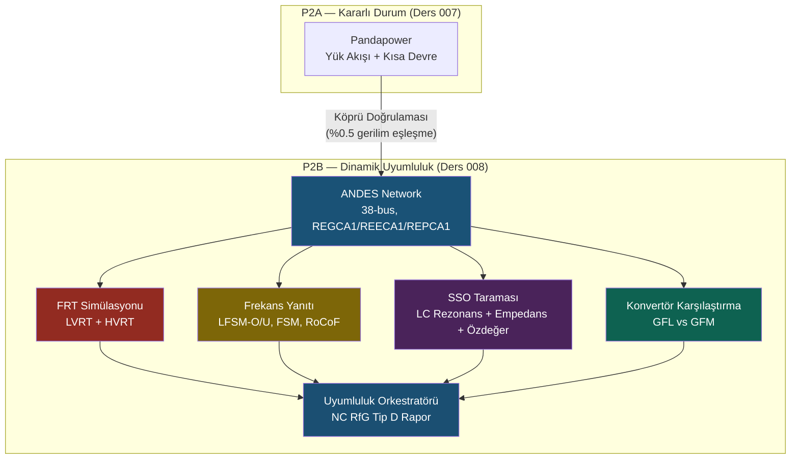

# Lesson 008 — Dynamic Grid Compatibility: ANDES, FRT, Frequency Response, SSO & Converter Comparison

!!! abstract "Course Navigation"
:material-arrow-left: **Previous:** [Lesson 007 — HV Grid Integration: Pandapower Steady State Model](lesson-007.md) | **Next:** [Lesson 009 — IEC 61850 Data Model, SCL & SCADA Device Logging System](lesson-009.md) :material-arrow-right:

**Phase:** P2 | **Language:** Turkish | **Progress:** 2 / ? | [All Lessons](index.md) | [Learning Roadmap](../../Learning_Roadmap.md)

> **Date:** 2026-02-25
> **Commits:** 1 commit (`2870f65` → `2870f65`)
> **Commit range:** `2870f65581ff4829308754b84cdb4c75cfcc62c7..2870f65581ff4829308754b84cdb4c75cfcc62c7`
> **Phase:** P2 (HV Grid Integration — Dynamic Compliance)
> **Roadmap sections:** [Phase 2 — Section 2.4 Grid Codes & Compliance, Section 2.3 FACTS Devices]
> **Language:** Turkish
> **Previous lesson:** Lesson 007
> **last_commit_hash:** 2870f65581ff4829308754b84cdb4c75cfcc62c7

---

## What You Will Learn

- Type-4 wind turbine dynamic model stack (REGCA1 / REECA1 / REPCA1) and physical meaning of each layer
- LVRT/HVRT failover simulation and compliance with PSE IRiESP voltage envelope
- Frequency response modes (LFSM-O, LFSM-U, FSM, RoCoF) and droop formula
- Sub-synchronous oscillation (SSO) scanning: cable LC resonance, impedance scanning, eigenvalue analysis
- Grid-Following (GFL) and Grid-Forming (GFM) converter strategies and their differences in weak grid

---

## Part 1: ANDES Dynamic Network Model — From Pandapower to Time Domain

### Real Life Problem

In Lesson 007, we did load flow and short circuit calculations with Pandapower — these were like “photographs”: showing the state of the grid at a single moment in time. But in the real network, failures occur and end within milliseconds. You can't measure the speed of a car with a photo; you need video (time series simulation) for this. ANDES is this “video camera” — it simulates in the time domain to show how the converter controls behave in the event of a fault.

### What the Standards Say

ENTSO-E NC RfG (EU 2016/631) Article 20-21 lists requirements that must be verified by dynamic simulation for Type D generators (>75 MW, ≥110 kV):

- **Article 20:** Fault through (FRT) — remaining within voltage-time profile
- **Article 21:** Reactive current injection during fault (Kqv ≥ 2.0)
- **Item 15:** Frequency response (LFSM-O, LFSM-U, FSM)
- **Article 13(1)(b):** RoCoF resistance (2 Hz/s, 500 ms)

PSE IRiESP §2.3-2.4 defines the Polish-specific LVRT envelope and frequency parameters.

### What We Built

**Changed files:**

- `backend/app/services/p2/andes_network.py` — 38-bus dynamic network model in ANDES format, REGCA1/REECA1/REPCA1 dynamic control models
- `backend/app/services/p2/frt_simulation.py` — LVRT/HVRT failover simulation
- `backend/app/services/p2/frequency_response.py` — Frequency response simulation (4 modes)
- `backend/app/services/p2/sso_analysis.py` — Sub-synchronous oscillation scan
- `backend/app/services/p2/converter_comparison.py` — GFL vs GFM converter comparison
- `backend/app/services/p2/dynamic_compliance.py` — NC RfG Type D compliance orchestrator
- `backend/app/models/grid.py` — 4 new SQLAlchemy tables (FRT, frequency, SSO, compatibility)
- `backend/app/schemas/grid.py` — 5 new Pydantic schemes + 4 StrEnum

We *did not* modify the Pandapower steady-state model — we built the ANDES network from the same shared constants (cable specifications, transformer data, topology) and verified 0.5% voltage matching between the two models. This “bridge validation” strategy ensures that two independent engines consistently represent the same physical network.

### Why is it important?

> **Why** Pandapower is not enough, we need ANDES?
> Pandapower is a steady-state solver — it calculates a single operating point. But NC RfG asks us to see how the converter reacts in the event of a fault with a time constant of 20 ms. This is only possible with time domain simulation (TDS). With its symbolic-numeric hybrid approach, ANDES compiles dynamic models and translates them into efficient numerical code.

> **Why** do we share the same constants?
> If two separate network models (Pandapower + ANDES) were created with different parameters, we would not know which result was "correct". Shared constants + hyperlink validation ensure consistency — this is standard practice in industrial PSCAD/PowerFactory projects.

### Code Review

The Type-4 wind turbine dynamic model stack has three layers. The following code shows the parameters and physical meaning of each layer:

```python
# REGCA1 — Jeneratör/konvertör modeli (en alt katman)
# Konvertörü kontrollü akım kaynağı olarak modeller
# Tg = 20 ms: konvertör IGBTlerinin anahtarlama gecikmesi
def get_regca1_params() -> dict[str, float]:
  return {
    "Tg": 0.02,    # Konvertör zaman sabiti [s] — I(s) = I_ref / (1 + s×Tg)
    "Rrpwr": 10.0,  # Aktif güç rampa sınırı [pu/s]
    "Brkpt": 0.9,   # Düşük gerilim kırılma noktası [pu]
    "Zerox": 0.4,   # Ip = 0 gerilim seviyesi [pu]
  }
```

This transfer function I(s) = I_ref / (1 + s×Tg) expresses a simple first-order delay: the converter follows the reference current command with a time constant of 20 ms. Although the actual IGBT switching frequency is ~2 kHz, the average model filters out this detail.

```python
# REECA1 — Elektriksel kontrol (orta katman)
# Arıza sırasında reaktif akım enjeksiyonu: ΔIq = Kqv × (V_ref - V)
# Kqv ≥ 2.0: NC RfG minimum — %1 gerilim sapması başına %2 reaktif akım
def get_reeca1_params() -> dict[str, float]:
  return {
    "Kqv": 2.5,    # Reaktif akım kazancı [pu/pu] — NC RfG ≥ 2.0
    "dbd1": -0.1,   # Ölü bant alt sınırı [pu]
    "dbd2": 0.1,   # Ölü bant üst sınırı [pu]
    "Vdip": 0.15,   # FRT gerilim çöküş eşiği [pu]
    "Imax": 1.1,   # Maksimum toplam akım [pu]
    "PQFlag": 0,   # 0 = Q önceliği (arızada reaktif akım öncelikli)
  }
```

The value Kqv = 2.5 is above the NC RfG minimum of 2.0 — this is a conscious design decision. Working above the minimum provides a margin of safety in compliance testing due to measurement uncertainty and parameter variation.

```python
# REPCA1 — Santral kontrolörü (en üst katman)
# Santral seviyesinde gerilim ve frekans droop kontrolü
# ΔP = -(P_rated / R) × (Δf / f_nom)  R = 5% (varsayılan droop)
def get_repca1_params() -> dict[str, float]:
  return {
    "Kp": 18.0,     # Gerilim regülasyonu oransal kazancı
    "Ki": 5.0,     # Gerilim regülasyonu integral kazancı
    "FFlag": 1,     # 1 = frekans regülasyonu aktif
    "fdbd1": -0.0006,  # Frekans ölü bandı alt [pu] → -0.03 Hz
    "fdbd2": 0.0006,  # Frekans ölü bandı üst [pu] → +0.03 Hz
  }
```

The frequency deadband was set at ±0.03 Hz (±0.0006 pu). Although this value is above the ±10 mHz minimum allowed by NC RfG, it is a common choice in industrial application to avoid unnecessary actuation.

### Basic Concept

!!! tip "Basic Concept: Dynamic Model Stack (REGCA1 / REECA1 / REPCA1)"
**Simple explanation:** Think of a car. The engine (REGCA1) produces the power, the accelerator and brake (REECA1) control the instantaneous response, the cruise control (REPCA1) maintains the long-term goal. When there is a malfunction (obstacle on the road), first the brake is activated (REECA1 reactive current), then the cruise control adapts to the new situation (REPCA1).

**Analogy:** In an orchestra, REGCA1 is the musician (plays the instrument), REECA1 is the section conductor (manages the immediate dynamics), and REPCA1 is the conductor (sets the overall tempo and tone).

**In this project:** Each of the 34 turbines has this three-layer control stack. ANDES solves 34 × 3 = 102 dynamic model instances simultaneously. Pandapower can't do that — it only knows steady state.

---

## Part 2: Fail Through (FRT) Simulation — Staying Connected in the Storm

### Real Life Problem

Think of a ship — it shouldn't break its anchors and drift away in a storm. Likewise, the wind farm must not disconnect during grid failure (voltage collapse) and must even assist the grid. Otherwise, a sudden power loss of 510 MW could lead to a cascading failure.

### What the Standards Say

The PSE IRiESP LVRT envelope defines the voltage-time profile:

| Time [ms] | Minimum Voltage [pu] |
| ------------ | ---------------------- |
| 0 | 0.15 |
| 140 | 0.25 |
| 500 | 0.85 |
| 1000 | 0.85 |
| 1500 | 1.00 |
| 3000 | 1.00 |

NC RfG Article 21 imposes additional requirements:

- **Reactive current:** ΔIq ≥ 2% × ΔV (Kqv ≥ 2.0)
- **Active power recovery:** ≥90% within 1.0 s after fault clearance
- HVRT: 100 ms withstand 1.25 pu voltage

### What We Built

**Changed files:**

- `backend/app/services/p2/frt_simulation.py` — FRT simulation engine
- `backend/app/schemas/grid.py` — `FRTSimulationResponse`, `FRTTimePoint`, `FRTType`

The simulation consists of three phases: pre-fault steady state (0 → 0.5 s), fault period (0.5 → 0.65 s, 150 ms), post-fault observation (0.65 → 3.65 s). ANDES TDS uses implicit trapezoidal integration and solves in 1 ms steps.

### Why is it important?

> **Why** should the wind farm remain connected during fault?
> In old grid codes, wind farms could be withdrawn in case of fault. But when renewable energy penetration exceeds 30-50%, the sudden loss of 510 MW causes frequency drop and cascade failures in the system. FRT is the insurance of system stability.

> **Why** do we inject reactive current?
> During voltage sag, reactive current injection limits the fault effect by supporting the PCC voltage. Formula: ΔIq = Kqv × ΔV. With Kqv = 2.5, at 10% voltage drop, 25% reactive current is injected — this pushes the voltage up and prevents the fault from propagating.

### Code Review

The PSE LVRT envelope is defined point by point in the code:

```python
# PSE IRiESP LVRT gerilim-zaman zarfı
# WTG'ler bu eğrinin ÜSTÜNDE kaldığı sürece bağlı kalmalıdır
PSE_LVRT_ENVELOPE = [
  (0.000, 0.15),  # t=0: gerilim 0.15 pu'ya düşebilir
  (0.140, 0.25),  # t=140ms: minimum 0.25 pu
  (0.500, 0.85),  # t=500ms: 0.85 pu'ya toparlanma
  (1.000, 0.85),  # t=1.0s: 0.85 pu'da kalma
  (1.500, 1.00),  # t=1.5s: tam toparlanma
  (3.000, 1.00),  # t=3.0s: sürekli işletme
]

# Uyumluluk eşikleri
MIN_KQV = 2.0          # NC RfG minimum reaktif akım kazancı
POWER_RECOVERY_THRESHOLD = 0.90 # Arıza sonrası %90 güç toparlanması
POWER_RECOVERY_TIME_S = 1.0   # 1.0 s içinde toparlanma
```

These points are taken directly from PSE IRiESP §2.3.2. Each dot represents the limit at which the grid operator says, "From now on, if you're at this voltage, you need to stay connected."

The reactive current compatibility check finds the worst point in the fault period and calculates Kqv:

```python
def check_reactive_current_compliance(
  time_series: list[FRTTimePoint],
  t_fault: float,
  t_clear: float,
  k_qv_min: float = MIN_KQV,
) -> tuple[bool, float]:
  """ΔIq / ΔV oranını hesaplayarak NC RfG Kqv ≥ 2.0 kontrolü yapar."""
  pre_v = pre_fault_points[-1].voltage_pu
  pre_iq = pre_fault_points[-1].reactive_current_pu

  # Arıza süresince en düşük gerilim noktası
  min_v_point = min(fault_points, key=lambda p: p.voltage_pu)
  delta_v = pre_v - min_v_point.voltage_pu
  delta_iq = abs(min_v_point.reactive_current_pu - pre_iq)

  kqv_actual = delta_iq / delta_v
  return kqv_actual >= k_qv_min, kqv_actual
```

This function is a pure physics measurement: it takes the voltage-current difference before and during the fault and rates it. If Kqv ≥ 2.0, comply with NC RfG; If not, REECA1 parameters must be adjusted.

### Basic Concept

!!! tip "Basic Concept: Fault Ride-Through"
**Simple explanation:** It's like a cyclist hitting a pothole on the road and continuing without falling. Pothole = voltage collapse, cyclist maintaining balance = WTG remaining attached, trying to straighten track = reactive current injection.

**Analogy:** While the fire truck is going to the fire area, there is a pothole on the road. It cannot stop and return (loss of power would crash the system). It must pass through the hole (ride-through) and even start repairing the road while passing (voltage support with reactive current).

**In this project:** Our 510 MW farm must remain connected during a 150 ms three-phase fault on the OSS 66 kV busbar, inject reactive current with Kqv ≥ 2.0 and recover 90% to active power within 1 s.

---

## Chapter 3: Frequency Response — Keeping the Pulse of the Grid

### Real Life Problem

Bir bisiklette pedal çevirmeyi düşünün. When going uphill, your speed decreases (production < consumption → frequency decreases), while downhill you accelerate (production > consumption → frequency increases). Synchronous generators naturally achieve this balance with their rotating masses (inertia). But Type-4 wind turbines have no mechanical connection to the grid — frequency support must be provided entirely by software.

### What the Standards Say

NC RfG Type D frequency response modes:

| Mod | Trick | Reaction | NC RfG Clause |
| ----- | ------- | ------- | ---------------- |
| **LFSM-O** | f > 50.2 Hz | reduce power | Article 15(2)(c) |
| **LFSM-U** | f < 49.8 Hz | Increase power (if capacity available) | Madde 15(2)(d) |
| **FSM** | 49.8–50.2 Hz | Continuous droop response | Article 15(2)(b) |
| **RoCoF** | df/dt = 2 Hz/s | 500 ms endurance | Article 13(1)(b) |

### What We Built

**Changed files:**

- `backend/app/services/p2/frequency_response.py` — Four frequency response modes simulation
- `backend/app/schemas/grid.py` — `FrequencyMode` enum, `FrequencyResponseResponse`

### Why is it important?

> **Why** should wind turbines provide frequency support?
> As synchronous generators retire on the European grid (coal/nuclear shuts down), total system inertia decreases. As inertia decreases, frequency fluctuations become larger. If wind farms do not provide frequency response, the European grid could face frequency instability in 2030.

> **Why** droop 5%?
> Droop rate R is the balance between sensitivity and stability. If R is too low (1-2%) the generator will over-react to every small frequency change and may become oscillatory. If R is too high (10+%) it cannot provide sufficient support. The 3-5% range is the industry standard.

### Code Review

The Droop formula is the basis of all frequency response:

```python
def calculate_expected_droop_response(
  freq_dev_hz: float,
  droop_pct: float,
  rated_mw: float,
) -> float:
  """Droop formülünden beklenen güç değişimini hesaplar.

  ΔP = -(P_rated / R) × (Δf / f_nom)

  Örnek: R=%5, Δf=+0.5 Hz, P_rated=510 MW:
   ΔP = -(510 / 0.05) × (0.5 / 50) = -102 MW (gücü azalt)
  """
  r_fraction = droop_pct / 100.0
  return -(rated_mw / r_fraction) * (freq_dev_hz / F_NOM_HZ)
```

This one-line formula is the mathematical basis of all grid frequency regulation. The negative sign represents the feedback mechanism: when the frequency increases, the power decreases, when the frequency decreases, the power increases.

The LFSM-O compatibility check is pretty simple — is the orientation correct?

```python
def _check_droop_compliance(mode, measured_dp, expected_dp, freq_dev):
  if mode == FrequencyMode.LFSM_O:
    # Aşırı frekansta güç AZALMALI (negatif ΔP)
    return measured_dp < 0 and freq_dev > 0
  elif mode == FrequencyMode.LFSM_U:
    # Düşük frekansta güç ARTMALI (pozitif ΔP)
    return measured_dp > 0 and freq_dev < 0
  elif mode == FrequencyMode.FSM:
    # Droop formülüne ±%20 tolerans
    ratio = measured_dp / expected_dp
    return 0.80 <= ratio <= 1.20
```

Each mode has different compatibility criteria: LFSM modes only control the correct direction (decrease/increase), while FSM controls how close the measured power change is to the expected value.

### Basic Concept

!!! tip "Basic Concept: Droop Control (Frequency-Power Relationship)"
**Simple explanation:** Your car's cruise control is set to 120 km/h. When you go uphill, the engine automatically gives more fuel. It cuts off fuel when you go downhill. That's exactly what droop control is—it automatically adjusts power production if the frequency deviates from the target.

**Analogy:** Water level control in a pool. If the level drops (frequency drops), the tap opens more (power increases). If the level rises, the tap is turned down. Droop rate is a "how sensitive is the tap" setting.

**In this project:** Our 510 MW farm reduces 102 MW of power at +0.5 Hz frequency deviation with 5% droop. This huge number shows how critical large-scale wind farms are to grid stability.

---

## Chapter 4: Sub-Synchronous Oscillation (SSO) Scanning — Invisible Danger

### Real Life Problem

Think of a guitar string — it vibrates (resonance) at a certain frequency. Long submarine cables have a similar natural resonance frequency. If this resonance falls between 1-49 Hz (in the sub-synchronous region), it can interfere with the converter controls and create growing oscillations. In the Texas ERCOT SSO incident in 2009, interaction between series compensated lines and wind farm converters caused real damage.

### What the Standards Say

- **ENTSO-E NC HVDC Article 29:** Requires SSO scanning for HVDC and long AC links
- **NC RfG Article 21(3):** Generators must not cause adverse interference
- **IEC TR 62858:** Guide to sub-synchronous oscillation analysis
- **IEEE PES:** Impedance-based stability criterion

### What We Built

**Changed files:**

- `backend/app/services/p2/sso_analysis.py` — Three-layer SSO scan engine
- `backend/app/schemas/grid.py` — `EigenvalueMode`, `SSOGRiskLevel`, `SSOScreeningResponse`

Three layers of analysis:

1. **Cable LC resonance frequency:** f_res = 1 / (2π√(LC))
2. **Impedance sweep:** Re{Z_total(jω)} > 0 for all sub-synchronous frequencies
3. **Eigenvalue analysis:** λ = σ + jω → risk if damping ratio ζ < 5%

### Why is it important?

> **Why** is LC resonance dangerous?
> The resonant frequency of our 45 km, 220 kV export cable is ~753 Hz — well above the sub-synchronous region (1-49 Hz), so the risk of SSO is low. But if the cable was 150+ km or series compensation was added, the resonance could enter the sub-synchronous region and interact with the converter PLL.

> **Why** is SCR (short circuit ratio) so important?
> SCR = Ssc / P_rated. Power grid (SCR > 5) has low impedance — converter controls operate smoothly. Weak network (SCR < 3) impedance is high — PLL has difficulty monitoring the voltage, oscillatory behavior begins. Our SCR = 10,000 / 510 ≈ 19.6 — strong grid.

### Code Review

Cable LC resonance frequency calculation directly encodes the physics formula:

```python
def calculate_cable_resonance_frequency(
  length_km: float,
  l_mh_per_km: float | None = None,
  c_nf_per_km: float | None = None,
) -> float:
  """Kablo LC rezonans frekansı: f_res = 1 / (2π × √(L_total × C_total))

  220 kV, 45 km ihracat kablosu için:
   L = 0.116 mH/km × 45 = 5.22 mH
   C = 190 nF/km × 45 = 8.55 µF
   f_res ≈ 753 Hz (alt-senkron bölgenin üstünde — düşük risk)
  """
  l_total_h = (l_mh_per_km * 1e-3) * length_km  # [H]
  c_total_f = (c_nf_per_km * 1e-9) * length_km  # [F]
  return 1.0 / (2.0 * math.pi * math.sqrt(l_total_h * c_total_f))
```

This simple formula is the first indicator of SSO risk. If the resonance falls between 1-49 Hz, the alarm sounds.

Risk classification is a multi-criteria decision tree:

```python
def _classify_sso_risk(scr, phase_margin_deg, min_damping, resonance_freq_hz):
  # YÜKSEK risk koşulları (herhangi biri yeterli)
  if scr < 3.0: return SSOGRiskLevel.HIGH     # Zayıf şebeke
  if phase_margin_deg < 30.0: return SSOGRiskLevel.HIGH # Düşük faz marjı
  if min_damping < 0.05: return SSOGRiskLevel.HIGH    # Zayıf sönümleme
  if 1.0 <= resonance_freq_hz <= 49.0: return SSOGRiskLevel.HIGH # Rezonans alt-senkron

  # ORTA risk koşulları
  if scr < 5.0: return SSOGRiskLevel.MEDIUM
  if phase_margin_deg < 60.0: return SSOGRiskLevel.MEDIUM

  return SSOGRiskLevel.LOW # Güçlü şebeke, yeterli marjlar
```

Risk stratification works on an “OR” logic — if any criterion is bad, the risk goes up. This is a conservative approach because the consequences of SSO (equipment damage, cascade failure) are very serious.

### Basic Concept

!!! tip "Basic Concept: Sub-Synchronous Oscillation"
**Simple explanation:** Think of a swing — if you push at the right time, the swing gets bigger (resonance). The cable and converter control can "push" each other in the right conditions and growing oscillations can occur. To stop this swing, you either change the thrust timing (control parameters) or increase the weight of the swing (grid reinforcement).

**Analogy:** If soldiers are walking on a bridge by stepping and the step frequency coincides with the natural frequency of the bridge, the bridge begins to shake (Tacoma Narrows phenomenon). In SSO, the "bridge" is the cable, the "soldiers" are the converter control signals.

**In this project:** The resonance of our 45 km cable is at 753 Hz — we are safe. But on 150+ km cables (e.g. North Sea projects) this is a real concern.

---

## Part 5: GFL vs GFM Converter Comparison — Future Technology

### Real Life Problem

Consider two types of drivers. The first (GFL) follows the road lines — rides great when the lines are clear, but disappears if the lines are erased (poor grid). The second (GFM) determines its own route with GPS — it knows its way with or without lines. As renewable energy penetration increases, "road lines" (powerful synchronous generators) decrease and the transition to GFM type converters becomes inevitable.

### What the Standards Say

- **NC RfG Article 13(7):** TSOs may request GFM capability for new connections
- **ACER recommendation (2023):** GFM will be mandatory for Type D above 50 MW after 2028
- **GB Grid Code GC0137:** GFM requirements for low inertia scenarios
- PSE expected to adopt similar requirements by 2027

### What We Built

**Changed files:**

- `backend/app/services/p2/converter_comparison.py` — GFL/GFM simulation and tutorial comparison
- `backend/app/schemas/grid.py` — `ConverterType`, `ConverterResult`, `ConverterComparisonResponse`

### Why is it important?

> **Why** is GFM different from GFL?
> The GFL is a current source — it monitors the current voltage in the grid with the PLL and injects current. The GFM is a voltage source — it creates its own voltage and frequency reference, just like a synchronous generator. The difference becomes dramatic on weak networks.

> **Why** GFL becomes unstable when SCR decreases?
> Low SCR = high impedance = poor voltage reference. As the GFL's PLL tries to monitor this weak voltage, its own current injection changes the voltage, the PLL retracks which again changes the voltage... → oscillatory loop. GFM does not have this problem because it generates its own reference.

### Code Review

The advantage of GFM over GFL is modeled mathematically with SCR:

```python
def _calculate_gfm_improvement(scr: float) -> float:
  """GFM'in GFL'ye göre iyileştirme faktörü.

  SCR > 10: %10 daha iyi (her ikisi de kararlı)
  SCR ≈ 5: %30 daha iyi (GFL'de osilasynlar başlar)
  SCR ≈ 3: %50 daha iyi (GFL marjinal kararlı)
  SCR < 2: %70 daha iyi (GFL muhtemelen kararsız)
  """
  if scr >= 10.0: return 0.9   # Güçlü şebeke — fark küçük
  elif scr >= 5.0: return 0.5 + 0.4 * (scr - 5.0) / 5.0
  elif scr >= 3.0: return 0.3 + 0.2 * (scr - 3.0) / 2.0
  else: return 0.3        # Zayıf şebeke — GFM çok üstün
```

Both types work well on our PSE connection with SCR = 19.6. But in a scenario test with SCR = 3.9 reduced (2,000 MVA grid) the superiority of GFM becomes clear. This educational comparison is a frequently asked topic in engineering interviews.

The tutorial summary generates automatic explanation based on SCR:

```python
def _describe_gfm_advantage(gfl, gfm, scr):
  if scr > 10:
    return f"SCR={scr:.1f}'de (güçlü şebeke), GFL ve GFM kararlı..."
  elif scr > 5:
    return f"SCR={scr:.1f}'de (orta şebeke), GFM net avantajlı..."
  else:
    return (f"SCR={scr:.1f}'de (zayıf şebeke), GFL kararsız, "
        f"GFM sanal atalet H={GFM_INERTIA_H}s ile kararlı...")
```

This function not only gives the technical result — it also explains *why* it is the case. Educational software must contextualize the results.

### Basic Concept

!!! tip "Basic Concept: Grid-Following vs Grid-Forming Converter"
**Simple explanation:** GFL is like a blind person — walks while hearing other people's voices (grid voltage). If there is a lot of noise around (strong network) it goes smoothly. It disappears in quiet environment (weak network). GFM is someone who carries his own light — he finds his way in the dark.

**Analogy:** Two people dancing. GFL follows the partner's steps (follower) — if the partner is strong, they dance beautifully. GFM sets its own rhythm (leader) — the dance continues even when the partner is weak.

**In this project:** Our PSE connection is strong (SCR ≈ 19.6), so GFL is sufficient. But after 2028, NC RfG will mandate GFM capability — we must be prepared for the future.

---

## Chapter 6: Dynamic Compliance Orchestrator — Bringing It All Together

### Real Life Problem

Consider a passport control. Different documents are required to enter each country — visa, health certificate, customs declaration. Instead of checking them all one by one, you verify all the documents collectively with a "checklist". The dynamic compliance orchestrator is exactly that: it runs 8 different NC RfG tests sequentially and returns a single “PASS/FAIL” decision.

### What the Standards Say

NC RfG Type D general compatibility formula:

```
overall_compliant = LVRT ∧ HVRT ∧ LFSM-O ∧ LFSM-U ∧ FSM ∧ RoCoF ∧ SSO
```

All tests must pass — a single failure prevents grid connection approval.

### What We Built

**Changed files:**

- `backend/app/services/p2/dynamic_compliance.py` — 8 test orchestrator
- `backend/app/schemas/grid.py` — `DynamicComplianceResponse`
- `backend/app/models/grid.py` — `DynamicComplianceResult`, `FRTSimulationResult`, `FrequencyResponseResult`, `SSOScreeningResult`

### Why is it important?

> **Why** a single orchestrator function?
> Calling each test individually increases the chance of errors — you may forget a test or run it with the wrong parameters. The orchestrator encodes the “happy path”: the right result collection, in the right order, with the right parameters. This is the "Facade" design pattern in software engineering.

> **Why** do we use boolean AND (∧)?
> Network security is like a “chain” — the weakest link breaks the entire chain. Even if LVRT passes, if SSO fails, the connection cannot be confirmed. This is the conservative but safe approach.

### Code Review

The orchestrator runs the 8 tests sequentially and collects all the results:

```python
def run_full_compliance_assessment(
  export_length_km=45.0,
  grid_ssc_mva=10_000.0,
  generation_fraction=1.0,
) -> DynamicComplianceResponse:
  """NC RfG Tip D dinamik uyumluluk değerlendirmesi."""
  # 1. LVRT — OSS 66kV'da üç fazlı arıza
  lvrt = run_frt_simulation(frt_type=FRTType.LVRT, ...)
  # 2. HVRT — OSS 66kV'da gerilim artışı
  hvrt = run_frt_simulation(frt_type=FRTType.HVRT, ...)
  # 3-6. Frekans modları — LFSM-O, LFSM-U, FSM, RoCoF
  lfsm_o = run_frequency_response(mode=FrequencyMode.LFSM_O, ...)
  # 7. SSO taraması
  sso = run_sso_screening(...)
  # 8. GFL vs GFM karşılaştırma
  converter = get_comparison_response(...)

  # Genel uyumluluk: TÜMÜ geçmeli
  overall = (lvrt.stayed_connected and lvrt.reactive_current_compliant
        and lvrt.recovery_compliant and hvrt.stayed_connected
        and lfsm_o.compliant and lfsm_u.compliant
        and fsm.compliant and rocof.compliant and sso.stable)

  return DynamicComplianceResponse(overall_compliant=overall, ...)
```

This orchestrator makes 4,578 lines of new code (6 modules, 4 tables, 5 schemas, 72 tests) accessible from a single entry point.

### Basic Concept

!!! tip "Basic Concept: Compliance Orchestrator"
**Simple explanation:** An airplane pilot's pre-takeoff checklist: engines ✓, fuel ✓, flaps ✓, communications ✓. Even a single "no" stops takeoff. The dynamic compatibility orchestrator is the wind farm's "take-off list" of connecting to the grid.

**Analogy:** During vehicle inspection, the engine, brakes, tires and lights are checked separately. All must pass — a single failure will fail the inspection.

**In this project:** Our orchestrator runs 8 NC RfG tests. It serves as a digital twin of the compliance report to be submitted to PSE.

---

## Links

**Future use of these concepts:**

- **ANDES dynamic model (Part 1)** → Will form the basis for real-time simulation in P3 SCADA. IEC 61850 data models will translate ANDES outputs into GOOSE messages.
- **FRT simulation (Part 2)** → In the P5 commissioning program, we will design the procedure of real FRT tests according to these simulation results.
- **Frequency response (Part 3)** → In P4 AI prediction module, frequency deviation probability prediction will use these droop parameters.
- **SSO scan (Part 4)** → It will be run again when the cable length or network power changes — parametric sweep feature will be added.
- **GFL vs GFM (Part 5)** → In the P5 commissioning tests, we will support the real GFM commissioning procedure with simulation.

**Backlink:** The Pandapower steady-state model from Lesson 007 is used as the reference point for bridge verification of ANDES in this lesson.

---

## The Big Picture

*Focus of this lesson: **Adding a time-domain dynamic simulation layer on top of steady-state analysis — NC RfG Type D full compliance**.*



For full system architecture: [Lessons Overview](index.md#system-architecture).

---

## Key Takeaways

1. **ANDES is a complement to Pandapower** — Pandapower provides steady state (photo), ANDES provides time domain (video); both build the same 38-bus network from shared constants.
2. **Type-4 wind turbine has a three-layer dynamic model:** REGCA1 (converter current source, Tg=20ms), REECA1 (fault reactive current control, Kqv≥2.0), REPCA1 (plant level droop, R=5%).
3. **FRT compliance requires three conditions:** stay connected (within PSE envelope), reactive current injection (Kqv ≥ 2.0), active power recovery (≥90%, 1 s).
4. **Droop formula is the basis of the entire frequency response:** ΔP = -(P_rated/R) × (Δf/f_nom). At +0.5 Hz frequency deviation with 5% droop, 510 MW farm reduces 102 MW power.
5. **SSO risk depends on SCR and cable length:** Our 45 km cable is safe (f_res=753 Hz), but the risk increases at 150+ km or at SCR < 3.
6. **GFM converters are the standard of the future:** At low SCR the GFL PLL becomes unstable, while the GFM remains stable with virtual inertia — NC RfG obligation after 2028.
7. **The compatibility orchestrator runs 8 NC RfG tests in one call** and makes global decision with boolean AND — a single failure blocks grid connection.

---

## Recommended Resources

*[Learning Roadmap](../../Learning_Roadmap.md) — Phase 2: HV Electrical Engineering*

| Source | Type | Why Read |
| -------- | ----- | --------------- |
| ENTSO-E — *Network Code on Requirements for Generators (RfG)* (EU 2016/631) | EU Regulation | Primary source of all compliance criteria for this course — Articles 13-21 |
| Kundur — *Power System Stability and Control* | Textbook | Mathematical basis of frequency response and droop control (Chapter 11) |
| CIGRE WG B4.62 — *Connection of Wind Farms to Weak AC Networks* (TB 671) | technical bulletin | GFL/GFM comparison and SSO risk in weak networks |
| Wu et al. (2024) — *Grid Integration of Offshore Wind Power* | NREL report | 2024 current compilation — covers all grid integration topics |
| Hingorani & Gyugyi — *Understanding FACTS* | Textbook | STATCOM and reactive power compensation basics |

---

## Quiz — Test Your Knowledge

### Recall Questions

**Q1:** Which control layers do REGCA1, REECA1 and REPCA1 models represent respectively?

<details>
<summary>Reply</summary>

REGCA1 represents the converter/generator layer — it uses the time constant Tg=20 ms when modeling the power electronics as a controlled current source. REECA1 is the electrical control layer — it manages the injection of reactive current during fault (ΔIq = Kqv × ΔV). REPCA1 is the switchboard controller — providing voltage and frequency droop regulation in the PCC.

</details>

**Q2:** According to the PSE IRiESP LVRT envelope, to what minimum pu can the voltage drop at t=0 and to what minimum pu should it be at t=500 ms?

<details>
<summary>Reply</summary>

At t=0 the voltage can drop to a minimum of 0.15 pu and the wind farm must still remain connected. At t=500 ms, the voltage should have recovered to a minimum of 0.85 pu. These values ​​are a Polish adaptation of NC RfG Type D + PSE.

</details>

**Q3:** How many MW of power does a 510 MW farm reduce at +0.5 Hz frequency deviation with 5% droop? Type the formula.

<details>
<summary>Reply</summary>

ΔP = -(P_rated / R) × (Δf / f_nom) = -(510 / 0.05) × (0.5 / 50) = -102 MW. Reduces farm power by 102 MW. This is 20% of the total capacity — demonstrating the impact of large-scale wind farms on grid frequency stability.

</details>

### Comprehension Questions

**Q4:** Why is the SSO risk of our 45 km export cable low? Under what circumstances would the risk increase?

<details>
<summary>Reply</summary>

The LC resonance frequency of the 45 km cable is approximately 753 Hz — this is well above the sub-synchronous region (1-49 Hz), so the risk of interference with converter controls is low. The risk would increase: (1) if the cable was extended to 150+ km, the resonance frequency would decrease, (2) if series compensation was added, the effective inductance would increase, (3) if the SCR dropped below 3, the converter-grid interaction would become stronger. Any of these three conditions can push the resonance into the subsynchronous region.

</details>

**Q5:** Why does the GFL converter become unstable at low SCR? Why is GFM not affected by this issue?

<details>
<summary>Reply</summary>

The GFL converter monitors the mains voltage and injects current with PLL (Phase-Locked Loop). At low SCR the grid impedance is high, causing the injected current to change the voltage significantly. As the PLL tries to track this changing voltage, its current injection changes the voltage again — this positive feedback loop causes oscillations. GFM, on the other hand, creates its own voltage and frequency reference (virtual synchronous machine), so it is not dependent on external voltage reference and remains stable even at low SCR.

</details>

**Q6:** Why is the LFSM-U test run with 80% generation fraction in the compatibility orchestrator (instead of 100%)?

<details>
<summary>Reply</summary>

LFSM-U (low frequency mode) requires power boost when the frequency drops. If the farm is already operating at 100% capacity, there is no power capacity (headroom) to increase. It is operated with an 80% generation fraction, providing a 20% ramp-up margin — this reflects the real operational scenario because wind farms rarely produce full capacity.

</details>

### Challenge Question

**Q7:** What would be your SSO risk mitigation strategy for a North Sea project with 150 km export cable and SCR=3? Suggest at least three different approaches and discuss the advantages/disadvantages of each.

<details>
<summary>Reply</summary>

**1. Active damping controller (Active Damping Controller, ADC):** A frequency-dependent damping term is added to the converter control. Advantage: does not require additional hardware, can be implemented via software update. Disadvantage: can narrow converter control bandwidth and negatively impact other performance metrics (FRT response, voltage regulation).

**2. HVDC conversion:** Using HVDC export cable instead of HVAC completely eliminates LC resonance caused by cable capacitance — the resonance mechanism is different in DC. Advantage: Fundamentally solves the SSO risk, plus at 150+ km HVAC losses are already high. Disadvantage: converter station cost is very high (approximately €200-400M extra investment).

**3. Switching to GFM converters:** Grid-forming control eliminates PLL-based interaction by operating the converter as a voltage source. It remains stable even at SCR=3. Advantage: Solve SSO, FRT and frequency response problems simultaneously. Disadvantage: not yet fully standardized, field experience limited, conversion of existing converters to GFM by software update may not always be possible (hardware limits).

The optimal strategy is usually the combination: GFM converters + active damping controller + verification by impedance scanning. If cost allows, HVDC at 150 km is the most comprehensive solution.

</details>

---

## Interview Corner

### Simple Explanation
*"How would you explain dynamic grid compatibility to a non-technical person?"*

Before a wind farm is connected to the electricity grid, it is subjected to a series of tests, just like a car is inspected before being put on the road. These tests ask: Can the farm remain connected when the grid fails (say, lightning strikes)? Can the farm produce more if electricity consumption suddenly increases? Will the farm's electronic controls cause unwanted vibrations in the grid?

We created a digital twin (computer simulation) of these tests. Before the real tests, we measure the farm's response by creating a "virtual fault" in the computer environment. A farm that passes all the tests can say to the grid operator (PSE in Poland) "I can connect safely". If it fails even a single test, the connection is not allowed — just like a car that fails inspection is not roadworthy.

### Technical Description
*"How do you explain dynamic grid compatibility to an interview panel?"*

Under ENTSO-E NC RfG (EU 2016/631), Type D generators (>75 MW, ≥110 kV) must be verified by dynamic compatibility simulations prior to grid connection. We provide this compatibility with a modular Python infrastructure built on ANDES time domain simulation (TDS).

Architecturally, we built the ANDES dynamic layer on top of our Pandapower steady-state model — both models share the same network constants (CableSpec, transformer parameters, topology) and 0.5% voltage consistency is guaranteed with bridge verification. Dynamic models use WECC second generation regenerative models: REGCA1 (converter current source, Tg=20ms), REECA1 (FRT reactive current control, Kqv=2.5 ≥ NC RfG minimum 2.0), REPCA1 (station level frequency droop, R=5%).

Compatibility evaluation covers 8 independent tests: LVRT/HVRT (PSE IRiESP voltage envelope + reactive current + power recovery), 4 frequency modes (LFSM-O/U, FSM, RoCoF), SSO scan (LC resonance + impedance + eigenvalue analysis), and GFL/GFM converter comparison. The orchestrator runs these tests sequentially and makes an overall compatibility decision with boolean AND. The infrastructure has been validated with 72 unit tests, bringing the total number of tests to 304. This approach does not fully replace real EMT simulations (PSCAD/PowerFactory) but provides a framework suitable for industrial methodology for concept validation and training purposes.
