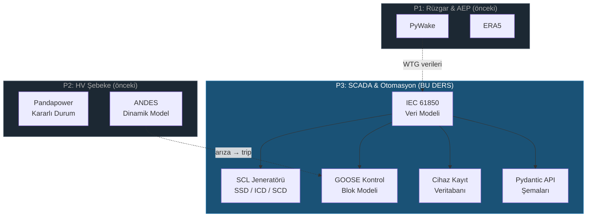

# Lesson 009 - IEC 61850 Data Model, SCL Builder and SCADA Asset Registry

!!! abstract "Lesson Navigation"
    :material-arrow-left: **Previous:** [Lesson 008 - Dynamic Grid Compliance](lesson-008.md) | **Next:** [Lesson 010 - GOOSE Simulation and Protection Timeline](lesson-010.md) :material-arrow-right:

    **Phase:** P3 | **Language:** English | **Progress:** 10 of 19 | [All Lessons](index.md) | [Learning Roadmap](../../Learning_Roadmap.md)

> **Date:** 2026-02-25
> **Phase:** P3 (SCADA and Automation)
> **Roadmap sections:** [Phase 3 - IEC 61850 Modelling, SCL and Device Registry]
> **Language:** English
> **Previous lesson:** Lesson 008

---

## What You Will Learn

- Understand the five layers of the IEC 61850 data hierarchy (Physical Device → Logical Device → Logical Node → Data Object → Data Attribute) and the equivalent of each layer in a real substation
- Understand the IEC 61400-25 wind turbine extension (WTUR, WROT, WGEN, WMET, WNAC) and why standard IEC 61850 node classes are not sufficient for wind farms
- Implementing SCL (Substation Configuration Language) file types (SSD, ICD, SCD) and IEC 61850-6 engineering workflow
- Designing a GOOSE (Generic Object-Oriented Substation Event) control block — Sending a protection trip signal with < 4 ms delay over Layer 2 Ethernet
- Permanent the device registration system in the database with SQLAlchemy ORM models and Alembic migration

---

## Section 1: IEC 61850 Data Hierarchy — Digital Twin of the Substation

### Real-World Problem

Think of a hospital. There are buildings in the hospital, each building has floors, there are departments on each floor (cardiology, neurology), there are doctors in each department and each doctor has specialties. If you can say “show EKG results from Dr. Yilmaz in the cardiology department” — you are accessing medical information through a **structured hierarchy**.

A substation works with the same logic. It contains dozens of intelligent electronic devices (IEDs). Each IED has logical functions (protection, measurement, control) and each function has data points (voltage, current, breaker status). IEC 61850 transforms this physical structure into a digital data model — so devices from different manufacturers speak the same language.

### What the Standards Say

**IEC 61850** is not a protocol, but a **data model**. The same data model can be mapped to three different transport mechanisms:

- **MMS (Manufacturing Message Specification):** Client-server communication over TCP/IP (SCADA polling)
- **GOOSE:** Layer 2 Ethernet — without IP routing, < 4 ms latency (protection trip signals)
- **Sampled Values ​​(SV):** Layer 2 Ethernet — digitized current/voltage transformer waveforms

IEC 61850-7-4 defines logical node classes. IEC 61850-7-3 defines common data classes (CDC). IEC 61850-7-2 defines the abstract communications service interface (ACSI). IEC 61850-6 defines the XML-based configuration files (SCL) of this entire structure.

### What We Built

**Changed files:**

- `backend/app/services/p3/iec61850_model.py` — Full IEC 61850 data hierarchy: 7 enums, 7 dataclasses, 13 builder functions
- `backend/app/models/scada.py` — SQLAlchemy ORM models (4 tables)
- `backend/app/schemas/scada.py` — Pydantic API schematics (14 models)
- `backend/alembic/versions/c4d5e6f7a8b9_...py` — Alembic database migration

We modeled the five-layer hierarchy in Python `dataclass(frozen=True)`:

```
PhysicalDevice (IED)           → ABB REL670 koruma rölesi
└── LogicalDevice              → LD_Protection
    └── LogicalNode            → XCBR1 (kesici)
        └── DataObject         → Pos (konum — DPC tipi)
            └── DataAttribute  → stVal (durum değeri — BOOLEAN)
```

### Why It Matters

> **Why** do we need a five-tier hierarchy?
> Because there are hundreds of data points in a substation. If it were a plain list "is the breaker on?" It would be impossible to answer the question. The hierarchy makes the physical structure **addressable** by reflecting it digitally: `OSS_PROT_IED01/LD_Protection/XCBR1$Pos$stVal` — uniquely identifying this single value from all other values ​​in the universe.

> **Why** did we use `dataclass(frozen=True)`?
> The IEC 61850 data model is a configuration — it must not change at runtime. The logical node structure of a protection relay is determined by the system engineer at the design stage. `frozen=True` enforces this immutability at the Python level — accidentally deleting or modifying an XCBR node will throw a compiler error.

### Code Review

Let's examine the structure, starting from the bottom layer of the hierarchy. First `DataAttribute` — this is the leaf node that carries the actual measurement value:

```python
@dataclass(frozen=True)
class DataAttribute:
    """Leaf of the IEC 61850 hierarchy — a single typed value."""
    name: str                    # IEC 61850-7-3 adı: 'stVal', 'mag.f', 'q'
    data_type: DataAttributeType # Temel veri tipi: BOOLEAN, FLOAT32, etc.
    fc: FunctionalConstraint     # Fonksiyonel kısıt: ST, MX, CO, CF, SP, DC
    description: str             # Mühendislik açıklaması
    unit: str = ""               # Mühendislik birimi: 'kV', 'MW', 'Hz'
```

The concept of `FunctionalConstraint` (Functional Constraint) is specific to IEC 61850. Each data attribute is grouped according to its purpose — so a SCADA client can only read measurement data (MX), but is not allowed to send control commands (CO):

```python
class FunctionalConstraint(StrEnum):
    ST = "ST"  # Status — anlık durum (istemciden salt okunur)
    MX = "MX"  # Measured value — analog ölçümler
    CO = "CO"  # Control — çalıştırma komutları (istemciden yazılır)
    CF = "CF"  # Configuration — ayarlar (mühendis tarafından yazılır)
    SP = "SP"  # Setpoint — operatör tarafından ayarlanabilir değerler
    DC = "DC"  # Description — statik açıklama bilgisi
```

Then layers `DataObject`, `LogicalNode`, `LogicalDevice`, and at the top `PhysicalDevice`, each wrapping the structure in the layer above. Since all layers are `frozen=True`, the hierarchy once created can never be changed.

### Basic Concept

!!! tip "Basic Concept: Functional Constraint"
    **Simply:** Consider a banking app — balance viewing and money transfer require different levels of permissions. In IEC 61850 each data point also carries such a "permission label": ST = read only, CO = check, CF = set.

    **Analogy:** Like a hotel's room card system. The guest card only opens its own room (ST — read status). The reception card opens all rooms (CO — check). The maintenance card opens all technical fields (CF — configure). The same door reacts differently to different cards.

    **In this project:** `Pos.stVal` on node XCBR1 of OSS_PROT_IED01 is ST constrained (read breaker position), while `Pos.ctlVal` is CO constrained (open/close breaker). The SCADA HMI operator can see the ST data, but additional authorization is required to send a CO command.

---

## Section 2: IEC 61400-25 — Wind Turbine Logical Nodes

### Real-World Problem

Standard IEC 61850 is designed for conventional substations — breakers, metering units, protection relays. But a wind turbine is neither a breaker nor a measuring unit. The turbine itself produces unique data points such as rotor speed, blade pitch angle, nacelle temperature, wind speed. Modeling this data with standard XCBR or MMXU nodes is like a doctor recording heart surgery with a “general medicine” code — technically possible but resulting in loss of information.

### What the Standards Say

**IEC 61400-25-2** extends IEC 61850 for wind turbines. It defines five special classes of logical nodes:

| LN Class | Full Name | Scope |
|-----------|---------|--------|
| **WTUR** | Wind Turbine General | Turbine operating status (stopped/running/error), total energy |
| **WROT** | Wind Turbine Rotor | Rotor speed [rpm], blade pitch angle [°] |
| **WGEN** | Wind Turbine Generator | Active power [MW], reactive power [MVAR] |
| **WMET** | Wind Turbine Meteorological | Wind speed [m/s], direction [°], temperature [°C] |
| **WNAC** | Wind Turbine Nacelle | Nacelle temperature [°C], yaw angle [°] |

### What We Built

**Changed files:**

- `backend/app/services/p3/iec61850_model.py` — `_build_wtur_ln()`, `_build_wrot_ln()`, `_build_wgen_ln()`, `_build_wmet_ln()`, `_build_wnac_ln()` builder functions

Each V236-15.0 MW turbine controller includes these five nodes within a single `LD_Turbine` logical device. 34 turbines × 5 nodes = 170 wind turbine logical nodes.

### Why It Matters

> **Why** are standard IEC 61850 nodes not enough?
> Because MMXU (general measuring unit) does not know the concept of "rotor speed" or "pitch angle". It is possible to model these data points with GGIO (Generic I/O), but you lose standardization — each manufacturer gives different names, SCADA integration is a nightmare. IEC 61400-25 requires all wind turbine manufacturers to use the same data structure.

> **Why** `frozen=True` did we use tuples and not lists?
> The logical node structure of a turbine is determined at design time and does not change at run time. Using a list opens the door to mutations such as `append()`, `remove()`, `sort()`. Tuple closes this door — the data model is locked once created.

### Code Review

Let's examine the WTUR (Wind Turbine General) builder function — this node reports the turbine's operating status and total energy production:

```python
def _build_wtur_ln(instance: int = 1) -> LogicalNode:
    """Build WTUR (Wind Turbine General) logical node per IEC 61400-25-2."""
    return LogicalNode(
        class_name="WTUR",
        instance=instance,
        category=LogicalNodeCategory.WIND,  # 'W' kategorisi — rüzgara özel
        description="Wind turbine general operating state",
        data_objects=(
            DataObject(
                name="TurSt",           # Turbine State
                cdc="INS",              # Integer Status — enum değer
                description="Turbine operating state (stopped/running/error)",
                attributes=(
                    DataAttribute(
                        "stVal",                          # Durum değeri
                        DataAttributeType.CODED_ENUM,     # Kodlanmış enum
                        FunctionalConstraint.ST,          # Status — salt okunur
                        "Operating state",
                    ),
                    # ... q (kalite bayrağı) ve t (zaman damgası)
                ),
            ),
            DataObject(
                name="TotWh",           # Total Watt-hours
                cdc="BCR",              # Binary Counter Reading
                description="Total energy production [MWh]",
                attributes=(
                    DataAttribute(
                        "actVal",                    # Actual value
                        DataAttributeType.FLOAT32,
                        FunctionalConstraint.ST,
                        "Counter value",
                        "MWh",
                    ),
                ),
            ),
        ),
    )
```

Each turbine controller is created as follows — note, IP addresses are automatically assigned to the 192.168.2.x subnet (OSS devices are on 192.168.1.x):

```python
def build_wind_turbine_controller(turbine_number: int, ip_address: str = "") -> PhysicalDevice:
    if not 1 <= turbine_number <= NUM_TURBINES:  # 1-34 arası
        msg = f"Turbine number must be 1-{NUM_TURBINES}, got {turbine_number}"
        raise ValueError(msg)

    if not ip_address:
        ip_address = f"192.168.2.{turbine_number}"  # Otomatik IP: 192.168.2.1 - 192.168.2.34

    return PhysicalDevice(
        name=f"WTG_{turbine_number:02d}",  # WTG_01, WTG_02, ..., WTG_34
        equipment_type=EquipmentType.WTG_CONTROLLER,
        manufacturer="Vestas",
        model="V236-15.0",
        ip_address=ip_address,
        logical_devices=(
            LogicalDevice(
                inst="LD_Turbine",
                logical_nodes=(
                    _build_wtur_ln(1), _build_wrot_ln(1), _build_wgen_ln(1),
                    _build_wmet_ln(1), _build_wnac_ln(1),  # 5 LN per türbin
                ),
            ),
        ),
    )
```

The last function `build_substation_configuration()` creates all 37 devices (3 OSS + 34 WTG) in a single call.

### Basic Concept

!!! tip "Basic Concept: IP Subnet Segmentation"
    **Simply:** Think of it like mailboxes in an apartment building. Each floor has a different number range: 1st floor 101-110, 2nd floor 201-210. The mailman knows which aisle to go to depending on the floor.

    **Analogy:** OSS devices (protection, metering, bay controller) live on subnet 192.168.1.x — these are the “management floor” of the substation. The 34 turbine controllers are on the 192.168.2.x subnet — these are the “production floor.” Network segmentation provides both security (IEC 62443 zone model) and traffic management.

    **In this project:** `192.168.1.10` (OSS Protection), `192.168.1.11` (OSS Measurement), `192.168.1.12` (Bay Controller) and `192.168.2.1` — `192.168.2.34` (34 turbines). A total of 37 IP addresses, organized in two subnets.

---

## Section 3: GOOSE — Real-Time Messaging for Protection Signals

### Real-World Problem

Consider a fire alarm system. When the smoke detector detects fire, call the alarm center and say, "There is a fire on the 3rd floor, can you please turn on the sprinklers?" doesn't say - it's too slow. Instead, it immediately sends a signal to the alarm center via **direct wiring** and the sprinklers turn on in milliseconds.

GOOSE is designed exactly for this job. When a protection relay detects a fault (e.g. short circuit), it takes 100+ ms to send a message to the SCADA server over TCP/IP and say "turn on the breaker". GOOSE broadcasts **direct** over Layer 2 Ethernet — within < 4 ms all relevant devices receive the trip signal.

### What the Standards Say

**IEC 61850-8-1** defines how to map GOOSE messaging to Ethernet:

- **Layer 2 multicast:** No IP routing — Ethernet frame goes directly to destination MAC address
- **Multicast MAC range:** `01:0C:CD:01:00:00` — `01:0C:CD:01:01:FF` (IEC 61850-8-1 Annex A)
- **VLAN:** ​​Separates GOOSE traffic from regular SCADA traffic (typical: VLAN 100-199)
- **AppID:** Each GOOSE publication carries a unique Application ID (2 bytes hex)
- **Retransmission:** Repeats at exponential intervals between min_time (2 ms) → max_time (1000 ms) after the first message

### What We Built

**Changed files:**

- `backend/app/services/p3/iec61850_model.py` — dataclasses `GOOSEControlBlock`, `Dataset`, `DatasetMember` + builder functions

We built two key components: (1) **Dataset**, which defines what to publish, and (2) **GOOSEControlBlock**, which defines how to publish.

### Why It Matters

> **Why** GOOSE is 200x faster than SCADA polling?
> SCADA polling uses the TCP/IP stack: application → TCP → IP → Ethernet. Each layer adds delay, especially TCP's three-way handshake and acknowledgment mechanism. GOOSE, on the other hand, completely bypasses the IP and TCP layers — sending the Ethernet frame directly. It's like shouting news instead of a letter.

> **Why** exponentially increasing retransmission interval?
> The first trip signal is critical — sent again after 2 ms, again after 4 ms, 8 ms, 16 ms... stabilized when reaching 1000 ms. This balances the reliability of the first moment (fast replay) and network bandwidth in the long run (slow replay). Even if the data does not change, periodic repetition lets the receiver know that "the broadcaster is still alive" (heartbeat).

### Code Review

The Trip Dataset defines which data points the protection IED will broadcast with GOOSE:

```python
def build_oss_goose_trip_dataset(ied_name: str = "OSS_PROT_IED01") -> Dataset:
    """Koruma trip sinyallerini içeren dataset."""
    return Dataset(
        name="TripDataset",
        description=f"Protection trip signals from {ied_name}",
        members=(
            # Kesici pozisyonu: açık mı, kapalı mı?
            DatasetMember("LD_Protection", "XCBR1", "Pos", FunctionalConstraint.ST),
            # Aşırı akım koruması tetiklendi mi?
            DatasetMember("LD_Protection", "PTOC1", "Op", FunctionalConstraint.ST),
            # Mesafe koruması tetiklendi mi?
            DatasetMember("LD_Protection", "PDIS1", "Op", FunctionalConstraint.ST),
            # Aşırı gerilim koruması tetiklendi mi?
            DatasetMember("LD_Protection", "PTOV1", "Op", FunctionalConstraint.ST),
        ),
    )
```

GOOSE Control Block defines how this dataset will be published on Layer 2 Ethernet:

```python
def build_oss_goose_control_block(
    ied_name: str = "OSS_PROT_IED01",
    dataset_name: str = "TripDataset",
) -> GOOSEControlBlock:
    return GOOSEControlBlock(
        name="gcb_trip",
        app_id="0x0001",                         # Benzersiz uygulama kimliği
        go_id=f"{ied_name}_220kV_BB_TRIP",       # İnsan tarafından okunabilir tanımlayıcı
        dataset_name=dataset_name,
        mac_address="01:0C:CD:01:00:01",         # IEC 61850-8-1 Annex A multicast MAC
        vlan_id=100,                              # GOOSE trafiği için ayrılmış VLAN
        min_time_ms=2,                            # İlk yeniden iletim: 2 ms
        max_time_ms=1000,                         # Maksimum yeniden iletim: 1 saniye
        description="220 kV busbar protection trip GOOSE publisher",
    )
```

Notice: MAC address `01:0C:CD:01:00:01` — the last bit of the first byte is 1 (`01`), indicating that this is a multicast address. Unicast MAC addresses end with an even number (00, 02, 04...).

### Basic Concept

!!! tip "Basic Concept: Layer 2 vs Layer 3 Communication"
    **Simply:** When you want to say something to your colleague working in the same office, you do not write an e-mail, you call directly. Email (Layer 3/TCP/IP) is reliable but slow — address resolution, forwarding, confirmation required. Calling (Layer 2/GOOSE) is instantaneous, but only people in the same room (same Ethernet segment) hear it.

    **Analogy:** TCP/IP = carrier (tracking number, delivery confirmation, reshipment). GOOSE = shouting through a megaphone (everyone hears it immediately, but only those nearby). A megaphone is sufficient for the protection trip signal — all devices in the same substation are on the same Ethernet segment.

    **In this project:** When OSS_PROT_IED01 detects a fault, it multicasts the TripDataset with GOOSE. The Bay controller (OSS_BAY_CTRL01) and the SCADA gateway listen for this GOOSE frame and react in < 4 ms. With TCP/IP polling this would be 100+ ms — unacceptable for protection engineers.

---

## Section 4: SCL — XML Specification of Substation

### Real-World Problem

You are building a house. The architect creates the drawing (house plan), each room builder provides the measurements for their cabinets (kitchen catalogue), and the contractor combines all of this into a single "construction project" file. Without these three types of documents, the tiler will cut tiles to the wrong size, the plumber will run a pipe into the kitchen instead of the sink.

IEC 61850-6 SCL (Substation Configuration Language) is exactly this "documentation system":

- **SSD** = House plan (substation topology)
- **ICD** = Manufacturer's catalog (capabilities of a single IED)
- **SCD** = Contractor's construction project (everything combined)

### What the Standards Say

**IEC 61850-6** defines the structure of SCL files as an XML schema. Key sections:

| XML Section | Content | In Which SCL File |
|------------|--------|---------------------|
| `<Header>` | File ID, version, tool information | All |
| `<Substation>` | Physical topology: voltage levels, bays | SSD, SCD |
| `<IED>` | IED configuration: LD, LN, dataset, GOOSE | ICD, SCD |
| `<Communication>` | Network addressing: IP, GOOSE multicast, VLAN | SCD |
| `<DataTypeTemplates>` | LN type definitions: LNodeType, DOType, DAType | ICD, SCD |

Engineering workflow: **SSD** → each manufacturer gives **ICD** → system integrator combines all into **SCD**.

### What We Built

**Changed files:**

- `backend/app/services/p3/scl_generator.py` — `generate_ssd()`, `generate_icd()`, `generate_scd()` functions + auxiliaries

A generator module that produces three SCL file types. Creates XML with SCL namespace (`http://www.iec.ch/61850/2003/SCL`) using `xml.etree.ElementTree`.

### Why It Matters

> **Why** SCL files are critical?
> Provides vendor-neutral configuration. ABB, Siemens, SEL or Hitachi Energy — IEDs from different manufacturers are configured via the same SCL scheme. A system integrator can configure the entire system from the SCD file without having to know the manufacturer of the IED.

> **Why** do we produce simplified SCL?
> A production SCL tool (ABB PCM600, Siemens DIGSI 5) includes 200+ XML elements and XSD validation. Our educational SCL teaches structural concepts — these are the parts that interviewers test: Header, Substation topology, IED structure, Communication section, DataTypeTemplates.

### Code Review

Let's examine SCL namespace management — this is the most critical detail of XML generation:

```python
SCL_NAMESPACE = "http://www.iec.ch/61850/2003/SCL"
SCL_VERSION = "2007"
SCL_REVISION = "B"

# ns0: öneklerini önlemek için namespace'i kaydet
ET.register_namespace("", SCL_NAMESPACE)

def _ns(tag: str) -> str:
    """Wrap a tag with the SCL namespace."""
    return f"{{{SCL_NAMESPACE}}}{tag}"  # → {http://www.iec.ch/61850/2003/SCL}SCL
```

The SSD (System Specification Description) generator creates the physical topology of the substation — 7 bays (each to a cable array) on the 66 kV array side, 3 bays (export, transformer, STATCOM) on the 220 kV export side:

```python
def generate_ssd(
    substation_name: str = "Baltic_Wind_Alpha_OSS",
    voltage_levels_kv: tuple[float, ...] = (66.0, 220.0),
    num_bays_per_level: dict[float, int] | None = None,
) -> ET.Element:
    if num_bays_per_level is None:
        num_bays_per_level = {66.0: 7, 220.0: 3}  # 7 array string + 3 export bay

    root = _create_scl_root()
    _add_header(root, f"{substation_name}_SSD")

    substation = ET.SubElement(root, _ns("Substation"))
    substation.set("name", substation_name)
    substation.set("desc", "510 MW Baltic Sea Offshore Wind Farm — Offshore Substation")
    # ... gerilim seviyeleri ve bay'ler eklenir
```

SCD (Substation Configuration Description) combines all the parts — SSD topology + all IEDs + GOOSE communication addresses:

```python
def generate_scd(substation_name, devices, goose_control_blocks=None, datasets=None):
    root = _create_scl_root()
    _add_header(root, f"{substation_name}_SCD")

    # 1. Substation topolojisi (SSD bölümü)
    substation = ET.SubElement(root, _ns("Substation"))
    # ... 66 kV ve 220 kV gerilim seviyeleri

    # 2. Communication bölümü — GOOSE multicast adresleme
    comm = ET.SubElement(root, _ns("Communication"))
    for device in devices:
        # Her cihaz için SubNetwork, ConnectedAP, IP ve GOOSE adresleri
        ...

    # 3. IED bölümleri — her cihazın tam konfigürasyonu
    for device in devices:
        ied = ET.SubElement(root, _ns("IED"))
        # ... LD, LN, Dataset, GSEControl
```

The `validate_scl_structure()` function performs basic structural checks: correct root tag, Header presence, at least one Substation or IED, correct version/revision. This is not full XSD validation, but it is a basic health check.

### Basic Concept

!!! tip "Basic Concept: XML Namespace"
    **Simply:** Two different countries can have the same citizenship number — "TC 12345" for one person in Türkiye, "PL 12345" for another in Poland. Namespace determines the rules of which country (which standard) you are working with.

    **Analogy:** The `<Substation>` tag can be found in many different XML standards. `{http://www.iec.ch/61850/2003/SCL}Substation` is definitely a Substation in the IEC 61850 SCL standard. The namespace is the "passport" of the tag.

    **In this project:** Calling `ET.register_namespace("", SCL_NAMESPACE)` causes Python to just write `Substation` instead of `ns0:Substation` in the XML it generates — because the default namespace is IEC 61850 SCL. This ensures that the produced file remains compatible with industrial tools such as the ABB PCM600.

---

## Section 5: Database Persistence — ORM & Migration

### Real-World Problem

The IEC 61850 data model we've created so far lives in memory — everything is lost when the Python process closes. A SCADA system operates 24/7, the device inventory must be permanent. What IEDs are there? What logical nodes do they have? Which GOOSE control blocks are configured? This information should be stored in a database.

### What the Standards Say

IEC 61850 does not define database structure per se — the standard is about communication and data model. However, in industrial practice, every SCADA system maintains a **device registration database**. This database stores current device inventory and configuration independent of SCL files.

### What We Built

**Changed files:**

- `backend/app/models/scada.py` — 4 SQLAlchemy ORM models: `IEC61850Device`, `IEC61850LogicalNode`, `GOOSEControlBlockRecord`, `SCLFile`
- `backend/app/schemas/scada.py` — 14 Pydantic schema: API request/response serialization
- `backend/alembic/versions/c4d5e6f7a8b9_...py` — Alembic migration: creating 4 tables

### Why It Matters

> **Why** didn't we save the Data Object and Data Attributes to the database?
> Because this is a conscious design decision. 37 devices × average of 5 LN × average of 4 DO × average of 3 DA = ~2,200 Data Attribute rows. While this number may seem manageable, real systems have 100,000+ rows with 500+ IEDs. The DO/DA structure is defined by the standard — it does not change. Therefore, the **code model** (Python dataclass) defines the DO/DA structure, while the **database** only stores the device inventory (which IED, which LN). The SCL file is created optionally.

> **Why** did we use `cascade="all, delete-orphan"`?
> When an IED is deleted, all its logical nodes and GOOSE control blocks must also be deleted — otherwise "orphan" records remain. `delete-orphan` does exactly that: clear parent record → child records are automatically cleared.

### Code Review

Let's examine the `IEC61850Device` ORM model — this is the basic table of the IED inventory:

```python
class IEC61850Device(Base):
    """IEC 61850 Physical Device (IED) registry entry."""
    __tablename__ = "iec61850_device"

    id: Mapped[uuid.UUID] = mapped_column(primary_key=True, default=uuid.uuid4)
    name: Mapped[str] = mapped_column(
        String(50), unique=True,  # Her IED adı benzersiz olmalı
        comment="IED instance name, e.g. 'OSS_PROT_IED01', 'WTG_01'",
    )
    equipment_type: Mapped[str] = mapped_column(String(30))  # protection_ied, wtg_controller, etc.
    manufacturer: Mapped[str] = mapped_column(String(50))     # ABB, Vestas
    model: Mapped[str] = mapped_column(String(50))            # REL670, V236-15.0
    ip_address: Mapped[str] = mapped_column(String(15))       # MMS station bus IP

    # İlişkiler — cascade ile otomatik silme
    logical_nodes: Mapped[list[IEC61850LogicalNode]] = relationship(
        back_populates="device", cascade="all, delete-orphan",
    )
    goose_control_blocks: Mapped[list[GOOSEControlBlockRecord]] = relationship(
        back_populates="device", cascade="all, delete-orphan",
    )
```

The notable structure in Pydantic schemas: reflection of the data hierarchy in the API:

```python
class PhysicalDeviceSchema(BaseModel):
    """API representation of an IEC 61850 Physical Device (IED)."""
    name: str
    equipment_type: str
    manufacturer: str
    model: str
    logical_devices: list[LogicalDeviceSchema]  # İç içe geçmiş hiyerarşi
    ip_address: str = ""
    description: str = ""
```

The `SubstationSummaryResponse` diagram summarizes the entire substation in a single API response — total number of devices, number of LNs, number of GOOSE blocks and details of all devices:

```python
class SubstationSummaryResponse(BaseModel):
    total_devices: int       # 37
    total_logical_nodes: int # 178 (6 + 1 + 2 + 34×5)
    protection_ieds: int     # 1
    measurement_ieds: int    # 1
    bay_controllers: int     # 1
    wtg_controllers: int     # 34
    goose_control_blocks: int
    devices: list[PhysicalDeviceSchema]
```

The Alembic migration file converts this schema to PostgreSQL tables. Cascade deletion is also defined at the database level with `ForeignKey("iec61850_device.id", ondelete="CASCADE")` — ORM cascade + DB cascade work together to provide double security.

### Basic Concept

!!! tip "Basic Concept: Code Model vs Database Model Difference"
    **Simply:** Think of the bookshelves in a library. The library catalog (database) keeps which books are on which shelves. But it doesn't store the content of the books (Data Object/Attribute structure) in the catalog — the content is already in the book itself (code model). The catalog changes (new book arrived, old book withdrawn), but the content of the book does not change.

    **Analogy:** Vehicle registration (database) records the vehicle's license plate, make/model, and owner. But it is pointless to keep the vehicle's engine diagram (data model) in the registration – the engine diagram is in the manufacturer's technical documentation (code model) and is the same for every vehicle.

    **In this project:** `iec61850_device` table → "which IEDs are there?" `iec61850_logical_node` table → "which LNs are assigned?" But the information that node `XCBR1` has data objects `Pos`, `BlkOpn`, `CBOpCap` is not in the database, but in the function `_build_xcbr_ln()`. Because this information is fixed by the IEC 61850-7-4 standard.

---

## Connections

**Where these concepts will be used in future lessons:**

- **IEC 61850 data hierarchy (Part 1)** → P3 GOOSE simulation will broadcast real-time events using this hierarchy
- **IEC 61400-25 nodes (Part 2)** → P4 AI prediction modules will use WTUR.TurSt, WGEN.TotW and WMET.HorWdSpd data as input
- **GOOSE Control Block (Part 3)** → GOOSE messaging order and timing verification will be performed in P3 protection simulation
- **SCL generator (Part 4)** → The P5 commissioning process will verify the device configuration using the SCD file
- **ORM models (Part 5)** → P3 API endpoints will provide CRUD operations using these models
- **Bridge from Lesson 008:** The ANDES dynamic network model we modeled in P2 determines when the protection relay “should trip.” In this lesson, we model "how the trip signal is transmitted" (GOOSE).

---

## The Big Picture

*Focus of this course: **Laying the foundations of the P3 SCADA data infrastructure — IEC 61850 device hierarchy, GOOSE messaging model, SCL configuration files and database persistence**.*



*See [Lessons Overview](index.md#system-architecture) for complete system architecture.*

---

## Key Takeaways

1. **IEC 61850 is a data model, not a protocol** — the same hierarchy can be carried over MMS (TCP/IP), GOOSE (Layer 2) and Sampled Values ​​(Layer 2)
2. **Five-layer hierarchy** (Physical Device → Logical Device → Logical Node → Data Object → Data Attribute) digitally mirrors the physical substation structure — each data point has its unique address in the universe
3. **IEC 61400-25** extends standard IEC 61850 for wind turbines — nodes WTUR, WROT, WGEN, WMET, WNAC are common to all manufacturers
4. **Functional Constraints** (ST, MX, CO, CF, SP, DC) classify data access by purpose — an operator can read measurement data (MX) but additional authorization is required for the control command (CO)
5. **GOOSE sends protection trip signal over Layer 2 Ethernet with < 4 ms** latency — 200 times faster than TCP/IP polling because it bypasses the IP and TCP layers
6. **SCL files** (SSD → ICD → SCD) provide manufacturer-independent configuration — the system integrator manages all IEDs from a single SCD file
7. **Code model + database separation**: unchanging structure (DO/DA) is defined in code, changing inventory (which IED, which LN) is stored in the database — avoiding unnecessary data explosion of 10,000+ lines

---

## Recommended Reading

*[Learning Roadmap](../../Learning_Roadmap.md) — Phase 3: SCADA & Industrial Automation*

| Source | Genre | Why Should You Read |
|--------|-----|---------------|
| IEC 61850 series (Parts 7-3, 7-4, 6) | Standard | The official source of the data model and SCL structure we use in this lesson |
| Mackiewicz — *Overview of IEC 61850 and Benefits* | Conference paper | Summarizes the advantages of IEC 61850 over traditional SCADA — ideal for interview preparation |
| Kim et al. (2017) — *Communication Architecture for CPS Wind Energy Systems* | Academic article | Special study describing the application of IEC 61850 to wind energy systems |
| libiec61850 Open Source Library | Software | A real IEC 61850 stack — you can check out GOOSE broadcast and MMS server examples |
| Hitachi Energy — *IEC 61850 Knowledge Base* | Technical articles | Application notes from ABB/Hitachi Energy on relays such as REL670, REC670 |

---

## Quiz — Test Your Understanding

### Recall Questions

**Q1:** List the five layers of the IEC 61850 data hierarchy from top to bottom.

<details>
<summary>Answer</summary>

Physical Device (IED) → Logical Device → Logical Node → Data Object → Data Attribute. From top to bottom: physical device is the most general unit, data attribute is the most specific. Example: `OSS_PROT_IED01/LD_Protection/XCBR1/Pos/stVal` — refers to the instantaneous position value of a single breaker.

</details>

**Q2:** Write the names and functions of the five wind turbine logical node classes defined by IEC 61400-25.

<details>
<summary>Answer</summary>

WTUR (turbine general status — operation/stop/error), WROT (rotor — speed and pitch angle), WGEN (generator — active and reactive power), WMET (meteorology — wind speed, direction, temperature), WNAC (nacelle — temperature and yaw angle). These five nodes cover all the key data points that a wind turbine presents to SCADA.

</details>

**Q3:** What do `min_time_ms=2` and `max_time_ms=1000` mean in GOOSE messaging?

<details>
<summary>Answer</summary>

After the first GOOSE message is sent, it is retransmitted within 2 ms, then exponentially increased by 4 ms, 8 ms, 16 ms... and fixed at 1000 ms. This mechanism balances the reliability of the critical first moment (fast replay) and network bandwidth in the long run (slow replay). Periodic repetition continues even when the data does not change (heartbeat).

</details>

### Comprehension Questions

**Q4:** Why do we keep Data Object and Data Attribute information in the Python code model instead of storing it in the database?

<details>
<summary>Answer</summary>

Because the DO/DA structure is defined by IEC 61850-7-3 and 7-4 standards and is immutable — XCBR always has data objects Pos, BlkOpn, CBOpCap. Storing this information in the database produces 37 devices × 178 LN × 4 DO × 3 DA on average = ~2,200+ redundant rows. In large systems (500+ IEDs) this number exceeds 100,000. It is the principle of keeping the unchanging information in the code and the changing inventory in the database - storing it in the appropriate layer (separation of concerns).

</details>

**Q5:** Why does GOOSE use Layer 2 Ethernet instead of TCP/IP? Which feature of TCP is a disadvantage for guard signals?

<details>
<summary>Answer</summary>

TCP's three-way handshake (SYN → SYN-ACK → ACK) adds 1-3 ms delay in connection establishment. An acknowledgment (ACK) is then waited for each message — in case of a lost packet, retransmission delay can be 100+ ms. For protection engineers, post-fault breaker trip time should typically be 60-80 ms. The latency introduced by TCP eats into this budget. GOOSE sends the raw Ethernet frame, bypassing the IP and TCP layers entirely — not even ARP parsing is required because multicast MAC is used.

</details>

**Q6:** Explain the logic of the SSD → ICD → SCD order in the SCL engineering workflow. Why can't we start from ICD?

<details>
<summary>Answer</summary>

The SSD (System Specification Description) defines the physical topology of the substation — how many voltage levels, how many bays, what equipment is where. This is the “plan of the house” and is free from IEDs. The ICD (IED Capability Description) describes the capabilities of a single IED — the manufacturer provides it. If you start from the ICD, you don't know where to put the IED — "I got the cabinets but there are no plans for the house". SCD combines both + adds communication addressing. The sorting is based on the public → private → combination logic.

</details>

### Challenge Question

**S7:** While 34 turbines are operating simultaneously at full power (510 MW) at the Baltic Wind Alpha substation, a three-phase short circuit occurs on the 220 kV busbar. Write down the GOOSE messaging order chronologically: which IED sends which signal from which LN, who receives it, what happens? Calculate the delay budget.

<details>
<summary>Answer</summary>

1. **T=0 ms:** A fault occurs. Detects MMXU1 current and voltage anomaly in OSS_PROT_IED01.
2. **T=2-5 ms:** PDIS1 (distance protection) calculates the impedance, the fault is detected in Zone 1 (< 80% line length). It becomes `PDIS1.Op.general = TRUE`. At the same time, PTOC1 (overcurrent) also generates a trip command.
3. **T=5-6 ms:** OSS_PROT_IED01 publishes TripDataset with GOOSE: `{XCBR1.Pos, PTOC1.Op, PDIS1.Op, PTOV1.Op}`. MAC: `01:0C:CD:01:00:01`, AppID: `0x0001`, VLAN: 100.
4. **T=6-8 ms:** GOOSE frame reaches all subscribers via Layer 2 switch. OSS_BAY_CTRL01 Turns on the STATCOM bay breaker.
5. **T=8-10 ms:** XCBR1.Pos → OFF (on). Retransmission starts: 2 ms, 4 ms, 8 ms...
6. **T=60-80 ms:** Physical breaker contacts open completely (mechanical opening time).

**Total latency budget:** Fault detection (2-5 ms) + GOOSE broadcast (1-2 ms) + network transmission (< 1 ms) + logic processing (1-2 ms) + mechanical tripping (50-70 ms) = ~55-80 ms. IEC 61850-5 performance class P1 (trip time < 100 ms) is met.

</details>

---

## Interview Corner

### Simply Explain
*"How would you explain the IEC 61850 data model to a non-engineer?"*

A substation is the “traffic junction” of the electrical grid — this is where electricity from different directions meets, is routed, and distributed. It contains dozens of smart devices: some measure electricity, some turn on breaker in case of danger, some collect data from wind turbines.

In the past, each of these devices spoke its own language — ABB's device couldn't communicate with Siemens'. IEC 61850 created a common "language" for these devices. Each device reports what it measures or controls in the same format. When an appliance says "breaker on," everyone understands the same thing, regardless of manufacturer.

The most important feature of this language is its speed. Sending a message over a normal computer network takes more than 100 milliseconds. But in the event of a short circuit, the breaker must trip within a few milliseconds — or the equipment will be damaged. IEC 61850's proprietary messaging system, called GOOSE, sends signals directly over the network cable, bypassing internet protocols. It's like shouting out the news instead of writing an email — it arrives instantly.

### Explain Technically
*"How would you explain the IEC 61850 data model to an interview panel?"*

IEC 61850 defines an object-oriented data model for substation automation systems. The five-layer hierarchy—Physical Device, Logical Device, Logical Node, Data Object, Data Attribute—maps the physical facility structure one-to-one to the digital model. Each layer is defined by a different part of IEC 61850: Part 7-4 specifies LN classes, Part 7-3 specifies CDC (Common Data Class) templates, Part 7-2 specifies ACSI (Abstract Communication Service Interface) services, and Part 6 specifies the SCL configuration language.

In our implementation in this project, we modeled a complete device hierarchy of 37 IEDs (3 OSS + 34 WTG) as Python `dataclass(frozen=True)`. Our choice of Frozen dataclass is deliberate: the IEC 61850 data model is a configuration artifact — not allowing mutation at runtime forces the systems engineering workflow (design → configure → run →) at the code level.

On the wind turbine side, we implemented the IEC 61400-25-2 extension — providing standardized SCADA data points for each turbine with logical nodes WTUR, WROT, WGEN, WMET, WNAC. Our GOOSE control block model meets the < 4 ms latency target with Layer 2 multicast addressing (IEC 61850-8-1 Annex A) and an exponential retransmission mechanism. Our SCL generator produces SSD, ICD and SCD files complying with the IEC 61850-6 Edition 2 scheme. We made a conscious denormalization decision in the database design: we prevented the N+1 query problem and row explosion by storing the unchanging DO/DA structure in the code model and the changing device inventory in PostgreSQL.
