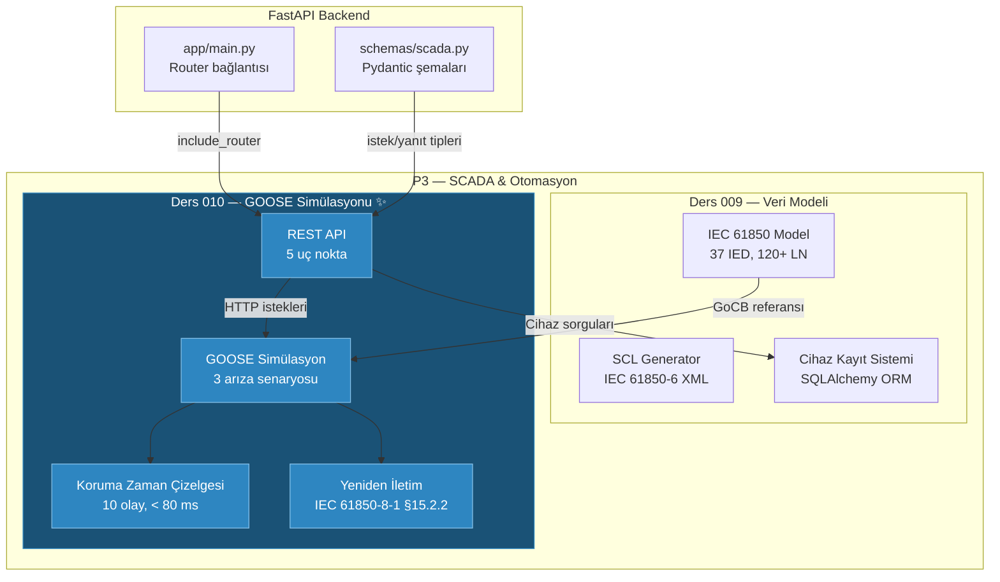

# Lesson 010 - GOOSE Fault Simulation, Protection Timeline and SCADA API Endpoints

!!! abstract "Lesson Navigation"
    :material-arrow-left: **Previous:** [Lesson 009 - IEC 61850 Data Model, SCL Builder and SCADA Asset Registry](lesson-009.md) | **Next:** [Lesson 011 - IEC 62443 RBAC and the 9-State Permit-to-Work Lifecycle](lesson-011.md) :material-arrow-right:

    **Phase:** P3 | **Language:** English | **Progress:** 11 of 19 | [All Lessons](index.md) | [Learning Roadmap](../../Learning_Roadmap.md)

> **Date:** 2026-02-25
> **Commits:** 1 commit (`c085bcb` -> `c085bcb`)
> **Commit range:** `c085bcba164e63a440229a95346198f33ca9c04b..c085bcba164e63a440229a95346198f33ca9c04b`
> **Phase:** P3 (SCADA and Automation)
> **Roadmap sections:** [Phase 3 - Section 3.1 IEC 61850 - The Standard, Phase 2 - Section 2.2 Power System Protection]
> **Language:** English
> **Previous lesson:** Lesson 009
> **last_commit_hash:** c085bcba164e63a440229a95346198f33ca9c04b

---

## What You Will Learn

- Understand why the GOOSE (Generic Object-Oriented Substation Event) protocol works on Layer 2 Ethernet and uses a publish-subscribe model instead of TCP/IP
- Modeling the protection fault clearance timeline in milliseconds: detection → relay processing → GOOSE broadcast → breaker tripping → arc damping
- Calculating IEC 61850-8-1 §15.2.2 retransmission schedule with exponential backoff algorithm
- Understand the differences in protection functions by comparing three different fault scenarios (busbar overcurrent, transformer differential, cable ground fault)
- Design FastAPI REST endpoints with Pydantic schemas and verify with 47 unit tests

---

## Section 1: GOOSE Protocol — Why Every Millisecond Counts

### Real-World Problem

Think of a fire station. When the fire alarm goes off, firefighters call the headquarters and ask "is there a fire, where is it, which team should go?" — that would be the TCP/IP model (connect → send request → wait for response). Instead, at the moment of alarm, a simultaneous announcement is made over loudspeakers throughout the station: "Fire! Block A, 3rd floor!" Every firefighter hears this message simultaneously. GOOSE is exactly that model — **publish-subscribe**. The broadcaster IED puts the message on Ethernet, all subscribers receive it immediately. No routing, no handshake, no waiting.

Why such a rush? When a short circuit occurs on a 220 kV busbar, the arc energy increases with the formula **I² × t**. When 2.5 times the fault current (3,000 A) flows in a busbar with a nominal current of 1,200 A, every additional millisecond can destroy the switchgear. The IEC 62271-100 standard keeps the total clearing time for 220 kV below **80 ms** — otherwise the equipment may burn.

### What the Standards Say

**IEC 61850-8-1** defines the GOOSE protocol:

- **Transport layer:** Ethernet Layer 2 (EtherType 0x88B8) — no IP routing
- **Addressing:** Multicast MAC address `01:0C:CD:01:xx:xx` (IEC 61850-8-1 Annex A)
- **Model:** Publish-subscribe — publisher sends IED, all subscribers receive
- **Latency requirement:** < 4 ms end-to-end (publisher → subscriber)
- **Reliability:** No TCP acknowledgment — exponential backoff retransmission instead

**IEC 62271-100** determines the fault clearing time for high voltage breakers:

- 220 kV busbar fault: total < 80 ms
- Cutter mechanical time: 20-60 ms (spring mechanism)
- Protection relay operation time: 15-30 ms
- GOOSE transport time: < 4 ms

### What We Built

**Changed files:**

- `backend/app/services/p3/goose_simulation.py` — GOOSE messaging and protection simulation engine (727 lines)
- `backend/app/routers/p3.py` — P3 SCADA REST API endpoints (333 lines)
- `backend/app/schemas/scada.py` — Fault simulation Pydantic diagrams (92 new lines)
- `backend/tests/test_goose_simulation.py` — 47 unit tests (446 lines)
- `backend/app/main.py` — Connecting P3 router to FastAPI
- `backend/app/routers/__init__.py` — Router package description

Total: **1,601 lines of new code** — P3's largest single commit.

### Why It Matters

> **Why** GOOSE runs on Layer 2 and not Layer 3 (IP)?
> Because IP routing adds microseconds in each hop and TCP handshaking loses milliseconds. This luxury is unacceptable when there is a 4 ms budget in protection signals. Layer 2 Ethernet transmits directly over the switch — no routing table lookups.
>
> **Why** use retransmission instead of TCP acknowledgment?
> In TCP, the sender must wait for acknowledgment for a lost packet — this delay can be fatal to protection. GOOSE instead uses a "desperate repeat" strategy: send the message immediately, then repeat at exponentially increasing intervals (2 ms, 4 ms, 8 ms, ...). It is enough if the subscriber buys at least one copy.

### Code Review

The GOOSE PDU (Protocol Data Unit) data model models the field structure in IEC 61850-8-1 as Python `dataclass`. Each field maps to its counterpart in a real GOOSE Ethernet frame:

```python
@dataclass(frozen=True)
class GOOSEMessage:
    """IEC 61850-8-1 GOOSE Protocol Data Unit (PDU)."""

    gocb_ref: str      # GOOSE Control Block referansı: {IED}/{LLN0}$GO${gcb_name}
    dat_set: str       # Dataset referansı: hangi veri nesneleri dahil
    go_id: str         # İnsan okunur GOOSE tanımlayıcı
    st_num: int        # Durum numarası — her durum DEĞİŞİKLİĞİNDE artar
    sq_num: int        # Sıra numarası — her yeniden iletimde artar, stNum değişince sıfırlanır
    all_data: dict[str, bool]  # Trip sinyal değerleri
    timestamp: datetime        # UTC zaman damgası (IEEE 1588 hassasiyeti)
    app_id: str        # GOOSE Uygulama Kimliği (hex)
    mac_address: str   # Multicast hedef MAC (IEC 61850-8-1 Annex A)
    vlan_id: int       # GOOSE trafiği için ayrılmış VLAN
```

Note the use of `frozen=True` here — GOOSE messages must be immutable. Once published, the message can no longer be changed; If there is a new status change, a new message is created by incrementing `st_num`. This matches exactly the semantics of the real GOOSE protocol.

### Basic Concept

!!! tip "Basic Concept: stNum vs sqNum — Status and Sequence Number"
    **Simply explained:** Imagine you are texting a friend. When you say "I'm at the door" this is a new **state** (stNum = 1). If your friend hasn't seen it, you send the same message again — this is **retransmission** (sqNum incremented by 1, 2, 3...). Then when you say "I walked in" a new state occurs (stNum = 2, sqNum is reset).

    **Analogy:** Consider a radio station newscast. When new news comes, the bulletin number increases (stNum). When the same bulletin is repeated, the number of repetitions increases (sqNum). Listeners know which bulletin is the most current from the bulletin number.

    **In this project:** `stNum = 1` is the first release of the trip command. `sqNum = 0` is the original message, `sqNum = 1` is the first retransmission. When the subscriber IED sees the `stNum` change, it knows "a new event has occurred" and trips the breaker.

---

## Section 2: Protection Timeline — Fault Clearance Within 80 ms

### Real-World Problem

Imagine a row of dominoes. When the first domino (malfunction) falls, each subsequent domino falls in a certain period of time: detection → processing → communication → mechanical movement. If the last domino (breaker opening) is not knocked down within a certain period of time, the entire series will collapse (equipment will be damaged). In conservation engineering, it is imperative to know in milliseconds how long each “domino” takes and verify that the total does not exceed the budget.

### What the Standards Say

**IEC 62271-100** defines total fault clearing times for high voltage circuit breakers. At 220 kV level:

$$t_{total} = t_{detection} + t_{role} + t_{GOOSE} + t_{interrupter} + t_{arc}$$

- $t_{detection}$ = CT secondary current exceeds threshold (depending on fault type: 2-8 ms)
- $t_{relay}$ = Digital relay processing time (0.5 ms)
- $t_{GOOSE}$ = Layer 2 Ethernet transport time (1.5 ms)
- $t_{breaker}$ = Spring mechanism opening time (40 ms)
- $t_{arc}$ = arc extinction in SF6 gas (15 ms)

Total must be ≤ 80 ms.

### What We Built

The `simulate_fault()` function produces a deterministic protection schedule. Each event is represented by a `ProtectionEvent` object:

```python
@dataclass(frozen=True)
class ProtectionEvent:
    """Koruma zaman çizelgesindeki tek bir olay."""
    event_type: EventType      # Ne oldu (ör: FAULT_OCCURS, GOOSE_PUBLISHED)
    timestamp_ms: float        # Arıza başlangıcından itibaren geçen süre [ms]
    description: str           # İnsan okunur açıklama
    ied_name: str = ""         # İlgili IED (yayıncı veya abone)
```

The 10 steps of the timeline are:

```python
def simulate_fault(scenario: FaultScenario) -> FaultSimulationResult:
    detection_ms = _DETECTION_TIMES_MS[scenario.fault_type]
    fault_current_a = scenario.fault_current_pu * scenario.nominal_current_a

    t = 0.0
    events: list[ProtectionEvent] = []

    # 1. Arıza oluşur (t = 0 ms)
    events.append(ProtectionEvent(
        event_type=EventType.FAULT_OCCURS,
        timestamp_ms=t,
        description=f"Fault on {scenario.location.value}: I = {scenario.fault_current_pu:.1f} pu",
    ))

    # 2. Koruma algılar (t = 2.0 ms — bara aşırı akım için)
    t += detection_ms
    events.append(ProtectionEvent(
        event_type=EventType.PROTECTION_DETECTS,
        timestamp_ms=t,
        description=f"{scenario.protection_function.value} detects fault current > pickup",
        ied_name=scenario.publisher_ied,
    ))

    # 3. Röle işler (t += 0.5 ms)
    t += _RELAY_PROCESSING_MS

    # 4. GOOSE trip yayınlanır (aynı anda)
    goose_publish_ms = t

    # 5. GOOSE alınır (t += 1.5 ms)
    t += _GOOSE_TRANSPORT_MS

    # 6. Kesici trip bobini enerjilenir
    # 7. Kesici kontakları ayrılır (t += 40 ms)
    t += _BREAKER_MECHANICAL_MS

    # 8. Ark söner (t += 15 ms)
    t += _ARC_EXTINCTION_MS

    # 9. Arıza temizlendi
    total_clearance_ms = t  # Bara aşırı akım: 59.0 ms < 80 ms ✓

    # 10. SCADA alarmı (t = gönderi + 260 ms — koruma için DEĞİL)
    scada_ms = goose_publish_ms + _SCADA_POLLING_DELAY_MS
```

One of the most important design decisions of this code is **determinism**. Timing constants are not arbitrary — they are fixed values ​​based on IEC standards and manufacturer data. This way, tests give the same results every run and students can track every millisecond.

### Why It Matters

> **Why** SCADA alarm is not used for protection?
> SCADA (IEC 60870-5-104) operates with a TCP/IP polling loop — typical 260 ms latency. During this time, arcing energy at 220 kV may have already destroyed the equipment. GOOSE reaches 1.5 ms, while SCADA reaches 260 ms — a 173-fold difference! SCADA provides information to the operator, GOOSE protects the equipment.
>
> **Why** do we use deterministic scheduling?
> In the real world, timing exhibits small variations (jitter). However, for training purposes we use deterministic values ​​because: (1) tests would be repeatable, (2) students could track the source of every millisecond, (3) IEC compliance checking would be meaningful.

### Basic Concept

!!! tip "Basic Concept: Arc Energy — I²t"
    **Simple explanation:** Imagine focusing sunlight on your hand with a magnifying glass. The more intense the focal point (current) and the longer you hold it (time), the more heat accumulates. It's the same with an electric arc — the greater the current squared times time (I²t), the more energy is released and the equipment is damaged.

    **Analogy:** Think of it like water flowing from a tap. The higher the water pressure (I²) and the open time (t), the more water fills the bucket. If the bucket overflows (exceeds the I²t limit) damage begins.

    **In this project:** If we clean in 60 ms instead of 80 ms at 3,000 A fault current on 220 kV busbar, arc energy will be reduced by 25%. In our simulation, the busbar overcurrent scenario clears in 59 ms — a safe margin below the 80 ms limit of IEC 62271-100.

---

## Section 3: Three Fault Scenarios — Different Faults, Different Protection

### Real-World Problem

Think of a hospital emergency room. The same treatment is not given for a heart attack, a broken arm, and allergic shock — each requires a different time to diagnosis, a different specialist, and a different intervention. Likewise, different fault types in a substation trigger different protection functions and produce different clearing times.

### What the Standards Say

**IEC 61850-7-4** defines protection logical node classes:

- **PTOC** (Time Overcurrent): Trip when the current exceeds the threshold value - fast for busbar faults
- **PDIF** (Differential): Compares the current difference between two measuring points — transformer protection
- **PTOC + directional element**: Determines the direction of the fault current — distinctive for cable faults

### What We Built

Three fault scenarios are managed by a `_SCENARIO_BUILDERS` registry dictionary:

```python
# Senaryo tipleri ve algılama süreleri
_DETECTION_TIMES_MS: dict[FaultType, float] = {
    FaultType.BUSBAR_OVERCURRENT: 2.0,       # Hızlı CT pickup, yakın arıza
    FaultType.TRANSFORMER_DIFFERENTIAL: 5.0,  # Diferansiyel karşılaştırma
    FaultType.CABLE_EARTH_FAULT: 8.0,         # Yönsel eleman + zaman gecikmesi
}
```

Each scenario has different parameters:

| Scenario | Fault Current | Protection | Detection | Total Cleanup |
|---------|-------------|--------|----------|------------------|
| Overcurrent to busbar | 2.5 pu (3,000 A) | PTOC | 2.0ms | 59.0ms |
| Transformer differential | 5.0 pu (6,000 A) | PDIF | 5.0ms | 62.0ms |
| Cable ground fault | 1.8 pu (2.160 A) | PTOC (directional) | 8.0ms | 65.0ms |

Scenario generation uses a factory pattern — functions of type `Callable[[], FaultScenario]` are registered in the registry:

```python
_SCENARIO_BUILDERS: dict[FaultType, Callable[[], FaultScenario]] = {
    FaultType.BUSBAR_OVERCURRENT: create_busbar_overcurrent_scenario,
    FaultType.TRANSFORMER_DIFFERENTIAL: create_transformer_differential_scenario,
    FaultType.CABLE_EARTH_FAULT: create_cable_earth_fault_scenario,
}

def create_scenario(fault_type: FaultType) -> FaultScenario:
    """Arıza tipine göre senaryo oluştur."""
    builder = _SCENARIO_BUILDERS.get(fault_type)
    if builder is None:
        msg = f"Unknown fault type: {fault_type}"
        raise ValueError(msg)
    return builder()
```

This factory pattern makes it easy to add new scripts: write a new builder function and add it to the registry. No need to change existing code — **Open-Closed Principle**.

### Why It Matters

> **Why** does the detection time for cable ground fault take longer?
> A directional element is required for a cable fault — it takes additional time to determine the direction of the fault current. While the overcurrent on the busbar is measured directly from the CT, in case of cable fault it is necessary to distinguish whether the current comes from the busbar side or the cable end.
>
> **Why** are we using factory pattern and not `if-elif` directly?
> Adding a new scenario with the registry approach is a one-line dictionary entry. As the `if-elif` chain grows, it becomes more difficult to maintain and violates the Open-Closed Principle. Additionally, discovery functions such as `get_available_scenarios()` are generated directly from the registry.

### Basic Concept

!!! tip "Basic Concept: Protection Coordination — Turning on the Right Breaker at the Right Time"
    **Simple explanation:** When a fuse blows in your home, only the fuse of the relevant room should blow, not the fuse of the whole house. Protection coordination ensures that the breaker closest to the fault is opened first, while the ones further away wait as backup.

    **Analogy:** Think of it like a fire suppression system. If the fire is on the 3rd floor, only the 3rd floor sprinklers should work, not the entire building's. But if the 3rd floor one does not work, the main fire valve (backup protection) is activated.

    **In this project:** PTOC is the fastest protection (2 ms detection) in case of busbar overcurrent. PDIF is used in transformer fault because overcurrent protection cannot distinguish which side of the transformer it is on. In case of cable fault, a directional element is added because the correct breaker cannot be selected without determining the direction of the current.

---

## Section 4: GOOSE Retransmission Schedule — Reliability Without TCP

### Real-World Problem

Imagine making an announcement with a megaphone in a crowded stadium. There may be people who didn't hear the first announcement — the noise, the distraction. So you repeat the same announcement several times: first immediately, then wait a bit, then wait longer... until you're sure everyone heard it. This is exactly GOOSE's retransmission strategy.

### What the Standards Say

**IEC 61850-8-1 §15.2.2** defines the retransmission schedule:

1. In case of status change, the message is sent immediately
2. After first retransmission T0 = `min_time` (typical: 2 ms)
3. Subsequent intervals are multiplied by two: T0, 2×T0, 4×T0, 8×T0, ...
4. Fixed when maximum interval reaches `max_time` (typical: 1000 ms)
5. This exponential backoff provides reliability without TCP

### What We Built

The retransmission calculator is a simple and mathematically correct function:

```python
def calculate_retransmission_schedule(
    min_time_ms: int = 2,
    max_time_ms: int = 1000,
    num_retransmissions: int = 10,
) -> tuple[float, ...]:
    """IEC 61850-8-1 §15.2.2 yeniden iletim çizelgesi.

    Üstel geri çekilme: T0, 2×T0, 4×T0, ..., max_time'a kadar.
    """
    intervals: list[float] = []
    current_interval = float(min_time_ms)
    cumulative = 0.0

    for _ in range(num_retransmissions):
        cumulative += current_interval
        intervals.append(cumulative)
        # Aralığı ikiye katla, ama max_time'ı geçme
        current_interval = min(current_interval * 2, float(max_time_ms))

    return tuple(intervals)
```

With default parameters the chart looks like this:

| # | Interval (ms) | Cumulative (ms) | Description |
|---|-------------|----------------|----------|
| 1 | 2 | 2 | T0 — first retransmission |
| 2 | 4 | 6 | 2×T0 |
| 3 | 8 | 14 | 4×T0 |
| 4 | 16 | 30 | 8×T0 |
| 5 | 32 | 62 | 16×T0 |
| 6 | 64 | 126 | 32×T0 |
| 7 | 128 | 254 | 64×T0 |
| 8 | 256 | 510 | 128×T0 |
| 9 | 512 | 1022 | 256×T0 |
| 10 | 1000 | 2022 | Fixed at max_time |

The first 4 retransmissions are completed within 30 ms — greatly increasing the likelihood that at least one copy of the critical protection message will arrive.

### Why It Matters

> **Why** is exponential regression better than fixed-interval repetition?
> Repeating at a fixed interval (e.g. every 2 ms) unnecessarily loads network traffic. Exponential backoff repeats very frequently in the critical first milliseconds (reliability), then opens the gap, conserving network bandwidth. This is inspired by TCP's congestion control but is a much simpler approach.
>
> **Why** are we returning a tuple and not a list?
> Once the retransmission schedule is calculated, it should not change — `tuple` guarantees immutability. This is the principle of functional programming: side-effect-free functions are much safer for testing and debugging.

### Basic Concept

!!! tip "Basic Concept: Exponential Backoff"
    **Simple explanation:** You are knocking on a door. If there is no answer on the first ring, you immediately ring again. If it still doesn't come, you wait a while. If it still doesn't come, you wait longer. You double the wait time every time — because either no one is home (the network problem is major) or they heard it late.

    **Analogy:** Like fishing. If the fish doesn't come on the first cast, you immediately cast again. After a few unsuccessful attempts, you switch baits and start waiting longer — using your energy more efficiently.

    **In this project:** GOOSE message is repeated after 2 ms, then 4 ms, 8 ms, 16 ms... 4 copies are sent in the first 30 ms (critical protection window). After 2 seconds, 10 copies have been sent — on Layer 2 Ethernet it is almost impossible for at least one not to arrive.

---

## Section 5: REST API Endpoints — Opening SCADA Simulation to the Outside World

### Real-World Problem

Think of a restaurant kitchen. You can cook great food, but it's pointless if there's no hatch to reach the customer. API endpoints are the “service window” for our backend services — the frontend, testing tools, and other systems place orders and receive results through this window.

### What the Standards Say

Our project convention (SKILL.md) enforces the following rules in API design:

- Prefix: `/api/v1/{domain}/` — `/api/v1/scada/` for SCADA
- Pydantic v2 schemas: type safety for every request and response
- FastAPI automatic OpenAPI documentation
- HTTP status codes: 200 success, 404 not found, 422 invalid input

### What We Built

The P3 router offers five endpoints:

| HTTP | Endpoint | Description |
|------|----------|----------|
| `GET` | `/api/v1/scada/goose/scenarios` | List current fault scenarios |
| `POST` | `/api/v1/scada/goose/simulate` | Run fault simulation |
| `POST` | `/api/v1/scada/goose/retransmission` | Calculate retransmission schedule |
| `GET` | `/api/v1/scada/devices` | List all IEC 61850 devices |
| `GET` | `/api/v1/scada/devices/{device_name}` | Get details of a single device |

The structure of the simulation endpoint is as follows:

```python
@router.post("/goose/simulate", response_model=FaultSimulationResponse)
async def run_fault_simulation(request: FaultScenarioRequest) -> FaultSimulationResponse:
    """GOOSE koruma arıza simülasyonu çalıştır."""
    try:
        fault_type = FaultType(request.fault_type)
    except ValueError as err:
        valid_types = [ft.value for ft in FaultType]
        raise HTTPException(
            status_code=422,
            detail=f"Invalid fault_type: '{request.fault_type}'. Valid types: {valid_types}",
        ) from err

    scenario = create_scenario(fault_type)
    result = simulate_fault(scenario)
    # ... Pydantic şemalarına dönüştür ve döndür
```

Points to consider:

1. **`from err` chaining:** `raise ... from err` Enables exception chaining in Python — original `ValueError` is not lost, making debugging easier
2. **Invalid input checking:** If `FaultType(request.fault_type)` fails, we list valid types in the error message — making it easier to debug on the client side
3. **Asynchronous function:** `async def` is used because FastAPI works asynchronously, but this simulation is CPU-bound so it doesn't use true asynchronous I/O

### Why It Matters

> **Why** do we use `from err` and not just `raise HTTPException(...)`?
> Without `from err`, the original `ValueError` disappears from the stack trace. With `from err`, Python sets the `__cause__` attribute — you can see both the original error and the HTTP error in debug. This is the exception chaining standard defined in PEP 3134.
>
> **Why** are we using Pydantic schemas and not returning dataclass directly?
> FastAPI automatically serializes Pydantic models to JSON and generates OpenAPI schema. Dataclasses do not provide this automatic integration. Additionally, with Pydantic `Field(description=...)`, every field is documented — API documentation is generated from the code itself.

### Basic Concept

!!! tip "Basic Concept: API Tiering — Service, Router, Schema"
    **Simply explained:** There are three roles in a restaurant: chef (makes the food = service layer), waiter (takes and serves the order = router), menu (defines what can be ordered = scheme). Each role focuses on its own responsibility.

    **Analogy:** Like a postal system: the content of the letter (service logic), the address format on the envelope (schema), and the postman (router). The postman doesn't know the content of the letter — he just delivers it to the correct address.

    **In this project:** `goose_simulation.py` calculates physics and mathematics (chief). The `p3.py` router receives HTTP requests and calls service functions (waiter). `scada.py` schemes define the request/response format (menu). If the chef changes, the waiter and menu are not affected.

---

## Section 6: 47 Unit Testing — Validating Every Millisecond

### Real-World Problem

When you build a bridge, you do load tests before it opens — it's not enough to say "I hope the bridge doesn't collapse", you have to **prove** it. In software, unit tests are these load tests. Especially in protection simulation, an incorrect timing value corresponds to equipment damage in the real world — tests capture these risks in code.

### What the Standards Say

The testing strategy verifies three IEC standards:

- **IEC 61850-8-1:** GOOSE delay < 4 ms
- **IEC 62271-100:** Fault clearing < 80 ms
- **IEC 61850-8-1 §15.2.2:** Retransmission exponential fallback accuracy

### What We Built

47 tests organized into 7 classes:

| Test Class | Number of Tests | What Confirms |
|-------------|-------------|---------------|
| `TestGOOSEMessage` | 11 | PDU field accuracy (gocbRef, stNum, sqNum, MAC, VLAN) |
| `TestProtectionTimeline` | 9 | Order of events, chronological consistency, causality |
| `TestIECCompliance` | 8 | GOOSE < 4 ms, cleanup < 80 ms, all scenarios |
| `TestFaultScenarios` | 9 | Scenario parameters, comparative values ​​|
| `TestScenarioRegistry` | 3 | Factory pattern, invalid type error |
| `TestRetransmissionSchedule` | 7 | Exponential regression, cap logic, defaults |

One particularly noteworthy test — the causality check:

```python
def test_goose_published_before_received(self):
    """GOOSE yayını alımdan ÖNCE olmalı (nedensellik)."""
    scenario = create_busbar_overcurrent_scenario()
    result = simulate_fault(scenario)
    pub_time = next(
        e.timestamp_ms for e in result.events
        if e.event_type == EventType.GOOSE_PUBLISHED
    )
    recv_time = next(
        e.timestamp_ms for e in result.events
        if e.event_type == EventType.GOOSE_RECEIVED
    )
    assert pub_time < recv_time
```

This test confirms the fundamental law of physics: a message cannot be received without being sent. It may seem simple, but an error in the timeline can throw off this sequence — and in the real world, this would mean "the breaker was tripped before getting the GOOSE", which is physically impossible.

Another powerful test — verifying IEC compliance of all scenarios at once with `pytest.mark.parametrize`:

```python
@pytest.mark.parametrize("fault_type", list(FaultType))
def test_all_scenarios_are_clearance_compliant(self, fault_type: FaultType):
    """Her arıza senaryosu < 80 ms toplam temizleme süresi sağlamalı."""
    scenario = create_scenario(fault_type)
    result = simulate_fault(scenario)
    assert result.clearance_compliant, (
        f"{fault_type}: clearance {result.total_clearance_ms} ms >= {FAULT_CLEARANCE_MAX_MS} ms"
    )
```

This parametric test automatically runs 3 fault types as 3 separate tests. When a new `FaultType` is added, the test automatically covers it as well — no need to write extra code.

### Why It Matters

> **Why** are deterministic tests more valuable than random (stochastic) tests?
> If we used random scheduling, tests would sometimes pass and sometimes fail (flaky tests). With deterministic timings, every test always returns the same result — if a test fails, it's because of a change in the code, not chance.
>
> **Why** do we use `pytest.mark.parametrize`?
> Instead of writing three separate test functions for three scenarios, parametric testing covers all scenarios with a single function. The test automatically expands when a new scenario is added. DRY (Don't Repeat Yourself) principle.

### Basic Concept

!!! tip "Basic Concept: Parametric Testing — One Function, Many Tests"
    **Simply explained:** You want to check the accuracy of a formula. Instead of doing a separate experiment for each number, ask "is this formula correct for X = 1, 2, 3, ...?" you ask. Parametric testing repeats the same question with different inputs.

    **Analogy:** Consider a quality control line. Every product goes through the same testing — but each product has a different serial number. Test line one, products many.

    **In this project:** The `@pytest.mark.parametrize("fault_type", list(FaultType))` decorator converts a single test function into 3 independent tests: busbar_overcurrent, transformer_differential, cable_earth_fault. When a new `FaultType` is added the 4th test is automatically added.

---

## Connections

**Where will these concepts appear in the future:**

- **GOOSE messaging** → Next steps of P3: Permit-to-Work state machine will use GOOSE trip signals as input
- **Protection timeline** → P5 Commissioning: Protection relay injection in commissioning (SAT) tests will verify this timeline
- **Factory pattern (scenario registry)** → P4 Model selector in AI Forecasting can use the same pattern
- **IEC compliance controls** → Adding cybersecurity (IEC 62443) in P3 will expand the compliance control framework

**Links from previous lessons:**

- The IEC 61850 data model (Physical Device → Logical Node hierarchy) from Lesson 009 is used directly in this lesson with the call `build_oss_goose_control_block()` — GOOSE messages are built on that data model

---

## The Big Picture

*Focus of this lesson: **GOOSE fault simulation, protection timeline and REST API endpoints added to P3 SCADA**.*



*For full system architecture: [Lessons Overview](index.md#system-architecture)*

---

## Key Takeaways

1. **GOOSE runs on Layer 2 Ethernet** because it exceeds the 4 ms budget of IP routing and TCP handshake protection systems — that's every millisecond of arcing energy.
2. **The protection timeline must be deterministic and verifiable** — using fixed timings in the simulation makes IEC compliance checking meaningful and testing repeatable.
3. **Exponential backoff** Provides reliability without TCP acknowledgment — heavy repetition in the critical first milliseconds, then gapping to preserve network bandwidth.
4. **Different fault types trigger different protection functions** — PTOC (overcurrent) is fast but cannot distinguish direction; Specializes in PDIF (differential) transformer protection; The directional element is required in case of cable faults.
5. **Factory pattern (registry dictionary)** reduces adding a new scenario to a one-line operation and implements the Open-Closed Principle.
6. **API layering (service → router → schema)** provides separation of concerns — the physics engine is unaware of HTTP, the router is unaware of business logic.
7. **Parametric tests (`pytest.mark.parametrize`)** automatically extends a single test function to all scenarios — test coverage automatically increases when new scenarios are added.

---

## Recommended Reading

*[Learning Roadmap](../../Learning_Roadmap.md) — Phase 3: SCADA & Industrial Automation + Phase 2: Protection*

| Source | Genre | Why Read |
|--------|-----|----------------|
| IEC 61850 series (Part 8-1) | Standard | GOOSE protocol details — original source of the message structure we simulate in this lesson |
| Blackburn & Domin — *Protective Relaying: Principles and Applications* | Textbook | Theoretical basis of protection scheduling logic — detection, relay, breaker times |
| GE Grid Solutions — *Protection & Automation Application Guide* | Free reference | Practical guide to conservation coordination — industry applications |
| Kim et al. (2017) — “Communication Architecture for Grid Integration of CPS Wind Energy Systems” | Academic article | Specific application of IEC 61850 to wind energy systems |
| Apostolov (2020) — "IEC 61850 Edition 2 Impact" | Conference paper | Impact of GOOSE Edition 2 changes on protection systems |

---

## Quiz — Test Your Understanding

### Recall Questions

**Q1:** In which OSI layer does the GOOSE protocol operate and why was this layer chosen?

<details>
<summary>Answer</summary>

GOOSE operates on OSI Layer 2 (Ethernet). This layer was chosen because IP routing (Layer 3) and TCP handshaking (Layer 4) add additional latency. Since the end-to-end delay budget in protection systems is 4 ms, Layer 2 transmitting directly over the switch — without a routing table lookup — is the only way to meet this budget.

</details>

**Q2:** How many milliseconds is the total fault clearing time in the busbar overcurrent scenario in the simulation and is it below the IEC 62271-100 limit?

<details>
<summary>Answer</summary>

Total clearing time in the busbar overcurrent scenario is 59.0 ms (2.0 ms detection + 0.5 ms relay + 1.5 ms GOOSE + 40.0 ms breaker + 15.0 ms arc extinction). This value is 21 ms below the 80 ms limit of IEC 62271-100 for 220 kV — consistent with a safe margin.

</details>

**Q3:** What do the `stNum` and `sqNum` fields in the GOOSE PDU mean and how do they relate to each other?

<details>
<summary>Answer</summary>

`stNum` (state number) increases with each new state change — for example, when a trip command is issued. `sqNum` (sequence number) is incremented with each retransmission of the same status change, reset when `stNum` changes. The subscriber IED understands that there is a "new event" by seeing the change `stNum`, and that there is a "repetition of the same event" by seeing the increase `sqNum`.

</details>

### Comprehension Questions

**Q4:** Why is the detection time of cable ground fault (8 ms) longer than that of busbar overcurrent (2 ms)?

<details>
<summary>Answer</summary>

A directional element is required in case of cable ground fault. The protection relay must determine not only the current magnitude but also the direction of the current — to distinguish whether the fault is at the cable end or on the busbar side. This additional comparison and time delay is algorithmically more complex. If the busbar is overcurrent, the current from the CT exceeding the threshold is detected directly — there is no need to determine direction.

</details>

**Q5:** Why is exponential backoff superior to fixed-interval replay in the GOOSE retransmission schedule?

<details>
<summary>Answer</summary>

Exponential backoff balances two conflicting requirements: (1) high reliability in the critical first milliseconds—frequent repetition increases the likelihood of the message arriving, and (2) conserving network bandwidth over the long term—reducing unnecessary traffic by opening gaps. Repeating every 2 ms at a fixed interval, it generates 500 messages in the first second and unnecessarily loads the network; exponential backoff only sends ~10 messages in the same amount of time.

</details>

**Q6:** In the simulation, why is the SCADA alarm included in the protection timeline but not used for protection?

<details>
<summary>Answer</summary>

SCADA alarm (IEC 60870-5-104 polling, ~260 ms delay) is to inform the control center operator — not to make a protection decision. The reason for its inclusion in the timeline is educational: to concretely show students the 173x latency difference between GOOSE (1.5 ms) and SCADA (260 ms). This difference makes clear why protection systems rely on GOOSE and not SCADA.

</details>

### Challenge Question

**Q7:** In a real offshore substation, what happens if the GOOSE message does not arrive? How would you add this scenario to our simulation?

<details>
<summary>Answer</summary>

In real systems, multilayer protection against GOOSE loss is implemented: (1) **Retransmission** — with exponential backoff the message is sent multiple times. (2) **Redundant Ethernet** — Dual Ethernet network is used with IEC 62439-3 PRP (Parallel Redundancy Protocol) or HSR (High-availability Seamless Redundancy); Even if one network fails, the other works. (3) **Breaker Failure Protection (BFP)** — if the primary breaker does not open, the backup protection relay trips the next level breaker (with a typical 150-200 ms delay).

To add to the simulation: A parameter `goose_lost: bool` can be added to `FaultSimulationResult`. In case of `goose_lost = True`, BFP events (BFP_DETECT → BACKUP_BREAKER_TRIP → BACKUP_BREAKER_OPEN) are added to the timeline, increasing the total clearing time to 150-200 ms. This scenario must still be within the time limits allowed by IEC 62271-100 for backup protection. PRP/HSR modeling requires network layer simulation — this can be addressed together with cybersecurity (IEC 62443) in later stages of P3.

</details>

---

## Interview Corner

### Explain Simply
*"How would you explain the GOOSE failure simulation to a non-engineer?"*

There are thousands of wires and switches in a power plant. Sometimes a wire shorts out — it's like blowing a fuse in a house, but on a much larger scale. The problem is that if this fault is not addressed within a few milliseconds, the equipment may burn out. That's why smart devices must communicate with each other very quickly — instead of a slow way like the internet, a direct way is used, such as people in the same room communicating by shouting. It's called GOOSE.

We simulated this system on the computer. We defined three different fault types — mainline short circuit, transformer fault, and cable fault. For each "failure occurred → device detected → message sent → switch opened" we calculated the timeline millisecond by millisecond. By comparing the results with international standards, we confirmed that we were within safe limits. Finally, we offered this simulation as a web service — so that when a frontend is added in the future, users can run the simulation from the browser.

### Explain Technically
*"How would you explain the GOOSE failure simulation to an interview panel?"*

We developed a deterministic protection scheduling engine that simulates the IEC 61850-8-1 GOOSE protocol and IEC 62271-100 fault clearing requirements. The engine models three fault scenarios (busbar overcurrent, transformer differential, cable ground fault) in the context of a 220 kV offshore substation. Each scenario tracks 10 discrete events at millisecond resolution from fault initiation to SCADA alarm.

The GOOSE messaging layer models the PDU structure (gocbRef, datSet, stNum/sqNum semantics, multicast MAC addressing, VLAN tagging) in IEC 61850-8-1. The retransmission schedule exactly implements the exponential backoff algorithm in IEC 61850-8-1 §15.2.2. IEC compliance checks are two-dimensional: GOOSE delay < 4 ms (IEC 61850-8-1) and total fault clearing < 80 ms (IEC 62271-100). FastAPI REST API opens simulation to the outside world with 5 endpoints — type safety and automatic OpenAPI documentation are provided with Pydantic v2 schemas. 47 unit tests; It covers PDU accuracy, schedule causality, IEC compliance thresholds and retransmission boundary conditions. Thanks to the deterministic design, all tests are repeatable and any failure can be directly attributed to a code change.
