# Lesson 011 - IEC 62443 RBAC and the 9-State Permit-to-Work Lifecycle

!!! abstract "Lesson Navigation"
    :material-arrow-left: **Previous:** [Lesson 010 - GOOSE Fault Simulation, Protection Timeline and SCADA API Endpoints](lesson-010.md) | **Next:** [Lesson 012 - SCADA Data Pipeline, Quality Filters and Physical Constraints](lesson-012.md) :material-arrow-right:

    **Phase:** P3 | **Language:** English | **Progress:** 12 of 19 | [All Lessons](index.md) | [Learning Roadmap](../../Learning_Roadmap.md)

> **Date:** 2026-02-25
> **Phase:** P3 (SCADA and Automation)
> **Roadmap sections:** [Phase 3 - IEC 62443, Role-Based Access Control, Permit-to-Work]
> **Language:** English
> **Previous lesson:** Lesson 010

---

## What You Will Learn

- Understand why the IEC 62443-3-3 standard requires a 5-level authorization matrix in SCADA systems and its relationship with physical security
- Understand the mathematics of cumulative inheritance and model the formula P(n) = P_own(n) ∪ P(n-1) with `frozenset` combinations in Python
- Digitizing the 6 steps of the OSHA 1910.147 LOTO procedure with a 9-state state machine
- Learning how the append-only audit trail model meets IEC 62443 traceability requirements and how this is reflected in the database with SQLAlchemy
- Manage PtW lifecycle with FastAPI REST endpoints and validate with 75+ unit tests

---

## Section 1: RBAC — Why Can't Everyone Push Every Button?

### Real World Problem

Think of a hospital. Cleaning personnel can open the operating room door but cannot perform surgery. The nurse can give medication but cannot write a prescription. The surgeon can perform surgery, but cannot use the powers of the hospital director. This hierarchy saves lives — if the wrong person takes the wrong action, the result can be fatal.

The situation is even more critical in an offshore wind farm. Sending a command to open a 220 kV circuit breaker can cause arcing when 1,200 A current is flowing on a live line. According to IEEE 1584-2018, arc flash at 220 kV releases 20-40 cal/cm² of energy at a distance of 600 mm — this is more than 15 times the threshold value of 1.2 cal/cm² for second-degree burns. **Digital RBAC (Role-Based Access Control) is the software equivalent of the physical LOTO lock.**

### What the Standards Say

**IEC 62443-3-3** (Security Requirements for Industrial Automation and Control Systems) defines four Security Levels (SL):

| Level | Protection Goal |
|--------|---------------|
| SL 1 | Protection against accidental/unintentional breaches |
| SL 2 | Protection against intentional violations with simple tools |
| SL 3 | Protection against advanced attacks (state-sponsored) |
| SL 4 | Protection against advanced attacks with long-term and comprehensive resources |

For offshore wind SCADA systems, SL 2-3 is typical. The standard's **SR 1.1** (Human User Identification and Authentication) requirement enforces multi-factor authentication (MFA) for privileged access.

### What We Built

**Changed files:**

- `backend/app/services/p3/rbac.py` — 5-tier RBAC permission matrix, zone definitions and permission control
- `backend/tests/test_rbac.py` — 40+ RBAC unit tests

We defined five role levels — each reflecting the actual offshore wind farm organizational structure:

| Level | Role | Security Level | Is MFA Required? |
|--------|-----|-------------------|-----------------|
| 1 | Viewer | SL 1 | No |
| 2 | Operator | SL 2 | No |
| 3 | Senior Operator | SL 2 | **Yes** |
| 4 | Engineer | SL 3 | **Yes** |
| 5 | Admin (Administrator) | SL 3 | **Yes** |

### Why It Matters

> **Why** do we even give a separate role to a read-only user?
> Because IEC 62443-3-3 requires the principle of "least privilege". An investor or auditor should be able to look at the system but not be able to trip a breaker, even accidentally. In the physical world, this is the difference between a “visitor pass” and a “control room key.”

> **Why** did we put the MFA threshold at Level 3 and not Level 2?
> Level 3 (Senior Operator) has irreversible operations such as Permit-to-Work approval and isolation authorization. If an operator's alarm acknowledgment is incorrect, it can be corrected; However, an incorrect isolation confirmation can lead to loss of life. The MFA threshold is placed at the point where the level of risk is unacceptable.

### Code Review

The permission matrix operates in a two-tiered architecture where each level defines only its **own** permissions and the function `_build_cumulative_permissions()` establishes inheritance. Let's see the static definition first:

```python
# rbac.py — Statik izin tanımları (her seviye yalnızca kendi izinlerini bilir)
_LEVEL_OWN_PERMISSIONS: dict[RoleLevel, frozenset[Permission]] = {
    RoleLevel.VIEWER: frozenset({Permission.VIEW_DATA}),
    RoleLevel.OPERATOR: frozenset({
        Permission.ACK_ALARM,
        Permission.CONTROL_SWITCHGEAR,
    }),
    RoleLevel.SENIOR_OPERATOR: frozenset({
        Permission.PTW_REQUEST,
        Permission.PTW_APPROVE,
        Permission.PTW_ISOLATE,
        Permission.PTW_LOTO,
    }),
    RoleLevel.ENGINEER: frozenset({
        Permission.CONFIG_IED,
        Permission.PTW_ACTIVATE,
        Permission.PTW_COMPLETE,
    }),
    RoleLevel.ADMIN: frozenset({
        Permission.PTW_CLOSE,
        Permission.ADMIN_USERS,
        Permission.ADMIN_SYSTEM,
    }),
}
```

The reason `frozenset` is used in this design is that permission sets must be immutable — a permission must not be added or removed at runtime. Now let's examine the inheritance function:

```python
# rbac.py — Kümülatif izin oluşturma (P(n) = P_own(n) ∪ P(n-1))
def _build_cumulative_permissions() -> dict[RoleLevel, frozenset[Permission]]:
    cumulative: dict[RoleLevel, frozenset[Permission]] = {}
    accumulated: frozenset[Permission] = frozenset()

    for level in sorted(RoleLevel):          # 1, 2, 3, 4, 5 sırasıyla
        accumulated = accumulated | _LEVEL_OWN_PERMISSIONS[level]  # küme birleşimi
        cumulative[level] = accumulated

    return cumulative

PERMISSION_MATRIX = _build_cumulative_permissions()
# Sonuç: Seviye 5 (Admin) → 14 izin (tam küme)
```

The expression `sorted(RoleLevel)` provides natural ordering thanks to `IntEnum`. Each cycle, that level's own permissions are added to the set `accumulated`, so Level 5 inherits all 14 permissions.

### Basic Concept

!!! tip "Basic Concept: Cumulative Permission Inheritance"
    **Simple explanation:** Each higher-level employee can do everything those below them can do, plus their own special powers. A principal can do everything a teacher can do (enter the classroom, give grades) but can also appoint teachers.

    **Analogy:** Consider a room card system in a hotel. The cleaning card only opens the floor doors. The reception card opens the landing doors + reception safe. The manager card opens all of them + the safe + the security room. Each upper card opens every door that the lower cards open.

    **In this project:** `PERMISSION_MATRIX[RoleLevel.ADMIN]` contains 14 permissions — 11 of which are inherited from lower levels. A single Admin user can perform all operations from Viewer to Admin.

---

## Section 2: Security Zones — Depth of Defense

### Real World Problem

Imagine you are defending a castle. You don't have a single wall, you have multiple defense lines: moat, outer wall, inner wall, castle tower. Even if the enemy breaks through one layer, the next layer will stop him. This “defense in depth” strategy has been transferred directly from the 2,000-year-old military principle to industrial cybersecurity.

### What the Standards Say

**IEC 62443-3-3** defines network segmentation with the "Zones and Conduits" model. Each region has its own security level, and movement between regions is protected by firewalls, access control lists and intrusion detection systems.

### What We Built

**Changed files:**

- `backend/app/services/p3/rbac.py` — 6 security zone definitions
- `backend/app/routers/p3.py` — endpoint `/api/v1/scada/rbac/zones`

We modeled six zones and the minimum access level for each:

| Region | Min. Access | Description |
|-------|-------------|----------|
| Enterprise | Level 1 | Weather, ERP, email — separated from OT by DMZ data diode |
| Control Center | Level 2 | SCADA HMI, historian, alarm management |
| Communication | Level 2 | IEC 60870-5-104 gateway, data concentrator |
| Field | Level 3 | IED configuration, relay testing, RTU maintenance |
| Process | Level 4 | IEC 61850 GOOSE/MMS — direct device control |
| DMZ | Level 2 | OT → IT one-way data flow (data diode) |

### Why It Matters

> **Why** do we use a "data diode" in the DMZ zone?
> A data diode is a device that physically ensures one-way data flow — through optical fiber it ensures that data flows only from OT to IT. A software firewall can be hacked, but hacking the data diode violates the laws of physics. IEC 62443-3-3 recommends this for transferring data from critical OT networks to the enterprise network.

> **Why** Only Level 4 (Engineer) and above can access the Process region?
> Process zone is the layer where IEC 61850 GOOSE messages are transmitted directly to devices. One incorrect command could disable the protection relays and leave the entire wind farm unprotected. Therefore, only engineers with the IEC 61850 competency certificate can access it.

### Code Review

Zone definitions are stored in a dictionary that contains the minimum access level and engineering description of each zone:

```python
# rbac.py — Bölge tanımları (minimum erişim seviyesi + açıklama)
_ZONE_DEFINITIONS: dict[IEC62443Zone, tuple[int, str]] = {
    IEC62443Zone.ENTERPRISE: (1, "Corporate IT — weather data, ERP, email..."),
    IEC62443Zone.CONTROL_CENTRE: (2, "SCADA HMI, historian, alarm management..."),
    IEC62443Zone.PROCESS: (4, "IEC 61850 GOOSE and MMS — direct device control..."),
    IEC62443Zone.DMZ: (2, "Data diode for one-way OT → IT data flow..."),
}
```

Using `tuple[int, str]` in this structure ensures that zone definitions are immutable. The `ZoneDefinition` dataclass transforms this raw data into a structured object:

```python
@dataclass(frozen=True)
class ZoneDefinition:
    zone: IEC62443Zone
    min_access_level: int
    description: str
```

The `frozen=True` parameter ensures that the object is immutable once created — its security configuration must not mutate at runtime.

### Basic Concept

!!! tip "Basic Concept: Defense in Depth"
    **Simple explanation:** The security of your home does not only depend on the front door lock. Garden gate, alarm system, security camera and valuables in the safe — each layer provides separate protection. Even if a burglar breaks through the garden gate, the alarm will stop him.

    **Analogy:** Think of it like the layers of an onion. Each layer is a security barrier. If you peel off the outer layer, there is another underneath. The attacker must bypass all layers.

    **In this project:** An attacker in the Enterprise zone cannot pass the DMZ data diode (physical barrier). Even if it reaches Control Center, Level 4 authorization and MFA are required to access the Process region. Each territory border is an additional layer of defense.

---

## Section 3: Permit-to-Work — 9-State Lifecycle

### Real World Problem

Consider a pre-operative checklist. Before the surgeon enters the operating room, in order: patient identity is verified, the operating area is marked, anesthesia is checked, all equipment is counted. **No steps can be skipped**, because skipping a step could result in death.

The situation is the same in the offshore 220 kV switchyard. In order to work on a cable: (1) the equipment must be identified, (2) the risks must be evaluated, (3) the approval of the supervisor must be obtained, (4) insulation must be made, (5) LOTO locks must be installed, (6) the absence of voltage must be proven. This sequence of steps is the **Permit-to-Work** system — and the boundary between life and death.

### What the Standards Say

**OSHA 1910.147** (Hazardous Energy Control) defines the LOTO procedure in 6 steps:

| Step | OSHA 1910.147 | Our PtW Situation |
|------|---------------|---------------------|
| 1 | Preparation (identify all energy sources) | REQUESTED → RISK_ASSESSED |
| 2 | Notification (notify all affected personnel) | APPROVED |
| 3 | Shutdown (shut down equipment by normal procedure) | ISOLATION_CONFIRMED |
| 4 | Isolation + Lock & Tag | LOTO_APPLIED |
| 5 | Verification (test zero energy state) | ACTIVE |
| 6 | Run completed → remove locks → shutdown | WORK_COMPLETE → LOTO_REMOVED → CLOSED |

**EN 50110-1** (Operation of Electrical Installations) and **IEEE 1584-2018** (Arc Flash Calculation Guide) define additional requirements: validity period (12-hour offshore standard), audit trail and risk assessment.

### What We Built

**Changed files:**

- `backend/app/services/p3/permit_to_work.py` — PtW state machine with 9 states
- `backend/app/models/ptw.py` — Database models (permit + audit trail)
- `backend/app/schemas/ptw.py` — Pydantic request/response schemes
- `backend/app/routers/p3.py` — REST endpoints (CRUD + migration + extension)
- `backend/tests/test_permit_to_work.py` — 35+ PtW lifecycle testing

The state machine contains 9 forward states + 1 cancel state:

```
REQUESTED → RISK_ASSESSED → APPROVED → ISOLATION_CONFIRMED
→ LOTO_APPLIED → ACTIVE → WORK_COMPLETE → LOTO_REMOVED → CLOSED

İptal kenarı: terminal olmayan herhangi bir durum → CANCELLED
```

### Why It Matters

> **Why** do we define 9 separate situations? Wouldn't 3-4 cases be enough?
> Each situation represents a different person taking a different responsibility. The difference between RISK_ASSESSED and APPROVED is that the person who makes the risk assessment and the person who approves it must be different ("four-eyes principle"). Combining the steps loses track of accountability and leaves you wondering “who approved what and when?” during the audit. The question cannot be answered.

> **Why** 12 hour validity period?
> Offshore operations operate on a 12-hour shift schedule. Staff changes at the end of a shift — the new shift may not know the previous shift's leave coverage. 12 hours is the maximum time a single shift can guarantee job security. If the period lapses, the leave must be extended or rearranged.

### Code Review

The transition map maps each state pair to the required permission and description. This structure collects all the rules of the state machine in a single dictionary:

```python
# permit_to_work.py — Geçiş haritası: (kaynak, hedef) → (gerekli izin, açıklama)
TRANSITION_MAP: dict[tuple[PermitStatus, PermitStatus], tuple[Permission, str]] = {
    (PermitStatus.REQUESTED, PermitStatus.RISK_ASSESSED): (
        Permission.PTW_REQUEST,
        "Risk assessment completed — hazards identified and controls defined.",
    ),
    (PermitStatus.RISK_ASSESSED, PermitStatus.APPROVED): (
        Permission.PTW_APPROVE,
        "Permit approved by senior operator — work scope accepted.",
    ),
    (PermitStatus.APPROVED, PermitStatus.ISOLATION_CONFIRMED): (
        Permission.PTW_ISOLATE,
        "Equipment isolated — disconnectors open, absence of voltage confirmed.",
    ),
    # ... 5 geçiş daha (toplam 8 ileri geçiş)
}
```

Each migration must pass both RBAC permission checking and state validity. The `validate_transition()` function performs this triple check:

```python
# permit_to_work.py — Geçiş doğrulama (3 kontrol noktası)
def validate_transition(
    permit: PermitRecord,
    target_status: PermitStatus,
    user_level: RoleLevel,
) -> tuple[bool, str]:
    # 1. İptal kontrolü (terminal olmayan durumdan izin verilir)
    if target_status == PermitStatus.CANCELLED:
        if permit.status in _TERMINAL_STATES:
            return (False, "Cannot cancel in terminal state.")
        result = check_permission(user_level, Permission.PTW_REQUEST)
        return (result.granted, "Cancellation authorised." if result.granted else result.reason)

    # 2. Geçiş haritası kontrolü (geçersiz durum atlama engellenir)
    transition_key = (permit.status, target_status)
    if transition_key not in TRANSITION_MAP:
        return (False, f"Invalid transition: '{permit.status}' → '{target_status}'.")

    # 3. RBAC izin kontrolü
    required_permission, _ = TRANSITION_MAP[transition_key]
    perm_result = check_permission(user_level, required_permission)
    if not perm_result.granted:
        return (False, perm_result.reason)

    # 4. Süre aşımı kontrolü (sadece ACTIVE durumda)
    if permit.status == PermitStatus.ACTIVE and is_expired(permit):
        return (False, "Permit expired. Extend or re-issue.")

    return (True, "Transition authorised.")
```

This function is the "heart" of the state machine. Any pass that fails to pass all three independent checkpoints will not be accepted.

### Basic Concept

!!! tip "Basic Concept: State Machine"
    **Simple explanation:** Think of a traffic light. You can't go directly from red to green — it has to be yellow first. Every situation has a next one that is allowed and you cannot break the rules.

    **Analogy:** Like a flight checklist. The pilot cannot start the engines without completing the pre-takeoff checklist. He cannot ask for takeoff permission without starting the engines. He cannot take off on the runway without obtaining take-off clearance. Each step depends on the completion of the previous one.

    **In this project:** PtW state machine enforces order `REQUESTED → RISK_ASSESSED → APPROVED → ... → CLOSED`. An Operator (Level 2) cannot jump directly to the LOTO step — the Senior Operator (Level 3) must first approve the isolation. The state machine guarantees procedural safety at the code level.

---

## Section 4: Audit Trail — Every Step Is Recorded

### Real World Problem

Consider a security camera in a bank. The camera records **at any time**, not just during the robbery — because you never know when trouble starts. Records cannot be deleted or changed (tamper-proof). After an event, "who did what, when?" It is mandatory to answer the question.

### What the Standards Say

**IEC 62443-3-3 SR 2.8** (Auditable Events) requires control actions to be recorded. **EN 50110-1** requires LOTO procedures to be documented. It should be recorded who made each crossing, with what authority, when and why.

### What We Built

**Changed files:**

- `backend/app/models/ptw.py` — `PTWTransitionLog` table (append-only)
- `backend/app/services/p3/permit_to_work.py` — `PTWTransition` dataclass and `apply_transition()` function

We created a two-layer audit trail model:

1. **Business logic layer** — `PTWTransition` dataclass (runs in memory)
2. **Database layer** — `PTWTransitionLog` ORM model (persistent storage)

### Why It Matters

> **Why** do we use an append-only model?
> If the audit trail can be changed, liability cannot be determined after an accident. If someone said "I didn't approve of that isolation" and the record was expungable, you wouldn't be able to prove the truth. The append-only model follows the same principle as blockchain logic — it is impossible to change the past.

> **Why** have both in-memory dataclass and database model?
> The principle of Separation of Concerns. The `PTWTransition` dataclass represents pure business logic — no database dependencies, unit tests run quickly. The `PTWTransitionLog` ORM model ensures persistence. This separation makes business logic independent of database technology.

### Code Review

The database model documents the engineering semantics of each column with the parameter `comment`:

```python
# models/ptw.py — Append-only denetim izi tablosu
class PTWTransitionLog(Base):
    __tablename__ = "ptw_transition_log"

    id: Mapped[uuid.UUID] = mapped_column(primary_key=True, default=uuid.uuid4)
    permit_id: Mapped[uuid.UUID] = mapped_column(
        ForeignKey("permit_to_work.id", ondelete="CASCADE"),
    )
    from_status: Mapped[str] = mapped_column(
        String(25), comment="State before the transition",
    )
    to_status: Mapped[str] = mapped_column(
        String(25), comment="State after the transition",
    )
    performed_by: Mapped[str] = mapped_column(
        String(100), comment="User who performed the transition",
    )
    user_level: Mapped[int] = mapped_column(
        Integer, comment="RBAC level of the user (1-5)",
    )
    notes: Mapped[str] = mapped_column(
        Text, default="", comment="Optional notes or justification",
    )
    created_at: Mapped[datetime] = mapped_column(
        DateTime(timezone=True), default=datetime.now,
    )
```

Using `ForeignKey("permit_to_work.id", ondelete="CASCADE")` ensures that when a trace is deleted, the entire audit trail is also cleared. In the production environment, permissions are not deleted (soft delete is used), but CASCADE was preferred for ease of cleaning in the training simulation.

The `apply_transition()` function automatically creates an audit record for each successful pass:

```python
# permit_to_work.py — Geçiş uygulama (atomik: durum + denetim izi birlikte güncellenir)
def apply_transition(permit, target_status, performed_by, user_level, notes=""):
    is_valid, reason = validate_transition(permit, target_status, user_level)
    if not is_valid:
        raise InvalidStateTransitionError(reason)

    now = datetime.now(UTC)

    # Denetim kaydı oluştur (append-only)
    transition = PTWTransition(
        from_status=permit.status,
        to_status=target_status,
        performed_by=performed_by,
        user_level=user_level,
        timestamp=now,
        notes=notes,
    )
    permit.transitions.append(transition)  # Listeye ekleme — silme yok

    # Durum güncelle
    permit.status = target_status

    # ACTIVE durumuna geçişte geçerlilik penceresi başlat
    if target_status == PermitStatus.ACTIVE:
        permit.valid_from = now
        permit.valid_until = now + timedelta(hours=PTW_VALIDITY_HOURS)  # 12 saat

    return TransitionResult(success=True, permit=permit, transition=transition, ...)
```

The statement `permit.transitions.append(transition)` is critical — it is an append to a Python list and does not modify existing records. The database layer also uses `INSERT`, never `UPDATE` or `DELETE`.

### Basic Concept

!!! tip "Basic Concept: Append-Only Audit Trail"
    **Simple explanation:** Think of a notebook. When you make a mistake, you do not tear the page, do not cross it out, and write the correct one on a new line. The old record can still be read. This notebook never gets smaller — it just gets bigger.

    **Analogy:** Like the black box (flight recorder) on an airplane. The pilot cannot say "delete the last 5 minutes". Every voice and data recording is permanent because all the information is needed after an accident.

    **In this project:** Table `PTWTransitionLog` accepts only transaction `INSERT`. If a trace passes through 9 states, 8 transition records are created. Each record shows who made this transition, when, with what authority and why. This data is mandatory in regulatory control.

---

## Section 5: REST API & Database Integration

### Real World Problem

Think of a post office. Although complex logistics work behind the scenes, the customer only deals with the counter: give a letter, get a tracking number, inquire about the status. The REST API works the same way — it hides complex business logic behind simple HTTP requests.

### What the Standards Say

API design is not directly mandated by an IEC standard, but **IEC 62443-3-3 SR 3.5** (Input Validation) requires validation of all external inputs. Pydantic schemas meet this requirement — each field passes type checking and value bounds.

### What We Built

**Changed files:**

- `backend/app/routers/p3.py` — RBAC and PtW REST endpoints
- `backend/app/schemas/ptw.py` — 14 Pydantic schemes (request + response)

We added a total of 8 new endpoints:

| HTTP | Road | Description |
|------|-----|----------|
| GET | `/api/v1/scada/rbac/roles` | List all 5 roles |
| POST | `/api/v1/scada/rbac/check` | Check permission |
| GET | `/api/v1/scada/rbac/zones` | List 6 security zones |
| POST | `/api/v1/scada/permits/` | Create new permission (REQUESTED) |
| GET | `/api/v1/scada/permits/` | List permissions (filtered) |
| GET | `/api/v1/scada/permits/{ptw_number}` | Permission detail + audit trail |
| POST | `/api/v1/scada/permits/{ptw_number}/transition` | Apply state transition |
| POST | `/api/v1/scada/permits/{ptw_number}/extend` | Extend validity period |

### Why It Matters

> **Why** does the migration endpoint return `409 Conflict` and not `400 Bad Request`?
> HTTP 409 indicates that the request conflicts with the **current state** of the resource. A request to change a permission from state `REQUESTED` to `CLOSED` conflicts with the current state, even if the format of the request is correct. 400 is a format error (e.g. invalid JSON). This distinction allows the API consumer to understand the source of the error.

> **Why** do we use `selectinload`?
> In the permission detail query, we need to retrieve both the permission data and the entire audit trail in a single database call. `selectinload` is SQLAlchemy's "eager loading" strategy — it avoids `N+1 sorgu problemi`. For a permission with 50 traversal records, lazy loading sends 51 queries while selectinload uses only 2 queries.

### Code Review

The relay endpoint exhibits layered authentication architecture — router → service → RBAC chain:

```python
# routers/p3.py — Geçiş uç noktası (katmanlı doğrulama)
@router.post("/permits/{ptw_number}/transition", response_model=TransitionResponse)
async def transition_permit(
    ptw_number: str,
    request: TransitionPermitRequest,
    session: AsyncSession = Depends(get_session),
) -> TransitionResponse:
    # 1. Veritabanında iznin varlığını kontrol et
    permit = ...  # 404 yoksa

    # 2. Hedef durumun geçerliliğini kontrol et (Pydantic → PermitStatus enum)
    target = PermitStatus(request.target_status)  # 422 geçersizse

    # 3. Servis katmanı doğrulaması (durum makinesi + RBAC)
    is_valid, reason = validate_transition(temp_record, target, user_level)
    if not is_valid:
        raise HTTPException(status_code=409, detail=reason)  # Durum çakışması

    # 4. Geçişi uygula + denetim kaydı ekle
    permit.status = target.value
    log_entry = PTWTransitionLog(...)
    session.add(log_entry)
    await session.commit()
```

Each layer captures a specific type of error: Router (404/422), Service (409 status violation), RBAC (403 authorization denial). This is the practical application of the "single responsibility" principle.

### Basic Concept

!!! tip "Basic Concept: Layered Validation"
    **Simple explanation:** Think of an airport security check. They check your ticket at the first gate (do you have it?). At the second door they check your ID (right person?). At the third gate they scan your luggage (is it safe?). Each layer deals with a different threat.

    **Analogy:** Like a water purification system — coarse filter keeps large particles, fine filter keeps bacteria, UV light kills viruses. A single filter is not enough.

    **In this project:** Pydantic (schema validation) → Router (resource entity) → Service (business rules) → RBAC (authorization). A request must pass all 4 layers. Each layer returns a specific HTTP status code: 422 (format), 404 (not found), 409 (status conflict), 403 (unauthorized).

---

## Connections

**Where these concepts will be used in the future:**

- **RBAC permission matrix** → 30-step switching program in P5 Commissioning will require RBAC control at each step
- **PtW state machine** → Real LOTO procedures in P5 will combine this state machine with breaker open/close commands
- **Audit trail** In the → P3 HMI design (next step), we will show the audit trail in a visual timeline
- **Security zones** → In the P3 network topology diagram, we will model the data flow between zones

**Links to previous lessons:**

- The IEC 61850 device model from Lesson 009 is referenced in this lesson by the field `equipment_id` — the PtW system uses the device registration system to specify which IED to work on
- The GOOSE protection system in Lesson 010 provides physical motivation why PtW is necessary after a fault

---

## The Big Picture

*Focus of this lesson: **Completing the SCADA security layer by adding RBAC authorization matrix and PtW lifecycle**.*

```mermaid
graph TB
    subgraph P3_Security["P3: Güvenlik Katmanı (YENİ)"]
        RBAC["IEC 62443 RBAC<br/>5 Rol × 14 İzin"]
        Zones["6 Güvenlik Bölgesi<br/>Defense in Depth"]
        PtW["9-Durumlu PtW<br/>Durum Makinesi"]
        Audit["Append-Only<br/>Denetim İzi"]
        RBAC --> PtW
        Zones --> RBAC
        PtW --> Audit
    end

    subgraph P3_Existing["P3: Mevcut SCADA"]
        IEC61850["IEC 61850<br/>Veri Modeli"]
        GOOSE["GOOSE Arıza<br/>Simülasyonu"]
        SCL["SCL Oluşturucu"]
    end

    subgraph API["REST API Katmanı"]
        RBACEndpoints["/rbac/roles, /check, /zones"]
        PTWEndpoints["/permits/ CRUD + transition"]
    end

    subgraph DB["Veritabanı"]
        PTWTable["permit_to_work"]
        AuditTable["ptw_transition_log"]
    end

    IEC61850 -->|equipment_id| PtW
    GOOSE -->|arıza sonrası<br/>bakım gereksinimi| PtW
    RBAC --> RBACEndpoints
    PtW --> PTWEndpoints
    PTWEndpoints --> PTWTable
    PTWEndpoints --> AuditTable

    style P3_Security fill:#1a3a5c,stroke:#4a9eff
    style RBAC fill:#2d5a3d,stroke:#4aff6e
    style PtW fill:#2d5a3d,stroke:#4aff6e
    style Audit fill:#2d5a3d,stroke:#4aff6e
    style Zones fill:#2d5a3d,stroke:#4aff6e
```



*For full system architecture: [Lessons Overview](index.md#system-architecture)*

---

## Key Takeaways

1. **RBAC authorization** is the digital equivalent of a physical LOTO lock — preventing the wrong person from tripping the 220 kV breaker
2. **Cumulative permission inheritance** (P(n) = P_own(n) ∪ P(n-1)) is modeled by combinations `frozenset` and ensures that each level inherits all permissions of lower levels
3. **MFA threshold starts at Level 3** because this is the point where irreversible transactions (isolation confirmation, LOTO) begin
4. **9-state PtW lifecycle** exactly maps OSHA 1910.147 LOTO steps — no steps can be skipped
5. **Append-only audit trail**, in regulatory audits "who did what, when?" answers the question
6. **IEC 62443 security zones** provide network segmentation with depth of defense principle — each zone is a separate layer of protection
7. **Layered authentication** (Pydantic → Router → Service → RBAC) reports each error type with the correct HTTP status code

---

## Recommended Reading

*[Learning Roadmap](../../Learning_Roadmap.md) — Phase 3: SCADA & Industrial Automation and Phase 5: Commissioning & Operations*

| Source | Genre | Why Read |
|--------|-----|----------------|
| IEC 62443 series (Parts 1-1 through 4-2) | Standard | RBAC is the primary source of security levels and zone model |
| NIST SP 800-82 Rev. 3 — *Guide to OT Security* | Government guide (free) | Practical application of IEC 62443 and US perspective |
| Knapp & Langill — *Industrial Network Security* (3rd Ed.) | Textbook | In-depth explanation of zone/channel model and RBAC implementation |
| NFPA 70E — *Standard for Electrical Safety* | Standard | Reference for arc flash calculation and LOTO procedures |
| ISA/IEC 62443 Cybersecurity Certificate Program | Certificate course | Standard's formal training program — valuable for career development |

---

## Quiz — Test Your Understanding

### Recall Questions

**Q1:** How many role levels and how many total permissions are defined in our IEC 62443 RBAC model?

<details>
<summary>Answer</summary>

5 role levels (Viewer, Operator, Senior Operator, Engineer, Admin) and a total of 14 unique permissions are defined. The lowest level (Viewer) has only 1 permission, while the highest level (Admin) has all 14 permissions thanks to cumulative inheritance.

</details>

**Q2:** What happens when transitioning to ACTIVE state in the PtW lifecycle?

<details>
<summary>Answer</summary>

Two critical operations occur when transitioning to the ACTIVE state: (1) the `valid_from` field is set to the current UTC time, and (2) the `valid_until` field is calculated as `valid_from + 12 saat`. This starts the safe working window of the offshore shift. Permission passes are rejected after timeout.

</details>

**Q3:** From what role level is MFA (multi-factor authentication) mandatory and why?

<details>
<summary>Answer</summary>

MFA is required for Level 3 (Senior Operator) and above. This level has irreversible operations such as Permit-to-Work approval (`PTW_APPROVE`) and isolation authorization (`PTW_ISOLATE`). Level 2 operators' alarm acknowledgment is correctable, but Level 3's isolation acknowledgment changes the energy state of 220 kV equipment — the error could be fatal.

</details>

### Comprehension Questions

**Q4:** Why does `sorted(RoleLevel)` in function `_build_cumulative_permissions()` guarantee correct order? How to distort the permission matrix without this function?

<details>
<summary>Answer</summary>

`RoleLevel` is a `IntEnum` — each level has an integer value (VIEWER=1, ..., ADMIN=5). `sorted()` iterates based on these integer values ​​in increasing order. If no sorting is done and ADMIN is processed first, ADMIN only inherits its own 3 permissions (PTW_CLOSE, ADMIN_USERS, ADMIN_SYSTEM) and does not inherit lower level permissions. Cumulative combination gives correct results only when it works from smallest to largest.

</details>

**Q5:** If a permission is in state `ACTIVE` and has expired, why does `validate_transition()` return `PermitExpiredError` and not `InvalidStateTransitionError`?

<details>
<summary>Answer</summary>

The two types of errors require different corrective actions. `InvalidStateTransitionError` indicates that the transition itself is invalid (e.g. REQUESTED → CLOSED jump) — correction is not possible, you must follow the correct order. `PermitExpiredError` indicates that the transition is theoretically valid, but time has passed — correction is possible with endpoint `extend`. Different types of errors allow the API consumer to find the right fix path.

</details>

**Q6:** Why was `CheckConstraint(_STATUS_CHECK)` added in the PtW database model? Python enum not enough?

<details>
<summary>Answer</summary>

The Python enum only works at the application layer — an invalid status value can be inserted directly with a SQL query or via another application. `CheckConstraint` forces validation at the database level: only one of 10 defined status values ​​is accepted. This is the principle of “trust but verify” — the application layer and the database layer support each other.

</details>

### Challenge Question

**S7:** The current PtW state machine allows the "same level user can perform both risk assessment and approval" situation (may lead to violation of the four eyes principle). How do you add the "same person cannot make two consecutive passes" rule to the state machine with minimal change, without changing both the RBAC matrix and the transition verification?

<details>
<summary>Answer</summary>

A fourth checkpoint can be added to the `validate_transition()` function: the `performed_by` field in the last pass record of the permission is compared with the user trying to make the new pass. If it is the same person, the transition is rejected: `"Dört göz prensibi: aynı kişi ardışık iki geçişi yapamaz."` The advantage of this approach is that it does not touch the RBAC matrix or TRANSITION_MAP — it just adds an additional checkpoint in the verification chain. The downside is considering whether this rule should also apply to cancellations — should cancellations be available to everyone for security reasons? Such policy decisions can be controlled in `validate_transition()` with a configurable parameter `enforce_four_eyes: bool`.

</details>

---

## Interview Corner

### Simple Explanation
*"How would you explain today's main topic to a non-engineer?"*

Before repairing a dangerous machine in a factory, a document called a "work permit" is filled out. This document is a kind of safety checklist: first the hazards are identified, then the supervisor approves, then the machine is turned off and locked, then it is verified that the lock actually works, and only then work begins. When the job is finished, the same steps are reversed.

We did this in computer software. We wrote a digital work permit system for high voltage equipment on an offshore wind farm. The system follows each step in order in a 9-step process and does not allow any steps to be skipped. We also added an authorization system that ensures that each person can only perform operations at their level of authorization — just like cleaning staff in a hospital cannot perform surgery. Who did each step and when is automatically recorded and these records can never be deleted.

### Technical Explanation
*"How would you explain today's main topic to an interview panel?"*

We implemented an RBAC system compliant with IEC 62443-3-3 and a 9-state Permit-to-Work state machine with OSHA 1910.147 mapping. On the RBAC side, we designed a 5-tier role hierarchy (Viewer → Admin) and implemented cumulative permission inheritance with the formula P(n) = P_own(n) ∪ P(n-1). We created immutable permission sets with Python `frozenset` combinations. We positioned the MFA threshold at Level 3 per IEC 62443-3-3 SR 1.1 requirement and modeled 6 IEC 62443 security zones.

On the PtW side, we implemented a state machine containing 9 forward states + cancellation edges, modeled as a directed acyclic graph (DAG). Each transition goes through triple verification: (1) transition map check, (2) RBAC permission check, (3) timeout check. We created tables `PermitToWork` and `PTWTransitionLog` with SQLAlchemy async ORM in the database layer — the audit trail meets the IEC 62443-3-3 SR 2.8 traceability requirement with append-only architecture. With a layered authentication chain in the REST API (Pydantic 422 → Router 404 → Service 409 → RBAC 403), each error type is reported with the semantically correct HTTP status code. The entire module has been validated with 75+ unit tests.
