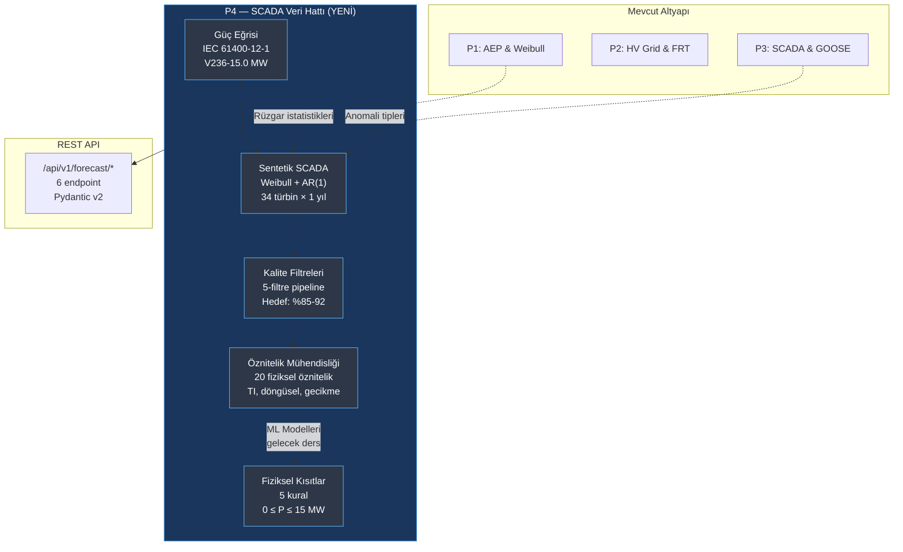

# Lesson 012 - SCADA Data Pipeline: Power Curves, Synthetic Production, Quality Filters and Physical Constraints

!!! abstract "Lesson Navigation"
    :material-arrow-left: **Previous:** [Lesson 011 - IEC 62443 RBAC and the 9-State Permit-to-Work Lifecycle](lesson-011.md) | **Next:** [Lesson 013 - XGBoost Quantile Forecasting, NWP Pipeline and SHAP Explainability](lesson-013.md) :material-arrow-right:

    **Phase:** P4 | **Language:** English | **Progress:** 13 of 19 | [All Lessons](index.md) | [Learning Roadmap](../../Learning_Roadmap.md)

> **Date:** 2026-02-26
> **Phase:** P4 (AI Forecasting)
> **Roadmap sections:** [Phase 4 - SCADA Data Pipeline, Data Quality, Feature Engineering, Physical Constraints]
> **Language:** English
> **Previous lesson:** Lesson 011

---

## What You Will Learn

- Understand how the wind turbine power curve is modeled according to the IEC 61400-12-1 standard and the 4 regions of the formula P = 0.5 × ρ × A × Cp × v³
- Generating realistic synthetic SCADA data for a 34 turbine wind farm: Weibull distribution, AR(1) temporal correlation and anomaly injection
- Applying 5-layer quality filter line (pipeline) based on IEC 61400-12-1 Annex A: restriction, maintenance, sensor failure, power curve outlier and icing
- Converting raw SCADA measurements into ML-ready features: turbulence intensity, cyclic time coding, delay values ​​and track direction indicator
- Applying 5 constraints that align ML predictions with physical reality: no negative power, nominal capacity limit, cut-in/cut-out rules and farm total limit

---

## Section 1: Power Curve — Physical Map of Wind to Electricity Conversion

### A Real World Problem

Think of the engine speed-torque curve of a car: below a certain speed, the engine does not rotate, it works most efficiently within a certain range, and when it is over-revved, the safety system comes into play and cuts the engine. That's exactly how a wind turbine works — the power curve is the "user manual" between wind speed and electrical output. Without knowing this curve, you cannot produce SCADA data, write a quality filter, or verify the ML model.

### What Do the Standards Say?

**IEC 61400-12-1 (Power Performance Measurements)** defines the power curve measurement method of wind turbines:

- Wind speed measurement with anemometer calibrated at hub height
- 10 minute averages (compatible with SCADA recording interval)
- Air density correction to reference conditions (1.225 kg/m³, 15°C, 1013.25 hPa)
- **Bins method** (method of bins): data is grouped into bins of 0.5 m/s

The power curve has 4 different regions:

| Region | Wind Speed ​​| Behavior | Physics |
|-------|-------------|----------|-------|
| 1 | v < 3.0 m/s | P = 0 | Aerodynamic torque cannot overcome propulsion system friction |
| 2 | 3.0 ≤ v < 12.5 m/s | P ∝ v³ | Maximum energy capture (Cp optimization) |
| 3 | 12.5 ≤ v ≤ 31.0 m/s | P = P_nominal | Constant power control with blade angle (pitch) |
| 4 | v > 31.0 m/s | P = 0 | Safety shutdown (blade feathering) |

### What Did We Build?

**Changed files:**

- `backend/app/services/p4/turbine_power_curve.py` — V236-15.0 MW turbine power curve model, Cp/Ct curves and interpolation functions
- `backend/tests/test_turbine_power_curve.py` — Power curve verification tests (194 lines)

We modeled the Vestas V236-15.0 MW turbine specification as a `frozen dataclass`. Rotor diameter 236 m (swept area: π × 118² = 43.743 m²), hub height 140 m, nominal power 15.0 MW. All P4 modules reference this specification.

Power calculation occurs in four steps: (1) create wind speed sequence, (2) calculate Cp curve, (3) apply the formula P = 0.5 × ρ × A × Cp × v³, (4) clamp to nominal power.

### Why It Matters

> **Why** do we build the power curve as the first module of the entire line?
> Because the power curve provides the "right answer" for the SCADA manufacturer; defines the "expected value" for quality filters; and is the physical reference against which ML predictions will be verified. If you change a single module, the entire line is affected — that's why it comes first as a foundation.

> **Why** do we use dataclass `frozen=True`?
> To prevent accidental changing of turbine parameters during simulation. After `TurbineSpec(rated_power_mw=15.0)` is created, typing `spec.rated_power_mw = 20.0` throws `FrozenInstanceError`. This guarantees the immutability of physical constants at the code level.

### Code Review

The core of the power curve calculation is the Cp (power coefficient) curve. A smooth transition from zero to Cp_max is achieved by using a sinusoidal profile in zone 2; In zone 3, Cp decreases to maintain constant power output:

```python
def _compute_cp_curve(
    wind_speeds: NDArray[np.float64],
    spec: TurbineSpec,
) -> NDArray[np.float64]:
    cp = np.zeros_like(wind_speeds)
    swept_area = compute_swept_area_m2(spec.rotor_diameter_m)

    for i, v in enumerate(wind_speeds):
        if v < spec.cut_in_speed_ms or v > spec.cut_out_speed_ms:
            cp[i] = 0.0                          # Bölge 1 ve 4: türbin kapalı
        elif v < spec.rated_speed_ms:
            # Bölge 2: sin(x) profili ile Cp artışı
            frac = (v - spec.cut_in_speed_ms) / (spec.rated_speed_ms - spec.cut_in_speed_ms)
            cp[i] = spec.cp_max * math.sin(frac * math.pi / 2.0)
        else:
            # Bölge 3: sabit güç = Cp azalır
            p_available = 0.5 * STANDARD_AIR_DENSITY * swept_area * v**3
            cp[i] = (spec.rated_power_mw * 1e6) / p_available
    return cp
```

Why profile `sin(frac × π/2)`? A linear increase (frac × Cp_max) does not reflect actual turbine behavior — in fact, Cp rises rapidly as it approaches the optimal tip-speed ratio, then flattens out. The sine profile captures this behavior in a simple but physically meaningful way.

The power calculation itself directly applies the formula and then adds the safety constraints:

```python
# P = 0.5 × ρ × A × Cp × v³
power_w = 0.5 * rho * swept_area * cp * wind_speeds**3
power_mw = power_w / 1e6

# Nominal güce kırpma (sayısal güvenlik)
power_mw = np.clip(power_mw, 0.0, spec.rated_power_mw)

# Çalışma aralığı dışında sıfırlama
power_mw[wind_speeds < spec.cut_in_speed_ms] = 0.0
power_mw[wind_speeds > spec.cut_out_speed_ms] = 0.0
```

Operation `np.clip` avoids values ​​like 15.0000001 MW due to floating point precision. The `interpolate_power_mw` function outputs power for arbitrary wind speeds via a pre-calculated curve using `np.interp` — the SCADA generator and ML verification modules use this interface.

### Basic Concept

!!! tip "Basic Concept: Betz Limit"
    **Simply:** A wind turbine cannot take all the energy in the wind — the theoretical maximum it can take is 59.3% (Betz limit). From where? If it took all the energy, the air would stagnate and the trailing wind would not be able to flow. The turbine has to "pass some wind".

    **Analogy:** Think of a water wheel: if you catch all the water, the arc stops and the wheel stops too. Optimal operation is to pass some of the water and take the energy of some of it.

    **In this project:** Our V236-15.0 MW turbine uses Cp_max = 0.48 — 81% of the Betz limit (0.593). This is a realistic value for modern turbines (range 0.45-0.50).

---

## Section 2: Synthetic SCADA Production — One Year of Data for 34 Turbines

### A Real World Problem

Similar to a pilot training in a flight simulator, realistic but controlled data is required before training our ML models. Real SCADA data is expensive, confidential, and anomaly rates are not documented. With synthetic data: (1) we know the controlled anomaly rates, (2) we can measure the success of the filters, (3) the results are reproducible.

### What Do the Standards Say?

**IEC 61400-12-1** defines SCADA recording requirements:

- Average period of 10 minutes
- Wind speed at hub height (anemometer, corrected)
- Active power output (turbine terminals)
- Ambient temperature, humidity, pressure
- Wind direction (vane over nacelle)
- Turbine operational status

### What Did We Build?

**Changed files:**

- `backend/app/services/p4/scada_generator.py` — 34-turbine synthetic SCADA generator (420 lines)
- `backend/tests/test_scada_generator.py` — Manufacturer verification tests (170 lines)

The manufacturer follows a 7-step pipeline:

1. Basic wind speed generation with **Weibull distribution** (a=10.5, k=2.2 — Baltic Sea reference)
2. **AR(1) temporal smoothing** (φ=0.95) — realistic correlation between consecutive 10-minute readings
3. **Perturbation per turbine** (±8%) — wake effects and micro-positioning differences
4. **Power calculation from power curve** + 2% measurement noise
5. **Wind direction** — 240° WSW dominant direction, slow deviation
6. **Ambient conditions** — seasonal temperature (average 8°C, ±12°C), humidity, pressure
7. **Anomaly injection** — restriction, maintenance, frozen anemometer, overpower, icing

### Why It Matters

> **Why** we use AR(1) process, why not direct Weibull instances?
> Actual wind speed measurements have high temporal correlation: a wind blowing 8 m/s 10 minutes ago is most likely around 7-9 m/s now. Independent Weibull samples capture this correlation: there is “hopping” between successive values ​​and the ML model learns unrealistic patterns. The AR(1) formula `v(t) = 0.95 × v(t-1) + 0.05 × v_weibull(t)` can be read as 95% history + 5% new information.

> **Why** did we keep anomaly rates configurable?
> To test the success of the filters at different anomaly densities. Default rates (2% restriction, 3% maintenance, 0.5% frozen anemometer, 0.3% overpower, 1% icing) are based on industry data but should be subject to change for research purposes.

### Code Review

Let's examine how temporal correlation is achieved with AR(1):

```python
def _generate_base_wind(rng, config):
    # 1. Ham Weibull örnekleri
    weibull_raw = rng.weibull(config.weibull_k, size=config.num_timesteps)
    weibull_scaled = config.weibull_a * weibull_raw

    # 2. AR(1) zamansal düzgünleştirme
    wind = np.zeros(config.num_timesteps, dtype=np.float64)
    wind[0] = weibull_scaled[0]
    phi = config.ar1_phi  # 0.95

    for t in range(1, config.num_timesteps):
        wind[t] = phi * wind[t - 1] + (1.0 - phi) * weibull_scaled[t]

    return np.maximum(wind, 0.0)  # Negatif hız fiziksel olarak imkansız
```

Why is the `phi = 0.95` value so high? Autocorrelation between 10-minute measurements in offshore wind conditions is typically in the range 0.90-0.97. A value of 0.95 is in the middle of this range and brings the statistical properties of synthetic data closer to real data.

Anomaly injection is applied independently for each turbine. Maintenance events come in multi-hour blocks (12-48 consecutive steps = 2-8 hours) — this mirrors the process of a technician arriving, working, and leaving in the real world:

```python
# Bakım: çok saatlik sıfır güç blokları
n_maint_events = max(1, int(num_t * config.maintenance_rate / 24))
for _ in range(n_maint_events):
    start = rng.integers(0, num_t - 48)
    duration = rng.integers(12, 48)  # 2-8 saat
    end = min(start + duration, num_t)
    power[start:end, turb] = 0.0
    status[start:end, turb] = "maintenance"
```

Each anomaly type has a different label in the `status` array — these labels are used as "ground truth" in quality filters' accuracy measurements.

### Basic Concept

!!! tip "Basic Concept: Weibull Distribution"
    **Simply:** The Weibull distribution is a "probability map" of wind speed. Parameter a (scale) "how strong is the average wind?" question, and k (shape) is “how stable is the wind?” answers the question. If k=2, the wind follows the Rayleigh distribution (widespread offshore distribution); If k>2, it concentrates in a narrower range.

    **Analogy:** Think of lap times on a racetrack: the average lap time is a, k is how consistent the rider is. High k = tight range of times, low k = both very fast and very slow laps.

    **In this project:** The parameters a=10.5 m/s and k=2.2 represent typical wind statistics of the Polish Baltic Sea at a hub height of 140 m. Average wind speed ≈ 9.3 m/s, AEP calculations are based on this distribution.

---

## Section 3: Quality Filters — Preventing “Garbage In, Garbage Out”

### A Real World Problem

It's like a cook sorting vegetables before cooking: you can't make a good meal with rotten, buggy or wrong ingredients. SCADA data also contains “garbage” — throttling periods, maintenance periods, frozen sensors, icing. Training the ML model without filtering this data teaches the model “how to predict failure” — not “how to estimate normal power.”

### What Do the Standards Say?

**IEC 61400-12-1 Annex A** defines data exclusion criteria:

- Removing periods when the turbine is not in normal operation
- Removal of known throttling or power limiting periods
- Removing identified sensor faults
- Statistical outlier detection per wind speed bin

Our five filters extend this standard with ML-specific controls:

| Filter | Method | Threshold |
|--------|--------|------|
| 1. Restriction | P ≈ 0 but v > cut-in | P < 0.1 MW and status ≠ maintenance |
| 2. Maintenance | Operational status | status ≠ "running" |
| 3. Sensor failure | Frozen anemometer + extreme power | σ(v) < 0.01 @ 6 adım; P > 1.05 × P_nominal |
| 4. Power curve outlier | IQR method (bins) | [Q1-1.5×IQR, Q3+1.5×IQR] |
| 5. Icing | Performance + meteorology | P < 0.5×P_beklenen ve nem > 95% and T < 2°C |

### What Did We Build?

**Changed files:**

- `backend/app/services/p4/scada_quality_filters.py` — 5 quality filter pipelines (383 lines)
- `backend/tests/test_scada_quality_filters.py` — Filter verification tests (211 lines)

Each filter works independently and returns a boolean mask. Masks are combined with an OR-join: the data point flagged by any filter is labeled as "not clean". Target availability: 85-92%.

### Why It Matters

> **Why** 5 filters are applied independently, why not sequential?
> The standalone implementation allows us to measure in isolation how much data each filter extracts. If Filter 3 (sensor) is removing 15% of the data, this indicates a problem with sensor quality — this information would be lost if the entire line was in-line. The `counts_by_filter` dictionary makes this diagnosis possible.

> **Why** do we prefer the IQR method over z-score?
> The IQR (interquartile range) method is not affected by outliers themselves — Q1 and Q3 values ​​are robust to outliers. Z-score, on the other hand, is based on the mean and standard deviation, and outliers skew these statistics. 5-10% anomalies are typical in wind turbine power data, making the z-score unreliable.

### Code Review

IQR-based power curve outlier detection implements the bins method of IEC 61400-12-1:

```python
def detect_power_curve_outliers(wind_speed, power, bin_width_ms=1.0, iqr_multiplier=1.5):
    flagged = np.zeros((num_t, num_turb), dtype=np.bool_)

    for turb in range(num_turb):
        for b in range(len(bin_edges) - 1):
            bin_mask = (ws_col >= bin_edges[b]) & (ws_col < bin_edges[b + 1])
            bin_indices = np.where(bin_mask)[0]
            if len(bin_indices) < 10:
                continue  # Seyrek kutuları atla — istatistik güvenilmez

            bin_power = pwr_col[bin_indices]
            q1 = np.percentile(bin_power, 25)
            q3 = np.percentile(bin_power, 75)
            iqr = q3 - q1
            lower = q1 - iqr_multiplier * iqr  # Alt sınır
            upper = q3 + iqr_multiplier * iqr  # Üst sınır

            outliers = (bin_power < lower) | (bin_power > upper)
            flagged[bin_indices[outliers], turb] = True
    return flagged
```

Why `len(bin_indices) < 10` control? In bins with fewer than 10 data points, the Q1/Q3 calculation becomes statistically unreliable — a single anomaly can invalidate the entire bin. This threshold is the "minimum sample for statistical confidence" principle.

The combination of five filters is simple and clear:

```python
any_flagged = (curtailment_mask | maintenance_mask |
               sensor_mask | outlier_mask | icing_mask)
clean_mask = ~any_flagged  # Temiz veri: hiçbir filtre tarafından işaretlenmemiş
```

The `FilterResult` object reports how many data points each filter extracted with the `counts_by_filter` dictionary. The `availability_pct` value is on target for 85-92% — too low and most of the data is garbage, too high and the filters are inadequate.

### Basic Concept

!!! tip "Basic Concept: IQR Outlier Detection"
    **Simply:** Think about test scores in a class. Draw the 25% below and above the middle (Q1 and Q3). The distance between these two lines is IQR. If a grade is 1.5×IQR below Q1 or 1.5×IQR above Q3 — it is “suspiciously different.”

    **Analogy:** Consider the goal statistics of a football team: 1-3 goals per match is normal. But if 15 goals were scored in a match, this is likely a data error or an unusual occurrence — the IQR method captures this.

    **In this project:** We calculate the IQR of the power values ​​for each 1 m/s wind speed bin. If the expected power at 8 m/s is 5-7 MW, a reading of 0.1 MW or 14 MW is definitely an anomaly.

---

## Section 4: Feature Engineering — From Raw Data to ML-Ready Matrix

### A Real World Problem

Imagine that it is not enough for a doctor to just say "I have a fever" - he also asks for his blood pressure, pulse, and blood values. Raw SCADA channels (wind speed, direction, temperature) alone are not enough. The ML model should know the "12-hour trend", "what time of day it is" and "the angle of the wind with the farm axis", not raw data like "temperature".

### What Do the Standards Say?

**IEC 61400-1** defines turbulence intensity:

- TI = σ₁ / V_hub (10-minute standard deviation / average speed)
- IEC turbulence classes: A (I_ref=0.16), B (0.14), C (0.12)
- Baltic offshore sites are typically class C (I_ref ≈ 0.06-0.10)

### What Did We Build?

**Changed files:**

- `backend/app/services/p4/feature_engineering.py` — Physical attribute engineering pipeline (425 lines)
- `backend/tests/test_feature_engineering.py` — Attribute validation tests (258 lines)

We built a pipeline that generates 20 attributes:

| Attribute Group | Number | Formula |
|-----------------|------|--------|
| Wind speed + rolling stats | 3 | ws, mean(ws, 1h), std(ws, 1h) |
| Turbulence intensity | 1 | TI = σ / μ |
| Wind direction + rate of change | 2 | wd, \|Δwd/Δt\| |
| Air density | 1 | ρ = P/(R × T_K) |
| Meteorology | 2 | temperature, humidity |
| Cyclic time | 4 | sin/cos(hour), sin/cos(month) |
| Track direction indicator | 1 | cos(wd - farm_axis) |
| Power delay values ​​| 6 | P(t-1)...P(t-6) |

### Why It Matters

> **Why** do we encode the time as a sin/cos pair and not as a direct number (0-23)?
> Because 23 o'clock and 0 o'clock are actually 1 hour apart, but numerically they are 23 units apart. The ML model cannot learn this "discontinuity". With cyclic coding: `sin²(x) + cos²(x) = 1` is always valid, and the clock 23→0 transition is a smooth sine curve — no discontinuities.

> **Why** are we dropping rows instead of filling in NaN values?
> The delay and rolling attributes are undefined at the beginning of the time series: P(t-1) is not present in the first step, the 1-hour average cannot be calculated in the first 5 steps. Filling these NaNs with zero or mean creates "data leakage". The correct approach: to leave these lines silently. The `dropped_timesteps` field reports how many rows were dropped.

### Code Review

Cyclic time coding can be thought of as location on a circle:

```python
def compute_cyclical_time_features(timestamps):
    # Gün içi saat: Unix epoch → günlük saniye → saat
    seconds_in_day = timestamps % 86400
    hours = seconds_in_day / 3600.0

    # Yıl içi ay yaklaşımı
    day_of_year = (timestamps % (365 * 86400)) / 86400.0
    month_approx = day_of_year / 30.44  # Ortalama ay uzunluğu

    hour_sin = np.sin(2.0 * np.pi * hours / 24.0)
    hour_cos = np.cos(2.0 * np.pi * hours / 24.0)
    month_sin = np.sin(2.0 * np.pi * month_approx / 12.0)
    month_cos = np.cos(2.0 * np.pi * month_approx / 12.0)

    return hour_sin, hour_cos, month_sin, month_cos
```

There is a critical mathematical reason for using sin and cos together: with sin(hour) alone, 6 o'clock and 18 o'clock take the same value (0) — they are indistinguishable. Adding cos makes 6 o'clock → (0, -1) and 18 o'clock → (0, 1) — now unique.

The wake direction indicator measures the wake potential of the wind direction relative to the farm array axis:

```python
def compute_wake_direction_indicator(wind_direction_deg, farm_alignment_deg=210.0):
    angle_diff_rad = np.radians(wind_direction_deg - farm_alignment_deg)
    return np.cos(angle_diff_rad)
```

`cos(0°) = 1.0`: the wind blows exactly along the farm axis. → the wake effect is maximum. `cos(90°) = 0.0`: the wind is blowing vertically. → the wake effect is minimal. This single number conveys complex track physics as a simple signal to the ML model.

### Basic Concept

!!! tip "Basic Concept: Data Leakage from the Future"
    **Simply:** Seeing the answer key before taking a test — the result is great but does not measure real knowledge. In ML, the leakage of future data into education is the same thing.

    **Analogy:** It's like knowing tomorrow's weather and then "confirming" today's forecast. The result always comes out perfect, but the model hasn't actually learned anything.

    **In this project:** Delay attributes only look back: P(t-1) = power of the previous step. The first 6 rows with NaN are dropped, never filled. This strict rule ensures that the model only makes predictions with the information available up to time t.

---

## Section 5: Physical Constraints — ML May Not Break the Laws of Physics

### A Real World Problem

If a navigation app tells you to "walk across the sea", the route is physically impossible, even if the map is accurate. ML models can similarly produce physically impossible predictions: negative power, power above rated capacity, or electricity generation when there is no wind. The physical constraint layer is the final safety net preventing these “walking on the sea” proposals.

### What Do the Standards Say?

**IEC 61400-12-1** defines the valid operating envelope of the power curve. Predictions cannot be outside this envelope:

- Zone 1 (v < 3.0 m/s): P necessarily 0 MW
- Zone 3 (v_nominal ≤ v ≤ v_cut-out): P ≤ P_nominal (15.0 MW)
- Zone 4 (v > 31.0 m/s): P necessarily 0 MW

### What Did We Build?

**Changed files:**

- `backend/app/services/p4/physical_constraints.py` — Physical constraint enforcement layer (303 lines)
- `backend/tests/test_physical_constraints.py` — Constraint validation tests (131 lines)

Five constraint rules verify every ML prediction with physical reality:

| Constraint | Rule | Priority |
|-------|-------|---------|
| C1 | P ≥ 0 (no negative power) | Low |
| C2 | P ≤ 15.0 MW (rated capacity) | Low |
| C3 | v < 3.0 m/s → P = 0 | High (overrides C1/C2) |
| C4 | v > 31.0 m/s → P = 0 | High (overrides C1/C2) |
| C5 | Σ P_i ≤ 510 MW (farm aggregate limit) | Farm level |

### Why It Matters

> **Why** do we apply constraints at output (post-processing) and not during model training?
> There are two reasons: (1) Model architecture independence — Whether XGBoost, LSTM or TFT, it uses the same constraint layer. (2) Separation of concerns — the model learns statistical patterns, applying the laws of physics is the responsibility of a separate module. This architecture prevents the constraint code from changing as the model changes.

> **Why** do wind-based constraints (C3/C4) override power-based constraints (C1/C2)?
> Physical hierarchy: power generation is physically impossible if there is no wind — C1/C2 saying "allow in range 0-15" is meaningless. C3/C4 says "the wing cannot turn" and this rule is absolute.

### Code Review

The order of constraint application is critical — C1/C2 first, then C3/C4 override:

```python
def enforce_physical_constraints(power_mw, wind_speed_ms=None, ...):
    corrected = power_mw.copy()
    violations = []

    # C1: Negatif güç yok
    neg_mask = corrected < 0.0
    corrected[neg_mask] = 0.0

    # C2: Nominal kapasite sınırı
    over_mask = corrected > rated_power_mw
    corrected[over_mask] = rated_power_mw

    # C3 & C4: Rüzgar tabanlı kurallar (üste yazma)
    if wind_speed_ms is not None:
        corrected[wind_speed_ms < cut_in_ms] = 0.0   # Cut-in altı
        corrected[wind_speed_ms > cut_out_ms] = 0.0   # Cut-out üstü

    return ConstraintResult(power_mw=corrected, violations=violations, ...)
```

Each violation is written to a register `ConstraintViolation`: which constraint, which step, original value, and corrected value. These records are used for both debugging and model improvement — if C1 violations are too high, the model tends to produce negative predictions, indicating a problem in the training data.

At the farm level, constraint C5 applies proportional scaling if the total power exceeds 510 MW:

```python
# C5: Çiftlik toplam sınırı — orantılı küçültme
farm_totals = np.sum(corrected_all, axis=1)
over_cap = farm_totals > farm_capacity  # 510 MW

for t_idx in np.where(over_cap)[0]:
    scale = farm_capacity / farm_totals[t_idx]
    corrected_all[t_idx, :] *= scale
```

Why proportional scaling and not throttling by randomly selecting turbines? Proportional scaling throttles turbines producing high power more (fairly) and affects those producing lower power less. This also makes physical sense because higher power turbines are likely to see stronger wind.

### Basic Concept

!!! tip "Basic Concept: Physics-Informed ML"
    **Simply:** Telling the ML model to "limit your imagination". No matter how smart the model is, it can't break the laws of physics — just like a plane can't take off by "ignoring gravity."

    **Analogy:** A child knows the rule "the sky can't be green and the grass can't be blue" when drawing. Physical constraints are rules that prevent the ML model from drawing "green skies".

    **In this project:** The 5 constraint rule ensures that each ML estimate falls within the physical operating envelope of the V236-15.0 MW turbine. The result: both more accurate predictions and output that SCADA operators can trust.

---

## Section 6: REST API & Pydantic Schemas — Doors to Each Module

### A Real World Problem

No matter how good a restaurant's cuisine is, it is useless if there are no waiters and a menu to serve the customers. Our backend service modules are "kitchens"; REST API endpoints and Pydantic schemas are "waiters" and "menu". Without properly defined interfaces, the frontend cannot access these modules.

### What Do the Standards Say?

The OpenAPI (Swagger) specification provides automatic documentation of REST APIs. FastAPI automatically generates this specification from Pydantic models. Each `Field(description=...)` becomes an API document line.

### What Did We Build?

**Changed files:**

- `backend/app/routers/p4.py` — 6 REST endpoints (259 lines)
- `backend/app/schemas/forecast.py` — Pydantic v2 request/response schemas (195 lines)
- `backend/app/services/p4/__init__.py` — Common exports (63 lines)
- `backend/app/main.py` — P4 router record (2 lines changed)

Under the six endpoints `/api/v1/forecast/`:

| Endpoint | Method | Function |
|----------|-------|-------|
| `/turbine-spec` | GET | V236-15.0 MW specification |
| `/power-curve` | POST | IEC 61400-12-1 power curve generation |
| `/generate-scada` | POST | Synthetic SCADA dataset |
| `/quality-filter` | POST | 5-filter quality line |
| `/features` | POST | Feature engineering |
| `/check-constraints` | POST | Physical constraint verification |

### Why It Matters

> **Why** do we return the summary of the SCADA data set and not the entire data set?
> 34 turbines × 52,560 steps × 8 channels = ~14 million float values ​​→ approximately 110 MB JSON. This is overkill for a REST API response. Summary (averages, case counts, time range) is sufficient. If the full data set is needed, this should be a batch export endpoint — a different architectural decision.

> **Why** are there `Field(ge=..., le=...)` constraints on every request schema?
> Pydantic validation is the “first line of defense” at the API boundary. `weibull_k: float = Field(ge=1.0, le=4.0)` rejects physically meaningless parameters (k=0 or k=100) with HTTP 422 — this ensures that the server code does not run at all and does not perform unnecessary calculations.

### Code Review

In the Pydantic schema, `Field` definitions have both a validation and documentation role:

```python
class PowerCurveRequest(BaseModel):
    wind_step_ms: float = Field(
        default=0.5,
        ge=0.1, le=2.0,  # Fiziksel sınırlar
        description="Wind speed bin width [m/s]. IEC 61400-12-1 default: 0.5",
    )
    air_density_kg_m3: float | None = Field(
        default=None,
        ge=0.8, le=1.6,  # Deniz seviyesi ±%30 marj
        description="Air density [kg/m³]. Default: 1.225 (standard conditions)",
    )
```

Each `description` string automatically appears in FastAPI's `/docs` Swagger page. This is “API documentation” not “code documentation” — the frontend developer understands what he needs to ship without looking at the source code.

### Basic Concept

!!! tip "Basic Concept: Boundary Validation"
    **Simply:** It's like a security check at the door of a building — you can't enter the building without checking your bag. The API boundary is the point where the outside world enters the system, and if there is no validation there, internal modules will work with insecure data.

    **Analogy:** Passport control of an airport: if your passport is invalid, you cannot enter the country. In domestic city traffic, no one asks for a passport — control is done at the border. Likewise, the `enforce_physical_constraints` function does not validate parameters internally because the API layer has already done this.

    **In this project:** Pydantic `Field(ge=1.0, le=4.0)` definitions reject physically meaningless parameters in API entry. The service layer works with the assurance of "I receive clean data".

---

## Connections

**Where these concepts will be used in the future:**

- **Power curve** (Part 1) → P4's XGBoost and LSTM models will validate their predictions against this curve
- **SCADA generator** (Part 2) → Synthetic data will be the training set of all P4 ML models; will be compared with ERA5+ true SCADA integration in the future
- **Quality filters** (Part 3) → SHAP explainability analysis will show the difference between filtered vs unfiltered data
- **Feature engineering** (Part 4) → XGBoost feature importance (gain/cover/SHAP) will measure which features are most valuable
- **Physical constraints** (Part 5) → Constraints will be applied to each step in TFT multi-horizon predictions
- **P3 → P4 connection**: The SCADA device logging system (Lesson 009) and GOOSE fault simulation (Lesson 010) in P3 are built on this SCADA data — the anomaly types come from there

---

## The Big Picture

*Focus of this lesson: **The entire P4 SCADA data pipeline** — from physical power curve to quality filter, from feature engineering to physical constraints.*



For full system architecture: [Lessons Overview](index.md#system-architecture)

---

## Key Takeaways

1. **The power curve is the cornerstone of the P4 pipeline** — SCADA generation, quality filtering, and constraint verification all depend on this curve.
2. **Synthetic data enables controlled experiments** — you can measure the success of filters with data where you know the anomaly rates.
3. **The combination of AR(1) + Weibull** captures both accurate long-term statistics and realistic short-term correlation.
4. **“Data quality is more important than model complexity”** — Even the most advanced model trained with 10% anomalous data lags behind a simple model trained with clean data.
5. **The IQR method is more robust than z-score** — robust to outliers because Q1/Q3 is based on the median, not the mean.
6. **Cyclic time coding eliminates discontinuity with sin/cos pair** — ML model learns time, month and direction with the correct concept of “distance”.
7. **Physical constraints are a model-independent final safety net** — the laws of physics are constant even if the model changes.

---

## Recommended Reading

*[Learning Roadmap](../../Learning_Roadmap.md) — Phase 4: Machine Learning for Energy*

| Source | Genre | Why Should You Read |
|--------|-----|---------------|
| Hyndman & Athanasopoulos — *Forecasting: Principles and Practice* (3rd Ed.) | Online textbook (free) | Fundamentals of time series cross-validation and feature engineering — theoretical background of lag/rolling features in this course |
| IEA Wind TCP Task 36 — *Forecasting for Wind Power* | Reports (free) | Data quality and preprocessing best practices in wind power forecasting — the industry reference for our quality filters |
| Chen & Guestrin (2016) — *XGBoost: A Scalable Tree Boosting System* | Article | To understand the concept of feature importance — in the next stage of our feature engineering pipeline, SHAP values ​​will be calculated with this model |
| Hong et al. (2020) — *Energy Forecasting: A Review* | Review article | Integration of physical constraints with ML in energy estimation — academic justification for our constraint enforcement layer |

---

## Quiz — Test Your Understanding

### Recall Questions

**Q1:** Why does the power in Zone 3 of the power curve (12.5-31.0 m/s) remain constant, even though the wind speed increases?

<details>
<summary>Answer</summary>

In zone 3, the pitch control system reduces the rate of energy captured from the wind (Cp) by increasing the blade angle. As the wind speed increases, the available power (P_wind = 0.5ρAv³) increases, but decreases at the rate Cp, leaving the product constant: P_electrical = P_rated = 15.0 MW. This mechanism protects the generator and mechanical components from overload.

</details>

**S2:** In the SCADA manufacturer, the AR(1) autocorrelation coefficient is set to φ = 0.95. What does this mean?

<details>
<summary>Answer</summary>

φ = 0.95 means that each 10-minute wind speed reading is based 95% on the previous reading, 5% on the new Weibull sample. This reflects the strong temporal correlation (successive measurements are similar) of offshore wind. A lower value of φ produces more “jumpy” data; A higher φ value creates a smoother but slowly changing wind profile.

</details>

**Q3:** How many filters does the `apply_all_quality_filters` function apply and what is the target availability percentage?

<details>
<summary>Answer</summary>

Applies 5 filters: (1) restriction detection, (2) maintenance periods, (3) sensor faults (frozen anemometer + excessive power), (4) power curve outliers (IQR), (5) icing detection. Target availability is 85-92% — too low and most of the data is problematic, too high and filters are working poorly.

</details>

### Comprehension Questions

**Q4:** Why are sin and cos used together in cyclic time coding? Isn't sin alone sufficient?

<details>
<summary>Answer</summary>

With sin(hour) alone, 6 o'clock (sunrise) and 18 o'clock (sunset) receive the same sin value (0) — the ML model cannot distinguish between these two different times. Adding cos makes 6 o'clock → (sin=0, cos=-1) and 18 o'clock → (sin=0, cos=1) — each hour now has a unique 2D coordinate. Mathematically, each angle on the unit circle maps to a unique (sin, cos) pair.

</details>

**Q5:** Why is the physical constraint layer applied at output (post-processing) and not during model training?

<details>
<summary>Answer</summary>

There are two main reasons: (1) Model independence — the same constraint layer can be applied to predictions from XGBoost, LSTM or TFT, no separate constraints are written for each model. (2) Separation of concerns — the task of the model is to learn statistical patterns, while applying the laws of physics is the responsibility of a separate module. This architecture ensures that when one module changes, the other is not affected.

</details>

**Q6:** Why is the `len(bin_indices) < 10` check necessary for IQR outlier detection?

<details>
<summary>Answer</summary>

In wind speed bins with fewer than 10 data points, the calculation of Q1 and Q3 becomes statistically unreliable. For example, the IQR calculated with 3 data points is greatly affected by a single anomaly and may incorrectly flag normal data points as “outliers.” A minimum of 10 samples ensures that percentage calculations can be made with a reasonable level of confidence. This "statistical minimum sample" principle reduces the false positive rate.

</details>

### Challenging Question

**Q7:** Our current synthetic SCADA generator models the wake effect as only ±8% random perturbation. In the real world, the wake effect depends on wind direction and turbine location. How do you integrate the PyWake trace model in P1 with the P4 SCADA generator? What additional attributes would you create and what impact would these attributes have on the attribute engineering pipeline?

<details>
<summary>Answer</summary>

Integration can be done in 3 stages: (1) From PyWake's Jensen/Bastankhah wake model, a "wake loss matrix" is extracted for each turbine pair and wind direction combination — this matrix numerically defines which turbine affects which turbine by how much, relative to wind direction. (2) Instead of the fixed ±8% perturbation available in the SCADA generator, at each step the corresponding row is drawn from the wake loss matrix using the wind direction and power reduction is applied — so that different turbines are affected at different rates when the wind blows from the east and blows from the west. (3) New attributes in feature engineering: (a) `wake_deficit_ratio` = actual power / expected power without wake, (b) `upstream_turbine_power` = power of the nearest upper wind turbine (neighbor effect indicator), (c) `effective_wind_speed` = wake loss corrected wind speed. These features enrich the existing `wake_direction_indicator` and make it possible to directly measure the role of trace impact in ML prediction in XGBoost's feature importance analysis.

</details>

---

## Interview Corner

### Simply Explain
*"How would you explain today's main topic to a non-engineer?"*

Think of a wind farm — 34 giant propellers spinning in the sea. Each of these propellers sends a report to the computers every 10 minutes: "The wind blows this much, I produce this much electricity, this is the temperature." These reports are SCADA data. But there are problems with this data: sometimes the sensor breaks down and sends the wrong number, sometimes the propeller is taken into service but it still writes a report, sometimes there is icing and the propeller produces less electricity than normal. If you train an AI model with this “corrupt” data, the model learns the impairments — not the normal behavior.

What we did is to build a pipeline: first we created the physical map of the "wind speed-electricity" relationship (power curve), then we produced realistic artificial data using this map, then we extracted corrupted data with 5 different filters, then we derived new information in the language that artificial intelligence can understand (feature engineering), and finally we checked the suggestions of artificial intelligence with the laws of physics. Result: reliable predictions.

### Explain Technically
*"How would you explain today's main topic to an interview panel?"*

Starting from an IEC 61400-12-1 compliant power curve model, we built an end-to-end SCADA data pipeline for a 34-turbine offshore wind farm. The power curve models the 4-zone Cp/Ct profile of the Vestas V236-15.0 MW turbine — sinusoidal Cp ramp in Region 2, pitch-regulated constant power in Region 3. The synthetic SCADA generator applies AR(1) temporal smoothing (φ=0.95) on the Weibull(a=10.5, k=2.2) distribution, creating a matrix of 52,560 ten-minute steps × 34 turbines; then injects 2% restriction, 3% maintenance, 0.5% frozen anemometer, 0.3% overpower, and 1% icing anomalies. 5-layer quality filter extends IEC 61400-12-1 Annex A to the ML context — providing 85-92% target availability with IQR-based bin-based outlier detection, meteorological icing correlation and condition-based maintenance exclusion. The feature engineering layer produces 20 physically meaningful features: IEC 61400-1 turbulence intensity, cyclic sin/cos time coding (eliminating clock and moon discontinuity), 6-step power delays (without future leakage, NaN rows are dropped), and cos(wd - farm_axis) wake direction indicator. The last layer trims the model outputs to the physical working envelope with 5 physical constraint rules (C1: non-negativity, C2: rated cap, C3/C4: cut-in/cut-out, C5: farm total 510 MW). The entire line is model-agnostic — whether XGBoost, LSTM or TFT. The architecture makes each module independently testable and modifiable, following the principle of separation of concerns.
