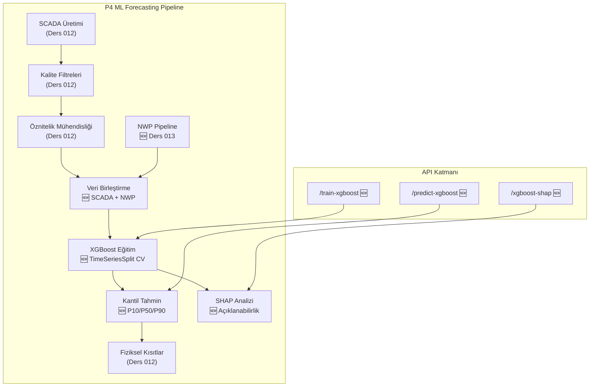

# Lesson 013 - XGBoost Quantile Forecasting: NWP Pipeline, Probabilistic Power Forecasting and SHAP Explainability

!!! abstract "Lesson Navigation"
    :material-arrow-left: **Previous:** [Lesson 012 - SCADA Data Pipeline, Quality Filters and Physical Constraints](lesson-012.md) | **Next:** [Lesson 014 - LSTM Time-Series Forecasting with MC Dropout](lesson-014.md) :material-arrow-right:

    **Phase:** P4 | **Language:** English | **Progress:** 14 of 19 | [All Lessons](index.md) | [Learning Roadmap](../../Learning_Roadmap.md)

> **Date:** 2026-02-26
> **Phase:** P4 (AI Forecasting)
> **Roadmap sections:** [Phase 4 - NWP Pipeline, XGBoost Quantile Regression, TimeSeriesSplit, SHAP Explainability]
> **Language:** English
> **Previous lesson:** Lesson 012

---

## What You Will Learn

- Why Numerical Weather Prediction (NWP) data is critical for wind energy forecasting and how ECMWF aims to produce synthetic data similar to HRES
- XGBoost gradient boosting algorithm produces probabilistic P10/P50/P90 power estimation with quantile regression
- Why TimeSeriesSplit cross-validation is mandatory for time series and how it prevents future data leakage
- Making model decisions explainable and ranking feature importance with SHAP (SHapley Additive exPlanations)
- To guarantee quantile monotonicity (P10 ≤ P50 ≤ P90) by applying physical constraints to the estimation results

---

## Section 1: Synthetic NWP Pipeline — Simulating the Atmosphere

### Real World Problem

Think of a weather app: your screen says "15°C and sunny tomorrow". So where does this prediction come from? Massive supercomputers solve the physics equations of the atmosphere (Navier-Stokes, thermodynamics, humidity) on a discrete grid. That's exactly what NWP (Numerical Weather Prediction) models do. For wind farm operators, NWP is the only way to know tomorrow's wind speed today — because knowing how much electricity the turbine will produce in 10 minutes is vital for energy trading and grid commitments.

### What the Standards Say

The **ECMWF HRES** (High-Resolution Forecast) model operates at ~9 km horizontal resolution, 137 vertical levels and produces forecasts for up to 10 days. Critical NWP variables for wind energy forecasting:

- 100 m wind speed [m/s] — primary predictor
- 100 m wind direction [°] — wake and yaw correction
- 2 m temperature [°C] — air density correction
- Sea level pressure [Pa] — air density calculation: ρ = P/(R·T)
- Boundary layer height [m] — indicator of turbulence regime

**IEC 61400-1 Ed.4** defines the power law model for the wind profile:

> v(z) = v(z_ref) × (z / z_ref)^α — where α ≈ 0.11 (offshore)

### What We Built

**Changed files:**

- `backend/app/services/p4/nwp_pipeline.py` — Synthetic NWP data generator: Produces 5-variable forecast data similar to ECMWF HRES
- `backend/app/services/p4/__init__.py` — Package-level re-export of NWP and XGBoost modules

We produced synthetic NWP data that is correlated with SCADA "real" measurements but contains increasing error due to lead time. This simulates how the NWP forecast deteriorates over time in the real world.

### Why It Matters

> **Why** do we add NWP data as well as SCADA data to the ML model?
> Because SCADA data tells history — "10 minutes ago the wind was 8 m/s." But energy trading and grid planning require knowing the future. NWP predicts 1-48 hours ahead by solving the physics equations of the atmosphere. Combining the two gives the model both "what happened" and "what will happen" information.
>
> **Why** does forecast error grow with lead time?
> The atmosphere is a chaotic system—small initial errors grow exponentially over time (Lorenz, 1963). In our model, we simulate this with the formula σ(t) = σ_base + σ_growth × lead_hour: while the error is ~0.5 m/s in the first hours, it increases to ~5.3 m/s after 48 hours.

### Code Review

NWP wind speed generation is done by adding Gaussian noise to SCADA measurements. The standard deviation of noise increases linearly with forecast time — this mimics the decay of true NWP forecast skill over time.

```python
def _generate_nwp_wind_speed(
    rng: np.random.Generator,
    scada_wind_ms: NDArray[np.float64],
    config: NWPConfig,
) -> NDArray[np.float64]:
    n = len(scada_wind_ms)

    # Tahmin döngüsü: NWP her 6 saatte yeniden başlatılır
    steps_per_cycle = int(config.forecast_horizon_hours * 6)

    lead_hours = np.zeros(n, dtype=np.float64)
    for t in range(n):
        step_in_cycle = t % steps_per_cycle
        lead_hours[t] = step_in_cycle / 6.0  # Adımdan saate dönüşüm

    # Hata lead time ile büyür: σ(t) = σ_base + σ_growth × lead_hour
    sigma = config.sigma_base_ms + config.sigma_growth_ms_per_hour * lead_hours
    noise = rng.normal(0.0, sigma)

    nwp_wind = scada_wind_ms + noise
    return np.maximum(nwp_wind, 0.0)  # Fiziksel kısıt: rüzgar hızı ≥ 0
```

This function realistically simulates deteriorating forecast accuracy while maintaining the correlation between NWP and SCADA. With `np.maximum(nwp_wind, 0.0)` we prevent physically impossible negative wind speeds.

Joining the NWP data set to the SCADA attribute matrix is ​​done with the `merge_nwp_features` function. This function adds the 5 NWP columns to the right of the existing SCADA attributes:

```python
def merge_nwp_features(
    scada_features: NDArray[np.float64],
    nwp_dataset: NWPDataset,
    valid_indices: int | None = None,
) -> NDArray[np.float64]:
    n_rows = scada_features.shape[0]

    # NWP'nin SON n_rows satırını al (SCADA, gecikme öznitelikleri
    # nedeniyle baştaki satırları düşürür)
    offset = len(nwp_dataset.wind_speed_100m_ms) - n_rows
    if offset < 0:
        raise ValueError(...)

    nwp_columns = np.column_stack([
        nwp_dataset.wind_speed_100m_ms[offset : offset + n_rows],
        nwp_dataset.wind_direction_100m_deg[offset : offset + n_rows],
        nwp_dataset.temperature_2m_c[offset : offset + n_rows],
        nwp_dataset.pressure_msl_pa[offset : offset + n_rows],
        nwp_dataset.boundary_layer_height_m[offset : offset + n_rows],
    ])

    return np.hstack([scada_features, nwp_columns])
```

An important detail: During the SCADA feature engineering process, some leading lines are dropped due to lag features. The `offset` calculation ensures that NWP data is aligned to the correct time period.

### Basic Concept

!!! tip "Basic Concept: Forecast Skill Degradation"
    **In simple language:** Think about the weather forecast — tomorrow's forecast is pretty reliable, but the forecast 5 days out is much more uncertain. This is because the atmosphere is "chaotic": a tiny measurement error snowballs over time.

    **Similarity:** You are hitting a billiard ball. You can predict the first collision perfectly. Second collision with reasonable accuracy. But the 10th collision is nearly impossible to predict — tiny angle differences in each collision become exponentially larger.

    **In this project:** NWP wind speed forecast is RMSE ~1.0-1.5 m/s for 0-6 hours, increasing to 2.5-4.0 m/s for 24-72 hours. Due to the wind power cubic relation (P ∝ v³), this error translates into even greater uncertainty in the power estimate.

---

## Section 2: XGBoost Quantile Regression — Probabilistic Power Estimation

### Real World Problem

Think of an investment advisor: Would you trust the advisor who said, "The stock will increase by 5% tomorrow"? Probably not — because there is no uncertainty. But the advisor who says "I expect a 3-7% increase with a 70% probability tomorrow" is much more reliable. Wind energy forecasting works on the same logic: giving an uncertainty range, rather than a single number, allows the operator to make better decisions.

### What the Standards Say

**IEC 61400-26-1** (Availability and Uncertainty) requires uncertainty quantification for power estimates. P10/P50/P90 ranges map directly to operational decisions:

- **P90**: Conservative estimate — for grid commitment (90% probability of exceedance)
- **P50**: Central forecast — for energy trading (median)
- **P10**: Optimistic forecast — for maintenance planning

**Skill Score** evaluates the model against a simple baseline:

> SS = 1 - RMSE_model / RMSE_persistence

Here the persistence estimate: "next value equals current value" — P(t+1) = P(t). If SS > 0, the model beats this naive approach.

### What We Built

**Changed files:**

- `backend/app/services/p4/xgboost_model.py` — XGBoost quantile regression model: training, prediction and SHAP calculation
- `backend/app/schemas/forecast.py` — 6 new Pydantic schemes (request/response models)
- `backend/app/routers/p4.py` — 3 new API endpoints: train-xgboost, predict-xgboost, xgboost-shap

We train a separate XGBoost model for each quantile level (P10, P50, P90). These models are optimized with the **pinball loss** function:

> L_τ(y, ŷ) = τ × max(y-ŷ, 0) + (1-τ) × max(ŷ-y, 0)

### Why It Matters

> **Why** do we produce 3 quantiles (P10/P50/P90) instead of a single estimate?
> A single point forecast tells the operator "8 MW tomorrow". But how much is 8 MW±? With P10/P50/P90 the operator learns: "80% probability the power will be between P10 and P90." This information can make a difference of millions of euros in energy trading — commit with P90 and you minimize the risk of penalties, with P50 you can trade more aggressively.
>
> **Why** did we choose XGBoost and not linear regression?
> Due to the wind power equation P = ½ρACpv³, the power-wind speed relationship is not linear but cubic. There are also attribute interactions such as turbulence intensity × wind speed. XGBoost's decision trees can naturally capture these nonlinear relationships — linear regression cannot.

### Code Review

The pinball loss function that XGBoost uses for quantile regression “pulls” the model toward a specific quantile level. For τ=0.10 the model heavily penalizes low estimates (because we want it to be above 90% of the true value), while for τ=0.90 it penalizes high estimates.

```python
def _train_quantile_model(
    x_train: NDArray[np.float64],
    y_train: NDArray[np.float64],
    x_val: NDArray[np.float64],
    y_val: NDArray[np.float64],
    quantile: float,
    config: XGBoostConfig,
) -> xgb.Booster:
    """Tek bir kantil seviyesi için XGBoost modeli eğit."""
    dtrain = xgb.DMatrix(x_train, label=y_train)
    dval = xgb.DMatrix(x_val, label=y_val)

    params: dict[str, object] = {
        "objective": "reg:quantileerror",  # Kantil regresyon hedefi
        "quantile_alpha": quantile,         # τ = 0.10, 0.50 veya 0.90
        "max_depth": config.max_depth,      # Ağaç derinliği → karmaşıklık
        "learning_rate": config.learning_rate,  # Adım küçültme
        "seed": config.seed,
        "verbosity": 0,
    }

    model = xgb.train(
        params,
        dtrain,
        num_boost_round=config.n_estimators,
        evals=[(dval, "val")],
        early_stopping_rounds=config.early_stopping_rounds,  # Erken durma
        verbose_eval=False,
    )
    return model
```

`"objective": "reg:quantileerror"` is the key — it tells XGBoost to optimize pinball loss instead of standard MSE. `early_stopping_rounds=50` stops training if the validation loss does not improve for 50 rounds. This is an elegant way to avoid overfitting.

In the estimation phase, the outputs of the three models are passed through physical constraints and then quantile monotonicity is enforced:

```python
# Her kantil modeli ile tahmin yap
for model in models:
    pred = model.predict(dmatrix)
    raw_predictions.append(pred)

# Fiziksel kısıtları her kantile uygula (0 ≤ P ≤ 15 MW, cut-in/cut-out)
for pred in raw_predictions:
    result = enforce_physical_constraints(power_mw=pred, wind_speed_ms=wind_speed_ms)
    constrained.append(result.power_mw)

p10, p50, p90 = constrained[0], constrained[1], constrained[2]

# Monotoniklik zorla: P10 ≤ P50 ≤ P90
p50 = np.maximum(p50, p10)
p90 = np.maximum(p90, p50)
```

This last step is critical: since we trained three independent models, in rare cases P50 < P10 or P90 < P50 may occur. The `np.maximum` chain corrects this physical inconsistency — the 10% quantile can never be greater than the 50% quantile.

### Basic Concept

!!! tip "Basic Concept: Pinball Loss (Quantile Loss Function)"
    **In simple language:** Normal regression says "minimize the difference between prediction and reality" and penalizes up and down errors equally. Quantile regression might say “mistakes in this direction are more expensive” — like a bus driver: Arriving 2 minutes early is a minor problem, being 2 minutes late means missing passengers.

    **Similarity:** You are preparing for an exam. If they say "get at least 70" on the exam (P90 = conservative), you study for 80 — leaving a margin of safety. But if they say "average grade is enough" (P50 = median), you're right on target. Pinball loss expresses this asymmetric punishment mathematically.

    **In this project:** With the P90 quantile, we say to the grid operator "I guarantee this power with 90% probability". If the actual power falls below this, balancing costs come into play — very expensive. That's why P90 makes a conservative (low) estimate.

---

## Section 3: TimeSeriesSplit — The Art of Preventing Future Leakage

### Real World Problem

Trade stocks in a world where you know tomorrow's headlines — you always win! But this is cheating. Standard k-fold cross-validation does exactly this with time series data: future samples can be mixed into the training data. TimeSeriesSplit solves this problem.

### What the Standards Say

**future leakage** is the most common and dangerous error in time series modelling. Hyndman & Athanasopoulos (*Forecasting: Principles and Practice*) state clearly: "In time series cross-validation, the training set should always be chronologically BEFORE the testing set."

TimeSeriesSplit ensures this by expanding the training set at each fold:

> Fold 1: training [0..N/5], test [N/5..2N/5]
> Fold 2: training [0..2N/5], testing [2N/5..3N/5]
> ...
> Fold 5: training [0..4N/5], testing [4N/5..N]

### What We Built

**Changed files:**

- `backend/app/services/p4/xgboost_model.py` — `train_xgboost()` function: 5-fold TimeSeriesSplit CV
- `backend/tests/test_xgboost_model.py` — class `TestXGBoostTraining`: time sequence verification

### Why It Matters

> **Why** don't we use standard k-fold CV?
> Standard k-fold shuffles — this means trying to predict March 2024 with a sample from January 2024, but using February 2024 in the training set. The model becomes "future-savvy" and the test metric becomes unrealistically high. TimeSeriesSplit makes this trick impossible.
>
> **Why** does the training set grow with each fold (expanding window)?
> When a model is deployed in the real world, the data you give it grows every day. The expanding window simulates this reality — the more historical data the model is trained with, the more powerful it becomes.

### Code Review

The training function trains 3 quantile models in each fold and calculates metrics over the P50 model. The models of the last fold are returned as production models.

```python
def train_xgboost(
    features: NDArray[np.float64],
    target_power_mw: NDArray[np.float64],
    config: XGBoostConfig | None = None,
) -> tuple[CVResult, list[xgb.Booster]]:
    tscv = TimeSeriesSplit(n_splits=config.n_cv_splits)
    fold_metrics_list: list[FoldMetrics] = []

    for fold_idx, (train_idx, test_idx) in enumerate(tscv.split(features)):
        x_train, y_train = features[train_idx], target_power_mw[train_idx]
        x_test, y_test = features[test_idx], target_power_mw[test_idx]

        # Her kantil için ayrı model eğit
        fold_models: list[xgb.Booster] = []
        for quantile in config.quantiles:  # (0.10, 0.50, 0.90)
            model = _train_quantile_model(
                x_train, y_train, x_test, y_test, quantile, config
            )
            fold_models.append(model)

        # P50 modeli ile değerlendirme (medyan = merkezi tahmin)
        dtest = xgb.DMatrix(x_test)
        y_pred = fold_models[1].predict(dtest)  # index 1 = P50
        metrics = _compute_metrics(y_test, y_pred, fold_idx)
        fold_metrics_list.append(metrics)

    # Persistence baseline ile karşılaştır
    persistence_rmse = _compute_persistence_rmse(target_power_mw)
    skill_score = 1.0 - mean_rmse / persistence_rmse
```

Skill score calculation is especially important. Persistence baseline is the simplest prediction method: "next power value equals current power." Any ML model must at least beat this — otherwise there is no point in adding models.

```python
def _compute_persistence_rmse(target: NDArray[np.float64]) -> float:
    """Persistence baseline RMSE: P(t+1) = P(t)."""
    persistence_pred = target[:-1]  # Şimdiki değer = sonrakinin tahmini
    actual = target[1:]              # Gerçek sonraki değer
    return float(np.sqrt(np.mean((actual - persistence_pred) ** 2)))
```

There is one test in the test suite that directly checks for this time ordering — this is one of the most critical tests:

```python
def test_cv_folds_respect_time_order(self, merged_features, target_power):
    """TimeSeriesSplit asla eğitimde gelecek veri kullanmaz."""
    tscv = TimeSeriesSplit(n_splits=3)
    prev_test_max = -1
    for train_idx, test_idx in tscv.split(merged_features):
        # Tüm eğitim indeksleri test indekslerinden ÖNCE
        assert np.max(train_idx) < np.min(test_idx)
        # Fold'lar ilerleyici — örtüşme yok
        assert np.min(test_idx) > prev_test_max
        prev_test_max = int(np.max(test_idx))
```

This test verifies the contract of TimeSeriesSplit: the last point of the training data is always smaller than the first point of the test data.

### Basic Concept

!!! tip "Basic Concept: Future Leakage (Data Leakage)"
    **In simple words:** Think of it like seeing the exam questions in advance. Your grade will be high, but it does not reflect your real knowledge. In machine learning, when data from the future leaks, the model “cheats on the exam” — the training metric looks great, but fails in the real world.

    **Similarity:** A cook is trying a new recipe. If the customer tells the customer "this is amazing" before tasting the plate, this claim has no value. TimeSeriesSplit is the cook's rule of "only giving points after the customer has eaten".

    **This project has:** 1 year of 10-minute SCADA data (52,560 time steps). With TimeSeriesSplit, we use the first 60% as training and the next 20% as testing. The model is trained on January-July data and evaluated on August-October data — never the other way around.

---

## Section 4: SHAP Explainability — What Does the Model Think?

### Real World Problem

If your doctor said, "We are changing medications," would you accept it without asking why? You're probably wondering "why?" you ask. Machine learning models deserve the same questioning. When an XGBoost model says "12 MW tomorrow", the operator asks "what attributes dominate this forecast?" Being able to answer the question is critical in terms of trust and security.

### What the Standards Say

In the wind energy sector, **IEA Wind Task 36** emphasizes the transparency of forecast models. SHAP (Lundberg & Lee, 2017) applies Shapley values ​​from game theory to machine learning:

> f(x) = E[f(X)] + Σ φ_j(x)

Each prediction is decomposed into the base value (average prediction) + the marginal contribution of each attribute (Shapley value).

### What We Built

**Changed files:**

- `backend/app/services/p4/xgboost_model.py` — `compute_shap_values()`: SHAP calculation with TreeExplainer
- `backend/app/routers/p4.py` — `/xgboost-shap` endpoint
- `backend/tests/test_xgboost_model.py` — `TestSHAPExplainability`: 4 tests (shape, non-empty, name match, sum property)

### Why It Matters

> **Why** do we need SHAP values ​​and not just feature importance?
> XGBoost's internal attribute importance (gain, cover) is model specific and may be inconsistent. SHAP, on the other hand, offers game theory-based mathematical guarantees: the sum of the Shapley values ​​of all attributes gives the estimated deviation from the base value. This “consistent parsing” feature makes SHAP the gold standard.
>
> **Why** are we calculating SHAP on the P50 model and not the P10 or P90?
> P50 is the central prediction — the model's "single best prediction." Attribute importance ranking is more meaningful through this model because P10/P90 are deliberately biased models.

### Code Review

SHAP uses the calculation function `TreeExplainer` — this calculates exact Shapley values ​​(T=number of trees, L=number of leaves, D=depth) in O(TLD) complexity for tree-based models.

```python
def compute_shap_values(
    model_p50: xgb.Booster,
    features: NDArray[np.float64],
    feature_names: list[str],
) -> SHAPResult:
    import shap  # Tembel import: SHAP'ın numba bağımlılığı ağır

    explainer = shap.TreeExplainer(model_p50)
    shap_values_raw = explainer.shap_values(features)
    shap_array = np.asarray(shap_values_raw, dtype=np.float64)

    # Global öznitelik önemi: ortalama |SHAP| değeri
    mean_abs_shap = np.mean(np.abs(shap_array), axis=0)
    importance_dict: dict[str, float] = {}
    for i, name in enumerate(feature_names):
        importance_dict[name] = round(float(mean_abs_shap[i]), 6)

    # Azalan sırada sırala
    importance_dict = dict(
        sorted(importance_dict.items(), key=lambda x: x[1], reverse=True)
    )

    return SHAPResult(
        shap_values=shap_array,
        feature_names=feature_names,
        feature_importance=importance_dict,
    )
```

Make sure that the `import shap` line is inside the function (lazy import). The SHAP library's numba dependency is initially slow to load — it is only imported when really needed. This optimizes the startup time of the API server.

There is a test in the test suite that verifies the basic mathematical property of SHAP:

```python
def test_shap_values_sum_property(self, ...):
    """SHAP değerleri yaklaşık olarak tahmini - beklenen değer'e toplanır.
    TreeExplainer için: f(x) = E[f(X)] + Σ φ_j(x)"""
    shap_sum = np.sum(result.shap_values, axis=1)
    # SHAP toplamları anlamlı varyans göstermeli (hepsi sıfır değil)
    assert np.std(shap_sum) > 0.0, "SHAP değerleri hepsi sıfır"
```

This test confirms SHAP's "efficiency" axiom—the sum of Shapley values ​​should explain the model's prediction.

### Basic Concept

!!! tip "Basic Concept: Shapley Values ​​and Equitable Distribution"
    **In simple words:** Three friends do a project together and win a reward of 100 TL. How do you determine how much each gets? Shapley values ​​do exactly that: calculate the average marginal contribution of each person (attribute) across all possible team combinations.

    **Similarity:** There are 3 players in a football team: A, B, C. If only A plays, they will score 2 goals, A+B together will score 5 goals, A+B+C together will score 8 goals. B's contribution is "he added 3 goals together with A" but "he scores 1 goal alone." The Shapley value finds B's "fair" contribution by averaging all these combinations.

    **In this project:** SHAP provides a breakdown for each forecast such as "wind speed increased this forecast by +3.2 MW, temperature lowered it by -0.4 MW, NWP pressure added +0.1 MW." This directly shows which physical mechanisms the model exploits.

---

## Section 5: API Integration and End-to-End Pipeline

### Real World Problem

Even the best ML model in the world is worthless in production if it is not accessible behind an API. Just like a restaurant kitchen makes great food but has no waiters — the food doesn't reach the customer. The REST API is the “waiter” of our ML model.

### What the Standards Say

Our project's API design follows `docs/SKILL.md` conventions: all P4 endpoints are exposed under the `/api/v1/forecast/` prefix, with a resource-based URL structure.

### What We Built

**Changed files:**

- `backend/app/routers/p4.py` — 3 new endpoints + shared `_build_xgboost_pipeline()` auxiliary function
- `backend/app/schemas/forecast.py` — `XGBoostTrainRequest/Response`, `XGBoostPredictRequest/Response`, `SHAPRequest/Response`

Three new endpoints:

| Endpoint | Method | What Does |
|----------|-------|----------|
| `/api/v1/forecast/train-xgboost` | POST | SCADA → filter → attribute → NWP → XGBoost training → CV metrics |
| `/api/v1/forecast/predict-xgboost` | POST | Train + generate P10/P50/P90 prediction |
| `/api/v1/forecast/xgboost-shap` | POST | Train + SHAP calculate feature importance |

### Why It Matters

> **Why** did we create the `_build_xgboost_pipeline()` helper function?
> All three endpoints share the same data preparation steps: SCADA generate → quality filter → attribute extract → NWP merge. Extracting this repetition into a function complies with the DRY (Don't Repeat Yourself) principle and makes it possible to fix an error in one place.
>
> **Why** does each endpoint train its own model (not stateful)?
> This is an educational project — each request is independent and repeatable. In the production system, models are pre-trained and stored in the Redis/file system. But for learning purposes, it is more instructive to see the full cycle of the pipeline in each request.

### Code Review

The Pipeline helper function combines all the steps we learned in Lesson 012 into a single flow:

```python
def _build_xgboost_pipeline(
    num_turbines: int, num_timesteps: int,
    turbine_index: int, seed: int | None,
) -> tuple[np.ndarray, np.ndarray, np.ndarray, np.ndarray, list[str]]:
    """Tam veri hattı: SCADA → filtre → öznitelik → NWP birleştirme."""
    dataset = generate_scada_dataset(config)          # 1) Sentetik SCADA üret
    filter_result = apply_all_quality_filters(...)     # 2) 5 kalite filtresi
    eng_features = engineer_features(...)              # 3) Öznitelik mühendisliği
    nwp_dataset = generate_nwp_dataset(...)            # 4) NWP verisi üret
    merged_features = merge_nwp_features(...)          # 5) SCADA + NWP birleştir
    return merged_features, target_power, wind_speed, timestamps, feature_names
```

Each step outputs the previous one — a complete data pipeline. This structure is the natural extension of the power curve → SCADA → filter → attribute chain from Lesson 012, now with the NWP and ML tutorial added.

### Basic Concept

!!! tip "Basic Concept: End-to-End ML Pipeline"
    **In simple language:** Think of a factory's assembly line: raw material enters → cutting → welding → paint → quality control → product exits. The ML pipeline is the same: inputs raw data → cleansing → feature extraction → model training → outputs prediction. Each step depends on the previous one, and if any link in the chain is weak, the result will be weak too.

    **Analogy:** Think of it like a recipe — you can't go from chopping ingredients (feature engineering) to cooking them (model training). And if you use stale ingredients (poor quality data) the food (prediction) will be bad.

    **In this project:** Pipeline consists of 6 steps: SCADA generation → quality filter → feature extraction → NWP generation → data fusion → XGBoost training/prediction. These 6 steps work with a single API call — the user just says “train” and the system does the rest.

---

## Section 6: Testing Strategy — Net of Safety with 20 Tests

### Real World Problem

Think of a paratrooper: He examines 15 different checkpoints one by one before opening his parachute. It doesn't skip if any of them fail. Software testing provides the same safety net for ML models — especially models that control physical systems.

### What the Standards Say

Test pyramid: unit tests are the most, integration tests are in the middle, end-to-end tests are the least. Additional rule for ML tests: check physical significance of model outputs (no negative power, no nominal overshoot, quantile monotonicity).

### What We Built

**Changed files:**

- `backend/tests/test_xgboost_model.py` — 20 tests, organized into 6 test classes

| Class | Number of Tests | What Tests |
|-------|-------------|--------------|
| `TestNWPPipeline` | 9 | NWP shape, spacing, alignment, independent production |
| `TestXGBoostTraining` | 6 | Number of CV folds, RMSE threshold, R² positivity |
| `TestQuantileForecasting` | 2 | P10≤P50≤P90 monotonicity, sequence lengths |
| `TestPhysicalConstraints` | 2 | No negative power, no nominal overshoot |
| `TestPersistenceBaseline` | 1 | Skill score > 0 (beats model persistence) |
| `TestSHAPExplainability` | 4 | SHAP shape, non-empty, name matching, sum property |

### Why It Matters

> **Why** do we need a "model beats persistence" test?
> If a complex ML model does not beat the simplest baseline (persistence), that model cannot be trusted. This test is a “sanity check” — it verifies whether the model is actually learning. If skill score ≤ 0, there is a problem with the model or data pipeline.
>
> **Why** does quantile monotonicity exist as a separate test?
> Since we trained three independent models, the P10 > P50 case is mathematically possible (but physically meaningless). This test ensures that the monotonicity enforcement in function `predict_xgboost` is working correctly.

### Code Review

The model that was trained once with the tests' `scope="module"` fixtures and shared in all tests:

```python
@pytest.fixture(scope="module")
def trained_result(merged_features, target_power):
    """Hızlı testler için küçük konfigürasyon ile XGBoost eğit."""
    config = XGBoostConfig(
        n_estimators=50,    # Üretimde 500, test için 50
        max_depth=4,        # Üretimde 8, test için 4
        learning_rate=0.1,  # Üretimde 0.05, test için 0.1
        early_stopping_rounds=10,
        n_cv_splits=3,      # Üretimde 5, test için 3
        seed=42,
    )
    return train_xgboost(merged_features, target_power, config)
```

`scope="module"` is a critical optimization — training XGBoost takes seconds, retraining for each test slows down the test suite by minutes. The module level fixture trains the model once and shares it in 20 tests.

### Basic Concept

!!! tip "Basic Concept: ML Model Testing Pyramid"
    **In simple language:** In normal software, you test that a function gives correct output. In ML tests, "is the output physically meaningful?" You should also ask the question. Power forecast cannot be -3 MW, wind speed cannot be negative, P10 > P90.

    **Analogy:** Quality control in a factory just asks "is there a product?" but "Are the dimensions within tolerance, is the color correct, is the durability sufficient?" checks. ML tests also go beyond output presence to physical consistency, statistical significance, and reference point comparison.

    **In this project:** Our 20 tests have 3 layers: (1) data layer — are the NWP shape and spacing correct? (2) model layer—Is RMSE reasonable, persistence defeated? (3) physics layer — are the estimates in the range 0-15 MW, are the quantiles monotonic?

---

## Connections

**Places where these concepts will be used:**

- **NWP pipeline (Part 1)** → P4's LSTM and Temporal Fusion Transformer models will also use the same NWP attributes as input — the pipeline is reused.
- **Quantile regression (Part 2)** → TFT (Temporal Fusion Transformer) supports multi-horizon quantile estimation built in — direct comparison with XGBoost quantiles will be made.
- **TimeSeriesSplit (Part 3)** The same CV strategy will be used in the → LSTM training, but sequence length will be added as an additional parameter.
- **SHAP explainability (Part 4)** → Comparison of TFT's built-in attention mechanism and SHAP — two different explainability approaches.
- **physical constraints** from Lesson 012 are directly applied to the prediction results here — function `enforce_physical_constraints()` is reused.

---

## The Big Picture

*Focus of this course: **XGBoost ML prediction, NWP data integration, and adding the SHAP explainability layer to the P4 pipeline**.*



*For full system architecture: [Lessons Overview](index.md#system-architecture)*

---

## Key Takeaways

1. **NWP data moves ML models from the past to the future** — SCADA tells the past, NWP predicts the future; together they produce stronger predictions.
2. **Giving an uncertainty range instead of a single number with quantile regression (pinball loss)** can make a million Euro difference in energy trading and grid management.
3. **TimeSeriesSplit is the gold standard in time series ML** — unlike standard k-fold, it prevents future leakage and ensures that training metrics are realistic.
4. **Skill score is the minimum threshold that every ML model must pass** — a model that cannot beat the persistence baseline is worthless in the real world.
5. **SHAP decomposes model decisions mathematically fairly** — game theory-based Shapley values ​​precisely calculate each attribute's contribution to the prediction.
6. **Physical constraints + quantile monotonicity connect ML outputs to physical reality** — no matter how powerful the model is, it should not predict above 15 MW or below 0.
7. **`scope="module"` fixtures dramatically reduce testing time** — doing expensive ML training once and sharing it across 20 tests means a test suite takes seconds instead of minutes.

---

## Recommended Reading

*[Learning Roadmap](../../Learning_Roadmap.md) — Phase 4: Machine Learning for Energy*

| Source | Genre | Why You Should Read |
|--------|-----|--------------------|
| Chen & Guestrin (2016) — *XGBoost: A Scalable Tree Boosting System* | Original article | To learn XGBoost's gradient boosting + regularization mechanism from the original source document |
| Lundberg & Lee (2017) — *SHAP Values* | Original article | To understand the mathematical basis for applying Shapley values ​​to ML explainability |
| Hyndman & Athanasopoulos — *Forecasting: Principles and Practice* (3rd Ed.) | Online textbook (free) | TimeSeriesSplit, the reference source for cross-validation and time series evaluation metrics |
| IEA Wind TCP Task 36 — *Forecasting for Wind Power* | Report (free) | To learn about industry standards and best practices for wind energy forecasting |
| XGBoost Documentation | Software documentation (free) | Technical details of `reg:quantileerror` target function and hyperparameter settings |

---

## Quiz — Test Your Understanding

### Recall Questions

**Q1:** How does NWP forecast error (forecast error) change with lead time and how is this simulated in our model?

<details>
<summary>Answer</summary>

NWP forecast error grows linearly with lead time because the atmosphere is a chaotic system. In our model, this is simulated by the formula `σ(t) = σ_base + σ_growth × lead_hour`: σ_base = 0.5 m/s (analysis/initialization error) and σ_growth = 0.1 m/s/hour (estimated decay rate). The total error standard deviation for a 48-hour forecast reaches ~5.3 m/s.

</details>

**Q2:** What are the operational meanings of P10, P50 and P90 quantiles in XGBoost quantile regression?

<details>
<summary>Answer</summary>

P90 is a conservative estimate — it says there is a 90% chance actual power will be above this value; Used for network commitment. P50 is the median forecast — used in energy trading as the central forecast. P10 is the optimistic estimate — used for maintenance planning. The 80% prediction interval (between P10-P90) numerically indicates the uncertainty to the operator.

</details>

**Q3:** Which 6 steps does the `_build_xgboost_pipeline()` function perform in order?

<details>
<summary>Answer</summary>

The pipeline consists of 6 sequential steps: (1) Synthetic SCADA data generation (`generate_scada_dataset`), (2) Applying a 5-layer quality filter (`apply_all_quality_filters`), (3) Attribute engineering — lag, rolling, loop coding (`engineer_features`), (4) NWP synthetic data generation (`generate_nwp_dataset`), (5) Combining SCADA and NWP attributes (`merge_nwp_features`), (6) Target variable (power) alignment and rotation.

</details>

### Comprehension Questions

**Q4:** Why shouldn't standard k-fold cross-validation be used on time series data? How does TimeSeriesSplit solve this problem?

<details>
<summary>Answer</summary>

Standard k-fold randomly shuffles the data, which causes future time steps to leak into the training set (data leakage). The model makes predictions "knowing the future" and the test metrics are unrealistically high. TimeSeriesSplit, on the other hand, preserves the chronological order: in each fold, the training set always comes before the test set, and the training window expands (expanding window). This simulates the real-world distribution of the model — as new data arrives, you have more historical data.

</details>

**Q5:** Why can SHAP's TreeExplainer calculate "exact" Shapley values ​​for tree-based models, but not for a random neural network?

<details>
<summary>Answer</summary>

In decision trees, each sample falls at a specific leaf node, and decision splits along the way can be monitored. Using this structure, TreeExplainer efficiently computes (in polynomial time) all possible feature coalitions. In neural networks, however, such structural decomposition is not possible due to hidden layers and continuous activations — it is necessary to use approximate methods (KernelSHAP, DeepSHAP), which compromise between computation time and precision.

</details>

**Q6:** Why is there a need to enforce quantile monotonicity (P10 ≤ P50 ≤ P90)? If the three models target different quantiles anyway, why aren't they naturally monotonic?

<details>
<summary>Answer</summary>

Each quantile model is trained independently — optimizing different pinball loss functions and learning different tree structures. In rare cases (especially in low data regions or extreme wind conditions) the P50 model may produce a forecast lower than P10, or the P90 model may produce a forecast lower than P50. This is physically meaningless (the 10% quantile cannot be greater than 50%). This discrepancy is corrected in the post-processing step with the `np.maximum` chain.

</details>

### Challenge Question

**S7:** The current XGBoost pipeline is stateless — the model is trained from scratch with every API call. If you wanted to turn this into a production-grade system, what kind of architecture would you design for model persistence, versioning and A/B testing?

<details>
<summary>Answer</summary>

For a production-grade system, the following architecture is recommended: (1) **Model Registry**: Register each model trained with MLflow or a similar tool with its version number, training metrics, and data hash. (2) **Model Service Layer**: Separate the training from the API endpoint — let the training run as a batch job (Celery/Airflow), the trained model is serialized to Redis/S3 (XGBoost's `save_model`/`load_model` API), the API just inferences. (3) **A/B Test**: Direct 90% of incoming requests to the existing "champion" model and 10% to the new "challenger" model. Record the predictions and actual results of both models, promoting the winning model when a statistically significant difference occurs (paired t-test or Wilcoxon). (4) **Automatic Retraining**: Start retraining with the last N days' data when concept drift detection (RMSE exceeding a certain threshold) is triggered. (5) **Canary Deployment**: Deploy the new model first to a single turbine, then to 25%, then to the entire turbine — monitoring metrics at each stage.

</details>

---

## Interview Corner

### Simply Explain
*"How would you explain wind power forecasting with XGBoost to a non-technical person?"*

Think of a wind farm — 34 giant turbines generating electricity in the middle of the sea. We need to know today how much electricity these turbines will produce tomorrow, because we promised the electricity grid: "we will provide this much electricity tomorrow." If we give less, we pay a penalty. If we promise a lot but fail to deliver, greater punishment.

This is where we teach our computer: we give it data from the past year — "in that wind, at that temperature, that turbine produced this much electricity." The computer creates thousands of tiny decision trees, each one learning from the mistakes of the previous one. After all, it gives us not a single number, but three numbers: "this is it in the worst case, this much in the normal case, this much in the best case." This is just like when the weather forecast says "15-20 degrees tomorrow" — it's much more reliable to give a range rather than a single number.

We also tell the computer to "explain your decisions". He also says: "I looked at the wind speed the most, then the temperature, then the weather forecast." This way, engineers can check whether the model works logically — just like checking a student's solution on an exam paper.

### Explain Technically
*"How would you explain the XGBoost quantile estimation pipeline to an interview panel?"*

Our P4 module is an XGBoost quantile regression pipeline that produces probabilistic power forecast for a 510 MW offshore wind farm. The architecture has 6 layers: synthetic SCADA generation (34 turbines, 52,560 time steps, Weibull + AR(1)), 5-layer quality filter compliant with IEC 61400-12-1, physical feature engineering (turbulence intensity, cyclic time coding, lag/rolling), ECMWF HRES-like NWP pipeline (with lead-time dependent Gaussian error), and XGBoost training.

The model trains 3 separate XGBoost Boosters — each targeting the P10 (τ=0.10), P50 (τ=0.50), and P90 (τ=0.90) quantiles with the target `reg:quantileerror`. This is how we provide the uncertainty quantification required by IEC 61400-26-1. The tutorial uses 5-fold expanding-window CV with TimeSeriesSplit; This prevents future leakage and simulates the real deployment scenario. After estimation, physical constraints are applied (0 ≤ P ≤ 15 MW, cut-in/cut-out rules) and quantile monotonicity is enforced (P10 ≤ P50 ≤ P90).

Model explainability is achieved with SHAP TreeExplainer — it calculates exact Shapley values ​​in O(TLD) complexity by leveraging the tree structure. Global feature importance is ranked by mean(|SHAP|), which transparently shows which physical mechanisms the model exploits most. The skill score (skill score = 1 - RMSE_model/RMSE_persistence) verifies in each training whether the model beats the persistence baseline. Pipeline is exposed behind FastAPI endpoints and covered by 20 pytests — checking physical and statistical consistency from NWP data accuracy to SHAP aggregate feature.
