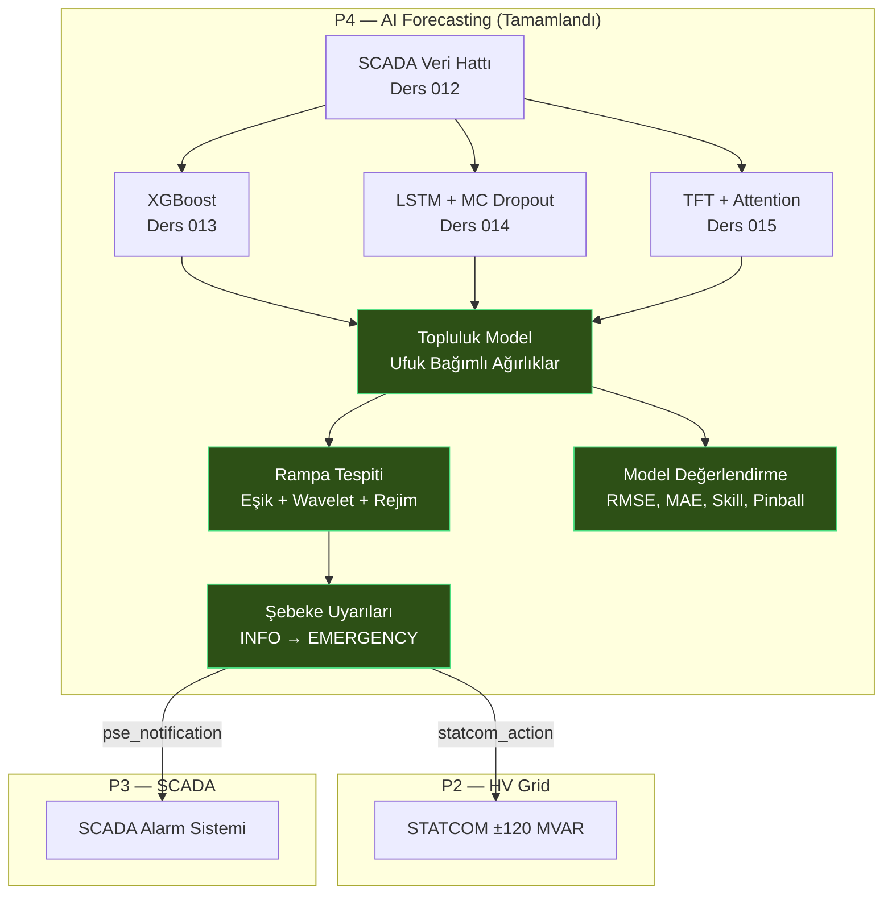

# Lesson 016 - Ensemble Forecasting, Ramp Detection and Model Evaluation

!!! abstract "Lesson Navigation"
    :material-arrow-left: **Previous:** [Lesson 015 - Temporal Fusion Transformer (TFT)](lesson-015.md) | **Next:** [Lesson 017 - P5 Commissioning: Switching Programme, Equipment State Machine and LOTO Isolation Management](lesson-017.md) :material-arrow-right:

    **Phase:** P4 | **Language:** English | **Progress:** 17 of 19 | [All Lessons](index.md) | [Learning Roadmap](../../Learning_Roadmap.md)

> **Date:** 2026-02-26
> **Phase:** P4 (AI Forecasting)
> **Roadmap sections:** [Phase 4 - Ensemble Forecasting, Ramp Detection, Model Evaluation]
> **Language:** English
> **Previous lesson:** Lesson 015

---

## What You Will Learn

- Why horizon-dependent ensemble weighting produces more reliable forecasts than a single model
- Three different methods of ramp detection: threshold value, wavelet CWT and regime classification
- How grid stability alerts P4 connects forecasting with P2 (STATCOM) and P3 (SCADA)
- Deterministic (RMSE, MAE, MAPE, R², Skill Score) and probabilistic (pinball loss, quantile coverage) model evaluation metrics
- Side by side comparison and ranking method of four models (XGBoost, LSTM, TFT, Ensemble)

---

## Section 1: Horizon-Dependent Ensemble Forecasting — Why Isn't One Model Enough?

### Real World Problem

Imagine there are three different specialist doctors in a hospital: one who is excellent for emergencies (quick diagnosis), one who specializes in chronic diseases (long-term follow-up), and one who is a general practitioner (good at everything). Depending on the patient's condition, which doctor's opinion you give more weight depends on - in an emergency situation, the emergency doctor's opinion prevails, in a long-term treatment plan, the chronic disease specialist's opinion.

The same logic applies to wind power forecasting: XGBoost quickly captures patterns in recent data in the short term (< 6 hours), LSTM remembers temporal dependencies in the medium term (6–24 hours), and TFT produces the most consistent results with its multi-horizon attention mechanism in the long term (24–48 hours).

### According to Standards

**IEC 61400-26-3 (Wind turbines — Availability for wind power stations)** recommends the use of combined forecasts for grid dispatch. Taking a weighted average of multiple models rather than a single model reduces systematic errors—a principle known in the statistical literature as the "forecast combination puzzle" (Bates & Granger, 1969).

**PSE IRiESP** sets ramp rate limits: if a large wind farm suddenly loses more than 20% of its capacity (ramp-down), the TSO (PSE) must be informed.

### What We Built

**Changed files:**
- `backend/app/services/p4/ensemble_model.py` — Horizon dependent ensemble model: XGB/LSTM/TFT weight chart
- `backend/app/routers/p4.py` — `/predict-ensemble` API endpoint
- `backend/app/schemas/forecast.py` — `EnsemblePredictRequest/Response` Pydantic schematics

The ensemble model selects the appropriate set of weights by looking at the forecast horizon of each time step. At 10-minute SCADA resolution, step 0–35 is classified as “short horizon” (0–6 hours), step 36–143 is classified as “medium horizon” (6–24 hours), and step 144+ is classified as “long horizon” (24–48 hours).

### Why It Matters

> **Why** is one XGBoost model not enough?
> Because each model has a different time horizon when it is strong. XGBoost performs very well in the short term on tabular data, but it cannot learn temporal dependencies directly. LSTM captures the medium term with its sequential memory, but may encounter the problem of vanishing gradient in the long term. TFT's attention mechanism directly models long-term dependencies — but has a higher parameter load than simpler models in the short term.

> **Why** do we use horizon dependent weights instead of fixed weights?
> Because the relative performance of models varies with the forecast horizon. The fixed 33%/33%/33% weighting “dilutes” the superiority of XGBoost in the short term and the superiority of TFT in the long term. Horizon-dependent weights highlight each model in its strongest range.

### Code Review

The weight schedule is defined according to Roadmap §5.6. For each horizon band, the XGB, LSTM and TFT weights are summed to 1.0 — this constraint is guaranteed by the `__post_init__` verification:

```python
@dataclass(frozen=True)
class HorizonWeights:
    """Tek bir ufuk bandı için ağırlıklar."""
    label: str
    xgb_weight: float   # XGBoost ağırlığı [0,1]
    lstm_weight: float   # LSTM ağırlığı [0,1]
    tft_weight: float    # TFT ağırlığı [0,1]

    def __post_init__(self) -> None:
        """Ağırlıkların toplamının 1.0 olduğunu doğrula."""
        total = self.xgb_weight + self.lstm_weight + self.tft_weight
        if abs(total - 1.0) > 1e-6:
            msg = f"Weights must sum to 1.0, got {total:.6f}"
            raise ValueError(msg)
```

The appropriate set of weights is then selected at each time step. The `get_horizon_weights` function takes the step index and determines which horizon band it falls in:

```python
# Ufuk bandı sınırları (10 dakikalık adımlar)
SHORT_HORIZON_STEPS = 36    # 0-6 saat   → 36 adım
MEDIUM_HORIZON_STEPS = 144  # 6-24 saat  → 144 adım
LONG_HORIZON_STEPS = 288    # 24-48 saat → 288 adım

# Ağırlık çizelgesi (Roadmap §5.6):
#   < 6h:    XGB 0.50 + LSTM 0.30 + TFT 0.20
#   6–24h:   XGB 0.20 + LSTM 0.40 + TFT 0.40
#   24–48h:  XGB 0.10 + LSTM 0.30 + TFT 0.60

def get_horizon_weights(step_index: int, config: EnsembleConfig) -> HorizonWeights:
    if step_index < SHORT_HORIZON_STEPS:
        return config.short_weights      # XGB ağır
    if step_index < MEDIUM_HORIZON_STEPS:
        return config.medium_weights     # LSTM ve TFT dengeli
    return config.long_weights           # TFT ağır
```

Two critical operations are applied after estimation: (1) quantile monotonicity (P10 ≤ P50 ≤ P90) and (2) physical constraints (rated power, cut-in/cut-out). This order is important—first monotony is corrected, then physical constraints are applied, then monotony is checked again.

### Basic Concept

!!! tip "Basic Concept: Forecast Combination Puzzle"
    **Simply put:** Ask three friends to predict the score of a football match. The predictions of each individually may be fair, but the average of the three often turns out to be even better than the best individual prediction. This is a fact that statisticians have known since 1969.

    **Analogy:** Think of it like a jury system — a single judge's decision may be wrong, but weighted voting by multiple judges reduces systematic errors.

    **In this project:** XGBoost's short-term bias, LSTM's medium-term strength, and TFT's long-term consistency combined with horizon-dependent weights produce a forecast that beats (or approaches) the best individual model at each horizon. For our 510 MW farm, this means fewer fines on grid dispatch and more reliable operation.

---

## Section 2: Ramp Detection — Early Warning System for the Network

### Real World Problem

Imagine that you are driving on the highway and suddenly a thick fog descends. You can't see vehicles slowing down — but your car's "forward-looking radar" system detects slowing in fog and warns you. Ramp detection serves the same function: it detects rapid power changes (ramp events) in the forecast data before the storm arrives and alerts the grid operator.

When a storm front approaches in the Baltic Sea, our 510 MW farm can go from full capacity to zero in minutes. Such sudden power losses (ramp-down) threaten the grid frequency. Ramp detection captures these events at the prediction stage, giving the PSE operator reaction time.

### According to Standards

**IEC 61400-26-3** requires ramp events to be identified and reported for power variability assessment. **PSE IRiESP** grid code requires notification to TSO (PSE) if large generation facilities exceed ramp rate limits.

**Cutler et al. (2007)** classifies ramp detection methods into three categories: threshold-based (simple, primary), wavelet-based (multi-resolution), and statistical classification-based (regime). We apply all three.

### What We Built

**Changed files:**
- `backend/app/services/p4/ramp_detection.py` — Three-method ramp detection + mains warning system
- `backend/app/routers/p4.py` — `/detect-ramps` API endpoint
- `backend/app/schemas/forecast.py` — `RampDetectRequest/Response`, `RampEventSchema`, `GridAlertSchema`

We built three complementary detection methods and an alarm system that converts their outputs into network alerts. Each method has a different strength—when used together, they reliably distinguish true ramp events in noisy signals.

### Why It Matters

> **Why** is a simple threshold not enough?
> Because the threshold method only captures sudden, steep ramps. If the gradient is spread over multiple time steps (slow but steady decline), the threshold is not exceeded but the total loss can still be large. The wavelet method can capture these “hidden” ramps by analyzing the signal at different time scales.

> **Why** do we also include regime classification?
> Because operators ask "what regime is the wind farm in now?" It asks for an answer to the question: calm (calm), rising (ramp_up), falling (ramp_down). This provides instant situational awareness and can be displayed on the SCADA display.

### Code Review

All three methods take the same input data (array of power in MW) and return `RampEvent` objects. First, the rate of change of power (gradient) is calculated:

```python
def _compute_gradient_mw_hr(power_mw: NDArray[np.float64]) -> NDArray[np.float64]:
    """Merkezi farklar (central differences) kullanarak MW/saat gradyan hesapla.

    np.gradient iç noktalarda merkezi fark, sınırlarda tek yönlü fark uygular.
    Sonuç adım başına oran × adım/saat = MW/saat'e dönüştürülür.
    """
    grad_per_step = np.gradient(power_mw)
    result: NDArray[np.float64] = grad_per_step * STEPS_PER_HOUR  # 6 adım/saat
    return result
```

For the wavelet method, we use Ricker (Mexican hat) wavelet. Since `scipy.signal.cwt` was removed in scipy ≥ 1.15 we wrote our own CWT implementation:

```python
def _ricker_wavelet(points: int, scale: float) -> NDArray[np.float64]:
    """Ricker (Mexican hat) wavelet.
    ψ(t) = (2 / (√3σ π^(1/4))) × (1 - (t/σ)²) × exp(-t²/(2σ²))
    """
    a = float(scale)
    vec = np.arange(-points // 2, points // 2 + 1, dtype=np.float64)
    tsq = (vec / a) ** 2
    mod = 1.0 - tsq
    gauss = np.exp(-tsq / 2.0)
    total = mod * gauss
    norm = np.sqrt(a)      # Birim enerji normalizasyonu
    result: NDArray[np.float64] = total / norm
    return result
```

Wavelet coefficients are filtered with a threshold of 2σ (adaptive), then artificial splits resulting from the positive and negative lobes of the Ricker wavelet are combined with the parameter `merge_gap`. This detail is critical for the practical usability of CWT-based detection.

Alert levels are determined by percentages of farm capacity (510 MW) — these thresholds are derived from the PSE grid code:

```python
# Şebeke uyarı eşikleri (çiftlik kapasitesine oranla)
FARM_CAPACITY_MW = 510.0
ALERT_WARNING_PCT  = 0.10  # 10% = 51 MW  → STATCOM desteği artır
ALERT_CRITICAL_PCT = 0.20  # 20% = 102 MW → PSE'ye bildir, yedekleri hazırla
ALERT_EMERGENCY_PCT = 0.40 # 40% = 204 MW → FRT modu, PSE acil protokolü
```

### Basic Concept

!!! tip "Basic Concept: Continuous Wavelet Transform"
    **In simple words:** While listening to music, if you want to see which note a song is playing at which second, you create a "note-time" graph. The wavelet transform does the same thing for the power signal: "at what rate did the change occur, over what time period?" answers the question.

    **Analogy:** Think of it like an earthquake seismograph — you can analyze the same earthquake with different frequency filters. At low frequency you see large, slow movements and at high frequency you see small, fast vibrations. CWT performs the same multi-scale analysis on the power signal.

    **In this project:** In the power output of our 510 MW farm, 10-minute sudden decreases (scale=3) and 6-hour slow decreases (scale=24) represent different threat levels. Wavelet can detect both simultaneously — whereas the simple threshold method captures only one.

---

## Section 3: Grid Stability Warnings — Bridge from P4 to P2 and P3

### Real World Problem

Think of a traffic control center: when an accident occurs on the highway, decisions are made that affect the entire system, not just the cameras at that point—an ambulance is diverted, traffic lights are changed, alternative routes are opened. Ramp detection says "accident"; Network alerts tell "which system should do what".

### According to Standards

**PSE IRiESP** requires large production facilities to report sudden power changes to TSO. **ENTSO-E NC RfG Type D** (facilities with a capacity ≥ 75 MW) requires FRT (Fault Ride-Through) capacity and reactive power compensation such as STATCOM for frequency stability. Our alert system directly enforces these requirements programmatically.

### What We Built

**Changed files:**
- `backend/app/services/p4/ramp_detection.py` — `generate_grid_alerts()` function
- `backend/app/routers/p4.py` — Alert generation on endpoint `/detect-ramps`

The grid stability alert system directly connects the P4 forecast output with P2 (STATCOM reactive power control) and P3 (SCADA operator notifications). Only ramp-down events trigger warnings — ramp-up events (more power) do not pose a threat to the grid.

### Why It Matters

> **Why** only ramp-down events trigger warnings?
> Because in scenarios where grid frequency is threatened, power loss is critical. The sudden decrease of 510 MW to 200 MW causes frequency deviation in the PSE network. Ramp-up (e.g. from 200 MW to 510 MW) is generally managed smoothly by automatic control of the generators.

> **Why** is the STATCOM action included in the alert?
> Because it is vital to maintain reactive power balance during the ramp event. STATCOM compensates for voltage drops with its ±120 MVAR capacity. Automatic changing of STATCOM mode according to the warning level protects the system without waiting for operator intervention.

### Code Review

Alert logic uses four levels. Each level contains both the operator message and the STATCOM action recommendation:

```python
def generate_grid_alerts(events: list[RampEvent]) -> list[GridStabilityAlert]:
    """Rampa-aşağı olayları için şebeke uyarıları üret.

    Sadece ramp-down → şebeke frekansı riski.
    Ramp-up → faydalı, aksiyon gerektirmez.
    """
    for event in events:
        if event.direction != RampDirection.DOWN:
            continue  # Yalnızca düşüş olayları

        pct = event.magnitude_mw / FARM_CAPACITY_MW  # 510 MW'a oran

        if pct >= 0.40:      # > 204 MW kayıp
            # EMERGENCY: FRT modu + PSE acil protokol
            statcom_action = "FRT mode — maximum reactive injection ±120 MVAR"
            pse_notification = True
        elif pct >= 0.20:    # > 102 MW kayıp
            # CRITICAL: PSE bildir, yedekleri hazırla
            statcom_action = "Increase reactive output to ±80 MVAR"
            pse_notification = True
        elif pct >= 0.10:    # > 51 MW kayıp
            # WARNING: STATCOM desteği artır
            statcom_action = "Increase reactive output to ±60 MVAR"
            pse_notification = False
        else:                # < 51 MW
            # INFO: İzle, aksiyon gerekmez
            statcom_action = "Normal operation"
            pse_notification = False
```

This structure is designed to integrate directly with the STATCOM model (±120 MVAR) we built in P2 and the SCADA alarm system in P3. Alert levels match SCADA color codes: INFO → green, WARNING → yellow, CRITICAL → orange, EMERGENCY → red.

### Basic Concept

!!! tip "Basic Concept: Cross-System Integration"
    **Simply put:** When the fire alarm goes off in your home, not only the alarm but also the sprinkler system is activated, automatic doors are opened and the fire brigade is called. A single sensor triggers multiple systems.

    **Analogy:** Like a domino effect — but controlled and planned. The forecast model in P4 says "storm is coming", STATCOM in P2 changes the reactive power mode, SCADA in P3 sends an alarm to the operator.

    **In this project:** Ramp detection (P4) → STATCOM action recommendation (P2) → SCADA alarm (P3) chain simulates the automatic response mechanism of a real wind farm control system. The most valuable aspect of the portfolio is that these three projects talk to each other.

---

## Section 4: Model Evaluation Metrics — Which Model is Better?

### Real World Problem

You want to determine which of the two cooks is the better. Ask someone "how delicious is their food?" by asking (average score), the other by asking “how bad was his worst meal?” (the biggest mistake) you will not make a fair comparison. Model evaluation has the same problem: no single metric (like RMSE) tells it all. Different metrics answer different questions.

### According to Standards

**IEC 61400-26-3** specifies RMSE, MAE and coverage probability metrics for wind turbine performance evaluation. **Gneiting & Raftery (2007)** formalize the concept of "strictly proper scoring rules" in evaluating probabilistic predictions—pinball loss is one of them.

### What We Built

**Changed files:**
- `backend/app/services/p4/model_evaluation.py` — 7 deterministic + 2 probabilistic metrics, comparison function
- `backend/app/routers/p4.py` — `/compare-models` API endpoint
- `backend/app/schemas/forecast.py` — `ModelMetricsSchema`, `ModelCompareRequest/Response`

Pure math module — no model dependency. It can work with any set of predictions. It evaluates four models (XGBoost, LSTM, TFT, Ensemble) side by side and ranks them by RMSE.

### Why It Matters

> **Why** RMSE alone is not enough?
> RMSE penalizes (squared) large errors disproportionately. MAE is preferred for operational dispatch error reporting because it is more interpretable — "average X MW errors". MAPE, on the other hand, allows comparing farms of different sizes with percentage expression.

> **Why** do we use skill scores?
> Because "RMSE = 5 MW" alone is unclear whether it is good or bad. The skill score compares against a reference model (persistence — use the previous value as a prediction). If SS > 0, our model is better than the simplest approach; If SS < 0, our model is even worse than copying the previous value.

### Code Review

The persistence model is the simplest time series forecast: “future value = current value”. Skill score benchmarks against this baseline:

```python
def compute_skill_score(
    actual: NDArray[np.float64],
    predicted: NDArray[np.float64],
) -> float:
    """Persistence baseline'a göre skill score.

    SS = 1 - MSE_model / MSE_persistence

    Persistence: P(t+1) = P(t). Yani actual[:-1] → actual[1:]'in tahmini.
    SS > 0 → model persistence'tan iyi
    SS = 0 → model persistence'a eşit
    SS < 0 → model persistence'tan kötü (modeli çöpe at!)
    """
    persist_pred = actual[:-1]       # Bir önceki gerçek değer
    persist_actual = actual[1:]       # Bir sonraki gerçek değer

    mse_persist = float(np.mean((persist_actual - persist_pred) ** 2))
    mse_model = float(np.mean((actual - predicted) ** 2))

    if mse_persist == 0.0:
        return 1.0 if mse_model == 0.0 else 0.0
    return 1.0 - mse_model / mse_persist
```

We use pinball loss (quantile loss) for probabilistic predictions. This is a strictly proper scoring rule—that is, it encourages the model to generate true quantile values ​​to get the best score:

```python
def compute_pinball_loss(
    actual: NDArray[np.float64],
    predicted: NDArray[np.float64],
    quantile: float,
) -> float:
    """Pinball (kantil) kaybı — tek kantil seviyesi için.

    L_q(y, ŷ) = q × max(y - ŷ, 0) + (1-q) × max(ŷ - y, 0)

    Asimetrik kayıp: P10 tahmini yüksek kaldığında (gerçek altında)
    daha az cezalandırılır, P90 tahmini düşük kaldığında daha az
    cezalandırılır. Bu asimetri, kantil tahmininin doğasıdır.
    """
    residual = actual - predicted
    loss = np.where(
        residual >= 0,
        quantile * residual,          # Tahmin düşük kaldı
        (quantile - 1.0) * residual,  # Tahmin yüksek kaldı
    )
    return float(np.mean(loss))
```

Finally, `compare_models()` lists all the models side by side. Three criteria are used: lowest RMSE, highest skill score, and best P90 calibration (ideally P90 coverage = 0.90):

```python
def compare_models(model_results: list[ModelMetrics]) -> ModelComparisonResult:
    # RMSE'ye göre sıralama (artan — en iyi ilk)
    sorted_by_rmse = sorted(model_results, key=lambda m: m.rmse_mw)
    ranking = [m.model_name for m in sorted_by_rmse]

    # En yüksek skill score
    best_skill = max(model_results, key=lambda m: m.skill_score).model_name

    # En iyi P90 kalibrasyonu (0.90'a en yakın)
    def calibration_error(m: ModelMetrics) -> float:
        p90_cov = m.quantile_coverage.get("P90", 0.0)
        return abs(p90_cov - 0.90)

    best_calibration = min(model_results, key=calibration_error).model_name
```

This multi-dimensional comparison answers the question "which model is best in every situation?" This shows that there is usually no single answer to the question. While one model may be the best in RMSE, another model may excel in calibration.

### Basic Concept

!!! tip "Basic Concept: Strictly Proper Scoring Rules"
    **Simply put:** Imagine designing an exam question — a question that gets the highest score if the student actually knows the correct answer; You cannot score higher by guessing or inflating. That's the "perfectly appropriate" scoring rule.

    **Analogy:** In a poker game, bluffing sometimes works, but in the long run, the one who plays his cards fairly wins. Pinball loss also forces the prediction model to be “honest” — predicting the true P10 value will always score better than deliberately underestimating or overestimating.

    **In this project:** We evaluate the quality of our P10/P50/P90 predictions with pinball loss. The P10 estimate means “the level at which the actual value will have a 10% chance of falling below” — if the model has not learned this, the pinball loss will be high and a calibration error will occur.

---

## Section 5: API Integration and Testing Scope

### Real World Problem

Great food is cooked in the kitchen of a restaurant, but if there is no waiter to serve it to the customer, those delicacies are useless. API endpoints are the “waiters” of backend services — exposing internal calculations to the outside world. And the tests are quality control, verifying that every order goes right.

### According to Standards

We use the `POST` method for RESTful API design because our requests contain calculation parameters (RFC 7231). Input validation with Pydantic v2 schemes provides security at the API level (OWASP Input Validation). 41 tests ensure the expected behavior of each function.

### What We Built

**Changed files:**
- `backend/app/routers/p4.py` — 3 new endpoints: `/predict-ensemble`, `/detect-ramps`, `/compare-models`
- `backend/app/services/p4/__init__.py` — Adding all new modules to public API
- `backend/tests/test_ensemble_model.py` — 11 tests (ensemble weight, prediction, constraints)
- `backend/tests/test_model_evaluation.py` — 15 tests (each metric + benchmark)
- `backend/tests/test_ramp_detection.py` — 15 tests (three methods + warnings)

Three endpoints share the same helper function: `_build_all_model_forecasts()`. This trains XGBoost, LSTM and TFT models, makes predictions and returns aligned array outputs. DRY principle — instead of writing the same pipeline three times, it is defined in one place.

### Why It Matters

> **Why** do we use the public helper function (`_build_all_model_forecasts`)?
> Because ensemble, ramp detection, and model comparison endpoints all share the "train three models and make predictions" step. Repeating this step at every endpoint makes code maintenance difficult and increases the risk of errors. A single function means a single place to update.

> **Why** are we writing 41 tests?
> Because math modules can produce "incorrect but logical-looking" results. Without testing the edge cases of an RMSE function (all values ​​the same, negative values, division by zero), your confidence in the production is spurious. 41 tests verify the contract of each function.

### Code Review

The `_build_all_model_forecasts` helper trains and aligns all models. Critical point: Since LSTM and TFT require lookback buffer, the output length of each model may be different. With `n = min(...)` we align all outputs to the shortest:

```python
def _build_all_model_forecasts(
    num_turbines, num_timesteps, turbine_index, horizon_steps, seed
) -> tuple[ModelForecasts, np.ndarray]:
    """Üç modeli eğit ve hizalanmış tahmin dizileri döndür."""
    # ...eğitim pipeline'ı...

    # Çıktıları en kısa diziye hizala
    n = min(
        len(xgb_forecast.power_p50_mw),
        len(lstm_forecast.power_p50_mw),
        len(tft_forecast.power_p50_mw),
        horizon,
    )
    # Hepsinin son n elemanını al — böylece zaman hizalaması korunur
    forecasts = ModelForecasts(
        xgb_p10=xgb_forecast.power_p10_mw[-n:],
        # ...diğer diziler...
    )
    return forecasts, actual[-n:]
```

In file `__init__.py`, all new classes and functions are added to the `__all__` list — this explicitly sets the module's public API and feeds the IDE autocompletion and static analysis tools.

### Basic Concept

!!! tip "Basic Concept: DRY Principle (Don't Repeat Yourself)"
    **Simply put:** If you wrote your phone number on 10 different papers and the number changes, you need to update all 10 papers. But if you only write to the address book and direct others there, you will only update one location.

    **Similarity:** Thousands of parts are printed from a single mold in a factory. If the mold is faulty, it is corrected once — rather than trying to correct each part individually.

    **In this project:** `_build_all_model_forecasts()` defines the common pipeline of three endpoints in one place. If a new hyperparameter is added to LSTM tomorrow, we just update this function — there is no need to touch the three endpoints separately.

---

## Connections

**Where these concepts go next:**

- **Ensemble model** → During the P5 commissioning phase, the ensemble forecast and actual production will be compared in the first energy production verification (SAT - Site Acceptance Test) of the farm. Skill score will be used as acceptance criterion.
- **Ramp detection** Real-time ramp visualization and SCADA color-coded alerts in → Frontend (React + Plotly.js) will be added in the P5 phase.
- **Model evaluation** → Analyzing which model is superior in different seasons and different wind regimes paves the way for seasonal weight adaptation in the future.
- **Grid stability alerts** ← connects directly with the STATCOM model (±120 MVAR) on P2 and the SCADA alarm system on P3 — the `statcom_action` and `pse_notification` fields defined in this lesson will be written to the P3's SCADA event log.

---

## The Big Picture

*Focus of this lesson: **Completion of the P4 forecasting layer — transformation of single model forecasts into an operational decision support system with ensemble, ramp detection and evaluation infrastructure**.*



*For full system architecture, see [Lessons Overview](index.md#system-architecture).*

---

## Key Takeaways

1. **Ensemble forecasting** is based on the "forecast combination puzzle" principle: a weighted average of multiple models is usually more reliable than the best individual model.
2. **Horizon dependent weights** highlight each model in the time period where it is strongest — XGB in the short term, TFT in the long term.
3. **Ramp detection uses three methods**: threshold (simple and fast), wavelet (multi-scale), regime (operational awareness) — their combination increases reliability.
4. **Network notifications** is cross-system integration that directly connects the prediction layer (P4) with STATCOM control (P2) and SCADA notifications (P3).
5. **Skill score**, "is our model better than the simplest approach?" gives an objective answer to the question — RMSE alone cannot say this.
6. **Pinball loss** is an absolutely appropriate scoring rule for probabilistic predictions (P10/P50/P90) — it encourages the model to produce honest quantile values.
7. **41 tests** prevent math modules from producing "wrong but plausible-looking" results and ensure the contract of each function.

---

## Recommended Reading

*[Learning Roadmap](../../Learning_Roadmap.md) — Phase 4: Machine Learning for Energy*

| Source | Genre | Why Read |
|--------|-----|----------------|
| Hyndman & Athanasopoulos — *Forecasting: Principles and Practice* (3rd Ed.) | Online textbook (free) | Basic reference for forecast combination, evaluation metrics and skill score concepts |
| Gneiting & Raftery (2007) — *Strictly Proper Scoring Rules* | Academic article | Explains why pinball loss is the gold standard in quantile evaluation |
| IEA Wind TCP Task 36 — *Forecasting for Wind Power* | Report (free) | Industry perspective of ensemble methods and ramp detection in wind power estimation |
| Cutler et al. (2007) — Wind power ramp event detection | Academic article | Original classification of the three ramp detection methods we use in this lesson |
| Sweeney et al. (2020) — *The future of forecasting for renewable energy* | Magazine article | Comprehensive prospective review of ensemble, ramp, and evaluation methods |

---

## Quiz — Test Your Understanding

### Recall Questions

**Q1:** In the horizon-dependent ensemble model, what are the weights of XGBoost, LSTM and TFT for the forecast horizon of less than 6 hours?

<details>
<summary>Answer</summary>

Short horizon (< 6h): XGB 0.50, LSTM 0.30, TFT 0.20. XGBoost is given the highest weight because gradient boosting captures recent patterns in tabular data fastest and most accurately in the short term.

</details>

**Q2:** What are the three methods used in ramp detection and what is the advantage of each?

<details>
<summary>Answer</summary>

(1) Threshold: ΔP/Δt > configurable MW/hr — simple and fast primary detection method. (2) Wavelet CWT: Multi-scale analysis with Ricker wavelet — captures slow but steady ramps. (3) Regime classification: gradient-based status classifier {calm, ramp_up, ramp_down} — provides operational awareness and current status is displayed on the SCADA screen.

</details>

**Q3:** At what level does the grid alert system require notification to the PSE (TSO)?

<details>
<summary>Answer</summary>

It is set to `pse_notification = True` at CRITICAL (≥ 20%, i.e. ≥ 102 MW loss) and EMERGENCY (≥ 40%, i.e. ≥ 204 MW loss). No TSO notification is required at the WARNING and INFO levels — only internal STATCOM action is taken.

</details>

### Comprehension Questions

**Q4:** Why do we use horizon dependent weights instead of fixed 33%/33%/33% weighting? What is the disadvantage of fixed weighting?

<details>
<summary>Answer</summary>

Fixed weighting assumes that each model will contribute equally at each horizon — this is unrealistic. While XGBoost significantly outperforms others in the short term, TFT's attention mechanism prevails in the long term. The fixed 33% weighting dilutes XGBoost's strong signal with LSTM and TFT noise in the short term, while in the long term it contaminates TFT's advantage with XGBoost's increased error. Horizon-dependent weights optimize the overall forecast quality at each horizon by highlighting each model in its strongest range.

</details>

**Q5:** If the skill score is negative, what does it mean and how should it be interpreted?

<details>
<summary>Answer</summary>

Skill score < 0 means that our model performs worse than even the simplest baseline, persistence (use the previous value as a prediction). This is a serious warning sign — even though the model uses a complex architecture, it produces worse results than “doing nothing.” It usually points to underlying problems such as overfitting, incorrect feature engineering, or model-data mismatch. As a practical matter, this model should not be put into production and a root cause analysis should be performed.

</details>

**Q6:** Why don't ramp-up events trigger a network alert? Couldn't sudden power increase also cause problems?

<details>
<summary>Answer</summary>

In terms of grid frequency stability, sudden power loss (ramp-down) is the critical hazard that disrupts the generation-demand balance — the frequency drops and protection relays can trip and cause cascade faults. Ramp-up means more energy and is usually managed smoothly by the turbine control system through pitch control (blade angle adjustment). In addition, even if excess energy increases the grid frequency, generator governors automatically compensate for this. However, ramp-ups that are too fast can lead to overvoltage — this scenario will be covered later in the FRT module.

</details>

### Challenge Question

**S7:** Our current ensemble model uses a fixed weight schedule (XGB/LSTM/TFT ratios are predetermined). How can automatic updating of weights based on the last N days of performance (adaptive weighting) be implemented in a real production environment? Which metric should be optimized and which risks should be considered?

<details>
<summary>Answer</summary>

For adaptive weighting, you can calculate the RMSE or pinball loss of each model over the rolling window (e.g. the last 7 days) in each horizon band and update the weights in proportion to the inverse of the performance: `w_i = (1/loss_i) / Σ(1/loss_j)`. The metric to optimize depends on the use case: RMSE for dispatch, pinball loss (P10/P90) for risk management. Risks: (1) Concept drift — wind regimes change seasonally, the short window reflects the last season but misses long-term patterns. (2) Overfitting to recent data — a model that gets a high weight on a few good days gets worse when the regime changes. (3) Weight instability — small performance differences can lead to large weight swings; Softening with exponential smoothing is required. (4) Cold start — when a new model is added there is no historical performance data, starting weights must be determined. The most common approach in practice is Bayesian Model Averaging (BMA) or regret-minimizing online learning algorithms (Cesa-Bianchi & Lugosi, 2006).

</details>

---

## Interview Corner

### Simply Explain
*"How would you explain today's main topic — ensemble estimation, ramp detection, and model evaluation — to a non-engineer?"*

Let's say we have a wind farm — 34 giant wind turbines spinning offshore. We need to know in advance how much electricity these will produce because the electricity grid has to balance supply and demand at all times. For this we used three different forecast models — one good for short-term forecasts, one for the medium term, and one for the long term. It's like three different weather apps: they all say slightly different things, but the average of them all is usually the most accurate.

But just guessing is not enough - sudden changes must also be caught. When a storm comes, 510 megawatts of power can drop to zero in a few minutes. We established an "early warning system" that detects this in advance. This system gives an alarm depending on the size of the fluctuation: if it is small, it is only monitored, if it is large, information is sent to the network operator, if it is very large, emergency mode is activated.

Finally, “which forecasting model is best?” We created a scorecard system to answer the question. We use multiple criteria — just like when you evaluate a restaurant you look at not just taste, but also service, ambiance and price. So we know which model is reliable in which situation.

### Technical Explain
*"How would you explain today's main topic — ensemble forecasting, ramp detection, and model evaluation — to a hiring panel?"*

In this module, we moved the P4 forecasting layer to the operational decision support level with three critical components. First, we designed a horizon-dependent ensemble model in accordance with Roadmap §5.6: we combined XGBoost, LSTM and TFT estimates with horizon-dependent weighted averaging. The weighting schedule {< 6h: 0.50/0.30/0.20, 6–24h: 0.20/0.40/0.40, 24–48h: 0.10/0.30/0.60} optimizes each model at the horizon where it is empirically strongest. Physical constraint application (rated power, cut-in/cut-out) and quantile monotonicity (P10 ≤ P50 ≤ P90) are applied as post-processing.

Second, we implemented three complementary ramp detection methods that comply with IEC 61400-26-3 and PSE IRiESP ramp rate limits: gradient threshold (|ΔP/Δt| > 50 MW/hr), CWT Ricker wavelet (our own implementation for multi-scale, scipy ≥ 1.15 compatibility), and gradient-based regime classifier {calm, ramp_up, ramp_down}. Grid stability alert module provides cross-system integration with P2 STATCOM control actions and P3 SCADA notification chain by converting ramp-down events into four-level (INFO/WARNING/CRITICAL/EMERGENCY) alerts.

Third, we created a comprehensive model evaluation module within the framework of IEC 61400-26-3 and Gneiting & Raftery (2007) strictly proper scoring rules. We compare four models (XGBoost, LSTM, TFT, Ensemble) side by side with deterministic metrics (RMSE, MAE, MAPE, R², skill score vs persistence) and probabilistic metrics (quantile coverage, pinball loss) and rank them on the basis of RMSE, skill and calibration. 41 tests verify all computational contracts, including edge cases.
