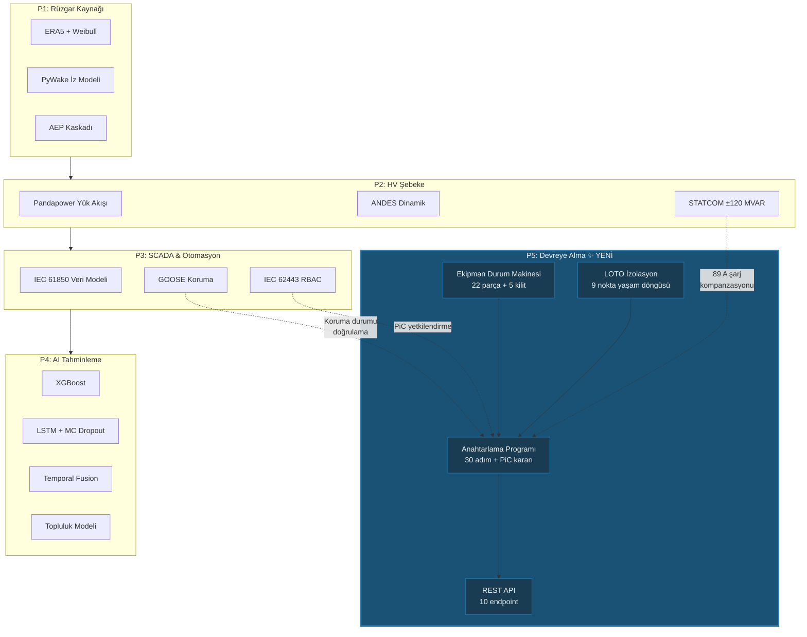

# Lesson 017 - P5 Commissioning: Equipment State Machine, LOTO Isolation and the Energisation Programme

!!! abstract "Lesson Navigation"
    :material-arrow-left: **Previous:** [Lesson 016 - Ensemble Forecasting, Ramp Detection and Model Evaluation](lesson-016.md) | **Next:** [Lesson 018 - FAT/SAT Acceptance Testing, Protection Relay Coordination and the SAT Gate](lesson-018.md) :material-arrow-right:

    **Phase:** P5 | **Language:** English | **Progress:** 18 of 19 | [All Lessons](index.md) | [Learning Roadmap](../../Learning_Roadmap.md)

> **Date:** 2026-02-27
> **Commits:** 1 commit (`899acba`)
> **Commit range:** `f18235d826b06a920d1cee16d8df00ed31f6cddd..899acbae30461a0b26d3672e0bba93a3026f01dc`
> **Phase:** P5 (Commissioning)
> **Roadmap sections:** [Phase 5 - Section 5.1 HV Switching and Safety, Section 5.3 Testing and Commissioning]
> **Language:** English
> **Previous lesson:** Lesson 016
> **last_commit_hash:** 899acbae30461a0b26d3672e0bba93a3026f01dc

---

## What You Will Learn

- Why the 22-piece HV equipment logging system and the 5-state finite state machine are a vital layer of security
- How 5 interlocks prevent short circuits and arcing faults according to IEC 61936-1
- 3-phase structure of the 47-step OSS initial energisation programme (15 pre-checks → 23 energisation actions → 9 turbine connection steps)
- LOTO (Lock-Out/Tag-Out) isolation point life cycle and OSHA 1910.147 requirements
- How Person in Control (PiC) decision logic, hold points and emergency stop mechanism work

---

## Section 1: Equipment State Machine — Why Is Turning Off a Switch So Complicated?

### Real-World Problem

Think of a light switch in your home — you turn it on, it turns off; You close it, it opens. Simple. But consider a 220 kV circuit breaker: when you close it in the wrong sequence, you close on a grounded busbar and a three-phase short circuit current of 102 kA occurs. This destroys equipment in one-twentieth of a second (20 ms). Unlike a home light switch, **sequencing** in HV switching operations saves lives.

That's why we use a state machine: each piece of equipment can only transition from **certain states to certain actions**, and **system-wide failsafes** are checked before each transition.

### What Do the Standards Say?

- **IEC 61936-1:2021 §7.6**: "The locking system must prevent any switching operation that could lead to a hazardous situation." — Our 5 key rules directly apply this clause.
- **IEC 62271-100:2021**: Defines the rated breaking and making capacities for circuit breakers. With a crest factor of κ = 1.8 (X/R = 14), the peak value of the 40 kA symmetric fault current reaches ~102 kA.
- **IEC 60909-0:2016**: Method for calculating short circuit current in three-phase AC systems.

### What We Built

**Changed files:**

- `backend/app/services/p5/equipment_state.py` — 22-piece HV equipment log system, state transition maps and 5 security locks
- `backend/tests/test_equipment_state.py` — Record integrity, valid/invalid migrations, and lock violation tests

We created 22 equipment records for OSS (Offshore Substation): 9 earth switches, 2 disconnectors, 10 circuit breakers and 1 power transformer. We defined valid state transitions for each part and created separate transition maps according to equipment type (CB, DS, ES, TX).

The state machine is mathematically modeled as a deterministic finite automaton (DFA)—that is, the same state and the same input always produces the same result. There is no uncertainty.

### Why It Matters

> **Why** do we use a separate migration map for each piece of equipment?
> Because each type of equipment has different physical properties. A breaker (CB) has a racking mechanism (RACKED_IN/RACKED_OUT), but a splitter (DS) does not. Putting all equipment in a single transition map physically allows invalid transitions — resulting in real-world arcing or mechanical damage.

> **Why** do we use frozen dataclass?
> `EquipmentDefinition` and `SwitchingResult` are immutable objects. The definition of a piece of equipment should not change at runtime — if the voltage level or location changes during programming, this is an indication of an error. `frozen=True` ensures this at compile time.

### Code Review

Let's examine the structure of state transition maps. Each map maps the pair `(mevcut_durum, eylem)` to a new state:

```python
# Kesici (circuit breaker) geçiş haritası
CB_TRANSITIONS: dict[tuple[EquipmentState, SwitchingAction], EquipmentState] = {
    (EquipmentState.OPEN, SwitchingAction.CLOSE): EquipmentState.CLOSED,
    (EquipmentState.CLOSED, SwitchingAction.OPEN): EquipmentState.OPEN,
    # CB'ye özgü: racking mekanizması
    (EquipmentState.OPEN, SwitchingAction.RACK_OUT): EquipmentState.RACKED_OUT,
    (EquipmentState.RACKED_OUT, SwitchingAction.RACK_IN): EquipmentState.OPEN,
}
```

A pair of `(durum, eylem)` not on this map is → `InvalidTransitionError`. For example, you cannot make a breaker in state `CLOSED` `RACK_OUT` — you have to turn it on first. This is the implementation of the ILK-005 lock rule already at the transit map level.

Now let's look at the most critical security layer — the lock control function:

```python
def check_interlocks(
    equipment_id: str,
    action: SwitchingAction,
    system_state: dict[str, EquipmentState],
) -> list[InterlockViolation]:
    """5 IEC 61936-1 kilit kuralını kontrol eder.

    ILK-001: CB kapatma → toprak anahtarı KAPALI olmamalı
    ILK-002: Toprak anahtarı kapatma → CB KAPALI olmamalı
    ILK-003: Ayırıcı açma/kapatma → CB KAPALI olmamalı
    ILK-004: CB kapatma → ayırıcı AÇIK olmamalı
    ILK-005: CB racking → CB KAPALI olmamalı
    """
```

This function checks the status of the entire system**, not the status of a single piece of equipment. `system_state` dictionary keeps the current status of 22 equipment. This approach models the collective lock control that a real-world central control system (SCADA) performs before switching.

Each lock violation returns a detailed `InterlockViolation` object — which lock rule was violated, by which equipment, in what situation. This is critical for both automation and the audit trail.

### Basic Concept

!!! tip "Basic Concept: Safety Interlocking System"
    **Simply explained:** When the washing machine door is open in your home, the drum does not spin — this is a safety lock. The same logic works in HV switching: you cannot close the breaker when the earth switch is closed (the busbar is grounded), as this means energizing the grounded busbar — a 102 kA short circuit.

    **Analogy:** The pilot cannot push the throttle back until an airplane's landing gear is fully extended — the onboard computer prevents this. The `check_interlocks()` function in our state machine plays the same role: it blocks a physically dangerous operation at the software level.

    **In this project:** There are 22 equipment and 5 lock rules in the OSS of our 510 MW wind farm. Each switching step first checks these 5 rules — even a single violation will stop the entire process.

---

## Section 2: LOTO Insulation Management — The Engineer Who Forgot to Lock

### Real-World Problem

While an electrician is working on the panel, his co-worker turns off the breaker, saying "I thought the repair was over." According to US Occupational Safety Administration (OSHA) data, failure to control hazardous energy sources causes an average of 120 deaths and 50,000 injuries per year. LOTO (Lock-Out/Tag-Out) is designed to prevent exactly this scenario: by placing a physical lock and hazard tag, you prevent the equipment from being opened without permission.

### What Do the Standards Say?

- **OSHA 1910.147**: “The machine or equipment shall be shut down or stopped using the procedures established for that machine or equipment.” Each isolation point must be traceable to the person who implemented the lock.
- **EN 50110-1 §6.2.3**: "Interlocking devices or interlocking coupling devices shall be used to prevent the operating device from being used."
- **IEEE 1584-2018**: Arc flash injuries on a 220 kV / 40 kA circuit can be fatal up to 8 meters.

### What We Built

**Changed files:**

- `backend/app/services/p5/loto.py` — LOTO isolation point lifecycle management
- `backend/tests/test_loto.py` — Application, removal, double locking and completeness tests

The LOTO module creates an isolation point for each of the 9 ground switches in the OSS. Each point has a life cycle with 3 states: `NOT_APPLIED` → `APPLIED` → `REMOVED`. This order is mandatory — for example, you cannot go directly from state `NOT_APPLIED` to state `REMOVED`.

### Why It Matters

> **Why** is every ground switch an isolation point?
> When the ground switch is closed, the busbar is physically grounded — it cannot be energized. The lock and tag are placed on this key. Breakers or disconnectors are not used as isolation points because they can be remotely controlled (via SCADA); Earth switches are generally operated locally (manually).

> **Why** is `LOTOSet` kept program-scoped?
> Each switching program requires an independent isolation set. If two different programs share the LOTO status of the same equipment, one program's LOTO removal will violate the other program's security protection. The fact that the isolation set is connected to the program prevents data leakage between programs.

### Code Review

Let's examine the logic of creating the LOTO set. The function filters only earth switches from the equipment recording system:

```python
def create_loto_set_for_oss(programme_id: str) -> LOTOSet:
    """OSS'deki tüm toprak anahtarları için LOTO seti oluşturur.

    510 MW Baltic Wind OSS'inde 9 izolasyon noktası:
    ES-ON-220-01, ES-OSS-220-01, ES-OSS-66-01, ES-STR-01..06
    """
    loto_set = LOTOSet(programme_id=programme_id)

    for equipment in OSS_EQUIPMENT:
        if equipment.equipment_type == EquipmentType.EARTH_SWITCH:
            point_id = f"LOTO-{equipment.equipment_id}"
            loto_set.points[point_id] = IsolationPoint(
                point_id=point_id,
                equipment_id=equipment.equipment_id,
                tag_number=f"BWA-TAG-{equipment.equipment_id}",
            )

    return loto_set
```

Here the `EquipmentType.EARTH_SWITCH` filter selects only equipment that provides physical isolation. Each point is assigned a unique `tag_number` — in the real world, this is the traceability number printed on the hazard tag.

The lock (apply) and remove (remove) functions reject double locking (`LOTOAlreadyAppliedError`) and removing an unlocked point (`LOTONotAppliedError`). This defensive programming models the real-world rule that "you cannot lock an isolation point twice."

### Basic Concept

!!! tip "Basic Concept: LOTO Lifecycle (Lock-Out/Tag-Out Lifecycle)"
    **Simply put:** Think of it like a "Do Not Disturb" sign in a hotel room — but with deadly consequences. Lock: physically locks the door (no one can open it). The label says: "This equipment is being worked on, do not turn it on." It has to be both — just putting a label is not enough because someone may not see the label or ignore it.

    **Analogy:** When working under the lifted vehicle in the auto shop, a safety latch prevents the lifter from falling. LOTO is this safety latch on HV equipment.

    **In this project:** Before starting each switching program, LOTO must be applied to all 9 isolation points (`all_loto_applied() == True`). When the program is completed, all locks and tags should be removed (`all_loto_removed() == True`).

---

## Section 3: 47-Step Switching Programme — OSS Initial Energisation

### Real-World Problem

Imagine preparations for an orchestra concert: each musician takes turns tuning, the conductor checks, gives the "ready" signal, and the concert begins. If someone skips their turn and starts early, there will be chaos. The HV switching programme works with the same logic: 47 executable steps are run in sequence, PiC (Person in Control) approvals are taken at critical points, and GO/NO-GO decisions are enforced at hold points.

### What Do the Standards Say?

- **IEC 62271-100 §4.101**: Circuit breaker operating sequence O — 0.3s — CO — 3min — CO. 0.3s delay is for SF₆ gas recovery. Automatic rapid reclose is disabled during commissioning — each step requires PiC approval.
- **IEC 60287:2023**: Cable current calculation. Capacitance of 45 km XLPE submarine cable ~0.25 µF/km → charging current ~89 A/phase.
- **IEC 60076-5:2006**: Transformer initial energization current (inrush current) can reach 8 times the rated current (~100 ms). 2nd harmonic content (I₂/I₁ > 0.15) is distinguished from fault by the protection relay.

### What We Built

**Changed files:**

- `backend/app/services/p5/switching_programme.py` — 47-step executable programme factory, lifecycle rules, step execution engine, PiC decision logic, SAT gate and emergency stop
- `backend/app/services/p5/programme_repository.py` — SQLAlchemy-backed aggregate repository for programme, FAT/SAT and protection state
- `backend/tests/test_switching_programme.py` — 38 focused tests for programme creation, lifecycle, sequencing, hold points and energisation workflow integrity

The program consists of 3 phases:

| Phase | Steps | Description |
|-----|---------|----------|
| Phase 1 | CHECK-001 → CHECK-015 | Pre-energisation checks (megger, SF₆, protection, SCADA, LOTO) |
| Phase 2 | S-001 → S-022 (+ S-019A) | Energisation switching (earth removal → cable → transformer → 66 kV busbar) |
| Phase 3 | S-022A → S-030 | Turbine connection (string-by-string ramp-up toward 510 MW) |

The program lifecycle has its own state machine:

```
CREATED → APPROVED → IN_PROGRESS → COMPLETED
                         ↓
                       HOLD ↔ IN_PROGRESS
                         ↓
                      ABORTED
```

### Why It Matters

> **Why** are the steps executed sequentially?
> Queue skipping in HV switching is physically dangerous. For example, if you try to turn off the disconnector (DS-OSS-220-01) without opening the ground switch (ES-OSS-220-01), a violation of ILK-003 occurs. Sequential execution is the enforcement of physical security ordering at the software level.

> **Why** are hold points a separate case (`HOLD`)?
> The waiting point is a critical decision moment that cannot be proceeded automatically. For example, in S-009, PiC reviews all preflight checks; Verifies all voltage values ​​on S-022. These points mark places that require human judgment — something AI or automation cannot make.

### Code Review

Let's examine the step execution engine, which is the most critical part of the program. This function implements a 5-layer authentication chain:

```python
def execute_step(
    programme: SwitchingProgramme,
    step_id: str,
    executed_by: str,
    pic_confirmed: bool = True,
) -> SwitchingStep:
    """Doğrulama zinciri:
    1. Program IN_PROGRESS durumunda mı?
    2. Doğru adımda mıyız? (sıralı yürütme)
    3. PiC onayı var mı?
    4. Bekleme noktası mı? → HOLD durumuna geç
    5. Anahtarlama adımı mı? → ön koşul → ekipman eylemi → son koşul
    """
```

The wait point logic is particularly interesting — the `PiCDecisionRequiredError` exception puts the program in the `HOLD` state:

```python
if current_step.step_type == StepType.HOLD_POINT:
    programme.status = ProgrammeStatus.HOLD
    current_step.status = StepStatus.IN_PROGRESS
    _add_audit(
        programme,
        f"Hold point reached: {current_step.action}",
        executed_by,
        step_id=step_id,
        details="Programme on HOLD — awaiting PiC GO/NO-GO decision",
    )
    raise PiCDecisionRequiredError(
        f"Hold point at {step_id}: {current_step.action}. "
        f"Programme is now on HOLD. Call pic_go_decision() or pic_nogo_decision()."
    )
```

This design pattern uses the exception as a flow control mechanism: the wait point is not a normal "successful completion" — it is an event where the program must stop and wait for human intervention. This exception is caught in the API layer and the response `{"success": false, "status": "hold_point"}` is returned to the client.

Switching steps include precondition and postcondition checks:

```python
# Ön koşul: ekipman beklenen durumda mı?
if current_step.expected_state_before is not None:
    actual = programme.system_state.get(current_step.equipment_id)
    if actual != current_step.expected_state_before:
        current_step.status = StepStatus.FAILED
        raise StepExecutionError(...)

# Ekipman eylemini yürüt (interlock kontrolü burada yapılır)
result = execute_switching_action(
    current_step.equipment_id,
    current_step.switching_action,
    programme.system_state,
)

# Son koşul: ekipman beklenen yeni duruma ulaştı mı?
if current_step.expected_state_after is not None:
    if result.new_state != current_step.expected_state_after:
        raise StepExecutionError(...)
```

Each successful or unsuccessful step is recorded in an audit trail. This is mandatory for generating the SAT (Site Acceptance Test) report after commissioning.

### Basic Concept

!!! tip "Basic Concept: Hold Point & PiC Decision Logic"
    **Simply explained:** When a surgeon declares "time-out" during surgery, the entire team stops and verifies patient identity, surgical site, and procedure. That's exactly the point of waiting: stopping at a critical threshold and verifying with the human eye that everything is okay.

    **Analogy:** A rocket launch countdown stops at T-10 and T-1 — the mission control leader says “GO” or “NO-GO.” Our PiC does the same in S-009 and S-022.

    **In this project:** There are two waiting points: S-009 (final check before energization) and S-022 (after OSS is fully energized). In both cases, the program cannot proceed without the PiC deciding to GO. A NO-GO decision cancels the program completely — there is no partial return.

---

## Section 4: REST API and Pydantic Schemas — Interface for Commissioning Simulation

### Real-World Problem

Think of a traffic control center: the operator sees the status of intersections on the screen, changes signals, turns all lights to red in case of emergency. Our API plays the same role — the deployment engineer (or React frontend in the future) creates the program, executes the steps, monitors equipment statuses.

### What Do the Standards Say?

There is no direct industry standard in API design, but our architectural rules (docs/SKILL.md) apply:

- All endpoints are in format `/api/v1/commissioning/{kaynak}`
- HTTP status codes are meaningful: 201 (creation), 404 (not found), 409 (status conflict), 422 (invalid operation)
- Pydantic v2 schemas validate all request/response patterns

### What We Built

**Changed files:**

- `backend/app/routers/p5/switching.py` — programme CRUD, start, step execution, PiC decision, equipment-state and audit-trail endpoints
- `backend/app/routers/p5/loto.py` — LOTO set inspection plus apply/remove operations
- `backend/app/routers/p5/emergency.py` — active-alert, response-plan and emergency-stop endpoints
- `backend/app/services/p5/programme_repository.py` — async persistence bridge between rich domain objects and SQLAlchemy models
- `backend/app/schemas/commissioning.py` — Pydantic request and response models for the commissioning API

Endpoint structure:

| Method | Endpoint | Description |
|--------|----------|----------|
| POST | `/programmes` | Create new program |
| GET | `/programmes` | List all programs |
| GET | `/programmes/{id}` | Program detail |
| POST | `/programmes/{id}/start` | Start program |
| POST | `/programmes/{id}/steps/{step_id}/execute` | Execute step |
| POST | `/programmes/{id}/pic-decision` | PiC GO/NO-GO |
| POST | `/programmes/{id}/emergency-stop` | Emergency stop |
| GET | `/programmes/{id}/equipment` | Equipment states |
| POST | `/programmes/{id}/loto/{point_id}/apply` | Apply LOTO |
| POST | `/programmes/{id}/loto/{point_id}/remove` | LOTO remove |
| GET | `/programmes/{id}/audit-trail` | Audit trail |

### Why It Matters

> **Why** do we still keep a domain-first structure even though persistence now exists?
> Because the SQLAlchemy repository stores the commissioning aggregate after domain validation has already run. Interlocking, LOTO sequencing and hold-point logic still live in the service layer, while `ProgrammeRepository` handles serialisation and database I/O. That separation keeps HV business rules testable without leaking SQL concerns into switching logic.

> **Why** do we use HTTP 409 (Conflict) status code?
> A state conflict is when the client cannot fulfill the request due to the server's current state, even if it is syntactically correct. For example, trying to start a program that is already in state `HOLD` is → 409. This is different from 400 (Bad Request) or 422 (Unprocessable Entity) — the request is correct, but the timing is wrong.

### Code Review

Let's examine how exceptions are converted into HTTP responses at the API layer:

```python
@router.post(
    "/programmes/{programme_id}/steps/{step_id}/execute",
    response_model=ExecuteStepResponse,
)
async def execute_step_endpoint(
    programme_id: str,
    step_id: str,
    request: ExecuteStepRequest,
) -> ExecuteStepResponse:
    programme = _get_programme(programme_id)

    try:
        step = execute_step(programme, step_id, request.executed_by, request.pic_confirmed)
        return ExecuteStepResponse(
            success=True,
            step_id=step.step_id,
            status=step.status.value,
            message=f"Step {step.step_id} completed: {step.action}",
            programme_status=programme.status.value,
        )
    except PiCDecisionRequiredError:
        # Bekleme noktası — başarısız değil, karar bekliyor
        return ExecuteStepResponse(
            success=False,
            step_id=step_id,
            status="hold_point",
            message=f"Hold point at {step_id}. Programme on HOLD.",
            programme_status=programme.status.value,
        )
    except ProgrammeStateError as e:
        raise HTTPException(status_code=409, detail=str(e)) from e
    except StepExecutionError as e:
        raise HTTPException(status_code=422, detail=str(e)) from e
```

Critical point to note here: `PiCDecisionRequiredError` is not returned as an HTTP error, but as a **normal response** (`200 OK`, `success=False`). This is because the wait point is not an error condition — it is the designed behavior of the program. The client receives this response, shows the decision screen to the user, and sends a request to the GO/NO-GO endpoint.

Pydantic schemes use regex validation for PiC decision:

```python
class PiCDecisionRequest(BaseModel):
    pic_name: str = Field(min_length=1, description="PiC making the decision")
    decision: str = Field(
        description="Decision: 'go' or 'nogo'",
        pattern="^(go|nogo)$",  # Yalnızca bu iki değer kabul edilir
    )
    reason: str = Field(default="", description="Reason (mandatory for NO-GO)")
```

The `pattern="^(go|nogo)$"` statement does input validation at the Pydantic level — the client cannot send a value like “maybe” or “wait.” This is critical from a security perspective because the PiC decision has an irreversible effect (NO-GO → program abort).

### Basic Concept

!!! tip "Basic Concept: Domain-First Development"
    **Simple explanation:** When building a house, first the foundation is laid, then the walls are built, and finally the utilities are connected. Here the switching rules, LOTO checks and hold points are the foundation; the repository is the utility connection that saves the already-proven workflow.

    **Analogy:** It's like a cook first writing the recipe on paper, making a test meal, and then adding it to the menu. If the description (domain logic) is correct, the presentation (API + DB) can always be adapted.

    **In this project:** The execution rules are still enforced inside the commissioning services, while the router layer delegates persistence to `ProgrammeRepository`. That gives us database-backed programme state without moving safety decisions into the HTTP or ORM layers.

---

## Section 5: Physics — What Happens During Initial Power Up?

### Real-World Problem

Think of a garden hose: when you turn on the faucet, water does not immediately come out of the end — a pressure wave first travels along the hose. The 45 km submarine cable behaves in a similar way: when you energize, a charging current flows due to the capacitance of the cable, the voltage at the cable end may rise from the sending end (Ferranti effect), and when you energize the transformer, a short-term high magnetizing current (inrush current) occurs.

### What Do the Standards Say?

- **IEC 60287:2023**: Capacitance of XLPE cable ~0.25 µF/km. Total capacitance for 45 km of cable = 11.25 µF.
- **IEC 60076-5:2006**: Power transformer initial energization current 6-8 times the rated current, duration ~100 ms.

### Mathematical Model

Cable charging current calculation:

```
I_c = ω × C_total × V_phase
    = 2π × 50 × (0.25e-6 × 45) × (220e3 / √3)
    = 314.16 × 11.25e-6 × 127,017
    ≈ 89 A / faz
```

This 89 A reactive current flows continuously and must be compensated by STATCOM (P2). Program step S-016 does exactly this: puts STATCOM in voltage control mode and verifies reactive power absorption of ~85 MVAR at S-017.

Ferranti effect:

```
V_receiving / V_sending = 1 / cos(β × l)
β = ω√(LC) ≈ 1.05e-3 rad/km
V_ratio = 1 / cos(0.0473) ≈ 1.001 (% 0.1 yükselme)
```

For our 45 km cable, this effect is negligible (0.1%), but for cables longer than 100 km it can reach 5-10% and requires additional compensation.

Transformer magnetization current:

```
I_inrush_peak ≈ 8 × I_rated (ilk 100 ms)
2. harmonik oran: I₂/I₁ > 0.15 → koruma rölesi "arıza değil, inrush" diye ayırt eder
```

### Why It Matters

> **Why** didn't we code these physics calculations directly in the switching program?
> These physics calculations are already coded in the P2 (Pandapower + ANDES) module. P5's mission is not physics simulation, but **operational sequencing and security control**. But the physics behind the program steps (S-012: cable charging current monitoring, S-017: STATCOM verification, S-019: transformer magnetizing current) are imperative to engineering understanding.

### Basic Concept

!!! tip "Basic Concept: Cable Charging Current"
    **Simply explained:** When you fill a water hose with water, the hose itself fills with water before the water exits the end. The capacitance of XLPE cables is also similar—reactive current flows as the cable is “filled.” This current does not carry actual power but does affect the grid voltage.

    **Analogy:** It's like blowing up a balloon — air (reactive current) fills the balloon (charges the wire capacitance) but does no work (produces no active power). STATCOM ensures balance by absorbing excess air in this balloon.

    **In this project:** Our 45 km cable produces 89 A charging current per phase. This corresponds to ~85 MVAR of reactive power—exactly the load that the STATCOM we sized in P2 (±120 MVAR) must accommodate.

---

## Connections

**Use of these concepts in future lessons:**

- **Equipment state machine** (Part 1) → In the sequel of P5, real-time SLD (Single Line Diagram) visualization will be made with React frontend. State changes will be reflected as a color change on the XYFlow chart nodes.
- **LOTO isolation set** (Part 2) → Repository-backed persistence already stores LOTO state inside the programme aggregate, and that can be extended into long-horizon audit analytics or time-series reporting later.
- **PiC decision logic** (Part 3) → will be integrated with the RBAC system (IEC 62443) in P3: only users with the `commissioning_engineer` or `pic` role will be able to make a GO/NO-GO decision.
- **Cable charging current** (Chapter 5) → The value of 89 A calculated in Lesson 007 (P2 Pandapower) reappears here as an operational verification step (S-012) — the embodiment of the physics → code → operation cycle.

---

## The Big Picture

*Focus of this lesson: **Adding the P5 deployment layer — enforcing physical security rules at the software level**.*



*For full system architecture: [Lessons Overview](index.md#system-architecture)*

---

## Key Takeaways

1. **Equipment state machine** enforces physical security rules at the software level — switching in the wrong order becomes physically impossible.
2. **5 IEC 61936-1 interlock rules** (ILK-001 → ILK-005) prevent life-threatening scenarios such as energizing the grounded busbar, disconnector opening under load and closed CB racking.
3. **LOTO lifecycle** (NOT_APPLIED → APPLIED → REMOVED) ensures that each isolation point is traceable to the person who applied the lock — OSHA 1910.147 requirement.
4. **Hold points** (hold points) require human judgment where automation falls short — the PiC GO/NO-GO decision is irreversible.
5. **Domain-first with repository-backed persistence** keeps switching safety logic in pure services while SQLAlchemy stores the aggregate after validation.
6. **45 km cable charging current** (~89 A/phase) and **transformer inrush current** (8× rated) are the physical realities behind the switching steps.
7. **Exceptions as flow control**: `PiCDecisionRequiredError` is not an error, but the designed behavior of the program — the API layer returns this as a normal response.

---

## Recommended Resources

*[Learning Roadmap](../../Learning_Roadmap.md) — Phase 5: Commissioning & Operation*

| Source | Genre | Why Read |
|--------|-----|----------------|
| IEC 61936-1:2021 — Power installations exceeding 1 kV AC | Standard | Official source of lock system design (§7.6) — the 5 lock rules in this lesson are derived directly from this article |
| NFPA 70E — Standard for Electrical Safety in the Workplace | Standard | International reference for LOTO procedures and arc flash distances |
| IEC 62271-100:2021 — AC Circuit Breakers | Standard | CB operating sequences (O-0.3s-CO) and rated making/breaking capacities |
| GWO (Global Wind Organization) — HV Module | Certification training | HV safety practices in offshore wind farms |
| Omicron Academy — Protection Testing courses | Online course | Protection relay testing techniques — Physical equivalent of verification steps in S-006 |

---

## Quiz — Test Your Understanding

### Recall Questions

**Q1:** How many earth switches are there in the OSS equipment recording system and why are they all initially CLOSED?

<details>
<summary>Answer</summary>

There are 9 earth switches (ES-ON-220-01, ES-OSS-220-01, ES-OSS-66-01, ES-STR-01 to ES-STR-06). All are initially OFF because the program is the initial energization program — all busbars must be grounded for safety before starting. A grounded busbar cannot be energized — this protects workers.

</details>

**Q2:** What does the ILK-003 lock rule say and why does it prevent the splitter from both opening and closing?

<details>
<summary>Answer</summary>

ILK-003: "The disconnector (DS) cannot be opened or closed while the relevant breaker (CB) is OFF." The disconnectors can only be operated under no-load conditions because they have no arc-extinguishing mechanisms. Opening a disconnector under load creates a non-self-extinguishing arc in air or SF₆ gas and causes a phase-to-earth fault. There is a similar danger when closing — an arc may occur in the intermediate position.

</details>

**Q3:** Write the 3 states of the LOTO life cycle in order and when does the function `all_loto_applied()` return `True`?

<details>
<summary>Answer</summary>

Three states: `NOT_APPLIED` → `APPLIED` → `REMOVED`. `all_loto_applied()` returns `True` when the status of all isolation points in the LOTO set is `APPLIED`. This is a prerequisite before the switching program can be initiated — all ground switches must be interlocked and hazard tagged.

</details>

### Comprehension Questions

**Q4:** Why is `PiCDecisionRequiredError` returned as a normal response (200 OK, `success=False`) instead of an HTTP error response (4xx/5xx)?

<details>
<summary>Answer</summary>

The wait point is not an error condition, but the designed behavior of the program. HTTP error codes (4xx/5xx) indicate that the client or server has made an error. But there is no error at the waiting point — the program is running exactly as planned. The client receives this response, shows the PiC decision screen to the user, and sends a new request to the GO/NO-GO endpoint. This distinction cleanly separates client-side error handling from normal flow control.

</details>

**Q5:** Why does the implementation keep a domain-first design even after moving to a database-backed repository?

<details>
<summary>Answer</summary>

The database layer still does not decide whether a switching step is safe — it only stores the already-validated aggregate. `ProgrammeRepository` serialises steps, audit records, LOTO state and SAT linkage to SQLAlchemy models, while the service layer continues to enforce interlocks, sequencing and hold-point rules. That keeps failures easier to localise: if a step is rejected, it is a commissioning-rule issue; if a save fails, it is an infrastructure issue.

</details>

**Q6:** Why does function `emergency_stop()` reject only from terminal states (`COMPLETED`, `ABORTED`) — can it also be called from states `CREATED` or `APPROVED`?

<details>
<summary>Answer</summary>

Yes, `emergency_stop()` can be called from all non-terminal states: `CREATED`, `APPROVED`, `IN_PROGRESS` and `HOLD`. This is because an emergency can happen at any time — it should be able to be canceled even if the program has not yet started (for example, if a physical danger is detected before power-up). Rejecting from terminal cases (`COMPLETED`, `ABORTED`) makes sense because the program has already ended — there is no point in canceling again.

</details>

### Challenge Question

**S7:** In the current design, all programs run independently of each other — the same equipment can have different states in multiple programs. Would this be a problem in the real world? How do you solve it?

<details>
<summary>Answer</summary>

In the real world, this creates a serious safety vulnerability. If CB-OSS-220-01 is shown OFF (energised) in Programme A while the same breaker is shown ON (de-energised) in Programme B, Programme B can drive an operator into an unsafe assumption. The fix is a shared ground-truth layer plus ownership or locking semantics: before execution, the programme must reconcile with central equipment state, and active equipment should be protected with pessimistic locking or exclusive-access rules. With the current repository-backed design, that evolution can be implemented with database row locking such as `SELECT ... FOR UPDATE` and aggregate-level ownership checks.

</details>

---

## Interview Corner

### Explain It Simply
*"How would you explain today's main topic, the switching program and security lock system, to a non-engineer?"*

To generate electricity on a wind farm, you need to connect huge turbines to the grid. But you can't do this by randomly turning switches on and off — energizing is done step by step, in a specific order, just like a surgeon follows a specific order in an operating room.

There are 22 electrical switches in our system, and each can be turned on and off only under certain conditions. For example, when the safety switch that grounds an area is turned off, you cannot turn off the main switch that energizes that area — the system will not allow this. It's like a car not letting you start when it's not in park.

Additionally, each security key is fitted with a physical lock and a "touch" tag. This lock and tag prevents someone from accidentally energizing while work is being done. Throughout the entire process, a “Person in Control” (PiC) approves each step and stops at critical points to ask “are we going to continue or are we going to stop?” makes his decision. These decisions are irreversible — if you say “we will stop,” everything is canceled and you start over.

### Explain Technically
*"How would you explain today's main topic, the equipment state machine, LOTO and switching program, to an interview panel?"*

The P5 module implements an HV commissioning simulation that meets the requirements of IEC 61936-1 and OSHA 1910.147. The architecture consists of three layers:

First, **equipment state machine**: a system that models 22 pieces of OSS equipment (9 ES, 2 DS, 10 CB, 1 TX) as a deterministic finite automaton (DFA). Each equipment type has its own transition map. During transitions, 5 interlocks (ILK-001 → ILK-005) are controlled system-wide — this is a direct implementation of IEC 61936-1 §7.6. Lock rules are derived from the CB-ES, ES-CB, DS-CB and CB-DS mapping tables and provide O(1) lookup.

Second, **LOTO isolation management**: a 3-state lifecycle (NOT_APPLIED → APPLIED → REMOVED) complying with OSHA 1910.147. Each isolation point is connected to an earth switch because only ESs provide physical isolation. The LOTO set is program-based — there is no shared mutable state, providing thread safety and program independence.

Third, **switching program engine**: sequential execution engine with 47 steps (15 control + 23 energization + 9 turbine connection). At each step, the precondition → lock check → state transition → postcondition verification chain is applied. At two waiting points (S-009, S-022), the program goes into HOLD state and the GO/NO-GO decision of the PiC is waited. This decision will be restricted to authorized roles only when integrated with RBAC. The emergency stop mechanism can be invoked from any non-terminal state and immediately cancels all operations.

We keep a domain-first architecture: the equipment-state machine, interlocks, LOTO lifecycle and 47-step execution rules live in the commissioning services, the API layer stays thin, and `ProgrammeRepository` persists the aggregate through SQLAlchemy only after domain validation completes. That separation lets switching logic evolve independently from transport and storage concerns while still giving the platform durable programme state.
