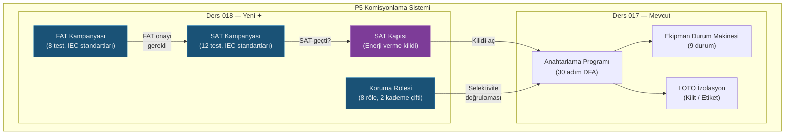

# Lesson 018 - FAT/SAT Acceptance Testing, Protection Relay Coordination and the SAT Gate

!!! abstract "Lesson Navigation"
    :material-arrow-left: **Previous:** [Lesson 017 - P5 Commissioning: Equipment State Machine, LOTO Isolation and the Energisation Programme](lesson-017.md) | **Next:** None :material-arrow-right:

    **Phase:** P5 | **Language:** English | **Progress:** 19 of 19 | [All Lessons](index.md) | [Learning Roadmap](../../Learning_Roadmap.md)

> **Date:** 2026-02-27
> **Commits:** 1 commit (`b7da3db`)
> **Commit range:** `810c5262f2ce0da0e3db8d6f2e67f23bb87e8a25..b7da3dbf0eb66a9ec3c881ad70d2c4bff274a13a`
> **Phase:** P5 (Commissioning)
> **Roadmap sections:** [Phase 5 - Section 5.3 Testing and Commissioning, Section 5.1 HV Switching and Safety]
> **Language:** English
> **Previous lesson:** Lesson 017
> **last_commit_hash:** b7da3dbf0eb66a9ec3c881ad70d2c4bff274a13a

---

## What You Will Learn

- You will understand the Factory Acceptance Testing (FAT) campaign lifecycle and 8 IEC-standard test specifications
- You will learn 12 post-installation testing specifications and FAT-gate mechanism with Field Acceptance Testing (SAT)
- You will understand protection relay settings and selectivity verification with time grading
- You will see how the SAT gate is integrated into the switching program initialization process
- You will implement automatic pass/fail logic in the code with tolerance band evaluation.

---

## Section 1: Factory Acceptance Test (FAT) — What Happens If Equipment Breaks Down at Sea?

### Real World Problem

Imagine you order a computer from an online store. If the screen is broken when the shipment arrives, it is easy to return it and get a new one — the store is nearby. But what if the product you ordered was a 220/66 kV transformer and you discovered that it was broken on the offshore platform 45 km offshore? A ship mobilization costs ~500,000 EUR per day and repairs take months.

FAT (Factory Acceptance Test) exists to prevent exactly this scenario: the equipment must pass all tests before leaving the manufacturer's factory.

### What the Standards Say

Our factory tests cover 7 different IEC standards:

| Test | Standard | Physical Verification |
|------|----------|-------------------|
| HV withstand | IEC 60060-1:2010 | 460 kV AC, 60 s — insulation integrity |
| Partial discharge (PD) | IEC 60270:2000 | < 10 pC — early detection of insulation aging |
| Transformer ratio | IEC 60076-1:2011 | 220/66 kV = 3.333 ±0.5% |
| Impedance test | IEC 60076-1:2011 | ±10% nameplate value |
| FRA reference | IEC 60076-18:2012 | Electromagnetic fingerprint |
| DGA reference | IEC 60567:2011 | Oil gas analysis < 50 ppm |
| Relay type test | IEC 60255:2022 | ±5% accuracy |
| GIS gas sealing | IEC 62271-203:2022 | SF6 leakage < 0.5%/year |

### What We Built

**Changed files:**

- `backend/app/services/p5/fat.py` — FAT testing specifications, campaign lifecycle and automatic yield evaluation
- `backend/app/schemas/commissioning.py` — FAT/SAT Pydantic schemes (API request/response models)
- `backend/app/routers/p5/testing.py` — FAT CRUD, result recording and programme-scoped SAT endpoints
- `backend/tests/test_fat.py` — 8 spec validations, campaign lifecycle tests

The FAT module is based on three basic concepts:

1. **TestSpecification** — frozen test definition: test ID, standard reference, acceptance limits (min/max)
2. **TestResult** — measurement record: measured value, data, engineer name, timestamp
3. **FATCampaign** — campaign lifecycle: `CREATED → IN_PROGRESS → COMPLETED → APPROVED`

### Why It Matters

> **Why** do we do 8 separate tests in the factory?
> Each test captures a different physical failure mode. The HV withstand test detects insulation integrity, the PD test detects signs of insulation aging, and the FRA detects winding/core displacement. A single test cannot cover all failure modes — the principle of defense in depth applies.

> **Why** did we model the tolerance bands as a pair `min_value` / `max_value`?
> Some tests are one-sided (PD < 10 pC → upper limit only), some are bilateral (transformer ratio ±0.5% → lower and upper limit). Using `float('-inf')` and `float('inf')`, we handle both cases with the same function `evaluate_test_verdict()`. This avoids code duplication and to add a new test all one needs to do is add a new `TestSpecification` to the `FAT_SPECS` tuple.

### Code Review

Tolerance band evaluation is the cornerstone of the entire FAT and SAT system. The function is a pure function — it does not depend on external state:

```python
def evaluate_test_verdict(spec: TestSpecification, measured_value: float) -> TestVerdict:
    """Ölçülen değeri spesifikasyon tolerans bandına göre değerlendir.

    PASS koşulu:  spec.min_value <= measured_value <= spec.max_value

    Tek taraflı testler için sonsuzluk sınırları kullanılır:
      PD testi: min=-inf, max=10.0  → ölçüm 10'un altındaysa PASS
      HV testi: min=460, max=+inf   → ölçüm 460'ın üstündeyse PASS
    """
    if spec.min_value <= measured_value <= spec.max_value:
        return TestVerdict.PASS
    return TestVerdict.FAIL
```

This function has been kept deliberately simple. There may be fuzzy limits or statistical tolerances in the real world, but IEC standards define hard limits — you either pass or you fail.

The campaign lifecycle is modeled as a Deterministic Finite Automaton (DFA):

```python
def record_fat_result(
    campaign: FATCampaign,
    test_id: str,
    measured_value: float,
    recorded_by: str,
    notes: str = "",
) -> TestResult:
    # Onaylanmış kampanyaya sonuç eklenemez (geri dönüşü olmayan durum)
    if campaign.status == TestCampaignStatus.APPROVED:
        raise FATCampaignStateError(...)

    # Test ID geçerliliğini kontrol et
    if test_id not in campaign.specs:
        raise FATTestNotFoundError(...)

    # Otomatik verdikt değerlendirmesi
    spec = campaign.specs[test_id]
    verdict = evaluate_test_verdict(spec, measured_value)

    result = TestResult(
        test_id=test_id,
        measured_value=measured_value,
        verdict=verdict,
        recorded_by=recorded_by,
        notes=notes,
    )
    campaign.results[test_id] = result

    # İlk sonuçta CREATED → IN_PROGRESS geçişi
    if campaign.status == TestCampaignStatus.CREATED:
        campaign.status = TestCampaignStatus.IN_PROGRESS

    # Tüm spesifikasyonlar sonuçlandığında IN_PROGRESS → COMPLETED
    if len(campaign.results) == len(campaign.specs):
        campaign.status = TestCampaignStatus.COMPLETED

    return result
```

Each result record automatically triggers two possible state transitions. This embeds state machine logic into the natural flow of business logic — no separate `transition()` function is required.

### Basic Concept

!!! tip "Basic Concept: Tolerance Band Evaluation"
    **Simply explained:** There is a passing score in an exam — above 50 is passing, below is failing. FAT tests also work with the same logic: each test has a lower and upper limit. PASS if the measurement is within these limits, FAIL if outside.

    **Analogy:** Think of a kitchen thermostat. The food is cooked correctly if the oven temperature is between 180°C-200°C. It remains raw at 179°C and burns at 201°C. The tolerance band in FAT tests is exactly this temperature range.

    **In this project:** In our 510 MW wind farm, the 220/66 kV transformer ratio should be in the range of 3.317-3.350 (nominal 3.333 ±0.5%). Going outside this narrow band means voltage regulation is disrupted and protection coordination collapses.

---

## Section 2: Site Acceptance Test (SAT) — What Changes After Transportation?

### Real World Problem

Imagine carrying an antique vase. It looked perfect in the store (FAT passed). But while carrying it home, the trunk of the car may have shaken and a hidden crack may have formed. Before using the vase, you fill it with water and check for leaks — this is SAT.

Offshore equipment is exposed to wave-induced vibration during sea transportation, crane lifting and cable pulling stress during installation, and moisture and salt spray in the marine environment. The windings of the transformer passing through the factory may shift during transportation — we detect this drift by comparing it with the FRA reference in the FAT.

### What the Standards Say

Our SAT tests cover 10 different IEC/EN standards:

| Test | Standard | Critical Threshold |
|------|----------|-------------|
| Insulation resistance | IEC 60229 | > 100 MOhm @ 5 kV DC |
| CT ratio | IEC 61869-2 | ±1% accuracy |
| GT ratio (VT ratio) | IEC 61869-3 | ±0.5% accuracy |
| Breaker closing time | IEC 62271-100 | < 80ms |
| Breaker opening time | IEC 62271-100 | < 60ms |
| Protection relay trip | IEC 60255 | < 100ms |
| GOOSE delay | IEC 61850-8-1 | < 4ms |
| SCADA point verification | IEC 60870-5-104 | 100% response |
| Tap changer | IEC 60214 | Full range |
| Fire detection | EN 54 | < 30 s |

### What We Built

**Changed files:**

- `backend/app/services/p5/sat.py` — 12 SAT test specifications, FAT-gate implementation, campaign management
- `backend/tests/test_sat.py` — FAT-gate tests, campaign lifecycle, switching program integration

The SAT module reuses the type system of the FAT module (`TestSpecification`, `TestResult`, `TestVerdict`, `evaluate_test_verdict`) — this is a direct implementation of the DRY (Don't Repeat Yourself) principle. The only difference: an optional FAT campaign can be connected when creating SAT.

### Why It Matters

> **Why** was SAT designed as a separate campaign from FAT?
> FAT and SAT are done at different times, in different places, by different engineers. FAT in the manufacturer's factory (equipment before shipment), SAT in the field (after installation). This distinction keeps the chain of custody clear and provides traceability.

> **Why** was the FAT-gate mechanism made optional?
> In the real world, some equipment (e.g. existing stock) may arrive on site without FAT registration. The `fat_campaign: FATCampaign | None = None` parameter provides this flexibility while maintaining the assurance of rejecting an unacknowledged FAT when passed.

### Code Review

FAT-gate mechanism — requires factory testing to be validated when creating a SAT campaign:

```python
def create_sat_campaign(
    programme_id: str,
    fat_campaign: FATCampaign | None = None,
) -> SATCampaign:
    """FAT-kapısı ile SAT kampanyası oluştur.

    fat_campaign geçilmişse, durumu APPROVED olmalıdır.
    Aksi halde SATFATGateError fırlatılır.
    """
    if fat_campaign is not None and fat_campaign.status != TestCampaignStatus.APPROVED:
        raise SATFATGateError(
            f"FAT campaign '{fat_campaign.campaign_id}' is "
            f"'{fat_campaign.status.value}', "
            f"must be 'approved' before SAT can begin."
        )

    campaign_id = f"SAT-{datetime.now(UTC).strftime('%Y%m%d')}-"
                  f"{uuid.uuid4().hex[:6].upper()}"
    specs = {spec.test_id: spec for spec in SAT_SPECS}

    return SATCampaign(
        campaign_id=campaign_id,
        programme_id=programme_id,
        fat_campaign_id=fat_campaign.campaign_id if fat_campaign else "",
        specs=specs,
    )
```

This gate mechanism implements the principle of "first check, then create". If factory tests are not approved, the field test campaign cannot be created at all — the chance of it falling into error is zero.

### Basic Concept

!!! tip "Basic Concept: Door Mechanism (Gate Pattern)"
    **Simply explained:** Before boarding a plane, you show your boarding pass at the gate. If you don't have your card or it's wrong you can't get in. The FAT-gate works the same way: field tests cannot be started until the factory tests are approved.

    **Analogy:** Think of it like level locks in a video game. You cannot move on to Level 2 without completing Level 1. FAT = Level 1, SAT = Level 2, Energize = Level 3.

    **In this project:** In our 510 MW wind farm, the TX-OSS-01 transformer is not loaded onto the ship without passing 8 tests at the factory (FAT gate), and it is not energized without passing 12 tests in the field (SAT gate). These two doors dramatically reduce the risk of failure at sea.

---

## Section 3: Protection Relay Coordination — The Right Switch at the Right Time

### Real World Problem

When the electrical outlet fuse blows in your home, only that room remains dark — not the entire building. The reason for this: each fuse protects its own territory, and the order of "who will throw first" is predetermined. It's the same with the offshore wind farm, but the wrong sequence knocks all 34 turbines off the grid.

When a 66 kV array cable fault occurs, the array feeder relay (downstream) must clear the fault—not the 220 kV export cable relay (upstream). If the upstream relay trips first, the entire farm will be disabled instead of the 6 turbines in the faulty string.

### What the Standards Say

- **IEC 60255-151:2009** — Overcurrent protection (PTOC) time settings
- **IEC 60255-121:2014** — Distance protection (PDIS) zone settings
- **IEC 60255-127:2010** — Over/under voltage protection (PTOV/PTUV)
- **IEC 60255-181:2019** — Over/under frequency protection (PTOF/PTUF)
- **IEEE C37.112** — Inverse time overcurrent relay coordination

Time grading formula:

```
gerçek_marjin = (upstream_gecikme - downstream_gecikme) × 1000 ms

Karar: gerçek_marjin ≥ gerekli_marjin → SELEKTİF
       gerçek_marjin < gerekli_marjin → SELEKTİF DEĞİL
```

Required margin for PTOC: 300 ms (breaker opening + relay fault + safety margin).
Margin required for PDIS: 400 ms (greater separation between regions required).

### What We Built

**Changed files:**

- `backend/app/services/p5/protection_relay.py` — 8 relay settings, 2 tap pairs, selectivity verification functions
- `backend/tests/test_protection_relay.py` — Setting verification, selective/non-selective scenarios
- `backend/app/routers/p5/protection.py` — `/protection/settings` and `/protection/verify-selectivity` endpoints

The protection system consists of three data models:

1. **RelaySetting** — invariant relay setting (ID, function, pickup value, time delay, position)
2. **GradingPair** — downstream→Zupstream relay pair and required margin
3. **GradingResult** — validation result (actual margin, rating)

### Why It Matters

> **Why** did we define 8 different protection functions?
> Each function detects a different type of fault. It detects PTOC overcurrent (cable short circuit), PDIS distance-based fault (location detection along cable), PTOV/PTUV voltage anomalies, PTOF/PTUF frequency deviations. Multiple functions provide “depth of defense” — if a relay fails, backup takes over.

> **Why** did we write selectivity verification as a pure function?
> `verify_selectivity()` can operate on any relay set and tap pair (uses OSS set by default). This makes it easy to test different relay configurations, add new relay sets in the future, and test directly without mocks in unit tests.

### Code Review

Tap pair verification — translation of the engineering formula directly into coding:

```python
def check_single_grading_pair(
    pair: GradingPair,
    settings: dict[str, RelaySetting],
) -> GradingResult:
    """Bir downstream→upstream çifti için selektivite kontrolü.

    Formül: gerçek_marjin = (upstream.time_delay - downstream.time_delay) × 1000

    Örnek (PTOC):
      Downstream: 0.5 s (dizi besleyici)
      Upstream:   0.8 s (incomer yedek)
      Gerçek marjin = (0.8 - 0.5) × 1000 = 300 ms ≥ 300 ms → SELEKTİF ✓
    """
    downstream = settings[pair.downstream_id]
    upstream = settings[pair.upstream_id]

    actual_margin_ms = (upstream.time_delay - downstream.time_delay) * 1000.0

    verdict = (
        SelectivityVerdict.SELECTIVE
        if actual_margin_ms >= pair.required_margin_ms
        else SelectivityVerdict.NON_SELECTIVE
    )

    return GradingResult(
        pair_id=pair.pair_id,
        downstream_id=pair.downstream_id,
        upstream_id=pair.upstream_id,
        downstream_delay_s=downstream.time_delay,
        upstream_delay_s=upstream.time_delay,
        actual_margin_ms=actual_margin_ms,
        required_margin_ms=pair.required_margin_ms,
        verdict=verdict,
    )
```

Make sure that the code matches the IEC formula exactly. Translating the engineering calculation directly into code simplifies the review process — you can juxtapose the code with the formula in the standard document.

Batch validation of all pairs is done in one line:

```python
def verify_selectivity(
    settings: tuple[RelaySetting, ...] | None = None,
    grading_pairs: tuple[GradingPair, ...] | None = None,
) -> list[GradingResult]:
    """Tüm kademe çiftleri için selektivite doğrulaması.

    Varsayılan olarak OSS röle setini kullanır.
    Sonuç: her çift için bir GradingResult listesi.
    """
    if settings is None:
        settings = OSS_RELAY_SETTINGS
    if grading_pairs is None:
        grading_pairs = GRADING_PAIRS

    settings_map = {s.setting_id: s for s in settings}
    return [check_single_grading_pair(pair, settings_map) for pair in grading_pairs]
```

The dictionary `settings_map` allows us to find each relay setting in O(1) time. Total complexity for N step pairs is O(N) — no tuple scanning.

### Basic Concept

!!! tip "Basic Concept: Time Grading for Selectivity"
    **Simply explained:** In a race, runners do not start at the same time, but in turns — the closest runner first, the one behind. Protection relays are also like this: the relay closest to the fault trips first, the spare relay activates later.

    **Analogy:** Consider a fire suppression system. The sprinklers in the room work first. If the fire grows, the main valve on the floor opens. If it is still not extinguished, the entire building system is activated. Each level leaves "margin time" to the previous one.

    **In this project:** The array feeder relay trips in 0.5 s. The Incomer backup relay trips in 0.8 s. The 300 ms margin covers the breaker opening time (60 ms) + relay error + safety margin. In this way, only the faulty knee breaks and the entire farm remains standing.

---

## Section 4: SAT Gate — Final Lock Before Energizing

### Real World Problem

In a nuclear power plant, the reactor cannot be operated until all safety checklists are completed. Similarly, 220 kV energy cannot be supplied to the offshore substation until field acceptance tests are completed. This “last lock” mechanism prevents human error by software.

### What the Standards Say

The SAT gate is an extension of the IEC 62271-100 §4.101 switching procedures. The standard states that "all conditions must be met" before energizing. Approval of the SAT campaign is one of these conditions.

### What We Built

**Changed files:**

- `backend/app/services/p5/switching_programme.py` — SAT gate added to `start_programme()` function
- `backend/tests/test_sat.py` — SAT gate integration tests

Two new fields have been added to the switching program data model:

```python
@dataclass
class SwitchingProgramme:
    # ... mevcut alanlar ...
    sat_campaign: SATCampaign | None = None   # Bağlı SAT kampanyası
    fat_campaign_id: str | None = None        # Bağlı FAT kampanya ID'si
```

### Why It Matters

> **Why** did we embed the SAT gate in `start_programme()`?
> This is the right place — switching program start is the most critical moment. Checking at the actual moment of energization, rather than at the campaign creation stage, implements the "last line of defence" principle. This way, the program can still be edited while the SAT campaign is being created and testing is taking place.

> **Why** did we use lazy import with the `TYPE_CHECKING` block?
> There is a risk of circular dependency between `switching_programme.py` and `sat.py`. The `TYPE_CHECKING` block is executed only by the type checking tools (mypy) — no import occurs at runtime. The actual `all_sat_passed` import is done within the function.

### Code Review

SAT gate integration — added security control with minimal interference to existing functionality:

```python
def start_programme(programme: SwitchingProgramme) -> None:
    """Programı başlat.

    SAT kampanyası bağlıysa, tüm testler geçmiş olmalıdır.
    Bu, saha kabul testleri tamamlanmadan enerji verilmesini engeller.
    """
    if programme.status != ProgrammeStatus.APPROVED:
        raise ProgrammeStateError(...)

    # SAT kapısı: kampanya bağlıysa tüm testler geçmiş olmalı
    if programme.sat_campaign is not None:
        from app.services.p5.sat import all_sat_passed

        if not all_sat_passed(programme.sat_campaign):
            raise ProgrammeStateError(
                "Cannot start programme: SAT campaign has not passed "
                "all tests. Complete and approve all site acceptance "
                "tests before energisation."
            )

    programme.status = ProgrammeStatus.IN_PROGRESS
    _add_audit(programme, "Programme started", programme.pic_name)
```

Points to consider:

1. **Backwards compatibility** — `sat_campaign is None` control ensures that programs without a SAT campaign continue to run
2. **Lazy import** — `all_sat_passed` is imported within the function to break the circular dependency
3. **Explanatory error message** — Tells the engineer exactly what to do

### Basic Concept

!!! tip "Basic Concept: Circular Dependency Resolution"
    **Simply explained:** Think of two friends — Ali knows Veli's phone number, and Veli knows Ali's phone number. But both of them cannot call each other at the same time. In the software, two modules cannot import each other at the same time.

    **Analogy:** Imagine two doors locking each other — you need door B's key to open door A, A's key to open door B. Solution: you keep the key in your pocket until the moment to open the door (lazy import).

    **In this project:** `switching_programme.py` normally receives type information from `sat.py`, but `sat.py` also uses FAT types. With `TYPE_CHECKING`, type information is resolved only at mypy run, while `all_sat_passed` is imported at call time.

---

## Section 5: REST API Endpoints — Bringing It All Together

### Real World Problem

In a hospital information system, recording a doctor's visit, writing a prescription, and entering test results are separate screens and APIs — but they are all connected to the same patient file. In our commissioning system, FAT, SAT and protection verification are separate endpoints, but they are connected to the same substation project.

### What the Standards Say

Our REST API design follows resource-oriented architecture:

- FAT campaigns are independent source (`/api/v1/commissioning/fat/...`)
- SAT campaigns are program dependent (`/api/v1/commissioning/programmes/{id}/sat/...`)
- Protection settings are global source (`/api/v1/commissioning/protection/...`)

### What We Built

**Changed files:**

- `backend/app/routers/p5/testing.py` — FAT CRUD and programme-scoped SAT endpoints
- `backend/app/routers/p5/protection.py` — protection settings and selectivity verification endpoints
- `backend/app/schemas/commissioning.py` — 15+ new Pydantic schemes

New endpoints:

| Endpoint | Method | Function |
|----------|-------|-------|
| `/fat` | POST | Create FAT campaign |
| `/fat` | GET | List all FAT campaigns |
| `/fat/{id}` | GET | FAT campaign detail |
| `/fat/{id}/tests/{test_id}/record` | POST | Save test result |
| `/fat/{id}/approve` | POST | Approve campaign |
| `/programmes/{id}/sat` | POST | Create a SAT campaign |
| `/programmes/{id}/sat` | GET | SAT campaign status |
| `/programmes/{id}/sat/tests/{test_id}/record` | POST | Save SAT test result |
| `/programmes/{id}/sat/approve` | POST | Approve SAT campaign |
| `/protection/settings` | GET | All relay settings |
| `/protection/verify-selectivity` | POST | Selectivity verification |

### Why It Matters

> **Why** FAT endpoints are outside the program and SAT endpoints are under the program?
> FAT campaigns are equipment dependent (e.g. TX-OSS-01), managed independently of the program — the equipment is tested at the factory before it even arrives on site. SAT campaigns, on the other hand, are tied to a specific switching schedule — done post-installation, before energization. This URL structure reflects the domain model.

### Code Review

Auxiliary function that shows the conversion from the FAT campaign schema domain object to the API response:

```python
def _build_fat_schema(campaign: FATCampaign) -> FATCampaignSchema:
    """Domain nesnesini API yanıt modeline dönüştür.

    Neden ayrı bir fonksiyon?
    - Domain modeli (dataclass) ve API modeli (Pydantic) farklı sorumluluklar taşır
    - Domain modeli iş kurallarını uygular
    - API modeli serileştirme ve validasyon yapar
    - Bu ayrım, domain mantığının HTTP kaygılarından bağımsız kalmasını sağlar
    """
    specs = [
        TestSpecificationSchema(
            test_id=s.test_id, name=s.name, standard=s.standard,
            description=s.description, unit=s.unit,
            min_value=s.min_value, max_value=s.max_value,
        )
        for s in campaign.specs.values()
    ]
    results = [
        TestResultSchema(
            test_id=r.test_id, measured_value=r.measured_value,
            verdict=r.verdict.value, recorded_by=r.recorded_by,
            recorded_at=r.recorded_at, notes=r.notes,
        )
        for r in campaign.results.values()
    ]
    return FATCampaignSchema(
        campaign_id=campaign.campaign_id,
        equipment_tag=campaign.equipment_tag,
        status=campaign.status.value,
        specs=specs, results=results,
        all_passed=all_fat_passed(campaign),
        created_at=campaign.created_at,
        approved_by=campaign.approved_by,
        approved_at=campaign.approved_at,
    )
```

Domain-API separation ensures that the domain model does not change in future ORM (SQLAlchemy) integration.

### Basic Concept

!!! tip "Basic Concept: Domain-API Layer Separation"
    **Simply explained:** A restaurant's cuisine (domain) and menu (API) are separate things. The design of the menu can be changed without changing the recipe in the kitchen. Likewise, business logic operates independently of HTTP endpoints.

    **Analogy:** Think of a translator. The author writes his book in his own language (domain), the translator translates it into API language (JSON). The writer's work does not change — only the translator is updated.

    **In this project:** `FATCampaign` (dataclass) implements business rules. `FATCampaignSchema` (Pydantic) Does JSON serialization. `_build_fat_schema()` is the bridge between the two. When SQLAlchemy is added in the future, the domain layer will not change, only the persistence layer will be added.

---

## Connections

**Where will you encounter these concepts in the future:**

- **FAT/SAT tolerance band model** → On the P5 frontend, test results will be displayed with green/red color coding (Plotly gauge charts can be used)
- **Protection coordination** → Animated display of protection relay trip times in P5 energization simulation
- **SAT gate** → "Energize" button in Frontend will be active/passive according to SAT status (UX feedback)
- **Extension from Lesson 017:** Switching program and LOTO (Lesson 017) now enhanced with SAT gate — program initialization now includes an "all tests passed" check

---

## The Big Picture

*Focus of this course: **FAT/SAT acceptance testing campaigns, protection relay coordination and SAT gate energization safety**.*



*For full system architecture, see [Lessons Overview](index.md#system-architecture).*

---

## Key Takeaways

1. **FAT catches faults before equipment leaves the factory** — the cost of offshore repair (>500k EUR/day) makes this necessary.
2. **Tolerance band evaluation** is a simple `min <= ölçüm <= max` comparison, but also includes one-sided testing with `float('-inf')` and `float('inf')`.
3. **SAT performs re-verification after shipping and installation** — equipment that passes through the factory may behave differently in the field.
4. **FAT-gate** prevents starting field tests with unapproved factory tests — early intervention in the error chain.
5. **Protection coordination** is achieved by time staging — the downstream relay must trip before the upstream, otherwise the entire farm is disabled.
6. The **SAT gate** is embedded in the switching program initialization function — energizing is physically impossible without passing all field tests.
7. **Domain-API layer separation** isolates business logic from HTTP concerns and facilitates future ORM integration.

---

## Recommended Reading

*[Learning Roadmap](../../Learning_Roadmap.md) — Phase 5: Commissioning & Operation*

| Source | Genre | Why Read |
|--------|-----|----------------|
| IEC 60060-1:2010 — HV testing techniques | Standard | It forms the basis of FAT-001 HV resistance test |
| IEC 62271-100:2021 — Circuit breaker testing | Standard | Source of SAT-004/005 breaker timing tests |
| IEC 60076-1:2011 — Power transformer requirements | Standard | Defines transformer ratio and impedance tolerance values ​​|
| Omicron Academy — Protection Testing courses | Online course | Protection relay coordination and secondary injection test practices |
| IEEE C37.112 — Inverse-time relay coordination | Standard | Mathematical basis of time staggering formulas |

---

## Quiz — Test Your Understanding

### Recall Questions

**Q1:** How many test specifications are defined in the FAT module and what physical failure mode does each target?

<details>
<summary>Answer</summary>

8 test specifications are defined: HV withstand (insulation integrity), partial discharge (insulation aging), transformer ratio (voltage conversion accuracy), impedance (short circuit current limitation), FRA (winding/core displacement), DGA (oil degradation), relay type testing (protection accuracy) and GIS gas tightness (SF6 insulation integrity). Because each test captures a different failure mode, they all together create “depth of defense.”

</details>

**Q2:** What are the 4 states in the FAT campaign lifecycle and how are transitions triggered?

<details>
<summary>Answer</summary>

CREATED → IN_PROGRESS (automatic when the first test result is saved), IN_PROGRESS → COMPLETED (automatic when the result is saved for all 8 specifications), COMPLETED → APPROVED (manual if all tests have passed and the authorized person approves). There is no reversal — results cannot be added to a campaign in APPROVED status.

</details>

**Q3:** What is the time staggering between PTOC-01 and PTOC-02 and why is this sufficient?

<details>
<summary>Answer</summary>

PTOC-01 (array feeder) 0.5 s, PTOC-02 (incomer backup) 0.8 s — the margin is 300 ms. This margin covers the breaker opening time (~60 ms, IEC 62271-100), relay timing error (~5% × 500 ms = 25 ms), and safety margin. 300 ms is the minimum PTOC step margin recommended by IEC 60255.

</details>

### Comprehension Questions

**Q4:** Why is the FAT-gate mechanism implemented at the time of SAT campaign creation and not at launch?

<details>
<summary>Answer</summary>

Due to the fail-fast principle: if the FAT is not approved, there is no need to even create a SAT campaign — this prevents engineers from planning tests in vain. Checking at creation time reduces the error window to zero. The SAT gate is a different checkpoint: are all the tests completed, are we ready to energize? Together they provide double-layer security.

</details>

**Q5:** What would it be like to write separate "one-sided" and "double-sided" functions instead of the `evaluate_test_verdict()` function using `float('-inf')` and `float('inf')`?

<details>
<summary>Answer</summary>

Writing separate functions requires deciding which function to call for each new test type — this means additional branching logic and type separation. Using `float('-inf')` and `float('inf')`, a single function naturally handles both cases because in Python, `float('-inf') <= x` is always `True`. This approach complies with the Open-Closed Principle: it is not necessary to change existing code to add a new test type, just define a new `TestSpecification`.

</details>

**Q6:** What would be the alternative to using the `TYPE_CHECKING` block and lazy import on the SAT gate and why was this method preferred?

<details>
<summary>Answer</summary>

Alternatives: (1) Create a common module `interfaces.py` and import both modules from there — but this adds unnecessary complexity in a small project. (2) Moving SAT control entirely to the router layer — but this leaks domain logic to the HTTP layer. (3) Passing SAT function at runtime with Dependency Injection — clean but overengineering. Lazy import breaks the circular dependency and keeps the domain logic in place with minimal intervention — following the principle of “least change.”

</details>

### Challenge Question

**Q7:** How would you design a "relay setting change management" system that automatically verifies whether a protection relay setting is changed in the real world (for example, when the time delay of PTOC-01 is increased from 0.5 s to 0.6 s), whether this change disrupts the selectivity or not?

<details>
<summary>Answer</summary>

The system consisted of the following components: (1) **Current settings snapshot** — a copy of `OSS_RELAY_SETTINGS` was made before the change. (2) **Proposed settings** — a new tuple is created with the changes suggested by the user applied. (3) **Impact analysis** — All affected tap pairs are checked by calling `verify_selectivity(proposed_settings)`. (4) **Diff report** — a report is generated showing which pairs have changed selectivity (SELECTIVE → NOT SELECTIVE transitions are marked as a red warning). (5) **Approval mechanism** — The system does not implement the change without the protection engineer approving it (a Permit-to-Work-like flow). (6) **Audit trail** — every setting change is recorded with date, engineer, old/new value and selectivity report. This design directly uses the parametric structure of the existing `verify_selectivity()` function — the function already accepts custom tuning sets.

</details>

---

## Interview Corner

### Explain It Simply
*"How would you explain FAT/SAT tests and protection coordination to a non-engineer?"*

When installing offshore wind turbines, we need to check the equipment we will use before receiving it — just like checking a newly purchased car before it leaves the showroom. We call this "Factory Acceptance Test". Is the engine running, are the brakes working, are the headlights on — we check everything one by one from the list.

Then the equipment reaches the site by sea. It may have been shaken on the road and seen by wind and waves. That's why we double-check it in the field — we call it "Field Acceptance Testing." Did your car get from the showroom to your home without any problems, or was it damaged along the way?

Protection coordination is similar to the fuse box at home. Only the fuse for the faulty room should blow, not the entire house. If a cable fails in an offshore wind farm, only that section's circuit breaker must trip — otherwise the entire 510 MW production will stop. We ensure this sequence by "time staging": the switch closest to the fault trips first, the backup comes into play a little later.

### Explain Technically
*"How would you explain FAT/SAT campaign management and protection selectivity verification to an interview panel?"*

The P5 commissioning module includes three subsystems based on IEC standards. Firstly, FAT campaign management covers 8 IEC-standard test specifications (IEC 60060-1, 60270, 60076-1/18, 60567, 60255, 62271-203) and is managed with a deterministic finite automata (DFA) lifecycle: CREATED → IN_PROGRESS → COMPLETED → APPROVED. Each test result is automatically assigned with tolerance band evaluation (`min_value <= measured <= max_value`). `float('-inf')` / `float('inf')` sentinel values ​​cover single-sided and double-sided testing in one pure function.

Secondly, the SAT module covers 12 post-installation testing specifications (IEC 61869-2/3, 62271-100, 61850-8-1, etc.) while preserving the DRY principle by reusing the type system of the FAT module. The FAT-gate mechanism checks the FAT status as a precondition when creating a SAT campaign (must be `APPROVED`). The SAT gate is integrated into the `start_programme()` function — energization is blocked until all SAT tests have passed. Circular dependency is solved with `TYPE_CHECKING` block and lazy import.

Third, the protection relay coordination defines 8 relay settings (PTOC, PDIS, PTOV, PTUV, PTOF, PTUF) and 2 grading pairs. Selectivity verification is done with pure functions that directly encode the IEC 60255 and IEEE C37.112 formulas: Comparison `actual_margin_ms = (upstream.delay - downstream.delay) × 1000` produces SELECTIVE or NON_SELECTIVE according to the threshold `required_margin_ms`. All functions accept custom settings sets as parameters, making it easy to test different configurations and add new relay types in the future.
