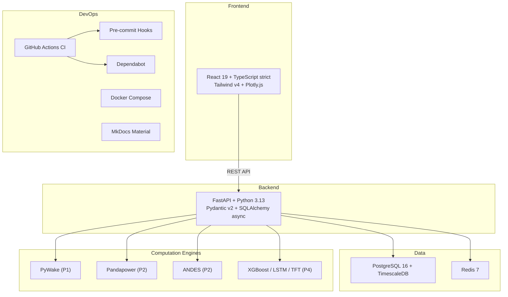

# Lessons — Baltic Wind HV Control Platform

Step-by-step learning log documenting every engineering decision in the 510 MW Baltic Sea wind farm simulation. Each lesson follows the **4-layer teaching model** (physics → standard → mathematics → code) and maps to a section of the [Learning Roadmap](../Learning_Roadmap.md).

---

## The Project at a Glance

| Parameter | Value |
|-----------|-------|
| **Total capacity** | 510 MW |
| **Turbines** | 34 × Vestas V236-15.0 MW |
| **Array cables** | 66 kV XLPE |
| **Offshore substation** | 66/220 kV |
| **Export cable** | 220 kV HVAC, 45 km subsea |
| **Grid connection** | 400 kV PSE (Polish TSO) |
| **STATCOM** | ±120 MVAR + 50 MVAR shunt reactor |
| **Location** | Polish Baltic Sea |
| **Compliance** | PSE IRiESP, ENTSO-E NC RfG Type D |
| **Cut-in / rated / cut-out** | 3 / 12.5 / 31 m/s |

---

## Five Projects

| # | Project | Domain | Core Technology | Key Standard |
|---|---------|--------|-----------------|--------------|
| **P1** | Wind Resource & AEP | Energy yield | PyWake, ERA5, Weibull | IEC 61400-12 |
| **P2** | HV Grid Integration | Power systems | Pandapower, ANDES | IEC 60909, ENTSO-E NC RfG |
| **P3** | SCADA & Automation | Control systems | IEC 61850 data models | IEC 61850, IEC 62443 |
| **P4** | AI Forecasting | Machine learning | XGBoost, LSTM, TFT | IEA Wind Task 36 |
| **P5** | Commissioning | Operations | Switching programmes | IEC 62271, LOTO |

---

## System Architecture

---

## Session Protocol

Every coding session follows a mandatory structure defined in `CLAUDE.md`:

!!! info "Session Protocol"
    - **Open every session:** "We're building a 510 MW Baltic Sea wind farm simulation. 34 × V236-15.0 MW, 66 kV array, 220 kV export (45 km), PSE grid. Today: [module] — maps to [Learning_Roadmap section]."
    - **Close every session:** 3 interview questions + "explain simply" + "explain technically"
    - **Code order:** P1 → P2 → P3 → P4 → P5. Physics first. Code second.

---

## Document Philosophy — IEC 61355

**IEC 61355 (Classification and designation of documents for plants, systems and equipment)** establishes a hierarchical document structure for industrial projects. The standard requires a master document index with version control and traceability. **ISO 9001 (Quality management systems)** extends this to require documented procedures, controlled revisions, and audit trails.

Our documentation follows these principles in a software context:

- **`Project_Roadmap.md`** — the design basis (what to build)
- **`Learning_Roadmap.md`** — the self-study curriculum (what to learn)
- **`SKILL.md`** — engineering standards and coding conventions (how to build)
- **`CLAUDE.md`** — session protocol (how to maintain context)
- **`docs/archive/`** — historical versions preserved for traceability

---

## Lesson Progress

| # | Lesson | Phase | Language | Status |
|---|--------|-------|----------|--------|
| 000 | [Project Planning & Engineering Methodology](lesson-000.md) | P0 | English | Complete |
| 001 | [DevOps Foundation](lesson-001.md) | P0 | English | Complete |
| 002 | [Internationalization](lesson-002.md) | P0 | Turkish | Complete |
| 003 | [Ön Tasarım Kararları: Konum, Türbin, Alan & Şebeke](lesson-003.md) | P1 | Turkish | Complete |
| 004 | [P1: Veritabanı, ERA5 İşleme & Weibull](lesson-004.md) | P1 | Turkish | Complete |
| 005 | [Rüzgar Gülü Analizi & PyWake İz Modellemesi](lesson-005.md) | P1 | Turkish | Complete |
| 006 | [Yerleşim Optimizasyonu, Blokaj & AEP Kaskadı](lesson-006.md) | P1 | Turkish | Complete |

**Coming next:** P1 — LCOE calculation, sensitivity analysis, final P1 integration
