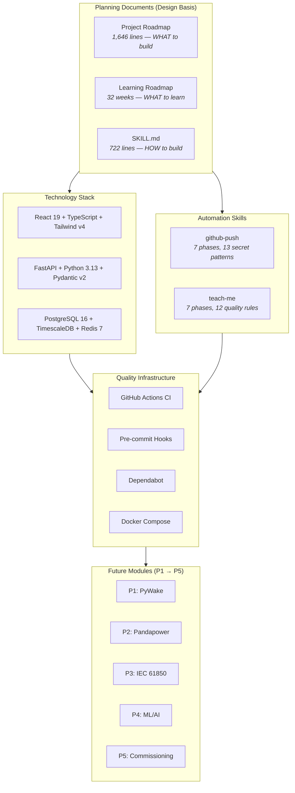

# Lesson 000 — Project Planning, Technology Decisions & Professional Engineering Methodology

!!! abstract "Lesson Navigation"
    :material-arrow-left: **Previous:** None (foundational lesson) | **Next:** [Lesson 001 — DevOps Foundation](lesson-001.md) :material-arrow-right:

    **Phase:** P0 | **Language:** English | **Progress:** 1 of 3 | [All Lessons](index.md) | [Learning Roadmap](../Learning_Roadmap.md)

> **Date:** 2026-02-21
> **Commits:** Conceptual lesson — covers the entire Phase 0 planning process
> **Commit range:** `f2500024193bb88db74d1269612cd7c14fbe0614..fa528fb95bd6778ea54f50be71ddc6e0475d2818`
> **Phase:** P0 (Project Planning & Architecture)
> **Roadmap sections:** [Phase 0 — All Sections, Cross-Project Integration Map, Technology Stack & Web UI Specifications]
> **Language:** English
> **Previous lesson:** None (this is the foundational lesson)
> **last_commit_hash:** fa528fb95bd6778ea54f50be71ddc6e0475d2818

---

## What You Will Learn

- Why professional engineering projects begin with planning documents, not code — and how this maps to real offshore wind farm design processes
- How to evaluate and justify every technology choice in a full-stack simulation platform, from database to frontend to computation engine
- Why custom automation skills (CI/CD, security scanning, lesson generation) represent Standard Operating Procedures for software teams
- How the teaching methodology itself (4-layer structure, 10 techniques, session protocol) is an engineering discipline, not an afterthought
- Why Phase 0 — building infrastructure before domain logic — is itself a test of engineering maturity that hiring managers evaluate

---

## Section 1: What Are We Building and Why?

### The Real-World Problem

Imagine you are applying for a pilot's license. You do not walk up to a Boeing 737 on your first day and start flying. You spend months in a flight simulator — a system that reproduces every instrument, every weather condition, every failure mode — so that when you finally sit in the real cockpit, your hands already know what to do. This project is a flight simulator for offshore wind HV control engineers.

### What the Standards Say

**IEC 61400 (Wind energy generation systems)** is not a single standard — it is a family of over 30 documents covering every aspect of the wind farm lifecycle: design requirements (61400-1), power performance (61400-12), electrical simulation (61400-27), and grid code compliance (61400-21). Our five projects map directly to this lifecycle. No real offshore wind farm exists in isolation — resource assessment feeds into grid design, which feeds into SCADA configuration, which feeds into commissioning. Our simulation mirrors this interconnection.

### What We Built

**Files changed:**
- `docs/Project_Roadmap.md` — 1,646-line consolidated specification defining all five projects
- `docs/Learning_Roadmap.md` — 32-week self-study curriculum with trusted academic sources
- `docs/SKILL.md` — 722-line engineering standards and coding conventions document
- `CLAUDE.md` — Session protocol and auto-loaded references

The Baltic Wind Alpha project simulates a **510 MW offshore wind farm** in the Polish Baltic Sea — 34 Vestas V236-15.0 MW turbines connected through a complete HV chain. For the full specification and five-project breakdown, see the [Lessons Overview](index.md#the-project-at-a-glance).

### Why It Matters

> **Why** do we simulate a specific 510 MW wind farm instead of a generic "wind energy platform"?
> Because specificity forces engineering rigour. A generic platform can hand-wave over cable ratings, transformer impedances, and protection settings. A specific 510 MW farm with 34 named turbines, precise cable lengths, and real grid code requirements forces every calculation to be grounded in physics. When an interviewer asks "what voltage is your export cable?", you answer "220 kV HVAC, 45 km subsea, sized for 510 MW at 0.95 power factor" — not "it depends."
>
> **Why** five interconnected projects instead of five separate repositories?
> Because real wind farms are interconnected systems. The AEP calculated in P1 determines the power flow scenarios in P2. The grid topology in P2 defines the SCADA data model in P3. The SCADA telemetry in P3 feeds the forecasting models in P4. The protection settings from P2 appear in the switching programmes of P5. Splitting these into separate repositories would lose this integration — and it is precisely this systems thinking that separates a mid-level engineer from a senior one.

!!! tip "Key Concept: Systems Thinking — The Whole Is Greater Than the Sum of Parts"
    **In plain English:** Instead of solving five separate problems, you solve one big problem that has five layers. Each layer talks to the others. Understanding how they connect is more valuable than understanding any single layer in isolation.

    **Analogy:** Think of a hospital. The emergency room, the operating theatre, the pharmacy, the ICU, and patient records are five "projects." A doctor who understands only the operating theatre is useful — but a hospital administrator who understands how patients flow between all five departments, where bottlenecks form, and how a pharmacy delay cascades into ICU overcrowding — that person runs the hospital.

    **In this project:** When P1's wake model calculates that Turbine 17 produces 12.3 MW at 9 m/s, that number flows into P2's power flow analysis, which determines whether the 66 kV feeder cable can handle the current. If it cannot, P3's SCADA system must generate an alarm, P4's forecasting model must learn the curtailment pattern, and P5's commissioning test must verify the protection relay trips correctly. One number, five consequences — that is systems thinking.

---

## Section 2: The Planning Documents — Engineering Before Code

### The Real-World Problem

Before a single foundation is poured in the seabed, an offshore wind farm goes through years of planning: environmental impact assessments, grid connection agreements, design basis documents, and financial models. A contractor who arrives on site without reading the design basis will install the wrong cable, connect the wrong busbar, and cost the project millions. Planning documents are not bureaucracy — they are the difference between a project that works and one that fails.

### What the Standards Say

**IEC 61355 (Classification and designation of documents for plants, systems and equipment)** establishes a hierarchical document structure for industrial projects. The standard requires a master document index with version control and traceability. **ISO 9001 (Quality management systems)** extends this to require documented procedures, controlled revisions, and audit trails. Our documentation architecture follows these principles in a software context.

### What We Built

**Files changed:**
- `docs/Project_Roadmap.md` — The consolidated technical specification
- `docs/Learning_Roadmap.md` — The self-study curriculum
- `docs/SKILL.md` — Engineering standards and coding conventions
- `CLAUDE.md` — AI session management protocol
- `docs/archive/Project_Roadmap_v1.md` and `docs/archive/Project_Roadmap_v2.md` — Archived historical versions

We created four interlocking documents, each serving a distinct purpose:

**The Project Roadmap** is the design basis. It defines every parameter of the wind farm (turbine model, cable voltages, grid codes), every deliverable of each project, and every standard that must be followed. We started with a v1 document, then produced a v2 "gap analysis" that corrected errors (turbine count changed from 30 to 34, dynamic simulation requirements added). Rather than maintaining two contradictory documents, we consolidated them into a single authoritative source and archived the originals for traceability.

**The Learning Roadmap** is a 32-week curriculum organized by phase (P0-P5), with trusted academic sources for each topic. Every textbook, paper, and online course was selected from established institutions (DTU, MIT OCW, IEEE Xplore) — never fabricated. This document answers the question: "What do I need to learn before I can build this?"

**The SKILL.md** codifies the 10 non-negotiable engineering rules (physical constraints, per-unit consistency, IEC 60909 method, reactive power sign convention, etc.) and the coding conventions (type hints, docstrings, API patterns, monorepo structure). This document answers: "How must the code be written?"

**The CLAUDE.md** establishes the session protocol: auto-load references, open with the wind farm specification, close with interview questions. This ensures every coding session starts from the same engineering context — like an operator reading the station logbook at shift handover.

### Why It Matters

> **Why** did we write 2,500+ lines of documentation before writing a single line of domain code?
> Because documentation is design. The Project Roadmap forced us to make decisions upfront: which turbine model? What export voltage? Which grid code? Without these decisions, the first developer to implement P1 would choose 12 MW turbines, the second developer would assume 15 MW, and the power flow in P2 would be wrong. Documentation eliminates this class of error before it happens — the same way a design basis prevents a structural engineer from using the wrong steel grade.
>
> **Why** do we archive old document versions instead of deleting them?
> Traceability. In a real wind farm project, every design change must be auditable. If a regulator asks "why did you change from 30 to 34 turbines?", you need to show the decision trail. Archiving v1 and v2 while maintaining a consolidated current version gives us both: a clean single source of truth for daily use, and a historical record for audit.

### Code Walkthrough

The `CLAUDE.md` session protocol ensures three things: **context is never lost** (opening briefing re-establishes parameters), **learning is always verified** (closing interview questions force active recall), and **sequence is enforced** (P1 before P2 before P3). See the [session protocol reference](index.md#session-protocol) for the full text.

The auto-loaded references (`docs/SKILL.md` and `docs/Project_Roadmap.md`) create persistent memory — every session begins by reading these two documents. This is the software equivalent of a control room operator checking the station status board before taking any action. No action without context. No code without standards.

!!! tip "Key Concept: Design Basis — Decisions Before Construction"
    **In plain English:** Before you build anything, you write down all the rules and parameters that the building must follow. How tall? How heavy? What materials? These decisions are made by engineers, reviewed, and agreed upon — BEFORE the first brick is laid.

    **Analogy:** Think of a recipe. Before you start cooking, you read the entire recipe, check you have all the ingredients, and note the oven temperature. If you start cooking without reading the recipe, you might discover halfway through that you need an ingredient you do not have — and the dish is ruined. The design basis is the recipe for the entire wind farm.

    **In this project:** Our design basis is [`docs/Project_Roadmap.md`](../Project_Roadmap.md). It specifies 34 × V236-15.0 MW turbines (not 30, not 40 — exactly 34), 66 kV array cables (not 33 kV), and 220 kV export (not 132 kV). Every calculation in P1 through P5 reads from this one document. If we change the turbine model, we change it in one place, and every downstream calculation updates accordingly.

---

## Section 3: Technology Stack — Why Each Tool Was Chosen

### The Real-World Problem

Choosing the technology stack for a project is like choosing the equipment for a new offshore substation. You do not simply pick the cheapest transformer or the most popular circuit breaker. Every component must be rated for the system voltage, compatible with adjacent equipment, maintainable by available staff, and compliant with applicable standards. A 220/66 kV transformer must match the cable ratings, the protection relay settings, and the switchgear interrupting capacity. Technology choices in software follow the same logic: every tool must integrate with the others, serve the domain requirements, and be maintainable by the team.

### What the Standards Say

**The 12-Factor App** methodology (developed by Heroku engineers) defines twelve principles for building modern software applications: codebase, dependencies, config, backing services, build/release/run, processes, port binding, concurrency, disposability, dev/prod parity, logs, and admin processes. Our technology choices align with these principles throughout. **IEC 62443 (Industrial communication networks — Network and system security)** informs our architecture decisions around service isolation and network segmentation.

### What We Built

Our technology stack was chosen for three criteria: **domain fit** (does this tool solve our specific engineering problem?), **integration** (does it work with the other tools?), and **learnability** (can a junior engineer understand it?).

=== "Backend"

    **Python 3.13 + FastAPI + Pydantic v2**

    | Criterion | Rationale |
    |-----------|-----------|
    | Domain fit | PyWake, Pandapower, ANDES, XGBoost, TensorFlow — all Python |
    | Integration | FastAPI + Pydantic = type-safe APIs with auto-generated OpenAPI docs |
    | Learnability | Python is the lingua franca of engineering computation |

    We chose Python because the computation engines we need are all Python libraries. Using a different backend language would require bridging to Python for every simulation — adding complexity with no benefit. FastAPI was chosen over Django (too heavy) and Flask (no built-in async, no automatic OpenAPI). Pydantic v2 provides schema validation at every system boundary.

=== "Frontend"

    **React 19 + TypeScript (strict) + Tailwind v4 + Plotly.js + Zustand**

    | Criterion | Rationale |
    |-----------|-----------|
    | Domain fit | Plotly.js for engineering charts (wind roses, power curves, P50/P90 bands) |
    | Integration | React + TypeScript = component-based UI with compile-time type safety |
    | Learnability | React is the most widely-taught frontend framework |

    TypeScript strict catches `undefined is not a function` at compile time. Plotly.js was chosen over D3.js (too low-level) and Chart.js (insufficient for 3D wake fields). XYFlow (`@xyflow/react`) replaces D3.js for node-based UIs — single-line diagrams (P2), SCADA topology (P3), and switching programmes (P5). Zustand was chosen over Redux — our SCADA state for 34 turbines doesn't need Redux's ceremony.

=== "Database"

    **PostgreSQL 16 + TimescaleDB + Redis 7**

    | Criterion | Rationale |
    |-----------|-----------|
    | Domain fit | TimescaleDB hypertables for wind/power time-series data |
    | Integration | PostgreSQL is the most supported RDBMS in the Python ecosystem |
    | Learnability | SQL is a universal skill; TimescaleDB extends it, not replaces it |

    Wind farm data is fundamentally time-series: 34 turbines × 5 parameters × 6 readings/minute = 1,020 rows per minute. TimescaleDB makes range queries 10-100x faster. Redis serves caching (simulation results) and pub/sub (real-time SCADA updates via WebSocket).

=== "Compute"

    **Domain-specific computation engines**

    | Engine | Project | Purpose | Why This Tool |
    |--------|---------|---------|--------------|
    | PyWake | P1 | Wake modeling & AEP | DTU's official library, Bastankhah-Porté-Agel and NOJ models |
    | Pandapower | P2 | Power flow & short-circuit | IEEE/IEC standards integration, mature Python API |
    | ANDES | P2 | Dynamic simulation (FRT, SSO) | Python-native, ENTSO-E NC RfG compliance testing |
    | XGBoost | P4 | Gradient-boosted trees | Baseline model, interpretable with SHAP |
    | LSTM | P4 | Sequence-based neural | Captures temporal dependencies in wind patterns |
    | TFT | P4 | Temporal Fusion Transformer | State-of-the-art probabilistic forecasting |

=== "DevOps"

    **Quality infrastructure and automation**

    | Tool | Purpose | Why This Tool |
    |------|---------|--------------|
    | Docker Compose | Service orchestration | Reproducible 4-service stack with health checks |
    | GitHub Actions | CI/CD pipeline | Free for open-source, 4 parallel jobs |
    | Pre-commit hooks | Local quality gates | Instant feedback before commit creation |
    | Dependabot | Supply chain security | Automated weekly dependency updates across 3 ecosystems |
    | MkDocs Material | Documentation site | Markdown-native, auto-deployed to GitHub Pages |
    | Makefile | Task runner | Universal entry point: `make lint`, `make test`, `make docker-up` |
    | Ruff | Python linting + formatting | 10-100x faster than flake8+black+isort combined |
    | Mypy (strict) | Python type checking | Catches type errors before runtime |

### Why It Matters

> **Why** did we choose Ruff over the traditional flake8 + black + isort stack?
> Performance and simplicity. Ruff replaces three separate tools with one, running 10-100x faster because it is written in Rust. In our CI pipeline, the backend lint job runs ruff check, ruff format --check, and mypy. With the traditional stack, that would be four separate tools (flake8, isort, black, mypy) with four separate configuration files. Ruff uses a single `[tool.ruff]` section in `pyproject.toml`. Fewer tools means fewer configuration conflicts, faster CI runs, and simpler onboarding for new developers.
>
> **Why** did we choose Zustand over Redux for frontend state management?
> Proportionality. Redux is a powerful state management library designed for applications with complex state interactions across hundreds of components. Our SCADA dashboard has 34 turbines with ~10 state variables each — roughly 340 state values. Zustand handles this with a single store and zero boilerplate. Redux would require actions, reducers, selectors, and middleware for the same result. The engineering principle is: choose the tool that matches the scale of your problem.

!!! tip "Key Concept: Fitness for Purpose — Choosing the Right Tool for the Job"
    **In plain English:** The best tool is not the most powerful or the most popular — it is the one that fits your specific problem. A Ferrari is not the best vehicle for delivering furniture. A pickup truck is.

    **Analogy:** In a substation, you do not install a 500 MW transformer to serve a 10 MW load. You choose the transformer that matches the load, with enough margin for growth but not so much that you waste capital. Over-engineering is as problematic as under-engineering.

    **In this project:** We chose Zustand over Redux because our state management needs are moderate. We chose FastAPI over Django because we are building an API service, not a CMS. We chose TimescaleDB over InfluxDB because we need relational joins (turbine metadata + telemetry) in addition to time-series queries. Every technology decision was made by asking: "What does this specific problem require?"

---

## Section 4: Custom Skills — Automating Professional Workflows

### The Real-World Problem

In an offshore wind farm control room, operators do not improvise procedures. Every critical action — closing a circuit breaker, starting a turbine, switching between feeders — follows a written Standard Operating Procedure (SOP). The SOP specifies every step, every verification check, and every safety condition. If an operator skips a step, they risk a safety incident. Software teams need the same discipline: critical workflows (deploying code, scanning for secrets, generating documentation) should follow documented, automated procedures — not rely on individual memory.

### What the Standards Say

**ISA-18.2 (Management of Alarm Systems for the Process Industries)** establishes that alarm management must be systematic, documented, and auditable. **ISO 9001** requires documented procedures for quality-affecting activities. Our custom skills are the software equivalent: documented, version-controlled workflows that enforce consistency and prevent human error.

### What We Built

**Files changed:**
- `.claude/skills/github-push/SKILL.md` — 250-line secure push workflow (7 phases)
- `.claude/skills/teach-me/SKILL.md` — 456-line education lesson generator (7 phases + 12 quality rules)

We built two custom Claude Code skills, each automating a critical workflow:

**The github-push skill** acts as a security gatekeeper. When triggered, it executes seven phases: reconnaissance (git status, diff, log, branch), security audit (secrets scanner with 13 regex patterns, dangerous file scanner with 14 file patterns, code quality checks), security verdict (BLOCK or WARN with mandatory user confirmation), smart staging (file-by-file, never `git add .`), commit message formatting (scoped, imperative, with IEC references), push with pre-push verification, and a summary report. This skill enforces a discipline that most developers skip: scanning every diff for hardcoded secrets before code reaches a public repository.

**The teach-me skill** transforms raw git history into pedagogically-rich lesson documents. Its seven phases mirror the github-push structure: language detection, previous lesson discovery, commit range calculation, deep analysis (every diff read and grouped), referenced file reading, lesson generation (following a mandatory template with 10 teaching techniques), and verification (minimum 1500 words, valid last_commit_hash). Twelve quality rules ensure consistency: every section uses the 4-layer structure, code blocks have explanatory text before and after, analogies are mandatory, quiz answers are substantive, and suggested reading references actual Learning Roadmap sources.

### Why It Matters

> **Why** did we build custom skills instead of writing shell scripts or using existing CI tools?
> Because skills combine documentation and automation in a single artifact. A shell script automates steps but does not explain why. A wiki page explains why but does not automate. A Claude Code skill does both: the SKILL.md file documents the workflow (readable by humans) and defines the execution steps (executable by the AI). This is the same principle as an IEC 61850 SCL file — it describes the data model (documentation) and configures the system (automation) in the same XML document.
>
> **Why** does the github-push skill distinguish between BLOCK and WARN instead of just blocking everything?
> Calibration. A security scanner that blocks everything becomes a nuisance — developers learn to bypass it. A scanner that warns about nothing misses real problems. The BLOCK/WARN distinction mirrors protection relay philosophy: instantaneous trip for definite faults (leaked API key = irreversible), time-delayed alarm for abnormal conditions (development default password in docker-compose = acceptable but noted). The allowed-exceptions list documents why certain WARN patterns are acceptable, creating an auditable decision trail.

### Code Walkthrough

The teach-me skill's quality rules demonstrate how to codify engineering standards:

```markdown
## QUALITY RULES (ABSOLUTE — never override)

1. **Every section uses the 4-layer structure** (physics → standard → math → code)
2. **Never just list changes** — always explain WHY the change was made
3. **Minimum 1500 words** per lesson — shallow lessons are useless lessons
4. **Every code block has explanatory text** before AND after it
5. **Analogies are mandatory** in every section — no exceptions
...
11. **Suggested Reading must reference actual Learning Roadmap sources**
12. **Language consistency** — ALL prose must be in the target language
```

These rules serve the same function as the 10 non-negotiable domain rules in SKILL.md. They are absolute constraints — not guidelines, not suggestions. Rule 11 prevents hallucination (fabricated book titles). Rule 3 prevents shallow lessons. Rule 5 ensures accessibility. Together, they guarantee a minimum quality bar regardless of which specific commits are being taught.

!!! tip "Key Concept: Standard Operating Procedures — Consistency Through Documentation"
    **In plain English:** Instead of relying on people to remember the right steps every time, you write down the steps and follow the document. This way, the 100th time is as reliable as the first time, and a new team member can perform the procedure without training from an expert.

    **Analogy:** Think of a pilot's pre-flight checklist. Even a pilot with 30 years of experience runs through the same checklist before every flight — check fuel, check instruments, check flaps. The checklist does not imply the pilot is incompetent; it acknowledges that humans forget things under pressure, and a structured procedure prevents errors.

    **In this project:** The github-push skill is our pre-flight checklist for code deployment. No matter how urgent the push, it always scans for secrets, always checks for dangerous files, always formats the commit message correctly. The teach-me skill is our curriculum development procedure — every lesson follows the same template, uses the same teaching techniques, and meets the same quality bar.

---

## Section 5: The Teaching Methodology — Learning by Building

### The Real-World Problem

Engineering education has a persistent gap between theory and practice. A graduate can solve differential equations but cannot read a single-line diagram. An experienced technician can operate a SCADA system but cannot explain why the protection relay tripped. The best engineers bridge both worlds: they understand the physics, know the standards, can derive the mathematics, and can write the code. This project's teaching methodology is designed to build all four layers simultaneously.

### What the Standards Say

**Bloom's Taxonomy** (1956, revised 2001) classifies learning objectives into six levels: remember, understand, apply, analyze, evaluate, create. Our lesson structure addresses all six: recall questions (remember), "why" questions (understand), code walkthroughs (apply), design reasoning (analyze), challenge questions (evaluate), and the projects themselves (create). **Vygotsky's Zone of Proximal Development** (ZPD) guides our scaffolding: each lesson builds on the previous one, introducing new concepts only when prerequisites have been established.

### What We Built

Our teaching methodology has four layers, applied in every session:

```
Layer 1: PHYSICS    — What physical phenomenon are we modeling?
Layer 2: STANDARD   — What does the IEC/IEEE/ENTSO-E standard say about it?
Layer 3: MATHEMATICS — What equations describe it?
Layer 4: CODE       — How do we implement it in Python/TypeScript?
```

This layering is not arbitrary. It follows the engineering design process: understand the physics (Layer 1), consult the applicable standard (Layer 2), derive or apply the mathematical model (Layer 3), and implement it in software (Layer 4). Skipping layers creates fragile knowledge: code without physics is cargo-cult programming; physics without standards is academic exercise; mathematics without code is theoretical analysis. All four layers together produce an engineer who can both explain and implement.

The ten teaching techniques ensure knowledge retention:

| # | Technique | How We Apply It |
|---|-----------|----------------|
| 1 | Feynman Technique | Every Key Concept explained as if to a 12-year-old |
| 2 | Spaced Repetition | "Connections to Previous Lessons" reinforces earlier concepts |
| 3 | Elaborative Interrogation | Every "Why It Matters" block asks and answers explicit "why" questions |
| 4 | Concrete Examples | Every concept tied to actual project code, never abstract |
| 5 | Analogies | At least one per section — power systems, daily life, industry |
| 6 | Chunking | Commits grouped into maximum 6 logical sections |
| 7 | Active Recall | Quiz with 7 questions, answers hidden behind `<details>` tags |
| 8 | Dual Coding | ASCII diagrams + text explanations |
| 9 | Scaffolding | Sections ordered foundational → advanced |
| 10 | Interleaving | Mixed concept types within each lesson |

### Why It Matters

> **Why** do we end every session with "explain simply" and "explain technically"?
> Because the ability to explain at multiple levels of abstraction is the core skill of a senior engineer. A principal engineer at Ørsted must explain FRT compliance to the regulator (simply), to the protection relay engineer (technically), and to the project finance team (commercially). Practicing both modes in every session builds this muscle. If you cannot explain a concept simply, you do not truly understand it (Feynman). If you cannot explain it technically, you cannot implement it correctly.
>
> **Why** are analogies mandatory in every section, not optional?
> Because analogies are the bridge between new knowledge and existing knowledge. Cognitive science research shows that learning is fundamentally the process of connecting new information to existing mental models. A reader who has never configured a Docker health check has probably waited for a restaurant table and understood "the table is ready" vs. "the table exists but the previous guests haven't left yet." That analogy makes `service_healthy` intuitive. Without analogies, every concept requires building mental models from scratch — which is slow, fragile, and demotivating.

!!! tip "Key Concept: The 4-Layer Learning Model — Physics, Standards, Mathematics, Code"
    **In plain English:** To truly understand any engineering topic, you need four things: what is actually happening in the physical world, what the rules say about it, what the math looks like, and how to turn it into working software. Skip any one of these, and your knowledge has a gap.

    **Analogy:** Think of building a bridge. A civil engineer needs to understand gravity and material strength (physics), building codes and load regulations (standards), stress and strain calculations (mathematics), and CAD/FEA software to design and verify the structure (code). An architect who draws beautiful bridges but cannot calculate loads is dangerous. A programmer who writes FEA software but does not understand the physics it models is equally dangerous.

    **In this project:** When we build P2's short-circuit analysis, we will start with the physics (what happens when a conductor touches ground?), consult IEC 60909 (the standard method), apply the voltage factor equations (mathematics), and implement it using Pandapower's `sc.calc_sc()` function (code). This 4-layer approach ensures we do not just produce correct numbers — we understand what the numbers mean.

---

## Section 6: Why Phase 0 Is a Test in Itself

### The Real-World Problem

Imagine two candidates interviewing for an HV Control Engineer position. Both present a GitHub portfolio. Candidate A has a repository with impressive domain code — wake models, power flow calculations, forecasting algorithms — but no tests, no CI, no documentation, and hardcoded passwords in the source. Candidate B has a smaller codebase, but it includes a CI/CD pipeline, Docker orchestration, security scanning, automated dependency management, a 1,600-line technical specification, and coding standards with 10 domain-specific rules. Who gets the job?

### What the Standards Say

**IEC 61400-22 (Wind turbine certification)** requires that the quality management system be established before any design work begins — not after. The certifying body audits the process, not just the product. A wind turbine that produces the correct power output but was designed without a formal quality system cannot be certified. The same principle applies to software: a forecasting model that achieves low RMSE but was developed without version control, testing, or documentation cannot be trusted in production.

### What We Built

Phase 0 established the complete engineering infrastructure before a single line of domain code was written:

```
PHASE 0 — WHAT WE BUILT (before any P1-P5 domain logic)

Documentation:
  ├── Project Roadmap (1,646 lines) — technical specification
  ├── Learning Roadmap (32-week curriculum) — self-study path
  ├── SKILL.md (722 lines) — engineering standards
  └── CLAUDE.md — session protocol

Application skeleton:
  ├── FastAPI backend with /health endpoint
  ├── React frontend with TypeScript strict
  ├── PostgreSQL + TimescaleDB (Docker)
  └── Redis 7 (Docker)

Quality infrastructure:
  ├── GitHub Actions CI — 4 parallel jobs (lint + test × 2 stacks)
  ├── Pre-commit hooks — ruff, mypy, eslint, file hygiene
  ├── Dependabot — weekly updates for pip, npm, GitHub Actions
  ├── EditorConfig — consistent formatting across editors
  └── Makefile — 15+ targets for install, lint, test, docker, docs

Security:
  ├── github-push skill — 7-phase security audit
  ├── .gitignore — ERA5 data, secrets, build artifacts
  └── Secrets scanner — 13 patterns, BLOCK/WARN distinction

Automation:
  ├── github-push skill — secure deployment workflow
  ├── teach-me skill — education lesson generator
  └── Docker Compose — 4-service orchestration with health checks

Documentation site:
  ├── MkDocs Material — auto-deployed to GitHub Pages
  └── Docs CI workflow — build on push, deploy on merge
```

This is not a checklist of tasks completed — it is a demonstration of engineering philosophy. The decision to build CI/CD before domain code says: "I value quality from day one, not as an afterthought." The decision to write 2,500+ lines of documentation before a single wake model calculation says: "I design before I build." The decision to create a security scanner that blocks hardcoded secrets says: "I treat security as a requirement, not an optional feature."

### Why It Matters

> **Why** is building infrastructure before domain logic a sign of engineering maturity?
> Because it demonstrates impulse control and systems thinking. A junior developer starts writing the interesting code immediately — the wake model, the power flow solver, the LSTM forecasting network. A senior engineer first asks: "How will this code be tested? How will it be deployed? How will errors be caught? How will dependencies be managed?" Building the infrastructure first answers these questions before they become problems. In offshore wind, this is the equivalent of completing the safety case before starting construction — not because it is exciting, but because without it, everything that follows is built on sand.
>
> **Why** does this matter to hiring managers specifically?
> Because hiring managers have seen projects fail due to missing infrastructure. A candidate who presents a beautiful forecasting model with no tests, no CI, and no documentation is a risk — that model cannot be deployed, maintained, or handed to another engineer. A candidate who presents a smaller but well-structured project with automated quality gates, documented standards, and a clear architecture is an asset — their code can be trusted, their approach can be scaled, and their standards can be adopted by a team.

### Code Walkthrough

Look at the git history as a narrative of engineering priorities:

```
f250002 Initial commit
895708e [DOCS] Reorganize documentation and establish Claude Code infrastructure
ebc4a6e [INFRA] Add project foundation: CI, Docker, linting, docs, and app skeletons
957ed8e [INFRA] Harden github-push security audit and fix docs CI
f85f6c5 [CI]: Bump actions/upload-pages-artifact from 3 to 4 (#1)
...6 more Dependabot PRs...
d32d82f [DEPS] Update frontend dependencies to latest compatible versions (#12)
c813207 [INFRA] Add teach-me education skill for lesson generation
eba32fd [INFRA] Add multi-language support to teach-me skill
fa528fb Merge pull request #14
```

The first real commit after "Initial commit" is documentation (`[DOCS]`). The second is infrastructure (`[INFRA]`). Then security hardening. Then automated dependency updates. Then more infrastructure. Not a single domain-specific commit — no wind models, no power flow, no SCADA logic. This sequence communicates a clear message: this engineer builds the foundation before the house.

!!! tip "Key Concept: Quality System Before Quality Product — Process Over Outcome"
    **In plain English:** The way you build something matters as much as what you build. A bridge built with proper engineering processes (material testing, load calculations, safety inspections) is trustworthy even before you drive across it. A bridge built without these processes is risky even if it looks fine today.

    **Analogy:** Two chefs make the same dish. Chef A has a clean kitchen, labelled ingredients, a written recipe, and washes hands between steps. Chef B has ingredients everywhere, no recipe, and a dirty cutting board. Even if both dishes taste the same today, which kitchen would a health inspector certify? Which chef would you trust to produce consistent results next week? The process certifies the product.

    **In this project:** Our Phase 0 is the health inspection of our kitchen. Before we cook any domain logic (P1-P5), we proved that our kitchen is clean: CI catches bugs automatically, security scanning prevents leaked secrets, dependency management keeps our supply chain current, and documentation ensures every engineer starts with the same context. The domain code we write next will inherit all of these protections automatically.

---

## Connections

**Where these concepts appear next:**

- **Systems thinking** (Section 1) → P1 will demonstrate this concretely when wake model outputs feed directly into P2 power flow scenarios
- **Design basis** (Section 2) → Every P1-P5 module reads parameters from `Project_Roadmap.md` — the single source of truth established here
- **Technology stack justification** (Section 3) → [Lesson 001](lesson-001.md) shows each tool configured and running in Docker Compose
- **Custom skills as SOPs** (Section 4) → [Lesson 002](lesson-002.md) extends the teach-me skill with internationalization, demonstrating the skill architecture pattern
- **4-layer teaching model** (Section 5) → Every future lesson applies this structure — P1's first lesson will start with wind physics, then IEC 61400-12, then Weibull mathematics, then PyWake code
- **Phase 0 as engineering test** (Section 6) → P3 SCADA monitoring will build on the health check patterns established here

---

## The Big Picture

*This lesson's focus: **why** every planning and technology decision was made.*



---

## Key Takeaways

1. **Specificity forces engineering rigour** — simulating a named 510 MW farm with 34 turbines, 66 kV array, and 220 kV export eliminates hand-waving and grounds every calculation in physics.
2. **Documentation is design, not paperwork** — 2,500+ lines of specification written before domain code prevents ambiguity, ensures consistency, and creates an auditable decision trail.
3. **Technology choices must be justified by domain fit, integration, and learnability** — not by popularity or personal preference. Every tool in our stack solves a specific problem.
4. **Custom automation skills are Standard Operating Procedures for software teams** — they enforce consistency, prevent human error, and combine documentation with execution in a single artifact.
5. **The 4-layer teaching model (physics → standard → math → code) produces complete engineers** — skipping any layer creates knowledge gaps that surface under interview pressure or production incidents.
6. **Phase 0 infrastructure IS the first engineering test** — building CI/CD, security scanning, and documentation before domain code demonstrates the process maturity that hiring managers evaluate.
7. **The sequence tells the story** — documentation first, infrastructure second, domain code third. This order communicates engineering discipline more clearly than any resume bullet point.

---

## Suggested Reading

*From the [Learning Roadmap](../Learning_Roadmap.md) — Phase 0: Engineering Foundations*

| Resource | Type | Why Read It |
|----------|------|-------------|
| FastAPI Official Tutorial | Documentation (free) | Understanding why FastAPI was chosen requires seeing its auto-generated OpenAPI docs, dependency injection, and Pydantic integration in action |
| *Designing Data-Intensive Applications* — Martin Kleppmann | Book | The definitive guide to database architecture decisions — explains why we chose PostgreSQL + TimescaleDB over alternatives |
| React Official Tutorial (react.dev/learn) | Documentation (free) | Foundation for understanding the React + TypeScript strict frontend architecture and component-based UI design |
| TypeScript Handbook | Documentation (free) | Explains why strict mode catches the class of errors that production SCADA dashboards cannot afford |

---

## Quiz — Test Your Understanding

### Recall Questions

**Q1:** List the five projects (P1-P5) and the primary computation engine used by each.

<details>
<summary>Answer</summary>

P1 (Wind Resource & AEP) uses PyWake for wake modeling and energy yield assessment. P2 (HV Grid Integration) uses Pandapower for steady-state power flow and ANDES for dynamic simulation. P3 (SCADA & Automation) uses IEC 61850 data models (no external computation engine — it implements the standard directly). P4 (AI Forecasting) uses XGBoost, LSTM, and Temporal Fusion Transformer. P5 (Commissioning) implements switching programmes and LOTO procedures (simulation logic, no external engine).

</details>

**Q2:** What four planning documents were created before any domain code, and what question does each answer?

<details>
<summary>Answer</summary>

The Project Roadmap (1,646 lines) answers "What are we building?" — defining every parameter of the wind farm and every deliverable of each project. The Learning Roadmap (32 weeks) answers "What do we need to learn?" — a phased curriculum with trusted academic sources. SKILL.md (722 lines) answers "How must the code be written?" — coding conventions, API patterns, and 10 domain-specific rules. CLAUDE.md answers "How do we maintain context across sessions?" — auto-loaded references and a mandatory session protocol.

</details>

**Q3:** Name three reasons why FastAPI was chosen over Django and Flask for the backend.

<details>
<summary>Answer</summary>

FastAPI provides native async support (critical for concurrent time-series data ingestion from 34 turbines), automatic OpenAPI documentation generation from type hints (eliminating manual API documentation), and deep Pydantic v2 integration for type-safe request/response validation at system boundaries. Django was rejected for being too heavy (ORM, admin panel, template engine — none needed for a pure API service). Flask was rejected for lacking built-in async support, automatic OpenAPI generation, and type-safe schema validation.

</details>

### Understanding Questions

**Q4:** Why was TimescaleDB chosen over a dedicated time-series database like InfluxDB? What specific wind farm data pattern does this serve?

<details>
<summary>Answer</summary>

TimescaleDB was chosen because we need both relational queries (joining turbine metadata — model, location, rated power — with time-series telemetry) and time-series queries (aggregating power output over time windows). InfluxDB excels at pure time-series workloads but lacks the relational join capability needed when a query asks "show me the average power output of all turbines on Feeder A that are currently in 'running' state." TimescaleDB extends PostgreSQL's relational engine with hypertables — automatically partitioned tables optimized for time-series inserts and range queries — giving us both capabilities in a single database. The specific pattern it serves is 34 turbines reporting ~5 parameters every 10 seconds (1,020 rows/minute), with frequent range queries like "average power per turbine for the last 24 hours."

</details>

**Q5:** Why are the 10 non-negotiable domain rules in SKILL.md important enough to be labelled "NEVER violate"? What failure mode does Rule 1 ("Power output MUST be >= 0 and <= Prated") prevent?

<details>
<summary>Answer</summary>

The 10 rules are labelled "NEVER violate" because they encode physical laws and standards requirements that, if broken, produce results that look plausible but are physically impossible or standards-noncompliant. Rule 1 prevents a machine learning model from predicting negative power output (physically impossible — a turbine does not consume power from the grid during normal operation) or power exceeding the rated capacity (a 15 MW turbine cannot produce 18 MW regardless of wind speed). Without this constraint, a forecasting model in P4 could learn statistical patterns that violate physics, producing predictions that appear to have low RMSE but would be immediately rejected by any engineer reviewing the results. The rule ensures that code always respects physical reality, even when mathematical optimization suggests otherwise.

</details>

**Q6:** Explain how the three lessons (000, 001, 002) form a "why, what, how" progression. Why is this ordering pedagogically effective?

<details>
<summary>Answer</summary>

Lesson 000 teaches the "why" — the engineering philosophy behind every technology choice, every planning document, and every automation decision. It establishes the foundational reasoning before any technical details. Lesson 001 teaches the "what" — the specific tools and configurations built in Phase 0 (Docker Compose, CI/CD, pre-commit hooks, security scanning). The reader sees each component and understands its function. Lesson 002 teaches the "how" — how to extend an existing system (adding multi-language support to a skill), demonstrating the pattern of incremental development within an established architecture. This ordering follows a top-down pedagogical approach: understand the purpose first (why), then survey the components (what), then learn to modify them (how). Starting with "why" gives the reader a mental framework that makes the technical details of Lessons 001 and 002 meaningful rather than arbitrary.

</details>

### Challenge Question

**Q7:** You are presenting this project to a hiring panel at Ørsted. The panel asks: "This is impressive infrastructure, but you have zero domain code. How do we know you can actually build a wake model or run a power flow?" How do you respond, and what evidence from Phase 0 specifically supports your answer?

<details>
<summary>Answer</summary>

The response addresses the concern directly while reframing what Phase 0 demonstrates:

**Direct evidence of domain readiness:** The Project Roadmap contains 1,646 lines of detailed technical specification — including specific IEC standards (61400-12, 60909, 61850), mathematical models (Bastankhah-Porté-Agel wake model, IEC 60909 voltage factor method), and precise engineering parameters (Ct = 0.28 at rated, 66 kV XLPE cable, ±120 MVAR STATCOM). Writing this specification required domain knowledge — you cannot specify a V236-15.0 MW turbine's thrust coefficient without understanding blade aerodynamics and momentum theory.

**The 10 domain rules prove engineering depth:** Rules like "reactive power sign convention: generating Q = positive (capacitive source)" and "cable reactive power is always positive (capacitive): Q = ωCV²L" demonstrate understanding of power systems fundamentals that goes beyond textbook knowledge into operational engineering. These rules were written before the code because they define the constraints that code must obey.

**The technology selection demonstrates domain fit:** Choosing PyWake (not a generic fluid dynamics library), Pandapower (not a generic linear algebra solver), and TimescaleDB (not a generic key-value store) shows that the technology decisions were driven by domain requirements. A developer without domain knowledge would not know that ANDES exists, let alone that it is needed for FRT compliance testing.

**The infrastructure accelerates domain development:** When P1 begins, the CI pipeline will immediately run wake model unit tests. When P2 begins, mypy will catch type errors in power flow calculations. When P4 begins, the teach-me skill will generate lessons explaining the LSTM architecture. Phase 0 is not time spent instead of domain code — it is time spent ensuring that domain code will be correct, tested, and maintainable from the first commit.

**The pedagogical structure proves learning trajectory:** The Learning Roadmap maps 32 weeks of study to specific deliverables. Phase 1 (Wind Energy Fundamentals, Weeks 4-7) directly precedes P1 code. The roadmap shows that domain knowledge acquisition is systematically planned, not ad hoc.

</details>

---

## Interview Corner

### Explain It Simply
*"How would you explain project planning and technology choices for a wind farm simulation to a non-engineer?"*

Imagine you are about to build a model railway — not a simple loop, but a detailed replica of a real railway with stations, signals, points, and a timetable. Before you buy a single piece of track, you would plan: How big is the layout? What scale? Where do the stations go? What trains will run? You would draw a diagram, make a parts list, and decide on the electrical system (DC or DCC?).

That is exactly what we did for our wind farm simulation. We are building a computer model of a real offshore wind farm — 34 giant turbines in the Baltic Sea, connected by underwater cables to the Polish power grid. Before writing any simulation code, we spent time planning: writing a 1,600-line specification (how many turbines, what voltages, what standards), choosing our tools (Python for calculations, React for the dashboard, PostgreSQL for storing data), setting up an automatic quality checker (so mistakes get caught before they go public), and creating a study curriculum (so we understand the physics before we code it).

Some people would say we should have started with the exciting stuff — simulating wind patterns, calculating power output. But just like a model railway builder who starts laying track without a plan ends up with a layout that does not fit the room, a software developer who starts coding without infrastructure ends up with code that cannot be tested, deployed, or maintained. Our planning phase is the foundation — invisible once the house is built, but essential for everything that sits on top.

### Explain It Technically
*"How would you present the Phase 0 planning and technology decisions to a hiring panel?"*

We established a production-grade monorepo infrastructure for a 510 MW offshore wind farm simulation platform before writing any domain-specific code — prioritizing process quality over feature velocity.

Four authoritative documents form the design basis: a 1,646-line consolidated Project Roadmap (merged from v1 and v2, originals archived for traceability), a 32-week Learning Roadmap with curated academic sources, a 722-line SKILL.md codifying 10 non-negotiable domain rules, and a session protocol ensuring consistent engineering context. These follow IEC 61355 principles of hierarchical document management.

The technology stack was selected for domain fit: FastAPI + Python 3.13 (driven by PyWake/Pandapower/ANDES ecosystem), React 19 + TypeScript strict (SCADA dashboard type safety), PostgreSQL 16 + TimescaleDB (relational + time-series hybrid), and Redis 7 (caching + pub/sub). Each choice justified against alternatives — e.g., TimescaleDB over InfluxDB for relational joins on turbine metadata + telemetry.

Quality infrastructure implements defense in depth: pre-commit hooks for local feedback, GitHub Actions CI (4 parallel jobs) for clean-environment verification, Dependabot for supply chain management, and a custom 7-phase security audit skill as the final gate. Every future P1-P5 module inherits these quality gates from day one.
