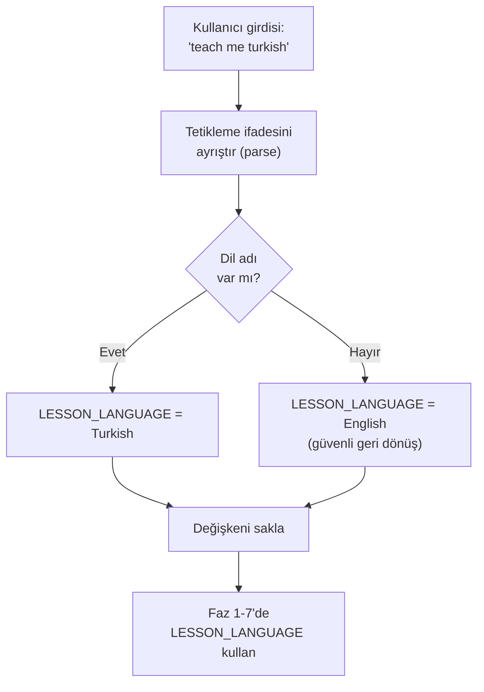
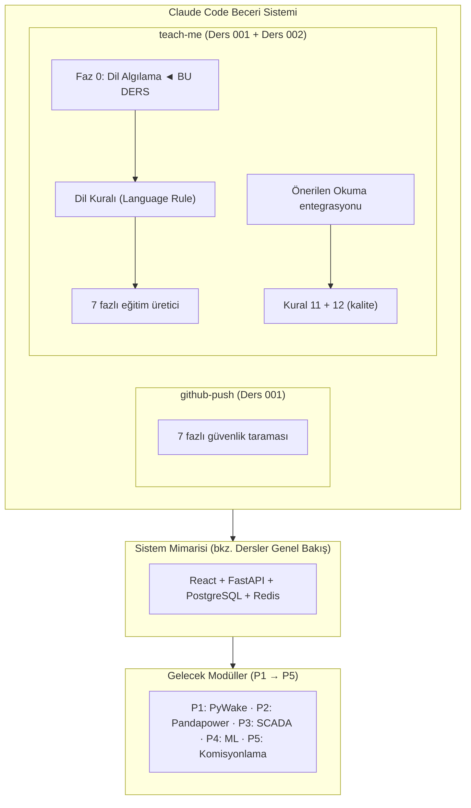

# Ders 002 — Eğitim Becerisine Çok Dilli Destek Eklenmesi: Uluslararasılaştırma Altyapısı

!!! abstract "Ders Navigasyonu"
    :material-arrow-left: **Önceki:** [Ders 001 — DevOps Temeli](lesson-001.md) | **Sonraki:** [Ders 003 — P1: Veritabanı, ERA5 & Weibull](lesson-003.md) :material-arrow-right:

    **Faz:** P0 | **Dil:** Türkçe | **İlerleme:** 3 / 3 | [Tüm Dersler](index.md) | [Öğrenme Yol Haritası](../Learning_Roadmap.md)

> **Date:** 2026-02-20
> **Commits:** 2 commits (`eba32fd` → `fa528fb`)
> **Commit range:** `eba32fd7ab6a979f409d0f2632dedfa35c79f93c..fa528fb95bd6778ea54f50be71ddc6e0475d2818`
> **Phase:** P0 (DevOps Foundation)
> **Roadmap sections:** [Phase 0 — Section 0.3 Web Development Foundations]
> **Language:** Turkish
> **Previous lesson:** Lesson 001
> **last_commit_hash:** fa528fb95bd6778ea54f50be71ddc6e0475d2818

---

## Ne Öğreneceksiniz

- Bir yazılım becerisine (skill) çok dilli destek (internationalization / uluslararasılaştırma) eklemenin mimari prensiplerini
- Teknik terimler ile günlük dil arasındaki çeviri sınırını nasıl tanımlayacağınızı — neyin çevrilip neyin İngilizce kalması gerektiğini
- Prompt mühendisliğinde (prompt engineering) yapılandırılmış faz tasarımının önemini
- Kalite kurallarının (quality rules) yazılım tutarlılığını nasıl koruduğunu
- Git branch stratejisi ve pull request (çekme isteği) iş akışının profesyonel takımlarda nasıl çalıştığını

---

## Bölüm 1: Dil Algılama Mekanizması — Kullanıcının Niyetini Anlamak

### Gerçek Dünya Problemi

Bir rüzgar çiftliğinin kontrol odasında düşünün: operatörler farklı milletlerden gelebilir — Polonyalı, Alman, Danimarkalı mühendisler aynı SCADA ekranına bakıyor. Alarm mesajları İngilizce ama operatörün analiz raporu kendi dilinde olmalı. Sistem, operatörün hangi dilde iletişim kurmak istediğini algılamalı ve buna göre yanıt vermelidir. Yazılımımızda da aynı prensip geçerli: kullanıcı "teach me turkish" dediğinde, sistem dil tercihini otomatik olarak algılamalı.

### Standartlar Ne Diyor

**ISO 639-1 (Language codes)** ve **IETF BCP 47 (Language tags)** standartları, yazılım sistemlerinde dil tanımlama için uluslararası kabul görmüş kodları tanımlar. Endüstriyel otomasyon sistemlerinde **IEC 61131-3** bile HMI (Human-Machine Interface / İnsan-Makine Arayüzü) metinlerinin yerelleştirilebilir olmasını önerir. Bizim yaklaşımımız bu standartlardan ilham alıyor: sabit bir dil listesi yerine, dinamik algılama kullanıyoruz.

### Ne İnşa Ettik

**Değişen dosyalar:**
- `.claude/skills/teach-me/SKILL.md` — Eğitim dersi oluşturucu becerisine çok dilli destek eklendi (52 satır ekleme, 1 satır değişiklik)

Beceri dosyasına yeni bir **PHASE 0: DETECT LANGUAGE** (Faz 0: Dil Algılama) bölümü eklendi. Bu faz, kullanıcının tetikleme ifadesini ayrıştırarak (parse ederek) hangi dilde ders üretileceğini belirler. Önemli bir tasarım kararı alındı: sabit bir dil listesi (whitelist / beyaz liste) kullanılmıyor. Bunun yerine, Claude'un akıcı yazabildiği herhangi bir dil kabul ediliyor.

### Neden Önemli

> **Neden** sabit bir dil listesi yerine açık uçlu dil algılama tercih ettik?
> Çünkü sabit liste bakım yükü (maintenance burden) getirir ve öngörülemeyen kullanım senaryolarını engeller. Bir Japon mühendis "teach me japanese" dediğinde, sistem onu tanımalıdır — listeye manuel ekleme gerektirmemelidir. Rüzgar enerjisi sektörü küresel bir endüstridir: Danimarka'da DTU, Almanya'da Fraunhofer, Japonya'da NEDO — her ülkeden mühendis bu sistemi kullanabilir.
>
> **Neden** dil algılama ayrı bir faz (Phase 0) olarak tasarlandı?
> Çünkü separation of concerns (kaygıların ayrılması) prensibi bunu gerektirir. Dil algılama, ders içeriği oluşturmadan ÖNCE gerçekleşmelidir — tıpkı bir trafo istasyonunda önce voltaj seviyesini ölçüp sonra anahtarlama yapmanız gibi. Sıralama kritiktir: yanlış dil algılanırsa tüm ders yanlış dilde üretilir.

### Dil Algılama Akışı



### Kod İncelemesi

Dil algılama mantığı, açık ve genişletilebilir bir yapıda tasarlanmıştır. Aşağıdaki SKILL.md bölümü, algılama kurallarını tanımlar:

```markdown
## PHASE 0: DETECT LANGUAGE

1. **Parse the user's trigger phrase** for a language name:
   - `"teach me turkish"` → `LESSON_LANGUAGE = Turkish`
   - `"teach me polish"` → `LESSON_LANGUAGE = Polish`
   - `"teach me german"` → `LESSON_LANGUAGE = German`
   - `"teach me"` (no language) → `LESSON_LANGUAGE = English`
   - Any other trigger phrase without a language → `LESSON_LANGUAGE = English`

2. **No hardcoded whitelist** — accept any language Claude can write fluently

3. **Store `LESSON_LANGUAGE`** — use it in all subsequent phases
```

Burada dikkat edilmesi gereken üç tasarım ilkesi var. Birincisi, **varsayılan değer** (default value) her zaman İngilizce'dir — belirsizlik durumunda güvenli bir geri dönüş (fallback) sağlar. İkincisi, örnekler somut ve açıktır — geliştiricinin tahmin yapmasına gerek kalmaz. Üçüncüsü, `LESSON_LANGUAGE` değişkeni saklanır ve sonraki tüm fazlarda kullanılır — bu, state management (durum yönetimi) prensibinin basit ama etkili bir uygulamasıdır.

Bu yapı, koruma rölesi (protection relay) konfigürasyonuna benzer: bir kez ayarlanır, tüm çalışma boyunca geçerli kalır.

!!! tip "Temel Kavram: Varsayılan Değerlerle Güvenli Geri Dönüş (Safe Fallback with Defaults)"
    **Basitçe anlatımı:** Bir sistem beklenmedik bir girdi aldığında çökmek yerine, önceden belirlenmiş güvenli bir davranışa dönmelidir. Tıpkı bir asansörün elektrik kesildiğinde en yakın kata gidip kapılarını açması gibi.

    **Benzetme:** Bir navigasyon uygulaması düşünün. GPS sinyali kesildiğinde uygulama çökmez — son bilinen konumunuzu gösterir ve "sinyal aranıyor" der. Bizim dil algılama sistemimiz de aynı şekilde çalışır: tanınmayan bir dil ifadesi geldiğinde İngilizce'ye döner.

    **Bu projede:** Kullanıcı "teach me" yazarsa (dil belirtmeden), sistem İngilizce üretir. "teach me klingon" yazarsa bile sistem çökmez — Claude'un o dilde ne kadar başarılı olacağı ayrı bir soru, ama sistem kararlı kalır. Bu prensip, P3'te SCADA alarmlarının varsayılan öncelik seviyesine dönmesi ile aynı mantıktır.

---

## Bölüm 2: Dil Sınırı Kuralı — Neyi Çevirmeli, Neyi Çevirmemeli

### Gerçek Dünya Problemi

Bir offshore rüzgar çiftliğinde İngilizce konuşulmayan bir ülkede (örneğin Polonya'da) çalışıyorsunuz. Günlük raporlarınız Lehçe olabilir, ama teknik çizimlerdeki etiketler uluslararası standarttır: "66 kV", "XCSR-1" (devre kesici tanımlayıcısı) ve "IEC 61850" her dilde aynı yazılır. Eğer birisi "IEC 61850"yi "MEK 61850" olarak çevirirse, başka bir ülkeden gelen mühendis bunu Google'da bulamaz. Teknik terimlerin dilden bağımsız kalması, küresel iletişim için zorunludur.

### Standartlar Ne Diyor

**IEEE 82 (Electrical terms and definitions)** ve **IEC 60050 (International Electrotechnical Vocabulary)** standartları, elektroteknik terimlerin uluslararası tutarlılığını sağlamak için mevcuttur. Bu standartlar, teknik terimlerin yerelleştirilirken orijinal İngilizce formuyla birlikte kullanılmasını önerir. Yazılım dünyasında da **GNU gettext** ve **Unicode CLDR** aynı prensibi takip eder: UI metinleri çevrilir, değişken adları ve API uç noktaları çevrilmez.

### Ne İnşa Ettik

**Değişen dosyalar:**
- `.claude/skills/teach-me/SKILL.md` — Dil Kuralı (Language Rule) bölümü eklendi

Ders şablonuna yeni bir "Language Rule" (Dil Kuralı) bloğu eklendi. Bu blok, neyin çevrilip neyin İngilizce kalacağını açıkça tanımlar:

### Neden Önemli

> **Neden** kod bloklarını ve dosya yollarını asla çevirmiyoruz?
> Çünkü kod evrensel bir dildir. Bir Python fonksiyonu `calculate_wake_deficit()` ise, bunu `rüzgar_gölgesi_açığını_hesapla()` olarak çevirmek kodun çalışmasını imkansız kılar. Kod blokları birebir kopyalanmalıdır — okuyucu terminale yapıştırıp çalıştırabilmelidir. Bu, IEC 61850'deki Logical Node (Mantıksal Düğüm) adlandırmasına benzer: `MMXU` (Measurement — ölçüm) her ülkede `MMXU`dur, asla yerelleştirilmez.
>
> **Neden** teknik terimleri ilk kullanımda İngilizce + yerel çeviri olarak veriyoruz?
> Çünkü bu "çift kodlama" (dual coding) tekniği hem yeni kavramı öğretir hem de okuyucunun uluslararası literatürde arama yapabilmesini sağlar. Bir Türk mühendis "wake deficit" terimini bilmezse, bir konferansta İngilizce sunumu anlayamaz. Ama sadece İngilizce terimle karşılaşırsa, kavramın ne anlama geldiğini sezgisel olarak kavrayamaz. İkisini bir arada vermek — "wake deficit (rüzgar gölgesi açığı)" — her iki sorunu da çözer.

### Kod İncelemesi

Dil Kuralı bloğu, çeviri sınırlarını kesin olarak tanımlar. Aşağıdaki yapı, her ders üretiminde uyulması gereken kuralları listeler:

```markdown
### Language Rule

If `LESSON_LANGUAGE` is not English:
- Write ALL prose content in the target language
- Keep these elements in English ALWAYS:
  - Code blocks and inline code
  - File paths and directory names
  - Git commit hashes and commit messages
  - Standard references (e.g., "IEC 61850", "ENTSO-E NC RfG Type D")
  - Technical terms on first use: English term + native translation in parentheses
- Section headings: translate them
- Quiz questions and answers: fully in target language
- Interview Corner: both sections in target language
```

Bu kuralın güzelliği, belirsizliği ortadan kaldırmasıdır. "Prose content" (düzyazı içerik) ve "code/paths/hashes" (kod/yollar/hash'ler) arasındaki sınır net ve uygulanabilirdir. Bir geliştirici bu kuralı okuyup "bu satırı çevirmeli miyim?" sorusuna her zaman kesin bir cevap bulabilir.

Ayrıca, şablon başlığına yeni metadata (üst veri) alanları eklendi:

```markdown
> **Roadmap sections:** [Phase X — Section X.Y Title, Section X.Z Title]
> **Language:** [LESSON_LANGUAGE]
```

Bu alanlar, her dersin hangi roadmap bölümüne karşılık geldiğini ve hangi dilde yazıldığını kayıt altına alır — tıpkı bir SCADA kaydının her olayı zaman damgası ve kaynak bilgisiyle etiketlemesi gibi.

!!! tip "Temel Kavram: Uluslararasılaştırma ve Yerelleştirme (Internationalization — i18n & Localization — l10n)"
    **Basitçe anlatımı:** Uluslararasılaştırma, bir uygulamayı farklı dillere uyarlanabilir hale getirmektir — sanki evinizdeki elektrik prizlerini farklı ülkelerin fişlerine uyumlu yapıyorsunuz. Yerelleştirme ise belirli bir ülkenin fişini takmaktır. Önce altyapıyı kurar, sonra belirli bir dile uyarlarsınız.

    **Benzetme:** Bir IKEA mobilya montaj kılavuzunu düşünün. Çizimleri her ülkede aynıdır (kod blokları gibi), ama uyarı metinleri ve güvenlik talimatları her ülkenin dilinde yazılır. Allen anahtarının resmi çevrilmez ama "Bu vidayı sıkın" yazısı çevrilir. Bizim dil kuralımız da aynı prensibi uygular.

    **Bu projede:** 510 MW rüzgar çiftliği simülasyonumuz uluslararası bir eğitim platformu. Polonyalı bir PSE mühendisi için Lehçe ders üretebilir, Türk bir enerji mühendisi için Türkçe ders üretebilir — ama ikisinde de `pandapower.runpp()` aynı şekilde yazılır ve IEC 60909 aynı numara ile referans verilir.

---

## Bölüm 3: Önerilen Okuma ve Öğrenme Yol Haritası Entegrasyonu

### Gerçek Dünya Problemi

Bir rüzgar enerjisi mühendisi sürekli öğrenmek zorundadır — yeni standartlar yayınlanır, yeni türbin modelleri çıkar, grid kodları güncellenir. Ama bilgi okyanusunda kaybolmak kolaydır. İyi bir eğitim sistemi, "şimdi ne okumalıyım?" sorusuna kişiselleştirilmiş cevap verir — o anda öğrendiğiniz konuyla doğrudan ilgili kaynakları önerir, tüm kütüphaneyi değil.

### Standartlar Ne Diyor

**Bloom'un Taksonomisi (Bloom's Taxonomy)** eğitim bilimlerinin temel çerçevesidir: hatırlama → anlama → uygulama → analiz → değerlendirme → yaratma. Her ders, öğrencinin taksonomide yukarı çıkmasını sağlamalıdır. "Önerilen Okuma" bölümü, öğrencinin mevcut seviyesinden bir üst seviyeye geçmesine yardımcı olacak kaynakları seçer. Bu, **Vygotsky'nin Yakınsak Gelişim Alanı (Zone of Proximal Development)** kavramıyla da uyumludur: çok kolay değil, çok zor değil — tam olarak şu an ulaşılabilir olan.

### Ne İnşa Ettik

**Değişen dosyalar:**
- `.claude/skills/teach-me/SKILL.md` — "Suggested Reading" (Önerilen Okuma) bölümü ve Learning Roadmap entegrasyonu eklendi

Faz 4'e yeni bir kural eklendi: her ders üretiminde `docs/Learning_Roadmap.md` dosyasının okunması ve dersin hangi roadmap fazına/bölümüne karşılık geldiğinin belirlenmesi. Ardından, ders şablonuna yeni bir "Suggested Reading" tablosu eklendi.

### Neden Önemli

> **Neden** önerilen okumaları Learning Roadmap'ten alıyoruz, rastgele önermiyoruz?
> Çünkü Learning Roadmap, güvenilir ve doğrulanmış kaynaklardan oluşan küratörlü (curated) bir listedir. Rastgele kitap önerileri yanıltıcı olabilir — yanlış baskı, geri çekilmiş makale veya kalitesiz kaynak önerilirse, öğrencinin güveni sarsılır. Gerçek mühendislik eğitiminde referanslar izlenebilir (traceable) olmalıdır, tıpkı IEC 61400-1'de kullanılan hesaplama yöntemlerinin referans verilmesi gibi.
>
> **Neden** 3-5 kaynak ile sınırlıyoruz, tüm listeyi vermiyoruz?
> Aşırı bilgi yüklemesi (information overload) öğrenmeyi engelleyen en büyük düşmanlardan biridir. Bir öğrenci 30 kaynaklık bir liste görürse hiçbirini okumaz. Ama "bu ders için en önemli 3 kaynak bunlar" dersek, gerçekten okur. Bu, SCADA alarm yönetimindeki (ISA-18.2) prensiple aynıdır: operatöre yüzlerce alarm gösterirseniz hepsini görmezden gelir, en kritik 3-5 alarmı gösterirseniz harekete geçer.

### Kod İncelemesi

Faz 4'e eklenen yeni kural, ders üretim sürecinin bilgi toplama aşamasını genişletir:

```markdown
5. **Read `docs/Learning_Roadmap.md`** to identify which roadmap phase/section
   the lesson maps to, and extract relevant trusted sources (textbooks, papers,
   courses) for the "Suggested Reading" block.
```

Bu kural, her dersin sadece "ne yaptık" değil, "daha fazla öğrenmek için ne okumalıyım" sorusuna da cevap vermesini sağlar. Ders şablonundaki karşılık gelen bölüm şöyle görünür:

```markdown
## Suggested Reading

*From the [Learning Roadmap](../Learning_Roadmap.md) — Phase X: [Phase Title]*

| Resource | Type | Why Read It |
|----------|------|-------------|
| [Source from Learning Roadmap] | [Type] | [1-sentence reason tied to this lesson's content] |
```

Her kaynağın yanında "Why Read It" (Neden Okumalı) sütunu bulunur — bu, öğrencinin kaynağı neden seçtiğimizi anlamasını sağlar. Motivasyon olmadan referans listesi sadece bibliyografyadır; motivasyonla birlikte bir öğrenme yol haritasıdır.

Ayrıca, kalite kurallarına yeni bir kural eklendi:

```markdown
11. **Suggested Reading must reference actual Learning Roadmap sources**
    — never fabricate book titles or paper references
```

Bu kural, halüsinasyonları (hallucination) önleme amacı taşır. Yapay zeka modelleri bazen var olmayan kitaplar veya makaleler uydurabilir. Bu kalite kuralı, her önerilen kaynağın Learning Roadmap'te gerçekten var olduğunu garanti eder — tıpkı bir mühendislik raporunda her referansın doğrulanabilir olması gerektiği gibi.

!!! tip "Temel Kavram: Küratörlü Öğrenme (Curated Learning)"
    **Basitçe anlatımı:** İnternette her konuda binlerce kaynak var. Küratörlü öğrenme, bir uzmanın sizin için en iyi 3-5 kaynağı seçip "önce bunları oku" demesidir. Bir müzede tüm tabloları görmek yerine, rehberin "bu beş tablo mutlaka görülmeli" demesi gibi.

    **Benzetme:** Bir doktor "sindirim probleminiz var" deyip sizi WebMD'ye yönlendirmez — "bu ilacı günde 2 kez alın, bu diyeti uygulayın" gibi somut talimatlar verir. Küratörlü öğrenme de aynıdır: "wake modelleme öğrenmek istiyorsun — önce Bastankhah & Porté-Agel (2014) makalesini oku, sonra PyWake dokümantasyonunu incele."

    **Bu projede:** Learning Roadmap'imiz 15 akademik makale, düzinelerce ders kitabı ve onlarca çevrimiçi kaynak içeriyor. Ama her ders sonunda sadece 3-5 tanesini öneriyoruz — o dersin konusuyla doğrudan ilgili olanları. P1'de wake modelleme dersi aldığınızda Bastankhah makalesini göreceksiniz, P2'de koruma dersi aldığınızda Jankovic makalesini.

---

## Bölüm 4: Kalite Kuralları ve Pull Request İş Akışı

### Gerçek Dünya Problemi

Bir offshore rüzgar çiftliğinde "belgelendirme olmadan işlem yok" kuralı vardır. Bir anahtarlama programı (switching programme) yazılmadan devre kesici kapatılmaz. Bir test raporu onaylanmadan ekipman devreye alınmaz. Yazılım geliştirmede de aynı disiplin gereklidir: bir özellik (feature), gözden geçirilmeden (review) ve testlerden geçmeden ana koda (main branch) birleştirilmez.

### Standartlar Ne Diyor

**ISO 9001 (Quality management systems)** ve **IEC 61400-22 (Wind turbine certification)** kalite yönetim standartları, her değişikliğin izlenebilir ve gözden geçirilebilir olmasını gerektirir. Git'in branch (dal) ve pull request (çekme isteği) mekanizması, bu gerekliliğin yazılım dünyasındaki doğal karşılığıdır. Her PR bir "değişiklik talebi"dir ve birleştirilmeden önce incelenir — tıpkı bir Management of Change (MOC / Değişiklik Yönetimi) sürecinde olduğu gibi.

### Ne İnşa Ettik

Bu derste incelediğimiz değişiklikler, `feature/teach-me-multilang` dalında geliştirildi ve PR #14 ile ana dala birleştirildi:

```
eba32fd [INFRA] Add multi-language support to teach-me skill
fa528fb Merge pull request #14 from polat-mustafa/feature/teach-me-multilang
```

İlk commit (`eba32fd`), asıl kod değişikliğini içerir — 52 satır ekleme ve 1 satır değişiklik. İkinci commit (`fa528fb`), GitHub'daki merge (birleştirme) işlemini temsil eder. Bu iki-aşamalı süreç — önce özellik dalında geliştir, sonra PR ile birleştir — profesyonel yazılım takımlarının standart iş akışıdır.

### Neden Önemli

> **Neden** doğrudan `main` dalına commit yapmak yerine özellik dalı (feature branch) kullanıyoruz?
> Çünkü `main` dalı her zaman çalışır durumda olmalıdır — bu, "üretim hattı her zaman çalışır" prensibiyle eşdeğerdir. Bir özellik yarım kaldığında, bozuk kod `main`'de olursa tüm takımı etkiler. Özellik dalı, deneysel çalışmayı izole eder. Rüzgar çiftliğindeki benzetmesi: bir türbinin bakımı sırasında, o türbini şebekeden ayırırsınız (isolate edersiniz) — tüm çiftliği kapatmazsınız.
>
> **Neden** commit mesajında `[INFRA]` scope etiketi (scope tag) kullanıyoruz?
> İzlenebilirlik (traceability). Git log'una baktığınızda, `[INFRA]` etiketi bu değişikliğin altyapı ile ilgili olduğunu — domain mantığı (iş mantığı) veya hata düzeltmesi olmadığını — anında belli eder. Bu, SCADA olay günlüğündeki (event log) kategorilere benzer: "ALARM", "TRIP", "MAINTENANCE" — her olay türü farklı etiketle işaretlenir.

### Kod İncelemesi

Commit `eba32fd`, beceri açıklama satırını günceller ve çok dilli tetikleme ifadelerini ekler:

```markdown
description: "Generate a comprehensive teaching lesson from recent git history.
Trigger this skill when the user says: 'teach me', 'teach me english',
'teach me turkish', 'teach me polish', 'explain what we did', 'lesson',
'what did we build', 'what changed', 'review our work', 'generate lesson',
'study session', 'learning recap', or any variation involving reviewing,
explaining, or generating a lesson from recent work. Supports multi-language
output — the user can append any language name to specify the lesson language."
```

Bu açıklama satırı iki kritik rol oynar. Birincisi, Claude Code'un beceriyi ne zaman tetikleyeceğini belirleyen bir desen eşleme (pattern matching) kuralıdır. İkincisi, geliştiriciler için bir belgedir — becerinin ne yaptığını ve nasıl tetiklendiğini açıklar.

Son olarak, 12. kalite kuralı eklenerek dil tutarlılığı garanti altına alınmıştır:

```markdown
12. **Language consistency** — if a non-English language is specified,
    ALL prose must be in that language; mixing languages mid-sentence
    is forbidden (except for technical terms on first use)
```

Bu kural, "code-switching" (dil değiştirme) sorununu önler. Bir Türkçe derste cümle ortasında İngilizce'ye geçmek okuyucunun dikkatini dağıtır ve profesyonel olmayan bir izlenim bırakır. Tek istisna, teknik terimlerin ilk kullanımıdır — "wake deficit (rüzgar gölgesi açığı)" gibi.

!!! tip "Temel Kavram: Git Branch Stratejisi (Git Branching Strategy)"
    **Basitçe anlatımı:** Bir ağacın dalları gibi düşünün. Ana gövde (`main`) her zaman sağlamdır. Yeni bir özellik eklemek istediğinizde, bir dal çıkartırsınız. Dal üzerinde çalışırsınız — ana gövdeye zarar vermeden. İşiniz bitince, dalı ana gövdeye geri birleştirirsiniz. Eğer dal kötü çıkarsa, dalı kesersiniz — ana gövde etkilenmez.

    **Benzetme:** Bir yemek tarifini düşünün. Ana tarifi (main) doğrudan değiştirmek risklidir — belki yeni malzeme kötü sonuç verir. Bunun yerine, tarifi kopyalarsınız (branch), kopyada deney yaparsınız, beğenirseniz orijinal tarifi güncellersiniz (merge). Beğenmezseniz kopyayı çöpe atarsınız.

    **Bu projede:** `feature/teach-me-multilang` dalı, çok dilli destek özelliği için oluşturuldu. Tüm değişiklikler bu dalda yapıldı, test edildi ve PR #14 ile `main`'e birleştirildi. Bu iş akışı, P1'den P5'e kadar her yeni özellik için tekrarlanacaktır.

---

## Önceki Derslerle Bağlantılar

Ders 001'de, projenin DevOps temelini kurduk: CI/CD pipeline'ı, Docker Compose orkestrasyonu, güvenlik tarama becerisi ve Dependabot ile otomatik bağımlılık yönetimi. Şimdi bu temelin üzerine inşa ediyoruz:

- **Ders 001'de** github-push becerisini (skill) oluşturduk — güvenlik taraması yapan otomatik push iş akışı. Şimdi aynı beceri mimarisini kullanarak **teach-me becerisini** genişletiyoruz. Her iki beceri de aynı SKILL.md yapısını takip eder: metadata başlığı, izin verilen araçlar, fazlı (phased) iş akışı.

- **Ders 001'de** pre-commit hook'ları ve CI pipeline'ı ile "savunma derinliği" (defense in depth) prensibini öğrendik. Bu derste aynı prensibi kalite kurallarına uyguluyoruz: Kural 11 (uydurma kaynak yasağı) ve Kural 12 (dil tutarlılığı) ders üretiminde birer "kalite kapısı" (quality gate) görevi görür.

- **Ders 001'de** öğrendiğimiz commit mesaj kuralları (`[SCOPE]` etiketleri) burada da kullanılıyor: `[INFRA] Add multi-language support to teach-me skill` — scope etiketi, açıklayıcı mesaj, imperative mood (emir kipi).

- **Ders 001'de** tanıttığımız özellik dalı + PR iş akışı (`feature/teach-me-skill` → PR #13) burada tekrarlanıyor: `feature/teach-me-multilang` → PR #14. Tekrarlanan kalıplar güçlü öğrenme sinyalleridir.

---

## Büyük Resim

*Bu dersin odağı: teach-me becerisine eklenen **i18n katmanı**.*



Tam sistem mimarisi için [Dersler Genel Bakış](index.md#system-architecture) sayfasına bakınız.

---

## Önemli Çıkarımlar

1. **Varsayılan değerler güvenli geri dönüş sağlar** — dil belirtilmezse İngilizce üretilir, tıpkı bir koruma rölesinin belirsizlik durumunda güvenli tarafa (trip) düşmesi gibi.
2. **Çeviri sınırları net olmalıdır** — kod, dosya yolları, commit hash'leri ve standart referansları asla çevrilmez; sadece düzyazı içerik (prose) hedef dilde yazılır.
3. **Teknik terimler ilk kullanımda çift dilli verilir** — "wake deficit (rüzgar gölgesi açığı)" formatı, hem yerel anlayışı hem de uluslararası aranabilirliği sağlar.
4. **Kalite kuralları halüsinasyonları önler** — Kural 11, her önerilen kaynağın Learning Roadmap'te doğrulanabilir olmasını zorunlu kılar.
5. **Küratörlü okuma listeleri bilgi yüklemesini önler** — 3-5 kaynak, 30 kaynaktan daha etkilidir, tıpkı SCADA'da en kritik alarmların önceliklendirilmesi gibi.
6. **Özellik dalları ana kodu korur** — `feature/teach-me-multilang` dalında deney yapılır, `main` her zaman kararlı kalır.
7. **Separation of concerns mimari kaliteyi artırır** — dil algılama ayrı bir faz (Phase 0), içerik üretimi ayrı fazlarda; her parça bağımsız test edilebilir ve bakımı yapılabilir.

---

## Önerilen Okuma

*[Öğrenme Yol Haritası](../Learning_Roadmap.md) — Faz 0: Mühendislik Temelleri'nden*

| Kaynak | Tür | Neden Okumalı |
|--------|-----|---------------|
| FastAPI Official Tutorial | Dokümantasyon (ücretsiz) | Beceri dosyamız bir API olmasa da, yapılandırılmış faz tasarımı FastAPI'nin middleware zincirleme mantığıyla aynı prensibi paylaşır |
| React Official Tutorial (react.dev/learn) | Dokümantasyon (ücretsiz) | P3'te SCADA HMI'ı çok dilli olacak — React'in i18n ekosistemini anlamak için temel React bilgisi gerekli |
| *Designing Data-Intensive Applications* — Martin Kleppmann | Kitap | Uluslararasılaştırma bir veri yapılandırma problemidir — Kleppmann'ın encoding ve schema evolution bölümleri doğrudan ilgilidir |

---

## Sınav — Anlayışınızı Test Edin

### Hatırlama Soruları

**S1:** Teach-me becerisine eklenen Phase 0 (Faz 0) tam olarak ne yapar ve varsayılan dil nedir?

<details>
<summary>Cevap</summary>

Phase 0: DETECT LANGUAGE, kullanıcının tetikleme ifadesini ayrıştırarak (parse ederek) hangi dilde ders üretileceğini belirler. Örneğin "teach me turkish" ifadesinden `LESSON_LANGUAGE = Turkish` çıkarır. Eğer kullanıcı dil belirtmezse (sadece "teach me" derse) veya tanınmayan bir ifade kullanırsa, varsayılan dil İngilizce'dir (English). Bu varsayılan, güvenli geri dönüş (safe fallback) prensibiyle tasarlanmıştır.

</details>

**S2:** Dil Kuralı'na (Language Rule) göre, bir Türkçe derste hangi öğeler İngilizce kalmalıdır?

<details>
<summary>Cevap</summary>

Beş kategori İngilizce kalmalıdır: (1) kod blokları ve satır içi kod, (2) dosya yolları ve dizin adları, (3) git commit hash'leri ve commit mesajları, (4) standart referansları (örneğin "IEC 61850", "ENTSO-E NC RfG Type D"), ve (5) teknik terimler ilk kullanımda İngilizce + parantez içinde yerel çeviri ile verilir. Bölüm başlıkları, sınav soruları, Mülakat Köşesi ve tüm düzyazı içerik hedef dilde yazılır.

</details>

**S3:** Bu derste eklenen iki yeni kalite kuralı (Kural 11 ve Kural 12) nelerdir?

<details>
<summary>Cevap</summary>

Kural 11: "Suggested Reading must reference actual Learning Roadmap sources — never fabricate book titles or paper references" — önerilen okumaların Learning Roadmap'teki gerçek kaynaklardan alınması gerektiğini, asla uydurma kitap veya makale referansı verilmemesini zorunlu kılar. Kural 12: "Language consistency — if a non-English language is specified, ALL prose must be in that language; mixing languages mid-sentence is forbidden (except for technical terms on first use)" — dil tutarlılığını garanti eder ve cümle ortasında dil değiştirmeyi (code-switching) yasaklar.

</details>

### Anlama Soruları

**S4:** Neden sabit bir dil listesi (whitelist) yerine açık uçlu dil algılama tercih edildi? Bu kararın avantaj ve dezavantajları nelerdir?

<details>
<summary>Cevap</summary>

Açık uçlu algılama tercih edildi çünkü rüzgar enerjisi küresel bir endüstridir ve her ülkeden mühendis bu platformu kullanabilir. Sabit bir liste, her yeni dil için manuel güncelleme gerektirir ve öngörülemeyen kullanım senaryolarını engeller. Avantajı: sıfır bakım maliyeti ile sınırsız dil desteği. Dezavantajı: Claude'un bazı dillerde (örneğin nadir diller) düşük kalitede çıktı üretme riski vardır. Ancak bu risk, sistemin çökmesi yerine düşük kaliteli çıktı üretmesidir — bu da güvenli bir geri dönüş modudur (graceful degradation).

</details>

**S5:** Teknik terimlerin ilk kullanımda "İngilizce + yerel çeviri" formatında verilmesi neden önemlidir? Sadece İngilizce veya sadece yerel dil yeterli olmaz mıydı?

<details>
<summary>Cevap</summary>

Sadece İngilizce terim kullanmak, okuyucunun kavramı sezgisel olarak anlama şansını azaltır — "wake deficit" ifadesi, İngilizce bilmeyen bir mühendis için anlamsızdır. Sadece yerel çeviri kullanmak ise okuyucunun uluslararası literatürde arama yapma, İngilizce konferanslarda sunumları anlama ve çok uluslu takımlarda iletişim kurma yeteneğini kısıtlar. İkisini birlikte vermek — "wake deficit (rüzgar gölgesi açığı)" — hem yerel anlayış sağlar hem de uluslararası terminolojiyi öğretir. Bu, eğitim bilimlerindeki "çift kodlama" (dual coding) tekniğidir: aynı kavramı iki farklı formatta sunmak, hafızada kalıcılığı artırır.

</details>

**S6:** Pull request (PR) iş akışı, doğrudan `main` dalına commit yapmaktan neden daha güvenlidir? Bu soruyu bir rüzgar çiftliği analojisi ile açıklayın.

<details>
<summary>Cevap</summary>

PR iş akışı, değişiklikleri izole eder ve gözden geçirme (review) fırsatı sunar — tıpkı bir rüzgar çiftliğinde bakım yapılacak türbinin önce şebekeden ayrılması (isolate edilmesi) gibi. Türbin 17'nin jeneratörünü bakıma alırken, onu 66 kV diziden ayırırsınız — böylece bakım sırasında bir sorun olsa bile diğer 33 türbin etkilenmez. Doğrudan `main`'e commit yapmak, bakımı şebeke bağlıyken yapmak gibidir — bir hata tüm sistemi etkiler. PR iş akışında, özellik dalı izole bir ortamdır, CI testleri otomatik doğrulama yapar ve birleştirme (merge) ancak tüm kontroller geçtikten sonra yapılır.

</details>

### Meydan Okuma Sorusu

**S7:** Bu projede şu anda iki beceri (github-push ve teach-me) var. Her ikisi de `.claude/skills/` dizininde SKILL.md dosyaları ile tanımlanıyor. Eğer beceri sayısı 10'a veya 20'ye çıkarsa, hangi mimari sorunlar ortaya çıkar ve bunları nasıl çözersiniz? Beceri keşfi (skill discovery), çakışma yönetimi (conflict resolution) ve performans açısından düşünün.

<details>
<summary>Cevap</summary>

**Beceri keşfi:** 20 beceride, Claude Code'un her kullanıcı mesajını 20 farklı tetikleme ifadesi (trigger phrase) listesiyle karşılaştırması gerekir. Bu, doğrusal arama karmaşıklığıdır (O(n)). Çözüm: becerileri kategorilere ayırmak (ör. "git", "education", "analysis") ve önce kategori eşleme yapmak — tıpkı bir koruma rölesi koordinasyonunda önce bölge (zone) tespiti yapıp sonra detay analiz yapmak gibi.

**Çakışma yönetimi:** Birden fazla beceri aynı tetikleme ifadesine yanıt verebilir. Örneğin, "review our work" hem teach-me hem de bir gelecekteki "code-review" becerisi tarafından eşlenebilir. Çözüm: (1) öncelik sıralaması (priority ordering), (2) daha spesifik eşleşmelerin öncelik alması, veya (3) belirsizlik durumunda kullanıcıya sorma. Bu, koruma rölesi koordinasyonundaki "grading" (kademelenme) prensibiyle aynıdır: birden fazla röle aynı arızayı algılarsa, en yakın röle önce açar.

**Performans:** Her beceri dosyasının her mesajda okunması gecikme yaratır. Çözüm: (1) beceri manifest dosyası (tüm tetikleme ifadelerini tek bir indeks dosyasında toplamak), (2) lazy loading (beceri ancak eşleşme sağlandığında tam olarak yüklenir), (3) önbellekleme (caching). Bu, SCADA sistemlerinin poll vs. event-driven mimarisine benzer: her sensörü sürekli yoklamak (poll) yerine, sadece değişiklik olduğunda bildirim almak (event-driven) daha verimlidir.

</details>

---

## Mülakat Köşesi

### Basitçe Açıklayın
*"Bir yazılım aracına çok dilli destek eklemeyi bir mühendis olmayana nasıl açıklarsınız?"*

Diyelim ki bir öğretmensiniz ve ders notlarınızı sadece İngilizce yazıyorsunuz. Ama sınıfınızda Türk, Polonyalı ve Alman öğrenciler var. Hepsi İngilizce anlıyor ama kendi dillerinde okurlarsa çok daha hızlı ve derinden öğreniyorlar. Şimdi bir sistem kuruyorsunuz: öğrenci "bana Türkçe anlat" dediğinde, ders notlarınız Türkçe'ye çevriliyor.

Ama her şeyi çevirmiyorsunuz! Matematik formülleri her dilde aynıdır — "2 + 2 = 4" Türkçe'de de aynıdır. Benzer şekilde, bilgisayar kodunu çevirmezsiniz çünkü bilgisayar Türkçe anlamaz. Standart numaralarını da çevirmezsiniz çünkü dünya genelinde aynı numara kullanılır. Sadece açıklamaları, örnekleri ve soruları çevirirsiniz — yani insanların okuduğu kısımları.

Bu projede tam olarak bunu yaptık. Eğitim dersleri üreten bir aracımız vardı. Ona "hangi dilde yazacağını anla" ve "neyi çevirip neyi çevirmeyeceğini bil" kurallarını ekledik. Artık bir Türk enerji mühendisi, rüzgar çiftliği simülasyonumuzu Türkçe öğrenebilir — ama kodlar ve standart referanslar uluslararası formatta kalır.

### Teknik Olarak Açıklayın
*"Bir işe alım paneline, bir AI beceri sistemine uluslararasılaştırma desteği eklemeyi nasıl açıklarsınız?"*

Claude Code'un beceri (skill) sistemi için bir internationalization (i18n) katmanı tasarladık. Temel mimari kararımız, geleneksel i18n yaklaşımından (gettext, ICU message format, çeviri dosyaları) farklıdır çünkü LLM-tabanlı bir sistemde çalışıyoruz. Anahtar/değer çeviri dosyaları yerine, doğal dil talimatları (prompt engineering) aracılığıyla çeviri sınırlarını tanımlıyoruz.

Sistemin mimarisi fazlı (phased) bir pipeline'dır. Phase 0 (DETECT LANGUAGE), kullanıcı girdisinden dil tercihini çıkarır ve bir `LESSON_LANGUAGE` durum değişkeni (state variable) olarak saklar. Bu değişken, sonraki tüm fazlarda (Phase 1-7) kullanılır. Sabit dil listesi (whitelist) kullanmak yerine açık uçlu algılama tercih ettik — bu, sıfır bakım maliyetiyle sınırsız dil genişletebilirliği sağlar, ancak graceful degradation (zarif bozunma) riskini kabul eder: nadir dillerde çıktı kalitesi düşebilir.

Çeviri sınırı kuralı (Language Rule), i18n'in en kritik tasarım kararıdır. Beş kategoriyi "çevrilmez" (invariant) olarak tanımladık: kod blokları, dosya yolları, git metadata'sı, standart referansları ve teknik terimler (ilk kullanımda dual-format). Bu sınır, IEC 61850'deki Logical Node adlandırma kuralıyla aynı prensibi izler: `MMXU` her ülkede `MMXU`'dur, yerelleştirilmez. İki yeni kalite kuralı (11: Learning Roadmap kaynak doğrulaması, 12: dil tutarlılığı) eklenerek halüsinasyon riski ve code-switching sorunu yapısal olarak önlendi. Tüm değişiklikler feature branch + PR iş akışıyla (PR #14) birleştirildi ve CI pipeline'ından geçti.
