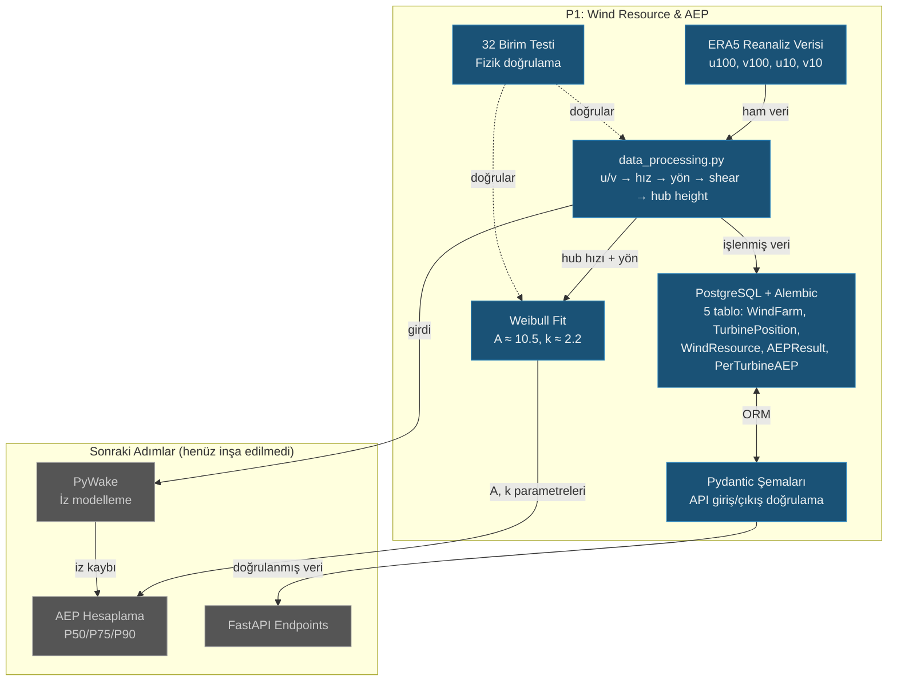

# Ders 004 — P1 Başlangıcı: Veritabanı Modelleri, ERA5 Rüzgar Verisi İşleme ve Weibull Analizi

!!! abstract "Ders Navigasyonu"
    :material-arrow-left: **Önceki:** [Ders 003 — Ön Tasarım Kararları](lesson-003.md) | **Sonraki:** [Ders 005 — Rüzgar Gülü & İz Modeli](lesson-005.md) :material-arrow-right:

    **Faz:** P1 | **Dil:** Türkçe | **İlerleme:** 5 / 5 | [Tüm Dersler](index.md) | [Öğrenme Yol Haritası](../Learning_Roadmap.md)

> **Date:** 2026-02-23
> **Commits:** 15 commits (`d6e30ee` → `bb84814`), 3 dahil / 12 atlandı
> **Commit range:** `d6e30ee52c7a389c8232f546dc3e6ae2952e79f7..bb84814a0a0bf528dd78c95d42e6341e50b89bb5`
> **Phase:** P1 (Wind Resource & AEP)
> **Roadmap sections:** [Phase 1 — Section 1.1 Wind Resource Assessment, Section 1.2 Wake Modelling & Layout Optimization]
> **Language:** Turkish
> **Previous lesson:** Lesson 002
> **last_commit_hash:** bb84814a0a0bf528dd78c95d42e6341e50b89bb5

---

## Ne Öğreneceksiniz

- ERA5 reanaliz verisinin u/v bileşenlerinden rüzgar hızı ve yönüne nasıl dönüştürüldüğünü (vektör ayrıştırma fiziği)
- Güç yasası profili (power law) ile 100 m'den 150 m hub yüksekliğine rüzgar hızı ekstrapolasyonunu
- Weibull dağılımının rüzgar enerji mühendisliğindeki kritik rolünü ve scipy ile nasıl fit edildiğini
- Async SQLAlchemy + Alembic migrasyonlarıyla üretim kalitesinde veritabanı mimarisi kurmayı
- Fizik kurallarını birim testleriyle doğrulamanın mühendislik pratiğindeki önemini

---

## Bölüm 1: Mühendislik İncelemesi — Doğruluk Kontrolü ve Bağımlılık Sabitleme

### Gerçek Hayattan Bir Problem

Bir köprü inşa ediyorsunuz diyelim. Proje çizimlerinde çelik dayanımı 500 MPa yazıyor ama gerçekte malzeme 450 MPa. Bu %10'luk fark, köprünün çökmesiyle sonuçlanabilir. Mühendislikte "küçük sayısal hata" diye bir şey yoktur — her değer doğrulanmalıdır.

Bizim projemizde tam olarak bu oldu: V236-15.0 MW türbininin cut-out (devre dışı kalma) hızı belgelerimizde **34 m/s** olarak yazılıydı, ancak doğru değer **31 m/s**'dir. 3 m/s fark, AEP (Annual Energy Production — yıllık enerji üretimi) hesaplamalarında ciddi sapmaya yol açardı.

### Standartlar Ne Diyor

**IEC 61400-1 (Wind energy generation systems — Design requirements)** türbin sınıflandırmasını tanımlar. V236-15.0 MW, IEC Sınıf I-B bir türbindir — bu, 31 m/s cut-out hızı anlamına gelir. Ayrıca **IEC 61400-12-1 (Power performance testing)** tüm güç eğrisi parametrelerinin doğrulanmış kaynaklardan alınmasını şart koşar.

Bağımlılık yönetimi tarafında, `mkdocs-material` paketini `<10.0.0` ile sınırladık. Neden? MkDocs 2.0 ile uyumsuzluk riski vardı — üretim sistemlerinde bağımlılıkların "en son sürüm" yerine **sabitlenmiş aralıklarla** yönetilmesi gerekir.

### Ne İnşa Ettik

**Değişen dosyalar:**

- `docs/Project_Roadmap.md` — Cut-out hızı 34 → 31 m/s düzeltmesi, D3.js → XYFlow değişimi
- `docs/SKILL.md` — Mimari genel bakışta D3.js → XYFlow güncellemesi
- `requirements-docs.txt` — `mkdocs-material>=9.5.0,<10.0.0` üst sınır sabitleme
- `.claude/skills/github-push/SKILL.md` — Otomatik dal stratejisi ve auto-merge fazı eklendi

Cut-out hızı düzeltmesi tüm belgelerde tutarlı şekilde güncellendi. Ayrıca `github-push` becerisine **Phase 6.1 (branch strategy — dal stratejisi)** ve **Phase 8 (auto-merge — otomatik birleştirme)** eklendi: artık `main` dalındayken otomatik olarak feature branch (özellik dalı) oluşturuluyor ve "push and merge" komutuyla CI geçtikten sonra squash merge yapılıyor.

### Neden Önemli

> **Neden** cut-out hızı bu kadar kritik?
> Cut-out hızı, türbinin güvenlik nedeniyle durduğu rüzgar hızıdır. AEP hesaplamalarında bu değerin üzerindeki tüm saatler sıfır üretim olarak sayılır. 34 yerine 31 m/s kullanmak, yılda onlarca saat daha fazla "sıfır üretim" anlamına gelir — bu da yıllık gelir tahminini doğrudan etkiler.

> **Neden** D3.js yerine XYFlow tercih edildi?
> D3.js çok düşük seviyeli bir kütüphanedir — her SVG elemanını elle çizmeniz gerekir. XYFlow (`@xyflow/react`) ise React bileşeni olarak çalışan, düğüm tabanlı (node-based) bir UI kütüphanesidir. P2'deki tek hat diyagramları (single-line diagrams), P3'teki SCADA topolojisi ve P5'teki anahtarlama programları için doğal bir seçimdir.

### Kod İncelemesi

Cut-out hızı düzeltmesinin `Project_Roadmap.md` içindeki etkisine bakalım. Bu değer projenin dört farklı noktasında geçiyordu ve hepsinin tutarlı şekilde güncellenmesi gerekti:

```python
# docs/Project_Roadmap.md — fizik kısıtlama fonksiyonu
def enforce_physical_constraints(prediction, wind_speed):
    """
    1. Power ≥ 0 (negatif üretim olmaz)
    2. Power ≤ 15.0 MW per turbine (nominal sınır)
    3. Power = 0 if wind_speed < 3.0 m/s (cut-in altında)
    4. Power = 0 if wind_speed > 31.0 m/s (cut-out üstünde)  # 34 → 31 düzeltildi
    5. Power monotonically increases (cut-in → rated arası)
    """
```

Bu düzeltme, tek bir dosyada değil beş farklı dosyada yapıldı. Mühendislikte "tek kaynak doğruluğu" (single source of truth) prensibi bunu zorunlu kılar.

!!! tip "Temel Kavram: Mühendislik İncelemesi (Engineering Review)"
    **Basitçe anlatırsak:** Bir sınav kağıdını teslim etmeden önce tüm cevaplarınızı baştan kontrol edersiniz. Mühendislik incelemesi de budur — kodu yazdıktan sonra tüm sayısal değerlerin, referansların ve varsayımların doğruluğunu sistematik olarak kontrol etmek.

    **Benzetme:** Pilot kontrol listesi (checklist). Bir pilot, her uçuş öncesi aynı kontrol listesini takip eder — "motor normal, yakıt yeterli, iniş takımları açık." Mühendis de "cut-out doğru, standart referansı doğru, bağımlılık sürümü sabitlenmiş" diye kontrol eder.

    **Bu projede:** V236-15.0 MW cut-out hızını 34 → 31 m/s olarak düzelttik. Bu tek düzeltme, AEP hesaplamamızın gerçekçi olmasını sağladı.

---

## Bölüm 2: Asenkron Veritabanı Altyapısı — SQLAlchemy ve Alembic

### Gerçek Hayattan Bir Problem

Bir hastane bilgi sistemi düşünün. Aynı anda yüzlerce doktor hasta kayıtlarını sorguluyor. Her sorgu sırasında sistem "bekle, sıra sende değil" derse hastalar tehlikeye girer. **Asenkron (async) veritabanı erişimi**, bu bekleme süresini ortadan kaldırır — bir sorgu yanıt beklerken diğerleri çalışmaya devam eder.

### Standartlar Ne Diyor

Doğrudan bir IEC standardı veritabanı tasarımını kapsamaz, ancak **IEC 61850-7-1 (Communication networks and systems for power utility automation — Basic communication structure)** veri modelleme prensiplerini tanımlar: her veri noktası benzersiz tanımlayıcıya, zaman damgasına ve kalite etiketine sahip olmalıdır. Bizim ORM modellerimiz bu prensibi yazılım katmanında uygular.

Alembic migrasyonları için ise endüstri standardı **database-as-code** yaklaşımıdır: şema değişiklikleri versiyon kontrollü, tekrarlanabilir ve geri alınabilir olmalıdır.

### Ne İnşa Ettik

**Değişen dosyalar:**

- `backend/app/db.py` — Async SQLAlchemy engine, session factory, declarative base
- `backend/alembic/env.py` — Async PostgreSQL destekli Alembic ortamı
- `backend/alembic/versions/..._p1_initial_schema_...py` — İlk migrasyon (5 tablo)

Aşağıdaki kod, tüm veritabanı erişiminin merkezini oluşturur. FastAPI'nin her API isteği için yeni bir veritabanı oturumu oluşturmasını ve istek bitince otomatik olarak kapatmasını sağlar:

```python
# backend/app/db.py
from sqlalchemy.ext.asyncio import AsyncSession, async_sessionmaker, create_async_engine
from sqlalchemy.orm import DeclarativeBase

engine = create_async_engine(
    settings.database_url,
    echo=settings.debug,      # SQL sorgularını logla (debug modunda)
    pool_size=10,              # Havuzda 10 bağlantı tut (aynı anda 10 sorgu)
    max_overflow=20,           # Yoğun anlarda 20 ek bağlantıya izin ver
)

async_session_factory = async_sessionmaker(
    engine,
    class_=AsyncSession,
    expire_on_commit=False,    # Commit sonrası nesneleri yeniden yükleme
)

class Base(DeclarativeBase):
    """Tüm ORM modellerinin ana sınıfı."""

async def get_session() -> AsyncGenerator[AsyncSession]:
    """FastAPI dependency — her istek için async veritabanı oturumu sağlar."""
    async with async_session_factory() as session:
        yield session
```

Bu modül, `pool_size=10` ve `max_overflow=20` ile bağlantı havuzu (connection pool) yönetimini de içerir. 34 türbinden gelen SCADA verilerini paralel işlemek için bu havuz yapısı kritiktir.

Alembic tarafında, `env.py` dosyası asenkron motor kullanacak şekilde yapılandırıldı:

```python
# backend/alembic/env.py (özet)
async def run_async_migrations() -> None:
    """Asenkron motorla migrasyon çalıştır."""
    connectable = async_engine_from_config(
        config.get_section(config.config_ini_section, {}),
        prefix="sqlalchemy.",
        poolclass=pool.NullPool,  # Migrasyon için havuz gereksiz
    )
    async with connectable.connect() as connection:
        await connection.run_sync(do_run_migrations)
    await connectable.dispose()
```

`NullPool` kullanımına dikkat edin: migrasyonlar tek seferlik işlemlerdir, bağlantı havuzuna gerek yoktur. Bu, üretim motorundaki `pool_size=10` ile bilinçli bir zıtlık oluşturur.

### Neden Önemli

> **Neden** asenkron veritabanı erişimi kullanıyoruz?
> Rüzgar çiftliğimizde 34 türbin var ve her biri saniyede bir SCADA verisi gönderiyor. Senkron erişimde her sorgu öncekinin bitmesini bekler — 34 × 1 saniye = 34 saniye gecikme. Asenkron erişimde hepsi paralel çalışır.

> **Neden** Alembic migrasyonları gerekli?
> "Veritabanını sil, baştan oluştur" sadece geliştirme ortamında çalışır. Üretimde 175.200 satır ERA5 verisi varken tabloyu silemezsiniz. Alembic, şema değişikliklerini veri kaybetmeden uygular.

!!! tip "Temel Kavram: Bağlantı Havuzu (Connection Pool)"
    **Basitçe anlatırsak:** Bir restoranda 10 garson var. Her müşteri geldiğinde yeni garson işe almak yerine, mevcut garsonlar masalar arasında döner. Bağlantı havuzu da veritabanı bağlantılarını böyle yönetir — her sorgu için yeni bağlantı açmak yerine mevcut bağlantıları tekrar kullanır.

    **Benzetme:** Havaalanı güvenlik kontrol noktası. 10 kontrol noktası açıkken yolcular paralel geçer (`pool_size=10`). Bayram yoğunluğunda 20 ek nokta açılır (`max_overflow=20`). Kapasite aşılırsa yolcular kuyruğa girer.

    **Bu projede:** `pool_size=10` normal yük için yeterli, `max_overflow=20` ise tüm türbinlerin aynı anda veri gönderdiği anlarda devreye girer. Toplam 30 eşzamanlı veritabanı bağlantısı, 34 türbinlik çiftliğimiz için yeterlidir.

---

## Bölüm 3: ORM Modelleri ve Pydantic Şemaları — Veri Yapılarının Tasarımı

### Gerçek Hayattan Bir Problem

Bir kütüphane sistemi tasarlıyorsunuz. "Kitap" tablosunda yazar adı, yayın yılı, ISBN numarası var. Ama bir kitabın birden fazla kopyası olabilir, her kopya farklı rafta duruyor, bazıları ödünç verilmiş. Bu ilişkileri doğru modellemezseniz, "hangi kopya rafta?" sorusunu cevaplayamazsınız.

Rüzgar çiftliğimizde benzer bir yapı var: bir **çiftlik** (WindFarm) birden fazla **türbin pozisyonu** (TurbinePosition) içerir, her çiftliğin **rüzgar kaynağı verileri** (WindResource) ve **AEP sonuçları** (AEPResult) vardır, her AEP sonucu **türbin başına AEP** (PerTurbineAEP) detaylarına sahiptir.

### Standartlar Ne Diyor

**IEC 61400-25-2 (Communications for monitoring and control — Information models)** rüzgar türbini bilgi modelini tanımlar. Her türbin benzersiz bir tanımlayıcıya (`WTG_01` gibi), konumsal verilere ve operasyonel parametrelere sahip olmalıdır. Bizim `TurbinePosition` modelimiz bu yapıyı yansıtır.

**IEC 61400-12-1 (Power performance testing)** ise rüzgar ölçümlerinin zaman damgalı, kalibrasyon yüksekliği bilgisiyle kaydedilmesini şart koşar — bu, `WindResource` modelimizdeki `hub_height_m` ve `time` alanlarının varlık sebebidir.

### Ne İnşa Ettik

**Değişen dosyalar:**

- `backend/app/models/wind_farm.py` — WindFarm, TurbinePosition, AEPResult, PerTurbineAEP ORM modelleri
- `backend/app/models/wind_resource.py` — WindResource zaman serisi modeli
- `backend/app/schemas/wind_farm.py` — Pydantic v2 istek/yanıt şemaları
- `backend/app/schemas/wind_resource.py` — Rüzgar kaynağı ve AEP şemaları

Beş tablo arasındaki ilişki yapısını inceleyelim. Merkezdeki `WindFarm` tablosundan üç ana dal çıkar:

```python
# backend/app/models/wind_farm.py — İlişki yapısı
class WindFarm(Base):
    """Rüzgar çiftliği spesifikasyonu — çiftlik başına bir satır."""
    __tablename__ = "wind_farm"

    id: Mapped[uuid.UUID] = mapped_column(primary_key=True, default=uuid.uuid4)
    name: Mapped[str] = mapped_column(String(100))
    latitude: Mapped[float] = mapped_column(Float, comment="Farm centre latitude [deg]")
    longitude: Mapped[float] = mapped_column(Float, comment="Farm centre longitude [deg]")
    capacity_mw: Mapped[float] = mapped_column(Float, comment="Total installed capacity [MW]")
    num_turbines: Mapped[int] = mapped_column(Integer)

    # Üç ana ilişki — cascade="all, delete-orphan" ile
    turbine_positions: Mapped[list[TurbinePosition]] = relationship(
        back_populates="wind_farm",
        cascade="all, delete-orphan",  # Çiftlik silinince türbinler de silinir
    )
    wind_resources: Mapped[list[WindResource]] = relationship(
        back_populates="wind_farm",
        cascade="all, delete-orphan",
    )
    aep_results: Mapped[list[AEPResult]] = relationship(
        back_populates="wind_farm",
        cascade="all, delete-orphan",
    )
```

`cascade="all, delete-orphan"` kritik bir tasarım kararıdır: bir rüzgar çiftliği kaydı silindiğinde, ona bağlı tüm türbin pozisyonları, rüzgar verileri ve AEP sonuçları da otomatik olarak silinir. Bu, "yetim kayıt" (orphan record) sorununu önler.

`AEPResult` modeli, P50/P75/P90 belirsizlik bantlarını zorunlu kılar — bu, Mühendislik Kuralı 10'un ("belirsizlik her AEP çıktısında zorunludur") doğrudan uygulamasıdır:

```python
class AEPResult(Base):
    """AEP hesaplama sonucu — P50/P75/P90 belirsizlik bantlarıyla.

    Mühendislik Kuralı 10: belirsizlik tüm AEP çıktılarında zorunludur.
    """
    __tablename__ = "aep_result"

    aep_p50_gwh: Mapped[float] = mapped_column(Float, comment="P50 (median) AEP [GWh]")
    aep_p75_gwh: Mapped[float] = mapped_column(Float, comment="P75 exceedance AEP [GWh]")
    aep_p90_gwh: Mapped[float] = mapped_column(Float, comment="P90 exceedance AEP [GWh]")
    uncertainty_percent: Mapped[float] = mapped_column(Float, comment="Combined RSS uncertainty [%]")
    wake_loss_percent: Mapped[float] = mapped_column(Float, comment="Wake-induced energy loss [%]")
```

Pydantic şemaları ise API sınırında veri doğrulaması yapar. ORM modeli veritabanını temsil ederken, Pydantic şeması API istemcisinden gelen veriyi doğrular:

```python
# backend/app/schemas/wind_farm.py — Giriş doğrulama
class WindFarmCreate(BaseModel):
    """Rüzgar çiftliği oluşturma isteği şeması."""
    name: str = Field(max_length=100, examples=["Baltic Wind Alpha"])
    latitude: float = Field(ge=-90, le=90, description="Farm centre latitude [deg]")
    longitude: float = Field(ge=-180, le=180, description="Farm centre longitude [deg]")
    capacity_mw: float = Field(ge=0, le=2000, description="Total installed capacity [MW]")
    num_turbines: int = Field(ge=1, le=200)
```

`ge=-90, le=90` gibi sınırlar, fiziksel olarak imkansız değerlerin sisteme girmesini engeller. Enlem -90 ile 90 arasında olmalıdır — bunu veritabanı değil, API katmanı kontrol eder.

### Neden Önemli

> **Neden** ORM modeli ve Pydantic şeması ayrı?
> Tek sorumluluk ilkesi (Single Responsibility Principle): ORM modeli veritabanıyla konuşur, Pydantic şeması API istemcisiyle konuşur. Veritabanı şeması değiştiğinde API şemasının değişmesi gerekmez — ve tersi.

> **Neden** UUID kullanıyoruz, otomatik artımlı ID değil?
> Dağıtık sistemlerde UUID çakışma olmadan ID üretir. İki farklı sunucu aynı anda kayıt oluştursa bile ID'ler çakışmaz. Rüzgar çiftliği verisi birden fazla kaynaktan gelebilir (ERA5, SCADA, manuel ölçüm).

!!! tip "Temel Kavram: cascade='all, delete-orphan'"
    **Basitçe anlatırsak:** Bir ev yıkıldığında içindeki mobilyalar da gider. `delete-orphan`, veritabanında "evsiz" kalan kayıtları otomatik olarak temizler.

    **Benzetme:** Bir okulda sınıf kapatıldığında, o sınıfa ait tüm yoklama kayıtları, not defterleri ve sınav sonuçları arşivlenir veya silinir. "Sahipsiz" kayıt kalmamalıdır.

    **Bu projede:** `WindFarm` silindiğinde, ona bağlı 34 `TurbinePosition`, 175.200 `WindResource` kaydı ve tüm `AEPResult` kayıtları otomatik olarak silinir. Veritabanında tutarsız veri kalmaz.

---

## Bölüm 4: ERA5 Rüzgar Verisi — u/v Bileşenlerinden Hub Yüksekliğine

### Gerçek Hayattan Bir Problem

Bir hava durumu istasyonu size "rüzgar kuzeydoğudan, saatte 50 km" diyor. Ama ham uydu verisi böyle gelmez — rüzgar, doğu-batı (u) ve kuzey-güney (v) olmak üzere iki ayrı bileşen olarak kaydedilir. Siz bu iki sayıdan hem hızı hem yönü hesaplamalısınız. Üstelik ölçüm 100 m yükseklikte yapılmış, ama türbininiz 150 m'de — rüzgarın yükseklikle nasıl değiştiğini de hesaplamanız gerekir.

### Standartlar Ne Diyor

**IEC 61400-12-1 (Wind turbines — Power performance measurements)** rüzgar hızı ölçümlerinin hub yüksekliğinde yapılmasını veya geçerli bir ekstrapolasyon yöntemiyle hub yüksekliğine dönüştürülmesini şart koşar. Annex G'de rüzgar kayma (wind shear) değerlendirmesi tanımlanır.

**ECMWF ERA5** reanaliz verisi, 10 m ve 100 m yükseklikte u/v bileşenleri sağlar. Bu iki yükseklik arasındaki farktan kayma üssü (shear exponent — α) hesaplanır ve 150 m'ye ekstrapolasyon yapılır.

### Ne İnşa Ettik

**Değişen dosyalar:**

- `backend/app/services/p1/data_processing.py` — Tam ERA5 işleme hattı (369 satır)

Fizik hattı beş adımdan oluşur. İlk adım, u ve v bileşenlerinden rüzgar hızı hesaplamaktır:

```python
# Adım 1: Rüzgar hızı = vektör büyüklüğü
def compute_wind_speed_ms(
    u_component_ms: NDArray[np.floating],  # Doğu-batı bileşeni [m/s]
    v_component_ms: NDArray[np.floating],  # Kuzey-güney bileşeni [m/s]
) -> NDArray[np.floating]:
    """ws = √(u² + v²) — Pisagor teoremi, iki boyutlu vektör büyüklüğü."""
    result: NDArray[np.floating] = np.hypot(u_component_ms, v_component_ms)
    return result
```

`np.hypot`, `np.sqrt(u**2 + v**2)` ile aynı sonucu verir ama sayısal olarak daha kararlıdır — çok büyük veya çok küçük sayılarda taşma (overflow) hatası oluşturmaz.

İkinci adım, meteorolojik rüzgar yönü hesaplamaktır. Bu adım dikkatli bir dönüşüm gerektirir çünkü meteorolojik konvansiyon "rüzgarın geldiği yön"ü ölçer:

```python
# Adım 2: Meteorolojik yön (rüzgarın GELDİĞİ yön)
def compute_wind_direction_deg(
    u_component_ms: NDArray[np.floating],
    v_component_ms: NDArray[np.floating],
) -> NDArray[np.floating]:
    """
    Kuzeyden saat yönünde derece cinsinden.
    - Kuzey rüzgarı (kuzeyden esen): 0° / 360°
    - Doğu rüzgarı (doğudan esen): 90°
    - Güney rüzgarı (güneyden esen): 180°
    - Batı rüzgarı (batıdan esen): 270°
    """
    direction_deg: NDArray[np.floating] = (
        np.degrees(np.arctan2(-u_component_ms, -v_component_ms)) % 360.0
    )
    return direction_deg
```

Burada `-u` ve `-v` kullanıyoruz çünkü ERA5'teki u/v, rüzgarın **gittiği** yönü gösterir, ama meteorolojik konvansiyon rüzgarın **geldiği** yönü ister. Eksi işareti bu 180° çevirmeyi yapar. `% 360.0` ise sonucun her zaman 0–360 aralığında olmasını garanti eder.

Üçüncü adım, kayma üssünün (shear exponent — α) hesaplanmasıdır. Bu, rüzgar hızının yükseklikle nasıl değiştiğini tanımlayan güç yasası profilinin temel parametresidir:

```python
# Adım 3: Kayma üssü — iki yükseklik arasındaki hız farkından
def calculate_shear_exponent(
    wind_speed_upper_ms: float,   # 100 m'deki hız
    wind_speed_lower_ms: float,   # 10 m'deki hız
    height_upper_m: float = 100.0,
    height_lower_m: float = 10.0,
) -> float:
    """
    α = ln(v_upper / v_lower) / ln(h_upper / h_lower)

    Denizüstü (offshore) tipik değerler: 0.06–0.12
    Karaüstü (onshore) tipik değerler: 0.14–0.25
    """
    alpha = np.log(wind_speed_upper_ms / wind_speed_lower_ms) / np.log(
        height_upper_m / height_lower_m
    )
    return float(alpha)
```

Denizüstü α değerinin neden karadakinden düşük olduğu, yüzey pürüzlülüğüyle (surface roughness) ilgilidir: deniz yüzeyi düzdür, bu yüzden rüzgar yükseklikle daha az değişir. Fonksiyon ayrıca negatif ve sıfır hız kontrolü yapar — fiziksel olarak imkansız girişleri reddeder.

Dördüncü adım, güç yasasıyla hub yüksekliğine ekstrapolasyondur:

```python
# Adım 4: Hub yüksekliğine ekstrapolasyon — güç yasası
def extrapolate_wind_speed_ms(
    wind_speed_ref_ms: NDArray[np.floating],  # 100 m'deki hızlar
    shear_exponent: float,                     # α ≈ 0.10
    target_height_m: float = 150.0,            # Hub yüksekliği
    reference_height_m: float = 100.0,         # ERA5 referans
) -> NDArray[np.floating]:
    """
    v(h_target) = v(h_ref) × (h_target / h_ref)^α

    100 m → 150 m, α = 0.10 ile: (150/100)^0.10 ≈ 1.041 → %4.1 artış
    """
    height_ratio = target_height_m / reference_height_m
    result: NDArray[np.floating] = wind_speed_ref_ms * np.power(height_ratio, shear_exponent)
    return result
```

α = 0.10 ile 100 m'den 150 m'ye ekstrapolasyon, rüzgar hızında yaklaşık %4 artış sağlar. Bu küçük gibi görünse de, rüzgar enerjisi hızın küpüyle (v³) orantılı olduğundan, %4 hız artışı yaklaşık **%12 enerji artışı** anlamına gelir.

### Neden Önemli

> **Neden** doğrudan 100 m verisi kullanmıyoruz, neden 150 m'ye ekstrapolasyon yapıyoruz?
> IEC 61400-12-1 standardı, güç performansı hesaplamalarının hub yüksekliğindeki rüzgar hızıyla yapılmasını şart koşar. V236-15.0 MW türbininin hub yüksekliği 150 m'dir. 100 m verisi kullanmak, enerji üretimini sistematik olarak düşük tahmin eder.

> **Neden** kayma üssünü sabit bir değer olarak almıyoruz?
> Kayma üssü sahadaki koşullara bağlıdır (yüzey pürüzlülüğü, atmosferik stabilite, mevsim). ERA5'in 10 m ve 100 m verilerinden hesaplamak, sahaya özgü bir değer elde etmemizi sağlar.

!!! tip "Temel Kavram: Güç Yasası Rüzgar Profili (Power Law Wind Profile)"
    **Basitçe anlatırsak:** Rüzgar yukarı çıktıkça hızlanır çünkü yerdeki engeller (binalar, ağaçlar, dalgalar) rüzgarı yavaşlatır. Ne kadar yukarı çıkarsanız, bu engellerin etkisi o kadar azalır.

    **Benzetme:** Bir nehirde yüzüyorsunuz. Nehir kenarında su yavaş akar (kıyı sürtünmesi), ortaya gidince hızlanır. Rüzgar profili de böyledir — yeryüzü "kıyı", yükseklik "nehrin ortası" gibidir.

    **Bu projede:** ERA5, 100 m'de rüzgar hızı sağlar. Biz α = ~0.10 kullanarak 150 m hub yüksekliğine ekstrapolasyon yapıyoruz. v(150) = v(100) × (150/100)^0.10 formülüyle %4 daha yüksek hız, %12 daha fazla enerji demektir.

---

## Bölüm 5: Weibull Dağılımı — Rüzgarın İstatistiksel Parmak İzi

### Gerçek Hayattan Bir Problem

Bir süpermarket müdürü olduğunuzu düşünün. Bir yıl boyunca her saat kaç müşteri geldiğini kaydettin. Bu verileri tek bir grafikle özetlemek istiyorsun: "genelde saatte 50 müşteri geliyor, bazen 100'e çıkıyor, nadiren 200'ü aşıyor." İşte Weibull dağılımı, rüzgar hızı için tam olarak bunu yapar — bir yılın 8760 saatlik verisini sadece iki parametreyle (A ve k) özetler.

### Standartlar Ne Diyor

**IEC 61400-12-1, Annex E** rüzgar hızı frekans dağılımının Weibull fonksiyonuyla modellenmesini tanımlar. Enerji üretimi hesaplamaları, bu dağılımı türbinin güç eğrisiyle çarparak yapılır. Weibull parametreleri, enerji bankaları ve yatırımcılar için temel bir girdi verisidir.

Matematiksel olarak, Weibull olasılık yoğunluk fonksiyonu (PDF):

$$f(v) = \frac{k}{A} \left(\frac{v}{A}\right)^{k-1} \exp\left[-\left(\frac{v}{A}\right)^k\right]$$

Burada:

- **A** (scale — ölçek parametresi): Ortalama rüzgar hızıyla ilişkili [m/s]. Baltık Denizi'nde A ≈ 10.5 m/s beklenir.
- **k** (shape — şekil parametresi): Dağılımın genişliği [-]. k = 2.0 Rayleigh dağılımına eşdeğerdir. Baltık'ta k ≈ 2.2 beklenir.

### Ne İnşa Ettik

**Değişen dosyalar:**

- `backend/app/services/p1/data_processing.py` — `fit_weibull()`, `compute_weibull_pdf()`, `WeibullParameters` dataclass

Weibull parametreleri değişmez (immutable) bir dataclass ile temsil edilir:

```python
@dataclass(frozen=True)
class WeibullParameters:
    """Weibull dağılım fit sonucu."""
    scale_a_ms: float   # Ölçek parametresi A [m/s]
    shape_k: float      # Şekil parametresi k [-]

    @property
    def mean_wind_speed_ms(self) -> float:
        """Ortalama rüzgar hızı: E[v] = A × Γ(1 + 1/k)"""
        return float(self.scale_a_ms * gamma(1.0 + 1.0 / self.shape_k))
```

`frozen=True` ifadesi bu nesneyi oluşturulduktan sonra değiştirilemez kılar. Neden? Fiziksel parametreler sabittir — bir sahanın Weibull k değerini kodda yanlışlıkla değiştirmek, tüm AEP hesaplamalarını geçersiz kılar.

`mean_wind_speed_ms` özelliği Gamma fonksiyonunu kullanır: E[v] = A × Γ(1 + 1/k). A = 10.5, k = 2.2 için: E[v] ≈ 10.5 × Γ(1.4545) ≈ 9.3 m/s. Bu, Baltık Denizi'ndeki beklenen ortalama rüzgar hızıyla tutarlıdır.

Weibull fit işlemi scipy'nin maximum likelihood estimation (MLE — maksimum olabilirlik tahmini) yöntemini kullanır:

```python
def fit_weibull(
    wind_speed_ms: NDArray[np.floating],
    min_speed_ms: float = 0.5,
) -> WeibullParameters:
    """Weibull dağılımını rüzgar hızı verisine fit et."""
    # Durgun periyotları filtrele (sıfıra yakın hızlar fit'i bozar)
    valid_speeds = wind_speed_ms[wind_speed_ms >= min_speed_ms]

    if len(valid_speeds) < 100:
        msg = f"Weibull fit için yetersiz veri: {len(valid_speeds)} nokta (≥ 100 gerekli)"
        raise ValueError(msg)

    # scipy parametrizasyonu: c = shape (k), scale = scale (A), loc = location (0'da sabitle)
    shape_k, _loc, scale_a = weibull_min.fit(valid_speeds, floc=0)

    return WeibullParameters(scale_a_ms=float(scale_a), shape_k=float(shape_k))
```

`floc=0` parametresi kritiktir: Weibull dağılımının lokasyon parametresini sıfırda sabitler. Rüzgar hızı sıfırdan başlar — negatif rüzgar hızı fiziksel olarak imkansızdır. `floc=0` olmadan, scipy negatif rüzgar hızlarına izin veren bir fit üretebilir.

`min_speed_ms=0.5` filtresi ise "durgun hava" (calm) dönemlerini kaldırır. Sıfıra çok yakın hızlar, Weibull dağılımının kuyruğunu bozar ve A/k parametrelerini gerçek dışı yapar.

### Neden Önemli

> **Neden** 8760 saatlik veriyi iki parametreye sıkıştırıyoruz?
> Yatırımcılar ve bankalar tek tek saatlik değil, istatistiksel özet ister. A = 10.5 m/s ve k = 2.2 dediğinizde, herhangi bir mühendis bu sahanın enerji potansiyelini hemen anlayabilir. Ayrıca Monte Carlo simülasyonlarında bu parametrelerden binlerce sentetik yıl üretilebilir.

> **Neden** `frozen=True` ve neden `floc=0`?
> `frozen=True`: fiziksel parametreler hesaplandıktan sonra değişmemelidir — bu bir güvenlik mekanizmasıdır. `floc=0`: negatif rüzgar hızı fiziken imkansızdır ve Weibull'un başlangıç noktasını sıfırda sabitlemek, fit kalitesini artırır.

!!! tip "Temel Kavram: Weibull Dağılımı"
    **Basitçe anlatırsak:** Bir yıl boyunca her saat rüzgar hızını ölçtüğünüzü düşünün. Çoğu zaman orta hızda eser (8-12 m/s), bazen çok sert eser (20+ m/s), bazen neredeyse hiç esmez. Weibull dağılımı bu "çoğu zaman orta, bazen aşırı" desenini iki sayıyla tanımlar.

    **Benzetme:** Sınıf not dağılımı gibi düşünün. A parametresi sınıf ortalaması (70 mi, 85 mi?), k parametresi ise notların ne kadar dağınık olduğu (herkes 70'e yakın mı, yoksa 30 ile 100 arasında mı dağılmış?). Yüksek k = herkes ortalamanın yakınında, düşük k = geniş yayılım.

    **Bu projede:** Baltık Denizi'nde A ≈ 10.5 m/s (iyi rüzgar sahası), k ≈ 2.2 (orta genişlikte dağılım). Bu değerler, yılda yaklaşık 2000 GWh enerji üretimi potansiyeline karşılık gelir.

---

## Bölüm 6: Fizik Doğrulama — Birim Testleriyle Mühendislik Güvencesi

### Gerçek Hayattan Bir Problem

Bir ilaç fabrikası düşünün. Her üretilen ilacın dozajının doğru olduğunu kontrol etmek zorundasınız — tek bir hatalı parti, hayatlar mal olabilir. Yazılımda birim testleri aynı rolü oynar: her fonksiyonun bilinen girdiler için doğru çıktı ürettiğini sistematik olarak doğrular.

Ama rüzgar mühendisliğinde testler sıradan yazılım testlerinden farklıdır: burada "doğru cevap" fiziğin kendisidir. Kuzey rüzgarının yönü 0° olmalıdır — bu bir iş kuralı değil, doğa yasasıdır.

### Standartlar Ne Diyor

**IEC 61400-12-1, Annex D** rüzgar verisi kalite kontrolü prosedürlerini tanımlar: veri aralık kontrolü (range check), tutarlılık kontrolü (consistency check) ve eğilim testi (trend test). Bizim testlerimiz bu kontrollerin yazılım karşılığıdır.

**IEEE 730 (Software Quality Assurance)** ise test kapsamı, izlenebilirlik ve regresyon testi gereksinimlerini tanımlar.

### Ne İnşa Ettik

**Değişen dosyalar:**

- `backend/tests/test_data_processing.py` — 32 birim testi, 7 test sınıfı

Test stratejisi fizik bilgisine dayanır — her test "bu sonuç fiziksel olarak anlamlı mı?" sorusunu sorar:

```python
class TestComputeWindDirection:
    """Meteorolojik yön dönüşümü testleri."""

    def test_north_wind(self):
        """Kuzey rüzgarı: u=0, v=-1 → 0° (veya 360°)."""
        u = np.array([0.0])
        v = np.array([-1.0])
        wd = compute_wind_direction_deg(u, v)
        assert wd[0] == pytest.approx(0.0, abs=0.1) or wd[0] == pytest.approx(360.0, abs=0.1)

    def test_east_wind(self):
        """Doğu rüzgarı: u=-1, v=0 → 90°."""
        u = np.array([-1.0])
        v = np.array([0.0])
        wd = compute_wind_direction_deg(u, v)
        assert wd[0] == pytest.approx(90.0, abs=0.1)
```

Dört ana yön testi, u/v → derece dönüşümünün doğruluğunu garanti eder. `pytest.approx(0.0, abs=0.1)` ifadesi, kayan nokta aritmetiğindeki küçük hataları tolere eder.

Kayma üssü testleri, sonucun fiziksel olarak geçerli aralıkta olduğunu doğrular:

```python
class TestShearExponent:
    def test_typical_offshore(self):
        """Denizüstü kayma üssü 0.06–0.12 arasında olmalı."""
        alpha = calculate_shear_exponent(
            wind_speed_upper_ms=9.5,  # 100 m
            wind_speed_lower_ms=7.8,  # 10 m
        )
        assert 0.06 < alpha < 0.12, f"Offshore alpha={alpha:.4f} beklenen aralık dışında"

    def test_negative_speed_raises(self):
        """Negatif rüzgar hızı ValueError üretmeli."""
        with pytest.raises(ValueError, match="positive"):
            calculate_shear_exponent(wind_speed_upper_ms=-5.0, wind_speed_lower_ms=7.0)
```

`test_typical_offshore` dikkat çekicidir: belirli bir sayı değil, bir **aralık** test ediyoruz. Bunun sebebi, kayma üssünün tam değerinin koşullara bağlı olması — ama fiziksel olarak denizüstünde 0.06'nın altı ve 0.12'nin üstü beklenmez.

Weibull fit testleri, bilinen parametrelerden sentetik veri üretip fit'in bu parametreleri geri kazanıp kazanamadığını kontrol eder:

```python
class TestWeibullFit:
    def test_baltic_sea_parameters(self):
        """Fit, Baltık Denizi parametrelerini yakalamalı (A≈10.5, k≈2.2)."""
        samples = self._generate_weibull_samples(scale_a=10.5, shape_k=2.2)
        params = fit_weibull(samples)
        assert params.scale_a_ms == pytest.approx(10.5, abs=0.3)
        assert params.shape_k == pytest.approx(2.2, abs=0.15)
```

Bu "round-trip" test yaklaşımıdır: bilinen parametreler → sentetik veri → fit → parametreler geri kazanıldı mı? Toleranslar (abs=0.3 ve abs=0.15) istatistiksel örneklem hatasını yansıtır.

### Neden Önemli

> **Neden** fizik aralık testleri, kesin değer testlerinden daha değerli?
> Fiziksel sistemlerde "kesin doğru cevap" genellikle yoktur. Denizüstü kayma üssünün 0.0847 olması mı yoksa 0.0853 olması mı önemli? Hayır. Ama 0.06–0.12 aralığında olması **zorunludur** — bu aralık dışındaki her değer ya ölçüm hatasını ya da kod hatasını işaret eder.

> **Neden** 32 test bu kadar kritik?
> Her test, bir fizik kuralının yazılımdaki muhafızıdır. Gelecekte birisi `compute_wind_direction_deg` fonksiyonunu değiştirdiğinde, kuzey rüzgarının yönünün hâlâ 0° olduğunu 32 test otomatik olarak doğrular. Bu "regresyon testi" olarak adlandırılır ve endüstri standardıdır.

!!! tip "Temel Kavram: Fizik Tabanlı Test (Physics-Based Testing)"
    **Basitçe anlatırsak:** Kodunuzun "doğru" çalışıp çalışmadığını kontrol etmek için doğa yasalarını kullanırsınız. Yerçekimi 9.81 m/s²'dir — kodunuz 15 m/s² hesaplıyorsa, kod yanlıştır, fizik değil.

    **Benzetme:** Bir muhasebecinin "çift kayıt" sistemi gibi. Her işlem hem borç hem alacak tarafına yazılır ve toplamlar eşit olmalıdır. Fizik testlerinde de "giriş enerjisi = çıkış enerjisi + kayıp" gibi korunum yasaları kontrol edilir.

    **Bu projede:** Weibull dağılımının PDF'si 0'dan sonsuza integre edildiğinde 1.0 olmalıdır (toplam olasılık = %100). Bu, `test_pdf_integrates_to_one` testinde `np.trapezoid` ile doğrulanır — eğer integral 1.0 değilse, Weibull implementasyonu yanlıştır.

---

## Bağlantılar

**Bu kavramların ilerleyen derslerde kullanılacağı yerler:**

- **ERA5 işleme hattı (Bölüm 4)** → P1'in bir sonraki adımında PyWake entegrasyonu için ham girdi sağlayacak. Weibull parametreleri, türbin güç eğrisiyle çarpılarak brüt AEP hesaplanacak.
- **ORM modelleri (Bölüm 3)** → `AEPResult` tablosu, P50/P75/P90 hesaplamalarını kaydetmek için kullanılacak. `PerTurbineAEP`, iz etkisi (wake effect) analizi sonuçlarını depolayacak.
- **Asenkron veritabanı (Bölüm 2)** → P2'de Pandapower yük akışı (load flow) sonuçlarını, P3'te SCADA verilerini depolamak için genişletilecek. `pool_size` ayarı, 1 Hz SCADA simülasyonunda kritik olacak.
- **Fizik tabanlı testler (Bölüm 6)** → P2'de kısa devre hesaplamaları, P4'te AI tahmin doğrulaması aynı test felsefesini takip edecek.
- **Mühendislik incelemesi (Bölüm 1)** → Her faz geçişinde parametrelerin doğruluğu sistematik olarak kontrol edilecek.

Geriye dönük bağlantı: Ders 001'deki Docker ve CI/CD altyapısı, bu derste yazılan 32 testin her push'ta otomatik çalışmasını sağlar.

---

## Büyük Resim

*Bu dersin odak noktası: **P1 veri katmanı — veritabanı modelleri ve ERA5 fizik hattı.**.*



*Tam sistem mimarisi için bkz. [Dersler Genel Bakışı](index.md#system-architecture).*

---

## Temel Çıkarımlar

1. **Mühendislik incelemesi zorunludur** — V236-15.0 MW'ın cut-out hızı 31 m/s'dir, 34 değil. Küçük sayısal hatalar büyük finansal sonuçlar doğurur.
2. **ERA5 u/v bileşenlerinden rüzgar hızı**, vektör büyüklüğü formülü ws = √(u² + v²) ile hesaplanır; meteorolojik yön ise arctan2(-u, -v) ile bulunur.
3. **Güç yasası rüzgar profili** v(h) = v_ref × (h/h_ref)^α, denizüstünde α = 0.06–0.12 aralığında olup 100 m → 150 m ekstrapolasyonda ~%4 hız artışı sağlar.
4. **Weibull dağılımı** bir yılın rüzgar verisini iki parametreye (A, k) sıkıştırır — bankacılık, AEP hesabı ve Monte Carlo simülasyonlarının temelidir.
5. **`floc=0` parametresi** Weibull fit'inde zorunludur çünkü negatif rüzgar hızı fiziksel olarak imkansızdır.
6. **Async SQLAlchemy + Alembic**, üretim kalitesinde veritabanı mimarisi sağlar — `pool_size=10`, `cascade="all, delete-orphan"` ve versiyonlanmış migrasyonlar.
7. **Fizik tabanlı testler**, kesin değer yerine fiziksel aralıkları test eder — denizüstü kayma üssü 0.06–0.12, Weibull PDF integrali ≈ 1.0.

---

## Önerilen Kaynaklar

*[Öğrenme Yol Haritası](../Learning_Roadmap.md)'ndan — Faz 1: Rüzgar Enerjisi Temelleri*

| Kaynak | Tür | Neden Okunmalı |
|--------|-----|----------------|
| DTU Wind Energy — *Introduction to Wind Energy* (Coursera) | MOOC (ücretsiz denetleme) | Rüzgar kaynağı değerlendirmesi ve Weibull dağılımı temelleri — bu derste öğrenilen fizik hattının teorik arka planı |
| Manwell, McGowan, Rogers — *Wind Energy Explained* (3rd Ed.) | Ders kitabı | Bölüm 2-3: Rüzgar karakteristikleri, güç yasası profili ve kayma üssü detaylı açıklaması |
| ECMWF ERA5 Documentation | Teknik belge (ücretsiz) | ERA5 veri yapısı, u/v bileşenleri ve indirme API'si — bu derste işlediğimiz ham verinin kaynağı |
| Burton et al. — *Wind Energy Handbook* (3rd Ed., 2021) | Referans kitabı | Bölüm 1-4: Weibull istatistiği ve enerji yield hesaplama yöntemleri |
| SciPy Lecture Notes | Çevrimiçi kurs (ücretsiz) | NumPy array operasyonları ve scipy.stats — kod implementasyonumuzun temel kütüphaneleri |

---

## Sınav — Anlayışınızı Test Edin

### Hatırlama Soruları

**S1:** ERA5 reanaliz verisi, rüzgar hızını hangi formatta sağlar ve hub yüksekliğindeki hıza nasıl dönüştürülür?

<details>
<summary>Cevap</summary>

ERA5, rüzgarı doğu-batı (u) ve kuzey-güney (v) bileşenleri olarak 10 m ve 100 m yükseklikte sağlar. Önce ws = √(u² + v²) ile rüzgar hızı hesaplanır. Sonra iki yükseklikteki hızlardan kayma üssü α = ln(v₁/v₂) / ln(h₁/h₂) bulunur. Son olarak güç yasası v(hub) = v(100m) × (150/100)^α ile hub yüksekliğine ekstrapolasyon yapılır.

</details>

**S2:** Weibull dağılımının iki parametresi (A ve k) ne anlama gelir ve Baltık Denizi için beklenen değerleri nelerdir?

<details>
<summary>Cevap</summary>

A (ölçek parametresi), ortalama rüzgar hızıyla ilişkilidir — yüksek A daha rüzgarlı saha demektir. k (şekil parametresi), dağılımın genişliğini kontrol eder — yüksek k daha dar (tutarlı) rüzgar demektir. Baltık Denizi'nde 150 m hub yüksekliğinde A ≈ 10.5 m/s ve k ≈ 2.2 beklenir. k = 2.0 özel bir durum olup Rayleigh dağılımına eşdeğerdir.

</details>

**S3:** `cascade="all, delete-orphan"` ifadesi ORM modelinde ne işe yarar?

<details>
<summary>Cevap</summary>

Bu ifade, ana kayıt (parent) silindiğinde ona bağlı tüm alt kayıtların (children) otomatik olarak silinmesini sağlar. Örneğin bir `WindFarm` kaydı silindiğinde, ona ait tüm `TurbinePosition`, `WindResource` ve `AEPResult` kayıtları da veritabanından kaldırılır. Bu, "yetim kayıt" (orphan record) sorununu önler ve veri tutarlılığını garanti eder.

</details>

### Anlama Soruları

**S4:** Meteorolojik rüzgar yönü hesabında neden `-u` ve `-v` kullanılır? Bu eksi işaretleri olmasaydı ne olurdu?

<details>
<summary>Cevap</summary>

ERA5'teki u ve v bileşenleri rüzgarın **gittiği** yönü temsil eder (pozitif u = batıdan doğuya esen). Ancak meteorolojik konvansiyon rüzgarın **geldiği** yönü ister (kuzey rüzgarı = kuzeyden esen). Eksi işaretleri bu 180° farkı düzeltir. Eksi işaretleri olmasaydı, kuzey rüzgarı 180° (güney) olarak gösterilirdi — bu da rüzgar gülleri, türbin yönlendirme (yaw) hesapları ve iz modelleme (wake modeling) sonuçlarını tamamen yanlış yapardı.

</details>

**S5:** Denizüstü rüzgar kayma üssü (α ≈ 0.06–0.12) neden karaüstü değerlerden (α ≈ 0.14–0.25) düşüktür? Bunun AEP hesabı üzerindeki etkisi nedir?

<details>
<summary>Cevap</summary>

Kayma üssü, yüzey pürüzlülüğüne bağlıdır. Deniz yüzeyi düz olduğundan sürtünme azdır, bu yüzden rüzgar yükseklikle daha az değişir (düşük α). Karada binalar, ağaçlar ve tepeler sürtünme yaratır, rüzgar alçakta daha çok yavaşlar (yüksek α). AEP etkisi: düşük α, 100 m → 150 m ekstrapolasyonda daha küçük hız artışı demektir (~%4 denizüstü vs. ~%8 karaüstü). Bu fark, toplam enerji üretim tahminini doğrudan etkiler — karada hub yüksekliği artışı daha çok kazanç sağlar.

</details>

**S6:** `fit_weibull` fonksiyonunda `floc=0` parametresinin kaldırılması hangi problemlere yol açar?

<details>
<summary>Cevap</summary>

`floc=0` olmadan scipy, lokasyon parametresini de optimize etmeye çalışır ve negatif bir değer bulabilir (örneğin loc = -0.5). Bu, fiziksel olarak imkansız olan negatif rüzgar hızları için sıfırdan farklı olasılık atar. Sonuç olarak A ve k parametreleri gerçek dışı olur, Weibull PDF doğru normalize olmaz (integral ≠ 1.0), ve AEP hesaplamaları sistematik hata içerir. Ayrıca `compute_weibull_pdf` fonksiyonu `loc=0` varsaydığından, fit ve PDF arasında tutarsızlık oluşur.

</details>

### Meydan Okuma Sorusu

**S7:** ERA5 verisi 100 m ve 10 m yüksekliklerde u/v bileşenleri sağlar. Mevcut implementasyonumuz, ortalama hızlardan tek bir kayma üssü hesaplar. Bu yaklaşımın sınırlamaları nelerdir ve nasıl iyileştirilebilir? (Atmosferik stabilite, mevsimsel değişim ve yöne bağlı kayma kavramlarını düşünün.)

<details>
<summary>Cevap</summary>

Mevcut yaklaşımın üç temel sınırlaması vardır:

**1. Atmosferik stabilite:** Güç yasası, nötr atmosferik koşullarda en iyi çalışır. Kararlı atmosferde (gece, soğuk hava) kayma üssü artar (α > 0.15), kararsız atmosferde (gündüz, konvektif) azalır (α < 0.05). Tek bir ortalama α, gece ve gündüz farkını gizler. İyileştirme: Obukhov uzunluğu (Obukhov length) veya Richardson sayısı ile stabilite sınıflandırması yapıp, her sınıf için ayrı α hesaplamak.

**2. Mevsimsel değişim:** Baltık Denizi'nde kışın daha güçlü ve tutarlı rüzgar, yazın daha değişken rüzgar beklenir. Yıllık ortalama α, kışın düşük, yazın yüksek kayma farkını gizler. İyileştirme: Aylık veya mevsimsel α hesaplaması ve enerji yield'ının mevsimsel Weibull parametreleriyle hesaplanması.

**3. Yöne bağlı kayma:** Rüzgar yönüne göre kayma üssü değişir — karaya dönük yönlerden esen rüzgar daha yüksek α, açık deniz yönünden gelen rüzgar daha düşük α gösterir. İyileştirme: Rüzgar gülü sektörlerine (12 × 30°) ayrıştırıp her sektör için ayrı α ve Weibull parametreleri hesaplamak. Bu, sektörsel AEP hesabının (IEC 61400-12-1'in önerdiği yöntem) temelini oluşturur.

Logaritmik profil v(h) = (u*/κ) × ln(h/z₀) alternatif olarak kullanılabilir — bu, yüzey pürüzlülüğü z₀'ı doğrudan modeller ve fiziksel olarak daha anlamlıdır. Ancak ERA5'ten z₀ tahmini ek belirsizlik getirir.

</details>

---

## Mülakat Köşesi

### Basitçe Açıklayın
*"ERA5 rüzgar verisi işleme ve Weibull analizini mühendis olmayan birine nasıl açıklarsınız?"*

Diyelim ki bir meteoroloji uydusu, dünyanın her noktasında rüzgarın ne kadar hızlı ve hangi yönde estiğini her saat başı kaydediyor. Ama bu kayıtlar bizim ihtiyacımıza tam uymuyor — uydu 100 metre yükseklikte ölçüm yapıyor, oysa rüzgar türbinimiz 150 metrede. Ayrıca uydu, rüzgarı "doğuya 5 km/saat, kuzeye 8 km/saat" gibi iki ayrı sayıyla kaydediyor — biz ise "nereden, ne kadar hızlı" bilgisini istiyoruz.

Bu yüzden üç adımlı bir dönüşüm yapıyoruz. İlk adımda, iki sayıyı tek bir hız ve yön değerine çeviriyoruz (tıpkı bir haritada kuzey ve doğu mesafesinden toplam mesafe hesaplamak gibi). İkinci adımda, 100 metredeki hızı 150 metreye çeviriyoruz — rüzgar yukarı çıktıkça hızlanır çünkü yerdeki engeller azalır. Üçüncü adımda, bir yılın tüm ölçümlerini sadece iki sayıya sıkıştırıyoruz: biri "genelde ne kadar hızlı eser" (A parametresi), diğeri "ne kadar değişken" (k parametresi). Bu iki sayı, bir bankanın rüzgar çiftliğine kredi verip vermeyeceğine karar vermek için yeterlidir.

### Teknik Olarak Açıklayın
*"ERA5 rüzgar verisi işleme ve Weibull analizini bir mülakat paneline nasıl açıklarsınız?"*

ERA5 reanaliz verisi, u ve v rüzgar bileşenlerini 10 m ve 100 m referans yüksekliklerinde sağlar. İşleme hattımız dört aşamadan oluşur. İlk olarak, vektör ayrıştırma ile ws = √(u² + v²) rüzgar hızı ve wd = arctan2(-u, -v) mod 360° meteorolojik yön hesaplanır — eksi işaretleri, ERA5'in "rüzgarın gittiği yön" konvansiyonundan meteorolojik "geldiği yön" konvansiyonuna dönüşümü sağlar.

İkinci aşamada, IEC 61400-12-1 Annex G'ye uygun olarak, 10 m ve 100 m ortalama hızlarından güç yasası kayma üssü α = ln(v₁₀₀/v₁₀) / ln(100/10) hesaplanır. Denizüstü düşük yüzey pürüzlülüğü nedeniyle α = 0.06–0.12 aralığı beklenir. Üçüncü aşamada, v(150) = v(100) × (150/100)^α ile hub yüksekliğine ekstrapolasyon yapılır — α = 0.10 ile bu yaklaşık %4.1 hız artışı sağlar ve enerji E ∝ v³ olduğundan ~%12 enerji artışına karşılık gelir.

Son aşamada, hub yüksekliğindeki hız serisine scipy'nin maximum likelihood estimation yöntemiyle iki parametreli Weibull dağılımı fit edilir: f(v) = (k/A)(v/A)^(k-1)exp(-(v/A)^k). `floc=0` ile lokasyon parametresi sıfırda sabitlenir — negatif rüzgar hızının fiziksel imkansızlığı bunu zorunlu kılar. Tüm pipeline, 32 birim testiyle doğrulanır: kardinal yön doğruluğu, offshore kayma aralığı, Weibull parametre kurtarma (A ≈ 10.5 ± 0.3, k ≈ 2.2 ± 0.15) ve PDF normalizasyonu (integral ≈ 1.0). Veritabanı katmanı, async SQLAlchemy 2.0 ile pool_size=10 bağlantı havuzu ve Alembic versiyonlanmış migrasyonlar kullanır. Beş tablo ilişkisel yapıda tasarlanmış olup, cascade delete ile veri tutarlılığı garanti edilir.
