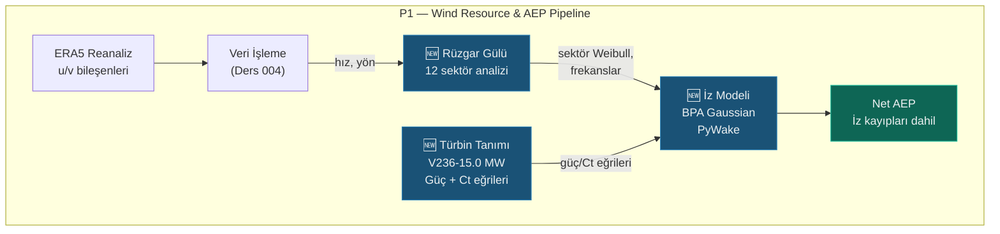

# Ders 005 — Rüzgar Gülü Analizi ve PyWake İz (Wake) Modellemesi

!!! abstract "Ders Navigasyonu"
    :material-arrow-left: **Önceki:** [Ders 004 — P1: Veritabanı, ERA5 & Weibull](lesson-004.md) | **Sonraki:** [Ders 006 — Yerleşim Optimizasyonu, Blokaj & AEP Kaskadı](lesson-006.md) :material-arrow-right:

    **Faz:** P1 | **Dil:** Türkçe | **İlerleme:** 6 / 6 | [Tüm Dersler](index.md) | [Öğrenme Yol Haritası](../Learning_Roadmap.md)

> **Date:** 2026-02-24
> **Commits:** 1 commit (`c7ab018`)
> **Commit range:** `bb84814a0a0bf528dd78c95d42e6341e50b89bb5..c7ab0188b07035ec2875942e5667d67c7cadba67`
> **Phase:** P1 (Wind Resource & AEP)
> **Roadmap sections:** [Phase 1 — Section 1.1 Wind Resource Assessment, Section 1.2 Wake Modelling & Layout Optimization]
> **Language:** Turkish
> **Previous lesson:** Lesson 004
> **last_commit_hash:** c7ab0188b07035ec2875942e5667d67c7cadba67

---

## Ne Öğreneceksiniz

- Rüzgar gülü analizinin (wind rose) temel fiziğini: yön sınıflandırma, sektör frekansları ve enerji gülü (kübik yasa)
- Dairesel istatistiğin (circular statistics) neden geleneksel ortalamadan farklı olduğunu — Mardia formülü
- Bastankhah-Porté-Agel (BPA) Gaussian iz (wake) modelinin arkasındaki fiziği
- Vestas V236-15.0 MW güç ve itme katsayısı (Ct) eğrilerinin nasıl tanımlandığını ve fiziksel kısıtlamalarını
- PyWake kütüphanesi ile iz analizi çalıştırarak brüt/net AEP, iz kaybı ve kapasite faktörü hesaplamayı

---

## Bölüm 1: Rüzgar Gülü — Yön Sınıflandırma ve Sektör Frekansları

### Gerçek Hayat Problemi

Bir deniz feneri bekçisi düşünün. Her gece rüzgarın hangi yönden estiğini günlüğüne not ediyor. Yıl sonunda bu notlara bakarak "rüzgar en çok batıdan esiyor, ama güneydoğudan estiğinde çok daha sert" gibi bir sonuç çıkarıyor. İşte rüzgar gülü analizi tam olarak bunu yapar — ama binlerce ölçümle, matematiksel olarak.

Bir rüzgar çiftliğinde türbinleri nereye koyacağınızı belirlemek için sadece "ortalama rüzgar hızı" yetmez. Rüzgarın **hangi yönden, ne sıklıkla, ne hızda** estiğini bilmeniz gerekir. Bu bilgi olmadan türbinleri yanlış yerleştirirsiniz — ve birbirlerinin rüzgarını keserler.

### Standartlar Ne Diyor

**IEC 61400-12-1** (rüzgar türbini güç performansı ölçümü) rüzgar gülü analizinin en az 12 sektör (her biri 30°) kullanmasını önerir. Endüstri standardı olarak 12 sektör yaygındır; bazı detaylı çalışmalarda 16 sektör (22.5°) kullanılır. Sektör sınırları, sektör merkezinden yarım sektör genişliği kadar ötelenerek belirlenir — böylece Kuzey (0°) tam olarak sektör 0'ın merkezinde kalır.

### Ne İnşa Ettik

**Değiştirilen dosyalar:**

- `backend/app/services/p1/wind_analysis.py` — Rüzgar gülü analiz modülü: sektör sınıflandırma, frekans, ortalama hız, sektör Weibull, enerji gülü, dairesel standart sapma
- `backend/tests/test_wind_analysis.py` — 24 birim testi: her fonksiyon için sınır koşulları ve fizik doğrulaması

Modül şu pipeline'ı uygular:

1. **Yön sınıflandırma** — Her ölçümü 12 sektörden birine ata
2. **Frekans hesaplama** — Her sektörün toplam zaman içindeki oranı
3. **Sektör ortalama hızı** — Her yön için ayrı ortalama
4. **Sektör Weibull fit** — Her yön için ayrı Weibull dağılımı (Ders 004'ten gelen `fit_weibull` fonksiyonunu yeniden kullanır)
5. **Enerji gülü** — Kübik yasa ile her sektörün enerji katkısı
6. **Dairesel standart sapma** — Yön değişkenliğinin ölçüsü

### Neden Önemli

> **Neden** rüzgar yönünü sektörlere ayırıyoruz?
> Çünkü sürekli bir açı dağılımı ile çalışmak hesaplama açısından maliyetli ve gereksiz. IEC 61400-12-1 standartında 30°'lik sektörler yeterli çözünürlüğü sağlar. Daha ince sektörler (22.5°) istatistiksel güvenilirliği azaltır — her sektöre düşen veri noktası sayısı yetersiz kalabilir.

> **Neden** sektör 0, kuzey yönünün tam ortasına hizalanıyor?
> Navigasyon ve meteoroloji geleneği: 0° = Kuzey. Yarım sektör genişliği kaydırma (offset) uygulanmazsa, 359° ile 1° arasındaki rüzgarlar farklı sektörlere düşer — bu fiziksel olarak anlamsızdır.

### Kod İncelemesi

Sektör sınıflandırma fonksiyonu, yarım sektör kaydırması ile 0°/360° sınır problemini çözer:

```python
def classify_direction_sector(
    directions_deg: NDArray[np.floating],
    num_sectors: int = 12,
) -> NDArray[np.intp]:
    sector_width_deg = 360.0 / num_sectors        # 12 sektör → 30° genişlik
    # Yarım sektör kaydırması: 0° kuzey, sektör 0'ın merkezinde kalır
    shifted = (directions_deg + sector_width_deg / 2.0) % 360.0
    indices = (shifted / sector_width_deg).astype(np.intp)
    # Kayan nokta kenar durumu: 360° tam sınırda kalırsa clamp
    indices = np.clip(indices, 0, num_sectors - 1)
    return indices
```

Kaydırma olmadan sektör 0, 0°–30° arasını kapsar — yani 355° kuzey rüzgarı sektör 11'e (330°–360°) düşer ve 5° kuzey rüzgarı sektör 0'a düşer. Kaydırma ile sektör 0, 345°–15° arasını kapsar ve "kuzeyden esen rüzgar" tek bir sektörde toplanır.

Sektör frekansları ise `np.bincount` ile son derece verimli hesaplanır — her sektördeki ölçüm sayısı toplam ölçüm sayısına bölünür:

```python
def compute_sector_frequencies(
    sector_indices: NDArray[np.intp],
    num_sectors: int,
) -> NDArray[np.floating]:
    counts = np.bincount(sector_indices, minlength=num_sectors).astype(np.float64)
    total = counts.sum()
    if total == 0:
        return np.zeros(num_sectors, dtype=np.float64)
    return counts / total  # Toplamı 1.0'a normalize et
```

Frekanslar toplamının 1.0 olması fiziksel bir zorunluluktur — rüzgar mutlaka bir yönden esmelidir. Test suite'inde bu kısıt `pytest.approx(1.0, abs=1e-10)` ile doğrulanır.

### Temel Kavram

!!! tip "Temel Kavram: Rüzgar Gülü (Wind Rose)"
    **Basit anlatım:** Bir pusula düşünün. Etrafına çubuklar çiziyorsunuz — her çubuğun uzunluğu, o yönden ne kadar sık rüzgar estiğini gösteriyor. Uzun çubuk = sık rüzgar. Bu çizim rüzgar gülüdür.

    **Benzetme:** Bir şehirdeki trafik akışı gibi düşünün. Bazı yollar (yönler) daha yoğun, bazıları boş. Trafik mühendisi yoğun yollara geniş kavşak yapar — rüzgar mühendisi de baskın rüzgar yönüne türbinleri hizalar.

    **Bu projede:** Polonya Baltık Denizi'nde baskın rüzgar yönü WSW (~240°) civarıdır. 34 türbinimizi bu yöne dik yerleştirerek iz kayıplarını minimize etmeliyiz.

---

## Bölüm 2: Enerji Gülü — Kübik Yasa ve Rüzgarın Gerçek Gücü

### Gerçek Hayat Problemi

İki kasaba düşünün: birinde rüzgar her gün hafifçe esiyor (5 m/s), diğerinde ise haftada bir gün fırtına kopar (20 m/s), geri kalan günler sakin. Hangisinde rüzgar çiftliği kurarsınız? Ortalama hız benzer olsa bile, fırtınalı kasabadaki rüzgar **8 kat** daha fazla enerji taşır — çünkü rüzgar enerjisi hızın **küpüyle** orantılıdır.

### Standartlar Ne Diyor

Rüzgar enerjisinin kübik bağıntısı temel aerodinamik fizikten gelir. Rüzgar gücü denklemi: P = ½ρAv³ (burada ρ hava yoğunluğu, A süpürme alanı, v rüzgar hızı). Bu bağıntı **European Wind Atlas** (Risø, 1989) metodolojisinde enerji gülü hesaplamasının temeli olarak kullanılır.

### Ne İnşa Ettik

Enerji gülü fonksiyonu, her sektörün **toplam enerjiye katkısını** hesaplar:

```python
def compute_energy_rose(
    frequencies: NDArray[np.floating],
    mean_speeds_ms: NDArray[np.floating],
) -> NDArray[np.floating]:
    # NaN hızları sıfıra çevir (boş sektörler)
    speeds_clean = np.where(np.isnan(mean_speeds_ms), 0.0, mean_speeds_ms)
    # Kübik yasa: E_i ∝ f_i × v̄_i³
    energy_raw = frequencies * speeds_clean**3
    total_energy = energy_raw.sum()
    if total_energy == 0:
        return np.zeros_like(frequencies)
    return energy_raw / total_energy  # Toplam = 1.0
```

Formülün matematiği basit ama sonuçları çarpıcıdır. Test kodunda bu kübik etkiyi doğruluyoruz:

```python
def test_high_speed_sector_dominates(self):
    """Yüksek hızlı sektör enerjiyi domine etmeli (kübik yasa)."""
    freqs = np.array([0.5, 0.5])       # Eşit frekans
    speeds = np.array([5.0, 10.0])     # 10 m/s → 5 m/s'nin 8 katı enerji
    energy = compute_energy_rose(freqs, speeds)
    # Enerji oranı: 10³/5³ = 8, sektör 1 → 8/(1+8) ≈ 0.889
    assert energy[1] == pytest.approx(8.0 / 9.0, abs=0.001)
```

İki sektör eşit sıklıkta rüzgar alıyor ama hızlar 5 ve 10 m/s. Enerji dağılımı 50/50 değil — **11/89**. 10 m/s'lik sektör toplam enerjinin %89'unu taşır. Bu, türbin yerleşiminde "frekans" kadar "hız"ın kritik olduğunu gösterir.

### Neden Önemli

> **Neden** frekans gülü yetmez, enerji gülüne ihtiyaç var?
> Çünkü türbin gelir üretir, frekans üretmez. Bir sektör zamanın %40'ında rüzgar alabilir ama düşük hızda. Başka bir sektör zamanın %10'unda rüzgar alır ama yüksek hızda — ve kübik yasa nedeniyle çok daha fazla enerji üretir. Türbinleri enerji gülüne göre optimize etmek, yıllık enerji üretimini (AEP) maksimize eder.

> **Neden** NaN hızları sıfır yerine koyduk?
> Boş sektörler (veri olmayan yönler) fiziksel olarak "enerji üretmez" anlamına gelir. NaN ile çarpım NaN verir ve toplamı bozar. Sıfıra çevirmek, bu sektörlerin enerji katkısını doğru şekilde sıfırlar.

### Temel Kavram

!!! tip "Temel Kavram: Kübik Yasa (Cubic Law)"
    **Basit anlatım:** Rüzgar hızı 2 katına çıkarsa, taşıdığı enerji 8 katına çıkar (2³ = 8). Bu yüzden hafif bir esintiden fırtınaya geçiş, enerji açısından devasa bir sıçramadır.

    **Benzetme:** Su musluğunu düşünün. Suyu iki kat daha hızlı akıtırsanız, basıncı 8 kat artırırsınız — elinizi musluğun altına koyduğunuzda bunu hissedersiniz. Rüzgar da aynı şekilde çalışır.

    **Bu projede:** Baltık Denizi'nde ortalama 10.5 m/s'lik Weibull A parametresi, kübik yasa nedeniyle yüksek enerji potansiyeli anlamına gelir. V236-15.0 MW'ın 11.1 m/s'de nominal güce ulaşması, bu bölgedeki rüzgar rejiminin türbinle ne kadar uyumlu olduğunu gösterir.

---

## Bölüm 3: Dairesel İstatistik — 0°/360° Sınır Problemi

### Gerçek Hayat Problemi

Bir saat düşünün. Saat 23:50 ile 00:10 arasında sadece 20 dakika var. Ama "sayısal olarak" bakarsanız, 23:50 ile 0:10 arasında fark 23 saat 40 dakika görünür. Aynı problem rüzgar yönlerinde de var: 355° ile 5° arasındaki fark 10° mi, 350° mi?

Geleneksel aritmetik ortalama bu durumda çöker. 355° ve 5°'nin ortalaması (355+5)/2 = 180° verir — tam güney! Oysa doğru cevap 0° (kuzey) olmalıdır. İşte dairesel istatistik bu problemi çözer.

### Standartlar Ne Diyor

**Mardia, K.V. (1972)** — *Statistics of Directional Data* kitabı, dairesel istatistiğin temel referansıdır. Rüzgar mühendisliğinde yön değişkenliğini ölçmek için Mardia'nın dairesel standart sapma formülü kullanılır. Bu formül, ortalama sonuç vektörü uzunluğu (R̄) üzerinden tanımlanır.

### Ne İnşa Ettik

```python
def compute_circular_std_deg(
    directions_deg: NDArray[np.floating],
) -> float:
    if len(directions_deg) == 0:
        return 0.0

    # Açıları birim çembere yansıt
    theta_rad = np.deg2rad(directions_deg)
    mean_cos = float(np.mean(np.cos(theta_rad)))
    mean_sin = float(np.mean(np.sin(theta_rad)))

    # Ortalama sonuç vektörü uzunluğu
    r_bar = np.sqrt(mean_cos**2 + mean_sin**2)

    # R̄ = 0 → tam düzgün dağılım, log(0) hatası → clamp
    r_bar = max(r_bar, 1e-10)

    # Mardia formülü: σ_c = √(-2 × ln(R̄))
    circular_std_rad = np.sqrt(-2.0 * np.log(r_bar))
    return float(np.degrees(circular_std_rad))
```

Formülün matematiği birim çember (unit circle) üzerine kuruludur. Her açı (θ), çember üzerinde bir nokta olarak temsil edilir: (cos θ, sin θ). Tüm noktaların ortalaması alınırsa, ortaya çıkan **sonuç vektörünün uzunluğu** (R̄), yönlerin ne kadar "toplanmış" olduğunu gösterir:

- **R̄ ≈ 1** → Tüm yönler aynı → σ_c ≈ 0° (çok düşük yayılım)
- **R̄ ≈ 0** → Yönler tamamen düzgün dağılmış → σ_c büyük (~81°)

Bu değer test suite'inde doğrulanır: sabit yön → σ_c ≈ 0°, düzgün dağılım → σ_c > 70°.

### Neden Önemli

> **Neden** aritmetik ortalama yerine dairesel istatistik kullanıyoruz?
> Açılar mod 360 aritmetiğine tabidir. 355° ile 5° arasındaki doğru mesafe 10°'dir ama aritmetik fark 350° verir. `np.cos` ve `np.sin` dönüşümleri, açıları Öklid uzayına yansıtarak bu sarmal (wrap-around) problemini ortadan kaldırır.

> **Neden** R̄'yi 1e-10 ile sınırlıyoruz (clamping)?
> Tam düzgün dağılımda R̄ = 0 olur ve `log(0)` tanımsızdır (−∞). Sayısal hesaplamada bu `NaN` veya `inf` üretir. 1e-10 clamp, fiziksel olarak anlamlı bir üst sınır (≈ 86°) verir ve programın çökmesini önler.

### Temel Kavram

!!! tip "Temel Kavram: Dairesel İstatistik (Circular Statistics)"
    **Basit anlatım:** Normal sayılarla ortalama almak bir çizgi üzerinde çalışır. Ama pusula yönleri bir daire üzerindedir — 360°'den sonra tekrar 0°'a dönüyorsunuz. Dairesel istatistik, bu "daire üzerindeki sayılar" için özel matematik kullanır.

    **Benzetme:** Bir dönme dolap düşünün. "3 numara" ve "11 numara" kabini arasındaki mesafeyi hesaplarken, 12 numaralı kabinden geçip kısa yoldan gidebilirsiniz. Dairesel istatistik bu "kısa yolu" otomatik olarak bulur.

    **Bu projede:** Polonya Baltık'ında dairesel standart sapma ~60-80° bekliyoruz (orta düzeyde yön yayılımı). Bu değer, türbinlerin tek bir yöne göre mi (düşük σ_c) yoksa çok yöne göre mi (yüksek σ_c) optimize edileceğini belirler.

---

## Bölüm 4: V236-15.0 MW Güç ve İtme Katsayısı Eğrileri

### Gerçek Hayat Problemi

Bir otomobilin motor haritasını (torque map) düşünün. Gaz pedalına ne kadar basarsanız, motor belirli bir devir aralığında güç üretir. Ama bir alt sınır var (rölanti altında motor durur) ve bir üst sınır var (kırmızı bölgede güvenlik sistemi müdahale eder). Rüzgar türbini de aynıdır: belirli hız aralığında elektrik üretir ve bu hız-güç ilişkisi **güç eğrisi** (power curve) ile tanımlanır.

### Standartlar Ne Diyor

**IEC 61400-12-1:2017** güç eğrisi ölçüm metodolojisini tanımlar. Her türbin üreticisi, sertifikalı güç eğrisini bu standarda göre sağlar. Güç eğrisinde üç kritik hız vardır:

- **Cut-in (devreye giriş):** 3 m/s — altında türbin dönmez
- **Rated (nominal):** 11.1 m/s — nominal güce (15 MW) ulaşılır
- **Cut-out (devre dışı):** 31 m/s — güvenlik nedeniyle türbin durur

### Ne İnşa Ettik

**Değiştirilen dosyalar:**

- `backend/app/services/p1/wake_model.py` — V236-15.0 MW güç/Ct eğrileri + PyWake entegrasyonu

Güç eğrisi, doğrusal interpolasyon (linear interpolation) ile tablodan hesaplanır ve fiziksel kısıtlamalar uygulanır:

```python
def get_v236_power_curve_kw(
    wind_speeds_ms: NDArray[np.floating],
) -> NDArray[np.floating]:
    # Tablo verilerinden doğrusal interpolasyon
    power_kw = np.interp(wind_speeds_ms, _POWER_CURVE_SPEEDS_MS, _POWER_CURVE_KW)

    # Fizik kırpma (Rule 1: fiziksel kısıtlamalar tartışılmaz)
    power_kw = np.clip(power_kw, 0.0, RATED_POWER_KW)          # 0 ≤ P ≤ 15,000 kW
    power_kw = np.where(wind_speeds_ms < CUT_IN_SPEED_MS, 0.0, power_kw)   # < 3 m/s → 0
    power_kw = np.where(wind_speeds_ms > CUT_OUT_SPEED_MS, 0.0, power_kw)  # > 31 m/s → 0

    return power_kw.astype(np.float64)
```

Üç katmanlı güvenlik şeması uygulanıyor: ilk olarak `np.clip` ile güç asla 0'ın altına veya 15,000 kW'ın üstüne çıkamaz. Sonra cut-in altındaki hızlar sıfırlanır. Son olarak cut-out üstündeki hızlar sıfırlanır. Bu "kemer ve askı" (belt-and-suspenders) yaklaşımı, **Rule 1** — fiziksel kısıtlamalar tartışılmazdır kuralını uygular.

İtme katsayısı (thrust coefficient, Ct) eğrisi de benzer yapıdadır ancak farklı bir fiziksel anlam taşır:

```python
def get_v236_ct_curve(
    wind_speeds_ms: NDArray[np.floating],
) -> NDArray[np.floating]:
    ct = np.interp(wind_speeds_ms, _CT_CURVE_SPEEDS_MS, _CT_CURVE_VALUES)
    ct = np.clip(ct, 0.0, 1.0)           # 0 ≤ Ct ≤ 1 (fiziksel sınır)
    ct = np.where(wind_speeds_ms < CUT_IN_SPEED_MS, 0.0, ct)
    ct = np.where(wind_speeds_ms > CUT_OUT_SPEED_MS, 0.0, ct)
    return ct.astype(np.float64)
```

Ct eğrisinin önemli bir özelliği: cut-in yakınında Ct çok yüksektir (~0.90), rated hızda ise düşüktür (~0.28). Bu, düşük hızlarda türbinin rüzgardan çok fazla momentum çektiğini, yüksek hızlarda ise daha "şeffaf" hale geldiğini gösterir.

### Neden Önemli

> **Neden** güç eğrisini tablo + interpolasyon olarak tanımlıyoruz, analitik fonksiyon olarak değil?
> Gerçek türbin güç eğrileri karmaşık aerodinamik etkiler nedeniyle düzgün bir analitik fonksiyonla ifade edilemez. Üretici verileri tablo formatında gelir. `np.interp` ile doğrusal interpolasyon, endüstri standardı yaklaşımdır ve türetilmiş hatalardan kaçınır.

> **Neden** Ct eğrisi wake (iz) modellemesi için kritiktir?
> İz modelleri, aşağı akıştaki (downstream) hız açığını hesaplamak için Ct değerini kullanır. BPA formülünde: ΔU/U₀ ∝ √(Ct). Yanlış Ct eğrisi → yanlış iz genişliği → yanlış AEP hesabı → yanlış yatırım kararı.

### Temel Kavram

!!! tip "Temel Kavram: İtme Katsayısı (Thrust Coefficient, Ct)"
    **Basit anlatım:** Ct, türbinin rüzgara ne kadar "direndiğini" gösteren bir sayıdır. Ct = 1 olsa, türbin rüzgarı tamamen durdurur (fiziksel olarak imkansız). Ct = 0 olsa, türbin görünmez — rüzgar hiç yavaşlamaz.

    **Benzetme:** Elinizi arabanın camından dışarı uzatın. Avuç içinizi rüzgara çevirdiğinizde (yüksek Ct) çok direnç hissedersiniz. Elinizi yana çevirdiğinizde (düşük Ct) direnç azalır.

    **Bu projede:** V236-15.0 MW'ın Ct değeri cut-in'de ~0.90, rated'de ~0.28. Bu demektir ki düşük hızlarda türbin arkasında ciddi iz oluşur, yüksek hızlarda ise iz etkisi azalır. İz kayıpları hesaplanırken bu hız bağımlılığı kritiktir.

---

## Bölüm 5: PyWake ile BPA Gaussian İz Modeli

### Gerçek Hayat Problemi

Bir yolcu gemisinin arkasındaki iz suyunu düşünün. Gemi geçtikten sonra su yüzeyinde uzun bir türbülans izi kalır. Bu iz, arkadaki kayığı sallar ve ilerlemesini zorlaştırır. Rüzgar türbinleri de aynı etkiyi yaratır: rüzgardan enerji çekerken, arkalarında daha yavaş ve daha türbülanslı bir rüzgar bölgesi bırakırlar. Bu **iz etkisi** (wake effect), aşağı akıştaki türbinlerin daha az enerji üretmesine neden olur.

### Standartlar Ne Diyor

**Bastankhah & Porté-Agel (2014)** — *Journal of Fluid Mechanics*, 781, 706-730 makalesi, Gaussian iz modelinin referans çalışmasıdır. Model üç temel denklem üzerine kuruludur:

1. **İz açığı (wake deficit):** ΔU/U₀ = (1 - √(1 - Ct/(8(σ/D)²)))
2. **İz genişlemesi (wake expansion):** σ(x) = k*x + D/√8, burada k* = 0.3837·TI + 0.003678
3. **Doğrusal süperpozisyon (linear superposition):** Toplam açık = Σ bireysel açıklar

Bu yaklaşım, DTU Wind Energy tarafından geliştirilen **PyWake** kütüphanesinde `BastankhahGaussianDeficit` olarak implemente edilmiştir.

### Ne İnşa Ettik

PyWake entegrasyonu üç katmanlı bir mimari kullanır: **Site** (rüzgar kaynağı) → **Turbine** (makine tanımı) → **Wake Model** (iz simülasyonu).

```python
def configure_wake_model(site: Any, turbine: Any) -> Any:
    from py_wake.deficit_models.gaussian import BastankhahGaussianDeficit
    from py_wake.superposition_models import LinearSum
    from py_wake.turbulence_models import STF2017TurbulenceModel
    from py_wake.wind_farm_models import All2AllIterative

    return All2AllIterative(
        site=site,
        windTurbines=turbine,
        wake_deficitModel=BastankhahGaussianDeficit(),  # BPA Gaussian deficit
        superpositionModel=LinearSum(),                  # Doğrusal toplam
        turbulenceModel=STF2017TurbulenceModel(),       # Frandsen türbülans
    )
```

Modelin her bileşeninin bir fiziksel gerekçesi vardır:

- **All2AllIterative** — Her türbin çifti arasındaki iz etkisini hesaplar (iteratif, yakınsayana kadar)
- **BastankhahGaussianDeficit** — İz profilini Gaussian (çan eğrisi) olarak modelleyen açık modeli
- **LinearSum** — Birden fazla izin üst üste geldiğinde toplam etkisini hesaplar
- **STF2017TurbulenceModel** — Frandsen tabanlı türbülans modeli; izlerdeki artan türbülansı hesaplar

Simülasyon sonuçları yapılandırılmış bir veri sınıfında toplanır:

```python
def run_wake_analysis(x_positions_m, y_positions_m, site, turbine=None):
    # ... simülasyonu çalıştır ...

    # Kapasite faktörü: CF = net_AEP / (P_rated × 8760h × n_turbines)
    n_turbines = len(x_positions_m)
    theoretical_gwh = RATED_POWER_KW * 1e-6 * 8760.0 * n_turbines  # GWh
    capacity_factor = total_net_gwh / theoretical_gwh

    return WakeAnalysisResult(
        gross_aep_gwh=total_gross_gwh,      # İzsiz brüt enerji
        net_aep_gwh=total_net_gwh,          # İz kayıpları sonrası net enerji
        wake_loss_percent=wake_loss_pct,     # İz kaybı yüzdesi
        per_turbine_aep_gwh=...,            # Türbin başına net AEP
        per_turbine_wake_loss_percent=...,  # Türbin başına iz kaybı
        capacity_factor=capacity_factor,     # Net kapasite faktörü
    )
```

Kapasite faktörü formülü: CF = AEP_net / (P_rated × 8760 × n). Bu, türbinlerin teorik tam kapasiteye kıyasla ne kadar verimli çalıştığını gösterir. Baltık koşullarında (Weibull A=10.5, k=2.2) tek türbin için CF ≈ 0.45–0.50 bekliyoruz.

### Neden Önemli

> **Neden** Jensen/Park modeli yerine BPA Gaussian modeli tercih ettik?
> Jensen modeli (1983) iz profilini "top hat" (düz tepeli) olarak varsayar — izin içi tamamen açıklı, dışı sıfır. Gerçekte iz profili Gaussian'dır (merkezde yoğun, kenarlara doğru azalan). BPA modeli, rüzgar tüneli deneyleriyle doğrulanmış ve özellikle büyük modern türbinler için daha doğru sonuçlar verir.

> **Neden** `All2AllIterative` kullanıyoruz?
> Çünkü türbinler birbirlerinin izlerini etkiler (ikincil iz etkileri). Tek geçişli (non-iterative) modeller bu karşılıklı etkileşimi yakalayamaz. Iteratif yaklaşım, iz alanlarını güncelleyerek fiziksel olarak tutarlı bir denge durumuna yakınsar.

### Temel Kavram

!!! tip "Temel Kavram: İz Kaybı (Wake Loss)"
    **Basit anlatım:** Arkadaki türbin, öndeki türbinin "artık rüzgarını" kullanır. Bu artık rüzgar daha yavaş olduğu için, arkadaki türbin daha az elektrik üretir. Bu fark "iz kaybı"dır.

    **Benzetme:** Bisiklet yarışında "drafting" (slipstream) yapan bisikletçi daha az rüzgar direnci hisseder — ama bu durumda iyi bir şey. Türbinlerde tam tersi: arkadaki türbin daha AZ enerji alır çünkü öndeki türbin rüzgarın enerjisini çekmiştir.

    **Bu projede:** 34 türbinlik çiftliğimizde tipik iz kaybı %5-10 aralığında beklenir. 510 MW × 8760 saat × CF 0.45 ≈ 2,009 GWh brüt. %8 iz kaybı → ~161 GWh kayıp → yılda yaklaşık €12M gelir kaybı (€75/MWh ile). Bu yüzden türbin yerleşimi optimizasyonu kritiktir.

---

## Bölüm 6: Rüzgar Gülünden İz Analizine — Pipeline Entegrasyonu

### Gerçek Hayat Problemi

Bir restoran mutfağını düşünün. Malzeme tedarikçisi (ERA5 verisi) → şef (veri işleme) → reçete (fizik modelleri) → tabak sunum (sonuç) zinciri vardır. Her halka bir öncekine bağlıdır. Rüzgar gülü analizi ile iz modellemesi arasındaki bağlantı da aynı mantıkla çalışır: rüzgar gülü sonuçları, PyWake site nesnesine dönüştürülerek iz simülasyonuna beslenir.

### Ne İnşa Ettik

`create_site_from_wind_rose` fonksiyonu, rüzgar gülü analizinin çıktısını PyWake'in anlayacağı formata çevirir:

```python
def create_site_from_wind_rose(
    wind_rose_result: object,
    turbulence_intensity: float = 0.06,
) -> Any:
    wr = wind_rose_result
    num_sectors = wr.num_sectors

    sector_a = np.zeros(num_sectors, dtype=np.float64)
    sector_k = np.zeros(num_sectors, dtype=np.float64)
    for i in range(num_sectors):
        weibull_i = wr.sector_weibull[i]
        if weibull_i is not None:
            sector_a[i] = weibull_i.scale_a_ms
            sector_k[i] = weibull_i.shape_k
        else:
            # Fallback: genel ortalama hız ve k=2.0
            sector_a[i] = float(np.nanmean(wr.mean_speeds_ms))
            sector_k[i] = 2.0

    return UniformWeibullSite(
        p_wd=wr.frequencies,  # Sektör frekansları → yön ağırlıkları
        a=sector_a,           # Sektör Weibull A → hız dağılımı
        k=sector_k,           # Sektör Weibull k → şekil parametresi
        ti=turbulence_intensity,
    )
```

Bu fonksiyon, Ders 004'te oluşturduğumuz Weibull parametrelerini doğrudan kullanır — modüler tasarımın gücü burada ortaya çıkar. `fit_weibull` (Ders 004) → `WindRoseResult.sector_weibull` (Bu ders, Bölüm 1) → `create_site_from_wind_rose` (Bu bölüm) → PyWake simülasyonu (Bölüm 5).

Weibull fit'i başarısız olan sektörler için (yetersiz veri) akıllı bir fallback stratejisi uygulanır: genel ortalama hız ve varsayılan k=2.0 (Rayleigh dağılımı — rüzgar mühendisliğinde en yaygın varsayılan şekil parametresi).

### Neden Önemli

> **Neden** uniform site yerine wind rose tabanlı site kullanmalıyız?
> Uniform site, rüzgarın tüm yönlerden eşit estiğini varsayar — gerçek dünyada bu neredeyse hiç doğru değildir. Baltık'ta baskın WSW rüzgarı, yönsel iz kayıplarını dramatik şekilde etkiler. Wind rose tabanlı site, gerçek yönsel dağılımı kullanarak %2-5 daha doğru AEP tahmini verir.

> **Neden** başarısız fit'ler için k=2.0 fallback kullanıyoruz?
> k=2.0 özel bir değerdir: Weibull dağılımı bu değerde Rayleigh dağılımına dönüşür. Rayleigh, rüzgar mühendisliğinde "ön bilgi yoksa en iyi varsayım" olarak kabul edilir. Bu, makul bir fallback seçimidir — ne aşırı iyimser ne de kötümser.

### Temel Kavram

!!! tip "Temel Kavram: Pipeline Entegrasyonu"
    **Basit anlatım:** Her modül (ERA5 → Weibull → wind rose → wake) bir boru hattı gibi çalışır. Bir modülün çıktısı, diğerinin girdisidir. Boru hattındaki her bağlantı noktasını temiz ve standardize tutarsanız, sistemi kolayca genişletebilirsiniz.

    **Benzetme:** LEGO tuğlaları gibi düşünün. Her parça belirli bir boyut standardına uyar. Farklı setlerden gelen parçalar birbirine takılabilir çünkü bağlantı noktaları aynıdır.

    **Bu projede:** `WindRoseResult` veri sınıfı, pipeline'daki "LEGO bağlantı noktası"dır. Wind analysis modülü bu formatta üretir, wake model modülü bu formattan okur. İleride layout optimizasyonu eklendiğinde de aynı bağlantıyı kullanacağız.

---

## Bağlantılar

**Bu kavramlar nerede devam edecek:**

- **Enerji gülü** (Bölüm 2) → P1 layout optimizasyonunda türbinler enerji gülünün baskın yönüne dik yerleştirilecek
- **İz kaybı** (Bölüm 5) → P1 AEP hesaplamasında brüt-net enerji kaskadının temel bileşeni olacak (P50/P75/P90 hesabı)
- **Kapasite faktörü** (Bölüm 5) → P1 LCOE hesaplamasında CF doğrudan gelir tahminine girdi olacak
- **Pipeline mimarisi** (Bölüm 6) → P2'de aynı pattern ile Pandapower yük akışı (load flow) pipeline'ı kurulacak

**Ders 004 bağlantısı:** Bu derste `fit_weibull` fonksiyonunu sektör bazında yeniden kullandık — Ders 004'te oluşturduğumuz fizik modülü, pipeline'ın bir parçası haline geldi.

---

## Büyük Resim

*Bu dersin odağı: **Rüzgar kaynağı verilerini yönsel olarak analiz etme ve iz modeliyle net enerji üretimine dönüştürme.***



*Tam sistem mimarisi için bkz. [Dersler Genel Bakış](index.md#system-architecture).*

---

## Önemli Çıkarımlar

1. Rüzgar gülü, rüzgar çiftliği tasarımının temel girdisidir — frekans gülü + enerji gülü birlikte türbin yerleşimini belirler.
2. Kübik yasa (P ∝ v³) nedeniyle hız farkları enerji farkına katlanarak yansır — 2 kat hız = 8 kat enerji.
3. Dairesel istatistik, 0°/360° sarmal problemini birim çember dönüşümüyle çözer — geleneksel ortalama yön verileri için kullanılamaz.
4. Ct eğrisi, iz modellemesinin en kritik girdisidir — düşük hızlarda yüksek Ct (güçlü iz), yüksek hızlarda düşük Ct (zayıf iz).
5. BPA Gaussian iz modeli, Jensen'in "top hat" varsayımını gerçekçi bir Gaussian profille değiştirir — büyük modern türbinler için doğruluk avantajı sağlar.
6. Pipeline mimarisi (wind rose → site → wake model → AEP) modüler tasarımı zorunlu kılar — her modülün girdisi ve çıktısı açıkça tanımlanmalıdır.
7. Fiziksel kısıtlamalar (P ≥ 0, P ≤ rated, Ct ∈ [0,1]) kodda çoklu güvenlik katmanıyla (clip + where) uygulanmalıdır — Rule 1 tartışılmaz.

---

## Önerilen Okumalar

*[Öğrenme Yol Haritası](../Learning_Roadmap.md) — Faz 1: Rüzgar Enerji Temelleri*

| Kaynak | Tür | Neden Okunmalı |
|--------|-----|----------------|
| Bastankhah & Porté-Agel (2014), *J. Fluid Mech.*, 781 | Akademik makale | Bu derste kullandığımız BPA Gaussian iz modelinin orijinal makalesi |
| Manwell, McGowan, Rogers — *Wind Energy Explained* (3. baskı) | Ders kitabı | Bölüm 2-3: Rüzgar kaynağı ve rüzgar gülü metodolojisi |
| PyWake Documentation (DTU Wind Energy) | Yazılım belgeleri | py-wake.readthedocs.io — wake model konfigürasyonu ve örnek notebook'lar |
| DTU Wind Energy — *Wake Modelling and Simulation* | Video dersleri | YouTube'da ücretsiz — iz fiziğinin görsel açıklaması |
| Burton et al. — *Wind Energy Handbook* (3. baskı, 2021) | Referans kitap | Bölüm 1-4: Rüzgar kaynağı değerlendirme ve iz modelleme temelleri |

---

## Sınav — Anlayışınızı Test Edin

### Hatırlama Soruları

**S1:** IEC 61400-12-1 standardına göre rüzgar gülü analizi için kaç sektör kullanılması önerilir ve her sektör kaç derecelik açı kapsar?

<details>
<summary>Cevap</summary>

12 sektör önerilir ve her biri 30°'lik açı kapsar (360° / 12 = 30°). Bazı detaylı çalışmalarda 16 sektör (22.5°) kullanılır, ancak 12 sektör endüstri standardıdır çünkü istatistiksel güvenilirlik ile yön çözünürlüğü arasında optimal dengeyi sağlar.

</details>

**S2:** V236-15.0 MW türbininin cut-in, rated ve cut-out hızları nelerdir ve rated hızdaki itme katsayısı (Ct) yaklaşık kaçtır?

<details>
<summary>Cevap</summary>

Cut-in: 3 m/s, rated: 11.1 m/s, cut-out: 31 m/s. Rated hızdaki Ct yaklaşık 0.28'dir. Ct'nin düşük hızlarda (~0.90) çok yüksek, yüksek hızlarda düşük olması, türbinin düşük hızlarda rüzgardan daha fazla momentum çektiğini gösterir.

</details>

**S3:** `compute_circular_std_deg` fonksiyonunda R̄ nedir ve sıfıra eşit olduğunda ne anlama gelir?

<details>
<summary>Cevap</summary>

R̄ (ortalama sonuç vektörü uzunluğu), tüm yön ölçümlerinin birim çember üzerindeki ortalama vektörünün büyüklüğüdür. R̄ = 0 olması, yönlerin tamamen düzgün dağıldığı — yani rüzgarın tüm yönlerden eşit sıklıkta estiği anlamına gelir. Bu durumda dairesel standart sapma maksimum değerine (~81°) ulaşır.

</details>

### Anlama Soruları

**S4:** Eşit frekanslı iki sektörde rüzgar hızları 6 m/s ve 12 m/s ise, enerji gülünde bu iki sektörün enerji katkı oranı nedir? Hesaplama adımlarını gösterin.

<details>
<summary>Cevap</summary>

Kübik yasa: E_i ∝ f_i × v̄_i³. Her iki sektörün frekansı eşit (f₁ = f₂ = 0.5) olduğundan, enerji oranı sadece hızların küpüne bağlıdır. E₁ ∝ 0.5 × 6³ = 0.5 × 216 = 108. E₂ ∝ 0.5 × 12³ = 0.5 × 1728 = 864. Toplam = 972. Sektör 1 payı: 108/972 = %11.1. Sektör 2 payı: 864/972 = %88.9. Hız iki katına çıkmasına rağmen, enerji katkısı 8 kat fazladır — bu kübik yasanın doğrudan sonucudur.

</details>

**S5:** Neden Jensen/Park modeli yerine BPA Gaussian modeli tercih edilmiştir? İki model arasındaki temel fiziksel fark nedir?

<details>
<summary>Cevap</summary>

Jensen modeli (1983) iz profilini "top hat" (dikdörtgen) şeklinde varsayar — izin içinde sabit bir hız açığı, dışında sıfır. Gerçekte rüzgar tüneli deneyleri, iz profilinin merkezde yoğun, kenarlara doğru azalan bir Gaussian (çan eğrisi) şeklinde olduğunu göstermiştir. BPA modeli bu gerçekçi profili yakalayarak, özellikle büyük rotor çaplı modern türbinler (V236 gibi, D=236 m) için daha doğru iz genişliği ve açık hesabı sağlar. Sonuç olarak AEP tahmini %1-3 daha doğru olur.

</details>

**S6:** `create_site_from_wind_rose` fonksiyonunda Weibull fit başarısız olan sektörler için neden k=2.0 varsayılan değeri kullanılıyor? k=2.0'ın istatistiksel önemi nedir?

<details>
<summary>Cevap</summary>

k=2.0 özel bir değerdir: Bu değerde Weibull dağılımı, Rayleigh dağılımına dönüşür. Rayleigh dağılımı, rüzgar mühendisliğinde "ön bilgi yokken en iyi varsayım" olarak kabul edilen standart dağılımdır (IEC 61400-1'de referans olarak kullanılır). Ne aşırı dar (yüksek k) ne de aşırı geniş (düşük k) bir hız dağılımı varsayar. Bu, veri yetersizliğinde makul bir fallback seçimidir — projeyi felce uğratmadan analize devam etmeyi sağlar.

</details>

### Zorluk Sorusu

**S7:** 34 türbinlik Baltic Wind çiftliğimizde, baskın WSW (~240°) rüzgar yönü düşünüldüğünde, uniform site ile wind rose tabanlı site arasında AEP tahmininde ne gibi farklar beklenir? Bu fark hangi türbinleri en çok etkiler ve neden?

<details>
<summary>Cevap</summary>

Uniform site, rüzgarın tüm yönlerden eşit estiğini varsayar ve iz kayıplarını yönsel olarak ortalar. Wind rose tabanlı site ise baskın WSW yönünü ağırlıklı olarak simüle eder. Bu durumda WSW yönünde hizalanmış türbin sıraları çok daha fazla iz etkisi görür — çünkü zamanın büyük çoğunluğunda rüzgar bu yönden esiyor.

Pratik etki: (1) Baskın yön üzerindeki arka sıra türbinlerinin AEP'i %8-15 düşer (uniform modelde bu %3-5 olarak hafife alınır). (2) Baskın yöne dik konumdaki türbinler neredeyse hiç iz etkisi görmez. (3) Çiftlik toplam AEP'i wind rose modelinde genellikle %2-5 daha düşük çıkar çünkü gerçek yönsel iz yığılması (directional wake stacking) yakalanır.

Bu fark özellikle finansal modellemeyi etkiler: %3 AEP farkı, 510 MW çiftlikte yılda ~60 GWh ≈ €4.5M gelir farkına karşılık gelir. Bu yüzden bankalar wind rose tabanlı analiz talep eder — uniform model yetersizdir.

</details>

---

## Mülakat Köşesi

### Basit Açıklama
*"Rüzgar gülü analizi ve iz modellemesini mühendis olmayan birine nasıl anlatırsınız?"*

Diyelim ki bir tarlanız var ve rüzgar değirmenleri kurmak istiyorsunuz. İlk sorunuz "rüzgar genelde nereden esiyor?" olacaktır. Bunu anlamak için bir yıl boyunca bir rüzgar ölçer koyarsınız ve her saat rüzgarın yönünü ve hızını kaydedersiniz. Yıl sonunda bu verileri bir pusula üzerinde grafik yaparsınız — bu "rüzgar gülü"dür. Gülün uzun kolları, rüzgarın en sık estiği yönleri gösterir.

Ama bir sorun daha var: değirmenleri çok yakın koyarsanız, öndeki değirmen arkadakinin rüzgarını "çalar." Tıpkı bir kamyonun arkasında giderken rüzgarı hissetmemeniz gibi. Buna "iz etkisi" denir. Bilgisayar modelimiz, her değirmenin arkasındaki rüzgar kaybını hesaplar ve değirmenleri birbirinden ne kadar uzağa koymamız gerektiğini söyler. Sonuç olarak çiftliğin yılda ne kadar elektrik üreteceğini tahmin edebiliriz — bu da yatırımcılara "bu proje para kazandırır mı?" sorusunun cevabını verir.

### Teknik Açıklama
*"Rüzgar gülü analizi ve iz modellemesini bir iş görüşmesinde nasıl anlatırsınız?"*

Rüzgar gülü analizi, hub-yüksekliği zaman serilerini yönsel bir kaynak karakterizasyonuna dönüştürür. IEC 61400-12-1 uyumlu 12 sektörlü analiz yaparak sektör frekansları, ortalama hızlar ve sektör bazında Weibull fit uygularız. Enerji gülü, kübik yasa (P ∝ v³) ile her sektörün enerji katkısını nicelleştirir. Dairesel istatistikler için Mardia formülünü (σ_c = √(-2ln R̄)) kullanarak yönsel yayılımı ölçeriz — bu, layout optimizasyonunda yönsel duyarlılığı belirleyen kritik parametredir.

İz modelleme tarafında, Bastankhah-Porté-Agel (2014) Gaussian açık modeli ile doğrusal süperpozisyon ve STF2017 türbülans modeli kullanıyoruz. Bu konfigürasyon, PyWake'in `All2AllIterative` solver'ı ile her türbin çifti arasındaki iz etkileşimini iteratif olarak hesaplar. V236-15.0 MW'ın hıza bağlı Ct eğrisi, iz genişliği ve açık büyüklüğünü doğrudan etkiler. Pipeline mimarisi modülerdir: `WindRoseResult` → `UniformWeibullSite` → `BastankhahGaussianDeficit` → `WakeAnalysisResult`. Bu mimari, ileride layout optimizasyonu (genetik algoritma) ve P50/P75/P90 belirsizlik analizi entegrasyonuna hazırdır. Baltık koşullarında tek türbin CF ≈ 0.45, 34 türbin çiftliğinde %5-10 iz kaybı bekliyoruz — bu da net AEP'i ~1,850-1,900 GWh aralığına koyar.
