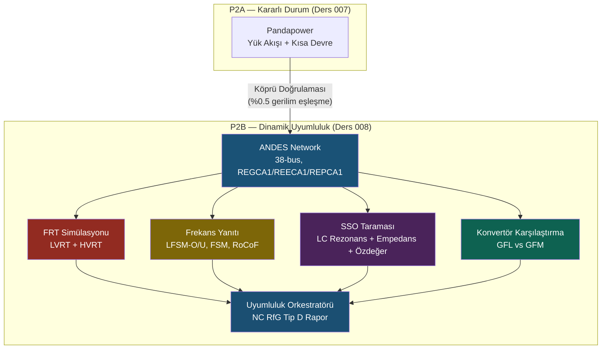

# Ders 008 — Dinamik Şebeke Uyumluluğu: ANDES, FRT, Frekans Yanıtı, SSO & Konvertör Karşılaştırması

!!! abstract "Ders Navigasyonu"
    :material-arrow-left: **Önceki:** [Ders 007 — HV Şebeke Entegrasyonu: Pandapower Kararlı Durum Modeli](lesson-007.md) | **Sonraki:** Yakında :material-arrow-right:

    **Faz:** P2 | **Dil:** Türkçe | **İlerleme:** 2 / ? | [Tüm Dersler](index.md) | [Öğrenme Yol Haritası](../Learning_Roadmap.md)

> **Date:** 2026-02-25
> **Commits:** 1 commit (`2870f65` → `2870f65`)
> **Commit range:** `2870f65581ff4829308754b84cdb4c75cfcc62c7..2870f65581ff4829308754b84cdb4c75cfcc62c7`
> **Phase:** P2 (HV Grid Integration — Dynamic Compliance)
> **Roadmap sections:** [Phase 2 — Section 2.4 Grid Codes & Compliance, Section 2.3 FACTS Devices]
> **Language:** Turkish
> **Previous lesson:** Lesson 007
> **last_commit_hash:** 2870f65581ff4829308754b84cdb4c75cfcc62c7

---

## Ne Öğreneceksiniz

- Tip-4 rüzgar türbini dinamik model yığınını (REGCA1 / REECA1 / REPCA1) ve her katmanın fiziksel anlamını
- LVRT/HVRT arıza geçirme simülasyonunu ve PSE IRiESP gerilim zarfına uyumluluğu
- Frekans yanıtı modlarını (LFSM-O, LFSM-U, FSM, RoCoF) ve droop formülünü
- Alt-senkron osilasiyon (SSO) taramasını: kablo LC rezonansı, empedans taraması, özdeğer analizi
- Grid-Following (GFL) ile Grid-Forming (GFM) konvertör stratejilerini ve zayıf şebekedeki farklarını

---

## Bölüm 1: ANDES Dinamik Ağ Modeli — Pandapower'dan Zaman Alanına

### Gerçek Hayat Problemi

Ders 007'de Pandapower ile yük akışı ve kısa devre hesaplarını yaptık — bunlar "fotoğraf" gibiydi: şebekenin tek bir andaki durumunu gösteriyordu. Ama gerçek şebekede arızalar milisaniyeler içinde olur ve biter. Bir arabanın fotoğrafıyla hızını ölçemezsiniz; bunun için videoya (zaman serisi simülasyonuna) ihtiyacınız var. ANDES bu "video kamerasıdır" — zaman alanında simülasyon yaparak konvertör kontrollerinin arıza anında nasıl davrandığını gösterir.

### Standartların Dediği

ENTSO-E NC RfG (EU 2016/631) Madde 20-21, Tip D jeneratörler (>75 MW, ≥110 kV) için dinamik simülasyon ile doğrulanması gereken şartlar listeler:

- **Madde 20:** Arıza geçirme (FRT) — gerilim-zaman profili içinde bağlı kalma
- **Madde 21:** Arıza sırasında reaktif akım enjeksiyonu (Kqv ≥ 2.0)
- **Madde 15:** Frekans yanıtı (LFSM-O, LFSM-U, FSM)
- **Madde 13(1)(b):** RoCoF dayanımı (2 Hz/s, 500 ms)

PSE IRiESP §2.3-2.4, Polonya'ya özgü LVRT zarfını ve frekans parametrelerini tanımlar.

### Ne İnşa Ettik

**Değişen dosyalar:**

- `backend/app/services/p2/andes_network.py` — ANDES formatında 38-baralı dinamik ağ modeli, REGCA1/REECA1/REPCA1 dinamik kontrol modelleri
- `backend/app/services/p2/frt_simulation.py` — LVRT/HVRT arıza geçirme simülasyonu
- `backend/app/services/p2/frequency_response.py` — Frekans yanıtı simülasyonu (4 mod)
- `backend/app/services/p2/sso_analysis.py` — Alt-senkron osilasiyon taraması
- `backend/app/services/p2/converter_comparison.py` — GFL vs GFM konvertör karşılaştırması
- `backend/app/services/p2/dynamic_compliance.py` — NC RfG Tip D uyumluluk orkestratörü
- `backend/app/models/grid.py` — 4 yeni SQLAlchemy tablosu (FRT, frekans, SSO, uyumluluk)
- `backend/app/schemas/grid.py` — 5 yeni Pydantic şeması + 4 StrEnum

Pandapower kararlı durum modelini *değiştirmedik* — ANDES ağını aynı paylaşılan sabitlerden (kablo spesifikasyonları, trafo verileri, topoloji) inşa ettik ve iki model arasında %0.5 gerilim eşleşmesini doğruladık. Bu "köprü doğrulaması" (bridge validation) stratejisi, iki bağımsız motorun aynı fiziksel ağı tutarlı biçimde temsil etmesini garanti eder.

### Neden Önemli

> **Neden** Pandapower yetmez, ANDES'e ihtiyacımız var?
> Pandapower kararlı durum çözücüdür — tek bir çalışma noktasını hesaplar. Ama NC RfG, arıza anında konvertörün 20 ms'lik zaman sabitinde nasıl tepki verdiğini görmemizi ister. Bu ancak zaman alanı simülasyonu (TDS) ile mümkündür. ANDES, sembolik-nümerik hibrit yaklaşımıyla dinamik modelleri derleyip verimli sayısal koda çevirir.

> **Neden** aynı sabitleri paylaşıyoruz?
> İki ayrı ağ modeli (Pandapower + ANDES) farklı parametrelerle oluşturulsaydı, hangi sonucun "doğru" olduğunu bilemezdik. Paylaşılan sabitler + köprü doğrulaması, tutarlılığı garanti eder — bu endüstriyel PSCAD/PowerFactory projelerindeki standart pratiktir.

### Kod İncelemesi

Tip-4 rüzgar türbini dinamik model yığını üç katmanlıdır. Aşağıdaki kod her katmanın parametrelerini ve fiziksel anlamını gösterir:

```python
# REGCA1 — Jeneratör/konvertör modeli (en alt katman)
# Konvertörü kontrollü akım kaynağı olarak modeller
# Tg = 20 ms: konvertör IGBTlerinin anahtarlama gecikmesi
def get_regca1_params() -> dict[str, float]:
    return {
        "Tg": 0.02,       # Konvertör zaman sabiti [s] — I(s) = I_ref / (1 + s×Tg)
        "Rrpwr": 10.0,    # Aktif güç rampa sınırı [pu/s]
        "Brkpt": 0.9,     # Düşük gerilim kırılma noktası [pu]
        "Zerox": 0.4,     # Ip = 0 gerilim seviyesi [pu]
    }
```

Bu transfer fonksiyonu I(s) = I_ref / (1 + s×Tg) basit bir birinci dereceden gecikmeyi ifade eder: konvertör, referans akım komutunu 20 ms'lik bir zaman sabitiyle takip eder. Gerçek IGBT anahtarlama frekansı ~2 kHz olmasına rağmen, ortalama model bu detayı filtreler.

```python
# REECA1 — Elektriksel kontrol (orta katman)
# Arıza sırasında reaktif akım enjeksiyonu: ΔIq = Kqv × (V_ref - V)
# Kqv ≥ 2.0: NC RfG minimum — %1 gerilim sapması başına %2 reaktif akım
def get_reeca1_params() -> dict[str, float]:
    return {
        "Kqv": 2.5,       # Reaktif akım kazancı [pu/pu] — NC RfG ≥ 2.0
        "dbd1": -0.1,     # Ölü bant alt sınırı [pu]
        "dbd2": 0.1,      # Ölü bant üst sınırı [pu]
        "Vdip": 0.15,     # FRT gerilim çöküş eşiği [pu]
        "Imax": 1.1,      # Maksimum toplam akım [pu]
        "PQFlag": 0,      # 0 = Q önceliği (arızada reaktif akım öncelikli)
    }
```

Kqv = 2.5 değeri NC RfG minimumu olan 2.0'ın üzerindedir — bu bilinçli bir tasarım kararıdır. Minimumun üzerinde çalışmak, ölçüm belirsizliği ve parametre varyasyonu nedeniyle uyumluluk testinde güvenlik marjı sağlar.

```python
# REPCA1 — Santral kontrolörü (en üst katman)
# Santral seviyesinde gerilim ve frekans droop kontrolü
# ΔP = -(P_rated / R) × (Δf / f_nom)   R = 5% (varsayılan droop)
def get_repca1_params() -> dict[str, float]:
    return {
        "Kp": 18.0,         # Gerilim regülasyonu oransal kazancı
        "Ki": 5.0,          # Gerilim regülasyonu integral kazancı
        "FFlag": 1,         # 1 = frekans regülasyonu aktif
        "fdbd1": -0.0006,   # Frekans ölü bandı alt [pu] → -0.03 Hz
        "fdbd2": 0.0006,    # Frekans ölü bandı üst [pu] → +0.03 Hz
    }
```

Frekans ölü bandı ±0.03 Hz (±0.0006 pu) ile ayarlanmıştır. Bu değer NC RfG'nin izin verdiği ±10 mHz minimumunun üzerinde olsa da, endüstriyel uygulamada gereksiz aktüasyonu önlemek için yaygın bir tercihtir.

### Temel Kavram

!!! tip "Temel Kavram: Dinamik Model Yığını (REGCA1 / REECA1 / REPCA1)"
    **Basit anlatım:** Bir araba düşünün. Motor (REGCA1) gücü üretir, gaz pedalı ve fren (REECA1) anlık tepkiyi kontrol eder, hız sabitleyici (REPCA1) uzun vadeli hedefi korur. Arıza olduğunda (yolda engel) önce fren devreye girer (REECA1 reaktif akım), sonra hız sabitleyici yeni duruma uyum sağlar (REPCA1).

    **Analoji:** Bir orkestrada REGCA1 müzisyendir (enstrümanı çalar), REECA1 bölüm şefidir (anlık dinamikleri yönetir), REPCA1 ise orkestra şefidir (genel tempo ve tonu belirler).

    **Bu projede:** 34 türbinin her biri bu üç katmanlı kontrol yığınına sahiptir. ANDES, 34 × 3 = 102 dinamik model örneğini eş zamanlı çözer. Pandapower bunu yapamaz — sadece kararlı durum bilir.

---

## Bölüm 2: Arıza Geçirme (FRT) Simülasyonu — Fırtınada Bağlı Kalmak

### Gerçek Hayat Problemi

Bir gemi düşünün — fırtınada demirlerini koparıp sürüklenmemesi gerekir. Aynı şekilde rüzgar çiftliği de şebeke arızası sırasında (gerilim çökmesi) bağlantısını kesmemeli ve hatta şebekeye yardım etmelidir. Aksi halde 510 MW'lık ani güç kaybı, zincirleme çöküşe (cascading failure) yol açabilir.

### Standartların Dediği

PSE IRiESP LVRT zarfı, gerilim-zaman profilini tanımlar:

| Zaman [ms] | Minimum Gerilim [pu] |
|------------|----------------------|
| 0          | 0.15                 |
| 140        | 0.25                 |
| 500        | 0.85                 |
| 1000       | 0.85                 |
| 1500       | 1.00                 |
| 3000       | 1.00                 |

NC RfG Madde 21 ek gereksinimler koyar:

- **Reaktif akım:** ΔIq ≥ %2 × ΔV (Kqv ≥ 2.0)
- **Aktif güç toparlanması:** Arıza temizlenmesinden sonra 1.0 s içinde ≥%90
- HVRT: 1.25 pu gerilime 100 ms dayanım

### Ne İnşa Ettik

**Değişen dosyalar:**

- `backend/app/services/p2/frt_simulation.py` — FRT simülasyon motoru
- `backend/app/schemas/grid.py` — `FRTSimulationResponse`, `FRTTimePoint`, `FRTType`

Simülasyon üç aşamadan oluşur: arıza öncesi kararlı durum (0 → 0.5 s), arıza dönemi (0.5 → 0.65 s, 150 ms), arıza sonrası gözlem (0.65 → 3.65 s). ANDES TDS, örtük yamuk integrasyon (implicit trapezoidal) kullanır ve 1 ms adımlarla çözer.

### Neden Önemli

> **Neden** rüzgar çiftliği arızada bağlı kalmalı?
> Eski şebeke kodlarında rüzgar çiftlikleri arızada çekilebilirdi. Ama yenilenebilir enerji penetrasyonu %30-50'yi aştığında, 510 MW'lık ani kayıp sistemde frekans düşüşü ve kaskat arızalara neden olur. FRT, sistem kararlılığının sigortasıdır.

> **Neden** reaktif akım enjekte ediyoruz?
> Gerilim çökmesi sırasında reaktif akım enjeksiyonu, PCC gerilimini destekleyerek arıza etkisini sınırlar. Formül: ΔIq = Kqv × ΔV. Kqv = 2.5 ile, %10'luk gerilim düşüşünde %25 reaktif akım enjekte edilir — bu gerilimi yukarı iter ve arızanın yayılmasını önler.

### Kod İncelemesi

PSE LVRT zarfı kod içinde nokta-nokta tanımlanmıştır:

```python
# PSE IRiESP LVRT gerilim-zaman zarfı
# WTG'ler bu eğrinin ÜSTÜNDE kaldığı sürece bağlı kalmalıdır
PSE_LVRT_ENVELOPE = [
    (0.000, 0.15),   # t=0: gerilim 0.15 pu'ya düşebilir
    (0.140, 0.25),   # t=140ms: minimum 0.25 pu
    (0.500, 0.85),   # t=500ms: 0.85 pu'ya toparlanma
    (1.000, 0.85),   # t=1.0s: 0.85 pu'da kalma
    (1.500, 1.00),   # t=1.5s: tam toparlanma
    (3.000, 1.00),   # t=3.0s: sürekli işletme
]

# Uyumluluk eşikleri
MIN_KQV = 2.0                    # NC RfG minimum reaktif akım kazancı
POWER_RECOVERY_THRESHOLD = 0.90  # Arıza sonrası %90 güç toparlanması
POWER_RECOVERY_TIME_S = 1.0      # 1.0 s içinde toparlanma
```

Bu noktalar doğrudan PSE IRiESP §2.3.2'den alınmıştır. Her bir nokta, şebeke operatörünün "bu andan itibaren bu gerilimdeysen bağlı kalman lazım" dediği sınırı temsil eder.

Reaktif akım uyumluluk kontrolü, arıza dönemindeki en kötü noktayı bulur ve Kqv'yi hesaplar:

```python
def check_reactive_current_compliance(
    time_series: list[FRTTimePoint],
    t_fault: float,
    t_clear: float,
    k_qv_min: float = MIN_KQV,
) -> tuple[bool, float]:
    """ΔIq / ΔV oranını hesaplayarak NC RfG Kqv ≥ 2.0 kontrolü yapar."""
    pre_v = pre_fault_points[-1].voltage_pu
    pre_iq = pre_fault_points[-1].reactive_current_pu

    # Arıza süresince en düşük gerilim noktası
    min_v_point = min(fault_points, key=lambda p: p.voltage_pu)
    delta_v = pre_v - min_v_point.voltage_pu
    delta_iq = abs(min_v_point.reactive_current_pu - pre_iq)

    kqv_actual = delta_iq / delta_v
    return kqv_actual >= k_qv_min, kqv_actual
```

Bu fonksiyon saf fizik ölçümüdür: arıza öncesi ve arıza sırasındaki gerilim-akım farkını alır, oranlar. Kqv ≥ 2.0 ise NC RfG'ye uyumlu; değilse REECA1 parametreleri ayarlanmalıdır.

### Temel Kavram

!!! tip "Temel Kavram: Fault Ride-Through (Arıza Geçirme)"
    **Basit anlatım:** Bir bisikletçinin yolda çukura girip düşmeden devam etmesi gibi. Çukur = gerilim çökmesi, bisikletçinin dengesini koruması = WTG'nin bağlı kalması, yolu düzeltmeye çalışması = reaktif akım enjeksiyonu.

    **Analoji:** İtfaiye aracı yangın bölgesine giderken yolda çukur var. Durup geri dönemez (güç kaybı sistemi çökertir). Çukurdan geçmeli (ride-through) ve hatta geçerken yolu tamir etmeye başlamalı (reaktif akım ile gerilim desteği).

    **Bu projede:** 510 MW çiftliğimiz, OSS 66 kV barasında 150 ms'lik üç fazlı arıza sırasında bağlı kalmalı, Kqv ≥ 2.0 ile reaktif akım enjekte etmeli ve 1 s içinde aktif güce %90 toparlanmalıdır.

---

## Bölüm 3: Frekans Yanıtı — Şebekenin Nabzını Tutmak

### Gerçek Hayat Problemi

Bir bisiklette pedal çevirmeyi düşünün. Yokuş yukarı çıkarken hızınız düşer (üretim < tüketim → frekans düşer), yokuş aşağıda hızlanırsınız (üretim > tüketim → frekans yükselir). Senkron jeneratörler bu dengeyi dönen kütleleriyle doğal olarak sağlar (atalet, inertia). Ama Tip-4 rüzgar türbinlerinin şebekeyle mekanik bağı yoktur — frekans desteği tamamen yazılımla sağlanmalıdır.

### Standartların Dediği

NC RfG Tip D frekans yanıtı modları:

| Mod | Tetik | Tepki | NC RfG Maddesi |
|-----|-------|-------|----------------|
| **LFSM-O** | f > 50.2 Hz | Gücü azalt | Madde 15(2)(c) |
| **LFSM-U** | f < 49.8 Hz | Gücü artır (kapasite varsa) | Madde 15(2)(d) |
| **FSM** | 49.8–50.2 Hz | Sürekli droop yanıtı | Madde 15(2)(b) |
| **RoCoF** | df/dt = 2 Hz/s | 500 ms dayanım | Madde 13(1)(b) |

### Ne İnşa Ettik

**Değişen dosyalar:**

- `backend/app/services/p2/frequency_response.py` — Dört frekans yanıtı modu simülasyonu
- `backend/app/schemas/grid.py` — `FrequencyMode` enum, `FrequencyResponseResponse`

### Neden Önemli

> **Neden** rüzgar türbinleri frekans desteği sağlamalı?
> Avrupa şebekesinde senkron jeneratörler emekli oldukça (kömür/nükleer kapanıyor), toplam sistem ataleti düşer. Atalet düştükçe frekans dalgalanmaları büyür. Rüzgar çiftlikleri frekans yanıtı vermezse, 2030'da Avrupa şebekesi frekans kararsızlığıyla karşılaşabilir.

> **Neden** droop %5?
> Droop oranı R, hassasiyet ile kararlılık arasındaki dengedir. R çok düşükse (%1-2) jeneratör her küçük frekans değişimine aşırı tepki verir ve osilatif olabilir. R çok yüksekse (%10+) yeterli destek sağlayamaz. %3-5 aralığı endüstri standardıdır.

### Kod İncelemesi

Droop formülü tüm frekans yanıtının temelidir:

```python
def calculate_expected_droop_response(
    freq_dev_hz: float,
    droop_pct: float,
    rated_mw: float,
) -> float:
    """Droop formülünden beklenen güç değişimini hesaplar.

    ΔP = -(P_rated / R) × (Δf / f_nom)

    Örnek: R=%5, Δf=+0.5 Hz, P_rated=510 MW:
      ΔP = -(510 / 0.05) × (0.5 / 50) = -102 MW (gücü azalt)
    """
    r_fraction = droop_pct / 100.0
    return -(rated_mw / r_fraction) * (freq_dev_hz / F_NOM_HZ)
```

Bu tek satırlık formül, tüm şebeke frekans regülasyonunun matematiksel temelidir. Negatif işaret, geri besleme (negative feedback) mekanizmasını temsil eder: frekans yükseldiğinde güç azalır, frekans düştüğünde güç artar.

LFSM-O uyumluluk kontrolü gayet basittir — yön doğru mu?

```python
def _check_droop_compliance(mode, measured_dp, expected_dp, freq_dev):
    if mode == FrequencyMode.LFSM_O:
        # Aşırı frekansta güç AZALMALI (negatif ΔP)
        return measured_dp < 0 and freq_dev > 0
    elif mode == FrequencyMode.LFSM_U:
        # Düşük frekansta güç ARTMALI (pozitif ΔP)
        return measured_dp > 0 and freq_dev < 0
    elif mode == FrequencyMode.FSM:
        # Droop formülüne ±%20 tolerans
        ratio = measured_dp / expected_dp
        return 0.80 <= ratio <= 1.20
```

Her modun uyumluluk kriteri farklıdır: LFSM modları sadece doğru yönü kontrol eder (azalt/artır), FSM ise ölçülen güç değişiminin beklenen değere ne kadar yakın olduğunu denetler.

### Temel Kavram

!!! tip "Temel Kavram: Droop Kontrolü (Frekans-Güç İlişkisi)"
    **Basit anlatım:** Arabanızın hız sabitleyicisi 120 km/h'e ayarlı. Yokuş yukarı çıktığınızda motor otomatik olarak daha fazla yakıt verir. Yokuş aşağı indiğinizde yakıtı keser. Droop kontrolü tam olarak budur — frekans hedeften saparsa, güç üretimini otomatik ayarlar.

    **Analoji:** Bir havuzdaki su seviyesi kontrolü. Seviye düşerse (frekans düşerse) musluk daha çok açılır (güç artar). Seviye yükselirse musluk kısılır. Droop oranı, "musluk ne kadar hassas" ayarıdır.

    **Bu projede:** 510 MW çiftliğimiz, %5 droop ile +0.5 Hz frekans sapmasında 102 MW güç azaltır. Bu devasa sayı, büyük ölçekli rüzgar çiftliklerinin şebeke kararlılığında ne kadar kritik olduğunu gösterir.

---

## Bölüm 4: Alt-Senkron Osilasiyon (SSO) Taraması — Görünmez Tehlike

### Gerçek Hayat Problemi

Bir gitar telini düşünün — belirli bir frekansta titreşir (rezonans). Uzun denizaltı kabloları da benzer şekilde doğal rezonans frekansına sahiptir. Eğer bu rezonans 1-49 Hz arasına (alt-senkron bölgeye) düşerse, konvertör kontrolleriyle etkileşime girebilir ve büyüyen osilasynlar oluşturabilir. 2009'daki Teksas ERCOT SSO olayında, seri kompanzasyonlu hatlar ile rüzgar çiftliği konvertörleri arasındaki etkileşim gerçek hasara yol açmıştı.

### Standartların Dediği

- **ENTSO-E NC HVDC Madde 29:** HVDC ve uzun AC bağlantıları için SSO taraması gerektirir
- **NC RfG Madde 21(3):** Jeneratörler olumsuz etkileşim yaratmamalıdır
- **IEC TR 62858:** Alt-senkron osilasiyon analizi rehberi
- **IEEE PES:** Empedans tabanlı kararlılık kriteri

### Ne İnşa Ettik

**Değişen dosyalar:**

- `backend/app/services/p2/sso_analysis.py` — Üç katmanlı SSO tarama motoru
- `backend/app/schemas/grid.py` — `EigenvalueMode`, `SSOGRiskLevel`, `SSOScreeningResponse`

Üç analiz katmanı:

1. **Kablo LC rezonans frekansı:** f_res = 1 / (2π√(LC))
2. **Empedans taraması:** Re{Z_total(jω)} > 0 tüm alt-senkron frekanslar için
3. **Özdeğer analizi:** λ = σ + jω → sönümleme oranı ζ < %5 ise risk

### Neden Önemli

> **Neden** LC rezonansı tehlikeli?
> 45 km, 220 kV ihracat kablomuzun rezonans frekansı ~753 Hz'dir — alt-senkron bölgenin (1-49 Hz) çok üstünde, dolayısıyla SSO riski düşüktür. Ama kablo 150+ km olsaydı veya seri kompanzasyon eklenseydi, rezonans alt-senkron bölgeye girip konvertör PLL'iyle etkileşebilirdi.

> **Neden** SCR (kısa devre oranı) bu kadar önemli?
> SCR = Ssc / P_rated. Güçlü şebeke (SCR > 5) empedansı düşüktür — konvertör kontrolleri rahat çalışır. Zayıf şebeke (SCR < 3) empedansı yüksektir — PLL gerilimi izlemekte zorlanır, osilatif davranış başlar. Bizim SCR = 10,000 / 510 ≈ 19.6 — güçlü şebeke.

### Kod İncelemesi

Kablo LC rezonans frekansı hesabı fizik formülünü doğrudan kodlar:

```python
def calculate_cable_resonance_frequency(
    length_km: float,
    l_mh_per_km: float | None = None,
    c_nf_per_km: float | None = None,
) -> float:
    """Kablo LC rezonans frekansı: f_res = 1 / (2π × √(L_total × C_total))

    220 kV, 45 km ihracat kablosu için:
      L = 0.116 mH/km × 45 = 5.22 mH
      C = 190 nF/km × 45 = 8.55 µF
      f_res ≈ 753 Hz (alt-senkron bölgenin üstünde — düşük risk)
    """
    l_total_h = (l_mh_per_km * 1e-3) * length_km   # [H]
    c_total_f = (c_nf_per_km * 1e-9) * length_km   # [F]
    return 1.0 / (2.0 * math.pi * math.sqrt(l_total_h * c_total_f))
```

Bu basit formül, SSO riskinin ilk göstergesidir. Rezonans 1-49 Hz arasına düşerse alarm çalar.

Risk sınıflandırması çok-kriterli bir karar ağacıdır:

```python
def _classify_sso_risk(scr, phase_margin_deg, min_damping, resonance_freq_hz):
    # YÜKSEK risk koşulları (herhangi biri yeterli)
    if scr < 3.0: return SSOGRiskLevel.HIGH         # Zayıf şebeke
    if phase_margin_deg < 30.0: return SSOGRiskLevel.HIGH  # Düşük faz marjı
    if min_damping < 0.05: return SSOGRiskLevel.HIGH       # Zayıf sönümleme
    if 1.0 <= resonance_freq_hz <= 49.0: return SSOGRiskLevel.HIGH  # Rezonans alt-senkron

    # ORTA risk koşulları
    if scr < 5.0: return SSOGRiskLevel.MEDIUM
    if phase_margin_deg < 60.0: return SSOGRiskLevel.MEDIUM

    return SSOGRiskLevel.LOW  # Güçlü şebeke, yeterli marjlar
```

Risk sınıflandırması "OR" mantığıyla çalışır — herhangi bir kriter kötüyse risk yükselir. Bu muhafazakar bir yaklaşımdır çünkü SSO'nun sonuçları (ekipman hasarı, kaskat arıza) çok ciddidir.

### Temel Kavram

!!! tip "Temel Kavram: Sub-Synchronous Oscillation (Alt-Senkron Osilasiyon)"
    **Basit anlatım:** Bir salıncağı düşünün — doğru zamanda iterseniz sallanma büyür (rezonans). Kablo ve konvertör kontrolü doğru koşullarda birbirini "itebilir" ve büyüyen osilasynlar oluşabilir. Bu salıncağı durdurmak için ya itme zamanlamasını değiştirirsiniz (kontrol parametreleri) ya da salıncağın ağırlığını artırırsınız (şebekeyi güçlendirme).

    **Analoji:** Bir köprüde askerler adım atarak yürüyorsa ve adım frekansı köprünün doğal frekansına denk gelirse, köprü sallanmaya başlar (Tacoma Narrows fenomeni). SSO'da "köprü" kablodur, "askerler" konvertör kontrol sinyalleridir.

    **Bu projede:** 45 km kablomuzun rezonansı 753 Hz'de — güvendeyiz. Ama 150+ km kablolarda (örneğin Kuzey Denizi projeleri) bu gerçek bir endişedir.

---

## Bölüm 5: GFL vs GFM Konvertör Karşılaştırması — Geleceğin Teknolojisi

### Gerçek Hayat Problemi

İki tip sürücü düşünün. Birincisi (GFL) yol çizgilerini takip eder — çizgiler net olduğunda harika sürer, ama çizgiler silinmişse (zayıf şebeke) kaybolur. İkincisi (GFM) GPS ile kendi rotasını belirler — çizgiler olsa da olmasa da yolunu bilir. Yenilenebilir enerji penetrasyonu arttıkça "yol çizgileri" (güçlü senkron jeneratörler) azalır ve GFM tipi konvertörlere geçiş kaçınılmaz hale gelir.

### Standartların Dediği

- **NC RfG Madde 13(7):** TSO'lar yeni bağlantılar için GFM yeteneği talep edebilir
- **ACER tavsiyesi (2023):** 2028 sonrası 50 MW üstü Tip D için GFM zorunlu olacak
- **GB Grid Code GC0137:** Düşük atalet senaryoları için GFM gereksinimleri
- PSE'nin 2027'ye kadar benzer gereksinimler benimsemesi bekleniyor

### Ne İnşa Ettik

**Değişen dosyalar:**

- `backend/app/services/p2/converter_comparison.py` — GFL/GFM simülasyonu ve eğitici karşılaştırma
- `backend/app/schemas/grid.py` — `ConverterType`, `ConverterResult`, `ConverterComparisonResponse`

### Neden Önemli

> **Neden** GFM, GFL'den farklı?
> GFL bir akım kaynağıdır — şebekedeki mevcut gerilimi PLL ile izler ve akım enjekte eder. GFM bir gerilim kaynağıdır — kendi gerilim ve frekans referansını oluşturur, tıpkı bir senkron jeneratör gibi. Fark, zayıf şebekelerde dramatik hale gelir.

> **Neden** SCR düştüğünde GFL kararsız olur?
> Düşük SCR = yüksek empedans = zayıf gerilim referansı. GFL'nin PLL'i bu zayıf gerilimi izlemeye çalışırken, kendi akım enjeksiyonu gerilimi değiştirir, PLL yeniden izler, bu da yine gerilimi değiştirir... → osilatif döngü. GFM bu sorunu yaşamaz çünkü kendi referansını üretir.

### Kod İncelemesi

GFM'in GFL'ye göre avantajı, SCR ile matematiksel olarak modellenir:

```python
def _calculate_gfm_improvement(scr: float) -> float:
    """GFM'in GFL'ye göre iyileştirme faktörü.

    SCR > 10: %10 daha iyi (her ikisi de kararlı)
    SCR ≈ 5:  %30 daha iyi (GFL'de osilasynlar başlar)
    SCR ≈ 3:  %50 daha iyi (GFL marjinal kararlı)
    SCR < 2:  %70 daha iyi (GFL muhtemelen kararsız)
    """
    if scr >= 10.0: return 0.9     # Güçlü şebeke — fark küçük
    elif scr >= 5.0: return 0.5 + 0.4 * (scr - 5.0) / 5.0
    elif scr >= 3.0: return 0.3 + 0.2 * (scr - 3.0) / 2.0
    else: return 0.3               # Zayıf şebeke — GFM çok üstün
```

SCR = 19.6 olan PSE bağlantımızda her iki tip de iyi çalışır. Ama SCR = 3.9'a düşürülmüş bir senaryo testinde (2,000 MVA grid) GFM'in üstünlüğü netleşir. Bu eğitici karşılaştırma, mühendislik mülakatlarında sıkça sorulan bir konudur.

Eğitici özet, SCR bazında otomatik açıklama üretir:

```python
def _describe_gfm_advantage(gfl, gfm, scr):
    if scr > 10:
        return f"SCR={scr:.1f}'de (güçlü şebeke), GFL ve GFM kararlı..."
    elif scr > 5:
        return f"SCR={scr:.1f}'de (orta şebeke), GFM net avantajlı..."
    else:
        return (f"SCR={scr:.1f}'de (zayıf şebeke), GFL kararsız, "
                f"GFM sanal atalet H={GFM_INERTIA_H}s ile kararlı...")
```

Bu fonksiyon sadece teknik sonuç vermez — aynı zamanda *neden* böyle olduğunu açıklar. Eğitici yazılım, sonuçları bağlamsallaştırmalıdır.

### Temel Kavram

!!! tip "Temel Kavram: Grid-Following vs Grid-Forming Konvertör"
    **Basit anlatım:** GFL bir kör insan gibidir — başkalarının sesini (şebeke gerilimini) duyarak yürür. Etrafta çok ses (güçlü şebeke) varsa sorunsuz gider. Sessiz ortamda (zayıf şebeke) kaybolur. GFM ise kendi ışığını taşıyan biridir — karanlıkta da yolunu bulur.

    **Analoji:** Dans eden iki kişi. GFL partnerin adımlarını takip eder (follower) — partner güçlüyse güzel dans ederler. GFM kendi ritmini belirler (leader) — partnerin zayıf olduğu durumda bile dans devam eder.

    **Bu projede:** Bizim PSE bağlantımız güçlü (SCR ≈ 19.6), bu yüzden GFL yeterli. Ama 2028'den sonra NC RfG, GFM yeteneğini zorunlu kılacak — geleceğe hazırlıklı olmalıyız.

---

## Bölüm 6: Dinamik Uyumluluk Orkestratörü — Hepsini Bir Araya Getirmek

### Gerçek Hayat Problemi

Bir pasaport kontrolü düşünün. Her ülkeye girmek için farklı belgeler gerekir — vize, sağlık belgesi, gümrük beyannamesi. Hepsini tek tek kontrol etmek yerine, bir "kontrol listesi" (checklist) ile tüm belgeleri toplu doğrularsınız. Dinamik uyumluluk orkestratörü tam olarak budur: 8 farklı NC RfG testini sırayla çalıştırır ve tek bir "GEÇTİ/KALDI" kararı verir.

### Standartların Dediği

NC RfG Tip D genel uyumluluk formülü:

```
overall_compliant = LVRT ∧ HVRT ∧ LFSM-O ∧ LFSM-U ∧ FSM ∧ RoCoF ∧ SSO
```

Tüm testlerin geçmesi gerekir — tek bir başarısızlık şebeke bağlantısı onayını engeller.

### Ne İnşa Ettik

**Değişen dosyalar:**

- `backend/app/services/p2/dynamic_compliance.py` — 8 testli orkestratör
- `backend/app/schemas/grid.py` — `DynamicComplianceResponse`
- `backend/app/models/grid.py` — `DynamicComplianceResult`, `FRTSimulationResult`, `FrequencyResponseResult`, `SSOScreeningResult`

### Neden Önemli

> **Neden** tek bir orkestratör fonksiyonu?
> Her testi ayrı ayrı çağırmak hata yapma olasılığını artırır — bir testi unutabilir veya yanlış parametrelerle çalıştırabilirsiniz. Orkestratör, "happy path"i kodlar: doğru sırada, doğru parametrelerle, doğru sonuç toplama. Bu, yazılım mühendisliğinde "Facade" tasarım kalıbıdır.

> **Neden** boolean AND (∧) kullanıyoruz?
> Şebeke güvenliği "zincir" gibidir — en zayıf halka tüm zinciri kırar. LVRT geçse bile SSO başarısızsa, bağlantı onaylanamaz. Bu muhafazakar ama güvenli yaklaşımdır.

### Kod İncelemesi

Orkestratör 8 testi sırayla çalıştırır ve tüm sonuçları toplar:

```python
def run_full_compliance_assessment(
    export_length_km=45.0,
    grid_ssc_mva=10_000.0,
    generation_fraction=1.0,
) -> DynamicComplianceResponse:
    """NC RfG Tip D dinamik uyumluluk değerlendirmesi."""
    # 1. LVRT — OSS 66kV'da üç fazlı arıza
    lvrt = run_frt_simulation(frt_type=FRTType.LVRT, ...)
    # 2. HVRT — OSS 66kV'da gerilim artışı
    hvrt = run_frt_simulation(frt_type=FRTType.HVRT, ...)
    # 3-6. Frekans modları — LFSM-O, LFSM-U, FSM, RoCoF
    lfsm_o = run_frequency_response(mode=FrequencyMode.LFSM_O, ...)
    # 7. SSO taraması
    sso = run_sso_screening(...)
    # 8. GFL vs GFM karşılaştırma
    converter = get_comparison_response(...)

    # Genel uyumluluk: TÜMÜ geçmeli
    overall = (lvrt.stayed_connected and lvrt.reactive_current_compliant
               and lvrt.recovery_compliant and hvrt.stayed_connected
               and lfsm_o.compliant and lfsm_u.compliant
               and fsm.compliant and rocof.compliant and sso.stable)

    return DynamicComplianceResponse(overall_compliant=overall, ...)
```

Bu orkestratör 4,578 satır yeni kodun (6 modül, 4 tablo, 5 şema, 72 test) tek bir giriş noktasından erişilebilir olmasını sağlar.

### Temel Kavram

!!! tip "Temel Kavram: Compliance Orchestrator (Uyumluluk Orkestratörü)"
    **Basit anlatım:** Bir uçak pilotunun kalkış öncesi kontrol listesi: motorlar ✓, yakıt ✓, flaplar ✓, iletişim ✓. Tek bir "hayır" bile kalkışı durdurur. Dinamik uyumluluk orkestratörü, rüzgar çiftliğinin şebekeye bağlanma "kalkış listesi"dir.

    **Analoji:** Araç muayenesinde motor, frenler, lastikler, ışıklar ayrı ayrı kontrol edilir. Hepsi geçmelidir — tek bir arıza muayeneyi başarısız kılar.

    **Bu projede:** Orkestratörümüz 8 NC RfG testini çalıştırır. PSE'ye sunulacak uyumluluk raporunun dijital ikizi (digital twin) olarak hizmet eder.

---

## Bağlantılar

**Bu kavramların ileriye dönük kullanımı:**

- **ANDES dinamik modeli (Bölüm 1)** → P3 SCADA'da gerçek zamanlı simülasyon için temel oluşturacak. IEC 61850 veri modelleri, ANDES çıktılarını GOOSE mesajlarına çevirecek.
- **FRT simülasyonu (Bölüm 2)** → P5 devreye alma programında, gerçek FRT testlerinin prosedürünü bu simülasyon sonuçlarına göre tasarlayacağız.
- **Frekans yanıtı (Bölüm 3)** → P4 AI tahmin modülünde, frekans sapma olasılığı tahmini bu droop parametrelerini kullanacak.
- **SSO taraması (Bölüm 4)** → Kablo uzunluğu veya şebeke gücü değiştiğinde yeniden çalıştırılacak — parametrik çalışma (parametric sweep) özelliği eklenecek.
- **GFL vs GFM (Bölüm 5)** → P5 komisyonlama testlerinde, gerçek GFM devreye alma prosedürünü simülasyonla destekleyeceğiz.

**Geriye dönük bağlantı:** Ders 007'deki Pandapower kararlı durum modeli, bu derste ANDES'in köprü doğrulaması için referans noktası olarak kullanılmıştır.

---

## Büyük Resim

*Bu dersin odağı: **Kararlı durum analizinin üzerine zaman alanı dinamik simülasyon katmanı eklenmesi — NC RfG Tip D tam uyumluluk**.*



Tam sistem mimarisi için: [Dersler Genel Bakışı](index.md#system-architecture).

---

## Önemli Çıkarımlar

1. **ANDES, Pandapower'ın tamamlayıcısıdır** — Pandapower kararlı durum (fotoğraf), ANDES zaman alanı (video) sağlar; her ikisi de aynı 38-baralı ağı paylaşılan sabitlerden inşa eder.
2. **Tip-4 rüzgar türbini üç katmanlı dinamik modele sahiptir:** REGCA1 (konvertör akım kaynağı, Tg=20ms), REECA1 (arıza reaktif akım kontrolü, Kqv≥2.0), REPCA1 (santral seviyesi droop, R=5%).
3. **FRT uyumluluğu üç koşul gerektirir:** bağlı kalma (PSE zarfı içinde), reaktif akım enjeksiyonu (Kqv ≥ 2.0), aktif güç toparlanması (≥%90, 1 s).
4. **Droop formülü tüm frekans yanıtının temelidir:** ΔP = -(P_rated/R) × (Δf/f_nom). %5 droop ile +0.5 Hz frekans sapmasında 510 MW çiftlik 102 MW güç azaltır.
5. **SSO riski SCR ve kablo uzunluğuna bağlıdır:** 45 km kablomuz güvenli (f_res=753 Hz), ama 150+ km'de veya SCR < 3'te risk yükselir.
6. **GFM konvertörler geleceğin standardıdır:** Düşük SCR'de GFL PLL kararsızlaşırken, GFM sanal atalet ile kararlı kalır — 2028 sonrası NC RfG zorunluluğu.
7. **Uyumluluk orkestratörü, 8 NC RfG testini tek çağrıda çalıştırır** ve boolean AND ile genel karar verir — tek bir başarısızlık şebeke bağlantısını engeller.

---

## Önerilen Kaynaklar

*[Öğrenme Yol Haritası](../Learning_Roadmap.md) — Phase 2: HV Electrical Engineering*

| Kaynak | Tür | Neden Okunmalı |
|--------|-----|---------------|
| ENTSO-E — *Network Code on Requirements for Generators (RfG)* (EU 2016/631) | AB Yönetmeliği | Bu dersin tüm uyumluluk kriterlerinin birincil kaynağı — Madde 13-21 |
| Kundur — *Power System Stability and Control* | Ders kitabı | Frekans yanıtı ve droop kontrolünün matematiksel temeli (Bölüm 11) |
| CIGRE WG B4.62 — *Connection of Wind Farms to Weak AC Networks* (TB 671) | Teknik bülten | GFL/GFM karşılaştırması ve zayıf şebekelerde SSO riski |
| Wu et al. (2024) — *Grid Integration of Offshore Wind Power* | NREL raporu | 2024 güncel derleme — tüm şebeke entegrasyon konularını kapsar |
| Hingorani & Gyugyi — *Understanding FACTS* | Ders kitabı | STATCOM ve reaktif güç kompanzasyonu temelleri |

---

## Sınav — Bilginizi Test Edin

### Hatırlama Soruları

**S1:** REGCA1, REECA1 ve REPCA1 modelleri sırasıyla hangi kontrol katmanlarını temsil eder?

<details>
<summary>Cevap</summary>

REGCA1 konvertör/jeneratör katmanını temsil eder — güç elektroniğini kontrollü akım kaynağı olarak modellerken Tg=20 ms zaman sabitini kullanır. REECA1 elektriksel kontrol katmanıdır — arıza sırasında reaktif akım enjeksiyonunu yönetir (ΔIq = Kqv × ΔV). REPCA1 santral kontrolörüdür — PCC'de gerilim ve frekans droop regülasyonu sağlar.

</details>

**S2:** PSE IRiESP LVRT zarfına göre, t=0 anında gerilim minimum kaç pu'ya düşebilir ve t=500 ms'de minimum kaç pu olmalıdır?

<details>
<summary>Cevap</summary>

t=0 anında gerilim minimum 0.15 pu'ya düşebilir ve rüzgar çiftliği hala bağlı kalmalıdır. t=500 ms'de gerilim minimum 0.85 pu'ya toparlanmış olmalıdır. Bu değerler NC RfG Tip D + PSE'nin Polonya'ya özgü adaptasyonudur.

</details>

**S3:** 510 MW çiftlik, %5 droop ile +0.5 Hz frekans sapmasında kaç MW güç azaltır? Formülü yazın.

<details>
<summary>Cevap</summary>

ΔP = -(P_rated / R) × (Δf / f_nom) = -(510 / 0.05) × (0.5 / 50) = -102 MW. Çiftlik gücünü 102 MW azaltır. Bu, toplam kapasitenin %20'sidir — büyük ölçekli rüzgar çiftliklerinin şebeke frekans kararlılığındaki etkisini gösterir.

</details>

### Anlama Soruları

**S4:** 45 km ihracat kablomuzun SSO riski neden düşüktür? Hangi koşullarda risk yükselirdi?

<details>
<summary>Cevap</summary>

45 km kablonun LC rezonans frekansı yaklaşık 753 Hz'dir — bu, alt-senkron bölgenin (1-49 Hz) çok üzerindedir, dolayısıyla konvertör kontrolleriyle etkileşim riski düşüktür. Risk yükselirdi: (1) kablo 150+ km'ye uzatılsa rezonans frekansı düşer, (2) seri kompanzasyon eklense efektif indüktans artar, (3) SCR 3'ün altına düşse konvertör-şebeke etkileşimi güçlenir. Bu üç koşulun herhangi biri rezonansı alt-senkron bölgeye itebilir.

</details>

**S5:** GFL konvertör düşük SCR'de neden kararsızlaşır? GFM neden bu sorundan etkilenmez?

<details>
<summary>Cevap</summary>

GFL konvertör PLL (Phase-Locked Loop) ile şebeke gerilimini izler ve akım enjekte eder. Düşük SCR'de şebeke empedansı yüksektir, bu da enjekte edilen akımın gerilimi önemli ölçüde değiştirmesine neden olur. PLL bu değişen gerilimi izlemeye çalışırken kendi akım enjeksiyonu tekrar gerilimi değiştirir — bu pozitif geri besleme döngüsü osilasynlara yol açar. GFM ise kendi gerilim ve frekans referansını oluşturur (sanal senkron makine), bu nedenle harici gerilim referansına bağımlı değildir ve düşük SCR'de bile kararlı kalır.

</details>

**S6:** Uyumluluk orkestratöründe LFSM-U testi neden %80 jenerasyon fraksiyonuyla çalıştırılır (%100 yerine)?

<details>
<summary>Cevap</summary>

LFSM-U (düşük frekans modu) frekans düştüğünde güç artırımı gerektirir. Eğer çiftlik zaten %100 kapasitede çalışıyorsa, artıracak güç kapasitesi (headroom) yoktur. %80 jenerasyon fraksiyonu ile çalıştırılarak %20'lik artırım marjı sağlanır — bu gerçek operasyonel senaryoyu yansıtır çünkü rüzgar çiftlikleri nadiren tam kapasite üretir.

</details>

### Zorluk Sorusu

**S7:** 150 km ihracat kablosu ve SCR=3 olan bir Kuzey Denizi projesi için SSO risk azaltma stratejiniz ne olurdu? En az üç farklı yaklaşım önerin ve her birinin avantaj/dezavantajlarını tartışın.

<details>
<summary>Cevap</summary>

**1. Aktif sönümleme kontrolörü (Active Damping Controller, ADC):** Konvertör kontrolüne frekans bağımlı bir sönümleme terimi eklenir. Avantajı: ek donanım gerektirmez, yazılım güncellemesiyle uygulanabilir. Dezavantajı: konvertör kontrol bant genişliğini daraltabilir ve diğer performans metriklerini (FRT tepkisi, gerilim regülasyonu) olumsuz etkileyebilir.

**2. HVDC dönüşümü:** HVAC yerine HVDC ihracat kablosu kullanmak, kablo kapasitansından kaynaklanan LC rezonansını tamamen ortadan kaldırır — DC'de rezonans mekanizması farklıdır. Avantajı: SSO riskini temelden çözer, ayrıca 150+ km'de HVAC kayıpları zaten yüksektir. Dezavantajı: konvertör istasyon maliyeti çok yüksektir (yaklaşık €200-400M ekstra yatırım).

**3. GFM konvertörlere geçiş:** Grid-forming kontrol, konvertörü gerilim kaynağı olarak çalıştırarak PLL tabanlı etkileşimi ortadan kaldırır. SCR=3'te bile kararlı kalır. Avantajı: SSO, FRT ve frekans yanıtı sorunlarını aynı anda çözer. Dezavantajı: henüz tam olarak standartlaşmamıştır, saha deneyimi sınırlıdır, mevcut konvertörlerin yazılım güncellemesiyle GFM'e dönüştürülmesi her zaman mümkün olmayabilir (donanım sınırları).

Optimal strateji genellikle kombinasyondur: GFM konvertörler + aktif sönümleme kontrolörü + empedans taramasıyla doğrulama. Eğer maliyet izin veriyorsa, 150 km'de HVDC en kapsamlı çözümdür.

</details>

---

## Mülakat Köşesi

### Basit Açıklama
*"Dinamik şebeke uyumluluğunu teknik olmayan birine nasıl açıklarsınız?"*

Bir rüzgar çiftliği elektrik şebekesine bağlanmadan önce, tıpkı bir arabanın trafiğe çıkmadan önce muayeneden geçmesi gibi, bir dizi teste tabi tutulur. Bu testler şunu sorar: Şebekede arıza olduğunda (mesela yıldırım düştüğünde) çiftlik bağlı kalabilir mi? Elektrik tüketimi aniden artarsa çiftlik daha fazla üretebilir mi? Çiftliğin elektronik kontrolleri şebekede istenmeyen titreşimlere neden olur mu?

Biz bu testlerin dijital ikizini (bilgisayar simülasyonunu) oluşturduk. Gerçek testlerden önce, bilgisayar ortamında "sanal arıza" oluşturarak çiftliğin tepkisini ölçüyoruz. Tüm testleri geçen bir çiftlik, şebeke operatörüne (Polonya'da PSE) "güvenle bağlanabilirim" diyebilir. Tek bir testte bile başarısız olursa, bağlantıya izin verilmez — tıpkı muayeneden geçemeyen arabanın trafiğe çıkamaması gibi.

### Teknik Açıklama
*"Dinamik şebeke uyumluluğunu bir mülakat paneline nasıl açıklarsınız?"*

ENTSO-E NC RfG (EU 2016/631) kapsamında Tip D jeneratörler (>75 MW, ≥110 kV), şebeke bağlantısı öncesinde dinamik uyumluluk simülasyonları ile doğrulanmalıdır. Biz bu uyumluluğu ANDES zaman alanı simülasyonu (TDS) üzerine kurulu modüler bir Python altyapısıyla sağlıyoruz.

Mimari olarak, Pandapower kararlı durum modelimizin üzerine ANDES dinamik katmanını inşa ettik — her iki model de aynı ağ sabitlerini (CableSpec, trafo parametreleri, topoloji) paylaşır ve köprü doğrulaması ile %0.5 gerilim tutarlılığı garanti edilir. Dinamik modeller WECC ikinci nesil yenilenebilir modelleri kullanır: REGCA1 (konvertör akım kaynağı, Tg=20ms), REECA1 (FRT reaktif akım kontrolü, Kqv=2.5 ≥ NC RfG minimum 2.0), REPCA1 (santral seviyesi frekans droop, R=5%).

Uyumluluk değerlendirmesi 8 bağımsız testi kapsar: LVRT/HVRT (PSE IRiESP gerilim zarfı + reaktif akım + güç toparlanması), 4 frekans modu (LFSM-O/U, FSM, RoCoF), SSO taraması (LC rezonans + empedans + özdeğer analizi), ve GFL/GFM konvertör karşılaştırması. Orkestratör bu testleri sıralı çalıştırır ve boolean AND ile genel uyumluluk kararı verir. Altyapı 72 birim testle doğrulanmıştır ve toplam test sayısını 304'e çıkarmıştır. Bu yaklaşım, gerçek EMT simülasyonlarını (PSCAD/PowerFactory) tam olarak ikame etmez ancak konsept doğrulama ve eğitim amaçlı endüstriyel metodolojiye uygun bir çerçeve sunar.
