# Ders 011 — IEC 62443 RBAC & 9 Durumlu Permit-to-Work Yaşam Döngüsü

!!! abstract "Ders Navigasyonu"
    :material-arrow-left: **Önceki:** [Ders 010 — GOOSE Arıza Simülasyonu, Koruma Zaman Çizelgesi & SCADA API](lesson-010.md) | **Sonraki:** Yakında :material-arrow-right:

    **Faz:** P3 | **Dil:** Türkçe | **İlerleme:** 3 / ? | [Tüm Dersler](index.md) | [Öğrenme Yol Haritası](../Learning_Roadmap.md)

> **Date:** 2026-02-26
> **Commits:** 1 commit (`64f8683` → `64f8683`)
> **Commit range:** `64f8683b26786d9c27bfbdb9a93731cff9b95a45..64f8683b26786d9c27bfbdb9a93731cff9b95a45`
> **Phase:** P3 (SCADA & Automation)
> **Roadmap sections:** [Phase 3 — Section 3.3 Cybersecurity — IEC 62443, Phase 5 — Section 5.1 HV Switching & Safety]
> **Language:** Turkish
> **Previous lesson:** Lesson 010
> **last_commit_hash:** 64f8683b26786d9c27bfbdb9a93731cff9b95a45

---

## Ne Öğreneceksiniz

- IEC 62443-3-3 standardının SCADA sistemlerinde neden 5 kademeli bir yetkilendirme matrisi gerektirdiğini ve bunun fiziksel güvenlikle ilişkisini kavrama
- Kümülatif (cumulative) izin kalıtımı matematiğini anlayıp P(n) = P_own(n) ∪ P(n-1) formülünü Python'da `frozenset` birleşimleriyle modelleme
- OSHA 1910.147 LOTO prosedürünün 6 adımını 9 durumlu bir durum makinesiyle (state machine) dijital ortama aktarma
- Append-only denetim izi (audit trail) modelinin IEC 62443 izlenebilirlik gereksinimlerini nasıl karşıladığını ve bunun SQLAlchemy ile veritabanına nasıl yansıdığını öğrenme
- FastAPI REST uç noktalarıyla PtW yaşam döngüsünü yönetme ve 75+ birim testiyle doğrulama

---

## Bölüm 1: RBAC — Neden Her Düğmeye Herkes Basamaz?

### Gerçek Dünyadaki Problem

Bir hastane düşünün. Temizlik personeli ameliyathane kapısını açabilir ama ameliyat yapamaz. Hemşire ilaç verebilir ama reçete yazamaz. Cerrah ameliyat yapabilir ama hastane müdürünün yetkilerini kullanamaz. Bu hiyerarşi hayat kurtarır — yanlış kişi yanlış işlemi yaparsa sonuç ölümcül olabilir.

Denizüstü bir rüzgar çiftliğinde durum daha da kritiktir. 220 kV'luk bir devre kesicisini (circuit breaker) açma komutu göndermek, yüklü bir hatta 1.200 A akım akarken ark oluşmasına neden olabilir. IEEE 1584-2018'e göre 220 kV'da ark patlaması (arc flash) 600 mm mesafede 20-40 cal/cm² enerji açığa çıkarır — bu, ikinci derece yanıkların eşik değeri olan 1,2 cal/cm²'nin 15 katından fazladır. **Dijital RBAC (Role-Based Access Control), fiziksel LOTO kilidinin yazılım eşdeğeridir.**

### Standartlar Ne Diyor

**IEC 62443-3-3** (Endüstriyel Otomasyon ve Kontrol Sistemleri Güvenlik Gereksinimleri) dört Güvenlik Seviyesi (Security Level — SL) tanımlar:

| Seviye | Koruma Hedefi |
|--------|---------------|
| SL 1 | Kazara/kasıtsız ihlallere karşı koruma |
| SL 2 | Basit araçlarla kasıtlı ihlallere karşı koruma |
| SL 3 | Gelişmiş saldırılara karşı koruma (devlet destekli) |
| SL 4 | Uzun süreli ve kapsamlı kaynaklarla gelişmiş saldırılara karşı koruma |

Denizüstü rüzgar SCADA sistemleri için SL 2-3 tipiktir. Standardın **SR 1.1** (İnsan Kullanıcı Tanımlama ve Kimlik Doğrulama) gereksinimi, ayrıcalıklı erişim için çok faktörlü kimlik doğrulama (MFA) zorunlu kılar.

### Ne İnşa Ettik

**Değişen dosyalar:**

- `backend/app/services/p3/rbac.py` — 5 kademeli RBAC izin matrisi, bölge tanımları ve izin denetimi
- `backend/tests/test_rbac.py` — 40+ RBAC birim testi

Beş rol seviyesi tanımladık — her biri gerçek denizüstü rüzgar çiftliği organizasyon yapısını yansıtır:

| Seviye | Rol | Güvenlik Seviyesi | MFA Gerekli mi? |
|--------|-----|-------------------|-----------------|
| 1 | Viewer (Görüntüleyici) | SL 1 | Hayır |
| 2 | Operator (Operatör) | SL 2 | Hayır |
| 3 | Senior Operator (Kıdemli Operatör) | SL 2 | **Evet** |
| 4 | Engineer (Mühendis) | SL 3 | **Evet** |
| 5 | Admin (Yönetici) | SL 3 | **Evet** |

### Neden Önemli

> **Neden** salt okunur (read-only) bir kullanıcıya bile ayrı bir rol veriyoruz?
> Çünkü IEC 62443-3-3 "en az ayrıcalık" (least privilege) ilkesini zorunlu kılar. Bir yatırımcı veya denetçi sisteme bakabilmeli ama yanlışlıkla bile olsa bir kesiciyi açamamalıdır. Fiziksel dünyada bu, "ziyaretçi kartı" ile "kontrol odası anahtarı" arasındaki farktır.

> **Neden** MFA eşiğini Seviye 3'te koyduk, Seviye 2'de değil?
> Seviye 3 (Kıdemli Operatör), Permit-to-Work onaylama ve izolasyon yetkilendirme gibi geri dönüşü olmayan işlemlere sahiptir. Bir operatörün alarm onaylaması hatalıysa düzeltilebilir; ancak yanlış bir izolasyon onayı can kaybına yol açabilir. MFA eşiği, risk seviyesinin kabul edilemez olduğu noktaya yerleştirilmiştir.

### Kod İncelemesi

İzin matrisi, her seviyenin yalnızca **kendi** izinlerini tanımladığı ve `_build_cumulative_permissions()` fonksiyonunun kalıtımı oluşturduğu iki aşamalı bir mimaride çalışır. Önce statik tanımı görelim:

```python
# rbac.py — Statik izin tanımları (her seviye yalnızca kendi izinlerini bilir)
_LEVEL_OWN_PERMISSIONS: dict[RoleLevel, frozenset[Permission]] = {
    RoleLevel.VIEWER: frozenset({Permission.VIEW_DATA}),
    RoleLevel.OPERATOR: frozenset({
        Permission.ACK_ALARM,
        Permission.CONTROL_SWITCHGEAR,
    }),
    RoleLevel.SENIOR_OPERATOR: frozenset({
        Permission.PTW_REQUEST,
        Permission.PTW_APPROVE,
        Permission.PTW_ISOLATE,
        Permission.PTW_LOTO,
    }),
    RoleLevel.ENGINEER: frozenset({
        Permission.CONFIG_IED,
        Permission.PTW_ACTIVATE,
        Permission.PTW_COMPLETE,
    }),
    RoleLevel.ADMIN: frozenset({
        Permission.PTW_CLOSE,
        Permission.ADMIN_USERS,
        Permission.ADMIN_SYSTEM,
    }),
}
```

Bu tasarımda `frozenset` kullanılmasının nedeni, izin kümelerinin değişmez (immutable) olması gerektiğidir — çalışma zamanında bir izin eklenip çıkarılmamalıdır. Şimdi kalıtım fonksiyonunu inceleyelim:

```python
# rbac.py — Kümülatif izin oluşturma (P(n) = P_own(n) ∪ P(n-1))
def _build_cumulative_permissions() -> dict[RoleLevel, frozenset[Permission]]:
    cumulative: dict[RoleLevel, frozenset[Permission]] = {}
    accumulated: frozenset[Permission] = frozenset()

    for level in sorted(RoleLevel):          # 1, 2, 3, 4, 5 sırasıyla
        accumulated = accumulated | _LEVEL_OWN_PERMISSIONS[level]  # küme birleşimi
        cumulative[level] = accumulated

    return cumulative

PERMISSION_MATRIX = _build_cumulative_permissions()
# Sonuç: Seviye 5 (Admin) → 14 izin (tam küme)
```

`sorted(RoleLevel)` ifadesi `IntEnum` sayesinde doğal sıralama sağlar. Her döngüde `accumulated` kümesine o seviyenin kendi izinleri eklenir, böylece Seviye 5 tüm 14 izni miras alır.

### Temel Kavram

!!! tip "Temel Kavram: Kümülatif İzin Kalıtımı (Cumulative Permission Inheritance)"
    **Basit anlatım:** Her üst düzey çalışan, altındakilerin yapabildiği her şeyi yapabilir, artı kendi özel yetkilerini. Bir okul müdürü öğretmenin yapabildiği her şeyi yapabilir (sınıfa girme, not verme) ama ayrıca öğretmen atayabilir.

    **Analoji:** Bir oteldeki oda kartı sistemi düşünün. Temizlik kartı sadece kat kapılarını açar. Resepsiyon kartı kat kapıları + resepsiyon kasasını açar. Müdür kartı ise hepsini + kasayı + güvenlik odasını açar. Her üst kart, alt kartların açtığı her kapıyı açar.

    **Bu projede:** `PERMISSION_MATRIX[RoleLevel.ADMIN]` 14 izin içerir — bunların 11'i alt seviyelerden miras alınmıştır. Tek bir Admin kullanıcı, Viewer'dan Admin'e kadar tüm işlemleri gerçekleştirebilir.

---

## Bölüm 2: Güvenlik Bölgeleri — Savunma Derinliği

### Gerçek Dünyadaki Problem

Bir kaleyi savunduğunuzu düşünün. Tek bir duvar değil, birden fazla savunma hattınız var: hendek, dış sur, iç sur, kale kulesi. Düşman bir katmanı aşsa bile bir sonraki katman onu durdurur. Bu "savunma derinliği" (defense in depth) stratejisi, 2000 yıllık askeri prensipten doğrudan endüstriyel siber güvenliğe aktarılmıştır.

### Standartlar Ne Diyor

**IEC 62443-3-3** ağ segmentasyonunu "Bölgeler ve Kanallar" (Zones and Conduits) modeli ile tanımlar. Her bölge kendi güvenlik seviyesine sahiptir ve bölgeler arası geçiş güvenlik duvarları, erişim kontrol listeleri ve saldırı tespit sistemleriyle korunur.

### Ne İnşa Ettik

**Değişen dosyalar:**

- `backend/app/services/p3/rbac.py` — 6 güvenlik bölgesi tanımı
- `backend/app/routers/p3.py` — `/api/v1/scada/rbac/zones` uç noktası

Altı bölgeyi ve her birinin minimum erişim seviyesini modelledik:

| Bölge | Min. Erişim | Açıklama |
|-------|-------------|----------|
| Enterprise (Kurumsal) | Seviye 1 | Hava durumu, ERP, e-posta — OT'den DMZ veri diyodu ile ayrılmış |
| Control Centre (Kontrol Merkezi) | Seviye 2 | SCADA HMI, tarihçi (historian), alarm yönetimi |
| Communication (İletişim) | Seviye 2 | IEC 60870-5-104 ağ geçidi, veri yoğunlaştırıcı |
| Field (Saha) | Seviye 3 | IED konfigürasyonu, röle testi, RTU bakımı |
| Process (Proses) | Seviye 4 | IEC 61850 GOOSE/MMS — doğrudan cihaz kontrolü |
| DMZ | Seviye 2 | OT → IT tek yönlü veri akışı (data diode) |

### Neden Önemli

> **Neden** DMZ bölgesinde "veri diyodu" (data diode) kullanıyoruz?
> Veri diyodu, fiziksel olarak tek yönlü veri akışını garanti eden bir cihazdır — optik fiber ile verinin yalnızca OT'den IT'ye akmasını sağlar. Yazılımsal bir güvenlik duvarı hacklenebilir, ancak veri diyodunu hacklemek fizik kurallarını ihlal etmek demektir. IEC 62443-3-3, kritik OT ağlarından kurumsal ağa veri aktarımı için bunu önerir.

> **Neden** Process bölgesine sadece Seviye 4 (Engineer) ve üstü erişebilir?
> Process bölgesi, IEC 61850 GOOSE mesajlarının doğrudan cihazlara iletildiği katmandır. Bir hatalı komut, koruma rölelerini devre dışı bırakabilir ve tüm rüzgar çiftliğinin korumasız kalmasına neden olabilir. Bu nedenle yalnızca IEC 61850 yetkinlik sertifikasına sahip mühendisler erişebilir.

### Kod İncelemesi

Bölge tanımları, her bölgenin minimum erişim seviyesini ve mühendislik açıklamasını içeren bir sözlükte saklanır:

```python
# rbac.py — Bölge tanımları (minimum erişim seviyesi + açıklama)
_ZONE_DEFINITIONS: dict[IEC62443Zone, tuple[int, str]] = {
    IEC62443Zone.ENTERPRISE: (1, "Corporate IT — weather data, ERP, email..."),
    IEC62443Zone.CONTROL_CENTRE: (2, "SCADA HMI, historian, alarm management..."),
    IEC62443Zone.PROCESS: (4, "IEC 61850 GOOSE and MMS — direct device control..."),
    IEC62443Zone.DMZ: (2, "Data diode for one-way OT → IT data flow..."),
}
```

Bu yapıda `tuple[int, str]` kullanılması, bölge tanımlarının değişmez olmasını sağlar. `ZoneDefinition` dataclass'ı ise bu ham veriyi yapılandırılmış bir nesneye dönüştürür:

```python
@dataclass(frozen=True)
class ZoneDefinition:
    zone: IEC62443Zone
    min_access_level: int
    description: str
```

`frozen=True` parametresi, oluşturulduktan sonra nesnenin değiştirilemez olmasını sağlar — güvenlik konfigürasyonu çalışma zamanında mutasyona uğramamalıdır.

### Temel Kavram

!!! tip "Temel Kavram: Savunma Derinliği (Defense in Depth)"
    **Basit anlatım:** Evinizin güvenliği sadece ön kapı kilidine bağlı değildir. Bahçe kapısı, alarm sistemi, güvenlik kamerası ve kasadaki değerli eşyalar — her katman ayrı bir koruma sağlar. Bir hırsız bahçe kapısını aşsa bile alarm onu durdurur.

    **Analoji:** Soğanın katmanları gibi düşünün. Her katman bir güvenlik bariyeridir. Dış katmanı soyarsanız altında bir tane daha vardır. Saldırganın tüm katmanları aşması gerekir.

    **Bu projede:** Enterprise bölgesindeki bir saldırgan, DMZ veri diyodunu geçemez (fiziksel engel). Control Centre'a ulaşsa bile, Process bölgesine erişmek için Seviye 4 yetkisi ve MFA gerekir. Her bölge sınırı ek bir savunma katmanıdır.

---

## Bölüm 3: Permit-to-Work — 9 Durumlu Yaşam Döngüsü

### Gerçek Dünyadaki Problem

Bir ameliyat öncesi kontrol listesini düşünün. Cerrah ameliyathaneye girmeden önce sırayla: hasta kimliği doğrulanır, operasyon bölgesi işaretlenir, anestezi kontrol edilir, tüm ekipman sayılır. **Hiçbir adım atlanamaz**, çünkü bir adımın atlanması ölümle sonuçlanabilir.

Denizüstü 220 kV şalt sahasında durum aynıdır. Bir kablo üzerinde çalışma yapabilmek için: (1) ekipman tanımlanmalı, (2) riskler değerlendirilmeli, (3) amirin onayı alınmalı, (4) izolasyon yapılmalı, (5) LOTO kilitleri takılmalı, (6) gerilim yokluğu kanıtlanmalı. Bu adım dizisi **Permit-to-Work** (Çalışma İzni) sistemidir — ve yaşam ile ölüm arasındaki sınırdır.

### Standartlar Ne Diyor

**OSHA 1910.147** (Tehlikeli Enerji Kontrolü) LOTO prosedürünü 6 adımda tanımlar:

| Adım | OSHA 1910.147 | Bizim PtW Durumumuz |
|------|---------------|---------------------|
| 1 | Hazırlık (tüm enerji kaynaklarını belirle) | REQUESTED → RISK_ASSESSED |
| 2 | Bildirim (tüm etkilenen personeli bilgilendir) | APPROVED |
| 3 | Kapatma (ekipmanı normal prosedürle kapat) | ISOLATION_CONFIRMED |
| 4 | İzolasyon + Kilitle & Etiketle | LOTO_APPLIED |
| 5 | Doğrulama (sıfır enerji durumunu test et) | ACTIVE |
| 6 | Çalışma tamamlandı → kilitleri kaldır → kapatma | WORK_COMPLETE → LOTO_REMOVED → CLOSED |

**EN 50110-1** (Elektrik Tesislerinin İşletilmesi) ve **IEEE 1584-2018** (Ark Patlaması Hesaplama Kılavuzu) ek gereksinimler tanımlar: geçerlilik süresi (12 saat offshore standardı), denetim izi (audit trail) ve risk değerlendirmesi.

### Ne İnşa Ettik

**Değişen dosyalar:**

- `backend/app/services/p3/permit_to_work.py` — 9 durumlu PtW durum makinesi
- `backend/app/models/ptw.py` — Veritabanı modelleri (permit + denetim izi)
- `backend/app/schemas/ptw.py` — Pydantic istek/yanıt şemaları
- `backend/app/routers/p3.py` — REST uç noktaları (CRUD + geçiş + uzatma)
- `backend/tests/test_permit_to_work.py` — 35+ PtW yaşam döngüsü testi

Durum makinesi, 9 ileri durum + 1 iptal durumu içerir:

```
REQUESTED → RISK_ASSESSED → APPROVED → ISOLATION_CONFIRMED
→ LOTO_APPLIED → ACTIVE → WORK_COMPLETE → LOTO_REMOVED → CLOSED

İptal kenarı: terminal olmayan herhangi bir durum → CANCELLED
```

### Neden Önemli

> **Neden** 9 ayrı durum tanımlıyoruz? 3-4 durum yeterli olmaz mı?
> Her durum, farklı bir kişinin farklı bir sorumluluk almasını temsil eder. RISK_ASSESSED ile APPROVED arasındaki fark, risk değerlendirmesini yapan kişi ile onaylayan kişinin farklı olması gerektiğidir ("dört göz prensibi" — four-eyes principle). Adımları birleştirmek, sorumluluk izini kaybettirir ve denetim sırasında "kim ne zaman neyi onayladı?" sorusuna yanıt verilemez.

> **Neden** 12 saatlik geçerlilik süresi?
> Denizüstü operasyonlar 12 saatlik vardiya düzeninde çalışır. Bir vardiya sonunda personel değişir — yeni vardiya, önceki vardiyanın izin kapsamını bilmeyebilir. 12 saat, tek bir vardiyanın iş güvenliğini garanti edebileceği maksimum süredir. Süre aşımında izin uzatılmalı veya yeniden düzenlenmelidir.

### Kod İncelemesi

Geçiş haritası (transition map), her durum çiftini gerekli izne ve açıklamaya eşler. Bu yapı, durum makinesinin tüm kurallarını tek bir sözlükte toplar:

```python
# permit_to_work.py — Geçiş haritası: (kaynak, hedef) → (gerekli izin, açıklama)
TRANSITION_MAP: dict[tuple[PermitStatus, PermitStatus], tuple[Permission, str]] = {
    (PermitStatus.REQUESTED, PermitStatus.RISK_ASSESSED): (
        Permission.PTW_REQUEST,
        "Risk assessment completed — hazards identified and controls defined.",
    ),
    (PermitStatus.RISK_ASSESSED, PermitStatus.APPROVED): (
        Permission.PTW_APPROVE,
        "Permit approved by senior operator — work scope accepted.",
    ),
    (PermitStatus.APPROVED, PermitStatus.ISOLATION_CONFIRMED): (
        Permission.PTW_ISOLATE,
        "Equipment isolated — disconnectors open, absence of voltage confirmed.",
    ),
    # ... 5 geçiş daha (toplam 8 ileri geçiş)
}
```

Her geçiş, hem RBAC izin denetiminden hem de durum geçerliliğinden geçmelidir. `validate_transition()` fonksiyonu bu üçlü kontrolü yapar:

```python
# permit_to_work.py — Geçiş doğrulama (3 kontrol noktası)
def validate_transition(
    permit: PermitRecord,
    target_status: PermitStatus,
    user_level: RoleLevel,
) -> tuple[bool, str]:
    # 1. İptal kontrolü (terminal olmayan durumdan izin verilir)
    if target_status == PermitStatus.CANCELLED:
        if permit.status in _TERMINAL_STATES:
            return (False, "Cannot cancel in terminal state.")
        result = check_permission(user_level, Permission.PTW_REQUEST)
        return (result.granted, "Cancellation authorised." if result.granted else result.reason)

    # 2. Geçiş haritası kontrolü (geçersiz durum atlama engellenir)
    transition_key = (permit.status, target_status)
    if transition_key not in TRANSITION_MAP:
        return (False, f"Invalid transition: '{permit.status}' → '{target_status}'.")

    # 3. RBAC izin kontrolü
    required_permission, _ = TRANSITION_MAP[transition_key]
    perm_result = check_permission(user_level, required_permission)
    if not perm_result.granted:
        return (False, perm_result.reason)

    # 4. Süre aşımı kontrolü (sadece ACTIVE durumda)
    if permit.status == PermitStatus.ACTIVE and is_expired(permit):
        return (False, "Permit expired. Extend or re-issue.")

    return (True, "Transition authorised.")
```

Bu fonksiyon, durum makinesinin "kalbi"dir. Üç bağımsız kontrol noktasının hepsini geçemeyen hiçbir geçiş kabul edilmez.

### Temel Kavram

!!! tip "Temel Kavram: Durum Makinesi (State Machine)"
    **Basit anlatım:** Bir trafik ışığı düşünün. Kırmızıdan doğrudan yeşile geçemezsiniz — önce sarı olmalıdır. Her durumun izin verilen bir sonraki durumu vardır ve kuralları ihlal edemezsiniz.

    **Analoji:** Bir uçuş kontrol listesi gibi. Pilot kalkış öncesi kontrol listesini tamamlamadan motorları çalıştıramaz. Motorları çalıştırmadan kalkış izni isteyemez. Kalkış izni almadan piste çıkamaz. Her adım, bir öncekinin tamamlanmasına bağlıdır.

    **Bu projede:** PtW durum makinesi, `REQUESTED → RISK_ASSESSED → APPROVED → ... → CLOSED` sırasını zorlar. Bir Operatör (Seviye 2) doğrudan LOTO adımına atlayamaz — önce Kıdemli Operatörün (Seviye 3) izolasyonu onaylaması gerekir. Durum makinesi, prosedürel güvenliği kod düzeyinde garanti eder.

---

## Bölüm 4: Denetim İzi — Her Adım Kayıt Altında

### Gerçek Dünyadaki Problem

Bir bankadaki güvenlik kamerasını düşünün. Kamera sadece soygun anında değil, **her an** kayıt yapar — çünkü sorunun ne zaman başladığını önceden bilemezsiniz. Kayıtlar silinilemez ve değiştirilemez (tamper-proof). Bir olay sonrası "kim, ne zaman, ne yaptı?" sorusuna yanıt verebilmek zorunludur.

### Standartlar Ne Diyor

**IEC 62443-3-3 SR 2.8** (Auditable Events) kontrol eylemlerinin kaydedilmesini zorunlu kılar. **EN 50110-1** ise LOTO prosedürlerinin belgelenmesini gerektirir. Her geçişin kim tarafından, hangi yetkiyle, ne zaman ve neden yapıldığı kayıt altına alınmalıdır.

### Ne İnşa Ettik

**Değişen dosyalar:**

- `backend/app/models/ptw.py` — `PTWTransitionLog` tablosu (append-only)
- `backend/app/services/p3/permit_to_work.py` — `PTWTransition` dataclass ve `apply_transition()` fonksiyonu

İki katmanlı bir denetim izi modeli oluşturduk:

1. **İş mantığı katmanı** — `PTWTransition` dataclass (bellekte çalışır)
2. **Veritabanı katmanı** — `PTWTransitionLog` ORM modeli (kalıcı depolama)

### Neden Önemli

> **Neden** append-only (yalnızca ekleme) modeli kullanıyoruz?
> Denetim izi değiştirilebilirse, bir kaza sonrası sorumluluk belirlenemez. Eğer birisi "ben o izolasyonu onaylamadım" derse ve kayıt silinebilir olsaydı, gerçeği kanıtlayamazdınız. Append-only model, blok zinciri (blockchain) mantığıyla aynı prensibi izler — geçmişi değiştirmek imkansızdır.

> **Neden** hem in-memory dataclass hem de veritabanı modeli var?
> Separation of Concerns (İlgilerin Ayrılması) ilkesi. `PTWTransition` dataclass, saf iş mantığını temsil eder — veritabanı bağımlılığı yoktur, birim testleri hızla çalışır. `PTWTransitionLog` ORM modeli ise kalıcılığı sağlar. Bu ayrım, iş mantığını veritabanı teknolojisinden bağımsız kılar.

### Kod İncelemesi

Veritabanı modeli, her sütunun mühendislik anlamını `comment` parametresiyle belgeler:

```python
# models/ptw.py — Append-only denetim izi tablosu
class PTWTransitionLog(Base):
    __tablename__ = "ptw_transition_log"

    id: Mapped[uuid.UUID] = mapped_column(primary_key=True, default=uuid.uuid4)
    permit_id: Mapped[uuid.UUID] = mapped_column(
        ForeignKey("permit_to_work.id", ondelete="CASCADE"),
    )
    from_status: Mapped[str] = mapped_column(
        String(25), comment="State before the transition",
    )
    to_status: Mapped[str] = mapped_column(
        String(25), comment="State after the transition",
    )
    performed_by: Mapped[str] = mapped_column(
        String(100), comment="User who performed the transition",
    )
    user_level: Mapped[int] = mapped_column(
        Integer, comment="RBAC level of the user (1-5)",
    )
    notes: Mapped[str] = mapped_column(
        Text, default="", comment="Optional notes or justification",
    )
    created_at: Mapped[datetime] = mapped_column(
        DateTime(timezone=True), default=datetime.now,
    )
```

`ForeignKey("permit_to_work.id", ondelete="CASCADE")` kullanımı, bir izin silindiğinde tüm denetim izinin de temizlenmesini sağlar. Üretim ortamında izinler silinmez (soft delete kullanılır), ancak eğitim simülasyonunda temizlik kolaylığı için CASCADE tercih edilmiştir.

`apply_transition()` fonksiyonu ise her başarılı geçişte otomatik olarak denetim kaydı oluşturur:

```python
# permit_to_work.py — Geçiş uygulama (atomik: durum + denetim izi birlikte güncellenir)
def apply_transition(permit, target_status, performed_by, user_level, notes=""):
    is_valid, reason = validate_transition(permit, target_status, user_level)
    if not is_valid:
        raise InvalidStateTransitionError(reason)

    now = datetime.now(UTC)

    # Denetim kaydı oluştur (append-only)
    transition = PTWTransition(
        from_status=permit.status,
        to_status=target_status,
        performed_by=performed_by,
        user_level=user_level,
        timestamp=now,
        notes=notes,
    )
    permit.transitions.append(transition)  # Listeye ekleme — silme yok

    # Durum güncelle
    permit.status = target_status

    # ACTIVE durumuna geçişte geçerlilik penceresi başlat
    if target_status == PermitStatus.ACTIVE:
        permit.valid_from = now
        permit.valid_until = now + timedelta(hours=PTW_VALIDITY_HOURS)  # 12 saat

    return TransitionResult(success=True, permit=permit, transition=transition, ...)
```

`permit.transitions.append(transition)` ifadesi kritiktir — bu, Python listesine ekleme işlemidir ve mevcut kayıtları değiştirmez. Veritabanı katmanında da `INSERT` kullanılır, asla `UPDATE` veya `DELETE` yapılmaz.

### Temel Kavram

!!! tip "Temel Kavram: Append-Only Denetim İzi (Append-Only Audit Trail)"
    **Basit anlatım:** Bir defteri düşünün. Hata yaptığınızda sayfayı yırtmaz, üzerini çizmez ve yeni bir satıra doğrusunu yazarsınız. Eski kayıt hâlâ okunabilir. Bu defter asla küçülmez — sadece büyür.

    **Analoji:** Uçaktaki kara kutu (flight recorder) gibi. Pilot "son 5 dakikayı sil" diyemez. Her ses ve veri kaydı kalıcıdır çünkü bir kaza sonrası tüm bilgilere ihtiyaç duyulur.

    **Bu projede:** `PTWTransitionLog` tablosu sadece `INSERT` işlemi kabul eder. Bir izin 9 durumdan geçerse, 8 geçiş kaydı oluşur. Her kayıt kimin, ne zaman, hangi yetkiyle ve neden bu geçişi yaptığını gösterir. Düzenleyici denetimde bu veriler zorunludur.

---

## Bölüm 5: REST API & Veritabanı Entegrasyonu

### Gerçek Dünyadaki Problem

Bir postane düşünün. Perde arkasında karmaşık lojistik çalışsa da, müşteri sadece gişeyle muhatap olur: mektup ver, takip numarası al, durumu sorgula. REST API de aynı şekilde çalışır — karmaşık iş mantığını basit HTTP isteklerinin arkasına gizler.

### Standartlar Ne Diyor

API tasarımı doğrudan bir IEC standardıyla zorunlu tutulmaz, ancak **IEC 62443-3-3 SR 3.5** (Input Validation) tüm dış girdilerin doğrulanmasını gerektirir. Pydantic şemaları bu gereksinimi karşılar — her alan tip kontrolünden ve değer sınırlarından geçer.

### Ne İnşa Ettik

**Değişen dosyalar:**

- `backend/app/routers/p3.py` — RBAC ve PtW REST uç noktaları
- `backend/app/schemas/ptw.py` — 14 Pydantic şeması (istek + yanıt)

Toplam 8 yeni uç noktası ekledik:

| HTTP | Yol | Açıklama |
|------|-----|----------|
| GET | `/api/v1/scada/rbac/roles` | Tüm 5 rolü listele |
| POST | `/api/v1/scada/rbac/check` | İzin denetimi yap |
| GET | `/api/v1/scada/rbac/zones` | 6 güvenlik bölgesini listele |
| POST | `/api/v1/scada/permits/` | Yeni izin oluştur (REQUESTED) |
| GET | `/api/v1/scada/permits/` | İzinleri listele (filtreli) |
| GET | `/api/v1/scada/permits/{ptw_number}` | İzin detayı + denetim izi |
| POST | `/api/v1/scada/permits/{ptw_number}/transition` | Durum geçişi uygula |
| POST | `/api/v1/scada/permits/{ptw_number}/extend` | Geçerlilik süresini uzat |

### Neden Önemli

> **Neden** geçiş uç noktası `409 Conflict` döndürür, `400 Bad Request` değil?
> HTTP 409, kaynağın **mevcut durumu** ile isteğin çeliştiğini belirtir. Bir izin `REQUESTED` durumundayken `CLOSED`'a geçiş isteği, isteğin formatı doğru olsa bile mevcut durumla çelişir. 400 ise format hatasıdır (ör. geçersiz JSON). Bu ayrım, API tüketicisinin hatanın kaynağını anlamasını sağlar.

> **Neden** `selectinload` kullanıyoruz?
> İzin detayı sorgusunda hem izin verisini hem de tüm denetim izini tek bir veritabanı çağrısında almamız gerekir. `selectinload`, SQLAlchemy'nin "eager loading" stratejisidir — `N+1 sorgu problemi`ni önler. 50 geçiş kaydı olan bir izin için, lazy loading 51 sorgu gönderirken, selectinload yalnızca 2 sorgu kullanır.

### Kod İncelemesi

Geçiş uç noktası, katmanlı doğrulama mimarisini sergiler — router → service → RBAC zinciri:

```python
# routers/p3.py — Geçiş uç noktası (katmanlı doğrulama)
@router.post("/permits/{ptw_number}/transition", response_model=TransitionResponse)
async def transition_permit(
    ptw_number: str,
    request: TransitionPermitRequest,
    session: AsyncSession = Depends(get_session),
) -> TransitionResponse:
    # 1. Veritabanında iznin varlığını kontrol et
    permit = ...  # 404 yoksa

    # 2. Hedef durumun geçerliliğini kontrol et (Pydantic → PermitStatus enum)
    target = PermitStatus(request.target_status)  # 422 geçersizse

    # 3. Servis katmanı doğrulaması (durum makinesi + RBAC)
    is_valid, reason = validate_transition(temp_record, target, user_level)
    if not is_valid:
        raise HTTPException(status_code=409, detail=reason)  # Durum çakışması

    # 4. Geçişi uygula + denetim kaydı ekle
    permit.status = target.value
    log_entry = PTWTransitionLog(...)
    session.add(log_entry)
    await session.commit()
```

Her katman belirli bir hata türünü yakalar: Router (404/422), Service (409 durum ihlali), RBAC (403 yetki reddi). Bu, "tek sorumluluk" (Single Responsibility) ilkesinin pratikte uygulanmasıdır.

### Temel Kavram

!!! tip "Temel Kavram: Katmanlı Doğrulama (Layered Validation)"
    **Basit anlatım:** Bir havaalanı güvenlik kontrolü düşünün. İlk kapıda biletinizi kontrol ederler (var mı?). İkinci kapıda kimliğinizi kontrol ederler (doğru kişi mi?). Üçüncü kapıda bavulunuzu tararlar (güvenli mi?). Her katman farklı bir tehdidle ilgilenir.

    **Analoji:** Su arıtma sistemi gibi — kaba filtre büyük parçaları tutar, ince filtre bakterileri tutar, UV ışığı virüsleri öldürür. Tek bir filtre yeterli değildir.

    **Bu projede:** Pydantic (şema doğrulama) → Router (kaynak varlığı) → Service (iş kuralları) → RBAC (yetkilendirme). Bir istek bu 4 katmanın hepsini geçmelidir. Her katman belirli bir HTTP durum kodu döndürür: 422 (format), 404 (bulunamadı), 409 (durum çakışması), 403 (yetkisiz).

---

## Bağlantılar

**Bu kavramların gelecekte kullanılacağı yerler:**

- **RBAC izin matrisi** → P5 Commissioning'de 30 adımlı anahtarlama programı (switching programme), her adımda RBAC kontrolü gerektirecektir
- **PtW durum makinesi** → P5'te gerçek LOTO prosedürleri, bu durum makinesini kesici açma/kapama komutlarıyla birleştirecektir
- **Denetim izi** → P3 HMI tasarımında (bir sonraki adım), denetim izini görsel bir zaman çizelgesinde göstereceğiz
- **Güvenlik bölgeleri** → P3 ağ topolojisi diyagramında, bölgeler arası veri akışını modelleyeceğiz

**Önceki derslerle bağlantılar:**

- Ders 009'daki IEC 61850 cihaz modeli, bu derste `equipment_id` alanıyla referans verilir — PtW sistemi hangi IED üzerinde çalışılacağını belirtmek için cihaz kayıt sistemini kullanır
- Ders 010'daki GOOSE koruma sistemi, bir arıza sonrası PtW'nin neden gerekli olduğunun fiziksel motivasyonunu sağlar

---

## Büyük Resim

*Bu dersin odağı: **RBAC yetkilendirme matrisi ve PtW yaşam döngüsü ekleyerek SCADA güvenlik katmanını tamamlama**.*

```mermaid
graph TB
    subgraph P3_Security["P3: Güvenlik Katmanı (YENİ)"]
        RBAC["IEC 62443 RBAC<br/>5 Rol × 14 İzin"]
        Zones["6 Güvenlik Bölgesi<br/>Defense in Depth"]
        PtW["9-Durumlu PtW<br/>Durum Makinesi"]
        Audit["Append-Only<br/>Denetim İzi"]
        RBAC --> PtW
        Zones --> RBAC
        PtW --> Audit
    end

    subgraph P3_Existing["P3: Mevcut SCADA"]
        IEC61850["IEC 61850<br/>Veri Modeli"]
        GOOSE["GOOSE Arıza<br/>Simülasyonu"]
        SCL["SCL Oluşturucu"]
    end

    subgraph API["REST API Katmanı"]
        RBACEndpoints["/rbac/roles, /check, /zones"]
        PTWEndpoints["/permits/ CRUD + transition"]
    end

    subgraph DB["Veritabanı"]
        PTWTable["permit_to_work"]
        AuditTable["ptw_transition_log"]
    end

    IEC61850 -->|equipment_id| PtW
    GOOSE -->|arıza sonrası<br/>bakım gereksinimi| PtW
    RBAC --> RBACEndpoints
    PtW --> PTWEndpoints
    PTWEndpoints --> PTWTable
    PTWEndpoints --> AuditTable

    style P3_Security fill:#1a3a5c,stroke:#4a9eff
    style RBAC fill:#2d5a3d,stroke:#4aff6e
    style PtW fill:#2d5a3d,stroke:#4aff6e
    style Audit fill:#2d5a3d,stroke:#4aff6e
    style Zones fill:#2d5a3d,stroke:#4aff6e
```



*Tam sistem mimarisi için: [Dersler Genel Bakış](index.md#system-architecture)*

---

## Temel Çıkarımlar

1. **RBAC yetkilendirme**, fiziksel LOTO kilidinin dijital eşdeğeridir — yanlış kişinin 220 kV kesiciyi açmasını engeller
2. **Kümülatif izin kalıtımı** (P(n) = P_own(n) ∪ P(n-1)), `frozenset` birleşimleriyle modellenir ve her seviyenin alt seviyelerin tüm izinlerini miras almasını garanti eder
3. **MFA eşiği Seviye 3'te** başlar çünkü bu, geri dönüşü olmayan işlemlerin (izolasyon onayı, LOTO) başladığı noktadır
4. **9 durumlu PtW yaşam döngüsü**, OSHA 1910.147 LOTO adımlarını bire bir eşler — hiçbir adım atlanamaz
5. **Append-only denetim izi**, düzenleyici denetimlerde "kim, ne zaman, ne yaptı?" sorusuna yanıt verir
6. **IEC 62443 güvenlik bölgeleri**, savunma derinliği ilkesiyle ağ segmentasyonu sağlar — her bölge ayrı bir koruma katmanıdır
7. **Katmanlı doğrulama** (Pydantic → Router → Service → RBAC), her hata türünü doğru HTTP durum koduyla raporlar

---

## Önerilen Okumalar

*[Öğrenme Yol Haritası](../Learning_Roadmap.md) — Faz 3: SCADA & Endüstriyel Otomasyon ve Faz 5: Devreye Alma & Operasyonlar*

| Kaynak | Tür | Neden Okunmalı |
|--------|-----|----------------|
| IEC 62443 serisi (Parts 1-1 through 4-2) | Standart | RBAC, güvenlik seviyeleri ve bölge modelinin birincil kaynağı |
| NIST SP 800-82 Rev. 3 — *Guide to OT Security* | Devlet kılavuzu (ücretsiz) | IEC 62443'ün pratik uygulaması ve ABD perspektifi |
| Knapp & Langill — *Industrial Network Security* (3rd Ed.) | Ders kitabı | Bölge/kanal modeli ve RBAC implementasyonunun derinlemesine anlatımı |
| NFPA 70E — *Standard for Electrical Safety* | Standart | Arc flash hesaplama ve LOTO prosedürleri için referans |
| ISA/IEC 62443 Cybersecurity Certificate Program | Sertifika kursu | Standardın resmi eğitim programı — kariyer gelişimi için değerli |

---

## Sınav — Anlayışınızı Test Edin

### Hatırlama Soruları

**S1:** IEC 62443 RBAC modelimizde kaç rol seviyesi ve toplam kaç izin tanımlıdır?

<details>
<summary>Cevap</summary>

5 rol seviyesi (Viewer, Operator, Senior Operator, Engineer, Admin) ve toplam 14 benzersiz izin tanımlıdır. En düşük seviye (Viewer) yalnızca 1 izne sahipken, en yüksek seviye (Admin) kümülatif kalıtım sayesinde 14 iznin tamamına sahiptir.

</details>

**S2:** PtW yaşam döngüsünde ACTIVE durumuna geçişte ne olur?

<details>
<summary>Cevap</summary>

ACTIVE durumuna geçişte iki kritik işlem gerçekleşir: (1) `valid_from` alanı geçerli UTC zamanına ayarlanır ve (2) `valid_until` alanı `valid_from + 12 saat` olarak hesaplanır. Bu, offshore vardiyanın güvenli çalışma penceresini başlatır. Süre aşımında izin geçişleri reddedilir.

</details>

**S3:** MFA (çok faktörlü kimlik doğrulama) hangi rol seviyesinden itibaren zorunludur ve neden?

<details>
<summary>Cevap</summary>

MFA, Seviye 3 (Senior Operator) ve üstü için zorunludur. Bu seviye, Permit-to-Work onaylama (`PTW_APPROVE`) ve izolasyon yetkilendirme (`PTW_ISOLATE`) gibi geri dönüşü olmayan işlemlere sahiptir. Seviye 2 operatörlerinin alarm onaylaması düzeltilebilirdir, ancak Seviye 3'ün izolasyon onayı 220 kV ekipmanın enerji durumunu değiştirir — hata ölümcül olabilir.

</details>

### Anlama Soruları

**S4:** `_build_cumulative_permissions()` fonksiyonunda `sorted(RoleLevel)` neden doğru sırayı garanti eder? Bu fonksiyon olmadan izin matrisi nasıl bozulur?

<details>
<summary>Cevap</summary>

`RoleLevel` bir `IntEnum`'dır — her seviye bir tamsayı değerine sahiptir (VIEWER=1, ..., ADMIN=5). `sorted()` bu tamsayı değerlerine göre artan sırada iterasyon yapar. Eğer sıralama yapılmazsa ve ADMIN önce işlenirse, ADMIN yalnızca kendi 3 iznini alır (PTW_CLOSE, ADMIN_USERS, ADMIN_SYSTEM) ve alt seviye izinlerini miras almaz. Kümülatif birleşim yalnızca küçükten büyüğe doğru çalıştığında doğru sonuç verir.

</details>

**S5:** Bir izin `ACTIVE` durumunda ve süresi dolmuş ise, `validate_transition()` neden `PermitExpiredError` döndürür, `InvalidStateTransitionError` değil?

<details>
<summary>Cevap</summary>

İki hata türü farklı düzeltme eylemleri gerektirir. `InvalidStateTransitionError`, geçişin kendisinin geçersiz olduğunu belirtir (ör. REQUESTED → CLOSED atlama) — düzeltme mümkün değildir, doğru sırayı izlemelisiniz. `PermitExpiredError` ise geçişin teorik olarak geçerli olduğunu ama zamanın geçtiğini belirtir — düzeltme `extend` uç noktasıyla mümkündür. Farklı hata türleri, API tüketicisinin doğru düzeltme yolunu bulmasını sağlar.

</details>

**S6:** PtW veritabanı modelinde `CheckConstraint(_STATUS_CHECK)` neden eklendi? Python enum'u yeterli değil mi?

<details>
<summary>Cevap</summary>

Python enum'u yalnızca uygulama katmanında çalışır — doğrudan SQL sorgusuyla veya başka bir uygulama aracılığıyla geçersiz bir durum değeri eklenebilir. `CheckConstraint`, veritabanı seviyesinde doğrulamayı zorlar: yalnızca 10 tanımlı durum değerinden biri kabul edilir. Bu, "güven ama doğrula" (trust but verify) ilkesidir — uygulama katmanı ve veritabanı katmanı birbirini destekler.

</details>

### Zorluk Sorusu

**S7:** Mevcut PtW durum makinesi "aynı seviye kullanıcı hem risk değerlendirmesi hem onay yapabilir" durumuna izin verir (dört göz prensibi ihlaline neden olabilir). Hem RBAC matrisini hem de geçiş doğrulamasını değiştirmeden, durum makinesine minimum değişiklikle "aynı kişi ardışık iki geçişi yapamaz" kuralını nasıl eklersiniz?

<details>
<summary>Cevap</summary>

`validate_transition()` fonksiyonuna dördüncü bir kontrol noktası eklenebilir: iznin son geçiş kaydındaki `performed_by` alanı, yeni geçişi yapmaya çalışan kullanıcıyla karşılaştırılır. Eğer aynı kişiyse, geçiş reddedilir: `"Dört göz prensibi: aynı kişi ardışık iki geçişi yapamaz."` Bu yaklaşımın avantajı, RBAC matrisine veya TRANSITION_MAP'e dokunmamasıdır — yalnızca doğrulama zincirinde bir ek kontrol noktası eklenir. Dezavantajı, iptal işlemlerinde de bu kuralın uygulanıp uygulanmaması gerektiğinin değerlendirilmesidir — iptal, güvenlik nedenlerle herkes tarafından yapılabilmeli mi? Bu tür politika kararları, `validate_transition()` içinde konfigüre edilebilir bir `enforce_four_eyes: bool` parametresiyle kontrol edilebilir.

</details>

---

## Mülakat Köşesi

### Basit Anlatım
*"Bugünün ana konusunu mühendis olmayan birine nasıl açıklarsınız?"*

Bir fabrikada tehlikeli bir makineyi tamir etmeden önce, "çalışma izni" adında bir belge doldurulur. Bu belge bir tür güvenlik kontrol listesidir: önce tehlikeler belirlenir, sonra amir onaylar, sonra makine kapatılır ve kilitlenir, sonra kilidin gerçekten çalıştığı doğrulanır ve ancak o zaman çalışmaya başlanır. İş bitince aynı adımlar tersine çevrilir.

Biz bunu bilgisayar yazılımında yaptık. Denizüstü bir rüzgar çiftliğindeki yüksek voltajlı ekipmanlar için dijital bir çalışma izni sistemi yazdık. Sistem, 9 adımlı bir süreçte her adımı sırasıyla takip eder ve hiçbir adımın atlanmasına izin vermez. Ayrıca, her kişinin yalnızca kendi yetki seviyesindeki işlemleri yapabilmesini sağlayan bir yetkilendirme sistemi ekledik — tıpkı bir hastanede temizlik personelinin ameliyat yapamaması gibi. Her adımı kimin ne zaman yaptığı otomatik olarak kaydedilir ve bu kayıtlar asla silinemez.

### Teknik Anlatım
*"Bugünün ana konusunu bir mülakat paneline nasıl açıklarsınız?"*

IEC 62443-3-3 uyumlu bir RBAC sistemi ve OSHA 1910.147 eşlemeli 9 durumlu bir Permit-to-Work durum makinesi implementasyonu gerçekleştirdik. RBAC tarafında, 5 kademeli bir rol hiyerarşisi tasarladık (Viewer → Admin) ve P(n) = P_own(n) ∪ P(n-1) formülüyle kümülatif izin kalıtımı uyguladık. Python `frozenset` birleşimleri ile immutable izin kümeleri oluşturduk. MFA eşiğini IEC 62443-3-3 SR 1.1 gereksinimince Seviye 3'te konumlandırdık ve 6 IEC 62443 güvenlik bölgesini modelledik.

PtW tarafında, yönlendirilmiş asiklik çizge (DAG) olarak modellenen 9 ileri durum + iptal kenarı içeren bir durum makinesi implementasyonu yaptık. Her geçiş üçlü doğrulamadan geçer: (1) geçiş haritası kontrolü, (2) RBAC izin denetimi, (3) süre aşımı kontrolü. Veritabanı katmanında SQLAlchemy async ORM ile `PermitToWork` ve `PTWTransitionLog` tabloları oluşturduk — denetim izi append-only mimariyle IEC 62443-3-3 SR 2.8 izlenebilirlik gereksinimini karşılar. REST API'de katmanlı doğrulama zinciri (Pydantic 422 → Router 404 → Service 409 → RBAC 403) ile her hata türü semantik olarak doğru HTTP durum koduyla raporlanır. Tüm modül 75+ birim testiyle doğrulanmıştır.
