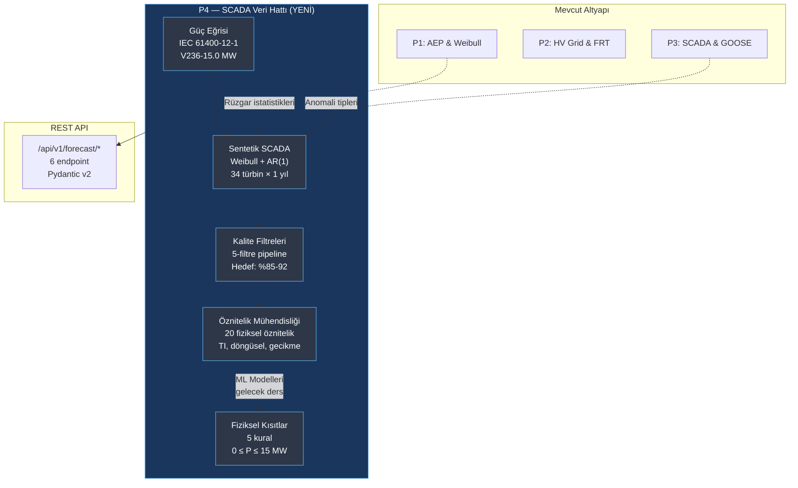

# Ders 012 — SCADA Veri Hattı: Güç Eğrisi, Sentetik Üretim, Kalite Filtreleri & Fiziksel Kısıtlar

!!! abstract "Ders Navigasyonu"
    :material-arrow-left: **Önceki:** [Ders 011 — IEC 62443 RBAC & 9 Durumlu Permit-to-Work Yaşam Döngüsü](lesson-011.md) | **Sonraki:** Yakında :material-arrow-right:

    **Faz:** P4 | **Dil:** Türkçe | **İlerleme:** 1 / ? | [Tüm Dersler](index.md) | [Öğrenme Yol Haritası](../Learning_Roadmap.md)

> **Date:** 2026-02-26
> **Commits:** 1 commit (`04dbe99` → `04dbe99`)
> **Commit range:** `04dbe99379629020ad725f3eaf168293b07e9f57..04dbe99379629020ad725f3eaf168293b07e9f57`
> **Phase:** P4 (AI Forecasting)
> **Roadmap sections:** [Phase 4 — Section 4.1 Time-Series Forecasting Fundamentals, Section 4.4 Wind Power Forecasting]
> **Language:** Turkish
> **Previous lesson:** Lesson 011
> **last_commit_hash:** 04dbe99379629020ad725f3eaf168293b07e9f57

---

## Ne Öğreneceksiniz

- Rüzgar türbini güç eğrisinin (power curve) IEC 61400-12-1 standardına göre nasıl modellendiğini ve P = 0.5 × ρ × A × Cp × v³ formülünün 4 bölgesini anlama
- 34 türbinlik bir rüzgar çiftliği için gerçekçi sentetik SCADA verisi üretme: Weibull dağılımı, AR(1) zamansal korelasyon ve anomali enjeksiyonu
- IEC 61400-12-1 Ek A'ya dayalı 5 katmanlı kalite filtresi hattını (pipeline) uygulama: kısıtlama, bakım, sensör arızası, güç eğrisi aykırı değer ve buzlanma
- Ham SCADA ölçümlerini ML-hazır özniteliklere (feature) dönüştürme: türbülans yoğunluğu, döngüsel zaman kodlama, gecikme değerleri ve iz yönü göstergesi
- ML tahminlerini fiziksel gerçeklikle uyumlu hale getiren 5 kısıt kuralını (constraint) uygulama: negatif güç yok, nominal kapasite sınırı, cut-in/cut-out kuralları ve çiftlik toplam sınırı

---

## Bölüm 1: Güç Eğrisi — Rüzgârdan Elektriğe Dönüşümün Fiziksel Haritası

### Gerçek Dünyadan Bir Problem

Bir arabanın motor devir-tork eğrisini düşünün: belirli bir hızın altında motor dönmez, belirli bir aralıkta en verimli çalışır, aşırı devirde ise güvenlik sistemi devreye girip motoru keser. Rüzgar türbini de tam olarak böyle çalışır — güç eğrisi, rüzgar hızı ile elektrik çıkışı arasındaki "kullanma kılavuzu"dur. Bu eğriyi bilmeden ne SCADA verisi üretebilir, ne kalite filtresi yazabilir, ne de ML modeli doğrulayabilirsiniz.

### Standartlar Ne Diyor?

**IEC 61400-12-1 (Güç Performansı Ölçümleri)** rüzgar türbinlerinin güç eğrisi ölçüm yöntemini tanımlar:

- Hub yüksekliğinde kalibre edilmiş anemometre ile rüzgar hızı ölçümü
- 10 dakikalık ortalamalar (SCADA kayıt aralığı ile uyumlu)
- Referans koşullara hava yoğunluğu düzeltmesi (1.225 kg/m³, 15°C, 1013.25 hPa)
- **Bins yöntemi** (method of bins): veriler 0.5 m/s'lik kutulara gruplandırılır

Güç eğrisinin 4 farklı bölgesi vardır:

| Bölge | Rüzgar Hızı | Davranış | Fizik |
|-------|-------------|----------|-------|
| 1 | v < 3.0 m/s | P = 0 | Aerodinamik tork, tahrik sistemi sürtünmesini yenemez |
| 2 | 3.0 ≤ v < 12.5 m/s | P ∝ v³ | Maksimum enerji yakalama (Cp optimizasyonu) |
| 3 | 12.5 ≤ v ≤ 31.0 m/s | P = P_nominal | Kanat açısı (pitch) ile sabit güç kontrolü |
| 4 | v > 31.0 m/s | P = 0 | Güvenlik kapatması (blade feathering) |

### Ne İnşa Ettik?

**Değişen dosyalar:**

- `backend/app/services/p4/turbine_power_curve.py` — V236-15.0 MW türbin güç eğrisi modeli, Cp/Ct eğrileri ve interpolasyon fonksiyonları
- `backend/tests/test_turbine_power_curve.py` — Güç eğrisi doğrulama testleri (194 satır)

Vestas V236-15.0 MW türbin spesifikasyonunu bir `frozen dataclass` olarak modelledik. Rotor çapı 236 m (süpürme alanı: π × 118² = 43.743 m²), hub yüksekliği 140 m, nominal güç 15.0 MW. Tüm P4 modülleri bu spesifikasyonu referans alır.

Güç hesaplaması dört adımda gerçekleşir: (1) rüzgar hızı dizisi oluştur, (2) Cp eğrisini hesapla, (3) P = 0.5 × ρ × A × Cp × v³ formülünü uygula, (4) nominal güce kırp (clamp).

### Neden Önemli?

> **Neden** güç eğrisini tüm hattın ilk modülü olarak inşa ediyoruz?
> Çünkü güç eğrisi, SCADA üretici için "doğru cevabı" sağlar; kalite filtreleri için "beklenen değeri" tanımlar; ve ML tahminlerinin doğrulanacağı fiziksel referanstır. Tek bir modül değiştirirseniz tüm hat etkilenir — bu yüzden temel (foundation) olarak ilk sırada gelir.

> **Neden** `frozen=True` dataclass kullanıyoruz?
> Simülasyon sırasında türbin parametrelerinin kazara değiştirilmesini önlemek için. `TurbineSpec(rated_power_mw=15.0)` oluşturulduktan sonra `spec.rated_power_mw = 20.0` yazmak `FrozenInstanceError` fırlatır. Bu, fiziksel sabitlerin değişmezliğini (immutability) kod düzeyinde garanti eder.

### Kod İncelemesi

Güç eğrisi hesaplamasının çekirdeği, Cp (güç katsayısı) eğrisidir. Bölge 2'de sinüzoidal bir profil kullanarak sıfırdan Cp_max'a yumuşak bir geçiş sağlanır; Bölge 3'te ise Cp, sabit güç çıkışını korumak için azalır:

```python
def _compute_cp_curve(
    wind_speeds: NDArray[np.float64],
    spec: TurbineSpec,
) -> NDArray[np.float64]:
    cp = np.zeros_like(wind_speeds)
    swept_area = compute_swept_area_m2(spec.rotor_diameter_m)

    for i, v in enumerate(wind_speeds):
        if v < spec.cut_in_speed_ms or v > spec.cut_out_speed_ms:
            cp[i] = 0.0                          # Bölge 1 ve 4: türbin kapalı
        elif v < spec.rated_speed_ms:
            # Bölge 2: sin(x) profili ile Cp artışı
            frac = (v - spec.cut_in_speed_ms) / (spec.rated_speed_ms - spec.cut_in_speed_ms)
            cp[i] = spec.cp_max * math.sin(frac * math.pi / 2.0)
        else:
            # Bölge 3: sabit güç = Cp azalır
            p_available = 0.5 * STANDARD_AIR_DENSITY * swept_area * v**3
            cp[i] = (spec.rated_power_mw * 1e6) / p_available
    return cp
```

Neden `sin(frac × π/2)` profili? Doğrusal bir artış (frac × Cp_max) gerçek türbin davranışını yansıtmaz — gerçekte Cp, optimal uç hızı oranına (tip-speed ratio) yaklaştıkça hızla yükselir, sonra düzleşir. Sinüs profili bu davranışı basit ama fiziksel olarak anlamlı bir şekilde yakalar.

Güç hesaplamasının kendisi doğrudan formülü uygular ve ardından güvenlik sınırlamalarını ekler:

```python
# P = 0.5 × ρ × A × Cp × v³
power_w = 0.5 * rho * swept_area * cp * wind_speeds**3
power_mw = power_w / 1e6

# Nominal güce kırpma (sayısal güvenlik)
power_mw = np.clip(power_mw, 0.0, spec.rated_power_mw)

# Çalışma aralığı dışında sıfırlama
power_mw[wind_speeds < spec.cut_in_speed_ms] = 0.0
power_mw[wind_speeds > spec.cut_out_speed_ms] = 0.0
```

`np.clip` işlemi, kayan nokta hassasiyeti nedeniyle 15.0000001 MW gibi değerleri önler. `interpolate_power_mw` fonksiyonu ise `np.interp` kullanarak önceden hesaplanmış eğri üzerinden keyfi rüzgar hızları için güç çıkışını verir — SCADA üretici ve ML doğrulama modülleri bu arayüzü kullanır.

### Temel Kavram

!!! tip "Temel Kavram: Betz Limiti"
    **Basitçe:** Bir rüzgar türbini, rüzgârdaki enerjinin tamamını alamaz — alabileceği teorik maksimum %59.3'tür (Betz limiti). Neden? Eğer tüm enerjiyi alsaydı, hava durur ve arkadan gelen rüzgar akamaz. Türbin "bir miktar rüzgârı geçirmek" zorundadır.

    **Analoji:** Bir su çarkı düşünün: suyun tamamını tutarsanız ark durur ve çark da durur. Optimal çalışma, suyun bir kısmını geçirip bir kısmının enerjisini almaktır.

    **Bu projede:** V236-15.0 MW türbinimiz Cp_max = 0.48 kullanır — Betz limitinin (0.593) %81'i. Bu, modern türbinler için gerçekçi bir değerdir (0.45-0.50 aralığı).

---

## Bölüm 2: Sentetik SCADA Üretimi — 34 Türbin İçin Bir Yıllık Veri

### Gerçek Dünyadan Bir Problem

Bir pilotun uçuş simülatöründe antrenman yapmasına benzer şekilde, ML modellerimizi eğitmeden önce gerçekçi ama kontrollü veri gerekir. Gerçek SCADA verisi pahalı, gizli ve anomali oranları belgelenmemiştir. Sentetik veri ile: (1) kontrol edilen anomali oranlarını biliyoruz, (2) filtrelerin başarısını ölçebiliyoruz, (3) sonuçlar tekrarlanabilir (reproducible).

### Standartlar Ne Diyor?

**IEC 61400-12-1** SCADA kaydı gereksinimlerini tanımlar:

- 10 dakikalık ortalama periyot
- Hub yüksekliğinde rüzgar hızı (anemometre, düzeltilmiş)
- Aktif güç çıkışı (türbin terminalleri)
- Ortam sıcaklığı, nem, basınç
- Rüzgar yönü (nacelle üzeri vane)
- Türbin operasyonel durumu

### Ne İnşa Ettik?

**Değişen dosyalar:**

- `backend/app/services/p4/scada_generator.py` — 34 türbinlik sentetik SCADA üreteci (420 satır)
- `backend/tests/test_scada_generator.py` — Üretici doğrulama testleri (170 satır)

Üretici 7 adımlı bir hat (pipeline) izler:

1. **Weibull dağılımı** ile temel rüzgar hızı üretimi (a=10.5, k=2.2 — Baltık Denizi referansı)
2. **AR(1) zamansal düzgünleştirme** (φ=0.95) — ardışık 10 dakikalık okumalar arasında gerçekçi korelasyon
3. **Türbin başına pertürbasyon** (±%8) — iz etkileri ve mikro-konumlandırma farkları
4. **Güç eğrisinden güç hesabı** + %2 ölçüm gürültüsü
5. **Rüzgar yönü** — 240° WSW baskın yön, yavaş sapma
6. **Ortam koşulları** — mevsimsel sıcaklık (ortalama 8°C, ±12°C), nem, basınç
7. **Anomali enjeksiyonu** — kısıtlama, bakım, donmuş anemometre, aşırı güç, buzlanma

### Neden Önemli?

> **Neden** AR(1) süreci kullanıyoruz, neden doğrudan Weibull örnekleri değil?
> Gerçek rüzgar hızı ölçümleri yüksek zamansal korelasyona sahiptir: 10 dakika önce 8 m/s esen rüzgar, büyük olasılıkla şimdi de 7-9 m/s civarındadır. Bağımsız Weibull örnekleri bu korelasyonu yakalar: ardışık değerler arasında "zıplama" olur ve ML modeli gerçekçi olmayan kalıplar öğrenir. AR(1) formülü `v(t) = 0.95 × v(t-1) + 0.05 × v_weibull(t)`, %95 geçmiş + %5 yeni bilgi olarak okunabilir.

> **Neden** anomali oranlarını yapılandırılabilir (configurable) tuttuk?
> Filtrelerin farklı anomali yoğunluklarında başarısını test etmek için. Varsayılan oranlar (%2 kısıtlama, %3 bakım, %0.5 donmuş anemometre, %0.3 aşırı güç, %1 buzlanma) endüstri verilerine dayanır, ancak araştırma amaçlı değiştirilebilir olması gerekir.

### Kod İncelemesi

Zamansal korelasyonun AR(1) ile nasıl sağlandığını inceleyelim:

```python
def _generate_base_wind(rng, config):
    # 1. Ham Weibull örnekleri
    weibull_raw = rng.weibull(config.weibull_k, size=config.num_timesteps)
    weibull_scaled = config.weibull_a * weibull_raw

    # 2. AR(1) zamansal düzgünleştirme
    wind = np.zeros(config.num_timesteps, dtype=np.float64)
    wind[0] = weibull_scaled[0]
    phi = config.ar1_phi  # 0.95

    for t in range(1, config.num_timesteps):
        wind[t] = phi * wind[t - 1] + (1.0 - phi) * weibull_scaled[t]

    return np.maximum(wind, 0.0)  # Negatif hız fiziksel olarak imkansız
```

`phi = 0.95` değeri neden bu kadar yüksek? Offshore rüzgar koşullarında 10 dakikalık ölçümler arasındaki otokorelasyon tipik olarak 0.90-0.97 aralığındadır. 0.95 değeri bu aralığın ortasıdır ve sentetik verinin istatistiksel özelliklerini gerçek verilere yaklaştırır.

Anomali enjeksiyonu her türbin için bağımsız olarak uygulanır. Bakım olayları çok saatlik bloklar halinde gelir (12-48 ardışık adım = 2-8 saat) — bu gerçek dünyada bir teknisyenin gelmesi, çalışması ve ayrılması sürecini yansıtır:

```python
# Bakım: çok saatlik sıfır güç blokları
n_maint_events = max(1, int(num_t * config.maintenance_rate / 24))
for _ in range(n_maint_events):
    start = rng.integers(0, num_t - 48)
    duration = rng.integers(12, 48)  # 2-8 saat
    end = min(start + duration, num_t)
    power[start:end, turb] = 0.0
    status[start:end, turb] = "maintenance"
```

Her anomali tipinin `status` dizisinde farklı bir etiketi vardır — bu etiketler kalite filtrelerinin doğruluk ölçümlerinde "ground truth" olarak kullanılır.

### Temel Kavram

!!! tip "Temel Kavram: Weibull Dağılımı"
    **Basitçe:** Weibull dağılımı, rüzgar hızının "olasılık haritası"dır. Parametresi a (ölçek) "ortalama rüzgar ne kadar güçlü?" sorusunu, k (biçim) ise "rüzgar ne kadar kararlı?" sorusunu yanıtlar. k=2 ise rüzgar Rayleigh dağılımına uyar (yaygın offshore dağılım); k>2 ise daha dar bir aralıkta yoğunlaşır.

    **Analoji:** Bir yarış pistinde lap süreleri düşünün: ortalama lap süresi a'dır, k ise sürücünün ne kadar tutarlı olduğudur. Yüksek k = dar aralıkta süreler, düşük k = hem çok hızlı hem çok yavaş turlar.

    **Bu projede:** a=10.5 m/s ve k=2.2 parametreleri, Polonya Baltık Denizi'nin 140 m hub yüksekliğindeki tipik rüzgar istatistiklerini temsil eder. Ortalama rüzgar hızı ≈ 9.3 m/s, AEP hesaplamaları bu dağılıma dayalıdır.

---

## Bölüm 3: Kalite Filtreleri — "Çöp Girer, Çöp Çıkar"ın Önlenmesi

### Gerçek Dünyadan Bir Problem

Bir aşçının pişirmeden önce sebzeleri ayıklamasına benzer: çürük, böcekli veya yanlış malzeme ile iyi bir yemek yapılamaz. SCADA verisi de "çöp" içerir — kısıtlama dönemleri, bakım süreleri, donmuş sensörler, buzlanma. Bu veriyi filtrelemeden ML modeli eğitmek, modele "arıza nasıl tahmin edilir" öğretir — "normal güç nasıl tahmin edilir" değil.

### Standartlar Ne Diyor?

**IEC 61400-12-1 Ek A** veri dışlama kriterlerini tanımlar:

- Türbin normal operasyonda olmadığı dönemlerin çıkarılması
- Bilinen kısıtlama veya güç sınırlama dönemlerinin çıkarılması
- Tanımlanan sensör arızalarının çıkarılması
- Her rüzgar hızı kutusu başına istatistiksel aykırı değer tespiti

Beş filtremiz bu standardı ML'e özel kontrollerle genişletir:

| Filtre | Yöntem | Eşik |
|--------|--------|------|
| 1. Kısıtlama | P ≈ 0 ama v > cut-in | P < 0.1 MW ve durum ≠ bakım |
| 2. Bakım | Operasyonel durum | status ≠ "running" |
| 3. Sensör arızası | Donmuş anemometre + aşırı güç | σ(v) < 0.01 @ 6 adım; P > 1.05 × P_nominal |
| 4. Güç eğrisi aykırı değer | IQR yöntemi (bins) | [Q1-1.5×IQR, Q3+1.5×IQR] |
| 5. Buzlanma | Performans + meteoroloji | P < 0.5×P_beklenen ve nem > %95 ve T < 2°C |

### Ne İnşa Ettik?

**Değişen dosyalar:**

- `backend/app/services/p4/scada_quality_filters.py` — 5 kalite filtresi pipeline'ı (383 satır)
- `backend/tests/test_scada_quality_filters.py` — Filtre doğrulama testleri (211 satır)

Her filtre bağımsız çalışır ve boolean maske döndürür. Maskeler OR-birleşimi ile kombine edilir: herhangi bir filtre tarafından işaretlenen veri noktası "temiz değil" olarak etiketlenir. Hedef kullanılabilirlik: %85-92.

### Neden Önemli?

> **Neden** 5 filtre bağımsız olarak uygulanıyor, neden sıralı (sequential) değil?
> Bağımsız uygulama, her filtrenin ne kadar veri çıkardığını izole olarak ölçmemizi sağlar. Eğer Filtre 3 (sensör) verilerin %15'ini çıkarıyorsa, bu sensör kalitesinde sorun olduğunu gösterir — tüm hat sıralı olsaydı bu bilgi kaybolurdu. `counts_by_filter` sözlüğü bu tanılamayı mümkün kılar.

> **Neden** IQR yöntemini z-skoru yerine tercih ediyoruz?
> IQR (çeyrekler arası aralık) yöntemi, aykırı değerlerin kendilerinden etkilenmez — Q1 ve Q3 değerleri aykırı değerlere dayanıklıdır (robust). Z-skoru ise ortalama ve standart sapmaya dayalıdır ve aykırı değerler bu istatistikleri çarpıtır. Rüzgar türbini güç verisinde %5-10 anomali tipiktir, bu da z-skorunu güvenilmez kılar.

### Kod İncelemesi

IQR tabanlı güç eğrisi aykırı değer tespiti, IEC 61400-12-1'in bins yöntemini uygular:

```python
def detect_power_curve_outliers(wind_speed, power, bin_width_ms=1.0, iqr_multiplier=1.5):
    flagged = np.zeros((num_t, num_turb), dtype=np.bool_)

    for turb in range(num_turb):
        for b in range(len(bin_edges) - 1):
            bin_mask = (ws_col >= bin_edges[b]) & (ws_col < bin_edges[b + 1])
            bin_indices = np.where(bin_mask)[0]
            if len(bin_indices) < 10:
                continue  # Seyrek kutuları atla — istatistik güvenilmez

            bin_power = pwr_col[bin_indices]
            q1 = np.percentile(bin_power, 25)
            q3 = np.percentile(bin_power, 75)
            iqr = q3 - q1
            lower = q1 - iqr_multiplier * iqr  # Alt sınır
            upper = q3 + iqr_multiplier * iqr  # Üst sınır

            outliers = (bin_power < lower) | (bin_power > upper)
            flagged[bin_indices[outliers], turb] = True
    return flagged
```

Neden `len(bin_indices) < 10` kontrolü? 10'dan az veri noktası olan kutularda Q1/Q3 hesaplaması istatistiksel olarak güvenilmez olur — tek bir anomali tüm kutuyu geçersiz kılabilir. Bu eşik, "istatistiksel güven için minimum örneklem" prensibidir.

Beş filtrenin birleşimi sade ve açıktır:

```python
any_flagged = (curtailment_mask | maintenance_mask |
               sensor_mask | outlier_mask | icing_mask)
clean_mask = ~any_flagged  # Temiz veri: hiçbir filtre tarafından işaretlenmemiş
```

`FilterResult` nesnesi, `counts_by_filter` sözlüğü ile her filtrenin kaç veri noktası çıkardığını raporlar. `availability_pct` değeri %85-92 hedefindedir — çok düşükse verinin çoğu çöptür, çok yüksekse filtreler yetersizdir.

### Temel Kavram

!!! tip "Temel Kavram: IQR Aykırı Değer Tespiti"
    **Basitçe:** Bir sınıftaki sınav notlarını düşünün. Ortanın altındaki ve üstündeki %25'lik dilimleri çizin (Q1 ve Q3). Bu iki çizgi arasındaki mesafe IQR'dir. Eğer bir not Q1'in 1.5×IQR altında veya Q3'ün 1.5×IQR üstündeyse — bu "şüpheli derecede farklı"dır.

    **Analoji:** Bir futbol takımının gol istatistiklerini düşünün: maç başına 1-3 gol normaldir. Ama bir maçta 15 gol atıldıysa, bu muhtemelen bir veri hatası veya olağandışı bir durumdur — IQR yöntemi bunu yakalar.

    **Bu projede:** Her 1 m/s'lik rüzgar hızı kutusu için güç değerlerinin IQR'sini hesaplıyoruz. 8 m/s'de beklenen güç 5-7 MW ise, 0.1 MW veya 14 MW okuması kesinlikle bir anomalidir.

---

## Bölüm 4: Öznitelik Mühendisliği — Ham Veriden ML-Hazır Matrise

### Gerçek Dünyadan Bir Problem

Bir doktora hastanın sadece "ateşim var" demesinin yetmeyeceğini düşünün — tansiyonunu, nabzını, kan değerlerini de ister. Ham SCADA kanalları (rüzgar hızı, yön, sıcaklık) tek başına yeterli değildir. ML modeli "ateş" gibi ham veriyi değil, "12 saatlik trendi", "günün hangi saati olduğunu" ve "rüzgarın çiftlik ekseniyle açısını" bilmelidir.

### Standartlar Ne Diyor?

**IEC 61400-1** türbülans yoğunluğunu (turbulence intensity) tanımlar:

- TI = σ₁ / V_hub (10 dakikalık standart sapma / ortalama hız)
- IEC türbülans sınıfları: A (I_ref=0.16), B (0.14), C (0.12)
- Baltık offshore siteleri tipik olarak C sınıfındadır (I_ref ≈ 0.06-0.10)

### Ne İnşa Ettik?

**Değişen dosyalar:**

- `backend/app/services/p4/feature_engineering.py` — Fiziksel öznitelik mühendisliği hattı (425 satır)
- `backend/tests/test_feature_engineering.py` — Öznitelik doğrulama testleri (258 satır)

20 öznitelik üreten bir hat inşa ettik:

| Öznitelik Grubu | Sayı | Formül |
|-----------------|------|--------|
| Rüzgar hızı + yuvarlanan istatistikler | 3 | ws, mean(ws, 1h), std(ws, 1h) |
| Türbülans yoğunluğu | 1 | TI = σ / μ |
| Rüzgar yönü + değişim hızı | 2 | wd, \|Δwd/Δt\| |
| Hava yoğunluğu | 1 | ρ = P/(R × T_K) |
| Meteoroloji | 2 | sıcaklık, nem |
| Döngüsel zaman | 4 | sin/cos(saat), sin/cos(ay) |
| İz yönü göstergesi | 1 | cos(wd - çiftlik_ekseni) |
| Güç gecikme değerleri | 6 | P(t-1)...P(t-6) |

### Neden Önemli?

> **Neden** saati doğrudan bir sayı (0-23) olarak değil de sin/cos çifti olarak kodluyoruz?
> Çünkü saat 23 ve saat 0 gerçekte 1 saat uzaklıktadır, ama sayısal olarak 23 birim uzaklıktadır. ML modeli bu "süreksizliği" (discontinuity) öğrenemez. Döngüsel kodlama ile: `sin²(x) + cos²(x) = 1` her zaman geçerlidir ve saat 23→0 geçişi düzgün bir sinüs eğrisidir — süreksizlik yoktur.

> **Neden** NaN değerleri doldurmak yerine satırları düşürüyoruz (drop)?
> Gecikme (lag) ve yuvarlanan (rolling) öznitelikler, zaman serisinin başında tanımsızdır: P(t-1) ilk adımda yoktur, 1 saatlik ortalama ilk 5 adımda hesaplanamaz. Bu NaN'leri sıfır veya ortalama ile doldurmak "gelecekten bilgi sızıntısı" (data leakage) yaratır. Doğru yaklaşım: bu satırları sessizce bırakmaktır. `dropped_timesteps` alanı kaç satır düştüğünü raporlar.

### Kod İncelemesi

Döngüsel zaman kodlaması, bir çember üzerindeki konum olarak düşünülebilir:

```python
def compute_cyclical_time_features(timestamps):
    # Gün içi saat: Unix epoch → günlük saniye → saat
    seconds_in_day = timestamps % 86400
    hours = seconds_in_day / 3600.0

    # Yıl içi ay yaklaşımı
    day_of_year = (timestamps % (365 * 86400)) / 86400.0
    month_approx = day_of_year / 30.44  # Ortalama ay uzunluğu

    hour_sin = np.sin(2.0 * np.pi * hours / 24.0)
    hour_cos = np.cos(2.0 * np.pi * hours / 24.0)
    month_sin = np.sin(2.0 * np.pi * month_approx / 12.0)
    month_cos = np.cos(2.0 * np.pi * month_approx / 12.0)

    return hour_sin, hour_cos, month_sin, month_cos
```

Sin ve cos'u birlikte kullanmanın kritik bir matematiksel nedeni vardır: tek başına sin(saat) ile saat 6 ve saat 18 aynı değeri (0) alır — ayırt edilemez. Cos eklendiğinde saat 6 → (0, -1) ve saat 18 → (0, 1) olur — artık benzersizdir.

İz yönü göstergesi, rüzgar yönünün çiftlik dizilim eksenine göre iz potansiyelini ölçer:

```python
def compute_wake_direction_indicator(wind_direction_deg, farm_alignment_deg=210.0):
    angle_diff_rad = np.radians(wind_direction_deg - farm_alignment_deg)
    return np.cos(angle_diff_rad)
```

`cos(0°) = 1.0`: rüzgar tam çiftlik ekseni boyunca esiyor → iz etkisi maksimum. `cos(90°) = 0.0`: rüzgar dik esiyor → iz etkisi minimum. Bu tek sayı, ML modeline karmaşık iz fiziğini basit bir sinyal olarak iletir.

### Temel Kavram

!!! tip "Temel Kavram: Gelecekten Bilgi Sızıntısı (Data Leakage)"
    **Basitçe:** Bir sınava girmeden önce cevap anahtarını görmek — sonuç mükemmel ama gerçek bilgiyi ölçmez. ML'de gelecek verinin eğitime sızması aynı şeydir.

    **Analoji:** Yarının hava durumunu bilip bugünün tahminini "doğrulamak" gibidir. Sonuç her zaman mükemmel çıkar, ama model gerçekte hiçbir şey öğrenmemiştir.

    **Bu projede:** Gecikme öznitelikleri yalnızca geçmişe bakar: P(t-1) = bir önceki adımın gücü. NaN olan ilk 6 satır düşürülür, asla doldurulmaz. Bu katı kural, modelin yalnızca t anına kadar mevcut bilgi ile tahmin yapmasını garanti eder.

---

## Bölüm 5: Fiziksel Kısıtlar — ML'in Fizik Kurallarını Çiğnememesi

### Gerçek Dünyadan Bir Problem

Bir navigasyon uygulaması size "denizin üzerinden yürüyerek gidin" diyorsa, harita doğru olsa bile rota fiziksel olarak imkansızdır. ML modelleri de benzer şekilde fiziksel olarak imkansız tahminler üretebilir: negatif güç, nominal kapasitenin üzerinde güç, veya rüzgar yokken elektrik üretimi. Fiziksel kısıt katmanı, bu "deniz üzerinde yürüme" önerilerini engelleyen son güvenlik ağıdır.

### Standartlar Ne Diyor?

**IEC 61400-12-1** güç eğrisinin geçerli çalışma zarfını (operating envelope) tanımlar. Tahminler bu zarfın dışında olamaz:

- Bölge 1 (v < 3.0 m/s): P zorunlu olarak 0 MW
- Bölge 3 (v_nominal ≤ v ≤ v_cut-out): P ≤ P_nominal (15.0 MW)
- Bölge 4 (v > 31.0 m/s): P zorunlu olarak 0 MW

### Ne İnşa Ettik?

**Değişen dosyalar:**

- `backend/app/services/p4/physical_constraints.py` — Fiziksel kısıt uygulama katmanı (303 satır)
- `backend/tests/test_physical_constraints.py` — Kısıt doğrulama testleri (131 satır)

Beş kısıt kuralı, her ML tahminini fiziksel gerçeklikle doğrular:

| Kısıt | Kural | Öncelik |
|-------|-------|---------|
| C1 | P ≥ 0 (negatif güç yok) | Düşük |
| C2 | P ≤ 15.0 MW (nominal kapasite) | Düşük |
| C3 | v < 3.0 m/s → P = 0 | Yüksek (C1/C2'yi geçersiz kılar) |
| C4 | v > 31.0 m/s → P = 0 | Yüksek (C1/C2'yi geçersiz kılar) |
| C5 | Σ P_i ≤ 510 MW (çiftlik toplam sınırı) | Çiftlik düzeyi |

### Neden Önemli?

> **Neden** kısıtları model eğitimi sırasında değil de çıktıda (post-processing) uyguluyoruz?
> İki nedeni var: (1) Model mimarisi bağımsızlığı — XGBoost, LSTM veya TFT fark etmez, aynı kısıt katmanını kullanır. (2) Sorun ayırma (separation of concerns) — model istatistiksel kalıpları öğrenir, fizik kurallarını uygulama ayrı bir modülün sorumluluğudur. Bu mimari, modelin değişmesiyle kısıt kodunun değişmesini engeller.

> **Neden** rüzgar tabanlı kısıtlar (C3/C4) güç tabanlı kısıtları (C1/C2) geçersiz kılar?
> Fiziksel hiyerarşi: rüzgar yoksa güç üretimi fiziksel olarak imkansızdır — C1/C2'nin "0-15 aralığında izin ver" demesi anlamsızdır. C3/C4 "kanat dönemez" der ve bu kural mutlaktır.

### Kod İncelemesi

Kısıt uygulama sırası kritiktir — C1/C2 önce, ardından C3/C4 geçersiz kılma:

```python
def enforce_physical_constraints(power_mw, wind_speed_ms=None, ...):
    corrected = power_mw.copy()
    violations = []

    # C1: Negatif güç yok
    neg_mask = corrected < 0.0
    corrected[neg_mask] = 0.0

    # C2: Nominal kapasite sınırı
    over_mask = corrected > rated_power_mw
    corrected[over_mask] = rated_power_mw

    # C3 & C4: Rüzgar tabanlı kurallar (üste yazma)
    if wind_speed_ms is not None:
        corrected[wind_speed_ms < cut_in_ms] = 0.0   # Cut-in altı
        corrected[wind_speed_ms > cut_out_ms] = 0.0   # Cut-out üstü

    return ConstraintResult(power_mw=corrected, violations=violations, ...)
```

Her ihlal bir `ConstraintViolation` kaydına yazılır: hangi kısıt, hangi adım, orijinal değer ve düzeltilmiş değer. Bu kayıtlar hem hata ayıklama hem de model iyileştirme için kullanılır — eğer C1 ihlalleri çok fazlaysa, model negatif tahmin üretme eğilimindedir ve bu eğitim verisindeki bir soruna işaret eder.

Çiftlik düzeyinde C5 kısıtı, toplam gücün 510 MW'ı aşması durumunda orantılı ölçekleme uygular:

```python
# C5: Çiftlik toplam sınırı — orantılı küçültme
farm_totals = np.sum(corrected_all, axis=1)
over_cap = farm_totals > farm_capacity  # 510 MW

for t_idx in np.where(over_cap)[0]:
    scale = farm_capacity / farm_totals[t_idx]
    corrected_all[t_idx, :] *= scale
```

Neden orantılı ölçekleme ve rastgele türbin seçerek kısma değil? Orantılı ölçekleme, yüksek güç üreten türbinleri daha fazla kısar (adil), düşük güç üretenleri daha az etkiler. Bu fiziksel olarak da anlamlıdır çünkü yüksek güçlü türbinler muhtemelen daha güçlü rüzgar görüyordur.

### Temel Kavram

!!! tip "Temel Kavram: Fizik Bilgilendirilmiş ML (Physics-Informed ML)"
    **Basitçe:** ML modeline "hayal gücünü sınırla" demek. Model ne kadar akıllı olursa olsun, fizik kurallarını çiğneyemez — tıpkı bir uçağın "yerçekimini görmezden gelerek" havalanamaması gibi.

    **Analoji:** Bir çocuk resim çizerken "gökyüzü yeşil, çimen mavi olamaz" kuralını bilir. Fiziksel kısıtlar, ML modelinin "yeşil gökyüzü" çizmesini engelleyen kurallardır.

    **Bu projede:** 5 kısıt kuralı, her ML tahmininin V236-15.0 MW türbinin fiziksel çalışma zarfı içinde kalmasını garanti eder. Sonuç: hem daha doğru tahminler hem de SCADA operatörlerinin güvenebileceği çıktılar.

---

## Bölüm 6: REST API & Pydantic Şemaları — Her Modülün Kapısı

### Gerçek Dünyadan Bir Problem

Bir restoranın mutfağı ne kadar iyi olursa olsun, müşteriye servis yapacak garsonlar ve menü yoksa işe yaramaz. Backend servis modüllerimiz "mutfak"tır; REST API uç noktaları ve Pydantic şemaları ise "garsonlar" ve "menü"dür. Doğru tanımlanmış arayüzler olmadan frontend bu modüllere ulaşamaz.

### Standartlar Ne Diyor?

OpenAPI (Swagger) spesifikasyonu, REST API'lerin otomatik belgelenmesini sağlar. FastAPI bu spesifikasyonu Pydantic modellerinden otomatik üretir. Her `Field(description=...)` bir API belgesi satırı haline gelir.

### Ne İnşa Ettik?

**Değişen dosyalar:**

- `backend/app/routers/p4.py` — 6 REST uç noktası (259 satır)
- `backend/app/schemas/forecast.py` — Pydantic v2 istek/yanıt şemaları (195 satır)
- `backend/app/services/p4/__init__.py` — Ortak dışa aktarımlar (63 satır)
- `backend/app/main.py` — P4 router kaydı (2 satır değişiklik)

Altı uç nokta `/api/v1/forecast/` altında:

| Endpoint | Metod | İşlev |
|----------|-------|-------|
| `/turbine-spec` | GET | V236-15.0 MW spesifikasyonu |
| `/power-curve` | POST | IEC 61400-12-1 güç eğrisi üretimi |
| `/generate-scada` | POST | Sentetik SCADA veri seti |
| `/quality-filter` | POST | 5-filtre kalite hattı |
| `/features` | POST | Öznitelik mühendisliği |
| `/check-constraints` | POST | Fiziksel kısıt doğrulaması |

### Neden Önemli?

> **Neden** SCADA veri setinin tamamını değil de özetini (summary) döndürüyoruz?
> 34 türbin × 52.560 adım × 8 kanal = ~14 milyon float değer → yaklaşık 110 MB JSON. Bu bir REST API yanıtı için aşırıdır. Özet (ortalamalar, durum sayıları, zaman aralığı) yeterlidir. Tam veri setine ihtiyaç varsa, bu bir batch export endpoint'i olmalıdır — farklı bir mimari kararıdır.

> **Neden** her istek şemasında `Field(ge=..., le=...)` kısıtlamaları var?
> Pydantic doğrulama, API sınırında "ilk savunma hattı"dır. `weibull_k: float = Field(ge=1.0, le=4.0)`, fiziksel olarak anlamsız parametreleri (k=0 veya k=100) HTTP 422 ile reddeder — bu, sunucu kodunun hiç çalışmamasını ve gereksiz hesaplama yapmamasını sağlar.

### Kod İncelemesi

Pydantic şemasında `Field` tanımlarının hem doğrulama hem de belgeleme rolü vardır:

```python
class PowerCurveRequest(BaseModel):
    wind_step_ms: float = Field(
        default=0.5,
        ge=0.1, le=2.0,  # Fiziksel sınırlar
        description="Wind speed bin width [m/s]. IEC 61400-12-1 default: 0.5",
    )
    air_density_kg_m3: float | None = Field(
        default=None,
        ge=0.8, le=1.6,  # Deniz seviyesi ±%30 marj
        description="Air density [kg/m³]. Default: 1.225 (standard conditions)",
    )
```

Her `description` string'i, FastAPI'nin `/docs` Swagger sayfasında otomatik olarak görünür. Bu, "kod belgeleme" değil "API belgeleme"dir — frontend geliştiricisi kaynak koda bakmadan neyi göndermesi gerektiğini anlar.

### Temel Kavram

!!! tip "Temel Kavram: Sınır Doğrulaması (Boundary Validation)"
    **Basitçe:** Bir binanın kapısındaki güvenlik kontrolü gibi — çantanıza bakmadan binaya giremezsiniz. API sınırı, dış dünyanın sisteme girdiği noktadır ve burada doğrulama yapılmazsa iç modüller güvensiz veriyle çalışır.

    **Analoji:** Bir havaalanının pasaport kontrolü: pasaportunuz geçersizse ülkeye giremezsiniz. İç şehir trafiğinde kimse pasaport sormaz — kontrol sınırda yapılır. Aynı şekilde, `enforce_physical_constraints` fonksiyonu dahili olarak parametre doğrulamaz çünkü API katmanı bunu zaten yapmıştır.

    **Bu projede:** Pydantic `Field(ge=1.0, le=4.0)` tanımları, fiziksel olarak anlamsız parametreleri API girişinde reddeder. Servis katmanı "temiz veri alıyorum" güvencesiyle çalışır.

---

## Bağlantılar

**Bu kavramların ileride kullanılacağı yerler:**

- **Güç eğrisi** (Bölüm 1) → P4'ün XGBoost ve LSTM modelleri, tahminlerini bu eğriye göre doğrulayacak
- **SCADA üretici** (Bölüm 2) → Sentetik veri, tüm P4 ML modellerinin eğitim seti olacak; ileride ERA5 + gerçek SCADA entegrasyonu ile karşılaştırılacak
- **Kalite filtreleri** (Bölüm 3) → SHAP açıklanabilirlik analizi, filtrelenmiş vs filtrelenmemiş veri farkını gösterecek
- **Öznitelik mühendisliği** (Bölüm 4) → XGBoost feature importance (gain/cover/SHAP) hangi özniteliklerin en değerli olduğunu ölçecek
- **Fiziksel kısıtlar** (Bölüm 5) → TFT multi-horizon tahminlerinde her adıma kısıt uygulanacak
- **P3 → P4 bağlantısı**: P3'teki SCADA cihaz kayıt sistemi (Ders 009) ve GOOSE fault simulation (Ders 010) bu SCADA verisi üzerine inşa edilir — anomali tipleri oradan gelir

---

## Büyük Resim

*Bu dersin odağı: **P4 SCADA veri hattının tamamı** — fiziksel güç eğrisinden kalite filtresine, öznitelik mühendisliğinden fiziksel kısıtlara.*



Tam sistem mimarisi için: [Dersler Genel Bakış](index.md#system-architecture)

---

## Temel Çıkarımlar

1. **Güç eğrisi, P4 hattının temel taşıdır** — SCADA üretimi, kalite filtreleme ve kısıt doğrulama hepsi bu eğriye bağlıdır.
2. **Sentetik veri, kontrollü deneyler sağlar** — anomali oranlarını bildiğiniz veri ile filtrelerin başarısını ölçebilirsiniz.
3. **AR(1) + Weibull kombinasyonu**, hem doğru uzun vadeli istatistikleri hem de gerçekçi kısa vadeli korelasyonu yakalar.
4. **"Veri kalitesi, model karmaşıklığından daha önemlidir"** — %10 anomalili veri ile eğitilen en gelişmiş model bile, temiz veri ile eğitilen basit bir modelin gerisinde kalır.
5. **IQR yöntemi, z-skorundan daha sağlamdır** — aykırı değerlere dayanıklıdır çünkü Q1/Q3 medyana dayalıdır, ortalamaya değil.
6. **Döngüsel zaman kodlaması, sin/cos çifti ile süreksizliği ortadan kaldırır** — ML modeli saati, ayı ve yönü doğru "mesafe" kavramıyla öğrenir.
7. **Fiziksel kısıtlar, model bağımsız bir son güvenlik ağıdır** — model değişse bile fizik kuralları sabittir.

---

## Önerilen Okumalar

*[Öğrenme Yol Haritası](../Learning_Roadmap.md) — Faz 4: Machine Learning for Energy*

| Kaynak | Tür | Neden Okumalı |
|--------|-----|---------------|
| Hyndman & Athanasopoulos — *Forecasting: Principles and Practice* (3rd Ed.) | Online ders kitabı (ücretsiz) | Zaman serisi çapraz doğrulama ve öznitelik mühendisliği temelleri — bu dersteki lag/rolling özniteliklerin teorik altyapısı |
| IEA Wind TCP Task 36 — *Forecasting for Wind Power* | Raporlar (ücretsiz) | Rüzgar gücü tahminlemesinde veri kalitesi ve ön işleme best practice'leri — kalite filtrelerimizin endüstri referansı |
| Chen & Guestrin (2016) — *XGBoost: A Scalable Tree Boosting System* | Makale | Feature importance kavramını anlamak için — öznitelik mühendisliği hattımızın bir sonraki aşamasında SHAP değerleri bu modelle hesaplanacak |
| Hong et al. (2020) — *Energy Forecasting: A Review* | Derleme makalesi | Enerji tahminlemesinde fiziksel kısıtların ML ile entegrasyonu — constraint enforcement katmanımızın akademik gerekçesi |

---

## Quiz — Anlayışınızı Test Edin

### Hatırlama Soruları

**S1:** Güç eğrisinin Bölge 3'ünde (12.5-31.0 m/s) güç neden sabit kalır, rüzgar hızı artmasına rağmen?

<details>
<summary>Cevap</summary>

Bölge 3'te pitch kontrol sistemi kanat açısını artırarak rüzgârdan yakalanan enerji oranını (Cp) düşürür. Rüzgar hızı arttıkça kullanılabilir güç (P_wind = 0.5ρAv³) artar, ancak Cp oranında azalarak çarpım sabit kalır: P_electrical = P_rated = 15.0 MW. Bu mekanizma generatörü ve mekanik bileşenleri aşırı yükten korur.

</details>

**S2:** SCADA üreticide AR(1) otokorelasyon katsayısı φ = 0.95 olarak ayarlanmıştır. Bu ne anlama gelir?

<details>
<summary>Cevap</summary>

φ = 0.95, her 10 dakikalık rüzgar hızı okumasının %95 oranında bir önceki okumaya, %5 oranında yeni Weibull örneklemine dayandığı anlamına gelir. Bu, offshore rüzgarın güçlü zamansal korelasyonunu (ardışık ölçümler benzer) yansıtır. Düşük φ değeri daha "zıpıtçı" veri üretir; yüksek φ değeri daha düzgün ama yavaş değişen rüzgar profili oluşturur.

</details>

**S3:** `apply_all_quality_filters` fonksiyonu kaç filtre uygular ve hedef kullanılabilirlik yüzdesi nedir?

<details>
<summary>Cevap</summary>

5 filtre uygular: (1) kısıtlama tespiti, (2) bakım dönemleri, (3) sensör arızaları (donmuş anemometre + aşırı güç), (4) güç eğrisi aykırı değerleri (IQR), (5) buzlanma tespiti. Hedef kullanılabilirlik %85-92'dir — çok düşükse verinin çoğu sorunludur, çok yüksekse filtreler yetersiz çalışıyordur.

</details>

### Anlama Soruları

**S4:** Döngüsel zaman kodlamasında neden sin ve cos birlikte kullanılır, tek başına sin yeterli değil midir?

<details>
<summary>Cevap</summary>

Tek başına sin(saat) ile saat 6 (gündoğumu) ve saat 18 (günbatımı) aynı sin değerini (0) alır — ML modeli bu iki farklı zamanı ayırt edemez. Cos eklenmesiyle saat 6 → (sin=0, cos=-1) ve saat 18 → (sin=0, cos=1) olur — her saat artık benzersiz bir 2D koordinata sahiptir. Matematiksel olarak, birim çember üzerinde her açı benzersiz bir (sin, cos) çiftine eşlenir.

</details>

**S5:** Fiziksel kısıt katmanı neden model eğitimi sırasında değil de çıktıda (post-processing) uygulanır?

<details>
<summary>Cevap</summary>

İki temel nedeni vardır: (1) Model bağımsızlığı — aynı kısıt katmanı XGBoost, LSTM veya TFT'den gelen tahminlere uygulanabilir, her model için ayrı kısıt yazılmaz. (2) Sorumluluk ayrımı (separation of concerns) — modelin görevi istatistiksel kalıpları öğrenmek, fizik kurallarını uygulamak ayrı bir modülün sorumluluğudur. Bu mimari, bir modül değiştiğinde diğerinin etkilenmemesini sağlar.

</details>

**S6:** IQR aykırı değer tespitinde `len(bin_indices) < 10` kontrolü neden gereklidir?

<details>
<summary>Cevap</summary>

10'dan az veri noktası olan rüzgar hızı kutularında Q1 ve Q3 hesaplaması istatistiksel olarak güvenilmez olur. Örneğin 3 veri noktası ile hesaplanan IQR, tek bir anomaliden büyük ölçüde etkilenir ve normal veri noktalarını yanlışlıkla "aykırı" olarak işaretleyebilir. Minimum 10 örneklem, yüzdelik hesaplamalarının makul bir güven düzeyinde yapılmasını sağlar. Bu "istatistiksel minimum örneklem" prensibi, yanlış pozitif oranını düşürür.

</details>

### Zorlayıcı Soru

**S7:** Mevcut sentetik SCADA üreticimiz türbinler arası iz etkisini (wake effect) yalnızca ±%8 rastgele pertürbasyon olarak modeller. Gerçek dünyada iz etkisi rüzgar yönüne ve türbin konumuna bağlıdır. P1'deki PyWake iz modeli ile P4 SCADA üreticisini nasıl entegre edersiniz? Hangi ek öznitelikler oluşturursunuz ve bu özniteliklerin öznitelik mühendisliği hattına etkisi ne olur?

<details>
<summary>Cevap</summary>

Entegrasyon 3 aşamada yapılabilir: (1) PyWake'in Jensen/Bastankhah iz modelinden, her türbin çifti ve rüzgar yönü kombinasyonu için bir "iz kayıp matrisi" (wake loss matrix) çıkarılır — bu matris, rüzgar yönüne göre hangi türbinin hangi türbini ne kadar etkilediğini sayısal olarak tanımlar. (2) SCADA üreticide mevcut sabit ±%8 pertürbasyon yerine, her adımda rüzgar yönünü kullanarak iz kayıp matrisinden ilgili satır çekilir ve güç azaltması uygulanır — böylece rüzgar doğudan estiğinde ve batıdan estiğinde farklı türbinler farklı oranlarda etkilenir. (3) Öznitelik mühendisliğinde yeni öznitelikler: (a) `wake_deficit_ratio` = gerçek güç / iz etkisiz beklenen güç, (b) `upstream_turbine_power` = en yakın üst rüzgar türbininin gücü (komşu etkisi göstergesi), (c) `effective_wind_speed` = iz kayıp düzeltilmiş rüzgar hızı. Bu öznitelikler mevcut `wake_direction_indicator`'ı zenginleştirir ve XGBoost'un feature importance analizinde iz etkisinin ML tahminindeki rolünü doğrudan ölçmeyi mümkün kılar.

</details>

---

## Mülakat Köşesi

### Basitçe Açıkla
*"Bugünün ana konusunu mühendis olmayan birine nasıl açıklarsınız?"*

Bir rüzgar çiftliği düşünün — denizde 34 dev pervane dönüyor. Bu pervanelerin her biri her 10 dakikada bir bilgisayarlara rapor gönderiyor: "Rüzgar şu kadar esiyor, ben şu kadar elektrik üretiyorum, sıcaklık bu." Bu raporlar SCADA verisi. Ama bu veride sorunlar var: bazen sensör bozuluyor ve yanlış sayı gönderiyor, bazen pervane bakıma alınıyor ama hâlâ rapor yazıyor, bazen buzlanma oluyor ve pervane normalden az elektrik üretiyor. Eğer bir yapay zeka modelini bu "bozuk" verilerle eğitirseniz, model bozuklukları öğrenir — normal davranışı değil.

Bizim yaptığımız şey bir boru hattı (pipeline) inşa etmek: önce "rüzgar hızı-elektrik" ilişkisinin fiziksel haritasını çıkardık (güç eğrisi), sonra bu haritayı kullanarak gerçekçi yapay veri ürettik, sonra 5 farklı filtre ile bozuk verileri ayıkladık, sonra yapay zekanın anlayacağı dilde yeni bilgiler türettik (öznitelik mühendisliği), en son da yapay zekanın önerilerini fizik kurallarıyla kontrol ettik. Sonuç: güvenilir tahminler.

### Teknik Olarak Açıkla
*"Bugünün ana konusunu bir mülakat paneline nasıl açıklarsınız?"*

IEC 61400-12-1 uyumlu bir güç eğrisi modelinden başlayarak, 34 türbinlik bir offshore rüzgar çiftliği için uçtan uca SCADA veri hazırlama hattı (data pipeline) inşa ettik. Güç eğrisi, Vestas V236-15.0 MW türbinin 4 bölgeli Cp/Ct profilini modelliyor — Region 2'de sinüzoidal Cp ramp, Region 3'te pitch-regulated sabit güç. Sentetik SCADA üretici, Weibull(a=10.5, k=2.2) dağılımı üzerine AR(1) zamansal düzgünleştirme (φ=0.95) uygulayarak 52.560 on-dakikalık adım × 34 türbin matris oluşturuyor; ardından %2 kısıtlama, %3 bakım, %0.5 donmuş anemometre, %0.3 aşırı güç ve %1 buzlanma anomalileri enjekte ediyor. 5 katmanlı kalite filtresi IEC 61400-12-1 Ek A'yı ML bağlamına genişletiyor — IQR tabanlı bin-bazlı aykırı değer tespiti, meteorolojik buzlanma korelasyonu ve durum bazlı bakım dışlama ile %85-92 hedef kullanılabilirliği sağlıyor. Öznitelik mühendisliği katmanı 20 fiziksel anlamlı öznitelik üretiyor: IEC 61400-1 türbülans yoğunluğu, döngüsel sin/cos zaman kodlaması (saat ve ay süreksizliğini ortadan kaldırır), 6 adımlık güç gecikmeleri (gelecek sızıntısı olmadan, NaN satırlar düşürülür), ve cos(wd - çiftlik_ekseni) iz yönü göstergesi. Son katman, 5 fiziksel kısıt kuralı (C1: non-negativity, C2: rated cap, C3/C4: cut-in/cut-out, C5: farm total 510 MW) ile model çıktılarını fiziksel çalışma zarfına kırpıyor. Tüm hat model-agnostiktir — XGBoost, LSTM veya TFT fark etmez. Mimari, separation of concerns prensibiyle her modülü bağımsız test edilebilir ve değiştirilebilir kılıyor.
