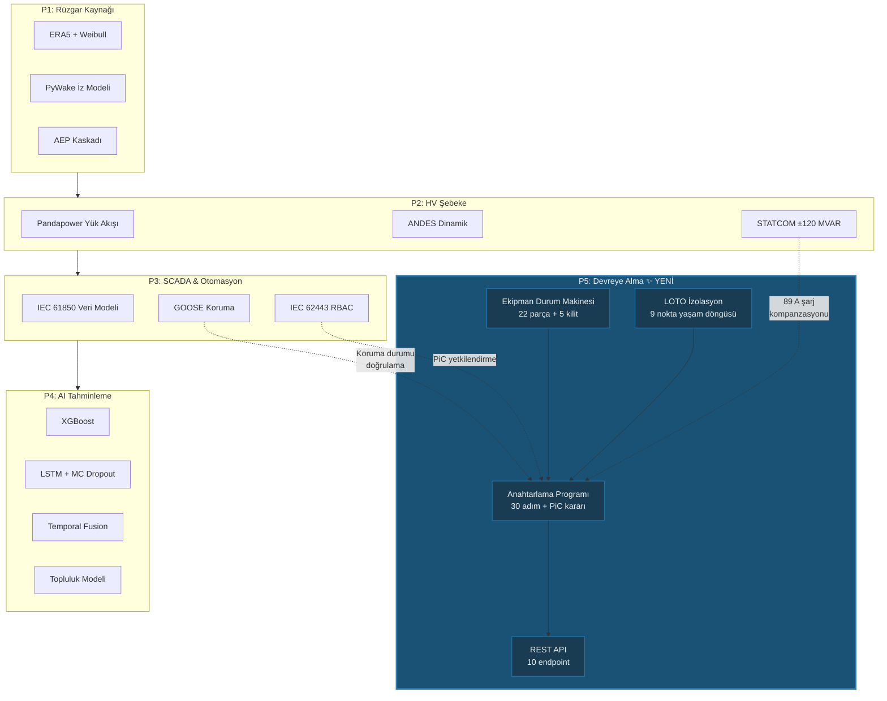

# Ders 017 — P5 Devreye Alma: Anahtarlama Programı, Ekipman Durum Makinesi ve LOTO İzolasyon Yönetimi

!!! abstract "Ders Navigasyonu"
    :material-arrow-left: **Önceki:** [Ders 016 — Topluluk Tahminleme, Rampa Tespiti ve Model Değerlendirme](lesson-016.md) | **Sonraki:** [Ders 018 — FAT/SAT Kabul Testleri, Koruma Rölesi Koordinasyonu ve SAT Kapısı](lesson-018.md) :material-arrow-right:

    **Faz:** P5 | **Dil:** Türkçe | **İlerleme:** 6 / ? | [Tüm Dersler](index.md) | [Öğrenme Yol Haritası](../Learning_Roadmap.md)

> **Date:** 2026-02-27
> **Commits:** 1 commit (`899acba`)
> **Commit range:** `f18235d826b06a920d1cee16d8df00ed31f6cddd..899acbae30461a0b26d3672e0bba93a3026f01dc`
> **Phase:** P5 (Commissioning)
> **Roadmap sections:** [Phase 5 — Section 5.1 HV Switching & Safety, Section 5.3 Testing & Commissioning]
> **Language:** Turkish
> **Previous lesson:** Lesson 016
> **last_commit_hash:** 899acbae30461a0b26d3672e0bba93a3026f01dc

---

## Ne Öğreneceksiniz

- 22 parçalık YG ekipman kayıt sisteminin ve 5 durumlu sonlu durum makinesinin (finite state machine) neden hayati bir güvenlik katmanı olduğunu
- IEC 61936-1'e göre 5 güvenlik kilidinin (interlock) kısa devre ve ark arızalarını nasıl önlediğini
- 30 adımlık OSS ilk enerji verme anahtarlama programının 3 fazlı yapısını (ön kontrol → enerji verme → türbin bağlantısı)
- LOTO (Lock-Out/Tag-Out) izolasyon noktası yaşam döngüsünü ve OSHA 1910.147 gereksinimlerini
- Person in Control (PiC) karar mantığının, bekleme noktalarının (hold point) ve acil durdurma mekanizmasının nasıl çalıştığını

---

## Bölüm 1: Ekipman Durum Makinesi — Neden Bir Anahtarı Kapatmak Bu Kadar Karmaşık?

### Gerçek Hayattan Problem

Evinizdeki bir ışık anahtarını düşünün — açarsınız, kapanır; kapatırsınız, açılır. Basit. Ama 220 kV'luk bir açma-kapama elemanı (circuit breaker) düşünün: yanlış sırada kapattığınızda, topraklanmış bir baranın üzerine kapanırsınız ve 102 kA'lık bir üç fazlı kısa devre akımı oluşur. Bu, saniyenin yirmide birinde (20 ms) ekipmanı tahrip eder. Evdeki ışık anahtarının aksine, YG anahtarlama işlemlerinde **sıralama** hayat kurtarır.

Bu yüzden bir durum makinesi (state machine) kullanıyoruz: her ekipman parçası yalnızca **belirli durumlardan belirli eylemlere** geçiş yapabilir ve her geçiş öncesinde **sistem çapında güvenlik kilitleri** kontrol edilir.

### Standartlar Ne Diyor?

- **IEC 61936-1:2021 §7.6**: "Kilit sistemi, tehlikeli bir duruma yol açabilecek her türlü anahtarlama işlemini engellemelidir." — Bizim 5 kilit kuralımız bu maddeyi doğrudan uygular.
- **IEC 62271-100:2021**: Kesiciler (circuit breaker) için anma kesme ve yapma kapasitelerini tanımlar. κ = 1.8 tepe faktörü (X/R = 14) ile 40 kA simetrik arıza akımının tepe değeri ~102 kA'ya ulaşır.
- **IEC 60909-0:2016**: Üç fazlı AC sistemlerde kısa devre akımı hesaplama metodu.

### Ne İnşa Ettik

**Değişen dosyalar:**

- `backend/app/services/p5/equipment_state.py` — 22 parçalık YG ekipman kayıt sistemi, durum geçiş haritaları ve 5 güvenlik kilidi
- `backend/tests/test_equipment_state.py` — Kayıt bütünlüğü, geçerli/geçersiz geçişler ve kilit ihlali testleri

OSS (Offshore Substation) için 22 adet ekipman kaydı oluşturduk: 9 toprak anahtarı (earth switch), 2 ayırıcı (disconnector), 10 kesici (circuit breaker) ve 1 güç transformatörü. Her parça için geçerli durum geçişlerini tanımladık ve ekipman tipine göre (CB, DS, ES, TX) ayrı geçiş haritaları (transition map) oluşturduk.

Durum makinesi matematiksel olarak deterministik bir sonlu otomat (DFA) olarak modellenmiştir — yani aynı durum ve aynı girdi her zaman aynı sonucu üretir. Belirsizlik yoktur.

### Neden Önemli?

> **Neden** her ekipman için ayrı bir geçiş haritası kullanıyoruz?
> Çünkü her ekipman tipi farklı fiziksel özelliklere sahiptir. Bir kesici (CB) racking mekanizmasına sahiptir (RACKED_IN/RACKED_OUT), ama bir ayırıcıda (DS) bu mekanizma yoktur. Tüm ekipmanları tek bir geçiş haritasına koymak, geçersiz geçişlere fiziksel olarak izin verir — bu da gerçek dünyada arklanma veya mekanik hasara neden olur.

> **Neden** frozen dataclass kullanıyoruz?
> `EquipmentDefinition` ve `SwitchingResult` immutable (değiştirilemez) nesnelerdir. Bir ekipmanın tanımı çalışma zamanında değişmemelidir — voltaj seviyesi veya konumu programa sırasında değişirse bu bir hata göstergesidir. `frozen=True` bunu derleme zamanında garantiler.

### Kod İncelemesi

Durum geçiş haritalarının yapısını inceleyelim. Her harita, `(mevcut_durum, eylem)` çiftini yeni bir duruma eşler:

```python
# Kesici (circuit breaker) geçiş haritası
CB_TRANSITIONS: dict[tuple[EquipmentState, SwitchingAction], EquipmentState] = {
    (EquipmentState.OPEN, SwitchingAction.CLOSE): EquipmentState.CLOSED,
    (EquipmentState.CLOSED, SwitchingAction.OPEN): EquipmentState.OPEN,
    # CB'ye özgü: racking mekanizması
    (EquipmentState.OPEN, SwitchingAction.RACK_OUT): EquipmentState.RACKED_OUT,
    (EquipmentState.RACKED_OUT, SwitchingAction.RACK_IN): EquipmentState.OPEN,
}
```

Bu haritada olmayan bir `(durum, eylem)` çifti → `InvalidTransitionError`. Örneğin `CLOSED` durumundaki bir kesiciyi `RACK_OUT` yapamazsınız — önce açmanız gerekir. Bu, ILK-005 kilit kuralının zaten geçiş haritası düzeyinde uygulanmasıdır.

Şimdi en kritik güvenlik katmanına bakalım — kilit kontrol fonksiyonu:

```python
def check_interlocks(
    equipment_id: str,
    action: SwitchingAction,
    system_state: dict[str, EquipmentState],
) -> list[InterlockViolation]:
    """5 IEC 61936-1 kilit kuralını kontrol eder.

    ILK-001: CB kapatma → toprak anahtarı KAPALI olmamalı
    ILK-002: Toprak anahtarı kapatma → CB KAPALI olmamalı
    ILK-003: Ayırıcı açma/kapatma → CB KAPALI olmamalı
    ILK-004: CB kapatma → ayırıcı AÇIK olmamalı
    ILK-005: CB racking → CB KAPALI olmamalı
    """
```

Bu fonksiyon tek bir ekipmanın durumunu değil, **tüm sistemin durumunu** kontrol eder. `system_state` sözlüğü (dictionary), 22 ekipmanın anlık durumunu tutar. Bu yaklaşım, gerçek dünyadaki merkezi kontrol sisteminin (SCADA) anahtarlama öncesi yaptığı toplu kilit kontrolünü modellemektedir.

Her kilit ihlali ayrıntılı bir `InterlockViolation` nesnesi döndürür — hangi kilit kuralı, hangi ekipman tarafından, hangi durumda ihlal edildi. Bu, hem otomasyon hem de denetim izi (audit trail) için kritiktir.

### Temel Kavram

!!! tip "Temel Kavram: Güvenlik Kilit Sistemi (Safety Interlocking)"
    **Basitçe anlatımı:** Evinizde çamaşır makinesinin kapağı açıkken tambur dönmez — bu bir güvenlik kilididir. YG anahtarlamada da aynı mantık çalışır: toprak anahtarı kapalıyken (bara topraklıyken) kesiciyi kapatamazsınız, çünkü bu topraklı baraya enerji vermek demektir — 102 kA kısa devre.

    **Analoji:** Bir uçağın iniş takımları tamamen açılmadan pilot gaz kolunu geri itemez — uçak bilgisayarı bunu engeller. Bizim durum makinesindeki `check_interlocks()` fonksiyonu da aynı rolü oynar: fiziksel olarak tehlikeli bir işlemi yazılım düzeyinde engeller.

    **Bu projede:** 510 MW rüzgar çiftliğimizin OSS'inde 22 ekipman ve 5 kilit kuralı var. Her anahtarlama adımı önce bu 5 kuralı kontrol eder — tek bir ihlal bile tüm işlemi durdurur.

---

## Bölüm 2: LOTO İzolasyon Yönetimi — Kilitlemeyi Unutan Mühendis

### Gerçek Hayattan Problem

Bir elektrikçi pano üzerinde çalışırken, iş arkadaşı "tamir bitti sanıyordum" diyerek şalteri kapatır. ABD İş Güvenliği İdaresi (OSHA) verilerine göre, tehlikeli enerji kaynaklarının kontrol altına alınmaması yılda ortalama 120 ölüme ve 50.000 yaralanmaya neden olur. LOTO (Lock-Out/Tag-Out), tam olarak bu senaryoyu önlemek için tasarlanmıştır: fiziksel bir kilit ve tehlike etiketi yerleştirerek, ekipmanın izinsiz açılmasını engellersiniz.

### Standartlar Ne Diyor?

- **OSHA 1910.147**: "Makine veya ekipman, o makine veya ekipman için belirlenen prosedürler kullanılarak kapatılmalı veya durdurulmalıdır." Her izolasyon noktası, kilidi uygulayan kişiye kadar izlenebilir olmalıdır.
- **EN 50110-1 §6.2.3**: "Kilitleme cihazları veya kilitli bağlantı cihazları, çalıştırma aygıtının kullanılmasını önlemek için kullanılmalıdır."
- **IEEE 1584-2018**: 220 kV / 40 kA'lık bir devrede ark parlama (arc flash) yaralanmaları 8 metreye kadar ölümcül olabilir.

### Ne İnşa Ettik

**Değişen dosyalar:**

- `backend/app/services/p5/loto.py` — LOTO izolasyon noktası yaşam döngüsü yönetimi
- `backend/tests/test_loto.py` — Uygulama, kaldırma, çift kilitleme ve tamamlık testleri

LOTO modülü, OSS'deki 9 toprak anahtarının her biri için bir izolasyon noktası oluşturur. Her nokta 3 durumlu bir yaşam döngüsüne sahiptir: `NOT_APPLIED` → `APPLIED` → `REMOVED`. Bu sıralama zorunludur — örneğin `NOT_APPLIED` durumundan doğrudan `REMOVED` durumuna geçemezsiniz.

### Neden Önemli?

> **Neden** her toprak anahtarı bir izolasyon noktası?
> Toprak anahtarı kapatıldığında bara fiziksel olarak topraklanır — enerji verilemez. Kilit ve etiket bu anahtarın üzerine yerleştirilir. Kesiciler veya ayırıcılar izolasyon noktası olarak kullanılmaz çünkü bunlar uzaktan kumanda edilebilir (SCADA üzerinden); toprak anahtarları ise genellikle yerel (manual) olarak çalıştırılır.

> **Neden** `LOTOSet` program bazında (programme-scoped) tutulur?
> Her anahtarlama programı bağımsız bir izolasyon seti gerektirir. İki farklı program aynı ekipmanın LOTO durumunu paylaşırsa, bir programın LOTO kaldırması diğer programın güvenlik korumasını ihlal eder. İzolasyon setinin programa bağlı olması, programlar arası veri sızıntısını engeller.

### Kod İncelemesi

LOTO setinin oluşturulma mantığını inceleyelim. Fonksiyon, ekipman kayıt sisteminden yalnızca toprak anahtarlarını filtreler:

```python
def create_loto_set_for_oss(programme_id: str) -> LOTOSet:
    """OSS'deki tüm toprak anahtarları için LOTO seti oluşturur.

    510 MW Baltic Wind OSS'inde 9 izolasyon noktası:
    ES-ON-220-01, ES-OSS-220-01, ES-OSS-66-01, ES-STR-01..06
    """
    loto_set = LOTOSet(programme_id=programme_id)

    for equipment in OSS_EQUIPMENT:
        if equipment.equipment_type == EquipmentType.EARTH_SWITCH:
            point_id = f"LOTO-{equipment.equipment_id}"
            loto_set.points[point_id] = IsolationPoint(
                point_id=point_id,
                equipment_id=equipment.equipment_id,
                tag_number=f"BWA-TAG-{equipment.equipment_id}",
            )

    return loto_set
```

Burada `EquipmentType.EARTH_SWITCH` filtresi, yalnızca fiziksel izolasyon sağlayan ekipmanları seçer. Her noktaya benzersiz bir `tag_number` atanır — gerçek dünyada bu, tehlike etiketinin (danger tag) üzerinde yazılı olan izlenebilirlik numarasıdır.

Kilitleme (apply) ve kaldırma (remove) fonksiyonları, çift kilitlenmeyi (`LOTOAlreadyAppliedError`) ve kilitlenmemiş bir noktayı kaldırmayı (`LOTONotAppliedError`) reddeder. Bu savunmacı programlama (defensive programming), gerçek dünyadaki "bir izolasyon noktasına iki kez kilit koyamazsınız" kuralını modellemektedir.

### Temel Kavram

!!! tip "Temel Kavram: LOTO Yaşam Döngüsü (Lock-Out/Tag-Out Lifecycle)"
    **Basitçe anlatımı:** Bir otel odasındaki "Rahatsız Etmeyin" tabelası gibi düşünün — ama ölümcül sonuçları olan bir versiyonu. Kilit: kapıyı fiziksel olarak kilitler (kimse açamaz). Etiket: "Bu ekipman üzerinde çalışılıyor, açmayın" der. İkisi birden olmalıdır — yalnızca etiket koymak yetmez çünkü biri etiketi görmeyebilir veya görmezden gelebilir.

    **Analoji:** Araba tamirhanesinde kaldırılan aracın altında çalışırken, bir güvenlik mandalı kaldırıcının düşmesini önler. LOTO, YG ekipmanlarındaki bu güvenlik mandalıdır.

    **Bu projede:** Her anahtarlama programı başlamadan önce 9 izolasyon noktasının tümüne LOTO uygulanmalıdır (`all_loto_applied() == True`). Program tamamlandığında tüm kilit ve etiketler kaldırılmalıdır (`all_loto_removed() == True`).

---

## Bölüm 3: 30 Adımlık Anahtarlama Programı — OSS İlk Enerji Verme

### Gerçek Hayattan Problem

Bir orkestra konserine hazırlık yapıldığını düşünün: her müzisyen sırayla akort yapar, şef kontrol eder, "hazır" işareti verir ve konser başlar. Birisi sırasını atlayıp çalmaya başlarsa kaos olur. YG anahtarlama programı aynı mantıkla çalışır: 30+ adım sırayla yürütülür, her adımda PiC (Person in Control — Kontrol Eden Kişi) onay verir, bekleme noktalarında (hold point) GO/NO-GO kararı alır.

### Standartlar Ne Diyor?

- **IEC 62271-100 §4.101**: Kesici işletme sırası O — 0,3s — CO — 3min — CO. 0,3s gecikmesi SF₆ gazı toparlanması içindir. Devreye alma sırasında otomatik hızlı yeniden kapama (auto-reclose) devre dışıdır — her adım PiC onayı gerektirir.
- **IEC 60287:2023**: Kablo akım hesabı. 45 km XLPE denizaltı kablosunun kapasitansı ~0,25 µF/km → şarj akımı ~89 A/faz.
- **IEC 60076-5:2006**: Transformatör ilk enerji verme akımı (inrush current) anma akımının 8 katına ulaşabilir (~100 ms). 2. harmonik içerik (I₂/I₁ > 0,15) koruma rölesi tarafından arızadan ayırt edilir.

### Ne İnşa Ettik

**Değişen dosyalar:**

- `backend/app/services/p5/switching_programme.py` — 30 adımlık anahtarlama programı fabrika fonksiyonu, program yaşam döngüsü, adım yürütme motoru, PiC karar mantığı, acil durdurma
- `backend/tests/test_switching_programme.py` — Program oluşturma, yaşam döngüsü, sıralı yürütme, bekleme noktaları ve tam happy-path testleri

Program 3 fazdan oluşur:

| Faz | Adımlar | Açıklama |
|-----|---------|----------|
| Faz 1 | CHECK-001 → CHECK-015 | Enerji verme öncesi kontroller (megger, SF₆, koruma, SCADA, LOTO) |
| Faz 2 | S-001 → S-022 | Enerji verme anahtarlama (toprak kaldırma → kablo → trafo → 66 kV bara) |
| Faz 3 | S-022A → S-030 | Türbin bağlantısı (string bazında rampalama, 510 MW'a ulaşma) |

Program yaşam döngüsü kendi durum makinesine sahiptir:

```
CREATED → APPROVED → IN_PROGRESS → COMPLETED
                         ↓
                       HOLD ↔ IN_PROGRESS
                         ↓
                      ABORTED
```

### Neden Önemli?

> **Neden** adımlar sıralı (sequential) yürütülür?
> YG anahtarlamada sıra atlama fiziksel olarak tehlikelidir. Örneğin, toprak anahtarını (ES-OSS-220-01) açmadan ayırıcıyı (DS-OSS-220-01) kapatmaya çalışırsanız, ILK-003 ihlali oluşur. Sıralı yürütme, fiziksel güvenlik sıralamasının yazılım düzeyinde zorlanmasıdır.

> **Neden** bekleme noktaları (hold point) ayrı bir durum (`HOLD`)?
> Bekleme noktası, otomatik ilerlenemeyen kritik bir karar anıdır. Örneğin S-009'da PiC tüm ön kontrolleri gözden geçirir; S-022'de tüm voltaj değerlerini doğrular. Bu noktalar, insan yargısını gerektiren yerleri işaretler — yapay zeka veya otomasyon bu kararı alamaz.

### Kod İncelemesi

Programın en kritik parçası olan adım yürütme motorunu inceleyelim. Bu fonksiyon 5 katmanlı bir doğrulama zinciri uygular:

```python
def execute_step(
    programme: SwitchingProgramme,
    step_id: str,
    executed_by: str,
    pic_confirmed: bool = True,
) -> SwitchingStep:
    """Doğrulama zinciri:
    1. Program IN_PROGRESS durumunda mı?
    2. Doğru adımda mıyız? (sıralı yürütme)
    3. PiC onayı var mı?
    4. Bekleme noktası mı? → HOLD durumuna geç
    5. Anahtarlama adımı mı? → ön koşul → ekipman eylemi → son koşul
    """
```

Bekleme noktası mantığı özellikle ilginçtir — `PiCDecisionRequiredError` exception'ı programı `HOLD` durumuna geçirir:

```python
if current_step.step_type == StepType.HOLD_POINT:
    programme.status = ProgrammeStatus.HOLD
    current_step.status = StepStatus.IN_PROGRESS
    _add_audit(
        programme,
        f"Hold point reached: {current_step.action}",
        executed_by,
        step_id=step_id,
        details="Programme on HOLD — awaiting PiC GO/NO-GO decision",
    )
    raise PiCDecisionRequiredError(
        f"Hold point at {step_id}: {current_step.action}. "
        f"Programme is now on HOLD. Call pic_go_decision() or pic_nogo_decision()."
    )
```

Bu tasarım kalıbı, exception'ı bir akış kontrol mekanizması olarak kullanır: bekleme noktası normal bir "başarılı tamamlama" değildir — programın durması ve insan müdahalesi beklemesi gereken bir olaydır. API katmanında bu exception yakalanır ve istemciye `{"success": false, "status": "hold_point"}` yanıtı döndürülür.

Anahtarlama adımlarında ise ön koşul ve son koşul kontrolleri bulunur:

```python
# Ön koşul: ekipman beklenen durumda mı?
if current_step.expected_state_before is not None:
    actual = programme.system_state.get(current_step.equipment_id)
    if actual != current_step.expected_state_before:
        current_step.status = StepStatus.FAILED
        raise StepExecutionError(...)

# Ekipman eylemini yürüt (interlock kontrolü burada yapılır)
result = execute_switching_action(
    current_step.equipment_id,
    current_step.switching_action,
    programme.system_state,
)

# Son koşul: ekipman beklenen yeni duruma ulaştı mı?
if current_step.expected_state_after is not None:
    if result.new_state != current_step.expected_state_after:
        raise StepExecutionError(...)
```

Her başarılı veya başarısız adım, denetim izine (audit trail) kayıt edilir. Bu, devreye alma sonrası SAT (Site Acceptance Test) raporunun oluşturulması için zorunludur.

### Temel Kavram

!!! tip "Temel Kavram: Bekleme Noktası ve PiC Karar Mantığı (Hold Point & PiC Decision Logic)"
    **Basitçe anlatımı:** Bir cerrah ameliyat sırasında "time-out" ilan ettiğinde, tüm ekip durur ve hasta kimliğini, ameliyat bölgesini ve prosedürü doğrular. Bekleme noktası tam olarak bu: kritik bir eşikte durup, her şeyin yolunda olduğunu insan gözüyle doğrulama.

    **Analoji:** Bir roket fırlatma geri sayımında T-10 ve T-1'de durulur — görev kontrol lideri "GO" veya "NO-GO" der. Bizim PiC'imiz de S-009 ve S-022'de aynısını yapar.

    **Bu projede:** İki bekleme noktası var: S-009 (enerji verme öncesi son kontrol) ve S-022 (OSS tamamen enerji aldıktan sonra). Her ikisinde de PiC, GO kararı vermeden program ilerleyemez. NO-GO kararı programı tamamen iptal eder — kısmi geri dönüş yoktur.

---

## Bölüm 4: REST API ve Pydantic Şemaları — Devreye Alma Simülasyonunun Arayüzü

### Gerçek Hayattan Problem

Bir trafik kontrol merkezini düşünün: operatör ekranda kavşakların durumunu görür, sinyalleri değiştirir, acil durumda tüm ışıkları kırmızıya çevirir. Bizim API'miz de aynı rolü oynar — devreye alma mühendisi (veya gelecekte React frontend'i) programı oluşturur, adımları yürütür, ekipman durumlarını izler.

### Standartlar Ne Diyor?

API tasarımında endüstri standardı doğrudan yoktur, ancak bizim mimari kurallarımız (docs/SKILL.md) geçerlidir:

- Tüm endpoint'ler `/api/v1/commissioning/{kaynak}` formatındadır
- HTTP durum kodları anlamlıdır: 201 (oluşturma), 404 (bulunamadı), 409 (durum çakışması), 422 (geçersiz işlem)
- Pydantic v2 şemaları tüm istek/yanıt modellerini doğrular

### Ne İnşa Ettik

**Değişen dosyalar:**

- `backend/app/routers/p5.py` — 10 REST endpoint: CRUD, adım yürütme, PiC kararı, acil durdurma, LOTO işlemleri, denetim izi
- `backend/app/schemas/commissioning.py` — 15 Pydantic şema (istek + yanıt modelleri)

Endpoint yapısı:

| Method | Endpoint | Açıklama |
|--------|----------|----------|
| POST | `/programmes` | Yeni program oluştur |
| GET | `/programmes` | Tüm programları listele |
| GET | `/programmes/{id}` | Program detayı |
| POST | `/programmes/{id}/start` | Programı başlat |
| POST | `/programmes/{id}/steps/{step_id}/execute` | Adım yürüt |
| POST | `/programmes/{id}/pic-decision` | PiC GO/NO-GO |
| POST | `/programmes/{id}/emergency-stop` | Acil durdurma |
| GET | `/programmes/{id}/equipment` | Ekipman durumları |
| POST | `/programmes/{id}/loto/{point_id}/apply` | LOTO uygula |
| POST | `/programmes/{id}/loto/{point_id}/remove` | LOTO kaldır |
| GET | `/programmes/{id}/audit-trail` | Denetim izi |

### Neden Önemli?

> **Neden** bellek içi (in-memory) depolama kullanıyoruz?
> Domain mantığını kanıtlamadan önce veritabanı katmanını eklemek, karmaşıklığı gereksiz yere artırır. Önce iş kurallarının (interlocking, LOTO, sequential execution) doğru çalıştığını 66 testle doğruladık. Veritabanı (SQLAlchemy + PostgreSQL) bir sonraki adımda eklenecek — bu, **domain-first geliştirme** yaklaşımıdır.

> **Neden** HTTP 409 (Conflict) durum kodu kullanıyoruz?
> Durum çakışması, istemcinin isteği sözdizimsel olarak doğru olsa bile sunucunun mevcut durumu nedeniyle yerine getiremediği durumdur. Örneğin, zaten `HOLD` durumundaki bir programı başlatmaya çalışmak → 409. Bu, 400 (Bad Request) veya 422'den (Unprocessable Entity) farklıdır — istek doğrudur, ancak zamanlama yanlıştır.

### Kod İncelemesi

API katmanında exception'ların HTTP yanıtlarına nasıl dönüştürüldüğünü inceleyelim:

```python
@router.post(
    "/programmes/{programme_id}/steps/{step_id}/execute",
    response_model=ExecuteStepResponse,
)
async def execute_step_endpoint(
    programme_id: str,
    step_id: str,
    request: ExecuteStepRequest,
) -> ExecuteStepResponse:
    programme = _get_programme(programme_id)

    try:
        step = execute_step(programme, step_id, request.executed_by, request.pic_confirmed)
        return ExecuteStepResponse(
            success=True,
            step_id=step.step_id,
            status=step.status.value,
            message=f"Step {step.step_id} completed: {step.action}",
            programme_status=programme.status.value,
        )
    except PiCDecisionRequiredError:
        # Bekleme noktası — başarısız değil, karar bekliyor
        return ExecuteStepResponse(
            success=False,
            step_id=step_id,
            status="hold_point",
            message=f"Hold point at {step_id}. Programme on HOLD.",
            programme_status=programme.status.value,
        )
    except ProgrammeStateError as e:
        raise HTTPException(status_code=409, detail=str(e)) from e
    except StepExecutionError as e:
        raise HTTPException(status_code=422, detail=str(e)) from e
```

Burada dikkat edilmesi gereken kritik nokta: `PiCDecisionRequiredError` bir HTTP hatası olarak değil, **normal bir yanıt** olarak döndürülüyor (`200 OK`, `success=False`). Bunun nedeni, bekleme noktasının bir hata durumu olmaması — programın tasarlanmış davranışıdır. İstemci bu yanıtı alır, kullanıcıya karar ekranı gösterir ve GO/NO-GO endpoint'ine istek gönderir.

Pydantic şemaları, PiC kararı için regex doğrulaması kullanır:

```python
class PiCDecisionRequest(BaseModel):
    pic_name: str = Field(min_length=1, description="PiC making the decision")
    decision: str = Field(
        description="Decision: 'go' or 'nogo'",
        pattern="^(go|nogo)$",  # Yalnızca bu iki değer kabul edilir
    )
    reason: str = Field(default="", description="Reason (mandatory for NO-GO)")
```

`pattern="^(go|nogo)$"` ifadesi, Pydantic düzeyinde giriş doğrulaması yapar — istemci "maybe" veya "wait" gibi bir değer gönderemez. Bu, güvenlik açısından kritiktir çünkü PiC kararı geri döndürülemez bir etkiye sahiptir (NO-GO → program iptal).

### Temel Kavram

!!! tip "Temel Kavram: Domain-First Geliştirme (Domain-First Development)"
    **Basitçe anlatımı:** Bir evi inşa ederken önce temel atılır, sonra duvarlar örülür, en son boya yapılır. Biz de önce iş kurallarını (kilit, LOTO, sıralama) yazdık, test ettik, sonra API katmanını ekledik. Veritabanı en son gelecek — çünkü "hangi renk boya?" sorusu temelden önce anlamsızdır.

    **Analoji:** Bir aşçının tarifi önce kağıt üzerinde yazıp test yemeği yapması, sonra menüye eklemesi gibi. Tarif (domain logic) doğruysa, sunum (API + DB) her zaman uyarlanabilir.

    **Bu projede:** 66 test, domain mantığının doğru çalıştığını kanıtlıyor. API katmanı bu kanıtlanmış mantığın üzerine ince bir HTTP sarmalayıcısı (wrapper) ekliyor. SQLAlchemy kalıcılığı (persistence) ise en son eklenecek — sıfır risk artışı ile.

---

## Bölüm 5: Fizik — İlk Enerji Verme Sırasında Ne Olur?

### Gerçek Hayattan Problem

Bir bahçe hortumunu düşünün: musluğu açtığınızda su anında ucundan çıkmaz — önce hortum boyunca bir basınç dalgası ilerler. 45 km'lik denizaltı kablosu da benzer şekilde davranır: enerji verdiğinizde kablonun kapasitansı nedeniyle bir şarj akımı akar, kablo ucunda voltaj gönderme ucundan yükselebilir (Ferranti etkisi) ve transformatöre enerji verdiğinizde kısa süreli yüksek mıknatıslanma akımı (inrush current) oluşur.

### Standartlar Ne Diyor?

- **IEC 60287:2023**: XLPE kablonun kapasitansı ~0,25 µF/km. 45 km kablo için toplam kapasitans = 11,25 µF.
- **IEC 60076-5:2006**: Güç transformatörü ilk enerji verme akımı anma akımının 6-8 katı, süre ~100 ms.

### Matematiksel Model

Kablo şarj akımı hesabı:

```
I_c = ω × C_total × V_phase
    = 2π × 50 × (0.25e-6 × 45) × (220e3 / √3)
    = 314.16 × 11.25e-6 × 127,017
    ≈ 89 A / faz
```

Bu 89 A reaktif akım, sürekli olarak akar ve STATCOM (P2) tarafından kompanze edilmelidir. Program adımı S-016 tam olarak bunu yapar: STATCOM'u voltaj kontrol moduna alır ve S-017'de ~85 MVAR'lık reaktif güç emilimini doğrular.

Ferranti etkisi:

```
V_receiving / V_sending = 1 / cos(β × l)
β = ω√(LC) ≈ 1.05e-3 rad/km
V_ratio = 1 / cos(0.0473) ≈ 1.001 (% 0.1 yükselme)
```

45 km'lik kablomuz için bu etki ihmal edilebilir düzeydedir (%0,1), ancak 100 km'den uzun kablolarda %5-10'a ulaşabilir ve ek kompanzasyon gerektirir.

Transformatör mıknatıslanma akımı:

```
I_inrush_peak ≈ 8 × I_rated (ilk 100 ms)
2. harmonik oran: I₂/I₁ > 0.15 → koruma rölesi "arıza değil, inrush" diye ayırt eder
```

### Neden Önemli?

> **Neden** bu fizik hesaplarını anahtarlama programında doğrudan kodlamadık?
> Bu fizik hesapları P2 (Pandapower + ANDES) modülünde zaten kodlanmış durumda. P5'in görevi fizik simülasyonu değil, **operasyonel sıralama ve güvenlik kontrolü**dür. Ancak program adımlarının (S-012: kablo şarj akımı izleme, S-017: STATCOM doğrulama, S-019: trafo mıknatıslanma akımı) arkasındaki fizik, mühendislik anlayışı için zorunludur.

### Temel Kavram

!!! tip "Temel Kavram: Kablo Şarj Akımı (Cable Charging Current)"
    **Basitçe anlatımı:** Bir su hortumunu suyla doldurduğunuzda, su ucundan çıkmadan önce hortumun kendisi de su ile dolar. XLPE kabloların kapasitansı da benzer — kablo "doldurulurken" reaktif akım akar. Bu akım gerçek güç taşımaz ama şebeke voltajını etkiler.

    **Analoji:** Bir balon şişirmek gibi — hava (reaktif akım) balonu doldurur (kablo kapasitansını şarj eder) ama iş yapmaz (aktif güç üretmez). STATCOM, bu balondaki fazla havayı emerek dengeyi sağlar.

    **Bu projede:** 45 km kablomuz faz başına 89 A şarj akımı üretir. Bu ~85 MVAR'lık reaktif güce karşılık gelir — tam olarak P2'de boyutlandırdığımız STATCOM'un (±120 MVAR) karşılaması gereken yük.

---

## Bağlantılar

**Bu kavramların ileriki derslerde kullanım yerleri:**

- **Ekipman durum makinesi** (Bölüm 1) → P5'in devamında React frontend ile gerçek zamanlı SLD (Single Line Diagram) görselleştirmesi yapılacak. Durum değişiklikleri XYFlow grafik düğümleri üzerinde renk değişimi olarak yansıtılacak.
- **LOTO izolasyon seti** (Bölüm 2) → Veritabanı kalıcılığı (SQLAlchemy) eklendiğinde, LOTO geçmişi zaman serisi olarak TimescaleDB'de saklanacak ve denetim raporları oluşturulabilecek.
- **PiC karar mantığı** (Bölüm 3) → P3'teki RBAC sistemi (IEC 62443) ile entegre edilecek: yalnızca `commissioning_engineer` veya `pic` rolüne sahip kullanıcılar GO/NO-GO kararı verebilecek.
- **Kablo şarj akımı** (Bölüm 5) → Ders 007'de (P2 Pandapower) hesaplanan 89 A değeri, burada operasyonel bir doğrulama adımı olarak (S-012) yeniden karşımıza çıkıyor — fizik → kod → operasyon döngüsünün somut örneği.

---

## Büyük Resim

*Bu dersin odağı: **P5 devreye alma katmanının eklenmesi — fiziksel güvenlik kurallarının yazılım düzeyinde zorlanması**.*



*Tam sistem mimarisi için: [Dersler Genel Bakış](index.md#system-architecture)*

---

## Önemli Çıkarımlar

1. **Ekipman durum makinesi**, fiziksel güvenlik kurallarını yazılım düzeyinde zorlar — yanlış sırada anahtarlama fiziksel olarak imkansız hale gelir.
2. **5 IEC 61936-1 kilit kuralı** (ILK-001 → ILK-005), topraklı baraya enerji verme, yük altında ayırıcı açma ve kapalı CB racking gibi hayati tehlikeli senaryoları engeller.
3. **LOTO yaşam döngüsü** (NOT_APPLIED → APPLIED → REMOVED), her izolasyon noktasının kilidi uygulayan kişiye kadar izlenebilir olmasını sağlar — OSHA 1910.147 zorunluluğu.
4. **Bekleme noktaları** (hold point), otomasyonun yetersiz kaldığı yerlerde insan yargısını zorunlu kılar — PiC GO/NO-GO kararı geri döndürülemezdir.
5. **Domain-first geliştirme** yaklaşımı: önce iş kurallarını 66 testle doğrula, sonra API ekle, en son veritabanı — sıfır teknoloji borcu.
6. **45 km kablo şarj akımı** (~89 A/faz) ve **transformatör inrush akımı** (8× anma), anahtarlama adımlarının arkasındaki fiziksel gerçeklerdir.
7. **Exception'lar akış kontrolü olarak**: `PiCDecisionRequiredError` bir hata değil, programın tasarlanmış davranışı — API katmanı bunu normal bir yanıt olarak döndürür.

---

## Önerilen Kaynaklar

*[Öğrenme Yol Haritası](../Learning_Roadmap.md) — Faz 5: Devreye Alma & Operasyon*

| Kaynak | Tür | Neden Okunmalı |
|--------|-----|----------------|
| IEC 61936-1:2021 — Power installations exceeding 1 kV AC | Standart | Kilit sistemi tasarımının resmi kaynağı (§7.6) — bu dersteki 5 kilit kuralı doğrudan bu maddeden türetildi |
| NFPA 70E — Standard for Electrical Safety in the Workplace | Standart | LOTO prosedürleri ve ark parlama mesafeleri için uluslararası referans |
| IEC 62271-100:2021 — AC Circuit Breakers | Standart | CB işletme sıraları (O-0.3s-CO) ve rated making/breaking kapasiteleri |
| GWO (Global Wind Organisation) — HV Module | Sertifikasyon eğitimi | Offshore rüzgar çiftliklerinde YG güvenlik uygulamaları |
| Omicron Academy — Protection Testing courses | Online kurs | Koruma rölesi test teknikleri — S-006'daki doğrulama adımlarının fiziksel karşılığı |

---

## Sınav — Anlayışınızı Test Edin

### Hatırlama Soruları

**S1:** OSS ekipman kayıt sisteminde kaç adet toprak anahtarı (earth switch) bulunur ve neden hepsi başlangıçta KAPALI (CLOSED) durumundadır?

<details>
<summary>Cevap</summary>

9 adet toprak anahtarı bulunur (ES-ON-220-01, ES-OSS-220-01, ES-OSS-66-01, ES-STR-01 ila ES-STR-06). Hepsi başlangıçta KAPALI'dır çünkü program ilk enerji verme programıdır — başlamadan önce tüm baralar güvenlik için topraklanmış olmalıdır. Topraklanmış bir bara, üzerine enerji verilemez — bu, çalışanları korur.

</details>

**S2:** ILK-003 kilit kuralı ne der ve neden ayırıcının hem açılmasını hem de kapatılmasını engeller?

<details>
<summary>Cevap</summary>

ILK-003: "İlgili kesici (CB) KAPALI iken ayırıcı (DS) açılamaz veya kapatılamaz." Ayırıcılar yalnızca yüksüz koşullarda çalıştırılabilir çünkü ark söndürme mekanizmaları yoktur. Yük altında ayırıcı açmak, havada veya SF₆ gazında kendi kendine sönmeyen bir ark oluşturur ve faz-toprak arızasına neden olur. Kapatırken de benzer tehlike vardır — ara pozisyonda ark çizebilir.

</details>

**S3:** LOTO yaşam döngüsünün 3 durumunu sırasıyla yazın ve `all_loto_applied()` fonksiyonu ne zaman `True` döndürür?

<details>
<summary>Cevap</summary>

Üç durum: `NOT_APPLIED` → `APPLIED` → `REMOVED`. `all_loto_applied()`, LOTO setindeki tüm izolasyon noktalarının durumu `APPLIED` olduğunda `True` döndürür. Bu, anahtarlama programının başlatılabilmesi için bir ön koşuldur — tüm toprak anahtarlarına kilit ve tehlike etiketi yerleştirilmiş olmalıdır.

</details>

### Anlama Soruları

**S4:** `PiCDecisionRequiredError` neden bir HTTP hata yanıtı (4xx/5xx) yerine normal yanıt (200 OK, `success=False`) olarak döndürülüyor?

<details>
<summary>Cevap</summary>

Bekleme noktası bir hata durumu değil, programın tasarlanmış davranışıdır. HTTP hata kodları (4xx/5xx) istemcinin veya sunucunun bir hata yaptığını belirtir. Ancak bekleme noktasında hata yoktur — program tam olarak planlandığı gibi çalışmaktadır. İstemci bu yanıtı alır, kullanıcıya PiC karar ekranını gösterir ve GO/NO-GO endpoint'ine yeni bir istek gönderir. Bu ayrım, istemci tarafında hata yönetimi (error handling) ile normal akış yönetimini (flow control) temiz bir şekilde ayırır.

</details>

**S5:** Domain-first geliştirme yaklaşımında neden önce veritabanı yerine bellek içi (in-memory) depolama tercih edildi?

<details>
<summary>Cevap</summary>

Veritabanı katmanı, iş kurallarını değiştirmez — yalnızca kalıcılık (persistence) ekler. Önce domain mantığını (interlock, LOTO, sequential execution) 66 testle doğrulamak, hataların kaynağını tek bir katmana sınırlar. Eğer veritabanı ile birlikte başlansaydı, bir test hatası "iş kuralı mı yanlış yoksa SQL sorgusu mu?" sorusunu doğururdu. Bellek içi depolama bu belirsizliği ortadan kaldırır. Kalıcılık, domain doğrulandıktan sonra mekanik bir eklentidir (repository pattern).

</details>

**S6:** `emergency_stop()` fonksiyonu neden yalnızca terminal durumlardan (`COMPLETED`, `ABORTED`) reddediyor — `CREATED` veya `APPROVED` durumlarından da çağrılabilir mi?

<details>
<summary>Cevap</summary>

Evet, `emergency_stop()` terminal olmayan tüm durumlardan çağrılabilir: `CREATED`, `APPROVED`, `IN_PROGRESS` ve `HOLD`. Bunun nedeni, acil durumun herhangi bir anda olabilmesidir — program henüz başlamamış olsa bile (örneğin enerji verme öncesi fiziksel bir tehlike tespit edilirse) iptal edilebilmelidir. Terminal durumlardan (`COMPLETED`, `ABORTED`) reddetme mantıklıdır çünkü program zaten sona ermiştir — tekrar iptal etmenin anlamı yoktur.

</details>

### Zorluk Sorusu

**S7:** Mevcut tasarımda tüm programlar birbirinden bağımsız çalışıyor — aynı ekipman birden fazla programda farklı durumlara sahip olabilir. Gerçek dünyada bu sorun olur mu? Nasıl çözersiniz?

<details>
<summary>Cevap</summary>

Gerçek dünyada bu ciddi bir güvenlik açığı oluşturur. Eğer Program A'da CB-OSS-220-01 KAPALI (enerji verilmiş) iken Program B'de aynı CB AÇIK (enerji verilmemiş) gösteriliyorsa, Program B operatörü güvenli olmayan koşullarda çalışabilir. Çözüm: paylaşılan bir "gerçek dünya durumu" (ground truth state) katmanı eklemek. Her program kendi planlanan durumunu tutar, ancak eylem yürütülmeden önce merkezi durum kayıt sistemi ile senkronizasyon yapılır. Bu, bir "pessimistic locking" mekanizmasıdır — bir ekipman üzerinde aktif bir program varsa, başka program o ekipmanı değiştiremez. SCADA sistemlerinde bu "exclusive access" veya "interlock ownership" olarak bilinir. Veritabanı katmanı eklendiğinde, `SELECT ... FOR UPDATE` ile satır kilitleme yapılabilir.

</details>

---

## Mülakat Köşesi

### Basitçe Anlatın
*"Bugünün ana konusu olan anahtarlama programını ve güvenlik kilit sistemini bir mühendis olmayana nasıl anlatırdınız?"*

Bir rüzgar çiftliğinde elektrik üretmek için devasa türbinleri şebekeye bağlamanız gerekir. Ama bunu rastgele anahtarları açıp kapatarak yapamazsınız — tıpkı bir ameliyathanede cerrahın belirli bir sırayı takip etmesi gibi, enerji verme işlemi de adım adım, belirli bir sırayla yapılır.

Bizim sistemimizde 22 adet elektrik anahtarı var ve her biri yalnızca belirli koşullarda açılıp kapatılabiliyor. Örneğin, bir yeri topraklayan güvenlik anahtarı kapanmışken, o bölgeye enerji veren ana anahtarı kapatamazsınız — sistem buna izin vermez. Bu, tıpkı bir otomobilin viteste park pozisyonunda değilken marşa basmanıza izin vermemesi gibidir.

Ayrıca, her güvenlik anahtarına fiziksel bir kilit ve "dokunma" etiketi konulur. Bu kilit ve etiket, çalışma yapılırken birinin yanlışlıkla enerji vermesini önler. Tüm süreç boyunca bir "Kontrol Eden Kişi" (PiC) her adımı onaylar ve kritik noktalarda durarak "devam edecek miyiz, yoksa durduracak mıyız?" kararını verir. Bu kararlar geri alınamaz — "durduracağız" derseniz her şey iptal olur ve baştan başlanır.

### Teknik Olarak Anlatın
*"Bugünün ana konusu olan ekipman durum makinesi, LOTO ve anahtarlama programını bir mülakat paneline nasıl anlatırdınız?"*

P5 modülü, IEC 61936-1 ve OSHA 1910.147 gereksinimlerini karşılayan bir HV devreye alma simülasyonu uygular. Mimari üç katmandan oluşur:

Birincisi, **ekipman durum makinesi**: 22 parçalık OSS ekipmanını (9 ES, 2 DS, 10 CB, 1 TX) deterministik sonlu otomat (DFA) olarak modelleyen bir sistem. Her ekipman tipinin kendi geçiş haritası vardır. Geçişler sırasında 5 güvenlik kilidi (ILK-001 → ILK-005) sistem çapında kontrol edilir — bu, IEC 61936-1 §7.6'nın doğrudan uygulamasıdır. Kilit kuralları, CB-ES, ES-CB, DS-CB ve CB-DS eşleştirme tablolarından türetilir ve O(1) lookup sağlar.

İkincisi, **LOTO izolasyon yönetimi**: OSHA 1910.147'ye uygun bir 3 durumlu yaşam döngüsü (NOT_APPLIED → APPLIED → REMOVED). Her izolasyon noktası bir toprak anahtarına bağlıdır çünkü yalnızca ES'ler fiziksel izolasyon sağlar. LOTO seti program bazlıdır — paylaşılan mutable state yoktur, bu da thread safety ve program bağımsızlığı sağlar.

Üçüncüsü, **anahtarlama program motoru**: 47 adımlık (15 kontrol + 23 enerji verme + 9 türbin bağlantısı) sıralı yürütme motoru. Her adımda ön koşul → kilit kontrolü → durum geçişi → son koşul doğrulama zinciri uygulanır. İki bekleme noktasında (S-009, S-022) program HOLD durumuna geçer ve PiC'in GO/NO-GO kararı beklenir. Bu karar, RBAC ile entegre edildiğinde yalnızca yetkilendirilmiş rollere kısıtlanacaktır. Acil durdurma mekanizması terminal olmayan herhangi bir durumdan çağrılabilir ve tüm işlemleri anında iptal eder.

Domain-first geliştirme yaklaşımı benimsedik: 66 birim testi iş kurallarını bellek içi depolama ile doğruladı, API katmanı ince bir HTTP sarmalayıcısı olarak eklendi, veritabanı kalıcılığı bilinçli olarak ertelendi. Bu, Conway yasasına uygun bir ayrışma — domain değişiklikleri altyapıdan bağımsız olarak evrilir.
