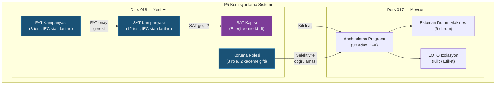

# Ders 018 — FAT/SAT Kabul Testleri, Koruma Rölesi Koordinasyonu ve SAT Kapısı

!!! abstract "Ders Navigasyonu"
    :material-arrow-left: **Önceki:** [Ders 017 — P5 Devreye Alma: Anahtarlama Programı, Ekipman Durum Makinesi ve LOTO](lesson-017.md) | **Sonraki:** Yakında :material-arrow-right:

    **Faz:** P5 | **Dil:** Türkçe | **İlerleme:** 7 / ? | [Tüm Dersler](index.md) | [Öğrenme Yol Haritası](../Learning_Roadmap.md)

> **Date:** 2026-02-27
> **Commits:** 1 commit (`b7da3db`)
> **Commit range:** `810c5262f2ce0da0e3db8d6f2e67f23bb87e8a25..b7da3dbf0eb66a9ec3c881ad70d2c4bff274a13a`
> **Phase:** P5 (Commissioning)
> **Roadmap sections:** [Phase 5 — Section 5.3 Testing & Commissioning, Section 5.1 HV Switching & Safety]
> **Language:** Turkish
> **Previous lesson:** Lesson 017
> **last_commit_hash:** b7da3dbf0eb66a9ec3c881ad70d2c4bff274a13a

---

## Ne Öğreneceksiniz

- Fabrika Kabul Testi (FAT) kampanya yaşam döngüsünü ve 8 IEC-standardına uygun test spesifikasyonunu anlayacaksınız
- Saha Kabul Testi (SAT) ile 12 kurulum sonrası test spesifikasyonunu ve FAT-kapısı (gate) mekanizmasını öğreneceksiniz
- Koruma rölesi (protection relay) ayarlarını ve zaman kademelemesi (time grading) ile selektivite doğrulamasını kavrayacaksınız
- SAT kapısının anahtarlama programı başlatma sürecine nasıl entegre edildiğini göreceksiniz
- Tolerans bandı değerlendirmesi ile otomatik geçti/kaldı (pass/fail) mantığını kodda uygulayacaksınız

---

## Bölüm 1: Fabrika Kabul Testi (FAT) — Ekipman Denizde Bozulursa Ne Olur?

### Gerçek Dünya Problemi

Bir online mağazadan bilgisayar sipariş ettiğinizi düşünün. Kargo geldiğinde ekranı kırık çıksa, iade edip yenisini almanız kolay — mağaza yakında. Ama sipariş ettiğiniz ürün 220/66 kV transformatör olsaydı ve kırık olduğunu 45 km açıktaki deniz platformunda fark etseydiniz? Bir gemi mobilizasyonu günde ~500.000 EUR'a mal olur ve onarım aylar sürer.

İşte FAT (Factory Acceptance Test) tam da bu senaryoyu önlemek için var: ekipman üreticinin fabrikasından ayrılmadan önce tüm testlerden geçmelidir.

### Standartlar Ne Diyor

Fabrika testlerimiz 7 farklı IEC standardını kapsar:

| Test | Standart | Fiziksel Doğrulama |
|------|----------|-------------------|
| HV dayanım (withstand) | IEC 60060-1:2010 | 460 kV AC, 60 s — yalıtım bütünlüğü |
| Kısmi deşarj (PD) | IEC 60270:2000 | < 10 pC — yalıtım yaşlanma erken tespiti |
| Transformatör oranı | IEC 60076-1:2011 | 220/66 kV = 3,333 ±%0,5 |
| Empedans testi | IEC 60076-1:2011 | ±%10 nameplate değeri |
| FRA referans | IEC 60076-18:2012 | Elektromanyetik parmak izi |
| DGA referans | IEC 60567:2011 | Yağ gaz analizi < 50 ppm |
| Röle tip testi | IEC 60255:2022 | ±%5 doğruluk |
| GIS gaz sızdırmazlık | IEC 62271-203:2022 | SF6 kaçağı < %0,5/yıl |

### Ne İnşa Ettik

**Değişen dosyalar:**

- `backend/app/services/p5/fat.py` — FAT test spesifikasyonları, kampanya yaşam döngüsü ve otomatik verdikt değerlendirmesi
- `backend/app/schemas/commissioning.py` — FAT/SAT Pydantic şemaları (API request/response modelleri)
- `backend/app/routers/p5.py` — FAT CRUD ve sonuç kayıt endpoint'leri
- `backend/tests/test_fat.py` — 8 spesifikasyon doğrulaması, kampanya yaşam döngüsü testleri

FAT modülü üç temel kavram üzerine kurulu:

1. **TestSpecification** — değişmez (frozen) test tanımı: test ID, standart referansı, kabul sınırları (min/max)
2. **TestResult** — ölçüm kaydı: ölçülen değer, verdikt, mühendis adı, zaman damgası
3. **FATCampaign** — kampanya yaşam döngüsü: `CREATED → IN_PROGRESS → COMPLETED → APPROVED`

### Neden Önemli

> **Neden** fabrikada 8 ayrı test yapıyoruz?
> Her test farklı bir fiziksel arıza modunu yakalıyor. HV dayanım testi yalıtım bütünlüğünü, PD testi yalıtım yaşlanma belirtilerini, FRA ise sargı/çekirdek yer değiştirmesini tespit eder. Tek bir test tüm arıza modlarını kapsayamaz — savunma derinliği (defense in depth) ilkesi geçerlidir.

> **Neden** tolerans bantlarını `min_value` / `max_value` çifti olarak modelledik?
> Bazı testler tek taraflıdır (PD < 10 pC → sadece üst sınır), bazıları iki taraflıdır (transformatör oranı ±%0,5 → alt ve üst sınır). `float('-inf')` ve `float('inf')` kullanarak aynı `evaluate_test_verdict()` fonksiyonuyla her iki durumu da ele alırız. Bu, kod tekrarını önler ve yeni test eklemek için tek yapılması gereken `FAT_SPECS` tuple'ına yeni bir `TestSpecification` eklemektir.

### Kod İncelemesi

Tolerans bandı değerlendirmesi tüm FAT ve SAT sisteminin temel taşıdır. Fonksiyon saf (pure) bir fonksiyondur — dış duruma bağlı değildir:

```python
def evaluate_test_verdict(spec: TestSpecification, measured_value: float) -> TestVerdict:
    """Ölçülen değeri spesifikasyon tolerans bandına göre değerlendir.

    PASS koşulu:  spec.min_value <= measured_value <= spec.max_value

    Tek taraflı testler için sonsuzluk sınırları kullanılır:
      PD testi: min=-inf, max=10.0  → ölçüm 10'un altındaysa PASS
      HV testi: min=460, max=+inf   → ölçüm 460'ın üstündeyse PASS
    """
    if spec.min_value <= measured_value <= spec.max_value:
        return TestVerdict.PASS
    return TestVerdict.FAIL
```

Bu fonksiyon kasıtlı olarak basit tutulmuştur. Gerçek dünyada fuzzy sınırlar veya istatistiksel toleranslar olabilir, ancak IEC standartları kesin sınırlar tanımlar — ya geçersiniz ya kalırsınız.

Kampanya yaşam döngüsü bir Deterministik Sonlu Otomat (DFA) olarak modellendi:

```python
def record_fat_result(
    campaign: FATCampaign,
    test_id: str,
    measured_value: float,
    recorded_by: str,
    notes: str = "",
) -> TestResult:
    # Onaylanmış kampanyaya sonuç eklenemez (geri dönüşü olmayan durum)
    if campaign.status == TestCampaignStatus.APPROVED:
        raise FATCampaignStateError(...)

    # Test ID geçerliliğini kontrol et
    if test_id not in campaign.specs:
        raise FATTestNotFoundError(...)

    # Otomatik verdikt değerlendirmesi
    spec = campaign.specs[test_id]
    verdict = evaluate_test_verdict(spec, measured_value)

    result = TestResult(
        test_id=test_id,
        measured_value=measured_value,
        verdict=verdict,
        recorded_by=recorded_by,
        notes=notes,
    )
    campaign.results[test_id] = result

    # İlk sonuçta CREATED → IN_PROGRESS geçişi
    if campaign.status == TestCampaignStatus.CREATED:
        campaign.status = TestCampaignStatus.IN_PROGRESS

    # Tüm spesifikasyonlar sonuçlandığında IN_PROGRESS → COMPLETED
    if len(campaign.results) == len(campaign.specs):
        campaign.status = TestCampaignStatus.COMPLETED

    return result
```

Her sonuç kaydı iki olası durum geçişini otomatik olarak tetikler. Bu, durum makinesi mantığını iş mantığının doğal akışına gömer — ayrı bir `transition()` fonksiyonu gerekmez.

### Temel Kavram

!!! tip "Temel Kavram: Tolerans Bandı Değerlendirmesi (Tolerance Band Evaluation)"
    **Basitçe anlatımı:** Bir sınavda geçme notu var — 50'nin üstü geçer, altı kalır. FAT testleri de aynı mantıkla çalışır: her testin bir alt ve üst sınırı var. Ölçüm bu sınırlar içindeyse PASS, dışındaysa FAIL.

    **Analoji:** Bir mutfak termostatı düşünün. Fırın sıcaklığı 180°C-200°C arasındaysa yemek doğru pişer. 179°C'de çiğ kalır, 201°C'de yanar. FAT testlerindeki tolerans bandı tam olarak bu sıcaklık aralığıdır.

    **Bu projede:** 510 MW rüzgar çiftliğimizde 220/66 kV transformatör oranı 3,317-3,350 aralığında olmalıdır (nominal 3,333 ±%0,5). Bu dar bantın dışına çıkmak, gerilim regülasyonunun bozulması ve koruma koordinasyonunun çökmesi demektir.

---

## Bölüm 2: Saha Kabul Testi (SAT) — Nakliyat Sonrası Ne Değişir?

### Gerçek Dünya Problemi

Bir antika vazo taşıdığınızı düşünün. Mağazada kusursuz görünüyordu (FAT geçti). Ama eve taşırken arabanın bagajında sallanıp gizli bir çatlak oluşmuş olabilir. Vazoyu kullanmadan önce suyla doldurup sızıntı kontrol edersiniz — bu SAT'tır.

Offshore ekipman deniz nakliyatı sırasında dalga kaynaklı titreşime, kurulum sırasında vinç kaldırma ve kablo çekme stresine, deniz ortamında nem ve tuz spreyi etkisine maruz kalır. Fabrikada geçen transformatörün sargıları nakliyat sırasında kayabilir — FAT'taki FRA referansı ile karşılaştırarak bu kaymayı tespit ederiz.

### Standartlar Ne Diyor

SAT testlerimiz 10 farklı IEC/EN standardını kapsar:

| Test | Standart | Kritik Eşik |
|------|----------|-------------|
| Yalıtım direnci | IEC 60229 | > 100 MOhm @ 5 kV DC |
| AÖ oranı (CT ratio) | IEC 61869-2 | ±%1 doğruluk |
| GT oranı (VT ratio) | IEC 61869-3 | ±%0,5 doğruluk |
| Kesici kapanma süresi | IEC 62271-100 | < 80 ms |
| Kesici açılma süresi | IEC 62271-100 | < 60 ms |
| Koruma röle trip | IEC 60255 | < 100 ms |
| GOOSE gecikmesi | IEC 61850-8-1 | < 4 ms |
| SCADA nokta doğrulama | IEC 60870-5-104 | %100 yanıt |
| Kademe değiştirici | IEC 60214 | Tam aralık |
| Yangın algılama | EN 54 | < 30 s |

### Ne İnşa Ettik

**Değişen dosyalar:**

- `backend/app/services/p5/sat.py` — 12 SAT test spesifikasyonu, FAT-kapısı uygulaması, kampanya yönetimi
- `backend/tests/test_sat.py` — FAT-gate testleri, kampanya yaşam döngüsü, anahtarlama programı entegrasyonu

SAT modülü FAT modülünün tip sistemini yeniden kullanır (`TestSpecification`, `TestResult`, `TestVerdict`, `evaluate_test_verdict`) — bu DRY (Don't Repeat Yourself) ilkesinin doğrudan uygulamasıdır. Tek fark: SAT oluşturulurken opsiyonel bir FAT kampanyası bağlanabilir.

### Neden Önemli

> **Neden** SAT, FAT'tan ayrı bir kampanya olarak tasarlandı?
> FAT ve SAT farklı zamanlarda, farklı yerlerde, farklı mühendisler tarafından yapılır. FAT üretici fabrikasında (ekipman sevkiyattan önce), SAT sahada (kurulumdan sonra). Bu ayrım sorumluluk zincirini (chain of custody) net tutar ve iz sürülebilirlik (traceability) sağlar.

> **Neden** FAT-kapısı (gate) mekanizması opsiyonel yapıldı?
> Gerçek dünyada bazı ekipmanlar (örneğin mevcut stok) FAT kaydı olmadan sahaya gelebilir. `fat_campaign: FATCampaign | None = None` parametresi bu esnekliği sağlarken, geçildiğinde onaylanmamış bir FAT'ı reddetme güvencesini korur.

### Kod İncelemesi

FAT-kapısı mekanizması — SAT kampanyası oluşturulurken fabrika testlerinin onaylanmış olmasını zorunlu kılar:

```python
def create_sat_campaign(
    programme_id: str,
    fat_campaign: FATCampaign | None = None,
) -> SATCampaign:
    """FAT-kapısı ile SAT kampanyası oluştur.

    fat_campaign geçilmişse, durumu APPROVED olmalıdır.
    Aksi halde SATFATGateError fırlatılır.
    """
    if fat_campaign is not None and fat_campaign.status != TestCampaignStatus.APPROVED:
        raise SATFATGateError(
            f"FAT campaign '{fat_campaign.campaign_id}' is "
            f"'{fat_campaign.status.value}', "
            f"must be 'approved' before SAT can begin."
        )

    campaign_id = f"SAT-{datetime.now(UTC).strftime('%Y%m%d')}-"
                  f"{uuid.uuid4().hex[:6].upper()}"
    specs = {spec.test_id: spec for spec in SAT_SPECS}

    return SATCampaign(
        campaign_id=campaign_id,
        programme_id=programme_id,
        fat_campaign_id=fat_campaign.campaign_id if fat_campaign else "",
        specs=specs,
    )
```

Bu kapı mekanizması "önce kontrol et, sonra yarat" ilkesini uygular. Fabrika testleri onaylanmamışsa, saha testi kampanyası hiç oluşturulamaz — hatalı duruma düşme şansı sıfırdır.

### Temel Kavram

!!! tip "Temel Kavram: Kapı Mekanizması (Gate Pattern)"
    **Basitçe anlatımı:** Bir uçağa binmeden önce kapıda biniş kartınızı gösterirsiniz. Kartınız yoksa ya da yanlışsa içeri giremezsiniz. FAT-kapısı da aynı şekilde çalışır: fabrika testleri onaylanmadan saha testleri başlatılamaz.

    **Analoji:** Bir bilgisayar oyunundaki seviye kilitleri gibi düşünün. Seviye 1'i bitirmeden Seviye 2'ye geçemezsiniz. FAT = Seviye 1, SAT = Seviye 2, Enerji verme = Seviye 3.

    **Bu projede:** 510 MW rüzgar çiftliğimizde TX-OSS-01 transformatörü fabrikada 8 test geçmeden gemiye yüklenmez (FAT kapısı), sahada 12 test geçmeden enerji verilmez (SAT kapısı). Bu iki kapı, denizde arıza riskini dramatik olarak azaltır.

---

## Bölüm 3: Koruma Rölesi Koordinasyonu — Doğru Şalter Doğru Zamanda

### Gerçek Dünya Problemi

Evinizde elektrik prizinin sigortası attığında sadece o oda karanlık kalır — tüm bina değil. Bunun nedeni: her sigorta kendi bölgesini korur ve "kim önce atacak" sıralaması önceden belirlenmiştir. Offshore rüzgar çiftliğinde de durum aynıdır, ancak yanlış sıralama 34 türbinin tamamını şebekeden düşürür.

Bir 66 kV dizi kablosunda arıza olduğunda, dizi besleyici rölesi (downstream) arızayı temizlemelidir — 220 kV ihracat kablosu rölesi (upstream) değil. Eğer upstream röle önce atarsa, arızalı dizideki 6 türbin yerine tüm çiftlik devre dışı kalır.

### Standartlar Ne Diyor

- **IEC 60255-151:2009** — Aşırı akım koruması (PTOC) zaman ayarları
- **IEC 60255-121:2014** — Mesafe koruması (PDIS) bölge ayarları
- **IEC 60255-127:2010** — Aşırı/düşük gerilim koruması (PTOV/PTUV)
- **IEC 60255-181:2019** — Aşırı/düşük frekans koruması (PTOF/PTUF)
- **IEEE C37.112** — Ters zamanlı aşırı akım röle koordinasyonu

Zaman kademelemesi (time grading) formülü:

```
gerçek_marjin = (upstream_gecikme - downstream_gecikme) × 1000 ms

Karar: gerçek_marjin ≥ gerekli_marjin → SELEKTİF
       gerçek_marjin < gerekli_marjin → SELEKTİF DEĞİL
```

PTOC için gereken marjin: 300 ms (kesici açma + röle hatası + güvenlik payı).
PDIS için gereken marjin: 400 ms (bölgeler arası daha büyük ayrım gerekir).

### Ne İnşa Ettik

**Değişen dosyalar:**

- `backend/app/services/p5/protection_relay.py` — 8 röle ayarı, 2 kademe çifti, selektivite doğrulama fonksiyonları
- `backend/tests/test_protection_relay.py` — Ayar doğrulaması, selektif/selektif olmayan senaryolar
- `backend/app/routers/p5.py` — `/protection/settings` ve `/protection/verify-selectivity` endpoint'leri

Koruma sistemi üç veri modelinden oluşur:

1. **RelaySetting** — değişmez röle ayarı (ID, fonksiyon, pickup değeri, zaman gecikmesi, konum)
2. **GradingPair** — downstream→upstream röle çifti ve gereken marjin
3. **GradingResult** — doğrulama sonucu (gerçek marjin, verdikt)

### Neden Önemli

> **Neden** 8 farklı koruma fonksiyonu tanımladık?
> Her fonksiyon farklı bir arıza tipini algılar. PTOC aşırı akımı (kablo kısa devresi), PDIS mesafe bazlı arızayı (kablo boyunca konum tespiti), PTOV/PTUV gerilim anormalliklerini, PTOF/PTUF frekans sapmalarını yakalar. Birden fazla fonksiyon "savunma derinliği" sağlar — bir röle kaçırırsa yedek (backup) devreye girer.

> **Neden** selektivite doğrulamasını saf fonksiyon (pure function) olarak yazdık?
> `verify_selectivity()` herhangi bir röle seti ve kademe çifti üzerinde çalışabilir (varsayılan olarak OSS setini kullanır). Bu, farklı röle konfigürasyonlarını test etmeyi, gelecekte yeni röle setleri eklemeyi ve birim testlerinde mock olmadan doğrudan test yapmayı kolaylaştırır.

### Kod İncelemesi

Kademe çifti doğrulaması — mühendislik formülünün doğrudan kodlamaya çevrilmesi:

```python
def check_single_grading_pair(
    pair: GradingPair,
    settings: dict[str, RelaySetting],
) -> GradingResult:
    """Bir downstream→upstream çifti için selektivite kontrolü.

    Formül: gerçek_marjin = (upstream.time_delay - downstream.time_delay) × 1000

    Örnek (PTOC):
      Downstream: 0.5 s (dizi besleyici)
      Upstream:   0.8 s (incomer yedek)
      Gerçek marjin = (0.8 - 0.5) × 1000 = 300 ms ≥ 300 ms → SELEKTİF ✓
    """
    downstream = settings[pair.downstream_id]
    upstream = settings[pair.upstream_id]

    actual_margin_ms = (upstream.time_delay - downstream.time_delay) * 1000.0

    verdict = (
        SelectivityVerdict.SELECTIVE
        if actual_margin_ms >= pair.required_margin_ms
        else SelectivityVerdict.NON_SELECTIVE
    )

    return GradingResult(
        pair_id=pair.pair_id,
        downstream_id=pair.downstream_id,
        upstream_id=pair.upstream_id,
        downstream_delay_s=downstream.time_delay,
        upstream_delay_s=upstream.time_delay,
        actual_margin_ms=actual_margin_ms,
        required_margin_ms=pair.required_margin_ms,
        verdict=verdict,
    )
```

Kodun IEC formülü ile bire bir eşleşmesine dikkat edin. Mühendislik hesaplamasını doğrudan koda çevirmek, gözden geçirme sürecini kolaylaştırır — standart belgesindeki formül ile kodu yan yana koyabilirsiniz.

Tüm çiftlerin toplu doğrulaması tek satırda yapılır:

```python
def verify_selectivity(
    settings: tuple[RelaySetting, ...] | None = None,
    grading_pairs: tuple[GradingPair, ...] | None = None,
) -> list[GradingResult]:
    """Tüm kademe çiftleri için selektivite doğrulaması.

    Varsayılan olarak OSS röle setini kullanır.
    Sonuç: her çift için bir GradingResult listesi.
    """
    if settings is None:
        settings = OSS_RELAY_SETTINGS
    if grading_pairs is None:
        grading_pairs = GRADING_PAIRS

    settings_map = {s.setting_id: s for s in settings}
    return [check_single_grading_pair(pair, settings_map) for pair in grading_pairs]
```

`settings_map` dictionary'si, her röle ayarını O(1) sürede bulmamızı sağlar. N kademe çifti için toplam karmaşıklık O(N) — tuple tarama yapılmaz.

### Temel Kavram

!!! tip "Temel Kavram: Zaman Kademelemesi ile Selektivite (Time Grading for Selectivity)"
    **Basitçe anlatımı:** Bir yarışta koşucular aynı anda değil, sırayla startı alır — önce en yakındaki koşucu, sonra arkadaki. Koruma röleleri de böyledir: arızaya en yakın röle önce atar, yedek röle daha sonra devreye girer.

    **Analoji:** Yangın söndürme sistemi düşünün. Odadaki sprinkler önce çalışır. Eğer yangın büyürse, kattaki ana vana açılır. Eğer hâlâ sönmediyse, tüm bina sistemi devreye girer. Her seviye öncekine "marjin süresi" bırakır.

    **Bu projede:** Dizi besleyici rölesi 0,5 s'de atar. Incomer yedek rölesi 0,8 s'de atar. Aradaki 300 ms marjin, kesici açma süresi (60 ms) + röle hatası + güvenlik payını kapsar. Bu sayede sadece arızalı dizi kopuyor, tüm çiftlik ayakta kalıyor.

---

## Bölüm 4: SAT Kapısı — Enerji Vermeden Önce Son Kilit

### Gerçek Dünya Problemi

Bir nükleer santralde reaktör, tüm güvenlik kontrol listeleri tamamlanmadan çalıştırılamaz. Benzer şekilde, offshore trafo merkezinde saha kabul testleri tamamlanmadan 220 kV enerji verilemez. Bu "son kilit" mekanizması, insan hatasını yazılımla engeller.

### Standartlar Ne Diyor

SAT kapısı, IEC 62271-100 §4.101 anahtarlama prosedürlerinin bir uzantısıdır. Standart, enerji verme öncesi "tüm koşulların karşılanması" gerektiğini belirtir. SAT kampanyasının onaylanması bu koşullardan biridir.

### Ne İnşa Ettik

**Değişen dosyalar:**

- `backend/app/services/p5/switching_programme.py` — `start_programme()` fonksiyonuna SAT kapısı eklendi
- `backend/tests/test_sat.py` — SAT kapısı entegrasyon testleri

Anahtarlama programı veri modeline iki yeni alan eklendi:

```python
@dataclass
class SwitchingProgramme:
    # ... mevcut alanlar ...
    sat_campaign: SATCampaign | None = None   # Bağlı SAT kampanyası
    fat_campaign_id: str | None = None        # Bağlı FAT kampanya ID'si
```

### Neden Önemli

> **Neden** SAT kapısını `start_programme()` içine gömdük?
> Doğru yer burasıdır — enerji verme (switching programme start) en kritik andır. Kampanya oluşturma aşamasında değil, gerçek enerji verme anında kontrol yapmak, "son savunma hattı" ilkesini uygular. Böylece SAT kampanyası oluşturulup testler yapılırken program hâlâ düzenlenebilir.

> **Neden** `TYPE_CHECKING` bloğu ile lazy import kullandık?
> `switching_programme.py` ve `sat.py` arasında dairesel bağımlılık (circular dependency) riski var. `TYPE_CHECKING` bloğu sadece tip kontrolü araçları (mypy) tarafından yürütülür — çalışma zamanında import gerçekleşmez. Gerçek `all_sat_passed` import'u fonksiyon içinde yapılır.

### Kod İncelemesi

SAT kapısı entegrasyonu — var olan fonksiyona minimum müdahale ile eklenen güvenlik kontrolü:

```python
def start_programme(programme: SwitchingProgramme) -> None:
    """Programı başlat.

    SAT kampanyası bağlıysa, tüm testler geçmiş olmalıdır.
    Bu, saha kabul testleri tamamlanmadan enerji verilmesini engeller.
    """
    if programme.status != ProgrammeStatus.APPROVED:
        raise ProgrammeStateError(...)

    # SAT kapısı: kampanya bağlıysa tüm testler geçmiş olmalı
    if programme.sat_campaign is not None:
        from app.services.p5.sat import all_sat_passed

        if not all_sat_passed(programme.sat_campaign):
            raise ProgrammeStateError(
                "Cannot start programme: SAT campaign has not passed "
                "all tests. Complete and approve all site acceptance "
                "tests before energisation."
            )

    programme.status = ProgrammeStatus.IN_PROGRESS
    _add_audit(programme, "Programme started", programme.pic_name)
```

Dikkat edilmesi gereken noktalar:

1. **Geriye uyumluluk** — `sat_campaign is None` kontrolü, SAT kampanyası olmayan programların çalışmaya devam etmesini sağlar
2. **Lazy import** — Dairesel bağımlılığı kırmak için `all_sat_passed` fonksiyon içinde import edilir
3. **Açıklayıcı hata mesajı** — Mühendise tam olarak ne yapması gerektiğini söyler

### Temel Kavram

!!! tip "Temel Kavram: Dairesel Bağımlılık Çözümü (Circular Dependency Resolution)"
    **Basitçe anlatımı:** İki arkadaş düşünün — Ali, Veli'nin telefon numarasını biliyor, Veli de Ali'nin. Ama ikisi de aynı anda birbirini arayamaz. Yazılımda da iki modül birbirini aynı anda import edemez.

    **Analoji:** İki kapının birbirini kilitlediğini düşünün — A kapısını açmak için B kapısının anahtarı lazım, B kapısını açmak için A'nın. Çözüm: anahtarı kapıyı açma anına kadar cebinizde tutarsınız (lazy import).

    **Bu projede:** `switching_programme.py` normalde `sat.py`'dan tip bilgisi alır ama `sat.py` da FAT tiplerini kullanır. `TYPE_CHECKING` ile tip bilgisi sadece mypy zamanında çözülür, `all_sat_passed` ise çağrılma anında import edilir.

---

## Bölüm 5: REST API Endpoint'leri — Her Şeyi Bir Araya Getirmek

### Gerçek Dünya Problemi

Bir hastane bilgi sisteminde doktor vizitesini kaydetmek, reçete yazmak, tetkik sonucu girmek ayrı ayrı ekranlar ve API'lerdir — ama hepsi aynı hasta dosyasına bağlıdır. Bizim komisyonlama sistemimizde de FAT, SAT ve koruma doğrulaması ayrı endpoint'lerdir ama aynı trafo merkezi projesine bağlıdır.

### Standartlar Ne Diyor

REST API tasarımımız kaynak odaklı (resource-oriented) mimariyi takip eder:

- FAT kampanyaları bağımsız kaynaktır (`/api/v1/commissioning/fat/...`)
- SAT kampanyaları programa bağlıdır (`/api/v1/commissioning/programmes/{id}/sat/...`)
- Koruma ayarları global kaynaktır (`/api/v1/commissioning/protection/...`)

### Ne İnşa Ettik

**Değişen dosyalar:**

- `backend/app/routers/p5.py` — 10+ yeni endpoint (FAT CRUD, SAT CRUD, koruma doğrulama)
- `backend/app/schemas/commissioning.py` — 15+ yeni Pydantic şeması

Yeni endpoint'ler:

| Endpoint | Metod | İşlev |
|----------|-------|-------|
| `/fat` | POST | FAT kampanyası oluştur |
| `/fat` | GET | Tüm FAT kampanyalarını listele |
| `/fat/{id}` | GET | FAT kampanya detayı |
| `/fat/{id}/tests/{test_id}/record` | POST | Test sonucu kaydet |
| `/fat/{id}/approve` | POST | Kampanyayı onayla |
| `/programmes/{id}/sat` | POST | SAT kampanyası oluştur |
| `/programmes/{id}/sat` | GET | SAT kampanya durumu |
| `/programmes/{id}/sat/tests/{test_id}/record` | POST | SAT test sonucu kaydet |
| `/programmes/{id}/sat/approve` | POST | SAT kampanyasını onayla |
| `/protection/settings` | GET | Tüm röle ayarları |
| `/protection/verify-selectivity` | POST | Selektivite doğrulama |

### Neden Önemli

> **Neden** FAT endpoint'leri program dışında, SAT endpoint'leri program altında?
> FAT kampanyaları ekipmana bağlıdır (örn. TX-OSS-01), programdan bağımsız olarak yönetilir — ekipman henüz sahaya gelmeden fabrikada test edilir. SAT kampanyaları ise belirli bir anahtarlama programına bağlıdır — kurulum sonrası, enerji verme öncesi yapılır. Bu URL yapısı domain modelini yansıtır.

### Kod İncelemesi

FAT kampanya schema'sı domain nesnesinden API yanıtına dönüşümü gösteren yardımcı fonksiyon:

```python
def _build_fat_schema(campaign: FATCampaign) -> FATCampaignSchema:
    """Domain nesnesini API yanıt modeline dönüştür.

    Neden ayrı bir fonksiyon?
    - Domain modeli (dataclass) ve API modeli (Pydantic) farklı sorumluluklar taşır
    - Domain modeli iş kurallarını uygular
    - API modeli serileştirme ve validasyon yapar
    - Bu ayrım, domain mantığının HTTP kaygılarından bağımsız kalmasını sağlar
    """
    specs = [
        TestSpecificationSchema(
            test_id=s.test_id, name=s.name, standard=s.standard,
            description=s.description, unit=s.unit,
            min_value=s.min_value, max_value=s.max_value,
        )
        for s in campaign.specs.values()
    ]
    results = [
        TestResultSchema(
            test_id=r.test_id, measured_value=r.measured_value,
            verdict=r.verdict.value, recorded_by=r.recorded_by,
            recorded_at=r.recorded_at, notes=r.notes,
        )
        for r in campaign.results.values()
    ]
    return FATCampaignSchema(
        campaign_id=campaign.campaign_id,
        equipment_tag=campaign.equipment_tag,
        status=campaign.status.value,
        specs=specs, results=results,
        all_passed=all_fat_passed(campaign),
        created_at=campaign.created_at,
        approved_by=campaign.approved_by,
        approved_at=campaign.approved_at,
    )
```

Domain-API ayrımı, ileride ORM (SQLAlchemy) entegrasyonunda domain modelinin değişmemesini garantiler.

### Temel Kavram

!!! tip "Temel Kavram: Domain-API Katman Ayrımı (Domain-API Layer Separation)"
    **Basitçe anlatımı:** Bir restoranın mutfağı (domain) ve menüsü (API) ayrı şeylerdir. Mutfaktaki tarif değişmeden menünün tasarımı değiştirilebilir. Aynı şekilde, iş mantığı HTTP endpoint'lerinden bağımsız çalışır.

    **Analoji:** Bir çevirmen düşünün. Yazar kitabını kendi dilinde yazar (domain), çevirmen onu API diline (JSON) çevirir. Yazarın işi değişmez — sadece çevirmen güncellenir.

    **Bu projede:** `FATCampaign` (dataclass) iş kurallarını uygular. `FATCampaignSchema` (Pydantic) JSON serileştirme yapar. `_build_fat_schema()` ikisi arasında köprüdür. İleride SQLAlchemy eklendiğinde domain katmanı değişmeyecek, sadece persistence katmanı eklenecektir.

---

## Bağlantılar

**Bu kavramlar ileride nerede karşınıza çıkacak:**

- **FAT/SAT tolerans bandı modeli** → P5 frontend'inde test sonuçları yeşil/kırmızı renk kodlamasıyla gösterilecek (Plotly gauge chart'lar kullanılabilir)
- **Koruma koordinasyonu** → P5 enerji verme simülasyonunda koruma röle trip zamanlarının animasyonlu gösterimi
- **SAT kapısı** → Frontend'de "Enerji Ver" butonu, SAT durumuna göre aktif/pasif olacak (UX geri bildirimi)
- **Ders 017'den genişletme:** Anahtarlama programı ve LOTO (Ders 017) artık SAT kapısı ile güçlendirildi — program başlatma artık "tüm testler geçti" kontrolü içeriyor

---

## Büyük Resim

*Bu dersin odağı: **FAT/SAT kabul testi kampanyaları, koruma rölesi koordinasyonu ve SAT kapısı ile enerji verme güvenliği**.*



*Tam sistem mimarisi için bkz. [Dersler Genel Bakış](index.md#system-architecture).*

---

## Temel Çıkarımlar

1. **FAT, ekipman fabrikadan çıkmadan önce arızaları yakalar** — offshore onarımın maliyeti (>500k EUR/gün) bunu zorunlu kılar.
2. **Tolerans bandı değerlendirmesi** basit bir `min <= ölçüm <= max` karşılaştırmasıdır, ancak `float('-inf')` ve `float('inf')` ile tek taraflı testleri de kapsar.
3. **SAT, nakliyat ve kurulum sonrası tekrar doğrulama** yapar — fabrikada geçen ekipman sahada farklı davranabilir.
4. **FAT-kapısı**, onaylanmamış fabrika testleriyle saha testlerine başlanmasını engeller — hata zincirine erken müdahale.
5. **Koruma koordinasyonu** zaman kademelemesiyle sağlanır — downstream röle upstream'den önce atmalıdır, aksi halde tüm çiftlik devre dışı kalır.
6. **SAT kapısı**, anahtarlama programı başlatma fonksiyonuna gömülmüştür — tüm saha testleri geçmeden enerji verme fiziksel olarak imkansızdır.
7. **Domain-API katman ayrımı**, iş mantığını HTTP kaygılarından izole eder ve gelecekteki ORM entegrasyonunu kolaylaştırır.

---

## Önerilen Okumalar

*[Öğrenme Yol Haritası](../Learning_Roadmap.md) — Faz 5: Komisyonlama & İşletme*

| Kaynak | Tür | Neden Okunmalı |
|--------|-----|----------------|
| IEC 60060-1:2010 — HV test techniques | Standart | FAT-001 HV dayanım testinin temelini oluşturur |
| IEC 62271-100:2021 — Circuit breaker testing | Standart | SAT-004/005 kesici zamanlama testlerinin kaynağı |
| IEC 60076-1:2011 — Power transformer requirements | Standart | Transformatör oranı ve empedans tolerans değerlerini tanımlar |
| Omicron Academy — Protection Testing courses | Online kurs | Koruma rölesi koordinasyonu ve ikincil enjeksiyon test pratikleri |
| IEEE C37.112 — Inverse-time relay coordination | Standart | Zaman kademelemesi formüllerinin matematik temeli |

---

## Sınav — Anlayışınızı Test Edin

### Hatırlama Soruları

**S1:** FAT modülünde kaç test spesifikasyonu tanımlıdır ve her biri hangi fiziksel arıza modunu hedefler?

<details>
<summary>Cevap</summary>

8 test spesifikasyonu tanımlıdır: HV dayanım (yalıtım bütünlüğü), kısmi deşarj (yalıtım yaşlanması), transformatör oranı (gerilim dönüşüm doğruluğu), empedans (kısa devre akım sınırlaması), FRA (sargı/çekirdek yer değiştirmesi), DGA (yağ bozulması), röle tip testi (koruma doğruluğu) ve GIS gaz sızdırmazlığı (SF6 yalıtım bütünlüğü). Her test farklı bir arıza modunu yakaladığı için hepsi birlikte "savunma derinliği" oluşturur.

</details>

**S2:** FAT kampanya yaşam döngüsündeki 4 durum nedir ve geçişler nasıl tetiklenir?

<details>
<summary>Cevap</summary>

CREATED → IN_PROGRESS (ilk test sonucu kaydedildiğinde otomatik), IN_PROGRESS → COMPLETED (tüm 8 spesifikasyon için sonuç kaydedildiğinde otomatik), COMPLETED → APPROVED (tüm testler geçtiyse ve yetkili kişi onaylarsa manuel). Geri dönüş yoktur — APPROVED durumundaki kampanyaya sonuç eklenemez.

</details>

**S3:** PTOC-01 ve PTOC-02 arasındaki zaman kademelemesi ne kadardır ve bu neden yeterlidir?

<details>
<summary>Cevap</summary>

PTOC-01 (dizi besleyici) 0,5 s, PTOC-02 (incomer yedek) 0,8 s — aradaki marjin 300 ms'dir. Bu marjin, kesici açma süresini (~60 ms, IEC 62271-100), röle zamanlama hatasını (~%5 × 500 ms = 25 ms) ve güvenlik payını karşılar. 300 ms, IEC 60255 tarafından önerilen minimum PTOC kademe marjinidir.

</details>

### Anlama Soruları

**S4:** FAT-kapısı (gate) mekanizması neden SAT kampanyası oluşturma anında uygulanır, başlatma anında değil?

<details>
<summary>Cevap</summary>

Fail-fast (erken başarısızlık) ilkesi gereği: eğer FAT onaylanmamışsa, SAT kampanyası oluşturmaya bile gerek yoktur — bu, mühendislerin boşuna test planlaması yapmasını önler. Oluşturma anında kontrol, hatalı duruma düşme penceresini sıfıra indirir. SAT kapısı ise farklı bir kontrol noktasıdır: tüm testler tamamlanmış mı, enerji vermeye hazır mıyız? İkisi birlikte çift katmanlı güvenlik sağlar.

</details>

**S5:** `evaluate_test_verdict()` fonksiyonunun `float('-inf')` ve `float('inf')` kullanması yerine ayrı "tek taraflı" ve "çift taraflı" fonksiyonlar yazmak nasıl olurdu?

<details>
<summary>Cevap</summary>

Ayrı fonksiyonlar yazmak, her yeni test türü için hangi fonksiyonun çağrılacağına karar vermek gerektirir — bu ek bir dallanma mantığı ve tip ayrımı demektir. `float('-inf')` ve `float('inf')` kullanarak tek fonksiyon her iki durumu da doğal olarak ele alır çünkü Python'da `float('-inf') <= x` her zaman `True`'dur. Bu yaklaşım, Open-Closed Principle'a uygundur: yeni test türü eklemek için mevcut kodu değiştirmek gerekmez, sadece yeni bir `TestSpecification` tanımlanır.

</details>

**S6:** SAT kapısında `TYPE_CHECKING` bloğu ve lazy import kullanılmasının alternatifi ne olurdu ve neden bu yol tercih edildi?

<details>
<summary>Cevap</summary>

Alternatifler: (1) Ortak bir `interfaces.py` modülü oluşturup her iki modülün buradan import etmesi — ancak bu, küçük bir projede gereksiz karmaşıklık ekler. (2) SAT kontrolünü tamamen router katmanına taşımak — ancak bu, domain mantığını HTTP katmanına sızdırır. (3) Dependency Injection ile runtime'da SAT fonksiyonunu geçirmek — temiz ama overengineering. Lazy import, minimum müdahale ile dairesel bağımlılığı kırar ve domain mantığını yerinde tutar — "en az değişiklik" ilkesine uygundur.

</details>

### Meydan Okuma Sorusu

**S7:** Gerçek dünyada bir koruma rölesi ayarı değiştirilmek istendiğinde (örneğin PTOC-01'in zaman gecikmesi 0,5 s'den 0,6 s'ye artırıldığında), bu değişikliğin selektiviteyi bozup bozmadığını otomatik olarak doğrulayan bir "röle değişiklik yönetimi" (relay setting change management) sistemi nasıl tasarlardınız?

<details>
<summary>Cevap</summary>

Sistem şu bileşenlerden oluşurdu: (1) **Mevcut ayarlar snapshot'ı** — değişiklik öncesi `OSS_RELAY_SETTINGS`'in kopyası alınır. (2) **Proposed settings** — kullanıcının önerdiği değişiklik uygulanmış yeni tuple oluşturulur. (3) **Impact analysis** — `verify_selectivity(proposed_settings)` çağrılarak etkilenen tüm kademe çiftleri kontrol edilir. (4) **Diff raporu** — hangi çiftlerin selektivite verdiktinin değiştiğini gösteren bir rapor üretilir (SELEKTİF → SELEKTİF DEĞİL geçişleri kırmızı uyarı olarak işaretlenir). (5) **Onay mekanizması** — Koruma mühendisi değişikliği onaylamadan sistem uygulamaz (Permit-to-Work benzeri bir akış). (6) **Audit trail** — her ayar değişikliği tarih, mühendis, eski/yeni değer ve selektivite raporu ile kaydedilir. Bu tasarım, mevcut `verify_selectivity()` fonksiyonunun parametrik yapısını doğrudan kullanır — fonksiyon zaten özel ayar setleri kabul eder.

</details>

---

## Mülakat Köşesi

### Basitçe Anlatın
*"FAT/SAT testlerini ve koruma koordinasyonunu mühendis olmayan birine nasıl anlatırsınız?"*

Denizde rüzgar türbinleri kurarken, kullanacağımız ekipmanları teslim almadan önce kontrol etmemiz gerekiyor — tıpkı yeni aldığınız bir arabayı showroom'dan çıkmadan önce kontrol etmek gibi. Buna "Fabrika Kabul Testi" diyoruz. Motor çalışıyor mu, frenler tutuyor mu, farlar yanıyor mu — her şeyi listeden tek tek kontrol ediyoruz.

Sonra ekipman deniz yoluyla sahaya ulaşıyor. Yolda sarsılmış, rüzgar ve dalga görmüş olabilir. Bu yüzden sahada tekrar kontrol ediyoruz — buna "Saha Kabul Testi" diyoruz. Arabanız galeriden evinize kadar sorunsuz geldi mi, yoksa yolda bir hasar mı aldı?

Koruma koordinasyonu ise evdeki sigorta kutusuna benzer. Sadece arızalı odanın sigortası atmalı, tüm evin değil. Deniz rüzgar çiftliğinde de bir kabloda arıza olursa sadece o bölümün şalteri atmalı — yoksa 510 MW üretimin tamamı durur. Bu sıralamayı "zaman kademelemesi" ile sağlıyoruz: arızaya en yakın şalter önce atar, yedek biraz sonra devreye girer.

### Teknik Olarak Anlatın
*"FAT/SAT kampanya yönetimi ve koruma selektivite doğrulamasını bir mülakat paneline nasıl anlatırsınız?"*

P5 komisyonlama modülü, IEC standardlarına dayanan üç alt sistem barındırır. İlk olarak, FAT kampanya yönetimi 8 IEC-standard test spesifikasyonunu (IEC 60060-1, 60270, 60076-1/18, 60567, 60255, 62271-203) kapsar ve deterministik sonlu otomat (DFA) yaşam döngüsü ile yönetilir: CREATED → IN_PROGRESS → COMPLETED → APPROVED. Her test sonucu, tolerans bandı değerlendirmesi (`min_value <= measured <= max_value`) ile otomatik olarak verdiktlenir. `float('-inf')` / `float('inf')` sentinel değerleri, tek taraflı ve çift taraflı testleri tek bir saf fonksiyonla kapsar.

İkinci olarak, SAT modülü 12 kurulum sonrası test spesifikasyonunu (IEC 61869-2/3, 62271-100, 61850-8-1 vb.) kapsarken FAT modülünün tip sistemini yeniden kullanarak DRY ilkesini korur. FAT-gate mekanizması, SAT kampanyası oluşturulurken FAT durumunu precondition olarak kontrol eder (`APPROVED` olmalı). SAT kapısı ise `start_programme()` fonksiyonuna entegre edilmiştir — tüm SAT testleri geçmeden enerji verme engellenir. Dairesel bağımlılık, `TYPE_CHECKING` bloğu ve lazy import ile çözülmüştür.

Üçüncü olarak, koruma rölesi koordinasyonu 8 relay setting'i (PTOC, PDIS, PTOV, PTUV, PTOF, PTUF) ve 2 grading pair tanımlar. Selektivite doğrulaması, IEC 60255 ve IEEE C37.112 formüllerini doğrudan kodlayan saf fonksiyonlarla yapılır: `actual_margin_ms = (upstream.delay - downstream.delay) × 1000` karşılaştırması `required_margin_ms` eşiğine göre SELECTIVE veya NON_SELECTIVE verdikti üretir. Tüm fonksiyonlar parametre olarak özel ayar setleri kabul eder, bu da farklı konfigürasyonları test etmeyi ve gelecekte yeni röle tipleri eklemeyi kolaylaştırır.
