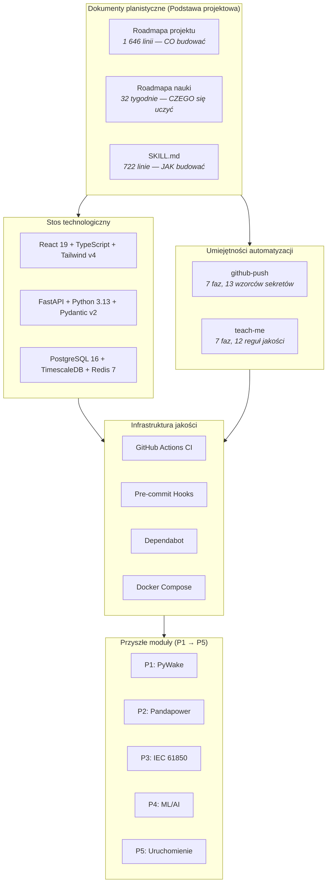

# Lekcja 000 — Planowanie projektu, decyzje technologiczne i profesjonalna metodologia inżynierska

!!! abstract "Nawigacja lekcji"
    :material-arrow-left: **Poprzednia:** Brak (lekcja podstawowa) | **Następna:** [Lekcja 001 — Fundament DevOps](lesson-001.md) :material-arrow-right:

    **Faza:** P0 | **Język:** Polski | **Postęp:** 1 z 19 | [Wszystkie lekcje](index.md) | [Plan nauki](../../Learning_Roadmap.md)

> **Data:** 2026-02-21
> **Commity:** Lekcja konceptualna — obejmuje cały proces planowania Fazy 0
> **Zakres commitów:** `f2500024193bb88db74d1269612cd7c14fbe0614..fa528fb95bd6778ea54f50be71ddc6e0475d2818`
> **Faza:** P0 (Planowanie projektu i architektura)
> **Sekcje roadmapy:** [Faza 0 — Wszystkie sekcje, Mapa integracji między projektami, Specyfikacja stosu technologicznego i interfejsu webowego]
> **Język:** Polski
> **Poprzednia lekcja:** Brak (to jest lekcja podstawowa)
> **last_commit_hash:** fa528fb95bd6778ea54f50be71ddc6e0475d2818

---

## Czego się nauczysz

- Dlaczego profesjonalne projekty inżynierskie zaczynają się od dokumentów planistycznych, nie od kodu — i jak to przekłada się na realne procesy projektowania morskich farm wiatrowych
- Jak oceniać i uzasadniać każdy wybór technologiczny na platformie symulacyjnej full-stack, od bazy danych po frontend i silnik obliczeniowy
- Dlaczego niestandardowe umiejętności automatyzacji (CI/CD, skanowanie bezpieczeństwa, generowanie lekcji) stanowią Standardowe Procedury Operacyjne dla zespołów programistycznych
- Jak sama metodologia nauczania (struktura 4-warstwowa, 10 technik, protokół sesji) jest dyscypliną inżynierską, a nie dodatkiem
- Dlaczego Faza 0 — budowanie infrastruktury przed logiką domenową — jest sama w sobie testem dojrzałości inżynierskiej, który oceniają menedżerowie ds. rekrutacji

---

## Sekcja 1: Co budujemy i dlaczego?

### Problem z realnego świata

Wyobraź sobie, że ubiegasz się o licencję pilota. Pierwszego dnia nie podchodzisz do Boeinga 737 i nie zaczynasz latać. Spędzasz miesiące w symulatorze lotu — systemie, który odtwarza każdy instrument, każdy warunek pogodowy, każdy tryb awarii — tak abyś, kiedy w końcu usiądziesz w prawdziwym kokpicie, Twoje ręce już wiedziały, co robić. Ten projekt jest symulatorem lotu dla inżynierów sterowania WN morskich farm wiatrowych.

### Co mówią standardy

**IEC 61400 (Systemy wytwarzania energii wiatrowej)** to nie jeden standard — to rodzina ponad 30 dokumentów obejmujących każdy aspekt cyklu życia farmy wiatrowej: wymagania projektowe (61400-1), parametry mocy (61400-12), symulację elektryczną (61400-27) i zgodność z kodami sieciowymi (61400-21). Nasze pięć projektów bezpośrednio odwzorowuje ten cykl życia. Żadna realna morska farma wiatrowa nie istnieje w izolacji — ocena zasobów zasila projekt sieci, który zasila konfigurację SCADA, która zasila uruchomienie. Nasza symulacja odzwierciedla to wzajemne powiązanie.

### Co zbudowaliśmy

**Zmienione pliki:**
- `docs/Project_Roadmap.md` — 1 646-wierszowa skonsolidowana specyfikacja definiująca wszystkie pięć projektów
- `docs/Learning_Roadmap.md` — 32-tygodniowy program nauczania z zaufanymi akademickimi źródłami
- `docs/SKILL.md` — 722-wierszowy dokument standardów inżynierskich i konwencji kodowania
- `CLAUDE.md` — Protokół sesji i automatycznie ładowane referencje

Projekt Baltic Wind Alpha symuluje **510 MW morską farmę wiatrową** na polskim Morzu Bałtyckim — 34 turbiny Vestas V236-15,0 MW połączone przez kompletny łańcuch WN. Pełną specyfikację i podział na pięć projektów znajdziesz w [Przeglądzie lekcji](index.md#the-project-at-a-glance).

### Dlaczego to jest ważne

> **Dlaczego** symulujemy konkretną farmę 510 MW zamiast ogólnej „platformy energii wiatrowej"?
> Ponieważ konkretność wymusza rygory inżynierskie. Ogólna platforma może omijać oczkowanie kabli, impedancje transformatorów i nastawy zabezpieczeń. Konkretna farma 510 MW z 34 nazwanymi turbinami, precyzyjnymi długościami kabli i rzeczywistymi wymaganiami kodów sieciowych zmusza, aby każde obliczenie było zakorzenione w fizyce. Kiedy rekruter zapyta „jaki jest poziom napięcia kabla eksportowego?", odpowiadasz „220 kV HVAC, 45 km podmorski, zwymiarowany dla 510 MW przy współczynniku mocy 0,95" — nie „to zależy."
>
> **Dlaczego** pięć wzajemnie powiązanych projektów zamiast pięciu osobnych repozytoriów?
> Ponieważ realne farmy wiatrowe to wzajemnie powiązane systemy. AEP obliczone w P1 wyznacza scenariusze przepływu mocy w P2. Topologia sieci w P2 definiuje model danych SCADA w P3. Telemetria SCADA z P3 zasila modele prognozowania w P4. Nastawy zabezpieczeń z P2 pojawiają się w programach przełączeń P5. Podział na osobne repozytoria zniweczyłby tę integrację — a właśnie to myślenie systemowe odróżnia inżyniera średniego szczebla od seniora.

!!! tip "Kluczowe pojęcie: Myślenie systemowe — Całość jest większa niż suma części"
    **Prosto mówiąc:** Zamiast rozwiązywać pięć osobnych problemów, rozwiązujesz jeden duży problem, który ma pięć warstw. Każda warstwa komunikuje się z pozostałymi. Rozumienie ich połączeń jest cenniejsze niż rozumienie jakiejkolwiek pojedynczej warstwy w izolacji.

    **Analogia:** Pomyśl o szpitalu. Izba przyjęć, sala operacyjna, apteka, OIOM i dokumentacja pacjentów to pięć „projektów". Lekarz rozumiejący tylko salę operacyjną jest przydatny — ale administrator szpitala rozumiejący, jak pacjenci przepływają między wszystkimi pięcioma oddziałami, gdzie tworzą się wąskie gardła i jak opóźnienie w aptece kaskaduje na przepełnienie OIOM — ta osoba zarządza szpitalem.

    **W tym projekcie:** Kiedy model śladu wiatrowego P1 oblicza, że Turbina 17 produkuje 12,3 MW przy 9 m/s, ta liczba przepływa do analizy przepływu mocy P2, która określa, czy kabel zasilający 66 kV wytrzyma prąd. Jeśli nie — system SCADA P3 musi wygenerować alarm, model prognozowania P4 musi nauczyć się wzorca ograniczenia, a test komisyjny P5 musi zweryfikować, że przekaźnik zabezpieczający zadziała prawidłowo. Jedna liczba, pięć konsekwencji — to jest myślenie systemowe.

---

## Sekcja 2: Dokumenty planistyczne — inżynieria przed kodem

### Problem z realnego świata

Zanim zostanie wlana pierwsza fundamentowa stopa w dno morskie, morska farma wiatrowa przechodzi przez lata planowania: oceny oddziaływania na środowisko, umowy przyłączeniowe, dokumenty podstawy projektowej i modele finansowe. Wykonawca, który przybywa na teren budowy bez przeczytania podstawy projektowej, zainstaluje nieodpowiedni kabel, podłączy nieodpowiednią szynę zbiorczą i spowoduje straty liczone w milionach. Dokumenty planistyczne to nie biurokracja — to różnica między projektem, który działa, a tym, który zawodzi.

### Co mówią standardy

**IEC 61355 (Klasyfikacja i oznaczanie dokumentów instalacji, systemów i urządzeń)** ustanawia hierarchiczną strukturę dokumentów dla projektów przemysłowych. Standard wymaga głównego rejestru dokumentów z kontrolą wersji i identyfikowalnością. **ISO 9001 (Systemy zarządzania jakością)** rozszerza to o wymóg udokumentowanych procedur, kontrolowanych rewizji i śladów audytu. Nasza architektura dokumentacji przestrzega tych zasad w kontekście oprogramowania.

### Co zbudowaliśmy

**Zmienione pliki:**
- `docs/Project_Roadmap.md` — Skonsolidowana specyfikacja techniczna
- `docs/Learning_Roadmap.md` — Program nauczania do samodzielnego uczenia się
- `docs/SKILL.md` — Standardy inżynierskie i konwencje kodowania
- `CLAUDE.md` — Protokół zarządzania sesjami AI
- `docs/archive/Project_Roadmap_v1.md` i `docs/archive/Project_Roadmap_v2.md` — Zarchiwizowane wersje historyczne

Stworzyliśmy cztery wzajemnie uzupełniające dokumenty, każdy służący odrębnemu celowi:

**Roadmapa projektu** to podstawa projektowa. Definiuje każdy parametr farmy wiatrowej (model turbiny, napięcia kabli, kody sieciowe), każdy produkt każdego projektu i każdy standard, który musi być przestrzegany. Zaczęliśmy od dokumentu v1, następnie sporządziliśmy „analizę luk" v2, która poprawiła błędy (zmiana liczby turbin z 30 na 34, dodanie wymagań dotyczących symulacji dynamicznej). Zamiast utrzymywać dwa sprzeczne dokumenty, skonsolidowaliśmy je w jedno autorytatywne źródło i zarchiwizowaliśmy oryginały dla identyfikowalności.

**Roadmapa nauki** to 32-tygodniowy program ułożony według faz (P0-P5), ze zaufanymi akademickimi źródłami dla każdego tematu. Każdy podręcznik, artykuł i kurs online został wybrany z uznanych instytucji (DTU, MIT OCW, IEEE Xplore) — nigdy sfabrykowany. Ten dokument odpowiada na pytanie: „Czego muszę się nauczyć, zanim będę mógł to zbudować?"

**SKILL.md** kodyfikuje 10 bezwzględnych reguł inżynierskich (ograniczenia fizyczne, spójność systemu per unit, metoda IEC 60909, konwencja znaku mocy biernej itp.) oraz konwencje kodowania (type hints, docstringi, wzorce API, struktura monorepo). Ten dokument odpowiada na pytanie: „Jak musi być napisany kod?"

**CLAUDE.md** ustanawia protokół sesji: automatyczne ładowanie referencji, otwarcie z danymi technicznymi farmy wiatrowej, zamknięcie pytaniami rekrutacyjnymi. Zapewnia to, że każda sesja kodowania zaczyna się od tego samego kontekstu inżynierskiego — jak operator czytający dziennik stacji przy zmianie warty.

### Dlaczego to jest ważne

> **Dlaczego** napisaliśmy ponad 2 500 wierszy dokumentacji przed napisaniem jednego wiersza kodu domenowego?
> Ponieważ dokumentacja jest projektowaniem. Roadmapa projektu zmusiła nas do podjęcia decyzji z wyprzedzeniem: jaki model turbiny? Jakie napięcie eksportowe? Jaki kod sieciowy? Bez tych decyzji pierwszy programista implementujący P1 wybrałby turbiny 12 MW, drugi programista założyłby 15 MW, a przepływ mocy w P2 byłby błędny. Dokumentacja eliminuje tę klasę błędów, zanim się pojawi — tak samo jak podstawa projektowa zapobiega użyciu przez inżyniera konstruktora nieodpowiedniej gatunku stali.
>
> **Dlaczego** archiwizujemy stare wersje dokumentów zamiast je usuwać?
> Identyfikowalność. W prawdziwym projekcie farmy wiatrowej każda zmiana projektowa musi być możliwa do skontrolowania. Jeśli regulator zapyta „dlaczego zmienili Państwo z 30 na 34 turbiny?", musisz pokazać ścieżkę decyzyjną. Archiwizowanie v1 i v2 przy zachowaniu skonsolidowanej aktualnej wersji daje nam oboje: czyste pojedyncze źródło prawdy do codziennego użycia i historyczny zapis do audytu.

### Przegląd kodu

Protokół sesji `CLAUDE.md` zapewnia trzy rzeczy: **kontekst nigdy nie jest tracony** (briefing otwierający ponownie ustala parametry), **nauka jest zawsze weryfikowana** (pytania końcowe wymuszają aktywne przypominanie) i **sekwencja jest egzekwowana** (P1 przed P2 przed P3). Szczegóły znajdziesz w [referencji protokołu sesji](index.md#session-protocol).

Automatycznie ładowane referencje (`docs/SKILL.md` i `docs/Project_Roadmap.md`) tworzą trwałą pamięć — każda sesja zaczyna się od odczytu tych dwóch dokumentów. Jest to programistyczny odpowiednik sprawdzania przez operatora centrum sterowania tablicy statusu stacji przed podjęciem jakiegokolwiek działania. Żadnego działania bez kontekstu. Żadnego kodu bez standardów.

!!! tip "Kluczowe pojęcie: Podstawa projektowa — decyzje przed budową"
    **Prosto mówiąc:** Zanim cokolwiek zbudujesz, zapisujesz wszystkie reguły i parametry, które budowla musi spełniać. Jak wysoka? Jak ciężka? Z jakich materiałów? Te decyzje podejmują inżynierowie, są przeglądane i uzgadniane — PRZED położeniem pierwszej cegły.

    **Analogia:** Pomyśl o przepisie kulinarnym. Zanim zaczniesz gotować, czytasz cały przepis, sprawdzasz, czy masz wszystkie składniki, i notujesz temperaturę piekarnika. Jeśli zaczniesz gotować bez przeczytania przepisu, możesz odkryć w połowie drogi, że brakuje Ci składnika — i danie jest zepsute. Podstawa projektowa to przepis na całą farmę wiatrową.

    **W tym projekcie:** Naszą podstawą projektową jest [`docs/Project_Roadmap.md`](../../Project_Roadmap.md). Określa 34 × turbiny V236-15,0 MW (nie 30, nie 40 — dokładnie 34), kable tablicowe 66 kV (nie 33 kV) i eksport 220 kV (nie 132 kV). Każde obliczenie w P1 przez P5 czyta z tego jednego dokumentu. Jeśli zmieniamy model turbiny, zmieniamy to w jednym miejscu, a każde obliczenie downstream aktualizuje się odpowiednio.

---

## Sekcja 3: Stos technologiczny — dlaczego wybrano każde narzędzie

### Problem z realnego świata

Wybór stosu technologicznego dla projektu jest jak wybór sprzętu dla nowej morskiej podstacji. Nie wybierasz po prostu najtańszego transformatora ani najpopularniejszego wyłącznika. Każdy komponent musi być przystosowany do napięcia systemu, zgodny z sąsiednimi urządzeniami, utrzymywalny przez dostępny personel i spełniać obowiązujące standardy. Transformator 220/66 kV musi pasować do parametrów kabli, nastaw przekaźników zabezpieczających i zdolności wyłączeniowej rozdzielnicy. Wybory technologiczne w oprogramowaniu podążają tą samą logiką: każde narzędzie musi integrować się z pozostałymi, służyć wymaganiom domenowym i być utrzymywalne przez zespół.

### Co mówią standardy

Metodologia **12-Factor App** (opracowana przez inżynierów Heroku) definiuje dwanaście zasad budowania nowoczesnych aplikacji: codebase, zależności, konfiguracja, usługi pomocnicze, build/release/run, procesy, powiązanie portów, współbieżność, jednorazowość, parytety dev/prod, logi i procesy administracyjne. Nasze wybory technologiczne są zgodne z tymi zasadami przez cały czas. **IEC 62443 (Przemysłowe sieci komunikacyjne — Bezpieczeństwo sieci i systemów)** wpływa na nasze decyzje architektoniczne dotyczące izolacji usług i segmentacji sieci.

### Co zbudowaliśmy

Nasz stos technologiczny był wybierany według trzech kryteriów: **dopasowanie domenowe** (czy to narzędzie rozwiązuje nasz konkretny problem inżynierski?), **integracja** (czy działa z innymi narzędziami?) i **przyswajalność** (czy młodszy inżynier może to zrozumieć?).

=== "Backend"

    **Python 3.13 + FastAPI + Pydantic v2**

    | Kryterium | Uzasadnienie |
    |-----------|-------------|
    | Dopasowanie domenowe | PyWake, Pandapower, ANDES, XGBoost, TensorFlow — wszystko Python |
    | Integracja | FastAPI + Pydantic = type-safe API z automatycznie generowaną dokumentacją OpenAPI |
    | Przyswajalność | Python to lingua franca obliczeń inżynierskich |

    Wybraliśmy Python, ponieważ potrzebne silniki obliczeniowe to biblioteki Pythona. Użycie innego języka backendu wymagałoby mostowania do Pythona dla każdej symulacji — dodając złożoność bez korzyści. FastAPI został wybrany zamiast Django (zbyt ciężki) i Flask (brak wbudowanej asynchroniczności, brak automatycznego OpenAPI). Pydantic v2 zapewnia walidację schematu na każdej granicy systemu.

=== "Frontend"

    **React 19 + TypeScript (strict) + Tailwind v4 + Plotly.js + Zustand**

    | Kryterium | Uzasadnienie |
    |-----------|-------------|
    | Dopasowanie domenowe | Plotly.js do wykresów inżynierskich (róże wiatrów, krzywe mocy, pasma P50/P90) |
    | Integracja | React + TypeScript = interfejs komponentowy z bezpieczeństwem typów w czasie kompilacji |
    | Przyswajalność | React to najszerzej nauczany framework frontendowy |

    TypeScript strict wychwytuje `undefined is not a function` w czasie kompilacji. Plotly.js został wybrany zamiast D3.js (zbyt niskopoziomowy) i Chart.js (niewystarczający dla trójwymiarowych pól śladu wiatrowego). XYFlow (`@xyflow/react`) zastępuje D3.js w interfejsach opartych na węzłach — schematy jednoliniowe (P2), topologia SCADA (P3) i programy przełączeń (P5). Zustand został wybrany zamiast Redux — stan SCADA dla 34 turbin nie wymaga ceremoniału Redux.

=== "Baza danych"

    **PostgreSQL 16 + TimescaleDB + Redis 7**

    | Kryterium | Uzasadnienie |
    |-----------|-------------|
    | Dopasowanie domenowe | Hypertabele TimescaleDB dla danych szeregów czasowych wiatru/mocy |
    | Integracja | PostgreSQL jest najpełniej obsługiwanym RDBMS w ekosystemie Python |
    | Przyswajalność | SQL to powszechna umiejętność; TimescaleDB rozszerza go, nie zastępuje |

    Dane farmy wiatrowej to fundamentalnie szeregi czasowe: 34 turbiny × 5 parametrów × 6 odczytów/minutę = 1 020 wierszy na minutę. TimescaleDB przyspiesza zapytania zakresowe 10-100×. Redis obsługuje cache (wyniki symulacji) i pub/sub (aktualizacje SCADA w czasie rzeczywistym przez WebSocket).

=== "Obliczenia"

    **Domenowo-specyficzne silniki obliczeniowe**

    | Silnik | Projekt | Przeznaczenie | Dlaczego to narzędzie |
    |--------|---------|--------------|----------------------|
    | PyWake | P1 | Modelowanie śladu wiatrowego i AEP | Oficjalna biblioteka DTU, modele Bastankhah-Porté-Agel i NOJ |
    | Pandapower | P2 | Przepływ mocy i zwarciowość | Integracja ze standardami IEEE/IEC, dojrzałe API Python |
    | ANDES | P2 | Symulacja dynamiczna (FRT, SSO) | Natywny Python, testowanie zgodności z ENTSO-E NC RfG |
    | XGBoost | P4 | Gradient boosting trees | Model bazowy, interpretowalny ze SHAP |
    | LSTM | P4 | Sieć neuronowa sekwencyjna | Uchwyca zależności czasowe we wzorcach wiatru |
    | TFT | P4 | Temporal Fusion Transformer | Najnowocześniejsze probabilistyczne prognozowanie |

=== "DevOps"

    **Infrastruktura jakości i automatyzacja**

    | Narzędzie | Przeznaczenie | Dlaczego to narzędzie |
    |-----------|--------------|----------------------|
    | Docker Compose | Orkiestracja usług | Reprodukowalny stos 4 usług z kontrolami zdrowia |
    | GitHub Actions | Potok CI/CD | Bezpłatny dla open-source, 4 równoległe zadania |
    | Pre-commit hooks | Lokalne bramy jakości | Natychmiastowe informacje zwrotne przed utworzeniem commita |
    | Dependabot | Bezpieczeństwo łańcucha dostaw | Automatyczne tygodniowe aktualizacje zależności w 3 ekosystemach |
    | MkDocs Material | Strona dokumentacji | Natywny Markdown, automatyczne wdrożenie na GitHub Pages |
    | Makefile | Task runner | Uniwersalny punkt wejścia: `make lint`, `make test`, `make docker-up` |
    | Ruff | Linting + formatowanie Python | 10-100× szybszy niż flake8+black+isort łącznie |
    | Mypy (strict) | Sprawdzanie typów Python | Wykrywa błędy typów przed uruchomieniem |

### Dlaczego to jest ważne

> **Dlaczego** wybraliśmy Ruff zamiast tradycyjnego stosu flake8 + black + isort?
> Wydajność i prostota. Ruff zastępuje trzy osobne narzędzia jednym, działając 10-100× szybciej, ponieważ jest napisany w Rust. W naszym potoku CI zadanie lintowania backendu uruchamia ruff check, ruff format --check i mypy. Z tradycyjnym stosem byłyby to cztery osobne narzędzia (flake8, isort, black, mypy) z czterema osobnymi plikami konfiguracyjnymi. Ruff używa jednej sekcji `[tool.ruff]` w `pyproject.toml`. Mniej narzędzi oznacza mniej konfliktów konfiguracji, szybsze uruchomienia CI i prostsze wdrożenie dla nowych programistów.
>
> **Dlaczego** wybraliśmy Zustand zamiast Redux do zarządzania stanem frontendu?
> Proporcjonalność. Redux to potężna biblioteka zarządzania stanem zaprojektowana dla aplikacji ze złożonymi interakcjami stanu w setkach komponentów. Nasz dashboard SCADA ma 34 turbiny z ~10 zmiennymi stanu każda — około 340 wartości stanu. Zustand obsługuje to z jednym sklepem i zerowym boilerplate'em. Redux wymagałby akcji, reduktorów, selektorów i middleware dla tego samego rezultatu. Zasada inżynierska brzmi: wybierz narzędzie dopasowane do skali problemu.

!!! tip "Kluczowe pojęcie: Dopasowanie do celu — wybór właściwego narzędzia do pracy"
    **Prosto mówiąc:** Najlepsze narzędzie to nie to najpotężniejsze ani najpopularniejsze — to to, które pasuje do Twojego konkretnego problemu. Ferrari nie jest najlepszym pojazdem do dostarczania mebli. Pickup truck jest.

    **Analogia:** W podstacji nie instalujesz transformatora 500 MW do zasilania obciążenia 10 MW. Wybierasz transformator dopasowany do obciążenia, z wystarczającym zapasem na wzrost, ale nie tak dużym, żeby marnować kapitał. Przeprojektowanie jest tak samo problematyczne jak niedoprojektowanie.

    **W tym projekcie:** Wybraliśmy Zustand zamiast Redux, ponieważ nasze potrzeby zarządzania stanem są umiarkowane. Wybraliśmy FastAPI zamiast Django, bo budujemy usługę API, nie CMS. Wybraliśmy TimescaleDB zamiast InfluxDB, bo potrzebujemy relacyjnych złączeń (metadane turbin + telemetria) oprócz zapytań szeregów czasowych. Każda decyzja technologiczna była podejmowana przez zapytanie: „Czego wymaga ten konkretny problem?"

---

## Sekcja 4: Niestandardowe umiejętności — automatyzacja profesjonalnych przepływów pracy

### Problem z realnego świata

W centrum sterowania morską farmą wiatrową operatorzy nie improwizują procedur. Każda krytyczna czynność — zamknięcie wyłącznika, uruchomienie turbiny, przełączenie między zasilaczami — odbywa się według pisemnej Standardowej Procedury Operacyjnej (SOP). SOP określa każdy krok, każde sprawdzenie i każdy warunek bezpieczeństwa. Jeśli operator pominie krok, ryzykuje incydent bezpieczeństwa. Zespoły programistyczne potrzebują tej samej dyscypliny: krytyczne przepływy pracy (wdrażanie kodu, skanowanie pod kątem sekretów, generowanie dokumentacji) powinny podążać udokumentowanymi, zautomatyzowanymi procedurami — nie polegać na indywidualnej pamięci.

### Co mówią standardy

**ISA-18.2 (Zarządzanie systemami alarmowymi w przemysłach procesowych)** ustanawia, że zarządzanie alarmami musi być systematyczne, udokumentowane i możliwe do skontrolowania. **ISO 9001** wymaga udokumentowanych procedur dla działań wpływających na jakość. Nasze niestandardowe umiejętności to programistyczny odpowiednik: udokumentowane, kontrolowane wersją przepływy pracy egzekwujące spójność i zapobiegające błędom ludzkim.

### Co zbudowaliśmy

**Zmienione pliki:**
- `.claude/skills/github-push/SKILL.md` — 250-wierszowy bezpieczny przepływ push (7 faz)
- `.claude/skills/teach-me/SKILL.md` — 456-wierszowy generator lekcji edukacyjnych (7 faz + 12 reguł jakości)

Zbudowaliśmy dwie niestandardowe umiejętności Claude Code, każda automatyzująca krytyczny przepływ pracy:

**Umiejętność github-push** działa jako strażnik bezpieczeństwa. Po wyzwoleniu wykonuje siedem faz: rekonesans (git status, diff, log, branch), audyt bezpieczeństwa (skaner sekretów z 13 wzorcami regex, skaner niebezpiecznych plików z 14 wzorcami plików, sprawdzenia jakości kodu), werdykt bezpieczeństwa (BLOCK lub WARN z obowiązkowym potwierdzeniem użytkownika), inteligentne staging (plik po pliku, nigdy `git add .`), formatowanie komunikatu commit (ze zakresem, tryb rozkazujący, z referencjami IEC), push z weryfikacją przed pushowaniem i raport podsumowujący. Ta umiejętność egzekwuje dyscyplinę, którą większość programistów pomija: skanowanie każdego diffa pod kątem zakodowanych na stałe sekretów przed dotarciem kodu do publicznego repozytorium.

**Umiejętność teach-me** transformuje surową historię git w pedagogicznie bogate dokumenty lekcji. Jej siedem faz odzwierciedla strukturę github-push: wykrywanie języka, odkrywanie poprzedniej lekcji, obliczanie zakresu commitów, głęboka analiza (każdy diff odczytywany i grupowany), odczytywanie przywołanych plików, generowanie lekcji (zgodnie z obowiązkowym szablonem z 10 technikami nauczania) i weryfikacja (minimum 1 500 słów, prawidłowy last_commit_hash). Dwanaście reguł jakości zapewnia spójność: każda sekcja używa struktury 4-warstwowej, bloki kodu mają tekst wyjaśniający przed i po, analogie są obowiązkowe, odpowiedzi na pytania są merytoryczne, a sugerowana literatura odwołuje się do rzeczywistych źródeł z Roadmapy nauki.

### Dlaczego to jest ważne

> **Dlaczego** zbudowaliśmy niestandardowe umiejętności zamiast pisać skrypty powłoki lub używać istniejących narzędzi CI?
> Ponieważ umiejętności łączą dokumentację i automatyzację w jednym artefakcie. Skrypt powłoki automatyzuje kroki, ale nie wyjaśnia dlaczego. Strona wiki wyjaśnia dlaczego, ale nie automatyzuje. Umiejętność Claude Code robi oboje: plik SKILL.md dokumentuje przepływ pracy (czytelny przez ludzi) i definiuje kroki wykonania (wykonywalne przez AI). To ta sama zasada co plik SCL IEC 61850 — opisuje model danych (dokumentacja) i konfiguruje system (automatyzacja) w tym samym dokumencie XML.
>
> **Dlaczego** umiejętność github-push rozróżnia BLOCK i WARN zamiast po prostu blokować wszystko?
> Kalibracja. Skaner bezpieczeństwa blokujący wszystko staje się uciążliwością — programiści uczą się go omijać. Skaner, który nie ostrzega o niczym, przeoczy prawdziwe problemy. Rozróżnienie BLOCK/WARN odzwierciedla filozofię przekaźników zabezpieczających: natychmiastowe wyłączenie dla pewnych awarii (wyciek klucza API = nieodwracalne), alarm z opóźnieniem dla warunków nienormalnych (domyślne hasło deweloperskie w docker-compose = dopuszczalne, ale odnotowane). Lista dozwolonych wyjątków dokumentuje, dlaczego pewne wzorce WARN są akceptowalne, tworząc możliwą do skontrolowania ścieżkę decyzyjną.

### Przegląd kodu

Reguły jakości umiejętności teach-me demonstrują, jak kodyfikować standardy inżynierskie:

```markdown
## REGUŁY JAKOŚCI (BEZWZGLĘDNE — nigdy nie nadpisuj)

1. **Każda sekcja używa struktury 4-warstwowej** (fizyka → standard → matematyka → kod)
2. **Nigdy nie wymieniaj tylko zmian** — zawsze wyjaśniaj DLACZEGO zmiana została dokonana
3. **Minimum 1 500 słów** na lekcję — płytkie lekcje są bezużyteczne
4. **Każdy blok kodu ma tekst wyjaśniający** PRZED i PO nim
5. **Analogie są obowiązkowe** w każdej sekcji — bez wyjątków
...
11. **Sugerowana literatura musi odwoływać się do rzeczywistych źródeł z Roadmapy nauki**
12. **Spójność językowa** — CAŁA proza musi być w języku docelowym
```

Te reguły pełnią tę samą funkcję co 10 bezwzględnych reguł domenowych w SKILL.md. Są to absolutne ograniczenia — nie wytyczne, nie sugestie. Reguła 11 zapobiega halucynacjom (sfabrykowane tytuły książek). Reguła 3 zapobiega płytkim lekcjom. Reguła 5 zapewnia dostępność. Razem gwarantują minimalny poziom jakości niezależnie od tego, które konkretne commity są nauczane.

!!! tip "Kluczowe pojęcie: Standardowe procedury operacyjne — spójność przez dokumentację"
    **Prosto mówiąc:** Zamiast polegać na tym, że ludzie za każdym razem pamiętają właściwe kroki, zapisujesz je i postępujesz zgodnie z dokumentem. W ten sposób setna iteracja jest tak niezawodna jak pierwsza, a nowy członek zespołu może wykonać procedurę bez szkolenia od eksperta.

    **Analogia:** Pomyśl o liście kontrolnej pilota przed lotem. Nawet pilot z 30-letnim doświadczeniem przed każdym lotem przechodzi przez tę samą listę — sprawdza paliwo, instrumenty, klapy. Lista kontrolna nie implikuje, że pilot jest niekompetentny; uznaje, że ludzie zapominają pod presją, a ustrukturyzowana procedura zapobiega błędom.

    **W tym projekcie:** Umiejętność github-push to nasza lista kontrolna przed lotem dla wdrażania kodu. Bez względu na to, jak pilny jest push, zawsze skanuje pod kątem sekretów, zawsze sprawdza niebezpieczne pliki, zawsze formatuje komunikat commit poprawnie. Umiejętność teach-me to nasza procedura opracowywania programu nauczania — każda lekcja postępuje według tego samego szablonu, używa tych samych technik nauczania i spełnia ten sam standard jakości.

---

## Sekcja 5: Metodologia nauczania — uczenie się przez budowanie

### Problem z realnego świata

Edukacja inżynierska ma trwałą lukę między teorią a praktyką. Absolwent potrafi rozwiązywać równania różniczkowe, ale nie potrafi odczytać schematu jednoliniowego. Doświadczony technik potrafi obsługiwać system SCADA, ale nie potrafi wyjaśnić, dlaczego zadziałał przekaźnik zabezpieczający. Najlepsi inżynierowie łączą oba światy: rozumieją fizykę, znają standardy, potrafią wyprowadzić matematykę i napisać kod. Metodologia nauczania tego projektu jest zaprojektowana, aby budować wszystkie cztery warstwy jednocześnie.

### Co mówią standardy

**Taksonomia Blooma** (1956, zrewidowana 2001) klasyfikuje cele edukacyjne na sześć poziomów: pamiętaj, rozumiej, zastosuj, analizuj, oceniaj, twórz. Nasza struktura lekcji adresuje wszystkie sześć: pytania odtwórcze (pamiętaj), pytania „dlaczego" (rozumiej), przeglądy kodu (zastosuj), rozumowanie projektowe (analizuj), pytania wyzwania (oceniaj) i same projekty (twórz). **Strefa Najbliższego Rozwoju Wygotskiego** (ZPD) kieruje naszym rusztowaniem: każda lekcja buduje na poprzedniej, wprowadzając nowe pojęcia tylko wtedy, gdy wymagania wstępne zostały ustalone.

### Co zbudowaliśmy

Nasza metodologia nauczania ma cztery warstwy, stosowane w każdej sesji:

```
Warstwa 1: FIZYKA    — Jakie zjawisko fizyczne modelujemy?
Warstwa 2: STANDARD  — Co mówi standard IEC/IEEE/ENTSO-E?
Warstwa 3: MATEMATYKA — Jakie równania to opisują?
Warstwa 4: KOD       — Jak implementujemy to w Pythonie/TypeScript?
```

To warstwowanie nie jest arbitralne. Podąża za procesem projektowania inżynierskiego: zrozum fizykę (Warstwa 1), skonsultuj obowiązujący standard (Warstwa 2), wyprowadź lub zastosuj model matematyczny (Warstwa 3) i zaimplementuj w oprogramowaniu (Warstwa 4). Pomijanie warstw tworzy kruche wiedzy: kod bez fizyki to programowanie cargo-cult; fizyka bez standardów to ćwiczenie akademickie; matematyka bez kodu to analiza teoretyczna. Wszystkie cztery warstwy razem tworzą inżyniera, który potrafi zarówno wyjaśnić, jak i wdrożyć.

Dziesięć technik nauczania zapewnia utrwalanie wiedzy:

| # | Technika | Jak ją stosujemy |
|---|----------|-----------------|
| 1 | Technika Feynmana | Każde kluczowe pojęcie wyjaśniane jakby 12-latkowi |
| 2 | Powtarzanie z odstępem | „Powiązania z poprzednimi lekcjami" wzmacnia wcześniejsze pojęcia |
| 3 | Szczegółowe przesłuchanie | Każdy blok „Dlaczego to jest ważne" zadaje i odpowiada na explicite pytania „dlaczego" |
| 4 | Konkretne przykłady | Każde pojęcie powiązane z rzeczywistym kodem projektu, nigdy abstrakcyjne |
| 5 | Analogie | Co najmniej jedna na sekcję — elektroenergetyka, życie codzienne, przemysł |
| 6 | Chunking | Commity grupowane w maksymalnie 6 logicznych sekcjach |
| 7 | Aktywne przypominanie | Quiz z 7 pytaniami, odpowiedzi ukryte za tagami `<details>` |
| 8 | Podwójne kodowanie | Diagramy ASCII + wyjaśnienia tekstowe |
| 9 | Rusztowanie | Sekcje uporządkowane od podstawowych do zaawansowanych |
| 10 | Przeplatanie | Mieszane typy pojęć w każdej lekcji |

### Dlaczego to jest ważne

> **Dlaczego** kończymy każdą sesję „wyjaśnij prosto" i „wyjaśnij technicznie"?
> Ponieważ zdolność wyjaśniania na wielu poziomach abstrakcji to podstawowa umiejętność starszego inżyniera. Główny inżynier w Ørsted musi wyjaśnić zgodność FRT regulatorowi (prosto), inżynierowi przekaźników zabezpieczających (technicznie) i zespołowi finansowania projektu (komercyjnie). Ćwiczenie obu trybów w każdej sesji buduje ten mięsień. Jeśli nie potrafisz wyjaśnić pojęcia prosto, naprawdę go nie rozumiesz (Feynman). Jeśli nie potrafisz wyjaśnić technicznie, nie możesz go poprawnie zaimplementować.
>
> **Dlaczego** analogie są obowiązkowe w każdej sekcji, a nie opcjonalne?
> Ponieważ analogie są mostem między nową wiedzą a istniejącą wiedzą. Badania nauk poznawczych pokazują, że uczenie się jest fundamentalnie procesem łączenia nowych informacji z istniejącymi modelami mentalnymi. Czytelnik, który nigdy nie konfigurował kontroli zdrowia Docker, prawdopodobnie czekał w kolejce do stolika w restauracji i rozumiał „stolik jest gotowy" vs. „stolik istnieje, ale poprzedni goście jeszcze nie wyszli." Ta analogia sprawia, że `service_healthy` staje się intuicyjne. Bez analogii każde pojęcie wymaga budowania modeli mentalnych od zera — co jest powolne, kruche i demotywujące.

!!! tip "Kluczowe pojęcie: 4-warstwowy model nauki — fizyka, standardy, matematyka, kod"
    **Prosto mówiąc:** Aby naprawdę zrozumieć jakikolwiek temat inżynierski, potrzebujesz czterech rzeczy: co faktycznie dzieje się w fizycznym świecie, co mówią reguły, jak wygląda matematyka i jak zamienić to w działające oprogramowanie. Pomiń którykolwiek z nich, a Twoja wiedza ma lukę.

    **Analogia:** Pomyśl o budowie mostu. Inżynier budownictwa musi rozumieć grawitację i wytrzymałość materiałów (fizyka), przepisy budowlane i regulacje obciążeń (standardy), obliczenia naprężeń i odkształceń (matematyka) oraz oprogramowanie CAD/MES do projektowania i weryfikacji konstrukcji (kod). Architekt rysujący piękne mosty, ale niezdolny do obliczania obciążeń, jest niebezpieczny. Programista piszący oprogramowanie MES, ale nierozumiejący fizyki, którą modeluje, jest równie niebezpieczny.

    **W tym projekcie:** Kiedy będziemy budować analizę zwarciową P2, zaczniemy od fizyki (co się dzieje, gdy przewodnik dotyka ziemi?), skonsultujemy IEC 60909 (standardową metodę), zastosujemy równania współczynnika napięcia (matematyka) i wdrożymy używając funkcji `sc.calc_sc()` Pandapower (kod). To 4-warstwowe podejście zapewnia, że nie tylko produkujemy poprawne liczby — rozumiemy, co te liczby oznaczają.

---

## Sekcja 6: Dlaczego Faza 0 jest sama w sobie testem

### Problem z realnego świata

Wyobraź sobie dwóch kandydatów ubiegających się o stanowisko Inżyniera Sterowania WN. Obaj prezentują portfolio GitHub. Kandydat A ma repozytorium z imponującym kodem domenowym — modele śladu wiatrowego, obliczenia przepływu mocy, algorytmy prognozowania — ale bez testów, bez CI, bez dokumentacji i z zakodowanymi na stałe hasłami w źródle. Kandydat B ma mniejszą bazę kodu, ale obejmuje potok CI/CD, orkiestrację Docker, skanowanie bezpieczeństwa, automatyczne zarządzanie zależnościami, 1 600-wierszową specyfikację techniczną i standardy kodowania z 10 domenowo-specyficznymi regułami. Kto dostanie pracę?

### Co mówią standardy

**IEC 61400-22 (Certyfikacja turbin wiatrowych)** wymaga, aby system zarządzania jakością był ustanowiony przed rozpoczęciem jakichkolwiek prac projektowych — nie po. Jednostka certyfikująca audytuje proces, nie tylko produkt. Turbina wiatrowa produkująca prawidłową moc, ale zaprojektowana bez formalnego systemu jakości, nie może zostać certyfikowana. Ta sama zasada dotyczy oprogramowania: model prognozowania osiągający niskie RMSE, ale opracowany bez kontroli wersji, testowania lub dokumentacji, nie może być zaufany w produkcji.

### Co zbudowaliśmy

Faza 0 ustanowiła kompletną infrastrukturę inżynierską przed napisaniem jednej linii kodu domenowego:

```
FAZA 0 — CO ZBUDOWALIŚMY (przed jakąkolwiek logiką domenową P1-P5)

Dokumentacja:
  ├── Roadmapa projektu (1 646 linii) — specyfikacja techniczna
  ├── Roadmapa nauki (32-tygodniowy program) — ścieżka samodzielnego uczenia się
  ├── SKILL.md (722 linie) — standardy inżynierskie
  └── CLAUDE.md — protokół sesji

Szkielet aplikacji:
  ├── Backend FastAPI z endpointem /health
  ├── Frontend React z TypeScript strict
  ├── PostgreSQL + TimescaleDB (Docker)
  └── Redis 7 (Docker)

Infrastruktura jakości:
  ├── GitHub Actions CI — 4 równoległe zadania (lint + test × 2 stosy)
  ├── Pre-commit hooks — ruff, mypy, eslint, higiena plików
  ├── Dependabot — tygodniowe aktualizacje dla pip, npm, GitHub Actions
  ├── EditorConfig — spójne formatowanie we wszystkich edytorach
  └── Makefile — 15+ celów dla install, lint, test, docker, docs

Bezpieczeństwo:
  ├── Umiejętność github-push — 7-fazowy audyt bezpieczeństwa
  ├── .gitignore — dane ERA5, sekrety, artefakty budowania
  └── Skaner sekretów — 13 wzorców, rozróżnienie BLOCK/WARN

Automatyzacja:
  ├── Umiejętność github-push — bezpieczny przepływ wdrożenia
  ├── Umiejętność teach-me — generator lekcji edukacyjnych
  └── Docker Compose — orkiestracja 4 usług z kontrolami zdrowia

Strona dokumentacji:
  ├── MkDocs Material — automatyczne wdrożenie na GitHub Pages
  └── Przepływ pracy docs CI — build po push, deploy po merge
```

To nie jest lista ukończonych zadań — to demonstracja filozofii inżynierskiej. Decyzja o budowie CI/CD przed kodem domenowym mówi: „Cenię jakość od pierwszego dnia, nie jako dodatek." Decyzja o napisaniu ponad 2 500 wierszy dokumentacji przed jednym obliczeniem modelu śladu wiatrowego mówi: „Projektuję przed budowaniem." Decyzja o stworzeniu skanera bezpieczeństwa blokującego zakodowane na stałe sekrety mówi: „Traktuję bezpieczeństwo jako wymaganie, nie opcjonalną funkcję."

### Dlaczego to jest ważne

> **Dlaczego** budowanie infrastruktury przed logiką domenową jest oznaką dojrzałości inżynierskiej?
> Ponieważ demonstruje kontrolę impulsów i myślenie systemowe. Młodszy programista zaczyna pisać interesujący kod natychmiast — model śladu wiatrowego, solver przepływu mocy, sieć prognozowania LSTM. Starszy inżynier najpierw pyta: „Jak ten kod będzie testowany? Jak zostanie wdrożony? Jak błędy będą wychwytywane? Jak zależności będą zarządzane?" Budowanie infrastruktury najpierw odpowiada na te pytania, zanim staną się problemami. W offshore wind jest to odpowiednik ukończenia studium bezpieczeństwa przed rozpoczęciem budowy — nie dlatego, że jest ekscytujące, ale dlatego, że bez niego wszystko, co następuje, jest zbudowane na piasku.
>
> **Dlaczego** to ma znaczenie szczególnie dla menedżerów ds. rekrutacji?
> Ponieważ menedżerowie ds. rekrutacji widzieli projekty, które zawodzą z powodu brakującej infrastruktury. Kandydat prezentujący piękny model prognozowania bez testów, bez CI i bez dokumentacji to ryzyko — tego modelu nie można wdrożyć, utrzymać ani przekazać innemu inżynierowi. Kandydat prezentujący mniejszy, ale dobrze ustrukturyzowany projekt z automatycznymi bramami jakości, udokumentowanymi standardami i jasną architekturą to zasób — jego kod można zaufać, jego podejście można skalować, a jego standardy może przyjąć zespół.

### Przegląd kodu

Patrz na historię git jako narrację priorytetów inżynierskich:

```
f250002 Initial commit
895708e [DOCS] Reorganize documentation and establish Claude Code infrastructure
ebc4a6e [INFRA] Add project foundation: CI, Docker, linting, docs, and app skeletons
957ed8e [INFRA] Harden github-push security audit and fix docs CI
f85f6c5 [CI]: Bump actions/upload-pages-artifact from 3 to 4 (#1)
...6 more Dependabot PRs...
d32d82f [DEPS] Update frontend dependencies to latest compatible versions (#12)
c813207 [INFRA] Add teach-me education skill for lesson generation
eba32fd [INFRA] Add multi-language support to teach-me skill
fa528fb Merge pull request #14
```

Pierwszy prawdziwy commit po „Initial commit" to dokumentacja (`[DOCS]`). Drugi to infrastruktura (`[INFRA]`). Następnie hardening bezpieczeństwa. Następnie automatyczne aktualizacje zależności. Następnie więcej infrastruktury. Ani jeden commit domenowo-specyficzny — żadnych modeli wiatru, żadnego przepływu mocy, żadnej logiki SCADA. Ta sekwencja komunikuje wyraźny przekaz: ten inżynier buduje fundament przed domem.

!!! tip "Kluczowe pojęcie: System jakości przed produktem jakości — proces ponad wynikiem"
    **Prosto mówiąc:** Sposób, w jaki coś budujesz, ma znaczenie tak samo jak to, co budujesz. Most zbudowany z właściwymi procesami inżynierskimi (badanie materiałów, obliczenia obciążeń, inspekcje bezpieczeństwa) jest godny zaufania jeszcze przed przejazdem przez niego. Most zbudowany bez tych procesów jest ryzykowny, nawet jeśli dziś wygląda dobrze.

    **Analogia:** Dwóch szefów kuchni przyrządza to samo danie. Szef A ma czystą kuchnię, oznakowane składniki, pisany przepis i myje ręce między etapami. Szef B ma składniki wszędzie, nie ma przepisu i brudną deskę do krojenia. Nawet jeśli obydwa dania smakują tak samo dziś, którą kuchnię certyfikowałby inspektor sanitarny? Któremu szefowi zaufałbyś, że będzie produkować spójne wyniki w przyszłym tygodniu? Proces certyfikuje produkt.

    **W tym projekcie:** Nasza Faza 0 to inspekcja sanitarna naszej kuchni. Przed ugotowaniem jakiejkolwiek logiki domenowej (P1-P5) udowodniliśmy, że nasza kuchnia jest czysta: CI automatycznie wychwytuje błędy, skanowanie bezpieczeństwa zapobiega wyciekom sekretów, zarządzanie zależnościami utrzymuje nasz łańcuch dostaw aktualny, a dokumentacja zapewnia, że każdy inżynier zaczyna od tego samego kontekstu. Kod domenowy, który piszemy następnie, odziedzieczy automatycznie wszystkie te zabezpieczenia.

---

## Powiązania

**Gdzie te pojęcia pojawiają się dalej:**

- **Myślenie systemowe** (Sekcja 1) → P1 zademonstruje to konkretnie, kiedy wyjścia modelu śladu wiatrowego będą bezpośrednio zasilać scenariusze przepływu mocy P2
- **Podstawa projektowa** (Sekcja 2) → Każdy moduł P1-P5 czyta parametry z `Project_Roadmap.md` — jedynego źródła prawdy ustanowionego tutaj
- **Uzasadnienie stosu technologicznego** (Sekcja 3) → [Lekcja 001](lesson-001.md) pokazuje każde narzędzie skonfigurowane i działające w Docker Compose
- **Niestandardowe umiejętności jako SOPs** (Sekcja 4) → [Lekcja 002](lesson-002.md) rozszerza umiejętność teach-me o internacjonalizację, demonstrując wzorzec architektury umiejętności
- **4-warstwowy model nauczania** (Sekcja 5) → Każda przyszła lekcja stosuje tę strukturę — pierwsza lekcja P1 zacznie od fizyki wiatru, następnie IEC 61400-12, następnie matematyki Weibulla, następnie kodu PyWake
- **Faza 0 jako test inżynierski** (Sekcja 6) → Monitorowanie SCADA P3 będzie budować na wzorcach kontroli zdrowia ustanowionych tutaj

---

## Obraz ogólny

*Fokus tej lekcji: **dlaczego** każda decyzja planistyczna i technologiczna została podjęta.*



---

## Najważniejsze wnioski

1. **Konkretność wymusza rygory inżynierskie** — symulowanie nazwanej farmy 510 MW z 34 turbinami, tablicą 66 kV i eksportem 220 kV eliminuje mglistość i uziemia każde obliczenie w fizyce.
2. **Dokumentacja to projektowanie, nie papierkowa robota** — ponad 2 500 wierszy specyfikacji napisanych przed kodem domenowym zapobiega niejednoznaczności, zapewnia spójność i tworzy możliwą do skontrolowania ścieżkę decyzyjną.
3. **Wybory technologiczne muszą być uzasadnione dopasowaniem domenowym, integracją i przyswajalnością** — nie popularnością ani osobistymi preferencjami. Każde narzędzie w naszym stosie rozwiązuje konkretny problem.
4. **Niestandardowe umiejętności automatyzacji to Standardowe Procedury Operacyjne dla zespołów programistycznych** — egzekwują spójność, zapobiegają błędom ludzkim i łączą dokumentację z wykonaniem w jednym artefakcie.
5. **4-warstwowy model nauczania (fizyka → standard → matematyka → kod) tworzy kompletnych inżynierów** — pominięcie którejkolwiek warstwy tworzy luki wiedzy, które ujawniają się pod presją rekrutacyjną lub w incydentach produkcyjnych.
6. **Infrastruktura Fazy 0 JEST pierwszym testem inżynierskim** — budowanie CI/CD, skanowania bezpieczeństwa i dokumentacji przed kodem domenowym demonstruje dojrzałość procesową, którą oceniają menedżerowie ds. rekrutacji.
7. **Sekwencja opowiada historię** — dokumentacja pierwsza, infrastruktura druga, kod domenowy trzeci. Ta kolejność komunikuje dyscyplinę inżynierską wyraźniej niż jakakolwiek pozycja w CV.

---

## Sugerowana literatura

*Z [Planu nauki](../../Learning_Roadmap.md) — Faza 0: Podstawy inżynierskie*

| Zasób | Typ | Dlaczego warto przeczytać |
|-------|-----|--------------------------|
| Oficjalny tutorial FastAPI | Dokumentacja (bezpłatna) | Zrozumienie, dlaczego FastAPI został wybrany, wymaga zobaczenia jego automatycznie generowanych dokumentów OpenAPI, wstrzykiwania zależności i integracji Pydantic w działaniu |
| *Designing Data-Intensive Applications* — Martin Kleppmann | Książka | Definitywny przewodnik po decyzjach architektonicznych baz danych — wyjaśnia, dlaczego wybraliśmy PostgreSQL + TimescaleDB zamiast alternatyw |
| Tutorial React (react.dev/learn) | Dokumentacja (bezpłatna) | Podstawa do rozumienia architektury frontendu React + TypeScript strict i projektowania interfejsu opartego na komponentach |
| TypeScript Handbook | Dokumentacja (bezpłatna) | Wyjaśnia, dlaczego tryb strict wychwytuje klasę błędów, na które dashboardy SCADA produkcyjne nie mogą sobie pozwolić |

---

## Quiz — sprawdź swoje zrozumienie

### Pytania odtwórcze

**P1:** Wymień pięć projektów (P1-P5) i główny silnik obliczeniowy używany przez każdy.

<details>
<summary>Odpowiedź</summary>

P1 (Zasób wiatru i AEP) używa PyWake do modelowania śladu wiatrowego i oceny uzysku energii. P2 (Integracja sieci WN) używa Pandapower do stacjonarnego przepływu mocy i ANDES do symulacji dynamicznej. P3 (SCADA i automatyka) używa modeli danych IEC 61850 (brak zewnętrznego silnika obliczeniowego — bezpośrednio implementuje standard). P4 (Prognozowanie AI) używa XGBoost, LSTM i Temporal Fusion Transformer. P5 (Uruchomienie) implementuje programy przełączeń i procedury LOTO (logika symulacji, brak zewnętrznego silnika).

</details>

**P2:** Jakie cztery dokumenty planistyczne zostały stworzone przed jakimkolwiek kodem domenowym i jakie pytanie każdy z nich odpowiada?

<details>
<summary>Odpowiedź</summary>

Roadmapa projektu (1 646 linii) odpowiada na pytanie „Co budujemy?" — definiując każdy parametr farmy wiatrowej i każdy produkt każdego projektu. Roadmapa nauki (32 tygodnie) odpowiada na pytanie „Czego musimy się nauczyć?" — etapowy program z zaufanymi akademickimi źródłami. SKILL.md (722 linie) odpowiada na pytanie „Jak musi być napisany kod?" — konwencje kodowania, wzorce API i 10 domenowo-specyficznych reguł. CLAUDE.md odpowiada na pytanie „Jak utrzymujemy kontekst między sesjami?" — automatycznie ładowane referencje i obowiązkowy protokół sesji.

</details>

**P3:** Podaj trzy powody, dla których FastAPI został wybrany zamiast Django i Flask dla backendu.

<details>
<summary>Odpowiedź</summary>

FastAPI zapewnia natywną obsługę asynchroniczną (krytyczną dla równoczesnego pozyskiwania danych szeregów czasowych z 34 turbin), automatyczne generowanie dokumentacji OpenAPI z type hints (eliminując ręczną dokumentację API) i głęboką integrację Pydantic v2 dla walidacji żądań/odpowiedzi z bezpieczeństwem typów na granicach systemu. Django zostało odrzucone jako zbyt ciężkie (ORM, panel admina, silnik szablonów — nic z tego nie jest potrzebne dla czystej usługi API). Flask został odrzucony za brak wbudowanej obsługi asynchronicznej, automatycznego generowania OpenAPI i walidacji schematu z bezpieczeństwem typów.

</details>

### Pytania rozumienia

**P4:** Dlaczego TimescaleDB został wybrany zamiast dedykowanej bazy danych szeregów czasowych jak InfluxDB? Jaki konkretny wzorzec danych farmy wiatrowej to obsługuje?

<details>
<summary>Odpowiedź</summary>

TimescaleDB został wybrany, ponieważ potrzebujemy zarówno zapytań relacyjnych (łączenie metadanych turbin — model, lokalizacja, moc znamionowa — z telemetrią szeregów czasowych) jak i zapytań szeregów czasowych (agregowanie mocy wyjściowej w okna czasowe). InfluxDB doskonale nadaje się do czystych obciążeń szeregów czasowych, ale brakuje mu możliwości relacyjnych złączeń potrzebnych, gdy zapytanie pyta „pokaż mi średnią moc wyjściową wszystkich turbin na Zasilaczu A, które są aktualnie w stanie 'pracujący'". TimescaleDB rozszerza relacyjny silnik PostgreSQL o hypertabele — automatycznie partycjonowane tabele zoptymalizowane pod kątem wstawiania i zapytań zakresowych szeregów czasowych — dając nam obie możliwości w jednej bazie danych. Konkretny wzorzec, który obsługuje, to 34 turbiny raportujące ~5 parametrów co 10 sekund (1 020 wierszy/minutę), z częstymi zapytaniami zakresowymi jak „średnia moc na turbinę za ostatnie 24 godziny."

</details>

**P5:** Dlaczego 10 bezwzględnych reguł domenowych w SKILL.md jest na tyle ważnych, że są oznaczone jako „NIGDY nie naruszaj"? Jaki tryb awarii zapobiega Reguła 1 („Moc wyjściowa MUSI być >= 0 i <= Pznamionowa")?

<details>
<summary>Odpowiedź</summary>

10 reguł jest oznaczonych „NIGDY nie naruszaj", ponieważ kodują prawa fizyczne i wymagania standardów, które jeśli zostaną naruszone, produkują wyniki wyglądające na wiarygodne, ale fizycznie niemożliwe lub niezgodne ze standardami. Reguła 1 zapobiega przewidywaniu przez model uczenia maszynowego ujemnej mocy wyjściowej (fizycznie niemożliwe — turbina nie pobiera mocy z sieci podczas normalnej pracy) lub mocy przekraczającej pojemność znamionową (turbina 15 MW nie może produkować 18 MW niezależnie od prędkości wiatru). Bez tego ograniczenia model prognozowania w P4 mógłby nauczyć się wzorców statystycznych naruszających fizykę, produkując prognozy z pozornie niskim RMSE, które byłyby natychmiast odrzucone przez każdego inżyniera przeglądającego wyniki. Reguła zapewnia, że kod zawsze respektuje rzeczywistość fizyczną, nawet gdy optymalizacja matematyczna sugeruje coś innego.

</details>

**P6:** Wyjaśnij, jak trzy lekcje (000, 001, 002) tworzą progresję „dlaczego, co, jak". Dlaczego ta kolejność jest pedagogicznie skuteczna?

<details>
<summary>Odpowiedź</summary>

Lekcja 000 uczy „dlaczego" — filozofię inżynierską stojącą za każdym wyborem technologicznym, każdym dokumentem planistycznym i każdą decyzją automatyzacji. Ustanawia podstawowe rozumowanie przed jakimikolwiek szczegółami technicznymi. Lekcja 001 uczy „co" — konkretne narzędzia i konfiguracje zbudowane w Fazie 0 (Docker Compose, CI/CD, pre-commit hooks, skanowanie bezpieczeństwa). Czytelnik widzi każdy komponent i rozumie jego funkcję. Lekcja 002 uczy „jak" — jak rozszerzać istniejący system (dodając obsługę wielu języków do umiejętności), demonstrując wzorzec przyrostowego rozwoju w ramach ustanowionej architektury. Ta kolejność podąża za podejściem pedagogicznym od góry do dołu: najpierw zrozum cel (dlaczego), następnie przejrzyj komponenty (co), następnie naucz się je modyfikować (jak). Zaczynanie od „dlaczego" daje czytelnikowi framework mentalny, który sprawia, że szczegóły techniczne Lekcji 001 i 002 stają się znaczące, a nie arbitralne.

</details>

### Pytanie wyzwania

**P7:** Prezzentujesz ten projekt panelowi rekrutacyjnemu w Ørsted. Panel pyta: „To imponująca infrastruktura, ale nie ma żadnego kodu domenowego. Skąd wiemy, że naprawdę potrafisz zbudować model śladu wiatrowego lub uruchomić przepływ mocy?" Jak odpowiadasz i jakie dowody z Fazy 0 konkretnie wspierają Twoją odpowiedź?

<details>
<summary>Odpowiedź</summary>

Odpowiedź adresuje obawy bezpośrednio, jednocześnie przeformułowując to, co demonstruje Faza 0:

**Bezpośrednie dowody gotowości domenowej:** Roadmapa projektu zawiera 1 646 wierszy szczegółowej specyfikacji technicznej — w tym konkretne standardy IEC (61400-12, 60909, 61850), modele matematyczne (model śladu wiatrowego Bastankhah-Porté-Agel, metoda współczynnika napięcia IEC 60909) i precyzyjne parametry inżynierskie (Ct = 0,28 przy pracy znamionowej, kabel XLPE 66 kV, STATCOM ±120 MVAR). Napisanie tej specyfikacji wymagało wiedzy domenowej — nie można wyspecyfikować współczynnika siły ciągu turbiny V236-15,0 MW bez rozumienia aerodynamiki łopat i teorii pędu.

**10 reguł domenowych dowodzi głębi inżynierskiej:** Reguły takie jak „konwencja znaku mocy biernej: generowanie Q = dodatnie (pojemnościowe źródło)" i „moc bierna kabla jest zawsze dodatnia (pojemnościowa): Q = ωCV²L" demonstrują rozumienie podstaw elektroenergetyki wykraczające poza wiedzę podręcznikową do inżynierii operacyjnej. Te reguły zostały napisane przed kodem, ponieważ definiują ograniczenia, które kod musi respektować.

**Wybór technologii demonstruje dopasowanie domenowe:** Wybór PyWake (nie ogólnej biblioteki dynamiki płynów), Pandapower (nie ogólnego solvera algebry liniowej) i TimescaleDB (nie ogólnego magazynu klucz-wartość) pokazuje, że decyzje technologiczne były napędzane wymaganiami domenowymi. Programista bez wiedzy domenowej nie wiedziałby, że ANDES istnieje, a tym bardziej że jest potrzebny do testowania zgodności FRT.

**Infrastruktura przyspiesza rozwój domenowy:** Kiedy zacznie się P1, potok CI natychmiast uruchomi testy jednostkowe modelu śladu wiatrowego. Kiedy zacznie się P2, mypy wychwytuje błędy typów w obliczeniach przepływu mocy. Kiedy zacznie się P4, umiejętność teach-me wygeneruje lekcje wyjaśniające architekturę LSTM. Faza 0 to nie czas spędzony zamiast kodu domenowego — to czas spędzony na zapewnieniu, że kod domenowy będzie poprawny, przetestowany i utrzymywalny od pierwszego commita.

**Pedagogiczna struktura dowodzi trajektorii nauki:** Roadmapa nauki mapuje 32 tygodnie nauki na konkretne produkty. Faza 1 (Podstawy energii wiatrowej, Tygodnie 4-7) bezpośrednio poprzedza kod P1. Roadmapa pokazuje, że zdobywanie wiedzy domenowej jest systematycznie zaplanowane, nie ad hoc.

</details>

---

## Kąt rekrutacyjny

### Wyjaśnij prosto
*„Jak wyjaśniłbyś planowanie projektu i wybory technologiczne dla symulacji farmy wiatrowej osobie niebędącej inżynierem?"*

Wyobraź sobie, że masz zamiar zbudować miniaturową kolejkę — nie prostą pętlę, ale szczegółową replikę prawdziwej kolei ze stacjami, sygnałami, zwrotnicami i rozkładem jazdy. Zanim kupujesz choćby jeden kawałek toru, planujesz: Jak duży jest układ? W jakiej skali? Gdzie idą stacje? Jakie pociągi będą jeździć? Rysujesz diagram, robisz listę części i decydujesz o systemie elektrycznym (DC czy DCC?).

To dokładnie to, co zrobiliśmy dla naszej symulacji farmy wiatrowej. Budujemy model komputerowy prawdziwej morskiej farmy wiatrowej — 34 ogromne turbiny na Morzu Bałtyckim, połączone podmorskimi kablami z polską siecią energetyczną. Zanim napisaliśmy jakikolwiek kod symulacyjny, poświęciliśmy czas na planowanie: napisanie 1 600-wierszowej specyfikacji (ile turbin, jakie napięcia, jakie standardy), wybór narzędzi (Python do obliczeń, React do dashboardu, PostgreSQL do przechowywania danych), skonfigurowanie automatycznego kontrolera jakości (żeby błędy były wychwytywane zanim trafią do publiczności) i stworzenie programu nauczania (żebyśmy rozumieli fizykę zanim ją zakodujemy).

Niektórzy powiedzieliby, że powinniśmy byli zacząć od ekscytujących rzeczy — symulowania wzorców wiatru, obliczania mocy wyjściowej. Ale tak jak budowniczy miniaturowej kolejki, który zaczyna kłaść tory bez planu, kończy z układem, który nie mieści się w pokoju, tak programista, który zaczyna kodować bez infrastruktury, kończy z kodem, którego nie można testować, wdrożyć ani utrzymywać. Nasza faza planowania to fundament — niewidoczny, gdy dom jest już wybudowany, ale niezbędny dla wszystkiego, co na nim spoczywa.

### Wyjaśnij technicznie
*„Jak przedstawiłbyś decyzje dotyczące planowania Fazy 0 i technologii panelowi rekrutacyjnemu?"*

Ustanowiliśmy infrastrukturę monorepo klasy produkcyjnej dla platformy symulacyjnej morskiej farmy wiatrowej 510 MW przed napisaniem jakiegokolwiek kodu domenowego — priorytetyzując jakość procesu nad szybkością funkcji.

Cztery autorytatywne dokumenty tworzą podstawę projektową: skonsolidowana Roadmapa projektu (1 646 linii, scalona z v1 i v2, oryginały zarchiwizowane dla identyfikowalności), 32-tygodniowa Roadmapa nauki z wyselekcjonowanymi akademickimi źródłami, 722-wierszowy SKILL.md kodyfikujący 10 bezwzględnych reguł domenowych i protokół sesji zapewniający spójny kontekst inżynierski. Przestrzegają one zasad IEC 61355 hierarchicznego zarządzania dokumentami.

Stos technologiczny został wybrany dla dopasowania domenowego: FastAPI + Python 3.13 (napędzany ekosystemem PyWake/Pandapower/ANDES), React 19 + TypeScript strict (bezpieczeństwo typów dashboardu SCADA), PostgreSQL 16 + TimescaleDB (hybryda relacyjna + szeregi czasowe) i Redis 7 (cache + pub/sub). Każdy wybór uzasadniony wobec alternatyw — np. TimescaleDB zamiast InfluxDB dla relacyjnych złączeń na metadanych turbiny + telemetrii.

Infrastruktura jakości implementuje obronę w głąb: pre-commit hooks dla lokalnych informacji zwrotnych, GitHub Actions CI (4 równoległe zadania) dla weryfikacji w czystym środowisku, Dependabot dla zarządzania łańcuchem dostaw i niestandardowa 7-fazowa umiejętność audytu bezpieczeństwa jako ostatnia brama. Każdy przyszły moduł P1-P5 dziedziczy te bramy jakości od pierwszego dnia.
