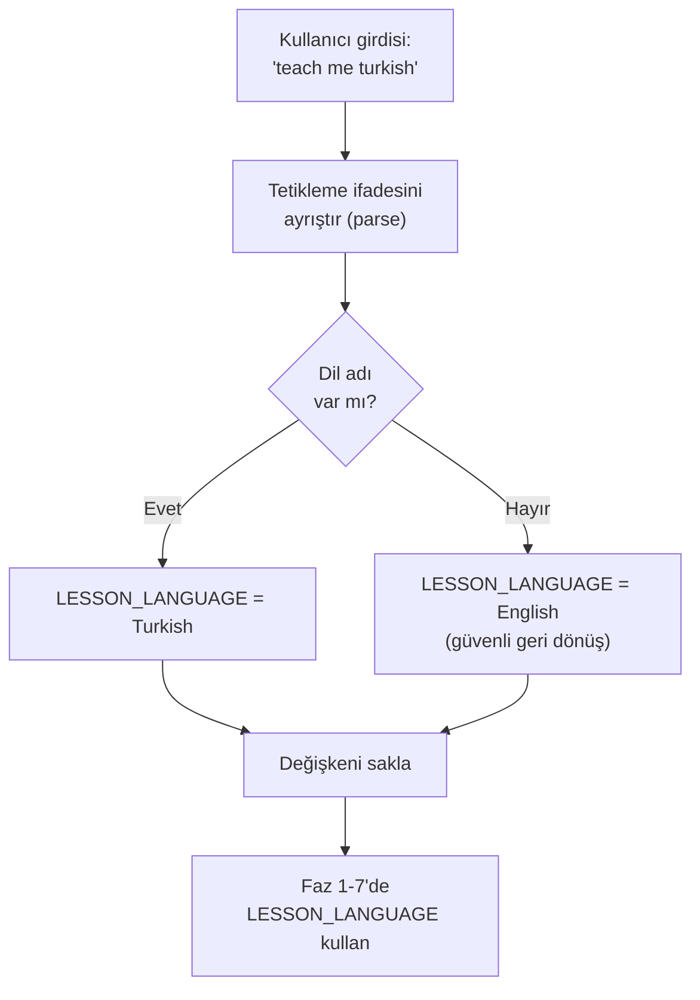
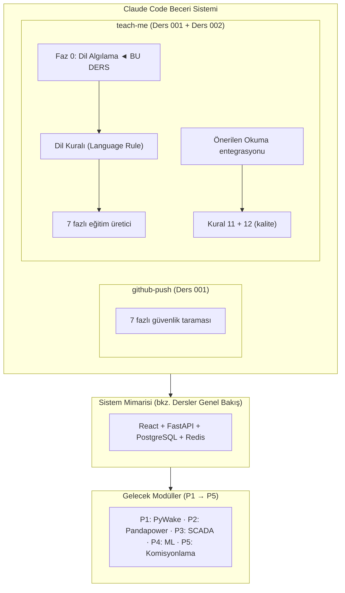

# Lekcja 002 — Dodawanie wielojęzycznego wsparcia do umiejętności edukacyjnych: Infrastruktura internacjonalizacji

!!! abstract "Nawigacja kursu"
:material-arrow-left: **Poprzednia:** [Lekcja 001 — Podstawy DevOps](lesson-001.md) | **Następny:** [Lekcja 003 — Wstępne decyzje projektowe](lesson-003.md):material-arrow-right:

**Faza:** P0 | **Język:** turecki | **Postęp:** 3 / 3 | [Wszystkie lekcje](index.md) | [Plan nauczania](../../Learning_Roadmap.md)

> **Data:** 2026-02-20
> **Zatwierdzenia:** 2 zatwierdzenia (`eba32fd` → `fa528fb`)
> **Zakres zatwierdzenia:** `eba32fd7ab6a979f409d0f2632dedfa35c79f93c..fa528fb95bd6778ea54f50be71ddc6e0475d2818`
> **Faza:** P0 (Podstawa DevOps)
> **Ekrany planu działania:** [Faza 0 — Sekcja 0.3 Podstawy tworzenia stron internetowych]
> **Język:** turecki
> **Poprzednia lekcja:** Lekcja 001
> **last_commit_hash:** fa528fb95bd6778ea54f50be71ddc6e0475d2818

---

## Czego się nauczysz

- Architektoniczne zasady dodawania obsługi wielojęzycznej (internacjonalizacji) do umiejętności obsługi oprogramowania
- Jak zdefiniować granicę tłumaczeniową pomiędzy terminami technicznymi a językiem potocznym – co należy przetłumaczyć, a co powinno pozostać w języku angielskim
- Znaczenie projektowania faz strukturalnych w szybkiej inżynierii
- Jak reguły jakości utrzymują spójność oprogramowania
- Jak strategia oddziałów git i przepływ żądania ściągnięcia działają w profesjonalnych zespołach

---

## Część 1: Mechanizm wykrywania języka — zrozumienie intencji użytkownika

### Prawdziwy problem świata

Wyobraź sobie sterownię farmy wiatrowej: operatorzy mogą pochodzić z różnych narodowości – polscy, niemieccy, duńscy inżynierowie patrzący na ten sam ekran SCADA. Komunikaty alarmowe są w języku angielskim, ale raport analityczny operatora musi być w jego własnym języku. System musi wykryć, w jakim języku operator chce się komunikować i odpowiednio zareagować. Ta sama zasada obowiązuje w naszym oprogramowaniu: gdy użytkownik powie „naucz mnie tureckiego”, system powinien automatycznie wykryć preferencje językowe.

### Co mówią standardy

Standardy **ISO 639-1 (kody języków)** i **IETF BCP 47 (znaczniki języków)** definiują akceptowane na całym świecie kody do identyfikacji języków w systemach oprogramowania. W systemach automatyki przemysłowej nawet **IEC 61131-3** zaleca, aby teksty HMI (interfejs człowiek-maszyna) mogły być lokalizowane. Nasze podejście inspirowane jest tymi standardami: zamiast stałej listy języków używamy wykrywania dynamicznego.

### Co zbudowaliśmy

**Zmienione pliki:**
- `.claude/skills/teach-me/SKILL.md` — Dodano obsługę wielu języków do umiejętności tworzenia kursów szkoleniowych (dodano 52 linie, zmieniono 1 linię)

Do pliku umiejętności dodano nową sekcję **FAZA 0: WYKRYJ JĘZYK**. Ta faza określa, w jakim języku zostanie utworzona lekcja, poprzez analizę instrukcji wyzwalającej użytkownika. Podjęto ważną decyzję projektową: nie jest używana żadna stała lista języków (biała lista). Zamiast tego akceptowany jest każdy język, w którym Claude potrafi płynnie pisać.

### Dlaczego to jest ważne?

> **Dlaczego** wybraliśmy wykrywanie języków na zasadzie otwartej, a nie stałą listę języków?
> Ponieważ stała lista powoduje obciążenie konserwacyjne i zapobiega nieprzewidywalnym scenariuszom użytkowania. Kiedy japoński inżynier mówi „naucz mnie japońskiego”, system powinien to rozpoznać — nie powinien wymagać ręcznego dodawania do listy. Sektor energetyki wiatrowej to branża globalna: DTU w Danii, Fraunhofer w Niemczech, NEDO w Japonii – z tego systemu mogą korzystać inżynierowie z dowolnego kraju.
>
> **Dlaczego** wykrywanie języka zaprojektowano jako oddzielną fazę (faza 0)?
> Bo tego wymaga zasada rozdziału obaw. Wykrywanie języka musi nastąpić PRZED utworzeniem treści kursu — tak jak mierzysz poziom napięcia w podstacji, a następnie przełączasz. Kolejność jest tu kluczowa: jeśli wykryty zostanie niewłaściwy język, cała lekcja zostanie przeprowadzona w niewłaściwym języku.

### Strumień wykrywania języka



### Przegląd kodu

Logika wykrywania języka została zaprojektowana w otwartej i rozszerzalnej strukturze. Poniższa sekcja SKILL.md definiuje reguły wykrywania:

```markdown
## PHASE 0: DETECT LANGUAGE

1. **Parse the user's trigger phrase** for a language name:
  - `"teach me turkish"` → `LESSON_LANGUAGE = Turkish`
  - `"teach me polish"` → `LESSON_LANGUAGE = Polish`
  - `"teach me german"` → `LESSON_LANGUAGE = German`
  - `"teach me"` (no language) → `LESSON_LANGUAGE = English`
  - Any other trigger phrase without a language → `LESSON_LANGUAGE = English`

2. **No hardcoded whitelist** — accept any language Claude can write fluently

3. **Store `LESSON_LANGUAGE`** — use it in all subsequent phases
```

Należy tu wziąć pod uwagę trzy zasady projektowania. Po pierwsze, **wartością domyślną** jest zawsze angielska — zapewniając bezpieczne rozwiązanie w przypadku niejednoznaczności. Po drugie, przykłady są konkretne i jasne — programista nie musi zgadywać. Po trzecie, zmienna `LESSON_LANGUAGE` jest przechowywana i używana we wszystkich kolejnych fazach – proste, ale skuteczne zastosowanie zasady zarządzania stanem.

Struktura ta jest podobna do konfiguracji przekaźnika zabezpieczeniowego: raz ustawiona pozostaje ważna przez całą operację.

!!! tip "Podstawowa koncepcja: bezpieczny powrót z ustawieniami domyślnymi"
**Mówiąc najprościej:** Zamiast ulegać awarii, gdy system otrzyma nieoczekiwane dane wejściowe, powinien zastosować z góry określone bezpieczne zachowanie. Podobnie jak winda jadąca na najbliższe piętro i otwierająca drzwi, gdy zabraknie prądu.

**Analogia:** Weźmy pod uwagę aplikację nawigacyjną. Aplikacja nie ulega awarii po zaniku sygnału GPS — wyświetla Twoją ostatnią znaną lokalizację i wyświetla komunikat „szukam sygnału”. Nasz system percepcji języka działa w ten sam sposób: kiedy pojawia się nierozpoznane wyrażenie językowe, przełącza się na angielski.

**W tym projekcie:** Jeśli użytkownik wpisze „naucz mnie” (bez określenia języka), system wyświetli język angielski. Nawet jeśli napisze „naucz mnie klingona”, system się nie zawali – to, jak dobrze Claude odniesie sukces w tym języku, to inna kwestia, ale system pozostaje stabilny. Zasada ta jest taka sama, jak powrót alarmów SCADA do domyślnego poziomu priorytetu w P3.

---

## Część 2: Zasada ograniczenia języka – co tłumaczyć, a czego nie tłumaczyć

### Prawdziwy problem świata

Pracujesz w kraju nieanglojęzycznym (np. w Polsce) na morskiej farmie wiatrowej. Twoje codzienne raporty mogą być w języku polskim, ale etykiety na rysunkach technicznych są zgodne z międzynarodowym standardem: „66 kV”, „XCSR-1” (identyfikator wyłącznika) i „IEC 61850” są napisane tak samo w każdym języku. Jeśli ktoś przetłumaczy „IEC 61850” jako „MEK 61850”, inżynier z innego kraju nie będzie w stanie tego znaleźć w Google. Dla globalnej komunikacji konieczne jest, aby terminy techniczne pozostały niezależne od języka.

### Co mówią standardy

Istnieją standardy **IEEE 82 (terminy i definicje dotyczące elektryki)** i **IEC 60050 (Międzynarodowy słownik elektrotechniczny)**, które zapewniają międzynarodową spójność terminów elektrotechnicznych. Standardy te zalecają, aby terminy techniczne były używane w ich oryginalnej formie angielskiej, gdy są zlokalizowane. W świecie oprogramowania **GNU gettext** i **Unicode CLDR** kierują się tą samą zasadą: teksty interfejsu użytkownika są tłumaczone, nazwy zmiennych i punkty końcowe API nie.

### Co zbudowaliśmy

**Zmienione pliki:**
- `.claude/skills/teach-me/SKILL.md` — dodano sekcję dotyczącą reguł językowych

Do szablonu kursu dodano nowy blok „Zasady językowe”. Blok ten jasno określa, co zostanie przetłumaczone, a co pozostanie w języku angielskim:

### Dlaczego to jest ważne?

> **Dlaczego** nigdy nie tłumaczymy bloków kodu i ścieżek plików?
> Ponieważ kod jest językiem uniwersalnym. Jeśli funkcją Pythona jest `calculate_wake_deficit()`, przetłumaczenie jej na `rüzgar_gölgesi_açığını_hesapla()` uniemożliwia uruchomienie kodu. Bloki kodu należy kopiować dosłownie — czytelnik powinien móc je wkleić do terminala i uruchomić. Jest to podobne do nomenklatury węzłów logicznych w normie IEC 61850: `MMXU` (pomiar) to `MMXU` w każdym kraju, nigdy nie zlokalizowane.
>
> **Dlaczego** przy pierwszym użyciu podajemy terminy techniczne w języku angielskim + tłumaczenie lokalne?
> Ponieważ ta technika „podwójnego kodowania” zarówno uczy nowej koncepcji, jak i umożliwia czytelnikowi wyszukiwanie w literaturze międzynarodowej. Jeśli turecki inżynier nie zna terminu „deficyt pobudzenia”, nie jest w stanie zrozumieć angielskiej prezentacji na konferencji. Jeśli jednak zetknie się tylko z terminem angielskim, nie będzie w stanie intuicyjnie pojąć, co to pojęcie oznacza. Połączenie tych dwóch – „deficytu czuwania” – rozwiązuje oba problemy.

### Przegląd kodu

Blok Reguły językowe ściśle określa granice tłumaczenia. Poniższa struktura zawiera zasady, których należy przestrzegać podczas realizacji każdej lekcji:

```markdown
### Language Rule

If `LESSON_LANGUAGE` is not English:
- Write ALL prose content in the target language
- Keep these elements in English ALWAYS:
 - Code blocks and inline code
 - File paths and directory names
 - Git commit hashes and commit messages
 - Standard references (e.g., "IEC 61850", "ENTSO-E NC RfG Type D")
 - Technical terms on first use: English term + native translation in parentheses
- Section headings: translate them
- Quiz questions and answers: fully in target language
- Interview Corner: both sections in target language
```

Piękno tej reguły polega na tym, że eliminuje ona dwuznaczność. Granica między „treścią prozatorską” a „kodem/ścieżkami/haszami” jest wyraźna i możliwa do wyegzekwowania. Programista może przeczytać tę zasadę i zastanawiać się „czy powinienem przetłumaczyć tę linię?” zawsze można znaleźć ostateczną odpowiedź na pytanie.

Dodatkowo do nagłówka szablonu dodano nowe pola metadanych:

```markdown
> **Roadmap sections:** [Phase X — Section X.Y Title, Section X.Z Title]
> **Language:** [LESSON_LANGUAGE]
```

Pola te rejestrują, której części planu działania odpowiada każda lekcja i w jakim języku została napisana — podobnie jak rekord SCADA oznacza każde wydarzenie znacznikiem czasu i informacjami o źródle.

!!! tip "Podstawowa koncepcja: internacjonalizacja i lokalizacja (internacjonalizacja — i18n i lokalizacja — l10n)"
**W skrócie:** Umiędzynarodowienie umożliwia dostosowanie aplikacji do różnych języków — to tak, jakby zapewnić kompatybilność domowych gniazdek elektrycznych z wtyczkami z różnych krajów. Lokalizacja natomiast polega na podłączeniu do konkretnego kraju. Najpierw konfigurujesz infrastrukturę, potem dostosowujesz ją do konkretnego języka.

**Analogia:** Pomyśl o instrukcji montażu mebli IKEA. Rysunki są takie same w każdym kraju (podobnie jak bloki kodu), ale teksty ostrzeżeń i instrukcje dotyczące bezpieczeństwa są napisane w języku każdego kraju. Ilustracja klucza imbusowego nie jest przekręcona, ale tekst „Dokręć tę śrubę” tak. Nasza zasada językowa opiera się na tej samej zasadzie.

**W tym projekcie:** Nasza symulacja farmy wiatrowej o mocy 510 MW jest międzynarodową platformą szkoleniową. Polski inżynier PSE mógłby przygotować lekcję po polsku, Turek mógłby przygotować lekcję po turecku dla inżyniera energetyka – ale obaj zapisywaliby `pandapower.runpp()` w ten sam sposób i odnosiliby się do normy IEC 60909 o tym samym numerze.

---

## Część 3: Zalecana integracja planu działania w zakresie czytania i uczenia się

### Prawdziwy problem świata

Inżynier energetyki wiatrowej musi się ciągle uczyć – publikowane są nowe standardy, pojawiają się nowe modele turbin, aktualizowane są przepisy sieciowe. Jednak w oceanie informacji łatwo się zagubić. Dobry system edukacji jest odpowiedzią na pytanie „co mam teraz studiować?” Zapewnia spersonalizowaną odpowiedź na Twoje pytanie — rekomenduje zasoby bezpośrednio związane z tematem, którego się aktualnie uczysz, a nie całą bibliotekę.

### Co mówią standardy

**Taksonomia Blooma** to podstawowe ramy nauk o wychowaniu: zapamiętywanie → rozumienie → zastosowanie → analiza → ocena → tworzenie. Każda lekcja powinna umożliwiać uczniowi przechodzenie wyżej w taksonomii. Sekcja „Zalecane lektury” wybiera zasoby, które pomogą uczniowi przejść z obecnego poziomu na następny. Jest to zgodne z koncepcją Wygotskiego Strefy Najbliższego Rozwoju: nie za łatwo, nie za trudno – po prostu to, co jest obecnie osiągalne.

### Co zbudowaliśmy

**Zmienione pliki:**
- `.claude/skills/teach-me/SKILL.md` — Dodano sekcję „Sugerowana lektura” i integrację z planem nauki

Do fazy 4 dodano nową regułę: odczytywanie pliku `docs/Learning_Roadmap.md` podczas tworzenia każdej lekcji i określanie, której fazie/sekcji planu działania odpowiada dana lekcja. Następnie do szablonu lekcji dodana została nowa tabela „Sugerowane lektury”.

### Dlaczego to jest ważne?

> **Dlaczego** korzystamy z zalecanych lektur z Planu uczenia się, a nie losowo?
> Ponieważ Plan nauki to wyselekcjonowana lista wiarygodnych i zweryfikowanych zasobów. Przypadkowe rekomendacje książek mogą wprowadzać w błąd — jeśli zostanie zalecony błąd w druku, wycofany artykuł lub źródło o niskiej jakości, zaufanie ucznia zostanie zachwiane. W prawdziwym kształceniu inżynierskim odniesienia powinny być identyfikowalne, podobnie jak odniesienia do metod obliczeniowych stosowanych w normie IEC 61400-1.
>
> **Dlaczego** ograniczamy się do 3-5 źródeł i nie podajemy całej listy?
> Przeciążenie informacjami jest jednym z największych wrogów uczenia się. Jeśli uczeń zobaczy listę 30 źródeł, nie przeczyta żadnego z nich. Ale jeśli powiemy: „to są trzy najważniejsze źródła tego kursu”, on faktycznie go przeczyta. Jest to ta sama zasada w zarządzaniu alarmami SCADA (ISA-18.2): jeśli pokażesz operatorowi setki alarmów, zignoruje je wszystkie, jeśli pokażesz 3-5 najbardziej krytycznych alarmów, podejmie działanie.

### Przegląd kodu

Nowa reguła dodana w fazie 4 rozszerza fazę gromadzenia informacji w procesie tworzenia kursu:

```markdown
5. **Read `docs/Learning_Roadmap.md`** to identify which roadmap phase/section
  the lesson maps to, and extract relevant trusted sources (textbooks, papers,
  courses) for the "Suggested Reading" block.
```

Zasada ta gwarantuje, że każda lekcja odpowiada na pytanie nie tylko „co zrobiliśmy”, ale także „co powinienem przeczytać, aby dowiedzieć się więcej?” Odpowiednia sekcja w szablonie lekcji wygląda następująco:

```markdown
## Suggested Reading

*From the [Learning Roadmap](../../Learning_Roadmap.md) — Phase X: [Phase Title]*

| Resource | Type | Why Read It |
|----------|------|-------------|
| [Source from Learning Roadmap] | [Type] | [1-sentence reason tied to this lesson's content] |
```

Obok każdego zasobu znajduje się kolumna „Dlaczego warto to przeczytać” — pomaga to uczniowi zrozumieć, dlaczego wybraliśmy dany zasób. Bez motywacji lista referencyjna jest jedynie bibliografią; Jest to plan działania edukacyjny z motywacją.

Dodatkowo do reguł jakościowych dodana została nowa zasada:

```markdown
11. **Suggested Reading must reference actual Learning Roadmap sources**
  — never fabricate book titles or paper references
```

Zasada ta ma na celu zapobieganie halucynacjom. Modele sztucznej inteligencji mogą czasami tworzyć książki lub artykuły, które nie istnieją. Ta zasada jakości zapewnia, że ​​każdy zalecany zasób rzeczywiście znajduje się w Planie uczenia się — tak jak każde odniesienie w raporcie inżynieryjnym musi być weryfikowalne.

!!! tip "Koncepcja podstawowa: Uczenie się kuratorowane"
**W prosty sposób:** W Internecie znajdują się tysiące zasobów na każdy temat. Uczenie się kuratorowane ma miejsce wtedy, gdy ekspert wybiera dla Ciebie 3–5 najlepszych zasobów i mówi „najpierw je przeczytaj”. To tak, jakby zamiast oglądać wszystkie obrazy w muzeum, przewodnik powiedział: „te pięć obrazów trzeba zobaczyć”.

**Analogia:** Lekarz nie mówi „masz problemy z trawieniem” i nie odsyła cię do WebMD — daje konkretne instrukcje, takie jak „bierz ten lek dwa razy dziennie i przestrzegaj tej diety”. Uczenie się kuratorowane jest takie samo: „chcesz nauczyć się modelowania wybudzenia — najpierw przeczytaj Bastankhah i Porté-Agel (2014), a następnie przejrzyj dokumentację PyWake”.

**W tym projekcie:** Nasz plan działania edukacyjnego obejmuje 15 artykułów akademickich, dziesiątki podręczników i dziesiątki zasobów internetowych. Ale zalecamy tylko 3-5 na końcu każdej lekcji – te, które są bezpośrednio związane z tematem tej lekcji. Jeśli weźmiesz udział w kursie modelowania kilwateru w P1, zobaczysz artykuł o Bastankhah, a jeśli weźmiesz udział w kursie ochrony w P2, zobaczysz artykuł Jankovica.

---

## Część 4: Zasady jakości i przepływ pracy dotyczący żądania ściągnięcia

### Prawdziwy problem świata

W przypadku morskich farm wiatrowych obowiązuje zasada „zakazu działalności bez dokumentacji”. Wyłącznika nie można zamknąć bez napisania programu przełączającego. Urządzenie nie jest uruchamiane do czasu zatwierdzenia raportu z testów. Ta sama dyscyplina jest wymagana przy tworzeniu oprogramowania: funkcja nie jest włączana do głównej gałęzi bez przeglądu i testowania.

### Co mówią standardy

**ISO 9001 (systemy zarządzania jakością)** i **IEC 61400-22 (certyfikacja turbin wiatrowych)** standardy zarządzania jakością wymagają, aby każda zmiana była identyfikowalna i możliwa do przeglądu. Mechanizm żądania rozgałęzienia i ściągnięcia Gita jest naturalnym odpowiednikiem tego wymagania w świecie oprogramowania. Każde żądanie PR jest „prośbą o zmianę” i jest sprawdzane przed połączeniem – podobnie jak proces zarządzania zmianami (MOC).

### Co zbudowaliśmy

Zmiany, które przeglądamy w tym samouczku, zostały opracowane w gałęzi `feature/teach-me-multilang` i połączone z gałęzią główną za pomocą PR #14:

```
eba32fd [INFRA] Add multi-language support to teach-me skill
fa528fb Merge pull request #14 from polat-mustafa/feature/teach-me-multilang
```

Pierwsze zatwierdzenie (`eba32fd`) zawiera rzeczywistą zmianę kodu — 52 dodane linie i 1 zmianę. Drugie zatwierdzenie (`fa528fb`) reprezentuje operację scalania w GitHub. Ten dwuetapowy proces — najpierw opracowanie w branży funkcji, a następnie połączenie z PR — to standardowy przepływ pracy w profesjonalnych zespołach zajmujących się oprogramowaniem.

### Dlaczego to jest ważne?

> **Dlaczego** używamy gałęzi funkcji zamiast bezpośrednio angażować się w gałąź `main`?
> Ponieważ gałąź `main` musi być zawsze uruchomiona — jest to równoznaczne z zasadą „linia produkcyjna jest zawsze uruchomiona”. Jeśli funkcja pozostaje niedokończona, a zepsuty kod znajduje się w `main`, ma to wpływ na cały zespół. Gałąź cech izoluje pracę eksperymentalną. Analogia do farmy wiatrowej: konserwując turbinę, izolujesz ją od sieci – nie wyłączasz całej farmy.
>
> **Dlaczego** używamy znacznika zakresu `[INFRA]` w komunikacie zatwierdzenia?
> Identyfikowalność. Gdy spojrzysz na dziennik Git, tag `[INFRA]` od razu staje się oczywistym, że ta zmiana jest związana z infrastrukturą — a nie z logiką domeny (logiką biznesową) czy naprawianiem błędów. Przypomina to kategorie w dzienniku zdarzeń SCADA: „ALARM”, „TRIP”, „KONSERWACJA” – każdy typ zdarzenia jest oznaczony inną etykietą.

### Przegląd kodu

Zatwierdzenie `eba32fd` aktualizuje linię opisu umiejętności i dodaje wielojęzyczne instrukcje wyzwalacza:

```markdown
description: "Generate a comprehensive teaching lesson from recent git history.
Trigger this skill when the user says: 'teach me', 'teach me english',
'teach me turkish', 'teach me polish', 'explain what we did', 'lesson',
'what did we build', 'what changed', 'review our work', 'generate lesson',
'study session', 'learning recap', or any variation involving reviewing,
explaining, or generating a lesson from recent work. Supports multi-language
output — the user can append any language name to specify the lesson language."
```

Ten sposób opisu odgrywa dwie zasadnicze role. Pierwsza to reguła dopasowywania wzorców, która określa, kiedy Claude Code aktywuje umiejętność. Drugi to dokument dla programistów — wyjaśnia, co robi umiejętność i jak jest uruchamiana.

Wreszcie spójność językową gwarantuje dodanie zasady jakości nr 12:

```markdown
12. **Language consistency** — if a non-English language is specified,
  ALL prose must be in that language; mixing languages mid-sentence
  is forbidden (except for technical terms on first use)
```

Zasada ta pozwala uniknąć problemu „zmiany kodu”. Przejście na angielski w połowie zdania podczas lekcji tureckiego odwraca uwagę czytelnika i pozostawia nieprofesjonalne wrażenie. Jedynym wyjątkiem jest początkowe użycie terminów technicznych, takich jak „deficyt pobudzenia”.

!!! tip "Podstawowa koncepcja: strategia rozgałęziania Git"
**Prosto wyjaśnione:** Pomyśl o tym jak o gałęziach drzewa. Korpus główny (`main`) jest zawsze nienaruszony. Kiedy chcesz dodać nową funkcję, tworzysz gałąź. Pracujesz na gałęzi — nie uszkadzając głównego pnia. Kiedy już skończysz, łączysz gałąź z powrotem z głównym pniem. Jeśli gałąź źle rośnie, odetnij ją – główny pień pozostaje nienaruszony.

**Podobieństwo:** Wymyśl przepis. Zmiana głównego przepisu bezpośrednio jest ryzykowna – być może nowy składnik okaże się kiepski. Zamiast tego kopiujesz przepis (gałąź), eksperymentujesz na kopii i jeśli Ci się podoba, aktualizujesz oryginalny przepis (scalasz). Jeśli Ci się nie podoba, wyrzucasz kopię.

**W tym projekcie:** Gałąź `feature/teach-me-multilang` została utworzona dla funkcji obsługi wielu języków. Wszystkie zmiany zostały wprowadzone w tej gałęzi, przetestowane i połączone w `main` z PR #14. Ten przepływ pracy zostanie powtórzony dla każdej nowej funkcji od P1 do P5.

---

## Linki do poprzednich lekcji

W lekcji 001 stworzyliśmy podstawy projektu DevOps: potok CI/CD, orkiestracja Docker Compose, możliwość skanowania bezpieczeństwa i automatyczne zarządzanie zależnościami za pomocą programu Depabot. Teraz budujemy na tym fundamencie:

- **W lekcji 001** stworzyliśmy umiejętność github-push — automatyczny przepływ pracy push, który wykonuje skanowanie bezpieczeństwa. Rozszerzamy teraz **umiejętność nauczania**, korzystając z tej samej architektury umiejętności. Obie umiejętności mają tę samą strukturę SKILL.md: nagłówek metadanych, dozwolone narzędzia, etapowy przepływ pracy.

- **W lekcji 001** poznaliśmy zasadę „dogłębnej obrony” za pomocą haków przed zatwierdzeniem i potoku CI. W tym kursie stosujemy tę samą zasadę do zasad jakości: Zasada 11 (zakaz stosowania fałszywych źródeł) i Zasada 12 (spójność językowa) służą jako „bramy jakości” w produkcji kursu.

- Reguły komunikatu zatwierdzenia (tagi `[SCOPE]`), których nauczyliśmy się w **Lekcji 001**, są również tutaj użyte: `[INFRA] Add multi-language support to teach-me skill` — znacznik zasięgu, komunikat opisowy, tryb rozkazujący.

- Przepływ pracy z gałęzią funkcji + PR, który wprowadziliśmy w **Lekcji 001** (`feature/teach-me-skill` → PR #13), powtarza się tutaj: `feature/teach-me-multilang` → PR #14. Powtarzające się wzorce są silnymi sygnałami do nauki.

---

## Wielki Obraz

*Cel tej lekcji: **warstwa i18n** dodana do umiejętności uczenia mnie.*



Aby zapoznać się z pełną architekturą systemu, zobacz [Przegląd kursów](index.md#system-architecture).

---

## Kluczowe dania na wynos

1. **Wartości domyślne zapewniają bezpieczne przejście** — jeśli język nie zostanie określony, generowany jest język angielski, podobnie jak przekaźnik zabezpieczeniowy przełącza się na bezpieczną stronę (wyłącza) w przypadku niepewności.
2. **Granice tłumaczenia muszą być jasne** — kod, ścieżki plików, skróty zatwierdzeń i odniesienia do standardów nigdy nie są tłumaczone; Tylko treść prozatorska (proza) jest napisana w języku docelowym.
3. **Terminy techniczne są od pierwszego użycia dwujęzyczne** — format „deficytu wybudzenia” zapewnia zarówno zrozumienie lokalne, jak i możliwość wyszukiwania na arenie międzynarodowej.
4. **Zasady jakości zapobiegają halucynacjom** — Zasada 11 wymaga, aby każdy zalecany zasób był możliwy do zweryfikowania w Planie działania edukacyjnego.
5. **Wyselekcjonowane listy lektur zapobiegają przeciążeniu informacjami** — 3–5 źródeł jest bardziej skutecznych niż 30 źródeł, podobnie jak nadawanie priorytetów najbardziej krytycznym alarmom w systemie SCADA.
6. **Głęzie funkcji zachowują główny kod** — Eksperymenty przeprowadzane są na gałęzi `feature/teach-me-multilang`, `main` zawsze pozostaje stabilna.
7. **Rozdzielenie problemów poprawia jakość architektury** — wykrywanie języka w osobnej fazie (Faza 0), generowanie treści w oddzielnych fazach; Każda część może być testowana i konserwowana niezależnie.

---

## Zalecana lektura

*[Plan nauczania](../../Learning_Roadmap.md) — od fazy 0: Podstawy inżynierii*

| Źródło | Typ | Dlaczego warto czytać |
| -------- | ----- | --------------- |
| Oficjalny samouczek FastAPI | Dokumentacja (bezpłatna) | Chociaż nasz plik umiejętności nie jest interfejsem API, projekt fazy strukturalnej opiera się na tej samej zasadzie, co logika łączenia oprogramowania pośredniego FastAPI |
| Oficjalny samouczek React (react.dev/learn) | Dokumentacja (bezpłatna) | SCADA HMI w P3 będzie wielojęzyczny — podstawowa znajomość React wymagana do zrozumienia ekosystemu i18n React |
| *Projektowanie aplikacji intensywnie przetwarzających dane* — Martin Kleppmann | Książka | Internacjonalizacja to problem związany ze strukturą danych — rozdziały Kleppmanna dotyczące kodowania i ewolucji schematów są ze sobą bezpośrednio powiązane |

---

## Quiz — sprawdź swoje zrozumienie

### Przypomnij sobie pytania

**P1:** Co dokładnie robi faza 0 dodana do umiejętności Naucz mnie i jaki jest domyślny język?

<szczegóły>
<summary>Odpowiedź</summary>

Faza 0: WYKRYJ JĘZYK określa, w jakim języku zostanie utworzona lekcja, poprzez analizę instrukcji wyzwalającej użytkownika. Na przykład wyodrębnia `LESSON_LANGUAGE = Turkish` z wyrażenia „naucz mnie tureckiego”. Jeśli użytkownik nie określi języka (po prostu powie „naucz mnie”) lub użyje nierozpoznanego wyrażenia, domyślnym językiem jest angielski. To ustawienie domyślne zostało zaprojektowane zgodnie z zasadą bezpiecznego powrotu.

</details>

**Pyt. 2:** Zgodnie z Zasadą Językową, które elementy powinny pozostać w języku angielskim na lekcji języka tureckiego?

<szczegóły>
<summary>Odpowiedź</summary>

Pięć kategorii musi pozostać w języku angielskim: (1) bloki kodu i kod wbudowany, (2) ścieżki plików i nazwy katalogów, (3) skróty zatwierdzeń git i komunikaty zatwierdzeń, (4) odniesienia do standardów (np. „IEC 61850”, „ENTSO-EN NC RfG Type D”) oraz (5) terminy techniczne podano przy pierwszym użyciu w języku angielskim + lokalne tłumaczenie w nawiasach. Tytuły rozdziałów, pytania egzaminacyjne, kącik rozmów kwalifikacyjnych i cała treść prozatorska są napisane w języku docelowym.

</details>

**Pyt. 3:** Jakie dwie nowe zasady jakości (Zasada 11 i Zasada 12) zostały dodane w tej lekcji?

<szczegóły>
<summary>Odpowiedź</summary>

Zasada 11: „Sugerowane lektury muszą odwoływać się do rzeczywistych źródeł Planu uczenia się — nigdy nie wymyślaj tytułów książek ani odniesień do artykułów” — nakazuje, aby sugerowane lektury pochodziły z rzeczywistych źródeł w Planie uczenia się, a nigdy nie fabrykuj odniesień do książek lub artykułów. Zasada 12: „Spójność językowa — jeśli określono język inny niż angielski, WSZYSTKIE prozy muszą być w tym języku; mieszanie języków w połowie zdania jest zabronione (z wyjątkiem terminów technicznych przy pierwszym użyciu)” — zapewnia spójność językową i zabrania zmiany kodu w połowie zdania.

</details>

### Pytania dotyczące zrozumienia

**Pyt. 4:** Dlaczego preferowano wykrywanie języka na podstawie otwartej listy języków (białej listy)? Jakie są zalety i wady tej decyzji?

<szczegóły>
<summary>Odpowiedź</summary>

Wybrano wykrywanie otwarte, ponieważ energia wiatrowa to branża globalna i inżynierowie z dowolnego kraju mogą korzystać z tej platformy. Stała lista wymaga ręcznych aktualizacji dla każdego nowego języka i zapobiega nieprzewidywalnym scenariuszom użycia. Zaleta: nieograniczone wsparcie językowe przy zerowych kosztach utrzymania. Wada: Claude ryzykuje, że w niektórych językach (np. rzadkich językach) wydruki będą niskiej jakości. Istnieje jednak ryzyko, że system zamiast zawieszać się, będzie generował dane wyjściowe o niskiej jakości – co jest bezpiecznym trybem awaryjnym (łagodna degradacja).

</details>

**P5:** Dlaczego ważne jest, aby przy pierwszym użyciu terminy techniczne podawać w formacie „tłumaczenie angielskie + lokalne”? Czy nie wystarczyłby sam angielski lub lokalny język?

<szczegóły>
<summary>Odpowiedź</summary>

Używanie wyłącznie angielskich terminów zmniejsza szansę czytelnika na intuicyjne zrozumienie koncepcji — wyrażenie „deficyt budzenia” jest bez znaczenia dla inżyniera, który nie mówi po angielsku. Korzystanie wyłącznie z tłumaczeń lokalnych ogranicza zdolność czytelnika do przeszukiwania literatury międzynarodowej, rozumienia prezentacji na konferencjach anglojęzycznych i komunikowania się w międzynarodowych zespołach. Połączenie tych dwóch elementów – „deficyt przebudzenia” – zapewnia zarówno lokalne zrozumienie, jak i uczy międzynarodowej terminologii. Jest to technika „podwójnego kodowania” stosowana w naukach o wychowaniu: przedstawienie tej samej koncepcji w dwóch różnych formatach zwiększa trwałość pamięci.

</details>

**P6:** Dlaczego przepływ żądania ściągnięcia (PR) jest bezpieczniejszy niż bezpośrednie zatwierdzanie w gałęzi `main`? Wyjaśnij to pytanie za pomocą analogii do farmy wiatrowej.

<szczegóły>
<summary>Odpowiedź</summary>

Przepływ pracy PR wyodrębnia zmiany i zapewnia możliwość ich przeglądu — tak jak turbina przeznaczona do konserwacji na farmie wiatrowej jest najpierw izolowana od sieci. Podczas serwisowania generatora Turbine 17 odłącza się go od sieci 66 kV — więc nawet jeśli coś pójdzie nie tak podczas konserwacji, nie będzie to miało wpływu na pozostałe 33 turbiny. Bezpośrednie zatwierdzenie `main` przypomina konserwację po podłączeniu do sieci — jeden błąd wpływa na cały system. W przepływie pracy PR gałąź funkcji jest izolowanym środowiskiem, testy CI przeprowadzają automatyczną weryfikację, a scalanie odbywa się dopiero po przejściu wszystkich kontroli.

</details>

### Pytanie stanowiące wyzwanie

**Pyt.7:** Obecnie w tym projekcie dostępne są dwie umiejętności (github-push i nauczanie). Obydwa są zdefiniowane w plikach SKILL.md w katalogu `.claude/skills/`. Jeśli liczba umiejętności wzrośnie do 10 lub 20, jakie problemy architektoniczne się pojawią i jak je rozwiązać? Myśl w kategoriach odkrywania umiejętności, rozwiązywania konfliktów i wydajności.

<szczegóły>
<summary>Odpowiedź</summary>

**Odkrywanie umiejętności:** Przy 20 umiejętnościach Claude Code musi porównać każdą wiadomość użytkownika z listą 20 różnych fraz wyzwalających. Jest to złożoność przeszukiwania liniowego (O(n)). Rozwiązanie: podziel umiejętności na kategorie (np. „git”, „edukacja”, „analiza”) i najpierw dopasuj kategorie — tak jak przy koordynowaniu zabezpieczenia, najpierw zidentyfikuj strefę, a następnie wykonaj szczegółową analizę.

**Zarządzanie konfliktem:** Na tę samą frazę wyzwalającą może reagować wiele umiejętności. Na przykład „przejrzyj naszą pracę” można przypisać zarówno do umiejętności „Naucz mnie”, jak i przyszłej umiejętności „przeglądu kodu”. Rozwiązanie: (1) uporządkowanie priorytetowe, (2) priorytetem są bardziej szczegółowe dopasowania lub (3) zapytanie użytkownika w przypadku niepewności. Jest to to samo, co zasada „stopniowania” w koordynacji przekaźników zabezpieczeniowych: jeśli wiele przekaźników wykryje tę samą awarię, najbliższy przekaźnik otwiera się jako pierwszy.

**Wydajność:** Czytanie każdego pliku umiejętności w każdej wiadomości powoduje opóźnienie. Rozwiązanie: (1) plik manifestu umiejętności (zbierający wszystkie instrukcje wyzwalacza w jednym pliku indeksu), (2) leniwe ładowanie (umiejętność jest w pełni ładowana tylko po dopasowaniu), (3) buforowanie. To jest ankieta vs. ankieta systemów SCADA. Przypomina to architekturę sterowaną zdarzeniami: zamiast ciągłego odpytywania każdego czujnika, bardziej efektywne jest otrzymywanie powiadomień tylko wtedy, gdy nastąpią zmiany (sterowane zdarzeniami).

</details>

---

## Kącik wywiadów

### Wyjaśnij prosto
* „Jak wyjaśniłbyś dodanie obsługi wielojęzycznej do narzędzia programowego osobie niebędącej inżynierem?”*

Let's say you are a teacher and you write your lecture notes only in English. Ale w twojej klasie są uczniowie z Turcji, Polski i Niemiec. Wszyscy rozumieją angielski, ale uczą się znacznie szybciej i głębiej, jeśli czytają w swoim własnym języku. Teraz konfigurujesz system: kiedy student powie „powiedz mi po turecku”, Twoje notatki z wykładów zostaną przetłumaczone na język turecki.

Ale nie przetłumaczysz wszystkiego! Wzory matematyczne są takie same w każdym języku – „2 + 2 = 4” jest takie samo w języku tureckim. Podobnie nie tłumaczy się kodu komputerowego, ponieważ komputer nie rozumie języka tureckiego. Nie wybiera się także ich standardowych numerów, ponieważ ten sam numer jest używany na całym świecie. Wystarczy, że przetłumaczysz wyjaśnienia, przykłady i pytania — te fragmenty, które ludzie czytają.

Dokładnie to zrobiliśmy w tym projekcie. We had a tool that produced training lessons. Dodaliśmy zasady „zrozum, w jakim języku pisać” i „wiedz, co tłumaczyć, a czego nie tłumaczyć”. Teraz turecki inżynier energetyk może nauczyć się naszej symulacji farmy wiatrowej w języku tureckim, ale kody i standardowe odniesienia pozostają w formacie międzynarodowym.

### Wyjaśnij technicznie
* „Jak wyjaśnisz dodanie wsparcia internacjonalizacji do panelu rekrutacyjnego, systemu umiejętności AI?”*

Zaprojektowaliśmy warstwę internacjonalizacji (i18n) dla systemu umiejętności Claude Code. Nasza podstawowa decyzja dotycząca architektury różni się od tradycyjnego podejścia i18n (gettext, format wiadomości ICU, pliki tłumaczeń), ponieważ pracujemy w systemie opartym na LLM. Zamiast plików tłumaczeń typu klucz-wartość definiujemy granice tłumaczenia za pomocą instrukcji w języku naturalnym (szybka inżynieria).

Architektura systemu jest potokiem etapowym. Faza 0 (DETECT LANGUAGE) wyodrębnia preferencje językowe z danych wprowadzonych przez użytkownika i zapisuje je jako zmienną stanu `LESSON_LANGUAGE`. Zmienna ta jest używana we wszystkich kolejnych fazach (fazy 1-7). Zamiast korzystać ze stałej listy języków (białej listy), zdecydowaliśmy się na wykrywanie otwarte — zapewnia to nieograniczoną rozszerzalność języków przy zerowych kosztach utrzymania, ale akceptuje ryzyko łagodnej degradacji: jakość wydruku może ucierpieć w przypadku rzadkich języków.

Zasada limitu tłumaczenia (reguła językowa) jest najważniejszą decyzją projektową i18n. Zdefiniowaliśmy pięć kategorii jako „niezmiennych”: bloki kodu, ścieżki plików, metadane git, odniesienia do standardów i terminy techniczne (dwa formaty przy pierwszym użyciu). To ograniczenie opiera się na tej samej zasadzie, co konwencja nazewnictwa węzłów logicznych w IEC 61850: `MMXU` to `MMXU` w każdym kraju i nie jest zlokalizowane. Strukturalnie uniknięto ryzyka halucynacji i problemu ze zmianą kodu poprzez dodanie dwóch nowych zasad jakości (11: weryfikacja źródła planu działania na rzecz uczenia się, 12: spójność językowa). Wszystkie zmiany zostały połączone w gałęzi funkcji + przepływ pracy PR (PR nr 14) i przesłane przez potok CI.
