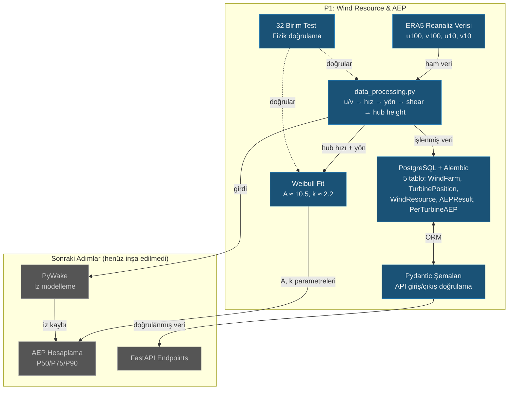

# Lekcja 004 — Rozpoczęcie P1: Modele baz danych, przetwarzanie danych wiatrowych ERA5 i analiza Weibulla

!!! abstract "Nawigacja kursu"
:material-arrow-left: **Poprzednia:** [Lekcja 003 — Wstępne decyzje projektowe](lesson-003.md) | **Następny:** [Lekcja 005 — Wiatrowskaz i model szlaku](lesson-005.md) :material-arrow-right:

**Faza:** P1 | **Język:** Polski | **Postęp:** 5 z 19 | [Wszystkie lekcje](index.md) | [Plan nauczania](../../Learning_Roadmap.md)

> **Data:** 23.02.2026
> **Zatwierdzenia:** 15 zatwierdzeń (`d6e30ee` → `bb84814`), 3 dahil / 12 w kraju
> **Zakres zatwierdzenia:** `d6e30ee52c7a389c8232f546dc3e6ae2952e79f7..bb84814a0a0bf528dd78c95d42e6341e50b89bb5`
> **Faza:** P1 (zasoby wiatru i AEP)
> **Ekrany planu działania:** [Faza 1 — Sekcja 1.1 Ocena zasobów wiatru, Sekcja 1.2 Modelowanie śladu i optymalizacja układu]
> **Język:** Polski
> **Poprzednia lekcja:** Lekcja 002
> **last_commit_hash:** bb84814a0a0bf528dd78c95d42e6341e50b89bb5

---

## Czego się nauczysz

- Jak dane z ponownej analizy ERA5 są przekształcane ze składowych u/v na prędkość i kierunek wiatru (fizyka rozkładu wektorów)
- Ekstrapolacja prędkości wiatru od 100 m do 150 m wysokości piasty z profilem mocy
- Krytyczna rola rozkładu Weibulla w inżynierii wiatrowej i sposób jego dopasowania do scipy
- Stwórz architekturę bazy danych o jakości produkcyjnej za pomocą migracji Async SQLAlchemy + Alembic
- Znaczenie weryfikacji praw fizyki za pomocą testów jednostkowych w praktyce inżynierskiej.

---

## Część 1: Przegląd techniczny — sprawdzanie poprawności i naprawianie zależności

### Prawdziwy problem życiowy

Załóżmy, że budujesz most. Na rysunkach projektowych wytrzymałość stali jest zapisana jako 500 MPa, ale w rzeczywistości materiał wynosi 450 MPa. Ta 10% różnica może spowodować zawalenie się mostu. W inżynierii nie ma czegoś takiego jak „mały błąd numeryczny” – każdą wartość należy zweryfikować.

Dokładnie tak się stało w naszym projekcie: Prędkość wyłączenia turbiny V236-15.0 MW została zapisana w naszej dokumentacji jako **34 m/s**, ale prawidłowa wartość to **31 m/s**. Różnica wynosząca 3 m/s spowodowałaby poważne odchylenie w obliczeniach AEP (roczna produkcja energii).

### Co mówią standardy

**IEC 61400-1 (Systemy wytwarzania energii wiatrowej – wymagania projektowe)** określa klasyfikację turbin. V236-15.0 MW to turbina IEC klasy I-B — oznacza to prędkość wyłączania wynoszącą 31 m/s. Dodatkowo **IEC 61400-12-1 (testowanie wydajności mocy)** wymaga, aby wszystkie parametry krzywej mocy pochodziły ze zweryfikowanych źródeł.

Po stronie zarządzania zależnościami ograniczyliśmy pakiet `mkdocs-material` do `<10.0.0`. Skąd? Istniało ryzyko niezgodności z MkDocs 2.0 — w systemach produkcyjnych zależnościami należy zarządzać w **stałych odstępach czasu**, a nie w „najnowszej wersji”.

### Co zbudowaliśmy

**Zmienione pliki:**

- `docs/Project_Roadmap.md` — Prędkość wyłączenia 34 → 31 m/s korekta, D3.js → Wymiana XYFlow
- `docs/SKILL.md` — D3.js → Aktualizacja XYFlow w przeglądzie architektury
- `requirements-docs.txt` — poprawka górnego limitu `mkdocs-material>=9.5.0,<10.0.0`
- `.claude/skills/github-push/SKILL.md` — Dodano strategię automatycznego rozgałęziania i fazę automatycznego łączenia

Korekta szybkości wycinania aktualizowana konsekwentnie we wszystkich dokumentach. Dodatkowo do umiejętności `github-push` dodano **Faza 6.1 (strategia rozgałęzienia)** i **Faza 8 (automatyczne łączenie)**: teraz gałąź funkcji jest tworzona automatycznie w gałęzi `main`, a scalanie w trybie squash jest wykonywane po przekazaniu CI za pomocą polecenia „push and merge”.

### Dlaczego to jest ważne?

> **Dlaczego** prędkość wyłączania jest tak krytyczna?
> Prędkość wyłączenia to prędkość wiatru, przy której turbina zatrzymuje się ze względów bezpieczeństwa. W obliczeniach AEP wszystkie godziny powyżej tej wartości są liczone jako produkcja zerowa. Zastosowanie 31 m/s zamiast 34 oznacza kilkadziesiąt godzin „zerowej produkcji” więcej w roku – co bezpośrednio wpływa na prognozę rocznych przychodów.

> **Dlaczego** preferowano XYFlow zamiast D3.js?
> D3.js to biblioteka bardzo niskiego poziomu — każdy element SVG musisz narysować ręcznie. XYFlow (`@xyflow/react`) to biblioteka interfejsu użytkownika oparta na węzłach, która działa jako komponent React. Jest to naturalny wybór dla schematów jednokreskowych w P2, topologii SCADA w P3 i programów przełączających w P5.

### Przegląd kodu

Przyjrzyjmy się efektowi korekcji prędkości wyłączenia w `Project_Roadmap.md`. Wartość ta występowała w czterech różnych punktach projektu i wszystkie wymagały spójnej aktualizacji:

```python
# docs/Project_Roadmap.md — fizik kısıtlama fonksiyonu
def enforce_physical_constraints(prediction, wind_speed):
  """
  1. Power ≥ 0 (negatif üretim olmaz)
  2. Power ≤ 15.0 MW per turbine (nominal sınır)
  3. Power = 0 if wind_speed < 3.0 m/s (cut-in altında)
  4. Power = 0 if wind_speed > 31.0 m/s (cut-out üstünde) # 34 → 31 düzeltildi
  5. Power monotonically increases (cut-in → rated arası)
  """
```

Ta poprawka została wprowadzona nie w jednym pliku, ale w pięciu różnych plikach. Zasada „jednego źródła prawdy” w inżynierii nakłada na to obowiązek.

!!! tip "Podstawowa koncepcja: przegląd inżynieryjny"
**W skrócie:** zanim oddasz pracę egzaminacyjną, ponownie sprawdź wszystkie swoje odpowiedzi. Na tym właśnie polega przegląd inżynieryjny — na systematycznym sprawdzaniu poprawności wszystkich wartości liczbowych, odniesień i założeń po napisaniu kodu.

**Podobieństwo:** Pilotażowa lista kontrolna. Pilot przed każdym lotem przestrzega tej samej listy kontrolnej – „silnik sprawny, paliwo wystarczające, podwozie wypuszczone”. Inżynier sprawdza, czy „wycięcie jest prawidłowe, odniesienie do standardu jest prawidłowe, wersja zależności jest naprawiona”.

**W tym projekcie:** Skorygowaliśmy prędkość wyłączenia V236-15.0 MW na 34 → 31 m/s. Ta pojedyncza korekta zapewniła, że ​​nasze obliczenia AEP były realistyczne.

---

## Część 2: Silnik asynchronicznej bazy danych — SQLAlchemy i Alembic

### Prawdziwy problem życiowy

Rozważmy szpitalny system informacyjny. Setki lekarzy przeglądają jednocześnie dokumentację pacjentów. Jeśli podczas każdego przesłuchania system mówi „czekaj, to nie twoja kolej”, pacjenci są narażeni na niebezpieczeństwo. **Asynchroniczny dostęp do bazy danych** eliminuje ten czas oczekiwania — jedno zapytanie czeka na odpowiedź, a inne nadal działają.

### Co mówią standardy

Norma IEC nie obejmuje bezpośrednio projektowania baz danych, ale **IEC 61850-7-1 (Sieci i systemy komunikacyjne dla automatyki zakładów energetycznych — podstawowa struktura komunikacji)** definiuje zasady modelowania danych: każdy punkt danych musi mieć unikalny identyfikator, znacznik czasu i znak jakości. Nasze modele ORM wdrażają tę zasadę w warstwie oprogramowania.

W przypadku migracji Alembic standardem branżowym jest podejście **baza danych jako kod**: zmiany schematu muszą być kontrolowane pod kątem wersji, powtarzalne i odwracalne.

### Co zbudowaliśmy

**Zmienione pliki:**

- `backend/app/db.py` — silnik asynchroniczny SQLAlchemy, fabryka sesji, baza deklaratywna
- `backend/alembic/env.py` — Środowisko Alembic z obsługą Async PostgreSQL
- `backend/alembic/versions/..._p1_initial_schema_...py` — Pierwsza migracja (5 tabel)

Poniższy kod stanowi centrum całego dostępu do bazy danych. Pozwala FastAPI utworzyć nową sesję bazy danych dla każdego żądania API i automatycznie ją zamknąć po zakończeniu żądania:

```python
# backend/app/db.py
from sqlalchemy.ext.asyncio import AsyncSession, async_sessionmaker, create_async_engine
from sqlalchemy.orm import DeclarativeBase

engine = create_async_engine(
  settings.database_url,
  echo=settings.debug,   # SQL sorgularını logla (debug modunda)
  pool_size=10,       # Havuzda 10 bağlantı tut (aynı anda 10 sorgu)
  max_overflow=20,      # Yoğun anlarda 20 ek bağlantıya izin ver
)

async_session_factory = async_sessionmaker(
  engine,
  class_=AsyncSession,
  expire_on_commit=False,  # Commit sonrası nesneleri yeniden yükleme
)

class Base(DeclarativeBase):
  """Tüm ORM modellerinin ana sınıfı."""

async def get_session() -> AsyncGenerator[AsyncSession]:
  """FastAPI dependency — her istek için async veritabanı oturumu sağlar."""
  async with async_session_factory() as session:
    yield session
```

Moduł ten obejmuje również zarządzanie pulą połączeń za pomocą `pool_size=10` i `max_overflow=20`. Ta struktura ujścia ma kluczowe znaczenie dla równoległego przetwarzania danych SCADA z 34 turbin.

Po stronie Alembic plik `env.py` jest skonfigurowany do korzystania z silnika asynchronicznego:

```python
# backend/alembic/env.py (özet)
async def run_async_migrations() -> None:
  """Asenkron motorla migrasyon çalıştır."""
  connectable = async_engine_from_config(
    config.get_section(config.config_ini_section, {}),
    prefix="sqlalchemy.",
    poolclass=pool.NullPool, # Migrasyon için havuz gereksiz
  )
  async with connectable.connect() as connection:
    await connection.run_sync(do_run_migrations)
  await connectable.dispose()
```

Zwróć uwagę na użycie `NullPool`: migracje są operacjami jednorazowymi i nie ma potrzeby tworzenia puli połączeń. Jest to celowy kontrast w stosunku do `pool_size=10` w silniku produkcyjnym.

### Dlaczego to jest ważne?

> **Dlaczego** korzystamy z asynchronicznego dostępu do bazy danych?
> W naszej farmie wiatrowej znajdują się 34 turbiny, a każda z nich co sekundę wysyła dane SCADA. W przypadku dostępu synchronicznego każde zapytanie czeka na zakończenie poprzedniego — 34 × 1 sekunda = 34 sekundy opóźnienia. W przypadku dostępu asynchronicznego wszystkie działają równolegle.

> **Dlaczego** migracje alembiczne są konieczne?
> „Usuń bazę danych, utwórz od zera” działa tylko w środowisku programistycznym. Nie można usunąć tabeli, jeśli w środowisku produkcyjnym znajduje się 175 200 wierszy danych ERA5. Alembic stosuje zmiany schematu bez utraty danych.

!!! tip "Podstawowa koncepcja: Pula połączeń"
**W skrócie:** W restauracji pracuje 10 kelnerów. Zamiast zatrudniać nowego kelnera za każdym razem, gdy przychodzi klient, obecni kelnerzy zmieniają się między stołami. W ten sam sposób pula połączeń zarządza połączeniami z bazą danych — ponownie wykorzystuje istniejące połączenia, zamiast otwierać nowe połączenie dla każdego zapytania.

**Podobieństwo:** Punkt kontroli bezpieczeństwa na lotnisku. Gdy punkt kontrolny 10 jest otwarty, pasażerowie przechodzą równolegle (`pool_size=10`). Podczas świątecznego szczytu zostaje odblokowanych 20 dodatkowych punktów (`max_overflow=20`). W przypadku przekroczenia przepustowości pasażerowie ustawiają się w kolejce.

**W tym projekcie:** `pool_size=10` wystarcza do normalnego obciążenia, `max_overflow=20` jest aktywowany, gdy wszystkie turbiny wysyłają dane w tym samym czasie. Dla naszej farmy składającej się z 34 turbin wystarczy łącznie 30 jednoczesnych połączeń z bazą danych.

---

## Część 3: Modele ORM i schematy pydantyczne — projektowanie struktur danych

### Prawdziwy problem życiowy

Projektujesz system biblioteczny. Tabela „Książka” zawiera nazwisko autora, rok wydania i numer ISBN. Ale może być więcej niż jeden egzemplarz książki, każdy egzemplarz leży na innej półce, a niektóre są wypożyczone. Jeśli nie zamodelujesz poprawnie tych relacji, będziesz się zastanawiać, „który egzemplarz jest na półce?” Nie możesz odpowiedzieć na pytanie.

Nasza farma wiatrowa ma podobną strukturę: **farma** (WindFarm) zawiera wiele **pozycji turbin** (TurbinePosition), każda farma ma **dane o zasobach wiatrowych** (WindResource) i **wyniki AEP** (AEPResult), każdy wynik AEP zawiera szczegóły **AEP na turbinę** (PerTurbineAEP).

### Co mówią standardy

**IEC 61400-25-2 (Komunikacja w zakresie monitorowania i sterowania — modele informacyjne)** definiuje model informacyjny turbiny wiatrowej. Każda turbina musi posiadać unikalny identyfikator (taki jak `WTG_01`), dane przestrzenne i parametry eksploatacyjne. Nasz model `TurbinePosition` odzwierciedla tę strukturę.

**IEC 61400-12-1 (testowanie wydajności mocy)** wymaga, aby pomiary wiatru były rejestrowane ze znacznikiem czasu i informacjami o wysokości kalibracyjnej — to jest powód pojawienia się pól `hub_height_m` i `time` w naszym modelu `WindResource`.

### Co zbudowaliśmy

**Zmienione pliki:**

- `backend/app/models/wind_farm.py` — WindFarm, TurbinePosition, AEPResult, PerTurbineAEP Modele ORM
- `backend/app/models/wind_resource.py` — model szeregów czasowych WindResource
- `backend/app/schemas/wind_farm.py` — Schematy żądań/odpowiedzi Pydantic v2
- `backend/app/schemas/wind_resource.py` — Schematy źródła wiatru i AEP

Przyjrzyjmy się strukturze relacji między pięcioma tabelami. Z centralnego stołu `WindFarm` wyłaniają się trzy główne gałęzie:

```python
# backend/app/models/wind_farm.py — İlişki yapısı
class WindFarm(Base):
  """Rüzgar çiftliği spesifikasyonu — çiftlik başına bir satır."""
  __tablename__ = "wind_farm"

  id: Mapped[uuid.UUID] = mapped_column(primary_key=True, default=uuid.uuid4)
  name: Mapped[str] = mapped_column(String(100))
  latitude: Mapped[float] = mapped_column(Float, comment="Farm centre latitude [deg]")
  longitude: Mapped[float] = mapped_column(Float, comment="Farm centre longitude [deg]")
  capacity_mw: Mapped[float] = mapped_column(Float, comment="Total installed capacity [MW]")
  num_turbines: Mapped[int] = mapped_column(Integer)

  # Üç ana ilişki — cascade="all, delete-orphan" ile
  turbine_positions: Mapped[list[TurbinePosition]] = relationship(
    back_populates="wind_farm",
    cascade="all, delete-orphan", # Çiftlik silinince türbinler de silinir
  )
  wind_resources: Mapped[list[WindResource]] = relationship(
    back_populates="wind_farm",
    cascade="all, delete-orphan",
  )
  aep_results: Mapped[list[AEPResult]] = relationship(
    back_populates="wind_farm",
    cascade="all, delete-orphan",
  )
```

`cascade="all, delete-orphan"` to kluczowa decyzja projektowa: po usunięciu rekordu farmy wiatrowej wszystkie powiązane z nim pozycje turbin, dane dotyczące wiatru i wyniki AEP również zostaną automatycznie usunięte. Pozwala to uniknąć problemu „rejestru sierocego”.

Model `AEPResult` wymusza pasma niepewności P50/P75/P90 — jest to bezpośrednie zastosowanie Zasady Inżynierskiej 10 („niepewność jest obowiązkowa w każdym wyjściu AEP”):

```python
class AEPResult(Base):
  """AEP hesaplama sonucu — P50/P75/P90 belirsizlik bantlarıyla.

  Mühendislik Kuralı 10: belirsizlik tüm AEP çıktılarında zorunludur.
  """
  __tablename__ = "aep_result"

  aep_p50_gwh: Mapped[float] = mapped_column(Float, comment="P50 (median) AEP [GWh]")
  aep_p75_gwh: Mapped[float] = mapped_column(Float, comment="P75 exceedance AEP [GWh]")
  aep_p90_gwh: Mapped[float] = mapped_column(Float, comment="P90 exceedance AEP [GWh]")
  uncertainty_percent: Mapped[float] = mapped_column(Float, comment="Combined RSS uncertainty [%]")
  wake_loss_percent: Mapped[float] = mapped_column(Float, comment="Wake-induced energy loss [%]")
```

Z drugiej strony schematy pydantyczne dokonują walidacji danych na granicy interfejsu API. Podczas gdy model ORM reprezentuje bazę danych, schemat Pydantic sprawdza poprawność danych pochodzących z klienta API:

```python
# backend/app/schemas/wind_farm.py — Giriş doğrulama
class WindFarmCreate(BaseModel):
  """Rüzgar çiftliği oluşturma isteği şeması."""
  name: str = Field(max_length=100, examples=["Baltic Wind Alpha"])
  latitude: float = Field(ge=-90, le=90, description="Farm centre latitude [deg]")
  longitude: float = Field(ge=-180, le=180, description="Farm centre longitude [deg]")
  capacity_mw: float = Field(ge=0, le=2000, description="Total installed capacity [MW]")
  num_turbines: int = Field(ge=1, le=200)
```

Limity takie jak `ge=-90, le=90` uniemożliwiają wprowadzenie do systemu fizycznie niemożliwych wartości. Szerokość geograficzna musi mieścić się w przedziale od -90 do 90 — kontroluje to warstwa API, a nie baza danych.

### Dlaczego to jest ważne?

> **Dlaczego** model ORM i schemat Pydantic są oddzielne?
> Zasada pojedynczej odpowiedzialności: Model ORM komunikuje się z bazą danych, schemat Pydantic komunikuje się z klientem API. Schemat API nie musi się zmieniać wraz ze zmianą schematu bazy danych — i odwrotnie.

> **Dlaczego** używamy identyfikatora UUID, a nie identyfikatora automatycznie przyrostowego?
> W systemach rozproszonych UUID generuje identyfikator bez konfliktów. Nawet jeśli dwa różne serwery utworzą rekordy w tym samym czasie, identyfikatory nie będą kolidować. Dane dotyczące farm wiatrowych mogą pochodzić z wielu źródeł (ERA5, SCADA, pomiary ręczne).

!!! tip "Podstawowa koncepcja: kaskada = „wszystko, usuń sierotę”"
**Mówiąc prościej:** Kiedy dom zostaje zburzony, meble w środku znikają. `delete-orphan` automatycznie czyści rekordy, które pozostają „bezdomne” w bazie danych.

**Analogia:** W przypadku zamknięcia klasy w szkole wszystkie listy obecności, dzienniki ocen i wyniki egzaminów dla tej klasy są archiwizowane lub usuwane. Nie powinno być żadnych „nieodebranych” zapisów.

**W tym projekcie:** Kiedy `WindFarm` zostanie usunięte, 34 rekordy `TurbinePosition`, 175 200 `WindResource` i wszystkie powiązane z nim rekordy `AEPResult` zostaną automatycznie usunięte. W bazie danych nie pozostaną żadne niespójne dane.

---

## Część 4: Dane wiatrowe ERA5 — od komponentów u/v po wysokość piasty

### Prawdziwy problem życiowy

Stacja pogodowa podaje „wiatr z północnego wschodu, prędkość 30 mil na godzinę”. Jednak surowe dane satelitarne nie są dostarczane w ten sposób — wiatr jest rejestrowany jako dwie oddzielne składowe, wschód-zachód (u) i północ-południe (v). Na podstawie tych dwóch liczb musisz obliczyć zarówno prędkość, jak i kierunek. Co więcej, pomiaru dokonano na wysokości 100 m, ale Twoja turbina znajduje się na wysokości 150 m — trzeba też obliczyć, jak zmienia się wiatr wraz z wysokością.

### Co mówią standardy

**IEC 61400-12-1 (Turbiny wiatrowe – Pomiary wydajności mocy)** wymaga, aby pomiary prędkości wiatru były wykonywane na wysokości piasty lub przeliczane na wysokość piasty za pomocą ważnej metody ekstrapolacji. Ocenę uskoku wiatru zdefiniowano w załączniku G.

Dane z ponownej analizy **ECMWF ERA5** dostarczają komponentów u/v na wysokościach 10 m i 100 m. Z różnicy pomiędzy tymi dwoma wysokościami oblicza się wykładnik ścinania (α) i ekstrapoluje go na 150 m.

### Co zbudowaliśmy

**Zmienione pliki:**

- `backend/app/services/p1/data_processing.py` — pełny potok przetwarzania ERA5 (369 linii)

Potok fizyki składa się z pięciu kroków. Pierwszym krokiem jest obliczenie prędkości wiatru ze składowych u i v:

```python
# Adım 1: Rüzgar hızı = vektör büyüklüğü
def compute_wind_speed_ms(
  u_component_ms: NDArray[np.floating], # Doğu-batı bileşeni [m/s]
  v_component_ms: NDArray[np.floating], # Kuzey-güney bileşeni [m/s]
) -> NDArray[np.floating]:
  """ws = √(u² + v²) — Pisagor teoremi, iki boyutlu vektör büyüklüğü."""
  result: NDArray[np.floating] = np.hypot(u_component_ms, v_component_ms)
  return result
```

`np.hypot` daje taki sam wynik jak `np.sqrt(u**2 + v**2)`, ale jest numerycznie bardziej stabilny — nie wprowadza błędów przepełnienia przy liczbach, które są zbyt duże lub zbyt małe.

Drugim krokiem jest obliczenie kierunku wiatru meteorologicznego. Ten krok wymaga starannej konwersji, ponieważ konwencja meteorologiczna mierzy „kierunek wiatru”:

```python
# Adım 2: Meteorolojik yön (rüzgarın GELDİĞİ yön)
def compute_wind_direction_deg(
  u_component_ms: NDArray[np.floating],
  v_component_ms: NDArray[np.floating],
) -> NDArray[np.floating]:
  """
  Kuzeyden saat yönünde derece cinsinden.
  - Kuzey rüzgarı (kuzeyden esen): 0° / 360°
  - Doğu rüzgarı (doğudan esen): 90°
  - Güney rüzgarı (güneyden esen): 180°
  - Batı rüzgarı (batıdan esen): 270°
  """
  direction_deg: NDArray[np.floating] = (
    np.degrees(np.arctan2(-u_component_ms, -v_component_ms)) % 360.0
  )
  return direction_deg
```

Używamy tutaj `-u` i `-v`, ponieważ u/v w ERA5 wskazuje kierunek, w którym wiatr **płynie**, ale konwencja meteorologiczna wymaga kierunku, z którego **nadchodzi** wiatr. Znak minus powoduje obrót o 180°. `% 360.0` gwarantuje, że wynik będzie zawsze mieścił się w przedziale 0–360.

Trzecim krokiem jest obliczenie wykładnika ścinania — α. Jest to kluczowy parametr profilu prawa mocy, który opisuje, jak prędkość wiatru zmienia się wraz z wysokością:

```python
# Adım 3: Kayma üssü — iki yükseklik arasındaki hız farkından
def calculate_shear_exponent(
  wind_speed_upper_ms: float,  # 100 m'deki hız
  wind_speed_lower_ms: float,  # 10 m'deki hız
  height_upper_m: float = 100.0,
  height_lower_m: float = 10.0,
) -> float:
  """
  α = ln(v_upper / v_lower) / ln(h_upper / h_lower)

  Denizüstü (offshore) tipik değerler: 0.06–0.12
  Karaüstü (onshore) tipik değerler: 0.14–0.25
  """
  alpha = np.log(wind_speed_upper_ms / wind_speed_lower_ms) / np.log(
    height_upper_m / height_lower_m
  )
  return float(alpha)
```

Dlaczego wartość α nad morzem jest niższa niż na lądzie, jest związane z chropowatością powierzchni: powierzchnia morza jest płaska, więc wiatr zmienia się mniej wraz z wysokością. Funkcja ta wykonuje również sterowanie prędkością ujemną i zerową, odrzucając fizycznie niemożliwe wejścia.

Czwartym krokiem jest ekstrapolacja na wysokość piasty zgodnie z prawem potęgowym:

```python
# Adım 4: Hub yüksekliğine ekstrapolasyon — güç yasası
def extrapolate_wind_speed_ms(
  wind_speed_ref_ms: NDArray[np.floating], # 100 m'deki hızlar
  shear_exponent: float,           # α ≈ 0.10
  target_height_m: float = 150.0,      # Hub yüksekliği
  reference_height_m: float = 100.0,     # ERA5 referans
) -> NDArray[np.floating]:
  """
  v(h_target) = v(h_ref) × (h_target / h_ref)^α

  100 m → 150 m, α = 0.10 ile: (150/100)^0.10 ≈ 1.041 → %4.1 artış
  """
  height_ratio = target_height_m / reference_height_m
  result: NDArray[np.floating] = wind_speed_ref_ms * np.power(height_ratio, shear_exponent)
  return result
```

Ekstrapolacja od 100 m do 150 m przy α = 0,10 daje wzrost prędkości wiatru o około 4%. Choć może się to wydawać małe, ponieważ energia wiatru jest proporcjonalna do sześcianu prędkości (v³), wzrost prędkości o 4% oznacza w przybliżeniu **12% wzrost energii**.

### Dlaczego to jest ważne?

> **Dlaczego** nie użyjemy bezpośrednio danych ze 100 m, dlaczego ekstrapolujemy na 150 m?
> Norma IEC 61400-12-1 wymaga, aby obliczenia wydajności mocy były wykonywane przy prędkości wiatru na wysokości piasty. Wysokość piasty turbiny V236-15.0 MW wynosi 150 m. Korzystanie z danych ze 100 m systematycznie zaniża produkcję energii.

> **Dlaczego** nie przyjmiemy wykładnika przesunięcia jako wartości stałej?
> Wykładnik ścinania zależy od warunków panujących w miejscu budowy (chropowatość powierzchni, stabilność atmosfery, pora roku). Obliczenie ERA5 na podstawie danych 10 m i 100 m pozwala nam uzyskać wartość specyficzną dla danego miejsca.

!!! tip "Podstawowa koncepcja: Profil wiatru według prawa mocy"
**W skrócie:** Wraz ze wzrostem wiatru staje się on coraz szybszy, ponieważ przeszkody na ziemi (budynki, drzewa, fale) spowalniają wiatr. Im wyżej wejdziesz, tym mniej skuteczne stają się te przeszkody.

**Podobieństwo:** Pływasz w rzece. Woda w pobliżu rzeki płynie powoli (tarcie o brzeg) i przyspiesza w kierunku środka. Profil wiatru jest taki – ląd jest jak „brzeg”, wzniesienie jest jak „środek rzeki”.

**W tym projekcie:** ERA5 zapewnia prędkość wiatru na poziomie 100 m. Ekstrapolujemy na wysokość piasty 150 m, stosując α = ~ 0,10. Ze wzoru v(150) = v(100) × (150/100)^0,10, 4% większa prędkość oznacza 12% więcej energii.

---

## Rozdział 5: Rozkład Weibulla – statystyczny odcisk palca wiatru

### Prawdziwy problem życiowy

Wyobraź sobie, że jesteś menadżerem supermarketu. Rejestrowałeś, ilu klientów przychodziło co godzinę przez rok. Chcesz podsumować te dane na jednym wykresie: „zwykle przybywa 50 klientów na godzinę, czasem do 100, rzadko więcej niż 200”. Dokładnie to samo robi rozkład Weibulla dla prędkości wiatru — podsumowuje 8760 godzin danych z roku za pomocą zaledwie dwóch parametrów (A i k).

### Co mówią standardy

**IEC 61400-12-1, Załącznik E** definiuje modelowanie rozkładu częstotliwości prędkości wiatru za pomocą funkcji Weibulla. Obliczenia produkcji energii wykonuje się poprzez pomnożenie tego rozkładu przez krzywą mocy turbiny. Parametry Weibulla są podstawowymi danymi wejściowymi dla banków energii i inwestorów.

Matematycznie funkcja gęstości prawdopodobieństwa Weibulla (PDF):

$$f(v) = \frac{k}{A} \left(\frac{v}{A}\right)^{k-1} \exp\left[-\left(\frac{v}{A}\right)^k\right]$$

Tutaj:

- **A** (parametr skali): Odniesiony do średniej prędkości wiatru [m/s]. Na Morzu Bałtyckim spodziewana jest prędkość A ≈ 10,5 m/s.
- **k** (parametr kształtu): Szerokość rozkładu [-]. k = 2,0 jest równoważne rozkładowi Rayleigha. Na Bałtyku oczekuje się k ≈ 2,2.

### Co zbudowaliśmy

**Zmienione pliki:**

- `backend/app/services/p1/data_processing.py` — klasa danych `fit_weibull()`, `compute_weibull_pdf()`, `WeibullParameters`

Parametry Weibulla są reprezentowane przez niezmienną klasę danych:

```python
@dataclass(frozen=True)
class WeibullParameters:
  """Weibull dağılım fit sonucu."""
  scale_a_ms: float  # Ölçek parametresi A [m/s]
  shape_k: float   # Şekil parametresi k [-]

  @property
  def mean_wind_speed_ms(self) -> float:
    """Ortalama rüzgar hızı: E[v] = A × Γ(1 + 1/k)"""
    return float(self.scale_a_ms * gamma(1.0 + 1.0 / self.shape_k))
```

Instrukcja `frozen=True` sprawia, że ​​obiekt ten jest niezmienny po jego utworzeniu. Skąd? Parametry fizyczne są stałe — przypadkowa zmiana wartości k Weibulla pola w kodzie unieważni wszystkie obliczenia AEP.

Specyfikacja `mean_wind_speed_ms` wykorzystuje funkcję Gamma: E[v] = A × Γ(1 + 1/k). Dla A = 10,5, k = 2,2: E[v] ≈ 10,5 × Γ(1,4545) ≈ 9,3 m/s. Jest to zgodne z oczekiwaną średnią prędkością wiatru na Morzu Bałtyckim.

Proces dopasowania Weibulla wykorzystuje estymację największej wiarygodności Scipy'ego (MLE):

```python
def fit_weibull(
  wind_speed_ms: NDArray[np.floating],
  min_speed_ms: float = 0.5,
) -> WeibullParameters:
  """Weibull dağılımını rüzgar hızı verisine fit et."""
  # Durgun periyotları filtrele (sıfıra yakın hızlar fit'i bozar)
  valid_speeds = wind_speed_ms[wind_speed_ms >= min_speed_ms]

  if len(valid_speeds) < 100:
    msg = f"Weibull fit için yetersiz veri: {len(valid_speeds)} nokta (≥ 100 gerekli)"
    raise ValueError(msg)

  # scipy parametrizasyonu: c = shape (k), scale = scale (A), loc = location (0'da sabitle)
  shape_k, _loc, scale_a = weibull_min.fit(valid_speeds, floc=0)

  return WeibullParameters(scale_a_ms=float(scale_a), shape_k=float(shape_k))
```

Parametr `floc=0` jest krytyczny: ustala parametr lokalizacji rozkładu Weibulla na zero. Prędkość wiatru zaczyna się od zera — ujemna prędkość wiatru jest fizycznie niemożliwa. Bez `floc=0` scipy może wytworzyć dopasowanie, które pozwala na ujemne prędkości wiatru.

Filtr `min_speed_ms=0.5` usuwa okresy „spokoju”. Prędkości bardzo bliskie zera zniekształcają ogon rozkładu Weibulla i sprawiają, że parametry A/k są nierealistyczne.

### Dlaczego to jest ważne?

> **Dlaczego** kompresujemy 8760 godzin danych w dwa parametry?
> Inwestorzy i banki chcą podsumowań statystycznych, a nie indywidualnych podsumowań godzinowych. Kiedy powiesz a = 10,5 m/s i k = 2,2, każdy inżynier może od razu zrozumieć potencjał energetyczny tego pola. Ponadto w symulacjach Monte Carlo na podstawie tych parametrów można wygenerować tysiące lat syntetycznych.

> **Dlaczego** `frozen=True` i dlaczego `floc=0`?
> `frozen=True`: parametry fizyczne nie powinny się zmieniać po obliczeniach — jest to mechanizm bezpieczeństwa. `floc=0`: ujemna prędkość wiatru jest fizycznie niemożliwa, a ustalenie punktu początkowego Weibulla na zero poprawia jakość dopasowania.

!!! tip "Podstawowa koncepcja: dystrybucja Weibulla"
**W skrócie:** Wyobraź sobie, że mierzysz prędkość wiatru co godzinę przez rok. Przeważnie wieje ze średnią prędkością (8-12 m/s), czasami wieje bardzo mocno (20+ m/s), czasami wieje prawie wcale. Rozkład Weibulla opisuje ten „przeważnie umiarkowany, czasem ekstremalny” wzór za pomocą dwóch liczb.

**Analogia:** Pomyśl o tym jak o podziale ocen w klasie. Parametr a to średnia klasy (70 czy 85?), parametr k to stopień rozproszenia ocen (czy wszyscy są blisko 70, czy też są one rozłożone pomiędzy 30 a 100?). Wysokie k = wszyscy w pobliżu średniej, niskie k = szerokie rozproszenie.

**W tym projekcie:** A ≈ 10,5 m/s (dobre pole wiatrowe), k ≈ 2,2 (rozproszenie średniej szerokości) na Morzu Bałtyckim. Wartości te odpowiadają potencjałowi produkcji energii na poziomie około 2000 GWh rocznie.

---

## Rozdział 6: Weryfikacja fizyczna — Zapewnienie inżynieryjne za pomocą testów jednostkowych

### Prawdziwy problem życiowy

Pomyśl o fabryce farmaceutycznej. Musisz sprawdzić, czy dawka każdego wyprodukowanego leku jest prawidłowa – jedna wadliwa partia może kosztować życie. W oprogramowaniu testy jednostkowe odgrywają tę samą rolę: systematycznie sprawdzają, czy każda funkcja generuje prawidłowe dane wyjściowe dla znanych danych wejściowych.

Jednak testowanie w inżynierii wiatrowej różni się od zwykłego testowania oprogramowania: tutaj „właściwą odpowiedzią” jest sama fizyka. Kierunek północnego wiatru powinien wynosić 0° — jest to prawo natury, a nie zasada biznesu.

### Co mówią standardy

**IEC 61400-12-1, Załącznik D** definiuje procedury kontroli jakości danych wiatrowych: sprawdzenie zasięgu, sprawdzenie spójności i test trendu. Nasze testy są programowym odpowiednikiem tych kontroli.

**IEEE 730 (Zapewnianie jakości oprogramowania)** określa wymagania dotyczące zakresu testów, identyfikowalności i testów regresyjnych.

### Co zbudowaliśmy

**Zmienione pliki:**

- `backend/tests/test_data_processing.py` — 32 testy jednostkowe, 7 klas testowych

Strategia testowania opiera się na wiedzy z zakresu fizyki — w każdym teście zadawane jest pytanie „czy ten wynik ma fizyczne znaczenie?” zadaje pytanie:

```python
class TestComputeWindDirection:
  """Meteorolojik yön dönüşümü testleri."""

  def test_north_wind(self):
    """Kuzey rüzgarı: u=0, v=-1 → 0° (veya 360°)."""
    u = np.array([0.0])
    v = np.array([-1.0])
    wd = compute_wind_direction_deg(u, v)
    assert wd[0] == pytest.approx(0.0, abs=0.1) or wd[0] == pytest.approx(360.0, abs=0.1)

  def test_east_wind(self):
    """Doğu rüzgarı: u=-1, v=0 → 90°."""
    u = np.array([-1.0])
    v = np.array([0.0])
    wd = compute_wind_direction_deg(u, v)
    assert wd[0] == pytest.approx(90.0, abs=0.1)
```

Testowanie w czterech głównych kierunkach zapewnia dokładność konwersji u/v → stopień. Wyrażenie `pytest.approx(0.0, abs=0.1)` toleruje małe błędy w arytmetyce zmiennoprzecinkowej.

Testy wykładnika przesunięcia sprawdzają, czy wynik mieści się w fizycznie prawidłowym zakresie:

```python
class TestShearExponent:
  def test_typical_offshore(self):
    """Denizüstü kayma üssü 0.06–0.12 arasında olmalı."""
    alpha = calculate_shear_exponent(
      wind_speed_upper_ms=9.5, # 100 m
      wind_speed_lower_ms=7.8, # 10 m
    )
    assert 0.06 < alpha < 0.12, f"Offshore alpha={alpha:.4f} beklenen aralık dışında"

  def test_negative_speed_raises(self):
    """Negatif rüzgar hızı ValueError üretmeli."""
    with pytest.raises(ValueError, match="positive"):
      calculate_shear_exponent(wind_speed_upper_ms=-5.0, wind_speed_lower_ms=7.0)
```

`test_typical_offshore` jest godny uwagi: testujemy **zakres**, a nie konkretną liczbę. Dzieje się tak, ponieważ dokładna wartość wykładnika poślizgu zależy od warunków – ale na morzu nie oczekuje się fizycznie wartości poniżej 0,06 i powyżej 0,12.

Testy dopasowania Weibulla generują syntetyczne dane na podstawie znanych parametrów i sprawdzają, czy dopasowanie może odzyskać te parametry:

```python
class TestWeibullFit:
  def test_baltic_sea_parameters(self):
    """Fit, Baltık Denizi parametrelerini yakalamalı (A≈10.5, k≈2.2)."""
    samples = self._generate_weibull_samples(scale_a=10.5, shape_k=2.2)
    params = fit_weibull(samples)
    assert params.scale_a_ms == pytest.approx(10.5, abs=0.3)
    assert params.shape_k == pytest.approx(2.2, abs=0.15)
```

To jest podejście testowe „w obie strony”: znane parametry → dane syntetyczne → dopasowanie → parametry odzyskane? Tolerancje (abs=0,3 i abs=0,15) odzwierciedlają statystyczny błąd próbkowania.

### Dlaczego to jest ważne?

> **Dlaczego** testy zakresu fizyki są cenniejsze niż testy wartości dokładnych?
> W układach fizycznych często nie ma „dokładnie poprawnej odpowiedzi”. Czy ma znaczenie, czy wykładnik ścinania na morzu wynosi 0,0847 czy 0,0853? Nie. Ale **musi** mieścić się w zakresie 0,06–0,12 — każda wartość poza tym zakresem oznacza albo błąd pomiaru, albo błąd kodu.

> **Dlaczego** 32 testy są tak istotne?
> Każdy test jest strażnikiem praw fizyki w oprogramowaniu. Gdy w przyszłości ktoś zmieni funkcję `compute_wind_direction_deg`, 32 testy automatycznie sprawdzą, czy kierunek wiatru północnego nadal wynosi 0°. Nazywa się to „testowaniem regresyjnym” i jest standardem branżowym.

!!! tip "Podstawowa koncepcja: testowanie oparte na fizyce"
**W skrócie:** Używasz praw natury, aby sprawdzić, czy Twój kod działa „poprawnie”. Grawitacja wynosi 9,81 m/s² — jeśli Twój kod oblicza 15 m/s², oznacza to, że kod jest błędny, a nie fizyka.

**Analogia:** Podobnie jak system „podwójnego zapisu” stosowany przez księgowego. Każda transakcja jest rejestrowana zarówno po stronie debetowej, jak i kredytowej, a sumy muszą być równe. W testach fizycznych sprawdzane są prawa zachowania, takie jak „energia wejściowa = energia wyjściowa + strata”.

**W tym projekcie:** PDF rozkładu Weibulla powinien wynosić 1,0 po całkowaniu od 0 do nieskończoności (całkowite prawdopodobieństwo = 100%). Potwierdza to `np.trapezoid` w teście `test_pdf_integrates_to_one` — jeśli całka nie wynosi 1,0, implementacja Weibulla jest błędna.

---

## Spinki do mankietów

**Gdzie te pojęcia będą wykorzystywane na przyszłych lekcjach:**

- **Potok przetwarzania ERA5 (część 4)** → Zapewni surowe dane wejściowe do integracji PyWake w następnym kroku P1. AEP brutto zostanie obliczony poprzez pomnożenie parametrów Weibulla przez krzywą mocy turbiny.
- **Modele ORM (Część 3)** → Tabela `AEPResult` będzie wykorzystana do zapisania obliczeń P50/P75/P90. `PerTurbineAEP` będzie przechowywać wyniki analizy efektu wybudzenia.
- **Asynchroniczna baza danych (Część 2)** → Zostanie rozbudowana w celu przechowywania wyników przepływu obciążenia Pandapower w P2 i danych SCADA w P3. Ustawienie `pool_size` będzie krytyczne w symulacji SCADA 1 Hz.
- **Testy oparte na fizyce (część 6)** → Obliczenia zwarciowe w P2, weryfikacja przewidywań AI w P4 będą przebiegać zgodnie z tą samą filozofią testowania.
- **Przegląd techniczny (część 1)** → Dokładność parametrów będzie systematycznie sprawdzana przy każdym przejściu fazowym.

Link zwrotny: Infrastruktura Docker i CI/CD z lekcji 001 gwarantuje, że 32 testy zapisane w tej lekcji będą uruchamiane automatycznie przy każdym naciśnięciu.

---

## Wielki Obraz

*Cel tej lekcji: **Warstwa danych P1 — modele baz danych i potok fizyki ERA5.**.*



*Pełna architektura systemu znajduje się w [Przegląd lekcji](index.md#system-architecture).*

---

## Kluczowe dania na wynos

1. **Wymagany przegląd techniczny** — Prędkość wyłączania V236-15.0 MW wynosi 31 m/s, a nie 34. Małe błędy numeryczne mają duże konsekwencje finansowe.
2. **Prędkość wiatru z komponentów u/v ERA5** jest obliczana ze wzoru na wielkość wektora ws = √(u² + v²); Kierunek meteorologiczny wyznacza się za pomocą arctan2(-u, -v).
3. **Profil wiatru według prawa mocy** v(h) = v_ref × (h/h_ref)^α, w zakresie α = 0,06–0,12 na morzu, co daje wzrost prędkości o ~4% przy ekstrapolacji 100 m → 150 m.
4. **Rozkład Weibulla** kompresuje roczne dane dotyczące wiatru na dwa parametry (A, k) — podstawę obliczeń bankowych, obliczeń AEP i symulacji Monte Carlo.
5. **Parametr `floc=0`** jest obowiązkowy w dopasowaniu Weibulla, ponieważ ujemna prędkość wiatru jest fizycznie niemożliwa.
6. **Async SQLAlchemy + Alembic** zapewnia architekturę bazy danych o jakości produkcyjnej — `pool_size=10`, `cascade="all, delete-orphan"` i migracje wersjonowane.
7. **Testy oparte na fizyce** sprawdzają raczej zakresy fizyczne niż dokładne wartości — wykładnik ścinania na morzu 0,06–0,12, całka Weibulla PDF ≈ 1,0.

---

## Polecane zasoby

*Z [Planu nauczania](../../Learning_Roadmap.md) — Faza 1: Podstawy energii wiatrowej*

| Źródło | Typ | Dlaczego czytać |
| -------- | ----- | ---------------- |
| DTU Energia Wiatrowa — *Wprowadzenie do Energii Wiatrowej* (Coursera) | MOOC (bezpłatny audyt) | Podstawy oceny zasobów wiatru i rozkładu Weibulla — teoretyczne podstawy kierunku fizyki poznane na tym kursie |
| Manwell, McGowan, Rogers — *Wyjaśnienie energii wiatrowej* (wyd. 3) | Podręcznik | Część 2-3: Szczegółowy opis charakterystyki wiatru, profilu prawa mocy i wykładnika ścinania |
| Dokumentacja ECMWF ERA5 | Dokument techniczny (bezpłatny) | Struktura danych ERA5, komponenty u/v i interfejs API pobierania — źródło surowych danych, które omówimy w tej lekcji |
| Burtona i in. — *Podręcznik dotyczący energii wiatrowej* (wyd. 3, 2021 r.) | książka referencyjna | Część 1-4: Statystyka Weibulla i metody obliczania uzysku energii |
| Notatki z wykładów SciPy | Kurs online (bezpłatny) | Operacje tablicowe NumPy i scipy.stats — podstawowe biblioteki naszej implementacji kodu |

---

## Quiz — sprawdź swoje zrozumienie

### Przypomnij sobie pytania

**Pyt.1:** W jakim formacie dane z ponownej analizy ERA5 podają prędkość wiatru i w jaki sposób są one konwertowane na prędkość na wysokości piasty?

<szczegóły>
<summary>Odpowiedź</summary>

ERA5 dostarcza wiatr w postaci składowej wschód-zachód (u) i północ-południe (v) na wysokościach 10 m i 100 m. Najpierw oblicza się prędkość wiatru ze wzoru ws = √(u² + v²). Następnie wykładnik ścinania α = ln(v₁/v₂) / ln(h₁/h₂) wyznacza się z prędkości na dwóch wysokościach. Na koniec prawo mocy ekstrapoluje się na wysokość piasty według wzoru v(piasta) = v(100m) × (150/100)^α.

</details>

**Q2:** Co oznaczają dwa parametry (A i k) rozkładu Weibulla i jakie są ich oczekiwane wartości dla Morza Bałtyckiego?

<szczegóły>
<summary>Odpowiedź</summary>

A (parametr skali) jest powiązany ze średnią prędkością wiatru – wyższe A oznacza bardziej wietrzne miejsce. k (parametr kształtu) kontroluje szerokość rozkładu – wyższe k oznacza węższy (spójny) wiatr. Na Morzu Bałtyckim oczekuje się A ≈ 10,5 m/s i k ≈ 2,2 na wysokości piasty 150 m. k = 2,0 jest przypadkiem szczególnym i jest równoważne rozkładowi Rayleigha.

</details>

**Pyt.3:** Co robi instrukcja `cascade="all, delete-orphan"` w modelu ORM?

<szczegóły>
<summary>Odpowiedź</summary>

Ta instrukcja zapewnia, że ​​po usunięciu rekordu nadrzędnego wszystkie powiązane z nim rekordy podrzędne zostaną automatycznie usunięte. Na przykład, gdy rekord `WindFarm` zostanie usunięty, wszystkie jego rekordy `TurbinePosition`, `WindResource` i `AEPResult` również zostaną usunięte z bazy danych. Pozwala to uniknąć problemu „osieroconego rekordu” i zapewnia spójność danych.

</details>

### Pytania dotyczące zrozumienia

**P4:** Dlaczego `-u` i `-v` są używane w meteorologicznych obliczeniach kierunku wiatru? Co by się stało, gdyby nie było znaków minus?

<szczegóły>
<summary>Odpowiedź</summary>

Składniki u i v w ERA5 reprezentują kierunek, w którym **wieje** wiatr (dodatnie u = wieje z zachodu na wschód). Jednakże konwencja meteorologiczna wymaga podania kierunku, z którego **wieje wiatr** (wiatr północny = wieje z północy). Znaki minus korygują tę różnicę 180°. Bez znaków minus wiatr północny byłby wyświetlany jako 180° (południowy) – co sprawiałoby, że róże wiatrów, obliczenia odchylenia turbiny i wyniki modelowania śladu aerodynamicznego byłyby całkowicie niedokładne.

</details>

**P5:** Dlaczego wykładnik uskoku wiatru na morzu (α ≈ 0,06–0,12) jest niższy niż wartości na lądzie (α ≈ 0,14–0,25)? Jaki to ma wpływ na konto AEP?

<szczegóły>
<summary>Odpowiedź</summary>

Wykładnik poślizgu zależy od chropowatości powierzchni. Ponieważ powierzchnia morza jest płaska, tarcie jest niskie, więc wiatr zmienia się mniej wraz z wysokością (niskie α). Na lądzie budynki, drzewa i wzgórza powodują tarcie, a wiatr słabnie bardziej na małych wysokościach (wysokie α). Efekt AEP: niższe α oznacza mniejszy wzrost prędkości przy ekstrapolacji 100 m → 150 m (~4% za morzem w porównaniu z ~8% za lądem). Różnica ta ma bezpośredni wpływ na szacunkową całkowitą produkcję energii — zwiększenie wysokości piasty na lądzie daje większe zyski.

</details>

**P6:** Jakie problemy powoduje usunięcie parametru `floc=0` w funkcji `fit_weibull`?

<szczegóły>
<summary>Odpowiedź</summary>

Bez `floc=0` scipy próbuje również zoptymalizować parametr lokalizacji i może znaleźć wartość ujemną (np. loc = -0,5). Przypisuje to niezerowe prawdopodobieństwo ujemnych prędkości wiatru, co jest fizycznie niemożliwe. W rezultacie parametry A i k stają się nierealistyczne, plik PDF Weibulla nie normalizuje się poprawnie (całka ≠ 1,0), a obliczenia AEP zawierają błąd systematyczny. Dodatkowo, ponieważ funkcja `compute_weibull_pdf` zakłada `loc=0`, istnieje niespójność między dopasowaniem a plikiem PDF.

</details>

### Pytanie stanowiące wyzwanie

**S7:** Dane ERA5 zapewniają komponenty u/v na wysokościach 100 mi 10 m. Nasza obecna implementacja oblicza pojedynczy wykładnik poślizgu na podstawie średnich prędkości. Jakie są ograniczenia tego podejścia i jak można je ulepszyć? (Przypomnij sobie pojęcia stabilności atmosfery, zmienności sezonowej i dryfu kierunkowego.)

<szczegóły>
<summary>Odpowiedź</summary>

Obecne podejście ma trzy główne ograniczenia:

**1. Stabilność atmosfery:** Prawo mocy działa najlepiej w neutralnych warunkach atmosferycznych. W atmosferze stabilnej (noc, zimno) wykładnik poślizgu wzrasta (α > 0,15), w atmosferze niestabilnej (dzień, konwekcja) maleje (α < 0,05). Pojedyncza średnia α ukrywa różnicę między dniem i nocą. Udoskonalenie: Klasyfikowanie stabilności za pomocą długości Obuchowa lub liczby Richardsona i obliczanie α osobno dla każdej klasy.

**2. Zróżnicowanie sezonowe:** Na Morzu Bałtyckim zimą spodziewany jest silniejszy i bardziej stały wiatr, a latem bardziej zmienny wiatr. Średnia roczna α ukrywa różnicę w poślizgu, który jest niski zimą i wysoki latem. Udoskonalenie: Miesięczne lub sezonowe obliczanie α i obliczanie uzysku energii z sezonowymi parametrami Weibulla.

**3. Ścinanie zależne od kierunku:** Wykładnik ścinania zmienia się w zależności od kierunku wiatru – wiatry na lądzie wykazują wyższe α, wiatry na morzu wykazują niższe α. Ulepszenie: Rozłożenie róży wiatrów na sektory (12 × 30°) i obliczenie oddzielnych parametrów α i Weibulla dla każdego sektora. Stanowi to podstawę sektorowych obliczeń AEP (metoda zalecana przez IEC 61400-12-1).

Alternatywnie można zastosować profil logarytmiczny v(h) = (u*/κ) × ln(h/z₀) — bezpośrednio modeluje to chropowatość powierzchni z₀ i ma większy sens fizyczny. Jednak oszacowanie z₀ na podstawie ERA5 wprowadza dodatkową niepewność.

</details>

---

## Kącik wywiadów

### Wyjaśnij prosto
* „Jak wyjaśniłbyś przetwarzanie danych wiatrowych ERA5 i analizę Weibulla osobie niebędącej inżynierem?”*

Załóżmy, że satelita pogodowy rejestruje co godzinę, jak szybko i w jakim kierunku wieje wiatr w każdym miejscu na świecie. Ale te zapisy nie do końca odpowiadają naszym potrzebom — satelita dokonuje pomiarów na wysokości 100 metrów, podczas gdy nasza turbina wiatrowa znajduje się na 150 metrach. Dodatkowo satelita rejestruje wiatr w dwóch oddzielnych liczbach, np. „5 km/h na wschód, 8 km/h na północ” – chcemy uzyskać informację „skąd i jak szybko”.

Dlatego przeprowadzamy trzyetapową transformację. W pierwszym kroku konwertujemy te dwie liczby na jedną wartość prędkości i kierunku (podobnie jak obliczanie całkowitej odległości od północy i wschodu na mapie). W drugim kroku zmieniamy prędkość ze 100 metrów na 150 metrów – w miarę wznoszenia się wiatr staje się coraz silniejszy, ponieważ na ziemi jest mniej przeszkód. W trzecim kroku kompresujemy wszystkie pomiary z całego roku do zaledwie dwóch liczb: jedna oznacza „jak szybko zwykle wieje” (parametr A), druga oznacza „jak zmienny jest wiatr” (parametr k). Te dwie liczby wystarczą, aby zdecydować, czy bank udzieli kredytu farmie wiatrowej.

### Wyjaśnij technicznie
* „Jak wyjaśniłbyś panelowi przeprowadzającemu wywiad przetwarzanie danych wiatrowych ERA5 i analizę Weibulla?”*

Dane z ponownej analizy ERA5 dostarczają składowych wiatru u i v na wysokościach referencyjnych 10 m i 100 m. Nasza linia technologiczna składa się z czterech etapów. Po pierwsze, rozkład wektorowy oblicza prędkość wiatru ws = √(u² + v²) i wd = arctan2(-u, -v) mod 360° kierunek meteorologiczny — znaki minus zapewniają konwersję z konwencji „kierunku wiatru” ERA5 na konwencję „kierunku” meteorologicznego.

W drugim etapie wykładnik poślizgu α = ln(v₁₀₀/v₁₀) / ln(100/10) oblicza się na podstawie średnich prędkości na 10 m i 100 m, zgodnie z IEC 61400-12-1 załącznik G. Oczekuje się zakresu α = 0,06–0,12 ze względu na małą chropowatość powierzchni na morzu. W trzecim etapie dokonuje się ekstrapolacji na wysokość piasty przy v(150) = v(100) × (150/100)^α — przy α = 0,10 daje to wzrost prędkości o około 4,1% i odpowiada ~12% wzrostowi energii od energii E ∝ v3.

W ostatnim etapie do szeregu prędkości na wysokości piasty dopasowuje się dwuparametrowy rozkład Weibulla, korzystając z metody estymacji największej wiarygodności Scipy’ego: f(v) = (k/A)(v/A)^(k-1)exp(-(v/A)^k). W przypadku `floc=0` parametr lokalizacji jest ustawiony na zero — wymaga tego fizyczna niemożność uzyskania ujemnej prędkości wiatru. Cały rurociąg jest sprawdzany za pomocą 32 testów jednostkowych: dokładność kierunku kardynalnego, zasięg dryfu na morzu, odzysk parametrów Weibulla (A ≈ 10,5 ± 0,3, k ≈ 2,2 ± 0,15) i normalizacja PDF (całka ≈ 1,0). Warstwa bazy danych korzysta z pul połączeń Pool_size=10 i migracji w wersji Alembic z asynchronicznym SQLAlchemy 2.0. Pięć tabel zaprojektowano w strukturze relacyjnej, a spójność danych gwarantuje usuwanie kaskadowe.
