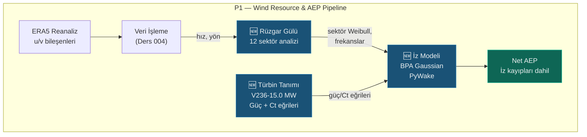

# Lekcja 005 — Analiza łopatek wiatru i modelowanie śladu PyWake

!!! abstract "Nawigacja kursu"
:material-arrow-left: **Poprzednia:** [Lekcja 004 — P1: Baza danych, ERA5 i Weibull](lesson-004.md) | **Następny:** [Lekcja 006 — Optymalizacja układu, blokowanie i kaskada AEP](lesson-006.md) :material-arrow-right:

**Faza:** P1 | **Język:** turecki | **Postęp:** 6 / 6 | [Wszystkie lekcje](index.md) | [Plan nauczania](../../Learning_Roadmap.md)

> **Data:** 24.02.2026
> **Zatwierdzenia:** 1 zatwierdzenie (`c7ab018`)
> **Zakres zatwierdzenia:** `bb84814a0a0bf528dd78c95d42e6341e50b89bb5..c7ab0188b07035ec2875942e5667d67c7cadba67`
> **Faza:** P1 (zasoby wiatru i AEP)
> **Ekrany planu działania:** [Faza 1 — Sekcja 1.1 Ocena zasobów wiatru, Sekcja 1.2 Modelowanie śladu i optymalizacja układu]
> **Język:** turecki
> **Poprzednia lekcja:** Lekcja 004
> **last_commit_hash:** c7ab0188b07035ec2875942e5667d67c7cadba67

---

## Czego się nauczysz

- Podstawy fizyki analizy róży wiatrów: klasyfikacja kierunków, częstotliwości sektorów i róża energii (prawo sześcienne)
- Dlaczego statystyki cykliczne różnią się od tradycyjnej średniej – formuła Mardii
- Fizyka leżąca u podstaw gaussowskiego modelu budzenia Bastankhah-Porté-Agel (BPA).
- Jak definiuje się krzywe mocy i współczynnika ciągu (Ct) Vestas V236-15.0 MW oraz ich ograniczenia fizyczne
- Oblicz AEP brutto/netto, utratę sygnału i współczynnik wydajności, przeprowadzając analizę śledzenia za pomocą biblioteki PyWake.

---

## Część 1: Róża Wiatrów — Klasyfikacja kierunków i częstotliwości sektorów

### Prawdziwy problem życiowy

Pomyśl o latarniku. Zapisuje w swoim pamiętniku, w którą stronę wieje wiatr każdej nocy. Patrząc na te notatki na koniec roku, dochodzi do wniosku, że „wiatr wieje głównie z zachodu, ale jest znacznie trudniej, gdy wieje z południowego wschodu”. Dokładnie to właśnie robi analiza róż wiatrów – ale matematycznie, z tysiącami pomiarów.

Sama „średnia prędkość wiatru” nie wystarczy, aby określić, gdzie umieścić turbiny na farmie wiatrowej. Musisz wiedzieć **z jakiego kierunku, jak często i z jaką prędkością** wieje wiatr. Bez tych informacji pomylisz turbiny i odetną sobie nawzajem wiatr.

### Co mówią standardy

**IEC 61400-12-1** (pomiar wydajności mocy turbin wiatrowych) zaleca, aby analiza róży wiatrów wykorzystywała co najmniej 12 sektorów (po 30° każdy). Standardem branżowym jest 12 sektorów; W niektórych szczegółowych badaniach wykorzystuje się 16 sektorów (22,5°). Granice sektora są wyznaczane poprzez przesunięcie od środka sektora o połowę szerokości sektora — tak, aby północ (0°) pozostawała dokładnie w środku sektora 0.

### Co zbudowaliśmy

**Zmienione pliki:**

- `backend/app/services/p1/wind_analysis.py` — Moduł analizy róży wiatrów: klasyfikacja sektorów, częstotliwość, średnia prędkość, sektor Weibulla, róża energii, odchylenie standardowe kołowe
- `backend/tests/test_wind_analysis.py` — 24 testy jednostkowe: warunki brzegowe i weryfikacja fizyczna dla każdej funkcji

Moduł implementuje następujący potok:

1. **Klasyfikacja kierunku** — przypisz każdy pomiar do jednego z 12 sektorów
2. **Obliczenie częstotliwości** — Stosunek każdego sektora do całkowitego czasu
3. **Średnia prędkość w sektorze** — Oddzielna średnia dla każdego kierunku
4. **Dopasowanie sektora Weibulla** — Oddzielny rozkład Weibulla dla każdego kierunku (ponownie wykorzystuje funkcję `fit_weibull` z lekcji 004)
5. **Wzrost energii** — Udział energii każdego sektora zgodnie z prawem sześciennym
6. **Kołowe odchylenie standardowe** — miara zmienności kierunkowej

### Dlaczego to jest ważne?

> **Dlaczego** dzielimy kierunek wiatru na sektory?
> Ponieważ praca z ciągłym rozkładem kątów jest kosztowna obliczeniowo i niepotrzebna. W normie IEC 61400-12-1 sektory 30° zapewniają wystarczającą rozdzielczość. Cieńsze sektory (22,5°) zmniejszają wiarygodność statystyczną — liczba punktów danych na sektor może być niewystarczająca.

> **Dlaczego** sektor 0 jest ustawiony dokładnie na środku północy?
> Tradycja nawigacyjna i meteorologiczna: 0° = północ. Jeśli nie zostanie zastosowane przesunięcie szerokości połowy sektora, wiatry o nachyleniu od 359° do 1° będą padać na różne sektory – jest to fizycznie bez znaczenia.

### Przegląd kodu

Funkcja sortowania sektorów rozwiązuje problem granicy 0°/360° za pomocą przesunięcia o połowę sektora:

```python
def classify_direction_sector(
  directions_deg: NDArray[np.floating],
  num_sectors: int = 12,
) -> NDArray[np.intp]:
  sector_width_deg = 360.0 / num_sectors    # 12 sektör → 30° genişlik
  # Yarım sektör kaydırması: 0° kuzey, sektör 0'ın merkezinde kalır
  shifted = (directions_deg + sector_width_deg / 2.0) % 360.0
  indices = (shifted / sector_width_deg).astype(np.intp)
  # Kayan nokta kenar durumu: 360° tam sınırda kalırsa clamp
  indices = np.clip(indices, 0, num_sectors - 1)
  return indices
```

Bez przesunięcia sektor 0 obejmuje 0°–30° — zatem wiatr północny o kącie 355° wpada do sektora 11 (330°–360°), a wiatr północny o kącie 5° wpada do sektora 0. Wraz z przesunięciem sektor 0 obejmuje 345°–15°, a „wiatr północny” jest gromadzony w jednym sektorze.

Częstotliwości sektorów są obliczane bardzo wydajnie za pomocą `np.bincount` — liczba pomiarów w każdym sektorze jest dzielona przez całkowitą liczbę pomiarów:

```python
def compute_sector_frequencies(
  sector_indices: NDArray[np.intp],
  num_sectors: int,
) -> NDArray[np.floating]:
  counts = np.bincount(sector_indices, minlength=num_sectors).astype(np.float64)
  total = counts.sum()
  if total == 0:
    return np.zeros(num_sectors, dtype=np.float64)
  return counts / total # Toplamı 1.0'a normalize et
```

Fizyczną koniecznością jest, aby suma częstotliwości wynosiła 1,0 — wiatr musi wiać z jednego kierunku. W zestawie testów to ograniczenie jest weryfikowane za pomocą `pytest.approx(1.0, abs=1e-10)`.

### Podstawowa koncepcja

!!! tip "Podstawowa koncepcja: Róża Wiatrów"
**Proste wyjaśnienie:** Pomyśl o kompasie. Rysujesz wokół niego słupki — długość każdego słupka pokazuje, jak często wiatr wieje z danego kierunku. Długi kij = częsty wiatr. Ten rysunek to wiatrowskaz.

**Podobieństwo:** Pomyśl o tym jak o ruchu ulicznym w mieście. Niektóre drogi (kierunki) są bardziej ruchliwe, inne są puste. Inżynier ruchu wykonuje szerokie skrzyżowania na ruchliwych drogach, a inżynier wiatrowy ustawia turbiny zgodnie z dominującym kierunkiem wiatru.

**W tym projekcie:** Dominujący kierunek wiatru w polskim Bałtyku to okolice WSW (~240°). Powinniśmy zminimalizować straty w śladzie, umieszczając nasze 34 turbiny prostopadle do tego kierunku.

---

## Rozdział 2: Róża energetyczna — prawo sześcienne i prawdziwa siła wiatru

### Prawdziwy problem życiowy

Rozważmy dwa miasta: w jednym wiatr wieje codziennie delikatnie (5 m/s), w drugim raz w tygodniu panuje burza (20 m/s), w pozostałe dni jest spokojnie. W którym z nich zbudowalibyście farmę wiatrową? Nawet jeśli średnia prędkość jest podobna, wiatr w burzliwym mieście niesie **8 razy** więcej energii — ponieważ energia wiatru jest proporcjonalna do **sześcianu** prędkości.

### Co mówią standardy

Równanie sześcienne energii wiatru pochodzi z podstawowej fizyki aerodynamicznej. Równanie siły wiatru: P = ½ρAv3 (gdzie ρ to gęstość powietrza, A to powierzchnia omiatana, v to prędkość wiatru). Zależność ta stanowi podstawę do obliczenia róży energii w metodologii **Europejskiego Atlasu Wiatru** (Risø, 1989).

### Co zbudowaliśmy

Funkcja róży energii oblicza **udział każdego sektora w całkowitej energii**:

```python
def compute_energy_rose(
  frequencies: NDArray[np.floating],
  mean_speeds_ms: NDArray[np.floating],
) -> NDArray[np.floating]:
  # NaN hızları sıfıra çevir (boş sektörler)
  speeds_clean = np.where(np.isnan(mean_speeds_ms), 0.0, mean_speeds_ms)
  # Kübik yasa: E_i ∝ f_i × v̄_i³
  energy_raw = frequencies * speeds_clean**3
  total_energy = energy_raw.sum()
  if total_energy == 0:
    return np.zeros_like(frequencies)
  return energy_raw / total_energy # Toplam = 1.0
```

Matematyka wzoru jest prosta, ale wyniki są uderzające. Weryfikujemy ten efekt sześcienny w kodzie testowym:

```python
def test_high_speed_sector_dominates(self):
  """Yüksek hızlı sektör enerjiyi domine etmeli (kübik yasa)."""
  freqs = np.array([0.5, 0.5])    # Eşit frekans
  speeds = np.array([5.0, 10.0])   # 10 m/s → 5 m/s'nin 8 katı enerji
  energy = compute_energy_rose(freqs, speeds)
  # Enerji oranı: 10³/5³ = 8, sektör 1 → 8/(1+8) ≈ 0.889
  assert energy[1] == pytest.approx(8.0 / 9.0, abs=0.001)
```

Obydwa sektory odbierają wiatr z jednakową częstotliwością, ale z prędkością 5 i 10 m/s. Dystrybucja energii nie jest 50/50 — **11/89**. Sektor 10 m/s przenosi 89% całkowitej energii. To pokazuje, że „prędkość” jest równie krytyczna jak „częstotliwość” przy rozmieszczaniu turbin.

### Dlaczego to jest ważne?

> **Dlaczego** wzrost częstotliwości nie wystarczy, potrzebny jest wzrost energii?
> Ponieważ turbina generuje dochód, nie wytwarza częstotliwości. W sektorze może występować wiatr przez 40% czasu, ale z małą prędkością. Inny sektor jest zasilany przez wiatr w 10% przypadków, ale z dużą prędkością – i wytwarza znacznie więcej energii ze względu na prawo sześcienne. Optymalizacja turbin pod kątem efektywności energetycznej maksymalizuje roczną produkcję energii (AEP).

> **Dlaczego** zastąpiliśmy prędkość NaN zerem?
> Puste sektory (kierunki niedane) oznaczają, że fizycznie „nie wytwarzają energii”. Mnożenie przez NaN daje NaN i zniekształca sumę. Ustawienie go na zero prawidłowo resetuje udział energii tych sektorów.

### Podstawowa koncepcja

!!! tip "Podstawowa koncepcja: prawo sześcienne"
**Proste wyjaśnienie:** Jeśli prędkość wiatru podwoi się, energia, którą niesie, wzrośnie 8 razy (2³ = 8). Zatem przejście od delikatnej bryzy do burzy to ogromny skok energii.

**Podobieństwo:** Pomyśl o kranie. Jeśli puścisz wodę dwa razy szybciej, ciśnienie zwiększysz 8 razy – poczujesz to, gdy włożysz rękę pod kran. Wiatr działa w ten sam sposób.

**W tym projekcie:** Średni parametr Weibulla A wynoszący 10,5 m/s w Morzu Bałtyckim oznacza wysoki potencjał energetyczny wynikający z prawa sześciennego. Fakt, że V236-15.0 MW osiąga moc nominalną przy prędkości 12,5 m/s pokazuje, jak bardzo reżim wiatrowy w tym regionie jest kompatybilny z turbiną.

---

## Rozdział 3: Statystyka kołowa — problem graniczny 0°/360°

### Prawdziwy problem życiowy

Pomyśl o tym przez godzinę. Pomiędzy 23:50 a 00:10 jest tylko 20 minut. Ale jeśli spojrzeć „liczbowo”, różnica między 23:50 a 0:10 wynosi 23 godziny i 40 minut. Ten sam problem występuje w przypadku kierunków wiatru: czy różnica między 355° a 5° wynosi 10° czy 350°?

W tym przypadku tradycyjna średnia arytmetyczna załamuje się. Średnia 355° i 5° daje (355+5)/2 = 180° — dokładnie na południe! Jednakże prawidłowa odpowiedź powinna wynosić 0° (północ). Statystyka kołowa rozwiązuje ten problem.

### Co mówią standardy

**Mardia, K.V. (1972)** — Książka *Statystyka danych kierunkowych* jest podstawowym źródłem statystyk kołowych. Wzór na odchylenie standardowe kołowe Mardii służy do pomiaru zmienności kierunkowej w inżynierii wiatrowej. Wzór ten definiuje się w kategoriach średniej długości wektora wynikowego (R̄).

### Co zbudowaliśmy

```python
def compute_circular_std_deg(
  directions_deg: NDArray[np.floating],
) -> float:
  if len(directions_deg) == 0:
    return 0.0

  # Açıları birim çembere yansıt
  theta_rad = np.deg2rad(directions_deg)
  mean_cos = float(np.mean(np.cos(theta_rad)))
  mean_sin = float(np.mean(np.sin(theta_rad)))

  # Ortalama sonuç vektörü uzunluğu
  r_bar = np.sqrt(mean_cos**2 + mean_sin**2)

  # R̄ = 0 → tam düzgün dağılım, log(0) hatası → clamp
  r_bar = max(r_bar, 1e-10)

  # Mardia formülü: σ_c = √(-2 × ln(R̄))
  circular_std_rad = np.sqrt(-2.0 * np.log(r_bar))
  return float(np.degrees(circular_std_rad))
```

Matematyka wzoru opiera się na okręgu jednostkowym. Każdy kąt (θ) jest reprezentowany jako punkt na okręgu: (cos θ, sin θ). Jeśli wszystkie punkty zostaną uśrednione, uzyskana **długość wynikowego wektora** (R̄) pokazuje, jak „zebrane” są kierunki:

- **R̄ ≈ 1** → Wszystkie kierunki takie same → σ_c ≈ 0° (bardzo niska dyspersja)
- **R̄ ≈ 0** → Kierunki są całkowicie równomiernie rozłożone → σ_c jest duże (~81°)

Wartość tę sprawdza się w zestawie testowym: kierunek stały → σ_c ≈ 0°, rozkład równomierny → σ_c > 70°.

### Dlaczego to jest ważne?

> **Dlaczego** używamy statystyk kołowych zamiast średniej arytmetycznej?
> Kąty podlegają arytmetyce mod 360. Prawidłowa odległość między 355° a 5° wynosi 10°, ale różnica arytmetyczna daje 350°. Transformacje `np.cos` i `np.sin` eliminują ten problem zawijania, rzutując kąty na przestrzeń euklidesową.

> **Dlaczego** ograniczamy R̄ do 1e-10 (zaciskanie)?
> W idealnie równomiernym rozkładzie R̄ = 0 i `log(0)` jest nieokreślone (−∞). W obliczeniach numerycznych daje to `NaN` lub `inf`. Zacisk 1e-10 zapewnia fizycznie znaczącą górną granicę (≈ 86°) i zapobiega awarii programu.

### Podstawowa koncepcja

!!! tip "Podstawowa koncepcja: statystyki kołowe"
**Proste wyjaśnienie:** Uśrednianie normalnych liczb działa liniowo. Ale wskazówki kompasu są na okręgu — po 360° wracasz do 0°. Statystyka kołowa wykorzystuje specjalną matematykę dla tych „liczb na okręgu”.

**Podobieństwo:** Pomyśl o diabelskim młynie. Obliczając odległość pomiędzy kabiną „nr 3” a „nr 11” można przejść przez kabinę nr 12 i skorzystać ze skrótu. Statystyka cykliczna automatycznie znajduje ten „skrót”.

**W tym projekcie:** Oczekujemy kołowego odchylenia standardowego ~60-80° na polskim Bałtyku (umiarkowany rozrzut kierunkowy). Wartość ta określa, czy turbiny zostaną zoptymalizowane dla jednego kierunku (niskie σ_c), czy dla wielu kierunków (wysokie σ_c).

---

## Część 4: Krzywe mocy i współczynnika ciągu V236-15,0 MW

### Prawdziwy problem życiowy

Pomyśl o mapie silnika (mapie momentu obrotowego) samochodu. Im mocniej naciśniesz pedał gazu, silnik wytwarza moc w określonym zakresie obrotów. Istnieje jednak dolna granica (poniżej biegu jałowego silnik zatrzymuje się) i górna granica (w czerwonej strefie interweniuje system bezpieczeństwa). Turbina wiatrowa jest taka sama: wytwarza energię elektryczną w określonym zakresie prędkości, a tę zależność prędkości od mocy definiuje **krzywa mocy**.

### Co mówią standardy

**IEC 61400-12-1:2017** określa metodologię pomiaru krzywej mocy. Każdy producent turbin podaje swoją certyfikowaną krzywą mocy zgodną z tą normą. Na krzywej mocy występują trzy prędkości krytyczne:

- **Załączenie:** 3 m/s – poniżej którego turbina nie obraca się
- **Nominalna (nominalna):** 12,5 m/s — osiągnięta została moc znamionowa (15 MW)
- **Wyłączenie (wyłączone):** 31 m/s – turbina zatrzymuje się ze względów bezpieczeństwa

### Co zbudowaliśmy

**Zmienione pliki:**

- `backend/app/services/p1/wake_model.py` — Krzywe mocy/Ct V236-15,0 MW + integracja z PyWake

Krzywą mocy oblicza się z tabeli metodą interpolacji liniowej i obowiązują ograniczenia fizyczne:

```python
def get_v236_power_curve_kw(
  wind_speeds_ms: NDArray[np.floating],
) -> NDArray[np.floating]:
  # Tablo verilerinden doğrusal interpolasyon
  power_kw = np.interp(wind_speeds_ms, _POWER_CURVE_SPEEDS_MS, _POWER_CURVE_KW)

  # Fizik kırpma (Rule 1: fiziksel kısıtlamalar tartışılmaz)
  power_kw = np.clip(power_kw, 0.0, RATED_POWER_KW)     # 0 ≤ P ≤ 15,000 kW
  power_kw = np.where(wind_speeds_ms < CUT_IN_SPEED_MS, 0.0, power_kw)  # < 3 m/s → 0
  power_kw = np.where(wind_speeds_ms > CUT_OUT_SPEED_MS, 0.0, power_kw) # > 31 m/s → 0

  return power_kw.astype(np.float64)
```

Zastosowano trójwarstwowy schemat bezpieczeństwa: po pierwsze, w przypadku `np.clip` moc nigdy nie może spaść poniżej 0 lub powyżej 15 000 kW. Następnie prędkości poniżej wartości załączenia są resetowane. Na koniec prędkości powyżej wyłączenia są resetowane. To podejście „pasa i szelek” jest zgodne z **Zasadą 1** – ograniczenia fizyczne nie podlegają negocjacjom.

Krzywa współczynnika ciągu (Ct) ma podobną strukturę, ale ma inne znaczenie fizyczne:

```python
def get_v236_ct_curve(
  wind_speeds_ms: NDArray[np.floating],
) -> NDArray[np.floating]:
  ct = np.interp(wind_speeds_ms, _CT_CURVE_SPEEDS_MS, _CT_CURVE_VALUES)
  ct = np.clip(ct, 0.0, 1.0)      # 0 ≤ Ct ≤ 1 (fiziksel sınır)
  ct = np.where(wind_speeds_ms < CUT_IN_SPEED_MS, 0.0, ct)
  ct = np.where(wind_speeds_ms > CUT_OUT_SPEED_MS, 0.0, ct)
  return ct.astype(np.float64)
```

Ważna cecha krzywej Ct: w pobliżu momentu załączenia Ct jest bardzo wysoki (~0,90), natomiast przy prędkości znamionowej jest niski (~0,28). Oznacza to, że przy małych prędkościach turbina czerpie zbyt dużo pędu z wiatru, natomiast przy większych prędkościach staje się bardziej „przejrzysta”.

### Dlaczego to jest ważne?

> **Dlaczego** definiujemy krzywą mocy jako tabelę + interpolację, a nie jako funkcję analityczną?
> Rzeczywistych krzywych mocy turbin nie można wyrazić za pomocą gładkiej funkcji analitycznej ze względu na złożone efekty aerodynamiczne. Dane producenta są podawane w formie tabelarycznej. Interpolacja liniowa za pomocą `np.interp` jest podejściem będącym standardem branżowym i pozwala uniknąć błędów pochodnych.

> **Dlaczego** krzywa Ct ma kluczowe znaczenie w modelowaniu kilwateru?
> Modele śledzenia wykorzystują wartość Ct do obliczenia deficytu prędkości za silnikiem. We wzorze BPA: ΔU/U₀ ∝ √(Ct). Zła krzywa Ct → zła szerokość toru → błędne obliczenie AEP → zła decyzja inwestycyjna.

### Podstawowa koncepcja

!!! tip "Podstawowa koncepcja: współczynnik ciągu (Ct)"
**Proste wyjaśnienie:** Ct to liczba wskazująca, jak dobrze turbina „przeciwstawia się” wiatrowi. Jeżeli Ct = 1, turbina zatrzymałaby wiatr całkowicie (fizycznie niemożliwe). Jeśli Ct = 0, turbina nie jest widoczna – wiatr w ogóle nie zwalnia.

**Podobieństwo:** Wyciągnij rękę przez okno samochodu. Kiedy zwracasz dłoń pod wiatr (wysoki Ct), czujesz duży opór. Kiedy obracasz rękę w bok (niskie Ct) opór maleje.

**W tym projekcie:** Wartość Ct V236-15,0 MW wynosi ~0,90 przy załączeniu, ~0,28 przy wartości znamionowej. Oznacza to, że przy niskich prędkościach za turbiną pojawia się poważny ślad, a przy dużych prędkościach efekt budzenia maleje. Ta zależność od prędkości ma kluczowe znaczenie przy obliczaniu strat śladowych.

---

## Część 5: Model śledzenia Gaussa BPA z użyciem PyWake

### Prawdziwy problem życiowy

Weźmy pod uwagę wodę na szlaku za statkiem wycieczkowym. Po przejściu statku na powierzchni wody pozostaje długi kilwater turbulencyjny. Znak ten wstrząsa łodzią z tyłu i utrudnia poruszanie się do przodu. Turbiny wiatrowe dają ten sam efekt: pobierając energię z wiatru, pozostawiają za sobą strefę wolniejszego, bardziej turbulentnego wiatru. Ten efekt wzbudzenia powoduje, że znajdujące się poniżej turbiny wytwarzają mniej energii.

### Co mówią standardy

**Bastankhah i Porté-Agel (2014)** — Artykuł *Journal of Fluid Mechanics*, 781, 706-730 jest pracą referencyjną na temat modelu czuwania Gaussa. Model opiera się na trzech podstawowych równaniach:

1. **İz açıgı (deficyt pobudzenia):** ΔU/U₀ = (1 - √(1 - Ct/(8(σ/D)²)))
2. **Rozszerzenie śladu:** σ(x) = k*x + D/√8, gdzie k* = 0,3837·TI + 0,003678
3. **Superpozycja liniowa:** Deficyt całkowity = Σ deficytów indywidualnych

To podejście zostało zaimplementowane jako `BastankhahGaussianDeficit` w bibliotece **PyWake** opracowanej przez DTU Wind Energy.

### Co zbudowaliśmy

Integracja z PyWake wykorzystuje architekturę trójwarstwową: **Site** (źródło wiatru) → **Turbina** (definicja maszyny) → **Model budzenia** (symulacja budzenia).

```python
def configure_wake_model(site: Any, turbine: Any) -> Any:
  from py_wake.deficit_models.gaussian import BastankhahGaussianDeficit
  from py_wake.superposition_models import LinearSum
  from py_wake.turbulence_models import STF2017TurbulenceModel
  from py_wake.wind_farm_models import All2AllIterative

  return All2AllIterative(
    site=site,
    windTurbines=turbine,
    wake_deficitModel=BastankhahGaussianDeficit(), # BPA Gaussian deficit
    superpositionModel=LinearSum(),         # Doğrusal toplam
    turbulenceModel=STF2017TurbulenceModel(),    # Frandsen türbülans
  )
```

Każdy element modelu ma uzasadnienie fizyczne:

- **All2AllIterative** — Oblicza efekt kilwateru pomiędzy każdą parą turbin (iteracyjnie aż do zbieżności)
- **BastankhahGaussianDeficit** — model deficytu modelujący profil śledzenia w postaci krzywej Gaussa (krzywa dzwonowa)
- **LinearSum** — Oblicza całkowity efekt wielu śladów, gdy się nakładają
- **STF2017TurbulenceModel** — model turbulencji oparty na technologii Frandsena; Oblicza zwiększone turbulencje na torach

Wyniki symulacji gromadzone są w ustrukturyzowanej klasie danych:

```python
def run_wake_analysis(x_positions_m, y_positions_m, site, turbine=None):
  # ... simülasyonu çalıştır ...

  # Kapasite faktörü: CF = net_AEP / (P_rated × 8760h × n_turbines)
  n_turbines = len(x_positions_m)
  theoretical_gwh = RATED_POWER_KW * 1e-6 * 8760.0 * n_turbines # GWh
  capacity_factor = total_net_gwh / theoretical_gwh

  return WakeAnalysisResult(
    gross_aep_gwh=total_gross_gwh,   # İzsiz brüt enerji
    net_aep_gwh=total_net_gwh,     # İz kayıpları sonrası net enerji
    wake_loss_percent=wake_loss_pct,   # İz kaybı yüzdesi
    per_turbine_aep_gwh=...,      # Türbin başına net AEP
    per_turbine_wake_loss_percent=..., # Türbin başına iz kaybı
    capacity_factor=capacity_factor,   # Net kapasite faktörü
  )
```

Wzór na współczynnik wydajności: CF = AEP_net / (P_rated × 8760 × n). Pokazuje to, jak wydajnie działają turbiny w porównaniu z teoretyczną pełną wydajnością. Oczekujemy CF ≈ 0,45–0,50 dla pojedynczej turbiny w warunkach bałtyckich (Weibull A=10,5, k=2,2).

### Dlaczego to jest ważne?

> **Dlaczego** wybraliśmy model BPA Gaussa zamiast modelu Jensena/Parka?
> Model Jensena (1983) zakłada, że ​​profil blizny jest „górną linią” – całkowicie otwarta wewnątrz toru, zero na zewnątrz. W rzeczywistości profil śledzenia jest gaussowski (gęsty w środku, zmniejszający się w kierunku krawędzi). Model BPA został zweryfikowany w eksperymentach w tunelu aerodynamicznym i jest dokładniejszy, szczególnie w przypadku dużych, nowoczesnych turbin.

> **Dlaczego** używamy `All2AllIterative`?
> Ponieważ turbiny wpływają na siebie nawzajem (efekty wtórne). Modele jednoprzebiegowe (nie iteracyjne) nie są w stanie uchwycić tej interakcji. Podejście iteracyjne prowadzi do fizycznie spójnego stanu równowagi poprzez aktualizację pól śladowych.

### Podstawowa koncepcja

!!! tip "Podstawowa koncepcja: utrata przebudzenia"
**Proste wyjaśnienie:** Tylna turbina wykorzystuje „wiatr resztkowy” z przedniej turbiny. Ponieważ ten wiatr resztkowy jest wolniejszy, turbina wleczona wytwarza mniej energii elektrycznej. Ta różnica to „utrata śladu”.

**Analogia:** Rowerzysta, który „draftuje” (slipstreaming) podczas wyścigu rowerowego, odczuwa mniejszy opór wiatru — ale w tym przypadku to dobrze. W turbinach jest odwrotnie: tylna turbina otrzymuje MNIEJ energii, ponieważ przednia turbina pochłonęła energię wiatru.

**W tym projekcie:** Oczekuje się, że w naszej farmie składającej się z 34 turbin typowa utrata sygnału będzie wynosić 5–10%. 510 MW × 8760 godzin × CF 0,45 ≈ 2009 GWh brutto. 8% straty śladowej → ~161 GWh straty → około 12 mln euro utraty przychodów rocznie (przy 75 euro/MWh). Dlatego optymalizacja układu turbiny ma kluczowe znaczenie.

---

## Rozdział 6: Od wiatrowskazu do analizy śladowej – Integracja rurociągu

### Prawdziwy problem życiowy

Pomyśl o kuchni w restauracji. Istnieje łańcuch dostawców składników (dane ERA5) → szef kuchni (przetwarzanie danych) → przepis (modele fizyczne) → prezentacja na talerzu (wynik). Każdy pierścień zależy od poprzedniego. Połączenie pomiędzy analizą róży wiatrów a modelowaniem śladu wiatrowego działa w ten sam sposób: wyniki róży wiatrów są konwertowane na obiekt witryny PyWake i wprowadzane do symulacji kilwateru.

### Co zbudowaliśmy

Funkcja `create_site_from_wind_rose` konwertuje dane wyjściowe analizy róży wiatrów do formatu zrozumiałego dla PyWake:

```python
def create_site_from_wind_rose(
  wind_rose_result: object,
  turbulence_intensity: float = 0.06,
) -> Any:
  wr = wind_rose_result
  num_sectors = wr.num_sectors

  sector_a = np.zeros(num_sectors, dtype=np.float64)
  sector_k = np.zeros(num_sectors, dtype=np.float64)
  for i in range(num_sectors):
    weibull_i = wr.sector_weibull[i]
    if weibull_i is not None:
      sector_a[i] = weibull_i.scale_a_ms
      sector_k[i] = weibull_i.shape_k
    else:
      # Fallback: genel ortalama hız ve k=2.0
      sector_a[i] = float(np.nanmean(wr.mean_speeds_ms))
      sector_k[i] = 2.0

  return UniformWeibullSite(
    p_wd=wr.frequencies, # Sektör frekansları → yön ağırlıkları
    a=sector_a,      # Sektör Weibull A → hız dağılımı
    k=sector_k,      # Sektör Weibull k → şekil parametresi
    ti=turbulence_intensity,
  )
```

Ta funkcja bezpośrednio wykorzystuje parametry Weibulla, które stworzyliśmy w Lekcji 004 — tutaj wkracza w grę siła konstrukcji modułowej. `fit_weibull` (Lekcja 004) → `WindRoseResult.sector_weibull` (Ta lekcja, Część 1) → `create_site_from_wind_rose` (Ten rozdział) → Symulacja PyWake (Część 5).

W przypadku sektorów, które nie spełniają dopasowania Weibulla (niewystarczające dane), stosowana jest sprytna strategia awaryjna: ogólna średnia prędkość i domyślna wartość k=2,0 (rozkład Rayleigha — najczęstszy domyślny parametr kształtu w inżynierii wiatrowej).

### Dlaczego to jest ważne?

> **Dlaczego** powinniśmy używać witryny opartej na różach wiatrów zamiast jednolitej witryny?
> W przypadku jednolitego miejsca zakłada się, że wiatr wieje jednakowo ze wszystkich kierunków – w prawdziwym świecie prawie nigdy nie jest to prawdą. Dominujący wiatr WSW na Bałtyku dramatycznie wpływa na straty kierunkowe kilwateru. Witryna oparta na róży wiatrów zapewnia o 2–5% dokładniejsze szacunki AEP przy użyciu prawdziwego rozkładu kierunkowego.

> **Dlaczego** używamy k=2,0 w ​​przypadku nieudanych dopasowań?
> k=2,0 to wartość specjalna: przy tej wartości rozkład Weibulla zmienia się w rozkład Rayleigha. Rayleigh jest uważany za „najlepszego przypuszczenia, jeśli nie ma wcześniejszej wiedzy” w inżynierii wiatrowej. Jest to rozsądny wybór awaryjny – ani nadmiernie optymistyczny, ani pesymistyczny.

### Podstawowa koncepcja

!!! tip "Koncepcja podstawowa: Integracja rurociągu"
**Proste wyjaśnienie:** Każdy moduł (ERA5 → Weibull → róża wiatrów → przebudzenie) działa jak rurociąg. Wyjście jednego modułu jest wejściem innego. Jeśli utrzymasz czystość i standaryzację każdego portu w rurociągu, możesz łatwo rozbudować system.

**Analogia:** Pomyśl o tym jak o klockach LEGO. Każdy element jest zgodny z określonym standardem rozmiaru. Części z różnych zestawów można łączyć ze sobą, ponieważ ich punkty łączenia są takie same.

**W tym projekcie:** Klasa danych `WindRoseResult` to „port LEGO” w przygotowaniu. Moduł analizy wiatru generuje w tym formacie, moduł modelu budzenia odczytuje z tego formatu. Będziemy używać tego samego łącza, gdy w przyszłości zostanie dodana optymalizacja układu.

---

## Spinki do mankietów

**Gdzie te koncepcje będą kontynuowane:**

- **Róża energii** (Część 2) → Przy optymalizacji układu P1 turbiny zostaną umieszczone prostopadle do dominującego kierunku róży energii
- **Straty śladowe** (Część 5) → P1 będzie głównym składnikiem kaskady energii brutto-netto w obliczeniach AEP (obliczenia P50/P75/P90)
- **Współczynnik wydajności** (Rozdział 5) → Obliczenia CF w P1 LCOE zostaną bezpośrednio uwzględnione w prognozie przychodów
- **Architektura rurociągu** (Część 6) → Rurociąg przepływu obciążenia Pandapower zostanie utworzony w P2 według tego samego schematu

**Link do lekcji 004:** W tej lekcji ponownie wykorzystaliśmy funkcję `fit_weibull` w poszczególnych sektorach — moduł fizyki, który utworzyliśmy w lekcji 004, stał się częścią projektu.

---

## Wielki Obraz

*Cel kursu: **Kierunkowa analiza danych dotyczących zasobów wiatru i przekształcanie ich w produkcję energii netto za pomocą modelu śladu.***



*Pełna architektura systemu znajduje się w [Przegląd lekcji](index.md#system-architecture).*

---

## Kluczowe dania na wynos

1. Róża wiatrów to kluczowy element projektu farmy wiatrowej — róża częstotliwości + róża energii razem określają układ turbiny.
2. Zgodnie z prawem sześciennym (P ∝ v³) różnice prędkości odzwierciedlają się wykładniczo w różnicy energii — 2 razy prędkość = 8 razy energia.
3. Statystyka kołowa rozwiązuje problem spirali 0°/360° za pomocą transformacji okręgu jednostkowego — nie można jej używać w przypadku tradycyjnych danych o średnim kierunku.
4. Krzywa Ct jest najważniejszym sygnałem wejściowym do modelowania wzbudzenia – wysoki Ct (silny ślad) przy niskich prędkościach, niski Ct (słaby ślad) przy dużych prędkościach.
5. Model wzorca Gaussa BPA zastępuje założenie Jensena dotyczące „najwyższej linii” realistycznym profilem Gaussa, zapewniając przewagę w zakresie dokładności w przypadku dużych, nowoczesnych turbin.
6. Architektura rurociągu (róża wiatrów → miejsce → model budzenia → AEP) wymusza konstrukcję modułową — dane wejściowe i wyjściowe każdego modułu muszą być jasno określone.
7. Ograniczenia fizyczne (P ≥ 0, P ≤ znamionowe, Ct ∈ [0,1]) muszą zostać zaimplementowane w kodzie z wieloma warstwami zabezpieczeń (clip + Where) — Zasada 1 nie podlega negocjacjom.

---

## Zalecana lektura

*[Plan nauczania](../../Learning_Roadmap.md) — Faza 1: Podstawy energetyki wiatrowej*

| Źródło | Typ | Dlaczego czytać |
| -------- | ----- | ---------------- |
| Batankhah i Porté-Agel (2014), *J. Mech. Płynów*, 781 | artykuł akademicki | Oryginalny artykuł na temat modelu śledzenia Gaussa BPA, którego używamy w tej lekcji |
| Manwell, McGowan, Rogers — *Wyjaśnienie energii wiatrowej* (3. baskı) | Podręcznik | Część 2-3: Metodologia źródeł wiatru i wiatraków |
| Dokumentacja PyWake (DTU Wind Energy) | Dokumentacja oprogramowania | py-wake.readthedocs.io — konfiguracja modelu wybudzenia i przykładowe notatniki |
| Energia wiatrowa DTU — *Modelowanie i symulacja budzenia* | Lekcje wideo | Bezpłatnie w YouTube — wizualne wyjaśnienie fizyki toru |
| Burtona i in. — *Podręcznik dotyczący energii wiatrowej* (wydanie 3, 2021 r.) | książka referencyjna | Część 1-4: Ocena zasobów wiatru i podstawy modelowania śladu aerodynamicznego |

---

## Quiz — sprawdź swoje zrozumienie

### Przypomnij sobie pytania

**P1:** Zgodnie z normą IEC 61400-12-1, ile sektorów zaleca się stosować do analizy róży wiatrów i ile stopni kąta obejmuje każdy sektor?

<szczegóły>
<summary>Odpowiedź</summary>

Zalecanych jest 12 sektorów, każdy obejmujący 30° (360° / 12 = 30°). W niektórych szczegółowych badaniach wykorzystuje się 16 sektorów (22,5°), ale 12 sektorów to standard branżowy, ponieważ zapewnia optymalną równowagę pomiędzy niezawodnością statystyczną a rozdzielczością kierunkową.

</details>

**Q2:** Jakie są prędkości załączenia, znamionowe i wyłączenia turbiny V236-15.0 MW i jaki jest przybliżony współczynnik ciągu (Ct) przy prędkości znamionowej?

<szczegóły>
<summary>Odpowiedź</summary>

Załączenie: 3 m/s, znamionowe: 12,5 m/s, wyłączenie: 31 m/s. C przy prędkości znamionowej wynosi około 0,28. Fakt, że Ct jest bardzo wysoki przy niskich prędkościach (~0,90) i niski przy dużych prędkościach, wskazuje, że turbina czerpie większy pęd z wiatru przy niskich prędkościach.

</details>

**P3:** Co to jest R̄ w funkcji `compute_circular_std_deg` i co to oznacza, gdy jest równe zero?

<szczegóły>
<summary>Odpowiedź</summary>

R̄ (średnia długość wektora wynikowego) to wielkość średniego wektora wszystkich pomiarów kierunku na okręgu jednostkowym. R̄ = 0 oznacza, że ​​kierunki są całkowicie równomierne – czyli wiatr wieje jednakowo ze wszystkich kierunków. W tym przypadku odchylenie standardowe kołowe osiąga swoją wartość maksymalną (~81°).

</details>

### Pytania dotyczące zrozumienia

**Pyt.4:** Jeśli prędkość wiatru wynosi 6 m/s i 12 m/s w dwóch sektorach o tej samej częstotliwości, jaki jest udział energii tych dwóch sektorów we wzroście energii? Pokaż kroki obliczeniowe.

<szczegóły>
<summary>Odpowiedź</summary>

Prawo sześcienne: E_i ∝ f_i × v̄_i³. Ponieważ częstotliwość obu sektorów jest równa (f₁ = f₂ = 0,5), stosunek energii zależy tylko od sześcianu prędkości. E₁ ∝ 0,5 × 6³ = 0,5 × 216 = 108. E₂ ∝ 0,5 × 12³ = 0,5 × 1728 = 864. Razem = 972. Udział sektora 1: 108/972 = 11,1%. Udział sektora 2: 864/972 = 88,9%. Chociaż prędkość jest podwojona, wkład energii jest 8 razy większy – jest to bezpośredni wynik prawa sześciennego.

</details>

**Pyt.5:** Dlaczego preferowano model BPA Gaussa zamiast modelu Jensena/Parka? Jaka jest główna różnica fizyczna między tymi dwoma modelami?

<szczegóły>
<summary>Odpowiedź</summary>

Model Jensena (1983) zakłada, że ​​profil kilwateru jest „cylindrem” (prostokątnym) – stały deficyt prędkości wewnątrz toru, zero na zewnątrz. W rzeczywistości eksperymenty w tunelu aerodynamicznym wykazały, że profil kilwateru ma kształt gaussowski (krzywa dzwonowa), gęsty w środku i malejący w kierunku krawędzi. Uchwycając ten realistyczny profil, model BPA zapewnia dokładniejsze obliczenia szerokości śladu i prześwitu, szczególnie w przypadku nowoczesnych turbin o dużych średnicach wirnika (takich jak V236, D = 236 m). W rezultacie oszacowanie AEP staje się o 1-3% dokładniejsze.

</details>

**P6:** Dlaczego w funkcji `create_site_from_wind_rose` dla sektorów z błędem dopasowania Weibulla używana jest wartość domyślna k=2,0? Jaka jest istotność statystyczna k=2,0?

<szczegóły>
<summary>Odpowiedź</summary>

k=2,0 jest wartością specjalną: przy tej wartości rozkład Weibulla zmienia się w rozkład Rayleigha. Rozkład Rayleigha to rozkład standardowy w inżynierii wiatrowej (używany jako odniesienie w normie IEC 61400-1), uważany za „najlepsze założenie w przypadku braku wcześniejszych informacji”. Zakłada rozkład prędkości, który nie jest ani zbyt wąski (wysokie k), ani zbyt szeroki (niskie k). Jest to rozsądny wybór awaryjny w przypadku niewystarczających danych – pozwala na kontynuację analizy bez paraliżowania projektu.

</details>

### Pytanie stanowiące wyzwanie

**P7:** Jakich różnic w szacunkach AEP składających się z 34 turbin można się spodziewać pomiędzy miejscem jednolitym a miejscem opartym na róży wiatrów, biorąc pod uwagę dominujący kierunek wiatru WSW (~240°)? Na które turbiny ta różnica wpływa najbardziej i dlaczego?

<szczegóły>
<summary>Odpowiedź</summary>

Jednolite miejsce zakłada, że ​​wiatr wieje jednakowo ze wszystkich kierunków i skupia straty w śladzie kierunkowym. Miejsce oparte na róży wiatrów symuluje głównie dominujący kierunek WSW. W tym przypadku rzędy turbin ustawione w kierunku WSW doświadczają znacznie większego efektu kilwateru – ponieważ wiatr wieje z tego kierunku przez zdecydowaną większość czasu.

Efekt praktyczny: (1) AEP turbin tylnego rzędu na kierunku dominującym spada o 8-15% (w modelu jednolitym jest to zaniżone o 3-5%). (2) Turbiny ustawione prostopadle do dominującego kierunku nie powodują prawie żadnego efektu kilwateru. (3) Całkowita wartość AEP w gospodarstwie jest zazwyczaj o 2–5% niższa w modelu róży wiatrów, ponieważ rejestrowane jest prawdziwe kierunkowe układanie śladu.

Różnica ta szczególnie wpływa na modelowanie finansowe: różnica w AEP wynosząca 3% odpowiada różnicy w przychodach wynoszącej ~60 GWh ≈ 4,5 mln euro rocznie w farmie o mocy 510 MW. Dlatego banki żądają analiz opartych na róży wiatrów – jednolity model jest niewystarczający.

</details>

---

## Kącik wywiadów

### Proste wyjaśnienie
* „Jak wyjaśniłbyś analizę róży wiatrów i modelowanie budzenia osobie niebędącej inżynierem?”*

Załóżmy, że masz pole i chcesz zainstalować wiatraki. Twoje pierwsze pytanie brzmi: „Skąd zwykle wieje wiatr?” To się stanie. Aby się tego dowiedzieć, należy zainstalować wiatromierz na rok i co godzinę rejestrować kierunek i prędkość wiatru. Pod koniec roku wykreślasz te dane na kompasie – to jest „róża wiatrów”. Długie ramiona róży wskazują kierunki, w których wieje najczęściej wiatr.

Ale jest jeszcze jeden problem: jeśli umieścisz młyny zbyt blisko, przedni młyn „ukradnie” wiatr tylnemu. Tak jak nie czujesz wiatru jadąc za ciężarówką. Nazywa się to „efektem śladu”. Nasz model komputerowy oblicza straty wiatru za każdym młynem i mówi nam, jak daleko od siebie powinniśmy umieścić młyny. Dzięki temu możemy oszacować, ile energii elektrycznej wyprodukuje farma rocznie, co skłania inwestorów do zadania sobie pytania: „Czy ten projekt będzie zarabiał?” daje odpowiedź na pytanie.

### Opis techniczny
* „Jak wyjaśniłbyś analizę róży wiatrów i modelowanie budzenia podczas rozmowy kwalifikacyjnej?”*

Analiza róży wiatrów przekształca szeregi czasowe wysokości piasty w charakterystykę źródła kierunkowego. Wykonujemy analizę 12-sektorową zgodnie z normą IEC 61400-12-1 i stosujemy dopasowanie Weibulla w oparciu o częstotliwości sektorów, średnie prędkości i sektory. Róża energetyczna określa ilościowo udział energii każdego sektora za pomocą prawa sześciennego (P ∝ v3). Rozproszenie kierunkowe mierzymy za pomocą wzoru Mardii dla statystyki kołowej (σ_c = √(-2ln R̄)) — jest to krytyczny parametr określający czułość kierunkową w optymalizacji układu.

Po stronie modelowania śladu aerodynamicznego stosujemy superpozycję liniową z jawnym modelem Gaussa Bastankhah-Porté-Agel (2014) i modelem turbulencji STF2017. Ta konfiguracja iteracyjnie oblicza interakcję w śladzie pomiędzy każdą parą turbin za pomocą solwera `All2AllIterative` firmy PyWake. Zależna od prędkości krzywa Ct dla V236-15,0 MW wpływa bezpośrednio na szerokość śladu i wielkość deficytu. Architektura rurociągów jest modułowa: `WindRoseResult` → `UniformWeibullSite` → `BastankhahGaussianDeficit` → `WakeAnalysisResult`. Architektura ta jest gotowa do przyszłej integracji optymalizacji układu (algorytm genetyczny) i analizy niepewności P50/P75/P90. W warunkach bałtyckich spodziewamy się, że pojedyncza turbina CF ≈ 0,45, 5-10% strat w śladzie w 34 farmach turbinowych – co plasuje AEP netto w przedziale ~1850-1900 GWh.
