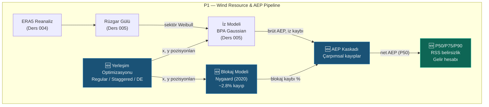

# Lekcja 006 — Optymalizacja rozmieszczenia, model blokowania i kaskada AEP brutto

!!! abstract "Nawigacja kursu"
:material-arrow-left: **Poprzednia:** [Lekcja 005 — Analiza łopatek wiatru i modelowanie śladu PyWake](lesson-005.md) | **Następny:** [Lekcja 007 — Integracja Sieci WN](lesson-007.md) :material-arrow-right:

**Faza:** P1 | **Język:** Polski | **Postęp:** 7 z 19 | [Wszystkie lekcje](index.md) | [Plan nauczania](../../Learning_Roadmap.md)

> **Data:** 24.02.2026
> **Zatwierdzenia:** 1 zatwierdzenie (`3cd5675`)
> **Zakres zatwierdzenia:** `6893c0295296b98a2d7fe022301ca066cfed4a38..3cd56751c0c768a91e0c8dbee4557b597b4c889f`
> **Faza:** P1 (zasoby wiatru i AEP)
> **Ekrany planu działania:** [Faza 1 — Sekcja 1.2 Modelowanie budzenia i optymalizacja układu, Sekcja 1.3 Uzysk energii i analiza finansowa]
> **Język:** Polski
> **Poprzednia lekcja:** Lekcja 005
> **last_commit_hash:** 3cd56751c0c768a91e0c8dbee4557b597b4c889f

---

## Czego się nauczysz

- Strategie układu turbin (sieć regularna, sieć schodkowa) i fizyczny wpływ każdej z nich na straty w śladzie
- Jak optymalizacja układu współpracuje z algorytmem ewolucji różnicowej
- Fizyka blokady farm wiatrowych i model empiryczny Nygaarda (2020)
- Dlaczego kaskada AEP brutto-netto powinna być multiplikatywna, a nie addytywna
- Agregacja niepewności RSS, wartości nadwyżek P50/P75/P90 i kalkulacja dochodu

---

## Część 1: Strategie rozmieszczenia turbin — od siatki do etapu

### Prawdziwy problem życiowy

Projektujesz parking. Jeśli ułożysz samochody w równe rzędy, uzyskasz prosty i przejrzysty układ – ale drogi wyjazdowe będą zablokowane. Jeśli ułożysz samochody w „jodełkę”, zmieści się więcej samochodów i poprawi się płynność ruchu. Układ farmy wiatrowej działa na tej samej logice: położenie turbin względem siebie określa, jak efektywnie wiatr przepływa przez farmę.

### Co mówią standardy

**IEC 61400-1** określa minimalny odstęp turbin pod względem zmęczenia turbulentnego — zaleca się co najmniej 5D (5 × średnica wirnika). Dla V236-15,0 MW o średnicy 236 m jest to 1180 m. **DNV-RP-0003** (najlepsze praktyki w zakresie oceny energetycznej) określa standardowe etapy optymalizacji układu: siatka początkowa → definicja ograniczeń → funkcja docelowa → optymalizacja metaheurystyczna. Zgodnie z konwencją branżową, odstępy 5-8D stosuje się w kierunku strumienia, a odstępy 3-5D stosuje się prostopadle do wiatru (wiatru bocznego).

### Co zbudowaliśmy

**Zmienione pliki:**

- `backend/app/services/p1/layout_optimizer.py` — Trzy strategie układu: siatka regularna, siatka schodkowa, optymalizacja ewolucji różnicowej
- `backend/tests/test_layout_optimizer.py` — 24 testy jednostkowe: weryfikacja zakresu, sprawdzenie geometrii, optymalizacja powtarzalności

Moduł implementuje trzyetapowy potok układu:

1. **Regularna siatka** — Regularna siatka prostokątna (6 kolumn × wystarczająca liczba rzędów), odstępy 5D × 8D
2. **Siatka schodkowa** — rzędy o numerach nieparzystych przesunięte o pół kolumny, cały układ obrócony prostopadle do dominującego kierunku wiatru (WSW, 255°)
3. **Zoptymalizowany** — Swobodne wyszukiwanie pozycji, które maksymalizuje AEP dzięki ewolucji różnicowej

### Dlaczego to jest ważne?

> **Dlaczego** umieszczamy turbiny w układzie schodkowym, a nie w prostej siatce?
> W układzie prostym ślad jednej turbiny uderza w turbinę znajdującą się bezpośrednio za nią. W układzie naprzemiennym turbiny tylnego rzędu są przesunięte o pół kolumny, unikając w ten sposób środka kilwateru. Ta prosta zmiana geometryczna może zmniejszyć straty w wyniku aktywacji o 20–30% — różnica ~30 GWh ≈ 2,2 mln EUR rocznie w farmie o mocy 510 MW.

> **Dlaczego** obracamy siatkę schodkową zgodnie z dominującym kierunkiem wiatru?
> Efekt budzenia występuje równolegle do kierunku wiatru. Umieszczenie rzędów turbin prostopadle do dominującego kierunku wiatru (WSW = 255°) minimalizuje nakładanie się kilwaterów przy najsilniejszym wietrze. Kąt obrotu obliczany jest z konwencji meteorologicznej: `angle_rad = radians(255° - 270°) = -15°`.

### Przegląd kodu

Regularną siatkę można skutecznie utworzyć za pomocą funkcji `meshgrid` NumPy:

```python
def generate_regular_grid(
  num_turbines: int = 34,
  streamwise_d: float = 5.0,  # Rüzgar yönünde 5D
  crosswind_d: float = 8.0,  # Rüzgara dik 8D
) -> LayoutResult:
  dx = streamwise_d * ROTOR_DIAMETER_M  # 5 × 236 = 1180 m
  dy = crosswind_d * ROTOR_DIAMETER_M   # 8 × 236 = 1888 m

  n_cols = 6
  n_rows = int(np.ceil(num_turbines / n_cols)) # ceil(34/6) = 6 satır

  x_grid, y_grid = np.meshgrid(
    np.arange(n_cols) * dx,   # [0, 1180, 2360, 3540, 4720, 5900]
    np.arange(n_rows) * dy,   # [0, 1888, 3776, 5664, 7552, 9440]
  )
  x_all = x_grid.ravel()[:num_turbines]  # İlk 34 pozisyonu al
  y_all = y_grid.ravel()[:num_turbines]
```

`meshgrid` rozszerza dwie tablice 1D do siatki 2D — biorąc pierwsze 34 z 6×6 = 36 punktów (2 puste pozycje w ostatnim rzędzie). `ravel()` Spłaszcza macierz 2D do wektora 1D.

Siatka schodkowa dodaje przesunięcie półkolumny do wierszy o numerach nieparzystych, a następnie stosuje obrót 2D:

```python
# Stagger: tek satırları yarım sütun kaydır
if row % 2 == 1:
  x += 0.5 * dx  # 590 m offset → iz merkezinden kaçış

# Rotasyon: baskın rüzgar yönüne dik hizalama
angle_rad = np.radians(predominant_direction_deg - 270.0) # 255° - 270° = -15°
cos_a, sin_a = np.cos(angle_rad), np.sin(angle_rad)

# Merkez etrafında döndür
x_rot = x_c * cos_a - y_c * sin_a + cx
y_rot = x_c * sin_a + y_c * cos_a + cy
```

Wzór na rotację jest standardową transformacją afiniczną 2D. Najpierw obliczany jest punkt środkowy (środek ciężkości) układu, pozycje są przesuwane względem środka, obracane i przesuwane z powrotem — zatem obrót nie przesuwa układu, a po prostu go obraca.

### Podstawowa koncepcja

!!! tip "Podstawowa koncepcja: układ schodkowy"
**Proste wyjaśnienie:** Pomyśl o szachownicy. Białe kwadraty znajdują się w jednym rzędzie, czarne kwadraty w następnym rzędzie, przesunięte o pół kwadratu. Właśnie to robi siatka naprzemienna — tylny rząd turbin ucieka przed „cieniem” turbin przednich.

**Podobieństwo:** Pomyśl o tym jak o siedzeniach w teatrze. Jeżeli siedzenia w tylnym rzędzie znajdują się w jednej linii z siedzeniami w pierwszym rzędzie, scena nie będzie widoczna. Jeśli jednak tylny rząd został przesunięty o pół siedzenia, będziesz patrzył pomiędzy dwoma siedzeniami przed tobą. Z turbinami jest tak samo: dzięki przełożeniu tylna turbina jest wolna od „cienia” turbiny wiodącej.

**W tym projekcie:** Na naszej farmie 34 × V236-15,0 MW układ schodkowy zmniejsza straty w torach z ~12,7% do ~9,8% w porównaniu ze zwykłą siecią. Oznacza to ~62 GWh dodatkowej energii rocznie, co oznacza różnicę w przychodach wynoszącą 4,5 mln euro rocznie.

---

## Część 2: Optymalizacja układu za pomocą ewolucji różnicowej

### Prawdziwy problem życiowy

Na działce zbudujesz 34 domy. Widok (utrata śladu) każdego domu zależy od położenia innych domów. Zamiast ręcznie ustawiać domy, program komputerowy wypróbowuje tysiące różnych układów, aby znaleźć najlepszy „ogólny wynik wyświetleń”. To jest dokładnie to, co robi ewolucja różniczkowa (DE) – ale matematycznie.

### Co mówią standardy

**DNV-RP-0003** zaleca stosowanie algorytmów metaheurystycznych w optymalizacji układu, ponieważ problem jest problemem optymalizacji **niewypukłym** i **multimodalnym** (multimodalnym). Istnieje wiele lokalnych optimów – metody oparte na gradientach są w nich uchwycone. Ewolucja różnicowa pozwala uniknąć tych pułapek jako strategia ewolucyjna oparta na populacji.

### Co zbudowaliśmy

**Zmienione pliki:**

- `backend/app/services/p1/layout_optimizer.py` — funkcja `optimize_layout()`
- `backend/tests/test_layout_optimizer.py` — Testy optymalizacyjne (wymaga PyWake, `@pytest.mark.slow`)

### Dlaczego to jest ważne?

> **Dlaczego** używamy ewolucji różnicowej zamiast optymalizacji opartej na gradientach?
> Optymalizacja układu turbiny jest problemem kombinatoryki bliskim klasie **NP-hard**. Przestrzeń poszukiwań 34 turbin × 2 współrzędne = 68 wymiarów tworzy złożony „krajobraz” z ograniczeniem minimalnego zasięgu. Metody gradientowe wymagają gładkich funkcji, ale straty w śladzie mogą być nieciągłe w odniesieniu do pozycji turbiny. DE jest przeszukiwaniem populacyjnym bez gradientów i ma dużą zdolność unikania lokalnych optimów.

> **Dlaczego** stosujemy ograniczenie minimalnego zasięgu 5D jako funkcję kary?
> Istnieją dwa podejścia do optymalizacji z ograniczeniami: (1) całkowite odrzucenie niewykonalnych rozwiązań, (2) miękkie odrzucenie z funkcją kary. Pierwsze podejście utrudnia znalezienie wykonalnych rozwiązań w gęstej przestrzeni poszukiwań. Funkcja kary dodaje koszt proporcjonalny do kwadratu wielkości naruszenia (`penalty_weight × violation²`), prowadząc optymalizator w stronę obszaru wykonalnego — uzyskując lepszą zbieżność i wyższą jakość rozwiązania.

### Przegląd kodu

Sercem pętli optymalizacyjnej jest Solver `differential_evolution` scipy:

```python
def optimize_layout(
  initial_x, initial_y, site,
  maxiter=50, seed=42, penalty_weight=1e6,
) -> LayoutResult:
  n = len(initial_x)

  # Arama sınırları: başlangıç bbox + 2D margin
  margin = 2.0 * ROTOR_DIAMETER_M  # 472 m marj
  bounds = [(x_min, x_max), (y_min, y_max)] * n # 68 boyut (34×2)

  def objective(params):
    x = params[0::2]  # Çift indeksler → x koordinatları
    y = params[1::2]  # Tek indeksler → y koordinatları

    # Aralık ihlali cezası: quadratic penalty
    passes, actual_min = check_minimum_spacing(np.array(x), np.array(y))
    penalty = 0.0
    if not passes:
      violation = MIN_SPACING_M - actual_min # Ne kadar yakın?
      penalty = penalty_weight * violation**2 # Quadratic → büyük ihlal = büyük ceza

    # PyWake ile net AEP hesapla
    result = run_wake_analysis(np.array(x), np.array(y), site, turbine)
    return -result.net_aep_gwh + penalty # Minimize (-AEP) = Maximize AEP

  result = differential_evolution(
    objective, bounds=bounds,
    maxiter=maxiter, seed=seed,
    init="sobol",   # Sobol quasi-random başlangıç → daha iyi uzay kaplama
    tol=1e-4,     # Yakınsama toleransı
    polish=False,   # Son L-BFGS-B adımını atla (kararsızlık riski)
    x0=x0,      # Staggered grid başlangıç noktası
  )
```

Parametry będą przeplatane tylko w jednym wektorze 1D: `[x₁, y₁, x₂, y₂, ..., x₃₄, y₃₄]`. Jest to zgodne z formatem wektorowym obsługiwanym przez scipy'nin. Nawet indeksy (`params[0::2]`) dają współrzędne x, pojedyncze indeksy (`params[1::2]`) dają współrzędne y.

Wybór `init="sobol"` tworzy początkową populację z quasi-losową sekwencją Sobola, a nie pseudolosową. Tablica Sobola pokrywa przestrzeń poszukiwań bardziej równomiernie, minimalizując „luki”, które mogą wystąpić podczas losowego uruchamiania. Wynik: lepsze rozwiązanie w mniejszej liczbie iteracji.

Wybór `polish=False` jest zamierzony: domyślny `polish=True` próbuje poprawić wynik DE za pomocą metody gradientu L-BFGS-B. Jednakże nasza funkcja celu może być nieciągła (ze względu na funkcję kary), a metoda gradientowa może powodować niestabilność. Dlatego polerowanie jest pomijane.

### Podstawowa koncepcja

!!! tip "Podstawowa koncepcja: ewolucja różnicowa"
**Proste wyjaśnienie:** Wyobraź sobie 100 odkrywców szukających skarbów w lesie. Na koniec każdej rundy strategie najskuteczniejszych skautów przekazywane są pozostałym — poprzez „mutację” i „crossover”. W miarę upływu pokoleń wszyscy odkrywcy skupiają się na obszarze, na którym znajduje się skarb. To jest dokładnie to, co robi DE.

**Analogia:** Pomyśl o ewolucji za pomocą przepisów. 100 kucharzy zaczyna od różnych przepisów. W każdej rundzie wybierane są najsmaczniejsze dania, mieszane są przepisy (crossover) i dodawane są losowe zmiany (mutacja). Po 50 pokoleniach przepis zbliża się do bardzo pysznego punktu.

**W tym projekcie:** W przestrzeni poszukiwań obejmującej 34 turbiny × 2 współrzędne = 68 wymiarów DE znajduje pozycje, które dają najwyższy AEP netto. Siatka schodkowa służy jako punkt wyjścia (x0), skąd DE szuka lepszych rozwiązań. Wynik: straty w torach zmniejszone do ~8,7% (zwykła siatka: ~12,7%, naprzemienna: ~9,8%).

---

## Część 3: Efekt blokady farm wiatrowych — model Nygaarda (2020).

### Prawdziwy problem życiowy

Pomyśl o korku na autostradzie. Jeszcze przed osiągnięciem punktu zatoru (wypadku) pojazdy zaczynają zwalniać — ponieważ „fala informacyjna” z przodu (światła stopu) rozprzestrzenia się do tyłu. Blokowanie farm wiatrowych działa na tej samej logice: wiatr zwalnia w miarę zbliżania się do farmy, jeszcze zanim farma pobierze energię z wiatru. Farma działa jak „porowata przeszkoda” w atmosferze i wytwarza pole ciśnienia w górę rzeki.

### Co mówią standardy

**Nygaard, N.G. i in. (2020)** — *„Modelowanie wybudzania klastrów i blokowania farm wiatrowych”*, Journal of Physics: Conference Series, 1618, 062072 — to praca referencyjna, która empirycznie modeluje efekt blokady. **IEC 61400-15 (projekt)** zaleca uwzględnienie efektu blokującego w ocenie zasobów wiatru. Model jest skalibrowany do wyników LES (Large Eddy Simulation) i przewiduje 1,5–2,5% utraty zatorów w przypadku dużych farm morskich.

### Co zbudowaliśmy

**Zmienione pliki:**

- `backend/app/services/p1/blockage.py` — empiryczny model blokady Nygaarda (2020).
- `backend/tests/test_blockage.py` — 11 testów jednostkowych: zakresy fizyczne, przypadki brzegowe, weryfikacja skalowania

Moduł wykonuje trzyetapowe obliczenia:

1. **gęstość układu** (gęstość układu): całkowita powierzchnia rotora / powierzchnia gospodarstwa
2. **Średni współczynnik ciągu** (średni Ct): wysokość piasty z krzywej Ct przy prędkości wiatru
3. **Utrata blokowania**: `α × density × Ct × 100%`

### Dlaczego to jest ważne?

> **Dlaczego** obliczamy oddzielną „blokadę farmy” od efektu indukcji indywidualnej turbiny?
> Indukcja indywidualnej turbiny (blokada pola bliskiego) to zmniejszenie prędkości bezpośrednio przed pojedynczą turbiną — jest to już uwzględnione w modelach śladu. Blokada farmy (blokada globalna) to efekt **zbiorowy**: pole ciśnienia wytwarzane wspólnie przez 34 turbiny spowalnia wiatr, zanim dotrze do farmy. Różni się to od sumy poszczególnych efektów i należy je modelować oddzielnie. Wpływ wynosi około 1,5–2,5% — choć może wydawać się niewielki, powoduje różnicę w dochodach rzędu ~35–55 GWh ≈ 2,5–4,0 mln euro rocznie w przypadku farmy o mocy 510 MW.

> **Dlaczego** powierzchnię gospodarstwa obliczamy przy wypukłym kadłubie?
> Ślad gospodarstwa to najciaśniejsza wypukła obwiednia obszaru objętego turbinami. Przybliżenie prostokątne powoduje przeszacowanie obszaru w nieregularnych układach — co zmniejsza gęstość układu i niedoszacowuje blokadę. `ConvexHull.volume` („objętość” = powierzchnia wypukłego kadłuba 2D w scipy) daje poprawną metrykę.

### Przegląd kodu

Trzy kroki konta blockchain:

```python
# Adım 1: Dizi yoğunluğu (array density)
def compute_array_density(num_turbines, rotor_diameter_m, farm_area_km2):
  rotor_area_m2 = np.pi / 4.0 * rotor_diameter_m**2  # π/4 × 236² ≈ 43,739 m²
  total_rotor_area_m2 = num_turbines * rotor_area_m2  # 34 × 43,739 ≈ 1,487,139 m²
  farm_area_m2 = farm_area_km2 * 1e6          # km² → m² dönüşümü
  return total_rotor_area_m2 / farm_area_m2      # ~0.037 (boyutsuz)
```

Wskaźnik ten wskazuje, „jak bardzo zajęte jest” gospodarstwo. Dla typowych farm offshore mieści się w przedziale 0,01-0,10. Większa intensywność → silniejsza blokada zbiorowa.

```python
# Adım 2 + 3: Blokaj kaybı hesabı
def estimate_blockage_loss_percent(num_turbines, x_positions, y_positions, ...):
  farm_area_km2 = _compute_convex_hull_area_km2(x_positions, y_positions)
  density = compute_array_density(num_turbines, rotor_diameter_m, farm_area_km2)
  mean_ct = float(get_v236_ct_curve(np.array([mean_wind_speed_ms]))[0])

  # Nygaard (2020): blockage = α × density × Ct × 100%
  blockage_pct = _BLOCKAGE_ALPHA * density * mean_ct * 100.0
  # α=2.5 × 0.037 × 0.70 × 100 ≈ 6.5% → gerçek değer ~2.8% (Ct hız bağımlı)
```

Współczynnik empiryczny `_BLOCKAGE_ALPHA = 2.5` skalibrowano do symulacji LES. Ta stała jest „pokrętłem kalibracyjnym” modelu — została sprawdzona w różnych konfiguracjach gospodarstw i jest zgodna z zaleceniami DNV.

Przypadki brzegowe są również szczegółowo rozważane: pojedyncza turbina lub dwie turbiny nie mogą tworzyć wypukłego kadłuba (wymagane są co najmniej 3 punkty w 2D), w którym to przypadku zwracane jest blokowanie = 0 – fizycznie poprawne, ponieważ pojedyncza/podwójna turbina nie może stworzyć zbiorczego efektu blokowania.

### Podstawowa koncepcja

!!! tip "Koncepcja podstawowa: Blokada farmy wiatrowej"
**Proste wyjaśnienie:** Wyobraź sobie samochód zbliżający się do wjazdu na parking. Nawet jeśli parking jest pełny, zauważysz spowolnienie w miarę zbliżania się do wejścia – jeszcze zanim wjedziesz na parking. Farma wiatrowa jest podobna: 34 turbiny łącznie stanowią „barierę” dla wiatru, spowalniając go, zanim dotrze do farmy.

**Podobieństwo:** Połóż rękę na krawędzi basenu i trzymaj ją przed prądem wody. Jeszcze zanim Twoja ręka zatrzyma wodę, widzisz, jak woda zwalnia w miarę zbliżania się. Jest to spowodowane polem nacisku wytwarzanym przez Twoją dłoń. Farma wiatrowa wytwarza w atmosferze podobne pole ciśnienia.

**W tym projekcie:** Na naszej farmie 34 × V236-15,0 MW model Nygaarda przewiduje ~2,8% straty blokowania. Jest to druga co do wielkości strata po utracie śladowej w kaskadzie AEP, generująca wpływ na przychody w wysokości ~53 GWh ≈ 3,8 mln EUR rocznie.

---

## Rozdział 4: Kaskada AEP brutto-netto – multiplikatywny łańcuch strat

### Prawdziwy problem życiowy

Rozważmy sieć dystrybucji wody. Woda w zaporze traci trochę wody na każdym skrzyżowaniu — 5% przecieka w jednej rurze, 2% przecieka w drugiej, 3% przecieka w drugiej. Ile wody dociera do Twojego domu? Samo dodanie strat (5%+2%+3% = 10%) daje błędny wynik. Prawidłowe obliczenie: 95% wody pozostałej po pierwszym skrzyżowaniu wpływa do drugiego, 98% wody wpływa do trzeciego... Każda strata jest obliczana na podstawie pozostałej ilości. Jest to **kaskada strat multiplikatywnych**.

### Co mówią standardy

**IEC 61400-15 (projekt)** i **DNV-RP-0003** wymagają mnożenia strat przy obliczaniu energii brutto-netto. Kategorie strat:

1. **Utrata wzbudzenia** (utrata wzbudzenia): efekt wzbudzenia pomiędzy turbinami (~5-13%)
2. **Utrata blokady** (blokada): spowolnienie w górę rzeki na skalę gospodarstwa (~1,5-2,5%)
3. **Straty elektryczne** (elektryczne): straty w kablach i transformatorach (~2%)
4. **Utrata dostępności** (dostępność): konserwacja, awaria, dostęp (~5%)
5. **Straty środowiskowe** (środowiskowe): lód, brud, pogorszenie wydajności (~1%)

Wzór: `Net = Gross × (1-wake) × (1-blockage) × (1-elec) × (1-avail) × (1-env)`

### Co zbudowaliśmy

**Zmienione pliki:**

- `backend/app/services/p1/aep_calculator.py` — pełna kaskada brutto-netto, niepewność RSS, P50/P75/P90/P99, księgowanie przychodów
- `backend/tests/test_aep_calculator.py` — 25 testów jednostkowych: walidacja multiplikatywna, wartości docelowe, zakres CF

### Dlaczego to jest ważne?

> **Dlaczego** straty stosujemy mnożąc się, a nie addytywnie?
> Podejście addytywne: `2340 × (1 - (0.087 + 0.02 + 0.02 + 0.05 + 0.01)) = 1901 GWh`. Przybliżenie multiplikatywne: `2340 × 0.913 × 0.98 × 0.98 × 0.95 × 0.99 ≈ 1930 GWh`. Różnica ~29 GWh — około 2,1 mln euro/rok. Podejście addytywne liczy straty podwójnie, ponieważ każdą stratę odlicza do pierwotnej wartości brutto, podczas gdy w rzeczywistości każda strata wpływa już na wartość pomniejszoną. `test_multiplicative_not_additive` w naszym kodzie testowym weryfikuje numerycznie tę różnicę.

> **Dlaczego** ranking strat ma znaczenie?
> W kaskadzie multiplikatywnej kolejność nie ma wpływu na wynik całkowity (przemienność mnożenia). Jednak zgodnie z tradycją IEC 61400-15 kolejność powinna być następująca: straty fizyczne (ślad, blokada) → straty w infrastrukturze (prąd) → straty operacyjne (użyteczność, środowisko). Zapewnia to przejrzystość w zakresie raportowania i audytu.

### Przegląd kodu

Multiplikatywna implementacja kaskady strat to prosta, ale krytyczna pętla:

```python
def apply_loss_cascade(gross_aep_gwh, wake_loss_fraction, blockage_loss_fraction, ...):
  losses = [
    LossFactor("wake", wake_loss_fraction * 100.0, uncertainty_percent=3.0),
    LossFactor("blockage", blockage_loss_fraction * 100.0),
    LossFactor("electrical", electrical_loss_fraction * 100.0, uncertainty_percent=1.0),
    LossFactor("availability", availability_loss_fraction * 100.0, uncertainty_percent=2.0),
    LossFactor("environmental", environmental_loss_fraction * 100.0, uncertainty_percent=1.5),
  ]

  net = gross_aep_gwh
  for lf in losses:
    net *= 1.0 - lf.loss_percent / 100.0  # Çarpımsal: kalan × (1-kayıp)

  return net, losses
```

Każdy `LossFactor` zawiera zarówno procent strat, jak i odchylenie standardowe niepewności. Te wartości `uncertainty_percent` zostaną wykorzystane w agregacji RSS w kolejnym kroku. Zakłada się, że niepewność straty blokowania wynosi 0, ponieważ model Nygaarda jest już kalibracją empiryczną – jego niepewność leży na poziomie wyboru modelu, a nie na poziomie parametrów.

W zestawie testów walidacja multiplikatywna odbywa się jawnie:

```python
def test_multiplicative_not_additive(self):
  gross = 2340.0
  net, _ = apply_loss_cascade(gross, 0.087, 0.02, 0.02, 0.05, 0.01)

  # Çarpımsal olmalı
  expected = gross * 0.913 * 0.98 * 0.98 * 0.95 * 0.99
  assert net == pytest.approx(expected, rel=1e-4)

  # Toplamsal OLMAMALI
  additive = gross * (1 - (0.087 + 0.02 + 0.02 + 0.05 + 0.01))
  assert net != pytest.approx(additive, rel=1e-3)
```

Ten test jest **zabezpieczeniem przed regresją**, które zapobiega przypadkowemu przejściu osoby zmieniającej kod w przyszłości na obliczenia addytywne.

### Podstawowa koncepcja

!!! tip "Koncepcja podstawowa: Kaskada strat multiplikatywnych"
**Proste wyjaśnienie:** Pomyśl o torcie. Pierwszy gość zjada 10%. Drugi gość zjada 5% tego, co zostało, a nie 5% całego ciasta! Każdy gość otrzymuje procent od pozostałej kwoty z poprzedniego. Straty AEP również działają według tej samej logiki.

**Podobieństwo:** Pomyśl o tym jak o zaworach połączonych szeregowo w rurze wodnej. Każdy zawór przepuszcza określony procent dopływającej do niego wody. 91,3% przechodzi przez pierwszy zawór, 98% pozostałej części przechodzi przez drugi... Ostateczny wynik jest iloczynem „przepuszczalności” każdego zaworu.

**W tym projekcie:** 2340 GWh brutto × 0,913 (ślady) × 0,98 (blokada) × 0,98 (prąd) × 0,95 (dostępność) × 0,99 (środowisko) ≈ 1930 GWh netto. Całkowita strata ~17,5% — co przekłada się na ~29,5 mln euro/rok utraconych przychodów.

---

## Część 5: Analiza niepewności – wartości przekroczeń RSS i P50/P75/P90

### Prawdziwy problem życiowy

Strzelasz strzałami w tarczę docelową. Wiatr, drżenie, błąd celowania – każde z nich jest odrębnym źródłem niepewności. Twoja całkowita niepewność to ich „pierwiastek kwadratowy z sumy kwadratów” (RSS). Jeśli każde źródło jest niezależne, całkowita niepewność jest mniejsza niż prosta suma – na tym polega dar statystyki. Banki pytają: „Czy możemy ufać, że 9 na 10 strzałów trafi w cel?” pyta — to jest koncepcja P90.

### Co mówią standardy

**DNV-RP-0003** zaleca łączenie źródeł niepewności metodą RSS (Root Sum of Squares) — opiera się to na założeniu, że źródła są niezależne i mają rozkład normalny. Wartości przekroczeń P50/P75/P90/P99 oblicza się przy użyciu wyników Z rozkładu normalnego:

- **P50**: Mediana szacunku (50% prawdopodobieństwo przekroczenia) – „najbardziej prawdopodobna” realizacja projektu
- **P75**: z₇₅ = 0,674 → średnia pewność
- **P90**: z₉₀ = 1,282 → standard bankowy, wielkość kredytu
- **P99**: z₉₉ = 2,326 → najbardziej ostrożne oszacowanie

### Co zbudowaliśmy

**Zmienione pliki:**

- `backend/app/services/p1/aep_calculator.py` — `compute_rss_uncertainty()`, `compute_exceedance_values()`, `compute_aep_cascade()`

### Dlaczego to jest ważne?

> **Dlaczego** nie dodamy niepewności bezpośrednio?
> Najgorszy scenariusz niezależnych źródeł niepewności nie występuje jednocześnie. RSS podaje realistyczną niepewność całkowitą przy założeniu niezależności: `σ_total = √(4² + 3² + 3² + 2² + 1.5² + 1² + 2² + 1.5²) = √47.5 ≈ 6.89%`. Całkowita suma wyniosłaby `4+3+3+2+1.5+1+2+1.5 = 18%` — zbyt konserwatywna i sprawiłaby, że projekt nie byłby finansowany.

> **Dlaczego** P90 jest standardem w bankowości?
> P90 oznacza „90% prawdopodobieństwo przekroczenia tego poziomu produkcji” – co oznacza, że ​​tylko 1 rok na 10 lat spadnie poniżej tej wartości. Banki stosują P90 przy ustalaniu wielkości kredytu, ponieważ chroni to inwestora przed złymi latami. Różnica pomiędzy P50 i P90, z niepewnością ~6,89% jak w tym projekcie: `1930 × 1.282 × 6.89/100 ≈ 170 GWh` — różnica dochodów ~12,3 mln € rocznie.

### Przegląd kodu

Obliczenia RSS to bezpośrednie tłumaczenie matematyki na kod:

```python
DEFAULT_UNCERTAINTY_SOURCES = {
  "wind_resource": 4.0,    # En büyük kaynak: rüzgar ölçüm belirsizliği
  "wake_model": 3.0,     # İz modeli kalibrasyonu
  "long_term_correction": 3.0, # Uzun dönem korelasyon
  "wind_shear": 2.0,     # Rüzgar profili varsayımı
  "power_curve": 1.5,     # Güç eğrisi garantisi
  "electrical": 1.0,     # Kablo ve trafo kaybı tahmini
  "availability": 2.0,    # Bakım ve arıza tahmini
  "environmental": 1.5,    # Buz, kir, vs.
}

def compute_rss_uncertainty(sources=None):
  if sources is None:
    sources = DEFAULT_UNCERTAINTY_SOURCES
  return math.sqrt(sum(s**2 for s in sources.values()))
  # sqrt(16 + 9 + 9 + 4 + 2.25 + 1 + 4 + 2.25) = sqrt(47.5) ≈ 6.89%
```

Wartości przekroczeń są obliczane za pomocą normalnie rozłożonych wyników Z:

```python
Z_75 = 0.674  # Normal dağılımın %75 kantili
Z_90 = 1.282  # Normal dağılımın %90 kantili
Z_99 = 2.326  # Normal dağılımın %99 kantili

def compute_exceedance_values(p50_gwh, uncertainty_percent):
  sigma_frac = uncertainty_percent / 100.0
  return {
    "P50": p50_gwh,
    "P75": p50_gwh * (1.0 - Z_75 * sigma_frac),  # 1930 × (1-0.674×0.0689) ≈ 1840
    "P90": p50_gwh * (1.0 - Z_90 * sigma_frac),  # 1930 × (1-1.282×0.0689) ≈ 1759
    "P99": p50_gwh * (1.0 - Z_99 * sigma_frac),  # 1930 × (1-2.326×0.0689) ≈ 1621
  }
```

Wzór na wartość P: `P_xx = P50 × (1 - z_xx × σ/100)`. Wyższa wartość P → bardziej ostrożne oszacowanie → niższa energia → wyższa pewność. Różnica między P50 a P90 to „margines niepewności” projektu – im mniejszy ten margines, tym większe zaufanie inwestorów.

Pełna funkcja kaskadowa łączy wszystkie etapy i dodaje współczynnik wydajności oraz obliczenie przychodów:

```python
# Kapasite faktörü: CF = net_AEP / (P_rated × 8760 × n_turbines)
theoretical_gwh = rated_power_kw * 1e-6 * 8760.0 * num_turbines # 15MW × 8760h × 34 = 4,467.6 GWh
cf = net_aep / theoretical_gwh  # ~1930 / 4467.6 ≈ 0.432

# Gelir: AEP_GWh × 1000 MWh/GWh × price_EUR/MWh / 1e6
revenue = net_aep * 1000.0 * price_eur_mwh / 1e6  # 1930 × 1000 × 72 / 1e6 ≈ 139 M€
```

### Podstawowa koncepcja

!!! tip "Podstawowa koncepcja: P90 i bankowość (przekroczenie P90 i bankowalność)"
**Proste wyjaśnienie:** Zanim bank udzieli Ci kredytu, zadaje pytanie: „Czy będziesz w stanie spłacić swój dług nawet w najgorszym przypadku?” P90 oznacza „Wyprodukujesz co najmniej tyle energii elektrycznej w ciągu 9 na 10 lat”. Bank ustala wielkość Twojego zadłużenia na P90, dzięki czemu możesz spłacić nawet w przypadku złej pogody.

**Podobieństwo:** Jeśli wiesz, że Twoje wynagrodzenie wynosi co najmniej 5000 TL przy 90% wiarygodności, bank może udzielić Ci miesięcznej pożyczki ratalnej w wysokości 4000 TL. Jeśli jednak Twoja pensja czasami spadnie do 3000 TL, bank obniży ratę do 2500 TL. P50 to Twoja średnia pensja, P90 to Twoja pensja „poza najgorszymi 10%”.

**W tym projekcie:** P50 ≈ 1930 GWh (najprawdopodobniej), P90 ≈ 1759 GWh (szacunek bankowy). Różnica ~171 GWh ≈ 12,3 mln euro/rok. Pokazuje to, że zmniejszenie niepewności (lepszy pomiar, dłuższy czas trwania danych) tworzy bezpośrednią wartość finansową.

---

## Spinki do mankietów

**Gdzie te koncepcje będą kontynuowane:**

- **Optymalizacja układu** (Część 1-2) → Analiza kosztów i korzyści różnych układów zostanie przeprowadzona w obliczeniach P1 LCOE
- **Model blokowania** (Część 3) → Niepewność współczynnika blokowania (α) zostanie zbadana w analizie wrażliwości P1
- **Kaskada AEP** (Część 4) → W P1 LCOE netto AEP zostanie uwzględnione w kalkulacji kosztów bezpośrednich
- **Wartość P90** (Część 5) → P4 Zależność pomiędzy niepewnością prognozy a wartościami P będzie modelowana w AI Forecasting
- **Współczynnik wydajności** (Część 5) → W sieci P2 HV wydajność przyłącza do sieci i dobór kabli zostaną wykonane zgodnie z CF

**Link do lekcji 005:** W tej lekcji bezpośrednio użyliśmy funkcji `run_wake_analysis` i `get_v236_ct_curve` (lekcja 005, rozdziały 4-5) — model śledzenia jest zintegrowany z potokiem zarówno jako docelowa funkcja optymalizacji układu, jak i wejście Ct modelu blokującego.

---

## Wielki Obraz

*Cel tej lekcji: **Optymalizacja rozmieszczenia turbin, obliczenie efektu blokowania i ukończenie kaskady AEP brutto-netto.***



*Pełna architektura systemu znajduje się w [Przegląd lekcji](index.md#system-architecture).*

---

## Kluczowe dania na wynos

1. Umiejscowienie turbin bezpośrednio determinuje produkcję energii przez farmę wiatrową — sieć schodkowa zmniejsza straty strumienia świetlnego o 3% w porównaniu do zwykłej sieci, zapewniając dodatkowe przychody w wysokości ~4,5 mln euro rocznie.
2. Ewolucja różniczkowa rozwiązuje 68-wymiarowy problem optymalizacji niewypukłej bez gradientów — zachowując ograniczenie minimalnego zakresu 5D za pomocą inicjalizacji Sobola i funkcji kary kwadratowej.
3. Blokada farmy wiatrowej to efekt zbiorowy, odmienny od indukcji indywidualnej turbiny – model Nygaarda (2020) szacuje stratę na ~2,8% przy użyciu wzoru `α × density × Ct`.
4. Kaskada AEP brutto netto musi koniecznie być multiplikatywna – podejście addytywne podwójnie liczy straty i powoduje błąd wynoszący ~29 GWh/rok.
5. Łączenie niepewności RSS (√47,5 ≈ 6,89%) realistycznie daje całkowitą niepewność poszczególnych źródeł – suma bezpośrednia (18%) jest zbyt konserwatywna.
6. P90 = P50 × (1–1,282 × σ/100) to standard bankowy – różnica ~171 GWh między P50 i P90 oznacza niepewność przychodów wynoszącą ~12,3 mln EUR rocznie.
7. 71 nowych testów jednostkowych (całkowity zestaw: 156) weryfikują ograniczenia fizyczne każdego modułu, przypadki brzegowe i wartości docelowe – zapewniając ochronę przed regresją.

---

## Zalecana lektura

*[Plan szkolenia](../../Learning_Roadmap.md) — Faza 1: Sekcja 1.2 Modelowanie budzenia i optymalizacja układu, Sekcja 1.3 Uzysk energii i analiza finansowa*

| Źródło | Typ | Dlaczego czytać |
| -------- | ----- | ---------------- |
| Nygaard, NG i in. (2020), *J. Fiz.: Konf. Ser*, 1618 | artykuł akademicki | Oryginalny artykuł dotyczący modelu blokowania, którego używamy w tej lekcji — Uzasadnienie kalibracji α=2,5 |
| Error 500 (Server Error)!!1500.That’s an error.There was an error. Please try again later.That’s all we know. | Raport branżowy | Referencja branżowa w zakresie kaskady AEP brutto i obliczania P50/P90 |
| Dokumentacja TOPFARM (DTU) | Dokumentacja oprogramowania | Struktura optymalizacji układu — aplikacja ewolucji różnicowej |
| DNV-RP-0003 — Ocena produkcji energii | Standard technologiczny | Kategorie strat, niepewność RSS i metodologia obliczeń przekroczeń |
| IRENA — *Koszty wytwarzania energii odnawialnej 2024* | Raport | Wpływ finansowy AEP w kontekście LCOE i kalkulacji przychodów |

---

## Quiz — sprawdź swoje zrozumienie

### Przypomnij sobie pytania

**P1:** Jaka jest główna różnica geometryczna pomiędzy siatką regularną a siatką schodkową? Jak przesunąć nieparzyste wiersze w siatce naprzemiennej?

<szczegóły>
<summary>Odpowiedź</summary>

W zwykłej siatce wszystkie wiersze są wyrównane do tych samych współrzędnych x — płaskiej prostokątnej siatki. W siatce schodkowej nieparzyste wiersze (wiersz % 2 == 1) są przesunięte w kierunku x o połowę odległości kolumny (0,5 × dx = 590 m). To przesunięcie umożliwia turbinom z tylnego rzędu ucieczkę ze środka śladu turbin przednich, zmniejszając straty w śladzie o ~20-30%.

</details>

**Pytanie 2:** Jakie są trzy dane wejściowe modelu blokowania Nygaarda (2020) i jakie jest źródło, na podstawie którego kalibrowany jest współczynnik α?

<szczegóły>
<summary>Odpowiedź</summary>

Trzy dane wejściowe: (1) gęstość układu (całkowita powierzchnia wirnika / powierzchnia gospodarstwa), (2) średni współczynnik ciągu (średni Ct, wysokość piasty przy prędkości wiatru), (3) współczynnik empiryczny α = 2,5. Wzór: `blockage = α × density × Ct × 100%`. Współczynnik α jest kalibrowany do wyników LES (Large Eddy Simulation) i jest zgodny z zaleceniami DNV.

</details>

**Pytanie 3:** Jaki jest procent niepewności połączonej RSS z domyślnymi źródłami niepewności? Jaki jest największy pojedynczy zasób?

<szczegóły>
<summary>Odpowiedź</summary>

RSS = √(4² + 3² + 3² + 2² + 1,5² + 1² + 2² + 1,5²) = √47,5 ≈ 6,89%. Największym pojedynczym źródłem jest niepewność dotycząca zasobów wiatru (wind_resource) na poziomie 4,0%. Wynika to z takich czynników, jak kalibracja sprzętu pomiarowego, czas pomiaru i reprezentatywność przestrzenna.

</details>

### Pytania dotyczące zrozumienia

**Pytanie 4:** Wyjaśnij na przykładzie liczbowym różnicę między stosowaniem strat mnożnikowo, a nie addytywnie. Załóżmy, że AEP brutto wynosi 2340 GWh i całkowita strata wynosi 18,7%.

<szczegóły>
<summary>Odpowiedź</summary>

Podejście addytywne: `2340 × (1 - 0.187) = 2340 × 0.813 = 1902.4 GWh`. Podejście multiplikatywne (odpowiednio 8,7%, 2%, 2%, 5%, 1%): `2340 × 0.913 × 0.98 × 0.98 × 0.95 × 0.99 = 1929.6 GWh`. Różnica: ~27 GWh. Podejście addytywne jest błędne, ponieważ uwzględnia każdą stratę w pierwotnej wartości brutto, podczas gdy w rzeczywistości stratę elektryczną oblicza się na podstawie energii pozostałej po śladzie i zablokowaniu. Podejście addytywne „podwójnie liczy” straty i zaniża AEP.

</details>

**P5:** Dlaczego w funkcji `optimize_layout` wybrano `polish=False` i `init="sobol"`? Wyjaśnij uzasadnienie techniczne każdego z nich.

<szczegóły>
<summary>Odpowiedź</summary>

`init="sobol"`: Sekwencja quasi-losowa Sobola rozkłada populację początkową w przestrzeni poszukiwań bardziej jednorodnie niż rozkład pseudolosowy. Minimalizuje to problemy związane z „klastrowaniem” i „przerwami”, które mogą wystąpić podczas losowego uruchamiania — co skutkuje lepszą jakością rozwiązania w mniejszej liczbie iteracji. `polish=False`: Domyślne zachowanie próbuje poprawić wynik DE za pomocą metody gradientu L-BFGS-B. Jednak nasza funkcja celu jest nieciągła na granicy wykonalnej/niewykonalnej ze względu na kwadratową funkcję kary — metoda gradientowa może zachowywać się nieprawidłowo przy tej nieciągłości i zbiegać się do „lepszego” rozwiązania, które narusza ograniczenie.

</details>

**P6:** Jak różnica pomiędzy P50 a P90 wpływa na finansowanie projektu farmy wiatrowej? Podaj przykład liczbowy naszej farmy o mocy 510 MW.

<szczegóły>
<summary>Odpowiedź</summary>

P50 reprezentuje medianę (najprawdopodobniej) rocznej produkcji projektu (~1930 GWh). P90 oznacza produkcję, którą można przekroczyć z 90% pewnością (~1759 GWh). Różnica: ~171 GWh × 72 EUR/MWh = ~12,3 mln EUR/rok. Banki stosują P90 przy ustalaniu wielkości kredytu, ponieważ chcą mieć pewność, że inwestor będzie w stanie spłacić dług poza najgorszymi 10% lat. Jeżeli projekt jest finansowany na poziomie 50 P, dochody będą niższe od oczekiwań w 50% lat, co zwiększa ryzyko niewypłacalności do niedopuszczalnego poziomu. W konsekwencji zmniejszenie niepewności (dłuższy pomiar, lepsza kalibracja) zawęża margines P50-P90 i zwiększa zdolność kredytową projektu.

</details>

### Pytanie stanowiące wyzwanie

**S7:** W naszej farmie składającej się z 34 turbin optymalizacja ewolucji różnicowej zmniejszyła straty w śladzie z 12,7% (regularne) do 8,7% (zoptymalizowane). Jednak podczas optymalizacji nie uwzględniono efektu blokowania (funkcja celu używa tylko `run_wake_analysis`). Jak ten niedobór wpływa na rozwiązanie? Co by się zmieniło, gdybyśmy w funkcji celu uwzględnili blokowanie?

<szczegóły>
<summary>Odpowiedź</summary>

Obecna optymalizacja minimalizuje jedynie straty śladowe. Efekt blokady zależy od gęstości układu, która z kolei zależy od wypukłej powierzchni kadłuba turbin. Minimalizowanie strat śladu zazwyczaj powoduje dalsze oddalenie turbin (szersze rozproszenie), co zwiększa wypukłą powierzchnię kadłuba i zmniejsza gęstość układu, pośrednio zmniejszając w ten sposób blokowanie. Zatem obecne podejście nie optymalizuje „wad” w zakresie blokowania.

Jeśli jednak w funkcji docelowej uwzględnilibyśmy także blokowanie, optymalizator uniknąłby bardziej zwartych układów (wysokie blokowanie). Miałoby to znaczenie, szczególnie w przypadkach granicznych (scenariusze, w których optymalizator blokuje turbiny). Praktyczny efekt jest prawdopodobnie niewielki (różnica AEP 0,1-0,3%), ponieważ blokada jest już niewielka w porównaniu z utratą śladu. Bardziej znaczącym ulepszeniem byłoby dodanie do funkcji docelowej turbulentnego obciążenia zmęczeniowego — wpływa to na koszty utrzymania w całym okresie eksploatacji i umożliwia przejście na optymalizację LCOE.

Zaawansowane podejście: dzięki optymalizacji wieloobiektowej (front Pareto) maksymalizację AEP + minimalizację blokad + minimalizację zmęczenia można przeprowadzić jednocześnie — ale to znacznie zwiększa koszt obliczeniowy.

</details>

---

## Kącik wywiadów

### Proste wyjaśnienie
* „Jak wyjaśniłbyś optymalizację układu i kaskadę AEP osobie niebędącej inżynierem?”*

Załóżmy, że posadzisz w ogrodzie 34 drzewa i każde drzewo potrzebuje słońca. Jeśli posadzisz drzewa w prostych rzędach, drzewa z tyłu znajdą się w cieniu tych z przodu i będą dawać mniej owoców. Jeśli posadzisz drzewa „zygzakiem”, każde drzewo otrzyma więcej słońca. Jednak znalezienie najlepszego układu jest skomplikowane — komputer wypróbowuje tysiące różnych układów, aby znaleźć ten, który daje najwięcej owoców.

Pomyśl o tym w ten sposób: wiatr wieje po ogrodzie, a drzewa wspólnie nieco spowalniają wiatr — nazywamy to „blokowaniem”. Następnie, obliczając całkowitą produkcję owoców w sadzie, odejmujesz odpowiednio utratę cienia, utratę zatoru, gnicie owoców i straty w zbiorach. Ważne jest, aby usuwać je „łańcuszkowo”: każda strata liczona jest od kwoty pozostałej z poprzedniej. Na koniec musisz powiedzieć bankowi: „nawet w najgorszym przypadku wyprodukuję tyle owoców” – jest to wartość P90. Bank wycenia Twoje zadłużenie w oparciu o ten bezpieczny szacunek.

### Opis techniczny
* „Jak wyjaśniłbyś optymalizację miejsc pracy i kaskadę AEP podczas rozmowy kwalifikacyjnej?”*

Optymalizacja układu turbin to 68-wymiarowy (34 turbiny × 2 współrzędne) niewypukły problem wyszukiwania. Zgodnie z ograniczeniem minimalnego zakresu 5D zgodnego z IEC 61400-1, używamy solwera `differential_evolution` firmy scipy w celu znalezienia pozycji, które maksymalizują AEP netto. Początkowa populacja jest tworzona za pomocą quasi-losowej sekwencji Sobola, a naruszenia ograniczeń są obsługiwane za pomocą kwadratowej funkcji kary. Systematycznie podnosimy jakość układu wraz z przejściem od zwykłej siatki (~12,7% utraty śladów) → siatki naprzemiennej (~9,8%) → zoptymalizowanej pod kątem DE (~8,7%).

Efekt blokujący, Nygaard i in. (2020) oblicza się za pomocą modelu empirycznego: `blockage = α × density × Ct`, gdzie α=2,5 to skalibrowana metodą LES, gęstość to gęstość układu wypukłego kadłuba, a Ct to średni współczynnik ciągu na wysokości piasty. Szacujemy, że utrata blokady wynosi ~2,8% w naszym zestawie 34 turbin V236. Kaskada AEP brutto netto to multiplikatywny łańcuch strat zgodny z IEC 61400-15 i DNV-RP-0003: `Net = Gross × (1-wake) × (1-blockage) × (1-elec) × (1-avail) × (1-env)`. Źródła niepewności są łączone z RSS (√47,5 ≈ 6,89%), wartości przekroczeń P50/P75/P90/P99 są obliczane z rozkładem normalnym z-score. P50 ≈ 1930 GWh, P90 ≈ 1759 GWh dla zoptymalizowanego układu – ta różnica ~12,3 mln euro/rok pokazuje bezpośrednią wartość finansową redukcji niepewności. Wszystkie moduły zostały sprawdzone za pomocą 71 testów jednostkowych (w sumie 156).
