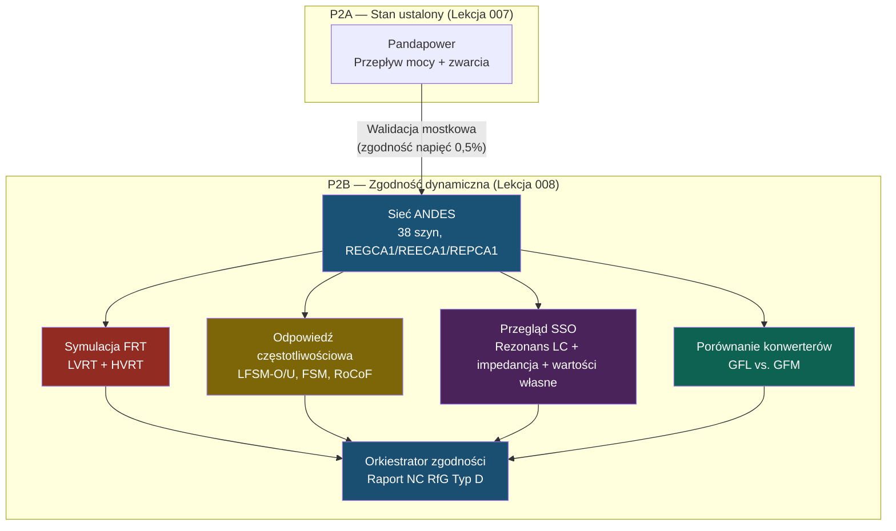

# Lekcja 008 — Dynamiczna zgodność sieci: ANDES, FRT, odpowiedź częstotliwościowa, SSO i porównanie konwerterów

!!! abstract "Nawigacja lekcji"
    :material-arrow-left: **Poprzednia:** [Lekcja 007 — Integracja sieci WN: model steady-state w Pandapower](lesson-007.md) | **Następna:** [Lekcja 009 — Model danych IEC 61850, generator SCL i rejestr urządzeń SCADA](lesson-009.md) :material-arrow-right:

    **Faza:** P2 | **Język:** Polski | **Postęp:** 8 z 19 | [Wszystkie lekcje](index.md) | [Plan nauki](../../Learning_Roadmap.md)

> **Data:** 2026-02-25
> **Commity:** 1 commit (`2870f65` → `2870f65`)
> **Zakres commitów:** `2870f65581ff4829308754b84cdb4c75cfcc62c7..2870f65581ff4829308754b84cdb4c75cfcc62c7`
> **Faza:** P2 (HV Grid Integration — Dynamic Compliance)
> **Sekcje roadmapy:** [Phase 2 — Section 2.4 Grid Codes & Compliance, Section 2.3 FACTS Devices]
> **Język:** Polski
> **Poprzednia lekcja:** Lesson 007
> **last_commit_hash:** 2870f65581ff4829308754b84cdb4c75cfcc62c7

---

## Czego się nauczysz

- Stosu modeli dynamicznych turbiny wiatrowej typu 4 (REGCA1 / REECA1 / REPCA1) i fizycznego znaczenia każdej warstwy
- Symulacji LVRT/HVRT przejazdu przez zwarcie i weryfikacji zgodności z kopertą napięciową PSE IRiESP
- Trybów odpowiedzi częstotliwościowej (LFSM-O, LFSM-U, FSM, RoCoF) i wzoru regulacji statycznej
- Przeglądu oscylacji podsynchronicznych (SSO): rezonans LC kabla, skan impedancji, analiza wartości własnych
- Strategii konwerterów Grid-Following (GFL) i Grid-Forming (GFM) oraz różnic w słabej sieci

---

## Sekcja 1: Dynamiczny model sieci w ANDES — z dziedziny czasu od Pandapower

### Problem z realnego świata

W lekcji 007 wykonaliśmy w Pandapower przepływ mocy i obliczenia zwarciowe — były to „zdjęcia": pokazywały stan sieci w jednej chwili. Ale w rzeczywistej sieci awarie trwają milisekundy. Nie można zmierzyć prędkości samochodu na zdjęciu — potrzeba wideo (symulacji w dziedzinie czasu). ANDES jest tą „kamerą wideo" — symuluje w dziedzinie czasu, pokazując, jak sterowania konwerterów zachowują się w chwili awarii.

### Co mówią standardy

ENTSO-E NC RfG (EU 2016/631) Artykuły 20–21 wymieniają wymagania dla generatorów Typu D (>75 MW, ≥110 kV), które muszą być zweryfikowane symulacją dynamiczną:

- **Artykuł 20:** Przejazd przez zwarcie (FRT) — pozostanie w sieci w granicach profilu napięcie-czas
- **Artykuł 21:** Wtrysk prądu biernego podczas zwarcia (Kqv ≥ 2,0)
- **Artykuł 15:** Odpowiedź częstotliwościowa (LFSM-O, LFSM-U, FSM)
- **Artykuł 13(1)(b):** Odporność na RoCoF (2 Hz/s, 500 ms)

PSE IRiESP §2.3–2.4 definiuje kopertę LVRT i parametry częstotliwościowe właściwe dla Polski.

### Co zbudowaliśmy

**Zmienione pliki:**

- `backend/app/services/p2/andes_network.py` — dynamiczny model sieci 38-szynowej w formacie ANDES, dynamiczne modele sterowania REGCA1/REECA1/REPCA1
- `backend/app/services/p2/frt_simulation.py` — symulacja LVRT/HVRT przejazdu przez zwarcie
- `backend/app/services/p2/frequency_response.py` — symulacja odpowiedzi częstotliwościowej (4 tryby)
- `backend/app/services/p2/sso_analysis.py` — przegląd oscylacji podsynchronicznych
- `backend/app/services/p2/converter_comparison.py` — porównanie konwerterów GFL vs. GFM
- `backend/app/services/p2/dynamic_compliance.py` — orkiestrator zgodności NC RfG Typ D
- `backend/app/models/grid.py` — 4 nowe tabele SQLAlchemy (FRT, częstotliwość, SSO, zgodność)
- `backend/app/schemas/grid.py` — 5 nowych schematów Pydantic + 4 StrEnum

Nie zmodyfikowaliśmy modelu steady-state Pandapower — sieć ANDES zbudowaliśmy ze wspólnych stałych (specyfikacje kabli, dane transformatorów, topologia) i zweryfikowaliśmy zgodność napięć między oboma modelami z dokładnością 0,5%. Ta strategia „walidacji mostkowej" (bridge validation) gwarantuje, że dwa niezależne silniki spójnie reprezentują tę samą sieć fizyczną.

### Dlaczego to jest ważne

> **Dlaczego** Pandapower nie wystarcza i potrzebujemy ANDES?
> Pandapower to solwer steady-state — oblicza jeden punkt pracy. Ale NC RfG wymaga obserwacji, jak konwerter reaguje w 20-milisekundowej stałej czasowej podczas awarii. Jest to możliwe tylko w symulacji dziedziny czasu (TDS). ANDES kompiluje modele dynamiczne za pomocą hybrydowego podejścia symboliczno-numerycznego i przekształca je w wydajny kod numeryczny.

> **Dlaczego** dzielimy te same stałe?
> Gdyby dwa modele sieci (Pandapower + ANDES) zostały zbudowane z różnymi parametrami, nie wiedzielibyśmy, który wynik jest „poprawny". Wspólne stałe + walidacja mostkowa gwarantują spójność — to standardowa praktyka w przemysłowych projektach PSCAD/PowerFactory.

### Przegląd kodu

Stos modeli dynamicznych turbiny wiatrowej Typu 4 ma trzy warstwy. Poniższy kod pokazuje parametry i fizyczne znaczenie każdej warstwy:

```python
# REGCA1 — model generatora/konwertera (najniższa warstwa)
# Modeluje konwerter jako sterowane źródło prądu
# Tg = 20 ms: opóźnienie przełączania IGBT konwertera
def get_regca1_params() -> dict[str, float]:
    return {
        "Tg": 0.02,       # Stała czasowa konwertera [s] — I(s) = I_ref / (1 + s×Tg)
        "Rrpwr": 10.0,    # Limit szybkości narastania mocy czynnej [pu/s]
        "Brkpt": 0.9,     # Punkt przełamania przy niskim napięciu [pu]
        "Zerox": 0.4,     # Poziom napięcia, przy którym Ip = 0 [pu]
    }
```

Ta funkcja przeniesienia I(s) = I_ref / (1 + s×Tg) wyraża proste opóźnienie pierwszego rzędu: konwerter śledzi komendę prądu referencyjnego ze stałą czasową 20 ms. Choć rzeczywista częstotliwość przełączania IGBT wynosi ~2 kHz, model uśredniony filtruje ten szczegół.

```python
# REECA1 — sterowanie elektryczne (warstwa środkowa)
# Wtrysk prądu biernego podczas zwarcia: ΔIq = Kqv × (V_ref - V)
# Kqv ≥ 2,0: minimum NC RfG — 2% prądu biernego na 1% odchylenia napięcia
def get_reeca1_params() -> dict[str, float]:
    return {
        "Kqv": 2.5,       # Wzmocnienie prądu biernego [pu/pu] — NC RfG ≥ 2,0
        "dbd1": -0.1,     # Dolna granica strefy nieczułości [pu]
        "dbd2": 0.1,      # Górna granica strefy nieczułości [pu]
        "Vdip": 0.15,     # Próg zapadu napięcia FRT [pu]
        "Imax": 1.1,      # Maksymalny prąd całkowity [pu]
        "PQFlag": 0,      # 0 = priorytet Q (priorytet prądu biernego podczas awarii)
    }
```

Wartość Kqv = 2,5 przekracza minimum NC RfG wynoszące 2,0 — to świadoma decyzja projektowa. Działanie powyżej minimum zapewnia margines bezpieczeństwa podczas testów zgodności ze względu na niepewności pomiarów i zmienność parametrów.

```python
# REPCA1 — sterownik elektrowni (najwyższa warstwa)
# Regulacja statyczna napięcia i częstotliwości na poziomie elektrowni
# ΔP = -(P_rated / R) × (Δf / f_nom)   R = 5% (domyślna regulacja statyczna)
def get_repca1_params() -> dict[str, float]:
    return {
        "Kp": 18.0,         # Wzmocnienie proporcjonalne regulacji napięcia
        "Ki": 5.0,          # Wzmocnienie całkujące regulacji napięcia
        "FFlag": 1,         # 1 = regulacja częstotliwości aktywna
        "fdbd1": -0.0006,   # Dolna strefa nieczułości częstotliwości [pu] → -0,03 Hz
        "fdbd2": 0.0006,    # Górna strefa nieczułości częstotliwości [pu] → +0,03 Hz
    }
```

Strefa nieczułości częstotliwości ustawiona jest na ±0,03 Hz (±0,0006 pu). Choć wartość ta przekracza minimum ±10 mHz dozwolone przez NC RfG, w praktyce przemysłowej jest powszechnie stosowana w celu uniknięcia niepotrzebnych działań regulacyjnych.

### Kluczowe pojęcie

!!! tip "Kluczowe pojęcie: stos modeli dynamicznych (REGCA1 / REECA1 / REPCA1)"
    **Wyjaśnienie proste:** Wyobraź sobie samochód. Silnik (REGCA1) wytwarza moc, pedał gazu i hamulec (REECA1) sterują chwilową reakcją, tempomat (REPCA1) utrzymuje długoterminowy cel. Gdy nastąpi awaria (przeszkoda na drodze), najpierw uruchamiają się hamulce (REECA1 — wtrysk prądu biernego), a potem tempomat dostosowuje się do nowej sytuacji (REPCA1).

    **Analogia:** W orkiestrze REGCA1 to muzyk (gra na instrumencie), REECA1 to dyrygent sekcji (zarządza chwilową dynamiką), a REPCA1 to dyrygent generalny (wyznacza tempo i ogólny ton).

    **W tym projekcie:** Każda z 34 turbin posiada ten trójwarstwowy stos sterowania. ANDES rozwiązuje 34 × 3 = 102 instancje modeli dynamicznych jednocześnie. Pandapower tego nie potrafi — zna tylko stan ustalony.

---

## Sekcja 2: Symulacja przejazdu przez zwarcie (FRT) — pozostać w sieci podczas burzy

### Problem z realnego świata

Wyobraź sobie statek — podczas burzy nie może zerwać kotwicy i dryfować. Podobnie farma wiatrowa podczas awarii sieciowej (zapadu napięcia) nie powinna odłączać się od sieci, a wręcz powinna jej pomagać. W przeciwnym razie nagła utrata 510 MW może wywołać kaskadowe awarie.

### Co mówią standardy

Koperta LVRT PSE IRiESP definiuje profil napięcie-czas:

| Czas [ms] | Minimalne napięcie [pu] |
|-----------|-------------------------|
| 0 | 0,15 |
| 140 | 0,25 |
| 500 | 0,85 |
| 1000 | 0,85 |
| 1500 | 1,00 |
| 3000 | 1,00 |

NC RfG Artykuł 21 stawia dodatkowe wymagania:

- **Prąd bierny:** ΔIq ≥ 2% × ΔV (Kqv ≥ 2,0)
- **Odbudowa mocy czynnej:** ≥90% w ciągu 1,0 s od usunięcia zwarcia
- HVRT: odporność na napięcie 1,25 pu przez 100 ms

### Co zbudowaliśmy

**Zmienione pliki:**

- `backend/app/services/p2/frt_simulation.py` — silnik symulacji FRT
- `backend/app/schemas/grid.py` — `FRTSimulationResponse`, `FRTTimePoint`, `FRTType`

Symulacja składa się z trzech faz: stan ustalony przed zarciem (0 → 0,5 s), okres zwarcia (0,5 → 0,65 s, 150 ms), obserwacja po zwarciu (0,65 → 3,65 s). ANDES TDS używa niejawnej metody trapezoidalnej (implicit trapezoidal) i rozwiązuje z krokiem 1 ms.

### Dlaczego to jest ważne

> **Dlaczego** farma wiatrowa musi pozostawać w sieci podczas awarii?
> W starszych kodach sieci farmy wiatrowe mogły się odłączać podczas awarii. Ale gdy penetracja energii odnawialnej przekracza 30–50%, nagła utrata 510 MW może spowodować spadek częstotliwości w systemie i kaskadowe awarie. FRT jest gwarancją stabilności systemu.

> **Dlaczego** wstrzykujemy prąd bierny?
> Wtrysk prądu biernego podczas zapadu napięcia wspiera napięcie w PCC, ograniczając skutki awarii. Wzór: ΔIq = Kqv × ΔV. Przy Kqv = 2,5, przy spadku napięcia o 10% wstrzykiwane jest 25% prądu biernego — podnosząc napięcie i zapobiegając rozprzestrzenianiu się awarii.

### Przegląd kodu

Koperta LVRT PSE jest zdefiniowana punkt po punkcie wewnątrz kodu:

```python
# Koperta napięcie-czas LVRT PSE IRiESP
# WTG muszą pozostawać w sieci, o ile są POWYŻEJ tej krzywej
PSE_LVRT_ENVELOPE = [
    (0.000, 0.15),   # t=0: napięcie może spaść do 0,15 pu
    (0.140, 0.25),   # t=140ms: minimum 0,25 pu
    (0.500, 0.85),   # t=500ms: odbudowa do 0,85 pu
    (1.000, 0.85),   # t=1,0s: utrzymanie 0,85 pu
    (1.500, 1.00),   # t=1,5s: pełna odbudowa
    (3.000, 1.00),   # t=3,0s: praca ciągła
]

# Progi zgodności
MIN_KQV = 2.0                    # NC RfG minimalne wzmocnienie prądu biernego
POWER_RECOVERY_THRESHOLD = 0.90  # 90% odbudowy mocy po zwarciu
POWER_RECOVERY_TIME_S = 1.0      # Odbudowa w ciągu 1,0 s
```

Punkty te zostały zaczerpnięte bezpośrednio z PSE IRiESP §2.3.2. Każdy punkt reprezentuje granicę, przy której operator sieci mówi: „od tego momentu, przy tym napięciu, musisz pozostać w sieci".

Kontrola zgodności prądu biernego wyszukuje najgorszy punkt w okresie zwarcia i oblicza Kqv:

```python
def check_reactive_current_compliance(
    time_series: list[FRTTimePoint],
    t_fault: float,
    t_clear: float,
    k_qv_min: float = MIN_KQV,
) -> tuple[bool, float]:
    """Oblicza stosunek ΔIq / ΔV i sprawdza Kqv ≥ 2,0 według NC RfG."""
    pre_v = pre_fault_points[-1].voltage_pu
    pre_iq = pre_fault_points[-1].reactive_current_pu

    # Najniższy punkt napięciowy w czasie trwania zwarcia
    min_v_point = min(fault_points, key=lambda p: p.voltage_pu)
    delta_v = pre_v - min_v_point.voltage_pu
    delta_iq = abs(min_v_point.reactive_current_pu - pre_iq)

    kqv_actual = delta_iq / delta_v
    return kqv_actual >= k_qv_min, kqv_actual
```

Ta funkcja to czyste pomiary fizyczne: pobiera różnicę napięcia i prądu przed zarciem i w czasie jego trwania, a następnie oblicza stosunek. Jeśli Kqv ≥ 2,0 — zgodność z NC RfG; w przeciwnym razie parametry REECA1 wymagają korekty.

### Kluczowe pojęcie

!!! tip "Kluczowe pojęcie: Fault Ride-Through (przejazd przez zwarcie)"
    **Wyjaśnienie proste:** Jak rowerzysta, który wpada w dziurę w jezdni i jedzie dalej bez upadku. Dziura = zapad napięcia, utrzymanie równowagi przez rowerzystę = WTG pozostający w sieci, próba naprawy drogi = wtrysk prądu biernego.

    **Analogia:** Wóz strażacki jedzie na pożar, a na drodze jest dziura. Nie może zawrócić (utrata mocy spowodowałaby awarie systemu). Musi przejechać (ride-through) i jednocześnie zacząć naprawiać drogę (wsparcie napięciowe prądem biernym).

    **W tym projekcie:** Nasza farma 510 MW musi podczas 150-milisekundowego zwarcia trójfazowego na szynie OSS 66 kV pozostać w sieci, wstrzykiwać prąd bierny z Kqv ≥ 2,0 i odbudować moc czynną do 90% w ciągu 1 s.

---

## Sekcja 3: Odpowiedź częstotliwościowa — wyczucie pulsu sieci

### Problem z realnego świata

Wyobraź sobie rower pod górę. Gdy wspinasz się na wzniesienie, zwalniasz (produkcja < zużycie → częstotliwość spada), a zjeżdżając z góry, przyspieszasz (produkcja > zużycie → częstotliwość rośnie). Generatory synchroniczne naturalnie utrzymują tę równowagę dzięki swoim maszynom wirującym (bezwładność). Ale turbiny wiatrowe Typu 4 nie mają mechanicznego powiązania z siecią — wsparcie częstotliwościowe musi być realizowane wyłącznie przez oprogramowanie.

### Co mówią standardy

Tryby odpowiedzi częstotliwościowej NC RfG Typ D:

| Tryb | Wyzwalacz | Reakcja | Artykuł NC RfG |
|------|-----------|---------|----------------|
| **LFSM-O** | f > 50,2 Hz | Zmniejsz moc | Artykuł 15(2)(c) |
| **LFSM-U** | f < 49,8 Hz | Zwiększ moc (jeśli jest rezerwa) | Artykuł 15(2)(d) |
| **FSM** | 49,8–50,2 Hz | Ciągła odpowiedź regulacyjna | Artykuł 15(2)(b) |
| **RoCoF** | df/dt = 2 Hz/s | Odporność 500 ms | Artykuł 13(1)(b) |

### Co zbudowaliśmy

**Zmienione pliki:**

- `backend/app/services/p2/frequency_response.py` — symulacja czterech trybów odpowiedzi częstotliwościowej
- `backend/app/schemas/grid.py` — enum `FrequencyMode`, `FrequencyResponseResponse`

### Dlaczego to jest ważne

> **Dlaczego** turbiny wiatrowe muszą zapewniać wsparcie częstotliwościowe?
> W miarę jak generatory synchroniczne w europejskiej sieci przechodzą na emeryturę (zamykanie elektrowni węglowych i jądrowych), całkowita bezwładność systemu maleje. Im mniejsza bezwładność, tym większe wahania częstotliwości. Jeśli farmy wiatrowe nie zapewniają odpowiedzi częstotliwościowej, europejska sieć może doświadczyć niestabilności częstotliwościowej po 2030 roku.

> **Dlaczego** regulacja statyczna wynosi 5%?
> Współczynnik regulacji statycznej R to kompromis między czułością a stabilnością. Zbyt niski R (1–2%) powoduje nadmierne reagowanie generatora na każdą małą zmianę częstotliwości, co może prowadzić do oscylacji. Zbyt wysoki R (10%+) nie zapewnia wystarczającego wsparcia. Zakres 3–5% jest standardem przemysłowym.

### Przegląd kodu

Wzór regulacji statycznej stanowi podstawę całej odpowiedzi częstotliwościowej:

```python
def calculate_expected_droop_response(
    freq_dev_hz: float,
    droop_pct: float,
    rated_mw: float,
) -> float:
    """Oblicza oczekiwaną zmianę mocy na podstawie wzoru regulacji statycznej.

    ΔP = -(P_rated / R) × (Δf / f_nom)

    Przykład: R=5%, Δf=+0,5 Hz, P_rated=510 MW:
      ΔP = -(510 / 0,05) × (0,5 / 50) = -102 MW (zmniejsz moc)
    """
    r_fraction = droop_pct / 100.0
    return -(rated_mw / r_fraction) * (freq_dev_hz / F_NOM_HZ)
```

Ten jednoliniowy wzór to matematyczna podstawa całej regulacji częstotliwości sieci. Znak ujemny reprezentuje mechanizm ujemnego sprzężenia zwrotnego: gdy częstotliwość rośnie — moc maleje, gdy częstotliwość spada — moc rośnie.

Sprawdzanie zgodności LFSM-O jest proste — czy kierunek jest właściwy?

```python
def _check_droop_compliance(mode, measured_dp, expected_dp, freq_dev):
    if mode == FrequencyMode.LFSM_O:
        # Przy nadczęstotliwości moc musi MALEĆ (ujemne ΔP)
        return measured_dp < 0 and freq_dev > 0
    elif mode == FrequencyMode.LFSM_U:
        # Przy podczęstotliwości moc musi ROSNĄĆ (dodatnie ΔP)
        return measured_dp > 0 and freq_dev < 0
    elif mode == FrequencyMode.FSM:
        # Tolerancja ±20% względem wzoru regulacji statycznej
        ratio = measured_dp / expected_dp
        return 0.80 <= ratio <= 1.20
```

Kryterium zgodności jest różne dla każdego trybu: tryby LFSM sprawdzają tylko właściwy kierunek (zmniejsz/zwiększ), FSM sprawdza, jak blisko mierzona zmiana mocy jest wartości oczekiwanej.

### Kluczowe pojęcie

!!! tip "Kluczowe pojęcie: regulacja statyczna (zależność częstotliwość-moc)"
    **Wyjaśnienie proste:** Tempomat samochodu ustawiony na 120 km/h. Jadąc pod górę, silnik automatycznie zwiększa zużycie paliwa. Zjeżdżając z góry, ogranicza paliwo. Regulacja statyczna to dokładnie to — gdy częstotliwość odchyla się od zadanej, produkcja mocy dostosowuje się automatycznie.

    **Analogia:** Sterowanie poziomem wody w basenie. Gdy poziom spada (częstotliwość maleje), kran otwiera się szerzej (moc rośnie). Gdy poziom rośnie, kran się zamyka. Współczynnik regulacji statycznej to ustawienie „jak czuły jest kran".

    **W tym projekcie:** Nasza farma 510 MW z 5% regulacją statyczną zmniejsza moc o 102 MW przy odchyleniu częstotliwości +0,5 Hz. Ta ogromna liczba pokazuje, jak krytyczne dla stabilności sieci są duże farmy wiatrowe.

---

## Sekcja 4: Przegląd oscylacji podsynchronicznych (SSO) — niewidoczne zagrożenie

### Problem z realnego świata

Wyobraź sobie strunę gitary — wibruje z określoną częstotliwością (rezonans). Długie kable podmorskie mają również naturalną częstotliwość rezonansową. Jeśli ten rezonans wpadnie w zakres podsynchroniczny (1–49 Hz), może wejść w interakcję ze sterowaniami konwertera i wywoływać narastające oscylacje. W zdarzeniu SSO w Teksasie ERCOT w 2009 roku interakcja między liniami z kompensacją szeregową a konwerterami farmy wiatrowej spowodowała rzeczywiste uszkodzenia.

### Co mówią standardy

- **ENTSO-E NC HVDC Artykuł 29:** Wymaga przeglądu SSO dla HVDC i długich połączeń AC
- **NC RfG Artykuł 21(3):** Generatory nie mogą powodować szkodliwych interakcji
- **IEC TR 62858:** Przewodnik po analizie oscylacji podsynchronicznych
- **IEEE PES:** Kryterium stabilności oparte na impedancji

### Co zbudowaliśmy

**Zmienione pliki:**

- `backend/app/services/p2/sso_analysis.py` — trójwarstwowy silnik przeglądu SSO
- `backend/app/schemas/grid.py` — `EigenvalueMode`, `SSOGRiskLevel`, `SSOScreeningResponse`

Trzy warstwy analizy:

1. **Częstotliwość rezonansu LC kabla:** f_res = 1 / (2π√(LC))
2. **Skan impedancji:** Re{Z_total(jω)} > 0 dla wszystkich częstotliwości podsynchronicznych
3. **Analiza wartości własnych:** λ = σ + jω → jeśli współczynnik tłumienia ζ < 5%, ryzyko

### Dlaczego to jest ważne

> **Dlaczego** rezonans LC jest niebezpieczny?
> Częstotliwość rezonansowa naszego kabla eksportowego 45 km, 220 kV wynosi ~753 Hz — znacznie powyżej zakresu podsynchronicznego (1–49 Hz), więc ryzyko SSO jest niskie. Ale gdyby kabel miał 150+ km lub dodano by kompensację szeregową, rezonans mógłby wpaść do zakresu podsynchronicznego i wchodzić w interakcję z PLL konwertera.

> **Dlaczego** SCR (wskaźnik zwarciowy) jest tak ważny?
> SCR = Ssc / P_rated. Silna sieć (SCR > 5) ma niską impedancję — sterowania konwertera działają swobodnie. Słaba sieć (SCR < 3) ma wysoką impedancję — PLL ma trudności ze śledzeniem napięcia, zaczyna się oscylacyjne zachowanie. Nasze SCR = 10.000 / 510 ≈ 19,6 — silna sieć.

### Przegląd kodu

Obliczenie częstotliwości rezonansowej LC kabla bezpośrednio koduje wzór fizyczny:

```python
def calculate_cable_resonance_frequency(
    length_km: float,
    l_mh_per_km: float | None = None,
    c_nf_per_km: float | None = None,
) -> float:
    """Częstotliwość rezonansu LC kabla: f_res = 1 / (2π × √(L_total × C_total))

    Dla kabla eksportowego 220 kV, 45 km:
      L = 0,116 mH/km × 45 = 5,22 mH
      C = 190 nF/km × 45 = 8,55 µF
      f_res ≈ 753 Hz (powyżej zakresu podsynchronicznego — niskie ryzyko)
    """
    l_total_h = (l_mh_per_km * 1e-3) * length_km   # [H]
    c_total_f = (c_nf_per_km * 1e-9) * length_km   # [F]
    return 1.0 / (2.0 * math.pi * math.sqrt(l_total_h * c_total_f))
```

Ten prosty wzór jest pierwszym wskaźnikiem ryzyka SSO. Jeśli rezonans spadnie do zakresu 1–49 Hz, alarm zostanie wyzwolony.

Klasyfikacja ryzyka to wielokryteriowe drzewo decyzyjne:

```python
def _classify_sso_risk(scr, phase_margin_deg, min_damping, resonance_freq_hz):
    # Warunki WYSOKIEGO ryzyka (wystarczy jeden)
    if scr < 3.0: return SSOGRiskLevel.HIGH         # Słaba sieć
    if phase_margin_deg < 30.0: return SSOGRiskLevel.HIGH  # Mały margines fazy
    if min_damping < 0.05: return SSOGRiskLevel.HIGH       # Słabe tłumienie
    if 1.0 <= resonance_freq_hz <= 49.0: return SSOGRiskLevel.HIGH  # Rezonans podsynchroniczny

    # Warunki ŚREDNIEGO ryzyka
    if scr < 5.0: return SSOGRiskLevel.MEDIUM
    if phase_margin_deg < 60.0: return SSOGRiskLevel.MEDIUM

    return SSOGRiskLevel.LOW  # Silna sieć, wystarczające marginesy
```

Klasyfikacja ryzyka działa na zasadzie logiki OR — jeśli którekolwiek kryterium jest niekorzystne, ryzyko wzrasta. Jest to podejście zachowawcze, ponieważ skutki SSO (uszkodzenie sprzętu, awarie kaskadowe) są bardzo poważne.

### Kluczowe pojęcie

!!! tip "Kluczowe pojęcie: oscylacje podsynchroniczne (Sub-Synchronous Oscillations)"
    **Wyjaśnienie proste:** Wyobraź sobie huśtawkę — jeśli pchasz ją we właściwym momencie, kołysanie narasta (rezonans). Kabel i sterowanie konwertera mogą się wzajemnie „popychać" w odpowiednich warunkach, wywołując narastające oscylacje. Aby zatrzymać huśtawkę, albo zmienisz czas pchania (parametry sterowania), albo zwiększysz masę huśtawki (wzmocnienie sieci).

    **Analogia:** Żołnierze maszerujący w nogę przez most — jeśli częstotliwość kroków pokrywa się z częstotliwością własną mostu, zacznie on drżeć (zjawisko Tacoma Narrows). W SSO „mostem" jest kabel, a „żołnierzami" są sygnały sterowania konwertera.

    **W tym projekcie:** Rezonans naszego kabla 45 km wynosi 753 Hz — jesteśmy bezpieczni. Ale przy kablach 150+ km (jak w projektach na Morzu Północnym) jest to realne zagrożenie.

---

## Sekcja 5: Porównanie konwerterów GFL vs. GFM — technologia przyszłości

### Problem z realnego świata

Wyobraź sobie dwóch kierowców. Pierwszy (GFL) jedzie śladząc linie na jezdni — świetnie radzi sobie, gdy linie są wyraźne, ale gubi się, gdy są wytarte (słaba sieć). Drugi (GFM) wyznacza własną trasę za pomocą GPS — zna drogę bez względu na to, czy linie są widoczne. W miarę wzrostu penetracji energii odnawialnej „linie jezdni" (silne generatory synchroniczne) zanikają i przejście na konwertery GFM staje się nieuniknione.

### Co mówią standardy

- **NC RfG Artykuł 13(7):** TSO mogą wymagać zdolności GFM dla nowych przyłączeń
- **Zalecenie ACER (2023):** Po 2028 roku GFM będzie obowiązkowy dla Typu D powyżej 50 MW
- **GB Grid Code GC0137:** Wymagania GFM dla scenariuszy niskiej bezwładności
- Oczekuje się, że PSE przyjmie podobne wymagania przed 2027 rokiem

### Co zbudowaliśmy

**Zmienione pliki:**

- `backend/app/services/p2/converter_comparison.py` — symulacja GFL/GFM i edukacyjne porównanie
- `backend/app/schemas/grid.py` — `ConverterType`, `ConverterResult`, `ConverterComparisonResponse`

### Dlaczego to jest ważne

> **Dlaczego** GFM różni się od GFL?
> GFL to źródło prądu — śledzi istniejące napięcie sieci za pomocą PLL i wstrzykuje prąd. GFM to źródło napięcia — tworzy własne napięcie i odniesienie częstotliwości, podobnie jak generator synchroniczny. Różnica staje się dramatyczna w słabych sieciach.

> **Dlaczego** GFL traci stabilność przy niskim SCR?
> Niskie SCR = wysoka impedancja = słabe odniesienie napięciowe. PLL w GFL próbuje śledzić to słabe napięcie, ale jego własny wtrysk prądu zmienia napięcie, PLL śledzi ponownie, co znowu zmienia napięcie... → oscylacyjna pętla. GFM nie napotyka tego problemu, bo samo generuje swoje odniesienie.

### Przegląd kodu

Przewaga GFM nad GFL jest matematycznie modelowana w zależności od SCR:

```python
def _calculate_gfm_improvement(scr: float) -> float:
    """Współczynnik poprawy GFM względem GFL.

    SCR > 10: 10% lepszy (oba stabilne)
    SCR ≈ 5:  30% lepszy (oscylacje zaczynają się w GFL)
    SCR ≈ 3:  50% lepszy (GFL marginalnie stabilny)
    SCR < 2:  70% lepszy (GFL prawdopodobnie niestabilny)
    """
    if scr >= 10.0: return 0.9     # Silna sieć — mała różnica
    elif scr >= 5.0: return 0.5 + 0.4 * (scr - 5.0) / 5.0
    elif scr >= 3.0: return 0.3 + 0.2 * (scr - 3.0) / 2.0
    else: return 0.3               # Słaba sieć — GFM zdecydowanie lepszy
```

Przy naszym połączeniu PSE z SCR = 19,6 oba typy działają dobrze. Ale w scenariuszu testowym z SCR zredukowanym do 3,9 (sieć 2.000 MVA) wyższość GFM staje się wyraźna. To edukacyjne porównanie to temat często poruszany na rozmowach kwalifikacyjnych.

Edukacyjne podsumowanie automatycznie generuje wyjaśnienie na podstawie SCR:

```python
def _describe_gfm_advantage(gfl, gfm, scr):
    if scr > 10:
        return f"Przy SCR={scr:.1f} (silna sieć), GFL i GFM są stabilne..."
    elif scr > 5:
        return f"Przy SCR={scr:.1f} (średnia sieć), GFM ma wyraźną przewagę..."
    else:
        return (f"Przy SCR={scr:.1f} (słaba sieć), GFL niestabilny, "
                f"GFM stabilny z wirtualną bezwładnością H={GFM_INERTIA_H}s...")
```

Ta funkcja nie tylko podaje wyniki techniczne — wyjaśnia również *dlaczego* tak jest. Oprogramowanie edukacyjne powinno kontekstualizować wyniki.

### Kluczowe pojęcie

!!! tip "Kluczowe pojęcie: konwerter Grid-Following vs. Grid-Forming"
    **Wyjaśnienie proste:** GFL to jak osoba niewidoma — idzie słuchając głosów innych (napięcie sieci). Przy dużym hałasie (silna sieć) porusza się bez problemu. W ciszy (słaba sieć) się gubi. GFM niesie własne światło — odnajduje drogę nawet w ciemności.

    **Analogia:** Dwoje tancerzy. GFL podąża za krokami partnera (follower) — gdy partner jest mocny, tańczą pięknie. GFM narzuca własny rytm (leader) — taniec trwa nawet gdy partner jest słaby.

    **W tym projekcie:** Nasze połączenie PSE jest silne (SCR ≈ 19,6), więc GFL jest wystarczający. Ale po 2028 roku NC RfG uczyni GFM obowiązkowym — musimy być gotowi na przyszłość.

---

## Sekcja 6: Orkiestrator zgodności dynamicznej — łącząc wszystko razem

### Problem z realnego świata

Wyobraź sobie kontrolę paszportową. Wjazd do każdego kraju wymaga innych dokumentów — wizy, zaświadczenia zdrowotnego, deklaracji celnej. Zamiast sprawdzać je pojedynczo, weryfikujesz wszystkie naraz za pomocą listy kontrolnej. Orkiestrator zgodności dynamicznej robi dokładnie to: kolejno uruchamia 8 różnych testów NC RfG i podejmuje jedną decyzję ZALICZYŁ/OBLAŁ.

### Co mówią standardy

Wzór ogólnej zgodności NC RfG Typ D:

```
overall_compliant = LVRT ∧ HVRT ∧ LFSM-O ∧ LFSM-U ∧ FSM ∧ RoCoF ∧ SSO
```

Wszystkie testy muszą zostać zaliczone — jedna porażka blokuje zatwierdzenie przyłączenia do sieci.

### Co zbudowaliśmy

**Zmienione pliki:**

- `backend/app/services/p2/dynamic_compliance.py` — orkiestrator z 8 testami
- `backend/app/schemas/grid.py` — `DynamicComplianceResponse`
- `backend/app/models/grid.py` — `DynamicComplianceResult`, `FRTSimulationResult`, `FrequencyResponseResult`, `SSOScreeningResult`

### Dlaczego to jest ważne

> **Dlaczego** jedna funkcja-orkiestrator?
> Wywoływanie każdego testu osobno zwiększa ryzyko błędu — można zapomnieć o jednym teście lub uruchomić go z błędnymi parametrami. Orkiestrator koduje „ścieżkę sukcesu": właściwa kolejność, właściwe parametry, właściwe zbieranie wyników. W inżynierii oprogramowania jest to wzorzec projektowy „Fasada" (Facade).

> **Dlaczego** używamy operatora logicznego AND (∧)?
> Bezpieczeństwo sieci jest jak łańcuch — najsłabsze ogniwo zrywa cały łańcuch. Nawet jeśli LVRT jest zaliczone, a SSO nie — połączenie nie może być zatwierdzone. To podejście zachowawcze, ale bezpieczne.

### Przegląd kodu

Orkiestrator uruchamia 8 testów sekwencyjnie i zbiera wszystkie wyniki:

```python
def run_full_compliance_assessment(
    export_length_km=45.0,
    grid_ssc_mva=10_000.0,
    generation_fraction=1.0,
) -> DynamicComplianceResponse:
    """Ocena zgodności dynamicznej NC RfG Typ D."""
    # 1. LVRT — zwarcie trójfazowe na OSS 66 kV
    lvrt = run_frt_simulation(frt_type=FRTType.LVRT, ...)
    # 2. HVRT — wzrost napięcia na OSS 66 kV
    hvrt = run_frt_simulation(frt_type=FRTType.HVRT, ...)
    # 3-6. Tryby częstotliwościowe — LFSM-O, LFSM-U, FSM, RoCoF
    lfsm_o = run_frequency_response(mode=FrequencyMode.LFSM_O, ...)
    # 7. Przegląd SSO
    sso = run_sso_screening(...)
    # 8. Porównanie GFL vs. GFM
    converter = get_comparison_response(...)

    # Ogólna zgodność: WSZYSTKIE muszą być zaliczone
    overall = (lvrt.stayed_connected and lvrt.reactive_current_compliant
               and lvrt.recovery_compliant and hvrt.stayed_connected
               and lfsm_o.compliant and lfsm_u.compliant
               and fsm.compliant and rocof.compliant and sso.stable)

    return DynamicComplianceResponse(overall_compliant=overall, ...)
```

Ten orkiestrator zapewnia, że 4.578 linii nowego kodu (6 modułów, 4 tabele, 5 schematów, 72 testy) jest dostępnych z jednego punktu wejścia.

### Kluczowe pojęcie

!!! tip "Kluczowe pojęcie: orkiestrator zgodności (Compliance Orchestrator)"
    **Wyjaśnienie proste:** Lista kontrolna pilota przed startem: silniki ✓, paliwo ✓, klapy ✓, łączność ✓. Jedno „nie" wstrzymuje start. Orkiestrator zgodności dynamicznej to lista startowa farmy wiatrowej przed przyłączeniem do sieci.

    **Analogia:** Przegląd techniczny pojazdu — silnik, hamulce, opony, światła sprawdzane osobno. Wszystkie muszą być zaliczone — jedna usterka powoduje oblanie przeglądu.

    **W tym projekcie:** Nasz orkiestrator uruchamia 8 testów NC RfG. Służy jako cyfrowy bliźniak (digital twin) raportu zgodności przedkładanego PSE.

---

## Powiązania

**Dalsze zastosowanie tych pojęć:**

- **Dynamiczny model ANDES (Sekcja 1)** → stworzy podstawę dla symulacji w czasie rzeczywistym w SCADA P3. Modele danych IEC 61850 przekształcą wyniki ANDES na komunikaty GOOSE.
- **Symulacja FRT (Sekcja 2)** → w programie uruchomienia P5 procedury rzeczywistych testów FRT zostaną zaprojektowane na podstawie wyników tej symulacji.
- **Odpowiedź częstotliwościowa (Sekcja 3)** → w module prognozowania AI P4 przewidywanie prawdopodobieństwa odchyleń częstotliwości będzie korzystać z tych parametrów regulacji statycznej.
- **Przegląd SSO (Sekcja 4)** → będzie uruchamiany ponownie po zmianie długości kabla lub mocy sieci — zostanie dodana funkcja przeglądu parametrycznego.
- **GFL vs. GFM (Sekcja 5)** → w testach uruchomienia P5 procedura rzeczywistego uruchomienia GFM będzie wspierana przez symulację.

**Powiązanie wsteczne:** Model steady-state Pandapower z Lekcji 007 był używany jako punkt referencyjny do walidacji mostkowej ANDES w tej lekcji.

---

## Wielki obraz

*Temat tej lekcji: **dodanie warstwy symulacji dynamicznej w dziedzinie czasu do analizy steady-state — pełna zgodność NC RfG Typ D**.*



Pełna architektura systemu: [Przegląd lekcji](index.md#system-architecture).

---

## Kluczowe wnioski

1. **ANDES uzupełnia Pandapower** — Pandapower zapewnia stan ustalony (zdjęcie), ANDES dziedzinę czasu (wideo); oba modele budują tę samą sieć 38-szynową ze wspólnych stałych.
2. **Turbina wiatrowa Typu 4 ma trójwarstwowy model dynamiczny:** REGCA1 (źródło prądu konwertera, Tg=20 ms), REECA1 (sterowanie prądem biernym FRT, Kqv≥2,0), REPCA1 (regulacja statyczna na poziomie elektrowni, R=5%).
3. **Zgodność FRT wymaga trzech warunków:** pozostania w sieci (w kopercie PSE), wtrysku prądu biernego (Kqv ≥ 2,0), odbudowy mocy czynnej (≥90%, 1 s).
4. **Wzór regulacji statycznej stanowi podstawę całej odpowiedzi częstotliwościowej:** ΔP = -(P_rated/R) × (Δf/f_nom). Z 5% regulacją statyczną, przy odchyleniu +0,5 Hz farma 510 MW zmniejsza moc o 102 MW.
5. **Ryzyko SSO zależy od SCR i długości kabla:** nasz kabel 45 km jest bezpieczny (f_res=753 Hz), ale przy 150+ km lub SCR < 3 ryzyko wzrasta.
6. **Konwertery GFM to standard przyszłości:** przy niskim SCR PLL GFL traci stabilność, podczas gdy GFM pozostaje stabilny dzięki wirtualnej bezwładności — obowiązek NC RfG po 2028 roku.
7. **Orkiestrator zgodności uruchamia 8 testów NC RfG jednym wywołaniem** i podejmuje decyzję za pomocą operatora logicznego AND — jedna porażka blokuje przyłączenie do sieci.

---

## Zalecana lektura

*[Plan nauki](../../Learning_Roadmap.md) — Faza 2: Elektrotechnika WN*

| Źródło | Typ | Dlaczego warto przeczytać |
|--------|-----|--------------------------|
| ENTSO-E — *Network Code on Requirements for Generators (RfG)* (EU 2016/631) | Rozporządzenie UE | Podstawowe źródło wszystkich kryteriów zgodności w tej lekcji — Artykuły 13–21 |
| Kundur — *Power System Stability and Control* | Podręcznik | Matematyczne podstawy odpowiedzi częstotliwościowej i regulacji statycznej (Rozdział 11) |
| CIGRE WG B4.62 — *Connection of Wind Farms to Weak AC Networks* (TB 671) | Biuletyn techniczny | Porównanie GFL/GFM i ryzyko SSO w słabych sieciach |
| Wu et al. (2024) — *Grid Integration of Offshore Wind Power* | Raport NREL | Aktualne zestawienie z 2024 roku — obejmuje wszystkie tematy integracji sieciowej |
| Hingorani & Gyugyi — *Understanding FACTS* | Podręcznik | Podstawy STATCOM i kompensacji mocy biernej |

---

## Egzamin — sprawdź swoją wiedzę

### Pytania testujące zapamiętanie

**P1:** Co reprezentują modele REGCA1, REECA1 i REPCA1 pod względem warstw sterowania?

<details>
<summary>Odpowiedź</summary>

REGCA1 reprezentuje warstwę konwertera/generatora — modeluje elektronikę mocy jako sterowane źródło prądu, używając stałej czasowej Tg=20 ms. REECA1 to warstwa sterowania elektrycznego — zarządza wtryskiem prądu biernego podczas zwarcia (ΔIq = Kqv × ΔV). REPCA1 to sterownik elektrowni — zapewnia regulację napięcia i regulację statyczną częstotliwości w PCC.

</details>

**P2:** Zgodnie z kopertą LVRT PSE IRiESP, do jakiego minimalnego poziomu pu może spaść napięcie w chwili t=0 i jakie jest minimum napięcia w t=500 ms?

<details>
<summary>Odpowiedź</summary>

W chwili t=0 napięcie może spaść do minimum 0,15 pu, a farma wiatrowa powinna nadal pozostawać w sieci. W t=500 ms napięcie powinno odbudować się do minimum 0,85 pu. Wartości te to NC RfG Typ D z polską adaptacją PSE.

</details>

**P3:** O ile MW farma 510 MW zmniejszy moc przy odchyleniu +0,5 Hz z 5% regulacją statyczną? Napisz wzór.

<details>
<summary>Odpowiedź</summary>

ΔP = -(P_rated / R) × (Δf / f_nom) = -(510 / 0,05) × (0,5 / 50) = -102 MW. Farma zmniejsza moc o 102 MW. To 20% całkowitej pojemności — pokazuje, jak krytyczne jest znaczenie dużych farm wiatrowych dla stabilności częstotliwości sieci.

</details>

### Pytania sprawdzające rozumienie

**P4:** Dlaczego ryzyko SSO naszego kabla eksportowego 45 km jest niskie? W jakich warunkach ryzyko by wzrosło?

<details>
<summary>Odpowiedź</summary>

Częstotliwość rezonansu LC kabla 45 km wynosi około 753 Hz — znacznie powyżej zakresu podsynchronicznego (1–49 Hz), więc ryzyko interakcji ze sterowaniami konwertera jest niskie. Ryzyko wzrosłoby: (1) gdyby kabel wydłużono do 150+ km — częstotliwość rezonansowa by spadła, (2) gdyby dodano kompensację szeregową — wzrosłaby efektywna indukcyjność, (3) gdyby SCR spadło poniżej 3 — wzmocniłaby się interakcja konwerter-sieć. Dowolny z tych trzech warunków mógłby przesunąć rezonans do zakresu podsynchronicznego.

</details>

**P5:** Dlaczego konwerter GFL traci stabilność przy niskim SCR? Dlaczego GFM nie ma tego problemu?

<details>
<summary>Odpowiedź</summary>

Konwerter GFL śledzi napięcie sieci za pomocą PLL (Phase-Locked Loop) i wstrzykuje prąd. Przy niskim SCR impedancja sieci jest wysoka, co oznacza, że wstrzykiwany prąd znacząco zmienia napięcie. PLL, próbując śledzić to zmieniające się napięcie, powoduje że jego własny wtrysk prądu ponownie zmienia napięcie — ta pętla dodatniego sprzężenia zwrotnego prowadzi do oscylacji. GFM natomiast tworzy własne odniesienie napięcia i częstotliwości (wirtualna maszyna synchroniczna), więc nie jest zależny od zewnętrznego odniesienia napięciowego i pozostaje stabilny nawet przy niskim SCR.

</details>

**P6:** Dlaczego w orkiestratorze zgodności test LFSM-U jest uruchamiany z 80% frakcją generacji (zamiast 100%)?

<details>
<summary>Odpowiedź</summary>

LFSM-U (tryb niskiej częstotliwości) wymaga zwiększenia mocy gdy częstotliwość spada. Jeśli farma już pracuje z 100% pojemności, nie ma rezerwy mocy (headroom) do zwiększenia. Przy 80% frakcji generacji zapewniony jest 20% margines zwiększenia — to odzwierciedla rzeczywisty scenariusz operacyjny, ponieważ farmy wiatrowe rzadko produkują z pełną pojemnością.

</details>

### Pytanie dla zaawansowanych

**P7:** Jaka byłaby Twoja strategia ograniczania ryzyka SSO dla projektu na Morzu Północnym z kablem eksportowym 150 km i SCR=3? Zaproponuj co najmniej trzy różne podejścia i omów zalety i wady każdego.

<details>
<summary>Odpowiedź</summary>

**1. Aktywny sterownik tłumienia (Active Damping Controller, ADC):** Do sterowania konwertera dodaje się człon tłumienia zależny od częstotliwości. Zaleta: nie wymaga dodatkowego sprzętu, można wdrożyć aktualizacją oprogramowania. Wada: może zawęzić pasmo sterowania konwertera i negatywnie wpłynąć na inne metryki wydajności (odpowiedź FRT, regulacja napięcia).

**2. Konwersja na HVDC:** Użycie kabla HVDC zamiast HVAC całkowicie eliminuje rezonans LC wynikający z pojemności kabla — mechanizm rezonansu jest inny w przypadku DC. Zaleta: fundamentalnie rozwiązuje ryzyko SSO, poza tym straty HVAC przy 150+ km są już wysokie. Wada: koszt stacji konwerterów jest bardzo wysoki (około 200–400 mln € dodatkowej inwestycji).

**3. Przejście na konwertery GFM:** Sterowanie Grid-Forming traktuje konwerter jako źródło napięcia, eliminując interakcje oparte na PLL. Pozostaje stabilny nawet przy SCR=3. Zaleta: jednocześnie rozwiązuje problemy SSO, FRT i odpowiedzi częstotliwościowej. Wada: nie jest jeszcze w pełni ustandaryzowane, doświadczenia terenowe są ograniczone; przekształcenie istniejących konwerterów w GFM przez aktualizację oprogramowania nie zawsze jest możliwe (ograniczenia sprzętowe).

Optymalna strategia zazwyczaj łączy różne podejścia: konwertery GFM + aktywny sterownik tłumienia + weryfikacja skaniem impedancji. Jeśli pozwala na to budżet, HVDC przy 150 km jest najbardziej kompleksowym rozwiązaniem.

</details>

---

## Rozmowa kwalifikacyjna

### Wyjaśnij prosto
*„Jak wytłumaczyć dynamiczną zgodność sieci osobie bez technicznego wykształcenia?"*

Zanim farma wiatrowa zostanie podłączona do sieci elektroenergetycznej, przechodzi serię testów — tak jak samochód musi przejść przegląd techniczny przed wyjazdem na drogę. Testy te sprawdzają: czy farma może pozostać podłączona gdy w sieci wystąpi awaria (na przykład uderzenie pioruna)? Czy jeśli zużycie energii nagle wzrośnie, farma może produkować więcej? Czy elektroniczne sterowania farmy powodują niepożądane drgania w sieci?

Stworzyliśmy cyfrowy bliźniak (symulację komputerową) tych testów. Przed rzeczywistymi testami generujemy „wirtualną awarię" w komputerze i mierzymy reakcję farmy. Farma, która zalicza wszystkie testy, może powiedzieć operatorowi sieci (w Polsce PSE): „mogę bezpiecznie się podłączyć". Jeśli nie zaliczy nawet jednego testu, połączenie jest niedozwolone — tak jak samochód, który nie przeszedł przeglądu, nie może jeździć po drodze.

### Wyjaśnij technicznie
*„Jak wytłumaczyć dynamiczną zgodność sieci panelowi rekrutacyjnemu?"*

W ramach ENTSO-E NC RfG (EU 2016/631) generatory Typu D (>75 MW, ≥110 kV) muszą zostać zweryfikowane symulacjami dynamicznej zgodności przed przyłączeniem do sieci. Zapewniamy tę zgodność za pomocą modułowej infrastruktury Python opartej na symulacji w dziedzinie czasu (TDS) ANDES.

Architektonicznie, na nasz model steady-state Pandapower nałożyliśmy warstwę dynamiczną ANDES — oba modele dzielą te same stałe sieciowe (CableSpec, parametry transformatorów, topologia) i gwarantują spójność napięć 0,5% przez walidację mostkową. Modele dynamiczne używają modeli WECC drugiej generacji dla OZE: REGCA1 (źródło prądu konwertera, Tg=20 ms), REECA1 (sterowanie prądem biernym FRT, Kqv=2,5 ≥ minimum NC RfG 2,0), REPCA1 (regulacja statyczna na poziomie elektrowni, R=5%).

Ocena zgodności obejmuje 8 niezależnych testów: LVRT/HVRT (koperta napięciowa PSE IRiESP + prąd bierny + odbudowa mocy), 4 tryby częstotliwościowe (LFSM-O/U, FSM, RoCoF), przegląd SSO (rezonans LC + impedancja + analiza wartości własnych) oraz porównanie konwerterów GFL/GFM. Orkiestrator uruchamia te testy sekwencyjnie i podejmuje ogólną decyzję o zgodności za pomocą operatora logicznego AND. Infrastruktura zweryfikowana jest 72 testami jednostkowymi, co podnosi łączną liczbę testów do 304. To podejście nie zastępuje w pełni symulacji EMT (PSCAD/PowerFactory), ale stanowi odpowiednią metodologicznie ramę do weryfikacji konceptualnej i celów edukacyjnych.
