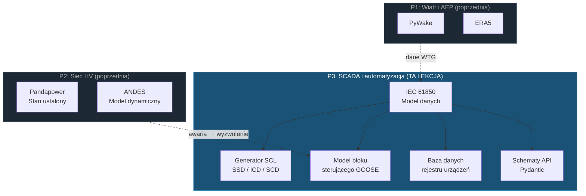

# Lekcja 009 — Model danych IEC 61850, generator SCL i rejestr urządzeń SCADA

!!! abstract "Nawigacja lekcji"
    :material-arrow-left: **Poprzednia:** [Lekcja 008 — Dynamiczna zgodność sieci: ANDES, FRT, częstotliwość, SSO i przetwornica](lesson-008.md) | **Następna:** [Lekcja 010 — Symulacja awarii GOOSE, oś czasu zabezpieczeń i API SCADA](lesson-010.md) :material-arrow-right:

    **Faza:** P3 | **Język:** Polski | **Postęp:** 10 z 19 | [Wszystkie lekcje](index.md) | [Mapa nauki](../../Learning_Roadmap.md)

> **Data:** 2026-02-25
> **Commity:** 1 commit (`c1ae105` → `c1ae105`)
> **Zakres commitów:** `c1ae105c5e572472ead18e88299129841e6ee689..c1ae105c5e572472ead18e88299129841e6ee689`
> **Faza:** P3 (SCADA & Automation)
> **Sekcje roadmapy:** [Phase 3 — Section 3.1 IEC 61850 — The Standard]
> **Język:** Polski
> **Poprzednia lekcja:** Lesson 008
> **last_commit_hash:** c1ae105c5e572472ead18e88299129841e6ee689

---

## Czego się nauczysz

- Zrozumienie pięciu warstw hierarchii danych IEC 61850 (Physical Device → Logical Device → Logical Node → Data Object → Data Attribute) i odpowiednika każdej warstwy w rzeczywistej rozdzielni
- Poznanie rozszerzenia IEC 61400-25 dla turbin wiatrowych (WTUR, WROT, WGEN, WMET, WNAC) i powodów, dla których standardowe klasy węzłów logicznych IEC 61850 nie wystarczają dla farm wiatrowych
- Stosowanie typów plików SCL (Substation Configuration Language) — SSD, ICD, SCD — oraz przepływu pracy inżynierskiej zgodnie z IEC 61850-6
- Projektowanie bloku sterującego GOOSE (Generic Object-Oriented Substation Event) — wysyłanie sygnału wyłączającego zabezpieczenie z opóźnieniem < 4 ms przez Ethernet warstwy 2
- Utrwalanie rejestru urządzeń w bazie danych za pomocą modeli ORM SQLAlchemy i migracji Alembic

---

## Rozdział 1: Hierarchia danych IEC 61850 — cyfrowy bliźniak rozdzielni

### Rzeczywisty problem

Wyobraź sobie szpital. W szpitalu są budynki, każdy budynek ma piętra, na każdym piętrze są oddziały (kardiologia, neurologia), na każdym oddziale są lekarze, a każdy lekarz ma swoje specjalizacje. Jeśli możesz powiedzieć „pokaż wyniki EKG dr. Kowalskiego z oddziału kardiologii" — uzyskujesz dostęp do informacji medycznych przez **ustrukturyzowaną hierarchię**.

Rozdzielnia działa według tej samej logiki. Zawiera dziesiątki inteligentnych urządzeń elektronicznych (IED — Intelligent Electronic Device). Każde IED ma funkcje logiczne (zabezpieczenia, pomiary, sterowanie), a każda funkcja ma punkty danych (napięcie, prąd, stan wyłącznika). IEC 61850 przekształca tę fizyczną strukturę w **cyfrowy model danych** — dzięki czemu urządzenia różnych producentów mówią tym samym językiem.

### Co mówią standardy

**IEC 61850** to nie protokół, lecz **model danych**. Ten sam model danych może być odwzorowany na trzy różne mechanizmy transportowe:

- **MMS (Manufacturing Message Specification):** komunikacja klient-serwer przez TCP/IP (polling SCADA)
- **GOOSE:** Ethernet warstwy 2 — bez routingu IP, opóźnienie < 4 ms (sygnały wyłączające zabezpieczenia)
- **Sampled Values (SV):** Ethernet warstwy 2 — przebiegi cyfrowe transformatorów prądowych/napięciowych

IEC 61850-7-4 definiuje klasy węzłów logicznych. IEC 61850-7-3 definiuje wspólne klasy danych (Common Data Classes — CDC). IEC 61850-7-2 definiuje abstrakcyjny interfejs usług komunikacyjnych (ACSI). IEC 61850-6 natomiast definiuje pliki konfiguracyjne (SCL) w formacie XML dla całej tej struktury.

### Co zbudowaliśmy

**Zmienione pliki:**

- `backend/app/services/p3/iec61850_model.py` — pełna hierarchia danych IEC 61850: 7 enumów, 7 dataclasses, 13 funkcji builder
- `backend/app/models/scada.py` — modele ORM SQLAlchemy (4 tabele)
- `backend/app/schemas/scada.py` — schematy API Pydantic (14 modeli)
- `backend/alembic/versions/c4d5e6f7a8b9_...py` — migracja bazy danych Alembic

Pięciowarstwową hierarchię zamodelowaliśmy jako `dataclass(frozen=True)` w Pythonie:

```
PhysicalDevice (IED)           → przekaźnik zabezpieczeń ABB REL670
└── LogicalDevice              → LD_Protection
    └── LogicalNode            → XCBR1 (wyłącznik)
        └── DataObject         → Pos (pozycja — typ DPC)
            └── DataAttribute  → stVal (wartość stanu — BOOLEAN)
```

### Dlaczego to ważne

> **Dlaczego** potrzebujemy pięciowarstwowej hierarchii?
> Ponieważ w rozdzielni istnieją setki punktów danych. Gdyby to była płaska lista, znalezienie odpowiedzi na pytanie „czy wyłącznik jest otwarty?" byłoby niemożliwe. Hierarchia odzwierciedla strukturę fizyczną w domenie cyfrowej, czyniąc ją **adresowalną**: `OSS_PROT_IED01/LD_Protection/XCBR1$Pos$stVal` — to jednoznacznie identyfikuje jedną wartość spośród wszystkich innych wartości na świecie.

> **Dlaczego** użyliśmy `dataclass(frozen=True)`?
> Model danych IEC 61850 jest konfiguracją — nie powinien zmieniać się w czasie wykonania. Struktura węzłów logicznych przekaźnika zabezpieczeń jest ustalana przez inżyniera systemu na etapie projektowania. `frozen=True` wymusza tę niezmienność (immutability) na poziomie Pythona — przypadkowe usunięcie lub zmiana węzła XCBR da błąd kompilatora.

### Analiza kodu

Zacznijmy od analizy struktury od najniższej warstwy hierarchii. Najpierw `DataAttribute` — to węzeł liścia przenoszący rzeczywistą wartość pomiarową:

```python
@dataclass(frozen=True)
class DataAttribute:
    """Leaf of the IEC 61850 hierarchy — a single typed value."""
    name: str                    # IEC 61850-7-3 nazwa: 'stVal', 'mag.f', 'q'
    data_type: DataAttributeType # Podstawowy typ danych: BOOLEAN, FLOAT32, etc.
    fc: FunctionalConstraint     # Ograniczenie funkcjonalne: ST, MX, CO, CF, SP, DC
    description: str             # Opis inżynierski
    unit: str = ""               # Jednostka inżynierska: 'kV', 'MW', 'Hz'
```

Koncepcja `FunctionalConstraint` (Ograniczenie funkcjonalne) jest specyficzna dla IEC 61850. Każdy atrybut danych jest pogrupowany według celu — dzięki temu klient SCADA może odczytywać tylko dane pomiarowe (MX), ale nie ma zezwolenia na wysyłanie poleceń sterujących (CO):

```python
class FunctionalConstraint(StrEnum):
    ST = "ST"  # Status — stan chwilowy (tylko do odczytu z klienta)
    MX = "MX"  # Measured value — pomiary analogowe
    CO = "CO"  # Control — polecenia wykonawcze (zapisywalne z klienta)
    CF = "CF"  # Configuration — ustawienia (zapisywalne przez inżyniera)
    SP = "SP"  # Setpoint — wartości nastawiane przez operatora
    DC = "DC"  # Description — statyczne informacje opisowe
```

Następnie warstwy `DataObject`, `LogicalNode`, `LogicalDevice` i na samej górze `PhysicalDevice` — każda opakowuje strukturę z warstwy wyższej. Ponieważ wszystkie warstwy mają `frozen=True`, raz zbudowana hierarchia nie może być nigdy zmieniona.

### Kluczowa koncepcja

!!! tip "Kluczowa koncepcja: Ograniczenie funkcjonalne (Functional Constraint)"
    **Prosto:** Pomyśl o aplikacji bankowej — przeglądanie salda i przelew wymagają różnych poziomów uprawnień. W IEC 61850 każdy punkt danych nosi podobną „etykietę uprawnień": ST = tylko odczyt, CO = steruj, CF = konfiguruj.

    **Analogia:** Jak system kart dostępu w hotelu. Karta gościa otwiera tylko jego pokój (ST — odczyt stanu). Karta recepcji otwiera wszystkie pokoje (CO — steruj). Karta konserwacji otwiera wszystkie pomieszczenia techniczne (CF — konfiguruj). Te same drzwi reagują inaczej na różne karty.

    **W tym projekcie:** `Pos.stVal` węzła XCBR1 w OSS_PROT_IED01 jest ograniczone do ST (odczyt pozycji wyłącznika), natomiast `Pos.ctlVal` ma ograniczenie CO (otwórz/zamknij wyłącznik). Operator HMI SCADA może przeglądać dane ST, ale wysłanie polecenia CO wymaga dodatkowej autoryzacji.

---

## Rozdział 2: IEC 61400-25 — węzły logiczne turbin wiatrowych

### Rzeczywisty problem

Standardowe IEC 61850 zostało zaprojektowane dla tradycyjnych rozdzielni — wyłączniki, jednostki pomiarowe, przekaźniki zabezpieczeń. Ale turbina wiatrowa nie jest ani wyłącznikiem, ani jednostką pomiarową. Turbina wewnętrznie generuje unikalne punkty danych, takie jak prędkość wirnika, kąt pitch łopat, temperatura gondoli, prędkość wiatru. Modelowanie tych danych za pomocą standardowych węzłów XCBR lub MMXU przypominałoby sytuację, w której lekarz rejestruje operację serca pod kodem „medycyna ogólna" — technicznie możliwe, ale prowadzi do utraty informacji.

### Co mówią standardy

**IEC 61400-25-2** rozszerza IEC 61850 dla turbin wiatrowych. Definiuje pięć specjalnych klas węzłów logicznych:

| Klasa LN | Pełna nazwa | Zakres |
|----------|-------------|--------|
| **WTUR** | Wind Turbine General | Stan pracy turbiny (stopped/running/error), całkowita energia |
| **WROT** | Wind Turbine Rotor | Prędkość wirnika [rpm], kąt pitch łopat [°] |
| **WGEN** | Wind Turbine Generator | Moc czynna [MW], moc bierna [MVAR] |
| **WMET** | Wind Turbine Meteorological | Prędkość wiatru [m/s], kierunek [°], temperatura [°C] |
| **WNAC** | Wind Turbine Nacelle | Temperatura gondoli [°C], kąt odchylenia [°] |

### Co zbudowaliśmy

**Zmienione pliki:**

- `backend/app/services/p3/iec61850_model.py` — funkcje builder `_build_wtur_ln()`, `_build_wrot_ln()`, `_build_wgen_ln()`, `_build_wmet_ln()`, `_build_wnac_ln()`

Każdy sterownik turbiny V236-15.0 MW zawiera te pięć węzłów w jednym urządzeniu logicznym `LD_Turbine`. 34 turbiny × 5 węzłów = 170 węzłów logicznych turbin wiatrowych.

### Dlaczego to ważne

> **Dlaczego** standardowe węzły IEC 61850 są niewystarczające?
> Ponieważ MMXU (ogólna jednostka pomiarowa) nie zna pojęcia „prędkość wirnika" ani „kąt pitch". Modelowanie tych punktów danych za pomocą GGIO (Generic I/O) jest możliwe, ale tracisz standaryzację — każdy producent nadaje inne nazwy, integracja SCADA staje się koszmarem. IEC 61400-25 wymaga, aby wszyscy producenci turbin wiatrowych używali tej samej struktury danych.

> **Dlaczego** użyliśmy krotek `frozen=True` zamiast list?
> Struktura węzłów logicznych turbiny jest ustalana w czasie projektowania i nie zmienia się w czasie wykonania. Użycie listy otwiera drzwi do mutacji `append()`, `remove()`, `sort()`. Krotka te drzwi zamyka — model danych jest zablokowany po jednorazowym zbudowaniu.

### Analiza kodu

Przeanalizujmy funkcję builder WTUR (Wind Turbine General) — ten węzeł raportuje stan pracy turbiny i całkowitą produkcję energii:

```python
def _build_wtur_ln(instance: int = 1) -> LogicalNode:
    """Build WTUR (Wind Turbine General) logical node per IEC 61400-25-2."""
    return LogicalNode(
        class_name="WTUR",
        instance=instance,
        category=LogicalNodeCategory.WIND,  # Kategoria 'W' — specyficzna dla wiatru
        description="Wind turbine general operating state",
        data_objects=(
            DataObject(
                name="TurSt",           # Turbine State
                cdc="INS",              # Integer Status — wartość enum
                description="Turbine operating state (stopped/running/error)",
                attributes=(
                    DataAttribute(
                        "stVal",                          # Wartość stanu
                        DataAttributeType.CODED_ENUM,     # Zakodowany enum
                        FunctionalConstraint.ST,          # Status — tylko do odczytu
                        "Operating state",
                    ),
                    # ... q (znacznik jakości) i t (znacznik czasu)
                ),
            ),
            DataObject(
                name="TotWh",           # Total Watt-hours
                cdc="BCR",              # Binary Counter Reading
                description="Total energy production [MWh]",
                attributes=(
                    DataAttribute(
                        "actVal",                    # Actual value
                        DataAttributeType.FLOAT32,
                        FunctionalConstraint.ST,
                        "Counter value",
                        "MWh",
                    ),
                ),
            ),
        ),
    )
```

Każdy sterownik turbiny jest tworzony w następujący sposób — zwróć uwagę, że adresy IP są automatycznie przypisywane do podsieci 192.168.2.x (urządzenia OSS są w 192.168.1.x):

```python
def build_wind_turbine_controller(turbine_number: int, ip_address: str = "") -> PhysicalDevice:
    if not 1 <= turbine_number <= NUM_TURBINES:  # Zakres 1-34
        msg = f"Turbine number must be 1-{NUM_TURBINES}, got {turbine_number}"
        raise ValueError(msg)

    if not ip_address:
        ip_address = f"192.168.2.{turbine_number}"  # Automatyczne IP: 192.168.2.1 - 192.168.2.34

    return PhysicalDevice(
        name=f"WTG_{turbine_number:02d}",  # WTG_01, WTG_02, ..., WTG_34
        equipment_type=EquipmentType.WTG_CONTROLLER,
        manufacturer="Vestas",
        model="V236-15.0",
        ip_address=ip_address,
        logical_devices=(
            LogicalDevice(
                inst="LD_Turbine",
                logical_nodes=(
                    _build_wtur_ln(1), _build_wrot_ln(1), _build_wgen_ln(1),
                    _build_wmet_ln(1), _build_wnac_ln(1),  # 5 LN na turbinę
                ),
            ),
        ),
    )
```

Końcowa funkcja `build_substation_configuration()` tworzy wszystkie 37 urządzeń (3 OSS + 34 WTG) jednym wywołaniem.

### Kluczowa koncepcja

!!! tip "Kluczowa koncepcja: Segmentacja podsieci IP"
    **Prosto:** Pomyśl o skrzynkach pocztowych w bloku. Każde piętro ma inny zakres numerów: pierwsze piętro 101-110, drugie 201-210. Listonosz wie, do którego korytarza iść na podstawie numeru piętra.

    **Analogia:** Urządzenia OSS (zabezpieczenia, pomiary, kontroler zatoki) żyją w podsieci 192.168.1.x — to „piętro zarządzania" rozdzielni. 34 sterowniki turbin są w podsieci 192.168.2.x — to „piętro produkcji". Segmentacja sieci zapewnia zarówno bezpieczeństwo (model stref IEC 62443), jak i zarządzanie ruchem.

    **W tym projekcie:** `192.168.1.10` (OSS Protection), `192.168.1.11` (OSS Measurement), `192.168.1.12` (Bay Controller) oraz `192.168.2.1` — `192.168.2.34` (34 turbiny). Łącznie 37 adresów IP, uporządkowanych w dwóch podsieciach.

---

## Rozdział 3: GOOSE — przesyłanie komunikatów czasu rzeczywistego dla sygnałów zabezpieczeń

### Rzeczywisty problem

Wyobraź sobie system alarmów przeciwpożarowych. Kiedy czujnik dymu wykryje ogień, nie dzwoni na centralę alarmową z komunikatem „na trzecim piętrze jest pożar, proszę otworzyć tryskacze" — to byłoby zbyt wolne. Zamiast tego wysyła sygnał bezpośrednio do centrali **okablowaniem bezpośrednim** i tryskacze otwierają się w ciągu milisekund.

GOOSE służy dokładnie do tego. Gdy przekaźnik zabezpieczeń wykrywa usterkę (np. zwarcie), wysłanie komunikatu przez TCP/IP do serwera SCADA z żądaniem „otwórz wyłącznik" zajmuje 100+ ms. GOOSE natomiast nadaje bezpośrednio przez Ethernet warstwy 2 — wszystkie zainteresowane urządzenia odbierają sygnał wyłączający w czasie < 4 ms.

### Co mówią standardy

**IEC 61850-8-1** definiuje sposób odwzorowania komunikatów GOOSE na Ethernet:

- **Multicast warstwy 2:** brak routingu IP — ramka Ethernet trafia bezpośrednio na docelowy adres MAC
- **Zakres adresów MAC multicast:** `01:0C:CD:01:00:00` — `01:0C:CD:01:01:FF` (IEC 61850-8-1 Annex A)
- **VLAN:** oddziela ruch GOOSE od normalnego ruchu SCADA (typowo: VLAN 100-199)
- **AppID:** każda publikacja GOOSE niesie unikalny identyfikator aplikacji (2-bajtowy hex)
- **Ponowna transmisja:** po pierwszym komunikacie odstępy rosną wykładniczo od min_time (2 ms) do max_time (1000 ms)

### Co zbudowaliśmy

**Zmienione pliki:**

- `backend/app/services/p3/iec61850_model.py` — klasy dataclass `GOOSEControlBlock`, `Dataset`, `DatasetMember` + funkcje builder

Zbudowaliśmy dwa podstawowe komponenty: (1) **Dataset** definiujący co będzie publikowane, oraz (2) **GOOSEControlBlock** definiujący jak będzie publikowane.

### Dlaczego to ważne

> **Dlaczego** GOOSE jest 200 razy szybszy niż polling SCADA?
> Polling SCADA używa stosu TCP/IP: aplikacja → TCP → IP → Ethernet. Każda warstwa dodaje opóźnienie, szczególnie trójdrożne uzgodnienie TCP i mechanizm potwierdzeń. GOOSE całkowicie pomija warstwy IP i TCP — wysyła bezpośrednio ramkę Ethernet. Jak krzyczenie zamiast wysyłania listu.

> **Dlaczego** wykładniczo rosnące odstępy ponownej transmisji?
> Pierwszy sygnał wyłączający jest krytyczny — wysyłany ponownie po 2 ms, potem po 4 ms, 8 ms, 16 ms... aż osiągnie 1000 ms i stabilizuje się. To równoważy niezawodność w pierwszej chwili (szybkie powtórzenia) z przepustowością sieci na dłuższą metę (wolniejsze powtórzenia). Nawet gdy dane się nie zmieniają, okresowe powtórzenia informują odbiorców, że nadawca „nadal żyje" (heartbeat).

### Analiza kodu

Dataset wyłączania definiuje, które punkty danych IED zabezpieczeń będą publikowane przez GOOSE:

```python
def build_oss_goose_trip_dataset(ied_name: str = "OSS_PROT_IED01") -> Dataset:
    """Dataset zawierający sygnały wyłączające zabezpieczeń."""
    return Dataset(
        name="TripDataset",
        description=f"Protection trip signals from {ied_name}",
        members=(
            # Pozycja wyłącznika: otwarty czy zamknięty?
            DatasetMember("LD_Protection", "XCBR1", "Pos", FunctionalConstraint.ST),
            # Czy zabezpieczenie nadprądowe zostało wyzwolone?
            DatasetMember("LD_Protection", "PTOC1", "Op", FunctionalConstraint.ST),
            # Czy zabezpieczenie odległościowe zostało wyzwolone?
            DatasetMember("LD_Protection", "PDIS1", "Op", FunctionalConstraint.ST),
            # Czy zabezpieczenie nadnapięciowe zostało wyzwolone?
            DatasetMember("LD_Protection", "PTOV1", "Op", FunctionalConstraint.ST),
        ),
    )
```

Blok sterujący GOOSE definiuje, w jaki sposób ten dataset jest publikowany przez Ethernet warstwy 2:

```python
def build_oss_goose_control_block(
    ied_name: str = "OSS_PROT_IED01",
    dataset_name: str = "TripDataset",
) -> GOOSEControlBlock:
    return GOOSEControlBlock(
        name="gcb_trip",
        app_id="0x0001",                         # Unikalny identyfikator aplikacji
        go_id=f"{ied_name}_220kV_BB_TRIP",       # Czytelny dla człowieka identyfikator
        dataset_name=dataset_name,
        mac_address="01:0C:CD:01:00:01",         # Adres MAC multicast IEC 61850-8-1 Annex A
        vlan_id=100,                              # VLAN zarezerwowany dla ruchu GOOSE
        min_time_ms=2,                            # Pierwsza ponowna transmisja: 2 ms
        max_time_ms=1000,                         # Maksymalna ponowna transmisja: 1 sekunda
        description="220 kV busbar protection trip GOOSE publisher",
    )
```

Zwróć uwagę: adres MAC `01:0C:CD:01:00:01` — ostatni bit pierwszego bajtu wynosi 1 (`01`), co oznacza adres multicast. Adresy MAC unicast kończą się parzyście (00, 02, 04...).

### Kluczowa koncepcja

!!! tip "Kluczowa koncepcja: Komunikacja warstwy 2 a warstwy 3"
    **Prosto:** Gdy chcesz coś powiedzieć koledze w tym samym biurze, nie piszesz e-maila — mówisz bezpośrednio. E-mail (warstwa 3/TCP/IP) jest niezawodny, ale wolny — wymaga rozwiązywania adresów, routingu, potwierdzeń. Mówienie (warstwa 2/GOOSE) jest natychmiastowe, ale słyszą tylko osoby w tym samym pokoju (w tym samym segmencie Ethernet).

    **Analogia:** TCP/IP = firma kurierska (numer śledzenia, potwierdzenie dostawy, ponowna wysyłka). GOOSE = krzyczenie przez megafon (wszyscy słyszą natychmiast, ale tylko osoby w pobliżu). Dla sygnału wyłączającego zabezpieczenie megafon wystarczy — wszystkie urządzenia w tej samej rozdzielni są w tym samym segmencie Ethernet.

    **W tym projekcie:** Gdy OSS_PROT_IED01 wykrywa usterkę, multicastuje TripDataset przez GOOSE. Kontroler zatoki (OSS_BAY_CTRL01) i brama SCADA nasłuchują tej ramki GOOSE i reagują w czasie < 4 ms. Przy pollingu TCP/IP czas ten wynosiłby 100+ ms — nie do zaakceptowania dla inżynierów zabezpieczeń.

---

## Rozdział 4: SCL — specyfikacja XML rozdzielni

### Rzeczywisty problem

Budujesz dom. Architekt robi projekt (plan domu), każdy dostawca mebli podaje wymiary swoich szafek (katalog kuchenny), a generalny wykonawca łączy wszystko w jednym pliku „projektu budowlanego". Bez tych trzech typów dokumentów glazurnik tnie kafelki w złym rozmiarze, a hydraulik układa rury do zlewu zamiast do kuchni.

IEC 61850-6 SCL (Substation Configuration Language) jest dokładnie takim „systemem dokumentów":

- **SSD** = Plan domu (topologia rozdzielni)
- **ICD** = Katalog producenta (możliwości jednego IED)
- **SCD** = Projekt budowlany wykonawcy (wszystko połączone)

### Co mówią standardy

**IEC 61850-6** definiuje strukturę plików SCL jako schemat XML. Kluczowe sekcje:

| Sekcja XML | Zawartość | W którym pliku SCL |
|------------|-----------|-------------------|
| `<Header>` | Identyfikator pliku, wersja, informacje o narzędziu | Wszystkich |
| `<Substation>` | Topologia fizyczna: poziomy napięcia, zatoki | SSD, SCD |
| `<IED>` | Konfiguracja IED: LD, LN, dataset, GOOSE | ICD, SCD |
| `<Communication>` | Adresowanie sieciowe: IP, multicast GOOSE, VLAN | SCD |
| `<DataTypeTemplates>` | Definicje typów LN: LNodeType, DOType, DAType | ICD, SCD |

Przepływ pracy inżynierskiej: **SSD** → każdy producent dostarcza **ICD** → integrator systemu łączy wszystko w **SCD**.

### Co zbudowaliśmy

**Zmienione pliki:**

- `backend/app/services/p3/scl_generator.py` — funkcje `generate_ssd()`, `generate_icd()`, `generate_scd()` + funkcje pomocnicze

Moduł generatora produkujący trzy typy plików SCL. Używa `xml.etree.ElementTree` do tworzenia XML z przestrzenią nazw SCL (`http://www.iec.ch/61850/2003/SCL`).

### Dlaczego to ważne

> **Dlaczego** pliki SCL są krytyczne?
> Zapewniają konfigurację niezależną od producenta (vendor-neutral). ABB, Siemens, SEL lub Hitachi Energy — IED różnych producentów są konfigurowane przez ten sam schemat SCL. Integrator systemu może konfigurować cały system z pliku SCD bez konieczności znajomości producenta IED.

> **Dlaczego** generujemy uproszczone SCL?
> Przemysłowe narzędzie SCL (ABB PCM600, Siemens DIGSI 5) zawiera 200+ elementów XML i walidację XSD. Nasze edukacyjne SCL uczy koncepcji strukturalnych — to właśnie te części testują rozmówcy kwalifikacyjni: Header, topologia Substation, struktura IED, sekcja Communication, DataTypeTemplates.

### Analiza kodu

Przeanalizujmy zarządzanie przestrzenią nazw SCL — to najbardziej krytyczny detal produkcji XML:

```python
SCL_NAMESPACE = "http://www.iec.ch/61850/2003/SCL"
SCL_VERSION = "2007"
SCL_REVISION = "B"

# Rejestracja przestrzeni nazw, aby uniknąć prefiksów ns0:
ET.register_namespace("", SCL_NAMESPACE)

def _ns(tag: str) -> str:
    """Wrap a tag with the SCL namespace."""
    return f"{{{SCL_NAMESPACE}}}{tag}"  # → {http://www.iec.ch/61850/2003/SCL}SCL
```

Generator SSD (System Specification Description) tworzy fizyczną topologię rozdzielni — 7 zatok po stronie 66 kV (każda dla jednego ciągu kablowego) i 3 zatoki po stronie eksportowej 220 kV (eksport, transformator, STATCOM):

```python
def generate_ssd(
    substation_name: str = "Baltic_Wind_Alpha_OSS",
    voltage_levels_kv: tuple[float, ...] = (66.0, 220.0),
    num_bays_per_level: dict[float, int] | None = None,
) -> ET.Element:
    if num_bays_per_level is None:
        num_bays_per_level = {66.0: 7, 220.0: 3}  # 7 ciągów array + 3 zatoki eksportowe

    root = _create_scl_root()
    _add_header(root, f"{substation_name}_SSD")

    substation = ET.SubElement(root, _ns("Substation"))
    substation.set("name", substation_name)
    substation.set("desc", "510 MW Baltic Sea Offshore Wind Farm — Offshore Substation")
    # ... dodawane są poziomy napięcia i zatoki
```

SCD (Substation Configuration Description) łączy wszystkie elementy — topologia SSD + wszystkie IED + adresy komunikacyjne GOOSE:

```python
def generate_scd(substation_name, devices, goose_control_blocks=None, datasets=None):
    root = _create_scl_root()
    _add_header(root, f"{substation_name}_SCD")

    # 1. Topologia rozdzielni (sekcja SSD)
    substation = ET.SubElement(root, _ns("Substation"))
    # ... poziomy napięcia 66 kV i 220 kV

    # 2. Sekcja Communication — adresowanie multicast GOOSE
    comm = ET.SubElement(root, _ns("Communication"))
    for device in devices:
        # Dla każdego urządzenia: SubNetwork, ConnectedAP, IP i adresy GOOSE
        ...

    # 3. Sekcje IED — pełna konfiguracja każdego urządzenia
    for device in devices:
        ied = ET.SubElement(root, _ns("IED"))
        # ... LD, LN, Dataset, GSEControl
```

Funkcja `validate_scl_structure()` wykonuje podstawowe kontrole strukturalne: poprawny tag root, obecność Header, co najmniej jeden Substation lub IED, poprawna wersja/rewizja. To nie jest pełna walidacja XSD, ale podstawowa kontrola stanu.

### Kluczowa koncepcja

!!! tip "Kluczowa koncepcja: Przestrzeń nazw XML"
    **Prosto:** Dwa różne kraje mogą mieć obywateli z tym samym numerem identyfikacyjnym — „TC 12345" to jedna osoba w Turcji, „PL 12345" to inna osoba w Polsce. Przestrzeń nazw określa, według zasad którego kraju (którego standardu) pracujesz.

    **Analogia:** Tag `<Substation>` może pojawić się w wielu różnych standardach XML. Ale `{http://www.iec.ch/61850/2003/SCL}Substation` to definitywnie Substation z normy IEC 61850 SCL. Przestrzeń nazw to „paszport" tagu.

    **W tym projekcie:** Wywołanie `ET.register_namespace("", SCL_NAMESPACE)` sprawia, że XML produkowany przez Pythona pisze `Substation` zamiast `ns0:Substation` — ponieważ domyślną przestrzenią nazw jest IEC 61850 SCL. Zapewnia to, że generowany plik pozostaje kompatybilny z narzędziami przemysłowymi jak ABB PCM600.

---

## Rozdział 5: Trwałość bazy danych — ORM i migracja

### Rzeczywisty problem

Model danych IEC 61850, który dotąd zbudowaliśmy, żyje w pamięci — gdy proces Pythona zostanie zamknięty, wszystko znika. System SCADA pracuje 24/7, a inwentarz urządzeń musi być trwały. Jakie IED istnieją? Jakie węzły logiczne posiadają? Jakie bloki sterujące GOOSE są skonfigurowane? Te informacje muszą być przechowywane w bazie danych.

### Co mówią standardy

IEC 61850 samo w sobie nie definiuje struktury bazy danych — standard dotyczy komunikacji i modelu danych. Jednak w praktyce przemysłowej każdy system SCADA prowadzi **bazę danych rejestru urządzeń**. Ta baza danych przechowuje bieżący inwentarz urządzeń i konfigurację niezależnie od plików SCL.

### Co zbudowaliśmy

**Zmienione pliki:**

- `backend/app/models/scada.py` — 4 modele ORM SQLAlchemy: `IEC61850Device`, `IEC61850LogicalNode`, `GOOSEControlBlockRecord`, `SCLFile`
- `backend/app/schemas/scada.py` — 14 schematów Pydantic: serializacja żądań/odpowiedzi API
- `backend/alembic/versions/c4d5e6f7a8b9_...py` — migracja Alembic: tworzenie 4 tabel

### Dlaczego to ważne

> **Dlaczego** nie zapisaliśmy Data Objects i Data Attributes do bazy danych?
> Ponieważ to świadoma decyzja projektowa. 37 urządzeń × średnio 5 LN × średnio 4 DO × średnio 3 DA = ~2200 wierszy Data Attribute. Ta liczba wydaje się możliwa do zarządzania, ale w rzeczywistych systemach z 500+ IED daje 100.000+ wierszy. Struktura DO/DA jest zdefiniowana przez standard — nie zmienia się. Dlatego **model kodu** (Python dataclass) definiuje strukturę DO/DA, a **baza danych** przechowuje tylko inwentarz urządzeń (które IED, które LN). Plik SCL jest generowany na żądanie.

> **Dlaczego** użyliśmy `cascade="all, delete-orphan"`?
> Gdy IED jest usuwane, wszystkie jego węzły logiczne i bloki sterujące GOOSE powinny być też usunięte — inaczej pozostają „osierocone" (orphan) rekordy. `delete-orphan` dokładnie to robi: usuń rekord nadrzędny → rekordy podrzędne czyszczone automatycznie.

### Analiza kodu

Przeanalizujmy model ORM `IEC61850Device` — to podstawowa tabela inwentarza IED:

```python
class IEC61850Device(Base):
    """IEC 61850 Physical Device (IED) registry entry."""
    __tablename__ = "iec61850_device"

    id: Mapped[uuid.UUID] = mapped_column(primary_key=True, default=uuid.uuid4)
    name: Mapped[str] = mapped_column(
        String(50), unique=True,  # Każda nazwa IED musi być unikalna
        comment="IED instance name, e.g. 'OSS_PROT_IED01', 'WTG_01'",
    )
    equipment_type: Mapped[str] = mapped_column(String(30))  # protection_ied, wtg_controller, etc.
    manufacturer: Mapped[str] = mapped_column(String(50))     # ABB, Vestas
    model: Mapped[str] = mapped_column(String(50))            # REL670, V236-15.0
    ip_address: Mapped[str] = mapped_column(String(15))       # IP stacji MMS

    # Relacje — automatyczne usuwanie przez cascade
    logical_nodes: Mapped[list[IEC61850LogicalNode]] = relationship(
        back_populates="device", cascade="all, delete-orphan",
    )
    goose_control_blocks: Mapped[list[GOOSEControlBlockRecord]] = relationship(
        back_populates="device", cascade="all, delete-orphan",
    )
```

Godna uwagi struktura w schematach Pydantic: odzwierciedlenie hierarchii danych w API:

```python
class PhysicalDeviceSchema(BaseModel):
    """API representation of an IEC 61850 Physical Device (IED)."""
    name: str
    equipment_type: str
    manufacturer: str
    model: str
    logical_devices: list[LogicalDeviceSchema]  # Zagnieżdżona hierarchia
    ip_address: str = ""
    description: str = ""
```

Schemat `SubstationSummaryResponse` podsumowuje całą rozdzielnię w jednej odpowiedzi API — łączna liczba urządzeń, liczba LN, liczba bloków GOOSE oraz szczegóły wszystkich urządzeń:

```python
class SubstationSummaryResponse(BaseModel):
    total_devices: int       # 37
    total_logical_nodes: int # 178 (6 + 1 + 2 + 34×5)
    protection_ieds: int     # 1
    measurement_ieds: int    # 1
    bay_controllers: int     # 1
    wtg_controllers: int     # 34
    goose_control_blocks: int
    devices: list[PhysicalDeviceSchema]
```

Plik migracji Alembic konwertuje ten schemat do tabel PostgreSQL. `ForeignKey("iec61850_device.id", ondelete="CASCADE")` definiuje kaskadowe usuwanie na poziomie bazy danych — cascade ORM + cascade DB działają razem zapewniając podwójne bezpieczeństwo.

### Kluczowa koncepcja

!!! tip "Kluczowa koncepcja: Rozdzielenie modelu kodu i modelu bazy danych"
    **Prosto:** Pomyśl o półkach w bibliotece. Katalog biblioteczny (baza danych) przechowuje informacje, które książki są na których półkach. Ale nie przechowuje w katalogu zawartości książek (struktury Data Object/Attribute) — treść jest już w samej książce (model kodu). Katalog się zmienia (nowa książka, stara wycofana), ale treść książki się nie zmienia.

    **Analogia:** Dowód rejestracyjny samochodu (baza danych) rejestruje tablicę, markę/model, właściciela. Ale przechowywanie schematu silnika (modelu danych) w dowodzie byłoby bez sensu — schemat silnika jest w dokumentacji technicznej producenta (model kodu) i jest taki sam dla każdego samochodu tego modelu.

    **W tym projekcie:** Tabela `iec61850_device` → „które IED istnieją?" Tabela `iec61850_logical_node` → „które LN są przypisane?" Ale fakt, że węzeł `XCBR1` ma obiekty danych `Pos`, `BlkOpn`, `CBOpCap` nie jest w bazie danych — jest w funkcji `_build_xcbr_ln()`. Ponieważ ta informacja jest utrwalona przez normę IEC 61850-7-4.

---

## Powiązania

**Gdzie te koncepcje będą użyte w kolejnych lekcjach:**

- **Hierarchia danych IEC 61850 (Rozdział 1)** → Symulacja GOOSE w P3 będzie używać tej hierarchii do publikowania zdarzeń w czasie rzeczywistym
- **Węzły IEC 61400-25 (Rozdział 2)** → Moduły prognozowania AI w P4 będą używać danych WTUR.TurSt, WGEN.TotW i WMET.HorWdSpd jako danych wejściowych
- **Blok sterujący GOOSE (Rozdział 3)** → Symulacja zabezpieczeń w P3 będzie weryfikować sekwencję komunikatów GOOSE i poprawność czasową
- **Generator SCL (Rozdział 4)** → Proces uruchomienia w P5 użyje pliku SCD do weryfikacji konfiguracji urządzeń
- **Modele ORM (Rozdział 5)** → Endpointy API P3 będą używać tych modeli do operacji CRUD
- **Most z Lekcji 008:** Dynamiczny model sieci ANDES zamodelowany w P2 określa „kiedy przekaźnik zabezpieczeń powinien wyzwolić". W tej lekcji modelujemy „jak sygnał wyłączający jest przekazywany" (GOOSE).

---

## Szerszy obraz

*Skupienie tej lekcji: **budowanie fundamentów infrastruktury danych SCADA P3 — hierarchia urządzeń IEC 61850, model komunikatów GOOSE, pliki konfiguracyjne SCL i trwałość bazy danych**.*



*Pełna architektura systemu — patrz strona [Przegląd lekcji](index.md#system-architecture).*

---

## Kluczowe wnioski

1. **IEC 61850 to model danych, nie protokół** — ta sama hierarchia może być transportowana przez MMS (TCP/IP), GOOSE (warstwa 2) i Sampled Values (warstwa 2)
2. **Pięciowarstwowa hierarchia** (Physical Device → Logical Device → Logical Node → Data Object → Data Attribute) odzwierciedla fizyczną strukturę rozdzielni w domenie cyfrowej — każdy punkt danych ma unikalny adres
3. **IEC 61400-25** rozszerza standardowe IEC 61850 dla turbin wiatrowych — węzły WTUR, WROT, WGEN, WMET, WNAC są wspólne dla wszystkich producentów
4. **Ograniczenia funkcjonalne** (ST, MX, CO, CF, SP, DC) klasyfikują dostęp do danych według celu — operator może odczytywać dane pomiarowe (MX), ale polecenie sterujące (CO) wymaga dodatkowej autoryzacji
5. **GOOSE przez Ethernet warstwy 2 z opóźnieniem < 4 ms** wysyła sygnały wyłączające zabezpieczenia — 200 razy szybszy niż polling TCP/IP, ponieważ pomija warstwy IP i TCP
6. **Pliki SCL** (SSD → ICD → SCD) zapewniają konfigurację niezależną od producenta — integrator systemu zarządza wszystkimi IED z jednego pliku SCD
7. **Rozdzielenie modelu kodu i bazy danych**: niezmieniana struktura (DO/DA) jest definiowana w kodzie, zmieniany inwentarz (które IED, które LN) jest przechowywany w bazie danych — zapobiega niepotrzebnemu rozrostowi o 10.000+ wierszy

---

## Zalecane lektury

*[Mapa nauki](../../Learning_Roadmap.md) — Faza 3: SCADA i automatyzacja przemysłowa*

| Źródło | Typ | Dlaczego warto przeczytać |
|--------|-----|--------------------------|
| Seria IEC 61850 (Part 7-3, 7-4, 6) | Norma | Oficjalne źródło modelu danych i struktury SCL użytych w tej lekcji |
| Mackiewicz — *Overview of IEC 61850 and Benefits* | Artykuł konferencyjny | Podsumowuje zalety IEC 61850 względem tradycyjnego SCADA — idealny do przygotowania do rozmowy kwalifikacyjnej |
| Kim et al. (2017) — *Communication Architecture for CPS Wind Energy Systems* | Artykuł naukowy | Specjalistyczna praca o zastosowaniu IEC 61850 w systemach energetyki wiatrowej |
| libiec61850 Open Source Library | Oprogramowanie | Prawdziwy stos IEC 61850 — możesz przejrzeć przykłady publikacji GOOSE i serwera MMS |
| Hitachi Energy — *IEC 61850 Knowledge Base* | Artykuły techniczne | Noty aplikacyjne ABB/Hitachi Energy dotyczące przekaźników takich jak REL670, REC670 |

---

## Sprawdzian — przetestuj swoje zrozumienie

### Pytania pamięciowe

**P1:** Wymień pięć warstw hierarchii danych IEC 61850 od góry do dołu.

<details>
<summary>Odpowiedź</summary>

Physical Device (IED) → Logical Device → Logical Node → Data Object → Data Attribute. Od góry do dołu: urządzenie fizyczne jest najbardziej ogólne, atrybut danych jest najbardziej szczegółowy. Przykład: `OSS_PROT_IED01/LD_Protection/XCBR1/Pos/stVal` — wyraża chwilową wartość pozycji jednego wyłącznika.

</details>

**P2:** Napisz nazwy i zadania pięciu klas węzłów logicznych turbin wiatrowych zdefiniowanych przez IEC 61400-25.

<details>
<summary>Odpowiedź</summary>

WTUR (ogólny stan turbiny — praca/zatrzymanie/błąd), WROT (wirnik — prędkość i kąt pitch), WGEN (generator — moc czynna i bierna), WMET (meteorologia — prędkość wiatru, kierunek, temperatura), WNAC (gondola — temperatura i kąt odchylenia). Te pięć węzłów obejmuje wszystkie podstawowe punkty danych, które turbina wiatrowa prezentuje SCADA.

</details>

**P3:** Co oznaczają `min_time_ms=2` i `max_time_ms=1000` w komunikatach GOOSE?

<details>
<summary>Odpowiedź</summary>

Po wysłaniu pierwszego komunikatu GOOSE jest on ponownie transmitowany po 2 ms, następnie po 4 ms, 8 ms, 16 ms... rosnąc wykładniczo i stabilizując się na 1000 ms. Ten mechanizm równoważy niezawodność w krytycznej pierwszej chwili (szybkie powtórzenia) z przepustowością sieci na dłuższą metę (wolniejsze powtórzenia). Nawet gdy dane się nie zmieniają, periodyczne powtórzenia są kontynuowane (heartbeat).

</details>

### Pytania rozumienia

**P4:** Dlaczego przechowujemy informacje o Data Objects i Data Attributes w modelu kodu Pythona zamiast w bazie danych?

<details>
<summary>Odpowiedź</summary>

Ponieważ struktura DO/DA jest zdefiniowana przez normy IEC 61850-7-3 i 7-4 i jest niezmienna — XCBR zawsze ma obiekty danych Pos, BlkOpn, CBOpCap. Przechowywanie tych informacji w bazie danych generuje 37 urządzeń × 178 LN × średnio 4 DO × 3 DA = ~2200+ niepotrzebnych wierszy. W dużych systemach (500+ IED) liczba ta przekracza 100.000. Przechowywanie niezmiennych informacji w kodzie, a zmiennego inwentarza w bazie danych — to zasada separation of concerns: przechowywanie we właściwej warstwie.

</details>

**P5:** Dlaczego GOOSE używa Ethernetu warstwy 2 zamiast TCP/IP? Która właściwość TCP jest wadą dla sygnałów zabezpieczeń?

<details>
<summary>Odpowiedź</summary>

Trójdrożne uzgodnienie TCP (SYN → SYN-ACK → ACK) dodaje 1-3 ms opóźnienia przy nawiązywaniu połączenia. Następnie dla każdego komunikatu czekane jest potwierdzenie (ACK) — w przypadku utraty pakietu opóźnienie retransmisji może wynosić 100+ ms. Dla inżynierów zabezpieczeń typowy czas otwarcia wyłącznika po awarii powinien wynosić 60-80 ms. Opóźnienie wprowadzane przez TCP pochłania ten budżet. GOOSE całkowicie pomija warstwy IP i TCP wysyłając surową ramkę Ethernet — nie jest nawet potrzebna rozdzielczość ARP, ponieważ używany jest adres MAC multicast.

</details>

**P6:** Wyjaśnij logikę sekwencji SSD → ICD → SCD w przepływie pracy inżynierskiej SCL. Dlaczego nie można zacząć od ICD?

<details>
<summary>Odpowiedź</summary>

SSD (System Specification Description) definiuje fizyczną topologię rozdzielni — ile poziomów napięcia, ile zatok, jakie wyposażenie i gdzie. To „plan domu" i jest niezależny od IED. ICD (IED Capability Description) definiuje możliwości jednego IED — dostarcza go producent. Gdybyś zaczął od ICD, nie wiedziałbyś, gdzie umieścić IED — „mam szafki, ale nie mam planu domu". SCD łączy oba elementy i dodaje adresowanie komunikacyjne. Sekwencja opiera się na logice ogólne → szczegółowe → połączone.

</details>

### Pytanie wyzwanie

**P7:** W farmie wiatrowej Baltic Wind Alpha wszystkie 34 turbiny pracują jednocześnie przy pełnej mocy (510 MW), gdy na szynach 220 kV dochodzi do trójfazowego zwarcia. Napisz chronologicznie sekwencję komunikatów GOOSE: które IED wysyła który sygnał z którego LN, kto odbiera, co się dzieje? Oblicz budżet opóźnień.

<details>
<summary>Odpowiedź</summary>

1. **T=0 ms:** Dochodzi do awarii. MMXU1 w OSS_PROT_IED01 wykrywa anomalie prądu i napięcia.
2. **T=2-5 ms:** PDIS1 (zabezpieczenie odległościowe) wykonuje obliczenie impedancji, awaria wykryta w strefie 1 (< 80% długości linii). `PDIS1.Op.general = TRUE`. Jednocześnie PTOC1 (nadprądowe) generuje polecenie wyłączające.
3. **T=5-6 ms:** OSS_PROT_IED01 publikuje TripDataset przez GOOSE: `{XCBR1.Pos, PTOC1.Op, PDIS1.Op, PTOV1.Op}`. MAC: `01:0C:CD:01:00:01`, AppID: `0x0001`, VLAN: 100.
4. **T=6-8 ms:** Ramka GOOSE dociera do wszystkich subskrybentów przez przełącznik warstwy 2. OSS_BAY_CTRL01 otwiera wyłącznik zatoki STATCOM.
5. **T=8-10 ms:** XCBR1.Pos → OFF (otwarty). Rozpoczyna się ponowna transmisja: 2 ms, 4 ms, 8 ms...
6. **T=60-80 ms:** Fizyczne styki wyłącznika całkowicie się otwierają (mechaniczny czas otwarcia).

**Łączny budżet opóźnień:** Wykrycie awarii (2-5 ms) + publikacja GOOSE (1-2 ms) + transmisja sieciowa (< 1 ms) + przetwarzanie logiczne (1-2 ms) + mechaniczne otwarcie (50-70 ms) = ~55-80 ms. Spełniona jest klasa wydajności P1 IEC 61850-5 (czas wyłączenia < 100 ms).

</details>

---

## Kącik rozmowy kwalifikacyjnej

### Wyjaśnij prosto
*„Jak wytłumaczysz model danych IEC 61850 osobie niebędącej inżynierem?"*

Rozdzielnia to „węzeł drogowy" sieci elektroenergetycznej — elektryczność z różnych kierunków spotyka się tutaj, jest kierowana i dystrybuowana. Wewnątrz dziesiątki inteligentnych urządzeń: niektóre mierzą elektryczność, inne otwierają wyłączniki w momencie zagrożenia, inne zbierają dane z turbin wiatrowych.

Kiedyś każde z tych urządzeń mówiło własnym językiem — urządzenie ABB nie mogło porozumieć się z urządzeniem Siemens. IEC 61850 stworzył wspólny „język" dla tych urządzeń. Każde urządzenie raportuje to, co mierzy lub steruje, w tym samym formacie. Gdy urządzenie mówi „wyłącznik otwarty", bez względu na producenta, wszyscy rozumieją to samo.

Najważniejszą cechą tego języka jest szybkość. Wysłanie wiadomości przez normalną sieć komputerową zajmuje ponad 100 milisekund. Ale w przypadku zwarcia wyłącznik musi otworzyć się w ciągu kilku milisekund — inaczej sprzęt ulega uszkodzeniu. Specjalny system komunikatów IEC 61850 o nazwie GOOSE omija protokoły internetowe i wysyła sygnał bezpośrednio przez kabel sieciowy. To jak krzyczenie zamiast wysyłania e-maila — dociera natychmiast.

### Wyjaśnij technicznie
*„Jak wyjaśnisz model danych IEC 61850 panelowi rozmowy kwalifikacyjnej?"*

IEC 61850 definiuje obiektowo zorientowany model danych dla systemów automatyki stacji elektroenergetycznych. Pięciowarstwowa hierarchia — Physical Device, Logical Device, Logical Node, Data Object, Data Attribute — odwzorowuje strukturę fizycznego obiektu bezpośrednio na model cyfrowy. Każda warstwa jest definiowana przez inną część IEC 61850: Part 7-4 klasy LN, Part 7-3 szablony CDC (Common Data Class), Part 7-2 usługi ACSI (Abstract Communication Service Interface), a Part 6 język konfiguracji SCL.

W naszej implementacji w tym projekcie zamodelowaliśmy kompletną hierarchię 37 IED (3 OSS + 34 WTG) jako Python `dataclass(frozen=True)`. Wybór frozen dataclass jest świadomy: model danych IEC 61850 jest artefaktem konfiguracyjnym — niedopuszczanie do mutacji w czasie wykonania wymusza na poziomie kodu przepływ pracy inżynierskiej (zaprojektuj → skonfiguruj → zamroź → uruchom).

Po stronie turbin wiatrowych zastosowaliśmy rozszerzenie IEC 61400-25-2 — węzły logiczne WTUR, WROT, WGEN, WMET, WNAC zapewniają znormalizowane punkty danych SCADA dla każdej turbiny. Nasz model bloku sterującego GOOSE spełnia cel opóźnienia < 4 ms dzięki adresowaniu multicast warstwy 2 (IEC 61850-8-1 Annex A) i mechanizmowi wykładniczo rosnących ponownych transmisji. Nasz generator SCL produkuje pliki SSD, ICD i SCD zgodne ze schematem IEC 61850-6 Edition 2. W projekcie bazy danych podjęliśmy świadomą decyzję o denormalizacji: niezmieniana struktura DO/DA jest definiowana w modelu kodu, zmieniany inwentarz urządzeń jest przechowywany w PostgreSQL — zapobiega to problemowi zapytań N+1 i rozrostowi wierszy.
