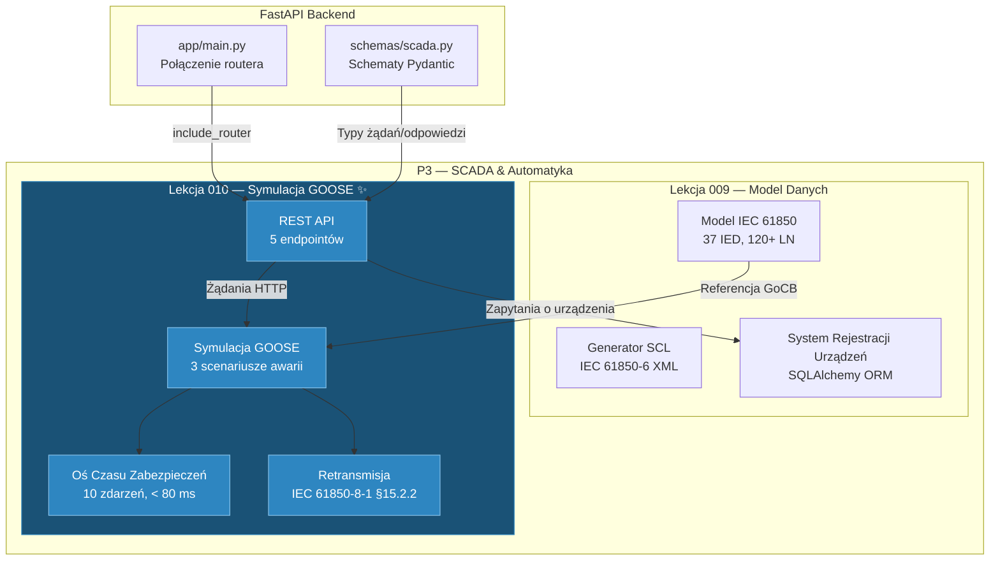

# Lekcja 010 — Symulacja Awarii GOOSE, Oś Czasu Zabezpieczeń i Endpointy SCADA API

!!! abstract "Nawigacja Lekcji"
    :material-arrow-left: **Poprzednia:** [Lekcja 009 — Model Danych IEC 61850, Generator SCL i System Rejestracji Urządzeń SCADA](lesson-009.md) | **Następna:** [Lekcja 011 — IEC 62443 RBAC i 9-Stanowy Cykl Życia Permit-to-Work](lesson-011.md) :material-arrow-right:

    **Faza:** P3 | **Język:** Polski | **Postęp:** 10 z 19 | [Wszystkie lekcje](index.md) | [Plan nauki](../../Learning_Roadmap.md)

> **Data:** 2026-02-25
> **Commity:** 1 commit (`c085bcb` → `c085bcb`)
> **Zakres commitów:** `c085bcba164e63a440229a95346198f33ca9c04b..c085bcba164e63a440229a95346198f33ca9c04b`
> **Faza:** P3 (SCADA & Automation)
> **Sekcje roadmapy:** [Phase 3 — Section 3.1 IEC 61850 — The Standard, Phase 2 — Section 2.2 Power System Protection]
> **Język:** Polski
> **Poprzednia lekcja:** Lesson 009
> **last_commit_hash:** c085bcba164e63a440229a95346198f33ca9c04b

---

## Czego się nauczysz

- Dlaczego protokół GOOSE (Generic Object-Oriented Substation Event) działa na poziomie warstwy 2 Ethernet oraz dlaczego stosuje model publikuj-subskrybuj (publish-subscribe) zamiast TCP/IP
- Modelowanie osi czasu usuwania zwarcia (fault clearance timeline) z rozdzielczością milisekundową: wykrycie → przetwarzanie przez przekaźnik → publikacja GOOSE → otwarcie wyłącznika → wygaszenie łuku
- Obliczanie harmonogramu retransmisji zgodnie z IEC 61850-8-1 §15.2.2 przy użyciu algorytmu wykładniczego cofania (exponential backoff)
- Porównanie trzech scenariuszy awarii (nadprąd na szynie, różnicowy transformatora, zwarcie doziemne kabla) i zrozumienie różnic między funkcjami zabezpieczeń
- Projektowanie endpointów REST FastAPI ze schematami Pydantic i weryfikacja ich za pomocą 47 testów jednostkowych

---

## Sekcja 1: Protokół GOOSE — Dlaczego każda milisekunda ma znaczenie

### Problem z realnego świata

Wyobraź sobie straż pożarną. Kiedy alarm pożarowy dzwoni, strażacy nie mogą dzwonić do centrali i pytać: „Czy jest pożar? Gdzie? Który oddział powinien jechać?" — to byłby model TCP/IP (nawiąż połączenie → wyślij żądanie → czekaj na odpowiedź). Zamiast tego alarm rozlega się jednocześnie z głośników w całej strażnicy: „Pożar! Blok A, piętro 3!" Każdy strażak słyszy tę wiadomość równocześnie. To właśnie jest GOOSE — model **publikuj-subskrybuj** (publish-subscribe). Publikujące IED umieszcza wiadomość w sieci Ethernet, wszyscy subskrybenci odbierają ją natychmiast. Bez routingu, bez uzgadniania (handshake), bez czekania.

Dlaczego taki pośpiech? Gdy dochodzi do zwarcia na szynie 220 kV, energia łuku rośnie według wzoru **I² × t**. Na szynie z nominalnym prądem 1200 A, gdy przepływa prąd zwarciowy 2,5-krotnie wyższy (3000 A), każda dodatkowa milisekunda może uszkodzić aparaturę. Norma IEC 62271-100 wymaga, aby całkowity czas usunięcia zwarcia dla 220 kV wynosił **poniżej 80 ms** — w przeciwnym razie sprzęt może ulec zniszczeniu.

### Co mówią standardy

**IEC 61850-8-1** definiuje protokół GOOSE:

- **Warstwa transportu:** Ethernet warstwa 2 (EtherType 0x88B8) — bez routingu IP
- **Adresowanie:** Adres MAC multicast `01:0C:CD:01:xx:xx` (IEC 61850-8-1 Annex A)
- **Model:** Publikuj-subskrybuj (publish-subscribe) — publikujące IED wysyła, wszyscy subskrybenci odbierają
- **Wymaganie dotyczące opóźnienia:** < 4 ms od końca do końca (od wydawcy do subskrybenta)
- **Niezawodność:** Brak potwierdzeń TCP — zamiast tego retransmisja z wykładniczym cofaniem

**IEC 62271-100** definiuje czasy usuwania zwarcia dla wysokonapięciowych wyłączników:

- Zwarcie na szynie 220 kV: całkowity czas < 80 ms
- Czas mechaniczny wyłącznika: 20–60 ms (mechanizm sprężynowy)
- Czas przetwarzania przekaźnika zabezpieczeniowego: 15–30 ms
- Czas transportu GOOSE: < 4 ms

### Co zbudowaliśmy

**Zmienione pliki:**

- `backend/app/services/p3/goose_simulation.py` — silnik symulacji komunikatów GOOSE i zabezpieczeń (727 wierszy)
- `backend/app/routers/p3.py` — endpointy REST API P3 SCADA (333 wiersze)
- `backend/app/schemas/scada.py` — schematy Pydantic symulacji awarii (92 nowe wiersze)
- `backend/tests/test_goose_simulation.py` — 47 testów jednostkowych (446 wierszy)
- `backend/app/main.py` — podłączenie routera P3 do aplikacji FastAPI
- `backend/app/routers/__init__.py` — definicja pakietu routera

Łącznie: **1601 wierszy nowego kodu** — największy pojedynczy commit w P3.

### Dlaczego to jest ważne

> **Dlaczego** GOOSE działa na warstwie 2, a nie na warstwie 3 (IP)?
> Ponieważ routing IP dodaje mikrosekund na każdym przeskoku (hop), a uzgadnianie TCP pochłania milisekundy. Przy budżecie 4 ms na sygnały zabezpieczeń, to luksus niemożliwy do zaakceptowania. Ethernet warstwy 2 przekazuje dane bezpośrednio przez przełącznik (switch) — bez wyszukiwania w tabeli routingu.
>
> **Dlaczego** retransmisja zamiast potwierdzeń TCP?
> W TCP, gdy pakiet zostanie zgubiony, nadawca musi czekać na potwierdzenie — to opóźnienie może być śmiertelne dla zabezpieczeń. Zamiast tego GOOSE stosuje strategię „desperackich powtórzeń": wyślij wiadomość natychmiast, a następnie powtarzaj w wykładniczo rosnących odstępach (2 ms, 4 ms, 8 ms, ...). Wystarczy, że subskrybent odbierze choć jedną kopię.

### Przegląd kodu

Model danych PDU (Protocol Data Unit) GOOSE modeluje strukturę pól z IEC 61850-8-1 jako Python `dataclass`. Każde pole odwzorowuje odpowiadające mu pole w rzeczywistej ramce Ethernet GOOSE:

```python
@dataclass(frozen=True)
class GOOSEMessage:
    """IEC 61850-8-1 GOOSE Protocol Data Unit (PDU)."""

    gocb_ref: str      # Referencja bloku kontrolnego GOOSE: {IED}/{LLN0}$GO${gcb_name}
    dat_set: str       # Referencja zbioru danych: które obiekty danych są uwzględnione
    go_id: str         # Czytelny dla człowieka identyfikator GOOSE
    st_num: int        # Numer stanu — rośnie przy każdej ZMIANIE stanu
    sq_num: int        # Numer sekwencji — rośnie przy każdej retransmisji, resetuje się przy zmianie stNum
    all_data: dict[str, bool]  # Wartości sygnałów wyzwalających
    timestamp: datetime        # Znacznik czasu UTC (precyzja IEEE 1588)
    app_id: str        # Identyfikator aplikacji GOOSE (hex)
    mac_address: str   # Docelowy MAC multicast (IEC 61850-8-1 Annex A)
    vlan_id: int       # VLAN zarezerwowany dla ruchu GOOSE
```

Zwróć uwagę na użycie `frozen=True` — komunikaty GOOSE muszą być **niezmienne** (immutable). Raz opublikowana wiadomość nie może być modyfikowana; jeśli nastąpi nowa zmiana stanu, `st_num` jest inkrementowany i tworzony jest nowy komunikat. Dokładnie odzwierciedla to semantykę rzeczywistego protokołu GOOSE.

### Kluczowe pojęcie

!!! tip "Kluczowe pojęcie: stNum vs sqNum — Numer Stanu i Numer Sekwencji"
    **Proste wyjaśnienie:** Wyobraź sobie, że wysyłasz wiadomość do znajomego. Gdy mówisz „jestem pod drzwiami", to nowy **stan** (stNum = 1). Jeśli znajomy nie widział wiadomości, wysyłasz ją ponownie — to **retransmisja** (sqNum rośnie: 1, 2, 3...). Gdy mówisz „wszedłem do środka", to nowy stan (stNum = 2, sqNum resetuje się).

    **Analogia:** Wyobraź sobie stację radiową nadającą biuletyny informacyjne. Gdy pojawia się nowa wiadomość, numer biuletynu rośnie (stNum). Gdy ten sam biuletyn jest powtarzany, rośnie licznik powtórzeń (sqNum). Słuchacze wiedzą, który biuletyn jest najnowszy, na podstawie numeru biuletynu.

    **W tym projekcie:** `stNum = 1` to pierwsze opublikowanie polecenia wyzwalającego. `sqNum = 0` to oryginalny komunikat, `sqNum = 1` to pierwsza retransmisja. Gdy IED subskrybenta widzi zmianę `stNum`, wie, że „nastąpiło nowe zdarzenie" i otwiera wyłącznik.

---

## Sekcja 2: Oś Czasu Zabezpieczeń — Usunięcie Zwarcia w 80 ms

### Problem z realnego świata

Wyobraź sobie rząd domino. Gdy pierwsze domino (awaria) przewraca się, każde kolejne przewraca się w określonym czasie: wykrycie → przetwarzanie → komunikacja → ruch mechaniczny. Jeśli ostatnie domino (otwarcie wyłącznika) nie przewróci się w zadanym czasie, cały ciąg się załamuje (sprzęt ulega uszkodzeniu). W inżynierii zabezpieczeń konieczne jest dokładne określenie czasu trwania każdego „domina" w milisekundach i zweryfikowanie, że suma nie przekracza budżetu.

### Co mówią standardy

**IEC 62271-100** definiuje całkowite czasy usuwania zwarcia dla wysokonapięciowych wyłączników. Dla poziomu 220 kV:

$$t_{całkowity} = t_{wykrycie} + t_{przekaźnik} + t_{GOOSE} + t_{wyłącznik} + t_{łuk}$$

- $t_{wykrycie}$ = przekroczenie progu przez prąd wtórny przekładnika prądowego (zależy od rodzaju zwarcia: 2–8 ms)
- $t_{przekaźnik}$ = czas przetwarzania przekaźnika cyfrowego (0,5 ms)
- $t_{GOOSE}$ = czas transportu Ethernet warstwy 2 (1,5 ms)
- $t_{wyłącznik}$ = czas otwarcia mechanizmu sprężynowego (40 ms)
- $t_{łuk}$ = wygaszenie łuku w gazie SF6 (15 ms)

Suma musi wynosić ≤ 80 ms.

### Co zbudowaliśmy

Funkcja `simulate_fault()` generuje deterministyczną (dającą ten sam wynik przy każdym uruchomieniu) oś czasu zabezpieczeń. Każde zdarzenie jest reprezentowane przez obiekt `ProtectionEvent`:

```python
@dataclass(frozen=True)
class ProtectionEvent:
    """Pojedyncze zdarzenie na osi czasu zabezpieczeń."""
    event_type: EventType      # Co się stało (np. FAULT_OCCURS, GOOSE_PUBLISHED)
    timestamp_ms: float        # Czas od początku awarii [ms]
    description: str           # Opis czytelny dla człowieka
    ied_name: str = ""         # Powiązane IED (wydawca lub subskrybent)
```

10 kroków osi czasu wygląda następująco:

```python
def simulate_fault(scenario: FaultScenario) -> FaultSimulationResult:
    detection_ms = _DETECTION_TIMES_MS[scenario.fault_type]
    fault_current_a = scenario.fault_current_pu * scenario.nominal_current_a

    t = 0.0
    events: list[ProtectionEvent] = []

    # 1. Zwarcie następuje (t = 0 ms)
    events.append(ProtectionEvent(
        event_type=EventType.FAULT_OCCURS,
        timestamp_ms=t,
        description=f"Fault on {scenario.location.value}: I = {scenario.fault_current_pu:.1f} pu",
    ))

    # 2. Zabezpieczenie wykrywa (t = 2,0 ms — dla nadprądu szyny)
    t += detection_ms
    events.append(ProtectionEvent(
        event_type=EventType.PROTECTION_DETECTS,
        timestamp_ms=t,
        description=f"{scenario.protection_function.value} detects fault current > pickup",
        ied_name=scenario.publisher_ied,
    ))

    # 3. Przekaźnik przetwarza (t += 0,5 ms)
    t += _RELAY_PROCESSING_MS

    # 4. Polecenie wyzwalające GOOSE opublikowane (w tym samym momencie)
    goose_publish_ms = t

    # 5. GOOSE odebrane (t += 1,5 ms)
    t += _GOOSE_TRANSPORT_MS

    # 6. Cewka wyzwalająca wyłącznika jest pobudzana
    # 7. Styki wyłącznika rozłączają się (t += 40 ms)
    t += _BREAKER_MECHANICAL_MS

    # 8. Łuk gaśnie (t += 15 ms)
    t += _ARC_EXTINCTION_MS

    # 9. Zwarcie usunięte
    total_clearance_ms = t  # Nadprąd szyny: 59,0 ms < 80 ms ✓

    # 10. Alarm SCADA (t = publikacja + 260 ms — NIE do użytku zabezpieczeń)
    scada_ms = goose_publish_ms + _SCADA_POLLING_DELAY_MS
```

Jedną z najważniejszych decyzji projektowych w tym kodzie jest **determinizm**. Stałe czasowe nie są losowe — są to wartości stałe oparte na normach IEC i danych producentów. Dzięki temu testy dają ten sam wynik przy każdym uruchomieniu, a studenci mogą śledzić każdą milisekundę.

### Dlaczego to jest ważne

> **Dlaczego** alarm SCADA nie jest używany do celów zabezpieczeń?
> SCADA (IEC 60870-5-104) działa w cyklu odpytywania TCP/IP — typowe opóźnienie wynosi 260 ms. W tym czasie energia łuku na poziomie 220 kV mogłaby już zniszczyć sprzęt. GOOSE dociera w 1,5 ms, SCADA — w 260 ms: 173-krotna różnica! SCADA informuje operatora, GOOSE chroni sprzęt.
>
> **Dlaczego** używamy deterministycznych wartości czasowych?
> W rzeczywistości czasy wykazują niewielkie wahania (jitter). Jednak dla celów edukacyjnych używamy deterministycznych wartości, ponieważ: (1) testy są powtarzalne, (2) studenci mogą śledzić źródło każdej milisekundy, (3) kontrola zgodności z IEC ma sens.

### Kluczowe pojęcie

!!! tip "Kluczowe pojęcie: Energia Łuku — I²t"
    **Proste wyjaśnienie:** Wyobraź sobie skupianie promieni słonecznych lupą. Im bardziej skupione jest ognisko (prąd) i im dłużej trzymasz lupę (czas), tym więcej ciepła się gromadzi. Łuk elektryczny działa tak samo — kwadrat prądu pomnożony przez czas (I²t), tym więcej energii się wyzwala i tym większe uszkodzenie sprzętu.

    **Analogia:** Pomyśl o wodzie płynącej z kranu. Im większe ciśnienie wody (I²) i im dłużej kran jest otwarty (t), tym więcej wody zbiera się w wiadrze. Gdy wiadro się przepełni (przekroczenie limitu I²t), zaczyna się uszkodzenie.

    **W tym projekcie:** Na szynie 220 kV przy prądzie zwarciowym 3000 A, jeśli usunięcie nastąpi w 60 ms zamiast 80 ms, energia łuku spada o 25%. W naszej symulacji scenariusz nadprądu szyny zostaje usunięty w 59 ms — bezpiecznie poniżej limitu 80 ms normy IEC 62271-100.

---

## Sekcja 3: Trzy Scenariusze Awarii — Różne Zwarcia, Różne Zabezpieczenia

### Problem z realnego świata

Wyobraź sobie izbę przyjęć szpitala. Zawał serca, złamana ręka i wstrząs anafilaktyczny nie są leczone w ten sam sposób — każde wymaga innego czasu diagnozy, innego specjalisty i innej interwencji. Podobnie, różne rodzaje awarii w stacji transformatorowej wyzwalają różne funkcje zabezpieczeń i generują różne czasy usuwania.

### Co mówią standardy

**IEC 61850-7-4** definiuje klasy węzłów logicznych zabezpieczeń:

- **PTOC** (Time Overcurrent): wyzwolenie po przekroczeniu progu prądowego — szybkie dla zwarć na szynach
- **PDIF** (Differential): porównanie różnicy prądu między dwoma punktami pomiarowymi — zabezpieczenie transformatora
- **PTOC + element kierunkowy**: określa kierunek prądu zwarciowego — niezbędny do zwarć kablowych

### Co zbudowaliśmy

Trzy scenariusze awarii są zarządzane przez słownik rejestru `_SCENARIO_BUILDERS`:

```python
# Typy scenariuszy i czasy wykrycia
_DETECTION_TIMES_MS: dict[FaultType, float] = {
    FaultType.BUSBAR_OVERCURRENT: 2.0,       # Szybki pickup CT, bliskie zwarcie
    FaultType.TRANSFORMER_DIFFERENTIAL: 5.0,  # Porównanie różnicowe
    FaultType.CABLE_EARTH_FAULT: 8.0,         # Element kierunkowy + opóźnienie czasowe
}
```

Każdy scenariusz ma różne parametry:

| Scenariusz | Prąd zwarciowy | Zabezpieczenie | Wykrycie | Całkowite usunięcie |
|------------|----------------|----------------|----------|---------------------|
| Nadprąd szyny | 2,5 pu (3000 A) | PTOC | 2,0 ms | 59,0 ms |
| Różnicowy transformatora | 5,0 pu (6000 A) | PDIF | 5,0 ms | 62,0 ms |
| Zwarcie doziemne kabla | 1,8 pu (2160 A) | PTOC (kierunkowy) | 8,0 ms | 65,0 ms |

Tworzenie scenariusza używa wzorca fabryki — funkcje typu `Callable[[], FaultScenario]` są rejestrowane w słowniku:

```python
_SCENARIO_BUILDERS: dict[FaultType, Callable[[], FaultScenario]] = {
    FaultType.BUSBAR_OVERCURRENT: create_busbar_overcurrent_scenario,
    FaultType.TRANSFORMER_DIFFERENTIAL: create_transformer_differential_scenario,
    FaultType.CABLE_EARTH_FAULT: create_cable_earth_fault_scenario,
}

def create_scenario(fault_type: FaultType) -> FaultScenario:
    """Tworzenie scenariusza na podstawie typu awarii."""
    builder = _SCENARIO_BUILDERS.get(fault_type)
    if builder is None:
        msg = f"Unknown fault type: {fault_type}"
        raise ValueError(msg)
    return builder()
```

Ten wzorzec fabryki ułatwia dodawanie nowych scenariuszy: wystarczy napisać nową funkcję budującą i dodać ją do rejestru. Nie trzeba modyfikować istniejącego kodu — **Zasada Otwarte-Zamknięte** (Open-Closed Principle).

### Dlaczego to jest ważne

> **Dlaczego** czas wykrycia zwarcia doziemnego kabla jest dłuższy?
> Zwarcie kablowe wymaga elementu kierunkowego — określenie kierunku prądu zwarciowego zajmuje dodatkowy czas. Podczas gdy nadprąd szyny jest wykrywany bezpośrednio przez przekroczenie progu CT, zwarcie kablowe wymaga rozróżnienia, czy prąd pochodzi od strony szyny, czy od końca kabla.
>
> **Dlaczego** używamy wzorca fabryki zamiast łańcucha `if-elif`?
> Podejście rejestrowe sprawia, że dodanie nowego scenariusza wymaga tylko jednego wpisu w słowniku. Łańcuch `if-elif` staje się trudniejszy w utrzymaniu w miarę wzrostu i narusza Zasadę Otwarte-Zamknięte. Ponadto, funkcje odkrywania takie jak `get_available_scenarios()` są generowane bezpośrednio z rejestru.

### Kluczowe pojęcie

!!! tip "Kluczowe pojęcie: Koordynacja Zabezpieczeń — Otwarcie Właściwego Wyłącznika we Właściwym Czasie"
    **Proste wyjaśnienie:** Gdy w domu bezpiecznik się przepali, powinien przepalić się bezpiecznik danego pokoju, a nie główny bezpiecznik całego domu. Koordynacja zabezpieczeń zapewnia, że wyłącznik najbliższy awarii otwiera się jako pierwszy, a dalsze czekają jako rezerwa.

    **Analogia:** Pomyśl o systemie tryskaczowym w budynku. Jeśli pożar jest na 3. piętrze, powinny uruchomić się tylko tryskacze na tym piętrze, nie w całym budynku. Ale jeśli tryskacze 3. piętra nie zadziałają, główny zawór pożarowy (zabezpieczenie rezerwowe) wkracza do akcji.

    **W tym projekcie:** W przypadku nadprądu szyny PTOC zapewnia najszybsze zabezpieczenie (2 ms wykrycia). W przypadku awarii transformatora stosuje się PDIF, ponieważ zabezpieczenie nadprądowe nie może odróżnić, po której stronie transformatora wystąpiła awaria. Przy zwarciu kablowym dodaje się element kierunkowy, ponieważ bez określenia kierunku prądu nie można wybrać właściwego wyłącznika.

---

## Sekcja 4: Harmonogram Retransmisji GOOSE — Niezawodność Bez TCP

### Problem z realnego świata

Wyobraź sobie, że robisz ogłoszenie przez megafon na zatłoczonym stadionie. Ktoś może nie usłyszeć pierwszego ogłoszenia — przez hałas, roztargnienie. Dlatego powtarzasz to samo ogłoszenie kilka razy: najpierw natychmiast, potem po chwili, potem po dłuższej przerwie... Dopóki nie będziesz mieć pewności, że wszyscy usłyszeli. Strategia retransmisji GOOSE jest dokładnie tym.

### Co mówią standardy

**IEC 61850-8-1 §15.2.2** definiuje harmonogram retransmisji:

1. Po zmianie stanu komunikat jest wysyłany natychmiast
2. Pierwsza retransmisja następuje po T0 = `min_time` (typowo: 2 ms)
3. Kolejne interwały są mnożone przez dwa: T0, 2×T0, 4×T0, 8×T0, ...
4. Maksymalny interwał jest ograniczony do `max_time` (typowo: 1000 ms)
5. Ten wykładniczy backoff zapewnia niezawodność bez TCP

### Co zbudowaliśmy

Kalkulator harmonogramu retransmisji to zwięzła i matematycznie poprawna funkcja:

```python
def calculate_retransmission_schedule(
    min_time_ms: int = 2,
    max_time_ms: int = 1000,
    num_retransmissions: int = 10,
) -> tuple[float, ...]:
    """Harmonogram retransmisji IEC 61850-8-1 §15.2.2.

    Wykładnicze cofanie: T0, 2×T0, 4×T0, ..., do max_time.
    """
    intervals: list[float] = []
    current_interval = float(min_time_ms)
    cumulative = 0.0

    for _ in range(num_retransmissions):
        cumulative += current_interval
        intervals.append(cumulative)
        # Podwój interwał, ale nie przekraczaj max_time
        current_interval = min(current_interval * 2, float(max_time_ms))

    return tuple(intervals)
```

Z domyślnymi parametrami harmonogram kształtuje się następująco:

| # | Interwał (ms) | Skumulowany (ms) | Opis |
|---|---------------|------------------|------|
| 1 | 2 | 2 | T0 — pierwsza retransmisja |
| 2 | 4 | 6 | 2×T0 |
| 3 | 8 | 14 | 4×T0 |
| 4 | 16 | 30 | 8×T0 |
| 5 | 32 | 62 | 16×T0 |
| 6 | 64 | 126 | 32×T0 |
| 7 | 128 | 254 | 64×T0 |
| 8 | 256 | 510 | 128×T0 |
| 9 | 512 | 1022 | 256×T0 |
| 10 | 1000 | 2022 | Ograniczenie do max_time |

Pierwsze 4 retransmisje kończą się w ciągu 30 ms — znacząco zwiększa to prawdopodobieństwo, że co najmniej jedna kopia krytycznego komunikatu zabezpieczeń dotrze do odbiorcy.

### Dlaczego to jest ważne

> **Dlaczego** wykładnicze cofanie jest lepsze od powtarzania w stałych odstępach?
> Stałe odstępy (np. co 2 ms) niepotrzebnie obciążają sieć. Wykładnicze cofanie wykonuje bardzo częste retransmisje w krytycznych pierwszych milisekundach (niezawodność), a następnie zwiększa odstępy, oszczędzając przepustowość sieci. To podejście wzorowane jest na kontroli przeciążenia TCP, ale znacznie prostsze.
>
> **Dlaczego** zwracamy `tuple`, a nie `list`?
> Harmonogram retransmisji po obliczeniu nie powinien być modyfikowany — `tuple` gwarantuje niezmienność (immutability). To zasada programowania funkcyjnego: funkcje bez efektów ubocznych (side-effect-free) są znacznie bezpieczniejsze do testowania i debugowania.

### Kluczowe pojęcie

!!! tip "Kluczowe pojęcie: Wykładnicze Cofanie (Exponential Backoff)"
    **Proste wyjaśnienie:** Pukasz do drzwi. Jeśli nikt nie odpowiada, pukasz od razu ponownie. Jeśli znowu nie ma odpowiedzi, czekasz chwilę. Jeśli znowu nic, czekasz dłużej. Za każdym razem podwajasz czas oczekiwania — bo albo nikogo nie ma w domu (duży problem sieciowy), albo nie usłyszeli od razu.

    **Analogia:** Jak łowienie ryb. Jeśli przy pierwszym zarzuceniu wędki ryba nie weźmie, od razu zarzucasz ponownie. Po kilku nieudanych próbach zmieniasz przynętę i zaczynasz czekać dłużej — efektywniej wykorzystujesz energię.

    **W tym projekcie:** Komunikat GOOSE jest powtarzany po 2 ms, potem po 4 ms, 8 ms, 16 ms... W ciągu pierwszych 30 ms wysyłane są 4 kopie (krytyczne okno zabezpieczeń). Po 2 sekundach wysłano 10 kopii — w Ethernet warstwy 2 jest prawie niemożliwe, aby żadna z nich nie dotarła.

---

## Sekcja 5: Endpointy REST API — Otwarcie Symulacji SCADA na Świat

### Problem z realnego świata

Wyobraź sobie kuchnię restauracyjną. Możesz gotować wspaniałe potrawy, ale jeśli nie ma okienka serwisowego (hatch) do klientów, to nic nie ma sensu. Endpointy API są „okienkiem serwisowym" naszych usług backendowych — frontend, narzędzia testowe i inne systemy składają przez nie zamówienia i odbierają wyniki.

### Co mówią standardy

Nasza konwencja projektowa (SKILL.md) narzuca następujące reguły w projektowaniu API:

- Prefiks: `/api/v1/{domain}/` — dla SCADA: `/api/v1/scada/`
- Schematy Pydantic v2: bezpieczeństwo typów dla każdego żądania i odpowiedzi
- Automatyczna dokumentacja OpenAPI przez FastAPI
- Kody statusu HTTP: 200 sukces, 404 nie znaleziono, 422 nieprawidłowe dane wejściowe

### Co zbudowaliśmy

Router P3 udostępnia pięć endpointów:

| HTTP | Endpoint | Opis |
|------|----------|------|
| `GET` | `/api/v1/scada/goose/scenarios` | Wylistuj dostępne scenariusze awarii |
| `POST` | `/api/v1/scada/goose/simulate` | Uruchom symulację awarii |
| `POST` | `/api/v1/scada/goose/retransmission` | Oblicz harmonogram retransmisji |
| `GET` | `/api/v1/scada/devices` | Wylistuj wszystkie urządzenia IEC 61850 |
| `GET` | `/api/v1/scada/devices/{device_name}` | Pobierz szczegóły jednego urządzenia |

Struktura endpointu symulacji:

```python
@router.post("/goose/simulate", response_model=FaultSimulationResponse)
async def run_fault_simulation(request: FaultScenarioRequest) -> FaultSimulationResponse:
    """Uruchom symulację awarii zabezpieczeń GOOSE."""
    try:
        fault_type = FaultType(request.fault_type)
    except ValueError as err:
        valid_types = [ft.value for ft in FaultType]
        raise HTTPException(
            status_code=422,
            detail=f"Invalid fault_type: '{request.fault_type}'. Valid types: {valid_types}",
        ) from err

    scenario = create_scenario(fault_type)
    result = simulate_fault(scenario)
    # ... Konwersja do schematów Pydantic i zwrot
```

Uwagi:

1. **Łańcuch `from err`:** `raise ... from err` zapewnia łańcuchowanie wyjątków w Pythonie — oryginalny `ValueError` nie ginie, co ułatwia debugowanie
2. **Kontrola nieprawidłowego wejścia:** Jeśli `FaultType(request.fault_type)` się nie powiedzie, listujemy prawidłowe typy w komunikacie błędu — ułatwia debugowanie po stronie klienta
3. **Funkcja asynchroniczna:** Używane jest `async def`, ponieważ FastAPI działa asynchronicznie, choć ta symulacja jest CPU-bound i nie korzysta z rzeczywistego asynchronicznego I/O

### Dlaczego to jest ważne

> **Dlaczego** używamy `from err`, zamiast po prostu `raise HTTPException(...)`?
> Bez `from err` oryginalny stack trace `ValueError` ginie. Dzięki `from err` Python ustawia atrybut `__cause__` — podczas debugowania widzisz zarówno oryginalny błąd, jak i błąd HTTP. To jest standard łańcuchowania wyjątków (exception chaining) zdefiniowany w PEP 3134.
>
> **Dlaczego** używamy schematów Pydantic zamiast bezpośredniego zwracania dataclass?
> FastAPI automatycznie serializuje modele Pydantic do JSON i generuje schemat OpenAPI. Dataclass nie zapewniają tej automatycznej integracji. Ponadto Pydantic `Field(description=...)` dokumentuje każde pole — dokumentacja API jest generowana z samego kodu.

### Kluczowe pojęcie

!!! tip "Kluczowe pojęcie: Warstwowość API — Usługa, Router, Schemat"
    **Proste wyjaśnienie:** W restauracji są trzy role: szef kuchni (gotuje potrawy = warstwa usług), kelner (przyjmuje zamówienia i obsługuje = router), menu (definiuje, co można zamówić = schemat). Każda rola skupia się na własnej odpowiedzialności.

    **Analogia:** Jak system pocztowy: treść listu (logika usługi), format adresu na kopercie (schemat) i listonosz (router). Listonosz nie zna treści listu — po prostu dostarcza go pod właściwy adres.

    **W tym projekcie:** `goose_simulation.py` oblicza fizykę i matematykę (szef kuchni). Router `p3.py` odbiera żądania HTTP i wywołuje funkcje usługowe (kelner). Schematy `scada.py` definiują format żądania/odpowiedzi (menu). Jeśli szef kuchni się zmieni, kelner i menu nie muszą być modyfikowane.

---

## Sekcja 6: 47 Testów Jednostkowych — Weryfikacja Każdej Milisekundy

### Problem z realnego świata

Kiedy budujesz most, przed otwarciem przeprowadzasz testy obciążeniowe — powiedzenie „mam nadzieję, że most się nie zawali" nie wystarczy: musisz to **udowodnić**. W oprogramowaniu testy jednostkowe są właśnie takimi testami obciążeniowymi. Szczególnie w symulacji zabezpieczeń, błędna wartość czasowa odpowiada w rzeczywistości uszkodzeniu sprzętu — testy wychwytują te ryzyka w kodzie.

### Co mówią standardy

Strategia testowania weryfikuje trzy normy IEC:

- **IEC 61850-8-1:** Opóźnienie GOOSE < 4 ms
- **IEC 62271-100:** Czas usuwania zwarcia < 80 ms
- **IEC 61850-8-1 §15.2.2:** Poprawność wykładniczego cofania retransmisji

### Co zbudowaliśmy

47 testów jest zorganizowanych w 7 klasach:

| Klasa testów | Liczba testów | Co weryfikuje |
|--------------|---------------|---------------|
| `TestGOOSEMessage` | 11 | Poprawność pól PDU (gocbRef, stNum, sqNum, MAC, VLAN) |
| `TestProtectionTimeline` | 9 | Kolejność zdarzeń, spójność chronologiczna, przyczynowość |
| `TestIECCompliance` | 8 | GOOSE < 4 ms, usunięcie < 80 ms, wszystkie scenariusze |
| `TestFaultScenarios` | 9 | Parametry scenariuszy, wartości porównawcze |
| `TestScenarioRegistry` | 3 | Wzorzec fabryki, błąd nieprawidłowego typu |
| `TestRetransmissionSchedule` | 7 | Wykładnicze cofanie, logika ograniczenia, wartości domyślne |

Szczególnie godny uwagi test — kontrola przyczynowości (causality):

```python
def test_goose_published_before_received(self):
    """Publikacja GOOSE musi nastąpić PRZED odebraniem (przyczynowość)."""
    scenario = create_busbar_overcurrent_scenario()
    result = simulate_fault(scenario)
    pub_time = next(
        e.timestamp_ms for e in result.events
        if e.event_type == EventType.GOOSE_PUBLISHED
    )
    recv_time = next(
        e.timestamp_ms for e in result.events
        if e.event_type == EventType.GOOSE_RECEIVED
    )
    assert pub_time < recv_time
```

Ten test weryfikuje podstawowe prawo fizyki: wiadomość nie może być odebrana, zanim zostanie wysłana. Może to wyglądać prosto, ale błąd na osi czasu mógłby naruszyć tę kolejność — co w rzeczywistości oznaczałoby „wyłącznik otworzył się przed odebraniem GOOSE", co jest fizycznie niemożliwe.

Kolejny mocny test — weryfikacja zgodności z IEC wszystkich scenariuszy w jednym ujęciu przez `pytest.mark.parametrize`:

```python
@pytest.mark.parametrize("fault_type", list(FaultType))
def test_all_scenarios_are_clearance_compliant(self, fault_type: FaultType):
    """Każdy scenariusz awarii musi zapewnić całkowity czas usunięcia < 80 ms."""
    scenario = create_scenario(fault_type)
    result = simulate_fault(scenario)
    assert result.clearance_compliant, (
        f"{fault_type}: clearance {result.total_clearance_ms} ms >= {FAULT_CLEARANCE_MAX_MS} ms"
    )
```

Ten parametryczny test automatycznie uruchamia jedną funkcję testową jako 3 niezależne testy: busbar_overcurrent, transformer_differential, cable_earth_fault. Gdy zostanie dodany nowy `FaultType`, 4. test zostanie dodany automatycznie — bez pisania dodatkowego kodu.

### Dlaczego to jest ważne

> **Dlaczego** deterministyczne testy są cenniejsze niż losowe (stochastyczne)?
> Gdybyśmy użyli losowych wartości czasowych, testy czasem by przechodziły, a czasem nie (flaky tests). Z deterministycznymi wartościami każdy test zawsze daje ten sam wynik — jeśli test się nie powiedzie, przyczyną jest zmiana w kodzie, nie przypadek.
>
> **Dlaczego** używamy `pytest.mark.parametrize`?
> Zamiast pisać trzy oddzielne funkcje testowe dla trzech scenariuszy, test parametryczny obejmuje wszystkie scenariusze jedną funkcją. Gdy dodany zostaje nowy scenariusz, test automatycznie się rozszerza. Zasada DRY (Don't Repeat Yourself).

### Kluczowe pojęcie

!!! tip "Kluczowe pojęcie: Test Parametryczny — Jedna Funkcja, Wiele Testów"
    **Proste wyjaśnienie:** Chcesz sprawdzić poprawność wzoru. Zamiast przeprowadzać osobny eksperyment dla każdej liczby, pytasz: „Czy ten wzór jest prawidłowy dla X = 1, 2, 3, ...?" Test parametryczny powtarza to samo pytanie z różnymi danymi wejściowymi.

    **Analogia:** Linia kontroli jakości w fabryce. Każdy produkt przechodzi ten sam test — ale każdy produkt ma inny numer seryjny. Jedna linia testowa, wiele produktów.

    **W tym projekcie:** Dekorator `@pytest.mark.parametrize("fault_type", list(FaultType))` przekształca jedną funkcję testową w 3 niezależne testy: busbar_overcurrent, transformer_differential, cable_earth_fault. Gdy dodany zostanie nowy `FaultType`, 4. test zostanie automatycznie dodany.

---

## Połączenia

**Gdzie te pojęcia pojawią się w przyszłości:**

- **Komunikaty GOOSE** → Kolejne kroki P3: maszyna stanów Permit-to-Work (state machine) będzie używać sygnałów wyzwalających GOOSE jako danych wejściowych
- **Oś czasu zabezpieczeń** → P5 Commissioning: testy odbioru fabrycznego (SAT) będą weryfikować tę oś czasu poprzez wstrzykiwanie sygnałów do przekaźników zabezpieczeń
- **Wzorzec fabryki (rejestr scenariuszy)** → W P4 AI Forecasting selektor modeli może używać tego samego wzorca
- **Kontrole zgodności IEC** → Gdy cybersecurity (IEC 62443) zostanie dodana do P3, framework kontroli zgodności się rozszerzy

**Połączenia z poprzednimi lekcjami:**

- Model danych IEC 61850 z Lekcji 009 (hierarchia Physical Device → Logical Node) jest bezpośrednio używany w tej lekcji przez wywołanie `build_oss_goose_control_block()` — komunikaty GOOSE są zbudowane na tym modelu danych

---

## Wielki obraz

*Skupienie tej lekcji: **Do P3 SCADA dodano symulację awarii GOOSE, oś czasu zabezpieczeń i endpointy REST API**.*



*Pełna architektura systemu: [Przegląd Lekcji](index.md#system-architecture)*

---

## Kluczowe wnioski

1. **GOOSE działa na Ethernet warstwy 2**, ponieważ routing IP i uzgadnianie TCP przekraczają budżet 4 ms dla systemów zabezpieczeń — każda milisekunda to energia łuku.
2. **Oś czasu zabezpieczeń musi być deterministyczna i weryfikowalna** — stosowanie stałych wartości czasowych w symulacji sprawia, że kontrola zgodności z IEC ma znaczenie, a testy są powtarzalne.
3. **Wykładnicze cofanie (exponential backoff)** zapewnia niezawodność bez potwierdzeń TCP — gęste powtórzenia w krytycznych pierwszych milisekundach, a następnie zwiększanie odstępów dla ochrony przepustowości sieci.
4. **Różne typy awarii wyzwalają różne funkcje zabezpieczeń** — PTOC (nadprądowy) jest szybki, ale nie rozróżnia kierunku; PDIF (różnicowy) specjalizuje się w ochronie transformatora; element kierunkowy jest niezbędny przy zwarciach kablowych.
5. **Wzorzec fabryki (słownik rejestru)** redukuje dodawanie nowego scenariusza do operacji jednolinijkowej i stosuje Zasadę Otwarte-Zamknięte.
6. **Warstwowość API (usługa → router → schemat)** zapewnia separację odpowiedzialności (separation of concerns) — silnik fizyki nie zna HTTP, router nie zna logiki biznesowej.
7. **Testy parametryczne (`pytest.mark.parametrize`)** automatycznie rozszerzają jedną funkcję testową na wszystkie scenariusze — gdy dodany zostaje nowy scenariusz, pokrycie testów automatycznie rośnie.

---

## Zalecana lektura

*[Plan nauki](../../Learning_Roadmap.md) — Faza 3: SCADA i Automatyka Przemysłowa + Faza 2: Zabezpieczenia*

| Źródło | Typ | Dlaczego warto przeczytać |
|--------|-----|--------------------------|
| Seria IEC 61850 (część 8-1) | Norma | Szczegóły protokołu GOOSE — pierwotne źródło struktury komunikatu symulowanego w tej lekcji |
| Blackburn & Domin — *Protective Relaying: Principles and Applications* | Podręcznik | Teoretyczne podstawy logiki osi czasu zabezpieczeń — czasy wykrycia, przekaźnika, wyłącznika |
| GE Grid Solutions — *Protection & Automation Application Guide* | Darmowy materiał referencyjny | Praktyczny przewodnik po koordynacji zabezpieczeń — zastosowania przemysłowe |
| Kim et al. (2017) — "Communication Architecture for Grid Integration of CPS Wind Energy Systems" | Artykuł naukowy | Specyficzne zastosowanie IEC 61850 w systemach energii wiatrowej |
| Apostolov (2020) — "IEC 61850 Edition 2 Impact" | Artykuł konferencyjny | Wpływ zmian GOOSE Edition 2 na systemy zabezpieczeń |

---

## Sprawdź się — Przetestuj swoje zrozumienie

### Pytania odtwórcze

**P1:** Na jakiej warstwie OSI działa protokół GOOSE i dlaczego wybrano tę warstwę?

<details>
<summary>Odpowiedź</summary>

GOOSE działa na warstwie OSI 2 (Ethernet). Warstwa ta została wybrana, ponieważ routing IP (warstwa 3) i uzgadnianie TCP (warstwa 4) dodają dodatkowe opóźnienie. Przy budżecie opóźnienia od końca do końca wynoszącym 4 ms w systemach zabezpieczeń, bezpośrednie przekazywanie przez przełącznik (switch) na warstwie 2 — bez wyszukiwania w tablicy routingu — jest jedynym sposobem spełnienia tego wymagania.

</details>

**P2:** Ile wynosi całkowity czas usuwania zwarcia w scenariuszu nadprądu szyny w naszej symulacji i czy spełnia limit IEC 62271-100?

<details>
<summary>Odpowiedź</summary>

Całkowity czas usuwania zwarcia dla nadprądu szyny wynosi 59,0 ms (2,0 ms wykrycie + 0,5 ms przekaźnik + 1,5 ms GOOSE + 40,0 ms wyłącznik + 15,0 ms wygaszenie łuku). Ta wartość jest o 21 ms poniżej limitu 80 ms określonego przez IEC 62271-100 dla 220 kV — zgodność z bezpiecznym marginesem.

</details>

**P3:** Co oznaczają pola `stNum` i `sqNum` w PDU GOOSE i jak są ze sobą powiązane?

<details>
<summary>Odpowiedź</summary>

`stNum` (numer stanu) rośnie przy każdej nowej zmianie stanu — np. gdy wydane zostaje polecenie wyzwalające. `sqNum` (numer sekwencji) rośnie przy każdej retransmisji tej samej zmiany stanu i resetuje się, gdy zmienia się `stNum`. Gdy IED subskrybenta widzi zmianę `stNum`, wie, że „nastąpiło nowe zdarzenie"; gdy widzi rosnący `sqNum`, wie, że jest to „powtórzenie tego samego zdarzenia".

</details>

### Pytania rozumiejące

**P4:** Dlaczego czas wykrycia zwarcia doziemnego kabla (8 ms) jest dłuższy niż nadprądu szyny (2 ms)?

<details>
<summary>Odpowiedź</summary>

Zwarcie doziemne kabla wymaga elementu kierunkowego. Przekaźnik zabezpieczeniowy musi nie tylko zmierzyć wielkość prądu, ale także określić jego kierunek — aby odróżnić, czy zwarcie jest po stronie kabla, czy po stronie szyny. To dodatkowe porównanie i algorytm opóźnienia czasowego jest bardziej złożony obliczeniowo. W przypadku nadprądu szyny wykrycie odbywa się bezpośrednio przez przekroczenie progu prądu CT — nie jest potrzebne określanie kierunku.

</details>

**P5:** Dlaczego wykładnicze cofanie w harmonogramie retransmisji GOOSE jest lepsze od powtarzania w stałych odstępach?

<details>
<summary>Odpowiedź</summary>

Wykładnicze cofanie równoważy dwa sprzeczne wymagania: (1) wysoką niezawodność w krytycznych pierwszych milisekundach — częste powtórzenia zwiększają prawdopodobieństwo dotarcia wiadomości, oraz (2) długoterminową ochronę przepustowości sieci — zwiększanie odstępów redukuje zbędny ruch. Przy stałych odstępach co 2 ms w ciągu pierwszej sekundy generowanych byłoby 500 komunikatów, nadmiernie obciążając sieć; wykładnicze cofanie wysyła w tym samym czasie tylko ~10 komunikatów.

</details>

**P6:** Dlaczego alarm SCADA został uwzględniony na osi czasu zabezpieczeń, choć nie jest używany do zabezpieczeń?

<details>
<summary>Odpowiedź</summary>

Alarm SCADA (odpytywanie IEC 60870-5-104, ~260 ms opóźnienia) służy do informowania operatora centrum sterowania — nie do podejmowania decyzji zabezpieczeniowych. Uwzględnienie go na osi czasu ma cel edukacyjny: konkretne zademonstrowanie 173-krotnej różnicy opóźnienia między GOOSE (1,5 ms) a SCADA (260 ms). Różnica ta wyraźnie wyjaśnia, dlaczego systemy zabezpieczeń polegają na GOOSE, a nie na SCADA.

</details>

### Pytanie wyzwanie

**P7:** W rzeczywistej offshore stacji transformatorowej, co się dzieje, gdy komunikat GOOSE nie dotrze? Jak dodałbyś ten scenariusz do naszej symulacji?

<details>
<summary>Odpowiedź</summary>

W rzeczywistych systemach stosuje się wielowarstwową ochronę przed utratą GOOSE: (1) **Retransmisja** — komunikat jest wysyłany wielokrotnie z wykładniczym cofaniem. (2) **Redundantny Ethernet** — za pomocą PRP (Parallel Redundancy Protocol) zgodnego z IEC 62439-3 lub HSR (High-availability Seamless Redundancy), używana jest podwójna sieć Ethernet; nawet jeśli jedna sieć zawiedzie, druga działa. (3) **Breaker Failure Protection (BFP)** — jeśli wyłącznik główny nie otworzy się, rezerwowy przekaźnik zabezpieczeń otwiera wyłącznik wyższego poziomu (typowo z opóźnieniem 150–200 ms).

Aby dodać to do symulacji: do `FaultSimulationResult` można dodać parametr `goose_lost: bool`. Gdy `goose_lost = True`, do osi czasu dodawane są zdarzenia BFP (BFP_DETECT → BACKUP_BREAKER_TRIP → BACKUP_BREAKER_OPEN), a całkowity czas usuwania wzrasta do 150–200 ms. Ten scenariusz powinien nadal mieścić się w limitach dozwolonych przez IEC 62271-100 dla zabezpieczeń rezerwowych. Modelowanie PRP/HSR wymagałoby symulacji warstwy sieciowej — mogłoby to zostać uwzględnione na późniejszych etapach P3 razem z cybersecurity (IEC 62443).

</details>

---

## Rozmowa kwalifikacyjna

### Wyjaśnij prosto
*"Jak wyjaśniłbyś symulację awarii GOOSE osobie niebędącej inżynierem?"*

W elektrowni jest tysiące kabli i przełączników. Czasami kabel ulega zwarciu — to jak przepalenie bezpiecznika w domu, ale w znacznie większej skali. Problem polega na tym, że jeśli nie zareagujemy w ciągu kilku milisekund, sprzęt może się spalić. Dlatego inteligentne urządzenia muszą komunikować się ze sobą bardzo szybko — nie przez powolną sieć jak Internet, lecz bezpośrednio, jak ludzie krzyczący do siebie w tym samym pokoju. To właśnie jest GOOSE.

Zasymulowaliśmy ten system na komputerze. Zdefiniowaliśmy trzy różne typy awarii — zwarcie na szynie, awaria transformatora i uszkodzenie kabla. Dla każdego obliczyliśmy milisekunda po milisekunda oś czasu: „awaria nastąpiła → urządzenie wykryło → komunikat wysłany → przełącznik otwarto". Porównaliśmy wyniki z normami międzynarodowymi, aby zweryfikować, że mieszczą się w bezpiecznych granicach. Na koniec udostępniliśmy tę symulację jako usługę sieciową (web service) — dzięki temu gdy w przyszłości zostanie dodany interfejs (frontend), użytkownicy będą mogli uruchamiać symulacje z przeglądarki.

### Wyjaśnij technicznie
*"Jak wyjaśniłbyś symulację awarii GOOSE panelowi rekrutacyjnemu?"*

Opracowaliśmy deterministyczny silnik osi czasu zabezpieczeń symulujący protokół GOOSE zgodnie z IEC 61850-8-1 oraz wymagania dotyczące usuwania zwarcia zgodnie z IEC 62271-100. Silnik modeluje trzy scenariusze awarii w kontekście 220 kV offshore stacji transformatorowej (nadprąd szyny, różnicowy transformatora, zwarcie doziemne kabla). Każdy scenariusz śledzi 10 dyskretnych zdarzeń — od początku zwarcia do alarmu SCADA — z rozdzielczością milisekundową.

Warstwa komunikatów GOOSE modeluje strukturę PDU z IEC 61850-8-1 (gocbRef, datSet, semantyka stNum/sqNum, adresowanie MAC multicast, tagowanie VLAN). Harmonogram retransmisji implementuje algorytm wykładniczego cofania z IEC 61850-8-1 §15.2.2. Kontrole zgodności IEC mają dwa wymiary: opóźnienie GOOSE < 4 ms (IEC 61850-8-1) i całkowite usunięcie zwarcia < 80 ms (IEC 62271-100). REST API FastAPI udostępnia symulację na zewnątrz przez 5 endpointów — bezpieczeństwo typów i automatyczna dokumentacja OpenAPI zapewniona przez schematy Pydantic v2. 47 testów jednostkowych obejmuje: poprawność PDU, przyczynowość osi czasu, progi zgodności IEC i warunki brzegowe harmonogramu retransmisji. Dzięki deterministycznej architekturze wszystkie testy są powtarzalne, a każda awaria jest bezpośrednio powiązana ze zmianą w kodzie.
