# Lekcja 011 — IEC 62443 RBAC i 9-stanowy cykl życia Permit-to-Work

!!! abstract "Nawigacja lekcji"
    :material-arrow-left: **Poprzednia:** [Lekcja 010 — Symulacja awarii GOOSE, oś czasu zabezpieczeń i API SCADA](lesson-010.md) | **Następna:** [Lekcja 012 — Potok danych SCADA: krzywa mocy, generacja syntetyczna, filtry jakości i ograniczenia](lesson-012.md) :material-arrow-right:

    **Faza:** P3 | **Język:** Polski | **Postęp:** 12 z 19 | [Wszystkie lekcje](index.md) | [Mapa nauki](../../Learning_Roadmap.md)

> **Data:** 2026-02-26
> **Commity:** 1 commit (`64f8683` → `64f8683`)
> **Zakres commitów:** `64f8683b26786d9c27bfbdb9a93731cff9b95a45..64f8683b26786d9c27bfbdb9a93731cff9b95a45`
> **Faza:** P3 (SCADA & Automation)
> **Sekcje roadmapy:** [Phase 3 — Section 3.3 Cybersecurity — IEC 62443, Phase 5 — Section 5.1 HV Switching & Safety]
> **Język:** Polski
> **Poprzednia lekcja:** Lesson 010
> **last_commit_hash:** 64f8683b26786d9c27bfbdb9a93731cff9b95a45

---

## Czego się nauczysz

- Dlaczego standard IEC 62443-3-3 wymaga pięciopoziomowej macierzy uprawnień w systemach SCADA i jak ma się ona do bezpieczeństwa fizycznego
- Rozumienie matematyki kumulatywnego dziedziczenia uprawnień (cumulative permission inheritance) i modelowanie formuły P(n) = P_own(n) ∪ P(n-1) w Pythonie za pomocą sum zbiorów `frozenset`
- Przeniesienie 6 kroków procedury LOTO wg OSHA 1910.147 do środowiska cyfrowego w postaci 9-stanowej maszyny stanów (state machine)
- Jak model danych append-only (wyłącznie dopisywanie) realizuje wymagania identyfikowalności IEC 62443 i jak jest odwzorowany w bazie danych za pomocą SQLAlchemy
- Zarządzanie cyklem życia PtW za pomocą punktów końcowych REST FastAPI i weryfikacja za pomocą 75+ testów jednostkowych

---

## Sekcja 1: RBAC — Dlaczego nie każdy może nacisnąć każdy przycisk?

### Rzeczywisty problem

Wyobraź sobie szpital. Personel sprzątający może otworzyć drzwi sali operacyjnej, ale nie może przeprowadzić operacji. Pielęgniarka może podać lek, ale nie może wypisać recepty. Chirurg może operować, ale nie może wykonywać uprawnień dyrektora szpitala. Ta hierarchia ratuje życie — jeśli niewłaściwa osoba wykona niewłaściwą operację, skutek może być śmiertelny.

Na morskiej farmie wiatrowej sytuacja jest jeszcze bardziej krytyczna. Wysłanie polecenia otwarcia wyłącznika (circuit breaker) 220 kV może spowodować powstanie łuku elektrycznego przy przepływie prądu 1200 A w obciążonym torze. Zgodnie z IEEE 1584-2018, przy napięciu 220 kV eksplozja łuku (arc flash) w odległości 600 mm wyzwala energię 20–40 cal/cm² — to ponad 15 razy więcej niż próg 1,2 cal/cm² dla oparzeń drugiego stopnia. **Cyfrowy RBAC (Role-Based Access Control) jest programowym odpowiednikiem fizycznej kłódki LOTO.**

### Co mówią standardy

**IEC 62443-3-3** (Wymagania bezpieczeństwa dla przemysłowych systemów automatyki i sterowania) definiuje cztery Poziomy Bezpieczeństwa (Security Level — SL):

| Poziom | Cel ochrony |
|--------|-------------|
| SL 1 | Ochrona przed przypadkowymi/niezamierzonymi naruszeniami |
| SL 2 | Ochrona przed celowymi naruszeniami przy użyciu prostych narzędzi |
| SL 3 | Ochrona przed zaawansowanymi atakami (sponsorowanymi przez państwa) |
| SL 4 | Ochrona przed zaawansowanymi atakami z długotrwałymi i rozległymi zasobami |

Dla morskich systemów SCADA farm wiatrowych typowe jest SL 2-3. Wymaganie **SR 1.1** standardu (Identyfikacja i uwierzytelnianie użytkowników) narzuca wieloskładnikowe uwierzytelnianie (MFA) dla dostępu uprzywilejowanego.

### Co zbudowaliśmy

**Zmienione pliki:**

- `backend/app/services/p3/rbac.py` — 5-poziomowa macierz uprawnień RBAC, definicje stref i kontrola uprawnień
- `backend/tests/test_rbac.py` — 40+ testów jednostkowych RBAC

Zdefiniowaliśmy pięć poziomów ról — każdy odzwierciedla rzeczywistą strukturę organizacyjną morskiej farmy wiatrowej:

| Poziom | Rola | Poziom bezpieczeństwa | MFA wymagane? |
|--------|------|-----------------------|---------------|
| 1 | Viewer (Obserwator) | SL 1 | Nie |
| 2 | Operator | SL 2 | Nie |
| 3 | Senior Operator (Starszy operator) | SL 2 | **Tak** |
| 4 | Engineer (Inżynier) | SL 3 | **Tak** |
| 5 | Admin (Administrator) | SL 3 | **Tak** |

### Dlaczego to ważne

> **Dlaczego** przydzielamy osobną rolę nawet użytkownikowi tylko do odczytu (read-only)?
> Ponieważ IEC 62443-3-3 wymusza zasadę „najmniejszych uprawnień" (least privilege). Inwestor lub audytor powinien móc przeglądać system, ale nie powinien — nawet przez pomyłkę — otworzyć wyłącznika. W świecie fizycznym to różnica między „kartą gościa" a „kluczem do sali sterowni".

> **Dlaczego** próg MFA ustawiliśmy na poziomie 3, a nie 2?
> Poziom 3 (Starszy operator) obejmuje operacje nieodwracalne, takie jak zatwierdzanie Permit-to-Work i autoryzacja izolacji. Jeśli operator błędnie potwierdzi alarm, można to naprawić; jednak błędne zatwierdzenie izolacji może prowadzić do utraty życia. Próg MFA jest ustawiony w miejscu, gdzie poziom ryzyka staje się nieakceptowalny.

### Analiza kodu

Macierz uprawnień działa w dwuetapowej architekturze, w której każdy poziom definiuje wyłącznie **własne** uprawnienia, a funkcja `_build_cumulative_permissions()` buduje dziedziczenie. Najpierw zobaczmy statyczną definicję:

```python
# rbac.py — Statyczne definicje uprawnień (każdy poziom zna tylko swoje uprawnienia)
_LEVEL_OWN_PERMISSIONS: dict[RoleLevel, frozenset[Permission]] = {
    RoleLevel.VIEWER: frozenset({Permission.VIEW_DATA}),
    RoleLevel.OPERATOR: frozenset({
        Permission.ACK_ALARM,
        Permission.CONTROL_SWITCHGEAR,
    }),
    RoleLevel.SENIOR_OPERATOR: frozenset({
        Permission.PTW_REQUEST,
        Permission.PTW_APPROVE,
        Permission.PTW_ISOLATE,
        Permission.PTW_LOTO,
    }),
    RoleLevel.ENGINEER: frozenset({
        Permission.CONFIG_IED,
        Permission.PTW_ACTIVATE,
        Permission.PTW_COMPLETE,
    }),
    RoleLevel.ADMIN: frozenset({
        Permission.PTW_CLOSE,
        Permission.ADMIN_USERS,
        Permission.ADMIN_SYSTEM,
    }),
}
```

Powodem użycia `frozenset` w tym projekcie jest to, że zestawy uprawnień muszą być niezmienne (immutable) — żadne uprawnienie nie powinno być dodawane ani usuwane w czasie wykonania. Teraz przeanalizujmy funkcję dziedziczenia:

```python
# rbac.py — Budowanie uprawnień kumulatywnych (P(n) = P_own(n) ∪ P(n-1))
def _build_cumulative_permissions() -> dict[RoleLevel, frozenset[Permission]]:
    cumulative: dict[RoleLevel, frozenset[Permission]] = {}
    accumulated: frozenset[Permission] = frozenset()

    for level in sorted(RoleLevel):          # kolejno 1, 2, 3, 4, 5
        accumulated = accumulated | _LEVEL_OWN_PERMISSIONS[level]  # suma zbiorów
        cumulative[level] = accumulated

    return cumulative

PERMISSION_MATRIX = _build_cumulative_permissions()
# Wynik: Poziom 5 (Admin) → 14 uprawnień (pełny zestaw)
```

Wyrażenie `sorted(RoleLevel)` zapewnia naturalne sortowanie dzięki `IntEnum`. W każdej iteracji pętli do zbioru `accumulated` dodawane są własne uprawnienia danego poziomu, dzięki czemu Poziom 5 dziedziczy wszystkie 14 uprawnień.

### Kluczowa koncepcja

!!! tip "Kluczowa koncepcja: Kumulatywne dziedziczenie uprawnień (Cumulative Permission Inheritance)"
    **Prosto:** Każdy pracownik wyższego szczebla może robić wszystko, co pracownicy niższych szczebli, plus swoje własne uprawnienia. Dyrektor szkoły może robić wszystko, co nauczyciel (wchodzić do klasy, wystawiać oceny), ale dodatkowo może mianować nauczycieli.

    **Analogia:** Wyobraź sobie system kart pokojowych w hotelu. Karta sprzątaczki otwiera tylko drzwi na korytarzach. Karta recepcjonisty otwiera korytarze + kasę recepcji. Karta menedżera otwiera wszystko powyższe + kasę + pomieszczenie ochrony. Każda wyższa karta otwiera wszystkie drzwi, które otwierają niższe karty.

    **W tym projekcie:** `PERMISSION_MATRIX[RoleLevel.ADMIN]` zawiera 14 uprawnień — 11 z nich jest odziedziczonych z niższych poziomów. Jeden użytkownik Admin może wykonywać wszystkie operacje, od Viewer po Admin.

---

## Sekcja 2: Strefy bezpieczeństwa — Obrona w głąb

### Rzeczywisty problem

Wyobraź sobie, że bronisz zamku. Nie masz jednej ściany, lecz wiele linii obrony: fosę, zewnętrzny mur, wewnętrzny mur, wieżę zamkową. Nawet jeśli wróg pokona jedną warstwę, następna go zatrzyma. Ta strategia „obrony w głąb" (defense in depth) pochodzi bezpośrednio z dwutysiącletniej zasady wojskowej i została przeniesiona do przemysłowego cyberbezpieczeństwa.

### Co mówią standardy

**IEC 62443-3-3** definiuje segmentację sieci za pomocą modelu „Stref i Kanałów" (Zones and Conduits). Każda strefa ma własny poziom bezpieczeństwa, a przejścia między strefami są chronione zaporami sieciowymi, listami kontroli dostępu i systemami wykrywania intruzów.

### Co zbudowaliśmy

**Zmienione pliki:**

- `backend/app/services/p3/rbac.py` — definicje 6 stref bezpieczeństwa
- `backend/app/routers/p3.py` — punkt końcowy `/api/v1/scada/rbac/zones`

Zamodelowaliśmy sześć stref i minimalny poziom dostępu do każdej z nich:

| Strefa | Min. dostęp | Opis |
|--------|-------------|------|
| Enterprise (Korporacyjna) | Poziom 1 | Pogoda, ERP, e-mail — oddzielona od OT diodą danych przez DMZ |
| Control Centre (Centrum sterowania) | Poziom 2 | SCADA HMI, historyk (historian), zarządzanie alarmami |
| Communication (Komunikacja) | Poziom 2 | Brama IEC 60870-5-104, koncentrator danych |
| Field (Pole) | Poziom 3 | Konfiguracja IED, testowanie przekaźników, konserwacja RTU |
| Process (Proces) | Poziom 4 | IEC 61850 GOOSE/MMS — bezpośrednie sterowanie urządzeniami |
| DMZ | Poziom 2 | Jednokierunkowy przepływ danych OT → IT (dioda danych) |

### Dlaczego to ważne

> **Dlaczego** w strefie DMZ używamy „diody danych" (data diode)?
> Dioda danych to urządzenie fizycznie gwarantujące jednokierunkowy przepływ danych — światłowód zapewnia, że dane płyną wyłącznie z OT do IT. Programową zaporę sieciową można zhakować, ale zhakowanie diody danych oznaczałoby naruszenie praw fizyki. IEC 62443-3-3 zaleca to rozwiązanie do przesyłania danych z krytycznych sieci OT do sieci korporacyjnych.

> **Dlaczego** do strefy Process mogą mieć dostęp tylko Poziom 4 (Engineer) i wyżej?
> Strefa Process to warstwa, w której komunikaty IEC 61850 GOOSE są dostarczane bezpośrednio do urządzeń. Błędne polecenie może wyłączyć przekaźniki zabezpieczające i pozostawić całą farmę wiatrową bez ochrony. Dlatego dostęp mają tylko inżynierowie z certyfikatem kompetencji IEC 61850.

### Analiza kodu

Definicje stref są przechowywane w słowniku zawierającym minimalny poziom dostępu i opis techniczny każdej strefy:

```python
# rbac.py — Definicje stref (minimalny poziom dostępu + opis)
_ZONE_DEFINITIONS: dict[IEC62443Zone, tuple[int, str]] = {
    IEC62443Zone.ENTERPRISE: (1, "Corporate IT — weather data, ERP, email..."),
    IEC62443Zone.CONTROL_CENTRE: (2, "SCADA HMI, historian, alarm management..."),
    IEC62443Zone.PROCESS: (4, "IEC 61850 GOOSE and MMS — direct device control..."),
    IEC62443Zone.DMZ: (2, "Data diode for one-way OT → IT data flow..."),
}
```

Użycie `tuple[int, str]` w tej strukturze zapewnia niezmienność definicji stref. Klasa dataclass `ZoneDefinition` przekształca te surowe dane w ustrukturyzowany obiekt:

```python
@dataclass(frozen=True)
class ZoneDefinition:
    zone: IEC62443Zone
    min_access_level: int
    description: str
```

Parametr `frozen=True` uniemożliwia modyfikację obiektu po jego utworzeniu — konfiguracja bezpieczeństwa nie powinna podlegać mutacji w czasie wykonania.

### Kluczowa koncepcja

!!! tip "Kluczowa koncepcja: Obrona w głąb (Defense in Depth)"
    **Prosto:** Bezpieczeństwo Twojego domu nie zależy wyłącznie od zamka w drzwiach wejściowych. Furtka ogrodowa, system alarmowy, kamera bezpieczeństwa i wartościowe przedmioty w sejfie — każda warstwa zapewnia osobną ochronę. Nawet jeśli włamywacz pokona furtkę, alarm go zatrzyma.

    **Analogia:** Pomyśl o warstwach cebuli. Każda warstwa to bariera bezpieczeństwa. Obierzesz zewnętrzną — pod nią jest kolejna. Atakujący musi pokonać wszystkie warstwy.

    **W tym projekcie:** Atakujący w strefie Enterprise nie może przejść przez diodę danych DMZ (fizyczna przeszkoda). Nawet gdyby dotarł do Control Centre, dostęp do strefy Process wymaga uprawnień Poziomu 4 i MFA. Każda granica strefy to dodatkowa warstwa obrony.

---

## Sekcja 3: Permit-to-Work — 9-stanowy cykl życia

### Rzeczywisty problem

Wyobraź sobie listę kontrolną przed operacją. Zanim chirurg wejdzie na salę operacyjną, kolejno: weryfikuje się tożsamość pacjenta, zaznacza pole operacji, sprawdza znieczulenie, liczy cały sprzęt. **Żaden krok nie może być pominięty**, bo pominięcie jednego kroku może zakończyć się śmiercią.

W rozdzielni 220 kV na morzu sytuacja jest identyczna. Aby wykonać prace na kablu, należy: (1) zidentyfikować urządzenie, (2) ocenić ryzyko, (3) uzyskać zatwierdzenie przełożonego, (4) przeprowadzić izolację, (5) założyć kłódki LOTO, (6) potwierdzić brak napięcia. Ta sekwencja kroków to właśnie **Permit-to-Work** (Zezwolenie na pracę) — i jest granicą między życiem a śmiercią.

### Co mówią standardy

**OSHA 1910.147** (Kontrola niebezpiecznej energii) definiuje procedurę LOTO w 6 krokach:

| Krok | OSHA 1910.147 | Nasz stan PtW |
|------|---------------|---------------|
| 1 | Przygotowanie (zidentyfikuj wszystkie źródła energii) | REQUESTED → RISK_ASSESSED |
| 2 | Powiadomienie (poinformuj wszystkich pracowników, których to dotyczy) | APPROVED |
| 3 | Wyłączenie (wyłącz urządzenie normalną procedurą) | ISOLATION_CONFIRMED |
| 4 | Izolacja + Zablokuj i oznakuj | LOTO_APPLIED |
| 5 | Weryfikacja (przetestuj stan zerowej energii) | ACTIVE |
| 6 | Praca zakończona → usuń blokady → uruchom | WORK_COMPLETE → LOTO_REMOVED → CLOSED |

**EN 50110-1** (Eksploatacja instalacji elektrycznych) i **IEEE 1584-2018** (Przewodnik obliczania eksplozji łuku) definiują dodatkowe wymagania: okres ważności (standard offshore 12 godzin), ślad audytu (audit trail) i ocena ryzyka.

### Co zbudowaliśmy

**Zmienione pliki:**

- `backend/app/services/p3/permit_to_work.py` — 9-stanowa maszyna stanów PtW
- `backend/app/models/ptw.py` — modele bazy danych (zezwolenie + ślad audytu)
- `backend/app/schemas/ptw.py` — schematy żądań/odpowiedzi Pydantic
- `backend/app/routers/p3.py` — punkty końcowe REST (CRUD + przejście + rozszerzenie)
- `backend/tests/test_permit_to_work.py` — 35+ testów cyklu życia PtW

Maszyna stanów zawiera 9 stanów przejściowych do przodu + 1 stan anulowania:

```
REQUESTED → RISK_ASSESSED → APPROVED → ISOLATION_CONFIRMED
→ LOTO_APPLIED → ACTIVE → WORK_COMPLETE → LOTO_REMOVED → CLOSED

Krawędź anulowania: dowolny stan nieterminalny → CANCELLED
```

### Dlaczego to ważne

> **Dlaczego** definiujemy 9 osobnych stanów? Czy 3-4 stany nie wystarczyłyby?
> Każdy stan reprezentuje inną osobę przejmującą inną odpowiedzialność. Różnica między RISK_ASSESSED a APPROVED polega na tym, że osoba przeprowadzająca ocenę ryzyka i osoba zatwierdzająca muszą być różne (zasada „czterech oczu" — four-eyes principle). Łączenie kroków prowadzi do utraty śladu odpowiedzialności, przez co podczas audytu nie można odpowiedzieć na pytanie „kto, kiedy i co zatwierdził?".

> **Dlaczego** 12-godzinny okres ważności?
> Operacje morskie działają w systemie 12-godzinnych zmian. Na koniec zmiany zmienia się personel — nowa zmiana może nie znać zakresu zezwolenia poprzedniej. 12 godzin to maksymalny czas, przez który jedna zmiana może gwarantować bezpieczeństwo pracy. Po upływie tego czasu zezwolenie musi zostać przedłużone lub wystawione na nowo.

### Analiza kodu

Mapa przejść (transition map) odwzorowuje każdą parę stanów na wymagane uprawnienie i opis. Ta struktura skupia wszystkie reguły maszyny stanów w jednym słowniku:

```python
# permit_to_work.py — Mapa przejść: (źródło, cel) → (wymagane uprawnienie, opis)
TRANSITION_MAP: dict[tuple[PermitStatus, PermitStatus], tuple[Permission, str]] = {
    (PermitStatus.REQUESTED, PermitStatus.RISK_ASSESSED): (
        Permission.PTW_REQUEST,
        "Risk assessment completed — hazards identified and controls defined.",
    ),
    (PermitStatus.RISK_ASSESSED, PermitStatus.APPROVED): (
        Permission.PTW_APPROVE,
        "Permit approved by senior operator — work scope accepted.",
    ),
    (PermitStatus.APPROVED, PermitStatus.ISOLATION_CONFIRMED): (
        Permission.PTW_ISOLATE,
        "Equipment isolated — disconnectors open, absence of voltage confirmed.",
    ),
    # ... 5 kolejnych przejść (łącznie 8 przejść do przodu)
}
```

Każde przejście musi przejść zarówno kontrolę uprawnień RBAC, jak i walidację stanu. Funkcja `validate_transition()` wykonuje tę potrójną kontrolę:

```python
# permit_to_work.py — Walidacja przejścia (3 punkty kontrolne)
def validate_transition(
    permit: PermitRecord,
    target_status: PermitStatus,
    user_level: RoleLevel,
) -> tuple[bool, str]:
    # 1. Kontrola anulowania (dozwolona ze stanu nieterminalnego)
    if target_status == PermitStatus.CANCELLED:
        if permit.status in _TERMINAL_STATES:
            return (False, "Cannot cancel in terminal state.")
        result = check_permission(user_level, Permission.PTW_REQUEST)
        return (result.granted, "Cancellation authorised." if result.granted else result.reason)

    # 2. Kontrola mapy przejść (blokuje nieprawidłowe przeskoki stanów)
    transition_key = (permit.status, target_status)
    if transition_key not in TRANSITION_MAP:
        return (False, f"Invalid transition: '{permit.status}' → '{target_status}'.")

    # 3. Kontrola uprawnień RBAC
    required_permission, _ = TRANSITION_MAP[transition_key]
    perm_result = check_permission(user_level, required_permission)
    if not perm_result.granted:
        return (False, perm_result.reason)

    # 4. Kontrola wygaśnięcia (tylko w stanie ACTIVE)
    if permit.status == PermitStatus.ACTIVE and is_expired(permit):
        return (False, "Permit expired. Extend or re-issue.")

    return (True, "Transition authorised.")
```

Ta funkcja jest „sercem" maszyny stanów. Żadne przejście, które nie przejdzie wszystkich trzech niezależnych punktów kontrolnych, nie zostanie zaakceptowane.

### Kluczowa koncepcja

!!! tip "Kluczowa koncepcja: Maszyna stanów (State Machine)"
    **Prosto:** Wyobraź sobie sygnalizację świetlną. Nie możesz przejść bezpośrednio z czerwonego na zielony — najpierw musi być żółty. Każdy stan ma dozwolony następny stan i nie możesz łamać tych zasad.

    **Analogia:** Jak lista kontrolna przed lotem. Pilot nie może uruchomić silników bez ukończenia listy kontrolnej przed startem. Bez uruchomionych silników nie może prosić o zezwolenie na start. Bez zezwolenia na start nie może wyjechać na pas startowy. Każdy krok zależy od ukończenia poprzedniego.

    **W tym projekcie:** Maszyna stanów PtW wymusza kolejność `REQUESTED → RISK_ASSESSED → APPROVED → ... → CLOSED`. Operator (Poziom 2) nie może przeskoczyć bezpośrednio do kroku LOTO — najpierw Starszy operator (Poziom 3) musi zatwierdzić izolację. Maszyna stanów gwarantuje bezpieczeństwo proceduralne na poziomie kodu.

---

## Sekcja 4: Ślad audytu — Każdy krok jest rejestrowany

### Rzeczywisty problem

Wyobraź sobie kamerę bezpieczeństwa w banku. Kamera nagrywa nie tylko w chwili napadu, lecz **przez cały czas** — bo nie wiesz z góry, kiedy zacznie się problem. Nagrania nie można usunąć ani zmodyfikować (tamper-proof). Po incydencie musi być możliwa odpowiedź na pytanie „kto, kiedy, co zrobił?".

### Co mówią standardy

**IEC 62443-3-3 SR 2.8** (Auditable Events) wymaga rejestrowania działań sterujących. **EN 50110-1** wymaga dokumentowania procedur LOTO. Każde przejście musi być rejestrowane z informacją: kto je wykonał, z jakim uprawnieniem, kiedy i dlaczego.

### Co zbudowaliśmy

**Zmienione pliki:**

- `backend/app/models/ptw.py` — tabela `PTWTransitionLog` (wyłącznie dopisywanie — append-only)
- `backend/app/services/p3/permit_to_work.py` — klasa dataclass `PTWTransition` i funkcja `apply_transition()`

Stworzyliśmy dwuwarstwowy model śladu audytu:

1. **Warstwa logiki biznesowej** — klasa dataclass `PTWTransition` (działa w pamięci)
2. **Warstwa bazy danych** — model ORM `PTWTransitionLog` (trwałe przechowywanie)

### Dlaczego to ważne

> **Dlaczego** używamy modelu append-only (wyłącznie dopisywanie)?
> Jeśli ślad audytu można modyfikować, po wypadku nie można ustalić odpowiedzialności. Gdyby ktoś powiedział „ja nie zatwierdzałem tej izolacji", a zapisy można by usuwać, nie dałoby się udowodnić prawdy. Model append-only stosuje tę samą zasadę co blockchain — zmiana historii jest niemożliwa.

> **Dlaczego** mamy zarówno klasę dataclass in-memory, jak i model bazy danych?
> Zasada rozdzielenia odpowiedzialności (Separation of Concerns). Klasa dataclass `PTWTransition` reprezentuje czystą logikę biznesową — nie ma zależności od bazy danych, testy jednostkowe działają szybko. Model ORM `PTWTransitionLog` zapewnia trwałość. To rozdzielenie sprawia, że logika biznesowa jest niezależna od technologii bazodanowej.

### Analiza kodu

Model bazy danych dokumentuje znaczenie inżynieryjne każdej kolumny za pomocą parametru `comment`:

```python
# models/ptw.py — Tabela śladu audytu tylko do dopisywania (append-only)
class PTWTransitionLog(Base):
    __tablename__ = "ptw_transition_log"

    id: Mapped[uuid.UUID] = mapped_column(primary_key=True, default=uuid.uuid4)
    permit_id: Mapped[uuid.UUID] = mapped_column(
        ForeignKey("permit_to_work.id", ondelete="CASCADE"),
    )
    from_status: Mapped[str] = mapped_column(
        String(25), comment="State before the transition",
    )
    to_status: Mapped[str] = mapped_column(
        String(25), comment="State after the transition",
    )
    performed_by: Mapped[str] = mapped_column(
        String(100), comment="User who performed the transition",
    )
    user_level: Mapped[int] = mapped_column(
        Integer, comment="RBAC level of the user (1-5)",
    )
    notes: Mapped[str] = mapped_column(
        Text, default="", comment="Optional notes or justification",
    )
    created_at: Mapped[datetime] = mapped_column(
        DateTime(timezone=True), default=datetime.now,
    )
```

Użycie `ForeignKey("permit_to_work.id", ondelete="CASCADE")` zapewnia, że po usunięciu zezwolenia cały ślad audytu jest też czyszczony. W środowisku produkcyjnym zezwolenia nie są usuwane (używa się miękkiego usuwania — soft delete), ale w symulacji edukacyjnej wybrano CASCADE dla wygody czyszczenia danych.

Funkcja `apply_transition()` automatycznie tworzy wpis audytu przy każdym udanym przejściu:

```python
# permit_to_work.py — Zastosowanie przejścia (atomowe: stan + ślad audytu aktualizowane razem)
def apply_transition(permit, target_status, performed_by, user_level, notes=""):
    is_valid, reason = validate_transition(permit, target_status, user_level)
    if not is_valid:
        raise InvalidStateTransitionError(reason)

    now = datetime.now(UTC)

    # Utwórz wpis audytu (append-only)
    transition = PTWTransition(
        from_status=permit.status,
        to_status=target_status,
        performed_by=performed_by,
        user_level=user_level,
        timestamp=now,
        notes=notes,
    )
    permit.transitions.append(transition)  # Dopisanie do listy — bez usuwania

    # Aktualizacja stanu
    permit.status = target_status

    # Przy przejściu do stanu ACTIVE uruchom okno ważności
    if target_status == PermitStatus.ACTIVE:
        permit.valid_from = now
        permit.valid_until = now + timedelta(hours=PTW_VALIDITY_HOURS)  # 12 godzin

    return TransitionResult(success=True, permit=permit, transition=transition, ...)
```

Wyrażenie `permit.transitions.append(transition)` jest kluczowe — jest to operacja dopisania do listy Pythona i nie modyfikuje istniejących rekordów. Na poziomie bazy danych używane jest również `INSERT`, nigdy `UPDATE` ani `DELETE`.

### Kluczowa koncepcja

!!! tip "Kluczowa koncepcja: Ślad audytu tylko do dopisywania (Append-Only Audit Trail)"
    **Prosto:** Wyobraź sobie zeszyt. Kiedy popełnisz błąd, nie wyrywasz strony ani nie skreślasz — na nowej linii piszesz poprawną wersję. Stary wpis nadal można odczytać. Ten zeszyt nigdy nie maleje — tylko rośnie.

    **Analogia:** Jak czarna skrzynka (flight recorder) w samolocie. Pilot nie może powiedzieć „usuń ostatnie 5 minut". Każdy dźwięk i każda dana są trwale zapisane, bo po wypadku potrzebne są wszystkie informacje.

    **W tym projekcie:** Tabela `PTWTransitionLog` akceptuje tylko operacje `INSERT`. Jeśli zezwolenie przejdzie przez 9 stanów, zostanie utworzonych 8 wpisów przejść. Każdy wpis pokazuje kto, kiedy, z jakim uprawnieniem i dlaczego wykonał to przejście. Te dane są obowiązkowe podczas kontroli regulacyjnych.

---

## Sekcja 5: REST API i integracja z bazą danych

### Rzeczywisty problem

Wyobraź sobie urząd pocztowy. Za kulisami działa złożona logistyka, ale klient ma do czynienia tylko z okienkiem: oddaj list, odbierz numer śledzenia, sprawdź status. REST API działa dokładnie tak samo — ukrywa złożoną logikę biznesową za prostymi żądaniami HTTP.

### Co mówią standardy

Projektowanie API nie jest bezpośrednio narzucone przez standard IEC, jednak **IEC 62443-3-3 SR 3.5** (Walidacja wejść) wymaga weryfikacji wszystkich zewnętrznych danych wejściowych. Schematy Pydantic spełniają to wymaganie — każde pole przechodzi kontrolę typu i granic wartości.

### Co zbudowaliśmy

**Zmienione pliki:**

- `backend/app/routers/p3.py` — punkty końcowe REST dla RBAC i PtW
- `backend/app/schemas/ptw.py` — 14 schematów Pydantic (żądania + odpowiedzi)

Dodaliśmy łącznie 8 nowych punktów końcowych:

| HTTP | Ścieżka | Opis |
|------|---------|------|
| GET | `/api/v1/scada/rbac/roles` | Wylistuj wszystkie 5 ról |
| POST | `/api/v1/scada/rbac/check` | Sprawdź uprawnienie |
| GET | `/api/v1/scada/rbac/zones` | Wylistuj 6 stref bezpieczeństwa |
| POST | `/api/v1/scada/permits/` | Utwórz nowe zezwolenie (REQUESTED) |
| GET | `/api/v1/scada/permits/` | Wylistuj zezwolenia (z filtrowaniem) |
| GET | `/api/v1/scada/permits/{ptw_number}` | Szczegóły zezwolenia + ślad audytu |
| POST | `/api/v1/scada/permits/{ptw_number}/transition` | Zastosuj przejście stanu |
| POST | `/api/v1/scada/permits/{ptw_number}/extend` | Przedłuż okres ważności |

### Dlaczego to ważne

> **Dlaczego** punkt końcowy przejścia zwraca `409 Conflict`, a nie `400 Bad Request`?
> HTTP 409 oznacza, że żądanie jest sprzeczne z **bieżącym stanem** zasobu. Żądanie przejścia do `CLOSED` dla zezwolenia w stanie `REQUESTED` jest sprzeczne z bieżącym stanem, nawet jeśli format żądania jest poprawny. 400 oznacza błąd formatu (np. nieprawidłowy JSON). To rozróżnienie pozwala konsumentowi API zrozumieć źródło błędu.

> **Dlaczego** używamy `selectinload`?
> Przy zapytaniu o szczegóły zezwolenia musimy pobrać zarówno dane zezwolenia, jak i cały ślad audytu w jednym wywołaniu bazy danych. `selectinload` to strategia „eager loading" SQLAlchemy — zapobiega problemowi `N+1 zapytań`. Dla zezwolenia z 50 wpisami przejść, lazy loading wyśle 51 zapytań, podczas gdy selectinload użyje tylko 2 zapytań.

### Analiza kodu

Punkt końcowy przejścia prezentuje warstwową architekturę walidacji — łańcuch router → serwis → RBAC:

```python
# routers/p3.py — Punkt końcowy przejścia (warstwowa walidacja)
@router.post("/permits/{ptw_number}/transition", response_model=TransitionResponse)
async def transition_permit(
    ptw_number: str,
    request: TransitionPermitRequest,
    session: AsyncSession = Depends(get_session),
) -> TransitionResponse:
    # 1. Sprawdź istnienie zezwolenia w bazie danych
    permit = ...  # 404 jeśli nie znaleziono

    # 2. Sprawdź poprawność stanu docelowego (Pydantic → enum PermitStatus)
    target = PermitStatus(request.target_status)  # 422 jeśli nieprawidłowy

    # 3. Walidacja warstwy serwisowej (maszyna stanów + RBAC)
    is_valid, reason = validate_transition(temp_record, target, user_level)
    if not is_valid:
        raise HTTPException(status_code=409, detail=reason)  # Konflikt stanu

    # 4. Zastosuj przejście + dodaj wpis audytu
    permit.status = target.value
    log_entry = PTWTransitionLog(...)
    session.add(log_entry)
    await session.commit()
```

Każda warstwa przechwytuje określony typ błędu: Router (404/422), Serwis (409 naruszenie stanu), RBAC (403 odmowa dostępu). To jest praktyczne zastosowanie zasady „pojedynczej odpowiedzialności" (Single Responsibility).

### Kluczowa koncepcja

!!! tip "Kluczowa koncepcja: Warstwowa walidacja (Layered Validation)"
    **Prosto:** Wyobraź sobie kontrolę bezpieczeństwa na lotnisku. Przy pierwszej bramce sprawdzają bilet (czy masz?). Przy drugiej sprawdzają dowód tożsamości (czy to właściwa osoba?). Przy trzeciej prześwietlają bagaż (czy jest bezpieczny?). Każda warstwa zajmuje się innym zagrożeniem.

    **Analogia:** Jak system uzdatniania wody — gruby filtr zatrzymuje duże cząstki, drobny filtr zatrzymuje bakterie, promieniowanie UV zabija wirusy. Jeden filtr nie wystarczy.

    **W tym projekcie:** Pydantic (walidacja schematu) → Router (istnienie zasobu) → Serwis (reguły biznesowe) → RBAC (autoryzacja). Żądanie musi przejść przez wszystkie 4 warstwy. Każda warstwa zwraca określony kod statusu HTTP: 422 (format), 404 (nie znaleziono), 409 (konflikt stanu), 403 (brak autoryzacji).

---

## Powiązania

**Gdzie te koncepcje będą używane w przyszłości:**

- **Macierz uprawnień RBAC** → W P5 Commissioning 30-krokowy program łączeń (switching programme) będzie wymagał kontroli RBAC przy każdym kroku
- **Maszyna stanów PtW** → W P5 rzeczywiste procedury LOTO połączą tę maszynę stanów z poleceniami otwierania/zamykania wyłączników
- **Ślad audytu** → W projekcie HMI P3 (następny krok) wyświetlimy ślad audytu na wizualnej osi czasu
- **Strefy bezpieczeństwa** → W diagramie topologii sieci P3 zamodelujemy przepływ danych między strefami

**Powiązania z poprzednimi lekcjami:**

- Model urządzenia IEC 61850 z Lekcji 009 jest przywoływany w tym miejscu przez pole `equipment_id` — system PtW używa rejestru urządzeń do określenia, na którym IED są wykonywane prace
- System zabezpieczeń GOOSE z Lekcji 010 dostarcza fizycznej motywacji, dlaczego PtW jest konieczne po awarii

---

## Szerszy obraz

*Fokus tej lekcji: **Uzupełnienie warstwy bezpieczeństwa SCADA przez dodanie macierzy autoryzacji RBAC i cyklu życia PtW**.*

```mermaid
graph TB
    subgraph P3_Security["P3: Warstwa bezpieczeństwa (NOWA)"]
        RBAC["IEC 62443 RBAC<br/>5 ról × 14 uprawnień"]
        Zones["6 stref bezpieczeństwa<br/>Obrona w głąb"]
        PtW["9-stanowy PtW<br/>Maszyna stanów"]
        Audit["Append-Only<br/>Ślad audytu"]
        RBAC --> PtW
        Zones --> RBAC
        PtW --> Audit
    end

    subgraph P3_Existing["P3: Istniejący SCADA"]
        IEC61850["IEC 61850<br/>Model danych"]
        GOOSE["Symulacja awarii<br/>GOOSE"]
        SCL["Generator SCL"]
    end

    subgraph API["Warstwa REST API"]
        RBACEndpoints["/rbac/roles, /check, /zones"]
        PTWEndpoints["/permits/ CRUD + transition"]
    end

    subgraph DB["Baza danych"]
        PTWTable["permit_to_work"]
        AuditTable["ptw_transition_log"]
    end

    IEC61850 -->|equipment_id| PtW
    GOOSE -->|wymaganie konserwacji<br/>po awarii| PtW
    RBAC --> RBACEndpoints
    PtW --> PTWEndpoints
    PTWEndpoints --> PTWTable
    PTWEndpoints --> AuditTable

    style P3_Security fill:#1a3a5c,stroke:#4a9eff
    style RBAC fill:#2d5a3d,stroke:#4aff6e
    style PtW fill:#2d5a3d,stroke:#4aff6e
    style Audit fill:#2d5a3d,stroke:#4aff6e
    style Zones fill:#2d5a3d,stroke:#4aff6e
```



*Pełna architektura systemu: [Przegląd lekcji](index.md#system-architecture)*

---

## Kluczowe wnioski

1. **Autoryzacja RBAC** jest cyfrowym odpowiednikiem fizycznej kłódki LOTO — uniemożliwia nieodpowiedniej osobie otwarcie wyłącznika 220 kV
2. **Kumulatywne dziedziczenie uprawnień** (P(n) = P_own(n) ∪ P(n-1)) jest modelowane za pomocą sum zbiorów `frozenset` i gwarantuje, że każdy poziom dziedziczy wszystkie uprawnienia poziomów niższych
3. **Próg MFA na Poziomie 3** zaczyna się tam, gdzie zaczynają się nieodwracalne operacje (zatwierdzanie izolacji, LOTO)
4. **9-stanowy cykl życia PtW** odwzorowuje jeden do jednego kroki LOTO OSHA 1910.147 — żaden krok nie może być pominięty
5. **Ślad audytu append-only** odpowiada na pytanie „kto, kiedy, co zrobił?" podczas kontroli regulacyjnych
6. **Strefy bezpieczeństwa IEC 62443** zapewniają segmentację sieci zgodnie z zasadą obrony w głąb — każda strefa to osobna warstwa ochrony
7. **Warstwowa walidacja** (Pydantic → Router → Serwis → RBAC) raportuje każdy typ błędu z semantycznie poprawnym kodem statusu HTTP

---

## Zalecane lektury

*[Mapa nauki](../../Learning_Roadmap.md) — Faza 3: SCADA i Automatyka przemysłowa oraz Faza 5: Uruchomienie i Eksploatacja*

| Źródło | Typ | Dlaczego warto przeczytać |
|--------|-----|--------------------------|
| Seria IEC 62443 (Parts 1-1 through 4-2) | Standard | Podstawowe źródło dotyczące RBAC, poziomów bezpieczeństwa i modelu stref |
| NIST SP 800-82 Rev. 3 — *Guide to OT Security* | Przewodnik rządowy (bezpłatny) | Praktyczne zastosowanie IEC 62443 i perspektywa USA |
| Knapp & Langill — *Industrial Network Security* (3rd Ed.) | Podręcznik | Szczegółowe omówienie modelu stref/kanałów i implementacji RBAC |
| NFPA 70E — *Standard for Electrical Safety* | Standard | Punkt odniesienia dla obliczeń eksplozji łuku i procedur LOTO |
| ISA/IEC 62443 Cybersecurity Certificate Program | Kurs certyfikacyjny | Oficjalny program szkoleniowy dla standardu — cenny dla rozwoju kariery |

---

## Sprawdzian — Przetestuj swoje rozumienie

### Pytania pamięciowe

**P1:** Ile poziomów ról i łącznie ile uprawnień zdefiniowano w naszym modelu RBAC IEC 62443?

<details>
<summary>Odpowiedź</summary>

Zdefiniowano 5 poziomów ról (Viewer, Operator, Senior Operator, Engineer, Admin) i łącznie 14 unikalnych uprawnień. Najniższy poziom (Viewer) posiada tylko 1 uprawnienie, natomiast najwyższy poziom (Admin) dzięki kumulatywnemu dziedziczeniu posiada wszystkie 14 uprawnień.

</details>

**P2:** Co się dzieje podczas przejścia do stanu ACTIVE w cyklu życia PtW?

<details>
<summary>Odpowiedź</summary>

Podczas przejścia do stanu ACTIVE wykonywane są dwie krytyczne operacje: (1) pole `valid_from` jest ustawiane na bieżący czas UTC oraz (2) pole `valid_until` jest obliczane jako `valid_from + 12 godzin`. To uruchamia okno bezpiecznej pracy dla zmiany offshore. Po upływie tego czasu przejścia zezwolenia są odrzucane.

</details>

**P3:** Od którego poziomu roli wymagane jest MFA (uwierzytelnianie wieloskładnikowe) i dlaczego?

<details>
<summary>Odpowiedź</summary>

MFA jest obowiązkowe dla Poziomu 3 (Senior Operator) i wyższych. Ten poziom obejmuje nieodwracalne operacje, takie jak zatwierdzanie Permit-to-Work (`PTW_APPROVE`) i autoryzacja izolacji (`PTW_ISOLATE`). Potwierdzenie alarmu przez operatora Poziomu 2 jest do naprawienia, natomiast zatwierdzenie izolacji przez Poziom 3 zmienia stan energetyczny urządzenia 220 kV — błąd może być śmiertelny.

</details>

### Pytania rozumienia

**P4:** Dlaczego `sorted(RoleLevel)` w funkcji `_build_cumulative_permissions()` gwarantuje poprawną kolejność? Jak macierz uprawnień zostałaby uszkodzona bez tej funkcji?

<details>
<summary>Odpowiedź</summary>

`RoleLevel` jest `IntEnum` — każdy poziom ma wartość całkowitą (VIEWER=1, ..., ADMIN=5). `sorted()` iteruje w kolejności rosnącej na podstawie tych wartości całkowitych. Gdyby nie zastosowano sortowania i ADMIN był przetwarzany jako pierwszy, Admin otrzymałby tylko swoje 3 własne uprawnienia (PTW_CLOSE, ADMIN_USERS, ADMIN_SYSTEM) i nie dziedziczyłby uprawnień niższych poziomów. Kumulatywna suma zbiorów działa poprawnie tylko przy przetwarzaniu od najmniejszego do największego.

</details>

**P5:** Jeśli zezwolenie jest w stanie `ACTIVE` i wygasło, dlaczego `validate_transition()` zwraca `PermitExpiredError`, a nie `InvalidStateTransitionError`?

<details>
<summary>Odpowiedź</summary>

Dwa typy błędów wymagają różnych działań naprawczych. `InvalidStateTransitionError` wskazuje, że samo przejście jest nieprawidłowe (np. przeskoczenie REQUESTED → CLOSED) — korekta nie jest możliwa, należy podążać właściwą kolejnością. `PermitExpiredError` wskazuje, że przejście jest teoretycznie prawidłowe, ale minął czas — korekta jest możliwa za pomocą punktu końcowego `extend`. Różne typy błędów pomagają konsumentowi API znaleźć właściwą ścieżkę naprawczą.

</details>

**P6:** Dlaczego do modelu bazy danych PtW dodano `CheckConstraint(_STATUS_CHECK)`? Czy enum Pythona nie wystarczy?

<details>
<summary>Odpowiedź</summary>

Enum Pythona działa tylko na poziomie warstwy aplikacji — nieprawidłowa wartość stanu może zostać dodana przez bezpośrednie zapytanie SQL lub przez inną aplikację. `CheckConstraint` wymusza walidację na poziomie bazy danych: akceptowana jest tylko jedna z 10 zdefiniowanych wartości stanu. To jest zasada „ufaj, ale sprawdzaj" (trust but verify) — warstwa aplikacji i warstwa bazy danych wzajemnie się wspierają.

</details>

### Pytanie wyzwanie

**P7:** Obecna maszyna stanów PtW pozwala temu samemu użytkownikowi na poziomie wykonać zarówno ocenę ryzyka, jak i zatwierdzenie (co może prowadzić do naruszenia zasady czterech oczu). Bez modyfikacji macierzy RBAC ani mapy przejść, jak dodać regułę „ta sama osoba nie może wykonać dwóch kolejnych przejść" do maszyny stanów przy minimalnych zmianach?

<details>
<summary>Odpowiedź</summary>

Do funkcji `validate_transition()` można dodać czwarty punkt kontrolny: pole `performed_by` z ostatniego wpisu przejścia zezwolenia jest porównywane z użytkownikiem próbującym wykonać nowe przejście. Jeśli to ta sama osoba, przejście jest odrzucane: `"Zasada czterech oczu: ta sama osoba nie może wykonać dwóch kolejnych przejść."` Zaletą tego podejścia jest to, że nie dotyka macierzy RBAC ani TRANSITION_MAP — tylko dodaje dodatkowy punkt kontrolny w łańcuchu walidacji. Wadą jest konieczność oceny, czy ta reguła powinna być stosowana również w przypadku anulowania — czy anulowanie z powodów bezpieczeństwa powinno być dostępne dla każdego? Takie decyzje polityczne można kontrolować za pomocą konfigurowalnego parametru `enforce_four_eyes: bool` w `validate_transition()`.

</details>

---

## Kącik rozmowy kwalifikacyjnej

### Wyjaśnij prosto
*"Jak wyjaśnisz główny temat dzisiejszej lekcji osobie niebędącej inżynierem?"*

Przed naprawą niebezpiecznej maszyny w fabryce wypełnia się dokument zwany „zezwoleniem na pracę". To swego rodzaju lista kontrolna bezpieczeństwa: najpierw identyfikuje się zagrożenia, potem przełożony zatwierdza, potem maszyna jest wyłączana i blokowana, potem sprawdza się, czy blokada rzeczywiście działa, i dopiero wtedy można zacząć pracę. Po zakończeniu pracy te same kroki są wykonywane w odwrotnej kolejności.

My zrobiliśmy to w oprogramowaniu komputerowym. Napisaliśmy cyfrowy system zezwoleń na pracę dla wysokonapięciowego sprzętu na morskiej farmie wiatrowej. System śledzi każdy krok w 9-etapowym procesie po kolei i nie pozwala pominąć żadnego kroku. Dodaliśmy też system autoryzacji, który zapewnia, że każda osoba może wykonywać tylko operacje odpowiadające jej poziomowi uprawnień — podobnie jak personel sprzątający w szpitalu nie może przeprowadzać operacji. Każdy krok, kto go wykonał i kiedy, jest automatycznie rejestrowany, a tych zapisów nie można nigdy usunąć.

### Wyjaśnij technicznie
*"Jak wyjaśnisz główny temat dzisiejszej lekcji panelowi rekrutacyjnemu?"*

Zaimplementowaliśmy system RBAC zgodny z IEC 62443-3-3 oraz 9-stanową maszynę stanów Permit-to-Work z odwzorowaniem na OSHA 1910.147. Po stronie RBAC zaprojektowaliśmy 5-poziomową hierarchię ról (Viewer → Admin) i zastosowaliśmy kumulatywne dziedziczenie uprawnień według formuły P(n) = P_own(n) ∪ P(n-1). Za pomocą sum zbiorów `frozenset` Pythona stworzyliśmy niezmienne (immutable) zestawy uprawnień. Próg MFA ustawiliśmy na Poziomie 3 zgodnie z wymaganiem IEC 62443-3-3 SR 1.1 i zamodelowaliśmy 6 stref bezpieczeństwa IEC 62443.

Po stronie PtW zaimplementowaliśmy maszynę stanów zawierającą 9 stanów przejściowych do przodu + krawędź anulowania, modelowaną jako skierowany graf acykliczny (DAG). Każde przejście przechodzi potrójną walidację: (1) kontrola mapy przejść, (2) weryfikacja uprawnień RBAC, (3) kontrola wygaśnięcia. Na poziomie bazy danych za pomocą asynchronicznego ORM SQLAlchemy stworzyliśmy tabele `PermitToWork` i `PTWTransitionLog` — ślad audytu z architekturą append-only spełnia wymaganie identyfikowalności IEC 62443-3-3 SR 2.8. W REST API łańcuch warstwowej walidacji (Pydantic 422 → Router 404 → Serwis 409 → RBAC 403) raportuje każdy typ błędu z semantycznie poprawnym kodem statusu HTTP. Cały moduł jest zweryfikowany przez 75+ testów jednostkowych.
