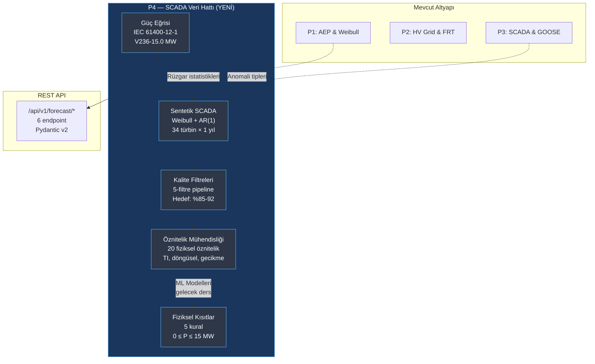

# Lekcja 012 - Pipeline Danych SCADA: Krzywe Mocy, Produkcja Syntetyczna, Filtry Jakosci i Ograniczenia Fizyczne

!!! abstract "Nawigacja Lekcji"
    :material-arrow-left: **Poprzednia:** [Lekcja 011 - RBAC i Permit-to-Work](lesson-011.md) | **Nastepna:** [Lekcja 013 - Prognozowanie Kwantylowe XGBoost](lesson-013.md) :material-arrow-right:

    **Faza:** P3/P4 | **Jezyk:** Polski | **Postep:** 13 z 19 | [Wszystkie lekcje](index.md) | [Learning Roadmap](../../Learning_Roadmap.md)

> **Data:** 2026-02-26
> **Faza:** przejscie P3 -> P4
> **Sekcje roadmapy:** [Phase 3 - Data Quality, Phase 4 - Forecasting Inputs]
> **Jezyk:** Polski
> **Poprzednia lekcja:** Lesson 011

---

## Czego się nauczysz

- Zrozumienie, w jaki sposób krzywa mocy turbiny wiatrowej jest modelowana zgodnie z normą IEC 61400-12-1 i 4 obszarami wzoru P = 0,5 × ρ × A × Cp × v³
- Generowanie realistycznych, syntetycznych danych SCADA dla farmy wiatrowej składającej się z 34 turbin: rozkład Weibulla, korelacja czasowa AR(1) i wstrzykiwanie anomalii
- Stosowanie 5-warstwowej linii filtra jakości (rurociąg) w oparciu o normę IEC 61400-12-1 załącznik A: ograniczenia, konserwacja, awaria czujnika, odchylenie od krzywej mocy i oblodzenie
- Konwersja surowych pomiarów SCADA na funkcje gotowe do ML: intensywność turbulencji, cykliczne kodowanie czasu, wartości opóźnień i wskaźnik kierunku toru
- Zastosowanie 5 ograniczeń, które dopasowują przewidywania ML do rzeczywistości fizycznej: brak mocy ujemnej, limit wydajności nominalnej, zasady załączenia/wyłączenia i całkowity limit farmy

---

## Rozdział 1: Krzywa mocy — fizyczna mapa konwersji wiatru na energię elektryczną

### Problem prawdziwego świata

Pomyśl o krzywej prędkości obrotowej silnika w samochodzie: poniżej pewnej prędkości silnik nie obraca się, pracuje najefektywniej w określonym zakresie, a gdy przekroczy obroty, włącza się system bezpieczeństwa i wyłącza silnik. Dokładnie tak działa turbina wiatrowa — krzywa mocy to „instrukcja obsługi” pomiędzy prędkością wiatru a mocą elektryczną. Bez znajomości tej krzywej nie można wygenerować danych SCADA, napisać filtra jakości ani zweryfikować modelu ML.

### Co mówią normy?

**IEC 61400-12-1 (Pomiary wydajności mocy)** określa metodę pomiaru krzywej mocy turbin wiatrowych:

- Pomiar prędkości wiatru za pomocą anemometru skalibrowanego na wysokości piasty
- Średnie 10-minutowe (kompatybilne z interwałem rejestracji SCADA)
- Korekta gęstości powietrza do warunków referencyjnych (1,225 kg/m3, 15°C, 1013,25 hPa)
- **Metoda binów** (metoda binów): dane grupowane są w przedziały o prędkości 0,5 m/s

Krzywa mocy ma 4 różne obszary:

| Region | Prędkość wiatru | Zachowanie | Fizyka |
|-------|-------------|----------|-------|
| 1 | v < 3,0 m/s | P = 0 | Aerodynamiczny moment obrotowy nie jest w stanie pokonać tarcia układu napędowego |
| 2 | 3,0 ≤ v < 12,5 m/s | P ∝ v³ | Maksymalne wychwytywanie energii (optymalizacja Cp) |
| 3 | 12,5 ≤ v ≤ 31,0 m/s | P = P_nominalny | Stała kontrola mocy przy kącie ostrza (skok) |
| 4 | v > 31,0 m/s | P = 0 | Wyłączenie awaryjne (wtapianie ostrza) |

### Co zbudowaliśmy?

**Zmienione pliki:**

- `backend/app/services/p4/turbine_power_curve.py` — model krzywej mocy turbiny V236-15.0 MW, krzywe Cp/Ct i funkcje interpolacyjne
- `backend/tests/test_turbine_power_curve.py` — Testy weryfikacji krzywej mocy (194 linie)

Modelowaliśmy specyfikację turbiny Vestas V236-15.0 MW jako `frozen dataclass`. Średnica wirnika 236 m (powierzchnia zamiatana: π × 118² = 43,743 m²), wysokość piasty 140 m, moc nominalna 15,0 MW. Wszystkie moduły P4 odwołują się do tej specyfikacji.

Obliczanie mocy odbywa się w czterech krokach: (1) utwórz sekwencję prędkości wiatru, (2) oblicz krzywą Cp, (3) zastosuj wzór P = 0,5 × ρ × A × Cp × v³, (4) zaciśnij moc znamionową.

### Dlaczego to jest ważne?

> **Dlaczego** budujemy krzywą mocy jako pierwszy moduł całej linii?
> Ponieważ krzywa mocy zapewnia „właściwą odpowiedź” dla producenta SCADA; definiuje „wartość oczekiwaną” dla filtrów jakości; i jest fizycznym odniesieniem, względem którego będą weryfikowane przewidywania ML. Jeśli zmienisz pojedynczy moduł, będzie to miało wpływ na całą linię — dlatego jest ona najważniejsza jako podstawa.

> **Dlaczego** używamy klasy danych `frozen=True`?
> Aby zapobiec przypadkowej zmianie parametrów turbiny podczas symulacji. Po utworzeniu `TurbineSpec(rated_power_mw=15.0)` wpisanie `spec.rated_power_mw = 20.0` powoduje wygenerowanie `FrozenInstanceError`. Gwarantuje to niezmienność stałych fizycznych na poziomie kodu.

### Przegląd kodu

Podstawą obliczenia krzywej mocy jest krzywa Cp (współczynnika mocy). Płynne przejście od zera do Cp_max uzyskuje się poprzez zastosowanie profilu sinusoidalnego w strefie 2; W strefie 3 Cp maleje, aby utrzymać stałą moc wyjściową:

```python
def _compute_cp_curve(
    wind_speeds: NDArray[np.float64],
    spec: TurbineSpec,
) -> NDArray[np.float64]:
    cp = np.zeros_like(wind_speeds)
    swept_area = compute_swept_area_m2(spec.rotor_diameter_m)

    for i, v in enumerate(wind_speeds):
        if v < spec.cut_in_speed_ms or v > spec.cut_out_speed_ms:
            cp[i] = 0.0                          # Bölge 1 ve 4: türbin kapalı
        elif v < spec.rated_speed_ms:
            # Bölge 2: sin(x) profili ile Cp artışı
            frac = (v - spec.cut_in_speed_ms) / (spec.rated_speed_ms - spec.cut_in_speed_ms)
            cp[i] = spec.cp_max * math.sin(frac * math.pi / 2.0)
        else:
            # Bölge 3: sabit güç = Cp azalır
            p_available = 0.5 * STANDARD_AIR_DENSITY * swept_area * v**3
            cp[i] = (spec.rated_power_mw * 1e6) / p_available
    return cp
```

Dlaczego profil `sin(frac × π/2)`? A linear increase (frac × Cp_max) does not reflect actual turbine behavior — in fact, Cp rises rapidly as it approaches the optimal tip-speed ratio, then flattens out. Profil sinusoidalny oddaje to zachowanie w prosty, ale fizycznie znaczący sposób.

Samo obliczenie mocy bezpośrednio stosuje wzór, a następnie dodaje ograniczenia bezpieczeństwa:

```python
# P = 0.5 × ρ × A × Cp × v³
power_w = 0.5 * rho * swept_area * cp * wind_speeds**3
power_mw = power_w / 1e6

# Nominal güce kırpma (sayısal güvenlik)
power_mw = np.clip(power_mw, 0.0, spec.rated_power_mw)

# Çalışma aralığı dışında sıfırlama
power_mw[wind_speeds < spec.cut_in_speed_ms] = 0.0
power_mw[wind_speeds > spec.cut_out_speed_ms] = 0.0
```

Operacja `np.clip` pozwala uniknąć wartości takich jak 15,0000001 MW ze względu na precyzję zmiennoprzecinkową. Funkcja `interpolate_power_mw` wyprowadza moc dla dowolnych prędkości wiatru za pomocą wstępnie obliczonej krzywej przy użyciu `np.interp` — generator SCADA i moduły weryfikacyjne ML korzystają z tego interfejsu.

### Podstawowe pojęcie

!!! tip "Podstawowa koncepcja: Betz Limit"
    **Po prostu:** Turbina wiatrowa nie jest w stanie pobrać całej energii zawartej w wietrze — teoretyczne maksimum, jakie może pobrać, wynosi 59,3% (limit Betza). Skąd? Gdyby pochłonęło całą energię, powietrze uległoby stagnacji, a wiatr nie mógłby płynąć. Turbina musi „przepuścić trochę wiatru”.

    **Analogia:** Pomyśl o kole wodnym: jeśli złapiesz całą wodę, łuk się zatrzyma i koło również się zatrzyma. Optymalne działanie polega na przepuszczeniu części wody i pobraniu z niej energii.

    **W tym projekcie:** Nasza turbina V236-15.0 MW wykorzystuje Cp_max = 0,48 — 81% limitu Betza (0,593). Jest to realna wartość dla nowoczesnych turbin (zakres 0,45-0,50).

---

## Rozdział 2: Produkcja syntetycznego SCADA — dane z jednego roku dla 34 turbin

### Problem prawdziwego świata

Podobnie jak w przypadku szkolenia pilota w symulatorze lotu, przed szkoleniem naszych modeli ML wymagane są realistyczne, ale kontrolowane dane. Prawdziwe dane SCADA są drogie, poufne, a liczba anomalii nie jest udokumentowana. Dzięki danym syntetycznym: (1) znamy kontrolowane wskaźniki anomalii, (2) możemy zmierzyć skuteczność filtrów, (3) wyniki są powtarzalne.

### Co mówią normy?

**IEC 61400-12-1** określa wymagania dotyczące nagrywania SCADA:

- Średni okres 10 minut
- Prędkość wiatru na wysokości piasty (anemometr, skorygowana)
- Moc czynna wyjściowa (zaciski turbiny)
- Temperatura otoczenia, wilgotność, ciśnienie
- Kierunek wiatru (łopatka nad gondolą)
- Stan pracy turbiny

### Co zbudowaliśmy?

**Zmienione pliki:**

- `backend/app/services/p4/scada_generator.py` — 34-turbinowy syntetyczny generator SCADA (420 linii)
- `backend/tests/test_scada_generator.py` — Badania weryfikacyjne producenta (170 linii)

Producent stosuje 7-etapowy proces:

1. Podstawowe generowanie prędkości wiatru z **rozkładem Weibulla** (a=10,5, k=2,2 — odniesienie dla Morza Bałtyckiego)
2. **AR(1) wygładzanie czasowe** (φ=0,95) — realistyczna korelacja pomiędzy kolejnymi odczytami 10-minutowymi
3. **Zaburzenia na turbinę** (±8%) — efekty wzbudzenia i różnice w mikropozycjonowaniu
4. **Obliczenie mocy na podstawie krzywej mocy** + 2% szumu pomiaru
5. **Kierunek wiatru** — Dominujący kierunek 240° WSW, powolne odchylenie
6. **Warunki otoczenia** — temperatura sezonowa (średnia 8°C, ±12°C), wilgotność, ciśnienie
7. **Wstrzykiwanie anomalii** — ograniczenie, konserwacja, zamrożenie anemometru, obezwładnienie, oblodzenie

### Dlaczego to jest ważne?

> **Dlaczego** używamy procesu AR(1), dlaczego nie kierować instancjami Weibulla?
> Rzeczywiste pomiary prędkości wiatru mają wysoką korelację czasową: wiatr wiał 8 m/s 10 minut temu najprawdopodobniej obecnie wynosi około 7–9 m/s. Niezależne próbki Weibulla wychwytują tę korelację: pomiędzy kolejnymi wartościami następuje „przeskakiwanie”, a model ML uczy się nierealistycznych wzorców. Wzór AR(1) `v(t) = 0.95 × v(t-1) + 0.05 × v_weibull(t)` można odczytać jako 95% historii + 5% nowych informacji.

> **Dlaczego** umożliwiliśmy konfigurowanie współczynników anomalii?
> Aby przetestować skuteczność filtrów przy różnych gęstościach anomalii. Stawki domyślne (2% ograniczenie, 3% konserwacja, 0,5% zamrożony anemometr, 0,3% przekroczenie mocy, 1% oblodzenie) opierają się na danych branżowych, ale mogą ulec zmianie ze względu na cele badawcze.

### Przegląd kodu

Przyjrzyjmy się, jak korelację czasową osiąga się za pomocą AR(1):

```python
def _generate_base_wind(rng, config):
    # 1. Ham Weibull örnekleri
    weibull_raw = rng.weibull(config.weibull_k, size=config.num_timesteps)
    weibull_scaled = config.weibull_a * weibull_raw

    # 2. AR(1) zamansal düzgünleştirme
    wind = np.zeros(config.num_timesteps, dtype=np.float64)
    wind[0] = weibull_scaled[0]
    phi = config.ar1_phi  # 0.95

    for t in range(1, config.num_timesteps):
        wind[t] = phi * wind[t - 1] + (1.0 - phi) * weibull_scaled[t]

    return np.maximum(wind, 0.0)  # Negatif hız fiziksel olarak imkansız
```

Dlaczego wartość `phi = 0.95` jest tak wysoka? Autokorelacja pomiędzy 10-minutowymi pomiarami w warunkach wiatru na morzu mieści się zazwyczaj w przedziale 0,90-0,97. Wartość 0,95 znajduje się pośrodku tego zakresu i przybliża właściwości statystyczne danych syntetycznych do danych rzeczywistych.

Wstrzykiwanie anomalii odbywa się niezależnie dla każdej turbiny. Zdarzenia konserwacyjne odbywają się w wielogodzinnych blokach (12–48 kolejnych kroków = 2–8 godzin) — odzwierciedla to proces przychodzenia, pracy i opuszczania technika w prawdziwym świecie:

```python
# Bakım: çok saatlik sıfır güç blokları
n_maint_events = max(1, int(num_t * config.maintenance_rate / 24))
for _ in range(n_maint_events):
    start = rng.integers(0, num_t - 48)
    duration = rng.integers(12, 48)  # 2-8 saat
    end = min(start + duration, num_t)
    power[start:end, turb] = 0.0
    status[start:end, turb] = "maintenance"
```

Każdy typ anomalii ma inną etykietę w tablicy `status` — etykiety te są używane jako „podstawowa prawda” w pomiarach dokładności filtrów jakości.

### Podstawowe pojęcie

!!! tip "Podstawowa koncepcja: Dystrybucja Weibulla"
    **Po prostu:** Rozkład Weibulla to „mapa prawdopodobieństwa” prędkości wiatru. Parametr a (skala) „jak silny jest średni wiatr?” pytanie, a k (kształt) to „jak stabilny jest wiatr?” odpowiada na pytanie. Jeżeli k=2, wiatr podąża za rozkładem Rayleigha (powszechny rozkład na morzu); Jeśli k>2, koncentruje się w węższym zakresie.

    **Analogia:** Pomyśl o czasach okrążeń na torze wyścigowym: średni czas okrążenia to a, k oznacza, jak konsekwentny jest jeździec. Wysokie k = wąski zakres czasów, niskie k = zarówno bardzo szybkie, jak i bardzo wolne okrążenia.

    **W tym projekcie:** Parametry a=10,5 m/s i k=2,2 reprezentują typowe statystyki wiatru polskiego Bałtyku na wysokości piasty 140 m. Średnia prędkość wiatru ≈ 9,3 m/s, obliczenia AEP opierają się na tym rozkładzie.

---

## Rozdział 3: Filtry jakościowe — zapobieganie „wprowadzaniu i wyrzucaniu śmieci”

### Problem prawdziwego świata

To jak kucharz sortujący warzywa przed gotowaniem: nie można przygotować dobrego posiłku ze zgniłych, wadliwych lub niewłaściwych składników. Dane SCADA zawierają także „śmieci” — okresy dławienia, okresy konserwacji, zamrożone czujniki, oblodzenie. Uczenie modelu ML bez filtrowania tych danych uczy model „jak przewidywać awarie”, a nie „jak oszacować normalną moc”.

### Co mówią normy?

**IEC 61400-12-1 Załącznik A** definiuje kryteria wykluczania danych:

- Usunięcie okresów, w których turbina nie pracuje normalnie
- Usunięcie znanych okresów dławienia lub ograniczania mocy
- Usuwanie zidentyfikowanych usterek czujnika
- Statystyczne wykrywanie wartości odstających dla przedziału prędkości wiatru

Pięć naszych filtrów rozszerza ten standard o elementy sterujące specyficzne dla ML:

| Filtruj | Metoda | Próg |
|--------|--------|------|
| 1. Ograniczenie | P ≈ 0 ale v > zacięcie | P < 0,1 MW i stan ≠ utrzymanie |
| 2. Konserwacja | Stan operacyjny | status ≠ „działa” |
| 3. Awaria czujnika | Zamrożony anemometr + ekstremalna moc | σ(v) < 0.01 @ 6 adım; P > 1,05 × P_nominal |
| 4. Wartość odstająca krzywej mocy | Metoda IQR (pojemniki) | [K1-1,5×IQR, Q3+1,5×IQR] |
| 5. Lukier | Wydajność + meteorologia | P < 0.5×P_beklenen ve nem > 95% i T < 2°C |

### Co zbudowaliśmy?

**Zmienione pliki:**

- `backend/app/services/p4/scada_quality_filters.py` — 5 rurociągów filtrów jakościowych (383 linie)
- `backend/tests/test_scada_quality_filters.py` — Testy weryfikacyjne filtrów (211 linii)

Każdy filtr działa niezależnie i zwraca maskę boolowską. Maski są łączone za pomocą połączenia OR: punkt danych oznaczony przez dowolny filtr jest oznaczony jako „nieczysty”. Docelowa dostępność: 85-92%.

### Dlaczego to jest ważne?

> **Dlaczego** 5 filtrów jest stosowanych niezależnie, dlaczego nie sekwencyjnie?
> Samodzielna implementacja pozwala nam mierzyć oddzielnie, ile danych wyodrębnia każdy filtr. Jeśli Filtr 3 (czujnik) usuwa 15% danych, oznacza to problem z jakością czujnika — informacja ta zostałaby utracona, gdyby cała linia była w linii. Diagnozę tę umożliwia słownik `counts_by_filter`.

> **Dlaczego** wolimy metodę IQR od Z-score?
> Na metodę IQR (rozstęp międzykwartylowy) nie mają wpływu same wartości odstające — wartości Q1 i Q3 są odporne na wartości odstające. Z drugiej strony wynik Z opiera się na średniej i odchyleniu standardowym, a wartości odstające wypaczają te statystyki. W danych dotyczących mocy turbin wiatrowych typowe są anomalie wynoszące 5–10%, co powoduje, że wynik Z jest niewiarygodny.

### Przegląd kodu

Wykrywanie odstających krzywych mocy w oparciu o IQR wykorzystuje metodę bins z IEC 61400-12-1:

```python
def detect_power_curve_outliers(wind_speed, power, bin_width_ms=1.0, iqr_multiplier=1.5):
    flagged = np.zeros((num_t, num_turb), dtype=np.bool_)

    for turb in range(num_turb):
        for b in range(len(bin_edges) - 1):
            bin_mask = (ws_col >= bin_edges[b]) & (ws_col < bin_edges[b + 1])
            bin_indices = np.where(bin_mask)[0]
            if len(bin_indices) < 10:
                continue  # Seyrek kutuları atla — istatistik güvenilmez

            bin_power = pwr_col[bin_indices]
            q1 = np.percentile(bin_power, 25)
            q3 = np.percentile(bin_power, 75)
            iqr = q3 - q1
            lower = q1 - iqr_multiplier * iqr  # Alt sınır
            upper = q3 + iqr_multiplier * iqr  # Üst sınır

            outliers = (bin_power < lower) | (bin_power > upper)
            flagged[bin_indices[outliers], turb] = True
    return flagged
```

Dlaczego sterowanie `len(bin_indices) < 10`? W przedziałach zawierających mniej niż 10 punktów danych obliczenia Q1/Q3 stają się statystycznie niewiarygodne — pojedyncza anomalia może unieważnić cały przedział. Próg ten stanowi zasadę „minimalnej próby dla pewności statystycznej”.

Połączenie pięciu filtrów jest proste i przejrzyste:

```python
any_flagged = (curtailment_mask | maintenance_mask |
               sensor_mask | outlier_mask | icing_mask)
clean_mask = ~any_flagged  # Temiz veri: hiçbir filtre tarafından işaretlenmemiş
```

Obiekt `FilterResult` raportuje liczbę punktów danych wyodrębnionych przez każdy filtr za pomocą słownika `counts_by_filter`. Wartość `availability_pct` mieści się w zakresie docelowym na poziomie 85–92% — jest za niska i większość danych to śmieci, za wysoka, a filtry są nieodpowiednie.

### Podstawowe pojęcie

!!! tip "Podstawowa koncepcja: Wykrywanie wartości odstających IQR"
    **Po prostu:** Pomyśl o wynikach testów na zajęciach. Narysuj 25% poniżej i powyżej środka (Q1 i Q3). Odległość między tymi dwiema liniami to IQR. Jeśli ocena wynosi 1,5×IQR poniżej Q1 lub 1,5×IQR powyżej Q3 – jest to „podejrzanie odmienne”.

    **Analogia:** Weź pod uwagę statystyki bramek drużyny piłkarskiej: 1-3 gole na mecz to norma. Jeśli jednak w meczu padło 15 bramek, jest to prawdopodobnie błąd w danych lub nietypowe zdarzenie — wychwytuje to metoda IQR.

    **W tym projekcie:** Obliczamy IQR wartości mocy dla każdego przedziału prędkości wiatru 1 m/s. Jeśli oczekiwana moc przy 8 m/s wynosi 5-7 MW, odczyt 0,1 MW lub 14 MW jest zdecydowanie anomalią.

---

## Rozdział 4: Inżynieria funkcji — od surowych danych do macierzy ML-Ready

### Problem prawdziwego świata

Wyobraź sobie, że nie wystarczy, że lekarz powie „Mam gorączkę” – pyta również o ciśnienie, tętno i parametry krwi. Same surowe kanały SCADA (prędkość, kierunek, temperatura) nie wystarczą. Model ML powinien znać „trend 12-godzinny”, „jaką jest porę dnia” i „kąt wiatru względem osi farmy”, a nie surowe dane typu „temperatura”.

### Co mówią normy?

**IEC 61400-1** definiuje intensywność turbulencji:

- TI = σ₁ / V_hub (10-minutowe odchylenie standardowe / średnia prędkość)
- Klasy turbulencji IEC: A (I_ref=0,16), B (0,14), C (0,12)
- Morskie tereny bałtyckie należą zazwyczaj do klasy C (I_ref ≈ 0,06-0,10)

### Co zbudowaliśmy?

**Zmienione pliki:**

- `backend/app/services/p4/feature_engineering.py` — Rurociąg inżynierii atrybutów fizycznych (425 linii)
- `backend/tests/test_feature_engineering.py` — Testy walidacyjne atrybutów (258 linii)

Zbudowaliśmy potok, który generuje 20 atrybutów:

| Grupa atrybutów | Numer | Formuła |
|-----------------|------|--------|
| Prędkość wiatru + statystyki kroczące | 3 | ws, średnia(ws, 1h), std(ws, 1h) |
| Intensywność turbulencji | 1 | TI = σ / μ |
| Kierunek wiatru + tempo zmian | 2 | wd, \|Δwd/Δt\| |
| Gęstość powietrza | 1 | ρ = P/(R × T_K) |
| Meteorologia | 2 | temperatura, wilgotność |
| Czas cykliczny | 4 | sin/cos(godzina), sin/cos(miesiąc) |
| Wskaźnik kierunku toru | 1 | cos(wd - oś_farmy) |
| Wartości opóźnienia mocy | 6 | P(t-1)...P(t-6) |

### Dlaczego to jest ważne?

> **Dlaczego** kodujemy czas jako parę sin/cos, a nie jako liczbę bezpośrednią (0–23)?
> Ponieważ godziny 23 i 0 są w rzeczywistości oddalone od siebie o 1 godzinę, ale liczbowo dzielą je 23 jednostki. Model ML nie może nauczyć się tej „nieciągłości”. Przy kodowaniu cyklicznym: `sin²(x) + cos²(x) = 1` jest zawsze ważne, a przejście zegara 23→0 jest gładką krzywą sinusoidalną – bez nieciągłości.

> **Dlaczego** usuwamy wiersze zamiast wypełniać wartości NaN?
> Atrybuty opóźnienia i kroczenia są na początku szeregu czasowego niezdefiniowane: w pierwszym kroku P(t-1) nie występuje, w pierwszych 5 krokach nie można obliczyć średniej 1-godzinnej. Wypełnienie tych NaN zerem lub średnią powoduje „wyciek danych”. Właściwe podejście: zostawić te kwestie w milczeniu. Pole `dropped_timesteps` podaje, ile wierszy zostało usuniętych.

### Przegląd kodu

Cykliczne kodowanie czasu można traktować jako lokalizację na okręgu:

```python
def compute_cyclical_time_features(timestamps):
    # Gün içi saat: Unix epoch → günlük saniye → saat
    seconds_in_day = timestamps % 86400
    hours = seconds_in_day / 3600.0

    # Yıl içi ay yaklaşımı
    day_of_year = (timestamps % (365 * 86400)) / 86400.0
    month_approx = day_of_year / 30.44  # Ortalama ay uzunluğu

    hour_sin = np.sin(2.0 * np.pi * hours / 24.0)
    hour_cos = np.cos(2.0 * np.pi * hours / 24.0)
    month_sin = np.sin(2.0 * np.pi * month_approx / 12.0)
    month_cos = np.cos(2.0 * np.pi * month_approx / 12.0)

    return hour_sin, hour_cos, month_sin, month_cos
```

Istnieje kluczowy matematyczny powód, aby używać grzechu i cos razem: w przypadku samego sin(godziny) godziny 6 i 18 przyjmują tę samą wartość (0) — są one nie do odróżnienia. Dodanie cos sprawia, że ​​godziny 6 → (0, -1) i godziny 18 → (0, 1) są teraz unikalne.

Wskaźnik kierunku kilwateru mierzy potencjał budzenia kierunku wiatru w stosunku do osi farmy:

```python
def compute_wake_direction_indicator(wind_direction_deg, farm_alignment_deg=210.0):
    angle_diff_rad = np.radians(wind_direction_deg - farm_alignment_deg)
    return np.cos(angle_diff_rad)
```

`cos(0°) = 1.0`: wiatr wieje dokładnie wzdłuż osi farmy. → efekt budzenia jest maksymalny. `cos(90°) = 0.0`: wiatr wieje pionowo. → efekt budzenia jest minimalny. Ta pojedyncza liczba przekazuje złożoną fizykę toru jako prosty sygnał do modelu ML.

### Podstawowe pojęcie

!!! tip "Podstawowa koncepcja: Wyciek danych z przyszłości"
    **Po prostu:** Zobaczenie klucza odpowiedzi przed przystąpieniem do testu — wynik jest świetny, ale nie mierzy prawdziwej wiedzy. W ML wyciek przyszłych danych do edukacji to to samo.

    **Analogia:** To jakby poznać jutrzejszą pogodę, a następnie „potwierdzić” dzisiejszą prognozę. Wynik zawsze wychodzi idealny, ale modelka tak naprawdę niczego się nie nauczyła.

    **W tym projekcie:** Atrybuty opóźnienia patrzą tylko wstecz: P(t-1) = moc poprzedniego kroku. Pierwsze 6 wierszy z NaN jest usuwanych i nigdy nie jest wypełnianych. Ta ścisła zasada zapewnia, że ​​model dokonuje prognoz wyłącznie na podstawie informacji dostępnych do czasu t.

---

## Rozdział 5: Ograniczenia fizyczne — ML nie łamie praw fizyki

### Problem prawdziwego świata

Jeśli aplikacja nawigacyjna każe Ci „przejść przez morze”, wyznaczenie trasy jest fizycznie niemożliwe, nawet jeśli mapa jest dokładna. Modele ML mogą w podobny sposób generować fizycznie niemożliwe prognozy: moc ujemna, moc powyżej mocy znamionowej lub wytwarzanie energii elektrycznej przy braku wiatru. Warstwa ograniczeń fizycznych stanowi ostateczną siatkę bezpieczeństwa zapobiegającą propozycjom „chodzenia po morzu”.

### Co mówią normy?

**IEC 61400-12-1** określa obowiązującą obwiednię roboczą krzywej mocy. Prognozy nie mogą znajdować się poza tą kopertą:

- Strefa 1 (v < 3,0 m/s): P koniecznie 0 MW
- Strefa 3 (v_nominal ≤ v ≤ v_cut-out): P ≤ P_nominal (15,0 MW)
- Strefa 4 (v > 31,0 m/s): P koniecznie 0 MW

### Co zbudowaliśmy?

**Zmienione pliki:**

- `backend/app/services/p4/physical_constraints.py` — Warstwa egzekwowania ograniczeń fizycznych (303 linie)
- `backend/tests/test_physical_constraints.py` — Testy walidacyjne ograniczeń (131 linii)

Pięć reguł ograniczeń weryfikuje każdą prognozę ML z rzeczywistością fizyczną:

| Ograniczenie | Zasada | Priorytet |
|-------|-------|---------|
| C1 | P ≥ 0 (brak mocy ujemnej) | Niski |
| C2 | P ≤ 15,0 MW (moc znamionowa) | Niski |
| C3 | v < 3,0 m/s → P = 0 | Wysoki (zastępuje C1/C2) |
| C4 | v > 31,0 m/s → P = 0 | Wysoki (zastępuje C1/C2) |
| C5 | Σ P_i ≤ 510 MW (limit agregatowy gospodarstwa) | Poziom gospodarstwa |

### Dlaczego to jest ważne?

> **Dlaczego** stosujemy ograniczenia na wyjściu (przetwarzanie końcowe), a nie podczas uczenia modelu?
> Są dwa powody: (1) Niezależność architektury modelu — niezależnie od tego, czy XGBoost, LSTM czy TFT, wykorzystuje tę samą warstwę ograniczeń. (2) Rozdzielenie zagadnień — model uczy się wzorców statystycznych, stosowanie praw fizyki jest zadaniem odrębnego modułu. Taka architektura zapobiega zmianie kodu ograniczenia wraz ze zmianą modelu.

> **Dlaczego** ograniczenia oparte na wietrze (C3/C4) zastępują ograniczenia oparte na mocy (C1/C2)?
> Hierarchia fizyczna: wytwarzanie energii jest fizycznie niemożliwe, jeśli nie ma wiatru — stwierdzenie C1/C2 „zezwól w zakresie 0–15” nie ma znaczenia. C3/C4 mówi „skrzydło nie może się obrócić” i ta zasada jest absolutna.

### Przegląd kodu

Kolejność stosowania ograniczeń jest krytyczna — najpierw C1/C2, potem C3/C4:

```python
def enforce_physical_constraints(power_mw, wind_speed_ms=None, ...):
    corrected = power_mw.copy()
    violations = []

    # C1: Negatif güç yok
    neg_mask = corrected < 0.0
    corrected[neg_mask] = 0.0

    # C2: Nominal kapasite sınırı
    over_mask = corrected > rated_power_mw
    corrected[over_mask] = rated_power_mw

    # C3 & C4: Rüzgar tabanlı kurallar (üste yazma)
    if wind_speed_ms is not None:
        corrected[wind_speed_ms < cut_in_ms] = 0.0   # Cut-in altı
        corrected[wind_speed_ms > cut_out_ms] = 0.0   # Cut-out üstü

    return ConstraintResult(power_mw=corrected, violations=violations, ...)
```

Każde naruszenie zapisywane jest do rejestru `ConstraintViolation`: jakie ograniczenie, który krok, wartość pierwotna i wartość poprawiona. Rekordy te są wykorzystywane zarówno do debugowania, jak i ulepszania modelu — jeśli naruszenia C1 są zbyt wysokie, model ma tendencję do generowania negatywnych przewidywań, wskazując na problem w danych szkoleniowych.

Na poziomie farmy ograniczenie C5 stosuje skalowanie proporcjonalne, jeżeli łączna moc przekracza 510 MW:

```python
# C5: Çiftlik toplam sınırı — orantılı küçültme
farm_totals = np.sum(corrected_all, axis=1)
over_cap = farm_totals > farm_capacity  # 510 MW

for t_idx in np.where(over_cap)[0]:
    scale = farm_capacity / farm_totals[t_idx]
    corrected_all[t_idx, :] *= scale
```

Dlaczego skalowanie proporcjonalne, a nie dławienie poprzez losowy dobór turbin? Skalowanie proporcjonalne powoduje większe (w miarę) tłumienie turbin wytwarzających dużą moc i wpływa na turbiny wytwarzające mniejszą moc. Ma to również sens fizyczny, ponieważ turbiny o większej mocy prawdopodobnie odczują silniejszy wiatr.

### Podstawowe pojęcie

!!! tip "Podstawowa koncepcja: ML zorientowany na fizykę"
    **Po prostu:** Powiedzenie modelowi ML, aby „ograniczył swoją wyobraźnię”. Niezależnie od tego, jak inteligentny jest model, nie może on złamać praw fizyki – tak jak samolot nie może wystartować, „ignorując grawitację”.

    **Analogia:** Dziecko podczas rysowania zna zasadę „niebo nie może być zielone, a trawa nie może być niebieska”. Ograniczenia fizyczne to reguły, które uniemożliwiają modelowi ML rysowanie „zielonego nieba”.

    **W tym projekcie:** Reguła 5 ograniczeń zapewnia, że ​​każde oszacowanie ML mieści się w fizycznej obwiedni operacyjnej turbiny V236-15.0 MW. Rezultat: zarówno dokładniejsze przewidywania, jak i wyniki, którym mogą zaufać operatorzy SCADA.

---

## Rozdział 6: API REST i schematy Pydantic — Drzwi do każdego modułu

### Problem prawdziwego świata

Nieważne, jak dobra jest kuchnia restauracji, jest ona bezużyteczna, jeśli nie ma kelnerów i menu, które mogłoby służyć klientom. Nasze moduły usług zaplecza to „kuchnie”; Punkty końcowe API REST i schematy Pydantic to „kelnerzy” i „menu”. Bez odpowiednio zdefiniowanych interfejsów frontend nie ma dostępu do tych modułów.

### Co mówią normy?

Specyfikacja OpenAPI (Swagger) zapewnia automatyczną dokumentację interfejsów API REST. FastAPI automatycznie generuje tę specyfikację na podstawie modeli Pydantic. Każdy `Field(description=...)` staje się wierszem dokumentu API.

### Co zbudowaliśmy?

**Zmienione pliki:**

- `backend/app/routers/p4.py` — 6 punktów końcowych REST (259 linii)
- `backend/app/schemas/forecast.py` — schematy żądań/odpowiedzi Pydantic v2 (195 linii)
- `backend/app/services/p4/__init__.py` — Wspólny eksport (63 linie)
- `backend/app/main.py` — rekord routera P4 (zmienione 2 linie)

W ramach sześciu punktów końcowych `/api/v1/forecast/`:

| Punkt końcowy | Metoda | Funkcja |
|----------|-------|-------|
| `/turbine-spec` | OTRZYMAJ | Specyfikacja V236-15.0 MW |
| `/power-curve` | POST | Generowanie krzywej mocy IEC 61400-12-1 |
| `/generate-scada` | POST | Syntetyczny zbiór danych SCADA |
| `/quality-filter` | POST | Linia jakości z 5 filtrami |
| `/features` | POST | Inżynieria funkcji |
| `/check-constraints` | POST | Weryfikacja ograniczeń fizycznych |

### Dlaczego to jest ważne?

> **Dlaczego** zwracamy podsumowanie zbioru danych SCADA, a nie cały zbiór danych?
> 34 turbiny × 52 560 kroków × 8 kanałów = ~14 milionów wartości float → około 110 MB JSON. To przesada w przypadku odpowiedzi API REST. Podsumowanie (średnie, liczba przypadków, zakres czasu) jest wystarczające. Jeśli potrzebny jest pełny zestaw danych, powinien to być punkt końcowy eksportu wsadowego — inna decyzja dotycząca architektury.

> **Dlaczego** istnieją ograniczenia `Field(ge=..., le=...)` na każdym schemacie żądania?
> Walidacja pydantyczna jest „pierwszą linią obrony” na granicy API. `weibull_k: float = Field(ge=1.0, le=4.0)` odrzuca fizycznie nieistotne parametry (k=0 lub k=100) za pomocą protokołu HTTP 422 — gwarantuje to, że kod serwera w ogóle nie będzie działał i nie wykonywał niepotrzebnych obliczeń.

### Przegląd kodu

W schemacie Pydantic definicje `Field` pełnią zarówno rolę walidacyjną, jak i dokumentacyjną:

```python
class PowerCurveRequest(BaseModel):
    wind_step_ms: float = Field(
        default=0.5,
        ge=0.1, le=2.0,  # Fiziksel sınırlar
        description="Wind speed bin width [m/s]. IEC 61400-12-1 default: 0.5",
    )
    air_density_kg_m3: float | None = Field(
        default=None,
        ge=0.8, le=1.6,  # Deniz seviyesi ±%30 marj
        description="Air density [kg/m³]. Default: 1.225 (standard conditions)",
    )
```

Każdy ciąg `description` automatycznie pojawia się na stronie `/docs` Swagger w FastAPI. To jest „dokumentacja API”, a nie „dokumentacja kodu” — programista frontendu rozumie, co musi dostarczyć, bez patrzenia na kod źródłowy.

### Podstawowe pojęcie

!!! tip "Podstawowa koncepcja: Walidacja granic"
    **Po prostu:** To jak kontrola bezpieczeństwa przy drzwiach budynku – nie możesz wejść do budynku bez sprawdzenia swojej torby. Granica API to punkt, w którym do systemu wchodzi świat zewnętrzny i jeśli nie zostanie tam przeprowadzona walidacja, moduły wewnętrzne będą działać z niezabezpieczonymi danymi.

    **Analogia:** Kontrola paszportowa na lotnisku: jeśli Twój paszport jest nieważny, nie możesz wjechać do kraju. W krajowym ruchu miejskim nikt nie pyta o paszport – kontrola odbywa się na granicy. Podobnie funkcja `enforce_physical_constraints` nie sprawdza parametrów wewnętrznie, ponieważ warstwa API już to zrobiła.

    **W tym projekcie:** Definicje Pydantic `Field(ge=1.0, le=4.0)` odrzucają fizycznie nieistotne parametry we wpisie API. Warstwa usług działa z zapewnieniem „otrzymuję czyste dane”.

---

## Powiązania

**Gdzie te pojęcia będą stosowane w przyszłości:**

- **Krzywa mocy** (Część 1) Modele XGBoost i LSTM urządzenia → P4 sprawdzą swoje przewidywania w oparciu o tę krzywą
- **Generator SCADA** (Część 2) → Dane syntetyczne będą zbiorem uczącym wszystkich modeli P4 ML; zostaną w przyszłości porównane z prawdziwą integracją SCADA z ERA5+
- **Filtry jakości** (Część 3) Analiza wyjaśnialności → SHAP pokaże różnicę pomiędzy danymi filtrowanymi i niefiltrowanymi
- **Inżynieria cech** (Część 4) → XGBoost znaczenie cech (wzmocnienie/pokrycie/SHAP) zmierzy, które cechy są najcenniejsze
- **Ograniczenia fizyczne** (Część 5) → Ograniczenia zostaną zastosowane do każdego kroku wielohoryzontowych prognoz TFT
- **P3 → P4 połączenie**: System rejestrowania urządzeń SCADA (lekcja 009) i symulacja błędów GOOSE (lekcja 010) w P3 są zbudowane na tych danych SCADA — stamtąd pochodzą typy anomalii

---

## Szerszy obraz

*Cel tej lekcji: **Cały potok danych P4 SCADA** — od fizycznej krzywej mocy po filtr jakości, od inżynierii cech po ograniczenia fizyczne.*



Aby zapoznać się z pełną architekturą systemu: [Przegląd lekcji](index.md#system-architecture)

---

## Kluczowe dania na wynos

1. **Krzywa mocy jest podstawą rurociągu P4** — generowanie SCADA, filtrowanie jakości i weryfikacja ograniczeń zależą od tej krzywej.
2. **Dane syntetyczne umożliwiają kontrolowane eksperymenty** — możesz zmierzyć skuteczność filtrów za pomocą danych, w przypadku których znasz współczynniki anomalii.
3. **Połączenie AR(1) + Weibulla** pozwala uzyskać zarówno dokładne statystyki długoterminowe, jak i realistyczną korelację krótkoterminową.
4. **„Jakość danych jest ważniejsza niż złożoność modelu”** — Nawet najbardziej zaawansowany model wytrenowany na podstawie 10% nietypowych danych pozostaje w tyle za prostym modelem wytrenowanym na czystych danych.
5. **Metoda IQR jest bardziej niezawodna niż wynik z** — odporna na wartości odstające, ponieważ pierwszy/trzeci kwartał opiera się na medianie, a nie średniej.
6. **Cykliczne kodowanie czasu eliminuje nieciągłość pary sin/cos** — model ML uczy się czasu, miesiąca i kierunku, korzystając z prawidłowego pojęcia „odległości”.
7. **Ograniczenia fizyczne stanowią końcową siatkę bezpieczeństwa niezależną od modelu** — prawa fizyki pozostają niezmienne, nawet jeśli model się zmienia.

---

## Zalecane lektury

*[Plan nauczania](../../Learning_Roadmap.md) — Faza 4: Uczenie maszynowe na rzecz energii*

| Źródło | Gatunek | Dlaczego warto przeczytać |
|--------|-----|---------------|
| Hyndman i Athanasopoulos — *Prognozowanie: zasady i praktyka* (wyd. 3) | Podręcznik online (bezpłatny) | Podstawy walidacji krzyżowej szeregów czasowych i inżynierii cech — podstawy teoretyczne opóźnień/elementów toczenia w tym kursie |
| Zadanie 36 IEA Wind TCP — *Prognozowanie dla energetyki wiatrowej* | Raporty (bezpłatne) | Najlepsze praktyki dotyczące jakości danych i wstępnego przetwarzania w prognozowaniu energii wiatrowej — branżowy punkt odniesienia dla naszych filtrów jakości |
| Chen i Guestrin (2016) — *XGBoost: skalowalny system wzmacniania drzew* | Artykuł | Aby zrozumieć koncepcję ważności cech — w kolejnym etapie naszego rurociągu inżynierii cech wartości SHAP zostaną obliczone za pomocą tego modelu |
| Hong i in. (2020) — *Prognozowanie energii: przegląd* | Artykuł przeglądowy | Integracja ograniczeń fizycznych z ML w szacowaniu energii — uzasadnienie akademickie dla naszej warstwy egzekwowania ograniczeń |

---

## Quiz — sprawdź swoje zrozumienie

### Przypomnij sobie pytania

**P1:** Dlaczego moc w Strefie 3 krzywej mocy (12,5-31,0 m/s) pozostaje stała, pomimo wzrostu prędkości wiatru?

<details>
<summary>Odpowiedź</summary>

W strefie 3 system kontroli pochylenia zmniejsza prędkość pozyskiwania energii z wiatru (Cp) poprzez zwiększenie kąta łopat. Wraz ze wzrostem prędkości wiatru dostępna moc (P_wind = 0,5ρAv3) wzrasta, ale maleje w tempie Cp, pozostawiając iloczyn stały: P_electrical = P_rated = 15,0 MW. Mechanizm ten chroni generator i elementy mechaniczne przed przeciążeniem.

</details>

**S2:** U producenta SCADA współczynnik autokorelacji AR(1) jest ustawiony na φ = 0,95. Co to oznacza?

<details>
<summary>Odpowiedź</summary>

φ = 0,95 oznacza, że ​​każdy 10-minutowy odczyt prędkości wiatru opiera się w 95% na poprzednim odczycie i w 5% na nowej próbce Weibulla. Odzwierciedla to silną korelację czasową (kolejne pomiary są podobne) morskiej energetyki wiatrowej. Niższa wartość φ daje więcej „skaczących” danych; Wyższa wartość φ tworzy gładszy, ale powoli zmieniający się profil wiatru.

</details>

**Q3:** Ile filtrów ma zastosowanie funkcja `apply_all_quality_filters` i jaki jest docelowy procent dostępności?

<details>
<summary>Odpowiedź</summary>

Stosuje 5 filtrów: (1) wykrywanie ograniczeń, (2) okresy konserwacji, (3) usterki czujnika (zamrożony anemometr + nadmierna moc), (4) wartości odstające krzywej mocy (IQR), (5) wykrywanie oblodzenia. Dostępność docelowa wynosi 85–92% — jest za niska i większość danych jest problematyczna, za wysoka, a filtry słabo działają.

</details>

### Pytania dotyczące zrozumienia

**Pyt.4:** Dlaczego w cyklicznym kodowaniu czasu używane są razem sin i cos? Czy sam grzech nie wystarczy?

<details>
<summary>Odpowiedź</summary>

W przypadku samego grzechu (godziny) godzina 6 (wschód słońca) i godzina 18 (zachód słońca) otrzymują tę samą wartość grzechu (0) — model ML nie jest w stanie rozróżnić tych dwóch różnych godzin. Dodanie cos daje godzinę 6 → (sin=0, cos=-1) i godzinę 18 → (sin=0, cos=1) — każda godzina ma teraz unikalną współrzędną 2D. Matematycznie każdy kąt na okręgu jednostkowym jest odwzorowany na unikalną parę (sin, cos).

</details>

**Pyt.5:** Dlaczego warstwa ograniczeń fizycznych jest stosowana na wyjściu (przetwarzanie końcowe), a nie podczas uczenia modelu?

<details>
<summary>Odpowiedź</summary>

Istnieją dwa główne powody: (1) Niezależność modelu — tę samą warstwę ograniczeń można zastosować do predykcji z XGBoost, LSTM lub TFT, nie zapisuje się oddzielnych ograniczeń dla każdego modelu. (2) Rozdzielenie zagadnień — zadaniem modelu jest poznanie wzorców statystycznych, natomiast stosowanie praw fizyki jest zadaniem odrębnego modułu. Taka architektura gwarantuje, że zmiana jednego modułu nie wpłynie na drugi.

</details>

**P6:** Dlaczego sprawdzenie `len(bin_indices) < 10` jest konieczne do wykrycia wartości odstających IQR?

<details>
<summary>Odpowiedź</summary>

W przedziałach prędkości wiatru zawierających mniej niż 10 punktów danych obliczenia Q1 i Q3 stają się statystycznie niewiarygodne. Na przykład na IQR obliczony na podstawie 3 punktów danych duży wpływ ma pojedyncza anomalia i może on błędnie oznaczać normalne punkty danych jako „obszar odstający”. Minimum 10 próbek gwarantuje, że obliczenia procentowe można przeprowadzić z rozsądnym poziomem ufności. Ta zasada „statystycznej minimalnej próbki” zmniejsza odsetek wyników fałszywie dodatnich.

</details>

### Trudne pytanie

**Pytanie 7:** Nasz obecny syntetyczny generator SCADA modeluje efekt wybudzenia jako przypadkowe zaburzenie wynoszące jedynie ±8%. W prawdziwym świecie efekt przebudzenia zależy od kierunku wiatru i lokalizacji turbiny. Jak zintegrować model śledzenia PyWake w P1 z generatorem SCADA P4? Jakie dodatkowe atrybuty byś utworzył i jaki wpływ miałyby te atrybuty na proces inżynierii atrybutów?

<details>
<summary>Odpowiedź</summary>

Integrację można przeprowadzić w trzech etapach: (1) Z modelu śladu Jensena/Bastankhaha firmy PyWake wyodrębnia się „macierz strat wzbudzenia” dla każdej pary turbin i kombinacji kierunku wiatru — ta macierz liczbowo określa, która turbina wpływa na którą turbinę, w jakim stopniu, w odniesieniu do kierunku wiatru. (2) Zamiast stałych zakłóceń ±8% dostępnych w generatorze SCADA, na każdym etapie z macierzy strat w śladzie losowym jest rysowany odpowiedni wiersz z wykorzystaniem kierunku wiatru i stosowana jest redukcja mocy — tak, że różne turbiny są dotknięte z różną intensywnością, gdy wiatr wieje ze wschodu i wieje z zachodu. (3) Nowe atrybuty w inżynierii cech: (a) `wake_deficit_ratio` = moc rzeczywista / moc oczekiwana bez śladu, (b) `upstream_turbine_power` = moc najbliższej górnej turbiny wiatrowej (wskaźnik efektu sąsiada), (c) `effective_wind_speed` = prędkość wiatru skorygowana o utratę śladu. Funkcje te wzbogacają istniejący `wake_direction_indicator` i umożliwiają bezpośredni pomiar roli wpływu śladu w przewidywaniu ML w analizie ważności funkcji XGBoost.

</details>

---

## Kącik rozmowy kwalifikacyjnej

### Po prostu wyjaśnij
*„Jak wyjaśniłbyś główny temat dzisiejszego dnia osobie niebędącej inżynierem?”*

Pomyśl o farmie wiatrowej — 34 gigantycznych śmigłach wirujących w morzu. Każde z tych śmigieł co 10 minut wysyła do komputerów raport: „Wiatr wieje tak mocno, wytwarzam tyle prądu, to jest temperatura”. Raporty te są danymi SCADA. Ale są problemy z tymi danymi: czasami czujnik się psuje i wysyła zły numer, czasami śmigło zostaje oddane do użytku, ale nadal pisze raport, czasami pojawia się oblodzenie i śmigło wytwarza mniej prądu niż normalnie. Jeśli trenujesz model sztucznej inteligencji przy użyciu tych „uszkodzonych” danych, model uczy się ułomności, a nie normalnego zachowania.

To, co zrobiliśmy, to zbudowanie rurociągu: najpierw stworzyliśmy fizyczną mapę zależności „prędkość wiatru-elektryczność” (krzywa mocy), następnie wygenerowaliśmy realistyczne, sztuczne dane za pomocą tej mapy, następnie wyodrębniliśmy uszkodzone dane za pomocą 5 różnych filtrów, następnie uzyskaliśmy nowe informacje w języku zrozumiałym dla sztucznej inteligencji (inżynieria cech), a na koniec sprawdziliśmy sugestie sztucznej inteligencji z prawami fizyki. Wynik: wiarygodne prognozy.

### Wyjaśnij technicznie
* „Jak wyjaśniłbyś główny temat dzisiejszego dnia panelowi przeprowadzającemu wywiad?”*

Zaczynając od modelu krzywej mocy zgodnej z normą IEC 61400-12-1, zbudowaliśmy kompleksowy potok danych SCADA dla morskiej farmy wiatrowej składającej się z 34 turbin. Krzywa mocy modeluje 4-strefowy profil Cp/Ct turbiny Vestas V236-15.0 MW — sinusoidalna rampa Cp w Regionie 2, moc stała z regulacją skoku w Regionie 3. Syntetyczny generator SCADA stosuje wygładzanie czasowe AR(1) (φ=0,95) w rozkładzie Weibulla(a=10,5, k=2,2), tworząc macierz 52 560 dziesięciominutowych kroków × 34 turbiny; następnie wstrzykuje 2% ograniczenia, 3% konserwacji, 0,5% zamrożonego anemometru, 0,3% przekroczenia mocy i 1% anomalii oblodzenia. 5-warstwowy filtr jakości rozszerza załącznik A IEC 61400-12-1 na kontekst ML — zapewniając dostępność celu na poziomie 85–92% z wykrywaniem wartości odstających w oparciu o IQR, korelacją oblodzenia meteorologicznego i wykluczaniem konserwacji w oparciu o warunki. Warstwa inżynierii cech zapewnia 20 istotnych fizycznie cech: intensywność turbulencji IEC 61400-1, cykliczne kodowanie czasowe sin/cos (eliminujące nieciągłość zegara i księżyca), 6-stopniowe opóźnienia zasilania (bez przyszłych wycieków, rzędy NaN są pomijane) oraz wskaźnik kierunku wybudzenia cos(wd - farm_axis). Ostatnia warstwa przycina wyniki modelu do fizycznej obwiedni roboczej za pomocą 5 reguł ograniczeń fizycznych (C1: nieujemność, C2: ograniczenie znamionowe, C3/C4: włączenie/wyłączenie, C5: całkowita farma 510 MW). Cała linia jest niezależna od modelu — niezależnie od tego, czy jest to XGBoost, LSTM czy TFT. Architektura sprawia, że ​​każdy moduł można niezależnie testować i modyfikować, zgodnie z zasadą separacji problemów.
