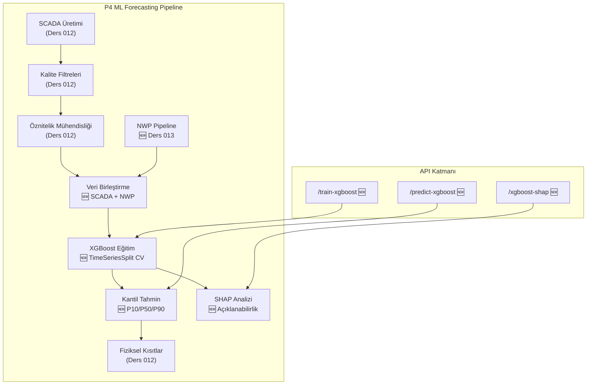

# Lekcja 013 - Prognozowanie Kwantylowe XGBoost: Pipeline NWP, Probabilistyczna Prognoza Mocy i Wyjasnialnosc SHAP

!!! abstract "Nawigacja Lekcji"
    :material-arrow-left: **Poprzednia:** [Lekcja 012 - Pipeline Danych SCADA](lesson-012.md) | **Nastepna:** [Lekcja 014 - LSTM i MC Dropout](lesson-014.md) :material-arrow-right:

    **Faza:** P4 | **Jezyk:** Polski | **Postep:** 14 z 19 | [Wszystkie lekcje](index.md) | [Learning Roadmap](../../Learning_Roadmap.md)

> **Data:** 2026-02-26
> **Faza:** P4 (AI Forecasting)
> **Sekcje roadmapy:** [Phase 4 - Quantile Forecasting, NWP Features and Explainability]
> **Jezyk:** Polski
> **Poprzednia lekcja:** Lesson 012

---

## Czego się nauczysz

- Dlaczego dane numerycznej prognozy pogody (NWP) mają kluczowe znaczenie dla prognozowania energii wiatrowej i w jaki sposób ECMWF ma na celu tworzenie syntetycznych danych podobnych do HRES
- Algorytm wzmacniania gradientu XGBoost generuje probabilistyczne oszacowanie mocy P10/P50/P90 z regresją kwantylową
- Dlaczego weryfikacja krzyżowa TimeSeriesSplit jest obowiązkowa w przypadku szeregów czasowych i jak zapobiega wyciekom danych w przyszłości
- Podejmowanie decyzji modelowych w sposób wyjaśnialny i ocenianie ważności cech za pomocą SHAP (wyjaśnienia dodatków SHapley)
- Aby zagwarantować monotoniczność kwantylową (P10 ≤ P50 ≤ P90) poprzez zastosowanie ograniczeń fizycznych do wyników estymacji

---

## Rozdział 1: Potok danych syntetycznych NWP — symulacja atmosfery

### Prawdziwy problem świata

Pomyśl o aplikacji pogodowej: na ekranie wyświetla się komunikat „Jutro będzie 15°C i słonecznie”. Skąd więc ta przepowiednia? Masywne superkomputery rozwiązują równania fizyczne atmosfery (Naviera-Stokesa, termodynamika, wilgotność) na dyskretnej siatce. Dokładnie to robią modele NWP (Numeric Weather Prediction). Dla operatorów farm wiatrowych NWP to jedyny sposób, aby już dziś poznać prędkość wiatru w przyszłości, ponieważ wiedza, ile energii elektrycznej wyprodukuje turbina w ciągu 10 minut, ma kluczowe znaczenie dla handlu energią i zobowiązań w zakresie sieci.

### Co mówią normy

Model **ECMWF HRES** (prognoza wysokiej rozdzielczości) działa z rozdzielczością poziomą ~9 km, 137 poziomów pionowych i generuje prognozy na okres do 10 dni. Krytyczne zmienne NWP dla prognozowania energii wiatrowej:

- Prędkość wiatru 100 m [m/s] — główny predyktor
- Kierunek wiatru 100 m [°] — korekta śladu i odchylenia
- temperatura 2 m [°C] — korekta gęstości powietrza
- Ciśnienie na poziomie morza [Pa] – obliczenie gęstości powietrza: ρ = P/(R·T)
- Wysokość warstwy granicznej [m] — wskaźnik reżimu turbulencji

**IEC 61400-1 Ed.4** definiuje model prawa mocy dla profilu wiatru:

> v(z) = v(z_ref) × (z / z_ref)^α — gdzie α ≈ 0,11 (na morzu)

### Co zbudowaliśmy

**Zmienione pliki:**

- `backend/app/services/p4/nwp_pipeline.py` — generator syntetycznych danych NWP: generuje dane prognozowe z 5 zmiennymi, podobne do ECMWF HRES
- `backend/app/services/p4/__init__.py` — Reeksport modułów NWP i XGBoost na poziomie pakietu

Wygenerowaliśmy syntetyczne dane NWP, które są skorelowane z „prawdziwymi” pomiarami SCADA, ale zawierają rosnący błąd ze względu na czas realizacji. Symuluje to, jak prognoza NWP pogarsza się w czasie w świecie rzeczywistym.

### Dlaczego to ważne

> **Dlaczego** dodajemy dane NWP i SCADA do modelu ML?
> Ponieważ dane SCADA opowiadają historię — „10 minut temu wiatr miał prędkość 8 m/s”. Jednak handel energią i planowanie sieci wymagają znajomości przyszłości. NWP przewiduje 1-48 godzin do przodu, rozwiązując równania fizyczne atmosfery. Połączenie tych dwóch daje modelowi zarówno informację „co się stało”, jak i „co się stanie”.
>
> **Dlaczego** błąd prognozy rośnie wraz z czasem realizacji?
> Atmosfera jest układem chaotycznym – drobne błędy początkowe rosną wykładniczo w miarę upływu czasu (Lorenz, 1963). W naszym modelu symulujemy to za pomocą wzoru σ(t) = σ_podstawa + σ_wzrost × godzina wyprzedzenia: podczas gdy błąd wynosi ~0,5 m/s w pierwszych godzinach, wzrasta do ~5,3 m/s po 48 godzinach.

### Przegląd kodu

Generowanie prędkości wiatru NWP odbywa się poprzez dodanie szumu Gaussa do pomiarów SCADA. Odchylenie standardowe szumu rośnie liniowo wraz z czasem prognozy — naśladuje to zanik prawdziwej umiejętności prognozowania NWP w czasie.

```python
def _generate_nwp_wind_speed(
    rng: np.random.Generator,
    scada_wind_ms: NDArray[np.float64],
    config: NWPConfig,
) -> NDArray[np.float64]:
    n = len(scada_wind_ms)

    # Tahmin döngüsü: NWP her 6 saatte yeniden başlatılır
    steps_per_cycle = int(config.forecast_horizon_hours * 6)

    lead_hours = np.zeros(n, dtype=np.float64)
    for t in range(n):
        step_in_cycle = t % steps_per_cycle
        lead_hours[t] = step_in_cycle / 6.0  # Adımdan saate dönüşüm

    # Hata lead time ile büyür: σ(t) = σ_base + σ_growth × lead_hour
    sigma = config.sigma_base_ms + config.sigma_growth_ms_per_hour * lead_hours
    noise = rng.normal(0.0, sigma)

    nwp_wind = scada_wind_ms + noise
    return np.maximum(nwp_wind, 0.0)  # Fiziksel kısıt: rüzgar hızı ≥ 0
```

Funkcja ta realistycznie symuluje pogarszającą się dokładność prognoz przy zachowaniu korelacji pomiędzy NWP i SCADA. Dzięki `np.maximum(nwp_wind, 0.0)` zapobiegamy fizycznie niemożliwym do uzyskania ujemnym prędkościom wiatru.

Dołączenie zbioru danych NWP do macierzy atrybutów SCADA odbywa się za pomocą funkcji `merge_nwp_features`. Ta funkcja dodaje 5 kolumn NWP po ​​prawej stronie istniejących atrybutów SCADA:

```python
def merge_nwp_features(
    scada_features: NDArray[np.float64],
    nwp_dataset: NWPDataset,
    valid_indices: int | None = None,
) -> NDArray[np.float64]:
    n_rows = scada_features.shape[0]

    # NWP'nin SON n_rows satırını al (SCADA, gecikme öznitelikleri
    # nedeniyle baştaki satırları düşürür)
    offset = len(nwp_dataset.wind_speed_100m_ms) - n_rows
    if offset < 0:
        raise ValueError(...)

    nwp_columns = np.column_stack([
        nwp_dataset.wind_speed_100m_ms[offset : offset + n_rows],
        nwp_dataset.wind_direction_100m_deg[offset : offset + n_rows],
        nwp_dataset.temperature_2m_c[offset : offset + n_rows],
        nwp_dataset.pressure_msl_pa[offset : offset + n_rows],
        nwp_dataset.boundary_layer_height_m[offset : offset + n_rows],
    ])

    return np.hstack([scada_features, nwp_columns])
```

Ważny szczegół: podczas procesu inżynierii funkcji SCADA niektóre linie wiodące są pomijane z powodu opóźnień. Obliczenie `offset` zapewnia, że ​​dane NWP są dopasowane do prawidłowego okresu.

### Podstawowe pojęcie

!!! tip "Podstawowa koncepcja: Prognoza degradacji umiejętności"
    **W prostym języku:** Pomyśl o prognozie pogody — jutrzejsza prognoza jest całkiem niezawodna, ale prognoza na 5 dni jest znacznie bardziej niepewna. Dzieje się tak dlatego, że atmosfera jest „chaotyczna”: z czasem drobne błędy pomiaru narastają.

    **Podobieństwo:** Uderzasz kulę bilardową. Potrafisz doskonale przewidzieć pierwszą kolizję. Drugie zderzenie z rozsądną dokładnością. Jednak dziesiątego zderzenia jest prawie niemożliwe do przewidzenia – niewielkie różnice kątów w każdym zderzeniu stają się wykładniczo większe.

    **W tym projekcie:** Prognoza prędkości wiatru NWP wynosi RMSE ~1,0–1,5 m/s przez 0–6 godzin i wzrasta do 2,5–4,0 m/s przez 24–72 godziny. Ze względu na sześcienną relację mocy wiatru (P ∝ v³) błąd ten przekłada się na jeszcze większą niepewność oszacowania mocy.

---

## Rozdział 2: Regresja kwantylowa XGBoost — probabilistyczne oszacowanie mocy

### Prawdziwy problem świata

Pomyśl o doradcy inwestycyjnym: czy zaufałbyś doradcy, który powiedział: „Jutro akcje wzrosną o 5%”? Prawdopodobnie nie – bo nie ma niepewności. Ale doradca, który mówi: „Spodziewam się jutro wzrostu o 3–7% z prawdopodobieństwem 70%”, jest znacznie bardziej wiarygodny. Prognozowanie energii wiatrowej działa na tej samej logice: podanie zakresu niepewności, a nie pojedynczej liczby, pozwala operatorowi na podejmowanie lepszych decyzji.

### Co mówią normy

**IEC 61400-26-1** (dostępność i niepewność) wymaga kwantyfikacji niepewności w przypadku szacunków mocy. Zakresy P10/P50/P90 są bezpośrednio powiązane z decyzjami operacyjnymi:

- **P90**: Ostrożne oszacowanie – dla zobowiązań sieciowych (90% prawdopodobieństwo przekroczenia)
- **P50**: Prognoza centralna – dla obrotu energią (mediana)
- **P10**: Prognoza optymistyczna — do planowania konserwacji

**Wynik umiejętności** ocenia model w oparciu o prostą linię bazową:

> SS = 1 - RMSE_model / RMSE_trwałość

Tutaj oszacowanie trwałości: „następna wartość jest równa wartości bieżącej” — P(t+1) = P(t). Jeśli SS > 0, model bije to naiwne podejście.

### Co zbudowaliśmy

**Zmienione pliki:**

- `backend/app/services/p4/xgboost_model.py` — Model regresji kwantylowej XGBoost: uczenie, przewidywanie i obliczanie SHAP
- `backend/app/schemas/forecast.py` — 6 nowych schematów Pydantic (modele żądania/odpowiedzi)
- `backend/app/routers/p4.py` — 3 nowe punkty końcowe API: train-xgboost, przewidywanie-xgboost, xgboost-shap

Trenujemy osobny model XGBoost dla każdego poziomu kwantyla (P10, P50, P90). Modele te są zoptymalizowane z funkcją **straty pinball**:

> L_τ(y, ŷ) = τ × max(y-ŷ, 0) + (1-τ) × max(ŷ-y, 0)

### Dlaczego to ważne

> **Dlaczego** tworzymy 3 kwantyle (P10/P50/P90) zamiast pojedynczego oszacowania?
> Jednopunktowa prognoza mówi operatorowi „8 MW jutro”. Ale ile to jest 8 MW±? W przypadku P10/P50/P90 operator dowiaduje się: „80% prawdopodobieństwa, że ​​moc będzie pomiędzy P10 a P90”. Ta informacja może zmienić miliony euro w handlu energią — zaangażuj się z P90, a zminimalizujesz ryzyko kar, z P50 możesz handlować bardziej agresywnie.
>
> **Dlaczego** wybraliśmy XGBoost, a nie regresję liniową?
> Ze względu na równanie energii wiatrowej P = ½ρACpv3, zależność mocy od prędkości wiatru nie jest liniowa, ale sześcienna. Istnieją również interakcje atrybutów, takie jak intensywność turbulencji × prędkość wiatru. Drzewa decyzyjne XGBoost mogą w naturalny sposób uchwycić te nieliniowe zależności – regresja liniowa nie.

### Przegląd kodu

Funkcja straty pinballa, której XGBoost używa do regresji kwantylowej, „ciągnie” model w kierunku określonego poziomu kwantyla. Dla τ=0,10 model mocno karze niskie oszacowania (ponieważ chcemy, aby było to powyżej 90% wartości prawdziwej), natomiast dla τ=0,90 karze wysokie oszacowania.

```python
def _train_quantile_model(
    x_train: NDArray[np.float64],
    y_train: NDArray[np.float64],
    x_val: NDArray[np.float64],
    y_val: NDArray[np.float64],
    quantile: float,
    config: XGBoostConfig,
) -> xgb.Booster:
    """Tek bir kantil seviyesi için XGBoost modeli eğit."""
    dtrain = xgb.DMatrix(x_train, label=y_train)
    dval = xgb.DMatrix(x_val, label=y_val)

    params: dict[str, object] = {
        "objective": "reg:quantileerror",  # Kantil regresyon hedefi
        "quantile_alpha": quantile,         # τ = 0.10, 0.50 veya 0.90
        "max_depth": config.max_depth,      # Ağaç derinliği → karmaşıklık
        "learning_rate": config.learning_rate,  # Adım küçültme
        "seed": config.seed,
        "verbosity": 0,
    }

    model = xgb.train(
        params,
        dtrain,
        num_boost_round=config.n_estimators,
        evals=[(dval, "val")],
        early_stopping_rounds=config.early_stopping_rounds,  # Erken durma
        verbose_eval=False,
    )
    return model
```

Kluczem jest `"objective": "reg:quantileerror"` — mówi XGBoost, aby zoptymalizował straty w pinballu zamiast standardowego MSE. `early_stopping_rounds=50` przerywa trening, jeśli utrata walidacji nie poprawia się przez 50 rund. To elegancki sposób na uniknięcie nadmiernego dopasowania.

W fazie estymacji wyniki trzech modeli są przepuszczane przez ograniczenia fizyczne, a następnie wymuszana jest monotoniczność kwantylowa:

```python
# Her kantil modeli ile tahmin yap
for model in models:
    pred = model.predict(dmatrix)
    raw_predictions.append(pred)

# Fiziksel kısıtları her kantile uygula (0 ≤ P ≤ 15 MW, cut-in/cut-out)
for pred in raw_predictions:
    result = enforce_physical_constraints(power_mw=pred, wind_speed_ms=wind_speed_ms)
    constrained.append(result.power_mw)

p10, p50, p90 = constrained[0], constrained[1], constrained[2]

# Monotoniklik zorla: P10 ≤ P50 ≤ P90
p50 = np.maximum(p50, p10)
p90 = np.maximum(p90, p50)
```

Ten ostatni krok jest krytyczny: ponieważ wytrenowaliśmy trzy niezależne modele, w rzadkich przypadkach może wystąpić P50 < P10 lub P90 < P50. Łańcuch `np.maximum` koryguje tę fizyczną niespójność — kwantyl 10% nigdy nie może być większy niż kwantyl 50%.

### Podstawowe pojęcie

!!! tip "Podstawowa koncepcja: Strata w pinballu (funkcja straty kwantylowej)"
    **W prostym języku:** Regresja normalna mówi „minimalizuj różnicę między przewidywaniami a rzeczywistością” i karze w równym stopniu błędy w górę i w dół. Regresja kwantylowa może powiedzieć, że „błędy w tym kierunku są droższe” – jak kierowca autobusu: przybycie 2 minuty wcześniej to niewielki problem, spóźnienie 2 minuty oznacza brak pasażerów.

    **Podobieństwo:** Przygotowujesz się do egzaminu. Jeśli na egzaminie powiedzą „zdobądź co najmniej 70 punktów” (P90 = konserwatywny), uczysz się za 80 lat – pozostawiając margines bezpieczeństwa. Ale jeśli mówią „wystarczy średnia ocena” (P50 = mediana), to masz rację. Strata w pinballu wyraża tę asymetryczną karę matematycznie.

    **W tym projekcie:** Za pomocą kwantyla P90 mówimy operatorowi sieci: „Gwarantuję tę moc z 90% prawdopodobieństwem”. Jeżeli rzeczywista moc spadnie poniżej tej wartości, w grę wchodzą koszty bilansowania – bardzo wysokie. Dlatego P90 dokonuje ostrożnego (niskiego) szacunku.

---

## Rozdział 3: TimeSeriesSplit — Sztuka zapobiegania przyszłym wyciekom

### Prawdziwy problem świata

Handluj akcjami w świecie, w którym znasz jutrzejsze nagłówki gazet — zawsze wygrywasz! Ale to jest oszustwo. Standardowa k-krotna walidacja krzyżowa robi dokładnie to samo z danymi szeregów czasowych: przyszłe próbki można mieszać z danymi szkoleniowymi. TimeSeriesSplit rozwiązuje ten problem.

### Co mówią normy

**przyszły wyciek** to najczęstszy i najbardziej niebezpieczny błąd w modelowaniu szeregów czasowych. Hyndman i Athanasopoulos (*Prognozowanie: zasady i praktyka*) stwierdzają jasno: „W walidacji krzyżowej szeregów czasowych zbiór treningowy powinien zawsze znajdować się chronologicznie PRZED zbiorem testowym”.

TimeSeriesSplit zapewnia to poprzez rozszerzanie zestawu treningowego przy każdym złożeniu:

> Krotność 1: trening [0..N/5], test [N/5..2N/5]
> Krotność 2: trening [0..2N/5], testowanie [2N/5..3N/5]
> ...
> Klatka 5: trening [0..4N/5], testowanie [4N/5..N]

### Co zbudowaliśmy

**Zmienione pliki:**

- `backend/app/services/p4/xgboost_model.py` — `train_xgboost()` funkcja: 5-krotna wartość CV TimeSeriesSplit
- `backend/tests/test_xgboost_model.py` — klasa `TestXGBoostTraining`: weryfikacja sekwencji czasowej

### Dlaczego to ważne

> **Dlaczego** nie używamy standardowego CV składanego na kk?
> Standardowe przetasowanie k-krotne — oznacza to próbę przewidzenia marca 2024 r. na podstawie próbki ze stycznia 2024 r., ale w zbiorze uczącym wykorzystano luty 2024 r. Model staje się „orientujący się w przyszłości”, a metryka testowa staje się nierealistycznie wysoka. TimeSeriesSplit sprawia, że ​​ta sztuczka jest niemożliwa.
>
> **Dlaczego** zbiór treningowy rośnie z każdym złożeniem (rozszerzające się okno)?
> Kiedy model jest wdrażany w prawdziwym świecie, dane, które mu przekazujesz, rosną każdego dnia. Rozszerzające się okno symuluje tę rzeczywistość — im więcej danych historycznych model jest szkolony, tym staje się potężniejszy.

### Przegląd kodu

Funkcja ucząca trenuje 3 modele kwantylowe w każdym fałdzie i oblicza metryki w oparciu o model P50. Modele ostatniej zakładki zwracane są jako modele produkcyjne.

```python
def train_xgboost(
    features: NDArray[np.float64],
    target_power_mw: NDArray[np.float64],
    config: XGBoostConfig | None = None,
) -> tuple[CVResult, list[xgb.Booster]]:
    tscv = TimeSeriesSplit(n_splits=config.n_cv_splits)
    fold_metrics_list: list[FoldMetrics] = []

    for fold_idx, (train_idx, test_idx) in enumerate(tscv.split(features)):
        x_train, y_train = features[train_idx], target_power_mw[train_idx]
        x_test, y_test = features[test_idx], target_power_mw[test_idx]

        # Her kantil için ayrı model eğit
        fold_models: list[xgb.Booster] = []
        for quantile in config.quantiles:  # (0.10, 0.50, 0.90)
            model = _train_quantile_model(
                x_train, y_train, x_test, y_test, quantile, config
            )
            fold_models.append(model)

        # P50 modeli ile değerlendirme (medyan = merkezi tahmin)
        dtest = xgb.DMatrix(x_test)
        y_pred = fold_models[1].predict(dtest)  # index 1 = P50
        metrics = _compute_metrics(y_test, y_pred, fold_idx)
        fold_metrics_list.append(metrics)

    # Persistence baseline ile karşılaştır
    persistence_rmse = _compute_persistence_rmse(target_power_mw)
    skill_score = 1.0 - mean_rmse / persistence_rmse
```

Obliczanie wyniku umiejętności jest szczególnie ważne. Linia bazowa trwałości to najprostsza metoda przewidywania: „następna wartość mocy jest równa aktualnej mocy”. Każdy model ML musi przynajmniej to przebić – w przeciwnym razie nie ma sensu dodawać modeli.

```python
def _compute_persistence_rmse(target: NDArray[np.float64]) -> float:
    """Persistence baseline RMSE: P(t+1) = P(t)."""
    persistence_pred = target[:-1]  # Şimdiki değer = sonrakinin tahmini
    actual = target[1:]              # Gerçek sonraki değer
    return float(np.sqrt(np.mean((actual - persistence_pred) ** 2)))
```

W zestawie testów znajduje się jeden test, który bezpośrednio sprawdza tę kolejność czasową — jest to jeden z najważniejszych testów:

```python
def test_cv_folds_respect_time_order(self, merged_features, target_power):
    """TimeSeriesSplit asla eğitimde gelecek veri kullanmaz."""
    tscv = TimeSeriesSplit(n_splits=3)
    prev_test_max = -1
    for train_idx, test_idx in tscv.split(merged_features):
        # Tüm eğitim indeksleri test indekslerinden ÖNCE
        assert np.max(train_idx) < np.min(test_idx)
        # Fold'lar ilerleyici — örtüşme yok
        assert np.min(test_idx) > prev_test_max
        prev_test_max = int(np.max(test_idx))
```

Ten test weryfikuje kontrakt TimeSeriesSplit: ostatni punkt danych szkoleniowych jest zawsze mniejszy niż pierwszy punkt danych testowych.

### Podstawowe pojęcie

!!! tip "Podstawowa koncepcja: Przyszły wyciek (wyciek danych)"
    **W prostych słowach:** Pomyśl o tym, jak o zapoznaniu się z pytaniami egzaminacyjnymi z wyprzedzeniem. Twoja ocena będzie wysoka, ale nie odzwierciedla ona Twojej rzeczywistej wiedzy. W uczeniu maszynowym, gdy wyciekają dane z przyszłości, model „oszukuje na egzaminie” — metryka ucząca wygląda świetnie, ale zawodzi w prawdziwym świecie.

    **Podobieństwo:** Kucharz wypróbowuje nowy przepis. Jeśli klient powie mu „to jest niesamowite” przed skosztowaniem talerza, twierdzenie to nie ma żadnej wartości. TimeSeriesSplit to zasada kucharza mówiąca, że ​​„punkty przyznaje się dopiero po zjedzeniu przez klienta”.

    **Ten projekt obejmuje:** 1 rok 10-minutowych danych SCADA (52 560 kroków czasowych). W przypadku TimeSeriesSplit pierwsze 60% wykorzystujemy do celów szkoleniowych, a kolejne 20% do testów. Model jest szkolony na danych ze stycznia i lipca, a oceniany na danych z sierpnia i października — nigdy odwrotnie.

---

## Rozdział 4: Wyjaśnialność SHAP — co myśli model?

### Prawdziwy problem świata

Gdyby Twój lekarz powiedział: „Zmieniamy leki”, czy zaakceptowałbyś to, nie pytając dlaczego? Pewnie zastanawiasz się „dlaczego?” pytasz. Modele uczenia maszynowego zasługują na to samo pytanie. Kiedy model XGBoost mówi „12 MW jutro”, operator pyta „Jakie atrybuty dominują w tej prognozie?” Umiejętność odpowiedzi na to pytanie ma kluczowe znaczenie z punktu widzenia zaufania i bezpieczeństwa.

### Co mówią normy

W sektorze energetyki wiatrowej **IEA Wind Task 36** kładzie nacisk na przejrzystość modeli prognostycznych. SHAP (Lundberg & Lee, 2017) stosuje wartości Shapleya z teorii gier do uczenia maszynowego:

> f(x) = E[f(X)] + Σ φ_j(x)

Każda prognoza jest rozkładana na wartość bazową (przewidywanie średnie) + marginalny udział każdego atrybutu (wartość Shapleya).

### Co zbudowaliśmy

**Zmienione pliki:**

- `backend/app/services/p4/xgboost_model.py` — `compute_shap_values()`: Obliczanie SHAP za pomocą TreeExplainer
- `backend/app/routers/p4.py` — punkt końcowy `/xgboost-shap`
- `backend/tests/test_xgboost_model.py` — `TestSHAPExplainability`: 4 testy (kształt, niepusty, dopasowanie nazwy, właściwość sumy)

### Dlaczego to ważne

> **Dlaczego** potrzebujemy wartości SHAP, a nie tylko ważności cech?
> Wewnętrzne znaczenie atrybutów XGBoost (wzmocnienie, pokrycie) jest specyficzne dla modelu i może być niespójne. SHAP natomiast oferuje gwarancje matematyczne oparte na teorii gier: suma wartości Shapleya wszystkich atrybutów daje szacunkowe odchylenie od wartości bazowej. Ta funkcja „spójnej analizy” sprawia, że ​​SHAP jest złotym standardem.
>
> **Dlaczego** obliczamy SHAP dla modelu P50, a nie P10 czy P90?
> P50 to centralna prognoza — „pojedyncza najlepsza prognoza modelu”. W tym modelu ranking ważności atrybutów jest bardziej znaczący, ponieważ modele P10/P90 są celowo stronnicze.

### Przegląd kodu

SHAP wykorzystuje funkcję obliczeniową `TreeExplainer` — oblicza ona dokładne wartości Shapleya (T=liczba drzew, L=liczba liści, D=głębokość) w złożoności O(TLD) dla modeli opartych na drzewach.

```python
def compute_shap_values(
    model_p50: xgb.Booster,
    features: NDArray[np.float64],
    feature_names: list[str],
) -> SHAPResult:
    import shap  # Tembel import: SHAP'ın numba bağımlılığı ağır

    explainer = shap.TreeExplainer(model_p50)
    shap_values_raw = explainer.shap_values(features)
    shap_array = np.asarray(shap_values_raw, dtype=np.float64)

    # Global öznitelik önemi: ortalama |SHAP| değeri
    mean_abs_shap = np.mean(np.abs(shap_array), axis=0)
    importance_dict: dict[str, float] = {}
    for i, name in enumerate(feature_names):
        importance_dict[name] = round(float(mean_abs_shap[i]), 6)

    # Azalan sırada sırala
    importance_dict = dict(
        sorted(importance_dict.items(), key=lambda x: x[1], reverse=True)
    )

    return SHAPResult(
        shap_values=shap_array,
        feature_names=feature_names,
        feature_importance=importance_dict,
    )
```

Upewnij się, że linia `import shap` znajduje się wewnątrz funkcji (leniwy import). Zależność liczbowa biblioteki SHAP ładuje się początkowo powoli — jest importowana tylko wtedy, gdy jest naprawdę potrzebna. Optymalizuje to czas uruchamiania serwera API.

W zestawie testów znajduje się test weryfikujący podstawowe właściwości matematyczne SHAP:

```python
def test_shap_values_sum_property(self, ...):
    """SHAP değerleri yaklaşık olarak tahmini - beklenen değer'e toplanır.
    TreeExplainer için: f(x) = E[f(X)] + Σ φ_j(x)"""
    shap_sum = np.sum(result.shap_values, axis=1)
    # SHAP toplamları anlamlı varyans göstermeli (hepsi sıfır değil)
    assert np.std(shap_sum) > 0.0, "SHAP değerleri hepsi sıfır"
```

Test ten potwierdza aksjomat „wydajności” SHAP-a – suma wartości Shapleya powinna wyjaśnić przewidywania modelu.

### Podstawowe pojęcie

!!! tip "Podstawowa koncepcja: Wartości Shapleya i sprawiedliwa dystrybucja"
    **W prostych słowach:** Trzej przyjaciele realizują wspólnie projekt i wygrywają nagrodę w wysokości 100 TL. Jak ustalić, ile każdy otrzyma? Wartości Shapleya robią dokładnie to: obliczają średni wkład krańcowy każdej osoby (atrybutu) we wszystkich możliwych kombinacjach zespołów.

    **Podobieństwo:** W drużynie piłkarskiej uczestniczy 3 zawodników: A, B, C. Jeśli tylko A zagra, zdobędzie 2 gole, A+B razem strzelą 5 goli, A+B+C razem strzelą 8 goli. Wkład B jest taki, że „dodał 3 gole razem z A”, ale „zdobył 1 gola samodzielnie”. Wartość Shapleya znajduje „sprawiedliwy” wkład B poprzez uśrednienie wszystkich tych kombinacji.

    **W tym projekcie:** SHAP przedstawia zestawienie każdej prognozy, np. „prędkość wiatru zwiększyła tę prognozę o +3,2 MW, temperatura obniżyła ją o -0,4 MW, ciśnienie NWP dodało +0,1 MW”. To bezpośrednio pokazuje, jakie mechanizmy fizyczne wykorzystuje model.

---

## Rozdział 5: Integracja API i kompleksowy potok

### Prawdziwy problem świata

Nawet najlepszy model ML na świecie jest bezwartościowy w produkcji, jeśli nie jest dostępny za API. Podobnie jak kuchnia w restauracji przygotowuje wspaniałe jedzenie, ale nie ma kelnerów – jedzenie nie dociera do klienta. API REST jest „kelnerem” naszego modelu ML.

### Co mówią normy

Projekt interfejsu API naszego projektu jest zgodny z konwencjami `docs/SKILL.md`: wszystkie punkty końcowe P4 są udostępniane pod prefiksem `/api/v1/forecast/`, ze strukturą adresu URL opartą na zasobach.

### Co zbudowaliśmy

**Zmienione pliki:**

- `backend/app/routers/p4.py` — 3 nowe punkty końcowe + współdzielona funkcja pomocnicza `_build_xgboost_pipeline()`
- `backend/app/schemas/forecast.py` — `XGBoostTrainRequest/Response`, `XGBoostPredictRequest/Response`, `SHAPRequest/Response`

Trzy nowe punkty końcowe:

| Punkt końcowy | Metoda | Co robi |
|----------|-------|----------|
| `/api/v1/forecast/train-xgboost` | POST | SCADA → filtr → atrybut → NWP → XGBoost szkolenie → Metryki CV |
| `/api/v1/forecast/predict-xgboost` | POST | Trenuj + generuj prognozę P10/P50/P90 |
| `/api/v1/forecast/xgboost-shap` | POST | Train + SHAP oblicza ważność funkcji |

### Dlaczego to ważne

> **Dlaczego** stworzyliśmy funkcję pomocniczą `_build_xgboost_pipeline()`?
> Wszystkie trzy punkty końcowe korzystają z tych samych etapów przygotowania danych: SCADA generuje filtr jakości →, ekstrakt atrybutu →, scala → NWP. Wyodrębnienie tego powtórzenia do funkcji jest zgodne z zasadą DRY (Don't Repeat Yourself) i umożliwia naprawienie błędu w jednym miejscu.
>
> **Dlaczego** każdy punkt końcowy szkoli swój własny model (niestanowy)?
> Jest to projekt edukacyjny – każda prośba jest niezależna i powtarzalna. W systemie produkcyjnym modele są wstępnie trenowane i przechowywane w systemie Redis/plikach. Jednak dla celów edukacyjnych bardziej pouczające jest zobaczenie pełnego cyklu potoku w każdym żądaniu.

### Przegląd kodu

Funkcja pomocnicza Pipeline łączy wszystkie kroki, których nauczyliśmy się w lekcji 012, w jeden proces:

```python
def _build_xgboost_pipeline(
    num_turbines: int, num_timesteps: int,
    turbine_index: int, seed: int | None,
) -> tuple[np.ndarray, np.ndarray, np.ndarray, np.ndarray, list[str]]:
    """Tam veri hattı: SCADA → filtre → öznitelik → NWP birleştirme."""
    dataset = generate_scada_dataset(config)          # 1) Sentetik SCADA üret
    filter_result = apply_all_quality_filters(...)     # 2) 5 kalite filtresi
    eng_features = engineer_features(...)              # 3) Öznitelik mühendisliği
    nwp_dataset = generate_nwp_dataset(...)            # 4) NWP verisi üret
    merged_features = merge_nwp_features(...)          # 5) SCADA + NWP birleştir
    return merged_features, target_power, wind_speed, timestamps, feature_names
```

Każdy krok wyprowadza poprzedni — kompletny potok danych. Struktura ta jest naturalnym przedłużeniem krzywej mocy → SCADA → filtr → łańcucha atrybutów z Lekcji 012, teraz z dodanym samouczkiem NWP i ML.

### Podstawowe pojęcie

!!! tip "Podstawowa koncepcja: Kompleksowy potok ML"
    **W prostym języku:** Pomyśl o linii montażowej w fabryce: wchodzi surowiec → cięcie → spawanie → farba → kontrola jakości → produkt wychodzi. Potok ML jest taki sam: wprowadza surowe dane → oczyszczanie → ekstrakcja cech → szkolenie modelu → wyprowadza prognozę. Każdy krok zależy od poprzedniego i jeśli którekolwiek ogniwo w łańcuchu jest słabe, wynik również będzie słaby.

    **Analogia:** Pomyśl o tym jak o przepisie — nie możesz przejść od siekania składników (inżynieria funkcji) do ich gotowania (trening modelowy). A jeśli użyjesz nieświeżych składników (dane złej jakości), jedzenie (prognoza) będzie złe.

    **W tym projekcie:** Pipeline składa się z 6 etapów: Generacja SCADA → Filtr jakości → Ekstrakcja cech → Generowanie NWP → Fuzja danych → XGBoost szkolenie/predykcja. Te 6 kroków działa w ramach pojedynczego wywołania API — użytkownik po prostu mówi „trenuj”, a system zajmuje się resztą.

---

## Rozdział 6: Strategia testowania — sieć bezpieczeństwa z 20 testami

### Prawdziwy problem świata

Pomyśl o spadochroniarzu: sprawdza on jeden po drugim 15 różnych punktów kontrolnych, zanim otworzy spadochron. Nie zostanie pominięty, jeśli którykolwiek z nich zawiedzie. Testowanie oprogramowania zapewnia tę samą sieć bezpieczeństwa dla modeli ML — szczególnie modeli kontrolujących systemy fizyczne.

### Co mówią normy

Piramida testowa: najwięcej testów jednostkowych, pośrodku testów integracyjnych, najmniej testów typu end-to-end. Dodatkowa zasada dla testów ML: sprawdź znaczenie fizyczne wyjść modelu (brak mocy ujemnej, brak przeregulowania nominalnego, monotoniczność kwantylowa).

### Co zbudowaliśmy

**Zmienione pliki:**

- `backend/tests/test_xgboost_model.py` — 20 testów podzielonych na 6 klas testowych

| Klasa | Liczba testów | Jakie testy |
|-------|-------------|--------------|
| `TestNWPPipeline` | 9 | Kształt NWP, rozstaw, wyrównanie, samodzielna produkcja |
| `TestXGBoostTraining` | 6 | Liczba fałd CV, próg RMSE, dodatniość R² |
| `TestQuantileForecasting` | 2 | P10≤P50≤P90 monotoniczność, długości sekwencji |
| `TestPhysicalConstraints` | 2 | Brak mocy ujemnej, brak przeregulowania nominalnego |
| `TestPersistenceBaseline` | 1 | Wynik umiejętności > 0 (przebija trwałość modelu) |
| `TestSHAPExplainability` | 4 | Kształt SHAP, niepusty, dopasowanie nazw, właściwość sumy |

### Dlaczego to ważne

> **Dlaczego** potrzebujemy testu „model przewyższa trwałość”?
> Jeśli złożony model uczenia maszynowego nie przewyższa najprostszej linii bazowej (trwałości), temu modelowi nie można ufać. Ten test jest „kontrolą poprawności” — sprawdza, czy model faktycznie się uczy. Jeśli wynik umiejętności ≤ 0, występuje problem z modelem lub potokiem danych.
>
> **Dlaczego** monotoniczność kwantylowa istnieje jako osobny test?
> Ponieważ trenowaliśmy trzy niezależne modele, przypadek P10 > P50 jest matematycznie możliwy (ale fizycznie bez znaczenia). Test ten zapewnia, że ​​wymuszanie monotoniczności w funkcji `predict_xgboost` działa prawidłowo.

### Przegląd kodu

Model, który został raz wyszkolony z testowymi oprawami `scope="module"` i udostępniony we wszystkich testach:

```python
@pytest.fixture(scope="module")
def trained_result(merged_features, target_power):
    """Hızlı testler için küçük konfigürasyon ile XGBoost eğit."""
    config = XGBoostConfig(
        n_estimators=50,    # Üretimde 500, test için 50
        max_depth=4,        # Üretimde 8, test için 4
        learning_rate=0.1,  # Üretimde 0.05, test için 0.1
        early_stopping_rounds=10,
        n_cv_splits=3,      # Üretimde 5, test için 3
        seed=42,
    )
    return train_xgboost(merged_features, target_power, config)
```

`scope="module"` to krytyczna optymalizacja — szkolenie XGBoost zajmuje sekundy, ponowne szkolenie dla każdego testu spowalnia zestaw testów o minuty. Urządzenie na poziomie modułu trenuje model raz i udostępnia go w 20 testach.

### Podstawowe pojęcie

!!! tip "Podstawowa koncepcja: Piramida testowa modelu ML"
    **W prostym języku:** W normalnym oprogramowaniu sprawdzasz, czy funkcja daje prawidłowe wyniki. W testach ML „czy wynik jest fizycznie znaczący?” Powinieneś także zadać to pytanie. Prognoza mocy nie może wynosić -3 MW, prędkość wiatru nie może być ujemna, P10 > P90.

    **Analogia:** Kontrola jakości w fabryce po prostu pyta „czy jest produkt?” ale „Czy wymiary mieszczą się w tolerancji, czy kolor jest prawidłowy, czy trwałość jest wystarczająca?” sprawdza. Testy ML wykraczają również poza obecność wyników i obejmują spójność fizyczną, istotność statystyczną i porównanie punktów odniesienia.

    **W tym projekcie:** Nasze 20 testów składa się z 3 warstw: (1) warstwa danych — czy kształt i odstępy NWP są prawidłowe? (2) warstwa modelu — czy RMSE jest rozsądne, czy trwałość została pokonana? (3) warstwa fizyczna — czy szacunki mieszczą się w przedziale 0-15 MW, czy kwantyle są monotoniczne?

---

## Powiązania

**Miejsca, w których będą stosowane te pojęcia:**

- **Rur NWP (Część 1)** Modele LSTM i Temporal Fusion Transformera → P4 będą również wykorzystywać te same atrybuty NWP jako dane wejściowe — rurociąg jest ponownie wykorzystywany.
- **Regresja kwantylowa (część 2)** → TFT (Temporal Fusion Transformer) obsługuje wbudowaną estymację kwantyli wielohoryzontalnych — zostanie wykonane bezpośrednie porównanie z kwantylami XGBoost.
- **TimeSeriesSplit (część 3)** Ta sama strategia CV zostanie zastosowana w szkoleniu → LSTM, ale długość sekwencji zostanie dodana jako dodatkowy parametr.
- **Wyjaśnialność SHAP (część 4)** → Porównanie wbudowanego mechanizmu uwagi TFT i SHAP — dwa różne podejścia do wyjaśnialności.
- **ograniczenia fizyczne** z Lekcji 012 zostały tutaj bezpośrednio zastosowane do wyników predykcji — ponownie wykorzystano funkcję `enforce_physical_constraints()`.

---

## Szerszy obraz

*Cel kursu: **Predykcja XGBoost ML, integracja danych NWP i dodanie warstwy wyjaśnialności SHAP do potoku P4**.*



*Dla pełnej architektury systemu: [Przegląd lekcji](index.md#system-architecture)*

---

## Kluczowe dania na wynos

1. **Dane NWP przenoszą modele ML z przeszłości w przyszłość** — SCADA opowiada przeszłość, NWP przewiduje przyszłość; razem dają silniejsze prognozy.
2. **Podanie zakresu niepewności zamiast pojedynczej liczby za pomocą regresji kwantylowej (strata pinballowa)** może mieć milion euro różnicy w handlu energią i zarządzaniu siecią.
3. **TimeSeriesSplit to złoty standard w szeregach czasowych ML** — w przeciwieństwie do standardowego współczynnika k, zapobiega przyszłym wyciekom i zapewnia realistyczne wskaźniki szkoleniowe.
4. **Wynik umiejętności to minimalny próg, który musi przejść każdy model ML** — model, który nie jest w stanie przekroczyć poziomu bazowego trwałości, jest bezwartościowy w prawdziwym świecie.
5. **SHAP rozkłada decyzje dotyczące modelu rzetelnie matematycznie** — wartości Shapleya oparte na teorii gier dokładnie obliczają udział każdego atrybutu w przewidywaniu.
6. **Ograniczenia fizyczne + monotoniczność kwantylowa łączą wyjścia ML z rzeczywistością fizyczną** — niezależnie od tego, jak potężny jest model, nie powinien on przewidywać wartości powyżej 15 MW lub poniżej 0.
7. **Urządzenia `scope="module"` radykalnie skracają czas testowania** — jednorazowe wykonanie kosztownego szkolenia ML i udostępnienie go pomiędzy 20 testami oznacza, że ​​zestaw testów zajmuje sekundy, a nie minuty.

---

## Zalecane lektury

*[Plan nauczania](../../Learning_Roadmap.md) — Faza 4: Uczenie maszynowe na rzecz energii*

| Źródło | Gatunek | Dlaczego warto przeczytać |
|--------|-----|--------------------|
| Chen i Guestrin (2016) — *XGBoost: skalowalny system wzmacniania drzew* | Artykuł oryginalny | Aby poznać mechanizm wzmacniania gradientu + regularyzacji XGBoost z oryginalnego dokumentu źródłowego |
| Lundberg i Lee (2017) — *Wartości SHAP* | Artykuł oryginalny | Aby zrozumieć matematyczne podstawy stosowania wartości Shapleya do wyjaśnialności ML |
| Hyndman i Athanasopoulos — *Prognozowanie: zasady i praktyka* (wyd. 3) | Podręcznik online (bezpłatny) | TimeSeriesSplit, źródło odniesienia dla wskaźników dotyczących weryfikacji krzyżowej i oceny szeregów czasowych |
| Zadanie 36 IEA Wind TCP — *Prognozowanie dla energetyki wiatrowej* | Raport (bezpłatny) | Aby poznać standardy branżowe i najlepsze praktyki w zakresie prognozowania energii wiatrowej |
| Dokumentacja XGBoost | Dokumentacja oprogramowania (bezpłatna) | Szczegóły techniczne funkcji docelowej `reg:quantileerror` i ustawień hiperparametrów |

---

## Quiz — sprawdź swoje zrozumienie

### Przypomnij sobie pytania

**Q1:** Jak błąd prognozy NWP zmienia się wraz z czasem realizacji i jak jest to symulowane w naszym modelu?

<details>
<summary>Odpowiedź</summary>

Błąd prognozy NWP rośnie liniowo wraz z czasem realizacji, ponieważ atmosfera jest układem chaotycznym. W naszym modelu jest to symulowane za pomocą wzoru `σ(t) = σ_base + σ_growth × lead_hour`: σ_base = 0,5 m/s (błąd analizy/inicjalizacji) i σ_growth = 0,1 m/s/h (szacowana szybkość zaniku). Odchylenie standardowe błędu całkowitego dla prognozy 48-godzinnej sięga ~5,3 m/s.

</details>

**Pyt. 2:** Jakie jest znaczenie operacyjne kwantyli P10, P50 i P90 w regresji kwantylowej XGBoost?

<details>
<summary>Odpowiedź</summary>

P90 to ostrożne oszacowanie — mówi, że istnieje 90% szans, że rzeczywista moc będzie wyższa od tej wartości; Używane do zaangażowania sieciowego. P50 to mediana prognozy – stosowana w obrocie energią jako prognoza centralna. P10 to szacunki optymistyczne — wykorzystywane do planowania konserwacji. 80% przedział przewidywania (pomiędzy P10-P90) liczbowo wskazuje operatorowi niepewność.

</details>

**Pyt.3:** Które 6 kroków wykonuje w kolejności funkcja `_build_xgboost_pipeline()`?

<details>
<summary>Odpowiedź</summary>

Rurociąg składa się z 6 kolejnych etapów: (1) syntetyczne generowanie danych SCADA (`generate_scada_dataset`), (2) zastosowanie 5-warstwowego filtra jakości (`apply_all_quality_filters`), (3) inżynieria atrybutów — opóźnienie, walcowanie, kodowanie w pętli (`engineer_features`), (4) syntetyczne generowanie danych NWP (`generate_nwp_dataset`), (5) łączenie atrybutów SCADA i NWP (`merge_nwp_features`), (6) zmienna docelowa (moc) wyrównanie i rotacja.

</details>

### Pytania dotyczące zrozumienia

**P4:** Dlaczego w przypadku danych szeregów czasowych nie należy stosować standardowej k-krotnej walidacji krzyżowej? W jaki sposób TimeSeriesSplit rozwiązuje ten problem?

<details>
<summary>Odpowiedź</summary>

Standardowe k-fold losowo tasuje dane, co powoduje wyciek przyszłych kroków czasowych do zbioru uczącego (wyciek danych). Model przewiduje „znając przyszłość”, a wskaźniki testowe są nierealistycznie wysokie. TimeSeriesSplit natomiast zachowuje porządek chronologiczny: w każdym złożeniu zbiór uczący zawsze pojawia się przed zbiorem testowym, a okno uczące rozszerza się (okno rozszerzające). Symuluje to rozkład modelu w świecie rzeczywistym — w miarę napływania nowych danych dostępnych jest więcej danych historycznych.

</details>

**P5:** Dlaczego TreeExplainer firmy SHAP może obliczyć „dokładne” wartości Shapleya dla modeli opartych na drzewie, ale nie dla losowej sieci neuronowej?

<details>
<summary>Odpowiedź</summary>

W drzewach decyzyjnych każda próbka przypada na konkretny węzeł liścia i można monitorować podział decyzji po drodze. Korzystając z tej struktury, TreeExplainer efektywnie oblicza (w czasie wielomianowym) wszystkie możliwe koalicje cech. W sieciach neuronowych taka dekompozycja strukturalna nie jest jednak możliwa ze względu na warstwy ukryte i ciągłe aktywacje — konieczne jest stosowanie metod przybliżonych (KernelSHAP, DeepSHAP), które stanowią kompromis pomiędzy czasem obliczeń a precyzją.

</details>

**P6:** Dlaczego istnieje potrzeba egzekwowania monotoniczności kwantylowej (P10 ≤ P50 ≤ P90)? Jeśli i tak te trzy modele celują w różne kwantyle, dlaczego nie są one naturalnie monotoniczne?

<details>
<summary>Odpowiedź</summary>

Każdy model kwantylowy jest trenowany niezależnie — optymalizując różne funkcje utraty pinballa i ucząc się różnych struktur drzewiastych. W rzadkich przypadkach (szczególnie w regionach o niskim poziomie danych lub przy ekstremalnych warunkach wietrznych) model P50 może generować prognozę niższą niż P10 lub model P90 może generować prognozę niższą niż P50. Jest to fizycznie bez znaczenia (kwantyl 10% nie może być większy niż 50%). Ta rozbieżność jest korygowana na etapie przetwarzania końcowego za pomocą łańcucha `np.maximum`.

</details>

### Pytanie stanowiące wyzwanie

**S7:** Obecny potok XGBoost jest bezstanowy — model jest szkolony od podstaw przy każdym wywołaniu API. Jeśli chciałbyś przekształcić to w system klasy produkcyjnej, jaki rodzaj architektury zaprojektowałbyś pod kątem trwałości modelu, wersjonowania i testów A/B?

<details>
<summary>Odpowiedź</summary>

W przypadku systemu klasy produkcyjnej zalecana jest następująca architektura: (1) **Rejestr modelu**: Zarejestruj każdy model przeszkolony za pomocą MLflow lub podobnego narzędzia wraz z numerem wersji, metrykami szkoleniowymi i skrótem danych. (2) **Warstwa usług modelu**: Oddziel szkolenie od punktu końcowego interfejsu API — pozwól, aby szkolenie przebiegało jako zadanie wsadowe (Seler/Airflow), wytrenowany model jest serializowany do Redis/S3 (interfejs API `save_model`/`load_model` XGBoost), interfejs API jedynie wyciąga wnioski. (3) **Test A/B**: Kieruj 90% przychodzących żądań do istniejącego modelu „mistrza” i 10% do nowego modelu „challengera”. Zapisz przewidywania i rzeczywiste wyniki obu modeli, promując zwycięski model, gdy wystąpi statystycznie istotna różnica (test t dla par lub Wilcoxona). (4) **Automatyczne ponowne szkolenie**: Rozpocznij ponowne szkolenie z danymi z ostatnich N dni, gdy zostanie uruchomione wykrywanie dryfu koncepcji (RMSE przekracza określony próg). (5) **Wdrożenie Canary**: Wdrożenie nowego modelu najpierw w pojedynczej turbinie, następnie w 25%, a następnie w całej turbinie — monitorowanie wskaźników na każdym etapie.

</details>

---

## Kącik rozmowy kwalifikacyjnej

### Po prostu wyjaśnij
* „Jak wyjaśniłbyś prognozowanie energii wiatrowej za pomocą XGBoost osobie nietechnicznej?”*

Pomyśl o farmie wiatrowej — 34 gigantycznych turbinach wytwarzających energię elektryczną na środku morza. Musimy już dziś wiedzieć, ile prądu jutro wyprodukują te turbiny, bo obiecaliśmy sieci elektroenergetycznej: „tyle prądu jutro dostarczymy”. Jeśli dajemy mniej, płacimy karę. Jeśli obiecujemy dużo, ale nie dotrzymujemy słowa, grozi nam większa kara.

To tutaj uczymy nasz komputer: podajemy mu dane z ostatniego roku – „przy tym wietrze i w tej temperaturze ta turbina wyprodukowała tyle prądu”. Komputer tworzy tysiące maleńkich drzew decyzyjnych, z których każde uczy się na błędach poprzedniego. Przecież daje nam nie jedną liczbę, ale trzy liczby: „w najgorszym przypadku tyle, w normalnym tyle, w najlepszym wypadku tyle”. To tak, jak w przypadku prognozy pogody, która mówi „jutro 15–20 stopni” — o wiele bardziej wiarygodne jest podanie zakresu niż pojedynczej liczby.

Mówimy także komputerowi, aby „wyjaśnił swoje decyzje”. Mówi też: „Najbardziej przyglądałem się prędkości wiatru, potem temperaturze, a na koniec prognozie pogody”. W ten sposób inżynierowie mogą sprawdzić, czy model działa logicznie – podobnie jak sprawdzanie rozwiązania studenta na arkuszu egzaminacyjnym.

### Wyjaśnij technicznie
* „Jak wyjaśniłbyś panelowi wywiadu potok estymacji kwantyli XGBoost?”*

Nasz moduł P4 to rurociąg regresji kwantylowej XGBoost, który generuje probabilistyczną prognozę mocy dla morskiej farmy wiatrowej o mocy 510 MW. Architektura składa się z 6 warstw: syntetycznej generacji SCADA (34 turbiny, 52 560 kroków czasowych, Weibull + AR(1)), 5-warstwowego filtra jakości zgodnego z IEC 61400-12-1, inżynierii cech fizycznych (intensywność turbulencji, cykliczne kodowanie czasowe, opóźnienie/rolling), rurociągu NWP podobnego do ECMWF HRES (z błędem Gaussa zależnym od czasu realizacji) i szkolenia XGBoost.

Model szkoli 3 oddzielne boostery XGBoost — każdy ukierunkowany na kwantyle P10 (τ=0,10), P50 (τ=0,50) i P90 (τ=0,90) z docelowym `reg:quantileerror`. W ten sposób zapewniamy kwantyfikację niepewności wymaganą przez normę IEC 61400-26-1. W samouczku zastosowano 5-krotne CV w oknie rozwijanym z TimeSeriesSplit; Zapobiega to przyszłym wyciekom i symuluje rzeczywisty scenariusz wdrożenia. Po oszacowaniu stosowane są ograniczenia fizyczne (0 ≤ P ≤ 15 MW, zasady załączenia/wyłączenia) i wymuszana jest monotoniczność kwantylowa (P10 ≤ P50 ≤ P90).

Wyjaśnialność modelu osiąga się za pomocą SHAP TreeExplainer — oblicza dokładne wartości Shapleya w złożoności O(TLD) poprzez wykorzystanie struktury drzewa. Globalne znaczenie cech jest klasyfikowane według średniej (|SHAP|), która w przejrzysty sposób pokazuje, które mechanizmy fizyczne model wykorzystuje najczęściej. Wynik umiejętności (wynik umiejętności = 1 - RMSE_model/RMSE_persistence) sprawdza podczas każdego szkolenia, czy model przekracza linię bazową trwałości. Pipeline jest widoczny za punktami końcowymi FastAPI i objęty 20 pytestami — sprawdzającymi spójność fizyczną i statystyczną, od dokładności danych NWP po ​​funkcję agregacji SHAP.
