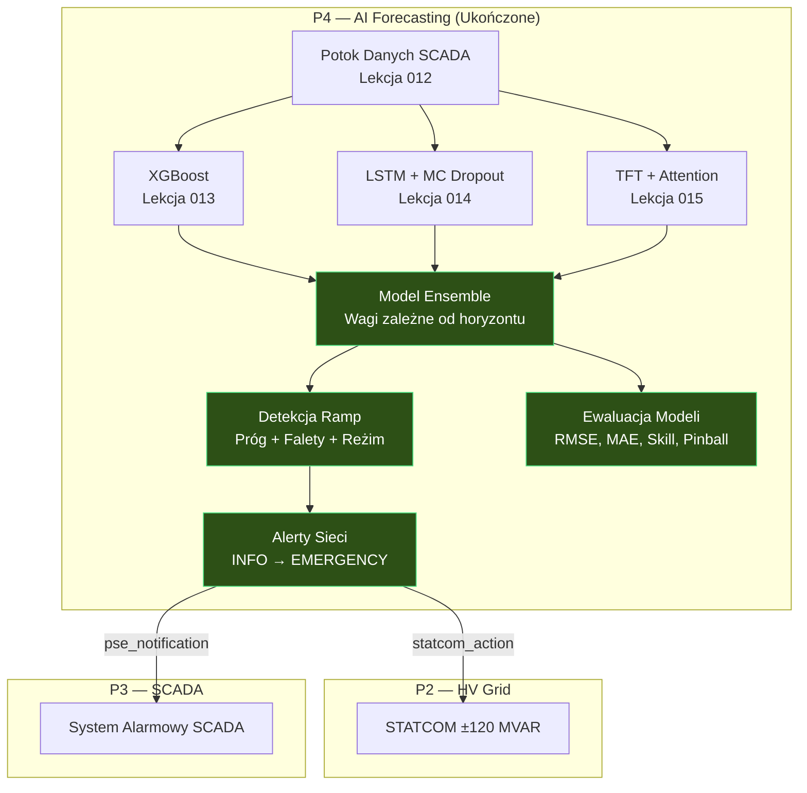

# Lekcja 016 — Prognozowanie Ensemble, Detekcja Ramp i Ewaluacja Modeli

!!! abstract "Nawigacja lekcji"
    :material-arrow-left: **Poprzednia:** [Lekcja 015 — TFT: Prognozowanie mocy wielohoryzontowe z mechanizmem uwagi](lesson-015.md) | **Następna:** [Lekcja 017 — P5 Uruchomienie: Program Łączeń, Maszyna Stanów i Zarządzanie Izolacją LOTO](lesson-017.md) :material-arrow-right:

    **Faza:** P4 | **Język:** Polski | **Postęp:** 16 z 19 | [Wszystkie lekcje](index.md) | [Plan nauki](../../Learning_Roadmap.md)

> **Data:** 2026-02-27
> **Commity:** 1 commit (`6723f54`)
> **Zakres commitów:** `b942b39..6723f54ea83068016a9fb1e36689179e533d58a2`
> **Faza:** P4 (AI Forecasting)
> **Sekcje roadmapy:** [Phase 4 — Section 4.1 Time-Series Evaluation Metrics, Section 4.4 Wind Power Forecasting, Section 4.3 Ensemble Methods]
> **Język:** Polski
> **Poprzednia lekcja:** Lesson 015
> **last_commit_hash:** 6723f54ea83068016a9fb1e36689179e533d58a2

---

## Czego się nauczysz

- Dlaczego horyzontowo zależne ważenie ensemble (horizon-dependent ensemble) daje bardziej wiarygodne prognozy niż pojedynczy model
- Trzech metod detekcji zdarzeń ramp: progowej (threshold), falkowej CWT oraz klasyfikacji reżimowej
- Jak alerty stabilności sieci łączą prognozowanie P4 ze STATCOM (P2) i SCADA (P3)
- Deterministycznych (RMSE, MAE, MAPE, R², Skill Score) i probabilistycznych (pinball loss, quantile coverage) metryk ewaluacji modeli
- Metod porównywania i rankingowania czterech modeli (XGBoost, LSTM, TFT, Ensemble) zestawionych obok siebie

---

## Sekcja 1: Horyzontowo Zależne Prognozowanie Ensemble — Dlaczego Jeden Model Nie Wystarczy?

### Problem z realnego świata

Wyobraź sobie szpital, w którym pracuje trzech różnych specjalistów: jeden doskonały w nagłych przypadkach (szybka diagnoza), drugi specjalizujący się w chorobach przewlekłych (długoterminowa opieka), a trzeci lekarz ogólny (dobry w każdej dziedzinie). W zależności od stanu pacjenta zmienia się to, czyją opinii przypisujesz większą wagę — w nagłych przypadkach liczy się słowo specjalisty medycyny ratunkowej, a przy długoterminowym planie leczenia prym wiedzie ekspert od chorób przewlekłych.

W prognozowaniu mocy wiatru obowiązuje ta sama zasada: XGBoost szybko wychwytuje wzorce w najnowszych danych na krótkim horyzoncie (< 6 godzin), LSTM zapamiętuje zależności czasowe na średnim horyzoncie (6–24 godziny), a TFT dzięki mechanizmowi uwagi wielohoryzontowej daje najbardziej spójne wyniki na długim horyzoncie (24–48 godzin).

### Co mówią standardy

**IEC 61400-26-3 (Wind turbines — Availability for wind power stations)** zaleca stosowanie prognoz łączonych (combined forecasts) do dyspozycjonowania sieciowego (grid dispatch). Wzięcie ważonej średniej z kilku modeli zamiast jednego ogranicza błędy systematyczne — zasada ta znana jest w literaturze statystycznej jako „forecast combination puzzle" (Bates & Granger, 1969).

**PSE IRiESP** określa limity tempa zmian mocy (ramp rate): jeśli duża elektrownia wiatrowa straci nagle więcej niż 20% swojej zdolności (ramp-down), operator systemu przesyłowego (PSE) musi zostać powiadomiony.

### Co zbudowaliśmy

**Zmienione pliki:**
- `backend/app/services/p4/ensemble_model.py` — Horyzontowo zależny model ensemble: harmonogram wag XGB/LSTM/TFT
- `backend/app/routers/p4.py` — Endpoint API `/predict-ensemble`
- `backend/app/schemas/forecast.py` — Schematy Pydantic `EnsemblePredictRequest/Response`

Model ensemble sprawdza horyzont prognozy (forecast horizon) dla każdego kroku czasowego i wybiera odpowiedni zestaw wag. Przy rozdzielczości SCADA równej 10 minut kroki 0–35 to „krótki horyzont" (0–6 h), kroki 36–143 to „średni horyzont" (6–24 h), a kroki 144+ to „długi horyzont" (24–48 h).

### Dlaczego to jest ważne

> **Dlaczego** jeden model XGBoost nie wystarczy?
> Ponieważ każdy model ma inny horyzont, na którym jest najsilniejszy. XGBoost bardzo dobrze radzi sobie na krótkim horyzoncie z tabelarycznymi danymi, ale nie uczy się bezpośrednio zależności czasowych (temporal dependencies). LSTM dzięki pamięci sekwencyjnej wychwytuje średni horyzont, lecz na długim horyzoncie może napotykać problem zanikającego gradientu (vanishing gradient). Mechanizm uwagi TFT modeluje długoterminowe zależności bezpośrednio — jednak na krótkim horyzoncie niesie nadmierny koszt parametrów w porównaniu z prostszymi modelami.

> **Dlaczego** stosujemy wagi zależne od horyzontu zamiast stałych?
> Ponieważ relatywna wydajność modeli zmienia się wraz z horyzontem prognozy. Stałe ważenie 33%/33%/33% rozmywa przewagę XGBoost na krótkim horyzoncie oraz przewagę TFT na długim. Wagi zależne od horyzontu wyciągają na pierwszy plan każdy model w przedziale, w którym jest najsilniejszy.

### Przegląd kodu

Harmonogram wag (weight schedule) jest zdefiniowany zgodnie z Roadmap §5.6. Dla każdego pasma horyzontowego wagi XGB, LSTM i TFT sumują się do 1,0 — ten warunek jest gwarantowany przez walidację w `__post_init__`:

```python
@dataclass(frozen=True)
class HorizonWeights:
    """Wagi dla jednego pasma horyzontu."""
    label: str
    xgb_weight: float   # waga XGBoost [0,1]
    lstm_weight: float   # waga LSTM [0,1]
    tft_weight: float    # waga TFT [0,1]

    def __post_init__(self) -> None:
        """Sprawdź, czy wagi sumują się do 1,0."""
        total = self.xgb_weight + self.lstm_weight + self.tft_weight
        if abs(total - 1.0) > 1e-6:
            msg = f"Weights must sum to 1.0, got {total:.6f}"
            raise ValueError(msg)
```

Następnie dla każdego kroku czasowego wybierany jest odpowiedni zestaw wag. Funkcja `get_horizon_weights` przyjmuje indeks kroku i określa, do którego pasma horyzontowego należy:

```python
# Granice pasm horyzontu (kroki 10-minutowe)
SHORT_HORIZON_STEPS = 36    # 0-6 h   → 36 kroków
MEDIUM_HORIZON_STEPS = 144  # 6-24 h  → 144 kroków
LONG_HORIZON_STEPS = 288    # 24-48 h → 288 kroków

# Harmonogram wag (Roadmap §5.6):
#   < 6h:    XGB 0.50 + LSTM 0.30 + TFT 0.20
#   6–24h:   XGB 0.20 + LSTM 0.40 + TFT 0.40
#   24–48h:  XGB 0.10 + LSTM 0.30 + TFT 0.60

def get_horizon_weights(step_index: int, config: EnsembleConfig) -> HorizonWeights:
    if step_index < SHORT_HORIZON_STEPS:
        return config.short_weights      # przewaga XGB
    if step_index < MEDIUM_HORIZON_STEPS:
        return config.medium_weights     # wyważone LSTM i TFT
    return config.long_weights           # przewaga TFT
```

Po prognozie stosowane są dwie krytyczne operacje: (1) monotoniczność kwantylowa (P10 ≤ P50 ≤ P90) oraz (2) ograniczenia fizyczne (moc znamionowa, cut-in/cut-out). Kolejność ma znaczenie — najpierw koryguje się monotoniczność, potem stosuje ograniczenia fizyczne, a następnie ponownie sprawdza się monotoniczność.

### Kluczowe pojęcie

!!! tip "Kluczowe pojęcie: Forecast Combination Puzzle (Paradoks łączenia prognoz)"
    **Wyjaśnij prosto:** Poproś trzech znajomych o typowanie wyniku meczu piłki nożnej. Każdy z osobna może trafiać przeciętnie, ale średnia z ich trzech typów najczęściej bije najlepszy indywidualny typ. To fakt znany statystykom od 1969 roku.

    **Analogia:** Pomyśl o systemie ławy przysięgłych — wyrok jednego sędziego może być błędny, ale ważone głosowanie wielu sędziów ogranicza błędy systematyczne.

    **W tym projekcie:** Przewaga XGBoost na krótkim horyzoncie, siła LSTM na średnim i spójność TFT na długim — połączone wagami zależnymi od horyzontu — dają prognozę, która na każdym horyzoncie dorównuje (lub przewyższa) najlepszy indywidualny model. Dla naszej farmy 510 MW oznacza to mniej kar za odchylenia w dyspozycjonowaniu (dispatch) i bardziej niezawodną eksploatację.

---

## Sekcja 2: Detekcja Ramp — System Wczesnego Ostrzegania dla Sieci

### Problem z realnego świata

Wyobraź sobie jazdę autostradą w gęstej mgle. Nie widzisz zwalniających aut — ale system radarowy twojego pojazdu wykrywa spowolnienie przed tobą i ostrzega z wyprzedzeniem. Detekcja ramp pełni tę samą rolę: wykrywa gwałtowne zmiany mocy (ramp events) w danych prognostycznych zanim nadejdzie burza i ostrzega operatora sieci.

Gdy front burzowy zbliża się do Morza Bałtyckiego, nasza farma 510 MW może spaść z pełnej mocy do zera w ciągu minut. Takie nagłe straty mocy (ramp-down) zagrażają częstotliwości sieci. Detekcja ramp wychwytuje te zdarzenia na etapie prognozy, dając operatorowi PSE czas na reakcję.

### Co mówią standardy

**IEC 61400-26-3** wymaga identyfikacji i raportowania zdarzeń rampowych w ramach oceny zmienności mocy (power variability assessment). **Kodeks sieciowy PSE IRiESP** nakłada obowiązek powiadomienia OSP (PSE) w przypadku przekroczenia przez dużą elektrownię limitów tempa zmian mocy.

**Cutler et al. (2007)** klasyfikuje metody detekcji ramp w trzech kategoriach: progowej (prosta, podstawowa), falkowej (wielorozdzielczościowej) i statystycznej klasyfikacji (reżimowej). Stosujemy wszystkie trzy.

### Co zbudowaliśmy

**Zmienione pliki:**
- `backend/app/services/p4/ramp_detection.py` — Trójmetodowa detekcja ramp + system alertów sieci
- `backend/app/routers/p4.py` — Endpoint API `/detect-ramps`
- `backend/app/schemas/forecast.py` — `RampDetectRequest/Response`, `RampEventSchema`, `GridAlertSchema`

Zbudowaliśmy trzy uzupełniające się metody detekcji oraz system alarmowy przekształcający ich wyniki w alerty sieci. Każda metoda ma inną mocną stronę — razem niezawodnie odróżniają prawdziwe zdarzenia rampowe od szumu w sygnałach.

### Dlaczego to jest ważne

> **Dlaczego** prosta wartość progowa (threshold) nie wystarczy?
> Ponieważ metoda progowa wychwytuje tylko nagłe, strome rampy. Jeśli gradient rozkłada się na wiele kroków czasowych (powolny, ale ciągły spadek), próg nie jest przekroczony, choć łączna strata może być duża. Metoda falkowa, analizując sygnał w różnych skalach czasowych, potrafi wychwycić te „ukryte" rampy.

> **Dlaczego** dodajemy też klasyfikację reżimową?
> Ponieważ operatorzy potrzebują odpowiedzi na pytanie „w jakim reżimie jest teraz farma wiatrowa?": spokojnym (calm), wznoszącym (ramp_up), opadającym (ramp_down). Daje to świadomość sytuacyjną w czasie rzeczywistym i może być wyświetlane na ekranie SCADA.

### Przegląd kodu

Wszystkie trzy metody przyjmują te same dane wejściowe (tablicę mocy w MW) i zwracają obiekty `RampEvent`. Najpierw obliczany jest gradient (szybkość zmiany mocy):

```python
def _compute_gradient_mw_hr(power_mw: NDArray[np.float64]) -> NDArray[np.float64]:
    """Oblicz gradient MW/h metodą różnic centralnych (central differences).

    np.gradient stosuje różnice centralne dla punktów wewnętrznych
    i jednostronne dla granic.
    Wynik konwertowany jest do MW/h (mnożnik: kroki/h).
    """
    grad_per_step = np.gradient(power_mw)
    result: NDArray[np.float64] = grad_per_step * STEPS_PER_HOUR  # 6 kroków/h
    return result
```

Do metody falkowej stosujemy faletę Rickera (Mexican hat). Ponieważ `scipy.signal.cwt` zostało usunięte w scipy ≥ 1.15, napisaliśmy własną implementację CWT:

```python
def _ricker_wavelet(points: int, scale: float) -> NDArray[np.float64]:
    """Faleta Rickera (Mexican hat).
    ψ(t) = (2 / (√3σ π^(1/4))) × (1 - (t/σ)²) × exp(-t²/(2σ²))
    """
    a = float(scale)
    vec = np.arange(-points // 2, points // 2 + 1, dtype=np.float64)
    tsq = (vec / a) ** 2
    mod = 1.0 - tsq
    gauss = np.exp(-tsq / 2.0)
    total = mod * gauss
    norm = np.sqrt(a)      # normalizacja energii jednostkowej
    result: NDArray[np.float64] = total / norm
    return result
```

Współczynniki falkowe filtrowane są adaptywnym progiem 2σ, a sztuczne podziały wynikające z dodatnich i ujemnych płatów faletki Rickera łączone są parametrem `merge_gap`. Ten szczegół jest kluczowy dla praktycznej użyteczności detekcji opartej na CWT.

Poziomy alertów definiowane są jako procenty zdolności farmy (510 MW) — progi wynikają bezpośrednio z kodeksu sieciowego PSE:

```python
# Progi alertów sieci (względem zdolności farmy)
FARM_CAPACITY_MW = 510.0
ALERT_WARNING_PCT  = 0.10  # 10% = 51 MW  → zwiększ wsparcie STATCOM
ALERT_CRITICAL_PCT = 0.20  # 20% = 102 MW → powiadom PSE, przygotuj rezerwy
ALERT_EMERGENCY_PCT = 0.40 # 40% = 204 MW → tryb FRT, protokół awaryjny PSE
```

### Kluczowe pojęcie

!!! tip "Kluczowe pojęcie: Ciągła Transformata Falkowa (Continuous Wavelet Transform)"
    **Wyjaśnij prosto:** Słuchając muzyki, chcesz zobaczyć w jakiej nucie grany jest utwór w danej sekundzie — tworzysz wykres „nuta–czas". Transformata falkowa robi to samo dla sygnału mocy: odpowiada na pytanie „zmiana z jaką szybkością nastąpiła w jakim przedziale czasu?".

    **Analogia:** Pomyśl o sejsmografie sejsmicznym — ten sam wstrząs możesz analizować różnymi filtrami częstotliwości. Na niskiej częstotliwości widzisz duże, wolne ruchy, na wysokiej — małe, szybkie drgania. CWT robi to samo dla sygnału mocy.

    **W tym projekcie:** W mocy wyjściowej naszej farmy 510 MW nagłe spadki w ciągu 10 minut (scale=3) i powolne zmniejszanie się przez 6 godzin (scale=24) reprezentują różne poziomy zagrożenia. Faleta wykrywa obydwa jednocześnie — prosta metoda progowa wychwytuje tylko jedno.

---

## Sekcja 3: Alerty Stabilności Sieci — Most od P4 do P2 i P3

### Problem z realnego świata

Wyobraź sobie centrum zarządzania ruchem drogowym: gdy dojdzie do wypadku na autostradzie, zapadają decyzje dotyczące nie tylko kamer w tym punkcie, ale całego systemu — kierowane są karetki, zmieniane sygnalizacje, otwierane objazdy. Detekcja ramp sygnalizuje, że „zdarzył się wypadek"; alerty sieci mówią „który system ma co zrobić".

### Co mówią standardy

**PSE IRiESP** zobowiązuje duże elektrownie do raportowania nagłych zmian mocy do OSP. **ENTSO-E NC RfG Type D** (dla instalacji ≥ 75 MW) wymaga zdolności FRT (Fault Ride-Through) oraz kompensacji mocy biernej, np. za pomocą STATCOM, dla zapewnienia stabilności częstotliwości. Nasz system alertów bezpośrednio i programowo egzekwuje te wymagania.

### Co zbudowaliśmy

**Zmienione pliki:**
- `backend/app/services/p4/ramp_detection.py` — funkcja `generate_grid_alerts()`
- `backend/app/routers/p4.py` — generowanie alertów w endpoincie `/detect-ramps`

System alertów stabilności sieci bezpośrednio łączy wyniki prognozowania P4 ze sterowaniem mocą bierną STATCOM (P2) i powiadomieniami operatora SCADA (P3). Alerty wyzwalają wyłącznie zdarzenia ramp-down — zdarzenia ramp-up (więcej mocy) nie stanowią zagrożenia dla sieci.

### Dlaczego to jest ważne

> **Dlaczego** alerty wyzwalają tylko zdarzenia ramp-down?
> Ponieważ w scenariuszach zagrożenia stabilności częstotliwości sieci krytyczna jest utrata mocy. Nagły spadek z 510 MW do 200 MW powoduje odchylenie częstotliwości w sieci PSE. Ramp-up (np. wzrost z 200 MW do 510 MW) jest zazwyczaj łagodnie zarządzany przez automatykę regulacji generatorów.

> **Dlaczego** akcja STATCOM jest uwzględniona w alercie?
> Ponieważ utrzymanie równowagi mocy biernej podczas zdarzenia rampowego jest kluczowe. STATCOM z pojemnością ±120 MVAR kompensuje spadki napięcia. Automatyczna zmiana trybu STATCOM odpowiednio do poziomu alertu chroni system bez oczekiwania na interwencję operatora.

### Przegląd kodu

Logika alertów stosuje cztery poziomy. Każdy poziom zawiera zarówno komunikat dla operatora, jak i zalecenie akcji STATCOM:

```python
def generate_grid_alerts(events: list[RampEvent]) -> list[GridStabilityAlert]:
    """Generuj alerty sieci dla zdarzeń ramp-down.

    Tylko ramp-down → ryzyko częstotliwości sieci.
    Ramp-up → korzystny, nie wymaga działania.
    """
    for event in events:
        if event.direction != RampDirection.DOWN:
            continue  # tylko zdarzenia spadkowe

        pct = event.magnitude_mw / FARM_CAPACITY_MW  # ułamek z 510 MW

        if pct >= 0.40:      # > 204 MW straty
            # EMERGENCY: tryb FRT + protokół awaryjny PSE
            statcom_action = "FRT mode — maximum reactive injection ±120 MVAR"
            pse_notification = True
        elif pct >= 0.20:    # > 102 MW straty
            # CRITICAL: powiadom PSE, przygotuj rezerwy
            statcom_action = "Increase reactive output to ±80 MVAR"
            pse_notification = True
        elif pct >= 0.10:    # > 51 MW straty
            # WARNING: zwiększ wsparcie STATCOM
            statcom_action = "Increase reactive output to ±60 MVAR"
            pse_notification = False
        else:                # < 51 MW
            # INFO: obserwuj, brak akcji
            statcom_action = "Normal operation"
            pse_notification = False
```

Struktura ta jest zaprojektowana tak, aby bezpośrednio integrować się z modelem STATCOM (±120 MVAR) zbudowanym w P2 oraz z systemem alarmowym SCADA w P3. Poziomy alertów odpowiadają kolorom SCADA: INFO → zielony, WARNING → żółty, CRITICAL → pomarańczowy, EMERGENCY → czerwony.

### Kluczowe pojęcie

!!! tip "Kluczowe pojęcie: Integracja Wielosystemowa (Cross-System Integration)"
    **Wyjaśnij prosto:** Gdy w twoim domu zadziała alarm pożarowy, uruchamia się nie tylko syrena — włączają się też zraszacze, otwierają automatyczne drzwi i wzywana jest straż pożarna. Jeden czujnik uruchamia wiele systemów.

    **Analogia:** Efekt domina — ale kontrolowany i zaplanowany. Model prognostyczny P4 mówi „nadchodzi burza", STATCOM P2 zmienia tryb mocy biernej, SCADA P3 wysyła alarm do operatora.

    **W tym projekcie:** Łańcuch: detekcja ramp (P4) → zalecenie akcji STATCOM (P2) → alarm SCADA (P3) symuluje mechanizm automatycznej odpowiedzi prawdziwego systemu sterowania farmą wiatrową. To wzajemne „rozmawianie" tych trzech projektów jest najbardziej wartościowym aspektem portfolio.

---

## Sekcja 4: Metryki Ewaluacji Modeli — Który Model Jest Lepszy?

### Problem z realnego świata

Chcesz ustalić, który z dwóch kucharzy jest lepszy. Jeśli jednego oceniasz przez „jak smaczne są dania?" (średnia ocena), a drugiego przez „jakie najgorsze danie mu wyszło?" (największy błąd), nie dokonujesz uczciwego porównania. Ten sam problem dotyczy ewaluacji modeli: jedna metryka (np. RMSE) nie opowiada całej historii. Różne metryki odpowiadają na różne pytania.

### Co mówią standardy

**IEC 61400-26-3** określa metryki RMSE, MAE i prawdopodobieństwo pokrycia (coverage probability) dla oceny wydajności turbin wiatrowych. **Gneiting & Raftery (2007)** formalizują pojęcie „strictly proper scoring rules" w ewaluacji prognoz probabilistycznych — pinball loss jest jedną z nich.

### Co zbudowaliśmy

**Zmienione pliki:**
- `backend/app/services/p4/model_evaluation.py` — 7 metryk deterministycznych + 2 probabilistyczne, funkcja porównawcza
- `backend/app/routers/p4.py` — Endpoint API `/compare-models`
- `backend/app/schemas/forecast.py` — `ModelMetricsSchema`, `ModelCompareRequest/Response`

Czysto matematyczny moduł — bez zależności od modelu. Działa z dowolnym ciągiem prognoz. Ewaluuje cztery modele (XGBoost, LSTM, TFT, Ensemble) zestawione obok siebie i rankinguje je według RMSE.

### Dlaczego to jest ważne

> **Dlaczego** samo RMSE nie wystarczy?
> RMSE nieproporcjonalnie karze za duże błędy (kwadratowanie). W operacyjnym raportowaniu błędów dyspozycjonowania preferuje się MAE — jest bardziej interpretowalny: „średnio X MW błędu". MAPE z kolei umożliwia procentowe porównywanie farm różnej wielkości.

> **Dlaczego** stosujemy skill score?
> Ponieważ „RMSE = 5 MW" samo w sobie jest niejednoznaczne. Skill score odnosi wynik do modelu referencyjnego (persistence — użycie poprzedniej wartości jako prognozy). SS > 0 oznacza, że nasz model bije najprostsze podejście; SS < 0 oznacza, że jest gorszy nawet od kopiowania poprzedniej wartości.

### Przegląd kodu

Model persistence jest najprostszą prognozą szeregów czasowych: „przyszła wartość = bieżąca wartość". Skill score porównuje się właśnie z tym poziomem odniesienia:

```python
def compute_skill_score(
    actual: NDArray[np.float64],
    predicted: NDArray[np.float64],
) -> float:
    """Skill score względem baseline persistence.

    SS = 1 - MSE_model / MSE_persistence

    Persistence: P(t+1) = P(t). Czyli actual[:-1] → actual[1:] jest prognozą.
    SS > 0 → model lepszy niż persistence
    SS = 0 → model równoważny persistence
    SS < 0 → model gorszy niż persistence (wyrzuć model!)
    """
    persist_pred = actual[:-1]       # poprzednia rzeczywista wartość
    persist_actual = actual[1:]       # następna rzeczywista wartość

    mse_persist = float(np.mean((persist_actual - persist_pred) ** 2))
    mse_model = float(np.mean((actual - predicted) ** 2))

    if mse_persist == 0.0:
        return 1.0 if mse_model == 0.0 else 0.0
    return 1.0 - mse_model / mse_persist
```

Do prognoz probabilistycznych stosujemy pinball loss (quantile loss). Jest to kesinlikle uygun kural oceniania (strictly proper scoring rule) — zachęca model do produkowania prawdziwych wartości kwantylowych w celu uzyskania najlepszego wyniku:

```python
def compute_pinball_loss(
    actual: NDArray[np.float64],
    predicted: NDArray[np.float64],
    quantile: float,
) -> float:
    """Strata pinball (kwantylowa) — dla jednego poziomu kwantylowego.

    L_q(y, ŷ) = q × max(y - ŷ, 0) + (1-q) × max(ŷ - y, 0)

    Asymetryczna strata: prognoza P10 zbyt wysoka (rzeczywistość poniżej)
    jest mniej karana, prognoza P90 zbyt niska — też mniej.
    Ta asymetria jest naturą prognozy kwantylowej.
    """
    residual = actual - predicted
    loss = np.where(
        residual >= 0,
        quantile * residual,          # prognoza zbyt niska
        (quantile - 1.0) * residual,  # prognoza zbyt wysoka
    )
    return float(np.mean(loss))
```

Na koniec `compare_models()` rankinguje wszystkie modele obok siebie. Stosowane są trzy kryteria: najniższe RMSE, najwyższy skill score i najlepsza kalibracja P90 (idealnie pokrycie P90 = 0,90):

```python
def compare_models(model_results: list[ModelMetrics]) -> ModelComparisonResult:
    # Rankingowanie według RMSE (rosnąco — najlepszy na początku)
    sorted_by_rmse = sorted(model_results, key=lambda m: m.rmse_mw)
    ranking = [m.model_name for m in sorted_by_rmse]

    # Najwyższy skill score
    best_skill = max(model_results, key=lambda m: m.skill_score).model_name

    # Najlepsza kalibracja P90 (najbliższa 0,90)
    def calibration_error(m: ModelMetrics) -> float:
        p90_cov = m.quantile_coverage.get("P90", 0.0)
        return abs(p90_cov - 0.90)

    best_calibration = min(model_results, key=calibration_error).model_name
```

To wielowymiarowe porównanie pokazuje, że pytanie „który model jest najlepszy we wszystkich sytuacjach?" zazwyczaj nie ma jednej odpowiedzi. Jeden model może dominować w RMSE, podczas gdy inny przoduje w kalibracji.

### Kluczowe pojęcie

!!! tip "Kluczowe pojęcie: Strictly Proper Scoring Rules (Ściśle Właściwe Reguły Oceniania)"
    **Wyjaśnij prosto:** Wyobraź sobie pytanie egzaminacyjne zaprojektowane tak, że student, który naprawdę zna odpowiedź, zawsze dostaje najwyższy wynik — i nie może go poprawić przez zgadywanie ani zawyżanie. To jest właśnie „ściśle właściwa" reguła oceniania.

    **Analogia:** W pokerze blef czasem działa, ale na dłuższą metę wygrywa ten, kto gra uczciwie swoimi kartami. Pinball loss w podobny sposób zmusza model do „uczciwości" — prognozowanie prawdziwego P10 zawsze daje lepszy wynik niż celowe zaniżanie lub zawyżanie.

    **W tym projekcie:** Oceniamy jakość naszych prognoz P10/P50/P90 za pomocą pinball loss. Prognoza P10 oznacza „poziom, poniżej którego rzeczywista wartość spadnie z prawdopodobieństwem 10%". Jeśli model tego nie nauczył się, pinball loss jest wysoka i pojawia się błąd kalibracji.

---

## Sekcja 5: Integracja API i Pokrycie Testami

### Problem z realnego świata

W restauracji przygotowuje się wyśmienite dania, ale bez kelnera serwującego je gościom, smaki są bezużyteczne. Endpointy API są „kelnerami" serwisów backendowych — prezentują obliczenia wewnętrzne światu zewnętrznemu. A testy to kontrola jakości zapewniająca, że każde zamówienie dotrze prawidłowo.

### Co mówią standardy

Do projektowania RESTful API stosujemy metodę `POST`, ponieważ nasze żądania zawierają parametry obliczeniowe (RFC 7231). Walidacja wejściowa za pomocą schematów Pydantic v2 zapewnia bezpieczeństwo na poziomie API (OWASP Input Validation). 41 testów gwarantuje oczekiwane zachowanie każdej funkcji.

### Co zbudowaliśmy

**Zmienione pliki:**
- `backend/app/routers/p4.py` — 3 nowe endpointy: `/predict-ensemble`, `/detect-ramps`, `/compare-models`
- `backend/app/services/p4/__init__.py` — Dodanie wszystkich nowych modułów do publicznego API
- `backend/tests/test_ensemble_model.py` — 11 testów (wagi ensemble, prognoza, ograniczenia)
- `backend/tests/test_model_evaluation.py` — 15 testów (każda metryka + porównanie)
- `backend/tests/test_ramp_detection.py` — 15 testów (trzy metody + alerty)

Trzy endpointy współdzielą tę samą funkcję pomocniczą: `_build_all_model_forecasts()`. Trenuje ona XGBoost, LSTM i TFT, wykonuje prognozy i zwraca wyrównane tablice wyników. Zasada DRY — zamiast pisać ten sam pipeline trzy razy, definiuje się go w jednym miejscu.

### Dlaczego to jest ważne

> **Dlaczego** stosujemy wspólną funkcję pomocniczą (`_build_all_model_forecasts`)?
> Ponieważ endpointy ensemble, detekcji ramp i porównania modeli wszystkie współdzielą krok „wytrenuj trzy modele i wykonaj prognozę". Powtarzanie tego kroku w każdym endpoincie utrudnia utrzymanie kodu i zwiększa ryzyko błędów. Jedna funkcja oznacza jedno miejsce do aktualizacji.

> **Dlaczego** piszemy 41 testów?
> Ponieważ moduły matematyczne mogą generować wyniki „błędne, ale wyglądające sensownie". Bez testowania przypadków brzegowych (wszystkie wartości takie same, wartości ujemne, dzielenie przez zero) funkcji RMSE, twoje zaufanie do produkcji jest złudne. 41 testów weryfikuje kontrakt (contract) każdej funkcji.

### Przegląd kodu

Helper `_build_all_model_forecasts` trenuje wszystkie modele i je wyrównuje. Kluczowy punkt: ponieważ LSTM i TFT wymagają bufora lookback, długość wyjściowa każdego modelu może się różnić. Wyrównujemy wszystkie wyjścia do najkrótszego przez `n = min(...)`:

```python
def _build_all_model_forecasts(
    num_turbines, num_timesteps, turbine_index, horizon_steps, seed
) -> tuple[ModelForecasts, np.ndarray]:
    """Wytrenuj trzy modele i zwróć wyrównane tablice prognoz."""
    # ...pipeline trenowania...

    # wyrównaj wyjścia do najkrótszej tablicy
    n = min(
        len(xgb_forecast.power_p50_mw),
        len(lstm_forecast.power_p50_mw),
        len(tft_forecast.power_p50_mw),
        horizon,
    )
    # weź ostatnie n elementów z każdego — zachowuje wyrównanie czasowe
    forecasts = ModelForecasts(
        xgb_p10=xgb_forecast.power_p10_mw[-n:],
        # ...pozostałe tablice...
    )
    return forecasts, actual[-n:]
```

W pliku `__init__.py` wszystkie nowe klasy i funkcje zostały dodane do listy `__all__` — definiuje to publiczne API modułu w sposób jawny i zasila autouzupełnianie IDE oraz narzędzia analizy statycznej.

### Kluczowe pojęcie

!!! tip "Kluczowe pojęcie: Zasada DRY (Don't Repeat Yourself)"
    **Wyjaśnij prosto:** Jeśli zapisałeś swój numer telefonu na 10 różnych kartkach i numer się zmieni, musisz zaktualizować wszystkie 10. Ale jeśli zapiszesz go w jednej książce adresowej i stamtąd do niej odsyłasz, aktualizujesz tylko jedno miejsce.

    **Analogia:** W fabryce z jednej formy odlewa się tysiące części. Jeśli forma jest wadliwa, poprawia się ją raz — zamiast naprawiać każdą część osobno.

    **W tym projekcie:** `_build_all_model_forecasts()` definiuje wspólny pipeline trzech endpointów w jednym miejscu. Jeśli jutro do LSTM zostanie dodany nowy hiperparametr, aktualizujemy tylko tę jedną funkcję — nie trzeba dotykać trzech endpointów osobno.

---

## Powiązania

**Dokąd zmierzają te koncepcje w kolejnym kroku:**

- **Model ensemble** → W fazie P5 uruchomienia, podczas pierwszej weryfikacji produkcji energii przez farmę (SAT — Site Acceptance Test), prognoza ensemble zostanie porównana z rzeczywistą produkcją. Skill score będzie używany jako kryterium akceptacji.
- **Detekcja ramp** → W interfejsie frontendowym (React + Plotly.js) wizualizacja ramp w czasie rzeczywistym i kolorowe alerty SCADA zostaną dodane w fazie P5.
- **Ewaluacja modeli** → Analiza, który model dominuje w różnych porach roku i różnych reżimach wiatrowych, przygotuje grunt pod przyszłą sezonową adaptację wag (seasonal weight adaptation).
- **Alerty stabilności sieci** ← Bezpośrednio łączą się z modelem STATCOM (±120 MVAR) z P2 oraz systemem alarmowym SCADA z P3 — pola `statcom_action` i `pse_notification` zdefiniowane w tej lekcji będą zapisywane do dziennika zdarzeń SCADA P3.

---

## Wielki obraz

*Fokus tej lekcji: **Ukończenie warstwy prognozowania P4 — przekształcenie prognoz pojedynczych modeli w operacyjny system wsparcia decyzji za pomocą infrastruktury ensemble, detekcji ramp i ewaluacji**.*



*Pełna architektura systemu: zob. [Przegląd lekcji](index.md#system-architecture).*

---

## Kluczowe wnioski

1. **Prognozowanie ensemble** opiera się na zasadzie „forecast combination puzzle": ważona średnia wielu modeli jest zazwyczaj bardziej wiarygodna niż najlepszy pojedynczy model.
2. **Wagi zależne od horyzontu** eksponują każdy model w przedziale czasu, w którym jest najsilniejszy — XGB na krótkim horyzoncie, TFT na długim.
3. **Detekcja ramp stosuje trzy metody**: progową (prosta i szybka), falkową (wieloskalowa), reżimową (świadomość operacyjna) — łączne stosowanie zwiększa niezawodność.
4. **Alerty sieci** to integracja wielosystemowa bezpośrednio łącząca warstwę prognozowania (P4) z sterowaniem STATCOM (P2) i powiadomieniami SCADA (P3).
5. **Skill score** obiektywnie odpowiada na pytanie „czy nasz model jest lepszy niż najprostsze podejście?" — samo RMSE tego nie powie.
6. **Pinball loss** jest ściśle właściwą regułą oceniania dla prognoz probabilistycznych (P10/P50/P90) — zachęca model do produkowania prawdziwych wartości kwantylowych.
7. **41 testów** zapobiega generowaniu przez moduły matematyczne wyników „błędnych, ale wyglądających sensownie" i gwarantuje kontrakt każdej funkcji.

---

## Zalecana lektura

*[Plan nauki](../../Learning_Roadmap.md) — Faza 4: Machine Learning for Energy*

| Źródło | Typ | Dlaczego warto przeczytać |
|--------|-----|--------------------------|
| Hyndman & Athanasopoulos — *Forecasting: Principles and Practice* (3rd Ed.) | Podręcznik online (bezpłatny) | Podstawowe odniesienie dla kombinacji prognoz, metryk ewaluacji i skill score |
| Gneiting & Raftery (2007) — *Strictly Proper Scoring Rules* | Artykuł naukowy | Wyjaśnia, dlaczego pinball loss jest złotym standardem ewaluacji kwantylowej |
| IEA Wind TCP Task 36 — *Forecasting for Wind Power* | Raport (bezpłatny) | Branżowa perspektywa metod ensemble i detekcji ramp w prognozowaniu mocy wiatru |
| Cutler et al. (2007) — Wind power ramp event detection | Artykuł naukowy | Oryginalna klasyfikacja trzech metod detekcji ramp stosowanych w tej lekcji |
| Sweeney et al. (2020) — *The future of forecasting for renewable energy* | Artykuł w czasopiśmie | Kompleksowe opracowanie dotyczące metod ensemble, ramp i ewaluacji z perspektywą przyszłości |

---

## Rozmowa kwalifikacyjna — sprawdź swoje rozumienie

### Pytania sprawdzające pamięć

**P1:** W horyzontowo zależnym modelu ensemble, jakie są wagi XGBoost, LSTM i TFT dla horyzontu prognozy krótszego niż 6 godzin?

<details>
<summary>Odpowiedź</summary>

Krótki horyzont (< 6h): XGB 0,50, LSTM 0,30, TFT 0,20. XGBoost otrzymuje najwyższą wagę, ponieważ gradient boosting na danych tabelarycznych najszybciej i najtrafniej wychwytuje ostatnie wzorce na krótkim horyzoncie.

</details>

**P2:** Jakie są trzy metody stosowane w detekcji ramp i jakie są zalety każdej z nich?

<details>
<summary>Odpowiedź</summary>

(1) Progowa (threshold): |ΔP/Δt| > konfigurowalny próg MW/h — prosta i szybka, podstawowa metoda detekcji. (2) Falkowa CWT: analiza wieloskalowa z faletą Rickera — wychwytuje rampy powolne, ale ciągłe. (3) Klasyfikacja reżimowa: klasyfikator stanów oparty na gradiencie {calm, ramp_up, ramp_down} — zapewnia świadomość operacyjną i pozwala wyświetlać bieżący stan na ekranie SCADA.

</details>

**P3:** Na jakim poziomie alertu system sieci wymaga powiadomienia PSE (OSP)?

<details>
<summary>Odpowiedź</summary>

Na poziomach CRITICAL (≥ 20%, czyli ≥ 102 MW straty) i EMERGENCY (≥ 40%, czyli ≥ 204 MW straty) parametr `pse_notification = True`. Na poziomach WARNING i INFO powiadomienie OSP nie jest wymagane — podejmowana jest tylko wewnętrzna akcja STATCOM.

</details>

### Pytania sprawdzające rozumienie

**P4:** Dlaczego stosujemy wagi zależne od horyzontu zamiast stałego ważenia 33%/33%/33%? Jaką wadą odznacza się stałe ważenie?

<details>
<summary>Odpowiedź</summary>

Stałe ważenie zakłada, że każdy model wnosi równy wkład na każdym horyzoncie — co jest nierealistyczne. XGBoost osiąga znacznie lepszą wydajność na krótkim horyzoncie, podczas gdy na długim mechanizm uwagi TFT wysuwa się na prowadzenie. Stałe 33% rozmywa na krótkim horyzoncie silny sygnał XGBoost szumem LSTM i TFT, a na długim — zatruca przewagę TFT rosnącym błędem XGBoost. Wagi zależne od horyzontu eksponują każdy model w przedziale, w którym jest najsilniejszy, optymalizując tym samym ogólną jakość prognozy na każdym horyzoncie.

</details>

**P5:** Co oznacza ujemny skill score i jak należy go interpretować?

<details>
<summary>Odpowiedź</summary>

Skill score < 0 oznacza, że nasz model wypada gorzej nawet od najprostszego baseline — persistence (użycia poprzedniej wartości jako prognozy). Jest to poważny sygnał ostrzegawczy: mimo stosowania złożonej architektury, model daje wyniki gorsze od „braku modelu". Zazwyczaj wskazuje to na fundamentalne problemy, takie jak overfitting, błędna inżynieria cech lub niedopasowanie modelu do danych. W praktyce takiego modelu nie należy wdrażać do produkcji — konieczna jest analiza przyczyn źródłowych.

</details>

**P6:** Dlaczego zdarzenia ramp-up nie wyzwalają alertów sieci? Czy nagły wzrost mocy nie może być problemem?

<details>
<summary>Odpowiedź</summary>

Z punktu widzenia stabilności częstotliwości sieci, nagła utrata mocy (ramp-down) jest krytycznym zagrożeniem zaburzającym równowagę produkcja-zapotrzebowanie — częstotliwość spada i przekaźniki ochronne mogą wejść w kaskadowe wyzwolenie. Ramp-up oznacza więcej energii i jest zazwyczaj łagodnie zarządzany przez system sterowania turbinami (regulacja skoku łopat). Ponadto nawet jeśli dodatkowa energia nieznacznie podniesie częstotliwość sieci, regulatory napięcia generatorów automatycznie to kompensują. Bardzo gwałtowne rampy-up mogą jednak powodować przepięcia — ten scenariusz zostanie omówiony w module FRT.

</details>

### Pytanie otwarte

**P7:** Nasz obecny model ensemble używa stałego harmonogramu wag (proporcje XGB/LSTM/TFT ustalone z góry). W środowisku produkcyjnym, jak można by wdrożyć automatyczną aktualizację wag na podstawie wydajności z ostatnich N dni (adaptacyjne ważenie)? Którą metrykę należy optymalizować i jakie ryzyka należy wziąć pod uwagę?

<details>
<summary>Odpowiedź</summary>

W adaptacyjnym ważeniu można obliczyć RMSE lub pinball loss każdego modelu w oknie kroczącym (rolling window, np. ostatnie 7 dni) dla każdego pasma horyzontu, a następnie aktualizować wagi odwrotnie proporcjonalnie do wydajności: `w_i = (1/loss_i) / Σ(1/loss_j)`. Metryka do optymalizacji zależy od przypadku użycia: RMSE do dyspozycjonowania, pinball loss do zarządzania ryzykiem (P10/P90). Ryzyka: (1) Concept drift — reżimy wiatrowe zmieniają się sezonowo; krótkie okno odzwierciedla ostatni sezon, ale może przeoczyć długoterminowe wzorce. (2) Overfitting to recent data — model, który uzyska wysoką wagę po kilku dobrych dniach, może się pogorszyć przy zmianie reżimu. (3) Niestabilność wag — małe różnice w wydajności mogą prowadzić do dużych oscylacji wag; zalecane jest wygładzanie przez exponential smoothing. (4) Cold start — gdy dodawany jest nowy model, nie ma historii wydajności; należy ustalić wagi startowe. W praktyce najczęściej stosuje się Bayesian Model Averaging (BMA) lub algorytmy online learning minimalizujące żal (regret-minimizing online learning, Cesa-Bianchi & Lugosi, 2006).

</details>

---

## Rozmowa kwalifikacyjna

### Wyjaśnij prosto
*„Jak wyjaśniłbyś dzisiejszy główny temat — prognozowanie ensemble, detekcję ramp i ewaluację modeli — osobie, która nie jest inżynierem?"*

Powiedzmy, że mamy farmę wiatrową — 34 ogromne turbiny wiatrowe wirujące na morzu. Musimy wiedzieć z wyprzedzeniem, ile energii elektrycznej będą produkować, ponieważ sieć elektroenergetyczna musi w każdej chwili równoważyć podaż i popyt. W tym celu używamy trzech różnych modeli prognostycznych — jeden jest dobry na krótki termin, drugi na średni, a trzeci na długi. Podobnie jak trzy różne aplikacje pogodowe: każda mówi nieco co innego, ale ich średnia jest zazwyczaj najtrafniejsza.

Jednak sama prognoza to za mało — trzeba też wychwytywać nagłe zmiany. Gdy nadchodzi burza, 510 megawatów mocy może spaść do zera w ciągu kilku minut. Zbudowaliśmy „system wczesnego ostrzegania" wykrywający to zjawisko z wyprzedzeniem. W zależności od skali fluktuacji system wydaje alarm: mały — tylko obserwujemy, duży — informujemy operatora sieci, bardzo duży — uruchamiamy tryb awaryjny.

Na koniec, aby odpowiedzieć na pytanie „który model prognostyczny jest najlepszy?", stworzyliśmy system kart wyników. Stosujemy wiele kryteriów — podobnie jak oceniając restaurację, bierzesz pod uwagę nie tylko smak, ale też obsługę, atmosferę i cenę. Dzięki temu wiemy, który model jest niezawodny w jakich warunkach.

### Wyjaśnij technicznie
*„Jak wyjaśniłbyś dzisiejszy główny temat — ensemble forecasting, ramp detection i model evaluation — panelowi rekrutacyjnemu?"*

W tym module przenieśliśmy warstwę prognozowania P4 na poziom operacyjnego systemu wsparcia decyzji za pomocą trzech kluczowych komponentów. Po pierwsze, zaprojektowaliśmy horyzontowo zależny model ensemble zgodnie z Roadmap §5.6: połączyliśmy prognozy XGBoost, LSTM i TFT za pomocą ważonej średniej zależnej od horyzontu. Harmonogram wag {< 6h: 0,50/0,30/0,20, 6–24h: 0,20/0,40/0,40, 24–48h: 0,10/0,30/0,60} optymalizuje empirycznie każdy model na horyzoncie, na którym jest najsilniejszy. Post-processing obejmuje ograniczenia fizyczne (moc znamionowa, cut-in/cut-out) oraz monotoniczność kwantylową (P10 ≤ P50 ≤ P90).

Po drugie, wdrożyliśmy trzy uzupełniające się metody detekcji ramp zgodne z limitami tempa zmian IEC 61400-26-3 i PSE IRiESP: progową (|ΔP/Δt| > 50 MW/h), CWT z faletą Rickera (wieloskalowa, własna implementacja dla zgodności ze scipy ≥ 1.15) oraz klasyfikator reżimowy oparty na gradiencie {calm, ramp_up, ramp_down}. Moduł alertów stabilności sieci przekształca zdarzenia ramp-down w czterostopniowe alerty (INFO/WARNING/CRITICAL/EMERGENCY), zapewniając integrację wielosystemową z akcjami sterowania STATCOM P2 i łańcuchem powiadomień SCADA P3.

Po trzecie, zbudowaliśmy kompleksowy moduł ewaluacji modeli w ramach IEC 61400-26-3 i ściśle właściwych reguł oceniania Gneitinga i Raftery'ego (2007). Metryki deterministyczne (RMSE, MAE, MAPE, R², skill score vs persistence) i probabilistyczne (quantile coverage, pinball loss) pozwalają porównywać cztery modele (XGBoost, LSTM, TFT, Ensemble) obok siebie i rankingować je według RMSE, skill i kalibracji. 41 testów weryfikuje wszystkie kontrakty obliczeniowe, w tym przypadki brzegowe.
