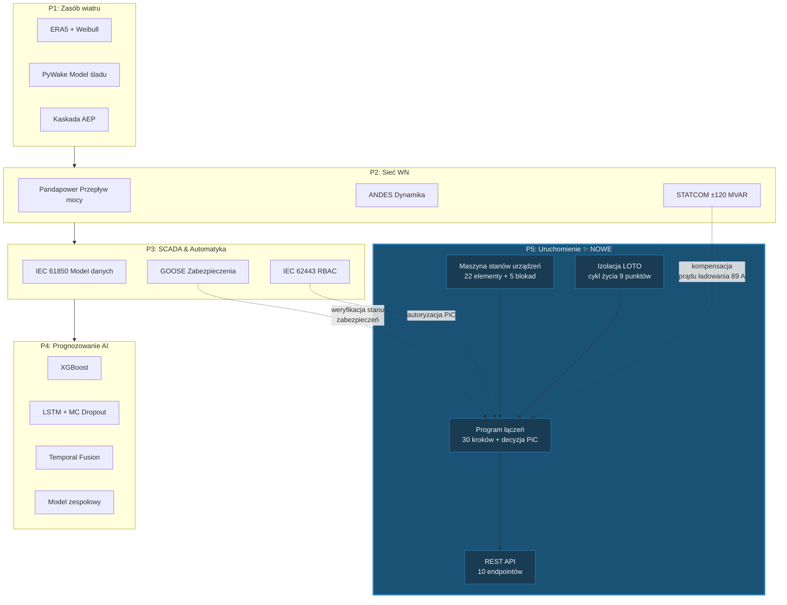

# Lekcja 017 — P5 Uruchomienie: Program Łączeń, Maszyna Stanów Urządzeń i Zarządzanie Izolacją LOTO

!!! abstract "Nawigacja lekcji"
    :material-arrow-left: **Poprzednia:** [Lekcja 016 — Prognozowanie zespołowe, wykrywanie ramp i ocena modeli](lesson-016.md) | **Następna:** [Lekcja 018 — Testy odbiorcze FAT/SAT, koordynacja przekaźników zabezpieczeniowych i brama SAT](lesson-018.md) :material-arrow-right:

    **Faza:** P5 | **Język:** Polski | **Postęp:** 17 z 19 | [Wszystkie lekcje](index.md) | [Plan nauki](../../Learning_Roadmap.md)

> **Data:** 2026-02-27
> **Commity:** 1 commit (`899acba`)
> **Zakres commitów:** `f18235d826b06a920d1cee16d8df00ed31f6cddd..899acbae30461a0b26d3672e0bba93a3026f01dc`
> **Faza:** P5 (Commissioning)
> **Sekcje roadmapy:** [Phase 5 — Section 5.1 HV Switching & Safety, Section 5.3 Testing & Commissioning]
> **Język:** Polski
> **Poprzednia lekcja:** Lesson 016
> **last_commit_hash:** 899acbae30461a0b26d3672e0bba93a3026f01dc

---

## Czego się nauczysz

- Dlaczego 22-elementowy rejestr urządzeń WN i pięciostanowa maszyna stanów (finite state machine) stanowią kluczową warstwę bezpieczeństwa
- Jak 5 blokad zgodnych z IEC 61936-1 zapobiega zwarciom i awariom łukowym
- Trójfazową strukturę 30-krokowego programu łączeń pierwszego załączenia napięcia w OSS (pre-check → załączenie napięcia → podłączenie turbin)
- Cykl życia punktu izolacji LOTO (Lock-Out/Tag-Out) i wymagania normy OSHA 1910.147
- Jak działa logika decyzyjna Person in Control (PiC), punkty wstrzymania (hold point) i mechanizm awaryjnego zatrzymania

---

## Sekcja 1: Maszyna stanów urządzeń — dlaczego zamknięcie wyłącznika jest tak skomplikowane?

### Problem z realnego świata

Wyobraź sobie wyłącznik światła w domu — włączasz, zapala się; wyłączasz, gaśnie. Proste. Teraz wyobraź sobie wyłącznik 220 kV: jeśli zamkniesz go w złej kolejności, zamkniesz go na uziemionej szynie, co wygeneruje trójfazowy prąd zwarciowy 102 kA. Niszczy to urządzenia w ciągu jednej dwudziestej sekundy (20 ms). W odróżnieniu od domowego przełącznika, w operacjach łączeniowych WN **kolejność** ratuje życie.

Dlatego właśnie używamy maszyny stanów: każdy element urządzenia może przechodzić tylko z **określonych stanów do określonych działań**, a przed każdym przejściem sprawdzane są **blokady obejmujące cały system**.

### Co mówią standardy?

- **IEC 61936-1:2021 §7.6**: „System blokad powinien uniemożliwiać wszelkie operacje łączeniowe, które mogłyby prowadzić do niebezpiecznej sytuacji." — Nasze 5 reguł blokad bezpośrednio realizuje ten przepis.
- **IEC 62271-100:2021**: Definiuje znamionowe zdolności wyłączeniowe i załączeniowe wyłączników (circuit breaker). Ze współczynnikiem szczytowym κ = 1,8 (X/R = 14) szczytowa wartość symetrycznego prądu zwarciowego 40 kA wynosi ~102 kA.
- **IEC 60909-0:2016**: Metoda obliczania prądów zwarciowych w trójfazowych układach AC.

### Co zbudowaliśmy

**Zmienione pliki:**

- `backend/app/services/p5/equipment_state.py` — 22-elementowy rejestr urządzeń WN, mapy przejść stanów i 5 blokad bezpieczeństwa
- `backend/tests/test_equipment_state.py` — testy integralności rejestru, poprawnych/niepoprawnych przejść i naruszeń blokad

Stworzyliśmy 22 rekordy urządzeń dla OSS (Offshore Substation): 9 uziemników (earth switch), 2 odłączniki (disconnector), 10 wyłączników (circuit breaker) i 1 transformator mocy. Dla każdego elementu zdefiniowaliśmy prawidłowe przejścia stanów i stworzyliśmy osobne mapy przejść (transition map) według typu urządzenia (CB, DS, ES, TX).

Maszyna stanów jest matematycznie modelowana jako deterministyczny automat skończony (DFA) — to znaczy, że ten sam stan i to samo wejście zawsze dają ten sam wynik. Nie ma niejednoznaczności.

### Dlaczego to jest ważne?

> **Dlaczego** używamy osobnej mapy przejść dla każdego urządzenia?
> Ponieważ każdy typ urządzenia ma inne właściwości fizyczne. Wyłącznik (CB) ma mechanizm wkładania (RACKED_IN/RACKED_OUT), którego odłącznik (DS) nie posiada. Umieszczenie wszystkich urządzeń w jednej mapie przejść fizycznie dopuszcza nieprawidłowe przejścia — co w rzeczywistości prowadzi do łuków elektrycznych lub uszkodzeń mechanicznych.

> **Dlaczego** używamy zamrożonego dataclass?
> `EquipmentDefinition` i `SwitchingResult` są obiektami niemutowalnymi (immutable). Definicja urządzenia nie powinna zmieniać się w czasie wykonywania — jeśli poziom napięcia lub lokalizacja zmienią się w trakcie programu, jest to wskaźnik błędu. `frozen=True` gwarantuje to w czasie kompilacji.

### Przegląd kodu

Przyjrzyjmy się strukturze map przejść stanów. Każda mapa odwzorowuje parę `(aktualny_stan, akcja)` na nowy stan:

```python
# Mapa przejść wyłącznika (circuit breaker)
CB_TRANSITIONS: dict[tuple[EquipmentState, SwitchingAction], EquipmentState] = {
    (EquipmentState.OPEN, SwitchingAction.CLOSE): EquipmentState.CLOSED,
    (EquipmentState.CLOSED, SwitchingAction.OPEN): EquipmentState.OPEN,
    # Specyficzne dla CB: mechanizm wkładania
    (EquipmentState.OPEN, SwitchingAction.RACK_OUT): EquipmentState.RACKED_OUT,
    (EquipmentState.RACKED_OUT, SwitchingAction.RACK_IN): EquipmentState.OPEN,
}
```

Para `(stan, akcja)` nieobecna w tej mapie → `InvalidTransitionError`. Na przykład nie można wywołać `RACK_OUT` na zamkniętym wyłączniku — najpierw trzeba go otworzyć. Jest to bezpośrednie zastosowanie reguły blokady ILK-005 już na poziomie mapy przejść.

Przyjrzyjmy się teraz najbardziej krytycznej warstwie bezpieczeństwa — funkcji sprawdzania blokad:

```python
def check_interlocks(
    equipment_id: str,
    action: SwitchingAction,
    system_state: dict[str, EquipmentState],
) -> list[InterlockViolation]:
    """Sprawdza 5 reguł blokad IEC 61936-1.

    ILK-001: Zamknięcie CB → uziemnik nie może być ZAMKNIĘTY
    ILK-002: Zamknięcie uziemnika → CB nie może być ZAMKNIĘTY
    ILK-003: Otwarcie/zamknięcie odłącznika → CB nie może być ZAMKNIĘTY
    ILK-004: Zamknięcie CB → odłącznik nie może być OTWARTY
    ILK-005: Wkładanie CB → CB nie może być ZAMKNIĘTY
    """
```

Funkcja ta sprawdza nie stan jednego urządzenia, lecz **stan całego systemu**. Słownik `system_state` przechowuje bieżący stan wszystkich 22 urządzeń. Takie podejście modeluje zbiorcze sprawdzanie blokad przed łączeniem, jakie wykonuje centralny system sterowania (SCADA) w rzeczywistości.

Każde naruszenie blokady zwraca szczegółowy obiekt `InterlockViolation` — która reguła blokady, przez które urządzenie, w jakim stanie została naruszona. Jest to kluczowe zarówno dla automatyzacji, jak i dla śladu audytu.

### Kluczowe pojęcie

!!! tip "Kluczowe pojęcie: System blokad bezpieczeństwa (Safety Interlocking)"
    **Wyjaśnij prosto:** W domu bęben pralki nie obraca się przy otwartych drzwiczkach — to blokada bezpieczeństwa. W operacjach łączeniowych WN działa ta sama logika: nie możesz zamknąć wyłącznika przy zamkniętym uziem­niku (kiedy szyna jest uziemiona), ponieważ oznaczałoby to załączenie napięcia na uziemioną szynę — 102 kA zwarcia.

    **Analogia:** Pilot samolotu nie może cofnąć dźwigni gazowej, dopóki podwozie nie jest w pełni wypuszczone — komputer pokładowy to blokuje. Nasza funkcja `check_interlocks()` w maszynie stanów pełni tę samą rolę: blokuje na poziomie oprogramowania fizycznie niebezpieczne operacje.

    **W tym projekcie:** OSS naszej farmy wiatrowej 510 MW ma 22 urządzenia i 5 reguł blokad. Każdy krok łączeniowy najpierw sprawdza te 5 reguł — nawet jedno naruszenie zatrzymuje całą operację.

---

## Sekcja 2: Zarządzanie izolacją LOTO — inżynier, który zapomniał założyć blokadę

### Problem z realnego świata

Elektryk pracuje przy rozdzielnicy, a kolega — myśląc, że naprawa została zakończona — włącza wyłącznik. Według danych Agencji Bezpieczeństwa i Higieny Pracy USA (OSHA) brak kontroli nad niebezpiecznymi źródłami energii powoduje średnio 120 śmierci i 50 000 obrażeń rocznie. LOTO (Lock-Out/Tag-Out) został zaprojektowany właśnie po to, by zapobiegać temu scenariuszowi: zakładając fizyczną blokadę i etykietę ostrzegawczą, uniemożliwiasz nieautoryzowane uruchomienie urządzenia.

### Co mówią standardy?

- **OSHA 1910.147**: „Maszyna lub urządzenie musi być wyłączone lub zatrzymane przy użyciu procedur ustalonych dla danej maszyny lub urządzenia." Każdy punkt izolacji musi być możliwy do prześledzenia aż do osoby, która założyła blokadę.
- **EN 50110-1 §6.2.3**: „Urządzenia blokujące lub urządzenia z blokowanym połączeniem powinny być używane, aby zapobiec użyciu napędu."
- **IEEE 1584-2018**: W obwodzie 220 kV / 40 kA urazy spowodowane wyładowaniem łukowym (arc flash) mogą być śmiertelne nawet z odległości 8 metrów.

### Co zbudowaliśmy

**Zmienione pliki:**

- `backend/app/services/p5/loto.py` — zarządzanie cyklem życia punktu izolacji LOTO
- `backend/tests/test_loto.py` — testy zakładania, zdejmowania, podwójnej blokady i kompletności

Moduł LOTO tworzy punkt izolacji dla każdego z 9 uziemników w OSS. Każdy punkt ma trójstanowy cykl życia: `NOT_APPLIED` → `APPLIED` → `REMOVED`. Ta kolejność jest obowiązkowa — nie można na przykład przejść bezpośrednio ze stanu `NOT_APPLIED` do stanu `REMOVED`.

### Dlaczego to jest ważne?

> **Dlaczego** każdy uziemnik jest punktem izolacji?
> Gdy uziemnik jest zamknięty, szyna jest fizycznie uziemiona — nie można jej załączyć pod napięcie. Blokada i etykieta są zakładane na ten właśnie wyłącznik. Wyłączniki lub odłączniki nie są używane jako punkty izolacji, ponieważ mogą być sterowane zdalnie (przez SCADA); uziemniki natomiast są zazwyczaj obsługiwane lokalnie (ręcznie).

> **Dlaczego** `LOTOSet` jest przechowywany w zakresie programu (programme-scoped)?
> Każdy program łączeń wymaga niezależnego zestawu izolacji. Jeśli dwa różne programy współdzielą stan LOTO tego samego urządzenia, zdjęcie blokady przez jeden program naruszy ochronę bezpieczeństwa drugiego. Powiązanie zestawu izolacji z programem zapobiega wyciekom danych między programami.

### Przegląd kodu

Przyjrzyjmy się logice tworzenia zestawu LOTO. Funkcja filtruje z rejestru urządzeń wyłącznie uziemniki:

```python
def create_loto_set_for_oss(programme_id: str) -> LOTOSet:
    """Tworzy zestaw LOTO dla wszystkich uziemników w OSS.

    9 punktów izolacji w OSS 510 MW Baltic Wind:
    ES-ON-220-01, ES-OSS-220-01, ES-OSS-66-01, ES-STR-01..06
    """
    loto_set = LOTOSet(programme_id=programme_id)

    for equipment in OSS_EQUIPMENT:
        if equipment.equipment_type == EquipmentType.EARTH_SWITCH:
            point_id = f"LOTO-{equipment.equipment_id}"
            loto_set.points[point_id] = IsolationPoint(
                point_id=point_id,
                equipment_id=equipment.equipment_id,
                tag_number=f"BWA-TAG-{equipment.equipment_id}",
            )

    return loto_set
```

Filtr `EquipmentType.EARTH_SWITCH` wybiera wyłącznie urządzenia zapewniające fizyczną izolację. Każdemu punktowi przypisywany jest unikalny `tag_number` — w rzeczywistości jest to numer identyfikowalności napisany na etykiecie ostrzegawczej (danger tag).

Funkcje zakładania (apply) i zdejmowania (remove) blokady odrzucają podwójne blokowanie (`LOTOAlreadyAppliedError`) i próbę zdjęcia blokady z punktu, który nie jest zablokowany (`LOTONotAppliedError`). To defensywne programowanie (defensive programming) modeluje rzeczywistą zasadę „nie możesz założyć blokady dwa razy na ten sam punkt izolacji".

### Kluczowe pojęcie

!!! tip "Kluczowe pojęcie: Cykl życia LOTO (Lock-Out/Tag-Out Lifecycle)"
    **Wyjaśnij prosto:** Wyobraź sobie tabliczkę „Nie przeszkadzać" w pokoju hotelowym — ale w wersji o śmiertelnych konsekwencjach. Blokada: fizycznie zamyka drzwi (nikt nie może otworzyć). Etykieta: mówi „na tym urządzeniu trwają prace, nie uruchamiać". Obie są konieczne — sama etykieta nie wystarczy, bo ktoś może jej nie zauważyć lub zignorować.

    **Analogia:** Gdy mechanik pracuje pod podniesionym samochodem, zabezpieczenie mechaniczne zapobiega opadnięciu podnośnika. LOTO jest takim właśnie zabezpieczeniem dla urządzeń WN.

    **W tym projekcie:** Zanim rozpocznie się jakikolwiek program łączeń, LOTO musi być zastosowane na wszystkich 9 punktach izolacji (`all_loto_applied() == True`). Po zakończeniu programu wszystkie blokady i etykiety muszą zostać zdjęte (`all_loto_removed() == True`).

---

## Sekcja 3: 30-krokowy program łączeń — pierwsze załączenie napięcia w OSS

### Problem z realnego świata

Wyobraź sobie przygotowanie do koncertu orkiestry: każdy muzyk kolejno stroi instrument, dyrygent sprawdza, daje znak „gotowe" i koncert się rozpoczyna. Gdyby ktoś pominął swoją kolej i zaczął grać, nastąpiłby chaos. Program łączeń WN działa według tej samej logiki: 30+ kroków jest wykonywanych po kolei, przy każdym kroku PiC (Person in Control — Osoba Kontrolująca) daje zatwierdzenie, a w punktach wstrzymania (hold point) zapada decyzja GO/NO-GO.

### Co mówią standardy?

- **IEC 62271-100 §4.101**: Kolejność operacji wyłącznika O — 0,3s — CO — 3min — CO. Opóźnienie 0,3 s służy odbudowaniu izolacji gazem SF₆. Podczas uruchomienia automatyczne szybkie ponowne załączenie (auto-reclose) jest wyłączone — każdy krok wymaga zatwierdzenia PiC.
- **IEC 60287:2023**: Obliczanie prądu obciążalności kabla. Pojemność 45 km kabla XLPE ~0,25 µF/km → prąd ładowania ~89 A/fazę.
- **IEC 60076-5:2006**: Prąd wciągania transformatora (inrush current) przy pierwszym załączeniu może osiągnąć 8-krotność prądu znamionowego (~100 ms). Zawartość 2. harmonicznej (I₂/I₁ > 0,15) odróżnia wciąganie od zwarcia w przekaźniku zabezpieczeniowym.

### Co zbudowaliśmy

**Zmienione pliki:**

- `backend/app/services/p5/switching_programme.py` — fabryka 30-krokowego programu łączeń, cykl życia programu, silnik wykonywania kroków, logika decyzyjna PiC, awaryjne zatrzymanie
- `backend/tests/test_switching_programme.py` — tworzenie programu, cykl życia, sekwencyjne wykonanie, punkty wstrzymania i kompletne testy happy-path

Program składa się z 3 faz:

| Faza | Kroki | Opis |
|------|-------|------|
| Faza 1 | CHECK-001 → CHECK-015 | Kontrole przed załączeniem napięcia (megger, SF₆, zabezpieczenia, SCADA, LOTO) |
| Faza 2 | S-001 → S-022 | Łączenia załączające napięcie (zdejmowanie uziemień → kabel → transformator → szyna 66 kV) |
| Faza 3 | S-022A → S-030 | Podłączenie turbin (rampowanie łańcuchami, osiągnięcie 510 MW) |

Cykl życia programu ma własną maszynę stanów:

```
CREATED → APPROVED → IN_PROGRESS → COMPLETED
                         ↓
                       HOLD ↔ IN_PROGRESS
                         ↓
                      ABORTED
```

### Dlaczego to jest ważne?

> **Dlaczego** kroki są wykonywane sekwencyjnie?
> Pomijanie kolejności w łączeniach WN jest fizycznie niebezpieczne. Na przykład, próba zamknięcia odłącznika (DS-OSS-220-01) bez uprzedniego otwarcia uziemnika (ES-OSS-220-01) spowoduje naruszenie ILK-003. Sekwencyjne wykonanie to wymuszenie fizycznej kolejności bezpieczeństwa na poziomie oprogramowania.

> **Dlaczego** punkty wstrzymania (hold point) są osobnym stanem (`HOLD`)?
> Punkt wstrzymania to krytyczny moment decyzyjny, w którym nie można automatycznie kontynuować. Na przykład w S-009 PiC przegląda wszystkie kontrole wstępne; w S-022 weryfikuje wszystkie wartości napięcia. Punkty te oznaczają miejsca wymagające ludzkiego osądu — sztuczna inteligencja ani automatyka nie mogą podjąć tej decyzji.

### Przegląd kodu

Przyjrzyjmy się silnikowi wykonywania kroków — najbardziej krytycznej części programu. Funkcja ta stosuje pięciowarstwowy łańcuch walidacji:

```python
def execute_step(
    programme: SwitchingProgramme,
    step_id: str,
    executed_by: str,
    pic_confirmed: bool = True,
) -> SwitchingStep:
    """Łańcuch walidacji:
    1. Czy program jest w stanie IN_PROGRESS?
    2. Czy jesteśmy na właściwym kroku? (wykonanie sekwencyjne)
    3. Czy jest zatwierdzenie PiC?
    4. Czy to punkt wstrzymania? → przejdź do stanu HOLD
    5. Czy to krok łączeniowy? → warunek wstępny → akcja urządzenia → warunek końcowy
    """
```

Logika punktu wstrzymania jest szczególnie interesująca — wyjątek `PiCDecisionRequiredError` przenosi program do stanu `HOLD`:

```python
if current_step.step_type == StepType.HOLD_POINT:
    programme.status = ProgrammeStatus.HOLD
    current_step.status = StepStatus.IN_PROGRESS
    _add_audit(
        programme,
        f"Hold point reached: {current_step.action}",
        executed_by,
        step_id=step_id,
        details="Programme on HOLD — awaiting PiC GO/NO-GO decision",
    )
    raise PiCDecisionRequiredError(
        f"Hold point at {step_id}: {current_step.action}. "
        f"Programme is now on HOLD. Call pic_go_decision() or pic_nogo_decision()."
    )
```

Ten wzorzec projektowy używa wyjątku jako mechanizmu sterowania przepływem: punkt wstrzymania nie jest normalnym „pomyślnym zakończeniem" — to zdarzenie, które wymaga zatrzymania programu i oczekiwania na interwencję człowieka. W warstwie API ten wyjątek jest przechwytywany i do klienta zwracana jest odpowiedź `{"success": false, "status": "hold_point"}`.

W krokach łączeniowych znajdują się kontrole warunków wstępnych i końcowych:

```python
# Warunek wstępny: czy urządzenie jest w oczekiwanym stanie?
if current_step.expected_state_before is not None:
    actual = programme.system_state.get(current_step.equipment_id)
    if actual != current_step.expected_state_before:
        current_step.status = StepStatus.FAILED
        raise StepExecutionError(...)

# Wykonaj akcję urządzenia (sprawdzanie blokad odbywa się tutaj)
result = execute_switching_action(
    current_step.equipment_id,
    current_step.switching_action,
    programme.system_state,
)

# Warunek końcowy: czy urządzenie osiągnęło oczekiwany nowy stan?
if current_step.expected_state_after is not None:
    if result.new_state != current_step.expected_state_after:
        raise StepExecutionError(...)
```

Każdy udany lub nieudany krok jest rejestrowany w śladzie audytu. Jest to konieczne do sporządzenia raportu SAT (Site Acceptance Test) po zakończeniu uruchomienia.

### Kluczowe pojęcie

!!! tip "Kluczowe pojęcie: Punkt wstrzymania i logika decyzyjna PiC (Hold Point & PiC Decision Logic)"
    **Wyjaśnij prosto:** Gdy chirurg ogłasza „time-out" podczas operacji, cały zespół zatrzymuje się i weryfikuje tożsamość pacjenta, pole operacyjne i procedurę. Punkt wstrzymania jest dokładnie tym: zatrzymanie się na krytycznym progu i ludzka weryfikacja, że wszystko jest w porządku.

    **Analogia:** W odliczaniu przed startem rakiety zatrzymuje się przy T-10 i T-1 — kierownik misji mówi „GO" lub „NO-GO". Nasz PiC robi to samo w S-009 i S-022.

    **W tym projekcie:** Istnieją dwa punkty wstrzymania: S-009 (ostatnia kontrola przed załączeniem napięcia) i S-022 (po pełnym załączeniu napięcia w OSS). W obu przypadkach program nie może kontynuować bez decyzji GO wydanej przez PiC. Decyzja NO-GO całkowicie anuluje program — nie ma częściowego cofania.

---

## Sekcja 4: REST API i schematy Pydantic — interfejs symulacji uruchomienia

### Problem z realnego świata

Wyobraź sobie centrum zarządzania ruchem: operator widzi na ekranie stan skrzyżowań, zmienia sygnalizację, w nagłych przypadkach przełącza wszystkie światła na czerwone. Nasze API pełni tę samą rolę — inżynier uruchomienia (lub w przyszłości frontend React) tworzy program, wykonuje kroki, monitoruje stany urządzeń.

### Co mówią standardy?

Nie ma bezpośredniego standardu branżowego dla projektowania API, ale obowiązują nasze zasady architektoniczne (docs/SKILL.md):

- Wszystkie endpointy są w formacie `/api/v1/commissioning/{zasób}`
- Kody statusu HTTP mają znaczenie: 201 (tworzenie), 404 (nie znaleziono), 409 (konflikt stanu), 422 (nieprawidłowa operacja)
- Schematy Pydantic v2 walidują wszystkie modele żądań/odpowiedzi

### Co zbudowaliśmy

**Zmienione pliki:**

- `backend/app/routers/p5.py` — 10 endpointów REST: CRUD, wykonywanie kroków, decyzja PiC, awaryjne zatrzymanie, operacje LOTO, ślad audytu
- `backend/app/schemas/commissioning.py` — 15 schematów Pydantic (modele żądań i odpowiedzi)

Struktura endpointów:

| Metoda | Endpoint | Opis |
|--------|----------|------|
| POST | `/programmes` | Utwórz nowy program |
| GET | `/programmes` | Lista wszystkich programów |
| GET | `/programmes/{id}` | Szczegóły programu |
| POST | `/programmes/{id}/start` | Uruchom program |
| POST | `/programmes/{id}/steps/{step_id}/execute` | Wykonaj krok |
| POST | `/programmes/{id}/pic-decision` | Decyzja PiC GO/NO-GO |
| POST | `/programmes/{id}/emergency-stop` | Awaryjne zatrzymanie |
| GET | `/programmes/{id}/equipment` | Stany urządzeń |
| POST | `/programmes/{id}/loto/{point_id}/apply` | Zastosuj LOTO |
| POST | `/programmes/{id}/loto/{point_id}/remove` | Zdejmij LOTO |
| GET | `/programmes/{id}/audit-trail` | Ślad audytu |

### Dlaczego to jest ważne?

> **Dlaczego** używamy magazynowania w pamięci (in-memory)?
> Dodanie warstwy bazy danych przed udowodnieniem logiki domenowej niepotrzebnie zwiększa złożoność. Najpierw sprawdziliśmy 66 testami, że reguły biznesowe (blokady, LOTO, wykonanie sekwencyjne) działają poprawnie. Baza danych (SQLAlchemy + PostgreSQL) zostanie dodana w następnym kroku — to jest podejście **domain-first**.

> **Dlaczego** używamy kodu statusu HTTP 409 (Conflict)?
> Konflikt stanu to sytuacja, gdy żądanie klienta jest syntaktycznie poprawne, ale serwer nie może go zrealizować ze względu na swój aktualny stan. Na przykład próba uruchomienia programu już w stanie `HOLD` → 409. Różni się to od 400 (Bad Request) lub 422 (Unprocessable Entity) — żądanie jest poprawne, ale moment jest niewłaściwy.

### Przegląd kodu

Przyjrzyjmy się, jak wyjątki są przekształcane na odpowiedzi HTTP w warstwie API:

```python
@router.post(
    "/programmes/{programme_id}/steps/{step_id}/execute",
    response_model=ExecuteStepResponse,
)
async def execute_step_endpoint(
    programme_id: str,
    step_id: str,
    request: ExecuteStepRequest,
) -> ExecuteStepResponse:
    programme = _get_programme(programme_id)

    try:
        step = execute_step(programme, step_id, request.executed_by, request.pic_confirmed)
        return ExecuteStepResponse(
            success=True,
            step_id=step.step_id,
            status=step.status.value,
            message=f"Step {step.step_id} completed: {step.action}",
            programme_status=programme.status.value,
        )
    except PiCDecisionRequiredError:
        # Punkt wstrzymania — nie błąd, oczekiwanie na decyzję
        return ExecuteStepResponse(
            success=False,
            step_id=step_id,
            status="hold_point",
            message=f"Hold point at {step_id}. Programme on HOLD.",
            programme_status=programme.status.value,
        )
    except ProgrammeStateError as e:
        raise HTTPException(status_code=409, detail=str(e)) from e
    except StepExecutionError as e:
        raise HTTPException(status_code=422, detail=str(e)) from e
```

Krytyczna kwestia, na którą należy zwrócić uwagę: `PiCDecisionRequiredError` jest zwracany nie jako błąd HTTP, lecz jako **normalna odpowiedź** (`200 OK`, `success=False`). Wynika to z tego, że punkt wstrzymania nie jest stanem błędu — to zaprojektowane zachowanie programu. Klient otrzymuje tę odpowiedź, pokazuje użytkownikowi ekran decyzji i wysyła żądanie do endpointu GO/NO-GO.

Schematy Pydantic używają walidacji regex dla decyzji PiC:

```python
class PiCDecisionRequest(BaseModel):
    pic_name: str = Field(min_length=1, description="PiC making the decision")
    decision: str = Field(
        description="Decision: 'go' or 'nogo'",
        pattern="^(go|nogo)$",  # Akceptowane są tylko te dwie wartości
    )
    reason: str = Field(default="", description="Reason (mandatory for NO-GO)")
```

Wyrażenie `pattern="^(go|nogo)$"` wykonuje walidację wejścia na poziomie Pydantic — klient nie może przesłać wartości takich jak „maybe" lub „wait". Jest to krytyczne dla bezpieczeństwa, ponieważ decyzja PiC ma nieodwracalne skutki (NO-GO → anulowanie programu).

### Kluczowe pojęcie

!!! tip "Kluczowe pojęcie: Podejście domain-first (Domain-First Development)"
    **Wyjaśnij prosto:** Budując dom, najpierw kładzie się fundamenty, potem muruje ściany, na końcu maluje. My też najpierw napisaliśmy reguły biznesowe (blokady, LOTO, sekwencjonowanie), przetestowaliśmy je, a następnie dodaliśmy warstwę API. Baza danych przyjdzie ostatnia — bo pytanie „jakiego koloru farba?" nie ma sensu przed fundamentem.

    **Analogia:** Jak kucharz, który najpierw pisze przepis i robi próbne danie, a dopiero potem wpisuje je do menu. Jeśli przepis (logika domenowa) jest poprawny, prezentacja (API + DB) zawsze da się dostosować.

    **W tym projekcie:** 66 testów dowodzi, że logika domenowa działa poprawnie. Warstwa API dodaje cienkie opakowanie HTTP na tę udowodnioną logikę. Trwałość w SQLAlchemy zostanie dodana na końcu — z zerowym wzrostem ryzyka.

---

## Sekcja 5: Fizyka — co się dzieje podczas pierwszego załączenia napięcia?

### Problem z realnego świata

Wyobraź sobie wąż ogrodowy: gdy odkręcasz kran, woda nie wylatuje natychmiast z końca — najpierw wzdłuż węża rozchodzi się fala ciśnienia. Podmorski kabel 45 km zachowuje się podobnie: gdy załączasz napięcie, z powodu pojemności kabla płynie prąd ładowania, napięcie na końcu kabla może być wyższe niż na początku (efekt Ferranti), a przy pierwszym załączeniu transformatora pojawia się krótkotrwały wysoki prąd magnesowania (inrush current).

### Co mówią standardy?

- **IEC 60287:2023**: Pojemność kabla XLPE ~0,25 µF/km. Całkowita pojemność kabla 45 km = 11,25 µF.
- **IEC 60076-5:2006**: Prąd wciągania transformatora mocy przy pierwszym załączeniu wynosi 6–8 razy prąd znamionowy, czas trwania ~100 ms.

### Model matematyczny

Obliczenie prądu ładowania kabla:

```
I_c = ω × C_total × V_phase
    = 2π × 50 × (0.25e-6 × 45) × (220e3 / √3)
    = 314.16 × 11.25e-6 × 127,017
    ≈ 89 A / fazę
```

Ten reaktywny prąd 89 A płynie ciągle i musi być kompensowany przez STATCOM (P2). Krok programu S-016 robi dokładnie to: przełącza STATCOM w tryb regulacji napięcia, a S-017 weryfikuje pochłanianie mocy biernej ~85 MVAR.

Efekt Ferranti:

```
V_receiving / V_sending = 1 / cos(β × l)
β = ω√(LC) ≈ 1.05e-3 rad/km
V_ratio = 1 / cos(0.0473) ≈ 1.001 (wzrost o 0,1%)
```

Dla naszego kabla 45 km efekt ten jest pomijalny (0,1%), ale dla kabli dłuższych niż 100 km może osiągnąć 5–10% i wymagać dodatkowej kompensacji.

Prąd magnesowania transformatora:

```
I_inrush_peak ≈ 8 × I_rated (pierwsze 100 ms)
Udział 2. harmonicznej: I₂/I₁ > 0.15 → przekaźnik zabezpieczeniowy rozróżnia "wciąganie" od "zwarcia"
```

### Dlaczego to jest ważne?

> **Dlaczego** nie zakodowaliśmy tych obliczeń fizycznych bezpośrednio w programie łączeń?
> Te obliczenia fizyczne są już zakodowane w module P2 (Pandapower + ANDES). Zadaniem P5 nie jest symulacja fizyki, lecz **operacyjne sekwencjonowanie i kontrola bezpieczeństwa**. Jednak fizyka stojąca za krokami programu (S-012: monitorowanie prądu ładowania kabla, S-017: weryfikacja STATCOM, S-019: prąd magnesowania transformatora) jest niezbędna dla zrozumienia inżynierskiego.

### Kluczowe pojęcie

!!! tip "Kluczowe pojęcie: Prąd ładowania kabla (Cable Charging Current)"
    **Wyjaśnij prosto:** Gdy wypełniasz wąż ogrodowy wodą, sam wąż najpierw się napełnia, zanim woda wypłynie z końca. Pojemność kabli XLPE działa podobnie — gdy kabel jest „ładowany", płynie prąd bierny. Ten prąd nie transportuje mocy czynnej, ale wpływa na napięcie sieciowe.

    **Analogia:** Jak nadmuchiwanie balonu — powietrze (prąd bierny) wypełnia balon (ładuje pojemność kabla), ale nie wykonuje pracy (nie wytwarza mocy czynnej). STATCOM pochłania nadmiar powietrza z balonu, przywracając równowagę.

    **W tym projekcie:** Nasz kabel 45 km generuje 89 A prądu ładowania na fazę. Odpowiada to mocy biernej ~85 MVAR — dokładnie tyle, ile ma skompensować zwymiarowany w P2 STATCOM (±120 MVAR).

---

## Powiązania

**Zastosowanie tych koncepcji w kolejnych lekcjach:**

- **Maszyna stanów urządzeń** (Sekcja 1) → W dalszej części P5 zostanie zrealizowana wizualizacja SLD (Single Line Diagram) w czasie rzeczywistym przy użyciu frontendu React. Zmiany stanu będą odzwierciedlane jako zmiany kolorów na węzłach grafu XYFlow.
- **Zestaw izolacji LOTO** (Sekcja 2) → Po dodaniu trwałości bazy danych (SQLAlchemy) historia LOTO będzie przechowywana jako szereg czasowy w TimescaleDB i będzie można generować raporty audytowe.
- **Logika decyzyjna PiC** (Sekcja 3) → Zostanie zintegrowana z systemem RBAC z P3 (IEC 62443): tylko użytkownicy z rolą `commissioning_engineer` lub `pic` będą mogli wydawać decyzje GO/NO-GO.
- **Prąd ładowania kabla** (Sekcja 5) → Wartość 89 A obliczona w Lekcji 007 (P2 Pandapower) pojawia się tu ponownie jako operacyjny krok weryfikacyjny (S-012) — konkretny przykład cyklu fizyka → kod → operacja.

---

## Wielki obraz

*Fokus tej lekcji: **dodanie warstwy uruchomienia P5 — wymuszenie fizycznych reguł bezpieczeństwa na poziomie oprogramowania**.*



*Pełna architektura systemu: [Przegląd lekcji](index.md#system-architecture)*

---

## Kluczowe wnioski

1. **Maszyna stanów urządzeń** wymusza fizyczne reguły bezpieczeństwa na poziomie oprogramowania — nieprawidłowa kolejność łączenia staje się fizycznie niemożliwa.
2. **5 reguł blokad IEC 61936-1** (ILK-001 → ILK-005) zapobiega śmiertelnie niebezpiecznym scenariuszom: załączeniu napięcia na uziemioną szynę, otwarciu odłącznika pod obciążeniem i wkładaniu zamkniętego CB.
3. **Cykl życia LOTO** (NOT_APPLIED → APPLIED → REMOVED) zapewnia identyfikowalność każdego punktu izolacji aż do osoby zakładającej blokadę — wymóg normy OSHA 1910.147.
4. **Punkty wstrzymania** (hold point) wymagają ludzkiego osądu tam, gdzie automatyzacja jest niewystarczająca — decyzja GO/NO-GO PiC jest nieodwracalna.
5. Podejście **domain-first**: najpierw zweryfikuj reguły biznesowe 66 testami, potem dodaj API, na końcu bazę danych — zerowy dług technologiczny.
6. **Prąd ładowania kabla 45 km** (~89 A/fazę) i **prąd wciągania transformatora** (8× znamionowy) to fizyczne realia stojące za krokami programu łączeń.
7. **Wyjątki jako mechanizm sterowania przepływem**: `PiCDecisionRequiredError` to nie błąd, lecz zaprojektowane zachowanie programu — warstwa API zwraca go jako normalną odpowiedź.

---

## Zalecana lektura

*[Plan nauki](../../Learning_Roadmap.md) — Faza 5: Uruchomienie i Eksploatacja*

| Źródło | Typ | Dlaczego warto przeczytać |
|--------|-----|--------------------------|
| IEC 61936-1:2021 — Power installations exceeding 1 kV AC | Standard | Oficjalne źródło projektowania systemu blokad (§7.6) — 5 reguł blokad w tej lekcji wywodzi się bezpośrednio z tego przepisu |
| NFPA 70E — Standard for Electrical Safety in the Workplace | Standard | Międzynarodowe odniesienie dla procedur LOTO i odległości łukowych |
| IEC 62271-100:2021 — AC Circuit Breakers | Standard | Kolejności operacji CB (O-0,3s-CO) i znamionowe zdolności wyłączeniowe/załączeniowe |
| GWO (Global Wind Organisation) — HV Module | Szkolenie certyfikacyjne | Praktyki bezpieczeństwa WN w morskich farmach wiatrowych |
| Omicron Academy — Protection Testing courses | Kurs online | Techniki testowania przekaźników zabezpieczeniowych — fizyczny odpowiednik kroków weryfikacyjnych w S-006 |

---

## Egzamin — sprawdź swoje rozumienie

### Pytania pamięciowe

**P1:** Ile uziemników (earth switch) znajduje się w rejestrze urządzeń OSS i dlaczego wszystkie są na początku w stanie ZAMKNIĘTY (CLOSED)?

<details>
<summary>Odpowiedź</summary>

Jest 9 uziemników (ES-ON-220-01, ES-OSS-220-01, ES-OSS-66-01, ES-STR-01 do ES-STR-06). Wszystkie są na początku ZAMKNIĘTE, ponieważ jest to program pierwszego załączenia napięcia — przed rozpoczęciem wszystkie szyny muszą być uziemione dla bezpieczeństwa. Uziemiona szyna nie może otrzymać napięcia — chroni to pracowników.

</details>

**P2:** Co mówi reguła blokady ILK-003 i dlaczego zapobiega zarówno otwarciu, jak i zamknięciu odłącznika?

<details>
<summary>Odpowiedź</summary>

ILK-003: „Odłącznik (DS) nie może być otwarty ani zamknięty, gdy powiązany wyłącznik (CB) jest ZAMKNIĘTY." Odłączniki mogą być obsługiwane tylko w warunkach bez obciążenia, ponieważ nie mają mechanizmu gaszenia łuku. Otwarcie odłącznika pod obciążeniem tworzy łuk elektryczny w powietrzu lub gazie SF₆, który nie gaśnie samoistnie i powoduje zwarcie faza-ziemia. Przy zamykaniu grozi podobne niebezpieczeństwo — łuk może przeskakiwać w pozycji pośredniej.

</details>

**P3:** Wymień kolejno 3 stany cyklu życia LOTO i kiedy funkcja `all_loto_applied()` zwraca `True`?

<details>
<summary>Odpowiedź</summary>

Trzy stany: `NOT_APPLIED` → `APPLIED` → `REMOVED`. `all_loto_applied()` zwraca `True`, gdy stan wszystkich punktów izolacji w zestawie LOTO wynosi `APPLIED`. Jest to warunek wstępny do uruchomienia programu łączeń — na wszystkich uziemnikach muszą być założone blokady i etykiety ostrzegawcze.

</details>

### Pytania ze zrozumienia

**P4:** Dlaczego `PiCDecisionRequiredError` jest zwracany jako normalna odpowiedź (200 OK, `success=False`) zamiast odpowiedzi błędu HTTP (4xx/5xx)?

<details>
<summary>Odpowiedź</summary>

Punkt wstrzymania nie jest stanem błędu, lecz zaprojektowanym zachowaniem programu. Kody błędów HTTP (4xx/5xx) wskazują, że klient lub serwer popełnił błąd. Jednak w punkcie wstrzymania nie ma błędu — program działa dokładnie zgodnie z planem. Klient otrzymuje tę odpowiedź, pokazuje użytkownikowi ekran decyzji PiC i wysyła nowe żądanie do endpointu GO/NO-GO. To rozróżnienie w sposób czysty oddziela obsługę błędów (error handling) od zarządzania normalnym przepływem (flow control) po stronie klienta.

</details>

**P5:** Dlaczego w podejściu domain-first zamiast bazy danych preferuje się magazynowanie w pamięci (in-memory)?

<details>
<summary>Odpowiedź</summary>

Warstwa bazy danych nie zmienia reguł biznesowych — dodaje tylko trwałość (persistence). Weryfikacja logiki domenowej (blokady, LOTO, wykonanie sekwencyjne) 66 testami najpierw ogranicza źródło błędów do jednej warstwy. Gdyby zacząć razem z bazą danych, błąd testu rodziłby pytanie: „czy reguła biznesowa jest błędna, czy zapytanie SQL?" Magazynowanie w pamięci eliminuje tę niejednoznaczność. Trwałość jest mechanicznym dodatkiem po zweryfikowaniu domeny (wzorzec repository).

</details>

**P6:** Dlaczego funkcja `emergency_stop()` odrzuca wywołania tylko z stanów terminalnych (`COMPLETED`, `ABORTED`) — czy można ją wywołać ze stanu `CREATED` lub `APPROVED`?

<details>
<summary>Odpowiedź</summary>

Tak, `emergency_stop()` można wywołać z dowolnego stanu nieterminalnego: `CREATED`, `APPROVED`, `IN_PROGRESS` i `HOLD`. Wynika to z tego, że awaryjna sytuacja może wystąpić w dowolnym momencie — program powinien móc zostać anulowany nawet jeśli jeszcze się nie rozpoczął (np. jeśli wykryto fizyczne zagrożenie przed załączeniem napięcia). Odrzucenie ze stanów terminalnych (`COMPLETED`, `ABORTED`) jest logiczne, ponieważ program już się zakończył — ponowne anulowanie nie ma sensu.

</details>

### Pytanie trudne

**P7:** W bieżącym projekcie wszystkie programy działają niezależnie od siebie — to samo urządzenie może mieć różne stany w różnych programach. Czy w rzeczywistości byłby to problem? Jak byś go rozwiązał?

<details>
<summary>Odpowiedź</summary>

W rzeczywistości stanowiłoby to poważną lukę bezpieczeństwa. Jeśli w Programie A CB-OSS-220-01 jest ZAMKNIĘTY (pod napięciem), a w Programie B ten sam CB jest pokazywany jako OTWARTY (bez napięcia), operator Programu B może pracować w niebezpiecznych warunkach. Rozwiązanie: dodanie wspólnej warstwy „stanu rzeczywistości" (ground truth state). Każdy program przechowuje swój planowany stan, ale przed wykonaniem akcji synchronizuje się z centralnym rejestrem stanów. Jest to mechanizm „pessimistic locking" — jeśli na urządzeniu działa aktywny program, inny program nie może go zmienić. W systemach SCADA jest to znane jako „exclusive access" lub „interlock ownership". Po dodaniu warstwy bazy danych można zastosować blokowanie wierszy z `SELECT ... FOR UPDATE`.

</details>

---

## Rozmowa kwalifikacyjna

### Wyjaśnij prosto
*„Jak wytłumaczyłbyś program łączeń i system blokad bezpieczeństwa — główne tematy dzisiejszej lekcji — komuś niebędącemu inżynierem?"*

W farmie wiatrowej, żeby produkować prąd, trzeba podłączyć ogromne turbiny do sieci. Ale nie można tego robić, otwierając i zamykając przełączniki w dowolnej kolejności — tak jak chirurg podczas operacji musi przestrzegać określonej kolejności, tak i załączanie napięcia odbywa się krok po kroku, w ustalonej sekwencji.

W naszym systemie jest 22 elektrycznych przełączników i każdy z nich może być włączony lub wyłączony tylko w określonych warunkach. Na przykład, jeśli zamknięty jest przełącznik bezpieczeństwa uziemiający dany obszar, nie można zamknąć głównego wyłącznika zasilającego ten obszar — system na to nie pozwoli. Przypomina to samochód, który nie pozwala uruchomić silnika, gdy skrzynia biegów nie jest na neutralu lub parkingu.

Ponadto na każdy przełącznik bezpieczeństwa zakładana jest fizyczna blokada i etykieta „nie dotykać". Ta blokada i etykieta zapobiegają przypadkowemu załączeniu napięcia podczas prac. Przez cały czas jedna „Osoba Kontrolująca" (PiC) zatwierdza każdy krok i w kluczowych momentach zatrzymuje się, by zdecydować: „kontynuujemy, czy zatrzymujemy?" Te decyzje są nieodwracalne — jeśli padnie „zatrzymujemy", wszystko jest anulowane i zaczyna się od początku.

### Wyjaśnij technicznie
*„Jak przedstawiłbyś maszynę stanów urządzeń, LOTO i program łączeń z dzisiejszej lekcji panelowi rekrutacyjnemu?"*

Moduł P5 implementuje symulację uruchomienia WN spełniającą wymagania IEC 61936-1 i OSHA 1910.147. Architektura składa się z trzech warstw:

Po pierwsze, **maszyna stanów urządzeń**: system modelujący 22 elementy urządzeń OSS (9 ES, 2 DS, 10 CB, 1 TX) jako deterministyczny automat skończony (DFA). Każdy typ urządzenia ma własną mapę przejść. Podczas przejść sprawdzane są systemowo 5 blokad bezpieczeństwa (ILK-001 → ILK-005) — jest to bezpośrednia implementacja IEC 61936-1 §7.6. Reguły blokad wywodzą się z tabel parowania CB-ES, ES-CB, DS-CB i CB-DS i zapewniają wyszukiwanie O(1).

Po drugie, **zarządzanie izolacją LOTO**: trójstanowy cykl życia (NOT_APPLIED → APPLIED → REMOVED) zgodny z OSHA 1910.147. Każdy punkt izolacji jest powiązany z uziemnikiem, ponieważ tylko ES-y zapewniają fizyczną izolację. Zestaw LOTO jest zakresowany do programu — brak współdzielonego mutowalnego stanu, co zapewnia bezpieczeństwo wątkowe i niezależność programów.

Po trzecie, **silnik programu łączeń**: silnik sekwencyjnego wykonywania 47 kroków (15 kontrolnych + 23 załączeniowych + 9 podłączenia turbin). Na każdym kroku stosowany jest łańcuch: warunek wstępny → sprawdzenie blokad → przejście stanu → weryfikacja warunku końcowego. W dwóch punktach wstrzymania (S-009, S-022) program przechodzi do stanu HOLD i oczekuje na decyzję GO/NO-GO PiC. Decyzja ta, zintegrowana z RBAC, będzie ograniczona do autoryzowanych ról. Mechanizm awaryjnego zatrzymania może być wywołany z dowolnego stanu nieterminalnego i natychmiast anuluje wszystkie operacje.

Przyjęliśmy podejście domain-first: 66 testów jednostkowych zweryfikowało reguły biznesowe z magazynowaniem w pamięci, warstwa API została dodana jako cienkie opakowanie HTTP, a trwałość bazy danych została świadomie odroczona. Jest to rozdzielenie zgodne z prawem Conwaya — zmiany domenowe ewoluują niezależnie od infrastruktury.
