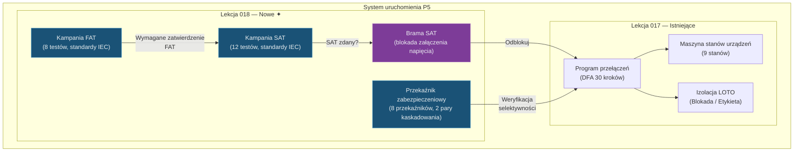

# Lekcja 018 — Testy odbiorcze FAT/SAT, koordynacja przekaźników zabezpieczeniowych i brama SAT

!!! abstract "Nawigacja lekcji"
    :material-arrow-left: **Poprzednia:** [Lekcja 017 — Uruchomienie P5: program przełączeń, maszyna stanów urządzeń i LOTO](lesson-017.md) | **Następna:** Wkrótce :material-arrow-right:

    **Faza:** P5 | **Język:** Polski | **Postęp:** 19 z 19 | [Wszystkie lekcje](index.md) | [Mapa nauki](../../Learning_Roadmap.md)

> **Data:** 2026-02-27
> **Commity:** 1 commit (`b7da3db`)
> **Zakres commitów:** `810c5262f2ce0da0e3db8d6f2e67f23bb87e8a25..b7da3dbf0eb66a9ec3c881ad70d2c4bff274a13a`
> **Faza:** P5 (Commissioning)
> **Sekcje roadmapy:** [Phase 5 — Section 5.3 Testing & Commissioning, Section 5.1 HV Switching & Safety]
> **Język:** Polski
> **Poprzednia lekcja:** Lesson 017
> **last_commit_hash:** b7da3dbf0eb66a9ec3c881ad70d2c4bff274a13a

---

## Czego się nauczysz

- Zrozumiesz cykl życia kampanii Fabrycznego Testu Odbiorczego (FAT) oraz 8 specyfikacji testowych zgodnych ze standardami IEC
- Nauczysz się o Terenowym Teście Odbiorczym (SAT), 12 specyfikacjach testów po instalacji i mechanizmie bramy FAT
- Zrozumiesz ustawienia przekaźników zabezpieczeniowych oraz weryfikację selektywności poprzez kaskadowanie czasowe (time grading)
- Zobaczysz, jak brama SAT jest zintegrowana z procesem uruchamiania programu przełączeń
- Zaimplementujesz w kodzie automatyczną logikę zaliczenia/niezaliczenia (pass/fail) z oceną pasma tolerancji

---

## Sekcja 1: Fabryczny Test Odbiorczy (FAT) — co się dzieje, gdy sprzęt psuje się na morzu?

### Rzeczywisty problem

Wyobraź sobie, że zamawiasz komputer przez internet. Gdy paczka dotrze z uszkodzonym ekranem, łatwo ją odesłać i dostać nową — sklep jest blisko. Ale gdybyś zamówił transformator 220/66 kV i odkrył usterkę na platformie morskiej 45 km od brzegu? Mobilizacja statku kosztuje ~500 000 EUR dziennie, a naprawa może potrwać miesiące.

Właśnie dlatego istnieje FAT (Factory Acceptance Test): cały sprzęt musi przejść testy zanim opuści fabrykę producenta.

### Co mówią standardy

Nasze testy fabryczne obejmują 7 różnych standardów IEC:

| Test | Standard | Fizyczna weryfikacja |
|------|----------|---------------------|
| Wytrzymałość WN (HV withstand) | IEC 60060-1:2010 | 460 kV AC, 60 s — integralność izolacji |
| Wyładowania częściowe (PD) | IEC 60270:2000 | < 10 pC — wczesne wykrywanie starzenia izolacji |
| Przekładnia transformatora | IEC 60076-1:2011 | 220/66 kV = 3,333 ±0,5% |
| Test impedancji | IEC 60076-1:2011 | ±10% wartości z tabliczki znamionowej |
| Referencja FRA | IEC 60076-18:2012 | Elektromagnetyczny odcisk palca |
| Referencja DGA | IEC 60567:2011 | Analiza gazów oleju < 50 ppm |
| Typ przekaźnika | IEC 60255:2022 | Dokładność ±5% |
| Szczelność gazu GIS | IEC 62271-203:2022 | Wyciek SF6 < 0,5%/rok |

### Co zbudowaliśmy

**Zmienione pliki:**

- `backend/app/services/p5/fat.py` — specyfikacje testów FAT, cykl życia kampanii i automatyczna ocena werdyktu
- `backend/app/schemas/commissioning.py` — schematy Pydantic FAT/SAT (modele żądań/odpowiedzi API)
- `backend/app/routers/p5.py` — endpointy CRUD FAT i rejestracji wyników
- `backend/tests/test_fat.py` — weryfikacja 8 specyfikacji, testy cyklu życia kampanii

Moduł FAT opiera się na trzech podstawowych koncepcjach:

1. **TestSpecification** — niezmienna (frozen) definicja testu: ID testu, odniesienie do standardu, granice akceptacji (min/max)
2. **TestResult** — rekord pomiarowy: zmierzona wartość, werdykt, imię inżyniera, znacznik czasu
3. **FATCampaign** — cykl życia kampanii: `CREATED → IN_PROGRESS → COMPLETED → APPROVED`

### Dlaczego to ważne

> **Dlaczego** w fabryce wykonujemy 8 osobnych testów?
> Każdy test wykrywa inny tryb awarii fizycznej. Test wytrzymałości WN sprawdza integralność izolacji, test PD wykrywa objawy starzenia izolacji, FRA identyfikuje przemieszczenie uzwojeń/rdzenia. Żaden pojedynczy test nie obejmuje wszystkich trybów awarii — obowiązuje zasada obrony wielowarstwowej (defense in depth).

> **Dlaczego** modelujemy pasma tolerancji jako pary `min_value` / `max_value`?
> Niektóre testy są jednostronne (PD < 10 pC → tylko górna granica), inne dwustronne (przekładnia transformatora ±0,5% → dolna i górna granica). Używając `float('-inf')` i `float('inf')`, obsługujemy oba przypadki tą samą funkcją `evaluate_test_verdict()`. Eliminuje to duplikację kodu — dodanie nowego testu wymaga jedynie dołączenia nowego obiektu `TestSpecification` do krotki `FAT_SPECS`.

### Analiza kodu

Ocena pasma tolerancji jest fundamentem całego systemu FAT i SAT. Funkcja jest czysta (pure) — nie zależy od stanu zewnętrznego:

```python
def evaluate_test_verdict(spec: TestSpecification, measured_value: float) -> TestVerdict:
    """Oceń zmierzoną wartość względem pasma tolerancji specyfikacji.

    Warunek PASS:  spec.min_value <= measured_value <= spec.max_value

    Dla testów jednostronnych używane są granice nieskończoności:
      Test PD: min=-inf, max=10.0  → PASS jeśli pomiar poniżej 10
      Test WN: min=460, max=+inf   → PASS jeśli pomiar powyżej 460
    """
    if spec.min_value <= measured_value <= spec.max_value:
        return TestVerdict.PASS
    return TestVerdict.FAIL
```

Funkcja jest celowo prosta. W rzeczywistości mogą istnieć rozmyte granice lub tolerancje statystyczne, ale standardy IEC definiują ostre limity — albo zdajesz, albo nie.

Cykl życia kampanii jest modelowany jako Deterministyczny Automat Skończony (DFA):

```python
def record_fat_result(
    campaign: FATCampaign,
    test_id: str,
    measured_value: float,
    recorded_by: str,
    notes: str = "",
) -> TestResult:
    # Do zatwierdzonej kampanii nie można dodawać wyników (stan nieodwracalny)
    if campaign.status == TestCampaignStatus.APPROVED:
        raise FATCampaignStateError(...)

    # Sprawdź poprawność ID testu
    if test_id not in campaign.specs:
        raise FATTestNotFoundError(...)

    # Automatyczna ocena werdyktu
    spec = campaign.specs[test_id]
    verdict = evaluate_test_verdict(spec, measured_value)

    result = TestResult(
        test_id=test_id,
        measured_value=measured_value,
        verdict=verdict,
        recorded_by=recorded_by,
        notes=notes,
    )
    campaign.results[test_id] = result

    # Przy pierwszym wyniku: przejście CREATED → IN_PROGRESS
    if campaign.status == TestCampaignStatus.CREATED:
        campaign.status = TestCampaignStatus.IN_PROGRESS

    # Gdy wszystkie specyfikacje mają wyniki: IN_PROGRESS → COMPLETED
    if len(campaign.results) == len(campaign.specs):
        campaign.status = TestCampaignStatus.COMPLETED

    return result
```

Każda rejestracja wyniku automatycznie wyzwala jedno z dwóch możliwych przejść stanów. Dzięki temu logika automatu stanów jest wbudowana w naturalny przepływ logiki biznesowej — nie jest potrzebna osobna funkcja `transition()`.

### Kluczowa koncepcja

!!! tip "Kluczowa koncepcja: Ocena pasma tolerancji (Tolerance Band Evaluation)"
    **Prosto:** Na egzaminie jest próg zaliczenia — powyżej 50 punktów zdajesz, poniżej nie. Testy FAT działają według tej samej logiki: każdy test ma dolną i górną granicę. Jeśli pomiar mieści się w tych granicach — PASS, jeśli nie — FAIL.

    **Analogia:** Wyobraź sobie termostat kuchenny. Jeśli temperatura piekarnika mieści się między 180°C a 200°C, potrawa piecze się prawidłowo. Przy 179°C jest surowa, przy 201°C się przypali. Pasmo tolerancji w testach FAT to dokładnie ten zakres temperatur.

    **W tym projekcie:** W naszej farmie wiatrowej 510 MW przekładnia transformatora 220/66 kV musi mieścić się w zakresie 3,317–3,350 (nominalna 3,333 ±0,5%). Wyjście poza to wąskie pasmo oznacza pogorszenie regulacji napięcia i załamanie koordynacji zabezpieczeń.

---

## Sekcja 2: Terenowy Test Odbiorczy (SAT) — co zmienia się po transporcie?

### Rzeczywisty problem

Wyobraź sobie, że przewozisz antyczny wazon. W sklepie wyglądał nienagannie (FAT zdany). Ale w bagażniku samochodu mógł się kołysać i pojawić się ukryta rysa. Przed użyciem napełniasz go wodą i sprawdzasz szczelność — to właśnie jest SAT.

Sprzęt morski podczas transportu morskiego jest narażony na wibracje wywołane falami, podczas instalacji na naprężenia od dźwigu i ciągnięcia kabli, a w środowisku morskim na wilgoć i aerozol solny. Uzwojenia transformatora, który przeszedł FAT, mogą się przemieścić podczas transportu — porównując referencję FRA z FAT wykrywamy to przemieszczenie.

### Co mówią standardy

Nasze testy SAT obejmują 10 różnych standardów IEC/EN:

| Test | Standard | Krytyczny próg |
|------|----------|----------------|
| Rezystancja izolacji | IEC 60229 | > 100 MOhm @ 5 kV DC |
| Przekładnia CT | IEC 61869-2 | Dokładność ±1% |
| Przekładnia VT | IEC 61869-3 | Dokładność ±0,5% |
| Czas zamknięcia wyłącznika | IEC 62271-100 | < 80 ms |
| Czas otwarcia wyłącznika | IEC 62271-100 | < 60 ms |
| Wyzwolenie przekaźnika zabezpieczeniowego | IEC 60255 | < 100 ms |
| Opóźnienie GOOSE | IEC 61850-8-1 | < 4 ms |
| Weryfikacja punktów SCADA | IEC 60870-5-104 | 100% odpowiedzi |
| Przełącznik zaczepów (OLTC) | IEC 60214 | Pełny zakres |
| Detekcja pożaru | EN 54 | < 30 s |

### Co zbudowaliśmy

**Zmienione pliki:**

- `backend/app/services/p5/sat.py` — 12 specyfikacji testów SAT, implementacja bramy FAT, zarządzanie kampanią
- `backend/tests/test_sat.py` — testy bramy FAT, cykl życia kampanii, integracja z programem przełączeń

Moduł SAT ponownie wykorzystuje system typów modułu FAT (`TestSpecification`, `TestResult`, `TestVerdict`, `evaluate_test_verdict`) — jest to bezpośrednie zastosowanie zasady DRY (Don't Repeat Yourself). Jedyną różnicą jest to, że podczas tworzenia SAT można opcjonalnie powiązać kampanię FAT.

### Dlaczego to ważne

> **Dlaczego** SAT jest zaprojektowany jako osobna kampania od FAT?
> FAT i SAT są wykonywane w różnym czasie, w różnych miejscach, przez różnych inżynierów. FAT — w fabryce producenta (przed wysyłką sprzętu), SAT — w terenie (po instalacji). To rozdzielenie utrzymuje czytelny łańcuch nadzoru (chain of custody) i zapewnia identyfikowalność (traceability).

> **Dlaczego** mechanizm bramy FAT jest opcjonalny?
> W rzeczywistości część sprzętu (np. z istniejących zapasów) może trafiać na teren bez rekordu FAT. Parametr `fat_campaign: FATCampaign | None = None` zapewnia tę elastyczność, zachowując jednocześnie gwarancję odrzucenia niezatwierdzonego FAT, gdy zostanie przekazany.

### Analiza kodu

Mechanizm bramy FAT — wymusza, aby testy fabryczne były zatwierdzone przed utworzeniem kampanii SAT:

```python
def create_sat_campaign(
    programme_id: str,
    fat_campaign: FATCampaign | None = None,
) -> SATCampaign:
    """Utwórz kampanię SAT z bramą FAT.

    Jeśli fat_campaign jest przekazana, jej status musi być APPROVED.
    W przeciwnym razie zostaje zgłoszony SATFATGateError.
    """
    if fat_campaign is not None and fat_campaign.status != TestCampaignStatus.APPROVED:
        raise SATFATGateError(
            f"FAT campaign '{fat_campaign.campaign_id}' is "
            f"'{fat_campaign.status.value}', "
            f"must be 'approved' before SAT can begin."
        )

    campaign_id = f"SAT-{datetime.now(UTC).strftime('%Y%m%d')}-"
                  f"{uuid.uuid4().hex[:6].upper()}"
    specs = {spec.test_id: spec for spec in SAT_SPECS}

    return SATCampaign(
        campaign_id=campaign_id,
        programme_id=programme_id,
        fat_campaign_id=fat_campaign.campaign_id if fat_campaign else "",
        specs=specs,
    )
```

Ten mechanizm bramy stosuje zasadę „najpierw sprawdź, potem utwórz". Jeśli testy fabryczne nie są zatwierdzone, kampania terenowa w ogóle nie może zostać utworzona — szansa wpadnięcia w błędny stan wynosi zero.

### Kluczowa koncepcja

!!! tip "Kluczowa koncepcja: Wzorzec bramy (Gate Pattern)"
    **Prosto:** Przed wejściem do samolotu pokazujesz kartę pokładową. Jeśli jej nie masz lub jest nieprawidłowa, nie wchodzisz. Brama FAT działa tak samo: bez zatwierdzonego testu fabrycznego nie można rozpocząć testów terenowych.

    **Analogia:** Pomyśl o blokadach poziomów w grze komputerowej. Nie możesz przejść do Poziomu 2, dopóki nie ukończysz Poziomu 1. FAT = Poziom 1, SAT = Poziom 2, Załączenie napięcia = Poziom 3.

    **W tym projekcie:** W naszej farmie wiatrowej 510 MW transformator TX-OSS-01 nie zostanie załadowany na statek, dopóki w fabryce nie przejdzie 8 testów (brama FAT), a napięcia nie zostanie załączone, dopóki w terenie nie przejdzie 12 testów (brama SAT). Te dwie bramy dramatycznie zmniejszają ryzyko awarii na morzu.

---

## Sekcja 3: Koordynacja przekaźników zabezpieczeniowych — właściwy wyłącznik o właściwej porze

### Rzeczywisty problem

Kiedy w domu przepali się bezpiecznik przy gniazdku, gaśnie światło tylko w tym pokoju — nie w całym budynku. Dzieje się tak dlatego, że każdy bezpiecznik chroni swój obszar, a kolejność „kto wypada pierwszy" jest z góry ustalona. W morskiej farmie wiatrowej sytuacja jest taka sama, ale błędna kolejność powoduje wyłączenie wszystkich 34 turbin z sieci.

Gdy dojdzie do awarii na kablu rozdzielczym 66 kV, przekaźnik zasilacza rozdzielczego (downstream) powinien ją usunąć — nie przekaźnik kabla eksportowego 220 kV (upstream). Jeśli upstream zadziała pierwszy, zamiast 6 turbin w uszkodzonym ciągu, z sieci wypadnie cała farma.

### Co mówią standardy

- **IEC 60255-151:2009** — Ustawienia czasowe nadprądowej ochrony (PTOC)
- **IEC 60255-121:2014** — Ustawienia stref ochrony odległościowej (PDIS)
- **IEC 60255-127:2010** — Ochrona nadnapięciowa/podnapięciowa (PTOV/PTUV)
- **IEC 60255-181:2019** — Ochrona nad-/podczęstotliwościowa (PTOF/PTUF)
- **IEEE C37.112** — Koordynacja przekaźników nadprądowych o charakterystyce odwrotnej

Wzór kaskadowania czasowego (time grading):

```
rzeczywisty_margines = (opóźnienie_upstream - opóźnienie_downstream) × 1000 ms

Decyzja: rzeczywisty_margines ≥ wymagany_margines → SELEKTYWNY
         rzeczywisty_margines < wymagany_margines → NIESELEKTYWNY
```

Wymagany margines dla PTOC: 300 ms (czas otwarcia wyłącznika + błąd przekaźnika + zapas bezpieczeństwa).
Wymagany margines dla PDIS: 400 ms (między strefami potrzebne jest większe rozdzielenie).

### Co zbudowaliśmy

**Zmienione pliki:**

- `backend/app/services/p5/protection_relay.py` — 8 ustawień przekaźników, 2 pary kaskadowania, funkcje weryfikacji selektywności
- `backend/tests/test_protection_relay.py` — weryfikacja ustawień, scenariusze selektywne/nieselektywne
- `backend/app/routers/p5.py` — endpointy `/protection/settings` i `/protection/verify-selectivity`

System zabezpieczeń składa się z trzech modeli danych:

1. **RelaySetting** — niezmienna konfiguracja przekaźnika (ID, funkcja, wartość zadziałania, opóźnienie czasowe, lokalizacja)
2. **GradingPair** — para przekaźników downstream→upstream i wymagany margines
3. **GradingResult** — wynik weryfikacji (rzeczywisty margines, werdykt)

### Dlaczego to ważne

> **Dlaczego** zdefiniowaliśmy 8 różnych funkcji zabezpieczeniowych?
> Każda funkcja wykrywa inny typ awarii. PTOC wykrywa nadprąd (zwarcie kabla), PDIS wykrywa awarie na podstawie odległości (lokalizacja wzdłuż kabla), PTOV/PTUV wykrywa nieprawidłowości napięcia, PTOF/PTUF wykrywa odchylenia częstotliwości. Wiele funkcji zapewnia „obronę wielowarstwową" — jeśli jeden przekaźnik nie zareaguje, uruchamia się rezerwowy.

> **Dlaczego** napisaliśmy weryfikację selektywności jako czystą funkcję (pure function)?
> `verify_selectivity()` może działać na dowolnym zestawie przekaźników i parach kaskadowania (domyślnie używa zestawu OSS). Ułatwia to testowanie różnych konfiguracji przekaźników, dodawanie nowych zestawów w przyszłości oraz bezpośrednie testowanie w testach jednostkowych bez mocków.

### Analiza kodu

Weryfikacja pary kaskadowania — bezpośrednie przełożenie wzoru inżynierskiego na kod:

```python
def check_single_grading_pair(
    pair: GradingPair,
    settings: dict[str, RelaySetting],
) -> GradingResult:
    """Sprawdzenie selektywności dla jednej pary downstream→upstream.

    Wzór: rzeczywisty_margines = (upstream.time_delay - downstream.time_delay) × 1000

    Przykład (PTOC):
      Downstream: 0,5 s (zasilacz rozdzielczy)
      Upstream:   0,8 s (rezerwa wejściowa)
      Rzeczywisty margines = (0,8 - 0,5) × 1000 = 300 ms ≥ 300 ms → SELEKTYWNY ✓
    """
    downstream = settings[pair.downstream_id]
    upstream = settings[pair.upstream_id]

    actual_margin_ms = (upstream.time_delay - downstream.time_delay) * 1000.0

    verdict = (
        SelectivityVerdict.SELECTIVE
        if actual_margin_ms >= pair.required_margin_ms
        else SelectivityVerdict.NON_SELECTIVE
    )

    return GradingResult(
        pair_id=pair.pair_id,
        downstream_id=pair.downstream_id,
        upstream_id=pair.upstream_id,
        downstream_delay_s=downstream.time_delay,
        upstream_delay_s=upstream.time_delay,
        actual_margin_ms=actual_margin_ms,
        required_margin_ms=pair.required_margin_ms,
        verdict=verdict,
    )
```

Zwróć uwagę na wzajemne odzwierciedlenie między kodem a wzorem IEC. Bezpośrednie przełożenie obliczeń inżynierskich na kod ułatwia przegląd — można postawić dokument ze standardem obok kodu.

Zbiorcza weryfikacja wszystkich par jest realizowana w jednej linii:

```python
def verify_selectivity(
    settings: tuple[RelaySetting, ...] | None = None,
    grading_pairs: tuple[GradingPair, ...] | None = None,
) -> list[GradingResult]:
    """Weryfikacja selektywności dla wszystkich par kaskadowania.

    Domyślnie używa zestawu przekaźników OSS.
    Wynik: lista GradingResult dla każdej pary.
    """
    if settings is None:
        settings = OSS_RELAY_SETTINGS
    if grading_pairs is None:
        grading_pairs = GRADING_PAIRS

    settings_map = {s.setting_id: s for s in settings}
    return [check_single_grading_pair(pair, settings_map) for pair in grading_pairs]
```

Słownik `settings_map` umożliwia wyszukiwanie każdego ustawienia przekaźnika w czasie O(1). Całkowita złożoność dla N par kaskadowania wynosi O(N) — nie ma przeszukiwania krotek.

### Kluczowa koncepcja

!!! tip "Kluczowa koncepcja: Kaskadowanie czasowe dla selektywności (Time Grading for Selectivity)"
    **Prosto:** W wyścigu biegacze nie startują jednocześnie, lecz po kolei — najpierw ten najbliższy, potem ten z tyłu. Przekaźniki zabezpieczeniowe działają podobnie: przekaźnik najbliżej awarii zadziała pierwszy, rezerwowy zadziała później.

    **Analogia:** Wyobraź sobie system tryskaczowy. Najpierw uruchamia się tryskacz w pokoju. Jeśli pożar się rozszerzy, otwiera się główny zawór na piętrze. Jeśli nadal nie jest ugaszony, uruchamia się system całego budynku. Każdy poziom daje poprzedniemu „czas na margines".

    **W tym projekcie:** Przekaźnik zasilacza rozdzielczego zadziała po 0,5 s. Przekaźnik rezerwy wejściowej zadziała po 0,8 s. Margines 300 ms obejmuje czas otwarcia wyłącznika (60 ms) + błąd przekaźnika + zapas bezpieczeństwa. Dzięki temu odłączany jest tylko uszkodzony ciąg, a cała farma pozostaje w ruchu.

---

## Sekcja 4: Brama SAT — ostatnia blokada przed załączeniem napięcia

### Rzeczywisty problem

W elektrowni jądrowej reaktor nie może zostać uruchomiony, dopóki nie zostaną ukończone wszystkie listy kontrolne bezpieczeństwa. Podobnie, w morskiej stacji transformatorowej nie można załączyć napięcia 220 kV, dopóki terenowe testy odbiorcze nie zostaną zakończone. Ten mechanizm „ostatniej blokady" zapobiega błędom ludzkim przy pomocy oprogramowania.

### Co mówią standardy

Brama SAT jest rozszerzeniem procedur łączeń zgodnych z IEC 62271-100 §4.101. Standard określa, że przed załączeniem napięcia „wszystkie warunki muszą być spełnione". Zatwierdzenie kampanii SAT jest jednym z tych warunków.

### Co zbudowaliśmy

**Zmienione pliki:**

- `backend/app/services/p5/switching_programme.py` — do funkcji `start_programme()` dodana brama SAT
- `backend/tests/test_sat.py` — testy integracyjne bramy SAT

Do modelu danych programu przełączeń dodano dwa nowe pola:

```python
@dataclass
class SwitchingProgramme:
    # ... istniejące pola ...
    sat_campaign: SATCampaign | None = None   # Powiązana kampania SAT
    fat_campaign_id: str | None = None        # ID powiązanej kampanii FAT
```

### Dlaczego to ważne

> **Dlaczego** wbudowaliśmy bramę SAT w `start_programme()`?
> To właściwe miejsce — załączenie napięcia (uruchomienie programu przełączeń) jest momentem krytycznym. Sprawdzanie w momencie rzeczywistego załączania, a nie podczas tworzenia kampanii, stosuje zasadę „ostatniej linii obrony". Dzięki temu program może być nadal edytowany, gdy kampania SAT jest tworzona i testy są wykonywane.

> **Dlaczego** użyliśmy bloku `TYPE_CHECKING` i leniwego importu (lazy import)?
> Istnieje ryzyko okrężnej zależności (circular dependency) między `switching_programme.py` a `sat.py`. Blok `TYPE_CHECKING` jest wykonywany tylko przez narzędzia do sprawdzania typów (mypy) — import nie następuje w czasie wykonania. Właściwy import `all_sat_passed` jest wykonywany wewnątrz funkcji.

### Analiza kodu

Integracja bramy SAT — kontrola bezpieczeństwa dodana do istniejącej funkcji przy minimalnej ingerencji:

```python
def start_programme(programme: SwitchingProgramme) -> None:
    """Uruchom program.

    Jeśli powiązana jest kampania SAT, wszystkie testy muszą zostać zaliczone.
    Uniemożliwia to załączenie napięcia bez ukończenia terenowych testów odbiorczych.
    """
    if programme.status != ProgrammeStatus.APPROVED:
        raise ProgrammeStateError(...)

    # Brama SAT: jeśli kampania jest powiązana, wszystkie testy muszą być zaliczone
    if programme.sat_campaign is not None:
        from app.services.p5.sat import all_sat_passed

        if not all_sat_passed(programme.sat_campaign):
            raise ProgrammeStateError(
                "Cannot start programme: SAT campaign has not passed "
                "all tests. Complete and approve all site acceptance "
                "tests before energisation."
            )

    programme.status = ProgrammeStatus.IN_PROGRESS
    _add_audit(programme, "Programme started", programme.pic_name)
```

Punkty do odnotowania:

1. **Wsteczna kompatybilność** — sprawdzenie `sat_campaign is None` zapewnia, że programy bez kampanii SAT nadal działają
2. **Leniwy import** — `all_sat_passed` jest importowany wewnątrz funkcji, aby przerwać okrężną zależność
3. **Opisowy komunikat błędu** — informuje inżyniera dokładnie, co należy zrobić

### Kluczowa koncepcja

!!! tip "Kluczowa koncepcja: Rozwiązanie okrężnej zależności (Circular Dependency Resolution)"
    **Prosto:** Wyobraź sobie dwójkę przyjaciół — Marek zna numer Piotra, a Piotr zna numer Marka. Ale obaj nie mogą dzwonić do siebie jednocześnie. W oprogramowaniu dwa moduły nie mogą importować się nawzajem jednocześnie.

    **Analogia:** Wyobraź sobie dwa drzwi, które nawzajem się blokują — żeby otworzyć drzwi A, potrzebujesz klucza od drzwi B, a żeby otworzyć drzwi B, potrzebujesz klucza od A. Rozwiązanie: trzymasz klucz w kieszeni do momentu otwarcia drzwi (leniwy import).

    **W tym projekcie:** `switching_programme.py` normalnie pobierałby informacje o typie z `sat.py`, ale `sat.py` używa również typów FAT. Dzięki `TYPE_CHECKING` informacje o typie są rozwiązywane tylko podczas działania mypy, a `all_sat_passed` jest importowany w momencie wywołania.

---

## Sekcja 5: Endpointy REST API — złożenie wszystkiego razem

### Rzeczywisty problem

W szpitalnym systemie informacyjnym rejestracja wizyty lekarskiej, wypisanie recepty i wprowadzenie wyników badań to osobne ekrany i API — ale wszystkie są powiązane z tym samym kartoteką pacjenta. W naszym systemie uruchomienia FAT, SAT i weryfikacja zabezpieczeń to osobne endpointy, ale wszystkie są powiązane z tym samym projektem stacji transformatorowej.

### Co mówią standardy

Nasz projekt REST API stosuje architekturę zorientowaną na zasoby (resource-oriented):

- Kampanie FAT są niezależnym zasobem (`/api/v1/commissioning/fat/...`)
- Kampanie SAT są powiązane z programem (`/api/v1/commissioning/programmes/{id}/sat/...`)
- Ustawienia zabezpieczeń są zasobem globalnym (`/api/v1/commissioning/protection/...`)

### Co zbudowaliśmy

**Zmienione pliki:**

- `backend/app/routers/p5.py` — 10+ nowych endpointów (CRUD FAT, CRUD SAT, weryfikacja zabezpieczeń)
- `backend/app/schemas/commissioning.py` — 15+ nowych schematów Pydantic

Nowe endpointy:

| Endpoint | Metoda | Funkcja |
|----------|--------|---------|
| `/fat` | POST | Utwórz kampanię FAT |
| `/fat` | GET | Wyświetl wszystkie kampanie FAT |
| `/fat/{id}` | GET | Szczegóły kampanii FAT |
| `/fat/{id}/tests/{test_id}/record` | POST | Zarejestruj wynik testu |
| `/fat/{id}/approve` | POST | Zatwierdź kampanię |
| `/programmes/{id}/sat` | POST | Utwórz kampanię SAT |
| `/programmes/{id}/sat` | GET | Status kampanii SAT |
| `/programmes/{id}/sat/tests/{test_id}/record` | POST | Zarejestruj wynik testu SAT |
| `/programmes/{id}/sat/approve` | POST | Zatwierdź kampanię SAT |
| `/protection/settings` | GET | Wszystkie ustawienia przekaźników |
| `/protection/verify-selectivity` | POST | Weryfikacja selektywności |

### Dlaczego to ważne

> **Dlaczego** endpointy FAT są poza programem, a endpointy SAT pod programem?
> Kampanie FAT są powiązane ze sprzętem (np. TX-OSS-01) i zarządzane niezależnie od programu — sprzęt jest testowany w fabryce zanim w ogóle trafi na teren. Kampanie SAT natomiast są powiązane z konkretnym programem przełączeń — wykonywane są po instalacji, przed załączeniem napięcia. Ta struktura URL odzwierciedla model domenowy.

### Analiza kodu

Pomocnicza funkcja konwersji schematu kampanii FAT — pokazuje transformację z obiektu domenowego na odpowiedź API:

```python
def _build_fat_schema(campaign: FATCampaign) -> FATCampaignSchema:
    """Konwertuj obiekt domenowy na model odpowiedzi API.

    Dlaczego osobna funkcja?
    - Model domenowy (dataclass) i model API (Pydantic) mają różne odpowiedzialności
    - Model domenowy egzekwuje reguły biznesowe
    - Model API obsługuje serializację i walidację
    - To rozdzielenie zapewnia, że logika domenowa pozostaje niezależna od zagadnień HTTP
    """
    specs = [
        TestSpecificationSchema(
            test_id=s.test_id, name=s.name, standard=s.standard,
            description=s.description, unit=s.unit,
            min_value=s.min_value, max_value=s.max_value,
        )
        for s in campaign.specs.values()
    ]
    results = [
        TestResultSchema(
            test_id=r.test_id, measured_value=r.measured_value,
            verdict=r.verdict.value, recorded_by=r.recorded_by,
            recorded_at=r.recorded_at, notes=r.notes,
        )
        for r in campaign.results.values()
    ]
    return FATCampaignSchema(
        campaign_id=campaign.campaign_id,
        equipment_tag=campaign.equipment_tag,
        status=campaign.status.value,
        specs=specs, results=results,
        all_passed=all_fat_passed(campaign),
        created_at=campaign.created_at,
        approved_by=campaign.approved_by,
        approved_at=campaign.approved_at,
    )
```

Rozdzielenie domenowo-API gwarantuje, że model domenowy nie zmieni się podczas przyszłej integracji ORM (SQLAlchemy).

### Kluczowa koncepcja

!!! tip "Kluczowa koncepcja: Rozdzielenie warstwy domenowej i API (Domain-API Layer Separation)"
    **Prosto:** Kuchnia restauracji (domena) i menu (API) to dwie osobne rzeczy. Projekt menu może się zmienić bez zmiany przepisu w kuchni. Podobnie logika biznesowa działa niezależnie od endpointów HTTP.

    **Analogia:** Pomyśl o tłumaczu. Autor pisze książkę we własnym języku (domena), tłumacz przetłumaczy ją na język API (JSON). Praca autora się nie zmienia — aktualizowany jest tylko tłumacz.

    **W tym projekcie:** `FATCampaign` (dataclass) egzekwuje reguły biznesowe. `FATCampaignSchema` (Pydantic) obsługuje serializację JSON. `_build_fat_schema()` jest mostem między nimi. Gdy w przyszłości zostanie dodany SQLAlchemy, warstwa domenowa się nie zmieni — zostanie dodana tylko warstwa trwałości.

---

## Powiązania

**Gdzie te koncepcje pojawią się w przyszłości:**

- **Model pasma tolerancji FAT/SAT** → w frontendzie P5 wyniki testów będą wyświetlane z kodowaniem kolorami zielony/czerwony (można użyć wykresów Plotly gauge)
- **Koordynacja zabezpieczeń** → animowany pokaz czasów wyzwolenia przekaźników zabezpieczeniowych w symulacji załączania napięcia P5
- **Brama SAT** → przycisk „Załącz napięcie" w frontendzie będzie aktywny/nieaktywny zależnie od statusu SAT (informacja zwrotna UX)
- **Rozszerzenie z Lekcji 017:** Program przełączeń i LOTO (Lekcja 017) są teraz wzmocnione bramą SAT — uruchomienie programu zawiera teraz kontrolę „wszystkie testy zaliczone"

---

## Szerszy obraz

*Fokus tej lekcji: **kampanie testów odbiorczych FAT/SAT, koordynacja przekaźników zabezpieczeniowych i bezpieczeństwo załączania napięcia poprzez bramę SAT**.*



*Pełna architektura systemu — patrz [Przegląd lekcji](index.md#system-architecture).*

---

## Kluczowe wnioski

1. **FAT wychwytuje usterki przed opuszczeniem fabryki przez sprzęt** — koszt naprawy na morzu (>500k EUR/dzień) czyni to koniecznością.
2. **Ocena pasma tolerancji** jest prostym porównaniem `min <= pomiar <= max`, ale dzięki `float('-inf')` i `float('inf')` obejmuje również testy jednostronne.
3. **SAT ponownie weryfikuje po transporcie i instalacji** — sprzęt, który przeszedł FAT, może zachowywać się inaczej w terenie.
4. **Brama FAT** uniemożliwia rozpoczęcie testów terenowych z niezatwierdzonymi testami fabrycznymi — wczesna interwencja w łańcuchu błędów.
5. **Koordynacja zabezpieczeń** jest osiągana przez kaskadowanie czasowe — przekaźnik downstream musi zadziałać przed upstream, w przeciwnym razie cała farma zostaje wyłączona.
6. **Brama SAT** jest wbudowana w funkcję uruchamiania programu przełączeń — bez zaliczenia wszystkich testów terenowych załączenie napięcia jest fizycznie niemożliwe.
7. **Rozdzielenie warstwy domenowej i API** izoluje logikę biznesową od zagadnień HTTP i ułatwia przyszłą integrację ORM.

---

## Zalecane lektury

*[Mapa nauki](../../Learning_Roadmap.md) — Faza 5: Uruchomienie i eksploatacja*

| Źródło | Typ | Dlaczego warto przeczytać |
|--------|-----|---------------------------|
| IEC 60060-1:2010 — HV test techniques | Standard | Podstawa testu wytrzymałości WN FAT-001 |
| IEC 62271-100:2021 — Circuit breaker testing | Standard | Źródło testów czasowania wyłącznika SAT-004/005 |
| IEC 60076-1:2011 — Power transformer requirements | Standard | Definiuje tolerancje przekładni transformatora i impedancji |
| Omicron Academy — Protection Testing courses | Kurs online | Koordynacja przekaźników zabezpieczeniowych i praktyki testowania wtrysku wtórnego |
| IEEE C37.112 — Inverse-time relay coordination | Standard | Matematyczne podstawy wzorów kaskadowania czasowego |

---

## Sprawdzian — Sprawdź swoje rozumienie

### Pytania pamięciowe

**P1:** Ile specyfikacji testów jest zdefiniowanych w module FAT i jaki tryb awarii fizycznej celuje każda z nich?

<details>
<summary>Odpowiedź</summary>

Zdefiniowanych jest 8 specyfikacji testów: wytrzymałość WN (integralność izolacji), wyładowania częściowe (starzenie izolacji), przekładnia transformatora (dokładność konwersji napięcia), impedancja (ograniczenie prądu zwarciowego), FRA (przemieszczenie uzwojeń/rdzenia), DGA (degradacja oleju), typ przekaźnika (dokładność zabezpieczeń) i szczelność gazu GIS (integralność izolacji SF6). Ponieważ każdy test wykrywa inny tryb awarii, razem tworzą „obronę wielowarstwową".

</details>

**P2:** Jakie są 4 stany w cyklu życia kampanii FAT i jak są wyzwalane przejścia?

<details>
<summary>Odpowiedź</summary>

CREATED → IN_PROGRESS (automatycznie po zarejestrowaniu pierwszego wyniku testu), IN_PROGRESS → COMPLETED (automatycznie gdy wyniki zostaną zarejestrowane dla wszystkich 8 specyfikacji), COMPLETED → APPROVED (ręcznie, jeśli wszystkie testy zostały zaliczone i uprawniona osoba zatwierdzi). Nie ma powrotów — do zatwierdzonej kampanii nie można dodawać wyników.

</details>

**P3:** Ile wynosi kaskadowanie czasowe między PTOC-01 a PTOC-02 i dlaczego to jest wystarczające?

<details>
<summary>Odpowiedź</summary>

PTOC-01 (zasilacz rozdzielczy) działa po 0,5 s, PTOC-02 (rezerwa wejściowa) po 0,8 s — margines między nimi wynosi 300 ms. Ten margines pokrywa czas otwarcia wyłącznika (~60 ms, IEC 62271-100), błąd czasowania przekaźnika (~5% × 500 ms = 25 ms) oraz zapas bezpieczeństwa. 300 ms to minimalny margines kaskadowania PTOC zalecany przez IEC 60255.

</details>

### Pytania rozumienia

**P4:** Dlaczego mechanizm bramy FAT jest stosowany w momencie tworzenia kampanii SAT, a nie w momencie uruchomienia?

<details>
<summary>Odpowiedź</summary>

Ze względu na zasadę fail-fast (wczesne wykrywanie błędów): jeśli FAT nie jest zatwierdzony, nie ma potrzeby nawet tworzyć kampanii SAT — zapobiega to bezproduktywnym pracom planistycznym inżynierów. Kontrola w momencie tworzenia zmniejsza do zera okno błędnych stanów. Brama SAT jest odrębnym punktem kontrolnym: czy wszystkie testy zostały ukończone, czy jesteśmy gotowi do załączenia napięcia? Obie razem zapewniają dwuwarstwowe bezpieczeństwo.

</details>

**P5:** Jak wyglądałoby napisanie osobnych funkcji „jednostronnych" i „dwustronnych" zamiast używania `float('-inf')` i `float('inf')` w `evaluate_test_verdict()`?

<details>
<summary>Odpowiedź</summary>

Pisanie osobnych funkcji wymagałoby decydowania, którą funkcję wywołać dla każdego nowego typu testu — to dodatkowa logika rozgałęzień i rozróżnianie typów. Używając `float('-inf')` i `float('inf')`, jedna funkcja naturalnie obsługuje oba przypadki, ponieważ w Pythonie `float('-inf') <= x` jest zawsze `True`. To podejście jest zgodne z Zasadą Otwarte-Zamknięte: dodanie nowego typu testu nie wymaga modyfikacji istniejącego kodu — wystarczy zdefiniować nową `TestSpecification`.

</details>

**P6:** Jaka byłaby alternatywa dla używania bloku `TYPE_CHECKING` i leniwego importu w bramie SAT i dlaczego ta droga została wybrana?

<details>
<summary>Odpowiedź</summary>

Alternatywy: (1) Stworzenie wspólnego modułu `interfaces.py` i importowanie z niego przez oba moduły — ale to dodaje niepotrzebną złożoność w małym projekcie. (2) Przeniesienie kontroli SAT całkowicie do warstwy routera — ale to wyciek logiki domenowej do warstwy HTTP. (3) Dependency Injection z przekazaniem funkcji SAT w czasie wykonania — czyste, ale nadmiernie skomplikowane. Leniwy import przerywa okrężną zależność przy minimalnej ingerencji i utrzymuje logikę domenową na miejscu — zgodnie z zasadą „minimalnych zmian".

</details>

### Pytanie wyzwanie

**P7:** Gdy w rzeczywistości chce się zmienić ustawienie przekaźnika zabezpieczeniowego (np. zwiększenie opóźnienia czasowego PTOC-01 z 0,5 s do 0,6 s), jak zaprojektowałbyś system „zarządzania zmianami ustawień przekaźników" (relay setting change management), który automatycznie weryfikuje, czy zmiana nie narusza selektywności?

<details>
<summary>Odpowiedź</summary>

System składałby się z następujących komponentów: (1) **Migawka bieżących ustawień** — przed zmianą pobierana jest kopia `OSS_RELAY_SETTINGS`. (2) **Proponowane ustawienia** — tworzona jest nowa krotka z zastosowaną zmianą proponowaną przez użytkownika. (3) **Analiza wpływu** — wywoływana jest `verify_selectivity(proposed_settings)` w celu sprawdzenia wszystkich dotkniętych par kaskadowania. (4) **Raport różnic** — generowany jest raport pokazujący, dla których par zmienił się werdykt selektywności (przejścia SELEKTYWNY → NIESELEKTYWNY są oznaczane czerwonymi ostrzeżeniami). (5) **Mechanizm zatwierdzania** — system nie stosuje zmiany bez zatwierdzenia przez inżyniera zabezpieczeń (przepływ podobny do Permit-to-Work). (6) **Ścieżka audytu** — każda zmiana ustawień jest rejestrowana z datą, inżynierem, starą/nową wartością i raportem selektywności. Ten projekt bezpośrednio wykorzystuje parametryczną strukturę istniejącej funkcji `verify_selectivity()` — funkcja już akceptuje niestandardowe zestawy ustawień.

</details>

---

## Kącik rozmowy kwalifikacyjnej

### Wyjaśnij prosto
*„Jak wyjaśniłbyś testy FAT/SAT i koordynację zabezpieczeń osobie niebędącej inżynierem?"*

Budując turbiny wiatrowe na morzu, musimy sprawdzić sprzęt, zanim go odbierzemy — podobnie jak sprawdzasz nowy samochód przed wyjazdem z salonu. Nazywamy to „Fabrycznym Testem Odbiorczym". Czy silnik działa, czy hamulce chwytają, czy światła świecą — sprawdzamy wszystko punkt po punkcie na liście.

Następnie sprzęt dociera na teren drogą morską. Mógł być potrząsany, narażony na wiatr i fale. Dlatego ponownie go sprawdzamy na miejscu — nazywamy to „Terenowym Testem Odbiorczym". Czy samochód dotarł z salonu do domu bez uszkodzeń?

Koordynacja zabezpieczeń przypomina skrzynkę bezpiecznikową w domu. Gdy dojdzie do usterki, powinien zadziałać tylko bezpiecznik uszkodzonego pomieszczenia, nie całego domu. W morskiej farmie wiatrowej, gdy dojdzie do awarii kabla, powinien zadziałać tylko wyłącznik tej sekcji — w przeciwnym razie zatrzymuje się cała produkcja 510 MW. Tę kolejność osiągamy przez „kaskadowanie czasowe": wyłącznik najbliżej awarii zadziała pierwszy, rezerwowy chwilę później.

### Wyjaśnij technicznie
*„Jak przedstawiłbyś zarządzanie kampaniami FAT/SAT i weryfikację selektywności zabezpieczeń panelowi rozmowy kwalifikacyjnej?"*

Moduł uruchomienia P5 zawiera trzy podsystemy oparte na standardach IEC. Po pierwsze, zarządzanie kampanią FAT obejmuje 8 specyfikacji testów opartych na standardach IEC (IEC 60060-1, 60270, 60076-1/18, 60567, 60255, 62271-203) i jest zarządzane przez cykl życia deterministycznego automatu skończonego (DFA): CREATED → IN_PROGRESS → COMPLETED → APPROVED. Każdy wynik testu jest automatycznie oceniany werdyktem za pomocą oceny pasma tolerancji (`min_value <= measured <= max_value`). Wartości sentinel `float('-inf')` / `float('inf')` obejmują testy jednostronne i dwustronne jedną czystą funkcją.

Po drugie, moduł SAT obejmuje 12 specyfikacji testów po instalacji (IEC 61869-2/3, 62271-100, 61850-8-1 itd.), zachowując jednocześnie zasadę DRY przez ponowne wykorzystanie systemu typów modułu FAT. Mechanizm bramy FAT sprawdza status FAT jako warunek wstępny podczas tworzenia kampanii SAT (musi być `APPROVED`). Brama SAT jest zintegrowana z funkcją `start_programme()` — załączenie napięcia jest blokowane do czasu zaliczenia wszystkich testów SAT. Okrężna zależność jest rozwiązana za pomocą bloku `TYPE_CHECKING` i leniwego importu.

Po trzecie, koordynacja przekaźników zabezpieczeniowych definiuje 8 ustawień przekaźników (PTOC, PDIS, PTOV, PTUV, PTOF, PTUF) i 2 pary kaskadowania. Weryfikacja selektywności jest wykonywana za pomocą czystych funkcji bezpośrednio kodujących wzory IEC 60255 i IEEE C37.112: porównanie `actual_margin_ms = (upstream.delay - downstream.delay) × 1000` względem progu `required_margin_ms` generuje werdykt SELECTIVE lub NON_SELECTIVE. Wszystkie funkcje akceptują niestandardowe zestawy ustawień jako parametry, co ułatwia testowanie różnych konfiguracji i dodawanie nowych typów przekaźników w przyszłości.
