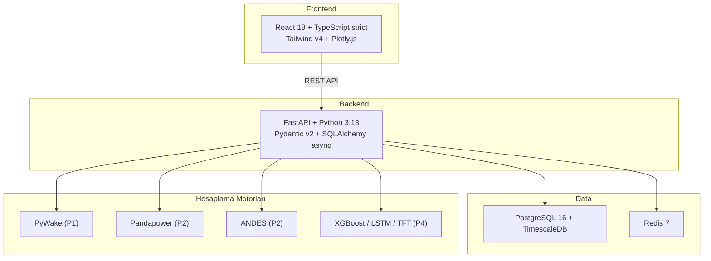

# Baltic Wind HV Kontrol Platformu — Türkçe Dokümantasyon

510 MW Baltık Denizi açık deniz rüzgar çiftliği simülasyonu için Türkçe dokümantasyon. Bu bölüm, tüm mühendislik derslerini, kullanıcı kılavuzunu ve teknik referansları Türkçe olarak içermektedir.

## Bu Bölümde Neler Var

- Türkçe ders serisi (Ders 000–018): fizikten koda 4 katmanlı öğretim metodolojisiyle yazılmış tam mühendislik dersleri
- [Kullanıcı Kılavuzu](../KULLANICI_KILAVUZU.md): kurulum, yapılandırma ve API referansı
- Ana proje belgelerine ve mühendislik standartlarına yönlendirici bağlantılar

## Önerilen Okuma Sırası

1. Projeyi yerel ortamınıza kurmak istiyorsanız [Kullanıcı Kılavuzu](../KULLANICI_KILAVUZU.md) ile başlayın.
2. Öğrenme serisi için [Ders Genel Bakış](lessons/index.md) sayfasına geçin.
3. Ana referans belgeler olarak [SKILL.md](../SKILL.md), [Proje Yol Haritası](../Project_Roadmap.md) ve [Öğrenme Yol Haritası](../Learning_Roadmap.md) kullanın.

## Referans Santral Parametreleri

| Parametre | Değer |
|-----------|-------|
| **Toplam kapasite** | 510 MW |
| **Türbinler** | 34 × Vestas V236-15.0 MW |
| **Toplama kabloları** | 66 kV XLPE |
| **Açık deniz alt istasyonu** | 66/220 kV |
| **İhracat kablosu** | 220 kV HVAC, 45 km denizaltı |
| **Şebeke bağlantısı** | 400 kV PSE (Polonya TSO) |
| **STATCOM** | ±120 MVAR + 50 MVAR şönt reaktör |
| **Konum** | Polonya Baltık Denizi |
| **Uyumluluk** | PSE IRiESP, ENTSO-E NC RfG Tip D |
| **Devreye alma / nominal / kapanma** | 3 / 12,5 / 31 m/s |

## Beş Proje

| # | Proje | Alan | Temel Teknoloji | Anahtar Standart |
|---|-------|------|-----------------|-----------------|
| **P1** | Rüzgar Kaynağı ve AEP | Enerji verimi | PyWake, ERA5, Weibull | IEC 61400-12 |
| **P2** | YG Şebeke Entegrasyonu | Güç sistemleri | Pandapower, ANDES | IEC 60909, ENTSO-E NC RfG |
| **P3** | SCADA ve Otomasyon | Kontrol sistemleri | IEC 61850 veri modelleri | IEC 61850, IEC 62443 |
| **P4** | AI Tahminleme | Makine öğrenmesi | XGBoost, LSTM, TFT | IEA Wind Task 36 |
| **P5** | Devreye Alma | Operasyonlar | Anahtarlama programları | IEC 62271, LOTO |

## Sistem Mimarisi

## Oturum Protokolü

Her kodlama oturumu `CLAUDE.md` dosyasında tanımlanan zorunlu bir yapıyı takip eder:

!!! info "Oturum Protokolü"
    - **Her oturumu açarken:** "510 MW Baltık Denizi rüzgar çiftliği simülasyonu inşa ediyoruz. 34 × V236-15.0 MW, 66 kV toplama, 220 kV ihracat (45 km), PSE şebekesi. Bugün: [modül] — [Öğrenme Yol Haritası bölümü] ile eşleşiyor."
    - **Her oturumu kapatırken:** 3 mülakat sorusu + "basitçe anlat" + "teknik olarak anlat"
    - **Kod sırası:** P1 → P2 → P3 → P4 → P5. Önce fizik. Sonra kod.
