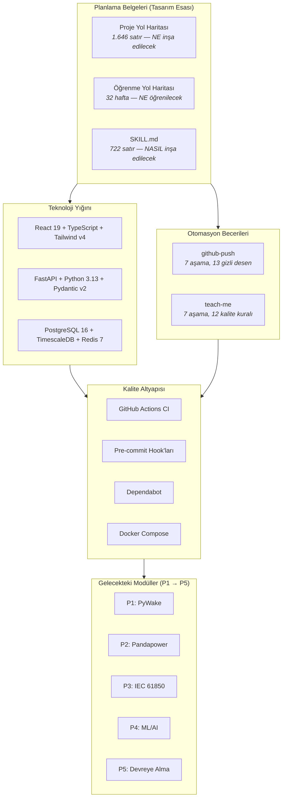

# Ders 000 — Proje Planlaması, Teknoloji Kararları ve Profesyonel Mühendislik Metodolojisi

!!! abstract "Ders Navigasyonu"
    :material-arrow-left: **Önceki:** Yok (temel ders) | **Sonraki:** [Ders 001 — DevOps Temeli](lesson-001.md) :material-arrow-right:

    **Faz:** P0 | **Dil:** Türkçe | **İlerleme:** 1 / 19 | [Tüm Dersler](index.md) | [Öğrenme Yol Haritası](../../Learning_Roadmap.md)

> **Tarih:** 2026-02-21
> **Commit'ler:** Kavramsal ders — tüm Faz 0 planlama sürecini kapsar
> **Commit aralığı:** `f2500024193bb88db74d1269612cd7c14fbe0614..fa528fb95bd6778ea54f50be71ddc6e0475d2818`
> **Faz:** P0 (Proje Planlaması & Mimari)
> **Yol haritası bölümleri:** [Faz 0 — Tüm Bölümler, Çapraz Proje Entegrasyon Haritası, Teknoloji Yığını & Web UI Özellikleri]
> **Dil:** Türkçe
> **Önceki ders:** Yok (bu temel derstir)
> **last_commit_hash:** fa528fb95bd6778ea54f50be71ddc6e0475d2818

---

## Ne Öğreneceksiniz

- Neden profesyonel mühendislik projeleri koda değil planlama belgelerine başlayarak başlar — ve bunun gerçek denizüstü rüzgar çiftliği tasarım süreçleriyle nasıl örtüştüğü
- Veritabanından ön yüze (frontend) ve hesaplama motoruna kadar, tam yığın (full-stack) bir simülasyon platformundaki her teknoloji tercihinin nasıl değerlendirileceği ve gerekçelendirileceği
- Neden özel otomasyon becerilerinin (CI/CD, güvenlik taraması, ders oluşturma) yazılım ekipleri için Standart İşlem Prosedürlerini (SOP) temsil ettiği
- Öğretim metodolojisinin kendisinin (4 katmanlı yapı, 10 teknik, oturum protokolü) nasıl bir mühendislik disiplini olduğu, sonradan düşünülmüş bir ek değil
- Neden Faz 0'ın — alan mantığından önce altyapı inşa etmenin — işe alım yöneticilerinin değerlendirdiği mühendislik olgunluğunun bir sınavı olduğu

---

## Bölüm 1: Ne İnşa Ediyoruz ve Neden?

### Gerçek Hayattan Bir Problem

Pilot lisansı için başvurduğunuzu hayal edin. İlk günün Boeing 737'ye yürüyüp uçmaya başlamazsınız. Gerçek kokpite oturduğunuzda ellerinizin ne yapacağını bilmesi için aylarınızı bir uçuş simülatöründe geçirirsiniz — her aleti, her hava koşulunu, her arıza modunu yeniden üreten bir sistemde. Bu proje, denizüstü rüzgar YG kontrol mühendisleri için bir uçuş simülatörüdür.

### Standartlar Ne Diyor

**IEC 61400 (Rüzgar enerjisi üretim sistemleri)** tek bir standart değildir — rüzgar çiftliğinin yaşam döngüsünün her yönünü kapsayan 30'dan fazla belgeden oluşan bir ailedir: tasarım gereksinimleri (61400-1), güç performansı (61400-12), elektriksel simülasyon (61400-27) ve şebeke kodu uyumluluğu (61400-21). Beş projemiz doğrudan bu yaşam döngüsüyle örtüşür. Hiçbir gerçek denizüstü rüzgar çiftliği izole olarak var olmaz — kaynak değerlendirmesi şebeke tasarımını besler, şebeke tasarımı SCADA konfigürasyonunu besler, SCADA konfigürasyonu devreye almayı besler. Simülasyonumuz bu bağlantıyı yansıtır.

### Ne İnşa Ettik

**Değiştirilen dosyalar:**
- `docs/Project_Roadmap.md` — Tüm beş projeyi tanımlayan 1.646 satırlık birleştirilmiş teknik özellik
- `docs/Learning_Roadmap.md` — Güvenilir akademik kaynaklarla 32 haftalık öz-çalışma müfredatı
- `docs/SKILL.md` — 722 satırlık mühendislik standartları ve kodlama kuralları belgesi
- `CLAUDE.md` — Oturum protokolü ve otomatik yüklenen referanslar

Baltic Wind Alpha projesi, Polonya Baltık Denizi'nde bir **510 MW denizüstü rüzgar çiftliğini** simüle eder — tam bir YG zinciriyle bağlı 34 adet Vestas V236-15.0 MW türbin. Tam özellik ve beş proje dökümü için [Dersler Genel Bakışı](index.md#the-project-at-a-glance) sayfasına bakın.

### Neden Önemli

> **Neden** genel bir "rüzgar enerjisi platformu" yerine belirli bir 510 MW rüzgar çiftliğini simüle ediyoruz?
> Çünkü özgüllük mühendislik titizliğini zorlar. Genel bir platform kablo değerlendirmeleri, transformatör empedansları ve koruma ayarları konusunda belirsiz kalabilir. Adı geçen 34 türbini, kesin kablo uzunlukları ve gerçek şebeke kodu gereksinimleri olan belirli bir 510 MW çiftlik, her hesaplamanın fiziğe dayanmasını zorlar. Bir mülakatçı "ihracat kablosunun gerilimi nedir?" diye sorduğunda "0,95 güç faktöründe 510 MW için boyutlandırılmış, 220 kV HVAC, 45 km sualtı" diye yanıtlarsınız — "değişir" değil.
>
> **Neden** beş ayrı depo yerine beş birbirine bağlı proje?
> Çünkü gerçek rüzgar çiftlikleri birbirine bağlı sistemlerdir. P1'de hesaplanan AEP (Yıllık Enerji Üretimi), P2'deki güç akışı (power flow) senaryolarını belirler. P2'deki şebeke topolojisi P3'teki SCADA veri modelini tanımlar. P3'teki SCADA telemetrisi P4'teki tahmin modellerini besler. P2'deki koruma ayarları P5'in anahtarlama programlarında yer alır. Bunları ayrı depolara bölmek bu entegrasyonu kaybettirir — ve orta seviye bir mühendisi kıdemli olandan ayıran da tam olarak bu sistem düşüncesidir.

!!! tip "Temel Kavram: Sistem Düşüncesi — Bütün, Parçaların Toplamından Büyüktür"
    **Basit anlatımda:** Beş ayrı problemi çözmek yerine, beş katmanı olan büyük bir problemi çözüyorsunuz. Her katman diğerleriyle iletişim kurar. Bunların nasıl bağlandığını anlamak, herhangi bir katmanı izole olarak anlamaktan daha değerlidir.

    **Analoji:** Bir hastane düşünün. Acil servis, ameliyathane, eczane, yoğun bakım ve hasta kayıtları beş "proje"dir. Yalnızca ameliyathaneyi anlayan bir doktor faydalıdır — ancak hastaların beş departman arasında nasıl aktığını, darboğazların nerede oluştuğunu ve bir eczane gecikmesinin yoğun bakım kalabalığına nasıl yol açtığını anlayan bir hastane yöneticisi hastaneyi yönetir.

    **Bu projede:** P1'in uyandırma modeli (wake model) Türbin 17'nin 9 m/s'de 12,3 MW ürettiğini hesapladığında, bu sayı P2'nin güç akışı analizine akar ve 66 kV besleme kablosunun akımı kaldırıp kaldıramayacağını belirler. Kaldıramazsa, P3'ün SCADA sistemi bir alarm üretmeli, P4'ün tahmin modeli kısıtlama (curtailment) desenini öğrenmeli ve P5'in devreye alma testi koruma rölesinin doğru biçimde açıp açmadığını doğrulamalıdır. Tek sayı, beş sonuç — işte bu sistem düşüncesidir.

---

## Bölüm 2: Planlama Belgeleri — Koddan Önce Mühendislik

### Gerçek Hayattan Bir Problem

Deniz tabanına tek bir temel dökülmeden önce, denizüstü bir rüzgar çiftliği yıllarca süren planlama aşamalarından geçer: çevresel etki değerlendirmeleri, şebeke bağlantı anlaşmaları, tasarım esas belgeleri ve finansal modeller. Şantiyeye tasarım esasını okumadan gelen bir yüklenici yanlış kabloyu kurar, yanlış bara bağlar ve projeye milyonlara mal olur. Planlama belgeleri bürokratik ayrıntılar değildir — işe yarayan bir proje ile başarısız olan arasındaki farktır.

### Standartlar Ne Diyor

**IEC 61355 (Tesisler, sistemler ve ekipmanlar için belgelerin sınıflandırılması ve adlandırılması)** endüstriyel projeler için hiyerarşik bir belge yapısı belirler. Standart, versiyon kontrolü ve izlenebilirliğe sahip bir ana belge dizini gerektirir. **ISO 9001 (Kalite yönetim sistemleri)** bunu; belgelenmiş prosedürleri, kontrollü revizyonları ve denetim izlerini kapsayacak şekilde genişletir. Belgeleme mimarimiz, bu ilkeleri bir yazılım bağlamında izler.

### Ne İnşa Ettik

**Değiştirilen dosyalar:**
- `docs/Project_Roadmap.md` — Birleştirilmiş teknik özellik
- `docs/Learning_Roadmap.md` — Öz-çalışma müfredatı
- `docs/SKILL.md` — Mühendislik standartları ve kodlama kuralları
- `CLAUDE.md` — Yapay zeka oturum yönetimi protokolü
- `docs/archive/Project_Roadmap_v1.md` ve `docs/archive/Project_Roadmap_v2.md` — Arşivlenmiş tarihi sürümler

Her biri belirgin bir amaca hizmet eden, birbirine kenetlenmiş dört belge oluşturduk:

**Proje Yol Haritası** tasarım esasıdır. Rüzgar çiftliğinin her parametresini (türbin modeli, kablo gerilimleri, şebeke kodları), her projenin her teslimini ve uyulması gereken her standardı tanımlar. Bir v1 belgesiyle başladık, ardından hataları düzelten bir v2 "boşluk analizi" ürettik (türbin sayısı 30'dan 34'e değişti, dinamik simülasyon gereksinimleri eklendi). İki çelişkili belgeyi korumak yerine, onları tek bir yetkili kaynakta birleştirdik ve izlenebilirlik için orijinalleri arşivledik.

**Öğrenme Yol Haritası** faza göre düzenlenmiş (P0-P5) 32 haftalık bir müfredattır ve her konu için güvenilir akademik kaynaklar içerir. Her ders kitabı, makale ve çevrimiçi kurs köklü kurumlardan (DTU, MIT OCW, IEEE Xplore) seçilmiştir — hiçbiri uydurulmamıştır. Bu belge şu soruyu yanıtlar: "Bunu inşa edebilmek için ne öğrenmem gerekiyor?"

**SKILL.md** 10 müzakere edilemez mühendislik kuralını (fiziksel kısıtlamalar, birim başına tutarlılık, IEC 60909 yöntemi, reaktif güç işaret kuralı vb.) ve kodlama kurallarını (tip ipuçları, docstring'ler, API desenleri, tek depo yapısı) kodlar. Bu belge şu soruyu yanıtlar: "Kod nasıl yazılmalıdır?"

**CLAUDE.md** oturum protokolünü belirler: referansları otomatik yükle, rüzgar çiftliği özellikleriyle başla, mülakat sorularıyla kapat. Bu, her kodlama oturumunun aynı mühendislik bağlamından başlamasını sağlar — bir operatörün vardiya devir tesliminde istasyon kayıt defterini okuması gibi.

### Neden Önemli

> **Neden** tek bir alan kodu satırı yazmadan 2.500'den fazla satır belge yazdık?
> Çünkü belgeleme tasarımdır. Proje Yol Haritası bizi kararları önceden almaya zorladı: hangi türbin modeli? İhracat gerilimi ne olacak? Hangi şebeke kodu? Bu kararlar olmadan, P1'i uygulayan ilk geliştirici 12 MW türbin seçerdi, ikinci geliştirici 15 MW varsayardı ve P2'deki güç akışı yanlış olurdu. Belgeleme bu tür hataları oluşmadan önce ortadan kaldırır — bir tasarım esasının yapısal mühendislerin yanlış çelik sınıfı kullanmasını engellediği gibi.
>
> **Neden** eski belge sürümlerini silmek yerine arşivliyoruz?
> İzlenebilirlik. Gerçek bir rüzgar çiftliği projesinde, her tasarım değişikliğinin denetlenebilir olması gerekir. Bir düzenleyici kurum "neden 30'dan 34 türbine geçtiniz?" diye sorarsa, karar izini göstermeniz gerekir. v1 ve v2'yi arşivlerken birleştirilmiş güncel bir sürümü korumak her ikisini de sağlar: günlük kullanım için temiz tek bir doğruluk kaynağı ve denetim için tarihsel kayıt.

### Kod İncelemesi

`CLAUDE.md` oturum protokolü üç şeyi güvence altına alır: **bağlam hiçbir zaman kaybolmaz** (açılış brifingı parametreleri yeniden oluşturur), **öğrenme her zaman doğrulanır** (kapanış mülakat soruları aktif hatırlamayı zorlar) ve **sıra korunur** (P2'den önce P1, P3'ten önce P2). Tam metin için [oturum protokolü referansı](index.md#session-protocol) sayfasına bakın.

Otomatik yüklenen referanslar (`docs/SKILL.md` ve `docs/Project_Roadmap.md`) kalıcı bellek oluşturur — her oturum bu iki belgeyi okuyarak başlar. Bu, bir kontrol odası operatörünün herhangi bir işlem yapmadan önce istasyon durum panosunu kontrol etmesinin yazılım eşdeğeridir. Bağlam olmadan eylem yok. Standartlar olmadan kod yok.

!!! tip "Temel Kavram: Tasarım Esası — İnşaattan Önce Kararlar"
    **Basit anlatımda:** Herhangi bir şey inşa etmeden önce, binanın uyması gereken tüm kuralları ve parametreleri yazıya dökersiniz. Ne kadar yüksek? Ne kadar ağır? Hangi malzemeler? Bu kararlar mühendisler tarafından verilir, gözden geçirilir ve üzerinde mutabık kalınır — ilk tuğla yerleştirilmeden ÖNCE.

    **Analoji:** Bir tarif düşünün. Pişirmeye başlamadan önce tüm tarifi okur, tüm malzemelere sahip olduğunuzu kontrol eder ve fırın sıcaklığını not edersiniz. Tarifi okumadan pişirmeye başlarsanız, yarı yolda sahip olmadığınız bir malzemeye ihtiyacınız olduğunu keşfedebilirsiniz — ve yemek mahvolur. Tasarım esası tüm rüzgar çiftliği için tariftir.

    **Bu projede:** Tasarım esasımız [`docs/Project_Roadmap.md`](../../Project_Roadmap.md)'dir. 34 × V236-15.0 MW türbin (30 değil, 40 değil — tam olarak 34), 66 kV dizi kabloları (33 kV değil) ve 220 kV ihracat (132 kV değil) belirtir. P1'den P5'e kadar her hesaplama bu tek belgeden okur. Türbin modelini değiştirirsek, bir yerde değiştiririz ve tüm akış aşağı hesaplamalar buna göre güncellenir.

---

## Bölüm 3: Teknoloji Yığını — Her Araç Neden Seçildi

### Gerçek Hayattan Bir Problem

Bir proje için teknoloji yığını seçmek, yeni bir denizüstü trafo merkezi için ekipman seçmeye benzer. Ucuz transformatörü veya en popüler devre kesiciyi rastgele seçmezsiniz. Her bileşenin sistem gerilimine göre değerlendirilmiş, komşu ekipmanla uyumlu, mevcut personel tarafından bakımı yapılabilir ve uygulanabilir standartlarla uyumlu olması gerekir. Bir 220/66 kV transformatör, kablo değerlendirmeleriyle, koruma rölesi ayarlarıyla ve anahtarlama ekipmanının kesme kapasitesiyle eşleşmelidir. Yazılımdaki teknoloji seçimleri aynı mantığı izler: her araç diğerleriyle entegre olmalı, alan gereksinimlerine hizmet etmeli ve ekip tarafından bakımı yapılabilir olmalıdır.

### Standartlar Ne Diyor

**12 Faktörlü Uygulama** metodolojisi (Heroku mühendisleri tarafından geliştirilen), modern yazılım uygulamaları oluşturmak için on iki ilkeyi tanımlar: kod tabanı, bağımlılıklar, yapılandırma, yedekleyici hizmetler, derleme/yayınlama/çalıştırma, süreçler, port bağlama, eşzamanlılık, tek kullanımlılık, geliştirme/üretim paritesi, günlükler ve yönetim süreçleri. Teknoloji seçimlerimiz bu ilkelerle uyumludur. **IEC 62443 (Endüstriyel iletişim ağları — Ağ ve sistem güvenliği)** hizmet izolasyonu ve ağ bölümleme konusundaki mimari kararlarımızı yönlendirir.

### Ne İnşa Ettik

Teknoloji yığınımız üç kriter için seçildi: **alana uygunluk** (bu araç bizim özel mühendislik problemimizi çözüyor mu?), **entegrasyon** (diğer araçlarla çalışıyor mu?) ve **öğrenilebilirlik** (genç bir mühendis bunu anlayabilir mi?).

=== "Arka Yüz (Backend)"

    **Python 3.13 + FastAPI + Pydantic v2**

    | Kriter | Gerekçe |
    |--------|---------|
    | Alana uygunluk | PyWake, Pandapower, ANDES, XGBoost, TensorFlow — hepsi Python |
    | Entegrasyon | FastAPI + Pydantic = otomatik üretilen OpenAPI belgeleriyle tip güvenli API'ler |
    | Öğrenilebilirlik | Python, mühendislik hesaplamasının ortak dilidir |

    Python'u seçtik çünkü ihtiyaç duyduğumuz hesaplama motorlarının tamamı Python kütüphanesidir. Farklı bir arka yüz dili kullanmak, her simülasyon için Python'a köprü kurmayı gerektirirdi — hiçbir faydası olmadan karmaşıklık ekler. FastAPI, Django'ya (çok ağır) ve Flask'a (yerleşik async yok, otomatik OpenAPI yok) karşı seçildi. Pydantic v2, her sistem sınırında şema doğrulaması sağlar.

=== "Ön Yüz (Frontend)"

    **React 19 + TypeScript (strict) + Tailwind v4 + Plotly.js + Zustand**

    | Kriter | Gerekçe |
    |--------|---------|
    | Alana uygunluk | Plotly.js mühendislik grafikleri için (rüzgar gülleri, güç eğrileri, P50/P90 bantları) |
    | Entegrasyon | React + TypeScript = derleme zamanı tip güvenliğiyle bileşen tabanlı UI |
    | Öğrenilebilirlik | React, en yaygın öğretilen ön yüz çerçevesidir |

    TypeScript strict modu, derleme zamanında `undefined is not a function` hatalarını yakalar. Plotly.js, D3.js'ye (çok düşük seviyeli) ve Chart.js'ye (3D uyandırma alanları için yetersiz) karşı seçildi. XYFlow (`@xyflow/react`), düğüm tabanlı kullanıcı arayüzleri için D3.js'in yerini alır — tek hat şemaları (P2), SCADA topolojisi (P3) ve anahtarlama programları (P5). Zustand, Redux üzerinde seçildi — 34 türbin için SCADA durumumuz Redux'ın törenine ihtiyaç duymaz.

=== "Veritabanı"

    **PostgreSQL 16 + TimescaleDB + Redis 7**

    | Kriter | Gerekçe |
    |--------|---------|
    | Alana uygunluk | Rüzgar/güç zaman serisi verileri için TimescaleDB hipertabloları |
    | Entegrasyon | PostgreSQL, Python ekosistemindeki en destekli ilişkisel VTYS'dir |
    | Öğrenilebilirlik | SQL evrensel bir beceridir; TimescaleDB onu değiştirmez, genişletir |

    Rüzgar çiftliği verisi temelde zaman serisidir: 34 türbin × 5 parametre × dakikada 6 okuma = dakikada 1.020 satır. TimescaleDB aralık sorgularını 10-100 kat hızlandırır. Redis, önbelleklemeye (simülasyon sonuçları) ve yayınlama/abone olma özelliğine (WebSocket üzerinden gerçek zamanlı SCADA güncellemeleri) hizmet eder.

=== "Hesaplama"

    **Alana özgü hesaplama motorları**

    | Motor | Proje | Amaç | Bu Araç Neden |
    |-------|-------|------|--------------|
    | PyWake | P1 | Uyandırma modellemesi ve AEP | DTU'nun resmi kütüphanesi, Bastankhah-Porté-Agel ve NOJ modelleri |
    | Pandapower | P2 | Güç akışı ve kısa devre | IEEE/IEC standartları entegrasyonu, olgun Python API'si |
    | ANDES | P2 | Dinamik simülasyon (FRT, SSO) | Python tabanlı, ENTSO-E NC RfG uyumluluk testi |
    | XGBoost | P4 | Gradyan artırmış ağaçlar | Temel model, SHAP ile yorumlanabilir |
    | LSTM | P4 | Sıra tabanlı sinir ağı | Rüzgar desenlerindeki zamansal bağımlılıkları yakalar |
    | TFT | P4 | Temporal Fusion Transformer | Son teknoloji olasılıksal tahmin |

=== "DevOps"

    **Kalite altyapısı ve otomasyon**

    | Araç | Amaç | Bu Araç Neden |
    |------|------|--------------|
    | Docker Compose | Hizmet düzenlemesi | Sağlık kontrolleriyle yeniden üretilebilir 4 hizmetli yığın |
    | GitHub Actions | CI/CD boru hattı | Açık kaynak için ücretsiz, 4 paralel iş |
    | Pre-commit hook'ları | Yerel kalite geçitleri | Commit oluşturulmadan önce anlık geri bildirim |
    | Dependabot | Tedarik zinciri güvenliği | 3 ekosistem genelinde otomatik haftalık bağımlılık güncellemeleri |
    | MkDocs Material | Belgeleme sitesi | Markdown tabanlı, GitHub Pages'e otomatik dağıtım |
    | Makefile | Görev çalıştırıcı | Evrensel giriş noktası: `make lint`, `make test`, `make docker-up` |
    | Ruff | Python lintleme + biçimlendirme | flake8+black+isort'un 10-100 kat daha hızlısı |
    | Mypy (strict) | Python tip kontrolü | Çalışma zamanından önce tip hatalarını yakalar |

### Neden Önemli

> **Neden** geleneksel flake8 + black + isort yığını yerine Ruff'ı seçtik?
> Performans ve sadelik. Ruff, Rust ile yazıldığı için 10-100 kat daha hızlı çalışarak üç ayrı aracı biriyle değiştirir. CI boru hattımızda, arka yüz lint işi ruff check, ruff format --check ve mypy çalıştırır. Geleneksel yığınla, bu dört ayrı araç (flake8, isort, black, mypy) ve dört ayrı yapılandırma dosyası anlamına gelirdi. Ruff, `pyproject.toml`'daki tek bir `[tool.ruff]` bölümünü kullanır. Daha az araç, daha az yapılandırma çakışması, daha hızlı CI çalıştırmaları ve yeni geliştiriciler için daha kolay katılım anlamına gelir.
>
> **Neden** ön yüz durum yönetimi için Redux yerine Zustand'ı seçtik?
> Orantılılık. Redux, yüzlerce bileşen arasındaki karmaşık durum etkileşimleri olan uygulamalar için tasarlanmış güçlü bir durum yönetimi kütüphanesidir. SCADA panelimizin her biri yaklaşık 10 durum değişkeni olan 34 türbini var — yaklaşık 340 durum değeri. Zustand bunu tek bir mağaza ve sıfır standart kodla halleder. Redux, aynı sonuç için eylemler, indirgeyiciler, seçiciler ve ara katman yazılımı gerektirir. Mühendislik ilkesi şudur: probleminizin ölçeğiyle eşleşen aracı seçin.

!!! tip "Temel Kavram: Amaca Uygunluk — İş İçin Doğru Aracı Seçmek"
    **Basit anlatımda:** En iyi araç en güçlü veya en popüler değil — özel probleminize uyan araçtır. Ferrari, mobilya taşımak için en iyi araç değildir. Pickup kamyon öyledir.

    **Analoji:** Bir trafo merkezinde 10 MW yük için 500 MW'lık bir transformatör kurmazsınız. Büyüme için yeterli marjla birlikte yükle eşleşen transformatörü seçersiniz, ancak sermayeyi boşa harcayacak kadar büyük olmayan. Aşırı mühendislik, yetersiz mühendislik kadar sorunludur.

    **Bu projede:** Durum yönetimi ihtiyaçlarımız orta düzeyde olduğu için Redux üzerinde Zustand'ı seçtik. Bir API hizmeti inşa ettiğimiz için Django üzerinde FastAPI'yi seçtik. Zaman serisi sorgularına ek olarak ilişkisel birleştirmelere (türbin meta verileri + telemetrisi) ihtiyaç duyduğumuz için InfluxDB üzerinde TimescaleDB'yi seçtik. Her teknoloji kararı şu soruyu sorarak verildi: "Bu özel problem ne gerektiriyor?"

---

## Bölüm 4: Özel Beceriler — Profesyonel İş Akışlarının Otomasyonu

### Gerçek Hayattan Bir Problem

Denizüstü bir rüzgar çiftliği kontrol odasında, operatörler prosedürleri doğaçlama yapmaz. Her kritik eylem — bir devre kesiciyi kapatmak, bir türbini başlatmak, besleyiciler arasında geçiş yapmak — yazılı bir Standart İşlem Prosedürünü (SOP) izler. SOP her adımı, her doğrulama kontrolünü ve her güvenlik koşulunu belirtir. Bir operatör bir adımı atlarsa, bir güvenlik olayını riske atar. Yazılım ekipleri aynı disipline ihtiyaç duyar: kritik iş akışları (kod dağıtma, gizlileri tarama, belgeleme oluşturma) bireysel belleğe güvenmek yerine belgelenmiş, otomatikleştirilmiş prosedürleri takip etmelidir.

### Standartlar Ne Diyor

**ISA-18.2 (Proses Endüstrileri için Alarm Sistemlerinin Yönetimi)** alarm yönetiminin sistematik, belgelenmiş ve denetlenebilir olması gerektiğini belirler. **ISO 9001**, kaliteyi etkileyen faaliyetler için belgelenmiş prosedürler gerektirir. Özel becerilerimiz yazılım eşdeğeridir: tutarlılığı zorlayan ve insan hatasını önleyen belgelenmiş, sürüm kontrollü iş akışları.

### Ne İnşa Ettik

**Değiştirilen dosyalar:**
- `.claude/skills/github-push/SKILL.md` — 250 satırlık güvenli push iş akışı (7 aşama)
- `.claude/skills/teach-me/SKILL.md` — 456 satırlık eğitim dersi oluşturucu (7 aşama + 12 kalite kuralı)

Her biri kritik bir iş akışını otomatikleştiren iki özel Claude Code becerisi oluşturduk:

**github-push becerisi** bir güvenlik kapıcısı olarak hareket eder. Tetiklendiğinde yedi aşamayı yürütür: keşif (git status, diff, log, branch), güvenlik denetimi (13 regex deseniyle gizli tarayıcı, 14 dosya deseniyle tehlikeli dosya tarayıcı, kod kalite kontrolleri), güvenlik kararı (zorunlu kullanıcı onayıyla ENGELLE veya UYAR), akıllı hazırlama (dosya dosya, asla `git add .` değil), commit mesajı biçimlendirme (kapsamlı, emir kipiyle, IEC referanslarıyla), ön doğrulamayla push ve özet rapor. Bu beceri, çoğu geliştiricinin atladığı bir disiplini zorlar: kod halka açık bir depoya ulaşmadan önce her farkın (diff) sabit kodlanmış gizliler için taranması.

**teach-me becerisi** ham git geçmişini pedagojik açıdan zengin ders belgelerine dönüştürür. Yedi aşaması, github-push yapısını yansıtır: dil algılama, önceki ders keşfi, commit aralığı hesaplama, derin analiz (her fark okunur ve gruplandırılır), referans alınan dosyaların okunması, ders oluşturma (10 öğretim tekniğiyle zorunlu şablonu izleyerek) ve doğrulama (minimum 1500 kelime, geçerli last_commit_hash). On iki kalite kuralı tutarlılığı güvence altına alır: her bölüm 4 katmanlı yapıyı kullanır, kod bloklarının önünde ve arkasında açıklayıcı metin bulunur, analojiler zorunludur, test yanıtları kapsamlıdır ve önerilen kaynaklar gerçek Öğrenme Yol Haritası kaynaklarına atıfta bulunur.

### Neden Önemli

> **Neden** shell script yazmak veya mevcut CI araçlarını kullanmak yerine özel beceriler oluşturduk?
> Çünkü beceriler, belgeleme ve otomasyonu tek bir yapıta birleştirir. Bir shell script adımları otomatikleştirir ama neden olduğunu açıklamaz. Bir wiki sayfası neden olduğunu açıklar ama otomatikleştirmez. Claude Code becerisi her ikisini de yapar: SKILL.md dosyası iş akışını belgeleyip (insanlar tarafından okunabilir) yürütme adımlarını tanımlar (yapay zeka tarafından yürütülebilir). Bu, bir IEC 61850 SCL dosyasıyla aynı ilkedir — aynı XML belgesinde veri modelini (belgeleme) ve sistemi yapılandırır (otomasyon).
>
> **Neden** github-push becerisi her şeyi engellemek yerine ENGELLE ve UYAR arasında ayrım yapar?
> Kalibrasyon. Her şeyi engelleyen bir güvenlik tarayıcısı rahatsızlık haline gelir — geliştiriciler onu atlamayı öğrenir. Hiçbir şeyi uyarmayan bir tarayıcı gerçek sorunları kaçırır. ENGELLE/UYAR ayrımı, koruma rölesi felsefesini yansıtır: kesin arızalar için anlık kesme (sızdırılan API anahtarı = geri alınamaz), anormal koşullar için zamanlı alarm (docker-compose'daki geliştirme varsayılan parolası = kabul edilebilir ama kaydedilmiş). İzin verilen istisnalar listesi, belirli UYAR desenlerinin neden kabul edilebilir olduğunu belgeleyerek denetlenebilir bir karar izi oluşturur.

### Kod İncelemesi

teach-me becerisinin kalite kuralları, mühendislik standartlarının nasıl kodlanacağını gösterir:

```markdown
## KALİTE KURALLARI (MUTLAK — asla geçersiz kılma)

1. **Her bölüm 4 katmanlı yapıyı kullanır** (fizik → standart → matematik → kod)
2. **Asla değişiklikleri listeleme** — her zaman değişikliğin NEDEN yapıldığını açıkla
3. **Ders başına minimum 1500 kelime** — yüzeysel dersler işe yaramaz derslerdir
4. **Her kod bloğunun ÖNCESİNDE ve SONRASINDA** açıklayıcı metin bulunur
5. **Analojiler zorunludur** her bölümde — istisnasız
...
11. **Önerilen Okuma gerçek Öğrenme Yol Haritası kaynaklarına atıfta bulunmalıdır**
12. **Dil tutarlılığı** — TÜM nesir hedef dilde olmalıdır
```

Bu kurallar, SKILL.md'deki 10 müzakere edilemez alan kuralıyla aynı işlevi görür. Bunlar mutlak kısıtlamalardır — yönergeler değil, öneriler değil. Kural 11, halüsinasyonu (uydurulmuş kitap başlıklarını) önler. Kural 3, yüzeysel dersleri önler. Kural 5, erişilebilirliği güvence altına alır. Birlikte, hangi belirli commit'lerin öğretildiğinden bağımsız olarak minimum bir kalite çıtasını garanti ederler.

!!! tip "Temel Kavram: Standart İşlem Prosedürleri — Belgeleme Yoluyla Tutarlılık"
    **Basit anlatımda:** İnsanların her seferinde doğru adımları hatırlamasına güvenmek yerine, adımları yazıya döker ve belgeyi takip edersiniz. Bu sayede 100. kez, ilk kez kadar güvenilirdir ve yeni bir ekip üyesi prosedürü bir uzmandan eğitim almadan gerçekleştirebilir.

    **Analoji:** Bir pilotun uçuş öncesi kontrol listesini düşünün. 30 yıllık deneyime sahip bir pilot bile her uçuştan önce aynı kontrol listesinden geçer — yakıtı kontrol et, aletleri kontrol et, flapları kontrol et. Kontrol listesi pilotun yetersiz olduğunu ima etmez; insanların baskı altında bir şeyleri unuttuğunu kabul eder ve yapılandırılmış bir prosedür hataları önler.

    **Bu projede:** github-push becerisi, kod dağıtımı için uçuş öncesi kontrol listemizdir. Push ne kadar acil olursa olsun, her zaman gizlileri tarar, her zaman tehlikeli dosyaları kontrol eder, her zaman commit mesajını doğru biçimlendirir. teach-me becerisi müfredat geliştirme prosedürümüzdür — her ders aynı şablonu izler, aynı öğretim tekniklerini kullanır ve aynı kalite çıtasını karşılar.

---

## Bölüm 5: Öğretim Metodolojisi — İnşa Ederek Öğrenmek

### Gerçek Hayattan Bir Problem

Mühendislik eğitiminde teori ile pratik arasında kalıcı bir boşluk vardır. Bir mezun diferansiyel denklemleri çözebilir ama tek hat şemasını okuyamaz. Deneyimli bir teknisyen SCADA sistemini çalıştırabilir ama koruma rölesinin neden açtığını açıklayamaz. En iyi mühendisler her iki dünyayı da köprüler: fiziği anlar, standartları bilir, matematiği türetebilir ve kodu yazabilir. Bu projenin öğretim metodolojisi, dört katmanı eş zamanlı olarak oluşturmak için tasarlanmıştır.

### Standartlar Ne Diyor

**Bloom'un Taksonomisi** (1956, 2001'de revize edildi) öğrenme hedeflerini altı seviyeye sınıflandırır: hatırlama, anlama, uygulama, analiz, değerlendirme, oluşturma. Ders yapımız tüm altısına hitap eder: hatırlama soruları (hatırlama), "neden" soruları (anlama), kod incelemeleri (uygulama), tasarım muhakemesi (analiz), meydan okuma soruları (değerlendirme) ve projelerin kendisi (oluşturma). **Vygotsky'nin Yakın Gelişim Bölgesi (ZPD)** iskele kurma (scaffolding) yaklaşımımıza rehberlik eder: her ders bir öncekinin üzerine inşa eder ve yeni kavramları yalnızca önkoşullar kurulduğunda tanıtır.

### Ne İnşa Ettik

Öğretim metodolojimizin her oturumda uygulanan dört katmanı vardır:

```
Katman 1: FİZİK      — Hangi fiziksel fenomeni modelliyoruz?
Katman 2: STANDART   — IEC/IEEE/ENTSO-E standardı bu konuda ne diyor?
Katman 3: MATEMATİK  — Hangi denklemler bunu tanımlar?
Katman 4: KOD        — Bunu Python/TypeScript'te nasıl uygularız?
```

Bu katmanlama rastgele değildir. Mühendislik tasarım sürecini izler: fiziği anla (Katman 1), uygulanabilir standarda başvur (Katman 2), matematiksel modeli türet veya uygula (Katman 3) ve yazılımda uygula (Katman 4). Katmanları atlamak kırılgan bilgi üretir: fizik olmadan kod, kargo kültü programlamadır; standartlar olmadan fizik, akademik egzersizdir; kod olmadan matematik, teorik analizdir. Dört katmanın tamamı birlikte hem açıklayabilen hem de uygulayabilen mühendis üretir.

On öğretim tekniği bilgi pekiştirmesini sağlar:

| # | Teknik | Nasıl Uyguladığımız |
|---|--------|-------------------|
| 1 | Feynman Tekniği | Her Temel Kavram 12 yaşındaki birine açıklar gibi açıklanır |
| 2 | Aralıklı Tekrar | "Önceki Derslerle Bağlantılar" önceki kavramları pekiştirir |
| 3 | Ayrıntılı Sorgulama | Her "Neden Önemli" bloğu açık "neden" sorularını sorar ve yanıtlar |
| 4 | Somut Örnekler | Her kavram gerçek proje koduna bağlanır, hiçbir zaman soyut olmaz |
| 5 | Analojiler | Bölüm başına en az biri — güç sistemleri, günlük yaşam, sektör |
| 6 | Parçalama (Chunking) | Commit'ler maksimum 6 mantıksal bölüme gruplanır |
| 7 | Aktif Hatırlama | `<details>` etiketlerinin arkasına gizlenmiş yanıtlarla 7 soruluk test |
| 8 | İkili Kodlama | ASCII şemaları + metin açıklamaları |
| 9 | İskele Kurma | Bölümler temelden ileri düzeye doğru sıralanır |
| 10 | Birleştirme (Interleaving) | Her ders içinde karma kavram türleri |

### Neden Önemli

> **Neden** her oturumu "basit açıkla" ve "teknik açıkla" ile bitiriyoruz?
> Çünkü birden fazla soyutlama düzeyinde açıklayabilme yeteneği, kıdemli bir mühendisinin temel becerisidir. Ørsted'deki bir baş mühendis, FRT uyumluluğunu düzenleyici kuruma (basitçe), koruma rölesi mühendisine (teknik olarak) ve proje finansmanı ekibine (ticari olarak) açıklamak zorundadır. Her oturumda her iki modu da pratik yapmak bu kası geliştirir. Bir kavramı basitçe açıklayamazsanız, onu gerçekten anlamıyorsunuzdur (Feynman). Teknik olarak açıklayamazsanız, doğru şekilde uygulayamazsınız.
>
> **Neden** analojiler her bölümde zorunlu, isteğe bağlı değil?
> Çünkü analojiler yeni bilgi ile mevcut bilgi arasındaki köprüdür. Bilişsel bilim araştırmaları, öğrenmenin temelde yeni bilgileri mevcut zihinsel modellerle ilişkilendirme süreci olduğunu gösterir. Docker sağlık kontrolü hiç yapılandırmamış bir okuyucu muhtemelen bir restoran masası için beklemiş ve "masa hazır" ile "masa var ama önceki misafirler henüz ayrılmadı" arasındaki farkı anlamıştır. Bu analoji, `service_healthy`'yi sezgisel kılar. Analoji olmadan, her kavram sıfırdan zihinsel modeller oluşturmayı gerektirir — bu yavaş, kırılgan ve motivasyon bozucudur.

!!! tip "Temel Kavram: 4 Katmanlı Öğrenme Modeli — Fizik, Standartlar, Matematik, Kod"
    **Basit anlatımda:** Herhangi bir mühendislik konusunu gerçekten anlamak için dört şeye ihtiyacınız vardır: fiziksel dünyada gerçekte ne olduğu, kuralların bununla ilgili ne söylediği, matematiğin nasıl göründüğü ve çalışan yazılıma nasıl dönüştürüleceği. Bunlardan herhangi birini atlarsanız, bilginizde bir boşluk oluşur.

    **Analoji:** Bir köprü inşa etmeyi düşünün. Bir inşaat mühendisinin yerçekimini ve malzeme mukavemetini anlaması (fizik), bina kodlarını ve yük düzenlemelerini bilmesi (standartlar), gerilme ve gerinim hesaplamalarını yapması (matematik) ve yapıyı tasarlamak ve doğrulamak için CAD/FEA yazılımını kullanması gerekir (kod). Güzel köprüler çizen ama yükleri hesaplayamayan bir mimar tehlikelidir. Modellediği fiziği anlamadan FEA yazılımı yazan bir programcı da aynı şekilde tehlikelidir.

    **Bu projede:** P2'nin kısa devre (short-circuit) analizini oluştururken fizikle başlayacağız (bir iletken toprağa dokunduğunda ne olur?), IEC 60909'a başvuracağız (standart yöntem), gerilim faktörü denklemlerini uygulayacağız (matematik) ve Pandapower'ın `sc.calc_sc()` fonksiyonunu kullanarak uygulayacağız (kod). Bu 4 katmanlı yaklaşım, yalnızca doğru sayılar üretmemizi değil — sayıların ne anlama geldiğini anlamamızı sağlar.

---

## Bölüm 6: Faz 0 Neden Başlı Başına Bir Sınavdır

### Gerçek Hayattan Bir Problem

YG Kontrol Mühendisi pozisyonuna başvuran iki adayı hayal edin. Her ikisi de GitHub portföyü sunar. A adayının etkileyici alan koduyla bir deposu var — uyandırma modelleri, güç akışı hesaplamaları, tahmin algoritmaları — ama test yok, CI yok, belgeleme yok ve kaynakta sabit kodlanmış parolalar var. B adayının daha küçük bir kod tabanı var, ancak CI/CD boru hattı, Docker düzenlemesi, güvenlik taraması, otomatikleştirilmiş bağımlılık yönetimi, 1.600 satırlık teknik özellik ve 10 alana özgü kuralı olan kodlama standartları içeriyor. İşi kim alır?

### Standartlar Ne Diyor

**IEC 61400-22 (Rüzgar türbini sertifikasyonu)**, kalite yönetim sisteminin herhangi bir tasarım çalışması başlamadan önce — sonrasında değil — kurulmasını gerektirir. Sertifikalandıran kurum süreci denetler, yalnızca ürünü değil. Doğru güç çıkışı üreten ama resmi bir kalite sistemi olmadan tasarlanan bir rüzgar türbini sertifikalandırılamaz. Aynı ilke yazılıma uygulanır: düşük RMSE elde eden ama versiyon kontrolü, test veya belgeleme olmadan geliştirilmiş bir tahmin modeline üretimde güvenilemez.

### Ne İnşa Ettik

Faz 0, tek bir alan kodu satırı yazılmadan önce tam mühendislik altyapısını kurdu:

```
FAZ 0 — NE İNŞA ETTİK (herhangi bir P1-P5 alan mantığından önce)

Belgeleme:
  ├── Proje Yol Haritası (1.646 satır) — teknik özellik
  ├── Öğrenme Yol Haritası (32 haftalık müfredat) — öz-çalışma yolu
  ├── SKILL.md (722 satır) — mühendislik standartları
  └── CLAUDE.md — oturum protokolü

Uygulama iskeleti:
  ├── /health uç noktasıyla FastAPI arka yüzü
  ├── TypeScript strict'li React ön yüzü
  ├── PostgreSQL + TimescaleDB (Docker)
  └── Redis 7 (Docker)

Kalite altyapısı:
  ├── GitHub Actions CI — 4 paralel iş (lint + test × 2 yığın)
  ├── Pre-commit hook'ları — ruff, mypy, eslint, dosya hijyeni
  ├── Dependabot — pip, npm, GitHub Actions için haftalık güncellemeler
  ├── EditorConfig — editörler arası tutarlı biçimlendirme
  └── Makefile — install, lint, test, docker, docs için 15+ hedef

Güvenlik:
  ├── github-push becerisi — 7 aşamalı güvenlik denetimi
  ├── .gitignore — ERA5 verisi, gizliler, derleme yapıtları
  └── Gizli tarayıcı — 13 desen, ENGELLE/UYAR ayrımı

Otomasyon:
  ├── github-push becerisi — güvenli dağıtım iş akışı
  ├── teach-me becerisi — eğitim dersi oluşturucu
  └── Docker Compose — sağlık kontrolleriyle 4 hizmetli düzenleme

Belgeleme sitesi:
  ├── MkDocs Material — GitHub Pages'e otomatik dağıtım
  └── Docs CI iş akışı — push'ta derle, birleştirmede dağıt
```

Bu, tamamlanan görevlerin kontrol listesi değil — mühendislik felsefesinin bir göstergesidir. Alan kodundan önce CI/CD oluşturma kararı şunu söyler: "İlk günden kaliteye değer veririm, sonradan düşünülmüş bir ek olarak değil." Tek bir uyandırma modeli hesabından önce 2.500'den fazla satır belge yazma kararı şunu söyler: "İnşa etmeden önce tasarlarım." Sabit kodlanmış gizlileri engelleyen bir güvenlik tarayıcısı oluşturma kararı şunu söyler: "Güvenliği bir gereksinim olarak ele alırım, isteğe bağlı bir özellik değil."

### Neden Önemli

> **Neden** alan mantığından önce altyapı inşa etmek, mühendislik olgunluğunun bir işareti?
> Çünkü dürtü kontrolünü ve sistem düşüncesini gösterir. Genç bir geliştirici hemen ilginç kodu yazmaya başlar — uyandırma modeli, güç akışı çözücüsü, LSTM tahmin ağı. Kıdemli bir mühendis önce sorar: "Bu kod nasıl test edilecek? Nasıl dağıtılacak? Hatalar nasıl yakalanacak? Bağımlılıklar nasıl yönetilecek?" Altyapıyı önce oluşturmak bu soruları sorunlar haline gelmeden yanıtlar. Denizüstü rüzgarda bu, inşaat başlamadan önce güvenlik durumunun tamamlanmasının eşdeğeridir — heyecan verici olduğu için değil, ama onsuz her şey kumun üzerine inşa edilmiş demektir.
>
> **Neden** bu özellikle işe alım yöneticilerini ilgilendiriyor?
> Çünkü işe alım yöneticileri projelerin eksik altyapı nedeniyle başarısız olduğunu gördü. Test, CI ve belgeleme olmadan güzel bir tahmin modeli sunan aday bir risktir — bu model dağıtılamaz, bakımı yapılamaz veya başka bir mühendise teslim edilemez. Daha küçük ama otomatik kalite geçitleri, belgelenmiş standartlar ve net bir mimari ile iyi yapılandırılmış bir proje sunan aday ise bir varlıktır — kodu güvenilir, yaklaşımı ölçeklenebilir ve standartları bir ekip tarafından benimsenebilir.

### Kod İncelemesi

Git geçmişine mühendislik önceliklerinin anlatısı olarak bakın:

```
f250002 İlk commit
895708e [DOCS] Belgelemeyi yeniden düzenle ve Claude Code altyapısını kur
ebc4a6e [INFRA] Proje temeli ekle: CI, Docker, lintleme, docs ve uygulama iskeletleri
957ed8e [INFRA] github-push güvenlik denetimini güçlendir ve docs CI'ı düzelt
f85f6c5 [CI]: Bump actions/upload-pages-artifact from 3 to 4 (#1)
...6 Dependabot PR'ı daha...
d32d82f [DEPS] Ön yüz bağımlılıklarını en son uyumlu sürümlere güncelle (#12)
c813207 [INFRA] Ders oluşturma için teach-me eğitim becerisi ekle
eba32fd [INFRA] teach-me becerisine çok dilli destek ekle
fa528fb Merge pull request #14
```

"İlk commit"ten sonraki ilk gerçek commit belgeleme (`[DOCS]`). İkincisi altyapı (`[INFRA]`). Ardından güvenlik sertleştirme. Ardından otomatik bağımlılık güncellemeleri. Ardından daha fazla altyapı. Tek bir alana özgü commit yok — uyandırma modeli yok, güç akışı yok, SCADA mantığı yok. Bu sıra net bir mesaj iletir: bu mühendis evi inşa etmeden önce temeli atar.

!!! tip "Temel Kavram: Kaliteli Ürünün Önünde Kalite Sistemi — Sonuç Üzerinde Süreç"
    **Basit anlatımda:** Bir şeyi nasıl inşa ettiğiniz, ne inşa ettiğiniz kadar önemlidir. Uygun mühendislik süreçleriyle (malzeme testi, yük hesaplamaları, güvenlik denetimleri) inşa edilen bir köprü, üzerinden geçmeden önce bile güvenilirdir. Bu süreçler olmadan inşa edilen bir köprü, bugün iyi görünse bile risklidir.

    **Analoji:** İki aşçı aynı yemeği yapar. Aşçı A'nın temiz bir mutfağı, etiketli malzemeleri, yazılı bir tarifi var ve adımlar arasında ellerini yıkıyor. Aşçı B'nin her yerde malzeme var, tarif yok ve kirli bir kesme tahtası var. Her iki yemek bugün aynı tada sahip olsa bile, bir sağlık müfettişi hangi mutfağı sertifikalandırır? Hangi aşçıya gelecek hafta tutarlı sonuçlar üretmesini güvenirsiniz? Süreç, ürünü sertifikalandırır.

    **Bu projede:** Faz 0'ımız, mutfağımızın sağlık denetimidir. Herhangi bir alan mantığı pişirmeden önce (P1-P5), mutfağımızın temiz olduğunu kanıtladık: CI hataları otomatik olarak yakalar, güvenlik taraması sızdırılan gizlileri önler, bağımlılık yönetimi tedarik zincirini güncel tutar ve belgeleme her mühendisinin aynı bağlamla başlamasını sağlar. Bundan sonra yazacağımız alan kodu, tüm bu korumayı otomatik olarak devralacak.

---

## Bağlantılar

**Bu kavramların bir sonraki görünümü:**

- **Sistem düşüncesi** (Bölüm 1) → P1, uyandırma modeli çıktıları doğrudan P2 güç akışı senaryolarına beslendiğinde bunu somut olarak gösterecek
- **Tasarım esası** (Bölüm 2) → Her P1-P5 modülü parametreleri `Project_Roadmap.md`'den okur — burada kurulan tek doğruluk kaynağı
- **Teknoloji yığını gerekçelendirmesi** (Bölüm 3) → [Ders 001](lesson-001.md), her aracın Docker Compose'da yapılandırılmış ve çalışır halde gösterir
- **SOP olarak özel beceriler** (Bölüm 4) → [Ders 002](lesson-002.md), beceri mimarisi desenini göstererek teach-me becerisini uluslararasılaştırmayla genişletir
- **4 katmanlı öğretim modeli** (Bölüm 5) → Her gelecekteki ders bu yapıyı uygular — P1'in ilk dersi rüzgar fiziğiyle, ardından IEC 61400-12, ardından Weibull matematiği, ardından PyWake koduyla başlayacak
- **Mühendislik testi olarak Faz 0** (Bölüm 6) → P3 SCADA izleme, burada kurulan sağlık kontrolü desenlerinin üzerine inşa edilecek

---

## Genel Tablo

*Bu dersin odağı: her planlama ve teknoloji kararının **neden** alındığı.*



---

## Temel Çıkarımlar

1. **Özgüllük mühendislik titizliğini zorlar** — 34 türbinli, 66 kV dizi ve 220 kV ihracat içeren adı belirlenmiş 510 MW çiftliğini simüle etmek belirsizliği ortadan kaldırır ve her hesaplamayı fiziğe dayandırır.
2. **Belgeleme tasarımdır, evrak işi değil** — Alan kodundan önce yazılmış 2.500'den fazla satır özellik, belirsizliği önler, tutarlılığı sağlar ve denetlenebilir bir karar izi oluşturur.
3. **Teknoloji seçimleri alana uygunluk, entegrasyon ve öğrenilebilirlikle gerekçelendirilmelidir** — popülerlik veya kişisel tercih ile değil. Yığınımızdaki her araç belirli bir sorunu çözer.
4. **Özel otomasyon becerileri, yazılım ekipleri için Standart İşlem Prosedürleridir** — tutarlılığı zorunlu kılar, insan hatasını önler ve belgelemeyi yürütmeyle tek bir yapıtta birleştirir.
5. **4 katmanlı öğretim modeli (fizik → standart → matematik → kod) tam mühendisler üretir** — herhangi bir katmanı atlamak, mülakat baskısı veya üretim olayları altında ortaya çıkan bilgi boşlukları yaratır.
6. **Faz 0 altyapısı İLK mühendislik sınavıdır** — CI/CD, güvenlik taraması ve belgelemeyi alan kodundan önce oluşturmak, işe alım yöneticilerinin değerlendirdiği süreç olgunluğunu gösterir.
7. **Sıra hikayeyi anlatır** — önce belgeleme, ikinci altyapı, üçüncü alan kodu. Bu sıra, herhangi bir özgeçmiş madde noktasından daha net mühendislik disiplinini iletir.

---

## Önerilen Okuma

*[Öğrenme Yol Haritası](../../Learning_Roadmap.md)'ndan — Faz 0: Mühendislik Temelleri*

| Kaynak | Tür | Neden Okunmalı |
|--------|-----|----------------|
| FastAPI Resmi Eğitimi | Belgeleme (ücretsiz) | FastAPI'nin neden seçildiğini anlamak için otomatik üretilen OpenAPI belgelerini, bağımlılık enjeksiyonunu ve Pydantic entegrasyonunu görmek gerekir |
| *Veri Yoğun Uygulamalar Tasarlamak* — Martin Kleppmann | Kitap | Veritabanı mimarisi kararlarına ilişkin kesin kılavuz — PostgreSQL + TimescaleDB'nin neden alternatiflere tercih edildiğini açıklar |
| React Resmi Eğitimi (react.dev/learn) | Belgeleme (ücretsiz) | React + TypeScript strict ön yüz mimarisini ve bileşen tabanlı UI tasarımını anlamak için temel |
| TypeScript El Kitabı | Belgeleme (ücretsiz) | Strict modun neden üretim SCADA panolarının karşılayamayacağı hata sınıfını yakaladığını açıklar |

---

## Test — Anlayışınızı Ölçün

### Hatırlama Soruları

**S1:** Beş projeyi (P1-P5) ve her biri tarafından kullanılan birincil hesaplama motorunu listeleyin.

<details>
<summary>Yanıt</summary>

P1 (Rüzgar Kaynağı & AEP), uyandırma modellemesi ve enerji verimi değerlendirmesi için PyWake kullanır. P2 (YG Şebeke Entegrasyonu), kararlı durum güç akışı için Pandapower ve dinamik simülasyon için ANDES kullanır. P3 (SCADA & Otomasyon), IEC 61850 veri modellerini kullanır (harici hesaplama motoru yok — standardı doğrudan uygular). P4 (Yapay Zeka Tahmini), XGBoost, LSTM ve Temporal Fusion Transformer kullanır. P5 (Devreye Alma), anahtarlama programları ve LOTO prosedürlerini uygular (simülasyon mantığı, harici motor yok).

</details>

**S2:** Alan kodundan önce oluşturulan dört planlama belgesini ve her birinin hangi soruyu yanıtladığını belirtin.

<details>
<summary>Yanıt</summary>

Proje Yol Haritası (1.646 satır) "Ne inşa ediyoruz?" sorusunu yanıtlar — rüzgar çiftliğinin her parametresini ve her projenin her teslimini tanımlar. Öğrenme Yol Haritası (32 hafta) "Ne öğrenmemiz gerekiyor?" sorusunu yanıtlar — güvenilir akademik kaynaklarla aşamalı bir müfredat. SKILL.md (722 satır) "Kod nasıl yazılmalıdır?" sorusunu yanıtlar — kodlama kuralları, API desenleri ve 10 alana özgü kural. CLAUDE.md "Oturumlar arasında bağlamı nasıl korurusunuz?" sorusunu yanıtlar — otomatik yüklenen referanslar ve zorunlu oturum protokolü.

</details>

**S3:** FastAPI'nin arka yüz için Django ve Flask'a karşı seçilmesinin üç nedenini belirtin.

<details>
<summary>Yanıt</summary>

FastAPI, yerel async desteği sağlar (34 türbinden eş zamanlı zaman serisi veri alımı için kritik), tip ipuçlarından otomatik OpenAPI belgeleme üretimi sağlar (manuel API belgelemesini ortadan kaldırır) ve sistem sınırlarında tip güvenli istek/yanıt doğrulaması için derin Pydantic v2 entegrasyonu sunar. Django, çok ağır olduğu için reddedildi (ORM, yönetici paneli, şablon motoru — hiçbiri saf bir API hizmeti için gerekli değil). Flask, yerleşik async desteğinden, otomatik OpenAPI üretiminden ve tip güvenli şema doğrulamasından yoksun olduğu için reddedildi.

</details>

### Anlama Soruları

**S4:** TimescaleDB neden InfluxDB gibi özel bir zaman serisi veritabanı yerine seçildi? Bu hangi spesifik rüzgar çiftliği veri desenine hizmet eder?

<details>
<summary>Yanıt</summary>

TimescaleDB seçildi çünkü hem ilişkisel sorgulara (türbin meta verisini — model, konum, nominal güç — zaman serisi telemetrisiyle birleştirme) hem de zaman serisi sorgularına (güç çıkışını zaman pencereleri üzerinden toplama) ihtiyaç duyuyoruz. InfluxDB, saf zaman serisi iş yükleri için mükemmeldir ancak "A Besleyicisindeki şu anda 'çalışıyor' durumundaki tüm türbinlerin ortalama güç çıkışını göster" gibi bir sorgu için gereken ilişkisel birleştirme yeteneğinden yoksundur. TimescaleDB, PostgreSQL'in ilişkisel motorunu hipertabloyla genişletir — zaman serisi eklemeleri ve aralık sorguları için otomatik olarak bölümlenen tablolar — tek bir veritabanında her iki kapasiteyi de bize verir. Hizmet ettiği spesifik desen, 34 türbinin her 10 saniyede yaklaşık 5 parametre bildirmesidir (dakikada 1.020 satır), "son 24 saatte türbin başına ortalama güç" gibi sık aralık sorgularıyla.

</details>

**S5:** SKILL.md'deki 10 müzakere edilemez alan kuralı neden "ASLA ihlal etme" olarak etiketlenecek kadar önemli? Kural 1 ("Güç çıkışı >= 0 ve <= Pnominal OLMALIDIR") hangi arıza modunu önler?

<details>
<summary>Yanıt</summary>

10 kural "ASLA ihlal etme" olarak etiketlenir çünkü fizik yasalarını ve standart gereksinimlerini kodlarlar ki bunlar kırıldığında makul görünen ama fiziksel olarak imkansız veya standartlara aykırı sonuçlar üretir. Kural 1, bir makine öğrenimi modelinin negatif güç çıkışı tahmin etmesini (fiziksel olarak imkansız — normal çalışma sırasında türbin şebekeden güç tüketmez) veya nominal kapasiteyi aşan güç tahmin etmesini önler (15 MW'lık bir türbin rüzgar hızından bağımsız olarak 18 MW üretemez). Bu kısıtlama olmadan, P4'teki bir tahmin modeli fiziği ihlal eden istatistiksel desenleri öğrenebilir ve düşük RMSE'ye sahip gibi görünen ancak sonuçları inceleyen herhangi bir mühendis tarafından hemen reddedilecek tahminler üretebilir. Kural, matematiksel optimizasyon aksini önerdiğinde bile kodun her zaman fiziksel gerçekliğe saygı duymasını sağlar.

</details>

**S6:** Üç dersin (000, 001, 002) nasıl bir "neden, ne, nasıl" ilerlemesi oluşturduğunu açıklayın. Bu sıralama neden pedagojik açıdan etkili?

<details>
<summary>Yanıt</summary>

Ders 000 "neden"i öğretir — her teknoloji tercihi, her planlama belgesi ve her otomasyon kararının arkasındaki mühendislik felsefesi. Herhangi bir teknik ayrıntıdan önce temel muhakemeyi kurar. Ders 001 "ne"yi öğretir — Faz 0'da oluşturulan spesifik araçlar ve konfigürasyonlar (Docker Compose, CI/CD, pre-commit hook'ları, güvenlik taraması). Okuyucu her bileşeni görür ve işlevini anlar. Ders 002 "nasıl"ı öğretir — mevcut bir sistemi nasıl genişleteceğimizi (bir beceriye çok dilli destek ekleme), yerleşik bir mimari içinde artımlı geliştirme desenini gösterir. Bu sıralama, aşağıdan yukarıya pedagojik yaklaşımı izler: önce amacı anlayın (neden), ardından bileşenleri inceleyin (ne), ardından bunları değiştirmeyi öğrenin (nasıl). "Neden" ile başlamak, okuyucuya Ders 001 ve 002'nin teknik ayrıntılarını keyfi değil anlamlı kılan bir zihinsel çerçeve verir.

</details>

### Meydan Okuma Sorusu

**S7:** Bu projeyi Ørsted'de bir işe alım kuruluna sunuyorsunuz. Kurul soruyor: "Bu etkileyici bir altyapı, ancak sıfır alan kodunuz var. Gerçekten bir uyandırma modeli oluşturabileceğinizi veya bir güç akışı çalıştırabileceğinizi nasıl bileceğiz?" Nasıl yanıt verirsiniz ve Faz 0'dan hangi kanıtlar özellikle yanıtınızı destekler?

<details>
<summary>Yanıt</summary>

Yanıt, endişeyi doğrudan ele alır ve aynı zamanda Faz 0'ın neyi gösterdiğini yeniden çerçeveler:

**Alan hazırlığının doğrudan kanıtı:** Proje Yol Haritası, 1.646 satır ayrıntılı teknik özellik içeriyor — spesifik IEC standartları (61400-12, 60909, 61850), matematiksel modeller (Bastankhah-Porté-Agel uyandırma modeli, IEC 60909 gerilim faktörü yöntemi) ve kesin mühendislik parametreleri (nominal değerde Ct = 0,28, 66 kV XLPE kablo, ±120 MVAR STATCOM) dahil. Bu teknik özelliği yazmak alan bilgisi gerektirdi — bıçak aerodinamiğini ve momentum teorisini anlamadan V236-15.0 MW türbinin itme katsayısını belirtemezsiniz.

**10 alan kuralı mühendislik derinliğini kanıtlar:** "Reaktif güç işaret kuralı: Q üretimi = pozitif (kapasitif kaynak)" ve "kablo reaktif gücü her zaman pozitiftir (kapasitif): Q = ωCV²L" gibi kurallar, ders kitabı bilgisinin ötesine geçen güç sistemleri temellerinin anlaşılmasını gösterir. Bu kurallar, kodun uyması gereken kısıtlamaları tanımladıkları için koddan önce yazılmıştır.

**Teknoloji seçimi alana uygunluğu gösterir:** PyWake (genel bir akışkanlar dinamiği kütüphanesi değil), Pandapower (genel bir doğrusal cebir çözücüsü değil) ve TimescaleDB'yi (genel bir anahtar-değer deposu değil) seçmek, teknoloji kararlarının alan gereksinimlerine göre verildiğini gösterir. Alan bilgisi olmayan bir geliştirici ANDES'in var olduğunu bilmez, FRT uyumluluk testi için gerekli olduğunu bile söylemez.

**Altyapı alan geliştirmeyi hızlandırır:** P1 başladığında CI boru hattı hemen uyandırma modeli birim testlerini çalıştıracak. P2 başladığında mypy, güç akışı hesaplamalarındaki tip hatalarını yakalayacak. P4 başladığında teach-me becerisi LSTM mimarisini açıklayan dersler oluşturacak. Faz 0, alan kodu yerine harcanan zaman değil — alan kodunun ilk commit'ten itibaren doğru, test edilmiş ve bakımı yapılabilir olmasını sağlamak için harcanan zamandır.

**Pedagojik yapı öğrenme yörüngesini kanıtlar:** Öğrenme Yol Haritası, 32 haftalık çalışmayı spesifik teslimlere bağlar. Faz 1 (Rüzgar Enerjisi Temelleri, Haftalar 4-7) doğrudan P1 kodundan önce gelir. Yol haritası, alan bilgisi ediniminin sistematik olarak planlandığını, gelişigüzel olmadığını gösterir.

</details>

---

## Mülakat Köşesi

### Basit Açıkla
*"Bir rüzgar çiftliği simülasyonu için proje planlamasını ve teknoloji seçimlerini mühendis olmayan birine nasıl açıklarsınız?"*

Bir model demiryolu inşa etmek üzere olduğunuzu hayal edin — basit bir halka değil, istasyonlar, sinyaller, makas ve tarife ile gerçek bir demiryolunun ayrıntılı replikası. Tek bir ray parçası satın almadan önce planlardınız: Düzen ne kadar büyük? Hangi ölçek? İstasyonlar nereye gidecek? Hangi trenler çalışacak? Bir diyagram çizerdiniz, parça listesi yapardınız ve elektrik sistemi (DC mi DCC mi?) konusunda karar verirdiniz.

Rüzgar çiftliği simülasyonumuz için tam olarak bunu yaptık. Gerçek bir denizüstü rüzgar çiftliğinin — Baltık Denizi'nde 34 devasa türbin, Polonya güç şebekesine sualtı kabloları — bilgisayar modelini inşa ediyoruz. Herhangi bir simülasyon kodu yazmadan önce, zaman harcadık: planlamaya: 1.600 satırlık bir teknik özellik yazmaya (kaç türbin, hangi gerilimler, hangi standartlar), araçlarımızı seçmeye (hesaplamalar için Python, gösterge paneli için React, veri depolama için PostgreSQL), otomatik bir kalite denetçisi kurmaya (böylece hatalar kamuya gitmeden yakalanır) ve bir çalışma müfredatı oluşturmaya (böylece kodlamadan önce fiziği anlıyoruz).

Bazı insanlar heyecan verici şeylerle başlamamız gerektiğini söylerdi — rüzgar desenlerini simüle etmek, güç çıkışını hesaplamak. Ama tıpkı plansız ray döşemeye başlayan ve düzeni odaya sığmayan bir model demiryolu yapımcısı gibi, altyapı olmadan kodlamaya başlayan bir yazılım geliştiricisi de test edilemeyen, dağıtılamayan veya bakımı yapılamayan bir kod üretir. Planlama aşamamız temeldir — ev inşa edildiğinde görünmez, ama üstüne oturan her şey için esastır.

### Teknik Açıkla
*"Faz 0 planlamasını ve teknoloji kararlarını bir işe alım kuruluna nasıl sunursunuz?"*

Alana özgü herhangi bir kod yazmadan önce 510 MW'lık bir denizüstü rüzgar çiftliği simülasyon platformu için üretim kalitesinde bir tek depo altyapısı kurduk — özellik hızı yerine süreç kalitesine öncelik verdik.

Dört yetkili belge tasarım esasını oluşturur: 1.646 satırlık birleştirilmiş Proje Yol Haritası (v1 ve v2'den birleştirilen, orijinaller izlenebilirlik için arşivlenen), güvenilir akademik kaynaklarla 32 haftalık Öğrenme Yol Haritası, 10 müzakere edilemez alan kuralını kodlayan 722 satırlık SKILL.md ve tutarlı mühendislik bağlamını sağlayan bir oturum protokolü. Bunlar, hiyerarşik belge yönetiminin IEC 61355 ilkelerini izler.

Teknoloji yığını alana uygunluk için seçildi: FastAPI + Python 3.13 (PyWake/Pandapower/ANDES ekosistemi tarafından yönlendirilen), React 19 + TypeScript strict (SCADA gösterge paneli tip güvenliği), PostgreSQL 16 + TimescaleDB (ilişkisel + zaman serisi hibrit) ve Redis 7 (önbellekleme + yayınlama/abone olma). Her seçim alternatiflere karşı gerekçelendirildi — örneğin türbin meta verisi + telemetrisi üzerinde ilişkisel birleştirmeler için InfluxDB yerine TimescaleDB.

Kalite altyapısı derinlemesine savunma uygular: yerel geri bildirim için pre-commit hook'ları, temiz ortam doğrulaması için GitHub Actions CI (4 paralel iş), tedarik zinciri yönetimi için Dependabot ve son geçit olarak özel 7 aşamalı güvenlik denetimi becerisi. Her gelecekteki P1-P5 modülü, bu kalite geçitlerini ilk günden itibaren devralır.

