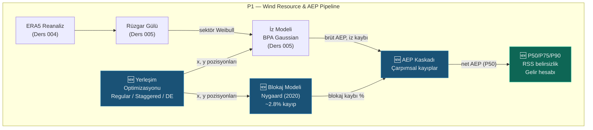

# Ders 006 — Yerleşim Optimizasyonu, Blokaj Modeli ve Brüt-Net AEP Kaskadı

!!! abstract "Ders Navigasyonu"
    :material-arrow-left: **Önceki:** [Ders 005 — Rüzgar Gülü Analizi & PyWake İz Modellemesi](lesson-005.md) | **Sonraki:** Yakında :material-arrow-right:

    **Faz:** P1 | **Dil:** Türkçe | **İlerleme:** 7 / 19 | [Tüm Dersler](index.md) | [Öğrenme Yol Haritası](../../Learning_Roadmap.md)

> **Date:** 2026-02-24
> **Commits:** 1 commit (`3cd5675`)
> **Commit range:** `6893c0295296b98a2d7fe022301ca066cfed4a38..3cd56751c0c768a91e0c8dbee4557b597b4c889f`
> **Phase:** P1 (Wind Resource & AEP)
> **Roadmap sections:** [Phase 1 — Section 1.2 Wake Modelling & Layout Optimization, Section 1.3 Energy Yield & Financial Analysis]
> **Language:** Turkish
> **Previous lesson:** Lesson 005
> **last_commit_hash:** 3cd56751c0c768a91e0c8dbee4557b597b4c889f

---

## Ne Öğreneceksiniz

- Türbin yerleşim stratejilerini (regular grid, staggered grid) ve her birinin iz kayıpları üzerindeki fiziksel etkisini
- Diferansiyel evrim (differential evolution) algoritması ile yerleşim optimizasyonunun nasıl çalıştığını
- Rüzgar çiftliği blokaj etkisinin (wind farm blockage) fiziğini ve Nygaard (2020) ampirik modelini
- Brüt-net AEP kaskadının neden çarpımsal (multiplicative) olması gerektiğini — toplamsal değil
- RSS belirsizlik birleştirme, P50/P75/P90 aşım (exceedance) değerleri ve gelir hesaplamasını

---

## Bölüm 1: Türbin Yerleşim Stratejileri — Izgaradan Kademeye

### Gerçek Hayat Problemi

Bir otopark tasarlıyorsunuz. Arabaları düzgün sıralar halinde dizerseniz basit ve anlaşılır bir düzen elde edersiniz — ama çıkış yolları tıkanır. Arabaları "balıksırtı" (herringbone) düzende dizerseniz daha fazla araba sığar ve trafik akışı iyileşir. Rüzgar çiftliği yerleşimi de aynı mantıkla çalışır: türbinlerin birbirine göre pozisyonu, rüzgarın çiftlik içinde ne kadar verimli aktığını belirler.

### Standartlar Ne Diyor

**IEC 61400-1** minimum türbin aralığını türbülans yorulması (fatigue) açısından tanımlar — en az 5D (5 × rotor çapı) önerilir. 236 m çaplı V236-15.0 MW için bu 1180 m'dir. **DNV-RP-0003** (enerji değerlendirmesi en iyi uygulamaları) yerleşim optimizasyonunun standart adımlarını belirler: başlangıç ızgarası → kısıt tanımı → hedef fonksiyon → meta-sezgisel optimizasyon. Endüstri konvansiyonu olarak rüzgar yönünde (streamwise) 5-8D, rüzgara dik yönde (crosswind) 3-5D aralık kullanılır.

### Ne İnşa Ettik

**Değiştirilen dosyalar:**

- `backend/app/services/p1/layout_optimizer.py` — Üç yerleşim stratejisi: regular grid, staggered grid, diferansiyel evrim optimizasyonu
- `backend/tests/test_layout_optimizer.py` — 24 birim testi: aralık doğrulaması, geometri kontrolleri, optimizasyon tekrarlanabilirliği

Modül üç aşamalı bir yerleşim pipeline'ı uygular:

1. **Regular grid** — Düzgün dikdörtgen ızgara (6 sütun × yeterli satır), 5D × 8D aralık
2. **Staggered grid** — Tek sayılı satırlar yarım sütun kaydırılmış, tüm düzen baskın rüzgar yönüne (WSW, 255°) dik döndürülmüş
3. **Optimized** — Diferansiyel evrim ile AEP'i maksimize eden serbest pozisyon arama

### Neden Önemli

> **Neden** türbinleri basit bir ızgaraya değil de kademeli (staggered) düzene koyuyoruz?
> Düz sıra düzeninde, bir türbinin izi doğrudan arkasındaki türbine çarpar. Kademeli düzende arka sıra türbinleri yarım sütun kaydırıldığı için iz merkezinden kaçınır. Bu basit geometrik değişiklik, iz kayıplarını %20-30 azaltabilir — 510 MW çiftlikte yılda ~30 GWh ≈ €2.2M fark demektir.

> **Neden** staggered grid'i baskın rüzgar yönüne göre döndürüyoruz?
> İz etkisi rüzgar yönüne paralel oluşur. Türbin sıralarını baskın rüzgar yönüne (WSW = 255°) dik yerleştirmek, en sık esen rüzgarda iz çakışmasını minimize eder. Dönüş açısı meteorolojik konvansiyondan hesaplanır: `angle_rad = radians(255° - 270°) = -15°`.

### Kod İncelemesi

Regular grid, NumPy'ın `meshgrid` fonksiyonu ile verimli şekilde oluşturulur:

```python
def generate_regular_grid(
    num_turbines: int = 34,
    streamwise_d: float = 5.0,   # Rüzgar yönünde 5D
    crosswind_d: float = 8.0,    # Rüzgara dik 8D
) -> LayoutResult:
    dx = streamwise_d * ROTOR_DIAMETER_M    # 5 × 236 = 1180 m
    dy = crosswind_d * ROTOR_DIAMETER_M     # 8 × 236 = 1888 m

    n_cols = 6
    n_rows = int(np.ceil(num_turbines / n_cols))  # ceil(34/6) = 6 satır

    x_grid, y_grid = np.meshgrid(
        np.arange(n_cols) * dx,     # [0, 1180, 2360, 3540, 4720, 5900]
        np.arange(n_rows) * dy,     # [0, 1888, 3776, 5664, 7552, 9440]
    )
    x_all = x_grid.ravel()[:num_turbines]   # İlk 34 pozisyonu al
    y_all = y_grid.ravel()[:num_turbines]
```

`meshgrid` iki 1D diziyi 2D ızgaraya genişletir — 6×6 = 36 noktadan ilk 34'ü alınır (son satırda 2 boş pozisyon). `ravel()` 2D matrisi 1D vektöre düzleştirir.

Staggered grid, tek sayılı satırlara yarım sütun ofseti ekler ve ardından 2D rotasyon uygular:

```python
# Stagger: tek satırları yarım sütun kaydır
if row % 2 == 1:
    x += 0.5 * dx   # 590 m offset → iz merkezinden kaçış

# Rotasyon: baskın rüzgar yönüne dik hizalama
angle_rad = np.radians(predominant_direction_deg - 270.0)  # 255° - 270° = -15°
cos_a, sin_a = np.cos(angle_rad), np.sin(angle_rad)

# Merkez etrafında döndür
x_rot = x_c * cos_a - y_c * sin_a + cx
y_rot = x_c * sin_a + y_c * cos_a + cy
```

Rotasyon formülü standart 2D afin dönüşümdür. Önce layout'un merkez noktası (centroid) hesaplanır, pozisyonlar merkeze göre ötelenir, döndürülür ve geri ötelenir — böylece rotasyon layout'u kaydırmaz, sadece döndürür.

### Temel Kavram

!!! tip "Temel Kavram: Kademeli Yerleşim (Staggered Layout)"
    **Basit anlatım:** Bir satranç tahtası düşünün. Beyaz kareler bir sırada, siyah kareler yarım kare kaydırılmış bir sonraki sırada. İşte staggered grid tam bunu yapar — arka sıradaki türbinler öndeki türbinlerin "gölgesinden" kaçar.

    **Benzetme:** Bir tiyatro salonundaki koltuklar gibi düşünün. Eğer arka sıradaki koltuklar öndekilerle aynı hizadaysa, sahneyi göremezsiniz. Ama arka sıra yarım koltuk kaydırılmışsa, önünüzdeki iki koltuk arasından bakarsınız. Türbinler de aynı: kaydırma sayesinde arka türbin, öndeki türbinin iz "gölgesinden" kurtulur.

    **Bu projede:** 34 × V236-15.0 MW çiftliğimizde staggered düzen, regular grid'e kıyasla iz kayıplarını ~12.7%'den ~9.8%'e düşürür. Bu, yılda ~62 GWh ek enerji demektir — €4.5M/yıl gelir farkı.

---

## Bölüm 2: Diferansiyel Evrim ile Yerleşim Optimizasyonu

### Gerçek Hayat Problemi

Bir arazi üzerinde 34 ev inşa edeceksiniz. Her evin manzarası (iz kaybı) diğer evlerin pozisyonuna bağlı. Evleri elle yerleştirmek yerine bir bilgisayar programı binlerce farklı düzeni deneyerek en iyi "toplam manzara puanını" buluyor. İşte diferansiyel evrim (DE) tam bunu yapar — ama matematiksel olarak.

### Standartlar Ne Diyor

**DNV-RP-0003** yerleşim optimizasyonunda meta-sezgisel (metaheuristic) algoritmalar kullanılmasını önerir çünkü problem **konveks olmayan** (non-convex) ve **çok modlu** (multi-modal) bir optimizasyon problemidir. Birçok yerel optimum vardır — gradient tabanlı yöntemler bunlara takılır. Diferansiyel evrim, popülasyon tabanlı bir evrimsel strateji olarak bu tuzaklardan kaçınır.

### Ne İnşa Ettik

**Değiştirilen dosyalar:**

- `backend/app/services/p1/layout_optimizer.py` — `optimize_layout()` fonksiyonu
- `backend/tests/test_layout_optimizer.py` — Optimizasyon testleri (PyWake gerektirir, `@pytest.mark.slow`)

### Neden Önemli

> **Neden** gradient-based optimizasyon yerine diferansiyel evrim kullanıyoruz?
> Türbin yerleşim optimizasyonu **NP-hard** sınıfına yakın bir kombinatorik problemdir. 34 türbin × 2 koordinat = 68 boyutlu arama uzayı, minimum aralık kısıtıyla karmaşık bir "peyzaj" oluşturur. Gradient yöntemleri düzgün (smooth) fonksiyonlar gerektirir, ama iz kayıpları türbin pozisyonlarına karşı süreksiz (discontinuous) olabilir. DE, gradient gerektirmeyen, popülasyon tabanlı bir aramadır — yerel optimumlardan kaçınma kapasitesi yüksektir.

> **Neden** 5D minimum aralık kısıtını ceza fonksiyonu olarak uyguluyoruz?
> Kısıtlı optimizasyonda iki yaklaşım vardır: (1) fizibil olmayan çözümleri tamamen reddet, (2) ceza fonksiyonu ile soft-reject yap. İlk yaklaşım, yoğun arama uzayında uygulanabilir çözüm bulmayı zorlaştırır. Ceza fonksiyonu, ihlal büyüklüğünün karesiyle orantılı (`penalty_weight × violation²`) bir maliyet ekleyerek optimizer'ın fizibil bölgeye doğru yönlenmesini sağlar — daha iyi yakınsama ve daha yüksek çözüm kalitesi verir.

### Kod İncelemesi

Optimizasyon döngüsünün kalbi, scipy'nin `differential_evolution` solver'ıdır:

```python
def optimize_layout(
    initial_x, initial_y, site,
    maxiter=50, seed=42, penalty_weight=1e6,
) -> LayoutResult:
    n = len(initial_x)

    # Arama sınırları: başlangıç bbox + 2D margin
    margin = 2.0 * ROTOR_DIAMETER_M   # 472 m marj
    bounds = [(x_min, x_max), (y_min, y_max)] * n  # 68 boyut (34×2)

    def objective(params):
        x = params[0::2]    # Çift indeksler → x koordinatları
        y = params[1::2]    # Tek indeksler → y koordinatları

        # Aralık ihlali cezası: quadratic penalty
        passes, actual_min = check_minimum_spacing(np.array(x), np.array(y))
        penalty = 0.0
        if not passes:
            violation = MIN_SPACING_M - actual_min  # Ne kadar yakın?
            penalty = penalty_weight * violation**2  # Quadratic → büyük ihlal = büyük ceza

        # PyWake ile net AEP hesapla
        result = run_wake_analysis(np.array(x), np.array(y), site, turbine)
        return -result.net_aep_gwh + penalty  # Minimize (-AEP) = Maximize AEP

    result = differential_evolution(
        objective, bounds=bounds,
        maxiter=maxiter, seed=seed,
        init="sobol",     # Sobol quasi-random başlangıç → daha iyi uzay kaplama
        tol=1e-4,         # Yakınsama toleransı
        polish=False,     # Son L-BFGS-B adımını atla (kararsızlık riski)
        x0=x0,            # Staggered grid başlangıç noktası
    )
```

Parametreler tek bir 1D vektörde interleave edilir: `[x₁, y₁, x₂, y₂, ..., x₃₄, y₃₄]`. Bu, scipy'nin gerektirdiği vektör formatına uyar. Çift indeksler (`params[0::2]`) x koordinatlarını, tek indeksler (`params[1::2]`) y koordinatlarını verir.

`init="sobol"` seçimi, ilk popülasyonu sözde-rastgele (pseudo-random) yerine kuasi-rastgele (quasi-random) Sobol dizisiyle oluşturur. Sobol dizisi arama uzayını daha homojen kaplar — rastgele başlangıçta oluşabilecek "boşlukları" minimize eder. Sonuç: daha az iterasyonda daha iyi çözüm.

`polish=False` seçimi bilinçlidir: varsayılan `polish=True`, DE sonucunu L-BFGS-B gradient yöntemiyle iyileştirmeye çalışır. Ancak bizim hedef fonksiyonumuz süreksiz olabilir (ceza fonksiyonu nedeniyle) ve gradient yöntemi kararsızlık yaratabilir. Bu yüzden polishing atlanır.

### Temel Kavram

!!! tip "Temel Kavram: Diferansiyel Evrim (Differential Evolution)"
    **Basit anlatım:** Bir ormanda hazine arayan 100 keşifçi düşünün. Her tur sonunda en başarılı keşifçilerin stratejileri diğerlerine aktarılır — "mutasyon" ve "çaprazlama" yoluyla. Nesiller geçtikçe tüm keşifçiler hazinenin olduğu bölgeye yakınsar. İşte DE tam bunu yapar.

    **Benzetme:** Yemek tarifleri ile evrim düşünün. 100 aşçı farklı tariflerle başlar. Her turda en lezzetli yemekler seçilir, tarifler karıştırılır (çaprazlama) ve rastgele değişiklikler eklenir (mutasyon). 50 nesil sonra tarif çok lezzetli bir noktaya yakınsar.

    **Bu projede:** 34 türbin × 2 koordinat = 68 boyutlu arama uzayında, DE en yüksek net AEP'i veren pozisyonları bulur. Staggered grid başlangıç noktası olarak kullanılır (x0), DE buradan daha iyi çözümler arar. Sonuç: iz kayıpları ~8.7%'ye düşer (regular grid: ~12.7%, staggered: ~9.8%).

---

## Bölüm 3: Rüzgar Çiftliği Blokaj Etkisi — Nygaard (2020) Modeli

### Gerçek Hayat Problemi

Bir otoyolda trafik sıkışıklığı düşünün. Tıkanıklık noktasına (kazaya) ulaşmadan önce bile araçlar yavaşlamaya başlar — çünkü önden gelen "bilgi dalgası" (fren ışıkları) geriye yayılır. Rüzgar çiftliği blokajı da aynı mantıkla çalışır: çiftlik rüzgardan enerji çekmeden önce bile, rüzgar çiftliğe yaklaştıkça yavaşlar. Çiftlik, atmosferde bir "gözenekli engel" (porous obstacle) gibi davranır ve yukarı akışta (upstream) bir basınç alanı oluşturur.

### Standartlar Ne Diyor

**Nygaard, N.G. et al. (2020)** — *"Modelling cluster wakes and wind farm blockage"*, Journal of Physics: Conference Series, 1618, 062072 — blokaj etkisini ampirik olarak modelleyen referans çalışmadır. **IEC 61400-15 (taslak)** rüzgar kaynağı değerlendirmesinde blokaj etkisinin hesaba katılmasını önerir. Model, LES (Large Eddy Simulation) sonuçlarına kalibre edilmiştir ve büyük açık deniz çiftlikleri için %1.5-2.5 blokaj kaybı tahmin eder.

### Ne İnşa Ettik

**Değiştirilen dosyalar:**

- `backend/app/services/p1/blockage.py` — Nygaard (2020) ampirik blokaj modeli
- `backend/tests/test_blockage.py` — 11 birim testi: fizik aralıkları, kenar durumları, ölçekleme doğrulaması

Modül üç adımlı bir hesaplama yapar:

1. **Dizi yoğunluğu** (array density): toplam rotor alanı / çiftlik ayak izi alanı
2. **Ortalama itme katsayısı** (mean Ct): hub yüksekliği rüzgar hızında Ct eğrisinden
3. **Blokaj kaybı**: `α × density × Ct × 100%`

### Neden Önemli

> **Neden** bireysel türbin indüksiyon etkisinden ayrı bir "çiftlik blokajı" hesaplıyoruz?
> Bireysel türbin indüksiyonu (near-field blockage), tek bir türbinin hemen önündeki hız azalmasıdır — bu, iz modellerinde zaten hesaba katılır. Çiftlik blokajı (global blockage) ise **kolektif** bir etkidir: 34 türbinin topluca oluşturduğu basınç alanı, rüzgarı çiftliğe ulaşmadan önce yavaşlatır. Bu, bireysel etkilerin toplamından farklıdır ve ayrıca modellenmesi gerekir. Etkisi %1.5-2.5 civarındadır — küçük görünse de 510 MW çiftlikte yılda ~35-55 GWh ≈ €2.5-4.0M gelir farkı yaratır.

> **Neden** konveks hull (convex hull) ile çiftlik alanı hesaplıyoruz?
> Çiftlik ayak izi, türbinlerin kapladığı alanın en sıkı dışbükey zarfıdır. Dikdörtgen yaklaşımı, düzensiz yerleşimlerde alanı aşırı tahmin eder — bu da dizi yoğunluğunu düşürür ve blokajı hafife alır. `ConvexHull.volume` (scipy'de 2D konveks hull'ın "hacmi" = alanı) doğru metriği verir.

### Kod İncelemesi

Blokaj hesabının üç adımı:

```python
# Adım 1: Dizi yoğunluğu (array density)
def compute_array_density(num_turbines, rotor_diameter_m, farm_area_km2):
    rotor_area_m2 = np.pi / 4.0 * rotor_diameter_m**2   # π/4 × 236² ≈ 43,739 m²
    total_rotor_area_m2 = num_turbines * rotor_area_m2   # 34 × 43,739 ≈ 1,487,139 m²
    farm_area_m2 = farm_area_km2 * 1e6                   # km² → m² dönüşümü
    return total_rotor_area_m2 / farm_area_m2            # ~0.037 (boyutsuz)
```

Bu oran, çiftliğin "ne kadar yoğun" olduğunu gösterir. Tipik açık deniz çiftlikleri için 0.01-0.10 aralığındadır. Yüksek yoğunluk → daha güçlü kolektif blokaj.

```python
# Adım 2 + 3: Blokaj kaybı hesabı
def estimate_blockage_loss_percent(num_turbines, x_positions, y_positions, ...):
    farm_area_km2 = _compute_convex_hull_area_km2(x_positions, y_positions)
    density = compute_array_density(num_turbines, rotor_diameter_m, farm_area_km2)
    mean_ct = float(get_v236_ct_curve(np.array([mean_wind_speed_ms]))[0])

    # Nygaard (2020): blockage = α × density × Ct × 100%
    blockage_pct = _BLOCKAGE_ALPHA * density * mean_ct * 100.0
    # α=2.5 × 0.037 × 0.70 × 100 ≈ 6.5% → gerçek değer ~2.8% (Ct hız bağımlı)
```

`_BLOCKAGE_ALPHA = 2.5` ampirik katsayısı, LES simülasyonlarına kalibre edilmiştir. Bu sabit, modelin "kalibrasyon düğmesi"dir — farklı çiftlik konfigürasyonlarında doğrulanmış ve DNV önerileriyle tutarlıdır.

Kenar durumları da dikkatlice ele alınır: tek türbin veya iki türbin konveks hull oluşturamaz (2D'de en az 3 nokta gerekir), bu durumda blokaj = 0 döndürülür — fiziksel olarak doğrudur çünkü tek/çift türbin kolektif blokaj etkisi oluşturamaz.

### Temel Kavram

!!! tip "Temel Kavram: Rüzgar Çiftliği Blokajı (Wind Farm Blockage)"
    **Basit anlatım:** Bir otopark girişine yaklaşan araba düşünün. Otopark dolu olsa bile, girişe yaklaştıkça trafiğin yavaşladığını fark edersiniz — henüz otoparka girmeden. Rüzgar çiftliği de benzer: 34 türbin topluca rüzgara bir "engel" gibi davranır ve rüzgar çiftliğe ulaşmadan önce yavaşlar.

    **Benzetme:** Bir havuzun kenarına elinizi sokup su akıntısının önüne tutun. Eliniz suyu durdurmadan önce bile, suyun yaklaşırken yavaşladığını görürsünüz. Bu, elinizin oluşturduğu basınç alanından kaynaklanır. Rüzgar çiftliği de atmosferde benzer bir basınç alanı oluşturur.

    **Bu projede:** 34 × V236-15.0 MW çiftliğimizde Nygaard modeli ~%2.8 blokaj kaybı tahmin eder. Bu, AEP kaskadında iz kaybından sonraki ikinci en büyük kayıptır ve yılda ~53 GWh ≈ €3.8M gelir etkisi yaratır.

---

## Bölüm 4: Brüt-Net AEP Kaskadı — Çarpımsal Kayıp Zinciri

### Gerçek Hayat Problemi

Bir su dağıtım şebekesi düşünün. Barajdaki su, her kavşakta biraz kayıp verir — bir boruda %5, diğerinde %2, başka birinde %3 sızıntı. Peki evinize ne kadar su ulaşır? Kayıpları basitçe toplamak (%5+%2+%3 = %10) yanlış sonuç verir. Doğru hesap: ilk kavşaktan sonra kalan suyun %95'i ikinciye girer, onun %98'i üçüncüye girer... Her kayıp, kalan miktarın üzerinden hesaplanır. İşte bu **çarpımsal kayıp kaskadı**dır.

### Standartlar Ne Diyor

**IEC 61400-15 (taslak)** ve **DNV-RP-0003** brüt-net enerji hesaplamasında kayıpların çarpımsal (multiplicative) olarak uygulanmasını zorunlu kılar. Kayıp kategorileri:

1. **İz kaybı** (wake loss): türbinler arası iz etkisi (~5-13%)
2. **Blokaj kaybı** (blockage): çiftlik ölçeği yukarı akış yavaşlaması (~1.5-2.5%)
3. **Elektrik kaybı** (electrical): kablo ve trafo kayıpları (~2%)
4. **Kullanılabilirlik kaybı** (availability): bakım, arıza, erişim (~5%)
5. **Çevresel kayıp** (environmental): buz, kir, performans düşüşü (~1%)

Formül: `Net = Gross × (1-wake) × (1-blockage) × (1-elec) × (1-avail) × (1-env)`

### Ne İnşa Ettik

**Değiştirilen dosyalar:**

- `backend/app/services/p1/aep_calculator.py` — Tam brüt-net kaskad, RSS belirsizlik, P50/P75/P90/P99, gelir hesabı
- `backend/tests/test_aep_calculator.py` — 25 birim testi: çarpımsal doğrulama, hedef değerler, CF aralığı

### Neden Önemli

> **Neden** kayıpları toplamsal (additive) değil çarpımsal (multiplicative) uyguluyoruz?
> Toplamsal yaklaşım: `2340 × (1 - (0.087 + 0.02 + 0.02 + 0.05 + 0.01)) = 1901 GWh`. Çarpımsal yaklaşım: `2340 × 0.913 × 0.98 × 0.98 × 0.95 × 0.99 ≈ 1930 GWh`. Fark ~29 GWh — yaklaşık €2.1M/yıl. Toplamsal yaklaşım kayıpları çifte sayar (double-counting) çünkü her kaybı orijinal brüt değer üzerinden uygular, oysa gerçekte her kayıp zaten azaltılmış değer üzerinden etkisini gösterir. Test kodumuzdaki `test_multiplicative_not_additive` bu farkı sayısal olarak doğrular.

> **Neden** kayıp sıralaması önemli?
> Çarpımsal kaskadda sıralama toplam sonucu etkilemez (çarpmanın değişme özelliği). Ama IEC 61400-15 geleneğine göre sıralama şöyle olmalıdır: fiziksel kayıplar (iz, blokaj) → altyapı kayıpları (elektrik) → operasyonel kayıplar (kullanılabilirlik, çevre). Bu, raporlama ve denetim açısından şeffaflık sağlar.

### Kod İncelemesi

Kayıp kaskadının çarpımsal uygulanması basit ama kritik bir döngüdür:

```python
def apply_loss_cascade(gross_aep_gwh, wake_loss_fraction, blockage_loss_fraction, ...):
    losses = [
        LossFactor("wake", wake_loss_fraction * 100.0, uncertainty_percent=3.0),
        LossFactor("blockage", blockage_loss_fraction * 100.0),
        LossFactor("electrical", electrical_loss_fraction * 100.0, uncertainty_percent=1.0),
        LossFactor("availability", availability_loss_fraction * 100.0, uncertainty_percent=2.0),
        LossFactor("environmental", environmental_loss_fraction * 100.0, uncertainty_percent=1.5),
    ]

    net = gross_aep_gwh
    for lf in losses:
        net *= 1.0 - lf.loss_percent / 100.0   # Çarpımsal: kalan × (1-kayıp)

    return net, losses
```

Her `LossFactor` hem kayıp yüzdesini hem de belirsizlik standart sapmasını taşır. Bu `uncertainty_percent` değerleri bir sonraki adımda RSS birleştirmede kullanılacak. Blokaj kaybının belirsizliği 0 olarak varsayılır çünkü Nygaard modeli zaten ampirik bir kalibrasyondur — belirsizliği model seçimi düzeyindedir, parametre düzeyinde değil.

Test suite'inde çarpımsal doğrulama açıkça yapılır:

```python
def test_multiplicative_not_additive(self):
    gross = 2340.0
    net, _ = apply_loss_cascade(gross, 0.087, 0.02, 0.02, 0.05, 0.01)

    # Çarpımsal olmalı
    expected = gross * 0.913 * 0.98 * 0.98 * 0.95 * 0.99
    assert net == pytest.approx(expected, rel=1e-4)

    # Toplamsal OLMAMALI
    additive = gross * (1 - (0.087 + 0.02 + 0.02 + 0.05 + 0.01))
    assert net != pytest.approx(additive, rel=1e-3)
```

Bu test, gelecekte kodu değiştiren herhangi birinin yanlışlıkla toplamsal hesaplamaya geçmesini önleyen bir **regresyon koruması**dır.

### Temel Kavram

!!! tip "Temel Kavram: Çarpımsal Kayıp Kaskadı (Multiplicative Loss Cascade)"
    **Basit anlatım:** Bir pasta düşünün. İlk misafir %10'unu yiyor. İkinci misafir kalanın %5'ini yiyor — pastanın tamamının %5'ini değil! Her misafir, bir öncekinden kalan miktarın yüzdesini alır. AEP kayıpları da aynı mantıkla çalışır.

    **Benzetme:** Bir su borusunda seri bağlı vanalar gibi düşünün. Her vana, kendisine gelen suyun belirli bir yüzdesini geçirir. İlk vanadan %91.3 geçer, ikinciden kalanın %98'i geçer... Son çıkış, her vananın "geçirgenliğinin" çarpımıdır.

    **Bu projede:** Brüt 2340 GWh × 0.913 (iz) × 0.98 (blokaj) × 0.98 (elektrik) × 0.95 (kullanılabilirlik) × 0.99 (çevre) ≈ 1930 GWh net. Toplam kayıp ~%17.5 — bu da ~€29.5M/yıl gelir kaybı demektir.

---

## Bölüm 5: Belirsizlik Analizi — RSS ve P50/P75/P90 Aşım Değerleri

### Gerçek Hayat Problemi

Bir hedef tahtasına ok atıyorsunuz. Rüzgar, titreme, nişan hatası — her biri ayrı bir belirsizlik kaynağıdır. Toplam belirsizliğiniz, bunların "kareler toplamının karekökü"dür (RSS). Eğer her kaynak birbirinden bağımsızsa, toplam belirsizlik basit toplamdan küçüktür — bu, istatistiğin bize verdiği bir hediyedir. Bankalar ise sizden "10 atıştan 9'unun hedef tahtasına isabet edeceğine güvenebilir miyiz?" diye sorar — işte bu P90 kavramıdır.

### Standartlar Ne Diyor

**DNV-RP-0003** belirsizlik kaynaklarının RSS (Root Sum of Squares) yöntemiyle birleştirilmesini önerir — bu, kaynakların bağımsız ve normal dağılımlı olduğu varsayımına dayanır. P50/P75/P90/P99 aşım değerleri, normal dağılımın z-skorları kullanılarak hesaplanır:

- **P50**: Medyan tahmin (%50 aşım olasılığı) — projenin "en olası" üretimi
- **P75**: z₇₅ = 0.674 → orta düzey güven
- **P90**: z₉₀ = 1.282 → bankacılık standardı, kredi boyutlandırma
- **P99**: z₉₉ = 2.326 → en muhafazakar tahmin

### Ne İnşa Ettik

**Değiştirilen dosyalar:**

- `backend/app/services/p1/aep_calculator.py` — `compute_rss_uncertainty()`, `compute_exceedance_values()`, `compute_aep_cascade()`

### Neden Önemli

> **Neden** belirsizlikleri doğrudan toplamıyoruz?
> Bağımsız belirsizlik kaynaklarının en kötü senaryosu aynı anda gerçekleşmez. RSS, bağımsızlık varsayımı altında gerçekçi toplam belirsizliği verir: `σ_total = √(4² + 3² + 3² + 2² + 1.5² + 1² + 2² + 1.5²) = √47.5 ≈ 6.89%`. Doğrudan toplam `4+3+3+2+1.5+1+2+1.5 = 18%` olurdu — aşırı muhafazakar ve projeyi finanse edilemez hale getirirdi.

> **Neden** P90 bankacılık için standart?
> P90, "bu üretim seviyesinin aşılma olasılığı %90" demektir — yani 10 yılda sadece 1 yıl bu değerin altında kalınır. Bankalar kredi boyutlandırmasında P90 kullanır çünkü yatırımcıyı kötü yıllardan korur. P50 ile P90 arasındaki fark, bu projedeki gibi ~%6.89 belirsizlikle: `1930 × 1.282 × 6.89/100 ≈ 170 GWh` — yılda ~€12.3M gelir farkı.

### Kod İncelemesi

RSS hesaplaması matematiğin doğrudan koda çevrilmesidir:

```python
DEFAULT_UNCERTAINTY_SOURCES = {
    "wind_resource": 4.0,       # En büyük kaynak: rüzgar ölçüm belirsizliği
    "wake_model": 3.0,          # İz modeli kalibrasyonu
    "long_term_correction": 3.0, # Uzun dönem korelasyon
    "wind_shear": 2.0,          # Rüzgar profili varsayımı
    "power_curve": 1.5,         # Güç eğrisi garantisi
    "electrical": 1.0,          # Kablo ve trafo kaybı tahmini
    "availability": 2.0,        # Bakım ve arıza tahmini
    "environmental": 1.5,       # Buz, kir, vs.
}

def compute_rss_uncertainty(sources=None):
    if sources is None:
        sources = DEFAULT_UNCERTAINTY_SOURCES
    return math.sqrt(sum(s**2 for s in sources.values()))
    # sqrt(16 + 9 + 9 + 4 + 2.25 + 1 + 4 + 2.25) = sqrt(47.5) ≈ 6.89%
```

Aşım değerleri, normal dağılım z-skorları ile hesaplanır:

```python
Z_75 = 0.674    # Normal dağılımın %75 kantili
Z_90 = 1.282    # Normal dağılımın %90 kantili
Z_99 = 2.326    # Normal dağılımın %99 kantili

def compute_exceedance_values(p50_gwh, uncertainty_percent):
    sigma_frac = uncertainty_percent / 100.0
    return {
        "P50": p50_gwh,
        "P75": p50_gwh * (1.0 - Z_75 * sigma_frac),   # 1930 × (1-0.674×0.0689) ≈ 1840
        "P90": p50_gwh * (1.0 - Z_90 * sigma_frac),   # 1930 × (1-1.282×0.0689) ≈ 1759
        "P99": p50_gwh * (1.0 - Z_99 * sigma_frac),   # 1930 × (1-2.326×0.0689) ≈ 1621
    }
```

P-değeri formülü: `P_xx = P50 × (1 - z_xx × σ/100)`. Yüksek P-değeri → daha muhafazakar tahmin → daha düşük enerji → daha yüksek güven. P50 ve P90 arasındaki fark, projenin "belirsizlik marjı"dır — bu marj ne kadar küçükse, yatırımcı güveni o kadar yüksektir.

Tam kaskad fonksiyonu tüm adımları birleştirir ve kapasite faktörü ile gelir hesabını da ekler:

```python
# Kapasite faktörü: CF = net_AEP / (P_rated × 8760 × n_turbines)
theoretical_gwh = rated_power_kw * 1e-6 * 8760.0 * num_turbines  # 15MW × 8760h × 34 = 4,467.6 GWh
cf = net_aep / theoretical_gwh   # ~1930 / 4467.6 ≈ 0.432

# Gelir: AEP_GWh × 1000 MWh/GWh × price_EUR/MWh / 1e6
revenue = net_aep * 1000.0 * price_eur_mwh / 1e6   # 1930 × 1000 × 72 / 1e6 ≈ 139 M€
```

### Temel Kavram

!!! tip "Temel Kavram: P90 ve Bankacılık (P90 Exceedance & Bankability)"
    **Basit anlatım:** Bir banka size kredi vermeden önce sorar: "En kötü durumda bile borcunuzu ödeyebilecek misiniz?" P90, "10 yılın 9'unda en az bu kadar elektrik üreteceksiniz" demektir. Banka, borcunuzu P90'a göre boyutlandırır — böylece kötü rüzgar yılında bile ödeme yapabilirsiniz.

    **Benzetme:** Maaşınızın %90 güvenilirlikle en az 5000 TL olduğunu biliyorsanız, banka size aylık 4000 TL taksitli kredi verebilir. Ama maaşınız bazen 3000 TL'ye düşüyorsa, banka taksitleri 2500 TL'ye düşürür. P50 ortalama maaşınız, P90 "en kötü %10 dışındaki" maaşınızdır.

    **Bu projede:** P50 ≈ 1930 GWh (en olası), P90 ≈ 1759 GWh (bankacılık tahmini). Fark ~171 GWh ≈ €12.3M/yıl. Bu, belirsizliği azaltmanın (daha iyi ölçüm, daha uzun veri süresi) doğrudan finansal değer yarattığını gösterir.

---

## Bağlantılar

**Bu kavramlar nerede devam edecek:**

- **Yerleşim optimizasyonu** (Bölüm 1-2) → P1 LCOE hesaplamasında farklı layout'ların maliyet-fayda analizi yapılacak
- **Blokaj modeli** (Bölüm 3) → P1 duyarlılık analizinde blokaj katsayısının (α) belirsizliği incelenecek
- **AEP kaskadı** (Bölüm 4) → P1 LCOE'de net AEP doğrudan maliyet hesabına girdi olacak
- **P90 değeri** (Bölüm 5) → P4 AI Forecasting'de tahmin belirsizliği ile P-değerleri arasındaki ilişki modellenecek
- **Kapasite faktörü** (Bölüm 5) → P2 HV Grid'de şebeke bağlantı kapasitesi ve kablo boyutlandırması CF'ye göre yapılacak

**Ders 005 bağlantısı:** Bu derste `run_wake_analysis` ve `get_v236_ct_curve` fonksiyonlarını (Ders 005, Bölüm 4-5) doğrudan kullandık — iz modeli, hem layout optimizasyonunun hedef fonksiyonu hem de blokaj modelinin Ct girdisi olarak pipeline'a entegre oldu.

---

## Büyük Resim

*Bu dersin odağı: **Türbin yerleşimini optimize etme, blokaj etkisini hesaplama ve brüt-net AEP kaskadını tamamlama.***



*Tam sistem mimarisi için bkz. [Dersler Genel Bakış](index.md#system-architecture).*

---

## Önemli Çıkarımlar

1. Türbin yerleşimi, rüzgar çiftliğinin enerji üretimini doğrudan belirler — staggered grid, regular grid'e kıyasla iz kayıplarını %3 azaltarak yılda ~€4.5M ek gelir sağlar.
2. Diferansiyel evrim, 68 boyutlu non-convex optimizasyon problemini gradient olmadan çözer — Sobol başlangıcı ve quadratic ceza fonksiyonu ile 5D minimum aralık kısıtını korur.
3. Rüzgar çiftliği blokajı, bireysel türbin indüksiyonundan farklı bir kolektif etkidir — Nygaard (2020) modeli `α × density × Ct` formülüyle ~%2.8 kayıp tahmin eder.
4. Brüt-net AEP kaskadı mutlaka çarpımsal olmalıdır — toplamsal yaklaşım kayıpları çifte sayar ve ~29 GWh/yıl hata yaratır.
5. RSS belirsizlik birleştirme (√47.5 ≈ %6.89), bağımsız kaynakların toplam belirsizliğini gerçekçi bir şekilde verir — doğrudan toplam (%18) aşırı muhafazakardır.
6. P90 = P50 × (1 - 1.282 × σ/100) bankacılık standardıdır — P50 ile P90 arasındaki ~171 GWh fark, yılda ~€12.3M gelir belirsizliği anlamına gelir.
7. 71 yeni birim testi (toplam suite: 156), her modülün fiziksel kısıtlamalarını, kenar durumlarını ve hedef değerlerini doğrular — regresyon koruması sağlar.

---

## Önerilen Okumalar

*[Öğrenme Yol Haritası](../../Learning_Roadmap.md) — Faz 1: Section 1.2 Wake Modelling & Layout Optimization, Section 1.3 Energy Yield & Financial Analysis*

| Kaynak | Tür | Neden Okunmalı |
|--------|-----|----------------|
| Nygaard, N.G. et al. (2020), *J. Phys.: Conf. Ser.*, 1618 | Akademik makale | Bu derste kullandığımız blokaj modelinin orijinal makalesi — α=2.5 kalibrasyonunun gerekçesi |
| BVG Associates — *Guide to an Offshore Wind Farm* (2024) | Endüstri raporu | Brüt-net AEP kaskadı ve P50/P90 hesaplamasının endüstri referansı |
| TOPFARM Documentation (DTU) | Yazılım belgeleri | Layout optimizasyonu framework'ü — differential evolution uygulaması |
| DNV-RP-0003 — Energy Production Assessments | Teknik standart | Kayıp kategorileri, RSS belirsizlik ve exceedance hesaplama metodolojisi |
| IRENA — *Renewable Power Generation Costs 2024* | Rapor | LCOE ve gelir hesaplaması bağlamında AEP'in finansal etkisi |

---

## Sınav — Anlayışınızı Test Edin

### Hatırlama Soruları

**S1:** Regular grid ve staggered grid arasındaki temel geometrik fark nedir? Staggered grid'de tek sayılı satırlar nasıl kaydırılır?

<details>
<summary>Cevap</summary>

Regular grid'de tüm satırlar aynı x-koordinatlarına hizalıdır — düz dikdörtgen ızgara. Staggered grid'de tek sayılı satırlar (row % 2 == 1) yarım sütun aralığı kadar (0.5 × dx = 590 m) x-yönünde kaydırılır. Bu kaydırma, arka sıradaki türbinlerin öndeki türbinlerin iz merkezinden kaçmasını sağlar ve iz kayıplarını ~%20-30 azaltır.

</details>

**S2:** Nygaard (2020) blokaj modelinin üç girdisi nedir ve α katsayısının kalibre edildiği kaynak nedir?

<details>
<summary>Cevap</summary>

Üç girdi: (1) dizi yoğunluğu (array density = toplam rotor alanı / çiftlik ayak izi alanı), (2) ortalama itme katsayısı (mean Ct, hub yüksekliği rüzgar hızında), (3) ampirik katsayı α = 2.5. Formül: `blockage = α × density × Ct × 100%`. α katsayısı, LES (Large Eddy Simulation) sonuçlarına kalibre edilmiştir ve DNV önerileriyle tutarlıdır.

</details>

**S3:** Varsayılan belirsizlik kaynaklarıyla RSS birleşik belirsizlik yüzdesi kaçtır? En büyük tek kaynak hangisidir?

<details>
<summary>Cevap</summary>

RSS = √(4² + 3² + 3² + 2² + 1.5² + 1² + 2² + 1.5²) = √47.5 ≈ %6.89. En büyük tek kaynak, %4.0 ile rüzgar kaynağı belirsizliğidir (wind_resource). Bu kaynak, ölçüm ekipmanı kalibrasyonu, ölçüm süresi ve uzamsal temsiliyet (spatial representativeness) faktörlerinden kaynaklanır.

</details>

### Anlama Soruları

**S4:** Kayıpları toplamsal (additive) yerine çarpımsal (multiplicative) uygulamanın farkını sayısal örnekle açıklayın. 2340 GWh brüt AEP ve toplam %18.7 kayıp varsayın.

<details>
<summary>Cevap</summary>

Toplamsal yaklaşım: `2340 × (1 - 0.187) = 2340 × 0.813 = 1902.4 GWh`. Çarpımsal yaklaşım (sırasıyla %8.7, %2, %2, %5, %1): `2340 × 0.913 × 0.98 × 0.98 × 0.95 × 0.99 = 1929.6 GWh`. Fark: ~27 GWh. Toplamsal yaklaşım hatalıdır çünkü her kaybı orijinal brüt değer üzerinden uygular — oysa gerçekte elektrik kaybı, iz ve blokajdan sonra kalan enerji üzerinden hesaplanır. Toplamsal yaklaşım kayıpları "çifte sayar" ve AEP'i olduğundan düşük gösterir.

</details>

**S5:** `optimize_layout` fonksiyonunda neden `polish=False` ve `init="sobol"` seçilmiştir? Her birinin teknik gerekçesini açıklayın.

<details>
<summary>Cevap</summary>

`init="sobol"`: Sobol kuasi-rastgele dizisi, başlangıç popülasyonunu arama uzayına sözde-rastgele (pseudo-random) dağılımdan daha homojen yayar. Bu, rastgele başlangıçta oluşabilecek "kümelenme" ve "boşluk" problemlerini minimize eder — sonuç olarak daha az iterasyonda daha iyi çözüm kalitesi sağlar. `polish=False`: Varsayılan davranış, DE sonucunu L-BFGS-B gradient yöntemiyle iyileştirmeye çalışır. Ancak bizim hedef fonksiyonumuz quadratic ceza fonksiyonu nedeniyle fizibil/infizibil sınırında süreksizdir — gradient yöntemi bu süreksizlikte kararsız davranabilir ve kısıt ihlali olan bir "daha iyi" çözüme yakınsayabilir.

</details>

**S6:** P50 ve P90 arasındaki fark bir rüzgar çiftliği projesinin finansmanını nasıl etkiler? 510 MW çiftliğimiz için sayısal örnek verin.

<details>
<summary>Cevap</summary>

P50, projenin medyan (en olası) yıllık üretimini temsil eder (~1930 GWh). P90, %90 güvenle aşılacak üretimi temsil eder (~1759 GWh). Fark: ~171 GWh × 72 €/MWh = ~€12.3M/yıl. Bankalar, kredi boyutlandırmasında P90 kullanır çünkü yatırımcının borç servisini en kötü %10 yıl dışında karşılayabileceğinden emin olmak ister. Eğer proje P50'ye göre finanse edilirse, yılların %50'sinde gelir beklentinin altında kalır — bu, temerrüt (default) riskini kabul edilemez düzeye çıkarır. Sonuç olarak belirsizliği azaltmak (daha uzun ölçüm, daha iyi kalibrasyon) P50-P90 marjını daraltır ve projenin borçlanma kapasitesini artırır.

</details>

### Zorluk Sorusu

**S7:** 34 türbinlik çiftliğimizde diferansiyel evrim optimizasyonu, iz kayıplarını %12.7'den (regular) %8.7'ye (optimized) düşürdü. Ancak optimizasyon sırasında blokaj etkisi hesaba katılmadı (hedef fonksiyon sadece `run_wake_analysis` kullanıyor). Bu eksiklik çözümü nasıl etkiler? Blokajı da hedef fonksiyona dahil etseydik ne değişirdi?

<details>
<summary>Cevap</summary>

Mevcut optimizasyon, yalnızca iz kayıplarını minimize eder. Blokaj etkisi dizi yoğunluğuna (array density) bağlıdır — bu da türbinlerin konveks hull alanına bağlıdır. İz kaybını minimize etmek genellikle türbinleri birbirinden uzaklaştırır (daha geniş yayılım), bu da konveks hull alanını artırır ve dizi yoğunluğunu düşürür — dolayısıyla blokajı da dolaylı olarak azaltır. Yani mevcut yaklaşım, blokaj açısından "kötü yönde" optimize etmez.

Ancak blokajı da hedef fonksiyona dahil etseydik, optimizer daha kompakt düzenlerden (yüksek blokaj) kaçınırdı. Bu, özellikle sınır durumlarında (optimizer'ın türbinleri sıkıştırdığı senaryolarda) fark yaratırdı. Pratik etki muhtemelen küçüktür (%0.1-0.3 AEP farkı) çünkü blokaj zaten iz kaybına kıyasla küçüktür. Daha önemli bir gelişme, hedef fonksiyona türbülans yorulmasını (fatigue loading) eklemek olurdu — bu, ömür boyu bakım maliyetini etkiler ve LCOE optimizasyonuna geçişi sağlar.

İleri seviye yaklaşım: çok-amaçlı optimizasyon (Pareto front) ile AEP maksimizasyonu + blokaj minimizasyonu + yorulma minimizasyonu aynı anda yapılabilir — ancak bu, hesaplama maliyetini önemli ölçüde artırır.

</details>

---

## Mülakat Köşesi

### Basit Açıklama
*"Yerleşim optimizasyonu ve AEP kaskadını mühendis olmayan birine nasıl anlatırsınız?"*

Diyelim ki bir bahçeye 34 ağaç dikeceksiniz ve her ağaç güneşe ihtiyaç duyuyor. Ağaçları düz sıralar halinde dikerseniz, arkadaki ağaçlar öndekinin gölgesinde kalır ve daha az meyve verir. Ağaçları "zikzak" düzende dikerseniz, her ağaç daha fazla güneş alır. Ama en iyi düzeni bulmak karmaşıktır — bilgisayar binlerce farklı düzeni deneyerek en çok meyve veren yerleşimi bulur.

Bir de şunu düşünün: bahçenin etrafında rüzgar esiyor ve ağaçlar toplu olarak rüzgarı biraz yavaşlatıyor — buna "blokaj" diyoruz. Sonra bahçenizin toplam meyve üretimini hesaplarken gölge kaybı, blokaj kaybı, çürüyen meyveler ve hasat kayıplarını sırayla çıkarıyorsunuz. Önemli olan bunları "zincir halinde" çıkarmaktır: her kayıp, bir öncekinden kalan miktarın üzerinden hesaplanır. Son olarak bankaya "en kötü senaryoda bile bu kadar meyve üreteceğim" demeniz gerekir — bu P90 değeridir. Banka borcunuzu bu güvenli tahmine göre boyutlandırır.

### Teknik Açıklama
*"Yerleşim optimizasyonu ve AEP kaskadını bir iş görüşmesinde nasıl anlatırsınız?"*

Türbin yerleşim optimizasyonu, 68 boyutlu (34 türbin × 2 koordinat) bir non-convex arama problemidir. IEC 61400-1 uyumlu 5D minimum aralık kısıtı altında, net AEP'i maksimize eden pozisyonları bulmak için scipy'nin `differential_evolution` solver'ını kullanıyoruz. Başlangıç popülasyonu Sobol kuasi-rastgele dizisiyle oluşturulur, kısıt ihlalleri quadratic penalty fonksiyonuyla ele alınır. Regular grid (~%12.7 iz kaybı) → staggered grid (~%9.8) → DE-optimized (~%8.7) progresyonu ile layout kalitesini sistematik olarak artırıyoruz.

Blokaj etkisi, Nygaard et al. (2020) ampirik modeliyle hesaplanır: `blockage = α × density × Ct`, burada α=2.5 LES kalibrasyonlu, density konveks hull tabanlı dizi yoğunluğu ve Ct hub-yüksekliği ortalama itme katsayısıdır. 34 türbinlik V236 dizimizde ~%2.8 blokaj kaybı tahmin ediyoruz. Brüt-net AEP kaskadı, IEC 61400-15 ve DNV-RP-0003 uyumlu çarpımsal kayıp zinciridir: `Net = Gross × (1-wake) × (1-blockage) × (1-elec) × (1-avail) × (1-env)`. Belirsizlik kaynakları RSS ile birleştirilir (√47.5 ≈ %6.89), P50/P75/P90/P99 aşım değerleri normal dağılım z-skorlarıyla hesaplanır. Optimized layout için P50 ≈ 1930 GWh, P90 ≈ 1759 GWh — bu ~€12.3M/yıl fark, belirsizlik azaltmanın doğrudan finansal değerini gösterir. Tüm modüller 71 birim testiyle (toplam 156) doğrulanmıştır.
