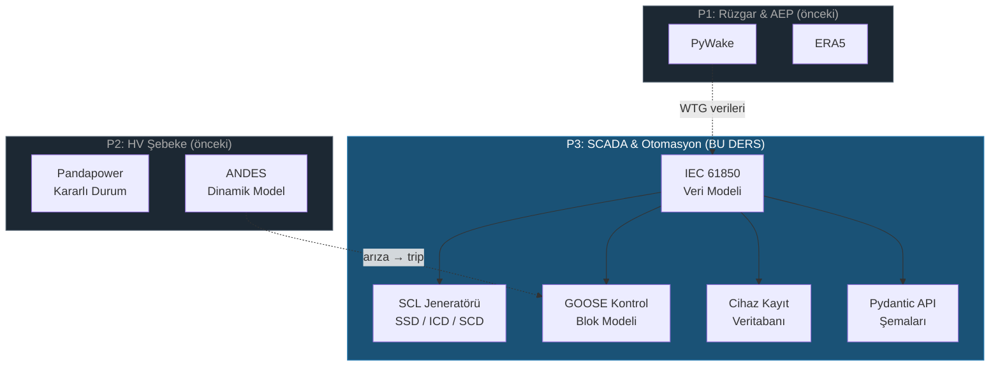

# Ders 009 — IEC 61850 Veri Modeli, SCL Oluşturucu & SCADA Cihaz Kayıt Sistemi

!!! abstract "Ders Navigasyonu"
    :material-arrow-left: **Önceki:** [Ders 008 — Dinamik Şebeke Uyumluluğu: ANDES, FRT, Frekans, SSO & Konvertör](lesson-008.md) | **Sonraki:** [Ders 010 — GOOSE Arıza Simülasyonu, Koruma Zaman Çizelgesi & SCADA API](lesson-010.md) :material-arrow-right:

    **Faz:** P3 | **Dil:** Türkçe | **İlerleme:** 10 / 19 | [Tüm Dersler](index.md) | [Öğrenme Yol Haritası](../../Learning_Roadmap.md)

> **Date:** 2026-02-25
> **Commits:** 1 commit (`c1ae105` → `c1ae105`)
> **Commit range:** `c1ae105c5e572472ead18e88299129841e6ee689..c1ae105c5e572472ead18e88299129841e6ee689`
> **Phase:** P3 (SCADA & Automation)
> **Roadmap sections:** [Phase 3 — Section 3.1 IEC 61850 — The Standard]
> **Language:** Turkish
> **Previous lesson:** Lesson 008
> **last_commit_hash:** c1ae105c5e572472ead18e88299129841e6ee689

---

## Ne Öğreneceksiniz

- IEC 61850 veri hiyerarşisinin beş katmanını (Physical Device → Logical Device → Logical Node → Data Object → Data Attribute) ve her katmanın gerçek bir trafo merkezindeki karşılığını anlama
- IEC 61400-25 rüzgar türbini uzantısını (WTUR, WROT, WGEN, WMET, WNAC) ve neden standart IEC 61850 düğüm sınıflarının rüzgar santrallerine yetmediğini kavrama
- SCL (Substation Configuration Language) dosya türlerini (SSD, ICD, SCD) ve IEC 61850-6 mühendislik iş akışını uygulama
- GOOSE (Generic Object-Oriented Substation Event) kontrol bloğu tasarlama — Layer 2 Ethernet üzerinden < 4 ms gecikmeyle koruma trip sinyali gönderme
- SQLAlchemy ORM modelleri ve Alembic migration ile cihaz kayıt sistemini veritabanında kalıcı hale getirme

---

## Bölüm 1: IEC 61850 Veri Hiyerarşisi — Trafo Merkezinin Dijital İkizi

### Gerçek Hayat Problemi

Bir hastane düşünün. Hastanede binalar var, her binanın katları var, her katta bölümler var (kardiyoloji, nöroloji), her bölümde doktorlar var ve her doktorun uzmanlık alanları var. Eğer "kardiyoloji bölümündeki Dr. Yılmaz'ın EKG sonuçlarını göster" diyebiliyorsanız — tıbbi bilgiye **yapılandırılmış bir hiyerarşi** üzerinden erişiyorsunuz.

Bir trafo merkezi de aynı mantıkla çalışır. İçinde onlarca akıllı elektronik cihaz (IED — Intelligent Electronic Device) bulunur. Her IED'nin mantıksal fonksiyonları (koruma, ölçüm, kontrol) ve her fonksiyonun veri noktaları (gerilim, akım, kesici durumu) vardır. IEC 61850, bu fiziksel yapıyı **dijital bir veri modeline** dönüştürür — böylece farklı üreticilerin cihazları aynı dili konuşur.

### Standartlar Ne Diyor

**IEC 61850** bir protokol değil, bir **veri modelidir**. Aynı veri modeli üç farklı taşıma mekanizmasına eşlenebilir:

- **MMS (Manufacturing Message Specification):** TCP/IP üzerinde istemci-sunucu iletişimi (SCADA polling)
- **GOOSE:** Layer 2 Ethernet — IP yönlendirmesiz, < 4 ms gecikme (koruma trip sinyalleri)
- **Sampled Values (SV):** Layer 2 Ethernet — dijitalleştirilmiş akım/gerilim trafo dalga formları

IEC 61850-7-4 mantıksal düğüm sınıflarını tanımlar. IEC 61850-7-3 ortak veri sınıflarını (Common Data Classes — CDC) tanımlar. IEC 61850-7-2 soyut iletişim servis arayüzünü (ACSI) tanımlar. IEC 61850-6 ise tüm bu yapının XML tabanlı konfigürasyon dosyalarını (SCL) tanımlar.

### Ne İnşa Ettik

**Değişen dosyalar:**

- `backend/app/services/p3/iec61850_model.py` — Tam IEC 61850 veri hiyerarşisi: 7 enum, 7 dataclass, 13 builder fonksiyonu
- `backend/app/models/scada.py` — SQLAlchemy ORM modelleri (4 tablo)
- `backend/app/schemas/scada.py` — Pydantic API şemaları (14 model)
- `backend/alembic/versions/c4d5e6f7a8b9_...py` — Alembic veritabanı migration

Beş katmanlı hiyerarşiyi Python `dataclass(frozen=True)` olarak modelledik:

```
PhysicalDevice (IED)           → ABB REL670 koruma rölesi
└── LogicalDevice              → LD_Protection
    └── LogicalNode            → XCBR1 (kesici)
        └── DataObject         → Pos (konum — DPC tipi)
            └── DataAttribute  → stVal (durum değeri — BOOLEAN)
```

### Neden Önemli

> **Neden** beş katmanlı bir hiyerarşiye ihtiyacımız var?
> Çünkü bir trafo merkezinde yüzlerce veri noktası bulunur. Düz bir liste olsa "kesici açık mı?" sorusuna cevap bulmak imkansız olur. Hiyerarşi, fiziksel yapıyı dijitale yansıtarak **adreslenebilir** kılar: `OSS_PROT_IED01/LD_Protection/XCBR1$Pos$stVal` — bu tek bir değeri evrendeki tüm diğer değerlerden benzersiz şekilde tanımlar.

> **Neden** `dataclass(frozen=True)` kullandık?
> IEC 61850 veri modeli bir konfigürasyondur — çalışma zamanında değişmemesi gerekir. Bir koruma rölesinin mantıksal düğüm yapısı, sistem mühendisi tarafından tasarım aşamasında belirlenir. `frozen=True`, bu değişmezliği (immutability) Python düzeyinde zorlar — yanlışlıkla bir XCBR düğümünü silmek ya da değiştirmek derleyici hatası verir.

### Kod İncelemesi

Hiyerarşinin en alt katmanından başlayarak yapıyı inceleyelim. Önce `DataAttribute` — bu, gerçek ölçüm değerini taşıyan yaprak düğümdür:

```python
@dataclass(frozen=True)
class DataAttribute:
    """Leaf of the IEC 61850 hierarchy — a single typed value."""
    name: str                    # IEC 61850-7-3 adı: 'stVal', 'mag.f', 'q'
    data_type: DataAttributeType # Temel veri tipi: BOOLEAN, FLOAT32, etc.
    fc: FunctionalConstraint     # Fonksiyonel kısıt: ST, MX, CO, CF, SP, DC
    description: str             # Mühendislik açıklaması
    unit: str = ""               # Mühendislik birimi: 'kV', 'MW', 'Hz'
```

`FunctionalConstraint` (Fonksiyonel Kısıt) kavramı IEC 61850'ye özgüdür. Her veri özniteliği, amacına göre gruplandırılır — böylece bir SCADA istemcisi sadece ölçüm verisi (MX) okuyabilir, kontrol komutu (CO) göndermesine izin verilmez:

```python
class FunctionalConstraint(StrEnum):
    ST = "ST"  # Status — anlık durum (istemciden salt okunur)
    MX = "MX"  # Measured value — analog ölçümler
    CO = "CO"  # Control — çalıştırma komutları (istemciden yazılır)
    CF = "CF"  # Configuration — ayarlar (mühendis tarafından yazılır)
    SP = "SP"  # Setpoint — operatör tarafından ayarlanabilir değerler
    DC = "DC"  # Description — statik açıklama bilgisi
```

Ardından `DataObject`, `LogicalNode`, `LogicalDevice` ve en tepede `PhysicalDevice` katmanları, her biri bir üst katmandaki yapıyı sarmalar. Tüm katmanlar `frozen=True` olduğundan, bir kez oluşturulan hiyerarşi asla değiştirilemez.

### Temel Kavram

!!! tip "Temel Kavram: Fonksiyonel Kısıt (Functional Constraint)"
    **Basitçe:** Bir banka uygulamasını düşünün — bakiye görüntüleme ile para transferi farklı izin seviyeleri gerektirir. IEC 61850'de her veri noktası da böyle bir "izin etiketi" taşır: ST = sadece oku, CO = kontrol et, CF = ayarla.

    **Analoji:** Bir otelin oda kartı sistemi gibi. Misafir kartı sadece kendi odasını açar (ST — durumu oku). Resepsiyon kartı tüm odaları açar (CO — kontrol et). Bakım kartı ise tüm teknik alanları açar (CF — konfigüre et). Aynı kapı, farklı kartlara farklı tepki verir.

    **Bu projede:** OSS_PROT_IED01'in XCBR1 düğümündeki `Pos.stVal` ST kısıtlıdır (kesici pozisyonunu oku), `Pos.ctlVal` ise CO kısıtlıdır (kesiciyi aç/kapa). SCADA HMI operatörü ST verilerini görebilir, ancak CO komutu göndermek için ek yetkilendirme gerekir.

---

## Bölüm 2: IEC 61400-25 — Rüzgar Türbini Mantıksal Düğümleri

### Gerçek Hayat Problemi

Standart IEC 61850, geleneksel trafo merkezleri için tasarlanmıştır — kesiciler, ölçüm üniteleri, koruma röleleri. Ama bir rüzgar türbini ne kesicidir ne de ölçüm ünitesi. Türbin kendi içinde rotor hızı, kanat pitch açısı, nasel sıcaklığı, rüzgar hızı gibi benzersiz veri noktaları üretir. Bu verileri standart XCBR veya MMXU düğümleriyle modellemek, bir doktorun "genel tıp" koduyla kalp ameliyatı kaydetmesine benzer — teknik olarak mümkün ama bilgi kaybına yol açar.

### Standartlar Ne Diyor

**IEC 61400-25-2**, IEC 61850'yi rüzgar türbinleri için genişletir. Beş özel mantıksal düğüm sınıfı tanımlar:

| LN Sınıfı | Tam Adı | Kapsam |
|-----------|---------|--------|
| **WTUR** | Wind Turbine General | Türbin çalışma durumu (stopped/running/error), toplam enerji |
| **WROT** | Wind Turbine Rotor | Rotor hızı [rpm], kanat pitch açısı [°] |
| **WGEN** | Wind Turbine Generator | Aktif güç [MW], reaktif güç [MVAR] |
| **WMET** | Wind Turbine Meteorological | Rüzgar hızı [m/s], yön [°], sıcaklık [°C] |
| **WNAC** | Wind Turbine Nacelle | Nasel sıcaklığı [°C], yaw açısı [°] |

### Ne İnşa Ettik

**Değişen dosyalar:**

- `backend/app/services/p3/iec61850_model.py` — `_build_wtur_ln()`, `_build_wrot_ln()`, `_build_wgen_ln()`, `_build_wmet_ln()`, `_build_wnac_ln()` builder fonksiyonları

Her V236-15.0 MW türbin kontrolcüsü, tek bir `LD_Turbine` mantıksal cihazı içinde bu beş düğümü barındırır. 34 türbin × 5 düğüm = 170 rüzgar türbini mantıksal düğümü.

### Neden Önemli

> **Neden** standart IEC 61850 düğümleri yeterli değil?
> Çünkü MMXU (genel ölçüm ünitesi) "rotor hızı" veya "pitch açısı" kavramını bilmez. Bu veri noktalarını GGIO (Generic I/O) ile modellemek mümkündür, ama standardizasyonu kaybedersiniz — her üretici farklı isimler verir, SCADA entegrasyonu kabus olur. IEC 61400-25, tüm rüzgar türbini üreticilerinin aynı veri yapısını kullanmasını zorunlu kılar.

> **Neden** `frozen=True` tuple'lar kullandık, liste değil?
> Bir türbinin mantıksal düğüm yapısı tasarım zamanında belirlenir ve çalışma zamanında değişmez. Liste kullanmak `append()`, `remove()`, `sort()` gibi mutasyonlara kapı açar. Tuple bu kapıyı kapatır — veri modeli, bir kez oluşturulduğunda kilitlenir.

### Kod İncelemesi

WTUR (Wind Turbine General) builder fonksiyonunu inceleyelim — bu düğüm türbinin çalışma durumunu ve toplam enerji üretimini raporlar:

```python
def _build_wtur_ln(instance: int = 1) -> LogicalNode:
    """Build WTUR (Wind Turbine General) logical node per IEC 61400-25-2."""
    return LogicalNode(
        class_name="WTUR",
        instance=instance,
        category=LogicalNodeCategory.WIND,  # 'W' kategorisi — rüzgara özel
        description="Wind turbine general operating state",
        data_objects=(
            DataObject(
                name="TurSt",           # Turbine State
                cdc="INS",              # Integer Status — enum değer
                description="Turbine operating state (stopped/running/error)",
                attributes=(
                    DataAttribute(
                        "stVal",                          # Durum değeri
                        DataAttributeType.CODED_ENUM,     # Kodlanmış enum
                        FunctionalConstraint.ST,          # Status — salt okunur
                        "Operating state",
                    ),
                    # ... q (kalite bayrağı) ve t (zaman damgası)
                ),
            ),
            DataObject(
                name="TotWh",           # Total Watt-hours
                cdc="BCR",              # Binary Counter Reading
                description="Total energy production [MWh]",
                attributes=(
                    DataAttribute(
                        "actVal",                    # Actual value
                        DataAttributeType.FLOAT32,
                        FunctionalConstraint.ST,
                        "Counter value",
                        "MWh",
                    ),
                ),
            ),
        ),
    )
```

Her türbin kontrolcüsü şu şekilde oluşturulur — dikkat edin, IP adresleri otomatik olarak 192.168.2.x subnet'ine atanır (OSS cihazları 192.168.1.x'tedir):

```python
def build_wind_turbine_controller(turbine_number: int, ip_address: str = "") -> PhysicalDevice:
    if not 1 <= turbine_number <= NUM_TURBINES:  # 1-34 arası
        msg = f"Turbine number must be 1-{NUM_TURBINES}, got {turbine_number}"
        raise ValueError(msg)

    if not ip_address:
        ip_address = f"192.168.2.{turbine_number}"  # Otomatik IP: 192.168.2.1 - 192.168.2.34

    return PhysicalDevice(
        name=f"WTG_{turbine_number:02d}",  # WTG_01, WTG_02, ..., WTG_34
        equipment_type=EquipmentType.WTG_CONTROLLER,
        manufacturer="Vestas",
        model="V236-15.0",
        ip_address=ip_address,
        logical_devices=(
            LogicalDevice(
                inst="LD_Turbine",
                logical_nodes=(
                    _build_wtur_ln(1), _build_wrot_ln(1), _build_wgen_ln(1),
                    _build_wmet_ln(1), _build_wnac_ln(1),  # 5 LN per türbin
                ),
            ),
        ),
    )
```

Sondaki `build_substation_configuration()` fonksiyonu tüm 37 cihazı (3 OSS + 34 WTG) tek bir çağrıyla oluşturur.

### Temel Kavram

!!! tip "Temel Kavram: IP Subnet Segmentasyonu"
    **Basitçe:** Bir apartmandaki posta kutuları gibi düşünün. Her kat farklı bir numara aralığına sahip: 1. kat 101-110, 2. kat 201-210. Postacı kata göre hangi koridora gideceğini bilir.

    **Analoji:** OSS cihazları (koruma, ölçüm, bay kontrolcü) 192.168.1.x subnet'inde yaşar — bunlar trafo merkezinin "yönetim katı". 34 türbin kontrolcüsü ise 192.168.2.x subnet'indedir — bunlar "üretim katı". Ağ segmentasyonu hem güvenlik (IEC 62443 zone modeli) hem de trafik yönetimi sağlar.

    **Bu projede:** `192.168.1.10` (OSS Protection), `192.168.1.11` (OSS Measurement), `192.168.1.12` (Bay Controller) ve `192.168.2.1` — `192.168.2.34` (34 türbin). Toplam 37 IP adresi, iki subnet'te düzenli.

---

## Bölüm 3: GOOSE — Koruma Sinyalleri için Gerçek Zamanlı Mesajlaşma

### Gerçek Hayat Problemi

Bir yangın alarm sistemi düşünün. Duman dedektörü ateş tespit ettiğinde, alarm merkezine telefon edip "3. katta yangın var, lütfen sprinkleri açar mısınız?" demez — o çok yavaş olur. Bunun yerine, alarm merkezine **doğrudan kablolama** ile anında sinyal gönderir ve sprinkler milisaniyeler içinde açılır.

GOOSE tam olarak bu iş için tasarlanmıştır. Bir koruma rölesi arıza tespit ettiğinde (mesela kısa devre), SCADA sunucusuna TCP/IP üzerinden mesaj gönderip "kesiciyi aç" demek 100+ ms sürer. GOOSE ise Layer 2 Ethernet üzerinden **doğrudan** yayın yapar — < 4 ms içinde tüm ilgili cihazlar trip sinyalini alır.

### Standartlar Ne Diyor

**IEC 61850-8-1**, GOOSE mesajlaşmasının Ethernet'e nasıl eşleneceğini tanımlar:

- **Layer 2 multicast:** IP yönlendirmesi yok — Ethernet frame'i doğrudan hedef MAC adresine gider
- **Multicast MAC aralığı:** `01:0C:CD:01:00:00` — `01:0C:CD:01:01:FF` (IEC 61850-8-1 Annex A)
- **VLAN:** GOOSE trafiğini normal SCADA trafiğinden ayırır (tipik: VLAN 100-199)
- **AppID:** Her GOOSE yayını benzersiz bir Application ID taşır (2 byte hex)
- **Yeniden iletim:** İlk mesajdan sonra min_time (2 ms) → max_time (1000 ms) arasında katlanarak artan aralıklarla tekrarlanır

### Ne İnşa Ettik

**Değişen dosyalar:**

- `backend/app/services/p3/iec61850_model.py` — `GOOSEControlBlock`, `Dataset`, `DatasetMember` dataclass'ları + builder fonksiyonları

İki temel bileşen inşa ettik: (1) neyin yayınlanacağını tanımlayan **Dataset**, ve (2) nasıl yayınlanacağını tanımlayan **GOOSEControlBlock**.

### Neden Önemli

> **Neden** GOOSE, SCADA polling'den 200 kat daha hızlı?
> SCADA polling TCP/IP stack'ini kullanır: uygulama → TCP → IP → Ethernet. Her katman gecikme ekler, özellikle TCP'nin üç yollu el sıkışması ve onay mekanizması. GOOSE ise IP ve TCP katmanlarını tamamen atlar — doğrudan Ethernet frame'i gönderir. Bir mektup yerine bağırarak haber vermek gibi.

> **Neden** katlanarak artan yeniden iletim aralığı?
> İlk trip sinyali kritiktir — 2 ms sonra tekrar gönderilir, 4 ms sonra tekrar, 8 ms, 16 ms... 1000 ms'ye ulaşınca sabitlenir. Bu, ilk anın güvenilirliğini (hızlı tekrar) ve uzun vadede ağ bant genişliğini (yavaşlayan tekrar) dengeler. Veri değişmezse bile periyodik tekrar, alıcının "yayıncı hâlâ hayatta" olduğunu bilmesini sağlar (heartbeat).

### Kod İncelemesi

Trip Dataset'i, koruma IED'nin hangi veri noktalarını GOOSE ile yayınlayacağını tanımlar:

```python
def build_oss_goose_trip_dataset(ied_name: str = "OSS_PROT_IED01") -> Dataset:
    """Koruma trip sinyallerini içeren dataset."""
    return Dataset(
        name="TripDataset",
        description=f"Protection trip signals from {ied_name}",
        members=(
            # Kesici pozisyonu: açık mı, kapalı mı?
            DatasetMember("LD_Protection", "XCBR1", "Pos", FunctionalConstraint.ST),
            # Aşırı akım koruması tetiklendi mi?
            DatasetMember("LD_Protection", "PTOC1", "Op", FunctionalConstraint.ST),
            # Mesafe koruması tetiklendi mi?
            DatasetMember("LD_Protection", "PDIS1", "Op", FunctionalConstraint.ST),
            # Aşırı gerilim koruması tetiklendi mi?
            DatasetMember("LD_Protection", "PTOV1", "Op", FunctionalConstraint.ST),
        ),
    )
```

GOOSE Control Block ise bu dataset'in Layer 2 Ethernet üzerinde nasıl yayınlanacağını tanımlar:

```python
def build_oss_goose_control_block(
    ied_name: str = "OSS_PROT_IED01",
    dataset_name: str = "TripDataset",
) -> GOOSEControlBlock:
    return GOOSEControlBlock(
        name="gcb_trip",
        app_id="0x0001",                         # Benzersiz uygulama kimliği
        go_id=f"{ied_name}_220kV_BB_TRIP",       # İnsan tarafından okunabilir tanımlayıcı
        dataset_name=dataset_name,
        mac_address="01:0C:CD:01:00:01",         # IEC 61850-8-1 Annex A multicast MAC
        vlan_id=100,                              # GOOSE trafiği için ayrılmış VLAN
        min_time_ms=2,                            # İlk yeniden iletim: 2 ms
        max_time_ms=1000,                         # Maksimum yeniden iletim: 1 saniye
        description="220 kV busbar protection trip GOOSE publisher",
    )
```

Dikkat edin: MAC adresi `01:0C:CD:01:00:01` — ilk byte'ın son biti 1 (`01`), bu multicast adresi olduğunu belirtir. Unicast MAC adresleri çift sayıyla biter (00, 02, 04...).

### Temel Kavram

!!! tip "Temel Kavram: Layer 2 vs Layer 3 İletişim"
    **Basitçe:** Aynı ofiste çalışan meslektaşınıza bir şey söylemek istediğinizde, e-posta yazmaz, doğrudan seslenirsiniz. E-posta (Layer 3/TCP/IP) güvenilirdir ama yavaştır — adres çözümleme, yönlendirme, onay gerekir. Seslenmek (Layer 2/GOOSE) anlıktır ama sadece aynı odadaki (aynı Ethernet segmentindeki) kişiler duyar.

    **Analoji:** TCP/IP = kargo şirketi (takip numarası, teslimat onayı, yeniden gönderim). GOOSE = megafon ile bağırmak (herkes anında duyar, ama sadece yakındakiler). Koruma trip sinyali için megafon yeterlidir — aynı trafo merkezindeki tüm cihazlar aynı Ethernet segmentindedir.

    **Bu projede:** OSS_PROT_IED01 bir arıza tespit ettiğinde, TripDataset'i GOOSE ile multicast eder. Bay kontrolcüsü (OSS_BAY_CTRL01) ve SCADA gateway bu GOOSE frame'ini dinler ve < 4 ms içinde tepki verir. TCP/IP polling ile bu süre 100+ ms olurdu — koruma mühendisleri için kabul edilemez.

---

## Bölüm 4: SCL — Trafo Merkezinin XML Tarifnamesi

### Gerçek Hayat Problemi

Bir ev inşa ediyorsunuz. Mimar çizimi yapıyor (ev planı), her oda üreticisi kendi dolaplarının ölçülerini veriyor (mutfak kataloğu), ve müteahhit tüm bunları tek bir "inşaat projesi" dosyasında birleştiriyor. Bu üç belge türü olmadan, döşemeci yanlış ölçüde fayans keser, tesisatçı lavabo yerine mutfağa boru çeker.

IEC 61850-6 SCL (Substation Configuration Language) tam olarak bu "belge sistemidir":

- **SSD** = Evin planı (trafo merkezi topolojisi)
- **ICD** = Üreticinin kataloğu (tek bir IED'nin yetenekleri)
- **SCD** = Müteahhidin inşaat projesi (her şey birleşik)

### Standartlar Ne Diyor

**IEC 61850-6**, SCL dosyalarının yapısını XML şeması olarak tanımlar. Anahtar bölümler:

| XML Bölümü | İçerik | Hangi SCL Dosyasında |
|------------|--------|---------------------|
| `<Header>` | Dosya kimliği, versiyon, araç bilgisi | Tümü |
| `<Substation>` | Fiziksel topoloji: gerilim seviyeleri, bay'ler | SSD, SCD |
| `<IED>` | IED konfigürasyonu: LD, LN, dataset, GOOSE | ICD, SCD |
| `<Communication>` | Ağ adresleme: IP, GOOSE multicast, VLAN | SCD |
| `<DataTypeTemplates>` | LN tip tanımları: LNodeType, DOType, DAType | ICD, SCD |

Mühendislik iş akışı: **SSD** → her üretici **ICD** verir → sistem entegratörü tümünü **SCD**'de birleştirir.

### Ne İnşa Ettik

**Değişen dosyalar:**

- `backend/app/services/p3/scl_generator.py` — `generate_ssd()`, `generate_icd()`, `generate_scd()` fonksiyonları + yardımcılar

Üç SCL dosya tipini üreten bir jeneratör modülü. `xml.etree.ElementTree` kullanarak SCL namespace'li (`http://www.iec.ch/61850/2003/SCL`) XML oluşturur.

### Neden Önemli

> **Neden** SCL dosyaları kritik?
> Üretici bağımsız (vendor-neutral) yapılandırma sağlar. ABB, Siemens, SEL veya Hitachi Energy — farklı üreticilerin IED'leri aynı SCL şeması üzerinden yapılandırılır. Bir sistem entegratörü, IED'nin üreticisini bilmek zorunda kalmadan SCD dosyasından tüm sistemi konfigüre edebilir.

> **Neden** basitleştirilmiş SCL üretiyoruz?
> Bir üretim SCL aracı (ABB PCM600, Siemens DIGSI 5) 200+ XML elementi ve XSD doğrulaması içerir. Bizim eğitim amaçlı SCL'miz yapısal kavramları öğretir — mülakatçıların test ettiği kısımlar bunlardır: Header, Substation topolojisi, IED yapısı, Communication bölümü, DataTypeTemplates.

### Kod İncelemesi

SCL namespace yönetimini inceleyelim — bu, XML üretiminin en kritik detayıdır:

```python
SCL_NAMESPACE = "http://www.iec.ch/61850/2003/SCL"
SCL_VERSION = "2007"
SCL_REVISION = "B"

# ns0: öneklerini önlemek için namespace'i kaydet
ET.register_namespace("", SCL_NAMESPACE)

def _ns(tag: str) -> str:
    """Wrap a tag with the SCL namespace."""
    return f"{{{SCL_NAMESPACE}}}{tag}"  # → {http://www.iec.ch/61850/2003/SCL}SCL
```

SSD (System Specification Description) jeneratörü, trafo merkezinin fiziksel topolojisini oluşturur — 66 kV array tarafında 7 bay (her biri bir kablo dizisine), 220 kV export tarafında 3 bay (export, trafo, STATCOM):

```python
def generate_ssd(
    substation_name: str = "Baltic_Wind_Alpha_OSS",
    voltage_levels_kv: tuple[float, ...] = (66.0, 220.0),
    num_bays_per_level: dict[float, int] | None = None,
) -> ET.Element:
    if num_bays_per_level is None:
        num_bays_per_level = {66.0: 7, 220.0: 3}  # 7 array string + 3 export bay

    root = _create_scl_root()
    _add_header(root, f"{substation_name}_SSD")

    substation = ET.SubElement(root, _ns("Substation"))
    substation.set("name", substation_name)
    substation.set("desc", "510 MW Baltic Sea Offshore Wind Farm — Offshore Substation")
    # ... gerilim seviyeleri ve bay'ler eklenir
```

SCD (Substation Configuration Description) ise tüm parçaları birleştirir — SSD topolojisi + tüm IED'ler + GOOSE iletişim adresleri:

```python
def generate_scd(substation_name, devices, goose_control_blocks=None, datasets=None):
    root = _create_scl_root()
    _add_header(root, f"{substation_name}_SCD")

    # 1. Substation topolojisi (SSD bölümü)
    substation = ET.SubElement(root, _ns("Substation"))
    # ... 66 kV ve 220 kV gerilim seviyeleri

    # 2. Communication bölümü — GOOSE multicast adresleme
    comm = ET.SubElement(root, _ns("Communication"))
    for device in devices:
        # Her cihaz için SubNetwork, ConnectedAP, IP ve GOOSE adresleri
        ...

    # 3. IED bölümleri — her cihazın tam konfigürasyonu
    for device in devices:
        ied = ET.SubElement(root, _ns("IED"))
        # ... LD, LN, Dataset, GSEControl
```

`validate_scl_structure()` fonksiyonu temel yapısal kontroller yapar: doğru root tag, Header varlığı, en az bir Substation veya IED, doğru versiyon/revizyon. Bu tam XSD doğrulaması değil, ama temel sağlık kontrolüdür.

### Temel Kavram

!!! tip "Temel Kavram: XML Namespace"
    **Basitçe:** İki farklı ülkenin vatandaşlık numarası aynı olabilir — "TC 12345" Türkiye'de bir kişi, "PL 12345" Polonya'da başka biri. Namespace, hangi ülkenin (hangi standardın) kurallarıyla çalıştığınızı belirler.

    **Analoji:** `<Substation>` etiketi birçok farklı XML standardında bulunabilir. `{http://www.iec.ch/61850/2003/SCL}Substation` ise kesinlikle IEC 61850 SCL standardındaki Substation'dır. Namespace, etiketin "pasaportudur".

    **Bu projede:** `ET.register_namespace("", SCL_NAMESPACE)` çağrısı, Python'un ürettiği XML'de `ns0:Substation` yerine sadece `Substation` yazmasını sağlar — çünkü varsayılan namespace IEC 61850 SCL'dir. Bu, üretilen dosyanın ABB PCM600 gibi endüstriyel araçlarla uyumlu kalmasını sağlar.

---

## Bölüm 5: Veritabanı Kalıcılığı — ORM & Migration

### Gerçek Hayat Problemi

Şimdiye kadar oluşturduğumuz IEC 61850 veri modeli bellekte yaşıyor — Python süreci kapandığında her şey kaybolur. Bir SCADA sistemi 7/24 çalışır, cihaz envanterinin kalıcı olması gerekir. Hangi IED'ler var? Hangi mantıksal düğümlere sahipler? Hangi GOOSE kontrol blokları yapılandırılmış? Bu bilgiler bir veritabanında saklanmalı.

### Standartlar Ne Diyor

IEC 61850 kendi başına veritabanı yapısı tanımlamaz — standart, iletişim ve veri modeliyle ilgilidir. Ancak endüstriyel pratikte, her SCADA sistemi bir **cihaz kayıt veritabanı** tutar. Bu veritabanı, SCL dosyalarından bağımsız olarak anlık cihaz envanterini ve konfigürasyonunu saklar.

### Ne İnşa Ettik

**Değişen dosyalar:**

- `backend/app/models/scada.py` — 4 SQLAlchemy ORM modeli: `IEC61850Device`, `IEC61850LogicalNode`, `GOOSEControlBlockRecord`, `SCLFile`
- `backend/app/schemas/scada.py` — 14 Pydantic şeması: API istek/yanıt serileştirmesi
- `backend/alembic/versions/c4d5e6f7a8b9_...py` — Alembic migration: 4 tablo oluşturma

### Neden Önemli

> **Neden** Data Object ve Data Attribute'ları veritabanına kaydetmedik?
> Çünkü bu bir bilinçli tasarım kararıdır. 37 cihaz × ortalama 5 LN × ortalama 4 DO × ortalama 3 DA = ~2.200 Data Attribute satırı. Bu sayı yönetilebilir gibi görünse de, gerçek sistemlerde 500+ IED ile 100.000+ satır olur. DO/DA yapısı standart tarafından tanımlanmıştır — değişmez. Bu yüzden **kod modeli** (Python dataclass) DO/DA yapısını tanımlar, **veritabanı** ise sadece cihaz envanterini (hangi IED, hangi LN) saklar. SCL dosyası isteğe bağlı olarak oluşturulur.

> **Neden** `cascade="all, delete-orphan"` kullandık?
> Bir IED silindiğinde, ona ait tüm mantıksal düğümler ve GOOSE kontrol blokları da silinmelidir — yoksa "öksüz" (orphan) kayıtlar kalır. `delete-orphan` tam olarak bunu yapar: ana kaydı sil → alt kayıtlar otomatik temizlenir.

### Kod İncelemesi

`IEC61850Device` ORM modelini inceleyelim — bu, IED envanterinin temel tablosudur:

```python
class IEC61850Device(Base):
    """IEC 61850 Physical Device (IED) registry entry."""
    __tablename__ = "iec61850_device"

    id: Mapped[uuid.UUID] = mapped_column(primary_key=True, default=uuid.uuid4)
    name: Mapped[str] = mapped_column(
        String(50), unique=True,  # Her IED adı benzersiz olmalı
        comment="IED instance name, e.g. 'OSS_PROT_IED01', 'WTG_01'",
    )
    equipment_type: Mapped[str] = mapped_column(String(30))  # protection_ied, wtg_controller, etc.
    manufacturer: Mapped[str] = mapped_column(String(50))     # ABB, Vestas
    model: Mapped[str] = mapped_column(String(50))            # REL670, V236-15.0
    ip_address: Mapped[str] = mapped_column(String(15))       # MMS station bus IP

    # İlişkiler — cascade ile otomatik silme
    logical_nodes: Mapped[list[IEC61850LogicalNode]] = relationship(
        back_populates="device", cascade="all, delete-orphan",
    )
    goose_control_blocks: Mapped[list[GOOSEControlBlockRecord]] = relationship(
        back_populates="device", cascade="all, delete-orphan",
    )
```

Pydantic şemalarında dikkat çeken yapı: veri hiyerarşisinin API'ye yansıması:

```python
class PhysicalDeviceSchema(BaseModel):
    """API representation of an IEC 61850 Physical Device (IED)."""
    name: str
    equipment_type: str
    manufacturer: str
    model: str
    logical_devices: list[LogicalDeviceSchema]  # İç içe geçmiş hiyerarşi
    ip_address: str = ""
    description: str = ""
```

`SubstationSummaryResponse` şeması, tüm trafo merkezini tek bir API yanıtında özetler — toplam cihaz sayısı, LN sayısı, GOOSE blok sayısı ve tüm cihazların detayları:

```python
class SubstationSummaryResponse(BaseModel):
    total_devices: int       # 37
    total_logical_nodes: int # 178 (6 + 1 + 2 + 34×5)
    protection_ieds: int     # 1
    measurement_ieds: int    # 1
    bay_controllers: int     # 1
    wtg_controllers: int     # 34
    goose_control_blocks: int
    devices: list[PhysicalDeviceSchema]
```

Alembic migration dosyası, bu şemayı PostgreSQL tablolarına dönüştürür. `ForeignKey("iec61850_device.id", ondelete="CASCADE")` ile veritabanı seviyesinde de kaskad silme tanımlanmıştır — ORM cascade'i + DB cascade'i birlikte çalışarak çift güvenlik sağlar.

### Temel Kavram

!!! tip "Temel Kavram: Kod Modeli vs Veritabanı Modeli Ayrımı"
    **Basitçe:** Bir kütüphanedeki kitap raflarını düşünün. Kütüphane kataloğu (veritabanı) hangi kitapların hangi raflarda olduğunu tutar. Ama kitapların içeriğini (Data Object/Attribute yapısı) katalogda saklamaz — içerik zaten kitabın kendisindedir (kod modeli). Katalog değişir (yeni kitap geldi, eski kitap çekildi), ama kitabın içeriği değişmez.

    **Analoji:** Araç ruhsatı (veritabanı) aracın plakasını, marka/modelini, sahibini kaydeder. Ama aracın motor şemasını (veri modeli) ruhsatta saklamak anlamsızdır — motor şeması üreticinin teknik dokümanındadır (kod modeli) ve her araç için aynıdır.

    **Bu projede:** `iec61850_device` tablosu → "hangi IED'ler var?" `iec61850_logical_node` tablosu → "hangi LN'ler atanmış?" Ama `XCBR1` düğümünün `Pos`, `BlkOpn`, `CBOpCap` veri nesnelerine sahip olduğu bilgisi veritabanında değil, `_build_xcbr_ln()` fonksiyonundadır. Çünkü bu bilgi IEC 61850-7-4 standardı tarafından sabitlenmiştir.

---

## Bağlantılar

**Bu kavramların ilerleyen derslerde kullanılacağı yerler:**

- **IEC 61850 veri hiyerarşisi (Bölüm 1)** → P3 GOOSE simülasyonu bu hiyerarşiyi kullanarak gerçek zamanlı olay yayını yapacak
- **IEC 61400-25 düğümleri (Bölüm 2)** → P4 yapay zeka tahmin modülleri WTUR.TurSt, WGEN.TotW ve WMET.HorWdSpd verilerini girdi olarak kullanacak
- **GOOSE Control Block (Bölüm 3)** → P3 koruma simülasyonunda GOOSE mesajlaşma sırası ve zamanlama doğrulaması yapılacak
- **SCL jeneratörü (Bölüm 4)** → P5 devreye alma süreci, SCD dosyasını kullanarak cihaz yapılandırmasını doğrulayacak
- **ORM modelleri (Bölüm 5)** → P3 API endpoint'leri bu modelleri kullanarak CRUD operasyonları sunacak
- **Ders 008'den köprü:** P2'de modellediğimiz ANDES dinamik ağ modeli, koruma rölesinin "ne zaman trip etmesi gerektiğini" belirler. Bu derste ise "trip sinyalinin nasıl iletildiğini" (GOOSE) modelliyoruz.

---

## Büyük Resim

*Bu dersin odağı: **P3 SCADA veri altyapısının temellerini atmak — IEC 61850 cihaz hiyerarşisi, GOOSE mesajlaşma modeli, SCL konfigürasyon dosyaları ve veritabanı kalıcılığı**.*



*Tam sistem mimarisi için [Dersler Genel Bakış](index.md#system-architecture) sayfasına bakın.*

---

## Önemli Çıkarımlar

1. **IEC 61850 bir protokol değil, veri modelidir** — aynı hiyerarşi MMS (TCP/IP), GOOSE (Layer 2) ve Sampled Values (Layer 2) üzerinden taşınabilir
2. **Beş katmanlı hiyerarşi** (Physical Device → Logical Device → Logical Node → Data Object → Data Attribute) fiziksel trafo merkezi yapısını dijitale yansıtır — her veri noktası evrendeki tek adresine sahiptir
3. **IEC 61400-25**, standart IEC 61850'yi rüzgar türbinleri için genişletir — WTUR, WROT, WGEN, WMET, WNAC düğümleri tüm üreticiler için ortaktır
4. **Fonksiyonel Kısıtlar** (ST, MX, CO, CF, SP, DC) veri erişimini amaca göre sınıflandırır — bir operatör ölçüm verisini (MX) okuyabilir ama kontrol komutu (CO) için ek yetkilendirme gerekir
5. **GOOSE, Layer 2 Ethernet üzerinde < 4 ms** gecikmeyle koruma trip sinyali gönderir — TCP/IP polling'den 200 kat hızlıdır çünkü IP ve TCP katmanlarını atlar
6. **SCL dosyaları** (SSD → ICD → SCD) üretici bağımsız konfigürasyon sağlar — sistem entegratörü tüm IED'leri tek bir SCD dosyasından yönetir
7. **Kod modeli + veritabanı ayrımı**: değişmeyen yapı (DO/DA) kodda tanımlanır, değişen envanter (hangi IED, hangi LN) veritabanında saklanır — 10.000+ satırlık gereksiz veri patlamasını önler

---

## Önerilen Okumalar

*[Öğrenme Yol Haritası](../../Learning_Roadmap.md) — Faz 3: SCADA & Endüstriyel Otomasyon*

| Kaynak | Tür | Neden Okumalı |
|--------|-----|---------------|
| IEC 61850 serisi (Part 7-3, 7-4, 6) | Standart | Bu derste kullandığımız veri modeli ve SCL yapısının resmi kaynağı |
| Mackiewicz — *Overview of IEC 61850 and Benefits* | Konferans makalesi | IEC 61850'nin geleneksel SCADA'ya göre avantajlarını özetler — mülakat hazırlığı için ideal |
| Kim et al. (2017) — *Communication Architecture for CPS Wind Energy Systems* | Akademik makale | IEC 61850'nin rüzgar enerji sistemlerine uygulanmasını anlatan özel çalışma |
| libiec61850 Open Source Library | Yazılım | Gerçek bir IEC 61850 stack'i — GOOSE yayını ve MMS sunucusu örneklerini inceleyebilirsiniz |
| Hitachi Energy — *IEC 61850 Knowledge Base* | Teknik makaleler | ABB/Hitachi Energy'nin REL670, REC670 gibi rölelerle ilgili uygulama notları |

---

## Sınav — Anlayışını Test Et

### Hatırlama Soruları

**S1:** IEC 61850 veri hiyerarşisinin beş katmanını yukarıdan aşağıya sıralayın.

<details>
<summary>Cevap</summary>

Physical Device (IED) → Logical Device → Logical Node → Data Object → Data Attribute. Üstten alta: fiziksel cihaz en genel, veri özniteliği en spesifik birimdir. Örnek: `OSS_PROT_IED01/LD_Protection/XCBR1/Pos/stVal` — tek bir kesicinin anlık pozisyon değerini ifade eder.

</details>

**S2:** IEC 61400-25 tarafından tanımlanan beş rüzgar türbini mantıksal düğüm sınıfının adlarını ve görevlerini yazın.

<details>
<summary>Cevap</summary>

WTUR (türbin genel durumu — çalışma/durma/hata), WROT (rotor — hız ve pitch açısı), WGEN (jeneratör — aktif ve reaktif güç), WMET (meteoroloji — rüzgar hızı, yön, sıcaklık), WNAC (nasel — sıcaklık ve yaw açısı). Bu beş düğüm, bir rüzgar türbininin SCADA'ya sunduğu tüm temel veri noktalarını kapsar.

</details>

**S3:** GOOSE mesajlaşmasında `min_time_ms=2` ve `max_time_ms=1000` ne anlama gelir?

<details>
<summary>Cevap</summary>

İlk GOOSE mesajı gönderildikten sonra 2 ms içinde yeniden iletilir, ardından 4 ms, 8 ms, 16 ms... şeklinde katlanarak artar ve 1000 ms'de sabitlenir. Bu mekanizma, kritik ilk anın güvenilirliğini (hızlı tekrar) ve uzun vadede ağ bant genişliğini (yavaşlayan tekrar) dengeler. Veri değişmezken bile periyodik tekrar devam eder (heartbeat).

</details>

### Anlama Soruları

**S4:** Neden Data Object ve Data Attribute bilgilerini veritabanında saklamak yerine Python kod modelinde tutuyoruz?

<details>
<summary>Cevap</summary>

Çünkü DO/DA yapısı IEC 61850-7-3 ve 7-4 standartları tarafından tanımlanmıştır ve değişmez — XCBR her zaman Pos, BlkOpn, CBOpCap veri nesnelerine sahiptir. Bu bilgiyi veritabanında saklamak, 37 cihaz × 178 LN × ortalama 4 DO × 3 DA = ~2.200+ gereksiz satır üretir. Büyük sistemlerde (500+ IED) bu sayı 100.000'i aşar. Değişmeyen bilgiyi kodda, değişen envanteri veritabanında tutmak — uygun katmanda saklama (separation of concerns) prensibidir.

</details>

**S5:** GOOSE neden TCP/IP yerine Layer 2 Ethernet kullanır? TCP'nin hangi özelliği koruma sinyalleri için dezavantajdır?

<details>
<summary>Cevap</summary>

TCP'nin üç yollu el sıkışması (SYN → SYN-ACK → ACK) bağlantı kurulumunda 1-3 ms gecikme ekler. Ardından her mesaj için onay (ACK) beklenir — kayıp paket durumunda yeniden iletim gecikmesi 100+ ms olabilir. Koruma mühendisleri için arıza sonrası kesici açma süresi tipik olarak 60-80 ms olmalıdır. TCP'nin getirdiği gecikme bu bütçeyi tüketir. GOOSE, IP ve TCP katmanlarını tamamen atlayarak ham Ethernet frame'i gönderir — ARP çözümlemesi bile gerekmez çünkü multicast MAC kullanılır.

</details>

**S6:** SCL mühendislik iş akışında SSD → ICD → SCD sıralamasının mantığını açıklayın. Neden ICD'den başlanamaz?

<details>
<summary>Cevap</summary>

SSD (System Specification Description) trafo merkezinin fiziksel topolojisini tanımlar — kaç gerilim seviyesi, kaç bay, hangi ekipman nerede. Bu, "evin planıdır" ve IED'lerden bağımsızdır. ICD (IED Capability Description) ise tek bir IED'nin yeteneklerini tanımlar — üretici bunu sağlar. ICD'den başlarsanız, IED'yi nereye koyacağınızı bilmezsiniz — "dolapları aldım ama evin planı yok". SCD ise her ikisini birleştirir + iletişim adreslemesini ekler. Sıralama, genel → özel → birleşik mantığına dayanır.

</details>

### Meydan Okuma Sorusu

**S7:** Baltic Wind Alpha trafo merkezinde 34 türbin aynı anda tam güçte çalışırken (510 MW), 220 kV busbar'da üç fazlı kısa devre meydana geliyor. GOOSE mesajlaşma sırasını kronolojik olarak yazın: hangi IED hangi LN'den hangi sinyali gönderir, kim alır, ne olur? Gecikme bütçesini hesaplayın.

<details>
<summary>Cevap</summary>

1. **T=0 ms:** Arıza oluşur. OSS_PROT_IED01'deki MMXU1 akım ve gerilim anomalisini tespit eder.
2. **T=2-5 ms:** PDIS1 (mesafe koruması) empedans hesabı yapar, arıza Zone 1'de tespit edilir (< %80 hat uzunluğu). `PDIS1.Op.general = TRUE` olur. Aynı anda PTOC1 (aşırı akım) da trip komutu üretir.
3. **T=5-6 ms:** OSS_PROT_IED01, TripDataset'i GOOSE ile yayınlar: `{XCBR1.Pos, PTOC1.Op, PDIS1.Op, PTOV1.Op}`. MAC: `01:0C:CD:01:00:01`, AppID: `0x0001`, VLAN: 100.
4. **T=6-8 ms:** GOOSE frame, Layer 2 switch üzerinden tüm abonelere ulaşır. OSS_BAY_CTRL01 STATCOM bay kesicisini açar.
5. **T=8-10 ms:** XCBR1.Pos → OFF (açık). Yeniden iletim başlar: 2 ms, 4 ms, 8 ms...
6. **T=60-80 ms:** Fiziksel kesici kontakları tamamen açılır (mekanik açma süresi).

**Toplam gecikme bütçesi:** Arıza tespiti (2-5 ms) + GOOSE yayını (1-2 ms) + ağ iletimi (< 1 ms) + mantıksal işleme (1-2 ms) + mekanik açma (50-70 ms) = ~55-80 ms. IEC 61850-5 performans sınıfı P1 (trip süresi < 100 ms) karşılanır.

</details>

---

## Mülakat Köşesi

### Basitçe Açıkla
*"IEC 61850 veri modelini mühendis olmayan birine nasıl açıklarsınız?"*

Bir trafo merkezi, elektrik şebekesinin "trafik kavşağıdır" — farklı yönlerden gelen elektrik burada buluşur, yönlendirilir ve dağıtılır. İçinde onlarca akıllı cihaz bulunur: bazıları elektriği ölçer, bazıları tehlike anında kesiciyi açar, bazıları rüzgar türbinlerinden gelen verileri toplar.

Eskiden bu cihazların her biri kendi dilini konuşurdu — ABB'nin cihazı Siemens'inkiyle anlaşamazdı. IEC 61850, bu cihazlar için ortak bir "dil" oluşturdu. Her cihaz, neyi ölçtüğünü veya kontrol ettiğini aynı formatla bildirir. Bir cihaz "kesici açık" dediğinde, hangi üreticiden olursa olsun herkes aynı şeyi anlar.

Bu dilin en önemli özelliği hızıdır. Normal bir bilgisayar ağı üzerinden mesaj göndermek 100 milisaniyeden fazla sürer. Ama bir kısa devre durumunda, kesicinin birkaç milisaniye içinde açılması gerekir — yoksa ekipman hasar görür. IEC 61850'nin GOOSE adlı özel mesajlaşma sistemi, internet protokollerini atlayarak doğrudan ağ kablosu üzerinden sinyal gönderir. Bu, e-posta yazmak yerine bağırarak haber vermek gibidir — anında ulaşır.

### Teknik Olarak Açıkla
*"IEC 61850 veri modelini bir mülakat paneline nasıl açıklarsınız?"*

IEC 61850, trafo merkezi otomasyon sistemleri için nesne yönelimli bir veri modeli tanımlar. Beş katmanlı hiyerarşi — Physical Device, Logical Device, Logical Node, Data Object, Data Attribute — fiziksel tesis yapısını bire bir dijital modele eşler. Her katman IEC 61850'nin farklı bir bölümü tarafından tanımlanır: Part 7-4 LN sınıflarını, Part 7-3 CDC (Common Data Class) şablonlarını, Part 7-2 ACSI (Abstract Communication Service Interface) servislerini, Part 6 ise SCL konfigürasyon dilini belirler.

Bu projedeki uygulamamızda, 37 IED'lik (3 OSS + 34 WTG) tam bir cihaz hiyerarşisi Python `dataclass(frozen=True)` olarak modelledik. Frozen dataclass seçimimiz bilinçlidir: IEC 61850 veri modeli bir konfigürasyon artefaktıdır — çalışma zamanında mutasyona izin vermemek, sistem mühendisliği iş akışını (tasarla → yapılandır → dondur → çalıştır) kod düzeyinde zorlar.

Rüzgar türbini tarafında IEC 61400-25-2 uzantısını uyguladık — WTUR, WROT, WGEN, WMET, WNAC mantıksal düğümleri ile her türbin için standardize edilmiş SCADA veri noktaları sunduk. GOOSE kontrol bloğu modelimiz, Layer 2 multicast adreslemesi (IEC 61850-8-1 Annex A) ve katlanarak artan yeniden iletim mekanizmasıyla < 4 ms gecikme hedefini karşılar. SCL jeneratörümüz, IEC 61850-6 Edition 2 şemasına uygun SSD, ICD ve SCD dosyaları üretir. Veritabanı tasarımında bilinçli bir denormalizasyon kararı aldık: değişmeyen DO/DA yapısını kod modelinde, değişen cihaz envanterini PostgreSQL'de saklayarak N+1 sorgu problemini ve satır patlamasını önledik.
