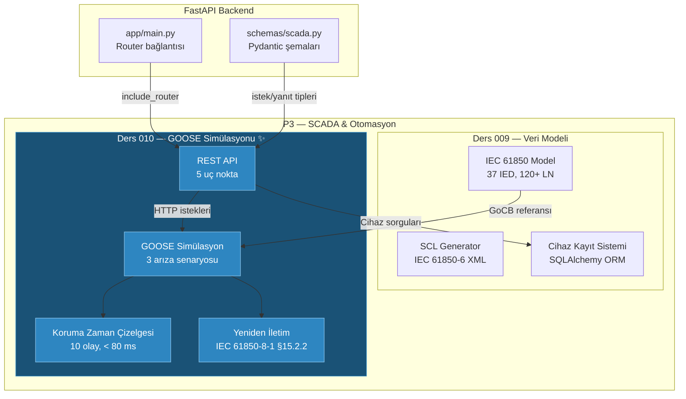

# Ders 010 — GOOSE Arıza Simülasyonu, Koruma Zaman Çizelgesi & SCADA API Uç Noktaları

!!! abstract "Ders Navigasyonu"
    :material-arrow-left: **Önceki:** [Ders 009 — IEC 61850 Veri Modeli, SCL Oluşturucu & SCADA Cihaz Kayıt Sistemi](lesson-009.md) | **Sonraki:** [Ders 011 — IEC 62443 RBAC & 9 Durumlu Permit-to-Work Yaşam Döngüsü](lesson-011.md) :material-arrow-right:

    **Faz:** P3 | **Dil:** Türkçe | **İlerleme:** 11 / 19 | [Tüm Dersler](index.md) | [Öğrenme Yol Haritası](../../Learning_Roadmap.md)

> **Date:** 2026-02-25
> **Commits:** 1 commit (`c085bcb` → `c085bcb`)
> **Commit range:** `c085bcba164e63a440229a95346198f33ca9c04b..c085bcba164e63a440229a95346198f33ca9c04b`
> **Phase:** P3 (SCADA & Automation)
> **Roadmap sections:** [Phase 3 — Section 3.1 IEC 61850 — The Standard, Phase 2 — Section 2.2 Power System Protection]
> **Language:** Turkish
> **Previous lesson:** Lesson 009
> **last_commit_hash:** c085bcba164e63a440229a95346198f33ca9c04b

---

## Ne Öğreneceksiniz

- GOOSE (Generic Object-Oriented Substation Event) protokolünün neden Layer 2 Ethernet üzerinde çalıştığını ve TCP/IP yerine yayın-abone (publish-subscribe) modeli kullanma nedenini anlama
- Koruma arıza temizleme zaman çizelgesini (fault clearance timeline) milisaniye düzeyinde modelleme: algılama → röle işleme → GOOSE yayını → kesici açma → ark sönümü
- IEC 61850-8-1 §15.2.2 yeniden iletim çizelgesini (retransmission schedule) üstel geri çekilme (exponential backoff) algoritmasıyla hesaplama
- Üç farklı arıza senaryosunu (bara aşırı akım, transformatör diferansiyel, kablo toprak arızası) karşılaştırarak koruma fonksiyonlarının farklılıklarını kavrama
- FastAPI REST uç noktalarını (endpoints) Pydantic şemalarıyla tasarlayıp 47 birim testiyle doğrulama

---

## Bölüm 1: GOOSE Protokolü — Neden Her Milisaniye Önemlidir

### Gerçek Hayat Problemi

Bir itfaiye istasyonu düşünün. Yangın alarmı çaldığında, itfaiyecilerin merkeze telefon edip "yangın var mıdır, nerededir, hangi ekip gitmeli?" diye sorması kabul edilemez — bu TCP/IP modeli olurdu (bağlantı kur → istek gönder → yanıt bekle). Bunun yerine alarm anında tüm istasyondaki hoparlörlerden aynı anda duyuru yapılır: "Yangın! A bloğu, 3. kat!" Her itfaiyeci bu mesajı eşzamanlı olarak duyar. İşte GOOSE tam olarak bu modeldir — **yayın-abone** (publish-subscribe). Yayıncı IED mesajı Ethernet'e koyar, tüm aboneler anında alır. Yönlendirme (routing) yok, el sıkışma (handshake) yok, bekleme yok.

Neden bu kadar acele? Bir 220 kV barada kısa devre oluştuğunda, ark enerjisi **I² × t** formülüyle artar. 1.200 A nominal akımlı bir barada 2,5 kat arıza akımı (3.000 A) akarken, her ek milisaniye switchgear'ı tahrip edebilir. IEC 62271-100 standardı 220 kV için toplam temizleme süresini **80 ms altında** tutar — yoksa ekipman yanabilir.

### Standartlar Ne Diyor

**IEC 61850-8-1** GOOSE protokolünü tanımlar:

- **Taşıma katmanı:** Ethernet Layer 2 (EtherType 0x88B8) — IP yönlendirmesi yok
- **Adresleme:** Multicast MAC adresi `01:0C:CD:01:xx:xx` (IEC 61850-8-1 Annex A)
- **Model:** Yayın-abone (publish-subscribe) — yayıncı IED gönderir, tüm aboneler alır
- **Gecikme gereksinimi:** < 4 ms uçtan uca (yayıncı → abone)
- **Güvenilirlik:** TCP onayı yok — bunun yerine üstel geri çekilmeli yeniden iletim

**IEC 62271-100** yüksek gerilim kesicileri için arıza temizleme süresini belirler:

- 220 kV bara arızası: toplam < 80 ms
- Kesici mekanik süresi: 20-60 ms (yay mekanizması)
- Koruma rölesi işlem süresi: 15-30 ms
- GOOSE taşıma süresi: < 4 ms

### Ne İnşa Ettik

**Değişen dosyalar:**

- `backend/app/services/p3/goose_simulation.py` — GOOSE mesajlaşma ve koruma simülasyon motoru (727 satır)
- `backend/app/routers/p3.py` — P3 SCADA REST API uç noktaları (333 satır)
- `backend/app/schemas/scada.py` — Arıza simülasyonu Pydantic şemaları (92 yeni satır)
- `backend/tests/test_goose_simulation.py` — 47 birim test (446 satır)
- `backend/app/main.py` — P3 router'ı FastAPI uygulamasına bağlama
- `backend/app/routers/__init__.py` — Router paket tanımı

Toplam: **1.601 satır yeni kod** — P3'ün en büyük tek commit'i.

### Neden Önemli

> **Neden** GOOSE Layer 2'de çalışır, Layer 3 (IP) değil?
> Çünkü IP yönlendirmesi her hop'ta mikrosaniyeler ekler ve TCP el sıkışması milisaniyeler kaybettirir. Koruma sinyallerinde 4 ms bütçe varken bu lüks kabul edilemez. Layer 2 Ethernet, anahtar (switch) üzerinden doğrudan iletir — yönlendirme tablosu araması yok.
>
> **Neden** TCP onayı yerine yeniden iletim (retransmission) kullanılır?
> TCP'de kayıp paket için gönderenin onay beklemesi gerekir — bu gecikme koruma için ölümcül olabilir. GOOSE bunun yerine "umutsuz tekrar" stratejisi kullanır: mesajı hemen gönder, sonra üstel artan aralıklarla tekrarla (2 ms, 4 ms, 8 ms, ...). Abone en az bir kopyayı alırsa yeterlidir.

### Kod İncelemesi

GOOSE PDU (Protocol Data Unit) veri modeli, IEC 61850-8-1'deki alan yapısını Python `dataclass` olarak modelliyor. Her alan gerçek bir GOOSE Ethernet çerçevesindeki karşılığına eşlenir:

```python
@dataclass(frozen=True)
class GOOSEMessage:
    """IEC 61850-8-1 GOOSE Protocol Data Unit (PDU)."""

    gocb_ref: str      # GOOSE Control Block referansı: {IED}/{LLN0}$GO${gcb_name}
    dat_set: str       # Dataset referansı: hangi veri nesneleri dahil
    go_id: str         # İnsan okunur GOOSE tanımlayıcı
    st_num: int        # Durum numarası — her durum DEĞİŞİKLİĞİNDE artar
    sq_num: int        # Sıra numarası — her yeniden iletimde artar, stNum değişince sıfırlanır
    all_data: dict[str, bool]  # Trip sinyal değerleri
    timestamp: datetime        # UTC zaman damgası (IEEE 1588 hassasiyeti)
    app_id: str        # GOOSE Uygulama Kimliği (hex)
    mac_address: str   # Multicast hedef MAC (IEC 61850-8-1 Annex A)
    vlan_id: int       # GOOSE trafiği için ayrılmış VLAN
```

Burada `frozen=True` kullanımına dikkat edin — GOOSE mesajları **değiştirilemez** (immutable) olmalıdır. Bir kez yayınlanan mesaj artık değiştirilemez; yeni bir durum değişikliği varsa `st_num` artırılarak yeni bir mesaj oluşturulur. Bu, gerçek GOOSE protokolünün semantiğiyle birebir örtüşür.

### Temel Kavram

!!! tip "Temel Kavram: stNum vs sqNum — Durum ve Sıra Numarası"
    **Basitçe anlatım:** Bir arkadaşınıza mesaj attığınızı düşünün. "Kapıdayım" dediğinizde bu yeni bir **durum** (stNum = 1). Arkadaşınız görmemişse aynı mesajı tekrar gönderirsiniz — bu **yeniden iletim** (sqNum artarak 1, 2, 3...). Sonra "İçeri girdim" dediğinizde yeni bir durum olur (stNum = 2, sqNum sıfırlanır).

    **Analoji:** Bir radyo istasyonu haber bültenini düşünün. Yeni bir haber geldiğinde bülten numarası artar (stNum). Aynı bülten tekrarlandığında tekrar sayısı artar (sqNum). Dinleyiciler hangi bültenin en güncel olduğunu bülten numarasından anlar.

    **Bu projede:** `stNum = 1` trip komutunun ilk yayınıdır. `sqNum = 0` orijinal mesaj, `sqNum = 1` ilk yeniden iletimdir. Abone IED, `stNum` değişikliğini görünce "yeni bir olay oldu" bilir ve kesiciyi açar.

---

## Bölüm 2: Koruma Zaman Çizelgesi — 80 ms İçinde Arıza Temizleme

### Gerçek Hayat Problemi

Bir domino dizisi hayal edin. İlk domino (arıza) devrilince, her sonraki domino belirli bir sürede devrilir: algılama → işleme → iletişim → mekanik hareket. Eğer son domino (kesici açılması) belirli bir süre içinde devrilmezse, tüm dizi çöker (ekipman hasar görür). Koruma mühendisliğinde her bir "domino"nun ne kadar sürdüğünü milisaniye cinsinden bilmek ve toplamın bütçeyi aşmadığını doğrulamak zorunludur.

### Standartlar Ne Diyor

**IEC 62271-100** yüksek gerilim devre kesicileri için toplam arıza temizleme sürelerini tanımlar. 220 kV seviyesinde:

$$t_{toplam} = t_{algilama} + t_{role} + t_{GOOSE} + t_{kesici} + t_{ark}$$

- $t_{algilama}$ = CT sekonder akımının eşiği aşması (arıza tipine bağlı: 2-8 ms)
- $t_{role}$ = Dijital röle işleme süresi (0.5 ms)
- $t_{GOOSE}$ = Layer 2 Ethernet taşıma süresi (1.5 ms)
- $t_{kesici}$ = Yay mekanizması açma süresi (40 ms)
- $t_{ark}$ = SF6 gazında ark sönümü (15 ms)

Toplam ≤ 80 ms olmalıdır.

### Ne İnşa Ettik

`simulate_fault()` fonksiyonu deterministik (her çalıştırmada aynı sonucu veren) bir koruma zaman çizelgesi üretir. Her olay bir `ProtectionEvent` nesnesiyle temsil edilir:

```python
@dataclass(frozen=True)
class ProtectionEvent:
    """Koruma zaman çizelgesindeki tek bir olay."""
    event_type: EventType      # Ne oldu (ör: FAULT_OCCURS, GOOSE_PUBLISHED)
    timestamp_ms: float        # Arıza başlangıcından itibaren geçen süre [ms]
    description: str           # İnsan okunur açıklama
    ied_name: str = ""         # İlgili IED (yayıncı veya abone)
```

Zaman çizelgesinin 10 adımı şöyledir:

```python
def simulate_fault(scenario: FaultScenario) -> FaultSimulationResult:
    detection_ms = _DETECTION_TIMES_MS[scenario.fault_type]
    fault_current_a = scenario.fault_current_pu * scenario.nominal_current_a

    t = 0.0
    events: list[ProtectionEvent] = []

    # 1. Arıza oluşur (t = 0 ms)
    events.append(ProtectionEvent(
        event_type=EventType.FAULT_OCCURS,
        timestamp_ms=t,
        description=f"Fault on {scenario.location.value}: I = {scenario.fault_current_pu:.1f} pu",
    ))

    # 2. Koruma algılar (t = 2.0 ms — bara aşırı akım için)
    t += detection_ms
    events.append(ProtectionEvent(
        event_type=EventType.PROTECTION_DETECTS,
        timestamp_ms=t,
        description=f"{scenario.protection_function.value} detects fault current > pickup",
        ied_name=scenario.publisher_ied,
    ))

    # 3. Röle işler (t += 0.5 ms)
    t += _RELAY_PROCESSING_MS

    # 4. GOOSE trip yayınlanır (aynı anda)
    goose_publish_ms = t

    # 5. GOOSE alınır (t += 1.5 ms)
    t += _GOOSE_TRANSPORT_MS

    # 6. Kesici trip bobini enerjilenir
    # 7. Kesici kontakları ayrılır (t += 40 ms)
    t += _BREAKER_MECHANICAL_MS

    # 8. Ark söner (t += 15 ms)
    t += _ARC_EXTINCTION_MS

    # 9. Arıza temizlendi
    total_clearance_ms = t  # Bara aşırı akım: 59.0 ms < 80 ms ✓

    # 10. SCADA alarmı (t = gönderi + 260 ms — koruma için DEĞİL)
    scada_ms = goose_publish_ms + _SCADA_POLLING_DELAY_MS
```

Bu kodun en önemli tasarım kararlarından biri **determinizm**dir. Zamanlama sabitleri rastgele değildir — IEC standartları ve üretici verilerine dayalı sabit değerlerdir. Bu sayede testler her çalıştırmada aynı sonucu verir ve öğrenciler her milisaniyeyi takip edebilir.

### Neden Önemli

> **Neden** SCADA alarmı koruma için kullanılmaz?
> SCADA (IEC 60870-5-104) TCP/IP polling döngüsüyle çalışır — tipik 260 ms gecikme. Bu sürede 220 kV'da ark enerjisi ekipmanı çoktan tahrip etmiş olabilir. GOOSE 1.5 ms'de ulaşırken, SCADA 260 ms'de ulaşır — 173 kat fark! SCADA operatöre bilgi verir, GOOSE ekipmanı korur.
>
> **Neden** deterministik zamanlama kullanıyoruz?
> Gerçek dünyada zamanlama küçük varyasyonlar gösterir (jitter). Ancak eğitim amacıyla deterministik değerler kullanıyoruz çünkü: (1) testler tekrarlanabilir olur, (2) öğrenciler her milisaniyenin kaynağını izleyebilir, (3) IEC uyumluluk kontrolü anlamlı olur.

### Temel Kavram

!!! tip "Temel Kavram: Ark Enerjisi — I²t"
    **Basitçe anlatım:** Elinize bir büyüteçle güneş ışığı odakladığınızı düşünün. Odak noktası ne kadar yoğunsa (akım) ve ne kadar uzun tutarsanız (zaman), o kadar çok ısı birikir. Elektrik arkı da aynı — akım karesi çarpı süre (I²t) ne kadar büyükse, o kadar fazla enerji açığa çıkar ve ekipman hasar görür.

    **Analoji:** Bir musluktan akan su gibi düşünün. Suyun basıncı (I²) ve açık kalma süresi (t) ne kadar fazlaysa, kovaya o kadar çok su dolar. Kova taşarsa (I²t limitini aşarsa) hasar başlar.

    **Bu projede:** 220 kV barada 3.000 A arıza akımında, 80 ms yerine 60 ms'de temizleme yaparsak ark enerjisi %25 azalır. Simülasyonumuzda bara aşırı akım senaryosu 59 ms'de temizlenir — IEC 62271-100'ün 80 ms limitinin altında güvenli bir marjla.

---

## Bölüm 3: Üç Arıza Senaryosu — Farklı Arızalar, Farklı Koruma

### Gerçek Hayat Problemi

Bir hastanenin acil servisini düşünün. Kalp krizi, kırık kol ve alerjik şok için aynı tedavi uygulanmaz — her biri farklı teşhis süresi, farklı uzman ve farklı müdahale gerektirir. Aynı şekilde, bir trafo merkezindeki farklı arıza tipleri farklı koruma fonksiyonlarını tetikler ve farklı temizleme süreleri üretir.

### Standartlar Ne Diyor

**IEC 61850-7-4** koruma mantıksal düğüm sınıflarını tanımlar:

- **PTOC** (Time Overcurrent): Akım eşik değerini aştığında trip — bara arızaları için hızlı
- **PDIF** (Differential): İki ölçüm noktası arasındaki akım farkını karşılaştırır — transformatör koruması
- **PTOC + yönsel eleman**: Arıza akımının yönünü belirler — kablo arızaları için ayırt edici

### Ne İnşa Ettik

Üç arıza senaryosu bir `_SCENARIO_BUILDERS` registry sözlüğüyle yönetilir:

```python
# Senaryo tipleri ve algılama süreleri
_DETECTION_TIMES_MS: dict[FaultType, float] = {
    FaultType.BUSBAR_OVERCURRENT: 2.0,       # Hızlı CT pickup, yakın arıza
    FaultType.TRANSFORMER_DIFFERENTIAL: 5.0,  # Diferansiyel karşılaştırma
    FaultType.CABLE_EARTH_FAULT: 8.0,         # Yönsel eleman + zaman gecikmesi
}
```

Her senaryonun farklı parametreleri var:

| Senaryo | Arıza Akımı | Koruma | Algılama | Toplam Temizleme |
|---------|-------------|--------|----------|------------------|
| Bara aşırı akım | 2.5 pu (3.000 A) | PTOC | 2.0 ms | 59.0 ms |
| Transformatör diferansiyel | 5.0 pu (6.000 A) | PDIF | 5.0 ms | 62.0 ms |
| Kablo toprak arızası | 1.8 pu (2.160 A) | PTOC (yönsel) | 8.0 ms | 65.0 ms |

Senaryo oluşturma bir factory pattern kullanır — `Callable[[], FaultScenario]` tipinde fonksiyonlar registry'ye kayıtlıdır:

```python
_SCENARIO_BUILDERS: dict[FaultType, Callable[[], FaultScenario]] = {
    FaultType.BUSBAR_OVERCURRENT: create_busbar_overcurrent_scenario,
    FaultType.TRANSFORMER_DIFFERENTIAL: create_transformer_differential_scenario,
    FaultType.CABLE_EARTH_FAULT: create_cable_earth_fault_scenario,
}

def create_scenario(fault_type: FaultType) -> FaultScenario:
    """Arıza tipine göre senaryo oluştur."""
    builder = _SCENARIO_BUILDERS.get(fault_type)
    if builder is None:
        msg = f"Unknown fault type: {fault_type}"
        raise ValueError(msg)
    return builder()
```

Bu factory pattern'i yeni senaryo eklemeyi kolaylaştırır: yeni bir builder fonksiyonu yaz ve registry'ye ekle. Mevcut kodu değiştirmene gerek yok — **Açık-Kapalı Prensibi** (Open-Closed Principle).

### Neden Önemli

> **Neden** kablo toprak arızasının algılama süresi daha uzun?
> Kablo arızasında yönsel eleman (directional element) gerekir — arıza akımının yönünü belirlemek ek süre alır. Baradaki aşırı akım doğrudan CT'den ölçülürken, kablo arızasında akımın bara tarafından mı yoksa kablo ucundan mı geldiğini ayırt etmek gerekir.
>
> **Neden** factory pattern kullanıyoruz, doğrudan `if-elif` değil?
> Registry yaklaşımı ile yeni senaryo eklemek tek satırlık bir sözlük girişidir. `if-elif` zinciri büyüdükçe bakımı zorlaşır ve Açık-Kapalı Prensibini ihlal eder. Ayrıca `get_available_scenarios()` gibi keşif fonksiyonları doğrudan registry'den üretilir.

### Temel Kavram

!!! tip "Temel Kavram: Koruma Koordinasyonu — Doğru Kesiciyi Doğru Zamanda Açmak"
    **Basitçe anlatım:** Evinizde bir sigorta attığında, tüm evin sigortası değil, sadece ilgili odanın sigortası atmalıdır. Koruma koordinasyonu, arızaya en yakın kesicinin ilk açılmasını, uzaktakilerin yedek olarak beklemesini sağlar.

    **Analoji:** Yangın söndürme sistemi gibi düşünün. Yangın 3. kattaysa, sadece 3. katın sprinkleri çalışmalı, tüm binanınki değil. Ama 3. katınki çalışmazsa, ana yangın valfi (yedek koruma) devreye girer.

    **Bu projede:** Bara aşırı akımda PTOC en hızlı korumadır (2 ms algılama). Transformatör arızasında PDIF kullanılır çünkü aşırı akım koruması transformatörün hangi tarafında olduğunu ayırt edemez. Kablo arızasında yönsel eleman eklenir çünkü akımın yönü belirlenmeden doğru kesici seçilemez.

---

## Bölüm 4: GOOSE Yeniden İletim Çizelgesi — TCP Olmadan Güvenilirlik

### Gerçek Hayat Problemi

Bir kalabalık stadyumda megafonla duyuru yaptığınızı düşünün. İlk duyuruyu duymayan olabilir — gürültü, dikkat dağınıklığı. Bu yüzden aynı duyuruyu birkaç kez tekrarlarsınız: önce hemen, sonra biraz bekleyip, sonra daha uzun bekleyip... Ta ki herkesin duyduğundan emin olana kadar. GOOSE'un yeniden iletim stratejisi tam olarak budur.

### Standartlar Ne Diyor

**IEC 61850-8-1 §15.2.2** yeniden iletim çizelgesini tanımlar:

1. Durum değişikliğinde mesaj hemen gönderilir
2. İlk yeniden iletim T0 = `min_time` sonra (tipik: 2 ms)
3. Sonraki aralıklar ikiyle çarpılır: T0, 2×T0, 4×T0, 8×T0, ...
4. Maksimum aralık `max_time`'a ulaşınca sabitlenir (tipik: 1000 ms)
5. Bu üstel geri çekilme (exponential backoff) TCP olmadan güvenilirlik sağlar

### Ne İnşa Ettik

Yeniden iletim hesaplayıcı yalın ve matematiksel olarak doğru bir fonksiyondur:

```python
def calculate_retransmission_schedule(
    min_time_ms: int = 2,
    max_time_ms: int = 1000,
    num_retransmissions: int = 10,
) -> tuple[float, ...]:
    """IEC 61850-8-1 §15.2.2 yeniden iletim çizelgesi.

    Üstel geri çekilme: T0, 2×T0, 4×T0, ..., max_time'a kadar.
    """
    intervals: list[float] = []
    current_interval = float(min_time_ms)
    cumulative = 0.0

    for _ in range(num_retransmissions):
        cumulative += current_interval
        intervals.append(cumulative)
        # Aralığı ikiye katla, ama max_time'ı geçme
        current_interval = min(current_interval * 2, float(max_time_ms))

    return tuple(intervals)
```

Varsayılan parametrelerle çizelge şöyle oluşur:

| # | Aralık (ms) | Kümülatif (ms) | Açıklama |
|---|-------------|----------------|----------|
| 1 | 2 | 2 | T0 — ilk yeniden iletim |
| 2 | 4 | 6 | 2×T0 |
| 3 | 8 | 14 | 4×T0 |
| 4 | 16 | 30 | 8×T0 |
| 5 | 32 | 62 | 16×T0 |
| 6 | 64 | 126 | 32×T0 |
| 7 | 128 | 254 | 64×T0 |
| 8 | 256 | 510 | 128×T0 |
| 9 | 512 | 1022 | 256×T0 |
| 10 | 1000 | 2022 | max_time'da sabitleniyor |

İlk 4 yeniden iletim 30 ms içinde tamamlanır — kritik koruma mesajının en az bir kopyasının ulaşma olasılığını büyük ölçüde artırır.

### Neden Önemli

> **Neden** üstel geri çekilme, sabit aralıklı tekrardan daha iyi?
> Sabit aralıkla (örneğin her 2 ms'de) tekrar, ağ trafiğini gereksiz yere yükler. Üstel geri çekilme, kritik ilk milisaniyelerde çok sık tekrar yapar (güvenilirlik), sonra aralığı açarak ağ bant genişliğini korur. Bu, TCP'nin congestion control'ünden esinlenmiş ama çok daha basit bir yaklaşımdır.
>
> **Neden** tuple döndürüyoruz, list değil?
> Yeniden iletim çizelgesi hesaplandıktan sonra değişmemeli — `tuple` değiştirilemezlik (immutability) garantisi verir. Bu, fonksiyonel programlama ilkesidir: yan etkisiz (side-effect-free) fonksiyonlar test ve hata ayıklama için çok daha güvenlidir.

### Temel Kavram

!!! tip "Temel Kavram: Üstel Geri Çekilme (Exponential Backoff)"
    **Basitçe anlatım:** Bir kapıyı çalıyorsunuz. İlk çalışta cevap gelmezse hemen tekrar çalarsınız. Yine gelmezse biraz beklersiniz. Yine gelmezse daha uzun beklersiniz. Her seferinde bekleme süresini ikiye katlarsınız — çünkü ya kimse evde değildir (ağ sorunu büyüktür) ya da geç duymuşlardır.

    **Analoji:** Balık tutmak gibi. İlk atışta balık gelmezse, hemen tekrar atarsınız. Birkaç başarısız denemeden sonra, yem değiştirip daha uzun beklemeye başlarsınız — enerjinizi daha verimli kullanırsınız.

    **Bu projede:** GOOSE mesajı 2 ms sonra tekrarlanır, sonra 4 ms, 8 ms, 16 ms... İlk 30 ms'de 4 kopya gönderilir (kritik koruma penceresi). 2 saniye sonra 10 kopya gönderilmiş olur — Layer 2 Ethernet'te en az birinin ulaşmaması neredeyse imkansızdır.

---

## Bölüm 5: REST API Uç Noktaları — SCADA Simülasyonunu Dış Dünyaya Açmak

### Gerçek Hayat Problemi

Bir restoran mutfağı düşünün. Harika yemekler pişirebilirsiniz, ama müşteriye ulaşacak bir servis penceresi (hatch) yoksa hiç bir anlamı yoktur. API uç noktaları, backend servislerimizin "servis penceresi"dir — frontend, test araçları ve diğer sistemler bu pencereden sipariş verir ve sonuçları alır.

### Standartlar Ne Diyor

Proje konvansiyonumuz (SKILL.md) API tasarımında şu kuralları zorunlu kılar:

- Prefix: `/api/v1/{domain}/` — SCADA için `/api/v1/scada/`
- Pydantic v2 şemaları: her istek ve yanıt için tip güvenliği
- FastAPI otomatik OpenAPI dokümantasyonu
- HTTP durum kodları: 200 başarı, 404 bulunamadı, 422 geçersiz girdi

### Ne İnşa Ettik

P3 router'ı beş uç nokta sunar:

| HTTP | Endpoint | Açıklama |
|------|----------|----------|
| `GET` | `/api/v1/scada/goose/scenarios` | Mevcut arıza senaryolarını listele |
| `POST` | `/api/v1/scada/goose/simulate` | Arıza simülasyonu çalıştır |
| `POST` | `/api/v1/scada/goose/retransmission` | Yeniden iletim çizelgesi hesapla |
| `GET` | `/api/v1/scada/devices` | Tüm IEC 61850 cihazlarını listele |
| `GET` | `/api/v1/scada/devices/{device_name}` | Tek bir cihazın detayını getir |

Simülasyon uç noktasının yapısı şöyledir:

```python
@router.post("/goose/simulate", response_model=FaultSimulationResponse)
async def run_fault_simulation(request: FaultScenarioRequest) -> FaultSimulationResponse:
    """GOOSE koruma arıza simülasyonu çalıştır."""
    try:
        fault_type = FaultType(request.fault_type)
    except ValueError as err:
        valid_types = [ft.value for ft in FaultType]
        raise HTTPException(
            status_code=422,
            detail=f"Invalid fault_type: '{request.fault_type}'. Valid types: {valid_types}",
        ) from err

    scenario = create_scenario(fault_type)
    result = simulate_fault(scenario)
    # ... Pydantic şemalarına dönüştür ve döndür
```

Dikkat edilecek noktalar:

1. **`from err` zinciri:** `raise ... from err` Python'da istisna zincirlemesini sağlar — orijinal `ValueError` kaybolmaz, hata ayıklama kolaylaşır
2. **Geçersiz girdi kontrolü:** `FaultType(request.fault_type)` başarısızsa, geçerli tipleri hata mesajında listeliyoruz — istemci tarafında hata ayıklamayı kolaylaştırır
3. **Asenkron fonksiyon:** `async def` kullanılıyor çünkü FastAPI asenkron çalışır, ancak bu simülasyon CPU-bound olduğu için gerçek asenkron I/O kullanmıyor

### Neden Önemli

> **Neden** `from err` kullanıyoruz, sadece `raise HTTPException(...)` değil?
> `from err` olmadan, orijinal `ValueError` stack trace'den kaybolur. `from err` ile Python `__cause__` özniteliğini ayarlar — hata ayıklamada hem orijinal hatayı hem de HTTP hatasını görebilirsiniz. Bu, PEP 3134'te tanımlanan istisna zincirlemesi (exception chaining) standardıdır.
>
> **Neden** Pydantic şemaları kullanıyoruz, doğrudan dataclass döndürmüyoruz?
> FastAPI, Pydantic modellerini otomatik olarak JSON'a serileştirir ve OpenAPI şeması üretir. Dataclass'lar bu otomatik entegrasyonu sağlamaz. Ayrıca Pydantic `Field(description=...)` ile her alan belgelenir — API dokümantasyonu kodun kendisinden üretilir.

### Temel Kavram

!!! tip "Temel Kavram: API Katmanlaması — Servis, Router, Şema"
    **Basitçe anlatım:** Bir restaurantta üç rol vardır: şef (yemeği yapar = servis katmanı), garson (siparişi alır ve servis eder = router), menü (ne sipariş edilebileceğini tanımlar = şema). Her rol kendi sorumluluğuna odaklanır.

    **Analoji:** Bir posta sistemi gibi: mektubun içeriği (servis mantığı), zarfın üstündeki adres formatı (şema), ve postacı (router). Postacı mektubun içeriğini bilmez — sadece doğru adrese iletir.

    **Bu projede:** `goose_simulation.py` fiziği ve matematiği hesaplar (şef). `p3.py` router HTTP isteklerini alır ve servis fonksiyonlarını çağırır (garson). `scada.py` şemaları istek/yanıt formatını tanımlar (menü). Şef değişirse garson ve menü etkilenmez.

---

## Bölüm 6: 47 Birim Test — Her Milisaniyeyi Doğrulamak

### Gerçek Hayat Problemi

Bir köprü inşa ettiğinizde, açılmadan önce yük testleri yaparsınız — "köprü çökmez umarım" demek yeterli değildir, **kanıtlamanız** gerekir. Yazılımda birim testler bu yük testleridir. Özellikle koruma simülasyonunda, yanlış bir zamanlama değeri gerçek dünyada ekipman hasarına tekabül eder — testler bu riskleri kodda yakalar.

### Standartlar Ne Diyor

Test stratejisi üç IEC standardını doğrular:

- **IEC 61850-8-1:** GOOSE gecikme < 4 ms
- **IEC 62271-100:** Arıza temizleme < 80 ms
- **IEC 61850-8-1 §15.2.2:** Yeniden iletim üstel geri çekilme doğruluğu

### Ne İnşa Ettik

47 test, 7 sınıfa organize edilmiş:

| Test Sınıfı | Test Sayısı | Ne Doğruluyor |
|-------------|-------------|---------------|
| `TestGOOSEMessage` | 11 | PDU alan doğruluğu (gocbRef, stNum, sqNum, MAC, VLAN) |
| `TestProtectionTimeline` | 9 | Olay sırası, kronolojik tutarlılık, nedensellik |
| `TestIECCompliance` | 8 | GOOSE < 4 ms, temizleme < 80 ms, tüm senaryolar |
| `TestFaultScenarios` | 9 | Senaryo parametreleri, karşılaştırmalı değerler |
| `TestScenarioRegistry` | 3 | Factory pattern, geçersiz tip hatası |
| `TestRetransmissionSchedule` | 7 | Üstel geri çekilme, cap mantığı, varsayılanlar |

Özellikle dikkat çekici testlerden biri — nedensellik (causality) kontrolü:

```python
def test_goose_published_before_received(self):
    """GOOSE yayını alımdan ÖNCE olmalı (nedensellik)."""
    scenario = create_busbar_overcurrent_scenario()
    result = simulate_fault(scenario)
    pub_time = next(
        e.timestamp_ms for e in result.events
        if e.event_type == EventType.GOOSE_PUBLISHED
    )
    recv_time = next(
        e.timestamp_ms for e in result.events
        if e.event_type == EventType.GOOSE_RECEIVED
    )
    assert pub_time < recv_time
```

Bu test fiziğin temel yasasını doğrular: bir mesaj gönderilmeden alınamaz. Basit görünebilir, ama zaman çizelgesindeki bir hata bu sırayı bozabilir — ve bu, gerçek dünyada "kesici GOOSE'u almadan önce açıldı" anlamına gelir ki bu fiziksel olarak imkansızdır.

Bir diğer güçlü test — `pytest.mark.parametrize` ile tüm senaryoların IEC uyumluluğunu tek seferde doğrulama:

```python
@pytest.mark.parametrize("fault_type", list(FaultType))
def test_all_scenarios_are_clearance_compliant(self, fault_type: FaultType):
    """Her arıza senaryosu < 80 ms toplam temizleme süresi sağlamalı."""
    scenario = create_scenario(fault_type)
    result = simulate_fault(scenario)
    assert result.clearance_compliant, (
        f"{fault_type}: clearance {result.total_clearance_ms} ms >= {FAULT_CLEARANCE_MAX_MS} ms"
    )
```

Bu parametrik test, 3 arıza tipini otomatik olarak 3 ayrı test olarak çalıştırır. Yeni bir `FaultType` eklendiğinde, test otomatik olarak onu da kapsar — ekstra kod yazmaya gerek yok.

### Neden Önemli

> **Neden** deterministik testler rastgele (stochastic) testlerden daha değerli?
> Rastgele zamanlama kullansaydık, testler bazen geçer bazen başarısız olurdu (flaky tests). Deterministik zamanlamalarla her test her zaman aynı sonucu verir — bir test başarısız olursa, bunun nedeni kodda bir değişikliktir, şans değil.
>
> **Neden** `pytest.mark.parametrize` kullanıyoruz?
> Üç senaryo için üç ayrı test fonksiyonu yazmak yerine, parametrik test tek bir fonksiyonla tüm senaryoları kapsar. Yeni senaryo eklendiğinde test otomatik olarak genişler. DRY (Don't Repeat Yourself) prensibi.

### Temel Kavram

!!! tip "Temel Kavram: Parametrik Test — Bir Fonksiyon, Çok Test"
    **Basitçe anlatım:** Bir formülün doğruluğunu kontrol etmek istiyorsunuz. Her sayı için ayrı bir deney yapmak yerine, "bu formül X = 1, 2, 3, ... için doğru mu?" diye sorarsınız. Parametrik test aynı soruyu farklı girdilerle tekrarlar.

    **Analoji:** Bir kalite kontrol hattı düşünün. Her ürün aynı testten geçer — ama her ürün farklı bir seri numarasına sahiptir. Test hattı bir, ürünler çok.

    **Bu projede:** `@pytest.mark.parametrize("fault_type", list(FaultType))` dekoratörü, tek bir test fonksiyonunu 3 bağımsız teste dönüştürür: busbar_overcurrent, transformer_differential, cable_earth_fault. Yeni bir `FaultType` eklendiğinde 4. test otomatik olarak eklenir.

---

## Bağlantılar

**Bu kavramlar ileride nerede karşımıza çıkacak:**

- **GOOSE mesajlaşma** → P3'ün sonraki adımları: Permit-to-Work durum makinesi (state machine) GOOSE trip sinyallerini girdi olarak kullanacak
- **Koruma zaman çizelgesi** → P5 Commissioning: Devreye alma (SAT) testlerinde koruma röle enjeksiyonu bu zaman çizelgesini doğrulayacak
- **Factory pattern (senaryo registry)** → P4 AI Forecasting'de model seçici (model selector) aynı pattern'i kullanabilir
- **IEC uyumluluk kontrolleri** → P3'te cybersecurity (IEC 62443) eklendiğinde, uyumluluk kontrol çerçevesi genişleyecek

**Önceki derslerden gelen bağlantılar:**

- Ders 009'daki IEC 61850 veri modeli (Physical Device → Logical Node hiyerarşisi) bu derste `build_oss_goose_control_block()` çağrısıyla doğrudan kullanılıyor — GOOSE mesajları o veri modeli üzerine inşa edildi

---

## Büyük Resim

*Bu dersin odağı: **P3 SCADA'ya GOOSE arıza simülasyonu, koruma zaman çizelgesi ve REST API uç noktaları eklendi**.*



*Tam sistem mimarisi için: [Dersler Genel Bakış](index.md#system-architecture)*

---

## Önemli Çıkarımlar

1. **GOOSE, Layer 2 Ethernet'te çalışır** çünkü IP yönlendirmesi ve TCP el sıkışması koruma sistemlerinin 4 ms bütçesini aşar — her milisaniye ark enerjisi demektir.
2. **Koruma zaman çizelgesi deterministik ve doğrulanabilir olmalıdır** — simülasyonda sabit zamanlamalar kullanmak, IEC uyumluluk kontrolünü anlamlı kılar ve testleri tekrarlanabilir yapar.
3. **Üstel geri çekilme (exponential backoff)** TCP onayı olmadan güvenilirlik sağlar — kritik ilk milisaniyelerde yoğun tekrar, sonra ağ bant genişliğini korumak için aralık açma.
4. **Farklı arıza tipleri farklı koruma fonksiyonları tetikler** — PTOC (aşırı akım) hızlıdır ama yön ayırt edemez; PDIF (diferansiyel) transformatör korumasında uzmanlaşmıştır; yönsel eleman kablo arızalarında gereklidir.
5. **Factory pattern (registry sözlüğü)** yeni senaryo eklemeyi tek satırlık bir operasyona indirger ve Açık-Kapalı Prensibini uygular.
6. **API katmanlaması (servis → router → şema)** endişelerin ayrılmasını (separation of concerns) sağlar — fizik motoru HTTP'den habersiz, router iş mantığından habersiz.
7. **Parametrik testler (`pytest.mark.parametrize`)** tek bir test fonksiyonunu otomatik olarak tüm senaryolara genişletir — yeni senaryo eklendiğinde test kapsamı otomatik artar.

---

## Önerilen Okumalar

*[Öğrenme Yol Haritası](../../Learning_Roadmap.md) — Faz 3: SCADA & Endüstriyel Otomasyon + Faz 2: Koruma*

| Kaynak | Tür | Neden Okunmalı |
|--------|-----|----------------|
| IEC 61850 serisi (Bölüm 8-1) | Standart | GOOSE protokol detayları — bu derste simüle ettiğimiz mesaj yapısının orijinal kaynağı |
| Blackburn & Domin — *Protective Relaying: Principles and Applications* | Ders kitabı | Koruma zaman çizelgesi mantığının teorik temeli — algılama, röle, kesici süreleri |
| GE Grid Solutions — *Protection & Automation Application Guide* | Ücretsiz referans | Pratik koruma koordinasyonu rehberi — endüstri uygulamaları |
| Kim et al. (2017) — "Communication Architecture for Grid Integration of CPS Wind Energy Systems" | Akademik makale | IEC 61850'nin rüzgar enerji sistemlerine özel uygulanması |
| Apostolov (2020) — "IEC 61850 Edition 2 Impact" | Konferans makalesi | GOOSE Edition 2 değişikliklerinin koruma sistemlerine etkisi |

---

## Sınav — Anlayışınızı Test Edin

### Hatırlama Soruları

**S1:** GOOSE protokolü hangi OSI katmanında çalışır ve neden bu katman seçilmiştir?

<details>
<summary>Cevap</summary>

GOOSE, OSI Layer 2 (Ethernet) üzerinde çalışır. Bu katman seçilmiştir çünkü IP yönlendirmesi (Layer 3) ve TCP el sıkışması (Layer 4) ek gecikme ekler. Koruma sistemlerinde uçtan uca gecikme bütçesi 4 ms olduğundan, Layer 2'nin doğrudan anahtar (switch) üzerinden iletim yapması — yönlendirme tablosu araması olmadan — bu bütçeyi karşılamanın tek yoludur.

</details>

**S2:** Simülasyondaki bara aşırı akım senaryosunda toplam arıza temizleme süresi kaç milisaniyedir ve IEC 62271-100 limitinin altında mıdır?

<details>
<summary>Cevap</summary>

Bara aşırı akım senaryosunda toplam temizleme süresi 59.0 ms'dir (2.0 ms algılama + 0.5 ms röle + 1.5 ms GOOSE + 40.0 ms kesici + 15.0 ms ark sönümü). Bu değer, IEC 62271-100'ün 220 kV için belirlediği 80 ms limitinin 21 ms altındadır — güvenli bir marjla uyumludur.

</details>

**S3:** GOOSE PDU'daki `stNum` ve `sqNum` alanları ne anlama gelir ve birbirleriyle nasıl ilişkilidir?

<details>
<summary>Cevap</summary>

`stNum` (state number) her yeni durum değişikliğinde artar — örneğin trip komutu verildiğinde. `sqNum` (sequence number) aynı durum değişikliğinin her yeniden iletiminde artar, `stNum` değiştiğinde sıfırlanır. Abone IED, `stNum` değişikliğini görerek "yeni bir olay" olduğunu, `sqNum` artışını görerek "aynı olayın tekrarı" olduğunu anlar.

</details>

### Anlama Soruları

**S4:** Kablo toprak arızasının algılama süresi (8 ms) neden bara aşırı akımından (2 ms) daha uzundur?

<details>
<summary>Cevap</summary>

Kablo toprak arızasında yönsel eleman (directional element) gerekir. Koruma rölesi sadece akım büyüklüğünü değil, akımın yönünü de belirlemelidir — arızanın kablo ucunda mı yoksa bara tarafında mı olduğunu ayırt etmek için. Bu ek karşılaştırma ve zaman gecikmesi algoritmik olarak daha karmaşıktır. Bara aşırı akımda ise CT'den gelen akımın eşiği aşması doğrudan algılanır — yön belirlemeye gerek yoktur.

</details>

**S5:** GOOSE yeniden iletim çizelgesinde üstel geri çekilme neden sabit aralıklı tekrardan üstündür?

<details>
<summary>Cevap</summary>

Üstel geri çekilme, iki çelişen gereksinimi dengeler: (1) kritik ilk milisaniyelerde yüksek güvenilirlik — sık tekrarla mesajın ulaşma olasılığını artırır, ve (2) uzun vadede ağ bant genişliğini koruma — aralıkları açarak gereksiz trafiği azaltır. Sabit aralıkla her 2 ms'de tekrar, ilk saniyede 500 mesaj üretir ve ağı gereksiz yere yükler; üstel geri çekilme aynı sürede sadece ~10 mesaj gönderir.

</details>

**S6:** Simülasyonda SCADA alarmı neden koruma zaman çizelgesine dahil edildi, ancak koruma için kullanılmıyor?

<details>
<summary>Cevap</summary>

SCADA alarmı (IEC 60870-5-104 polling, ~260 ms gecikme) kontrol merkezi operatörünü bilgilendirmek içindir — koruma kararı vermek için değil. Zaman çizelgesine dahil edilmesinin nedeni eğitimseldir: öğrencilere GOOSE (1.5 ms) ile SCADA (260 ms) arasındaki 173 katlık gecikme farkını somut olarak göstermek. Bu fark, neden koruma sistemlerinin SCADA'ya değil GOOSE'a güvendiğini açıkça ortaya koyar.

</details>

### Meydan Okuma Sorusu

**S7:** Gerçek bir offshore trafo merkezinde, GOOSE mesajı ulaşmazsa ne olur? Bu senaryoyu simülasyonumuza nasıl eklerdiniz?

<details>
<summary>Cevap</summary>

Gerçek sistemlerde GOOSE kaybına karşı çok katmanlı koruma uygulanır: (1) **Yeniden iletim** — üstel geri çekilme ile mesaj birden fazla kez gönderilir. (2) **Redundant Ethernet** — IEC 62439-3 PRP (Parallel Redundancy Protocol) veya HSR (High-availability Seamless Redundancy) ile çift Ethernet ağı kullanılır; bir ağ başarısız olsa bile diğeri çalışır. (3) **Breaker Failure Protection (BFP)** — birincil kesici açılmazsa, yedek koruma rölesi bir üst seviye kesiciyi açar (tipik 150-200 ms gecikme ile).

Simülasyona eklemek için: `FaultSimulationResult`'a bir `goose_lost: bool` parametresi eklenebilir. `goose_lost = True` durumunda zaman çizelgesine BFP olayları (BFP_DETECT → BACKUP_BREAKER_TRIP → BACKUP_BREAKER_OPEN) eklenir ve toplam temizleme süresi 150-200 ms'e çıkar. Bu senaryo hâlâ IEC 62271-100'ün yedek koruma için izin verdiği süre sınırları içinde olmalıdır. PRP/HSR modelleme için ise ağ katmanı simülasyonu gerekir — bu, P3'ün ileriki aşamalarında cybersecurity (IEC 62443) ile birlikte ele alınabilir.

</details>

---

## Mülakat Köşesi

### Basitçe Açıklayın
*"GOOSE arıza simülasyonunu mühendis olmayan birine nasıl açıklarsınız?"*

Bir elektrik santralinde binlerce kablo ve anahtar var. Bazen bir kablo kısa devre yapar — bu, evdeki sigortanın atması gibi ama çok daha büyük ölçekte. Sorun şu ki, bu arıza birkaç milisaniye içinde müdahale edilmezse ekipman yanabilir. Bu yüzden akıllı cihazlar birbirleriyle çok hızlı haberleşmeli — internet gibi yavaş bir yol yerine, aynı odadaki insanların bağırarak haberleşmesi gibi doğrudan bir yol kullanılıyor. Buna GOOSE deniyor.

Biz bu sistemi bilgisayarda simüle ettik. Üç farklı arıza tipi tanımladık — anahat kısa devresi, transformatör arızası ve kablo hatası. Her biri için "arıza oldu → cihaz algıladı → mesaj gönderildi → anahtar açıldı" zaman çizelgesini milisaniye milisaniye hesapladık. Sonuçları uluslararası standartlarla karşılaştırarak güvenli sınırlar içinde olduğumuzu doğruladık. Son olarak, bu simülasyonu bir web servisi olarak sunduk — böylece ileride bir arayüz (frontend) eklendiğinde kullanıcılar tarayıcıdan simülasyon çalıştırabilecek.

### Teknik Olarak Açıklayın
*"GOOSE arıza simülasyonunu bir mülakat paneline nasıl açıklarsınız?"*

IEC 61850-8-1 GOOSE protokolünü ve IEC 62271-100 arıza temizleme gereksinimlerini simüle eden deterministik bir koruma zaman çizelgesi motoru geliştirdik. Motor, 220 kV offshore trafo merkezi bağlamında üç arıza senaryosunu (bara aşırı akım, transformatör diferansiyel, kablo toprak arızası) modelliyor. Her senaryo, arıza başlangıcından SCADA alarmına kadar 10 ayrık olayı milisaniye çözünürlüğünde izliyor.

GOOSE mesajlaşma katmanı, IEC 61850-8-1'deki PDU yapısını (gocbRef, datSet, stNum/sqNum semantiği, multicast MAC adresleme, VLAN etiketleme) modelliyor. Yeniden iletim çizelgesi IEC 61850-8-1 §15.2.2'deki üstel geri çekilme algoritmasını birebir uygular. IEC uyumluluk kontrolleri iki boyutludur: GOOSE gecikmesi < 4 ms (IEC 61850-8-1) ve toplam arıza temizleme < 80 ms (IEC 62271-100). FastAPI REST API'si 5 uç noktayla simülasyonu dış dünyaya açar — Pydantic v2 şemaları ile tip güvenliği ve otomatik OpenAPI dokümantasyonu sağlanır. 47 birim test; PDU doğruluğu, zaman çizelgesi nedenselliği, IEC uyumluluk eşikleri ve yeniden iletim sınır koşullarını kapsıyor. Deterministik tasarım sayesinde tüm testler tekrarlanabilir ve herhangi bir başarısızlık doğrudan bir kod değişikliğine bağlanabilir.
