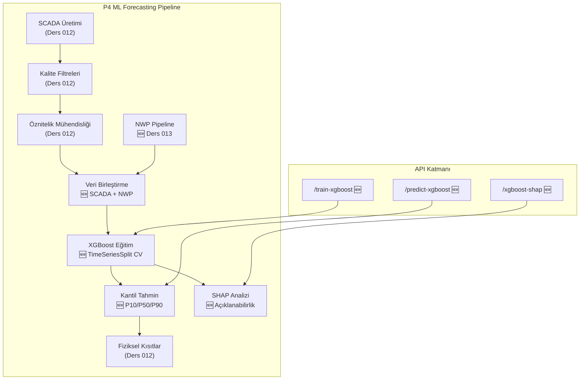

# Ders 013 — XGBoost Kantil Tahminleme: NWP Pipeline, Olasılıksal Güç Tahmini & SHAP Açıklanabilirlik

!!! abstract "Ders Navigasyonu"
    :material-arrow-left: **Önceki:** [Ders 012 — SCADA Veri Hattı: Güç Eğrisi, Sentetik Üretim, Kalite Filtreleri & Kısıtlar](lesson-012.md) | **Sonraki:** [Ders 014 — LSTM Zaman Serisi Tahminleme: MC Dropout ile Belirsizlik Ölçümü](lesson-014.md) :material-arrow-right:

    **Faz:** P4 | **Dil:** Türkçe | **İlerleme:** 14 / 19 | [Tüm Dersler](index.md) | [Öğrenme Yol Haritası](../../Learning_Roadmap.md)

> **Date:** 2026-02-26
> **Commits:** 1 commit (`20775bf` → `20775bf`)
> **Commit range:** `20775bfcb272c24e82d091c9c94707f08833ba1f..20775bfcb272c24e82d091c9c94707f08833ba1f`
> **Phase:** P4 (AI Forecasting)
> **Roadmap sections:** [Phase 4 — Section 4.2 Gradient Boosting (XGBoost), Section 4.4 Wind Power Forecasting]
> **Language:** Turkish
> **Previous lesson:** Lesson 012
> **last_commit_hash:** 20775bfcb272c24e82d091c9c94707f08833ba1f

---

## Ne Öğreneceksiniz

- Sayısal Hava Tahmini (NWP — Numerical Weather Prediction) verilerinin rüzgar enerjisi tahmini için neden kritik olduğunu ve ECMWF HRES benzeri sentetik veri üretmeyi
- XGBoost gradient boosting algoritmasının kantil regresyon (quantile regression) ile olasılıksal P10/P50/P90 güç tahmini üretmesini
- TimeSeriesSplit çapraz doğrulamanın (cross-validation) neden zaman serileri için zorunlu olduğunu ve gelecek sızıntısını (data leakage) nasıl önlediğini
- SHAP (SHapley Additive exPlanations) ile model kararlarını açıklanabilir hale getirmeyi ve öznitelik önem sıralaması çıkarmayı
- Tahmin sonuçlarına fiziksel kısıtlar uygulayarak kantil monotonikliği (P10 ≤ P50 ≤ P90) garanti etmeyi

---

## Bölüm 1: Sentetik NWP Veri Hattı — Atmosferi Simüle Etmek

### Gerçek Dünya Problemi

Bir hava durumu uygulaması düşünün: ekranınızda "yarın 15°C ve güneşli" yazıyor. Peki bu tahmin nereden geliyor? Devasa süper bilgisayarlar atmosferin fizik denklemlerini (Navier-Stokes, termodinamik, nem) ayrık bir ızgara üzerinde çözüyor. İşte NWP (Numerical Weather Prediction — Sayısal Hava Tahmini) modelleri tam olarak bunu yapıyor. Rüzgar çiftliği operatörleri için NWP, yarınki rüzgar hızını bugünden bilmenin tek yolu — çünkü türbin 10 dakika sonra ne kadar elektrik üreteceğini bilmek, enerji ticareti ve şebeke taahhütleri için hayati.

### Standartların Söylediği

**ECMWF HRES** (High-Resolution Forecast) modeli ~9 km yatay çözünürlükte, 137 dikey seviyede çalışır ve 10 güne kadar tahmin üretir. Rüzgar enerjisi tahmini için kritik NWP değişkenleri:

- 100 m rüzgar hızı [m/s] — birincil tahmin değişkeni (predictor)
- 100 m rüzgar yönü [°] — iz etkisi (wake) ve sapma (yaw) düzeltmesi
- 2 m sıcaklık [°C] — hava yoğunluğu düzeltmesi
- Deniz seviyesi basıncı [Pa] — hava yoğunluğu hesabı: ρ = P/(R·T)
- Sınır tabaka yüksekliği [m] — türbülans rejimi göstergesi

**IEC 61400-1 Ed.4** rüzgar profili için güç yasası modelini tanımlar:

> v(z) = v(z_ref) × (z / z_ref)^α — burada α ≈ 0.11 (offshore, açık deniz)

### Ne İnşa Ettik

**Değişen dosyalar:**

- `backend/app/services/p4/nwp_pipeline.py` — Sentetik NWP veri üreteci: ECMWF HRES benzeri 5 değişkenlik tahmin verisi üretir
- `backend/app/services/p4/__init__.py` — NWP ve XGBoost modüllerinin paket düzeyinde dışa aktarımı (re-export)

SCADA "gerçek" ölçümleriyle korelasyonlu ama tahmin süresine (lead time) bağlı artan hata içeren sentetik NWP verisi ürettik. Bu, gerçek dünyada NWP tahmininin zamanla nasıl bozulduğunu simüle ediyor.

### Neden Önemli

> **Neden** ML modeline SCADA verisi yanında NWP verisi de ekliyoruz?
> Çünkü SCADA verileri geçmişi anlatır — "10 dakika önce rüzgar 8 m/s idi." Ama enerji ticareti ve şebeke planlama geleceği bilmeyi gerektirir. NWP, atmosferin fizik denklemlerini çözerek 1-48 saat sonrasını tahmin eder. İkisini birleştirmek modele hem "ne oldu" hem "ne olacak" bilgisini verir.
>
> **Neden** tahmin hatası lead time ile büyüyor?
> Atmosfer kaotik bir sistemdir — küçük başlangıç hataları zamanla katlanarak büyür (Lorenz, 1963). Modelimizde bunu σ(t) = σ_base + σ_growth × lead_hour formülüyle simüle ediyoruz: ilk saatlerde hata ~0.5 m/s iken 48 saat sonra ~5.3 m/s'e çıkıyor.

### Kod İncelemesi

NWP rüzgar hızı üretimi, SCADA ölçümlerine Gauss gürültüsü ekleyerek yapılır. Gürültünün standart sapması tahmin süresine bağlı olarak doğrusal şekilde artar — bu, gerçek NWP tahmin becerisinin (forecast skill) zamanla azalmasını taklit eder.

```python
def _generate_nwp_wind_speed(
    rng: np.random.Generator,
    scada_wind_ms: NDArray[np.float64],
    config: NWPConfig,
) -> NDArray[np.float64]:
    n = len(scada_wind_ms)

    # Tahmin döngüsü: NWP her 6 saatte yeniden başlatılır
    steps_per_cycle = int(config.forecast_horizon_hours * 6)

    lead_hours = np.zeros(n, dtype=np.float64)
    for t in range(n):
        step_in_cycle = t % steps_per_cycle
        lead_hours[t] = step_in_cycle / 6.0  # Adımdan saate dönüşüm

    # Hata lead time ile büyür: σ(t) = σ_base + σ_growth × lead_hour
    sigma = config.sigma_base_ms + config.sigma_growth_ms_per_hour * lead_hours
    noise = rng.normal(0.0, sigma)

    nwp_wind = scada_wind_ms + noise
    return np.maximum(nwp_wind, 0.0)  # Fiziksel kısıt: rüzgar hızı ≥ 0
```

Bu fonksiyon NWP ve SCADA arasındaki korelasyonu korurken, gerçekçi bir şekilde bozulan tahmin doğruluğunu simüle ediyor. `np.maximum(nwp_wind, 0.0)` ile fiziksel olarak imkansız negatif rüzgar hızlarını önlüyoruz.

NWP veri setinin SCADA öznitelik matrisine birleştirilmesi `merge_nwp_features` fonksiyonuyla yapılır. Bu fonksiyon 5 NWP sütununu mevcut SCADA özniteliklerinin sağ tarafına ekler:

```python
def merge_nwp_features(
    scada_features: NDArray[np.float64],
    nwp_dataset: NWPDataset,
    valid_indices: int | None = None,
) -> NDArray[np.float64]:
    n_rows = scada_features.shape[0]

    # NWP'nin SON n_rows satırını al (SCADA, gecikme öznitelikleri
    # nedeniyle baştaki satırları düşürür)
    offset = len(nwp_dataset.wind_speed_100m_ms) - n_rows
    if offset < 0:
        raise ValueError(...)

    nwp_columns = np.column_stack([
        nwp_dataset.wind_speed_100m_ms[offset : offset + n_rows],
        nwp_dataset.wind_direction_100m_deg[offset : offset + n_rows],
        nwp_dataset.temperature_2m_c[offset : offset + n_rows],
        nwp_dataset.pressure_msl_pa[offset : offset + n_rows],
        nwp_dataset.boundary_layer_height_m[offset : offset + n_rows],
    ])

    return np.hstack([scada_features, nwp_columns])
```

Önemli bir detay: SCADA öznitelik mühendisliği (feature engineering) sürecinde gecikme değerleri (lag features) nedeniyle baştaki bazı satırlar düşürülür. `offset` hesabı, NWP verilerinin doğru zaman dilimiyle hizalanmasını garanti ediyor.

### Temel Kavram

!!! tip "Temel Kavram: Tahmin Becerisi Bozunumu (Forecast Skill Degradation)"
    **Basit dille:** Hava durumu tahminini düşünün — yarınki tahmin oldukça güvenilir, ama 5 gün sonrası için tahmin çok daha belirsiz. Bunun nedeni atmosferin "kaotik" olması: küçücük bir ölçüm hatası zamanla kartopu gibi büyür.

    **Benzetme:** Bir bilardo topuna vuruş yapıyorsunuz. İlk çarpışmayı mükemmel tahmin edebilirsiniz. İkinci çarpışmayı da makul doğrulukla. Ama 10. çarpışmayı tahmin etmek neredeyse imkansız — her çarpışmadaki minik açı farkları katlanarak büyür.

    **Bu projede:** NWP rüzgar hızı tahmini 0-6 saat için RMSE ~1.0-1.5 m/s iken, 24-72 saat için 2.5-4.0 m/s'e çıkar. Rüzgar gücü küpsel bağıntı (P ∝ v³) nedeniyle bu hata, güç tahmininde daha da büyük belirsizliğe dönüşür.

---

## Bölüm 2: XGBoost Kantil Regresyon — Olasılıksal Güç Tahmini

### Gerçek Dünya Problemi

Bir yatırım danışmanı düşünün: "Yarın hisse %5 artacak" diyen danışmana güvenir misiniz? Muhtemelen hayır — çünkü belirsizlik yok. Ama "yarın %70 olasılıkla %3-7 arasında artış bekliyorum" diyen danışman çok daha güvenilir. Rüzgar enerjisi tahmini de aynı mantıkla çalışır: tek bir sayı yerine, bir belirsizlik aralığı vermek operatörün daha iyi kararlar almasını sağlar.

### Standartların Söylediği

**IEC 61400-26-1** (Availability and Uncertainty) güç tahminleri için belirsizlik miktarlandırmasını (uncertainty quantification) zorunlu kılar. P10/P50/P90 aralıkları doğrudan operasyonel kararlara eşlenir:

- **P90**: Muhafazakar tahmin — şebeke taahhüdü için (%90 aşılma olasılığı)
- **P50**: Merkezi tahmin — enerji ticareti için (medyan)
- **P10**: İyimser tahmin — bakım planlaması için

**Beceri puanı (Skill Score)** modeli basit bir temel çizgiye (baseline) karşı değerlendirir:

> SS = 1 - RMSE_model / RMSE_persistence

Burada persistence (kalıcılık) tahmini: "bir sonraki değer, şimdiki değere eşittir" — P(t+1) = P(t). SS > 0 ise model bu naif yaklaşımı yeniyor demektir.

### Ne İnşa Ettik

**Değişen dosyalar:**

- `backend/app/services/p4/xgboost_model.py` — XGBoost kantil regresyon modeli: eğitim, tahmin ve SHAP hesaplama
- `backend/app/schemas/forecast.py` — 6 yeni Pydantic şeması (request/response modelleri)
- `backend/app/routers/p4.py` — 3 yeni API endpoint: train-xgboost, predict-xgboost, xgboost-shap

Her kantil seviyesi (P10, P50, P90) için ayrı bir XGBoost modeli eğitiyoruz. Bu modeller **pinball loss** (kantil kaybı) fonksiyonu ile optimize ediliyor:

> L_τ(y, ŷ) = τ × max(y-ŷ, 0) + (1-τ) × max(ŷ-y, 0)

### Neden Önemli

> **Neden** tek bir tahmin yerine 3 kantil (P10/P50/P90) üretiyoruz?
> Tek nokta tahmini (point forecast) operatöre "yarın 8 MW" der. Ama 8 MW ± ne kadar? P10/P50/P90 ile operatör şunu öğrenir: "%80 olasılıkla güç P10 ile P90 arasında olacak." Bu bilgi enerji ticaretinde milyonlarca Euro'luk fark yaratabilir — P90 ile taahhüt edersen ceza riskini minimize edersin, P50 ile daha agresif ticaret yapabilirsin.
>
> **Neden** XGBoost seçtik, lineer regresyon değil?
> Rüzgar gücü denklemi P = ½ρACpv³ nedeniyle güç-rüzgar hızı ilişkisi doğrusal değil, küpseldir. Ayrıca türbülans yoğunluğu × rüzgar hızı gibi öznitelik etkileşimleri var. XGBoost'un karar ağaçları (decision trees) bu doğrusal olmayan ilişkileri doğal olarak yakalayabilir — lineer regresyon bunu yapamaz.

### Kod İncelemesi

XGBoost'un kantil regresyon için kullandığı pinball loss fonksiyonu, modeli belirli bir kantil seviyesine doğru "çeker." τ=0.10 için model düşük tahminleri ağır cezalandırır (çünkü gerçek değerin %90'ının üstünde olmasını istiyoruz), τ=0.90 için ise yüksek tahminleri cezalandırır.

```python
def _train_quantile_model(
    x_train: NDArray[np.float64],
    y_train: NDArray[np.float64],
    x_val: NDArray[np.float64],
    y_val: NDArray[np.float64],
    quantile: float,
    config: XGBoostConfig,
) -> xgb.Booster:
    """Tek bir kantil seviyesi için XGBoost modeli eğit."""
    dtrain = xgb.DMatrix(x_train, label=y_train)
    dval = xgb.DMatrix(x_val, label=y_val)

    params: dict[str, object] = {
        "objective": "reg:quantileerror",  # Kantil regresyon hedefi
        "quantile_alpha": quantile,         # τ = 0.10, 0.50 veya 0.90
        "max_depth": config.max_depth,      # Ağaç derinliği → karmaşıklık
        "learning_rate": config.learning_rate,  # Adım küçültme
        "seed": config.seed,
        "verbosity": 0,
    }

    model = xgb.train(
        params,
        dtrain,
        num_boost_round=config.n_estimators,
        evals=[(dval, "val")],
        early_stopping_rounds=config.early_stopping_rounds,  # Erken durma
        verbose_eval=False,
    )
    return model
```

`"objective": "reg:quantileerror"` anahtarıdır — XGBoost'a standart MSE yerine pinball loss optimize etmesini söyler. `early_stopping_rounds=50` ise doğrulama (validation) kaybı 50 tur boyunca iyileşmezse eğitimi durdurur. Bu, aşırı öğrenmeyi (overfitting) önlemenin zarif bir yoludur.

Tahmin aşamasında üç modelin çıktıları fiziksel kısıtlardan geçirilir ve ardından kantil monotonikliği zorlanır:

```python
# Her kantil modeli ile tahmin yap
for model in models:
    pred = model.predict(dmatrix)
    raw_predictions.append(pred)

# Fiziksel kısıtları her kantile uygula (0 ≤ P ≤ 15 MW, cut-in/cut-out)
for pred in raw_predictions:
    result = enforce_physical_constraints(power_mw=pred, wind_speed_ms=wind_speed_ms)
    constrained.append(result.power_mw)

p10, p50, p90 = constrained[0], constrained[1], constrained[2]

# Monotoniklik zorla: P10 ≤ P50 ≤ P90
p50 = np.maximum(p50, p10)
p90 = np.maximum(p90, p50)
```

Bu son adım kritiktir: üç bağımsız model eğittiğimiz için, nadir durumlarda P50 < P10 veya P90 < P50 olabilir. `np.maximum` zinciri bu fiziksel tutarsızlığı düzeltir — %10'luk kantil hiçbir zaman %50'lik kantilden büyük olamaz.

### Temel Kavram

!!! tip "Temel Kavram: Pinball Loss (Kantil Kayıp Fonksiyonu)"
    **Basit dille:** Normal regresyon "tahmin ile gerçek arasındaki farkı minimize et" der ve yukarı-aşağı hataları eşit cezalandırır. Kantil regresyon ise "bu yöndeki hatalar daha pahalı" diyebilir — tıpkı bir otobüs şoförü gibi: 2 dakika erken gelmek küçük sorun, 2 dakika geç kalmak yolcuları kaçırmak demek.

    **Benzetme:** Bir sınava hazırlanıyorsunuz. Eğer sınavda "en az 70 al" derlerse (P90 = muhafazakar), 80'e çalışırsınız — güvenlik payı bırakırsınız. Ama "ortalama not yeter" derlerse (P50 = medyan), tam hedefe odaklanırsınız. Pinball loss bu asimetrik cezalandırmayı matematiksel olarak ifade eder.

    **Bu projede:** P90 kantili ile şebeke operatörüne "bu gücü %90 olasılıkla garanti ederim" diyoruz. Gerçek güç bunun altında kalırsa dengeleme maliyeti (balancing cost) devreye girer — çok pahalı. Bu yüzden P90 muhafazakar (düşük) tahmin yapar.

---

## Bölüm 3: TimeSeriesSplit — Gelecek Sızıntısını Önleme Sanatı

### Gerçek Dünya Problemi

Yarınki gazete manşetlerini bildiğiniz bir dünyada hisse senedi ticareti yapın — her zaman kazanırsınız! Ama bu hile yapmaktır. Standart k-fold çapraz doğrulama (cross-validation) zaman serisi verilerinde tam olarak bunu yapar: eğitim verisine gelecekten örnekler karışabilir. TimeSeriesSplit bu problemi çözer.

### Standartların Söylediği

Zaman serisi modellemede **gelecek sızıntısı (data leakage)** en yaygın ve en tehlikeli hatadır. Hyndman & Athanasopoulos (*Forecasting: Principles and Practice*) açıkça belirtir: "Zaman serisi çapraz doğrulamada, eğitim seti her zaman test setinden kronolojik olarak ÖNCE olmalıdır."

TimeSeriesSplit her fold'da eğitim setini genişleterek bunu garanti eder:

> Fold 1: eğitim [0..N/5], test [N/5..2N/5]
> Fold 2: eğitim [0..2N/5], test [2N/5..3N/5]
> ...
> Fold 5: eğitim [0..4N/5], test [4N/5..N]

### Ne İnşa Ettik

**Değişen dosyalar:**

- `backend/app/services/p4/xgboost_model.py` — `train_xgboost()` fonksiyonu: 5-fold TimeSeriesSplit CV
- `backend/tests/test_xgboost_model.py` — `TestXGBoostTraining` sınıfı: zaman sırası doğrulaması

### Neden Önemli

> **Neden** standart k-fold CV kullanmıyoruz?
> Standart k-fold rastgele karıştırır (shuffle) — bu, Ocak 2024'ten bir örnekle Mart 2024'ü tahmin etmeye çalışırken Şubat 2024'ü eğitim setinde kullanmak demek. Model "geleceği bilmiş" olur ve test metriği gerçekçi olmayan şekilde yüksek çıkar. TimeSeriesSplit bu hileyi imkansız kılar.
>
> **Neden** her fold'da eğitim seti büyüyor (expanding window)?
> Gerçek dünyada bir model dağıtıldığında (deploy), ona verdiğiniz veri her gün büyür. Expanding window bu gerçekliği simüle eder — model ne kadar çok geçmiş veri ile eğitilirse, o kadar güçlü olur.

### Kod İncelemesi

Eğitim fonksiyonu her fold'da 3 kantil modeli eğitir ve P50 modeli üzerinden metrikleri hesaplar. Son fold'un modelleri üretim (production) modelleri olarak döndürülür.

```python
def train_xgboost(
    features: NDArray[np.float64],
    target_power_mw: NDArray[np.float64],
    config: XGBoostConfig | None = None,
) -> tuple[CVResult, list[xgb.Booster]]:
    tscv = TimeSeriesSplit(n_splits=config.n_cv_splits)
    fold_metrics_list: list[FoldMetrics] = []

    for fold_idx, (train_idx, test_idx) in enumerate(tscv.split(features)):
        x_train, y_train = features[train_idx], target_power_mw[train_idx]
        x_test, y_test = features[test_idx], target_power_mw[test_idx]

        # Her kantil için ayrı model eğit
        fold_models: list[xgb.Booster] = []
        for quantile in config.quantiles:  # (0.10, 0.50, 0.90)
            model = _train_quantile_model(
                x_train, y_train, x_test, y_test, quantile, config
            )
            fold_models.append(model)

        # P50 modeli ile değerlendirme (medyan = merkezi tahmin)
        dtest = xgb.DMatrix(x_test)
        y_pred = fold_models[1].predict(dtest)  # index 1 = P50
        metrics = _compute_metrics(y_test, y_pred, fold_idx)
        fold_metrics_list.append(metrics)

    # Persistence baseline ile karşılaştır
    persistence_rmse = _compute_persistence_rmse(target_power_mw)
    skill_score = 1.0 - mean_rmse / persistence_rmse
```

Beceri puanı (skill score) hesabı özellikle önemlidir. Persistence baseline en basit tahmin yöntemidir: "bir sonraki güç değeri, şimdiki güce eşittir." Herhangi bir ML modeli en azından bunu yenmeli — aksi takdirde model eklemenin anlamı yoktur.

```python
def _compute_persistence_rmse(target: NDArray[np.float64]) -> float:
    """Persistence baseline RMSE: P(t+1) = P(t)."""
    persistence_pred = target[:-1]  # Şimdiki değer = sonrakinin tahmini
    actual = target[1:]              # Gerçek sonraki değer
    return float(np.sqrt(np.mean((actual - persistence_pred) ** 2)))
```

Test takımında bu zaman sıralamasını doğrudan kontrol eden bir test var — bu, en kritik testlerden biri:

```python
def test_cv_folds_respect_time_order(self, merged_features, target_power):
    """TimeSeriesSplit asla eğitimde gelecek veri kullanmaz."""
    tscv = TimeSeriesSplit(n_splits=3)
    prev_test_max = -1
    for train_idx, test_idx in tscv.split(merged_features):
        # Tüm eğitim indeksleri test indekslerinden ÖNCE
        assert np.max(train_idx) < np.min(test_idx)
        # Fold'lar ilerleyici — örtüşme yok
        assert np.min(test_idx) > prev_test_max
        prev_test_max = int(np.max(test_idx))
```

Bu test, TimeSeriesSplit'in sözleşmesini (contract) doğruluyor: eğitim verisinin son noktası her zaman test verisinin ilk noktasından küçük.

### Temel Kavram

!!! tip "Temel Kavram: Gelecek Sızıntısı (Data Leakage)"
    **Basit dille:** Sınav sorularını önceden görmek gibi düşünün. Notunuz yüksek çıkar ama gerçek bilginizi yansıtmaz. Makine öğrenmesinde gelecekten veri sızdığında model "sınavda kopya çekmiş" olur — eğitim metriği harika görünür, gerçek dünyada başarısız olur.

    **Benzetme:** Bir aşçı yeni tarif deniyor. Eğer tabağı tatmadan önce müşteriye "bu harika" derse, bu iddianın değeri yoktur. TimeSeriesSplit aşçının "sadece müşteri yedikten sonra puan verme" kuralıdır.

    **Bu projede:** 1 yıllık 10-dakikalık SCADA verisi var (52.560 zaman adımı). TimeSeriesSplit ile ilk %60'ı eğitim, sonraki %20'si test olarak kullanıyoruz. Model Ocak-Temmuz verisiyle eğitilip Ağustos-Ekim verisinde değerlendirilir — asla tersi değil.

---

## Bölüm 4: SHAP Açıklanabilirlik — Model Ne Düşünüyor?

### Gerçek Dünya Problemi

Doktorunuz "ilaç değişiyoruz" dese ve nedenini sormadan kabul eder misiniz? Büyük olasılıkla "neden?" diye sorarsınız. Makine öğrenmesi modelleri de aynı sorgulamayı hak eder. Bir XGBoost modeli "yarın 12 MW" dediğinde, operatörün "bu tahmini hangi öznitelikler domine ediyor?" sorusuna cevap verebilmesi güven ve güvenlik açısından kritiktir.

### Standartların Söylediği

Rüzgar enerjisi sektöründe **IEA Wind Task 36** tahmin modellerinin şeffaflığını (transparency) vurgular. SHAP (Lundberg & Lee, 2017) oyun teorisindeki Shapley değerlerini makine öğrenmesine uygular:

> f(x) = E[f(X)] + Σ φ_j(x)

Her tahmin, baz değer (ortalama tahmin) + her özniteliğin marjinal katkısı (Shapley değeri) olarak ayrıştırılır.

### Ne İnşa Ettik

**Değişen dosyalar:**

- `backend/app/services/p4/xgboost_model.py` — `compute_shap_values()`: TreeExplainer ile SHAP hesaplama
- `backend/app/routers/p4.py` — `/xgboost-shap` endpoint
- `backend/tests/test_xgboost_model.py` — `TestSHAPExplainability`: 4 test (şekil, boş olmama, isim eşleşme, toplam özelliği)

### Neden Önemli

> **Neden** sadece öznitelik önemine (feature importance) değil, SHAP değerlerine ihtiyacımız var?
> XGBoost'un dahili öznitelik önemi (gain, cover) modele özeldir ve tutarsız olabilir. SHAP ise oyun teorisi temelli matematiksel garantiler sunar: tüm özniteliklerin Shapley değerlerinin toplamı, tahmini baz değerden sapma kadar verir. Bu "tutarlı ayrıştırma" özelliği SHAP'ı altın standart yapar.
>
> **Neden** P50 modeli üzerinde SHAP hesaplıyoruz, P10 veya P90 değil?
> P50 merkezi tahmindir — modelin "en iyi tek tahmini." Öznitelik önem sıralaması bu model üzerinden daha anlamlıdır çünkü P10/P90 kasıtlı olarak sapmalı (biased) modellerdir.

### Kod İncelemesi

SHAP hesaplama fonksiyonu `TreeExplainer` kullanır — bu, ağaç tabanlı modeller için O(TLD) karmaşıklığında tam (exact) Shapley değerleri hesaplar (T=ağaç sayısı, L=yaprak sayısı, D=derinlik).

```python
def compute_shap_values(
    model_p50: xgb.Booster,
    features: NDArray[np.float64],
    feature_names: list[str],
) -> SHAPResult:
    import shap  # Tembel import: SHAP'ın numba bağımlılığı ağır

    explainer = shap.TreeExplainer(model_p50)
    shap_values_raw = explainer.shap_values(features)
    shap_array = np.asarray(shap_values_raw, dtype=np.float64)

    # Global öznitelik önemi: ortalama |SHAP| değeri
    mean_abs_shap = np.mean(np.abs(shap_array), axis=0)
    importance_dict: dict[str, float] = {}
    for i, name in enumerate(feature_names):
        importance_dict[name] = round(float(mean_abs_shap[i]), 6)

    # Azalan sırada sırala
    importance_dict = dict(
        sorted(importance_dict.items(), key=lambda x: x[1], reverse=True)
    )

    return SHAPResult(
        shap_values=shap_array,
        feature_names=feature_names,
        feature_importance=importance_dict,
    )
```

`import shap` satırının fonksiyon içinde (lazy import) olmasına dikkat edin. SHAP kütüphanesinin numba bağımlılığı başlangıçta yüklenmesi yavaştır — sadece gerçekten ihtiyaç duyulduğunda import edilir. Bu, API sunucusunun başlangıç süresini optimize eder.

Test takımında SHAP'ın temel matematiksel özelliğini doğrulayan bir test var:

```python
def test_shap_values_sum_property(self, ...):
    """SHAP değerleri yaklaşık olarak tahmini - beklenen değer'e toplanır.
    TreeExplainer için: f(x) = E[f(X)] + Σ φ_j(x)"""
    shap_sum = np.sum(result.shap_values, axis=1)
    # SHAP toplamları anlamlı varyans göstermeli (hepsi sıfır değil)
    assert np.std(shap_sum) > 0.0, "SHAP değerleri hepsi sıfır"
```

Bu test, SHAP'ın "etkililik" (efficiency) aksiyomunu doğruluyor — Shapley değerlerinin toplamı, modelin tahminini açıklayabilmelidir.

### Temel Kavram

!!! tip "Temel Kavram: Shapley Değerleri ve Adil Dağıtım"
    **Basit dille:** Üç arkadaş birlikte bir proje yapıyor ve 100 TL ödül kazanıyorlar. Her birinin ne kadar alacağını nasıl belirlersiniz? Shapley değerleri tam olarak bunu yapar: her kişinin (özniteliğin) tüm olası takım kombinasyonlarındaki ortalama marjinal katkısını hesaplar.

    **Benzetme:** Bir futbol takımında 3 oyuncu var: A, B, C. Eğer sadece A oynarsa 2 gol atar, A+B beraber 5 gol atar, A+B+C beraber 8 gol atar. B'nin katkısı "A ile birlikte 3 gol ekledi" ama "tek başına 1 gol atar." Shapley değeri tüm bu kombinasyonların ortalamasını alarak B'nin "adil" katkısını bulur.

    **Bu projede:** SHAP her tahmin için "rüzgar hızı bu tahmini +3.2 MW yükseltti, sıcaklık -0.4 MW düşürdü, NWP basıncı +0.1 MW ekledi" gibi bir ayrıştırma sunar. Bu, modelin hangi fiziksel mekanizmalardan yararlandığını doğrudan gösterir.

---

## Bölüm 5: API Entegrasyonu ve Uçtan Uca Pipeline

### Gerçek Dünya Problemi

Dünyanın en iyi ML modeli bile bir API arkasında erişilebilir değilse, üretimde değersizdir. Tıpkı bir restoran mutfağının harika yemek yapması ama garson olmaması gibi — yemek müşteriye ulaşamaz. REST API, ML modelimizin "garsonu"dur.

### Standartların Söylediği

Projemizin API tasarımı `docs/SKILL.md` konvansiyonlarını takip eder: tüm P4 endpoint'leri `/api/v1/forecast/` prefix'i altında, kaynak tabanlı (resource-based) URL yapısıyla sunulur.

### Ne İnşa Ettik

**Değişen dosyalar:**

- `backend/app/routers/p4.py` — 3 yeni endpoint + paylaşımlı `_build_xgboost_pipeline()` yardımcı fonksiyonu
- `backend/app/schemas/forecast.py` — `XGBoostTrainRequest/Response`, `XGBoostPredictRequest/Response`, `SHAPRequest/Response`

Üç yeni endpoint:

| Endpoint | Metod | Ne Yapar |
|----------|-------|----------|
| `/api/v1/forecast/train-xgboost` | POST | SCADA → filtre → öznitelik → NWP → XGBoost eğitim → CV metrikleri |
| `/api/v1/forecast/predict-xgboost` | POST | Eğit + P10/P50/P90 tahmin üret |
| `/api/v1/forecast/xgboost-shap` | POST | Eğit + SHAP öznitelik önemi hesapla |

### Neden Önemli

> **Neden** `_build_xgboost_pipeline()` yardımcı fonksiyonu oluşturduk?
> Üç endpoint de aynı veri hazırlama adımlarını paylaşır: SCADA üret → kalite filtrele → öznitelik çıkar → NWP birleştir. Bu tekrarı bir fonksiyona çıkarmak DRY (Don't Repeat Yourself) ilkesine uyar ve bir hatayı tek yerde düzeltmeyi mümkün kılar.
>
> **Neden** her endpoint kendi modelini eğitiyor (stateful değil)?
> Bu eğitimsel bir proje — her istek bağımsız ve tekrarlanabilir. Üretim sisteminde modeller önceden eğitilir ve Redis/dosya sisteminde saklanır. Ama öğrenme amacıyla, her istekte pipeline'ın tam döngüsünü görmek daha öğreticidir.

### Kod İncelemesi

Pipeline yardımcı fonksiyonu, Ders 012'de öğrendiğimiz tüm adımları tek bir akışta birleştirir:

```python
def _build_xgboost_pipeline(
    num_turbines: int, num_timesteps: int,
    turbine_index: int, seed: int | None,
) -> tuple[np.ndarray, np.ndarray, np.ndarray, np.ndarray, list[str]]:
    """Tam veri hattı: SCADA → filtre → öznitelik → NWP birleştirme."""
    dataset = generate_scada_dataset(config)          # 1) Sentetik SCADA üret
    filter_result = apply_all_quality_filters(...)     # 2) 5 kalite filtresi
    eng_features = engineer_features(...)              # 3) Öznitelik mühendisliği
    nwp_dataset = generate_nwp_dataset(...)            # 4) NWP verisi üret
    merged_features = merge_nwp_features(...)          # 5) SCADA + NWP birleştir
    return merged_features, target_power, wind_speed, timestamps, feature_names
```

Her adım bir öncekinin çıktısını alır — tam bir veri hattı (pipeline). Bu yapı, Ders 012'deki güç eğrisi → SCADA → filtre → öznitelik zincirinin doğal uzantısıdır, şimdi NWP ve ML eğitimi eklenmiştir.

### Temel Kavram

!!! tip "Temel Kavram: Uçtan Uca ML Pipeline"
    **Basit dille:** Bir fabrikanın montaj hattını düşünün: hammadde girer → kesim → kaynak → boya → kalite kontrol → ürün çıkar. ML pipeline da aynı: ham veri girer → temizleme → öznitelik çıkarma → model eğitimi → tahmin çıkar. Her adım bir öncekine bağlıdır ve zincirin herhangi bir halkası zayıfsa sonuç da zayıf olur.

    **Benzetme:** Yemek tarifi gibi düşünün — malzemeleri doğramadan (öznitelik mühendisliği) pişirmeye (model eğitimi) geçemezsiniz. Ve bayat malzeme (kalitesiz veri) kullanırsanız yemek (tahmin) kötü olur.

    **Bu projede:** Pipeline 6 adımdan oluşur: SCADA üretimi → kalite filtresi → öznitelik çıkarma → NWP üretimi → veri birleştirme → XGBoost eğitim/tahmin. Bu 6 adım tek bir API çağrısıyla çalışır — kullanıcı sadece "eğit" der, gerisini sistem halleder.

---

## Bölüm 6: Test Stratejisi — 20 Test ile Güvence Ağı

### Gerçek Dünya Problemi

Bir paraşütçü düşünün: paraşütünü açmadan önce 15 farklı kontrol noktasını tek tek inceler. Herhangi biri başarısız olursa atlamaz. Yazılım testleri de ML modelleri için aynı güvence ağını sağlar — özellikle fiziksel sistemleri kontrol eden modellerde.

### Standartların Söylediği

Test piramidi: birim testleri (unit tests) en çok, entegrasyon testleri ortada, uçtan uca testler en az. ML testleri için ek kural: model çıktılarının fiziksel anlamlılığını kontrol et (negatif güç yok, nominal aşımı yok, kantil monotonikliği).

### Ne İnşa Ettik

**Değişen dosyalar:**

- `backend/tests/test_xgboost_model.py` — 20 test, 6 test sınıfında organize

| Sınıf | Test Sayısı | Ne Test Eder |
|-------|-------------|--------------|
| `TestNWPPipeline` | 9 | NWP şekil, aralık, hizalama, bağımsız üretim |
| `TestXGBoostTraining` | 6 | CV fold sayısı, RMSE eşiği, R² pozitifliği |
| `TestQuantileForecasting` | 2 | P10≤P50≤P90 monotonikliği, dizi uzunlukları |
| `TestPhysicalConstraints` | 2 | Negatif güç yok, nominal aşımı yok |
| `TestPersistenceBaseline` | 1 | Beceri puanı > 0 (model persistence'ı yener) |
| `TestSHAPExplainability` | 4 | SHAP şekli, boş olmama, isim eşleşme, toplam özelliği |

### Neden Önemli

> **Neden** "model persistence'ı yener" testine ihtiyacımız var?
> Karmaşık bir ML modeli en basit referans noktasını (persistence) yenmiyorsa, o modele güvenilmez. Bu test bir "sağlık kontrolü" (sanity check) — modelin gerçekten öğrenip öğrenmediğini doğrular. Eğer beceri puanı ≤ 0 ise, modelde veya veri hattında bir sorun var demektir.
>
> **Neden** kantil monotonikliği ayrı bir test olarak var?
> Üç bağımsız model eğittiğimiz için P10 > P50 durumu matematiksel olarak mümkündür (ancak fiziksel olarak anlamsızdır). Bu test, `predict_xgboost` fonksiyonundaki monotonicity enforcement'ın doğru çalıştığını garanti eder.

### Kod İncelemesi

Testlerin `scope="module"` fixture'ları ile bir kere eğitilip tüm testlerde paylaşılan model:

```python
@pytest.fixture(scope="module")
def trained_result(merged_features, target_power):
    """Hızlı testler için küçük konfigürasyon ile XGBoost eğit."""
    config = XGBoostConfig(
        n_estimators=50,    # Üretimde 500, test için 50
        max_depth=4,        # Üretimde 8, test için 4
        learning_rate=0.1,  # Üretimde 0.05, test için 0.1
        early_stopping_rounds=10,
        n_cv_splits=3,      # Üretimde 5, test için 3
        seed=42,
    )
    return train_xgboost(merged_features, target_power, config)
```

`scope="module"` kritik bir optimizasyondur — XGBoost eğitimi saniyeler sürer, her test için tekrar eğitmek test takımını dakikalarca yavaşlatır. Modül seviyesi fixture modeli bir kez eğitir ve 20 testte paylaşır.

### Temel Kavram

!!! tip "Temel Kavram: ML Model Test Piramidi"
    **Basit dille:** Normal yazılımda bir fonksiyonun doğru çıktı verdiğini test edersiniz. ML testlerinde ise "çıktı fiziksel olarak anlamlı mı?" sorusunu da sormalısınız. Güç tahmini -3 MW olamaz, rüzgar hızı negatif olamaz, P10 > P90 olamaz.

    **Benzetme:** Bir fabrikada kalite kontrol sadece "ürün var mı?" değil, "ölçüler tolerans içinde mi, renk doğru mu, dayanıklılık yeterli mi?" kontrol eder. ML testleri de çıktı varlığı ötesinde, fiziksel tutarlılık, istatistiksel anlamlılık ve referans noktası karşılaştırması yapar.

    **Bu projede:** 20 testimiz 3 katmanlı: (1) veri katmanı — NWP şekli ve aralıkları doğru mu? (2) model katmanı — RMSE makul mü, persistence yenildi mi? (3) fizik katmanı — tahminler 0-15 MW aralığında mı, kantiller monoton mu?

---

## Bağlantılar

**Bu kavramların kullanılacağı yerler:**

- **NWP pipeline (Bölüm 1)** → P4'ün LSTM ve Temporal Fusion Transformer modelleri de aynı NWP özniteliklerini girdi olarak kullanacak — pipeline yeniden kullanılır.
- **Kantil regresyon (Bölüm 2)** → TFT (Temporal Fusion Transformer) yerleşik olarak çok-horizonlu kantil tahminleme destekler — XGBoost kantillerle doğrudan karşılaştırma yapılacak.
- **TimeSeriesSplit (Bölüm 3)** → LSTM eğitiminde de aynı CV stratejisi kullanılacak, ancak sequence length (dizi uzunluğu) ek parametre olarak eklenecek.
- **SHAP açıklanabilirlik (Bölüm 4)** → TFT'nin dahili attention mekanizması ile SHAP karşılaştırması — iki farklı açıklanabilirlik yaklaşımı.
- Ders 012'deki **fiziksel kısıtlar** burada tahmin sonuçlarına doğrudan uygulandı — `enforce_physical_constraints()` fonksiyonu yeniden kullanıldı.

---

## Büyük Resim

*Bu dersin odağı: **XGBoost ML tahmini, NWP veri entegrasyonu ve SHAP açıklanabilirlik katmanının P4 pipeline'a eklenmesi**.*



*Tam sistem mimarisi için: [Dersler Genel Bakış](index.md#system-architecture)*

---

## Temel Çıkarımlar

1. **NWP verileri, ML modellerini geçmişten geleceğe taşır** — SCADA geçmişi anlatır, NWP geleceği tahmin eder; ikisi birlikte daha güçlü tahminler üretir.
2. **Kantil regresyon (pinball loss) ile tek sayı yerine belirsizlik aralığı vermek**, enerji ticareti ve şebeke yönetiminde milyon Euro'luk fark yaratabilir.
3. **TimeSeriesSplit, zaman serisi ML'de altın standarttır** — standart k-fold'un aksine gelecek sızıntısını önler ve eğitim metriklerinin gerçekçi olmasını garanti eder.
4. **Beceri puanı (skill score) her ML modelinin geçmesi gereken minimum eşiktir** — persistence baseline'ı yenemeyen bir model, gerçek dünyada değersizdir.
5. **SHAP, model kararlarını matematiksel olarak adil bir şekilde ayrıştırır** — oyun teorisi temelli Shapley değerleri, her özniteliğin tahmine katkısını kesin olarak hesaplar.
6. **Fiziksel kısıtlar + kantil monotonikliği, ML çıktılarını fiziksel gerçeklikle bağlar** — model ne kadar güçlü olursa olsun, 15 MW'ın üstünde veya 0'ın altında tahmin yapmamalıdır.
7. **`scope="module"` fixture'ları test süresini dramatik şekilde azaltır** — pahalı ML eğitimini bir kere yapıp 20 testte paylaşmak, dakikalar yerine saniyeler süren test takımı demektir.

---

## Önerilen Okumalar

*[Öğrenme Yol Haritası](../../Learning_Roadmap.md) — Phase 4: Machine Learning for Energy*

| Kaynak | Tür | Neden Okumalısınız |
|--------|-----|--------------------|
| Chen & Guestrin (2016) — *XGBoost: A Scalable Tree Boosting System* | Orijinal makale | XGBoost'un gradient boosting + regularizasyon mekanizmasını orijinal kaynak belgeden öğrenmek için |
| Lundberg & Lee (2017) — *SHAP Values* | Orijinal makale | Shapley değerlerinin ML açıklanabilirliğine uygulanmasının matematiksel temelini anlamak için |
| Hyndman & Athanasopoulos — *Forecasting: Principles and Practice* (3rd Ed.) | Online ders kitabı (ücretsiz) | TimeSeriesSplit, çapraz doğrulama ve zaman serisi değerlendirme metriklerinin referans kaynağı |
| IEA Wind TCP Task 36 — *Forecasting for Wind Power* | Rapor (ücretsiz) | Rüzgar enerjisi tahmininin endüstri standartlarını ve en iyi uygulamalarını öğrenmek için |
| XGBoost Documentation | Yazılım belgeleri (ücretsiz) | `reg:quantileerror` hedef fonksiyonu ve hiperparametre ayarlarının teknik detayları |

---

## Sınav — Anlayışınızı Test Edin

### Hatırlama Soruları

**S1:** NWP tahmin hatası (forecast error) lead time ile nasıl değişir ve modelimizde bu nasıl simüle ediliyor?

<details>
<summary>Cevap</summary>

NWP tahmin hatası lead time (tahmin süresi) ile doğrusal olarak büyür çünkü atmosfer kaotik bir sistemdir. Modelimizde bu `σ(t) = σ_base + σ_growth × lead_hour` formülüyle simüle ediliyor: σ_base = 0.5 m/s (analiz/başlatma hatası) ve σ_growth = 0.1 m/s/saat (tahmin bozunma oranı). 48 saatlik bir tahmin için toplam hata standart sapması ~5.3 m/s'e ulaşır.

</details>

**S2:** XGBoost kantil regresyonda P10, P50 ve P90 kantillerinin operasyonel anlamları nelerdir?

<details>
<summary>Cevap</summary>

P90 muhafazakar tahmindir — gerçek gücün %90 olasılıkla bu değerin üstünde olacağını söyler; şebeke taahhüdü için kullanılır. P50 medyan tahmindir — merkezi tahmin olarak enerji ticaretinde kullanılır. P10 iyimser tahmindir — bakım planlaması için kullanılır. %80'lik tahmin aralığı (P10-P90 arası) operatöre belirsizliği sayısal olarak gösterir.

</details>

**S3:** `_build_xgboost_pipeline()` fonksiyonu hangi 6 adımı sırasıyla gerçekleştirir?

<details>
<summary>Cevap</summary>

Pipeline 6 ardışık adımdan oluşur: (1) Sentetik SCADA verisi üretimi (`generate_scada_dataset`), (2) 5-katmanlı kalite filtresi uygulama (`apply_all_quality_filters`), (3) Öznitelik mühendisliği — lag, rolling, döngüsel kodlama (`engineer_features`), (4) NWP sentetik veri üretimi (`generate_nwp_dataset`), (5) SCADA ve NWP özniteliklerini birleştirme (`merge_nwp_features`), (6) Hedef değişken (güç) hizalama ve döndürme.

</details>

### Anlama Soruları

**S4:** Neden standart k-fold cross-validation zaman serisi verilerinde kullanılmamalıdır? TimeSeriesSplit bu sorunu nasıl çözer?

<details>
<summary>Cevap</summary>

Standart k-fold verileri rastgele karıştırır, bu da eğitim setine gelecekteki zaman adımlarının sızmasına neden olur (data leakage). Model "geleceği bilerek" tahmin yapar ve test metrikleri gerçekçi olmayan şekilde yüksek çıkar. TimeSeriesSplit ise kronolojik sırayı korur: her fold'da eğitim seti her zaman test setinden önce gelir, eğitim penceresi genişleyerek büyür (expanding window). Bu, modelin gerçek dünya dağıtımını simüle eder — yeni veri geldikçe daha fazla geçmiş veriye sahip olursunuz.

</details>

**S5:** SHAP'ın TreeExplainer'ı neden ağaç tabanlı modeller için "exact" (kesin) Shapley değerleri hesaplayabilir, ama rastgele bir sinir ağı için hesaplayamaz?

<details>
<summary>Cevap</summary>

Karar ağaçlarında her örneklem belirli bir yaprak düğümüne düşer ve yol boyunca yapılan karar bölünmeleri (splits) izlenebilir. TreeExplainer bu yapıyı kullanarak tüm olası öznitelik koalisyonlarını verimli şekilde (polinom zamanda) hesaplar. Sinir ağlarında ise gizli katmanlar ve sürekli aktivasyonlar nedeniyle böyle bir yapısal ayrıştırma mümkün değildir — yaklaşık yöntemler (KernelSHAP, DeepSHAP) kullanmak gerekir, bunlar hesaplama süresi ve kesinlik arasında ödün verir.

</details>

**S6:** Kantil monotonikliği (P10 ≤ P50 ≤ P90) zorlamasına neden ihtiyaç var? Üç model zaten farklı kantilleri hedefliyorsa, neden doğal olarak monoton olmuyorlar?

<details>
<summary>Cevap</summary>

Her kantil modeli bağımsız olarak eğitilir — farklı pinball loss fonksiyonları optimize eder ve farklı ağaç yapıları öğrenir. Nadir durumlarda (özellikle düşük veri bölgelerinde veya aşırı rüzgar koşullarında) P50 modeli P10'dan daha düşük, veya P90 modeli P50'den daha düşük tahmin üretebilir. Bu fiziksel olarak anlamsızdır (%10'luk kantil %50'likten büyük olamaz). `np.maximum` zinciri ile post-processing adımında bu tutarsızlık düzeltilir.

</details>

### Zorluk Sorusu

**S7:** Mevcut XGBoost pipeline'ı stateless — her API çağrısında model sıfırdan eğitiliyor. Bunu production-grade bir sisteme dönüştürmek isteseydiniz, model persistansı, versiyonlama ve A/B testi için nasıl bir mimari tasarlardınız?

<details>
<summary>Cevap</summary>

Production-grade bir sistem için şu mimari önerilir: (1) **Model Kayıt Defteri (Model Registry)**: MLflow veya benzer bir araç ile eğitilen her modeli versiyon numarası, eğitim metrikleri, ve veri hash'i ile kaydedin. (2) **Model Servis Katmanı**: Eğitimi API endpoint'inden ayırın — eğitim bir batch job olarak çalışsın (Celery/Airflow), eğitilmiş model Redis/S3'e serilize edilsin (XGBoost'un `save_model`/`load_model` API'si), API sadece inference yapsın. (3) **A/B Test**: Gelen isteklerin %90'ını mevcut "champion" modele, %10'unu yeni "challenger" modele yönlendirin. Her iki modelin tahminlerini ve gerçek sonuçları kaydedin, istatistiksel olarak anlamlı fark oluştuğunda (paired t-test veya Wilcoxon) kazanan modeli promote edin. (4) **Otomatik Yeniden Eğitim**: Concept drift tespiti (RMSE'nin belirli bir eşiği aşması) tetiklendiğinde son N günün verisiyle yeniden eğitim başlatın. (5) **Canary Deployment**: Yeni model önce tek bir türbine, ardından %25'ine, sonra tamamına dağıtılsın — her aşamada metrikler izlensin.

</details>

---

## Mülakat Köşesi

### Basitçe Açıkla
*"XGBoost ile rüzgar gücü tahminini teknik bilgisi olmayan birine nasıl açıklarsınız?"*

Bir rüzgar çiftliği düşünün — 34 dev türbin denizin ortasında elektrik üretiyor. Bu türbinlerin yarın ne kadar elektrik üreteceğini bugünden bilmemiz lazım çünkü elektrik şebekesine söz verdik: "yarın bu kadar elektrik vereceğiz." Eğer az verirsek, ceza öderiz. Çok söz verip üretemezsek, daha büyük ceza.

İşte burada bilgisayarımıza öğretiyoruz: geçmiş bir yılın verilerini veriyoruz — "şu rüzgarda, şu sıcaklıkta, şu türbin bu kadar elektrik üretti." Bilgisayar binlerce küçük karar ağacı oluşturuyor, her biri bir öncekinin hatasından öğreniyor. Sonuçta bize tek bir sayı değil, üç sayı veriyor: "en kötü durumda bu kadar, normal durumda bu kadar, en iyi durumda bu kadar." Bu, tıpkı hava durumu tahmininin "yarın 15-20 derece arası" demesi gibi — tek bir sayı yerine bir aralık vermek çok daha güvenilir.

Ayrıca bilgisayara "kararlarını açıkla" diyoruz. O da diyor ki: "en çok rüzgar hızına baktım, sonra sıcaklığa, sonra hava durumu tahminine." Bu sayede mühendisler modelin mantıklı çalışıp çalışmadığını kontrol edebiliyor — tıpkı bir öğrencinin sınav kağıdındaki çözüm yolunu kontrol etmek gibi.

### Teknik Olarak Açıkla
*"XGBoost kantil tahminleme pipeline'ını bir mülakat paneline nasıl açıklarsınız?"*

P4 modülümüz, 510 MW offshore rüzgar çiftliği için olasılıksal güç tahmini üreten bir XGBoost quantile regression pipeline'ıdır. Mimari 6 katmanlıdır: sentetik SCADA üretimi (34 türbin, 52.560 zaman adımı, Weibull + AR(1)), IEC 61400-12-1'e uyumlu 5-katmanlı kalite filtresi, fiziksel öznitelik mühendisliği (türbülans yoğunluğu, döngüsel zaman kodlama, lag/rolling), ECMWF HRES benzeri NWP pipeline (lead-time bağımlı Gaussian hata ile), ve XGBoost eğitimi.

Model 3 ayrı XGBoost Booster eğitir — her biri `reg:quantileerror` hedefi ile P10 (τ=0.10), P50 (τ=0.50) ve P90 (τ=0.90) kantillerini hedefler. IEC 61400-26-1'in gerektirdiği uncertainty quantification'ı bu şekilde sağlıyoruz. Eğitim TimeSeriesSplit ile 5-fold expanding-window CV kullanır; bu gelecek sızıntısını önler ve gerçek deployment senaryosunu simüle eder. Tahmin sonrası fiziksel kısıtlar uygulanır (0 ≤ P ≤ 15 MW, cut-in/cut-out kuralları) ve kantil monotonikliği zorlanır (P10 ≤ P50 ≤ P90).

Model açıklanabilirliği SHAP TreeExplainer ile sağlanır — ağaç yapısından yararlanarak O(TLD) karmaşıklığında tam Shapley değerleri hesaplar. Global öznitelik önemi mean(|SHAP|) ile sıralanır, bu da modelin hangi fiziksel mekanizmalardan en çok yararlandığını şeffaf şekilde gösterir. Beceri puanı (skill score = 1 - RMSE_model/RMSE_persistence) ile modelin persistence baseline'ı yenip yenmediği her eğitimde doğrulanır. Pipeline, FastAPI endpoint'leri arkasında sunulur ve 20 pytest ile kapsanır — NWP veri doğruluğundan SHAP toplam özelliğine kadar fiziksel ve istatistiksel tutarlılık kontrol edilir.

