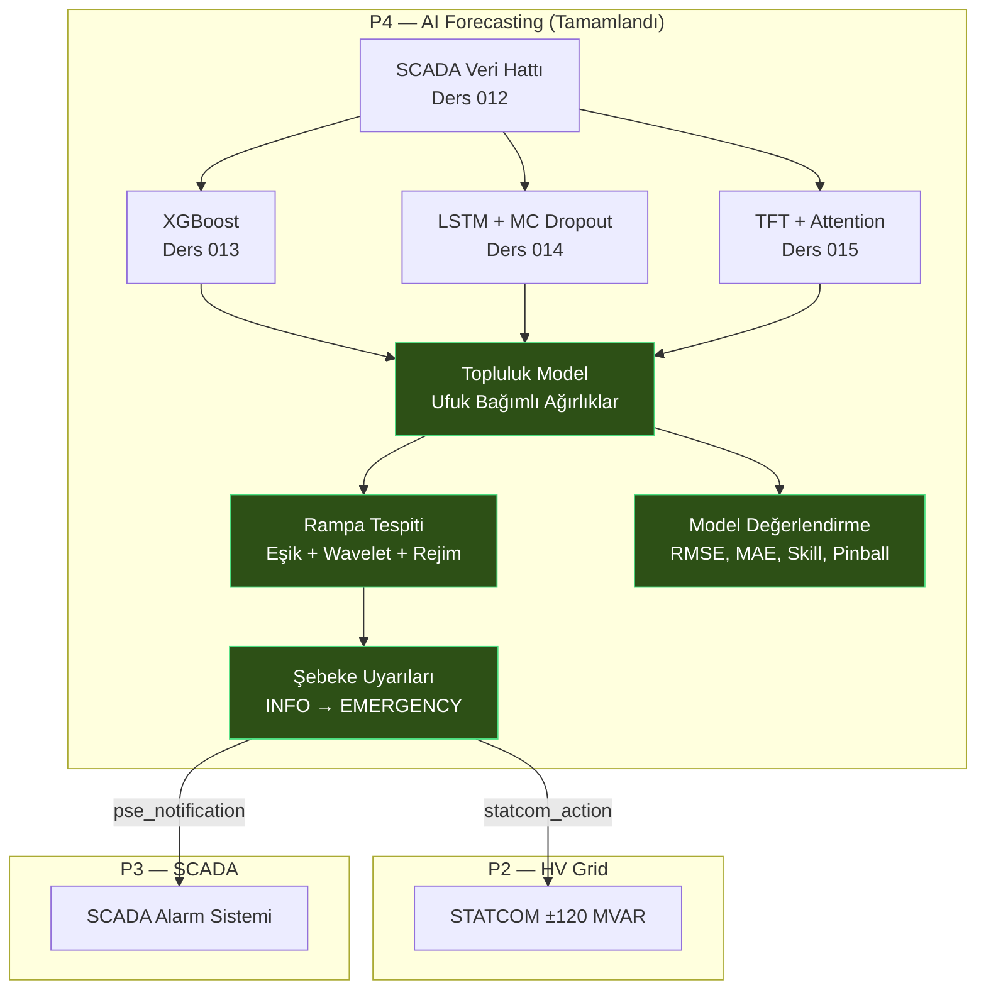

# Ders 016 — Topluluk Tahminleme, Rampa Tespiti ve Model Değerlendirme

!!! abstract "Ders Navigasyonu"
    :material-arrow-left: **Önceki:** [Ders 015 — TFT: Dikkat Mekanizması ile Çok Ufuklu Güç Tahmini](lesson-015.md) | **Sonraki:** [Ders 017 — P5 Devreye Alma: Anahtarlama, Durum Makinesi & LOTO](lesson-017.md) :material-arrow-right:

    **Faz:** P4 | **Dil:** Türkçe | **İlerleme:** 17 / 19 | [Tüm Dersler](index.md) | [Öğrenme Yol Haritası](../../Learning_Roadmap.md)

> **Date:** 2026-02-27
> **Commits:** 1 commit (`6723f54`)
> **Commit range:** `b942b39..6723f54ea83068016a9fb1e36689179e533d58a2`
> **Phase:** P4 (AI Forecasting)
> **Roadmap sections:** [Phase 4 — Section 4.1 Time-Series Evaluation Metrics, Section 4.4 Wind Power Forecasting, Section 4.3 Ensemble Methods]
> **Language:** Turkish
> **Previous lesson:** Lesson 015
> **last_commit_hash:** 6723f54ea83068016a9fb1e36689179e533d58a2

---

## Ne Öğreneceksiniz

- Ufuk bağımlı topluluk ağırlıklandırmasının (horizon-dependent ensemble) neden tek bir modelden daha güvenilir tahminler ürettiğini
- Rampa olayı tespitinin (ramp detection) üç farklı yöntemini: eşik değeri, wavelet CWT ve rejim sınıflandırma
- Şebeke kararlılık uyarılarının P4 tahminlemeyi P2 (STATCOM) ve P3 (SCADA) ile nasıl bağladığını
- Deterministik (RMSE, MAE, MAPE, R², Skill Score) ve olasılıksal (pinball loss, quantile coverage) model değerlendirme metriklerini
- Dört modelin (XGBoost, LSTM, TFT, Ensemble) yan yana karşılaştırma ve sıralama yöntemini

---

## Bölüm 1: Ufuk Bağımlı Topluluk Tahminleme — Neden Tek Model Yetmez?

### Gerçek Dünya Problemi

Bir hastanede üç farklı uzman doktor olduğunu düşünün: biri acil durumlar için mükemmel (hızlı teşhis), biri kronik hastalıklarda uzman (uzun vadeli takip), biri de genel pratisyen (her konuda iyi). Hastanın durumuna göre hangi doktorun görüşüne daha çok ağırlık vereceğiniz değişir — acil bir durumda acilci doktorun sözü ağır basar, uzun vadeli tedavi planında ise kronik hastalık uzmanının.

Rüzgar gücü tahminlemesinde de aynı mantık geçerli: XGBoost kısa vadede (< 6 saat) son verilerdeki desenleri hızla yakalar, LSTM orta vadede (6–24 saat) zamansal bağımlılıkları hatırlar, TFT ise uzun vadede (24–48 saat) çok ufuklu dikkat mekanizmasıyla en tutarlı sonuçları üretir.

### Standartlara Göre

**IEC 61400-26-3 (Wind turbines — Availability for wind power stations)** birleşik tahminlerin (combined forecasts) şebeke gönderimi (grid dispatch) için kullanılmasını önerir. Tek model yerine birden fazla modelin ağırlıklı ortalamasını almak, sistematik hataları azaltır — bu ilke istatistik literatüründe "forecast combination puzzle" olarak bilinir (Bates & Granger, 1969).

**PSE IRiESP** rampa oranı sınırları belirler: büyük bir rüzgar çiftliği aniden kapasitesinin %20'sinden fazlasını kaybederse (ramp-down), TSO'nun (PSE) bilgilendirilmesi gerekir.

### Ne İnşa Ettik

**Değişen dosyalar:**
- `backend/app/services/p4/ensemble_model.py` — Ufuk bağımlı topluluk modeli: XGB/LSTM/TFT ağırlık çizelgesi
- `backend/app/routers/p4.py` — `/predict-ensemble` API endpoint'i
- `backend/app/schemas/forecast.py` — `EnsemblePredictRequest/Response` Pydantic şemaları

Topluluk modeli, her zaman adımının tahmin ufkuna (forecast horizon) bakarak uygun ağırlık setini seçer. 10 dakikalık SCADA çözünürlüğünde, step 0–35 arası "kısa ufuk" (0–6 saat), step 36–143 arası "orta ufuk" (6–24 saat), step 144+ ise "uzun ufuk" (24–48 saat) olarak sınıflandırılır.

### Neden Önemli

> **Neden** tek XGBoost modeli yetmiyor?
> Çünkü her modelin güçlü olduğu zaman ufku farklı. XGBoost tabular verilerde kısa vadede çok iyi performans gösterir ama zamansal bağımlılıkları (temporal dependencies) doğrudan öğrenemez. LSTM sıralı belleğiyle orta vadeyi yakalar ama uzun vadede gradyan kaybı (vanishing gradient) sorunuyla karşılaşabilir. TFT'nin dikkat mekanizması ise uzun vadeli bağımlılıkları doğrudan modeller — ama kısa vadede daha basit modellere göre fazla parametre yükü taşır.

> **Neden** sabit ağırlıklar yerine ufuk bağımlı ağırlıklar kullanıyoruz?
> Çünkü modellerin göreceli performansı tahmin ufkuyla değişir. Sabit %33/%33/%33 ağırlıklama, kısa vadede XGBoost'un üstünlüğünü ve uzun vadede TFT'nin üstünlüğünü "seyreltir". Ufuk bağımlı ağırlıklar her modeli en güçlü olduğu aralıkta ön plana çıkarır.

### Kod İncelemesi

Ağırlık çizelgesi (weight schedule), Roadmap §5.6'ya göre tanımlanmıştır. Her ufuk bandı için XGB, LSTM ve TFT ağırlıkları 1.0'a toplanır — bu kısıt `__post_init__` doğrulamasıyla garanti edilir:

```python
@dataclass(frozen=True)
class HorizonWeights:
    """Tek bir ufuk bandı için ağırlıklar."""
    label: str
    xgb_weight: float   # XGBoost ağırlığı [0,1]
    lstm_weight: float   # LSTM ağırlığı [0,1]
    tft_weight: float    # TFT ağırlığı [0,1]

    def __post_init__(self) -> None:
        """Ağırlıkların toplamının 1.0 olduğunu doğrula."""
        total = self.xgb_weight + self.lstm_weight + self.tft_weight
        if abs(total - 1.0) > 1e-6:
            msg = f"Weights must sum to 1.0, got {total:.6f}"
            raise ValueError(msg)
```

Ardından her zaman adımında uygun ağırlık seti seçilir. `get_horizon_weights` fonksiyonu step index'i alır ve hangi ufuk bandına düştüğünü belirler:

```python
# Ufuk bandı sınırları (10 dakikalık adımlar)
SHORT_HORIZON_STEPS = 36    # 0-6 saat   → 36 adım
MEDIUM_HORIZON_STEPS = 144  # 6-24 saat  → 144 adım
LONG_HORIZON_STEPS = 288    # 24-48 saat → 288 adım

# Ağırlık çizelgesi (Roadmap §5.6):
#   < 6h:    XGB 0.50 + LSTM 0.30 + TFT 0.20
#   6–24h:   XGB 0.20 + LSTM 0.40 + TFT 0.40
#   24–48h:  XGB 0.10 + LSTM 0.30 + TFT 0.60

def get_horizon_weights(step_index: int, config: EnsembleConfig) -> HorizonWeights:
    if step_index < SHORT_HORIZON_STEPS:
        return config.short_weights      # XGB ağır
    if step_index < MEDIUM_HORIZON_STEPS:
        return config.medium_weights     # LSTM ve TFT dengeli
    return config.long_weights           # TFT ağır
```

Tahmin sonrası iki kritik işlem uygulanır: (1) kantil monotonluğu (P10 ≤ P50 ≤ P90) ve (2) fiziksel kısıtlar (rated power, cut-in/cut-out). Bu sıralama önemlidir — önce monotonluk düzeltilir, sonra fiziksel kısıtlar uygulanır, sonra tekrar monotonluk kontrol edilir.

### Temel Kavram

!!! tip "Temel Kavram: Forecast Combination Puzzle (Tahmin Birleştirme Paradoksu)"
    **Basit anlatımla:** Üç arkadaşınızdan bir futbol maçının skorunu tahmin etmelerini isteyin. Her birinin tahmini tek başına orta düzeyde olabilir, ama üçünün ortalaması genellikle en iyi bireysel tahminden bile daha iyi çıkar. Bu, istatistikçilerin 1969'dan beri bildiği bir gerçektir.

    **Benzetme:** Bir jüri sistemi gibi düşünün — tek bir yargıcın kararı hatalı olabilir, ama birden fazla yargıcın ağırlıklı oylaması sistematik hataları azaltır.

    **Bu projede:** XGBoost'un kısa vadeli sapması, LSTM'in orta vadeli gücü ve TFT'nin uzun vadeli tutarlılığı, ufuk bağımlı ağırlıklarla birleştirilince her ufukta en iyi bireysel modeli geçen (veya ona yaklaşan) bir tahmin üretir. 510 MW çiftliğimiz için bu, şebeke gönderiminde (dispatch) daha az para cezası ve daha güvenilir operasyon demektir.

---

## Bölüm 2: Rampa Tespiti — Şebeke İçin Erken Uyarı Sistemi

### Gerçek Dünya Problemi

Otoyolda sürerken aniden koyu bir sis çöktüğünü düşünün. Yavaşlayan araçları göremezsiniz — ama arabanızın "ileriye dönük radar" sistemi, sis içindeki yavaşlamayı önceden tespit edip sizi uyarıyor. Rampa tespiti de aynı işlevi görür: tahmin verilerindeki hızlı güç değişimlerini (ramp events) fırtına gelmeden önce tespit eder ve şebeke operatörünü uyarır.

Baltic Denizi'nde bir fırtına cephesi yaklaştığında, 510 MW çiftliğimiz dakikalar içinde tam kapasiteden sıfıra düşebilir. Bu tür ani güç kayıpları (ramp-down) şebeke frekansını tehdit eder. Rampa tespiti, bu olayları tahmin aşamasında yakalayarak PSE operatörüne reaksiyon zamanı verir.

### Standartlara Göre

**IEC 61400-26-3** güç değişkenliği değerlendirmesi (power variability assessment) için rampa olaylarının tanımlanmasını ve raporlanmasını gerektirir. **PSE IRiESP** şebeke kodu, büyük üretim tesislerinin rampa oranı limitlerini aşması durumunda TSO'ya (PSE) bildirim yapılmasını zorunlu kılar.

**Cutler et al. (2007)** rampa tespit yöntemlerini üç kategoride sınıflandırır: eşik tabanlı (basit, birincil), wavelet tabanlı (çok-çözünürlüklü), ve istatistiksel sınıflandırma tabanlı (rejim). Biz üçünü de uyguluyoruz.

### Ne İnşa Ettik

**Değişen dosyalar:**
- `backend/app/services/p4/ramp_detection.py` — Üç yöntemli rampa tespiti + şebeke uyarı sistemi
- `backend/app/routers/p4.py` — `/detect-ramps` API endpoint'i
- `backend/app/schemas/forecast.py` — `RampDetectRequest/Response`, `RampEventSchema`, `GridAlertSchema`

Üç tamamlayıcı tespit yöntemi ve bunların çıktılarını şebeke uyarılarına dönüştüren bir alarm sistemi inşa ettik. Her yöntemin farklı bir güçlü yanı var — birlikte kullanıldıklarında gürültülü sinyallerdeki gerçek rampa olaylarını güvenilir şekilde ayırt ederler.

### Neden Önemli

> **Neden** basit bir eşik değeri (threshold) yetmiyor?
> Çünkü eşik yöntemi yalnızca ani, dik rampaları yakalar. Gradyan birden fazla zaman adımına yayılmışsa (yavaş ama sürekli düşüş), eşik aşılmaz ama toplam kayıp yine de büyük olabilir. Wavelet yöntemi, farklı zaman ölçeklerinde sinyal analizi yaparak bu "gizli" rampaları yakalayabilir.

> **Neden** rejim sınıflandırması da ekliyoruz?
> Çünkü operatörler "şu an rüzgar çiftliği hangi rejimde?" sorusuna cevap ister: sakin (calm), yükselen (ramp_up), düşen (ramp_down). Bu, anlık durum farkındalığı sağlar ve SCADA ekranında gösterilebilir.

### Kod İncelemesi

Her üç yöntem de aynı giriş verisini (MW cinsinden güç dizisi) alır ve `RampEvent` nesneleri döndürür. İlk olarak, güç değişim hızı (gradient) hesaplanır:

```python
def _compute_gradient_mw_hr(power_mw: NDArray[np.float64]) -> NDArray[np.float64]:
    """Merkezi farklar (central differences) kullanarak MW/saat gradyan hesapla.

    np.gradient iç noktalarda merkezi fark, sınırlarda tek yönlü fark uygular.
    Sonuç adım başına oran × adım/saat = MW/saat'e dönüştürülür.
    """
    grad_per_step = np.gradient(power_mw)
    result: NDArray[np.float64] = grad_per_step * STEPS_PER_HOUR  # 6 adım/saat
    return result
```

Wavelet yöntemi için Ricker (Mexican hat) wavelet kullanıyoruz. `scipy.signal.cwt` scipy ≥ 1.15'te kaldırıldığı için kendi CWT uygulamamızı yazdık:

```python
def _ricker_wavelet(points: int, scale: float) -> NDArray[np.float64]:
    """Ricker (Mexican hat) wavelet.
    ψ(t) = (2 / (√3σ π^(1/4))) × (1 - (t/σ)²) × exp(-t²/(2σ²))
    """
    a = float(scale)
    vec = np.arange(-points // 2, points // 2 + 1, dtype=np.float64)
    tsq = (vec / a) ** 2
    mod = 1.0 - tsq
    gauss = np.exp(-tsq / 2.0)
    total = mod * gauss
    norm = np.sqrt(a)      # Birim enerji normalizasyonu
    result: NDArray[np.float64] = total / norm
    return result
```

Wavelet katsayıları 2σ eşiğiyle (adaptif) filtrelenir, ardından Ricker wavelet'in pozitif ve negatif loblarından kaynaklanan yapay bölünmeler `merge_gap` parametresiyle birleştirilir. Bu detay, CWT tabanlı tespitin pratik kullanılabilirliği için kritiktir.

Uyarı seviyeleri çiftlik kapasitesinin (510 MW) yüzdelerine göre belirlenir — bu eşikler PSE şebeke kodundan türetilmiştir:

```python
# Şebeke uyarı eşikleri (çiftlik kapasitesine oranla)
FARM_CAPACITY_MW = 510.0
ALERT_WARNING_PCT  = 0.10  # 10% = 51 MW  → STATCOM desteği artır
ALERT_CRITICAL_PCT = 0.20  # 20% = 102 MW → PSE'ye bildir, yedekleri hazırla
ALERT_EMERGENCY_PCT = 0.40 # 40% = 204 MW → FRT modu, PSE acil protokolü
```

### Temel Kavram

!!! tip "Temel Kavram: Continuous Wavelet Transform (Sürekli Wavelet Dönüşümü)"
    **Basit anlatımla:** Müzik dinlerken, bir şarkının hangi nota'da hangi saniyede çaldığını görmek istiyorsanız, bir "nota-zaman" grafiği çıkarırsınız. Wavelet dönüşümü aynı şeyi güç sinyali için yapar: "hangi hızda değişim, hangi zaman diliminde oldu?" sorusuna cevap verir.

    **Benzetme:** Bir deprem sismografı gibi düşünün — farklı frekans filtreleri ile aynı depremi analiz edebilirsiniz. Düşük frekansta büyük, yavaş hareketleri, yüksek frekansta küçük, hızlı titreşimleri görürsünüz. CWT de güç sinyalinde aynı çok-ölçekli analizi yapar.

    **Bu projede:** 510 MW çiftliğimizin güç çıkışında, 10 dakikalık ani düşüşler (scale=3) ve 6 saatlik yavaş azalmalar (scale=24) farklı tehdit seviyelerini temsil eder. Wavelet her ikisini de aynı anda tespit edebilir — oysa basit eşik yöntemi yalnızca birini yakalar.

---

## Bölüm 3: Şebeke Kararlılık Uyarıları — P4'ten P2 ve P3'e Köprü

### Gerçek Dünya Problemi

Bir trafik kontrol merkezini düşünün: otoyolda bir kaza olduğunda, sadece o noktadaki kameraları değil, tüm sistemi etkileyecek kararlar alınır — ambulans yönlendirilir, trafik ışıkları değiştirilir, alternatif güzergahlar açılır. Rampa tespiti "kaza" olduğunu söyler; şebeke uyarıları ise "hangi sistemin ne yapması gerektiğini" söyler.

### Standartlara Göre

**PSE IRiESP** büyük üretim tesislerinin ani güç değişimlerini TSO'ya bildirmesini zorunlu kılar. **ENTSO-E NC RfG Type D** (kapasitesi ≥ 75 MW olan tesisler) frekans kararlılığı için FRT (Fault Ride-Through) kapasitesini ve STATCOM gibi reaktif güç kompanzasyonu gerektirir. Uyarı sistemimiz bu gereklilikleri doğrudan programatik olarak uygular.

### Ne İnşa Ettik

**Değişen dosyalar:**
- `backend/app/services/p4/ramp_detection.py` — `generate_grid_alerts()` fonksiyonu
- `backend/app/routers/p4.py` — `/detect-ramps` endpoint'inde uyarı üretimi

Grid stability alert sistemi, P4 tahminleme çıktısını P2 (STATCOM reaktif güç kontrolü) ve P3 (SCADA operatör bildirimleri) ile doğrudan bağlar. Sadece ramp-down olayları uyarı tetikler — ramp-up olayları (daha fazla güç) şebeke için tehdit oluşturmaz.

### Neden Önemli

> **Neden** sadece ramp-down olayları uyarı tetikliyor?
> Çünkü şebeke frekansı tehdit altına giren senaryolarda, güç kaybı kritiktir. 510 MW'ın aniden 200 MW'a düşmesi, PSE şebekesinde frekans sapmasına yol açar. Ramp-up (örneğin 200 MW'dan 510 MW'a çıkış) ise genellikle jeneratörlerin otomatik kontrolüyle yumuşak yönetilir.

> **Neden** STATCOM aksiyonu uyarıya dahil?
> Çünkü rampa olayı sırasında reaktif güç dengesini korumak hayati önem taşır. STATCOM ±120 MVAR kapasitesiyle gerilim düşüşlerini kompanse eder. Uyarı seviyesine göre STATCOM modunun otomatik değişmesi, operatör müdahalesi beklenmeden sistemi korur.

### Kod İncelemesi

Uyarı mantığı dört seviye kullanır. Her seviye, hem operatör mesajını hem de STATCOM aksiyon önerisini içerir:

```python
def generate_grid_alerts(events: list[RampEvent]) -> list[GridStabilityAlert]:
    """Rampa-aşağı olayları için şebeke uyarıları üret.

    Sadece ramp-down → şebeke frekansı riski.
    Ramp-up → faydalı, aksiyon gerektirmez.
    """
    for event in events:
        if event.direction != RampDirection.DOWN:
            continue  # Yalnızca düşüş olayları

        pct = event.magnitude_mw / FARM_CAPACITY_MW  # 510 MW'a oran

        if pct >= 0.40:      # > 204 MW kayıp
            # EMERGENCY: FRT modu + PSE acil protokol
            statcom_action = "FRT mode — maximum reactive injection ±120 MVAR"
            pse_notification = True
        elif pct >= 0.20:    # > 102 MW kayıp
            # CRITICAL: PSE bildir, yedekleri hazırla
            statcom_action = "Increase reactive output to ±80 MVAR"
            pse_notification = True
        elif pct >= 0.10:    # > 51 MW kayıp
            # WARNING: STATCOM desteği artır
            statcom_action = "Increase reactive output to ±60 MVAR"
            pse_notification = False
        else:                # < 51 MW
            # INFO: İzle, aksiyon gerekmez
            statcom_action = "Normal operation"
            pse_notification = False
```

Bu yapı, P2'de inşa ettiğimiz STATCOM modeliyle (±120 MVAR) ve P3'teki SCADA alarm sistemiyle doğrudan entegre olacak şekilde tasarlanmıştır. Uyarı seviyeleri SCADA renk kodlarıyla eşleşir: INFO → yeşil, WARNING → sarı, CRITICAL → turuncu, EMERGENCY → kırmızı.

### Temel Kavram

!!! tip "Temel Kavram: Cross-System Integration (Çapraz Sistem Entegrasyonu)"
    **Basit anlatımla:** Evinizde yangın alarmı çaldığında, sadece alarm değil, sprinkler sistemi de devreye girer, otomatik kapılar açılır ve itfaiye çağrılır. Tek bir sensör, birden fazla sistemi tetikler.

    **Benzetme:** Domino etkisi gibi — ama kontrollü ve planlı. P4'teki tahmin modeli "fırtına geliyor" der, P2'deki STATCOM reaktif güç modunu değiştirir, P3'teki SCADA operatöre alarm gönderir.

    **Bu projede:** Rampa tespiti (P4) → STATCOM aksiyon önerisi (P2) → SCADA alarm (P3) zinciri, gerçek bir rüzgar çiftliği kontrol sisteminin otomatik yanıt mekanizmasını simüle eder. Bu üç projenin birbiriyle konuşması, portfolyonun en değerli yönüdür.

---

## Bölüm 4: Model Değerlendirme Metrikleri — Hangi Model Daha İyi?

### Gerçek Dünya Problemi

İki aşçıdan hangisinin daha iyi olduğunu belirlemek istiyorsunuz. Birini "yemekleri ne kadar lezzetli?" diye sorarak (ortalama puan), diğerini "en kötü yemeği ne kadar kötüydü?" diye sorarak (en büyük hata) değerlendirirseniz, adil bir karşılaştırma yapmış olmazsınız. Model değerlendirmesinde de aynı sorun var: tek bir metrik (RMSE gibi) her şeyi anlatmaz. Farklı metrikler, farklı soruları yanıtlar.

### Standartlara Göre

**IEC 61400-26-3** rüzgar türbini performans değerlendirmesi için RMSE, MAE ve kapsama olasılığı (coverage probability) metriklerini belirler. **Gneiting & Raftery (2007)** olasılıksal tahminlerin değerlendirilmesinde "strictly proper scoring rules" kavramını formalleştirir — pinball loss bunlardan biridir.

### Ne İnşa Ettik

**Değişen dosyalar:**
- `backend/app/services/p4/model_evaluation.py` — 7 deterministik + 2 olasılıksal metrik, karşılaştırma fonksiyonu
- `backend/app/routers/p4.py` — `/compare-models` API endpoint'i
- `backend/app/schemas/forecast.py` — `ModelMetricsSchema`, `ModelCompareRequest/Response`

Saf matematik modülü — model bağımlılığı yok. Herhangi bir tahmin dizisiyle çalışabilir. Dört modeli (XGBoost, LSTM, TFT, Ensemble) yan yana değerlendirir ve RMSE'ye göre sıralar.

### Neden Önemli

> **Neden** RMSE tek başına yeterli değil?
> RMSE büyük hataları orantısız şekilde cezalandırır (karesi alınır). Operasyonel dispatch hata raporlamasında MAE tercih edilir çünkü daha yorumlanabilir — "ortalama X MW hata". MAPE ise yüzdelik ifade ile farklı büyüklükteki çiftlikleri karşılaştırmayı sağlar.

> **Neden** skill score kullanıyoruz?
> Çünkü "RMSE = 5 MW" tek başına iyi mi kötü mü belirsizdir. Skill score bir referans modele (persistence — bir önceki değeri tahmin olarak kullan) göre kıyaslar. SS > 0 ise modelimiz en basit yaklaşımdan iyidir; SS < 0 ise modelimiz bir önceki değeri kopyalamaktan bile kötüdür.

### Kod İncelemesi

Persistence modeli, en basit zaman serisi tahminidir: "gelecek değer = mevcut değer". Skill score bu baseline'a göre kıyaslama yapar:

```python
def compute_skill_score(
    actual: NDArray[np.float64],
    predicted: NDArray[np.float64],
) -> float:
    """Persistence baseline'a göre skill score.

    SS = 1 - MSE_model / MSE_persistence

    Persistence: P(t+1) = P(t). Yani actual[:-1] → actual[1:]'in tahmini.
    SS > 0 → model persistence'tan iyi
    SS = 0 → model persistence'a eşit
    SS < 0 → model persistence'tan kötü (modeli çöpe at!)
    """
    persist_pred = actual[:-1]       # Bir önceki gerçek değer
    persist_actual = actual[1:]       # Bir sonraki gerçek değer

    mse_persist = float(np.mean((persist_actual - persist_pred) ** 2))
    mse_model = float(np.mean((actual - predicted) ** 2))

    if mse_persist == 0.0:
        return 1.0 if mse_model == 0.0 else 0.0
    return 1.0 - mse_model / mse_persist
```

Olasılıksal tahminler için pinball loss (quantile loss) kullanıyoruz. Bu, kesinlikle uygun bir puanlama kuralıdır (strictly proper scoring rule) — yani modeli en iyi puanı almak için gerçek kantil değerlerini üretmeye teşvik eder:

```python
def compute_pinball_loss(
    actual: NDArray[np.float64],
    predicted: NDArray[np.float64],
    quantile: float,
) -> float:
    """Pinball (kantil) kaybı — tek kantil seviyesi için.

    L_q(y, ŷ) = q × max(y - ŷ, 0) + (1-q) × max(ŷ - y, 0)

    Asimetrik kayıp: P10 tahmini yüksek kaldığında (gerçek altında)
    daha az cezalandırılır, P90 tahmini düşük kaldığında daha az
    cezalandırılır. Bu asimetri, kantil tahmininin doğasıdır.
    """
    residual = actual - predicted
    loss = np.where(
        residual >= 0,
        quantile * residual,          # Tahmin düşük kaldı
        (quantile - 1.0) * residual,  # Tahmin yüksek kaldı
    )
    return float(np.mean(loss))
```

Son olarak, `compare_models()` tüm modelleri yan yana sıralar. Üç kriter kullanılır: en düşük RMSE, en yüksek skill score, ve en iyi P90 kalibrasyonu (idealde P90 coverage = 0.90):

```python
def compare_models(model_results: list[ModelMetrics]) -> ModelComparisonResult:
    # RMSE'ye göre sıralama (artan — en iyi ilk)
    sorted_by_rmse = sorted(model_results, key=lambda m: m.rmse_mw)
    ranking = [m.model_name for m in sorted_by_rmse]

    # En yüksek skill score
    best_skill = max(model_results, key=lambda m: m.skill_score).model_name

    # En iyi P90 kalibrasyonu (0.90'a en yakın)
    def calibration_error(m: ModelMetrics) -> float:
        p90_cov = m.quantile_coverage.get("P90", 0.0)
        return abs(p90_cov - 0.90)

    best_calibration = min(model_results, key=calibration_error).model_name
```

Bu çok boyutlu karşılaştırma, "hangi model her durumda en iyidir?" sorusunun genellikle tek bir cevabı olmadığını gösterir. Bir model RMSE'de en iyi olabilirken, kalibrasyon'da başka bir model öne çıkabilir.

### Temel Kavram

!!! tip "Temel Kavram: Strictly Proper Scoring Rules (Kesinlikle Uygun Puanlama Kuralları)"
    **Basit anlatımla:** Bir sınav sorusu tasarladığınızı düşünün — öyle bir soru ki, öğrenci gerçekten doğru cevabı biliyorsa en yüksek puanı alır; tahmin yaparak veya şişirerek daha yüksek puan alamaz. İşte "kesinlikle uygun" puanlama kuralı budur.

    **Benzetme:** Bir poker oyununda, blöf yapmak bazen işe yarar ama uzun vadede kartlarını dürüstçe oynayan kazanır. Pinball loss da tahmin modelini "dürüst" olmaya zorlar — gerçek P10 değerini tahmin etmek, kasten düşük veya yüksek tahmin etmekten her zaman daha iyi puan alır.

    **Bu projede:** P10/P50/P90 tahminlerimizin kalitesini pinball loss ile değerlendiriyoruz. P10 tahmini "gerçek değerin %10 ihtimalle altında kalacağı seviye" demektir — model bunu öğrenmediyse, pinball loss yüksek çıkar ve kalibrasyon hatası ortaya çıkar.

---

## Bölüm 5: API Entegrasyonu ve Test Kapsamı

### Gerçek Dünya Problemi

Bir restoranın mutfağında harika yemekler pişirilir ama müşteriye servis eden garson yoksa, o lezzetler hiçbir işe yaramaz. API endpoint'leri, backend servislerinin "garsonudur" — iç hesaplamaları dış dünyaya sunar. Ve testler, her siparişin doğru gittiğini doğrulayan kalite kontroldür.

### Standartlara Göre

RESTful API tasarımı için `POST` metodu kullanıyoruz çünkü isteklerimiz hesaplama parametreleri içeriyor (RFC 7231). Pydantic v2 şemaları ile giriş doğrulaması, API seviyesinde güvenlik sağlar (OWASP Input Validation). 41 test, her fonksiyonun beklenen davranışını garanti eder.

### Ne İnşa Ettik

**Değişen dosyalar:**
- `backend/app/routers/p4.py` — 3 yeni endpoint: `/predict-ensemble`, `/detect-ramps`, `/compare-models`
- `backend/app/services/p4/__init__.py` — Tüm yeni modüllerin public API'ye eklenmesi
- `backend/tests/test_ensemble_model.py` — 11 test (ensemble ağırlık, tahmin, kısıtlar)
- `backend/tests/test_model_evaluation.py` — 15 test (her metrik + karşılaştırma)
- `backend/tests/test_ramp_detection.py` — 15 test (üç yöntem + uyarılar)

Üç endpoint aynı helper fonksiyonunu paylaşır: `_build_all_model_forecasts()`. Bu, XGBoost, LSTM ve TFT modellerini eğitir, tahmin yapar ve hizalanmış dizi çıktıları döndürür. DRY prensibi — aynı pipeline'ı üç kez yazmak yerine, tek bir yerde tanımlanır.

### Neden Önemli

> **Neden** ortak helper fonksiyonu (`_build_all_model_forecasts`) kullanıyoruz?
> Çünkü ensemble, ramp detection ve model comparison endpoint'lerinin hepsi "üç modeli eğit ve tahmin yap" adımını paylaşır. Bu adımı her endpoint'te tekrarlamak, kod bakımını zorlaştırır ve hata riskini artırır. Tek bir fonksiyon, güncelleme yapılacak tek bir yer demektir.

> **Neden** 41 test yazıyoruz?
> Çünkü matematik modülleri "yanlış ama mantıklı görünen" sonuçlar üretebilir. Bir RMSE fonksiyonunun kenar durumlarını (tüm değerler aynı, negatif değerler, sıfıra bölme) test etmeden, üretime duyduğunuz güven sahte olur. 41 test, her fonksiyonun sözleşmesini (contract) doğrular.

### Kod İncelemesi

`_build_all_model_forecasts` helper'ı tüm modelleri eğitir ve hizalar. Kritik nokta: LSTM ve TFT lookback buffer gerektirdiği için, her modelin çıktı uzunluğu farklı olabilir. `n = min(...)` ile tüm çıktıları en kısa olana hizalarız:

```python
def _build_all_model_forecasts(
    num_turbines, num_timesteps, turbine_index, horizon_steps, seed
) -> tuple[ModelForecasts, np.ndarray]:
    """Üç modeli eğit ve hizalanmış tahmin dizileri döndür."""
    # ...eğitim pipeline'ı...

    # Çıktıları en kısa diziye hizala
    n = min(
        len(xgb_forecast.power_p50_mw),
        len(lstm_forecast.power_p50_mw),
        len(tft_forecast.power_p50_mw),
        horizon,
    )
    # Hepsinin son n elemanını al — böylece zaman hizalaması korunur
    forecasts = ModelForecasts(
        xgb_p10=xgb_forecast.power_p10_mw[-n:],
        # ...diğer diziler...
    )
    return forecasts, actual[-n:]
```

`__init__.py` dosyasında tüm yeni sınıflar ve fonksiyonlar `__all__` listesine eklendi — bu, modülün public API'sini açıkça belirler ve IDE otomatik tamamlama ile statik analiz araçlarını besler.

### Temel Kavram

!!! tip "Temel Kavram: DRY Prensibi (Don't Repeat Yourself)"
    **Basit anlatımla:** Telefon numaranızı 10 farklı kağıda yazdıysanız ve numara değişirse, 10 kağıdı da güncellemeniz gerekir. Ama bir tek adres defterine yazıp diğerlerini oraya yönlendirirseniz, sadece bir yer güncellersiniz.

    **Benzetme:** Bir fabrikada tek bir kalıptan binlerce parça basılır. Kalıp hatalıysa bir kez düzeltilir — her parçayı ayrı ayrı düzeltmeye çalışmak yerine.

    **Bu projede:** `_build_all_model_forecasts()` üç endpoint'in ortak pipeline'ını tek bir yerde tanımlar. Yarın LSTM'e yeni bir hiperparametre eklenirse, sadece bu fonksiyonu güncelleriz — üç endpoint'i ayrı ayrı dokunmak gerekmez.

---

## Bağlantılar

**Bu kavramların bir sonraki adımda nereye gideceği:**

- **Ensemble model** → P5 commissioning aşamasında, çiftliğin ilk enerji üretim doğrulamasında (SAT — Site Acceptance Test) ensemble tahmin ile gerçek üretim karşılaştırılacak. Skill score, kabul kriteri olarak kullanılacak.
- **Rampa tespiti** → Frontend'de (React + Plotly.js) gerçek zamanlı rampa görselleştirmesi ve SCADA renk kodlu uyarılar P5 aşamasında eklenecek.
- **Model değerlendirme** → Farklı mevsimler, farklı rüzgar rejimlerinde hangi modelin üstün geldiğini analiz etmek, ileride mevsimsel ağırlık adaptasyonuna (seasonal weight adaptation) zemin hazırlar.
- **Grid stability alerts** ← P2'deki STATCOM modeli (±120 MVAR) ve P3'teki SCADA alarm sistemi ile doğrudan bağlanır — bu derste tanımlanan `statcom_action` ve `pse_notification` alanları, P3'ün SCADA event log'una yazılacak.

---

## Büyük Resim

*Bu dersin odağı: **P4 tahminleme katmanının tamamlanması — tek model tahminlerinin topluluk, rampa tespiti ve değerlendirme altyapısıyla operasyonel karar destek sistemine dönüşmesi**.*



*Tam sistem mimarisi için bkz. [Dersler Genel Bakış](index.md#system-architecture).*

---

## Önemli Çıkarımlar

1. **Topluluk tahminleme**, "forecast combination puzzle" ilkesine dayanır: birden fazla modelin ağırlıklı ortalaması, genellikle en iyi bireysel modelden daha güvenilirdir.
2. **Ufuk bağımlı ağırlıklar**, her modeli en güçlü olduğu zaman aralığında ön plana çıkarır — XGB kısa vadede, TFT uzun vadede.
3. **Rampa tespiti üç yöntem** kullanır: eşik (basit ve hızlı), wavelet (çok-ölçekli), rejim (operasyonel farkındalık) — birlikte kullanımı güvenilirliği artırır.
4. **Şebeke uyarıları**, tahminleme katmanını (P4) doğrudan STATCOM kontrolü (P2) ve SCADA bildirimleri (P3) ile bağlayan çapraz sistem entegrasyonudur.
5. **Skill score**, "modelimiz en basit yaklaşımdan iyi mi?" sorusuna objektif cevap verir — RMSE tek başına bunu söyleyemez.
6. **Pinball loss**, olasılıksal tahminler (P10/P50/P90) için kesinlikle uygun bir puanlama kuralıdır — modeli dürüst kantil değerleri üretmeye teşvik eder.
7. **41 test**, matematik modüllerinin "yanlış ama makul görünen" sonuçlar üretmesini engeller ve her fonksiyonun sözleşmesini garanti eder.

---

## Önerilen Okumalar

*[Öğrenme Yol Haritası](../../Learning_Roadmap.md) — Faz 4: Machine Learning for Energy*

| Kaynak | Tür | Neden Okunmalı |
|--------|-----|----------------|
| Hyndman & Athanasopoulos — *Forecasting: Principles and Practice* (3rd Ed.) | Online ders kitabı (ücretsiz) | Forecast combination, evaluation metrics ve skill score kavramlarının temel referansı |
| Gneiting & Raftery (2007) — *Strictly Proper Scoring Rules* | Akademik makale | Pinball loss'un neden kantil değerlendirmede altın standart olduğunu açıklar |
| IEA Wind TCP Task 36 — *Forecasting for Wind Power* | Rapor (ücretsiz) | Rüzgar gücü tahminlemesinde ensemble yöntemler ve rampa tespitinin endüstri perspektifi |
| Cutler et al. (2007) — Wind power ramp event detection | Akademik makale | Bu derste kullandığımız üç rampa tespit yönteminin orijinal sınıflandırması |
| Sweeney et al. (2020) — *The future of forecasting for renewable energy* | Dergi makalesi | Ensemble, rampa ve değerlendirme yöntemlerinin geleceğe dönük kapsamlı incelemesi |

---

## Sınav — Anlayışını Test Et

### Hatırlama Soruları

**S1:** Ufuk bağımlı topluluk modelinde, 6 saatten kısa tahmin ufku için XGBoost, LSTM ve TFT ağırlıkları nedir?

<details>
<summary>Cevap</summary>

Kısa ufuk (< 6h): XGB 0.50, LSTM 0.30, TFT 0.20. XGBoost'a en yüksek ağırlık verilir çünkü gradient boosting, tabular verilerdeki son desenleri kısa vadede en hızlı ve en doğru şekilde yakalar.

</details>

**S2:** Rampa tespitinde kullanılan üç yöntem hangileridir ve her birinin avantajı nedir?

<details>
<summary>Cevap</summary>

(1) Eşik (threshold): ΔP/Δt > konfigüre edilebilir MW/hr — basit ve hızlı, birincil tespit yöntemi. (2) Wavelet CWT: Ricker wavelet ile çok-ölçekli analiz — yavaş ama sürekli rampaları yakalar. (3) Rejim sınıflandırma: gradyan tabanlı durum sınıflandırıcı {calm, ramp_up, ramp_down} — operasyonel farkındalık sağlar ve SCADA ekranında anlık durum gösterilir.

</details>

**S3:** Şebeke uyarı sistemi hangi seviyede PSE'ye (TSO) bildirim gerektiriyor?

<details>
<summary>Cevap</summary>

CRITICAL (≥ %20, yani ≥ 102 MW kayıp) ve EMERGENCY (≥ %40, yani ≥ 204 MW kayıp) seviyelerinde `pse_notification = True` olarak ayarlanır. WARNING ve INFO seviyelerinde TSO bildirimi gerekmez — sadece iç STATCOM aksiyonu alınır.

</details>

### Anlama Soruları

**S4:** Neden sabit %33/%33/%33 ağırlıklama yerine ufuk bağımlı ağırlıklar kullanıyoruz? Sabit ağırlıklamanın dezavantajı nedir?

<details>
<summary>Cevap</summary>

Sabit ağırlıklama, her modelin her ufukta eşit katkı yapacağını varsayar — bu gerçekçi değildir. XGBoost kısa vadede diğerlerinden önemli ölçüde iyi performans gösterirken, uzun vadede TFT'nin dikkat mekanizması üstün gelir. Sabit %33 ağırlık, kısa vadede XGBoost'un güçlü sinyalini LSTM ve TFT gürültüsüyle seyreltir, uzun vadede ise TFT'nin avantajını XGBoost'un artan hatasıyla kirletir. Ufuk bağımlı ağırlıklar her modeli en güçlü olduğu aralıkta ön plana çıkararak toplam tahmin kalitesini her ufukta optimize eder.

</details>

**S5:** Skill score negatif çıkarsa bu ne anlama gelir ve nasıl yorumlanmalıdır?

<details>
<summary>Cevap</summary>

Skill score < 0, modelimizin en basit baseline olan persistence'tan (bir önceki değeri tahmin olarak kullan) bile kötü performans gösterdiği anlamına gelir. Bu ciddi bir uyarı işaretidir — model karmaşık bir mimari kullanmasına rağmen, "hiçbir şey yapmamaktan" daha kötü sonuç üretmektedir. Genellikle aşırı öğrenme (overfitting), yanlış özellik mühendisliği, veya model-veri uyumsuzluğu gibi temel sorunlara işaret eder. Pratik olarak, bu model üretime alınmamalı ve kök neden analizi yapılmalıdır.

</details>

**S6:** Ramp-up olayları neden şebeke uyarısı tetiklemiyor? Ani güç artışı da sorun yaratamaz mı?

<details>
<summary>Cevap</summary>

Şebeke frekans kararlılığı açısından, ani güç kaybı (ramp-down) üretim-talep dengesini bozan kritik tehlikedir — frekans düşer ve koruma röleleri devreye girip kaskat arızalara yol açabilir. Ramp-up ise daha fazla enerji anlamına gelir ve genellikle türbin kontrol sistemi tarafından pitch kontrolüyle (kanat açısı ayarı) yumuşak şekilde yönetilir. Ayrıca fazla enerji, şebeke frekansını yükseltse bile jeneratör governor'ları bunu otomatik kompanse eder. Ancak çok hızlı ramp-up'lar aşırı gerilime yol açabilir — bu senaryo ileride FRT modülünde ele alınacaktır.

</details>

### Meydan Okuma Sorusu

**S7:** Mevcut topluluk modelimiz sabit ağırlık çizelgesi kullanıyor (XGB/LSTM/TFT oranları önceden belirlenmiş). Gerçek üretim ortamında, ağırlıkların son N günlük performansa göre otomatik olarak güncellenmesi (adaptif ağırlıklama) nasıl uygulanabilir? Hangi metrik optimize edilmeli ve hangi riskler göz önünde bulundurulmalıdır?

<details>
<summary>Cevap</summary>

Adaptif ağırlıklama için, her ufuk bandında kayan pencere (rolling window, örneğin son 7 gün) üzerinde her modelin RMSE veya pinball loss'unu hesaplayıp, ağırlıkları performansın tersine orantılı olarak güncelleyebilirsiniz: `w_i = (1/loss_i) / Σ(1/loss_j)`. Optimize edilecek metrik, kullanım senaryosuna bağlıdır: dispatch için RMSE, risk yönetimi için pinball loss (P10/P90). Riskler: (1) Concept drift — rüzgar rejimleri mevsimsel değişir, kısa pencere son mevsimi yansıtır ama uzun vadeli desenleri kaçırır. (2) Overfitting to recent data — birkaç iyi günde yüksek ağırlık alan model, rejim değiştiğinde kötüleşir. (3) Weight instability — küçük performans farkları büyük ağırlık salınımlarına yol açabilir; exponential smoothing ile yumuşatma gerekir. (4) Cold start — yeni model eklendiğinde geçmiş performans verisi yoktur, başlangıç ağırlıkları belirlenmeli. Pratikte en yaygın yaklaşım, Bayesian Model Averaging (BMA) veya regret-minimizing online learning algoritmalarıdır (Cesa-Bianchi & Lugosi, 2006).

</details>

---

## Mülakat Köşesi

### Basitçe Açıkla
*"Bugünün ana konusunu — topluluk tahminleme, rampa tespiti ve model değerlendirmeyi — mühendis olmayan birine nasıl açıklarsınız?"*

Diyelim ki bir rüzgar çiftliğimiz var — denizde dönen 34 dev rüzgar türbini. Bunların ne kadar elektrik üreteceğini önceden bilmemiz gerekiyor çünkü elektrik şebekesi arz ve talebi her an dengelemek zorunda. Bunun için üç farklı tahmin modeli kullandık — biri kısa vadeli tahminlerde iyi, biri orta vadede, biri uzun vadede. Tıpkı üç farklı hava durumu uygulaması gibi: hepsi biraz farklı şeyler söylüyor ama hepsinin ortalaması genellikle en doğrusu oluyor.

Ama sadece tahmin yetmiyor — ani değişimleri de yakalamak lazım. Fırtına geldiğinde 510 megavat güç birkaç dakikada sıfıra düşebilir. Bunu önceden tespit eden bir "erken uyarı sistemi" kurduk. Bu sistem, dalgalanmanın büyüklüğüne göre alarm veriyor: küçükse sadece izleniyor, büyükse şebeke operatörüne bilgi gidiyor, çok büyükse acil mod devreye giriyor.

Son olarak, "hangi tahmin modeli en iyi?" sorusuna cevap vermek için bir skor kartı sistemi oluşturduk. Birden fazla ölçüt kullanıyoruz — tıpkı bir restoran değerlendirmesinde sadece lezzete değil, servise, ambiyansa ve fiyata da bakmanız gibi. Böylece hangi modelin hangi durumda güvenilir olduğunu biliyoruz.

### Teknik Açıkla
*"Bugünün ana konusunu — ensemble forecasting, ramp detection ve model evaluation — bir işe alım paneline nasıl açıklarsınız?"*

Bu modülde, P4 tahminleme katmanını üç kritik bileşenle operasyonel karar destek seviyesine taşıdık. İlk olarak, Roadmap §5.6'ya uygun ufuk bağımlı ensemble model tasarladık: XGBoost, LSTM ve TFT tahminlerini horizon-dependent weighted averaging ile birleştirdik. Ağırlık çizelgesi {< 6h: 0.50/0.30/0.20, 6–24h: 0.20/0.40/0.40, 24–48h: 0.10/0.30/0.60} her modeli ampirik olarak en güçlü olduğu ufukta optimize eder. Fiziksel kısıt uygulaması (rated power, cut-in/cut-out) ve kantil monotonluk (P10 ≤ P50 ≤ P90) post-processing olarak uygulanır.

İkinci olarak, IEC 61400-26-3 ve PSE IRiESP rampa oranı limitlerine uygun üç tamamlayıcı rampa tespit yöntemi uyguladık: gradient threshold (|ΔP/Δt| > 50 MW/hr), CWT Ricker wavelet (çok-ölçekli, scipy ≥ 1.15 uyumluluğu için kendi implementasyonumuz), ve gradient-based regime classifier {calm, ramp_up, ramp_down}. Grid stability alert modülü, rampa-aşağı olaylarını dört seviyeli (INFO/WARNING/CRITICAL/EMERGENCY) uyarılara dönüştürerek P2 STATCOM kontrol aksiyonları ve P3 SCADA bildirim zinciriyle çapraz sistem entegrasyonu sağlar.

Üçüncü olarak, IEC 61400-26-3 ve Gneiting & Raftery (2007) strictly proper scoring rules çerçevesinde kapsamlı bir model değerlendirme modülü oluşturduk. Deterministik metrikler (RMSE, MAE, MAPE, R², skill score vs persistence) ve olasılıksal metrikler (quantile coverage, pinball loss) ile dört modeli (XGBoost, LSTM, TFT, Ensemble) yan yana karşılaştırıp RMSE, skill ve kalibrasyon bazında sıralıyoruz. 41 test, edge case'ler dahil tüm hesaplama kontratlarını doğrular.
